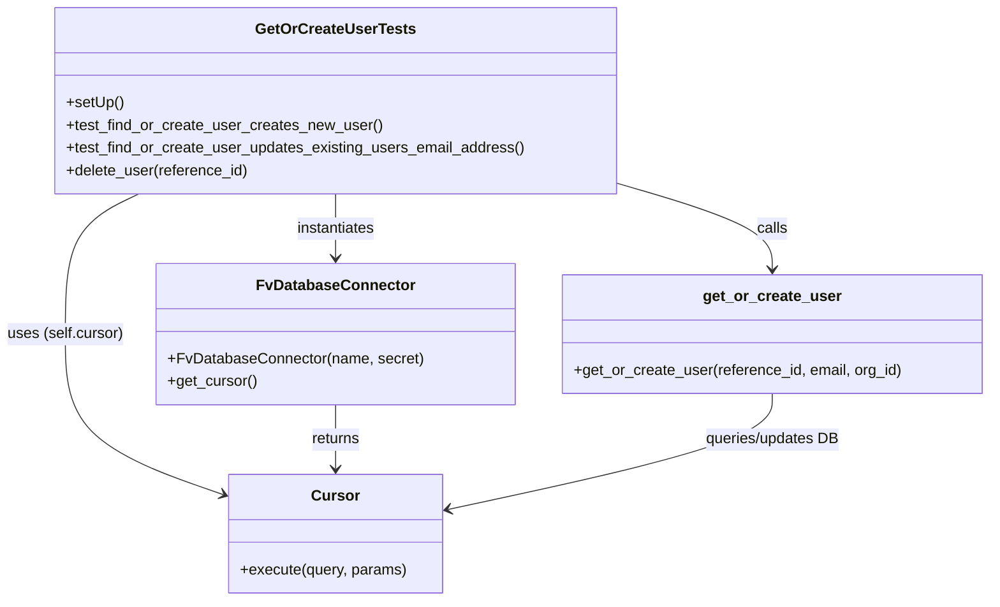
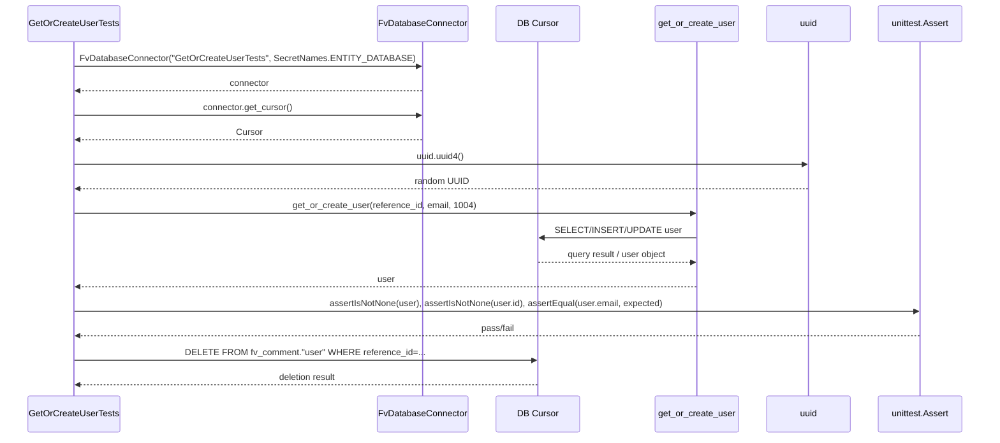

# Diagram: common/comment_service/comment_service_tests/db/test_user.py

> Auto-generated by Obscura crawlers

## Diagram 1

### SVG

<svg id="container" width="1036.2265625" xmlns="http://www.w3.org/2000/svg" class="classDiagram" height="638" viewBox="0 0 1036.2265625 638" role="graphics-document document" aria-roledescription="class"><g><defs><marker id="container_class-aggregationStart" class="marker aggregation class" refX="18" refY="7" markerWidth="190" markerHeight="240" orient="auto"><path d="M 18,7 L9,13 L1,7 L9,1 Z"></path></marker></defs><defs><marker id="container_class-aggregationEnd" class="marker aggregation class" refX="1" refY="7" markerWidth="20" markerHeight="28" orient="auto"><path d="M 18,7 L9,13 L1,7 L9,1 Z"></path></marker></defs><defs><marker id="container_class-extensionStart" class="marker extension class" refX="18" refY="7" markerWidth="190" markerHeight="240" orient="auto"><path d="M 1,7 L18,13 V 1 Z"></path></marker></defs><defs><marker id="container_class-extensionEnd" class="marker extension class" refX="1" refY="7" markerWidth="20" markerHeight="28" orient="auto"><path d="M 1,1 V 13 L18,7 Z"></path></marker></defs><defs><marker id="container_class-compositionStart" class="marker composition class" refX="18" refY="7" markerWidth="190" markerHeight="240" orient="auto"><path d="M 18,7 L9,13 L1,7 L9,1 Z"></path></marker></defs><defs><marker id="container_class-compositionEnd" class="marker composition class" refX="1" refY="7" markerWidth="20" markerHeight="28" orient="auto"><path d="M 18,7 L9,13 L1,7 L9,1 Z"></path></marker></defs><defs><marker id="container_class-dependencyStart" class="marker dependency class" refX="6" refY="7" markerWidth="190" markerHeight="240" orient="auto"><path d="M 5,7 L9,13 L1,7 L9,1 Z"></path></marker></defs><defs><marker id="container_class-dependencyEnd" class="marker dependency class" refX="13" refY="7" markerWidth="20" markerHeight="28" orient="auto"><path d="M 18,7 L9,13 L14,7 L9,1 Z"></path></marker></defs><defs><marker id="container_class-lollipopStart" class="marker lollipop class" refX="13" refY="7" markerWidth="190" markerHeight="240" orient="auto"><circle stroke="black" fill="transparent" cx="7" cy="7" r="6"></circle></marker></defs><defs><marker id="container_class-lollipopEnd" class="marker lollipop class" refX="1" refY="7" markerWidth="190" markerHeight="240" orient="auto"><circle stroke="black" fill="transparent" cx="7" cy="7" r="6"></circle></marker></defs><g class="root"><g class="clusters"></g><g class="edgePaths"><path d="M350.816,206L350.816,212.167C350.816,218.333,350.816,230.667,350.816,242C350.816,253.333,350.816,263.667,350.816,268.833L350.816,274" id="id_GetOrCreateUserTests_FvDatabaseConnector_1" class="edge-thickness-normal edge-pattern-solid relation" style=";;;" data-edge="true" data-et="edge" data-id="id_GetOrCreateUserTests_FvDatabaseConnector_1" data-points="W3sieCI6MzUwLjgxNjQwNjI1LCJ5IjoyMDZ9LHsieCI6MzUwLjgxNjQwNjI1LCJ5IjoyNDN9LHsieCI6MzUwLjgxNjQwNjI1LCJ5IjoyODB9XQ==" marker-end="url(#container_class-dependencyEnd)"></path><path d="M145.83,206L133.061,212.167C120.293,218.333,94.756,230.667,81.987,255.5C69.219,280.333,69.219,317.667,69.219,355C69.219,392.333,69.219,429.667,96.47,458.011C123.721,486.355,178.223,505.709,205.474,515.386L232.725,525.064" id="id_GetOrCreateUserTests_Cursor_2" class="edge-thickness-normal edge-pattern-solid relation" style=";;;" data-edge="true" data-et="edge" data-id="id_GetOrCreateUserTests_Cursor_2" data-points="W3sieCI6MTQ1LjgyOTg3NzA2ODAxNDcsInkiOjIwNn0seyJ4Ijo2OS4yMTg3NSwieSI6MjQzfSx7IngiOjY5LjIxODc1LCJ5IjozNTV9LHsieCI6NjkuMjE4NzUsInkiOjQ2N30seyJ4IjoyMzguMzc4OTA2MjUsInkiOjUyNy4wNzE1NzgxODgwNzMxfV0=" marker-end="url(#container_class-dependencyEnd)"></path><path d="M350.816,430L350.816,436.167C350.816,442.333,350.816,454.667,350.816,466C350.816,477.333,350.816,487.667,350.816,492.833L350.816,498" id="id_FvDatabaseConnector_Cursor_3" class="edge-thickness-normal edge-pattern-solid relation" style=";;;" data-edge="true" data-et="edge" data-id="id_FvDatabaseConnector_Cursor_3" data-points="W3sieCI6MzUwLjgxNjQwNjI1LCJ5Ijo0MzB9LHsieCI6MzUwLjgxNjQwNjI1LCJ5Ijo0Njd9LHsieCI6MzUwLjgxNjQwNjI1LCJ5Ijo1MDR9XQ==" marker-end="url(#container_class-dependencyEnd)"></path><path d="M646.148,195.005L672.992,203.004C699.836,211.004,753.523,227.002,780.367,242.168C807.211,257.333,807.211,271.667,807.211,278.833L807.211,286" id="id_GetOrCreateUserTests_get_or_create_user_4" class="edge-thickness-normal edge-pattern-solid relation" style=";;;" data-edge="true" data-et="edge" data-id="id_GetOrCreateUserTests_get_or_create_user_4" data-points="W3sieCI6NjQ2LjE0ODQzNzUsInkiOjE5NS4wMDUzNDA3NzM4OTg3fSx7IngiOjgwNy4yMTA5Mzc1LCJ5IjoyNDN9LHsieCI6ODA3LjIxMDkzNzUsInkiOjI5Mn1d" marker-end="url(#container_class-dependencyEnd)"></path><path d="M807.211,418L807.211,426.167C807.211,434.333,807.211,450.667,750.862,471.18C694.512,491.693,581.814,516.387,525.464,528.733L469.115,541.08" id="id_get_or_create_user_Cursor_5" class="edge-thickness-normal edge-pattern-solid relation" style=";;;" data-edge="true" data-et="edge" data-id="id_get_or_create_user_Cursor_5" data-points="W3sieCI6ODA3LjIxMDkzNzUsInkiOjQxOH0seyJ4Ijo4MDcuMjEwOTM3NSwieSI6NDY3fSx7IngiOjQ2My4yNTM5MDYyNSwieSI6NTQyLjM2Mzk2ODYwNTgzNTV9XQ==" marker-end="url(#container_class-dependencyEnd)"></path></g><g class="edgeLabels"><g class="edgeLabel" transform="translate(350.81640625, 243)"><g class="label" data-id="id_GetOrCreateUserTests_FvDatabaseConnector_1" transform="translate(-42.9140625, -12)"><foreignObject width="85.828125" height="24">

instantiates

</foreignObject></g></g><g class="edgeLabel" transform="translate(69.21875, 355)"><g class="label" data-id="id_GetOrCreateUserTests_Cursor_2" transform="translate(-61.21875, -12)"><foreignObject width="122.4375" height="24">

uses (self.cursor)

</foreignObject></g></g><g class="edgeLabel" transform="translate(350.81640625, 467)"><g class="label" data-id="id_FvDatabaseConnector_Cursor_3" transform="translate(-26.265625, -12)"><foreignObject width="52.53125" height="24">

returns

</foreignObject></g></g><g class="edgeLabel" transform="translate(807.2109375, 243)"><g class="label" data-id="id_GetOrCreateUserTests_get_or_create_user_4" transform="translate(-16.4453125, -12)"><foreignObject width="32.890625" height="24">

calls

</foreignObject></g></g><g class="edgeLabel" transform="translate(807.2109375, 467)"><g class="label" data-id="id_get_or_create_user_Cursor_5" transform="translate(-72.7109375, -12)"><foreignObject width="145.421875" height="24">

queries/updates DB

</foreignObject></g></g></g><g class="nodes"><g class="node default" id="classId-GetOrCreateUserTests-0" transform="translate(350.81640625, 107)"><g class="basic label-container"><path d="M-295.33203125 -99 L295.33203125 -99 L295.33203125 99 L-295.33203125 99" stroke="none" stroke-width="0" fill="#ECECFF" style=""></path><path d="M-295.33203125 -99 C-76.41498684447285 -99, 142.5020575610543 -99, 295.33203125 -99 M-295.33203125 -99 C-151.7550568410561 -99, -8.178082432112205 -99, 295.33203125 -99 M295.33203125 -99 C295.33203125 -31.033941058363013, 295.33203125 36.932117883273975, 295.33203125 99 M295.33203125 -99 C295.33203125 -51.45992615836487, 295.33203125 -3.919852316729745, 295.33203125 99 M295.33203125 99 C110.98043655010201 99, -73.37115814979597 99, -295.33203125 99 M295.33203125 99 C61.22317450537386 99, -172.88568223925228 99, -295.33203125 99 M-295.33203125 99 C-295.33203125 58.09435860137968, -295.33203125 17.188717202759364, -295.33203125 -99 M-295.33203125 99 C-295.33203125 49.1469088126764, -295.33203125 -0.7061823746471987, -295.33203125 -99" stroke="#9370DB" stroke-width="1.3" fill="none" stroke-dasharray="0 0" style=""></path></g><g class="annotation-group text" transform="translate(0, -75)"></g><g class="label-group text" transform="translate(-80.7265625, -75)"><g class="label" style="font-weight: bolder" transform="translate(0,-12)"><foreignObject width="161.453125" height="24">

GetOrCreateUserTests

</foreignObject></g></g><g class="members-group text" transform="translate(-283.33203125, -27)"></g><g class="methods-group text" transform="translate(-283.33203125, 3)"><g class="label" style="" transform="translate(0,-12)"><foreignObject width="60.421875" height="24">

+setUp()

</foreignObject></g><g class="label" style="" transform="translate(0,12)"><foreignObject width="332.375" height="24">

+test_find_or_create_user_creates_new_user()

</foreignObject></g><g class="label" style="" transform="translate(0,36)"><foreignObject width="485.9375" height="24">

+test_find_or_create_user_updates_existing_users_email_address()

</foreignObject></g><g class="label" style="" transform="translate(0,60)"><foreignObject width="193.84375" height="24">

+delete_user(reference_id)

</foreignObject></g></g><g class="divider" style=""><path d="M-295.33203125 -51 C-119.95814774563266 -51, 55.415735758734684 -51, 295.33203125 -51 M-295.33203125 -51 C-89.13562879112592 -51, 117.06077366774815 -51, 295.33203125 -51" stroke="#9370DB" stroke-width="1.3" fill="none" stroke-dasharray="0 0" style=""></path></g><g class="divider" style=""><path d="M-295.33203125 -27 C-164.31772648803465 -27, -33.3034217260693 -27, 295.33203125 -27 M-295.33203125 -27 C-176.45230583097918 -27, -57.57258041195837 -27, 295.33203125 -27" stroke="#9370DB" stroke-width="1.3" fill="none" stroke-dasharray="0 0" style=""></path></g></g><g class="node default" id="classId-FvDatabaseConnector-1" transform="translate(350.81640625, 355)"><g class="basic label-container"><path d="M-185.37890625 -75 L185.37890625 -75 L185.37890625 75 L-185.37890625 75" stroke="none" stroke-width="0" fill="#ECECFF" style=""></path><path d="M-185.37890625 -75 C-38.7562512851087 -75, 107.8664036797826 -75, 185.37890625 -75 M-185.37890625 -75 C-82.20560699678069 -75, 20.967692256438625 -75, 185.37890625 -75 M185.37890625 -75 C185.37890625 -20.487288159592175, 185.37890625 34.02542368081565, 185.37890625 75 M185.37890625 -75 C185.37890625 -31.60643299884491, 185.37890625 11.787134002310182, 185.37890625 75 M185.37890625 75 C101.96291575295905 75, 18.546925255918097 75, -185.37890625 75 M185.37890625 75 C41.01244307245105 75, -103.3540201050979 75, -185.37890625 75 M-185.37890625 75 C-185.37890625 16.907338266451283, -185.37890625 -41.18532346709743, -185.37890625 -75 M-185.37890625 75 C-185.37890625 29.163414625468143, -185.37890625 -16.673170749063715, -185.37890625 -75" stroke="#9370DB" stroke-width="1.3" fill="none" stroke-dasharray="0 0" style=""></path></g><g class="annotation-group text" transform="translate(0, -51)"></g><g class="label-group text" transform="translate(-79.3046875, -51)"><g class="label" style="font-weight: bolder" transform="translate(0,-12)"><foreignObject width="158.609375" height="24">

FvDatabaseConnector

</foreignObject></g></g><g class="members-group text" transform="translate(-173.37890625, -3)"></g><g class="methods-group text" transform="translate(-173.37890625, 27)"><g class="label" style="" transform="translate(0,-12)"><foreignObject width="267.453125" height="24">

+FvDatabaseConnector(name, secret)

</foreignObject></g><g class="label" style="" transform="translate(0,12)"><foreignObject width="94.640625" height="24">

+get_cursor()

</foreignObject></g></g><g class="divider" style=""><path d="M-185.37890625 -27 C-63.19925741564586 -27, 58.98039141870828 -27, 185.37890625 -27 M-185.37890625 -27 C-85.881551588255 -27, 13.615803073490014 -27, 185.37890625 -27" stroke="#9370DB" stroke-width="1.3" fill="none" stroke-dasharray="0 0" style=""></path></g><g class="divider" style=""><path d="M-185.37890625 -3 C-63.70728057476646 -3, 57.964345100467085 -3, 185.37890625 -3 M-185.37890625 -3 C-72.78067448801757 -3, 39.817557273964866 -3, 185.37890625 -3" stroke="#9370DB" stroke-width="1.3" fill="none" stroke-dasharray="0 0" style=""></path></g></g><g class="node default" id="classId-Cursor-2" transform="translate(350.81640625, 567)"><g class="basic label-container"><path d="M-112.4375 -63 L112.4375 -63 L112.4375 63 L-112.4375 63" stroke="none" stroke-width="0" fill="#ECECFF" style=""></path><path d="M-112.4375 -63 C-49.65698687349643 -63, 13.123526253007142 -63, 112.4375 -63 M-112.4375 -63 C-40.55605969400726 -63, 31.32538061198548 -63, 112.4375 -63 M112.4375 -63 C112.4375 -19.810216859527472, 112.4375 23.379566280945056, 112.4375 63 M112.4375 -63 C112.4375 -33.7034547503806, 112.4375 -4.406909500761209, 112.4375 63 M112.4375 63 C26.741303184012196 63, -58.95489363197561 63, -112.4375 63 M112.4375 63 C44.63197831833605 63, -23.173543363327894 63, -112.4375 63 M-112.4375 63 C-112.4375 19.379516783374527, -112.4375 -24.240966433250946, -112.4375 -63 M-112.4375 63 C-112.4375 14.46114524490386, -112.4375 -34.07770951019228, -112.4375 -63" stroke="#9370DB" stroke-width="1.3" fill="none" stroke-dasharray="0 0" style=""></path></g><g class="annotation-group text" transform="translate(0, -39)"></g><g class="label-group text" transform="translate(-23.90625, -39)"><g class="label" style="font-weight: bolder" transform="translate(0,-12)"><foreignObject width="47.8125" height="24">

Cursor

</foreignObject></g></g><g class="members-group text" transform="translate(-100.4375, 9)"></g><g class="methods-group text" transform="translate(-100.4375, 39)"><g class="label" style="" transform="translate(0,-12)"><foreignObject width="176.96875" height="24">

+execute(query, params)

</foreignObject></g></g><g class="divider" style=""><path d="M-112.4375 -15 C-55.836999060488324 -15, 0.7635018790233516 -15, 112.4375 -15 M-112.4375 -15 C-44.868920641369186 -15, 22.699658717261627 -15, 112.4375 -15" stroke="#9370DB" stroke-width="1.3" fill="none" stroke-dasharray="0 0" style=""></path></g><g class="divider" style=""><path d="M-112.4375 9 C-40.4611864668057 9, 31.5151270663886 9, 112.4375 9 M-112.4375 9 C-31.136681734079673 9, 50.164136531840654 9, 112.4375 9" stroke="#9370DB" stroke-width="1.3" fill="none" stroke-dasharray="0 0" style=""></path></g></g><g class="node default" id="classId-get_or_create_user-3" transform="translate(807.2109375, 355)"><g class="basic label-container"><path d="M-221.015625 -63 L221.015625 -63 L221.015625 63 L-221.015625 63" stroke="none" stroke-width="0" fill="#ECECFF" style=""></path><path d="M-221.015625 -63 C-81.27357053922535 -63, 58.46848392154931 -63, 221.015625 -63 M-221.015625 -63 C-90.71606598909784 -63, 39.583493021804316 -63, 221.015625 -63 M221.015625 -63 C221.015625 -37.47918104959435, 221.015625 -11.958362099188705, 221.015625 63 M221.015625 -63 C221.015625 -32.874961573972115, 221.015625 -2.749923147944223, 221.015625 63 M221.015625 63 C78.18111762703904 63, -64.65338974592191 63, -221.015625 63 M221.015625 63 C106.7158723831952 63, -7.583880233609591 63, -221.015625 63 M-221.015625 63 C-221.015625 34.18060839738551, -221.015625 5.361216794771032, -221.015625 -63 M-221.015625 63 C-221.015625 27.162290624225562, -221.015625 -8.675418751548875, -221.015625 -63" stroke="#9370DB" stroke-width="1.3" fill="none" stroke-dasharray="0 0" style=""></path></g><g class="annotation-group text" transform="translate(0, -39)"></g><g class="label-group text" transform="translate(-69.765625, -39)"><g class="label" style="font-weight: bolder" transform="translate(0,-12)"><foreignObject width="139.53125" height="24">

get_or_create_user

</foreignObject></g></g><g class="members-group text" transform="translate(-209.015625, 9)"></g><g class="methods-group text" transform="translate(-209.015625, 39)"><g class="label" style="" transform="translate(0,-12)"><foreignObject width="348.265625" height="24">

+get_or_create_user(reference_id, email, org_id)

</foreignObject></g></g><g class="divider" style=""><path d="M-221.015625 -15 C-54.16649935818833 -15, 112.68262628362334 -15, 221.015625 -15 M-221.015625 -15 C-107.84982270071995 -15, 5.315979598560091 -15, 221.015625 -15" stroke="#9370DB" stroke-width="1.3" fill="none" stroke-dasharray="0 0" style=""></path></g><g class="divider" style=""><path d="M-221.015625 9 C-103.72829350446224 9, 13.559037991075513 9, 221.015625 9 M-221.015625 9 C-77.40193541899296 9, 66.21175416201407 9, 221.015625 9" stroke="#9370DB" stroke-width="1.3" fill="none" stroke-dasharray="0 0" style=""></path></g></g></g></g></g></svg>

## Diagram 2

### SVG

<svg id="container" width="1799.5" xmlns="http://www.w3.org/2000/svg" height="843" viewBox="-50 -10 1799.5 843" role="graphics-document document" aria-roledescription="sequence"><g><rect x="1549.5" y="757" fill="#eaeaea" stroke="#666" width="150" height="65" name="Assertions" rx="3" ry="3" class="actor actor-bottom"></rect><text x="1624.5" y="789.5" dominant-baseline="central" alignment-baseline="central" class="actor actor-box" style="text-anchor: middle; font-size: 16px; font-weight: 400;"><tspan x="1624.5" dy="0">unittest.Assert</tspan></text></g><g><rect x="1349.5" y="757" fill="#eaeaea" stroke="#666" width="150" height="65" name="UUID" rx="3" ry="3" class="actor actor-bottom"></rect><text x="1424.5" y="789.5" dominant-baseline="central" alignment-baseline="central" class="actor actor-box" style="text-anchor: middle; font-size: 16px; font-weight: 400;"><tspan x="1424.5" dy="0">uuid</tspan></text></g><g><rect x="1141.5" y="757" fill="#eaeaea" stroke="#666" width="158" height="65" name="Service" rx="3" ry="3" class="actor actor-bottom"></rect><text x="1220.5" y="789.5" dominant-baseline="central" alignment-baseline="central" class="actor actor-box" style="text-anchor: middle; font-size: 16px; font-weight: 400;"><tspan x="1220.5" dy="0">get_or_create_user</tspan></text></g><g><rect x="867.5" y="757" fill="#eaeaea" stroke="#666" width="150" height="65" name="Cursor" rx="3" ry="3" class="actor actor-bottom"></rect><text x="942.5" y="789.5" dominant-baseline="central" alignment-baseline="central" class="actor actor-box" style="text-anchor: middle; font-size: 16px; font-weight: 400;"><tspan x="942.5" dy="0">DB Cursor</tspan></text></g><g><rect x="640.5" y="757" fill="#eaeaea" stroke="#666" width="177" height="65" name="DB" rx="3" ry="3" class="actor actor-bottom"></rect><text x="729" y="789.5" dominant-baseline="central" alignment-baseline="central" class="actor actor-box" style="text-anchor: middle; font-size: 16px; font-weight: 400;"><tspan x="729" dy="0">FvDatabaseConnector</tspan></text></g><g><rect x="0" y="757" fill="#eaeaea" stroke="#666" width="178" height="65" name="Test" rx="3" ry="3" class="actor actor-bottom"></rect><text x="89" y="789.5" dominant-baseline="central" alignment-baseline="central" class="actor actor-box" style="text-anchor: middle; font-size: 16px; font-weight: 400;"><tspan x="89" dy="0">GetOrCreateUserTests</tspan></text></g><g><line id="actor5" x1="1624.5" y1="65" x2="1624.5" y2="757" class="actor-line 200" stroke-width="0.5px" stroke="#999" name="Assertions"></line><g id="root-5"><rect x="1549.5" y="0" fill="#eaeaea" stroke="#666" width="150" height="65" name="Assertions" rx="3" ry="3" class="actor actor-top"></rect><text x="1624.5" y="32.5" dominant-baseline="central" alignment-baseline="central" class="actor actor-box" style="text-anchor: middle; font-size: 16px; font-weight: 400;"><tspan x="1624.5" dy="0">unittest.Assert</tspan></text></g></g><g><line id="actor4" x1="1424.5" y1="65" x2="1424.5" y2="757" class="actor-line 200" stroke-width="0.5px" stroke="#999" name="UUID"></line><g id="root-4"><rect x="1349.5" y="0" fill="#eaeaea" stroke="#666" width="150" height="65" name="UUID" rx="3" ry="3" class="actor actor-top"></rect><text x="1424.5" y="32.5" dominant-baseline="central" alignment-baseline="central" class="actor actor-box" style="text-anchor: middle; font-size: 16px; font-weight: 400;"><tspan x="1424.5" dy="0">uuid</tspan></text></g></g><g><line id="actor3" x1="1220.5" y1="65" x2="1220.5" y2="757" class="actor-line 200" stroke-width="0.5px" stroke="#999" name="Service"></line><g id="root-3"><rect x="1141.5" y="0" fill="#eaeaea" stroke="#666" width="158" height="65" name="Service" rx="3" ry="3" class="actor actor-top"></rect><text x="1220.5" y="32.5" dominant-baseline="central" alignment-baseline="central" class="actor actor-box" style="text-anchor: middle; font-size: 16px; font-weight: 400;"><tspan x="1220.5" dy="0">get_or_create_user</tspan></text></g></g><g><line id="actor2" x1="942.5" y1="65" x2="942.5" y2="757" class="actor-line 200" stroke-width="0.5px" stroke="#999" name="Cursor"></line><g id="root-2"><rect x="867.5" y="0" fill="#eaeaea" stroke="#666" width="150" height="65" name="Cursor" rx="3" ry="3" class="actor actor-top"></rect><text x="942.5" y="32.5" dominant-baseline="central" alignment-baseline="central" class="actor actor-box" style="text-anchor: middle; font-size: 16px; font-weight: 400;"><tspan x="942.5" dy="0">DB Cursor</tspan></text></g></g><g><line id="actor1" x1="729" y1="65" x2="729" y2="757" class="actor-line 200" stroke-width="0.5px" stroke="#999" name="DB"></line><g id="root-1"><rect x="640.5" y="0" fill="#eaeaea" stroke="#666" width="177" height="65" name="DB" rx="3" ry="3" class="actor actor-top"></rect><text x="729" y="32.5" dominant-baseline="central" alignment-baseline="central" class="actor actor-box" style="text-anchor: middle; font-size: 16px; font-weight: 400;"><tspan x="729" dy="0">FvDatabaseConnector</tspan></text></g></g><g><line id="actor0" x1="89" y1="65" x2="89" y2="757" class="actor-line 200" stroke-width="0.5px" stroke="#999" name="Test"></line><g id="root-0"><rect x="0" y="0" fill="#eaeaea" stroke="#666" width="178" height="65" name="Test" rx="3" ry="3" class="actor actor-top"></rect><text x="89" y="32.5" dominant-baseline="central" alignment-baseline="central" class="actor actor-box" style="text-anchor: middle; font-size: 16px; font-weight: 400;"><tspan x="89" dy="0">GetOrCreateUserTests</tspan></text></g></g><g></g><defs><symbol id="computer" width="24" height="24"><path transform="scale(.5)" d="M2 2v13h20v-13h-20zm18 11h-16v-9h16v9zm-10.228 6l.466-1h3.524l.467 1h-4.457zm14.228 3h-24l2-6h2.104l-1.33 4h18.45l-1.297-4h2.073l2 6zm-5-10h-14v-7h14v7z"></path></symbol></defs><defs><symbol id="database" fill-rule="evenodd" clip-rule="evenodd"><path transform="scale(.5)" d="M12.258.001l.256.004.255.005.253.008.251.01.249.012.247.015.246.016.242.019.241.02.239.023.236.024.233.027.231.028.229.031.225.032.223.034.22.036.217.038.214.04.211.041.208.043.205.045.201.046.198.048.194.05.191.051.187.053.183.054.18.056.175.057.172.059.168.06.163.061.16.063.155.064.15.066.074.033.073.033.071.034.07.034.069.035.068.035.067.035.066.035.064.036.064.036.062.036.06.036.06.037.058.037.058.037.055.038.055.038.053.038.052.038.051.039.05.039.048.039.047.039.045.04.044.04.043.04.041.04.04.041.039.041.037.041.036.041.034.041.033.042.032.042.03.042.029.042.027.042.026.043.024.043.023.043.021.043.02.043.018.044.017.043.015.044.013.044.012.044.011.045.009.044.007.045.006.045.004.045.002.045.001.045v17l-.001.045-.002.045-.004.045-.006.045-.007.045-.009.044-.011.045-.012.044-.013.044-.015.044-.017.043-.018.044-.02.043-.021.043-.023.043-.024.043-.026.043-.027.042-.029.042-.03.042-.032.042-.033.042-.034.041-.036.041-.037.041-.039.041-.04.041-.041.04-.043.04-.044.04-.045.04-.047.039-.048.039-.05.039-.051.039-.052.038-.053.038-.055.038-.055.038-.058.037-.058.037-.06.037-.06.036-.062.036-.064.036-.064.036-.066.035-.067.035-.068.035-.069.035-.07.034-.071.034-.073.033-.074.033-.15.066-.155.064-.16.063-.163.061-.168.06-.172.059-.175.057-.18.056-.183.054-.187.053-.191.051-.194.05-.198.048-.201.046-.205.045-.208.043-.211.041-.214.04-.217.038-.22.036-.223.034-.225.032-.229.031-.231.028-.233.027-.236.024-.239.023-.241.02-.242.019-.246.016-.247.015-.249.012-.251.01-.253.008-.255.005-.256.004-.258.001-.258-.001-.256-.004-.255-.005-.253-.008-.251-.01-.249-.012-.247-.015-.245-.016-.243-.019-.241-.02-.238-.023-.236-.024-.234-.027-.231-.028-.228-.031-.226-.032-.223-.034-.22-.036-.217-.038-.214-.04-.211-.041-.208-.043-.204-.045-.201-.046-.198-.048-.195-.05-.19-.051-.187-.053-.184-.054-.179-.056-.176-.057-.172-.059-.167-.06-.164-.061-.159-.063-.155-.064-.151-.066-.074-.033-.072-.033-.072-.034-.07-.034-.069-.035-.068-.035-.067-.035-.066-.035-.064-.036-.063-.036-.062-.036-.061-.036-.06-.037-.058-.037-.057-.037-.056-.038-.055-.038-.053-.038-.052-.038-.051-.039-.049-.039-.049-.039-.046-.039-.046-.04-.044-.04-.043-.04-.041-.04-.04-.041-.039-.041-.037-.041-.036-.041-.034-.041-.033-.042-.032-.042-.03-.042-.029-.042-.027-.042-.026-.043-.024-.043-.023-.043-.021-.043-.02-.043-.018-.044-.017-.043-.015-.044-.013-.044-.012-.044-.011-.045-.009-.044-.007-.045-.006-.045-.004-.045-.002-.045-.001-.045v-17l.001-.045.002-.045.004-.045.006-.045.007-.045.009-.044.011-.045.012-.044.013-.044.015-.044.017-.043.018-.044.02-.043.021-.043.023-.043.024-.043.026-.043.027-.042.029-.042.03-.042.032-.042.033-.042.034-.041.036-.041.037-.041.039-.041.04-.041.041-.04.043-.04.044-.04.046-.04.046-.039.049-.039.049-.039.051-.039.052-.038.053-.038.055-.038.056-.038.057-.037.058-.037.06-.037.061-.036.062-.036.063-.036.064-.036.066-.035.067-.035.068-.035.069-.035.07-.034.072-.034.072-.033.074-.033.151-.066.155-.064.159-.063.164-.061.167-.06.172-.059.176-.057.179-.056.184-.054.187-.053.19-.051.195-.05.198-.048.201-.046.204-.045.208-.043.211-.041.214-.04.217-.038.22-.036.223-.034.226-.032.228-.031.231-.028.234-.027.236-.024.238-.023.241-.02.243-.019.245-.016.247-.015.249-.012.251-.01.253-.008.255-.005.256-.004.258-.001.258.001zm-9.258 20.499v.01l.001.021.003.021.004.022.005.021.006.022.007.022.009.023.01.022.011.023.012.023.013.023.015.023.016.024.017.023.018.024.019.024.021.024.022.025.023.024.024.025.052.049.056.05.061.051.066.051.07.051.075.051.079.052.084.052.088.052.092.052.097.052.102.051.105.052.11.052.114.051.119.051.123.051.127.05.131.05.135.05.139.048.144.049.147.047.152.047.155.047.16.045.163.045.167.043.171.043.176.041.178.041.183.039.187.039.19.037.194.035.197.035.202.033.204.031.209.03.212.029.216.027.219.025.222.024.226.021.23.02.233.018.236.016.24.015.243.012.246.01.249.008.253.005.256.004.259.001.26-.001.257-.004.254-.005.25-.008.247-.011.244-.012.241-.014.237-.016.233-.018.231-.021.226-.021.224-.024.22-.026.216-.027.212-.028.21-.031.205-.031.202-.034.198-.034.194-.036.191-.037.187-.039.183-.04.179-.04.175-.042.172-.043.168-.044.163-.045.16-.046.155-.046.152-.047.148-.048.143-.049.139-.049.136-.05.131-.05.126-.05.123-.051.118-.052.114-.051.11-.052.106-.052.101-.052.096-.052.092-.052.088-.053.083-.051.079-.052.074-.052.07-.051.065-.051.06-.051.056-.05.051-.05.023-.024.023-.025.021-.024.02-.024.019-.024.018-.024.017-.024.015-.023.014-.024.013-.023.012-.023.01-.023.01-.022.008-.022.006-.022.006-.022.004-.022.004-.021.001-.021.001-.021v-4.127l-.077.055-.08.053-.083.054-.085.053-.087.052-.09.052-.093.051-.095.05-.097.05-.1.049-.102.049-.105.048-.106.047-.109.047-.111.046-.114.045-.115.045-.118.044-.12.043-.122.042-.124.042-.126.041-.128.04-.13.04-.132.038-.134.038-.135.037-.138.037-.139.035-.142.035-.143.034-.144.033-.147.032-.148.031-.15.03-.151.03-.153.029-.154.027-.156.027-.158.026-.159.025-.161.024-.162.023-.163.022-.165.021-.166.02-.167.019-.169.018-.169.017-.171.016-.173.015-.173.014-.175.013-.175.012-.177.011-.178.01-.179.008-.179.008-.181.006-.182.005-.182.004-.184.003-.184.002h-.37l-.184-.002-.184-.003-.182-.004-.182-.005-.181-.006-.179-.008-.179-.008-.178-.01-.176-.011-.176-.012-.175-.013-.173-.014-.172-.015-.171-.016-.17-.017-.169-.018-.167-.019-.166-.02-.165-.021-.163-.022-.162-.023-.161-.024-.159-.025-.157-.026-.156-.027-.155-.027-.153-.029-.151-.03-.15-.03-.148-.031-.146-.032-.145-.033-.143-.034-.141-.035-.14-.035-.137-.037-.136-.037-.134-.038-.132-.038-.13-.04-.128-.04-.126-.041-.124-.042-.122-.042-.12-.044-.117-.043-.116-.045-.113-.045-.112-.046-.109-.047-.106-.047-.105-.048-.102-.049-.1-.049-.097-.05-.095-.05-.093-.052-.09-.051-.087-.052-.085-.053-.083-.054-.08-.054-.077-.054v4.127zm0-5.654v.011l.001.021.003.021.004.021.005.022.006.022.007.022.009.022.01.022.011.023.012.023.013.023.015.024.016.023.017.024.018.024.019.024.021.024.022.024.023.025.024.024.052.05.056.05.061.05.066.051.07.051.075.052.079.051.084.052.088.052.092.052.097.052.102.052.105.052.11.051.114.051.119.052.123.05.127.051.131.05.135.049.139.049.144.048.147.048.152.047.155.046.16.045.163.045.167.044.171.042.176.042.178.04.183.04.187.038.19.037.194.036.197.034.202.033.204.032.209.03.212.028.216.027.219.025.222.024.226.022.23.02.233.018.236.016.24.014.243.012.246.01.249.008.253.006.256.003.259.001.26-.001.257-.003.254-.006.25-.008.247-.01.244-.012.241-.015.237-.016.233-.018.231-.02.226-.022.224-.024.22-.025.216-.027.212-.029.21-.03.205-.032.202-.033.198-.035.194-.036.191-.037.187-.039.183-.039.179-.041.175-.042.172-.043.168-.044.163-.045.16-.045.155-.047.152-.047.148-.048.143-.048.139-.05.136-.049.131-.05.126-.051.123-.051.118-.051.114-.052.11-.052.106-.052.101-.052.096-.052.092-.052.088-.052.083-.052.079-.052.074-.051.07-.052.065-.051.06-.05.056-.051.051-.049.023-.025.023-.024.021-.025.02-.024.019-.024.018-.024.017-.024.015-.023.014-.023.013-.024.012-.022.01-.023.01-.023.008-.022.006-.022.006-.022.004-.021.004-.022.001-.021.001-.021v-4.139l-.077.054-.08.054-.083.054-.085.052-.087.053-.09.051-.093.051-.095.051-.097.05-.1.049-.102.049-.105.048-.106.047-.109.047-.111.046-.114.045-.115.044-.118.044-.12.044-.122.042-.124.042-.126.041-.128.04-.13.039-.132.039-.134.038-.135.037-.138.036-.139.036-.142.035-.143.033-.144.033-.147.033-.148.031-.15.03-.151.03-.153.028-.154.028-.156.027-.158.026-.159.025-.161.024-.162.023-.163.022-.165.021-.166.02-.167.019-.169.018-.169.017-.171.016-.173.015-.173.014-.175.013-.175.012-.177.011-.178.009-.179.009-.179.007-.181.007-.182.005-.182.004-.184.003-.184.002h-.37l-.184-.002-.184-.003-.182-.004-.182-.005-.181-.007-.179-.007-.179-.009-.178-.009-.176-.011-.176-.012-.175-.013-.173-.014-.172-.015-.171-.016-.17-.017-.169-.018-.167-.019-.166-.02-.165-.021-.163-.022-.162-.023-.161-.024-.159-.025-.157-.026-.156-.027-.155-.028-.153-.028-.151-.03-.15-.03-.148-.031-.146-.033-.145-.033-.143-.033-.141-.035-.14-.036-.137-.036-.136-.037-.134-.038-.132-.039-.13-.039-.128-.04-.126-.041-.124-.042-.122-.043-.12-.043-.117-.044-.116-.044-.113-.046-.112-.046-.109-.046-.106-.047-.105-.048-.102-.049-.1-.049-.097-.05-.095-.051-.093-.051-.09-.051-.087-.053-.085-.052-.083-.054-.08-.054-.077-.054v4.139zm0-5.666v.011l.001.02.003.022.004.021.005.022.006.021.007.022.009.023.01.022.011.023.012.023.013.023.015.023.016.024.017.024.018.023.019.024.021.025.022.024.023.024.024.025.052.05.056.05.061.05.066.051.07.051.075.052.079.051.084.052.088.052.092.052.097.052.102.052.105.051.11.052.114.051.119.051.123.051.127.05.131.05.135.05.139.049.144.048.147.048.152.047.155.046.16.045.163.045.167.043.171.043.176.042.178.04.183.04.187.038.19.037.194.036.197.034.202.033.204.032.209.03.212.028.216.027.219.025.222.024.226.021.23.02.233.018.236.017.24.014.243.012.246.01.249.008.253.006.256.003.259.001.26-.001.257-.003.254-.006.25-.008.247-.01.244-.013.241-.014.237-.016.233-.018.231-.02.226-.022.224-.024.22-.025.216-.027.212-.029.21-.03.205-.032.202-.033.198-.035.194-.036.191-.037.187-.039.183-.039.179-.041.175-.042.172-.043.168-.044.163-.045.16-.045.155-.047.152-.047.148-.048.143-.049.139-.049.136-.049.131-.051.126-.05.123-.051.118-.052.114-.051.11-.052.106-.052.101-.052.096-.052.092-.052.088-.052.083-.052.079-.052.074-.052.07-.051.065-.051.06-.051.056-.05.051-.049.023-.025.023-.025.021-.024.02-.024.019-.024.018-.024.017-.024.015-.023.014-.024.013-.023.012-.023.01-.022.01-.023.008-.022.006-.022.006-.022.004-.022.004-.021.001-.021.001-.021v-4.153l-.077.054-.08.054-.083.053-.085.053-.087.053-.09.051-.093.051-.095.051-.097.05-.1.049-.102.048-.105.048-.106.048-.109.046-.111.046-.114.046-.115.044-.118.044-.12.043-.122.043-.124.042-.126.041-.128.04-.13.039-.132.039-.134.038-.135.037-.138.036-.139.036-.142.034-.143.034-.144.033-.147.032-.148.032-.15.03-.151.03-.153.028-.154.028-.156.027-.158.026-.159.024-.161.024-.162.023-.163.023-.165.021-.166.02-.167.019-.169.018-.169.017-.171.016-.173.015-.173.014-.175.013-.175.012-.177.01-.178.01-.179.009-.179.007-.181.006-.182.006-.182.004-.184.003-.184.001-.185.001-.185-.001-.184-.001-.184-.003-.182-.004-.182-.006-.181-.006-.179-.007-.179-.009-.178-.01-.176-.01-.176-.012-.175-.013-.173-.014-.172-.015-.171-.016-.17-.017-.169-.018-.167-.019-.166-.02-.165-.021-.163-.023-.162-.023-.161-.024-.159-.024-.157-.026-.156-.027-.155-.028-.153-.028-.151-.03-.15-.03-.148-.032-.146-.032-.145-.033-.143-.034-.141-.034-.14-.036-.137-.036-.136-.037-.134-.038-.132-.039-.13-.039-.128-.041-.126-.041-.124-.041-.122-.043-.12-.043-.117-.044-.116-.044-.113-.046-.112-.046-.109-.046-.106-.048-.105-.048-.102-.048-.1-.05-.097-.049-.095-.051-.093-.051-.09-.052-.087-.052-.085-.053-.083-.053-.08-.054-.077-.054v4.153zm8.74-8.179l-.257.004-.254.005-.25.008-.247.011-.244.012-.241.014-.237.016-.233.018-.231.021-.226.022-.224.023-.22.026-.216.027-.212.028-.21.031-.205.032-.202.033-.198.034-.194.036-.191.038-.187.038-.183.04-.179.041-.175.042-.172.043-.168.043-.163.045-.16.046-.155.046-.152.048-.148.048-.143.048-.139.049-.136.05-.131.05-.126.051-.123.051-.118.051-.114.052-.11.052-.106.052-.101.052-.096.052-.092.052-.088.052-.083.052-.079.052-.074.051-.07.052-.065.051-.06.05-.056.05-.051.05-.023.025-.023.024-.021.024-.02.025-.019.024-.018.024-.017.023-.015.024-.014.023-.013.023-.012.023-.01.023-.01.022-.008.022-.006.023-.006.021-.004.022-.004.021-.001.021-.001.021.001.021.001.021.004.021.004.022.006.021.006.023.008.022.01.022.01.023.012.023.013.023.014.023.015.024.017.023.018.024.019.024.02.025.021.024.023.024.023.025.051.05.056.05.06.05.065.051.07.052.074.051.079.052.083.052.088.052.092.052.096.052.101.052.106.052.11.052.114.052.118.051.123.051.126.051.131.05.136.05.139.049.143.048.148.048.152.048.155.046.16.046.163.045.168.043.172.043.175.042.179.041.183.04.187.038.191.038.194.036.198.034.202.033.205.032.21.031.212.028.216.027.22.026.224.023.226.022.231.021.233.018.237.016.241.014.244.012.247.011.25.008.254.005.257.004.26.001.26-.001.257-.004.254-.005.25-.008.247-.011.244-.012.241-.014.237-.016.233-.018.231-.021.226-.022.224-.023.22-.026.216-.027.212-.028.21-.031.205-.032.202-.033.198-.034.194-.036.191-.038.187-.038.183-.04.179-.041.175-.042.172-.043.168-.043.163-.045.16-.046.155-.046.152-.048.148-.048.143-.048.139-.049.136-.05.131-.05.126-.051.123-.051.118-.051.114-.052.11-.052.106-.052.101-.052.096-.052.092-.052.088-.052.083-.052.079-.052.074-.051.07-.052.065-.051.06-.05.056-.05.051-.05.023-.025.023-.024.021-.024.02-.025.019-.024.018-.024.017-.023.015-.024.014-.023.013-.023.012-.023.01-.023.01-.022.008-.022.006-.023.006-.021.004-.022.004-.021.001-.021.001-.021-.001-.021-.001-.021-.004-.021-.004-.022-.006-.021-.006-.023-.008-.022-.01-.022-.01-.023-.012-.023-.013-.023-.014-.023-.015-.024-.017-.023-.018-.024-.019-.024-.02-.025-.021-.024-.023-.024-.023-.025-.051-.05-.056-.05-.06-.05-.065-.051-.07-.052-.074-.051-.079-.052-.083-.052-.088-.052-.092-.052-.096-.052-.101-.052-.106-.052-.11-.052-.114-.052-.118-.051-.123-.051-.126-.051-.131-.05-.136-.05-.139-.049-.143-.048-.148-.048-.152-.048-.155-.046-.16-.046-.163-.045-.168-.043-.172-.043-.175-.042-.179-.041-.183-.04-.187-.038-.191-.038-.194-.036-.198-.034-.202-.033-.205-.032-.21-.031-.212-.028-.216-.027-.22-.026-.224-.023-.226-.022-.231-.021-.233-.018-.237-.016-.241-.014-.244-.012-.247-.011-.25-.008-.254-.005-.257-.004-.26-.001-.26.001z"></path></symbol></defs><defs><symbol id="clock" width="24" height="24"><path transform="scale(.5)" d="M12 2c5.514 0 10 4.486 10 10s-4.486 10-10 10-10-4.486-10-10 4.486-10 10-10zm0-2c-6.627 0-12 5.373-12 12s5.373 12 12 12 12-5.373 12-12-5.373-12-12-12zm5.848 12.459c.202.038.202.333.001.372-1.907.361-6.045 1.111-6.547 1.111-.719 0-1.301-.582-1.301-1.301 0-.512.77-5.447 1.125-7.445.034-.192.312-.181.343.014l.985 6.238 5.394 1.011z"></path></symbol></defs><defs><marker id="arrowhead" refX="7.9" refY="5" markerUnits="userSpaceOnUse" markerWidth="12" markerHeight="12" orient="auto-start-reverse"><path d="M -1 0 L 10 5 L 0 10 z"></path></marker></defs><defs><marker id="crosshead" markerWidth="15" markerHeight="8" orient="auto" refX="4" refY="4.5"><path fill="none" stroke="#000000" stroke-width="1pt" d="M 1,2 L 6,7 M 6,2 L 1,7" style="stroke-dasharray: 0, 0;"></path></marker></defs><defs><marker id="filled-head" refX="15.5" refY="7" markerWidth="20" markerHeight="28" orient="auto"><path d="M 18,7 L9,13 L14,7 L9,1 Z"></path></marker></defs><defs><marker id="sequencenumber" refX="15" refY="15" markerWidth="60" markerHeight="40" orient="auto"><circle cx="15" cy="15" r="6"></circle></marker></defs><text x="408" y="80" text-anchor="middle" dominant-baseline="middle" alignment-baseline="middle" class="messageText" dy="1em" style="font-size: 16px; font-weight: 400;">FvDatabaseConnector("GetOrCreateUserTests", SecretNames.ENTITY_DATABASE)</text><line x1="90" y1="113" x2="725" y2="113" class="messageLine0" stroke-width="2" stroke="none" marker-end="url(#arrowhead)" style="fill: none;"></line><text x="411" y="128" text-anchor="middle" dominant-baseline="middle" alignment-baseline="middle" class="messageText" dy="1em" style="font-size: 16px; font-weight: 400;">connector</text><line x1="728" y1="161" x2="93" y2="161" class="messageLine1" stroke-width="2" stroke="none" marker-end="url(#arrowhead)" style="stroke-dasharray: 3, 3; fill: none;"></line><text x="408" y="176" text-anchor="middle" dominant-baseline="middle" alignment-baseline="middle" class="messageText" dy="1em" style="font-size: 16px; font-weight: 400;">connector.get_cursor()</text><line x1="90" y1="209" x2="725" y2="209" class="messageLine0" stroke-width="2" stroke="none" marker-end="url(#arrowhead)" style="fill: none;"></line><text x="411" y="224" text-anchor="middle" dominant-baseline="middle" alignment-baseline="middle" class="messageText" dy="1em" style="font-size: 16px; font-weight: 400;">Cursor</text><line x1="728" y1="257" x2="93" y2="257" class="messageLine1" stroke-width="2" stroke="none" marker-end="url(#arrowhead)" style="stroke-dasharray: 3, 3; fill: none;"></line><text x="755" y="272" text-anchor="middle" dominant-baseline="middle" alignment-baseline="middle" class="messageText" dy="1em" style="font-size: 16px; font-weight: 400;">uuid.uuid4()</text><line x1="90" y1="305" x2="1420.5" y2="305" class="messageLine0" stroke-width="2" stroke="none" marker-end="url(#arrowhead)" style="fill: none;"></line><text x="758" y="320" text-anchor="middle" dominant-baseline="middle" alignment-baseline="middle" class="messageText" dy="1em" style="font-size: 16px; font-weight: 400;">random UUID</text><line x1="1423.5" y1="353" x2="93" y2="353" class="messageLine1" stroke-width="2" stroke="none" marker-end="url(#arrowhead)" style="stroke-dasharray: 3, 3; fill: none;"></line><text x="653" y="368" text-anchor="middle" dominant-baseline="middle" alignment-baseline="middle" class="messageText" dy="1em" style="font-size: 16px; font-weight: 400;">get_or_create_user(reference_id, email, 1004)</text><line x1="90" y1="401" x2="1216.5" y2="401" class="messageLine0" stroke-width="2" stroke="none" marker-end="url(#arrowhead)" style="fill: none;"></line><text x="1083" y="416" text-anchor="middle" dominant-baseline="middle" alignment-baseline="middle" class="messageText" dy="1em" style="font-size: 16px; font-weight: 400;">SELECT/INSERT/UPDATE user</text><line x1="1219.5" y1="449" x2="946.5" y2="449" class="messageLine0" stroke-width="2" stroke="none" marker-end="url(#arrowhead)" style="fill: none;"></line><text x="1080" y="464" text-anchor="middle" dominant-baseline="middle" alignment-baseline="middle" class="messageText" dy="1em" style="font-size: 16px; font-weight: 400;">query result / user object</text><line x1="943.5" y1="497" x2="1216.5" y2="497" class="messageLine1" stroke-width="2" stroke="none" marker-end="url(#arrowhead)" style="stroke-dasharray: 3, 3; fill: none;"></line><text x="656" y="512" text-anchor="middle" dominant-baseline="middle" alignment-baseline="middle" class="messageText" dy="1em" style="font-size: 16px; font-weight: 400;">user</text><line x1="1219.5" y1="545" x2="93" y2="545" class="messageLine1" stroke-width="2" stroke="none" marker-end="url(#arrowhead)" style="stroke-dasharray: 3, 3; fill: none;"></line><text x="855" y="560" text-anchor="middle" dominant-baseline="middle" alignment-baseline="middle" class="messageText" dy="1em" style="font-size: 16px; font-weight: 400;">assertIsNotNone(user), assertIsNotNone(user.id), assertEqual(user.email, expected)</text><line x1="90" y1="593" x2="1620.5" y2="593" class="messageLine0" stroke-width="2" stroke="none" marker-end="url(#arrowhead)" style="fill: none;"></line><text x="858" y="608" text-anchor="middle" dominant-baseline="middle" alignment-baseline="middle" class="messageText" dy="1em" style="font-size: 16px; font-weight: 400;">pass/fail</text><line x1="1623.5" y1="641" x2="93" y2="641" class="messageLine1" stroke-width="2" stroke="none" marker-end="url(#arrowhead)" style="stroke-dasharray: 3, 3; fill: none;"></line><text x="514" y="656" text-anchor="middle" dominant-baseline="middle" alignment-baseline="middle" class="messageText" dy="1em" style="font-size: 16px; font-weight: 400;">DELETE FROM fv_comment."user" WHERE reference_id=...</text><line x1="90" y1="689" x2="938.5" y2="689" class="messageLine0" stroke-width="2" stroke="none" marker-end="url(#arrowhead)" style="fill: none;"></line><text x="517" y="704" text-anchor="middle" dominant-baseline="middle" alignment-baseline="middle" class="messageText" dy="1em" style="font-size: 16px; font-weight: 400;">deletion result</text><line x1="941.5" y1="737" x2="93" y2="737" class="messageLine1" stroke-width="2" stroke="none" marker-end="url(#arrowhead)" style="stroke-dasharray: 3, 3; fill: none;"></line></svg>
