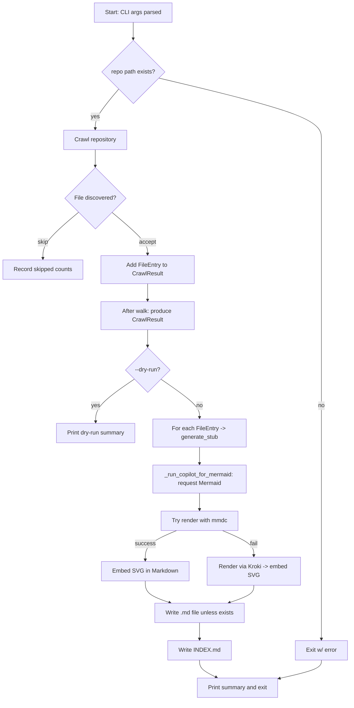

# Diagram: common/comment_service/config/config.alpha.yml


> Auto-generated by Obscura crawlers

## Diagram 1

```mermaid
classDiagram
    class FileEntry {
        +Path repo_relative
        +Path absolute
        +str extension
        +int size
    }
    class CrawlResult {
        +str repo_name
        +Path repo_path
        +list~FileEntry~ files
        +int skipped_dirs
        +int skipped_files
        +int skipped_size
        +int skipped_ext
        +total_discovered() int {property}
    }
    class CrawlerFunctions {
        +crawl_repo(repo_path, extensions=None, skip_dirs=None, max_size=int) CrawlResult
        +generate_stub(entry: FileEntry) str
        +write_output(result: CrawlResult, output_dir: Path, dry_run: bool) int
        +generate_index(result: CrawlResult) str
        +_run_copilot_for_mermaid(code: str) str
    }
    FileEntry <.. CrawlResult : "elements in files"
    CrawlResult o-- FileEntry : "contains"
    CrawlerFunctions ..> CrawlResult : "returns"
    CrawlerFunctions ..> FileEntry : "reads/writes"
    CrawlerFunctions --> "_run_copilot_for_mermaid" : "uses"
    CrawlerFunctions --> "generate_index" : "uses"
    CrawlResult : +total_discovered()
    FileEntry : +repo_relative\n+absolute\n+extension\n+size
```

> SVG rendering failed for this diagram.

## Diagram 2



### SVG

<svg id="container" width="980.5703125" xmlns="http://www.w3.org/2000/svg" class="flowchart" height="1951.328125" viewBox="0 0 980.5703125 1951.328125" role="graphics-document document" aria-roledescription="flowchart-v2"><style>#container{font-family:"trebuchet ms",verdana,arial,sans-serif;font-size:16px;fill:#333;}@keyframes edge-animation-frame{from{stroke-dashoffset:0;}}@keyframes dash{to{stroke-dashoffset:0;}}#container .edge-animation-slow{stroke-dasharray:9,5!important;stroke-dashoffset:900;animation:dash 50s linear infinite;stroke-linecap:round;}#container .edge-animation-fast{stroke-dasharray:9,5!important;stroke-dashoffset:900;animation:dash 20s linear infinite;stroke-linecap:round;}#container .error-icon{fill:#552222;}#container .error-text{fill:#552222;stroke:#552222;}#container .edge-thickness-normal{stroke-width:1px;}#container .edge-thickness-thick{stroke-width:3.5px;}#container .edge-pattern-solid{stroke-dasharray:0;}#container .edge-thickness-invisible{stroke-width:0;fill:none;}#container .edge-pattern-dashed{stroke-dasharray:3;}#container .edge-pattern-dotted{stroke-dasharray:2;}#container .marker{fill:#333333;stroke:#333333;}#container .marker.cross{stroke:#333333;}#container svg{font-family:"trebuchet ms",verdana,arial,sans-serif;font-size:16px;}#container p{margin:0;}#container .label{font-family:"trebuchet ms",verdana,arial,sans-serif;color:#333;}#container .cluster-label text{fill:#333;}#container .cluster-label span{color:#333;}#container .cluster-label span p{background-color:transparent;}#container .label text,#container span{fill:#333;color:#333;}#container .node rect,#container .node circle,#container .node ellipse,#container .node polygon,#container .node path{fill:#ECECFF;stroke:#9370DB;stroke-width:1px;}#container .rough-node .label text,#container .node .label text,#container .image-shape .label,#container .icon-shape .label{text-anchor:middle;}#container .node .katex path{fill:#000;stroke:#000;stroke-width:1px;}#container .rough-node .label,#container .node .label,#container .image-shape .label,#container .icon-shape .label{text-align:center;}#container .node.clickable{cursor:pointer;}#container .root .anchor path{fill:#333333!important;stroke-width:0;stroke:#333333;}#container .arrowheadPath{fill:#333333;}#container .edgePath .path{stroke:#333333;stroke-width:2.0px;}#container .flowchart-link{stroke:#333333;fill:none;}#container .edgeLabel{background-color:rgba(232,232,232, 0.8);text-align:center;}#container .edgeLabel p{background-color:rgba(232,232,232, 0.8);}#container .edgeLabel rect{opacity:0.5;background-color:rgba(232,232,232, 0.8);fill:rgba(232,232,232, 0.8);}#container .labelBkg{background-color:rgba(232, 232, 232, 0.5);}#container .cluster rect{fill:#ffffde;stroke:#aaaa33;stroke-width:1px;}#container .cluster text{fill:#333;}#container .cluster span{color:#333;}#container div.mermaidTooltip{position:absolute;text-align:center;max-width:200px;padding:2px;font-family:"trebuchet ms",verdana,arial,sans-serif;font-size:12px;background:hsl(80, 100%, 96.2745098039%);border:1px solid #aaaa33;border-radius:2px;pointer-events:none;z-index:100;}#container .flowchartTitleText{text-anchor:middle;font-size:18px;fill:#333;}#container rect.text{fill:none;stroke-width:0;}#container .icon-shape,#container .image-shape{background-color:rgba(232,232,232, 0.8);text-align:center;}#container .icon-shape p,#container .image-shape p{background-color:rgba(232,232,232, 0.8);padding:2px;}#container .icon-shape rect,#container .image-shape rect{opacity:0.5;background-color:rgba(232,232,232, 0.8);fill:rgba(232,232,232, 0.8);}#container .label-icon{display:inline-block;height:1em;overflow:visible;vertical-align:-0.125em;}#container .node .label-icon path{fill:currentColor;stroke:revert;stroke-width:revert;}#container :root{--mermaid-font-family:"trebuchet ms",verdana,arial,sans-serif;}</style><g><marker id="container_flowchart-v2-pointEnd" class="marker flowchart-v2" viewBox="0 0 10 10" refX="5" refY="5" markerUnits="userSpaceOnUse" markerWidth="8" markerHeight="8" orient="auto"><path d="M 0 0 L 10 5 L 0 10 z" class="arrowMarkerPath" style="stroke-width: 1; stroke-dasharray: 1, 0;"></path></marker><marker id="container_flowchart-v2-pointStart" class="marker flowchart-v2" viewBox="0 0 10 10" refX="4.5" refY="5" markerUnits="userSpaceOnUse" markerWidth="8" markerHeight="8" orient="auto"><path d="M 0 5 L 10 10 L 10 0 z" class="arrowMarkerPath" style="stroke-width: 1; stroke-dasharray: 1, 0;"></path></marker><marker id="container_flowchart-v2-circleEnd" class="marker flowchart-v2" viewBox="0 0 10 10" refX="11" refY="5" markerUnits="userSpaceOnUse" markerWidth="11" markerHeight="11" orient="auto"><circle cx="5" cy="5" r="5" class="arrowMarkerPath" style="stroke-width: 1; stroke-dasharray: 1, 0;"></circle></marker><marker id="container_flowchart-v2-circleStart" class="marker flowchart-v2" viewBox="0 0 10 10" refX="-1" refY="5" markerUnits="userSpaceOnUse" markerWidth="11" markerHeight="11" orient="auto"><circle cx="5" cy="5" r="5" class="arrowMarkerPath" style="stroke-width: 1; stroke-dasharray: 1, 0;"></circle></marker><marker id="container_flowchart-v2-crossEnd" class="marker cross flowchart-v2" viewBox="0 0 11 11" refX="12" refY="5.2" markerUnits="userSpaceOnUse" markerWidth="11" markerHeight="11" orient="auto"><path d="M 1,1 l 9,9 M 10,1 l -9,9" class="arrowMarkerPath" style="stroke-width: 2; stroke-dasharray: 1, 0;"></path></marker><marker id="container_flowchart-v2-crossStart" class="marker cross flowchart-v2" viewBox="0 0 11 11" refX="-1" refY="5.2" markerUnits="userSpaceOnUse" markerWidth="11" markerHeight="11" orient="auto"><path d="M 1,1 l 9,9 M 10,1 l -9,9" class="arrowMarkerPath" style="stroke-width: 2; stroke-dasharray: 1, 0;"></path></marker><g class="root"><g class="clusters"></g><g class="edgePaths"><path d="M372.402,62L372.402,66.167C372.402,70.333,372.402,78.667,372.402,86.333C372.402,94,372.402,101,372.402,104.5L372.402,108" id="L_A_B_0" class="edge-thickness-normal edge-pattern-solid edge-thickness-normal edge-pattern-solid flowchart-link" style=";" data-edge="true" data-et="edge" data-id="L_A_B_0" data-points="W3sieCI6MzcyLjQwMjM0Mzc1LCJ5Ijo2Mn0seyJ4IjozNzIuNDAyMzQzNzUsInkiOjg3fSx7IngiOjM3Mi40MDIzNDM3NSwieSI6MTEyfV0=" marker-end="url(#container_flowchart-v2-pointEnd)"></path><path d="M443.956,217.837L519.475,235.93C594.994,254.022,746.032,290.206,821.551,318.965C897.07,347.724,897.07,369.057,897.07,388.391C897.07,407.724,897.07,425.057,897.07,452.008C897.07,478.958,897.07,515.526,897.07,554.094C897.07,592.661,897.07,633.229,897.07,666.18C897.07,699.13,897.07,724.464,897.07,747.797C897.07,771.13,897.07,792.464,897.07,813.797C897.07,835.13,897.07,856.464,897.07,877.797C897.07,899.13,897.07,920.464,897.07,946.008C897.07,971.552,897.07,1001.307,897.07,1033.063C897.07,1064.818,897.07,1098.573,897.07,1128.117C897.07,1157.661,897.07,1182.995,897.07,1206.328C897.07,1229.661,897.07,1250.995,897.07,1272.328C897.07,1293.661,897.07,1314.995,897.07,1336.328C897.07,1357.661,897.07,1378.995,897.07,1398.328C897.07,1417.661,897.07,1434.995,897.07,1454.328C897.07,1473.661,897.07,1494.995,897.07,1518.328C897.07,1541.661,897.07,1566.995,897.07,1590.328C897.07,1613.661,897.07,1634.995,897.07,1654.328C897.07,1673.661,897.07,1690.995,897.07,1708.328C897.07,1725.661,897.07,1742.995,897.07,1755.161C897.07,1767.328,897.07,1774.328,897.07,1777.828L897.07,1781.328" id="L_B_Z_0" class="edge-thickness-normal edge-pattern-solid edge-thickness-normal edge-pattern-solid flowchart-link" style=";" data-edge="true" data-et="edge" data-id="L_B_Z_0" data-points="W3sieCI6NDQzLjk1NTU2NzU5OTg3NjYsInkiOjIxNy44Mzc0MDExNTAxMjM0NH0seyJ4Ijo4OTcuMDcwMzEyNSwieSI6MzI2LjM5MDYyNX0seyJ4Ijo4OTcuMDcwMzEyNSwieSI6MzkwLjM5MDYyNX0seyJ4Ijo4OTcuMDcwMzEyNSwieSI6NDQyLjM5MDYyNX0seyJ4Ijo4OTcuMDcwMzEyNSwieSI6NTUyLjA5Mzc1fSx7IngiOjg5Ny4wNzAzMTI1LCJ5Ijo2NzMuNzk2ODc1fSx7IngiOjg5Ny4wNzAzMTI1LCJ5Ijo3NDkuNzk2ODc1fSx7IngiOjg5Ny4wNzAzMTI1LCJ5Ijo4MTMuNzk2ODc1fSx7IngiOjg5Ny4wNzAzMTI1LCJ5Ijo4NzcuNzk2ODc1fSx7IngiOjg5Ny4wNzAzMTI1LCJ5Ijo5NDEuNzk2ODc1fSx7IngiOjg5Ny4wNzAzMTI1LCJ5IjoxMDMxLjA2MjV9LHsieCI6ODk3LjA3MDMxMjUsInkiOjExMzIuMzI4MTI1fSx7IngiOjg5Ny4wNzAzMTI1LCJ5IjoxMjA4LjMyODEyNX0seyJ4Ijo4OTcuMDcwMzEyNSwieSI6MTI3Mi4zMjgxMjV9LHsieCI6ODk3LjA3MDMxMjUsInkiOjEzMzYuMzI4MTI1fSx7IngiOjg5Ny4wNzAzMTI1LCJ5IjoxNDAwLjMyODEyNX0seyJ4Ijo4OTcuMDcwMzEyNSwieSI6MTQ1Mi4zMjgxMjV9LHsieCI6ODk3LjA3MDMxMjUsInkiOjE1MTYuMzI4MTI1fSx7IngiOjg5Ny4wNzAzMTI1LCJ5IjoxNTkyLjMyODEyNX0seyJ4Ijo4OTcuMDcwMzEyNSwieSI6MTY1Ni4zMjgxMjV9LHsieCI6ODk3LjA3MDMxMjUsInkiOjE3MDguMzI4MTI1fSx7IngiOjg5Ny4wNzAzMTI1LCJ5IjoxNzYwLjMyODEyNX0seyJ4Ijo4OTcuMDcwMzEyNSwieSI6MTc4NS4zMjgxMjV9XQ==" marker-end="url(#container_flowchart-v2-pointEnd)"></path><path d="M331.846,248.834L320.955,261.76C310.065,274.686,288.284,300.538,277.394,318.964C266.504,337.391,266.504,348.391,266.504,353.891L266.504,359.391" id="L_B_C_0" class="edge-thickness-normal edge-pattern-solid edge-thickness-normal edge-pattern-solid flowchart-link" style=";" data-edge="true" data-et="edge" data-id="L_B_C_0" data-points="W3sieCI6MzMxLjg0NTU3MTM1Mjk3MTk0LCJ5IjoyNDguODMzODUyNjAyOTcxOTR9LHsieCI6MjY2LjUwMzkwNjI1LCJ5IjozMjYuMzkwNjI1fSx7IngiOjI2Ni41MDM5MDYyNSwieSI6MzYzLjM5MDYyNX1d" marker-end="url(#container_flowchart-v2-pointEnd)"></path><path d="M266.504,417.391L266.504,421.557C266.504,425.724,266.504,434.057,266.504,441.724C266.504,449.391,266.504,456.391,266.504,459.891L266.504,463.391" id="L_C_D_0" class="edge-thickness-normal edge-pattern-solid edge-thickness-normal edge-pattern-solid flowchart-link" style=";" data-edge="true" data-et="edge" data-id="L_C_D_0" data-points="W3sieCI6MjY2LjUwMzkwNjI1LCJ5Ijo0MTcuMzkwNjI1fSx7IngiOjI2Ni41MDM5MDYyNSwieSI6NDQyLjM5MDYyNX0seyJ4IjoyNjYuNTAzOTA2MjUsInkiOjQ2Ny4zOTA2MjV9XQ==" marker-end="url(#container_flowchart-v2-pointEnd)"></path><path d="M220.284,590.577L203.626,604.447C186.968,618.317,153.652,646.057,136.994,667.427C120.336,688.797,120.336,703.797,120.336,711.297L120.336,718.797" id="L_D_E_0" class="edge-thickness-normal edge-pattern-solid edge-thickness-normal edge-pattern-solid flowchart-link" style=";" data-edge="true" data-et="edge" data-id="L_D_E_0" data-points="W3sieCI6MjIwLjI4NDM0NzYwMDcxMDksInkiOjU5MC41NzczMTYzNTA3MTA5fSx7IngiOjEyMC4zMzU5Mzc1LCJ5Ijo2NzMuNzk2ODc1fSx7IngiOjEyMC4zMzU5Mzc1LCJ5Ijo3MjIuNzk2ODc1fV0=" marker-end="url(#container_flowchart-v2-pointEnd)"></path><path d="M312.723,590.577L329.382,604.447C346.04,618.317,379.356,646.057,396.014,665.427C412.672,684.797,412.672,695.797,412.672,701.297L412.672,706.797" id="L_D_F_0" class="edge-thickness-normal edge-pattern-solid edge-thickness-normal edge-pattern-solid flowchart-link" style=";" data-edge="true" data-et="edge" data-id="L_D_F_0" data-points="W3sieCI6MzEyLjcyMzQ2NDg5OTI4OTEsInkiOjU5MC41NzczMTYzNTA3MTA5fSx7IngiOjQxMi42NzE4NzUsInkiOjY3My43OTY4NzV9LHsieCI6NDEyLjY3MTg3NSwieSI6NzEwLjc5Njg3NX1d" marker-end="url(#container_flowchart-v2-pointEnd)"></path><path d="M412.672,788.797L412.672,792.964C412.672,797.13,412.672,805.464,412.672,813.13C412.672,820.797,412.672,827.797,412.672,831.297L412.672,834.797" id="L_F_G_0" class="edge-thickness-normal edge-pattern-solid edge-thickness-normal edge-pattern-solid flowchart-link" style=";" data-edge="true" data-et="edge" data-id="L_F_G_0" data-points="W3sieCI6NDEyLjY3MTg3NSwieSI6Nzg4Ljc5Njg3NX0seyJ4Ijo0MTIuNjcxODc1LCJ5Ijo4MTMuNzk2ODc1fSx7IngiOjQxMi42NzE4NzUsInkiOjgzOC43OTY4NzV9XQ==" marker-end="url(#container_flowchart-v2-pointEnd)"></path><path d="M412.672,916.797L412.672,920.964C412.672,925.13,412.672,933.464,412.672,941.13C412.672,948.797,412.672,955.797,412.672,959.297L412.672,962.797" id="L_G_H_0" class="edge-thickness-normal edge-pattern-solid edge-thickness-normal edge-pattern-solid flowchart-link" style=";" data-edge="true" data-et="edge" data-id="L_G_H_0" data-points="W3sieCI6NDEyLjY3MTg3NSwieSI6OTE2Ljc5Njg3NX0seyJ4Ijo0MTIuNjcxODc1LCJ5Ijo5NDEuNzk2ODc1fSx7IngiOjQxMi42NzE4NzUsInkiOjk2Ni43OTY4NzV9XQ==" marker-end="url(#container_flowchart-v2-pointEnd)"></path><path d="M374.698,1057.355L356.651,1069.85C338.604,1082.346,302.509,1107.337,284.461,1127.333C266.414,1147.328,266.414,1162.328,266.414,1169.828L266.414,1177.328" id="L_H_I_0" class="edge-thickness-normal edge-pattern-solid edge-thickness-normal edge-pattern-solid flowchart-link" style=";" data-edge="true" data-et="edge" data-id="L_H_I_0" data-points="W3sieCI6Mzc0LjY5ODMwMDM1MDM0NTYsInkiOjEwNTcuMzU0NTUwMzUwMzQ1Nn0seyJ4IjoyNjYuNDE0MDYyNSwieSI6MTEzMi4zMjgxMjV9LHsieCI6MjY2LjQxNDA2MjUsInkiOjExODEuMzI4MTI1fV0=" marker-end="url(#container_flowchart-v2-pointEnd)"></path><path d="M450.645,1057.355L468.693,1069.85C486.74,1082.346,522.835,1107.337,540.882,1125.333C558.93,1143.328,558.93,1154.328,558.93,1159.828L558.93,1165.328" id="L_H_J_0" class="edge-thickness-normal edge-pattern-solid edge-thickness-normal edge-pattern-solid flowchart-link" style=";" data-edge="true" data-et="edge" data-id="L_H_J_0" data-points="W3sieCI6NDUwLjY0NTQ0OTY0OTY1NDQsInkiOjEwNTcuMzU0NTUwMzUwMzQ1Nn0seyJ4Ijo1NTguOTI5Njg3NSwieSI6MTEzMi4zMjgxMjV9LHsieCI6NTU4LjkyOTY4NzUsInkiOjExNjkuMzI4MTI1fV0=" marker-end="url(#container_flowchart-v2-pointEnd)"></path><path d="M558.93,1247.328L558.93,1251.495C558.93,1255.661,558.93,1263.995,558.93,1271.661C558.93,1279.328,558.93,1286.328,558.93,1289.828L558.93,1293.328" id="L_J_K_0" class="edge-thickness-normal edge-pattern-solid edge-thickness-normal edge-pattern-solid flowchart-link" style=";" data-edge="true" data-et="edge" data-id="L_J_K_0" data-points="W3sieCI6NTU4LjkyOTY4NzUsInkiOjEyNDcuMzI4MTI1fSx7IngiOjU1OC45Mjk2ODc1LCJ5IjoxMjcyLjMyODEyNX0seyJ4Ijo1NTguOTI5Njg3NSwieSI6MTI5Ny4zMjgxMjV9XQ==" marker-end="url(#container_flowchart-v2-pointEnd)"></path><path d="M558.93,1375.328L558.93,1379.495C558.93,1383.661,558.93,1391.995,558.93,1399.661C558.93,1407.328,558.93,1414.328,558.93,1417.828L558.93,1421.328" id="L_K_L_0" class="edge-thickness-normal edge-pattern-solid edge-thickness-normal edge-pattern-solid flowchart-link" style=";" data-edge="true" data-et="edge" data-id="L_K_L_0" data-points="W3sieCI6NTU4LjkyOTY4NzUsInkiOjEzNzUuMzI4MTI1fSx7IngiOjU1OC45Mjk2ODc1LCJ5IjoxNDAwLjMyODEyNX0seyJ4Ijo1NTguOTI5Njg3NSwieSI6MTQyNS4zMjgxMjV9XQ==" marker-end="url(#container_flowchart-v2-pointEnd)"></path><path d="M495.757,1479.328L481.329,1485.495C466.901,1491.661,438.044,1503.995,423.616,1517.661C409.188,1531.328,409.188,1546.328,409.188,1553.828L409.188,1561.328" id="L_L_M_0" class="edge-thickness-normal edge-pattern-solid edge-thickness-normal edge-pattern-solid flowchart-link" style=";" data-edge="true" data-et="edge" data-id="L_L_M_0" data-points="W3sieCI6NDk1Ljc1NzIwMjE0ODQzNzUsInkiOjE0NzkuMzI4MTI1fSx7IngiOjQwOS4xODc1LCJ5IjoxNTE2LjMyODEyNX0seyJ4Ijo0MDkuMTg3NSwieSI6MTU2NS4zMjgxMjV9XQ==" marker-end="url(#container_flowchart-v2-pointEnd)"></path><path d="M622.102,1479.328L636.53,1485.495C650.959,1491.661,679.815,1503.995,694.244,1515.661C708.672,1527.328,708.672,1538.328,708.672,1543.828L708.672,1549.328" id="L_L_N_0" class="edge-thickness-normal edge-pattern-solid edge-thickness-normal edge-pattern-solid flowchart-link" style=";" data-edge="true" data-et="edge" data-id="L_L_N_0" data-points="W3sieCI6NjIyLjEwMjE3Mjg1MTU2MjUsInkiOjE0NzkuMzI4MTI1fSx7IngiOjcwOC42NzE4NzUsInkiOjE1MTYuMzI4MTI1fSx7IngiOjcwOC42NzE4NzUsInkiOjE1NTMuMzI4MTI1fV0=" marker-end="url(#container_flowchart-v2-pointEnd)"></path><path d="M409.188,1619.328L409.188,1625.495C409.188,1631.661,409.188,1643.995,420.556,1654.109C431.925,1664.224,454.663,1672.12,466.031,1676.068L477.4,1680.016" id="L_M_O_0" class="edge-thickness-normal edge-pattern-solid edge-thickness-normal edge-pattern-solid flowchart-link" style=";" data-edge="true" data-et="edge" data-id="L_M_O_0" data-points="W3sieCI6NDA5LjE4NzUsInkiOjE2MTkuMzI4MTI1fSx7IngiOjQwOS4xODc1LCJ5IjoxNjU2LjMyODEyNX0seyJ4Ijo0ODEuMTc4OTM2Mjk4MDc2OSwieSI6MTY4MS4zMjgxMjV9XQ==" marker-end="url(#container_flowchart-v2-pointEnd)"></path><path d="M708.672,1631.328L708.672,1635.495C708.672,1639.661,708.672,1647.995,697.303,1656.109C685.934,1664.224,663.197,1672.12,651.828,1676.068L640.459,1680.016" id="L_N_O_0" class="edge-thickness-normal edge-pattern-solid edge-thickness-normal edge-pattern-solid flowchart-link" style=";" data-edge="true" data-et="edge" data-id="L_N_O_0" data-points="W3sieCI6NzA4LjY3MTg3NSwieSI6MTYzMS4zMjgxMjV9LHsieCI6NzA4LjY3MTg3NSwieSI6MTY1Ni4zMjgxMjV9LHsieCI6NjM2LjY4MDQzODcwMTkyMzEsInkiOjE2ODEuMzI4MTI1fV0=" marker-end="url(#container_flowchart-v2-pointEnd)"></path><path d="M558.93,1735.328L558.93,1739.495C558.93,1743.661,558.93,1751.995,558.93,1759.661C558.93,1767.328,558.93,1774.328,558.93,1777.828L558.93,1781.328" id="L_O_P_0" class="edge-thickness-normal edge-pattern-solid edge-thickness-normal edge-pattern-solid flowchart-link" style=";" data-edge="true" data-et="edge" data-id="L_O_P_0" data-points="W3sieCI6NTU4LjkyOTY4NzUsInkiOjE3MzUuMzI4MTI1fSx7IngiOjU1OC45Mjk2ODc1LCJ5IjoxNzYwLjMyODEyNX0seyJ4Ijo1NTguOTI5Njg3NSwieSI6MTc4NS4zMjgxMjV9XQ==" marker-end="url(#container_flowchart-v2-pointEnd)"></path><path d="M558.93,1839.328L558.93,1843.495C558.93,1847.661,558.93,1855.995,566.817,1864.034C574.704,1872.074,590.478,1879.819,598.365,1883.692L606.252,1887.565" id="L_P_Q_0" class="edge-thickness-normal edge-pattern-solid edge-thickness-normal edge-pattern-solid flowchart-link" style=";" data-edge="true" data-et="edge" data-id="L_P_Q_0" data-points="W3sieCI6NTU4LjkyOTY4NzUsInkiOjE4MzkuMzI4MTI1fSx7IngiOjU1OC45Mjk2ODc1LCJ5IjoxODY0LjMyODEyNX0seyJ4Ijo2MDkuODQyMzk3ODM2NTM4NSwieSI6MTg4OS4zMjgxMjV9XQ==" marker-end="url(#container_flowchart-v2-pointEnd)"></path><path d="M897.07,1839.328L897.07,1843.495C897.07,1847.661,897.07,1855.995,878.079,1864.414C859.088,1872.833,821.105,1881.337,802.113,1885.589L783.122,1889.842" id="L_Z_Q_0" class="edge-thickness-normal edge-pattern-solid edge-thickness-normal edge-pattern-solid flowchart-link" style=";" data-edge="true" data-et="edge" data-id="L_Z_Q_0" data-points="W3sieCI6ODk3LjA3MDMxMjUsInkiOjE4MzkuMzI4MTI1fSx7IngiOjg5Ny4wNzAzMTI1LCJ5IjoxODY0LjMyODEyNX0seyJ4Ijo3NzkuMjE4NzUsInkiOjE4OTAuNzE1NTg0MjEyMTY0fV0=" marker-end="url(#container_flowchart-v2-pointEnd)"></path></g><g class="edgeLabels"><g class="edgeLabel"><g class="label" data-id="L_A_B_0" transform="translate(0, 0)"><foreignObject width="0" height="0"><div xmlns="http://www.w3.org/1999/xhtml" class="labelBkg" style="display: table-cell; white-space: nowrap; line-height: 1.5; max-width: 200px; text-align: center;"><span class="edgeLabel"></span></div></foreignObject></g></g><g class="edgeLabel" transform="translate(897.0703125, 1132.328125)"><g class="label" data-id="L_B_Z_0" transform="translate(-9.3671875, -12)"><foreignObject width="18.734375" height="24"><div xmlns="http://www.w3.org/1999/xhtml" class="labelBkg" style="display: table-cell; white-space: nowrap; line-height: 1.5; max-width: 200px; text-align: center;"><span class="edgeLabel"><p>no</p></span></div></foreignObject></g></g><g class="edgeLabel" transform="translate(266.50390625, 326.390625)"><g class="label" data-id="L_B_C_0" transform="translate(-12.0078125, -12)"><foreignObject width="24.015625" height="24"><div xmlns="http://www.w3.org/1999/xhtml" class="labelBkg" style="display: table-cell; white-space: nowrap; line-height: 1.5; max-width: 200px; text-align: center;"><span class="edgeLabel"><p>yes</p></span></div></foreignObject></g></g><g class="edgeLabel"><g class="label" data-id="L_C_D_0" transform="translate(0, 0)"><foreignObject width="0" height="0"><div xmlns="http://www.w3.org/1999/xhtml" class="labelBkg" style="display: table-cell; white-space: nowrap; line-height: 1.5; max-width: 200px; text-align: center;"><span class="edgeLabel"></span></div></foreignObject></g></g><g class="edgeLabel" transform="translate(120.3359375, 673.796875)"><g class="label" data-id="L_D_E_0" transform="translate(-14.84375, -12)"><foreignObject width="29.6875" height="24"><div xmlns="http://www.w3.org/1999/xhtml" class="labelBkg" style="display: table-cell; white-space: nowrap; line-height: 1.5; max-width: 200px; text-align: center;"><span class="edgeLabel"><p>skip</p></span></div></foreignObject></g></g><g class="edgeLabel" transform="translate(412.671875, 673.796875)"><g class="label" data-id="L_D_F_0" transform="translate(-23.6875, -12)"><foreignObject width="47.375" height="24"><div xmlns="http://www.w3.org/1999/xhtml" class="labelBkg" style="display: table-cell; white-space: nowrap; line-height: 1.5; max-width: 200px; text-align: center;"><span class="edgeLabel"><p>accept</p></span></div></foreignObject></g></g><g class="edgeLabel"><g class="label" data-id="L_F_G_0" transform="translate(0, 0)"><foreignObject width="0" height="0"><div xmlns="http://www.w3.org/1999/xhtml" class="labelBkg" style="display: table-cell; white-space: nowrap; line-height: 1.5; max-width: 200px; text-align: center;"><span class="edgeLabel"></span></div></foreignObject></g></g><g class="edgeLabel"><g class="label" data-id="L_G_H_0" transform="translate(0, 0)"><foreignObject width="0" height="0"><div xmlns="http://www.w3.org/1999/xhtml" class="labelBkg" style="display: table-cell; white-space: nowrap; line-height: 1.5; max-width: 200px; text-align: center;"><span class="edgeLabel"></span></div></foreignObject></g></g><g class="edgeLabel" transform="translate(266.4140625, 1132.328125)"><g class="label" data-id="L_H_I_0" transform="translate(-12.0078125, -12)"><foreignObject width="24.015625" height="24"><div xmlns="http://www.w3.org/1999/xhtml" class="labelBkg" style="display: table-cell; white-space: nowrap; line-height: 1.5; max-width: 200px; text-align: center;"><span class="edgeLabel"><p>yes</p></span></div></foreignObject></g></g><g class="edgeLabel" transform="translate(558.9296875, 1132.328125)"><g class="label" data-id="L_H_J_0" transform="translate(-9.3671875, -12)"><foreignObject width="18.734375" height="24"><div xmlns="http://www.w3.org/1999/xhtml" class="labelBkg" style="display: table-cell; white-space: nowrap; line-height: 1.5; max-width: 200px; text-align: center;"><span class="edgeLabel"><p>no</p></span></div></foreignObject></g></g><g class="edgeLabel"><g class="label" data-id="L_J_K_0" transform="translate(0, 0)"><foreignObject width="0" height="0"><div xmlns="http://www.w3.org/1999/xhtml" class="labelBkg" style="display: table-cell; white-space: nowrap; line-height: 1.5; max-width: 200px; text-align: center;"><span class="edgeLabel"></span></div></foreignObject></g></g><g class="edgeLabel"><g class="label" data-id="L_K_L_0" transform="translate(0, 0)"><foreignObject width="0" height="0"><div xmlns="http://www.w3.org/1999/xhtml" class="labelBkg" style="display: table-cell; white-space: nowrap; line-height: 1.5; max-width: 200px; text-align: center;"><span class="edgeLabel"></span></div></foreignObject></g></g><g class="edgeLabel" transform="translate(409.1875, 1516.328125)"><g class="label" data-id="L_L_M_0" transform="translate(-27.4765625, -12)"><foreignObject width="54.953125" height="24"><div xmlns="http://www.w3.org/1999/xhtml" class="labelBkg" style="display: table-cell; white-space: nowrap; line-height: 1.5; max-width: 200px; text-align: center;"><span class="edgeLabel"><p>success</p></span></div></foreignObject></g></g><g class="edgeLabel" transform="translate(708.671875, 1516.328125)"><g class="label" data-id="L_L_N_0" transform="translate(-11.4609375, -12)"><foreignObject width="22.921875" height="24"><div xmlns="http://www.w3.org/1999/xhtml" class="labelBkg" style="display: table-cell; white-space: nowrap; line-height: 1.5; max-width: 200px; text-align: center;"><span class="edgeLabel"><p>fail</p></span></div></foreignObject></g></g><g class="edgeLabel"><g class="label" data-id="L_M_O_0" transform="translate(0, 0)"><foreignObject width="0" height="0"><div xmlns="http://www.w3.org/1999/xhtml" class="labelBkg" style="display: table-cell; white-space: nowrap; line-height: 1.5; max-width: 200px; text-align: center;"><span class="edgeLabel"></span></div></foreignObject></g></g><g class="edgeLabel"><g class="label" data-id="L_N_O_0" transform="translate(0, 0)"><foreignObject width="0" height="0"><div xmlns="http://www.w3.org/1999/xhtml" class="labelBkg" style="display: table-cell; white-space: nowrap; line-height: 1.5; max-width: 200px; text-align: center;"><span class="edgeLabel"></span></div></foreignObject></g></g><g class="edgeLabel"><g class="label" data-id="L_O_P_0" transform="translate(0, 0)"><foreignObject width="0" height="0"><div xmlns="http://www.w3.org/1999/xhtml" class="labelBkg" style="display: table-cell; white-space: nowrap; line-height: 1.5; max-width: 200px; text-align: center;"><span class="edgeLabel"></span></div></foreignObject></g></g><g class="edgeLabel"><g class="label" data-id="L_P_Q_0" transform="translate(0, 0)"><foreignObject width="0" height="0"><div xmlns="http://www.w3.org/1999/xhtml" class="labelBkg" style="display: table-cell; white-space: nowrap; line-height: 1.5; max-width: 200px; text-align: center;"><span class="edgeLabel"></span></div></foreignObject></g></g><g class="edgeLabel"><g class="label" data-id="L_Z_Q_0" transform="translate(0, 0)"><foreignObject width="0" height="0"><div xmlns="http://www.w3.org/1999/xhtml" class="labelBkg" style="display: table-cell; white-space: nowrap; line-height: 1.5; max-width: 200px; text-align: center;"><span class="edgeLabel"></span></div></foreignObject></g></g></g><g class="nodes"><g class="node default" id="flowchart-A-0" transform="translate(372.40234375, 35)"><rect class="basic label-container" style="" x="-106.6953125" y="-27" width="213.390625" height="54"></rect><g class="label" style="" transform="translate(-76.6953125, -12)"><rect></rect><foreignObject width="153.390625" height="24"><div xmlns="http://www.w3.org/1999/xhtml" style="display: table-cell; white-space: nowrap; line-height: 1.5; max-width: 200px; text-align: center;"><span class="nodeLabel"><p>Start: CLI args parsed</p></span></div></foreignObject></g></g><g class="node default" id="flowchart-B-1" transform="translate(372.40234375, 200.6953125)"><polygon points="88.6953125,0 177.390625,-88.6953125 88.6953125,-177.390625 0,-88.6953125" class="label-container" transform="translate(-88.1953125, 88.6953125)"></polygon><g class="label" style="" transform="translate(-61.6953125, -12)"><rect></rect><foreignObject width="123.390625" height="24"><div xmlns="http://www.w3.org/1999/xhtml" style="display: table-cell; white-space: nowrap; line-height: 1.5; max-width: 200px; text-align: center;"><span class="nodeLabel"><p>repo path exists?</p></span></div></foreignObject></g></g><g class="node default" id="flowchart-Z-3" transform="translate(897.0703125, 1812.328125)"><rect class="basic label-container" style="" x="-75.5" y="-27" width="151" height="54"></rect><g class="label" style="" transform="translate(-45.5, -12)"><rect></rect><foreignObject width="91" height="24"><div xmlns="http://www.w3.org/1999/xhtml" style="display: table-cell; white-space: nowrap; line-height: 1.5; max-width: 200px; text-align: center;"><span class="nodeLabel"><p>Exit w/ error</p></span></div></foreignObject></g></g><g class="node default" id="flowchart-C-5" transform="translate(266.50390625, 390.390625)"><rect class="basic label-container" style="" x="-88.7734375" y="-27" width="177.546875" height="54"></rect><g class="label" style="" transform="translate(-58.7734375, -12)"><rect></rect><foreignObject width="117.546875" height="24"><div xmlns="http://www.w3.org/1999/xhtml" style="display: table-cell; white-space: nowrap; line-height: 1.5; max-width: 200px; text-align: center;"><span class="nodeLabel"><p>Crawl repository</p></span></div></foreignObject></g></g><g class="node default" id="flowchart-D-7" transform="translate(266.50390625, 552.09375)"><polygon points="84.703125,0 169.40625,-84.703125 84.703125,-169.40625 0,-84.703125" class="label-container" transform="translate(-84.203125, 84.703125)"></polygon><g class="label" style="" transform="translate(-57.703125, -12)"><rect></rect><foreignObject width="115.40625" height="24"><div xmlns="http://www.w3.org/1999/xhtml" style="display: table-cell; white-space: nowrap; line-height: 1.5; max-width: 200px; text-align: center;"><span class="nodeLabel"><p>File discovered?</p></span></div></foreignObject></g></g><g class="node default" id="flowchart-E-9" transform="translate(120.3359375, 749.796875)"><rect class="basic label-container" style="" x="-112.3359375" y="-27" width="224.671875" height="54"></rect><g class="label" style="" transform="translate(-82.3359375, -12)"><rect></rect><foreignObject width="164.671875" height="24"><div xmlns="http://www.w3.org/1999/xhtml" style="display: table-cell; white-space: nowrap; line-height: 1.5; max-width: 200px; text-align: center;"><span class="nodeLabel"><p>Record skipped counts</p></span></div></foreignObject></g></g><g class="node default" id="flowchart-F-11" transform="translate(412.671875, 749.796875)"><rect class="basic label-container" style="" x="-130" y="-39" width="260" height="78"></rect><g class="label" style="" transform="translate(-100, -24)"><rect></rect><foreignObject width="200" height="48"><div xmlns="http://www.w3.org/1999/xhtml" style="display: table; white-space: break-spaces; line-height: 1.5; max-width: 200px; text-align: center; width: 200px;"><span class="nodeLabel"><p>Add FileEntry to CrawlResult</p></span></div></foreignObject></g></g><g class="node default" id="flowchart-G-13" transform="translate(412.671875, 877.796875)"><rect class="basic label-container" style="" x="-130" y="-39" width="260" height="78"></rect><g class="label" style="" transform="translate(-100, -24)"><rect></rect><foreignObject width="200" height="48"><div xmlns="http://www.w3.org/1999/xhtml" style="display: table; white-space: break-spaces; line-height: 1.5; max-width: 200px; text-align: center; width: 200px;"><span class="nodeLabel"><p>After walk: produce CrawlResult</p></span></div></foreignObject></g></g><g class="node default" id="flowchart-H-15" transform="translate(412.671875, 1031.0625)"><polygon points="64.265625,0 128.53125,-64.265625 64.265625,-128.53125 0,-64.265625" class="label-container" transform="translate(-63.765625, 64.265625)"></polygon><g class="label" style="" transform="translate(-37.265625, -12)"><rect></rect><foreignObject width="74.53125" height="24"><div xmlns="http://www.w3.org/1999/xhtml" style="display: table-cell; white-space: nowrap; line-height: 1.5; max-width: 200px; text-align: center;"><span class="nodeLabel"><p>--dry-run?</p></span></div></foreignObject></g></g><g class="node default" id="flowchart-I-17" transform="translate(266.4140625, 1208.328125)"><rect class="basic label-container" style="" x="-112.515625" y="-27" width="225.03125" height="54"></rect><g class="label" style="" transform="translate(-82.515625, -12)"><rect></rect><foreignObject width="165.03125" height="24"><div xmlns="http://www.w3.org/1999/xhtml" style="display: table-cell; white-space: nowrap; line-height: 1.5; max-width: 200px; text-align: center;"><span class="nodeLabel"><p>Print dry-run summary</p></span></div></foreignObject></g></g><g class="node default" id="flowchart-J-19" transform="translate(558.9296875, 1208.328125)"><rect class="basic label-container" style="" x="-130" y="-39" width="260" height="78"></rect><g class="label" style="" transform="translate(-100, -24)"><rect></rect><foreignObject width="200" height="48"><div xmlns="http://www.w3.org/1999/xhtml" style="display: table; white-space: break-spaces; line-height: 1.5; max-width: 200px; text-align: center; width: 200px;"><span class="nodeLabel"><p>For each FileEntry -&gt; generate_stub</p></span></div></foreignObject></g></g><g class="node default" id="flowchart-K-21" transform="translate(558.9296875, 1336.328125)"><rect class="basic label-container" style="" x="-130.2734375" y="-39" width="260.546875" height="78"></rect><g class="label" style="" transform="translate(-100.2734375, -24)"><rect></rect><foreignObject width="200.546875" height="48"><div xmlns="http://www.w3.org/1999/xhtml" style="display: table; white-space: break-spaces; line-height: 1.5; max-width: 200px; text-align: center; width: 200px;"><span class="nodeLabel"><p>_run_copilot_for_mermaid: request Mermaid</p></span></div></foreignObject></g></g><g class="node default" id="flowchart-L-23" transform="translate(558.9296875, 1452.328125)"><rect class="basic label-container" style="" x="-109.296875" y="-27" width="218.59375" height="54"></rect><g class="label" style="" transform="translate(-79.296875, -12)"><rect></rect><foreignObject width="158.59375" height="24"><div xmlns="http://www.w3.org/1999/xhtml" style="display: table-cell; white-space: nowrap; line-height: 1.5; max-width: 200px; text-align: center;"><span class="nodeLabel"><p>Try render with mmdc</p></span></div></foreignObject></g></g><g class="node default" id="flowchart-M-25" transform="translate(409.1875, 1592.328125)"><rect class="basic label-container" style="" x="-119.484375" y="-27" width="238.96875" height="54"></rect><g class="label" style="" transform="translate(-89.484375, -12)"><rect></rect><foreignObject width="178.96875" height="24"><div xmlns="http://www.w3.org/1999/xhtml" style="display: table-cell; white-space: nowrap; line-height: 1.5; max-width: 200px; text-align: center;"><span class="nodeLabel"><p>Embed SVG in Markdown</p></span></div></foreignObject></g></g><g class="node default" id="flowchart-N-27" transform="translate(708.671875, 1592.328125)"><rect class="basic label-container" style="" x="-130" y="-39" width="260" height="78"></rect><g class="label" style="" transform="translate(-100, -24)"><rect></rect><foreignObject width="200" height="48"><div xmlns="http://www.w3.org/1999/xhtml" style="display: table; white-space: break-spaces; line-height: 1.5; max-width: 200px; text-align: center; width: 200px;"><span class="nodeLabel"><p>Render via Kroki -&gt; embed SVG</p></span></div></foreignObject></g></g><g class="node default" id="flowchart-O-29" transform="translate(558.9296875, 1708.328125)"><rect class="basic label-container" style="" x="-126.53125" y="-27" width="253.0625" height="54"></rect><g class="label" style="" transform="translate(-96.53125, -12)"><rect></rect><foreignObject width="193.0625" height="24"><div xmlns="http://www.w3.org/1999/xhtml" style="display: table-cell; white-space: nowrap; line-height: 1.5; max-width: 200px; text-align: center;"><span class="nodeLabel"><p>Write .md file unless exists</p></span></div></foreignObject></g></g><g class="node default" id="flowchart-P-33" transform="translate(558.9296875, 1812.328125)"><rect class="basic label-container" style="" x="-86.296875" y="-27" width="172.59375" height="54"></rect><g class="label" style="" transform="translate(-56.296875, -12)"><rect></rect><foreignObject width="112.59375" height="24"><div xmlns="http://www.w3.org/1999/xhtml" style="display: table-cell; white-space: nowrap; line-height: 1.5; max-width: 200px; text-align: center;"><span class="nodeLabel"><p>Write INDEX.md</p></span></div></foreignObject></g></g><g class="node default" id="flowchart-Q-35" transform="translate(664.828125, 1916.328125)"><rect class="basic label-container" style="" x="-114.390625" y="-27" width="228.78125" height="54"></rect><g class="label" style="" transform="translate(-84.390625, -12)"><rect></rect><foreignObject width="168.78125" height="24"><div xmlns="http://www.w3.org/1999/xhtml" style="display: table-cell; white-space: nowrap; line-height: 1.5; max-width: 200px; text-align: center;"><span class="nodeLabel"><p>Print summary and exit</p></span></div></foreignObject></g></g></g></g></g></svg>
