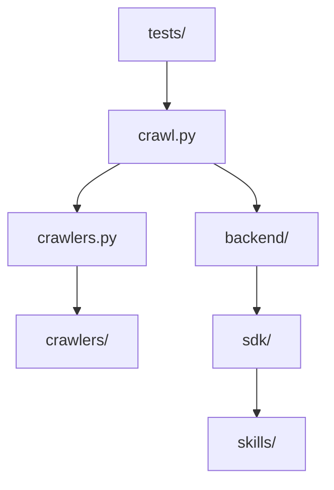

# Diagram: common/comment_service/config/config.dev.yml

> Auto-generated by Obscura crawlers

## Mermaid

### SVG

<svg id="container" width="336.984375" xmlns="http://www.w3.org/2000/svg" class="flowchart" height="486" viewBox="0 0 336.984375 486" role="graphics-document document" aria-roledescription="flowchart-v2"><g><marker id="container_flowchart-v2-pointEnd" class="marker flowchart-v2" viewBox="0 0 10 10" refX="5" refY="5" markerUnits="userSpaceOnUse" markerWidth="8" markerHeight="8" orient="auto"><path d="M 0 0 L 10 5 L 0 10 z" class="arrowMarkerPath" style="stroke-width: 1; stroke-dasharray: 1, 0;"></path></marker><marker id="container_flowchart-v2-pointStart" class="marker flowchart-v2" viewBox="0 0 10 10" refX="4.5" refY="5" markerUnits="userSpaceOnUse" markerWidth="8" markerHeight="8" orient="auto"><path d="M 0 5 L 10 10 L 10 0 z" class="arrowMarkerPath" style="stroke-width: 1; stroke-dasharray: 1, 0;"></path></marker><marker id="container_flowchart-v2-circleEnd" class="marker flowchart-v2" viewBox="0 0 10 10" refX="11" refY="5" markerUnits="userSpaceOnUse" markerWidth="11" markerHeight="11" orient="auto"><circle cx="5" cy="5" r="5" class="arrowMarkerPath" style="stroke-width: 1; stroke-dasharray: 1, 0;"></circle></marker><marker id="container_flowchart-v2-circleStart" class="marker flowchart-v2" viewBox="0 0 10 10" refX="-1" refY="5" markerUnits="userSpaceOnUse" markerWidth="11" markerHeight="11" orient="auto"><circle cx="5" cy="5" r="5" class="arrowMarkerPath" style="stroke-width: 1; stroke-dasharray: 1, 0;"></circle></marker><marker id="container_flowchart-v2-crossEnd" class="marker cross flowchart-v2" viewBox="0 0 11 11" refX="12" refY="5.2" markerUnits="userSpaceOnUse" markerWidth="11" markerHeight="11" orient="auto"><path d="M 1,1 l 9,9 M 10,1 l -9,9" class="arrowMarkerPath" style="stroke-width: 2; stroke-dasharray: 1, 0;"></path></marker><marker id="container_flowchart-v2-crossStart" class="marker cross flowchart-v2" viewBox="0 0 11 11" refX="-1" refY="5.2" markerUnits="userSpaceOnUse" markerWidth="11" markerHeight="11" orient="auto"><path d="M 1,1 l 9,9 M 10,1 l -9,9" class="arrowMarkerPath" style="stroke-width: 2; stroke-dasharray: 1, 0;"></path></marker><g class="root"><g class="clusters"></g><g class="edgePaths"><path d="M123.214,166L115.783,170.167C108.351,174.333,93.488,182.667,86.057,190.333C78.625,198,78.625,205,78.625,208.5L78.625,212" id="L_Crawl_CrawlersFile_0" class="edge-thickness-normal edge-pattern-solid edge-thickness-normal edge-pattern-solid flowchart-link" style=";" data-edge="true" data-et="edge" data-id="L_Crawl_CrawlersFile_0" data-points="W3sieCI6MTIzLjIxNDQ2ODE0OTAzODQ1LCJ5IjoxNjZ9LHsieCI6NzguNjI1LCJ5IjoxOTF9LHsieCI6NzguNjI1LCJ5IjoyMTZ9XQ==" marker-end="url(#container_flowchart-v2-pointEnd)"></path><path d="M78.625,270L78.625,274.167C78.625,278.333,78.625,286.667,78.625,294.333C78.625,302,78.625,309,78.625,312.5L78.625,316" id="L_CrawlersFile_CrawlersDir_0" class="edge-thickness-normal edge-pattern-solid edge-thickness-normal edge-pattern-solid flowchart-link" style=";" data-edge="true" data-et="edge" data-id="L_CrawlersFile_CrawlersDir_0" data-points="W3sieCI6NzguNjI1LCJ5IjoyNzB9LHsieCI6NzguNjI1LCJ5IjoyOTV9LHsieCI6NzguNjI1LCJ5IjozMjB9XQ==" marker-end="url(#container_flowchart-v2-pointEnd)"></path><path d="M219.528,166L226.959,170.167C234.391,174.333,249.254,182.667,256.686,190.333C264.117,198,264.117,205,264.117,208.5L264.117,212" id="L_Crawl_Backend_0" class="edge-thickness-normal edge-pattern-solid edge-thickness-normal edge-pattern-solid flowchart-link" style=";" data-edge="true" data-et="edge" data-id="L_Crawl_Backend_0" data-points="W3sieCI6MjE5LjUyNzcxOTM1MDk2MTU1LCJ5IjoxNjZ9LHsieCI6MjY0LjExNzE4NzUsInkiOjE5MX0seyJ4IjoyNjQuMTE3MTg3NSwieSI6MjE2fV0=" marker-end="url(#container_flowchart-v2-pointEnd)"></path><path d="M264.117,270L264.117,274.167C264.117,278.333,264.117,286.667,264.117,294.333C264.117,302,264.117,309,264.117,312.5L264.117,316" id="L_Backend_SDK_0" class="edge-thickness-normal edge-pattern-solid edge-thickness-normal edge-pattern-solid flowchart-link" style=";" data-edge="true" data-et="edge" data-id="L_Backend_SDK_0" data-points="W3sieCI6MjY0LjExNzE4NzUsInkiOjI3MH0seyJ4IjoyNjQuMTE3MTg3NSwieSI6Mjk1fSx7IngiOjI2NC4xMTcxODc1LCJ5IjozMjB9XQ==" marker-end="url(#container_flowchart-v2-pointEnd)"></path><path d="M264.117,374L264.117,378.167C264.117,382.333,264.117,390.667,264.117,398.333C264.117,406,264.117,413,264.117,416.5L264.117,420" id="L_SDK_Skills_0" class="edge-thickness-normal edge-pattern-solid edge-thickness-normal edge-pattern-solid flowchart-link" style=";" data-edge="true" data-et="edge" data-id="L_SDK_Skills_0" data-points="W3sieCI6MjY0LjExNzE4NzUsInkiOjM3NH0seyJ4IjoyNjQuMTE3MTg3NSwieSI6Mzk5fSx7IngiOjI2NC4xMTcxODc1LCJ5Ijo0MjR9XQ==" marker-end="url(#container_flowchart-v2-pointEnd)"></path><path d="M171.371,62L171.371,66.167C171.371,70.333,171.371,78.667,171.371,86.333C171.371,94,171.371,101,171.371,104.5L171.371,108" id="L_Tests_Crawl_0" class="edge-thickness-normal edge-pattern-solid edge-thickness-normal edge-pattern-solid flowchart-link" style=";" data-edge="true" data-et="edge" data-id="L_Tests_Crawl_0" data-points="W3sieCI6MTcxLjM3MTA5Mzc1LCJ5Ijo2Mn0seyJ4IjoxNzEuMzcxMDkzNzUsInkiOjg3fSx7IngiOjE3MS4zNzEwOTM3NSwieSI6MTEyfV0=" marker-end="url(#container_flowchart-v2-pointEnd)"></path></g><g class="edgeLabels"><g class="edgeLabel"><g class="label" data-id="L_Crawl_CrawlersFile_0" transform="translate(0, 0)"><foreignObject width="0" height="0">

</foreignObject></g></g><g class="edgeLabel"><g class="label" data-id="L_CrawlersFile_CrawlersDir_0" transform="translate(0, 0)"><foreignObject width="0" height="0">

</foreignObject></g></g><g class="edgeLabel"><g class="label" data-id="L_Crawl_Backend_0" transform="translate(0, 0)"><foreignObject width="0" height="0">

</foreignObject></g></g><g class="edgeLabel"><g class="label" data-id="L_Backend_SDK_0" transform="translate(0, 0)"><foreignObject width="0" height="0">

</foreignObject></g></g><g class="edgeLabel"><g class="label" data-id="L_SDK_Skills_0" transform="translate(0, 0)"><foreignObject width="0" height="0">

</foreignObject></g></g><g class="edgeLabel"><g class="label" data-id="L_Tests_Crawl_0" transform="translate(0, 0)"><foreignObject width="0" height="0">

</foreignObject></g></g></g><g class="nodes"><g class="node default" id="flowchart-Crawl-0" transform="translate(171.37109375, 139)"><rect class="basic label-container" style="" x="-59.6328125" y="-27" width="119.265625" height="54"></rect><g class="label" style="" transform="translate(-29.6328125, -12)"><rect></rect><foreignObject width="59.265625" height="24">

crawl.py

</foreignObject></g></g><g class="node default" id="flowchart-CrawlersFile-1" transform="translate(78.625, 243)"><rect class="basic label-container" style="" x="-70.625" y="-27" width="141.25" height="54"></rect><g class="label" style="" transform="translate(-40.625, -12)"><rect></rect><foreignObject width="81.25" height="24">

crawlers.py

</foreignObject></g></g><g class="node default" id="flowchart-CrawlersDir-3" transform="translate(78.625, 347)"><rect class="basic label-container" style="" x="-64.2109375" y="-27" width="128.421875" height="54"></rect><g class="label" style="" transform="translate(-34.2109375, -12)"><rect></rect><foreignObject width="68.421875" height="24">

crawlers/

</foreignObject></g></g><g class="node default" id="flowchart-Backend-5" transform="translate(264.1171875, 243)"><rect class="basic label-container" style="" x="-64.8671875" y="-27" width="129.734375" height="54"></rect><g class="label" style="" transform="translate(-34.8671875, -12)"><rect></rect><foreignObject width="69.734375" height="24">

backend/

</foreignObject></g></g><g class="node default" id="flowchart-SDK-7" transform="translate(264.1171875, 347)"><rect class="basic label-container" style="" x="-46.78125" y="-27" width="93.5625" height="54"></rect><g class="label" style="" transform="translate(-16.78125, -12)"><rect></rect><foreignObject width="33.5625" height="24">

sdk/

</foreignObject></g></g><g class="node default" id="flowchart-Skills-9" transform="translate(264.1171875, 451)"><rect class="basic label-container" style="" x="-52.6796875" y="-27" width="105.359375" height="54"></rect><g class="label" style="" transform="translate(-22.6796875, -12)"><rect></rect><foreignObject width="45.359375" height="24">

skills/

</foreignObject></g></g><g class="node default" id="flowchart-Tests-10" transform="translate(171.37109375, 35)"><rect class="basic label-container" style="" x="-51.6484375" y="-27" width="103.296875" height="54"></rect><g class="label" style="" transform="translate(-21.6484375, -12)"><rect></rect><foreignObject width="43.296875" height="24">

tests/

</foreignObject></g></g></g></g></g></svg>
