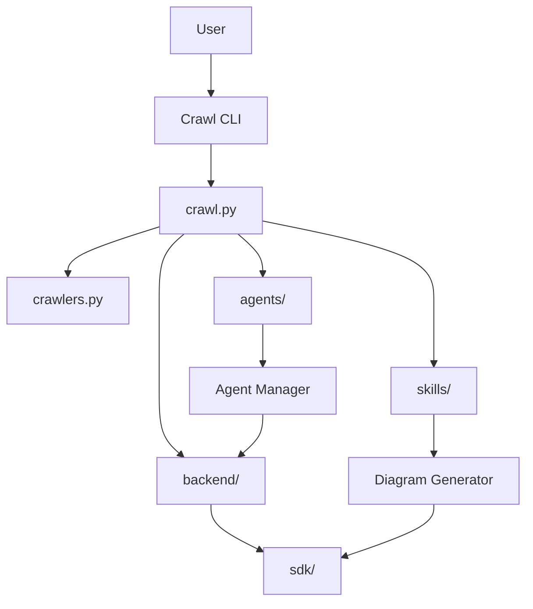
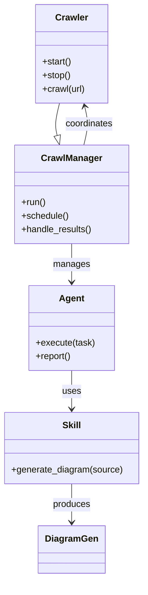

# Diagram: common/comment_service/config/config.dev2.yml

> Auto-generated by Obscura crawlers

## Diagram 1

### SVG

<svg id="container" width="608.75390625" xmlns="http://www.w3.org/2000/svg" class="flowchart" height="694" viewBox="0 0 608.75390625 694" role="graphics-document document" aria-roledescription="flowchart-v2"><g><marker id="container_flowchart-v2-pointEnd" class="marker flowchart-v2" viewBox="0 0 10 10" refX="5" refY="5" markerUnits="userSpaceOnUse" markerWidth="8" markerHeight="8" orient="auto"><path d="M 0 0 L 10 5 L 0 10 z" class="arrowMarkerPath" style="stroke-width: 1; stroke-dasharray: 1, 0;"></path></marker><marker id="container_flowchart-v2-pointStart" class="marker flowchart-v2" viewBox="0 0 10 10" refX="4.5" refY="5" markerUnits="userSpaceOnUse" markerWidth="8" markerHeight="8" orient="auto"><path d="M 0 5 L 10 10 L 10 0 z" class="arrowMarkerPath" style="stroke-width: 1; stroke-dasharray: 1, 0;"></path></marker><marker id="container_flowchart-v2-circleEnd" class="marker flowchart-v2" viewBox="0 0 10 10" refX="11" refY="5" markerUnits="userSpaceOnUse" markerWidth="11" markerHeight="11" orient="auto"><circle cx="5" cy="5" r="5" class="arrowMarkerPath" style="stroke-width: 1; stroke-dasharray: 1, 0;"></circle></marker><marker id="container_flowchart-v2-circleStart" class="marker flowchart-v2" viewBox="0 0 10 10" refX="-1" refY="5" markerUnits="userSpaceOnUse" markerWidth="11" markerHeight="11" orient="auto"><circle cx="5" cy="5" r="5" class="arrowMarkerPath" style="stroke-width: 1; stroke-dasharray: 1, 0;"></circle></marker><marker id="container_flowchart-v2-crossEnd" class="marker cross flowchart-v2" viewBox="0 0 11 11" refX="12" refY="5.2" markerUnits="userSpaceOnUse" markerWidth="11" markerHeight="11" orient="auto"><path d="M 1,1 l 9,9 M 10,1 l -9,9" class="arrowMarkerPath" style="stroke-width: 2; stroke-dasharray: 1, 0;"></path></marker><marker id="container_flowchart-v2-crossStart" class="marker cross flowchart-v2" viewBox="0 0 11 11" refX="-1" refY="5.2" markerUnits="userSpaceOnUse" markerWidth="11" markerHeight="11" orient="auto"><path d="M 1,1 l 9,9 M 10,1 l -9,9" class="arrowMarkerPath" style="stroke-width: 2; stroke-dasharray: 1, 0;"></path></marker><g class="root"><g class="clusters"></g><g class="edgePaths"><path d="M243.598,62L243.598,66.167C243.598,70.333,243.598,78.667,243.598,86.333C243.598,94,243.598,101,243.598,104.5L243.598,108" id="L_User_CLI_0" class="edge-thickness-normal edge-pattern-solid edge-thickness-normal edge-pattern-solid flowchart-link" style=";" data-edge="true" data-et="edge" data-id="L_User_CLI_0" data-points="W3sieCI6MjQzLjU5NzY1NjI1LCJ5Ijo2Mn0seyJ4IjoyNDMuNTk3NjU2MjUsInkiOjg3fSx7IngiOjI0My41OTc2NTYyNSwieSI6MTEyfV0=" marker-end="url(#container_flowchart-v2-pointEnd)"></path><path d="M243.598,166L243.598,170.167C243.598,174.333,243.598,182.667,243.598,190.333C243.598,198,243.598,205,243.598,208.5L243.598,212" id="L_CLI_CrawlPy_0" class="edge-thickness-normal edge-pattern-solid edge-thickness-normal edge-pattern-solid flowchart-link" style=";" data-edge="true" data-et="edge" data-id="L_CLI_CrawlPy_0" data-points="W3sieCI6MjQzLjU5NzY1NjI1LCJ5IjoxNjZ9LHsieCI6MjQzLjU5NzY1NjI1LCJ5IjoxOTF9LHsieCI6MjQzLjU5NzY1NjI1LCJ5IjoyMTZ9XQ==" marker-end="url(#container_flowchart-v2-pointEnd)"></path><path d="M183.965,261.796L166.408,267.33C148.852,272.864,113.738,283.932,96.182,292.966C78.625,302,78.625,309,78.625,312.5L78.625,316" id="L_CrawlPy_Crawlers_0" class="edge-thickness-normal edge-pattern-solid edge-thickness-normal edge-pattern-solid flowchart-link" style=";" data-edge="true" data-et="edge" data-id="L_CrawlPy_Crawlers_0" data-points="W3sieCI6MTgzLjk2NDg0Mzc1LCJ5IjoyNjEuNzk2NDg2MTYwMTExOH0seyJ4Ijo3OC42MjUsInkiOjI5NX0seyJ4Ijo3OC42MjUsInkiOjMyMH1d" marker-end="url(#container_flowchart-v2-pointEnd)"></path><path d="M212.783,270L208.027,274.167C203.272,278.333,193.761,286.667,189.005,299.5C184.25,312.333,184.25,329.667,184.25,347C184.25,364.333,184.25,381.667,184.25,399C184.25,416.333,184.25,433.667,184.25,451C184.25,468.333,184.25,485.667,188.504,498.061C192.758,510.455,201.266,517.909,205.52,521.637L209.774,525.364" id="L_CrawlPy_Backend_0" class="edge-thickness-normal edge-pattern-solid edge-thickness-normal edge-pattern-solid flowchart-link" style=";" data-edge="true" data-et="edge" data-id="L_CrawlPy_Backend_0" data-points="W3sieCI6MjEyLjc4MjUyNzA0MzI2OTIzLCJ5IjoyNzB9LHsieCI6MTg0LjI1LCJ5IjoyOTV9LHsieCI6MTg0LjI1LCJ5IjozNDd9LHsieCI6MTg0LjI1LCJ5IjozOTl9LHsieCI6MTg0LjI1LCJ5Ijo0NTF9LHsieCI6MTg0LjI1LCJ5Ijo1MDN9LHsieCI6MjEyLjc4MjUyNzA0MzI2OTIzLCJ5Ijo1Mjh9XQ==" marker-end="url(#container_flowchart-v2-pointEnd)"></path><path d="M274.413,270L279.168,274.167C283.924,278.333,293.434,286.667,298.19,294.333C302.945,302,302.945,309,302.945,312.5L302.945,316" id="L_CrawlPy_Agents_0" class="edge-thickness-normal edge-pattern-solid edge-thickness-normal edge-pattern-solid flowchart-link" style=";" data-edge="true" data-et="edge" data-id="L_CrawlPy_Agents_0" data-points="W3sieCI6Mjc0LjQxMjc4NTQ1NjczMDgsInkiOjI3MH0seyJ4IjozMDIuOTQ1MzEyNSwieSI6Mjk1fSx7IngiOjMwMi45NDUzMTI1LCJ5IjozMjB9XQ==" marker-end="url(#container_flowchart-v2-pointEnd)"></path><path d="M303.23,254.971L336.464,261.643C369.697,268.314,436.163,281.657,469.396,296.995C502.629,312.333,502.629,329.667,502.629,347C502.629,364.333,502.629,381.667,502.629,393.833C502.629,406,502.629,413,502.629,416.5L502.629,420" id="L_CrawlPy_Skills_0" class="edge-thickness-normal edge-pattern-solid edge-thickness-normal edge-pattern-solid flowchart-link" style=";" data-edge="true" data-et="edge" data-id="L_CrawlPy_Skills_0" data-points="W3sieCI6MzAzLjIzMDQ2ODc1LCJ5IjoyNTQuOTcxMTY2NjA2MzQ1NzV9LHsieCI6NTAyLjYyODkwNjI1LCJ5IjoyOTV9LHsieCI6NTAyLjYyODkwNjI1LCJ5IjozNDd9LHsieCI6NTAyLjYyODkwNjI1LCJ5IjozOTl9LHsieCI6NTAyLjYyODkwNjI1LCJ5Ijo0MjR9XQ==" marker-end="url(#container_flowchart-v2-pointEnd)"></path><path d="M243.598,582L243.598,586.167C243.598,590.333,243.598,598.667,252.951,607.4C262.304,616.134,281.011,625.268,290.365,629.835L299.718,634.403" id="L_Backend_SDK_0" class="edge-thickness-normal edge-pattern-solid edge-thickness-normal edge-pattern-solid flowchart-link" style=";" data-edge="true" data-et="edge" data-id="L_Backend_SDK_0" data-points="W3sieCI6MjQzLjU5NzY1NjI1LCJ5Ijo1ODJ9LHsieCI6MjQzLjU5NzY1NjI1LCJ5Ijo2MDd9LHsieCI6MzAzLjMxMjUsInkiOjYzNi4xNTc2MTI4ODE5Mjc5fV0=" marker-end="url(#container_flowchart-v2-pointEnd)"></path><path d="M302.945,374L302.945,378.167C302.945,382.333,302.945,390.667,302.945,398.333C302.945,406,302.945,413,302.945,416.5L302.945,420" id="L_Agents_AgentMgr_0" class="edge-thickness-normal edge-pattern-solid edge-thickness-normal edge-pattern-solid flowchart-link" style=";" data-edge="true" data-et="edge" data-id="L_Agents_AgentMgr_0" data-points="W3sieCI6MzAyLjk0NTMxMjUsInkiOjM3NH0seyJ4IjozMDIuOTQ1MzEyNSwieSI6Mzk5fSx7IngiOjMwMi45NDUzMTI1LCJ5Ijo0MjR9XQ==" marker-end="url(#container_flowchart-v2-pointEnd)"></path><path d="M502.629,478L502.629,482.167C502.629,486.333,502.629,494.667,502.629,502.333C502.629,510,502.629,517,502.629,520.5L502.629,524" id="L_Skills_DiagramGen_0" class="edge-thickness-normal edge-pattern-solid edge-thickness-normal edge-pattern-solid flowchart-link" style=";" data-edge="true" data-et="edge" data-id="L_Skills_DiagramGen_0" data-points="W3sieCI6NTAyLjYyODkwNjI1LCJ5Ijo0Nzh9LHsieCI6NTAyLjYyODkwNjI1LCJ5Ijo1MDN9LHsieCI6NTAyLjYyODkwNjI1LCJ5Ijo1Mjh9XQ==" marker-end="url(#container_flowchart-v2-pointEnd)"></path><path d="M302.945,478L302.945,482.167C302.945,486.333,302.945,494.667,298.691,502.561C294.437,510.455,285.929,517.909,281.675,521.637L277.421,525.364" id="L_AgentMgr_Backend_0" class="edge-thickness-normal edge-pattern-solid edge-thickness-normal edge-pattern-solid flowchart-link" style=";" data-edge="true" data-et="edge" data-id="L_AgentMgr_Backend_0" data-points="W3sieCI6MzAyLjk0NTMxMjUsInkiOjQ3OH0seyJ4IjozMDIuOTQ1MzEyNSwieSI6NTAzfSx7IngiOjI3NC40MTI3ODU0NTY3MzA4LCJ5Ijo1Mjh9XQ==" marker-end="url(#container_flowchart-v2-pointEnd)"></path><path d="M502.629,582L502.629,586.167C502.629,590.333,502.629,598.667,485.634,608.627C468.64,618.587,434.65,630.174,417.656,635.968L400.661,641.761" id="L_DiagramGen_SDK_0" class="edge-thickness-normal edge-pattern-solid edge-thickness-normal edge-pattern-solid flowchart-link" style=";" data-edge="true" data-et="edge" data-id="L_DiagramGen_SDK_0" data-points="W3sieCI6NTAyLjYyODkwNjI1LCJ5Ijo1ODJ9LHsieCI6NTAyLjYyODkwNjI1LCJ5Ijo2MDd9LHsieCI6Mzk2Ljg3NSwieSI6NjQzLjA1MjAzNzE4NDA1MDh9XQ==" marker-end="url(#container_flowchart-v2-pointEnd)"></path></g><g class="edgeLabels"><g class="edgeLabel"><g class="label" data-id="L_User_CLI_0" transform="translate(0, 0)"><foreignObject width="0" height="0">

</foreignObject></g></g><g class="edgeLabel"><g class="label" data-id="L_CLI_CrawlPy_0" transform="translate(0, 0)"><foreignObject width="0" height="0">

</foreignObject></g></g><g class="edgeLabel"><g class="label" data-id="L_CrawlPy_Crawlers_0" transform="translate(0, 0)"><foreignObject width="0" height="0">

</foreignObject></g></g><g class="edgeLabel"><g class="label" data-id="L_CrawlPy_Backend_0" transform="translate(0, 0)"><foreignObject width="0" height="0">

</foreignObject></g></g><g class="edgeLabel"><g class="label" data-id="L_CrawlPy_Agents_0" transform="translate(0, 0)"><foreignObject width="0" height="0">

</foreignObject></g></g><g class="edgeLabel"><g class="label" data-id="L_CrawlPy_Skills_0" transform="translate(0, 0)"><foreignObject width="0" height="0">

</foreignObject></g></g><g class="edgeLabel"><g class="label" data-id="L_Backend_SDK_0" transform="translate(0, 0)"><foreignObject width="0" height="0">

</foreignObject></g></g><g class="edgeLabel"><g class="label" data-id="L_Agents_AgentMgr_0" transform="translate(0, 0)"><foreignObject width="0" height="0">

</foreignObject></g></g><g class="edgeLabel"><g class="label" data-id="L_Skills_DiagramGen_0" transform="translate(0, 0)"><foreignObject width="0" height="0">

</foreignObject></g></g><g class="edgeLabel"><g class="label" data-id="L_AgentMgr_Backend_0" transform="translate(0, 0)"><foreignObject width="0" height="0">

</foreignObject></g></g><g class="edgeLabel"><g class="label" data-id="L_DiagramGen_SDK_0" transform="translate(0, 0)"><foreignObject width="0" height="0">

</foreignObject></g></g></g><g class="nodes"><g class="node default" id="flowchart-User-0" transform="translate(243.59765625, 35)"><rect class="basic label-container" style="" x="-46.4453125" y="-27" width="92.890625" height="54"></rect><g class="label" style="" transform="translate(-16.4453125, -12)"><rect></rect><foreignObject width="32.890625" height="24">

User

</foreignObject></g></g><g class="node default" id="flowchart-CLI-1" transform="translate(243.59765625, 139)"><rect class="basic label-container" style="" x="-62.5078125" y="-27" width="125.015625" height="54"></rect><g class="label" style="" transform="translate(-32.5078125, -12)"><rect></rect><foreignObject width="65.015625" height="24">

Crawl CLI

</foreignObject></g></g><g class="node default" id="flowchart-CrawlPy-3" transform="translate(243.59765625, 243)"><rect class="basic label-container" style="" x="-59.6328125" y="-27" width="119.265625" height="54"></rect><g class="label" style="" transform="translate(-29.6328125, -12)"><rect></rect><foreignObject width="59.265625" height="24">

crawl.py

</foreignObject></g></g><g class="node default" id="flowchart-Crawlers-5" transform="translate(78.625, 347)"><rect class="basic label-container" style="" x="-70.625" y="-27" width="141.25" height="54"></rect><g class="label" style="" transform="translate(-40.625, -12)"><rect></rect><foreignObject width="81.25" height="24">

crawlers.py

</foreignObject></g></g><g class="node default" id="flowchart-Backend-7" transform="translate(243.59765625, 555)"><rect class="basic label-container" style="" x="-64.8671875" y="-27" width="129.734375" height="54"></rect><g class="label" style="" transform="translate(-34.8671875, -12)"><rect></rect><foreignObject width="69.734375" height="24">

backend/

</foreignObject></g></g><g class="node default" id="flowchart-Agents-9" transform="translate(302.9453125, 347)"><rect class="basic label-container" style="" x="-58.140625" y="-27" width="116.28125" height="54"></rect><g class="label" style="" transform="translate(-28.140625, -12)"><rect></rect><foreignObject width="56.28125" height="24">

agents/

</foreignObject></g></g><g class="node default" id="flowchart-Skills-11" transform="translate(502.62890625, 451)"><rect class="basic label-container" style="" x="-52.6796875" y="-27" width="105.359375" height="54"></rect><g class="label" style="" transform="translate(-22.6796875, -12)"><rect></rect><foreignObject width="45.359375" height="24">

skills/

</foreignObject></g></g><g class="node default" id="flowchart-SDK-13" transform="translate(350.09375, 659)"><rect class="basic label-container" style="" x="-46.78125" y="-27" width="93.5625" height="54"></rect><g class="label" style="" transform="translate(-16.78125, -12)"><rect></rect><foreignObject width="33.5625" height="24">

sdk/

</foreignObject></g></g><g class="node default" id="flowchart-AgentMgr-15" transform="translate(302.9453125, 451)"><rect class="basic label-container" style="" x="-83.6953125" y="-27" width="167.390625" height="54"></rect><g class="label" style="" transform="translate(-53.6953125, -12)"><rect></rect><foreignObject width="107.390625" height="24">

Agent Manager

</foreignObject></g></g><g class="node default" id="flowchart-DiagramGen-17" transform="translate(502.62890625, 555)"><rect class="basic label-container" style="" x="-98.125" y="-27" width="196.25" height="54"></rect><g class="label" style="" transform="translate(-68.125, -12)"><rect></rect><foreignObject width="136.25" height="24">

Diagram Generator

</foreignObject></g></g></g></g></g></svg>

## Diagram 2

### SVG

<svg id="container" width="252.3515625" xmlns="http://www.w3.org/2000/svg" class="classDiagram" height="1020" viewBox="0 0 252.3515625 1020" role="graphics-document document" aria-roledescription="class"><g><defs><marker id="container_class-aggregationStart" class="marker aggregation class" refX="18" refY="7" markerWidth="190" markerHeight="240" orient="auto"><path d="M 18,7 L9,13 L1,7 L9,1 Z"></path></marker></defs><defs><marker id="container_class-aggregationEnd" class="marker aggregation class" refX="1" refY="7" markerWidth="20" markerHeight="28" orient="auto"><path d="M 18,7 L9,13 L1,7 L9,1 Z"></path></marker></defs><defs><marker id="container_class-extensionStart" class="marker extension class" refX="18" refY="7" markerWidth="190" markerHeight="240" orient="auto"><path d="M 1,7 L18,13 V 1 Z"></path></marker></defs><defs><marker id="container_class-extensionEnd" class="marker extension class" refX="1" refY="7" markerWidth="20" markerHeight="28" orient="auto"><path d="M 1,1 V 13 L18,7 Z"></path></marker></defs><defs><marker id="container_class-compositionStart" class="marker composition class" refX="18" refY="7" markerWidth="190" markerHeight="240" orient="auto"><path d="M 18,7 L9,13 L1,7 L9,1 Z"></path></marker></defs><defs><marker id="container_class-compositionEnd" class="marker composition class" refX="1" refY="7" markerWidth="20" markerHeight="28" orient="auto"><path d="M 18,7 L9,13 L1,7 L9,1 Z"></path></marker></defs><defs><marker id="container_class-dependencyStart" class="marker dependency class" refX="6" refY="7" markerWidth="190" markerHeight="240" orient="auto"><path d="M 5,7 L9,13 L1,7 L9,1 Z"></path></marker></defs><defs><marker id="container_class-dependencyEnd" class="marker dependency class" refX="13" refY="7" markerWidth="20" markerHeight="28" orient="auto"><path d="M 18,7 L9,13 L14,7 L9,1 Z"></path></marker></defs><defs><marker id="container_class-lollipopStart" class="marker lollipop class" refX="13" refY="7" markerWidth="190" markerHeight="240" orient="auto"><circle stroke="black" fill="transparent" cx="7" cy="7" r="6"></circle></marker></defs><defs><marker id="container_class-lollipopEnd" class="marker lollipop class" refX="1" refY="7" markerWidth="190" markerHeight="240" orient="auto"><circle stroke="black" fill="transparent" cx="7" cy="7" r="6"></circle></marker></defs><g class="root"><g class="clusters"></g><g class="edgePaths"><path d="M104.143,182L102.582,188.167C101.02,194.333,97.897,206.667,97.191,216.213C96.485,225.759,98.197,232.519,99.053,235.898L99.909,239.278" id="id_Crawler_CrawlManager_1" class="edge-thickness-normal edge-pattern-solid relation" style=";;;" data-edge="true" data-et="edge" data-id="id_Crawler_CrawlManager_1" data-points="W3sieCI6MTA0LjE0MzQ5MTY4MzQ2Nzc0LCJ5IjoxODJ9LHsieCI6OTQuNzczNDM3NSwieSI6MjE5fSx7IngiOjEwNC4xNDM0OTE2ODM0Njc3NCwieSI6MjU2fV0=" marker-end="url(#container_class-extensionEnd)"></path><path d="M126.176,430L126.176,436.167C126.176,442.333,126.176,454.667,126.176,466C126.176,477.333,126.176,487.667,126.176,492.833L126.176,498" id="id_CrawlManager_Agent_2" class="edge-thickness-normal edge-pattern-solid relation" style=";;;" data-edge="true" data-et="edge" data-id="id_CrawlManager_Agent_2" data-points="W3sieCI6MTI2LjE3NTc4MTI1LCJ5Ijo0MzB9LHsieCI6MTI2LjE3NTc4MTI1LCJ5Ijo0Njd9LHsieCI6MTI2LjE3NTc4MTI1LCJ5Ijo1MDR9XQ==" marker-end="url(#container_class-dependencyEnd)"></path><path d="M148.208,256L149.77,249.833C151.331,243.667,154.455,231.333,154.7,219.969C154.946,208.605,152.313,198.211,150.997,193.014L149.681,187.816" id="id_CrawlManager_Crawler_3" class="edge-thickness-normal edge-pattern-solid relation" style=";;;" data-edge="true" data-et="edge" data-id="id_CrawlManager_Crawler_3" data-points="W3sieCI6MTQ4LjIwODA3MDgxNjUzMjI2LCJ5IjoyNTZ9LHsieCI6MTU3LjU3ODEyNSwieSI6MjE5fSx7IngiOjE0OC4yMDgwNzA4MTY1MzIyNiwieSI6MTgyfV0=" marker-end="url(#container_class-dependencyEnd)"></path><path d="M126.176,654L126.176,660.167C126.176,666.333,126.176,678.667,126.176,690C126.176,701.333,126.176,711.667,126.176,716.833L126.176,722" id="id_Agent_Skill_4" class="edge-thickness-normal edge-pattern-solid relation" style=";;;" data-edge="true" data-et="edge" data-id="id_Agent_Skill_4" data-points="W3sieCI6MTI2LjE3NTc4MTI1LCJ5Ijo2NTR9LHsieCI6MTI2LjE3NTc4MTI1LCJ5Ijo2OTF9LHsieCI6MTI2LjE3NTc4MTI1LCJ5Ijo3Mjh9XQ==" marker-end="url(#container_class-dependencyEnd)"></path><path d="M126.176,854L126.176,860.167C126.176,866.333,126.176,878.667,126.176,890C126.176,901.333,126.176,911.667,126.176,916.833L126.176,922" id="id_Skill_DiagramGen_5" class="edge-thickness-normal edge-pattern-solid relation" style=";;;" data-edge="true" data-et="edge" data-id="id_Skill_DiagramGen_5" data-points="W3sieCI6MTI2LjE3NTc4MTI1LCJ5Ijo4NTR9LHsieCI6MTI2LjE3NTc4MTI1LCJ5Ijo4OTF9LHsieCI6MTI2LjE3NTc4MTI1LCJ5Ijo5Mjh9XQ==" marker-end="url(#container_class-dependencyEnd)"></path></g><g class="edgeLabels"><g class="edgeLabel"><g class="label" data-id="id_Crawler_CrawlManager_1" transform="translate(0, 0)"><foreignObject width="0" height="0">

</foreignObject></g></g><g class="edgeLabel" transform="translate(126.17578125, 467)"><g class="label" data-id="id_CrawlManager_Agent_2" transform="translate(-32.296875, -12)"><foreignObject width="64.59375" height="24">

manages

</foreignObject></g></g><g class="edgeLabel" transform="translate(157.578125, 219)"><g class="label" data-id="id_CrawlManager_Crawler_3" transform="translate(-42.8046875, -12)"><foreignObject width="85.609375" height="24">

coordinates

</foreignObject></g></g><g class="edgeLabel" transform="translate(126.17578125, 691)"><g class="label" data-id="id_Agent_Skill_4" transform="translate(-16.4921875, -12)"><foreignObject width="32.984375" height="24">

uses

</foreignObject></g></g><g class="edgeLabel" transform="translate(126.17578125, 891)"><g class="label" data-id="id_Skill_DiagramGen_5" transform="translate(-33.4765625, -12)"><foreignObject width="66.953125" height="24">

produces

</foreignObject></g></g></g><g class="nodes"><g class="node default" id="classId-Crawler-0" transform="translate(126.17578125, 95)"><g class="basic label-container"><path d="M-64.15625 -87 L64.15625 -87 L64.15625 87 L-64.15625 87" stroke="none" stroke-width="0" fill="#ECECFF" style=""></path><path d="M-64.15625 -87 C-37.11764975283198 -87, -10.07904950566396 -87, 64.15625 -87 M-64.15625 -87 C-21.654685546615347 -87, 20.846878906769305 -87, 64.15625 -87 M64.15625 -87 C64.15625 -19.372677773331702, 64.15625 48.254644453336596, 64.15625 87 M64.15625 -87 C64.15625 -19.615390329003475, 64.15625 47.76921934199305, 64.15625 87 M64.15625 87 C36.71030024706366 87, 9.26435049412732 87, -64.15625 87 M64.15625 87 C17.76145233766742 87, -28.633345324665157 87, -64.15625 87 M-64.15625 87 C-64.15625 30.184178888576255, -64.15625 -26.63164222284749, -64.15625 -87 M-64.15625 87 C-64.15625 48.597398153700055, -64.15625 10.194796307400111, -64.15625 -87" stroke="#9370DB" stroke-width="1.3" fill="none" stroke-dasharray="0 0" style=""></path></g><g class="annotation-group text" transform="translate(0, -63)"></g><g class="label-group text" transform="translate(-27.734375, -63)"><g class="label" style="font-weight: bolder" transform="translate(0,-12)"><foreignObject width="55.46875" height="24">

Crawler

</foreignObject></g></g><g class="members-group text" transform="translate(-52.15625, -15)"></g><g class="methods-group text" transform="translate(-52.15625, 15)"><g class="label" style="" transform="translate(0,-12)"><foreignObject width="52.15625" height="24">

+start()

</foreignObject></g><g class="label" style="" transform="translate(0,12)"><foreignObject width="50.21875" height="24">

+stop()

</foreignObject></g><g class="label" style="" transform="translate(0,36)"><foreignObject width="76.578125" height="24">

+crawl(url)

</foreignObject></g></g><g class="divider" style=""><path d="M-64.15625 -39 C-17.217356847988228 -39, 29.721536304023545 -39, 64.15625 -39 M-64.15625 -39 C-36.84189069293663 -39, -9.527531385873253 -39, 64.15625 -39" stroke="#9370DB" stroke-width="1.3" fill="none" stroke-dasharray="0 0" style=""></path></g><g class="divider" style=""><path d="M-64.15625 -15 C-16.608008265045655 -15, 30.94023346990869 -15, 64.15625 -15 M-64.15625 -15 C-23.354704718904173 -15, 17.446840562191653 -15, 64.15625 -15" stroke="#9370DB" stroke-width="1.3" fill="none" stroke-dasharray="0 0" style=""></path></g></g><g class="node default" id="classId-CrawlManager-1" transform="translate(126.17578125, 343)"><g class="basic label-container"><path d="M-100.71875 -87 L100.71875 -87 L100.71875 87 L-100.71875 87" stroke="none" stroke-width="0" fill="#ECECFF" style=""></path><path d="M-100.71875 -87 C-34.88658843675607 -87, 30.945573126487858 -87, 100.71875 -87 M-100.71875 -87 C-26.449971570464612 -87, 47.818806859070776 -87, 100.71875 -87 M100.71875 -87 C100.71875 -19.38290088789664, 100.71875 48.23419822420672, 100.71875 87 M100.71875 -87 C100.71875 -46.82309411440104, 100.71875 -6.646188228802075, 100.71875 87 M100.71875 87 C30.14346672571338 87, -40.43181654857324 87, -100.71875 87 M100.71875 87 C41.53520099886609 87, -17.648348002267824 87, -100.71875 87 M-100.71875 87 C-100.71875 28.690569211795946, -100.71875 -29.618861576408108, -100.71875 -87 M-100.71875 87 C-100.71875 39.01435662212606, -100.71875 -8.971286755747883, -100.71875 -87" stroke="#9370DB" stroke-width="1.3" fill="none" stroke-dasharray="0 0" style=""></path></g><g class="annotation-group text" transform="translate(0, -63)"></g><g class="label-group text" transform="translate(-51.59375, -63)"><g class="label" style="font-weight: bolder" transform="translate(0,-12)"><foreignObject width="103.1875" height="24">

CrawlManager

</foreignObject></g></g><g class="members-group text" transform="translate(-88.71875, -15)"></g><g class="methods-group text" transform="translate(-88.71875, 15)"><g class="label" style="" transform="translate(0,-12)"><foreignObject width="43.21875" height="24">

+run()

</foreignObject></g><g class="label" style="" transform="translate(0,12)"><foreignObject width="83.78125" height="24">

+schedule()

</foreignObject></g><g class="label" style="" transform="translate(0,36)"><foreignObject width="125.84375" height="24">

+handle_results()

</foreignObject></g></g><g class="divider" style=""><path d="M-100.71875 -39 C-41.46927302917071 -39, 17.780203941658584 -39, 100.71875 -39 M-100.71875 -39 C-50.85025957024831 -39, -0.981769140496624 -39, 100.71875 -39" stroke="#9370DB" stroke-width="1.3" fill="none" stroke-dasharray="0 0" style=""></path></g><g class="divider" style=""><path d="M-100.71875 -15 C-34.66792049959972 -15, 31.382909000800566 -15, 100.71875 -15 M-100.71875 -15 C-41.26363741462514 -15, 18.191475170749726 -15, 100.71875 -15" stroke="#9370DB" stroke-width="1.3" fill="none" stroke-dasharray="0 0" style=""></path></g></g><g class="node default" id="classId-Agent-2" transform="translate(126.17578125, 579)"><g class="basic label-container"><path d="M-74.640625 -75 L74.640625 -75 L74.640625 75 L-74.640625 75" stroke="none" stroke-width="0" fill="#ECECFF" style=""></path><path d="M-74.640625 -75 C-41.571538478934855 -75, -8.50245195786971 -75, 74.640625 -75 M-74.640625 -75 C-42.23437578441281 -75, -9.828126568825624 -75, 74.640625 -75 M74.640625 -75 C74.640625 -17.90501087287636, 74.640625 39.18997825424728, 74.640625 75 M74.640625 -75 C74.640625 -17.123718679598106, 74.640625 40.75256264080379, 74.640625 75 M74.640625 75 C44.490024226248124 75, 14.339423452496256 75, -74.640625 75 M74.640625 75 C31.03524338266118 75, -12.570138234677643 75, -74.640625 75 M-74.640625 75 C-74.640625 30.53203113859535, -74.640625 -13.9359377228093, -74.640625 -75 M-74.640625 75 C-74.640625 17.54583142747697, -74.640625 -39.90833714504606, -74.640625 -75" stroke="#9370DB" stroke-width="1.3" fill="none" stroke-dasharray="0 0" style=""></path></g><g class="annotation-group text" transform="translate(0, -51)"></g><g class="label-group text" transform="translate(-21.078125, -51)"><g class="label" style="font-weight: bolder" transform="translate(0,-12)"><foreignObject width="42.15625" height="24">

Agent

</foreignObject></g></g><g class="members-group text" transform="translate(-62.640625, -3)"></g><g class="methods-group text" transform="translate(-62.640625, 27)"><g class="label" style="" transform="translate(0,-12)"><foreignObject width="104.203125" height="24">

+execute(task)

</foreignObject></g><g class="label" style="" transform="translate(0,12)"><foreignObject width="63.578125" height="24">

+report()

</foreignObject></g></g><g class="divider" style=""><path d="M-74.640625 -27 C-20.19933537684824 -27, 34.24195424630352 -27, 74.640625 -27 M-74.640625 -27 C-16.234169138648298 -27, 42.172286722703404 -27, 74.640625 -27" stroke="#9370DB" stroke-width="1.3" fill="none" stroke-dasharray="0 0" style=""></path></g><g class="divider" style=""><path d="M-74.640625 -3 C-32.23986621991999 -3, 10.160892560160022 -3, 74.640625 -3 M-74.640625 -3 C-29.20600129973709 -3, 16.228622400525822 -3, 74.640625 -3" stroke="#9370DB" stroke-width="1.3" fill="none" stroke-dasharray="0 0" style=""></path></g></g><g class="node default" id="classId-Skill-3" transform="translate(126.17578125, 791)"><g class="basic label-container"><path d="M-118.17578125 -63 L118.17578125 -63 L118.17578125 63 L-118.17578125 63" stroke="none" stroke-width="0" fill="#ECECFF" style=""></path><path d="M-118.17578125 -63 C-34.844436915863454 -63, 48.48690741827309 -63, 118.17578125 -63 M-118.17578125 -63 C-63.776249528347954 -63, -9.376717806695908 -63, 118.17578125 -63 M118.17578125 -63 C118.17578125 -26.99612292206409, 118.17578125 9.007754155871822, 118.17578125 63 M118.17578125 -63 C118.17578125 -30.825660508127548, 118.17578125 1.3486789837449038, 118.17578125 63 M118.17578125 63 C46.81855640629588 63, -24.538668437408234 63, -118.17578125 63 M118.17578125 63 C66.5340992211768 63, 14.89241719235359 63, -118.17578125 63 M-118.17578125 63 C-118.17578125 34.75797878695067, -118.17578125 6.515957573901339, -118.17578125 -63 M-118.17578125 63 C-118.17578125 32.84886322735527, -118.17578125 2.6977264547105406, -118.17578125 -63" stroke="#9370DB" stroke-width="1.3" fill="none" stroke-dasharray="0 0" style=""></path></g><g class="annotation-group text" transform="translate(0, -39)"></g><g class="label-group text" transform="translate(-16.0078125, -39)"><g class="label" style="font-weight: bolder" transform="translate(0,-12)"><foreignObject width="32.015625" height="24">

Skill

</foreignObject></g></g><g class="members-group text" transform="translate(-106.17578125, 9)"></g><g class="methods-group text" transform="translate(-106.17578125, 39)"><g class="label" style="" transform="translate(0,-12)"><foreignObject width="196.34375" height="24">

+generate_diagram(source)

</foreignObject></g></g><g class="divider" style=""><path d="M-118.17578125 -15 C-66.40830791059446 -15, -14.640834571188904 -15, 118.17578125 -15 M-118.17578125 -15 C-43.53945353924732 -15, 31.096874171505362 -15, 118.17578125 -15" stroke="#9370DB" stroke-width="1.3" fill="none" stroke-dasharray="0 0" style=""></path></g><g class="divider" style=""><path d="M-118.17578125 9 C-47.911269776924854 9, 22.35324169615029 9, 118.17578125 9 M-118.17578125 9 C-25.823352622906967 9, 66.52907600418607 9, 118.17578125 9" stroke="#9370DB" stroke-width="1.3" fill="none" stroke-dasharray="0 0" style=""></path></g></g><g class="node default" id="classId-DiagramGen-4" transform="translate(126.17578125, 970)"><g class="basic label-container"><path d="M-56.4453125 -42 L56.4453125 -42 L56.4453125 42 L-56.4453125 42" stroke="none" stroke-width="0" fill="#ECECFF" style=""></path><path d="M-56.4453125 -42 C-18.828963216320965 -42, 18.78738606735807 -42, 56.4453125 -42 M-56.4453125 -42 C-29.179181151896273 -42, -1.9130498037925463 -42, 56.4453125 -42 M56.4453125 -42 C56.4453125 -23.99684206753425, 56.4453125 -5.993684135068499, 56.4453125 42 M56.4453125 -42 C56.4453125 -22.87921515773915, 56.4453125 -3.7584303154783, 56.4453125 42 M56.4453125 42 C31.358144681598688 42, 6.270976863197376 42, -56.4453125 42 M56.4453125 42 C24.673266246128197 42, -7.098780007743606 42, -56.4453125 42 M-56.4453125 42 C-56.4453125 10.486467232463756, -56.4453125 -21.027065535072488, -56.4453125 -42 M-56.4453125 42 C-56.4453125 16.48529000449026, -56.4453125 -9.02941999101948, -56.4453125 -42" stroke="#9370DB" stroke-width="1.3" fill="none" stroke-dasharray="0 0" style=""></path></g><g class="annotation-group text" transform="translate(0, -18)"></g><g class="label-group text" transform="translate(-44.4453125, -18)"><g class="label" style="font-weight: bolder" transform="translate(0,-12)"><foreignObject width="88.890625" height="24">

DiagramGen

</foreignObject></g></g><g class="members-group text" transform="translate(-44.4453125, 30)"></g><g class="methods-group text" transform="translate(-44.4453125, 60)"></g><g class="divider" style=""><path d="M-56.4453125 6 C-13.000683674152128 6, 30.443945151695743 6, 56.4453125 6 M-56.4453125 6 C-21.44030664215387 6, 13.564699215692258 6, 56.4453125 6" stroke="#9370DB" stroke-width="1.3" fill="none" stroke-dasharray="0 0" style=""></path></g><g class="divider" style=""><path d="M-56.4453125 24 C-19.507530901617514 24, 17.430250696764972 24, 56.4453125 24 M-56.4453125 24 C-14.641153058758597 24, 27.163006382482806 24, 56.4453125 24" stroke="#9370DB" stroke-width="1.3" fill="none" stroke-dasharray="0 0" style=""></path></g></g></g></g></g></svg>
