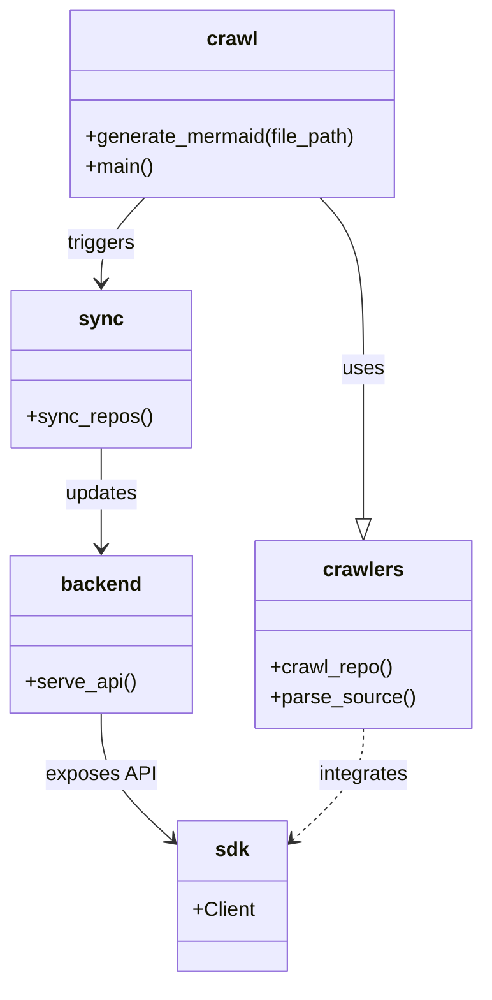

# Diagram: common/comment_service/config/config.prod-b.yml


> Auto-generated by Obscura crawlers

## Diagram 1



### SVG

<svg id="container" width="377.953125" xmlns="http://www.w3.org/2000/svg" class="classDiagram" height="784" viewBox="0 0 377.953125 784" role="graphics-document document" aria-roledescription="class"><style>#container{font-family:"trebuchet ms",verdana,arial,sans-serif;font-size:16px;fill:#333;}@keyframes edge-animation-frame{from{stroke-dashoffset:0;}}@keyframes dash{to{stroke-dashoffset:0;}}#container .edge-animation-slow{stroke-dasharray:9,5!important;stroke-dashoffset:900;animation:dash 50s linear infinite;stroke-linecap:round;}#container .edge-animation-fast{stroke-dasharray:9,5!important;stroke-dashoffset:900;animation:dash 20s linear infinite;stroke-linecap:round;}#container .error-icon{fill:#552222;}#container .error-text{fill:#552222;stroke:#552222;}#container .edge-thickness-normal{stroke-width:1px;}#container .edge-thickness-thick{stroke-width:3.5px;}#container .edge-pattern-solid{stroke-dasharray:0;}#container .edge-thickness-invisible{stroke-width:0;fill:none;}#container .edge-pattern-dashed{stroke-dasharray:3;}#container .edge-pattern-dotted{stroke-dasharray:2;}#container .marker{fill:#333333;stroke:#333333;}#container .marker.cross{stroke:#333333;}#container svg{font-family:"trebuchet ms",verdana,arial,sans-serif;font-size:16px;}#container p{margin:0;}#container g.classGroup text{fill:#9370DB;stroke:none;font-family:"trebuchet ms",verdana,arial,sans-serif;font-size:10px;}#container g.classGroup text .title{font-weight:bolder;}#container .nodeLabel,#container .edgeLabel{color:#131300;}#container .edgeLabel .label rect{fill:#ECECFF;}#container .label text{fill:#131300;}#container .labelBkg{background:#ECECFF;}#container .edgeLabel .label span{background:#ECECFF;}#container .classTitle{font-weight:bolder;}#container .node rect,#container .node circle,#container .node ellipse,#container .node polygon,#container .node path{fill:#ECECFF;stroke:#9370DB;stroke-width:1px;}#container .divider{stroke:#9370DB;stroke-width:1;}#container g.clickable{cursor:pointer;}#container g.classGroup rect{fill:#ECECFF;stroke:#9370DB;}#container g.classGroup line{stroke:#9370DB;stroke-width:1;}#container .classLabel .box{stroke:none;stroke-width:0;fill:#ECECFF;opacity:0.5;}#container .classLabel .label{fill:#9370DB;font-size:10px;}#container .relation{stroke:#333333;stroke-width:1;fill:none;}#container .dashed-line{stroke-dasharray:3;}#container .dotted-line{stroke-dasharray:1 2;}#container #compositionStart,#container .composition{fill:#333333!important;stroke:#333333!important;stroke-width:1;}#container #compositionEnd,#container .composition{fill:#333333!important;stroke:#333333!important;stroke-width:1;}#container #dependencyStart,#container .dependency{fill:#333333!important;stroke:#333333!important;stroke-width:1;}#container #dependencyStart,#container .dependency{fill:#333333!important;stroke:#333333!important;stroke-width:1;}#container #extensionStart,#container .extension{fill:transparent!important;stroke:#333333!important;stroke-width:1;}#container #extensionEnd,#container .extension{fill:transparent!important;stroke:#333333!important;stroke-width:1;}#container #aggregationStart,#container .aggregation{fill:transparent!important;stroke:#333333!important;stroke-width:1;}#container #aggregationEnd,#container .aggregation{fill:transparent!important;stroke:#333333!important;stroke-width:1;}#container #lollipopStart,#container .lollipop{fill:#ECECFF!important;stroke:#333333!important;stroke-width:1;}#container #lollipopEnd,#container .lollipop{fill:#ECECFF!important;stroke:#333333!important;stroke-width:1;}#container .edgeTerminals{font-size:11px;line-height:initial;}#container .classTitleText{text-anchor:middle;font-size:18px;fill:#333;}#container .label-icon{display:inline-block;height:1em;overflow:visible;vertical-align:-0.125em;}#container .node .label-icon path{fill:currentColor;stroke:revert;stroke-width:revert;}#container :root{--mermaid-font-family:"trebuchet ms",verdana,arial,sans-serif;}</style><g><defs><marker id="container_class-aggregationStart" class="marker aggregation class" refX="18" refY="7" markerWidth="190" markerHeight="240" orient="auto"><path d="M 18,7 L9,13 L1,7 L9,1 Z"></path></marker></defs><defs><marker id="container_class-aggregationEnd" class="marker aggregation class" refX="1" refY="7" markerWidth="20" markerHeight="28" orient="auto"><path d="M 18,7 L9,13 L1,7 L9,1 Z"></path></marker></defs><defs><marker id="container_class-extensionStart" class="marker extension class" refX="18" refY="7" markerWidth="190" markerHeight="240" orient="auto"><path d="M 1,7 L18,13 V 1 Z"></path></marker></defs><defs><marker id="container_class-extensionEnd" class="marker extension class" refX="1" refY="7" markerWidth="20" markerHeight="28" orient="auto"><path d="M 1,1 V 13 L18,7 Z"></path></marker></defs><defs><marker id="container_class-compositionStart" class="marker composition class" refX="18" refY="7" markerWidth="190" markerHeight="240" orient="auto"><path d="M 18,7 L9,13 L1,7 L9,1 Z"></path></marker></defs><defs><marker id="container_class-compositionEnd" class="marker composition class" refX="1" refY="7" markerWidth="20" markerHeight="28" orient="auto"><path d="M 18,7 L9,13 L1,7 L9,1 Z"></path></marker></defs><defs><marker id="container_class-dependencyStart" class="marker dependency class" refX="6" refY="7" markerWidth="190" markerHeight="240" orient="auto"><path d="M 5,7 L9,13 L1,7 L9,1 Z"></path></marker></defs><defs><marker id="container_class-dependencyEnd" class="marker dependency class" refX="13" refY="7" markerWidth="20" markerHeight="28" orient="auto"><path d="M 18,7 L9,13 L14,7 L9,1 Z"></path></marker></defs><defs><marker id="container_class-lollipopStart" class="marker lollipop class" refX="13" refY="7" markerWidth="190" markerHeight="240" orient="auto"><circle stroke="black" fill="transparent" cx="7" cy="7" r="6"></circle></marker></defs><defs><marker id="container_class-lollipopEnd" class="marker lollipop class" refX="1" refY="7" markerWidth="190" markerHeight="240" orient="auto"><circle stroke="black" fill="transparent" cx="7" cy="7" r="6"></circle></marker></defs><g class="root"><g class="clusters"></g><g class="edgePaths"><path d="M251.313,158L256.984,164.167C262.654,170.333,273.995,182.667,279.665,205.5C285.336,228.333,285.336,261.667,285.336,295C285.336,328.333,285.336,361.667,285.336,381.625C285.336,401.583,285.336,408.167,285.336,411.458L285.336,414.75" id="id_crawl_crawlers_1" class="edge-thickness-normal edge-pattern-solid relation" style=";;;" data-edge="true" data-et="edge" data-id="id_crawl_crawlers_1" data-points="W3sieCI6MjUxLjMxMzAyMzE1ODQ4MjE0LCJ5IjoxNTh9LHsieCI6Mjg1LjMzNTkzNzUsInkiOjE5NX0seyJ4IjoyODUuMzM1OTM3NSwieSI6Mjk1fSx7IngiOjI4NS4zMzU5Mzc1LCJ5IjozOTV9LHsieCI6Mjg1LjMzNTkzNzUsInkiOjQzMn1d" marker-end="url(#container_class-extensionEnd)"></path><path d="M113.382,158L107.712,164.167C102.041,170.333,90.7,182.667,85.03,194C79.359,205.333,79.359,215.667,79.359,220.833L79.359,226" id="id_crawl_sync_2" class="edge-thickness-normal edge-pattern-solid relation" style=";;;" data-edge="true" data-et="edge" data-id="id_crawl_sync_2" data-points="W3sieCI6MTEzLjM4MjI4OTM0MTUxNzg2LCJ5IjoxNTh9LHsieCI6NzkuMzU5Mzc1LCJ5IjoxOTV9LHsieCI6NzkuMzU5Mzc1LCJ5IjoyMzJ9XQ==" marker-end="url(#container_class-dependencyEnd)"></path><path d="M79.359,358L79.359,364.167C79.359,370.333,79.359,382.667,79.359,396C79.359,409.333,79.359,423.667,79.359,430.833L79.359,438" id="id_sync_backend_3" class="edge-thickness-normal edge-pattern-solid relation" style=";;;" data-edge="true" data-et="edge" data-id="id_sync_backend_3" data-points="W3sieCI6NzkuMzU5Mzc1LCJ5IjozNTh9LHsieCI6NzkuMzU5Mzc1LCJ5IjozOTV9LHsieCI6NzkuMzU5Mzc1LCJ5Ijo0NDR9XQ==" marker-end="url(#container_class-dependencyEnd)"></path><path d="M79.359,570L79.359,578.167C79.359,586.333,79.359,602.667,88.551,619.49C97.742,636.314,116.125,653.628,125.316,662.284L134.507,670.941" id="id_backend_sdk_4" class="edge-thickness-normal edge-pattern-solid relation" style=";;;" data-edge="true" data-et="edge" data-id="id_backend_sdk_4" data-points="W3sieCI6NzkuMzU5Mzc1LCJ5Ijo1NzB9LHsieCI6NzkuMzU5Mzc1LCJ5Ijo2MTl9LHsieCI6MTM4Ljg3NSwieSI6Njc1LjA1NTA3MzAxMzQ2NDh9XQ==" marker-end="url(#container_class-dependencyEnd)"></path><path d="M285.336,582L285.336,588.167C285.336,594.333,285.336,606.667,276.145,621.49C266.953,636.314,248.571,653.628,239.379,662.284L230.188,670.941" id="id_crawlers_sdk_5" class="edge-thickness-normal edge-pattern-dashed relation" style=";;;" data-edge="true" data-et="edge" data-id="id_crawlers_sdk_5" data-points="W3sieCI6Mjg1LjMzNTkzNzUsInkiOjU4Mn0seyJ4IjoyODUuMzM1OTM3NSwieSI6NjE5fSx7IngiOjIyNS44MjAzMTI1LCJ5Ijo2NzUuMDU1MDczMDEzNDY0OH1d" marker-end="url(#container_class-dependencyEnd)"></path></g><g class="edgeLabels"><g class="edgeLabel" transform="translate(285.3359375, 295)"><g class="label" data-id="id_crawl_crawlers_1" transform="translate(-16.4921875, -12)"><foreignObject width="32.984375" height="24"><div xmlns="http://www.w3.org/1999/xhtml" class="labelBkg" style="display: table-cell; white-space: nowrap; line-height: 1.5; max-width: 200px; text-align: center;"><span class="edgeLabel"><p>uses</p></span></div></foreignObject></g></g><g class="edgeLabel" transform="translate(79.359375, 195)"><g class="label" data-id="id_crawl_sync_2" transform="translate(-27.4921875, -12)"><foreignObject width="54.984375" height="24"><div xmlns="http://www.w3.org/1999/xhtml" class="labelBkg" style="display: table-cell; white-space: nowrap; line-height: 1.5; max-width: 200px; text-align: center;"><span class="edgeLabel"><p>triggers</p></span></div></foreignObject></g></g><g class="edgeLabel" transform="translate(79.359375, 395)"><g class="label" data-id="id_sync_backend_3" transform="translate(-29.4140625, -12)"><foreignObject width="58.828125" height="24"><div xmlns="http://www.w3.org/1999/xhtml" class="labelBkg" style="display: table-cell; white-space: nowrap; line-height: 1.5; max-width: 200px; text-align: center;"><span class="edgeLabel"><p>updates</p></span></div></foreignObject></g></g><g class="edgeLabel" transform="translate(79.359375, 619)"><g class="label" data-id="id_backend_sdk_4" transform="translate(-43.140625, -12)"><foreignObject width="86.28125" height="24"><div xmlns="http://www.w3.org/1999/xhtml" class="labelBkg" style="display: table-cell; white-space: nowrap; line-height: 1.5; max-width: 200px; text-align: center;"><span class="edgeLabel"><p>exposes API</p></span></div></foreignObject></g></g><g class="edgeLabel" transform="translate(285.3359375, 619)"><g class="label" data-id="id_crawlers_sdk_5" transform="translate(-36.2578125, -12)"><foreignObject width="72.515625" height="24"><div xmlns="http://www.w3.org/1999/xhtml" class="labelBkg" style="display: table-cell; white-space: nowrap; line-height: 1.5; max-width: 200px; text-align: center;"><span class="edgeLabel"><p>integrates</p></span></div></foreignObject></g></g></g><g class="nodes"><g class="node default" id="classId-crawl-0" transform="translate(182.34765625, 83)"><g class="basic label-container"><path d="M-131.05859375 -75 L131.05859375 -75 L131.05859375 75 L-131.05859375 75" stroke="none" stroke-width="0" fill="#ECECFF" style=""></path><path d="M-131.05859375 -75 C-34.47215217098761 -75, 62.114289408024774 -75, 131.05859375 -75 M-131.05859375 -75 C-48.35901836592636 -75, 34.34055701814728 -75, 131.05859375 -75 M131.05859375 -75 C131.05859375 -17.113637576967015, 131.05859375 40.77272484606597, 131.05859375 75 M131.05859375 -75 C131.05859375 -24.881417088897706, 131.05859375 25.237165822204588, 131.05859375 75 M131.05859375 75 C45.37661853360055 75, -40.3053566827989 75, -131.05859375 75 M131.05859375 75 C28.411162354002727 75, -74.23626904199455 75, -131.05859375 75 M-131.05859375 75 C-131.05859375 22.93498857875136, -131.05859375 -29.130022842497283, -131.05859375 -75 M-131.05859375 75 C-131.05859375 22.700103322729305, -131.05859375 -29.59979335454139, -131.05859375 -75" stroke="#9370DB" stroke-width="1.3" fill="none" stroke-dasharray="0 0" style=""></path></g><g class="annotation-group text" transform="translate(0, -51)"></g><g class="label-group text" transform="translate(-19.4765625, -51)"><g class="label" style="font-weight: bolder" transform="translate(0,-12)"><foreignObject width="38.953125" height="24"><div xmlns="http://www.w3.org/1999/xhtml" style="display: table-cell; white-space: nowrap; line-height: 1.5; max-width: 88px; text-align: center;"><span class="nodeLabel markdown-node-label" style=""><p>crawl</p></span></div></foreignObject></g></g><g class="members-group text" transform="translate(-119.05859375, -3)"></g><g class="methods-group text" transform="translate(-119.05859375, 27)"><g class="label" style="" transform="translate(0,-12)"><foreignObject width="218.640625" height="24"><div xmlns="http://www.w3.org/1999/xhtml" style="display: table-cell; white-space: nowrap; line-height: 1.5; max-width: 276px; text-align: center;"><span class="nodeLabel markdown-node-label" style=""><p>+generate_mermaid(file_path)</p></span></div></foreignObject></g><g class="label" style="" transform="translate(0,12)"><foreignObject width="54.65625" height="24"><div xmlns="http://www.w3.org/1999/xhtml" style="display: table-cell; white-space: nowrap; line-height: 1.5; max-width: 112px; text-align: center;"><span class="nodeLabel markdown-node-label" style=""><p>+main()</p></span></div></foreignObject></g></g><g class="divider" style=""><path d="M-131.05859375 -27 C-48.19115334471702 -27, 34.676287060565954 -27, 131.05859375 -27 M-131.05859375 -27 C-27.745985123967017 -27, 75.56662350206597 -27, 131.05859375 -27" stroke="#9370DB" stroke-width="1.3" fill="none" stroke-dasharray="0 0" style=""></path></g><g class="divider" style=""><path d="M-131.05859375 -3 C-32.99722458968971 -3, 65.06414457062058 -3, 131.05859375 -3 M-131.05859375 -3 C-71.46393808763283 -3, -11.869282425265652 -3, 131.05859375 -3" stroke="#9370DB" stroke-width="1.3" fill="none" stroke-dasharray="0 0" style=""></path></g></g><g class="node default" id="classId-crawlers-1" transform="translate(285.3359375, 507)"><g class="basic label-container"><path d="M-84.6171875 -75 L84.6171875 -75 L84.6171875 75 L-84.6171875 75" stroke="none" stroke-width="0" fill="#ECECFF" style=""></path><path d="M-84.6171875 -75 C-36.11297722392725 -75, 12.391233052145495 -75, 84.6171875 -75 M-84.6171875 -75 C-43.29971535959677 -75, -1.9822432191935349 -75, 84.6171875 -75 M84.6171875 -75 C84.6171875 -16.89932295590468, 84.6171875 41.20135408819064, 84.6171875 75 M84.6171875 -75 C84.6171875 -25.831828270485005, 84.6171875 23.33634345902999, 84.6171875 75 M84.6171875 75 C28.79480727855801 75, -27.027572942883978 75, -84.6171875 75 M84.6171875 75 C43.19681871885236 75, 1.7764499377047258 75, -84.6171875 75 M-84.6171875 75 C-84.6171875 15.093931991467436, -84.6171875 -44.81213601706513, -84.6171875 -75 M-84.6171875 75 C-84.6171875 23.563723351084825, -84.6171875 -27.87255329783035, -84.6171875 -75" stroke="#9370DB" stroke-width="1.3" fill="none" stroke-dasharray="0 0" style=""></path></g><g class="annotation-group text" transform="translate(0, -51)"></g><g class="label-group text" transform="translate(-30.828125, -51)"><g class="label" style="font-weight: bolder" transform="translate(0,-12)"><foreignObject width="61.65625" height="24"><div xmlns="http://www.w3.org/1999/xhtml" style="display: table-cell; white-space: nowrap; line-height: 1.5; max-width: 110px; text-align: center;"><span class="nodeLabel markdown-node-label" style=""><p>crawlers</p></span></div></foreignObject></g></g><g class="members-group text" transform="translate(-72.6171875, -3)"></g><g class="methods-group text" transform="translate(-72.6171875, 27)"><g class="label" style="" transform="translate(0,-12)"><foreignObject width="97.984375" height="24"><div xmlns="http://www.w3.org/1999/xhtml" style="display: table-cell; white-space: nowrap; line-height: 1.5; max-width: 155px; text-align: center;"><span class="nodeLabel markdown-node-label" style=""><p>+crawl_repo()</p></span></div></foreignObject></g><g class="label" style="" transform="translate(0,12)"><foreignObject width="114.40625" height="24"><div xmlns="http://www.w3.org/1999/xhtml" style="display: table-cell; white-space: nowrap; line-height: 1.5; max-width: 172px; text-align: center;"><span class="nodeLabel markdown-node-label" style=""><p>+parse_source()</p></span></div></foreignObject></g></g><g class="divider" style=""><path d="M-84.6171875 -27 C-46.015203370232506 -27, -7.413219240465011 -27, 84.6171875 -27 M-84.6171875 -27 C-38.34673327128051 -27, 7.923720957438974 -27, 84.6171875 -27" stroke="#9370DB" stroke-width="1.3" fill="none" stroke-dasharray="0 0" style=""></path></g><g class="divider" style=""><path d="M-84.6171875 -3 C-29.722512216109592 -3, 25.172163067780815 -3, 84.6171875 -3 M-84.6171875 -3 C-29.7814348635413 -3, 25.0543177729174 -3, 84.6171875 -3" stroke="#9370DB" stroke-width="1.3" fill="none" stroke-dasharray="0 0" style=""></path></g></g><g class="node default" id="classId-sync-2" transform="translate(79.359375, 295)"><g class="basic label-container"><path d="M-69.91015625 -63 L69.91015625 -63 L69.91015625 63 L-69.91015625 63" stroke="none" stroke-width="0" fill="#ECECFF" style=""></path><path d="M-69.91015625 -63 C-15.90790191987331 -63, 38.09435241025338 -63, 69.91015625 -63 M-69.91015625 -63 C-29.523082240391176 -63, 10.863991769217648 -63, 69.91015625 -63 M69.91015625 -63 C69.91015625 -30.894644539350743, 69.91015625 1.2107109212985137, 69.91015625 63 M69.91015625 -63 C69.91015625 -35.783797761070325, 69.91015625 -8.56759552214065, 69.91015625 63 M69.91015625 63 C34.900483930938506 63, -0.10918838812298759 63, -69.91015625 63 M69.91015625 63 C30.019316607971014 63, -9.871523034057972 63, -69.91015625 63 M-69.91015625 63 C-69.91015625 19.36330477573862, -69.91015625 -24.27339044852276, -69.91015625 -63 M-69.91015625 63 C-69.91015625 30.21513427250447, -69.91015625 -2.5697314549910573, -69.91015625 -63" stroke="#9370DB" stroke-width="1.3" fill="none" stroke-dasharray="0 0" style=""></path></g><g class="annotation-group text" transform="translate(0, -39)"></g><g class="label-group text" transform="translate(-16.3046875, -39)"><g class="label" style="font-weight: bolder" transform="translate(0,-12)"><foreignObject width="32.609375" height="24"><div xmlns="http://www.w3.org/1999/xhtml" style="display: table-cell; white-space: nowrap; line-height: 1.5; max-width: 82px; text-align: center;"><span class="nodeLabel markdown-node-label" style=""><p>sync</p></span></div></foreignObject></g></g><g class="members-group text" transform="translate(-57.91015625, 9)"></g><g class="methods-group text" transform="translate(-57.91015625, 39)"><g class="label" style="" transform="translate(0,-12)"><foreignObject width="99.515625" height="24"><div xmlns="http://www.w3.org/1999/xhtml" style="display: table-cell; white-space: nowrap; line-height: 1.5; max-width: 157px; text-align: center;"><span class="nodeLabel markdown-node-label" style=""><p>+sync_repos()</p></span></div></foreignObject></g></g><g class="divider" style=""><path d="M-69.91015625 -15 C-34.79393600473116 -15, 0.3222842405376838 -15, 69.91015625 -15 M-69.91015625 -15 C-15.226240614813364 -15, 39.45767502037327 -15, 69.91015625 -15" stroke="#9370DB" stroke-width="1.3" fill="none" stroke-dasharray="0 0" style=""></path></g><g class="divider" style=""><path d="M-69.91015625 9 C-33.560959061871046 9, 2.788238126257909 9, 69.91015625 9 M-69.91015625 9 C-35.15500390250967 9, -0.3998515550193389 9, 69.91015625 9" stroke="#9370DB" stroke-width="1.3" fill="none" stroke-dasharray="0 0" style=""></path></g></g><g class="node default" id="classId-backend-3" transform="translate(79.359375, 507)"><g class="basic label-container"><path d="M-71.359375 -63 L71.359375 -63 L71.359375 63 L-71.359375 63" stroke="none" stroke-width="0" fill="#ECECFF" style=""></path><path d="M-71.359375 -63 C-22.589076084988378 -63, 26.181222830023245 -63, 71.359375 -63 M-71.359375 -63 C-24.893986634162204 -63, 21.571401731675593 -63, 71.359375 -63 M71.359375 -63 C71.359375 -13.423072505430035, 71.359375 36.15385498913993, 71.359375 63 M71.359375 -63 C71.359375 -18.5070326489235, 71.359375 25.985934702153003, 71.359375 63 M71.359375 63 C19.46755167926318 63, -32.42427164147364 63, -71.359375 63 M71.359375 63 C24.83529242205097 63, -21.68879015589806 63, -71.359375 63 M-71.359375 63 C-71.359375 20.749407268242777, -71.359375 -21.501185463514446, -71.359375 -63 M-71.359375 63 C-71.359375 29.074243686657333, -71.359375 -4.851512626685334, -71.359375 -63" stroke="#9370DB" stroke-width="1.3" fill="none" stroke-dasharray="0 0" style=""></path></g><g class="annotation-group text" transform="translate(0, -39)"></g><g class="label-group text" transform="translate(-31.0625, -39)"><g class="label" style="font-weight: bolder" transform="translate(0,-12)"><foreignObject width="62.125" height="24"><div xmlns="http://www.w3.org/1999/xhtml" style="display: table-cell; white-space: nowrap; line-height: 1.5; max-width: 111px; text-align: center;"><span class="nodeLabel markdown-node-label" style=""><p>backend</p></span></div></foreignObject></g></g><g class="members-group text" transform="translate(-59.359375, 9)"></g><g class="methods-group text" transform="translate(-59.359375, 39)"><g class="label" style="" transform="translate(0,-12)"><foreignObject width="87.65625" height="24"><div xmlns="http://www.w3.org/1999/xhtml" style="display: table-cell; white-space: nowrap; line-height: 1.5; max-width: 145px; text-align: center;"><span class="nodeLabel markdown-node-label" style=""><p>+serve_api()</p></span></div></foreignObject></g></g><g class="divider" style=""><path d="M-71.359375 -15 C-24.988068059683158 -15, 21.383238880633684 -15, 71.359375 -15 M-71.359375 -15 C-33.04993096650508 -15, 5.25951306698984 -15, 71.359375 -15" stroke="#9370DB" stroke-width="1.3" fill="none" stroke-dasharray="0 0" style=""></path></g><g class="divider" style=""><path d="M-71.359375 9 C-42.476199498830624 9, -13.593023997661255 9, 71.359375 9 M-71.359375 9 C-15.931875562229926 9, 39.49562387554015 9, 71.359375 9" stroke="#9370DB" stroke-width="1.3" fill="none" stroke-dasharray="0 0" style=""></path></g></g><g class="node default" id="classId-sdk-4" transform="translate(182.34765625, 716)"><g class="basic label-container"><path d="M-43.47265625 -60 L43.47265625 -60 L43.47265625 60 L-43.47265625 60" stroke="none" stroke-width="0" fill="#ECECFF" style=""></path><path d="M-43.47265625 -60 C-9.154630867637309 -60, 25.163394514725383 -60, 43.47265625 -60 M-43.47265625 -60 C-16.225486390521187 -60, 11.021683468957626 -60, 43.47265625 -60 M43.47265625 -60 C43.47265625 -13.189552447930225, 43.47265625 33.62089510413955, 43.47265625 60 M43.47265625 -60 C43.47265625 -13.11696369239938, 43.47265625 33.76607261520124, 43.47265625 60 M43.47265625 60 C17.990855015997102 60, -7.490946218005796 60, -43.47265625 60 M43.47265625 60 C19.418102618629224 60, -4.636451012741553 60, -43.47265625 60 M-43.47265625 60 C-43.47265625 35.917907382622644, -43.47265625 11.835814765245289, -43.47265625 -60 M-43.47265625 60 C-43.47265625 19.63764819283565, -43.47265625 -20.724703614328703, -43.47265625 -60" stroke="#9370DB" stroke-width="1.3" fill="none" stroke-dasharray="0 0" style=""></path></g><g class="annotation-group text" transform="translate(0, -36)"></g><g class="label-group text" transform="translate(-13.0859375, -36)"><g class="label" style="font-weight: bolder" transform="translate(0,-12)"><foreignObject width="26.171875" height="24"><div xmlns="http://www.w3.org/1999/xhtml" style="display: table-cell; white-space: nowrap; line-height: 1.5; max-width: 76px; text-align: center;"><span class="nodeLabel markdown-node-label" style=""><p>sdk</p></span></div></foreignObject></g></g><g class="members-group text" transform="translate(-31.47265625, 12)"><g class="label" style="" transform="translate(0,-12)"><foreignObject width="49.859375" height="24"><div xmlns="http://www.w3.org/1999/xhtml" style="display: table-cell; white-space: nowrap; line-height: 1.5; max-width: 107px; text-align: center;"><span class="nodeLabel markdown-node-label" style=""><p>+Client</p></span></div></foreignObject></g></g><g class="methods-group text" transform="translate(-31.47265625, 60)"></g><g class="divider" style=""><path d="M-43.47265625 -12 C-16.586319678381372 -12, 10.300016893237256 -12, 43.47265625 -12 M-43.47265625 -12 C-15.35095732332957 -12, 12.77074160334086 -12, 43.47265625 -12" stroke="#9370DB" stroke-width="1.3" fill="none" stroke-dasharray="0 0" style=""></path></g><g class="divider" style=""><path d="M-43.47265625 36 C-23.50953027479158 36, -3.546404299583159 36, 43.47265625 36 M-43.47265625 36 C-11.594279407870246 36, 20.284097434259508 36, 43.47265625 36" stroke="#9370DB" stroke-width="1.3" fill="none" stroke-dasharray="0 0" style=""></path></g></g></g></g></g></svg>

## Diagram 2

```mermaid
flowchart TD
    A[Source Repositories / Files] --> B[Crawlers]
    B --> C[Crawl Entrypoint (crawl.py)]
    C --> D[Diagram Generator]
    D --> E[Mermaid Output]
    C --> F[Sync Service]
    F --> G[Backend / API]
    G --> H[SDK / Clients]
    E --> I[Documentation / Storage]
    H --> I
    style D fill:#f9f,stroke:#333,stroke-width:1px
```

> SVG rendering failed for this diagram.
