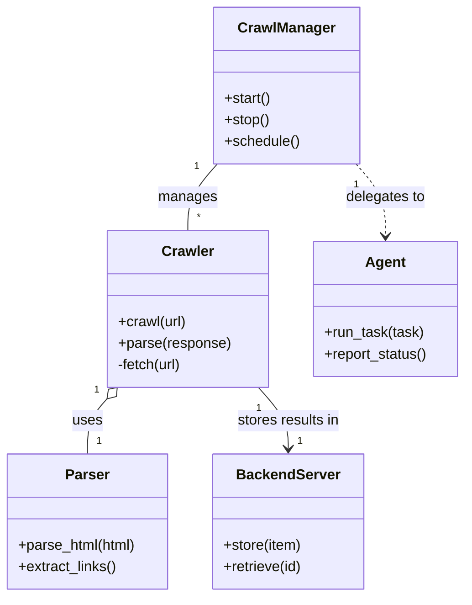

# Diagram: common/comment_service/config/config.qa2.yml


> Auto-generated by Obscura crawlers

## Diagram 1



### SVG

<svg id="container" width="518.341796875" xmlns="http://www.w3.org/2000/svg" class="classDiagram" height="662" viewBox="0 0 518.341796875 662" role="graphics-document document" aria-roledescription="class"><style>#container{font-family:"trebuchet ms",verdana,arial,sans-serif;font-size:16px;fill:#333;}@keyframes edge-animation-frame{from{stroke-dashoffset:0;}}@keyframes dash{to{stroke-dashoffset:0;}}#container .edge-animation-slow{stroke-dasharray:9,5!important;stroke-dashoffset:900;animation:dash 50s linear infinite;stroke-linecap:round;}#container .edge-animation-fast{stroke-dasharray:9,5!important;stroke-dashoffset:900;animation:dash 20s linear infinite;stroke-linecap:round;}#container .error-icon{fill:#552222;}#container .error-text{fill:#552222;stroke:#552222;}#container .edge-thickness-normal{stroke-width:1px;}#container .edge-thickness-thick{stroke-width:3.5px;}#container .edge-pattern-solid{stroke-dasharray:0;}#container .edge-thickness-invisible{stroke-width:0;fill:none;}#container .edge-pattern-dashed{stroke-dasharray:3;}#container .edge-pattern-dotted{stroke-dasharray:2;}#container .marker{fill:#333333;stroke:#333333;}#container .marker.cross{stroke:#333333;}#container svg{font-family:"trebuchet ms",verdana,arial,sans-serif;font-size:16px;}#container p{margin:0;}#container g.classGroup text{fill:#9370DB;stroke:none;font-family:"trebuchet ms",verdana,arial,sans-serif;font-size:10px;}#container g.classGroup text .title{font-weight:bolder;}#container .nodeLabel,#container .edgeLabel{color:#131300;}#container .edgeLabel .label rect{fill:#ECECFF;}#container .label text{fill:#131300;}#container .labelBkg{background:#ECECFF;}#container .edgeLabel .label span{background:#ECECFF;}#container .classTitle{font-weight:bolder;}#container .node rect,#container .node circle,#container .node ellipse,#container .node polygon,#container .node path{fill:#ECECFF;stroke:#9370DB;stroke-width:1px;}#container .divider{stroke:#9370DB;stroke-width:1;}#container g.clickable{cursor:pointer;}#container g.classGroup rect{fill:#ECECFF;stroke:#9370DB;}#container g.classGroup line{stroke:#9370DB;stroke-width:1;}#container .classLabel .box{stroke:none;stroke-width:0;fill:#ECECFF;opacity:0.5;}#container .classLabel .label{fill:#9370DB;font-size:10px;}#container .relation{stroke:#333333;stroke-width:1;fill:none;}#container .dashed-line{stroke-dasharray:3;}#container .dotted-line{stroke-dasharray:1 2;}#container #compositionStart,#container .composition{fill:#333333!important;stroke:#333333!important;stroke-width:1;}#container #compositionEnd,#container .composition{fill:#333333!important;stroke:#333333!important;stroke-width:1;}#container #dependencyStart,#container .dependency{fill:#333333!important;stroke:#333333!important;stroke-width:1;}#container #dependencyStart,#container .dependency{fill:#333333!important;stroke:#333333!important;stroke-width:1;}#container #extensionStart,#container .extension{fill:transparent!important;stroke:#333333!important;stroke-width:1;}#container #extensionEnd,#container .extension{fill:transparent!important;stroke:#333333!important;stroke-width:1;}#container #aggregationStart,#container .aggregation{fill:transparent!important;stroke:#333333!important;stroke-width:1;}#container #aggregationEnd,#container .aggregation{fill:transparent!important;stroke:#333333!important;stroke-width:1;}#container #lollipopStart,#container .lollipop{fill:#ECECFF!important;stroke:#333333!important;stroke-width:1;}#container #lollipopEnd,#container .lollipop{fill:#ECECFF!important;stroke:#333333!important;stroke-width:1;}#container .edgeTerminals{font-size:11px;line-height:initial;}#container .classTitleText{text-anchor:middle;font-size:18px;fill:#333;}#container .label-icon{display:inline-block;height:1em;overflow:visible;vertical-align:-0.125em;}#container .node .label-icon path{fill:currentColor;stroke:revert;stroke-width:revert;}#container :root{--mermaid-font-family:"trebuchet ms",verdana,arial,sans-serif;}</style><g><defs><marker id="container_class-aggregationStart" class="marker aggregation class" refX="18" refY="7" markerWidth="190" markerHeight="240" orient="auto"><path d="M 18,7 L9,13 L1,7 L9,1 Z"></path></marker></defs><defs><marker id="container_class-aggregationEnd" class="marker aggregation class" refX="1" refY="7" markerWidth="20" markerHeight="28" orient="auto"><path d="M 18,7 L9,13 L1,7 L9,1 Z"></path></marker></defs><defs><marker id="container_class-extensionStart" class="marker extension class" refX="18" refY="7" markerWidth="190" markerHeight="240" orient="auto"><path d="M 1,7 L18,13 V 1 Z"></path></marker></defs><defs><marker id="container_class-extensionEnd" class="marker extension class" refX="1" refY="7" markerWidth="20" markerHeight="28" orient="auto"><path d="M 1,1 V 13 L18,7 Z"></path></marker></defs><defs><marker id="container_class-compositionStart" class="marker composition class" refX="18" refY="7" markerWidth="190" markerHeight="240" orient="auto"><path d="M 18,7 L9,13 L1,7 L9,1 Z"></path></marker></defs><defs><marker id="container_class-compositionEnd" class="marker composition class" refX="1" refY="7" markerWidth="20" markerHeight="28" orient="auto"><path d="M 18,7 L9,13 L1,7 L9,1 Z"></path></marker></defs><defs><marker id="container_class-dependencyStart" class="marker dependency class" refX="6" refY="7" markerWidth="190" markerHeight="240" orient="auto"><path d="M 5,7 L9,13 L1,7 L9,1 Z"></path></marker></defs><defs><marker id="container_class-dependencyEnd" class="marker dependency class" refX="13" refY="7" markerWidth="20" markerHeight="28" orient="auto"><path d="M 18,7 L9,13 L14,7 L9,1 Z"></path></marker></defs><defs><marker id="container_class-lollipopStart" class="marker lollipop class" refX="13" refY="7" markerWidth="190" markerHeight="240" orient="auto"><circle stroke="black" fill="transparent" cx="7" cy="7" r="6"></circle></marker></defs><defs><marker id="container_class-lollipopEnd" class="marker lollipop class" refX="1" refY="7" markerWidth="190" markerHeight="240" orient="auto"><circle stroke="black" fill="transparent" cx="7" cy="7" r="6"></circle></marker></defs><g class="root"><g class="clusters"></g><g class="edgePaths"><path d="M243.348,182L237.903,188.167C232.458,194.333,221.568,206.667,216.123,219C210.678,231.333,210.678,243.667,210.678,249.833L210.678,256" id="id_CrawlManager_Crawler_1" class="edge-thickness-normal edge-pattern-solid relation" style=";;;" data-edge="true" data-et="edge" data-id="id_CrawlManager_Crawler_1" data-points="W3sieCI6MjQzLjM0NzYyNDc0Nzk4Mzg3LCJ5IjoxODJ9LHsieCI6MjEwLjY3NzczNDM3NSwieSI6MjE5fSx7IngiOjIxMC42Nzc3MzQzNzUsInkiOjI1Nn1d"></path><path d="M120.406,442.793L116.756,446.827C113.106,450.862,105.807,458.931,102.157,469.132C98.508,479.333,98.508,491.667,98.508,497.833L98.508,504" id="id_Crawler_Parser_2" class="edge-thickness-normal edge-pattern-solid relation" style=";;;" data-edge="true" data-et="edge" data-id="id_Crawler_Parser_2" data-points="W3sieCI6MTMxLjk3Nzg2OTgzMzY2OTM2LCJ5Ijo0MzB9LHsieCI6OTguNTA3ODEyNSwieSI6NDY3fSx7IngiOjk4LjUwNzgxMjUsInkiOjUwNH1d" marker-start="url(#container_class-aggregationStart)"></path><path d="M289.378,430L294.956,436.167C300.534,442.333,311.691,454.667,317.269,466C322.848,477.333,322.848,487.667,322.848,492.833L322.848,498" id="id_Crawler_BackendServer_3" class="edge-thickness-normal edge-pattern-solid relation" style=";;;" data-edge="true" data-et="edge" data-id="id_Crawler_BackendServer_3" data-points="W3sieCI6Mjg5LjM3NzU5ODkxNjMzMDYsInkiOjQzMH0seyJ4IjozMjIuODQ3NjU2MjUsInkiOjQ2N30seyJ4IjozMjIuODQ3NjU2MjUsInkiOjUwNH1d" marker-end="url(#container_class-dependencyEnd)"></path><path d="M396.984,182L402.429,188.167C407.874,194.333,418.764,206.667,424.209,220C429.654,233.333,429.654,247.667,429.654,254.833L429.654,262" id="id_CrawlManager_Agent_4" class="edge-thickness-normal edge-pattern-dashed relation" style=";;;" data-edge="true" data-et="edge" data-id="id_CrawlManager_Agent_4" data-points="W3sieCI6Mzk2Ljk4NDQwNjUwMjAxNjEsInkiOjE4Mn0seyJ4Ijo0MjkuNjU0Mjk2ODc1LCJ5IjoyMTl9LHsieCI6NDI5LjY1NDI5Njg3NSwieSI6MjY4fV0=" marker-end="url(#container_class-dependencyEnd)"></path></g><g class="edgeLabels"><g class="edgeLabel" transform="translate(210.677734375, 219)"><g class="label" data-id="id_CrawlManager_Crawler_1" transform="translate(-32.296875, -12)"><foreignObject width="64.59375" height="24"><div xmlns="http://www.w3.org/1999/xhtml" class="labelBkg" style="display: table-cell; white-space: nowrap; line-height: 1.5; max-width: 200px; text-align: center;"><span class="edgeLabel"><p>manages</p></span></div></foreignObject></g></g><g class="edgeLabel" transform="translate(98.5078125, 467)"><g class="label" data-id="id_Crawler_Parser_2" transform="translate(-16.4921875, -12)"><foreignObject width="32.984375" height="24"><div xmlns="http://www.w3.org/1999/xhtml" class="labelBkg" style="display: table-cell; white-space: nowrap; line-height: 1.5; max-width: 200px; text-align: center;"><span class="edgeLabel"><p>uses</p></span></div></foreignObject></g></g><g class="edgeLabel" transform="translate(322.84765625, 467)"><g class="label" data-id="id_Crawler_BackendServer_3" transform="translate(-57.875, -12)"><foreignObject width="115.75" height="24"><div xmlns="http://www.w3.org/1999/xhtml" class="labelBkg" style="display: table-cell; white-space: nowrap; line-height: 1.5; max-width: 200px; text-align: center;"><span class="edgeLabel"><p>stores results in</p></span></div></foreignObject></g></g><g class="edgeLabel" transform="translate(429.654296875, 219)"><g class="label" data-id="id_CrawlManager_Agent_4" transform="translate(-44.59375, -12)"><foreignObject width="89.1875" height="24"><div xmlns="http://www.w3.org/1999/xhtml" class="labelBkg" style="display: table-cell; white-space: nowrap; line-height: 1.5; max-width: 200px; text-align: center;"><span class="edgeLabel"><p>delegates to</p></span></div></foreignObject></g></g><g class="edgeTerminals" transform="translate(220.52057189120865, 185.18992047960242)"><g class="inner" transform="translate(0, 0)"><foreignObject style="width: 9px; height: 12px;"><div xmlns="http://www.w3.org/1999/xhtml" style="display: inline-block; padding-right: 1px; white-space: nowrap;"><span class="edgeLabel">1</span></div></foreignObject></g></g><g class="edgeTerminals" transform="translate(109.11411630617492, 432.9152586753703)"><g class="inner" transform="translate(0, 0)"><foreignObject style="width: 9px; height: 12px;"><div xmlns="http://www.w3.org/1999/xhtml" style="display: inline-block; padding-right: 1px; white-space: nowrap;"><span class="edgeLabel">1</span></div></foreignObject></g></g><g class="edgeTerminals" transform="translate(289.9934461140219, 453.0406316192543)"><g class="inner" transform="translate(0, 0)"><foreignObject style="width: 9px; height: 12px;"><div xmlns="http://www.w3.org/1999/xhtml" style="display: inline-block; padding-right: 1px; white-space: nowrap;"><span class="edgeLabel">1</span></div></foreignObject></g></g><g class="edgeTerminals" transform="translate(397.32321462879486, 205.0463716275699)"><g class="inner" transform="translate(0, 0)"><foreignObject style="width: 9px; height: 12px;"><div xmlns="http://www.w3.org/1999/xhtml" style="display: inline-block; padding-right: 1px; white-space: nowrap;"><span class="edgeLabel">1</span></div></foreignObject></g></g><g class="edgeTerminals" transform="translate(220.67773218749988, 233.499998125)"><g class="inner" transform="translate(0, 0)"></g><foreignObject style="width: 9px; height: 12px;"><div xmlns="http://www.w3.org/1999/xhtml" style="display: inline-block; padding-right: 1px; white-space: nowrap;"><span class="edgeLabel">*</span></div></foreignObject></g><g class="edgeTerminals" transform="translate(108.50781124999996, 481.4999989285714)"><g class="inner" transform="translate(0, 0)"></g><foreignObject style="width: 9px; height: 12px;"><div xmlns="http://www.w3.org/1999/xhtml" style="display: inline-block; padding-right: 1px; white-space: nowrap;"><span class="edgeLabel">1</span></div></foreignObject></g><g class="edgeTerminals" transform="translate(332.8476581249999, 481.50000160714285)"><g class="inner" transform="translate(0, 0)"></g><foreignObject style="width: 9px; height: 12px;"><div xmlns="http://www.w3.org/1999/xhtml" style="display: inline-block; padding-right: 1px; white-space: nowrap;"><span class="edgeLabel">1</span></div></foreignObject></g></g><g class="nodes"><g class="node default" id="classId-CrawlManager-0" transform="translate(320.166015625, 95)"><g class="basic label-container"><path d="M-79.6875 -87 L79.6875 -87 L79.6875 87 L-79.6875 87" stroke="none" stroke-width="0" fill="#ECECFF" style=""></path><path d="M-79.6875 -87 C-34.787093806239106 -87, 10.113312387521788 -87, 79.6875 -87 M-79.6875 -87 C-43.8576849175512 -87, -8.027869835102393 -87, 79.6875 -87 M79.6875 -87 C79.6875 -28.954289942182932, 79.6875 29.091420115634136, 79.6875 87 M79.6875 -87 C79.6875 -32.156441612871745, 79.6875 22.68711677425651, 79.6875 87 M79.6875 87 C23.001088014843674 87, -33.68532397031265 87, -79.6875 87 M79.6875 87 C40.75720225404529 87, 1.8269045080905784 87, -79.6875 87 M-79.6875 87 C-79.6875 33.10087876849253, -79.6875 -20.798242463014944, -79.6875 -87 M-79.6875 87 C-79.6875 47.82706566837993, -79.6875 8.65413133675986, -79.6875 -87" stroke="#9370DB" stroke-width="1.3" fill="none" stroke-dasharray="0 0" style=""></path></g><g class="annotation-group text" transform="translate(0, -63)"></g><g class="label-group text" transform="translate(-51.59375, -63)"><g class="label" style="font-weight: bolder" transform="translate(0,-12)"><foreignObject width="103.1875" height="24"><div xmlns="http://www.w3.org/1999/xhtml" style="display: table-cell; white-space: nowrap; line-height: 1.5; max-width: 152px; text-align: center;"><span class="nodeLabel markdown-node-label" style=""><p>CrawlManager</p></span></div></foreignObject></g></g><g class="members-group text" transform="translate(-67.6875, -15)"></g><g class="methods-group text" transform="translate(-67.6875, 15)"><g class="label" style="" transform="translate(0,-12)"><foreignObject width="52.15625" height="24"><div xmlns="http://www.w3.org/1999/xhtml" style="display: table-cell; white-space: nowrap; line-height: 1.5; max-width: 110px; text-align: center;"><span class="nodeLabel markdown-node-label" style=""><p>+start()</p></span></div></foreignObject></g><g class="label" style="" transform="translate(0,12)"><foreignObject width="50.21875" height="24"><div xmlns="http://www.w3.org/1999/xhtml" style="display: table-cell; white-space: nowrap; line-height: 1.5; max-width: 108px; text-align: center;"><span class="nodeLabel markdown-node-label" style=""><p>+stop()</p></span></div></foreignObject></g><g class="label" style="" transform="translate(0,36)"><foreignObject width="83.78125" height="24"><div xmlns="http://www.w3.org/1999/xhtml" style="display: table-cell; white-space: nowrap; line-height: 1.5; max-width: 141px; text-align: center;"><span class="nodeLabel markdown-node-label" style=""><p>+schedule()</p></span></div></foreignObject></g></g><g class="divider" style=""><path d="M-79.6875 -39 C-23.702700443579303 -39, 32.282099112841394 -39, 79.6875 -39 M-79.6875 -39 C-27.668243212104045 -39, 24.35101357579191 -39, 79.6875 -39" stroke="#9370DB" stroke-width="1.3" fill="none" stroke-dasharray="0 0" style=""></path></g><g class="divider" style=""><path d="M-79.6875 -15 C-41.60144916892106 -15, -3.5153983378421145 -15, 79.6875 -15 M-79.6875 -15 C-20.898653824582965 -15, 37.89019235083407 -15, 79.6875 -15" stroke="#9370DB" stroke-width="1.3" fill="none" stroke-dasharray="0 0" style=""></path></g></g><g class="node default" id="classId-Crawler-1" transform="translate(210.677734375, 343)"><g class="basic label-container"><path d="M-88.2890625 -87 L88.2890625 -87 L88.2890625 87 L-88.2890625 87" stroke="none" stroke-width="0" fill="#ECECFF" style=""></path><path d="M-88.2890625 -87 C-22.308126330934343 -87, 43.672809838131315 -87, 88.2890625 -87 M-88.2890625 -87 C-43.498615122450744 -87, 1.2918322550985124 -87, 88.2890625 -87 M88.2890625 -87 C88.2890625 -44.27222038940222, 88.2890625 -1.544440778804443, 88.2890625 87 M88.2890625 -87 C88.2890625 -36.17939353338412, 88.2890625 14.641212933231756, 88.2890625 87 M88.2890625 87 C26.880990512238007 87, -34.527081475523985 87, -88.2890625 87 M88.2890625 87 C40.81626742251507 87, -6.656527654969864 87, -88.2890625 87 M-88.2890625 87 C-88.2890625 50.37558473532292, -88.2890625 13.751169470645834, -88.2890625 -87 M-88.2890625 87 C-88.2890625 44.13532188843878, -88.2890625 1.270643776877563, -88.2890625 -87" stroke="#9370DB" stroke-width="1.3" fill="none" stroke-dasharray="0 0" style=""></path></g><g class="annotation-group text" transform="translate(0, -63)"></g><g class="label-group text" transform="translate(-27.734375, -63)"><g class="label" style="font-weight: bolder" transform="translate(0,-12)"><foreignObject width="55.46875" height="24"><div xmlns="http://www.w3.org/1999/xhtml" style="display: table-cell; white-space: nowrap; line-height: 1.5; max-width: 105px; text-align: center;"><span class="nodeLabel markdown-node-label" style=""><p>Crawler</p></span></div></foreignObject></g></g><g class="members-group text" transform="translate(-76.2890625, -15)"></g><g class="methods-group text" transform="translate(-76.2890625, 15)"><g class="label" style="" transform="translate(0,-12)"><foreignObject width="76.578125" height="24"><div xmlns="http://www.w3.org/1999/xhtml" style="display: table-cell; white-space: nowrap; line-height: 1.5; max-width: 134px; text-align: center;"><span class="nodeLabel markdown-node-label" style=""><p>+crawl(url)</p></span></div></foreignObject></g><g class="label" style="" transform="translate(0,12)"><foreignObject width="124.84375" height="24"><div xmlns="http://www.w3.org/1999/xhtml" style="display: table-cell; white-space: nowrap; line-height: 1.5; max-width: 182px; text-align: center;"><span class="nodeLabel markdown-node-label" style=""><p>+parse(response)</p></span></div></foreignObject></g><g class="label" style="" transform="translate(0,36)"><foreignObject width="73.234375" height="24"><div xmlns="http://www.w3.org/1999/xhtml" style="display: table-cell; white-space: nowrap; line-height: 1.5; max-width: 131px; text-align: center;"><span class="nodeLabel markdown-node-label" style=""><p>-fetch(url)</p></span></div></foreignObject></g></g><g class="divider" style=""><path d="M-88.2890625 -39 C-35.34342035407159 -39, 17.60222179185682 -39, 88.2890625 -39 M-88.2890625 -39 C-48.17757661717825 -39, -8.066090734356493 -39, 88.2890625 -39" stroke="#9370DB" stroke-width="1.3" fill="none" stroke-dasharray="0 0" style=""></path></g><g class="divider" style=""><path d="M-88.2890625 -15 C-43.465320584904845 -15, 1.3584213301903105 -15, 88.2890625 -15 M-88.2890625 -15 C-44.58573952937295 -15, -0.8824165587459021 -15, 88.2890625 -15" stroke="#9370DB" stroke-width="1.3" fill="none" stroke-dasharray="0 0" style=""></path></g></g><g class="node default" id="classId-Parser-2" transform="translate(98.5078125, 579)"><g class="basic label-container"><path d="M-90.5078125 -75 L90.5078125 -75 L90.5078125 75 L-90.5078125 75" stroke="none" stroke-width="0" fill="#ECECFF" style=""></path><path d="M-90.5078125 -75 C-18.482399892863015 -75, 53.54301271427397 -75, 90.5078125 -75 M-90.5078125 -75 C-26.033795233436663 -75, 38.44022203312667 -75, 90.5078125 -75 M90.5078125 -75 C90.5078125 -26.58198202834886, 90.5078125 21.836035943302278, 90.5078125 75 M90.5078125 -75 C90.5078125 -34.446779846443846, 90.5078125 6.106440307112308, 90.5078125 75 M90.5078125 75 C44.40974387529659 75, -1.6883247494068172 75, -90.5078125 75 M90.5078125 75 C19.05674792887072 75, -52.39431664225856 75, -90.5078125 75 M-90.5078125 75 C-90.5078125 20.88774721707391, -90.5078125 -33.22450556585218, -90.5078125 -75 M-90.5078125 75 C-90.5078125 44.96863867063732, -90.5078125 14.93727734127463, -90.5078125 -75" stroke="#9370DB" stroke-width="1.3" fill="none" stroke-dasharray="0 0" style=""></path></g><g class="annotation-group text" transform="translate(0, -51)"></g><g class="label-group text" transform="translate(-23.375, -51)"><g class="label" style="font-weight: bolder" transform="translate(0,-12)"><foreignObject width="46.75" height="24"><div xmlns="http://www.w3.org/1999/xhtml" style="display: table-cell; white-space: nowrap; line-height: 1.5; max-width: 96px; text-align: center;"><span class="nodeLabel markdown-node-label" style=""><p>Parser</p></span></div></foreignObject></g></g><g class="members-group text" transform="translate(-78.5078125, -3)"></g><g class="methods-group text" transform="translate(-78.5078125, 27)"><g class="label" style="" transform="translate(0,-12)"><foreignObject width="133.640625" height="24"><div xmlns="http://www.w3.org/1999/xhtml" style="display: table-cell; white-space: nowrap; line-height: 1.5; max-width: 191px; text-align: center;"><span class="nodeLabel markdown-node-label" style=""><p>+parse_html(html)</p></span></div></foreignObject></g><g class="label" style="" transform="translate(0,12)"><foreignObject width="110.53125" height="24"><div xmlns="http://www.w3.org/1999/xhtml" style="display: table-cell; white-space: nowrap; line-height: 1.5; max-width: 168px; text-align: center;"><span class="nodeLabel markdown-node-label" style=""><p>+extract_links()</p></span></div></foreignObject></g></g><g class="divider" style=""><path d="M-90.5078125 -27 C-43.8603773134078 -27, 2.787057873184395 -27, 90.5078125 -27 M-90.5078125 -27 C-54.303217761257955 -27, -18.09862302251591 -27, 90.5078125 -27" stroke="#9370DB" stroke-width="1.3" fill="none" stroke-dasharray="0 0" style=""></path></g><g class="divider" style=""><path d="M-90.5078125 -3 C-20.706248775037878 -3, 49.095314949924244 -3, 90.5078125 -3 M-90.5078125 -3 C-43.775480632690154 -3, 2.956851234619691 -3, 90.5078125 -3" stroke="#9370DB" stroke-width="1.3" fill="none" stroke-dasharray="0 0" style=""></path></g></g><g class="node default" id="classId-BackendServer-3" transform="translate(322.84765625, 579)"><g class="basic label-container"><path d="M-83.83203125 -75 L83.83203125 -75 L83.83203125 75 L-83.83203125 75" stroke="none" stroke-width="0" fill="#ECECFF" style=""></path><path d="M-83.83203125 -75 C-25.509584244736267 -75, 32.812862760527466 -75, 83.83203125 -75 M-83.83203125 -75 C-42.98233448669009 -75, -2.132637723380185 -75, 83.83203125 -75 M83.83203125 -75 C83.83203125 -24.56678910372787, 83.83203125 25.86642179254426, 83.83203125 75 M83.83203125 -75 C83.83203125 -29.941399859260528, 83.83203125 15.117200281478944, 83.83203125 75 M83.83203125 75 C43.04610542134722 75, 2.260179592694442 75, -83.83203125 75 M83.83203125 75 C36.17256590992984 75, -11.486899430140326 75, -83.83203125 75 M-83.83203125 75 C-83.83203125 29.042859857407265, -83.83203125 -16.91428028518547, -83.83203125 -75 M-83.83203125 75 C-83.83203125 30.612153007176744, -83.83203125 -13.775693985646512, -83.83203125 -75" stroke="#9370DB" stroke-width="1.3" fill="none" stroke-dasharray="0 0" style=""></path></g><g class="annotation-group text" transform="translate(0, -51)"></g><g class="label-group text" transform="translate(-55.1640625, -51)"><g class="label" style="font-weight: bolder" transform="translate(0,-12)"><foreignObject width="110.328125" height="24"><div xmlns="http://www.w3.org/1999/xhtml" style="display: table-cell; white-space: nowrap; line-height: 1.5; max-width: 159px; text-align: center;"><span class="nodeLabel markdown-node-label" style=""><p>BackendServer</p></span></div></foreignObject></g></g><g class="members-group text" transform="translate(-71.83203125, -3)"></g><g class="methods-group text" transform="translate(-71.83203125, 27)"><g class="label" style="" transform="translate(0,-12)"><foreignObject width="87.609375" height="24"><div xmlns="http://www.w3.org/1999/xhtml" style="display: table-cell; white-space: nowrap; line-height: 1.5; max-width: 145px; text-align: center;"><span class="nodeLabel markdown-node-label" style=""><p>+store(item)</p></span></div></foreignObject></g><g class="label" style="" transform="translate(0,12)"><foreignObject width="88.5" height="24"><div xmlns="http://www.w3.org/1999/xhtml" style="display: table-cell; white-space: nowrap; line-height: 1.5; max-width: 146px; text-align: center;"><span class="nodeLabel markdown-node-label" style=""><p>+retrieve(id)</p></span></div></foreignObject></g></g><g class="divider" style=""><path d="M-83.83203125 -27 C-19.501068489349848 -27, 44.829894271300304 -27, 83.83203125 -27 M-83.83203125 -27 C-32.06122958463817 -27, 19.70957208072366 -27, 83.83203125 -27" stroke="#9370DB" stroke-width="1.3" fill="none" stroke-dasharray="0 0" style=""></path></g><g class="divider" style=""><path d="M-83.83203125 -3 C-36.11089186719715 -3, 11.610247515605707 -3, 83.83203125 -3 M-83.83203125 -3 C-38.7186276116177 -3, 6.394776026764603 -3, 83.83203125 -3" stroke="#9370DB" stroke-width="1.3" fill="none" stroke-dasharray="0 0" style=""></path></g></g><g class="node default" id="classId-Agent-4" transform="translate(429.654296875, 343)"><g class="basic label-container"><path d="M-80.6875 -75 L80.6875 -75 L80.6875 75 L-80.6875 75" stroke="none" stroke-width="0" fill="#ECECFF" style=""></path><path d="M-80.6875 -75 C-30.765881452935048 -75, 19.155737094129904 -75, 80.6875 -75 M-80.6875 -75 C-22.174610423659615 -75, 36.33827915268077 -75, 80.6875 -75 M80.6875 -75 C80.6875 -17.22724999787218, 80.6875 40.54550000425564, 80.6875 75 M80.6875 -75 C80.6875 -19.494922411871805, 80.6875 36.01015517625639, 80.6875 75 M80.6875 75 C23.30463762990049 75, -34.07822474019902 75, -80.6875 75 M80.6875 75 C43.98030016497271 75, 7.2731003299454215 75, -80.6875 75 M-80.6875 75 C-80.6875 19.78761781818016, -80.6875 -35.42476436363968, -80.6875 -75 M-80.6875 75 C-80.6875 34.05659048482235, -80.6875 -6.886819030355298, -80.6875 -75" stroke="#9370DB" stroke-width="1.3" fill="none" stroke-dasharray="0 0" style=""></path></g><g class="annotation-group text" transform="translate(0, -51)"></g><g class="label-group text" transform="translate(-21.078125, -51)"><g class="label" style="font-weight: bolder" transform="translate(0,-12)"><foreignObject width="42.15625" height="24"><div xmlns="http://www.w3.org/1999/xhtml" style="display: table-cell; white-space: nowrap; line-height: 1.5; max-width: 91px; text-align: center;"><span class="nodeLabel markdown-node-label" style=""><p>Agent</p></span></div></foreignObject></g></g><g class="members-group text" transform="translate(-68.6875, -3)"></g><g class="methods-group text" transform="translate(-68.6875, 27)"><g class="label" style="" transform="translate(0,-12)"><foreignObject width="110.96875" height="24"><div xmlns="http://www.w3.org/1999/xhtml" style="display: table-cell; white-space: nowrap; line-height: 1.5; max-width: 168px; text-align: center;"><span class="nodeLabel markdown-node-label" style=""><p>+run_task(task)</p></span></div></foreignObject></g><g class="label" style="" transform="translate(0,12)"><foreignObject width="116.296875" height="24"><div xmlns="http://www.w3.org/1999/xhtml" style="display: table-cell; white-space: nowrap; line-height: 1.5; max-width: 174px; text-align: center;"><span class="nodeLabel markdown-node-label" style=""><p>+report_status()</p></span></div></foreignObject></g></g><g class="divider" style=""><path d="M-80.6875 -27 C-40.94151594414982 -27, -1.1955318882996409 -27, 80.6875 -27 M-80.6875 -27 C-48.37116414220583 -27, -16.054828284411656 -27, 80.6875 -27" stroke="#9370DB" stroke-width="1.3" fill="none" stroke-dasharray="0 0" style=""></path></g><g class="divider" style=""><path d="M-80.6875 -3 C-25.915171977868056 -3, 28.85715604426389 -3, 80.6875 -3 M-80.6875 -3 C-26.9871097880929 -3, 26.713280423814197 -3, 80.6875 -3" stroke="#9370DB" stroke-width="1.3" fill="none" stroke-dasharray="0 0" style=""></path></g></g></g></g></g></svg>

## Diagram 2

```mermaid
flowchart TD
    A[Start] --> B[Enqueue seed URLs]
    B --> C{Scheduler}
    C -->|ready| D[Crawler worker]
    D --> E[HTTP fetch]
    E --> F[Parser]
    F --> G[Extracted items & links]
    G --> H[Backend (DB / Storage)]
    G --> C
    H --> I[API / BackendServer]
    I --> J[Consumers / UI]
    D --> K[Agent tasks] --> C
```

> SVG rendering failed for this diagram.
