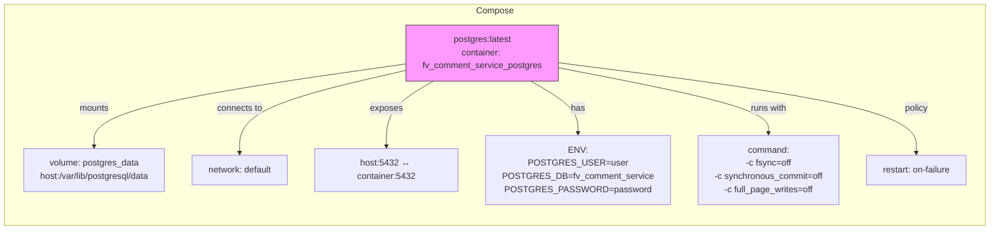

# Diagram: common/comment_service/docker-compose.yml

> Auto-generated by Obscura crawlers

## Mermaid

### SVG

<svg id="container" width="2417.53125" xmlns="http://www.w3.org/2000/svg" class="flowchart" height="394" viewBox="0 0 2417.53125 394" role="graphics-document document" aria-roledescription="flowchart-v2"><g><marker id="container_flowchart-v2-pointEnd" class="marker flowchart-v2" viewBox="0 0 10 10" refX="5" refY="5" markerUnits="userSpaceOnUse" markerWidth="8" markerHeight="8" orient="auto"><path d="M 0 0 L 10 5 L 0 10 z" class="arrowMarkerPath" style="stroke-width: 1; stroke-dasharray: 1, 0;"></path></marker><marker id="container_flowchart-v2-pointStart" class="marker flowchart-v2" viewBox="0 0 10 10" refX="4.5" refY="5" markerUnits="userSpaceOnUse" markerWidth="8" markerHeight="8" orient="auto"><path d="M 0 5 L 10 10 L 10 0 z" class="arrowMarkerPath" style="stroke-width: 1; stroke-dasharray: 1, 0;"></path></marker><marker id="container_flowchart-v2-circleEnd" class="marker flowchart-v2" viewBox="0 0 10 10" refX="11" refY="5" markerUnits="userSpaceOnUse" markerWidth="11" markerHeight="11" orient="auto"><circle cx="5" cy="5" r="5" class="arrowMarkerPath" style="stroke-width: 1; stroke-dasharray: 1, 0;"></circle></marker><marker id="container_flowchart-v2-circleStart" class="marker flowchart-v2" viewBox="0 0 10 10" refX="-1" refY="5" markerUnits="userSpaceOnUse" markerWidth="11" markerHeight="11" orient="auto"><circle cx="5" cy="5" r="5" class="arrowMarkerPath" style="stroke-width: 1; stroke-dasharray: 1, 0;"></circle></marker><marker id="container_flowchart-v2-crossEnd" class="marker cross flowchart-v2" viewBox="0 0 11 11" refX="12" refY="5.2" markerUnits="userSpaceOnUse" markerWidth="11" markerHeight="11" orient="auto"><path d="M 1,1 l 9,9 M 10,1 l -9,9" class="arrowMarkerPath" style="stroke-width: 2; stroke-dasharray: 1, 0;"></path></marker><marker id="container_flowchart-v2-crossStart" class="marker cross flowchart-v2" viewBox="0 0 11 11" refX="-1" refY="5.2" markerUnits="userSpaceOnUse" markerWidth="11" markerHeight="11" orient="auto"><path d="M 1,1 l 9,9 M 10,1 l -9,9" class="arrowMarkerPath" style="stroke-width: 2; stroke-dasharray: 1, 0;"></path></marker><g class="root"><g class="clusters"></g><g class="edgePaths"></g><g class="edgeLabels"></g><g class="nodes"><g class="root" transform="translate(0, 0)"><g class="clusters"><g class="cluster" id="Compose" data-look="classic"><rect style="" x="8" y="8" width="2401.53125" height="378"></rect><g class="cluster-label" transform="translate(1175.390625, 8)"><foreignObject width="66.75" height="24">

Compose

</foreignObject></g></g></g><g class="edgePaths"><path d="M996.066,98.257L870.238,110.714C744.409,123.171,492.751,148.086,366.923,172.126C241.094,196.167,241.094,219.333,241.094,230.917L241.094,242.5" id="L_Postgres_Volume_0" class="edge-thickness-normal edge-pattern-solid edge-thickness-normal edge-pattern-solid flowchart-link" style=";" data-edge="true" data-et="edge" data-id="L_Postgres_Volume_0" data-points="W3sieCI6OTk2LjA2NjQwNjI1LCJ5Ijo5OC4yNTY1Njg4NTY2NDk3fSx7IngiOjI0MS4wOTM3NSwieSI6MTczfSx7IngiOjI0MS4wOTM3NSwieSI6MjQ2LjV9XQ==" marker-end="url(#container_flowchart-v2-pointEnd)"></path><path d="M996.066,106.604L926.502,117.67C856.938,128.736,717.809,150.868,648.244,175.517C578.68,200.167,578.68,227.333,578.68,240.917L578.68,254.5" id="L_Postgres_Network_0" class="edge-thickness-normal edge-pattern-solid edge-thickness-normal edge-pattern-solid flowchart-link" style=";" data-edge="true" data-et="edge" data-id="L_Postgres_Network_0" data-points="W3sieCI6OTk2LjA2NjQwNjI1LCJ5IjoxMDYuNjA0MDI4MTQxNTIyMX0seyJ4Ijo1NzguNjc5Njg3NSwieSI6MTczfSx7IngiOjU3OC42Nzk2ODc1LCJ5IjoyNTguNX1d" marker-end="url(#container_flowchart-v2-pointEnd)"></path><path d="M1008.103,123.5L981.255,131.75C954.407,140,900.711,156.5,873.863,178.333C847.016,200.167,847.016,227.333,847.016,240.917L847.016,254.5" id="L_Postgres_HostPort_0" class="edge-thickness-normal edge-pattern-solid edge-thickness-normal edge-pattern-solid flowchart-link" style=";" data-edge="true" data-et="edge" data-id="L_Postgres_HostPort_0" data-points="W3sieCI6MTAwOC4xMDI1NTU2MTQ0MDY4LCJ5IjoxMjMuNX0seyJ4Ijo4NDcuMDE1NjI1LCJ5IjoxNzN9LHsieCI6ODQ3LjAxNTYyNSwieSI6MjU4LjV9XQ==" marker-end="url(#container_flowchart-v2-pointEnd)"></path><path d="M1261.937,123.5L1288.784,131.75C1315.632,140,1369.328,156.5,1396.176,178.333C1423.023,200.167,1423.023,227.333,1423.023,240.917L1423.023,254.5" id="L_Postgres_Env_0" class="edge-thickness-normal edge-pattern-solid edge-thickness-normal edge-pattern-solid flowchart-link" style=";" data-edge="true" data-et="edge" data-id="L_Postgres_Env_0" data-points="W3sieCI6MTI2MS45MzY1MDY4ODU1OTMyLCJ5IjoxMjMuNX0seyJ4IjoxNDIzLjAyMzQzNzUsInkiOjE3M30seyJ4IjoxNDIzLjAyMzQzNzUsInkiOjI1OC41fV0=" marker-end="url(#container_flowchart-v2-pointEnd)"></path><path d="M1273.973,98.661L1395.544,111.051C1517.115,123.441,1760.257,148.22,1881.827,168.194C2003.398,188.167,2003.398,203.333,2003.398,210.917L2003.398,218.5" id="L_Postgres_Command_0" class="edge-thickness-normal edge-pattern-solid edge-thickness-normal edge-pattern-solid flowchart-link" style=";" data-edge="true" data-et="edge" data-id="L_Postgres_Command_0" data-points="W3sieCI6MTI3My45NzI2NTYyNSwieSI6OTguNjYxMjczOTI1NDYyNzd9LHsieCI6MjAwMy4zOTg0Mzc1LCJ5IjoxNzN9LHsieCI6MjAwMy4zOTg0Mzc1LCJ5IjoyMjIuNX1d" marker-end="url(#container_flowchart-v2-pointEnd)"></path><path d="M1273.973,95.235L1441.739,108.196C1609.505,121.157,1945.038,147.078,2112.804,173.622C2280.57,200.167,2280.57,227.333,2280.57,240.917L2280.57,254.5" id="L_Postgres_Restart_0" class="edge-thickness-normal edge-pattern-solid edge-thickness-normal edge-pattern-solid flowchart-link" style=";" data-edge="true" data-et="edge" data-id="L_Postgres_Restart_0" data-points="W3sieCI6MTI3My45NzI2NTYyNSwieSI6OTUuMjM0ODgxMjE1MDI2ODl9LHsieCI6MjI4MC41NzAzMTI1LCJ5IjoxNzN9LHsieCI6MjI4MC41NzAzMTI1LCJ5IjoyNTguNX1d" marker-end="url(#container_flowchart-v2-pointEnd)"></path></g><g class="edgeLabels"><g class="edgeLabel" transform="translate(241.09375, 173)"><g class="label" data-id="L_Postgres_Volume_0" transform="translate(-27.5, -12)"><foreignObject width="55" height="24">

mounts

</foreignObject></g></g><g class="edgeLabel" transform="translate(578.6796875, 173)"><g class="label" data-id="L_Postgres_Network_0" transform="translate(-42.0859375, -12)"><foreignObject width="84.171875" height="24">

connects to

</foreignObject></g></g><g class="edgeLabel" transform="translate(847.015625, 173)"><g class="label" data-id="L_Postgres_HostPort_0" transform="translate(-29.4296875, -12)"><foreignObject width="58.859375" height="24">

exposes

</foreignObject></g></g><g class="edgeLabel" transform="translate(1423.0234375, 173)"><g class="label" data-id="L_Postgres_Env_0" transform="translate(-12.703125, -12)"><foreignObject width="25.40625" height="24">

has

</foreignObject></g></g><g class="edgeLabel" transform="translate(2003.3984375, 173)"><g class="label" data-id="L_Postgres_Command_0" transform="translate(-33.859375, -12)"><foreignObject width="67.71875" height="24">

runs with

</foreignObject></g></g><g class="edgeLabel" transform="translate(2280.5703125, 173)"><g class="label" data-id="L_Postgres_Restart_0" transform="translate(-21.7890625, -12)"><foreignObject width="43.578125" height="24">

policy

</foreignObject></g></g></g><g class="nodes"><g class="node default service" id="flowchart-Postgres-0" transform="translate(1135.01953125, 84.5)"><rect class="basic label-container" style="fill:#f9f !important;stroke:#333 !important;stroke-width:1px !important" x="-138.953125" y="-39" width="277.90625" height="78"></rect><g class="label" style="" transform="translate(-108.953125, -24)"><rect></rect><foreignObject width="217.90625" height="48">

postgres:latest\ncontainer: fv_comment_service_postgres

</foreignObject></g></g><g class="node default" id="flowchart-Volume-1" transform="translate(241.09375, 285.5)"><rect class="basic label-container" style="" x="-198.09375" y="-39" width="396.1875" height="78"></rect><g class="label" style="" transform="translate(-168.09375, -24)"><rect></rect><foreignObject width="336.1875" height="48">

volume: postgres_data\nhost:/var/lib/postgresql/data

</foreignObject></g></g><g class="node default" id="flowchart-Network-2" transform="translate(578.6796875, 285.5)"><rect class="basic label-container" style="" x="-89.4921875" y="-27" width="178.984375" height="54"></rect><g class="label" style="" transform="translate(-59.4921875, -12)"><rect></rect><foreignObject width="118.984375" height="24">

network: default

</foreignObject></g></g><g class="node default" id="flowchart-HostPort-3" transform="translate(847.015625, 285.5)"><rect class="basic label-container" style="" x="-128.84375" y="-27" width="257.6875" height="54"></rect><g class="label" style="" transform="translate(-98.84375, -12)"><rect></rect><foreignObject width="197.6875" height="24">

host:5432 ↔ container:5432

</foreignObject></g></g><g class="node default" id="flowchart-Env-4" transform="translate(1423.0234375, 285.5)"><rect class="basic label-container" style="" x="-397.1640625" y="-27" width="794.328125" height="54"></rect><g class="label" style="" transform="translate(-367.1640625, -12)"><rect></rect><foreignObject width="734.328125" height="24">

ENV:\nPOSTGRES_USER=user\nPOSTGRES_DB=fv_comment_service\nPOSTGRES_PASSWORD=password

</foreignObject></g></g><g class="node default" id="flowchart-Command-5" transform="translate(2003.3984375, 285.5)"><rect class="basic label-container" style="" x="-133.2109375" y="-63" width="266.421875" height="126"></rect><g class="label" style="" transform="translate(-103.2109375, -48)"><rect></rect><foreignObject width="206.421875" height="96">

command:\n-c fsync=off\n-c synchronous_commit=off\n-c full_page_writes=off

</foreignObject></g></g><g class="node default" id="flowchart-Restart-6" transform="translate(2280.5703125, 285.5)"><rect class="basic label-container" style="" x="-93.9609375" y="-27" width="187.921875" height="54"></rect><g class="label" style="" transform="translate(-63.9609375, -12)"><rect></rect><foreignObject width="127.921875" height="24">

restart: on-failure

</foreignObject></g></g></g></g></g></g></g></svg>
