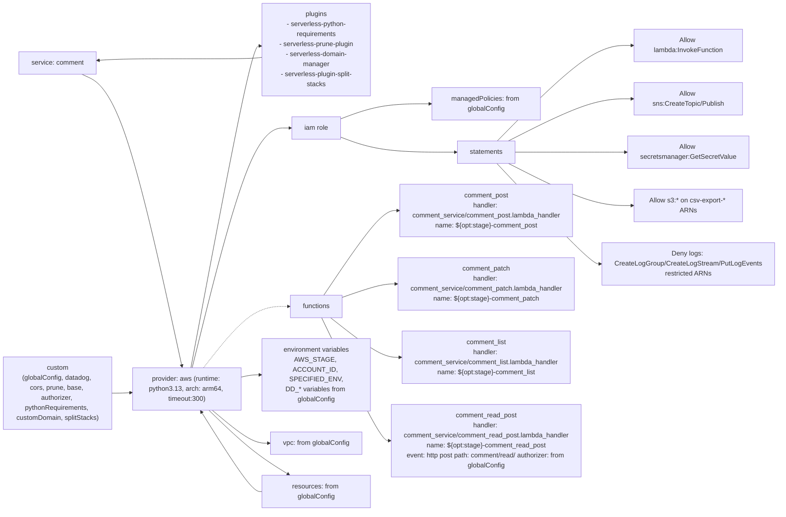

# Diagram: common/comment_service/serverless.comment.yml

> Auto-generated by Obscura crawlers

## Mermaid

### SVG

<svg id="container" width="2030.34375" xmlns="http://www.w3.org/2000/svg" class="flowchart" height="1112" viewBox="0 0 2030.34375 1112" role="graphics-document document" aria-roledescription="flowchart-v2"><g><marker id="container_flowchart-v2-pointEnd" class="marker flowchart-v2" viewBox="0 0 10 10" refX="5" refY="5" markerUnits="userSpaceOnUse" markerWidth="8" markerHeight="8" orient="auto"><path d="M 0 0 L 10 5 L 0 10 z" class="arrowMarkerPath" style="stroke-width: 1; stroke-dasharray: 1, 0;"></path></marker><marker id="container_flowchart-v2-pointStart" class="marker flowchart-v2" viewBox="0 0 10 10" refX="4.5" refY="5" markerUnits="userSpaceOnUse" markerWidth="8" markerHeight="8" orient="auto"><path d="M 0 5 L 10 10 L 10 0 z" class="arrowMarkerPath" style="stroke-width: 1; stroke-dasharray: 1, 0;"></path></marker><marker id="container_flowchart-v2-circleEnd" class="marker flowchart-v2" viewBox="0 0 10 10" refX="11" refY="5" markerUnits="userSpaceOnUse" markerWidth="11" markerHeight="11" orient="auto"><circle cx="5" cy="5" r="5" class="arrowMarkerPath" style="stroke-width: 1; stroke-dasharray: 1, 0;"></circle></marker><marker id="container_flowchart-v2-circleStart" class="marker flowchart-v2" viewBox="0 0 10 10" refX="-1" refY="5" markerUnits="userSpaceOnUse" markerWidth="11" markerHeight="11" orient="auto"><circle cx="5" cy="5" r="5" class="arrowMarkerPath" style="stroke-width: 1; stroke-dasharray: 1, 0;"></circle></marker><marker id="container_flowchart-v2-crossEnd" class="marker cross flowchart-v2" viewBox="0 0 11 11" refX="12" refY="5.2" markerUnits="userSpaceOnUse" markerWidth="11" markerHeight="11" orient="auto"><path d="M 1,1 l 9,9 M 10,1 l -9,9" class="arrowMarkerPath" style="stroke-width: 2; stroke-dasharray: 1, 0;"></path></marker><marker id="container_flowchart-v2-crossStart" class="marker cross flowchart-v2" viewBox="0 0 11 11" refX="-1" refY="5.2" markerUnits="userSpaceOnUse" markerWidth="11" markerHeight="11" orient="auto"><path d="M 1,1 l 9,9 M 10,1 l -9,9" class="arrowMarkerPath" style="stroke-width: 2; stroke-dasharray: 1, 0;"></path></marker><g class="root"><g class="clusters"></g><g class="edgePaths"><path d="M196.125,160L212.271,167.5C228.417,175,260.708,190,300.486,295.685C340.263,401.37,387.526,597.741,411.158,695.926L434.789,794.111" id="L_Service_Provider_0" class="edge-thickness-normal edge-pattern-solid edge-thickness-normal edge-pattern-solid flowchart-link" style=";" data-edge="true" data-et="edge" data-id="L_Service_Provider_0" data-points="W3sieCI6MTk2LjEyNSwieSI6MTYwfSx7IngiOjI5MywieSI6MjA1fSx7IngiOjQzNS43MjUxNTUyNzk1MDMxLCJ5Ijo3OTh9XQ==" marker-end="url(#container_flowchart-v2-pointEnd)"></path><path d="M578,805.387L582.167,803.989C586.333,802.591,594.667,799.796,602.333,798.398C610,797,617,797,620.5,797L624,797" id="L_Provider_Env_0" class="edge-thickness-normal edge-pattern-solid edge-thickness-normal edge-pattern-solid flowchart-link" style=";" data-edge="true" data-et="edge" data-id="L_Provider_Env_0" data-points="W3sieCI6NTc4LCJ5Ijo4MDUuMzg3MDk2Nzc0MTkzNX0seyJ4Ijo2MDMsInkiOjc5N30seyJ4Ijo2MjgsInkiOjc5N31d" marker-end="url(#container_flowchart-v2-pointEnd)"></path><path d="M527.05,900L539.708,908.167C552.367,916.333,577.683,932.667,597.071,940.833C616.458,949,629.917,949,636.646,949L643.375,949" id="L_Provider_VPC_0" class="edge-thickness-normal edge-pattern-solid edge-thickness-normal edge-pattern-solid flowchart-link" style=";" data-edge="true" data-et="edge" data-id="L_Provider_VPC_0" data-points="W3sieCI6NTI3LjA1LCJ5Ijo5MDB9LHsieCI6NjAzLCJ5Ijo5NDl9LHsieCI6NjQ3LjM3NSwieSI6OTQ5fV0=" marker-end="url(#container_flowchart-v2-pointEnd)"></path><path d="M461.966,798L485.472,712.167C508.978,626.333,555.989,454.667,594.699,368.833C633.409,283,663.818,283,679.022,283L694.227,283" id="L_Provider_IAM_0" class="edge-thickness-normal edge-pattern-solid edge-thickness-normal edge-pattern-solid flowchart-link" style=";" data-edge="true" data-et="edge" data-id="L_Provider_IAM_0" data-points="W3sieCI6NDYxLjk2NjQzMTA5NTQwNjM0LCJ5Ijo3OTh9LHsieCI6NjAzLCJ5IjoyODN9LHsieCI6Njk4LjIyNjU2MjUsInkiOjI4M31d" marker-end="url(#container_flowchart-v2-pointEnd)"></path><path d="M502.896,900L519.58,915.5C536.264,931,569.632,962,597.552,982.719C625.471,1003.438,647.943,1013.877,659.178,1019.096L670.414,1024.315" id="L_Provider_Resources_0" class="edge-thickness-normal edge-pattern-solid edge-thickness-normal edge-pattern-solid flowchart-link" style=";" data-edge="true" data-et="edge" data-id="L_Provider_Resources_0" data-points="W3sieCI6NTAyLjg5NTgzMzMzMzMzMzMsInkiOjkwMH0seyJ4Ijo2MDMsInkiOjk5M30seyJ4Ijo2NzQuMDQxNjY2NjY2NjY2NiwieSI6MTAyNn1d" marker-end="url(#container_flowchart-v2-pointEnd)"></path><path d="M458.512,798L482.593,681.167C506.675,564.333,554.837,330.667,582.42,214.059C610.003,97.452,617.006,97.904,620.507,98.129L624.008,98.355" id="L_Provider_Plugins_0" class="edge-thickness-normal edge-pattern-solid edge-thickness-normal edge-pattern-solid flowchart-link" style=";" data-edge="true" data-et="edge" data-id="L_Provider_Plugins_0" data-points="W3sieCI6NDU4LjUxMTk2ODA4NTEwNjQsInkiOjc5OH0seyJ4Ijo2MDMsInkiOjk3fSx7IngiOjYyOCwieSI6OTguNjEyOTAzMjI1ODA2NDV9XQ==" marker-end="url(#container_flowchart-v2-pointEnd)"></path><path d="M817.773,260.633L833.645,254.694C849.516,248.755,881.258,236.878,923.368,230.939C965.479,225,1017.958,225,1044.198,225L1070.438,225" id="L_IAM_IAMPolicies_0" class="edge-thickness-normal edge-pattern-solid edge-thickness-normal edge-pattern-solid flowchart-link" style=";" data-edge="true" data-et="edge" data-id="L_IAM_IAMPolicies_0" data-points="W3sieCI6ODE3Ljc3MzQzNzUsInkiOjI2MC42MzMxNjUzMjI1ODA2fSx7IngiOjkxMywieSI6MjI1fSx7IngiOjEwNzQuNDM3NSwieSI6MjI1fV0=" marker-end="url(#container_flowchart-v2-pointEnd)"></path><path d="M817.773,305.367L833.645,311.306C849.516,317.245,881.258,329.122,933.272,335.061C985.286,341,1057.573,341,1093.716,341L1129.859,341" id="L_IAM_IAMStatements_0" class="edge-thickness-normal edge-pattern-solid edge-thickness-normal edge-pattern-solid flowchart-link" style=";" data-edge="true" data-et="edge" data-id="L_IAM_IAMStatements_0" data-points="W3sieCI6ODE3Ljc3MzQzNzUsInkiOjMwNS4zNjY4MzQ2Nzc0MTk0fSx7IngiOjkxMywieSI6MzQxfSx7IngiOjExMzMuODU5Mzc1LCJ5IjozNDF9XQ==" marker-end="url(#container_flowchart-v2-pointEnd)"></path><path d="M1235.175,314L1278.625,275.833C1322.075,237.667,1408.975,161.333,1476.047,123.167C1543.12,85,1590.365,85,1613.987,85L1637.609,85" id="L_IAMStatements_LambdaInvoke_0" class="edge-thickness-normal edge-pattern-solid edge-thickness-normal edge-pattern-solid flowchart-link" style=";" data-edge="true" data-et="edge" data-id="L_IAMStatements_LambdaInvoke_0" data-points="W3sieCI6MTIzNS4xNzUwNDg4MjgxMjUsInkiOjMxNH0seyJ4IjoxNDk1Ljg3NSwieSI6ODV9LHsieCI6MTY0MS42MDkzNzUsInkiOjg1fV0=" marker-end="url(#container_flowchart-v2-pointEnd)"></path><path d="M1265.913,314L1304.24,297.167C1342.567,280.333,1419.221,246.667,1481.17,229.833C1543.12,213,1590.365,213,1613.987,213L1637.609,213" id="L_IAMStatements_SNSPolicy_0" class="edge-thickness-normal edge-pattern-solid edge-thickness-normal edge-pattern-solid flowchart-link" style=";" data-edge="true" data-et="edge" data-id="L_IAMStatements_SNSPolicy_0" data-points="W3sieCI6MTI2NS45MTI1OTc2NTYyNSwieSI6MzE0fSx7IngiOjE0OTUuODc1LCJ5IjoyMTN9LHsieCI6MTY0MS42MDkzNzUsInkiOjIxM31d" marker-end="url(#container_flowchart-v2-pointEnd)"></path><path d="M1275.016,341L1311.826,341C1348.635,341,1422.255,341,1480.339,341C1538.422,341,1580.969,341,1602.242,341L1623.516,341" id="L_IAMStatements_SecretsPolicy_0" class="edge-thickness-normal edge-pattern-solid edge-thickness-normal edge-pattern-solid flowchart-link" style=";" data-edge="true" data-et="edge" data-id="L_IAMStatements_SecretsPolicy_0" data-points="W3sieCI6MTI3NS4wMTU2MjUsInkiOjM0MX0seyJ4IjoxNDk1Ljg3NSwieSI6MzQxfSx7IngiOjE2MjcuNTE1NjI1LCJ5IjozNDF9XQ==" marker-end="url(#container_flowchart-v2-pointEnd)"></path><path d="M1265.913,368L1304.24,384.833C1342.567,401.667,1419.221,435.333,1481.17,452.167C1543.12,469,1590.365,469,1613.987,469L1637.609,469" id="L_IAMStatements_S3Policy_0" class="edge-thickness-normal edge-pattern-solid edge-thickness-normal edge-pattern-solid flowchart-link" style=";" data-edge="true" data-et="edge" data-id="L_IAMStatements_S3Policy_0" data-points="W3sieCI6MTI2NS45MTI1OTc2NTYyNSwieSI6MzY4fSx7IngiOjE0OTUuODc1LCJ5Ijo0Njl9LHsieCI6MTY0MS42MDkzNzUsInkiOjQ2OX1d" marker-end="url(#container_flowchart-v2-pointEnd)"></path><path d="M1233.799,368L1277.478,408.167C1321.157,448.333,1408.516,528.667,1455.696,568.833C1502.875,609,1509.875,609,1513.375,609L1516.875,609" id="L_IAMStatements_DenyLogs_0" class="edge-thickness-normal edge-pattern-solid edge-thickness-normal edge-pattern-solid flowchart-link" style=";" data-edge="true" data-et="edge" data-id="L_IAMStatements_DenyLogs_0" data-points="W3sieCI6MTIzMy43OTg3NDA2NzE2NDE4LCJ5IjozNjh9LHsieCI6MTQ5NS44NzUsInkiOjYwOX0seyJ4IjoxNTIwLjg3NSwieSI6NjA5fV0=" marker-end="url(#container_flowchart-v2-pointEnd)"></path><path d="M781.778,618L803.649,593.167C825.519,568.333,869.259,518.667,898.033,493.833C926.807,469,940.615,469,947.518,469L954.422,469" id="L_Functions_comment_post_0" class="edge-thickness-normal edge-pattern-solid edge-thickness-normal edge-pattern-solid flowchart-link" style=";" data-edge="true" data-et="edge" data-id="L_Functions_comment_post_0" data-points="W3sieCI6NzgxLjc3ODQwOTA5MDkwOTEsInkiOjYxOH0seyJ4Ijo5MTMsInkiOjQ2OX0seyJ4Ijo5NTguNDIxODc1LCJ5Ijo0Njl9XQ==" marker-end="url(#container_flowchart-v2-pointEnd)"></path><path d="M822.094,635.076L837.245,632.73C852.396,630.384,882.698,625.692,904.048,623.346C925.398,621,937.797,621,943.996,621L950.195,621" id="L_Functions_comment_patch_0" class="edge-thickness-normal edge-pattern-solid edge-thickness-normal edge-pattern-solid flowchart-link" style=";" data-edge="true" data-et="edge" data-id="L_Functions_comment_patch_0" data-points="W3sieCI6ODIyLjA5Mzc1LCJ5Ijo2MzUuMDc1ODA2NDUxNjEzfSx7IngiOjkxMywieSI6NjIxfSx7IngiOjk1NC4xOTUzMTI1LCJ5Ijo2MjF9XQ==" marker-end="url(#container_flowchart-v2-pointEnd)"></path><path d="M790.695,672L811.079,688.833C831.464,705.667,872.232,739.333,900.336,756.167C928.44,773,943.88,773,951.6,773L959.32,773" id="L_Functions_comment_list_0" class="edge-thickness-normal edge-pattern-solid edge-thickness-normal edge-pattern-solid flowchart-link" style=";" data-edge="true" data-et="edge" data-id="L_Functions_comment_list_0" data-points="W3sieCI6NzkwLjY5NTMxMjUsInkiOjY3Mn0seyJ4Ijo5MTMsInkiOjc3M30seyJ4Ijo5NjMuMzIwMzEyNSwieSI6NzczfV0=" marker-end="url(#container_flowchart-v2-pointEnd)"></path><path d="M772.332,672L795.777,716.167C819.221,760.333,866.111,848.667,893.055,892.833C920,937,927,937,930.5,937L934,937" id="L_Functions_comment_read_post_0" class="edge-thickness-normal edge-pattern-solid edge-thickness-normal edge-pattern-solid flowchart-link" style=";" data-edge="true" data-et="edge" data-id="L_Functions_comment_read_post_0" data-points="W3sieCI6NzcyLjMzMjE5MTc4MDgyMiwieSI6NjcyfSx7IngiOjkxMywieSI6OTM3fSx7IngiOjkzOCwieSI6OTM3fV0=" marker-end="url(#container_flowchart-v2-pointEnd)"></path><path d="M486.75,798L506.125,772.5C525.5,747,564.25,696,598.109,670.5C631.969,645,660.938,645,675.422,645L689.906,645" id="L_Provider_Functions_0" class="edge-thickness-normal edge-pattern-dotted edge-thickness-normal edge-pattern-solid flowchart-link" style=";" data-edge="true" data-et="edge" data-id="L_Provider_Functions_0" data-points="W3sieCI6NDg2Ljc1LCJ5Ijo3OTh9LHsieCI6NjAzLCJ5Ijo2NDV9LHsieCI6NjkzLjkwNjI1LCJ5Ijo2NDV9XQ==" marker-end="url(#container_flowchart-v2-pointEnd)"></path><path d="M268,859L272.167,859C276.333,859,284.667,859,292.335,858.774C300.003,858.548,307.006,858.096,310.507,857.871L314.008,857.645" id="L_Custom_Provider_0" class="edge-thickness-normal edge-pattern-solid edge-thickness-normal edge-pattern-solid flowchart-link" style=";" data-edge="true" data-et="edge" data-id="L_Custom_Provider_0" data-points="W3sieCI6MjY4LCJ5Ijo4NTl9LHsieCI6MjkzLCJ5Ijo4NTl9LHsieCI6MzE4LCJ5Ijo4NTcuMzg3MDk2Nzc0MTkzNX1d" marker-end="url(#container_flowchart-v2-pointEnd)"></path><path d="M628,1065L623.833,1065C619.667,1065,611.333,1065,587.822,1038.042C564.31,1011.083,525.62,957.167,506.274,930.208L486.929,903.25" id="L_Resources_Provider_0" class="edge-thickness-normal edge-pattern-solid edge-thickness-normal edge-pattern-solid flowchart-link" style=";" data-edge="true" data-et="edge" data-id="L_Resources_Provider_0" data-points="W3sieCI6NjI4LCJ5IjoxMDY1fSx7IngiOjYwMywieSI6MTA2NX0seyJ4Ijo0ODQuNTk3MjIyMjIyMjIyMjMsInkiOjkwMH1d" marker-end="url(#container_flowchart-v2-pointEnd)"></path><path d="M628,120.419L623.833,120.849C619.667,121.28,611.333,122.14,581.333,122.57C551.333,123,499.667,123,448,123C396.333,123,344.667,123,309.237,123.619C273.807,124.238,254.614,125.476,245.018,126.096L235.421,126.715" id="L_Plugins_Service_0" class="edge-thickness-normal edge-pattern-solid edge-thickness-normal edge-pattern-solid flowchart-link" style=";" data-edge="true" data-et="edge" data-id="L_Plugins_Service_0" data-points="W3sieCI6NjI4LCJ5IjoxMjAuNDE5MzU0ODM4NzA5Njh9LHsieCI6NjAzLCJ5IjoxMjN9LHsieCI6NDQ4LCJ5IjoxMjN9LHsieCI6MjkzLCJ5IjoxMjN9LHsieCI6MjMxLjQyOTY4NzUsInkiOjEyNi45NzIyNzgyMjU4MDY0NX1d" marker-end="url(#container_flowchart-v2-pointEnd)"></path></g><g class="edgeLabels"><g class="edgeLabel"><g class="label" data-id="L_Service_Provider_0" transform="translate(0, 0)"><foreignObject width="0" height="0">

</foreignObject></g></g><g class="edgeLabel"><g class="label" data-id="L_Provider_Env_0" transform="translate(0, 0)"><foreignObject width="0" height="0">

</foreignObject></g></g><g class="edgeLabel"><g class="label" data-id="L_Provider_VPC_0" transform="translate(0, 0)"><foreignObject width="0" height="0">

</foreignObject></g></g><g class="edgeLabel"><g class="label" data-id="L_Provider_IAM_0" transform="translate(0, 0)"><foreignObject width="0" height="0">

</foreignObject></g></g><g class="edgeLabel"><g class="label" data-id="L_Provider_Resources_0" transform="translate(0, 0)"><foreignObject width="0" height="0">

</foreignObject></g></g><g class="edgeLabel"><g class="label" data-id="L_Provider_Plugins_0" transform="translate(0, 0)"><foreignObject width="0" height="0">

</foreignObject></g></g><g class="edgeLabel"><g class="label" data-id="L_IAM_IAMPolicies_0" transform="translate(0, 0)"><foreignObject width="0" height="0">

</foreignObject></g></g><g class="edgeLabel"><g class="label" data-id="L_IAM_IAMStatements_0" transform="translate(0, 0)"><foreignObject width="0" height="0">

</foreignObject></g></g><g class="edgeLabel"><g class="label" data-id="L_IAMStatements_LambdaInvoke_0" transform="translate(0, 0)"><foreignObject width="0" height="0">

</foreignObject></g></g><g class="edgeLabel"><g class="label" data-id="L_IAMStatements_SNSPolicy_0" transform="translate(0, 0)"><foreignObject width="0" height="0">

</foreignObject></g></g><g class="edgeLabel"><g class="label" data-id="L_IAMStatements_SecretsPolicy_0" transform="translate(0, 0)"><foreignObject width="0" height="0">

</foreignObject></g></g><g class="edgeLabel"><g class="label" data-id="L_IAMStatements_S3Policy_0" transform="translate(0, 0)"><foreignObject width="0" height="0">

</foreignObject></g></g><g class="edgeLabel"><g class="label" data-id="L_IAMStatements_DenyLogs_0" transform="translate(0, 0)"><foreignObject width="0" height="0">

</foreignObject></g></g><g class="edgeLabel"><g class="label" data-id="L_Functions_comment_post_0" transform="translate(0, 0)"><foreignObject width="0" height="0">

</foreignObject></g></g><g class="edgeLabel"><g class="label" data-id="L_Functions_comment_patch_0" transform="translate(0, 0)"><foreignObject width="0" height="0">

</foreignObject></g></g><g class="edgeLabel"><g class="label" data-id="L_Functions_comment_list_0" transform="translate(0, 0)"><foreignObject width="0" height="0">

</foreignObject></g></g><g class="edgeLabel"><g class="label" data-id="L_Functions_comment_read_post_0" transform="translate(0, 0)"><foreignObject width="0" height="0">

</foreignObject></g></g><g class="edgeLabel"><g class="label" data-id="L_Provider_Functions_0" transform="translate(0, 0)"><foreignObject width="0" height="0">

</foreignObject></g></g><g class="edgeLabel"><g class="label" data-id="L_Custom_Provider_0" transform="translate(0, 0)"><foreignObject width="0" height="0">

</foreignObject></g></g><g class="edgeLabel"><g class="label" data-id="L_Resources_Provider_0" transform="translate(0, 0)"><foreignObject width="0" height="0">

</foreignObject></g></g><g class="edgeLabel"><g class="label" data-id="L_Plugins_Service_0" transform="translate(0, 0)"><foreignObject width="0" height="0">

</foreignObject></g></g></g><g class="nodes"><g class="node default" id="flowchart-Service-0" transform="translate(138, 133)"><rect class="basic label-container" style="" x="-93.4296875" y="-27" width="186.859375" height="54"></rect><g class="label" style="" transform="translate(-63.4296875, -12)"><rect></rect><foreignObject width="126.859375" height="24">

service: comment

</foreignObject></g></g><g class="node default" id="flowchart-Provider-1" transform="translate(448, 849)"><rect class="basic label-container" style="" x="-130" y="-51" width="260" height="102"></rect><g class="label" style="" transform="translate(-100, -36)"><rect></rect><foreignObject width="200" height="72">

provider: aws (runtime: python3.13, arch: arm64, timeout:300)

</foreignObject></g></g><g class="node default" id="flowchart-Plugins-2" transform="translate(758, 107)"><rect class="basic label-container" style="" x="-130" y="-99" width="260" height="198"></rect><g class="label" style="" transform="translate(-100, -84)"><rect></rect><foreignObject width="200" height="168">

plugins\n- serverless-python-requirements\n- serverless-prune-plugin\n- serverless-domain-manager\n- serverless-plugin-split-stacks

</foreignObject></g></g><g class="node default" id="flowchart-Functions-3" transform="translate(758, 645)"><rect class="basic label-container" style="" x="-64.09375" y="-27" width="128.1875" height="54"></rect><g class="label" style="" transform="translate(-34.09375, -12)"><rect></rect><foreignObject width="68.1875" height="24">

functions

</foreignObject></g></g><g class="node default" id="flowchart-IAM-4" transform="translate(758, 283)"><rect class="basic label-container" style="" x="-59.7734375" y="-27" width="119.546875" height="54"></rect><g class="label" style="" transform="translate(-29.7734375, -12)"><rect></rect><foreignObject width="59.546875" height="24">

iam role

</foreignObject></g></g><g class="node default" id="flowchart-IAMPolicies-5" transform="translate(1204.4375, 225)"><rect class="basic label-container" style="" x="-130" y="-39" width="260" height="78"></rect><g class="label" style="" transform="translate(-100, -24)"><rect></rect><foreignObject width="200" height="48">

managedPolicies: from globalConfig

</foreignObject></g></g><g class="node default" id="flowchart-IAMStatements-6" transform="translate(1204.4375, 341)"><rect class="basic label-container" style="" x="-70.578125" y="-27" width="141.15625" height="54"></rect><g class="label" style="" transform="translate(-40.578125, -12)"><rect></rect><foreignObject width="81.15625" height="24">

statements

</foreignObject></g></g><g class="node default" id="flowchart-DenyLogs-7" transform="translate(1771.609375, 609)"><rect class="basic label-container" style="" x="-250.734375" y="-51" width="501.46875" height="102"></rect><g class="label" style="" transform="translate(-220.734375, -36)"><rect></rect><foreignObject width="441.46875" height="72">

Deny logs: CreateLogGroup/CreateLogStream/PutLogEvents\nrestricted ARNs

</foreignObject></g></g><g class="node default" id="flowchart-S3Policy-8" transform="translate(1771.609375, 469)"><rect class="basic label-container" style="" x="-130" y="-39" width="260" height="78"></rect><g class="label" style="" transform="translate(-100, -24)"><rect></rect><foreignObject width="200" height="48">

Allow s3:* on csv-export-* ARNs

</foreignObject></g></g><g class="node default" id="flowchart-SecretsPolicy-9" transform="translate(1771.609375, 341)"><rect class="basic label-container" style="" x="-144.09375" y="-39" width="288.1875" height="78"></rect><g class="label" style="" transform="translate(-114.09375, -24)"><rect></rect><foreignObject width="228.1875" height="48">

Allow secretsmanager:GetSecretValue

</foreignObject></g></g><g class="node default" id="flowchart-SNSPolicy-10" transform="translate(1771.609375, 213)"><rect class="basic label-container" style="" x="-130" y="-39" width="260" height="78"></rect><g class="label" style="" transform="translate(-100, -24)"><rect></rect><foreignObject width="200" height="48">

Allow sns:CreateTopic/Publish

</foreignObject></g></g><g class="node default" id="flowchart-LambdaInvoke-11" transform="translate(1771.609375, 85)"><rect class="basic label-container" style="" x="-130" y="-39" width="260" height="78"></rect><g class="label" style="" transform="translate(-100, -24)"><rect></rect><foreignObject width="200" height="48">

Allow lambda:InvokeFunction

</foreignObject></g></g><g class="node default" id="flowchart-Env-12" transform="translate(758, 797)"><rect class="basic label-container" style="" x="-130" y="-75" width="260" height="150"></rect><g class="label" style="" transform="translate(-100, -60)"><rect></rect><foreignObject width="200" height="120">

environment variables\nAWS_STAGE, ACCOUNT_ID, SPECIFIED_ENV,\nDD_* variables from globalConfig

</foreignObject></g></g><g class="node default" id="flowchart-VPC-13" transform="translate(758, 949)"><rect class="basic label-container" style="" x="-110.625" y="-27" width="221.25" height="54"></rect><g class="label" style="" transform="translate(-80.625, -12)"><rect></rect><foreignObject width="161.25" height="24">

vpc: from globalConfig

</foreignObject></g></g><g class="node default" id="flowchart-Resources-14" transform="translate(758, 1065)"><rect class="basic label-container" style="" x="-130" y="-39" width="260" height="78"></rect><g class="label" style="" transform="translate(-100, -24)"><rect></rect><foreignObject width="200" height="48">

resources: from globalConfig

</foreignObject></g></g><g class="node default" id="flowchart-Custom-15" transform="translate(138, 859)"><rect class="basic label-container" style="" x="-130" y="-87" width="260" height="174"></rect><g class="label" style="" transform="translate(-100, -72)"><rect></rect><foreignObject width="200" height="144">

custom\n(globalConfig, datadog, cors, prune, base, authorizer, pythonRequirements, customDomain, splitStacks)

</foreignObject></g></g><g class="node default" id="flowchart-comment_post-43" transform="translate(1204.4375, 469)"><rect class="basic label-container" style="" x="-246.015625" y="-51" width="492.03125" height="102"></rect><g class="label" style="" transform="translate(-216.015625, -36)"><rect></rect><foreignObject width="432.03125" height="72">

comment_post\nhandler: comment_service/comment_post.lambda_handler\nname: ${opt:stage}-comment_post

</foreignObject></g></g><g class="node default" id="flowchart-comment_patch-45" transform="translate(1204.4375, 621)"><rect class="basic label-container" style="" x="-250.2421875" y="-51" width="500.484375" height="102"></rect><g class="label" style="" transform="translate(-220.2421875, -36)"><rect></rect><foreignObject width="440.484375" height="72">

comment_patch\nhandler: comment_service/comment_patch.lambda_handler\nname: ${opt:stage}-comment_patch

</foreignObject></g></g><g class="node default" id="flowchart-comment_list-47" transform="translate(1204.4375, 773)"><rect class="basic label-container" style="" x="-241.1171875" y="-51" width="482.234375" height="102"></rect><g class="label" style="" transform="translate(-211.1171875, -36)"><rect></rect><foreignObject width="422.234375" height="72">

comment_list\nhandler: comment_service/comment_list.lambda_handler\nname: ${opt:stage}-comment_list

</foreignObject></g></g><g class="node default" id="flowchart-comment_read_post-49" transform="translate(1204.4375, 937)"><rect class="basic label-container" style="" x="-266.4375" y="-63" width="532.875" height="126"></rect><g class="label" style="" transform="translate(-236.4375, -48)"><rect></rect><foreignObject width="472.875" height="96">

comment_read_post\nhandler: comment_service/comment_read_post.lambda_handler\nname: ${opt:stage}-comment_read_post\nevent: http post path: comment/read/ authorizer: from globalConfig

</foreignObject></g></g></g></g></g></svg>
