# Diagram: common/document_service/.pre-commit-config.yaml

> Auto-generated by Obscura crawlers

## Mermaid

```mermaid
graph TD
  Repo_ASTRAL["repo: https://github.com/astral-sh/ruff-pre-commit (rev: v0.5.6)"]
  Repo_LOCAL["repo: local"]

  Repo_ASTRAL --> Hook_RUFF["hook: ruff"]
  Hook_RUFF --> RUFF_ARGS["args: --fix platform/common/document_service/src/api"]
  Hook_RUFF --> RUFF_STAGES["stages: pre-commit"]
  Hook_RUFF --> RUFF_ALWAYS["always_run: true"]
  Hook_RUFF --> RUFF_PASS["pass_filenames: false"]
  Hook_RUFF --> RUFF_FILES["files: ^platform/common/document_service/src/api/"]

  Repo_ASTRAL --> Hook_RUFF_FMT["hook: ruff-format"]
  Hook_RUFF_FMT --> RFFMT_ARGS["args: platform/common/document_service/src/api"]
  Hook_RUFF_FMT --> RFFMT_STAGES["stages: pre-commit"]
  Hook_RUFF_FMT --> RFFMT_ALWAYS["always_run: true"]
  Hook_RUFF_FMT --> RFFMT_PASS["pass_filenames: false"]
  Hook_RUFF_FMT --> RFFMT_FILES["files: ^platform/common/document_service/src/api/"]

  Repo_LOCAL --> Hook_PYRIGHT["hook: pyright-document-service"]
  Hook_PYRIGHT --> PYRIGHT_NAME["name: pyright (document-service)"]
  Hook_PYRIGHT --> PYRIGHT_ENTRY["entry: npx --yes pyright --project platform/common/document_service/pyrightconfig.json"]
  Hook_PYRIGHT --> PYRIGHT_LANG["language: system"]
  Hook_PYRIGHT --> PYRIGHT_TYPES["types: [python]"]
  Hook_PYRIGHT --> PYRIGHT_PASS["pass_filenames: false"]
  Hook_PYRIGHT --> PYRIGHT_ALWAYS["always_run: true"]
  Hook_PYRIGHT --> PYRIGHT_STAGES["stages: [pre-commit]"]
  Hook_PYRIGHT --> PYRIGHT_FILES["files: ^platform/common/document_service/src/api/"]

  Repo_LOCAL --> Hook_PYTEST["hook: pytest-document-service"]
  Hook_PYTEST --> PYTEST_NAME["name: pytest (document-service)"]
  Hook_PYTEST --> PYTEST_ENTRY["entry: bash -lc 'platform/common/document_service/scripts/run_pytest.sh'"]
  Hook_PYTEST --> PYTEST_LANG["language: system"]
  Hook_PYTEST --> PYTEST_TYPES["types: [python]"]
  Hook_PYTEST --> PYTEST_PASS["pass_filenames: false"]
  Hook_PYTEST --> PYTEST_ALWAYS["always_run: true"]
  Hook_PYTEST --> PYTEST_STAGES["stages: [pre-commit]"]
  Hook_PYTEST --> PYTEST_FILES["files: ^platform/common/document_service"]

  style Repo_ASTRAL fill:#f9f,stroke:#333,stroke-width:2px
  style Repo_LOCAL fill:#9ff,stroke:#333,stroke-width:2px
  classDef meta fill:#fff,stroke:#666,stroke-dasharray: 5 5;
  class RUFF_ARGS,RFFMT_ARGS,PYRIGHT_ENTRY,PYTEST_ENTRY meta
```

### SVG

<svg id="container" width="8205.171875" xmlns="http://www.w3.org/2000/svg" class="flowchart" height="398" viewBox="0 0 8205.171875 398" role="graphics-document document" aria-roledescription="flowchart-v2"><g><marker id="container_flowchart-v2-pointEnd" class="marker flowchart-v2" viewBox="0 0 10 10" refX="5" refY="5" markerUnits="userSpaceOnUse" markerWidth="8" markerHeight="8" orient="auto"><path d="M 0 0 L 10 5 L 0 10 z" class="arrowMarkerPath" style="stroke-width: 1; stroke-dasharray: 1, 0;"></path></marker><marker id="container_flowchart-v2-pointStart" class="marker flowchart-v2" viewBox="0 0 10 10" refX="4.5" refY="5" markerUnits="userSpaceOnUse" markerWidth="8" markerHeight="8" orient="auto"><path d="M 0 5 L 10 10 L 10 0 z" class="arrowMarkerPath" style="stroke-width: 1; stroke-dasharray: 1, 0;"></path></marker><marker id="container_flowchart-v2-circleEnd" class="marker flowchart-v2" viewBox="0 0 10 10" refX="11" refY="5" markerUnits="userSpaceOnUse" markerWidth="11" markerHeight="11" orient="auto"><circle cx="5" cy="5" r="5" class="arrowMarkerPath" style="stroke-width: 1; stroke-dasharray: 1, 0;"></circle></marker><marker id="container_flowchart-v2-circleStart" class="marker flowchart-v2" viewBox="0 0 10 10" refX="-1" refY="5" markerUnits="userSpaceOnUse" markerWidth="11" markerHeight="11" orient="auto"><circle cx="5" cy="5" r="5" class="arrowMarkerPath" style="stroke-width: 1; stroke-dasharray: 1, 0;"></circle></marker><marker id="container_flowchart-v2-crossEnd" class="marker cross flowchart-v2" viewBox="0 0 11 11" refX="12" refY="5.2" markerUnits="userSpaceOnUse" markerWidth="11" markerHeight="11" orient="auto"><path d="M 1,1 l 9,9 M 10,1 l -9,9" class="arrowMarkerPath" style="stroke-width: 2; stroke-dasharray: 1, 0;"></path></marker><marker id="container_flowchart-v2-crossStart" class="marker cross flowchart-v2" viewBox="0 0 11 11" refX="-1" refY="5.2" markerUnits="userSpaceOnUse" markerWidth="11" markerHeight="11" orient="auto"><path d="M 1,1 l 9,9 M 10,1 l -9,9" class="arrowMarkerPath" style="stroke-width: 2; stroke-dasharray: 1, 0;"></path></marker><g class="root"><g class="clusters"></g><g class="edgePaths"><path d="M1479.859,84.929L1364.639,97.274C1249.419,109.619,1018.979,134.31,903.759,152.155C788.539,170,788.539,181,788.539,186.5L788.539,192" id="L_Repo_ASTRAL_Hook_RUFF_0" class="edge-thickness-normal edge-pattern-solid edge-thickness-normal edge-pattern-solid flowchart-link" style=";" data-edge="true" data-et="edge" data-id="L_Repo_ASTRAL_Hook_RUFF_0" data-points="W3sieCI6MTQ3OS44NTkzNzUsInkiOjg0LjkyODc5MjI0NTcxNzE2fSx7IngiOjc4OC41MzkwNjI1LCJ5IjoxNTl9LHsieCI6Nzg4LjUzOTA2MjUsInkiOjE5Nn1d" marker-end="url(#container_flowchart-v2-pointEnd)"></path><path d="M723.234,230.151L636.711,239.626C550.188,249.101,377.141,268.05,290.617,281.025C204.094,294,204.094,301,204.094,304.5L204.094,308" id="L_Hook_RUFF_RUFF_ARGS_0" class="edge-thickness-normal edge-pattern-solid edge-thickness-normal edge-pattern-solid flowchart-link" style=";" data-edge="true" data-et="edge" data-id="L_Hook_RUFF_RUFF_ARGS_0" data-points="W3sieCI6NzIzLjIzNDM3NSwieSI6MjMwLjE1MTIyNTExOTk3MjJ9LHsieCI6MjA0LjA5Mzc1LCJ5IjoyODd9LHsieCI6MjA0LjA5Mzc1LCJ5IjozMTJ9XQ==" marker-end="url(#container_flowchart-v2-pointEnd)"></path><path d="M723.234,240.49L694.292,248.242C665.349,255.994,607.464,271.497,578.521,284.748C549.578,298,549.578,309,549.578,314.5L549.578,320" id="L_Hook_RUFF_RUFF_STAGES_0" class="edge-thickness-normal edge-pattern-solid edge-thickness-normal edge-pattern-solid flowchart-link" style=";" data-edge="true" data-et="edge" data-id="L_Hook_RUFF_RUFF_STAGES_0" data-points="W3sieCI6NzIzLjIzNDM3NSwieSI6MjQwLjQ5MDMwNjMzOTI5NDQ4fSx7IngiOjU0OS41NzgxMjUsInkiOjI4N30seyJ4Ijo1NDkuNTc4MTI1LCJ5IjozMjR9XQ==" marker-end="url(#container_flowchart-v2-pointEnd)"></path><path d="M788.539,250L788.539,256.167C788.539,262.333,788.539,274.667,788.539,286.333C788.539,298,788.539,309,788.539,314.5L788.539,320" id="L_Hook_RUFF_RUFF_ALWAYS_0" class="edge-thickness-normal edge-pattern-solid edge-thickness-normal edge-pattern-solid flowchart-link" style=";" data-edge="true" data-et="edge" data-id="L_Hook_RUFF_RUFF_ALWAYS_0" data-points="W3sieCI6Nzg4LjUzOTA2MjUsInkiOjI1MH0seyJ4Ijo3ODguNTM5MDYyNSwieSI6Mjg3fSx7IngiOjc4OC41MzkwNjI1LCJ5IjozMjR9XQ==" marker-end="url(#container_flowchart-v2-pointEnd)"></path><path d="M853.844,239.972L884.004,247.81C914.164,255.648,974.484,271.324,1004.645,284.662C1034.805,298,1034.805,309,1034.805,314.5L1034.805,320" id="L_Hook_RUFF_RUFF_PASS_0" class="edge-thickness-normal edge-pattern-solid edge-thickness-normal edge-pattern-solid flowchart-link" style=";" data-edge="true" data-et="edge" data-id="L_Hook_RUFF_RUFF_PASS_0" data-points="W3sieCI6ODUzLjg0Mzc1LCJ5IjoyMzkuOTcxNTExOTU5OTAxMDJ9LHsieCI6MTAzNC44MDQ2ODc1LCJ5IjoyODd9LHsieCI6MTAzNC44MDQ2ODc1LCJ5IjozMjR9XQ==" marker-end="url(#container_flowchart-v2-pointEnd)"></path><path d="M853.844,229.879L944.215,239.4C1034.586,248.92,1215.328,267.96,1305.699,280.98C1396.07,294,1396.07,301,1396.07,304.5L1396.07,308" id="L_Hook_RUFF_RUFF_FILES_0" class="edge-thickness-normal edge-pattern-solid edge-thickness-normal edge-pattern-solid flowchart-link" style=";" data-edge="true" data-et="edge" data-id="L_Hook_RUFF_RUFF_FILES_0" data-points="W3sieCI6ODUzLjg0Mzc1LCJ5IjoyMjkuODc5NDgxNTA4MTUyODh9LHsieCI6MTM5Ni4wNzAzMTI1LCJ5IjoyODd9LHsieCI6MTM5Ni4wNzAzMTI1LCJ5IjozMTJ9XQ==" marker-end="url(#container_flowchart-v2-pointEnd)"></path><path d="M1739.859,84.929L1855.079,97.274C1970.299,109.619,2200.74,134.31,2315.96,152.155C2431.18,170,2431.18,181,2431.18,186.5L2431.18,192" id="L_Repo_ASTRAL_Hook_RUFF_FMT_0" class="edge-thickness-normal edge-pattern-solid edge-thickness-normal edge-pattern-solid flowchart-link" style=";" data-edge="true" data-et="edge" data-id="L_Repo_ASTRAL_Hook_RUFF_FMT_0" data-points="W3sieCI6MTczOS44NTkzNzUsInkiOjg0LjkyODc5MjI0NTcxNzE2fSx7IngiOjI0MzEuMTc5Njg3NSwieSI6MTU5fSx7IngiOjI0MzEuMTc5Njg3NSwieSI6MTk2fV0=" marker-end="url(#container_flowchart-v2-pointEnd)"></path><path d="M2338.469,233.152L2256.513,242.127C2174.557,251.102,2010.646,269.051,1928.69,281.525C1846.734,294,1846.734,301,1846.734,304.5L1846.734,308" id="L_Hook_RUFF_FMT_RFFMT_ARGS_0" class="edge-thickness-normal edge-pattern-solid edge-thickness-normal edge-pattern-solid flowchart-link" style=";" data-edge="true" data-et="edge" data-id="L_Hook_RUFF_FMT_RFFMT_ARGS_0" data-points="W3sieCI6MjMzOC40Njg3NSwieSI6MjMzLjE1MjM2MTM0Njg5Njc1fSx7IngiOjE4NDYuNzM0Mzc1LCJ5IjoyODd9LHsieCI6MTg0Ni43MzQzNzUsInkiOjMxMn1d" marker-end="url(#container_flowchart-v2-pointEnd)"></path><path d="M2338.469,247.83L2314.094,254.359C2289.719,260.887,2240.969,273.943,2216.594,285.972C2192.219,298,2192.219,309,2192.219,314.5L2192.219,320" id="L_Hook_RUFF_FMT_RFFMT_STAGES_0" class="edge-thickness-normal edge-pattern-solid edge-thickness-normal edge-pattern-solid flowchart-link" style=";" data-edge="true" data-et="edge" data-id="L_Hook_RUFF_FMT_RFFMT_STAGES_0" data-points="W3sieCI6MjMzOC40Njg3NSwieSI6MjQ3LjgzMDQxODE1MTUwMjI3fSx7IngiOjIxOTIuMjE4NzUsInkiOjI4N30seyJ4IjoyMTkyLjIxODc1LCJ5IjozMjR9XQ==" marker-end="url(#container_flowchart-v2-pointEnd)"></path><path d="M2431.18,250L2431.18,256.167C2431.18,262.333,2431.18,274.667,2431.18,286.333C2431.18,298,2431.18,309,2431.18,314.5L2431.18,320" id="L_Hook_RUFF_FMT_RFFMT_ALWAYS_0" class="edge-thickness-normal edge-pattern-solid edge-thickness-normal edge-pattern-solid flowchart-link" style=";" data-edge="true" data-et="edge" data-id="L_Hook_RUFF_FMT_RFFMT_ALWAYS_0" data-points="W3sieCI6MjQzMS4xNzk2ODc1LCJ5IjoyNTB9LHsieCI6MjQzMS4xNzk2ODc1LCJ5IjoyODd9LHsieCI6MjQzMS4xNzk2ODc1LCJ5IjozMjR9XQ==" marker-end="url(#container_flowchart-v2-pointEnd)"></path><path d="M2523.891,247.094L2549.483,253.745C2575.076,260.396,2626.26,273.698,2651.853,285.849C2677.445,298,2677.445,309,2677.445,314.5L2677.445,320" id="L_Hook_RUFF_FMT_RFFMT_PASS_0" class="edge-thickness-normal edge-pattern-solid edge-thickness-normal edge-pattern-solid flowchart-link" style=";" data-edge="true" data-et="edge" data-id="L_Hook_RUFF_FMT_RFFMT_PASS_0" data-points="W3sieCI6MjUyMy44OTA2MjUsInkiOjI0Ny4wOTM5MDI2NzExNTAzMn0seyJ4IjoyNjc3LjQ0NTMxMjUsInkiOjI4N30seyJ4IjoyNjc3LjQ0NTMxMjUsInkiOjMyNH1d" marker-end="url(#container_flowchart-v2-pointEnd)"></path><path d="M2523.891,232.767L2609.694,241.805C2695.497,250.844,2867.104,268.922,2952.908,281.461C3038.711,294,3038.711,301,3038.711,304.5L3038.711,308" id="L_Hook_RUFF_FMT_RFFMT_FILES_0" class="edge-thickness-normal edge-pattern-solid edge-thickness-normal edge-pattern-solid flowchart-link" style=";" data-edge="true" data-et="edge" data-id="L_Hook_RUFF_FMT_RFFMT_FILES_0" data-points="W3sieCI6MjUyMy44OTA2MjUsInkiOjIzMi43NjY1NzU3OTM0MjYyNn0seyJ4IjozMDM4LjcxMDkzNzUsInkiOjI4N30seyJ4IjozMDM4LjcxMDkzNzUsInkiOjMxMn1d" marker-end="url(#container_flowchart-v2-pointEnd)"></path><path d="M5758.129,75.737L5558.888,89.614C5359.647,103.492,4961.165,131.246,4761.924,148.623C4562.684,166,4562.684,173,4562.684,176.5L4562.684,180" id="L_Repo_LOCAL_Hook_PYRIGHT_0" class="edge-thickness-normal edge-pattern-solid edge-thickness-normal edge-pattern-solid flowchart-link" style=";" data-edge="true" data-et="edge" data-id="L_Repo_LOCAL_Hook_PYRIGHT_0" data-points="W3sieCI6NTc1OC4xMjg5MDYyNSwieSI6NzUuNzM3Mjg1MzU4Mjk3ODN9LHsieCI6NDU2Mi42ODM1OTM3NSwieSI6MTU5fSx7IngiOjQ1NjIuNjgzNTkzNzUsInkiOjE4NH1d" marker-end="url(#container_flowchart-v2-pointEnd)"></path><path d="M4432.684,230.302L4264.45,239.752C4096.216,249.201,3759.749,268.101,3591.515,281.05C3423.281,294,3423.281,301,3423.281,304.5L3423.281,308" id="L_Hook_PYRIGHT_PYRIGHT_NAME_0" class="edge-thickness-normal edge-pattern-solid edge-thickness-normal edge-pattern-solid flowchart-link" style=";" data-edge="true" data-et="edge" data-id="L_Hook_PYRIGHT_PYRIGHT_NAME_0" data-points="W3sieCI6NDQzMi42ODM1OTM3NSwieSI6MjMwLjMwMjA3Mzc5ODI4Mzc3fSx7IngiOjM0MjMuMjgxMjUsInkiOjI4N30seyJ4IjozNDIzLjI4MTI1LCJ5IjozMTJ9XQ==" marker-end="url(#container_flowchart-v2-pointEnd)"></path><path d="M4432.684,234.489L4333.654,243.241C4234.625,251.993,4036.566,269.496,3937.537,281.748C3838.508,294,3838.508,301,3838.508,304.5L3838.508,308" id="L_Hook_PYRIGHT_PYRIGHT_ENTRY_0" class="edge-thickness-normal edge-pattern-solid edge-thickness-normal edge-pattern-solid flowchart-link" style=";" data-edge="true" data-et="edge" data-id="L_Hook_PYRIGHT_PYRIGHT_ENTRY_0" data-points="W3sieCI6NDQzMi42ODM1OTM3NSwieSI6MjM0LjQ4ODkyMzI5MTAyNTg4fSx7IngiOjM4MzguNTA3ODEyNSwieSI6Mjg3fSx7IngiOjM4MzguNTA3ODEyNSwieSI6MzEyfV0=" marker-end="url(#container_flowchart-v2-pointEnd)"></path><path d="M4432.684,246.979L4396.523,253.649C4360.362,260.32,4288.04,273.66,4251.88,285.83C4215.719,298,4215.719,309,4215.719,314.5L4215.719,320" id="L_Hook_PYRIGHT_PYRIGHT_LANG_0" class="edge-thickness-normal edge-pattern-solid edge-thickness-normal edge-pattern-solid flowchart-link" style=";" data-edge="true" data-et="edge" data-id="L_Hook_PYRIGHT_PYRIGHT_LANG_0" data-points="W3sieCI6NDQzMi42ODM1OTM3NSwieSI6MjQ2Ljk3OTM3NDcxMTUwNDl9LHsieCI6NDIxNS43MTg3NSwieSI6Mjg3fSx7IngiOjQyMTUuNzE4NzUsInkiOjMyNH1d" marker-end="url(#container_flowchart-v2-pointEnd)"></path><path d="M4489.218,262L4481.369,266.167C4473.52,270.333,4457.823,278.667,4449.974,288.333C4442.125,298,4442.125,309,4442.125,314.5L4442.125,320" id="L_Hook_PYRIGHT_PYRIGHT_TYPES_0" class="edge-thickness-normal edge-pattern-solid edge-thickness-normal edge-pattern-solid flowchart-link" style=";" data-edge="true" data-et="edge" data-id="L_Hook_PYRIGHT_PYRIGHT_TYPES_0" data-points="W3sieCI6NDQ4OS4yMTgyMDA2ODM1OTQsInkiOjI2Mn0seyJ4Ijo0NDQyLjEyNSwieSI6Mjg3fSx7IngiOjQ0NDIuMTI1LCJ5IjozMjR9XQ==" marker-end="url(#container_flowchart-v2-pointEnd)"></path><path d="M4636.149,262L4643.998,266.167C4651.847,270.333,4667.544,278.667,4675.393,288.333C4683.242,298,4683.242,309,4683.242,314.5L4683.242,320" id="L_Hook_PYRIGHT_PYRIGHT_PASS_0" class="edge-thickness-normal edge-pattern-solid edge-thickness-normal edge-pattern-solid flowchart-link" style=";" data-edge="true" data-et="edge" data-id="L_Hook_PYRIGHT_PYRIGHT_PASS_0" data-points="W3sieCI6NDYzNi4xNDg5ODY4MTY0MDYsInkiOjI2Mn0seyJ4Ijo0NjgzLjI0MjE4NzUsInkiOjI4N30seyJ4Ijo0NjgzLjI0MjE4NzUsInkiOjMyNH1d" marker-end="url(#container_flowchart-v2-pointEnd)"></path><path d="M4692.684,245.681L4732.154,252.568C4771.625,259.454,4850.566,273.227,4890.037,285.614C4929.508,298,4929.508,309,4929.508,314.5L4929.508,320" id="L_Hook_PYRIGHT_PYRIGHT_ALWAYS_0" class="edge-thickness-normal edge-pattern-solid edge-thickness-normal edge-pattern-solid flowchart-link" style=";" data-edge="true" data-et="edge" data-id="L_Hook_PYRIGHT_PYRIGHT_ALWAYS_0" data-points="W3sieCI6NDY5Mi42ODM1OTM3NSwieSI6MjQ1LjY4MTE2MzI3ODU2Mjg1fSx7IngiOjQ5MjkuNTA3ODEyNSwieSI6Mjg3fSx7IngiOjQ5MjkuNTA3ODEyNSwieSI6MzI0fV0=" marker-end="url(#container_flowchart-v2-pointEnd)"></path><path d="M4692.684,236.617L4772.852,245.014C4853.021,253.411,5013.358,270.206,5093.527,284.103C5173.695,298,5173.695,309,5173.695,314.5L5173.695,320" id="L_Hook_PYRIGHT_PYRIGHT_STAGES_0" class="edge-thickness-normal edge-pattern-solid edge-thickness-normal edge-pattern-solid flowchart-link" style=";" data-edge="true" data-et="edge" data-id="L_Hook_PYRIGHT_PYRIGHT_STAGES_0" data-points="W3sieCI6NDY5Mi42ODM1OTM3NSwieSI6MjM2LjYxNjc2MDExMjI2MjU3fSx7IngiOjUxNzMuNjk1MzEyNSwieSI6Mjg3fSx7IngiOjUxNzMuNjk1MzEyNSwieSI6MzI0fV0=" marker-end="url(#container_flowchart-v2-pointEnd)"></path><path d="M4692.684,231.576L4832.717,240.813C4972.75,250.05,5252.816,268.525,5392.85,281.263C5532.883,294,5532.883,301,5532.883,304.5L5532.883,308" id="L_Hook_PYRIGHT_PYRIGHT_FILES_0" class="edge-thickness-normal edge-pattern-solid edge-thickness-normal edge-pattern-solid flowchart-link" style=";" data-edge="true" data-et="edge" data-id="L_Hook_PYRIGHT_PYRIGHT_FILES_0" data-points="W3sieCI6NDY5Mi42ODM1OTM3NSwieSI6MjMxLjU3NTU1ODMzODEzMTI2fSx7IngiOjU1MzIuODgyODEyNSwieSI6Mjg3fSx7IngiOjU1MzIuODgyODEyNSwieSI6MzEyfV0=" marker-end="url(#container_flowchart-v2-pointEnd)"></path><path d="M5894.16,75.737L6093.401,89.614C6292.642,103.492,6691.124,131.246,6890.365,148.623C7089.605,166,7089.605,173,7089.605,176.5L7089.605,180" id="L_Repo_LOCAL_Hook_PYTEST_0" class="edge-thickness-normal edge-pattern-solid edge-thickness-normal edge-pattern-solid flowchart-link" style=";" data-edge="true" data-et="edge" data-id="L_Repo_LOCAL_Hook_PYTEST_0" data-points="W3sieCI6NTg5NC4xNjAxNTYyNSwieSI6NzUuNzM3Mjg1MzU4Mjk3ODN9LHsieCI6NzA4OS42MDU0Njg3NSwieSI6MTU5fSx7IngiOjcwODkuNjA1NDY4NzUsInkiOjE4NH1d" marker-end="url(#container_flowchart-v2-pointEnd)"></path><path d="M6959.605,230.098L6785.913,239.582C6612.221,249.065,6264.837,268.033,6091.145,281.016C5917.453,294,5917.453,301,5917.453,304.5L5917.453,308" id="L_Hook_PYTEST_PYTEST_NAME_0" class="edge-thickness-normal edge-pattern-solid edge-thickness-normal edge-pattern-solid flowchart-link" style=";" data-edge="true" data-et="edge" data-id="L_Hook_PYTEST_PYTEST_NAME_0" data-points="W3sieCI6Njk1OS42MDU0Njg3NSwieSI6MjMwLjA5ODA1MzQ2MDY4MDk3fSx7IngiOjU5MTcuNDUzMTI1LCJ5IjoyODd9LHsieCI6NTkxNy40NTMxMjUsInkiOjMxMn1d" marker-end="url(#container_flowchart-v2-pointEnd)"></path><path d="M6959.605,234.235L6857.847,243.029C6756.089,251.823,6552.572,269.412,6450.813,281.706C6349.055,294,6349.055,301,6349.055,304.5L6349.055,308" id="L_Hook_PYTEST_PYTEST_ENTRY_0" class="edge-thickness-normal edge-pattern-solid edge-thickness-normal edge-pattern-solid flowchart-link" style=";" data-edge="true" data-et="edge" data-id="L_Hook_PYTEST_PYTEST_ENTRY_0" data-points="W3sieCI6Njk1OS42MDU0Njg3NSwieSI6MjM0LjIzNDg4MTEzMjYwMjk0fSx7IngiOjYzNDkuMDU0Njg3NSwieSI6Mjg3fSx7IngiOjYzNDkuMDU0Njg3NSwieSI6MzEyfV0=" marker-end="url(#container_flowchart-v2-pointEnd)"></path><path d="M6959.605,246.979L6923.445,253.649C6887.284,260.32,6814.962,273.66,6778.801,285.83C6742.641,298,6742.641,309,6742.641,314.5L6742.641,320" id="L_Hook_PYTEST_PYTEST_LANG_0" class="edge-thickness-normal edge-pattern-solid edge-thickness-normal edge-pattern-solid flowchart-link" style=";" data-edge="true" data-et="edge" data-id="L_Hook_PYTEST_PYTEST_LANG_0" data-points="W3sieCI6Njk1OS42MDU0Njg3NSwieSI6MjQ2Ljk3OTM3NDcxMTUwNDl9LHsieCI6Njc0Mi42NDA2MjUsInkiOjI4N30seyJ4Ijo2NzQyLjY0MDYyNSwieSI6MzI0fV0=" marker-end="url(#container_flowchart-v2-pointEnd)"></path><path d="M7016.14,262L7008.291,266.167C7000.442,270.333,6984.745,278.667,6976.896,288.333C6969.047,298,6969.047,309,6969.047,314.5L6969.047,320" id="L_Hook_PYTEST_PYTEST_TYPES_0" class="edge-thickness-normal edge-pattern-solid edge-thickness-normal edge-pattern-solid flowchart-link" style=";" data-edge="true" data-et="edge" data-id="L_Hook_PYTEST_PYTEST_TYPES_0" data-points="W3sieCI6NzAxNi4xNDAwNzU2ODM1OTQsInkiOjI2Mn0seyJ4Ijo2OTY5LjA0Njg3NSwieSI6Mjg3fSx7IngiOjY5NjkuMDQ2ODc1LCJ5IjozMjR9XQ==" marker-end="url(#container_flowchart-v2-pointEnd)"></path><path d="M7163.071,262L7170.92,266.167C7178.769,270.333,7194.466,278.667,7202.315,288.333C7210.164,298,7210.164,309,7210.164,314.5L7210.164,320" id="L_Hook_PYTEST_PYTEST_PASS_0" class="edge-thickness-normal edge-pattern-solid edge-thickness-normal edge-pattern-solid flowchart-link" style=";" data-edge="true" data-et="edge" data-id="L_Hook_PYTEST_PYTEST_PASS_0" data-points="W3sieCI6NzE2My4wNzA4NjE4MTY0MDYsInkiOjI2Mn0seyJ4Ijo3MjEwLjE2NDA2MjUsInkiOjI4N30seyJ4Ijo3MjEwLjE2NDA2MjUsInkiOjMyNH1d" marker-end="url(#container_flowchart-v2-pointEnd)"></path><path d="M7219.605,245.681L7259.076,252.568C7298.547,259.454,7377.488,273.227,7416.959,285.614C7456.43,298,7456.43,309,7456.43,314.5L7456.43,320" id="L_Hook_PYTEST_PYTEST_ALWAYS_0" class="edge-thickness-normal edge-pattern-solid edge-thickness-normal edge-pattern-solid flowchart-link" style=";" data-edge="true" data-et="edge" data-id="L_Hook_PYTEST_PYTEST_ALWAYS_0" data-points="W3sieCI6NzIxOS42MDU0Njg3NSwieSI6MjQ1LjY4MTE2MzI3ODU2Mjg1fSx7IngiOjc0NTYuNDI5Njg3NSwieSI6Mjg3fSx7IngiOjc0NTYuNDI5Njg3NSwieSI6MzI0fV0=" marker-end="url(#container_flowchart-v2-pointEnd)"></path><path d="M7219.605,236.617L7299.774,245.014C7379.943,253.411,7540.28,270.206,7620.449,284.103C7700.617,298,7700.617,309,7700.617,314.5L7700.617,320" id="L_Hook_PYTEST_PYTEST_STAGES_0" class="edge-thickness-normal edge-pattern-solid edge-thickness-normal edge-pattern-solid flowchart-link" style=";" data-edge="true" data-et="edge" data-id="L_Hook_PYTEST_PYTEST_STAGES_0" data-points="W3sieCI6NzIxOS42MDU0Njg3NSwieSI6MjM2LjYxNjc2MDExMjI2MjU3fSx7IngiOjc3MDAuNjE3MTg3NSwieSI6Mjg3fSx7IngiOjc3MDAuNjE3MTg3NSwieSI6MzI0fV0=" marker-end="url(#container_flowchart-v2-pointEnd)"></path><path d="M7219.605,231.883L7354.038,241.069C7488.471,250.255,7757.337,268.628,7891.77,281.314C8026.203,294,8026.203,301,8026.203,304.5L8026.203,308" id="L_Hook_PYTEST_PYTEST_FILES_0" class="edge-thickness-normal edge-pattern-solid edge-thickness-normal edge-pattern-solid flowchart-link" style=";" data-edge="true" data-et="edge" data-id="L_Hook_PYTEST_PYTEST_FILES_0" data-points="W3sieCI6NzIxOS42MDU0Njg3NSwieSI6MjMxLjg4MzIxNjc2MjgwMDg2fSx7IngiOjgwMjYuMjAzMTI1LCJ5IjoyODd9LHsieCI6ODAyNi4yMDMxMjUsInkiOjMxMn1d" marker-end="url(#container_flowchart-v2-pointEnd)"></path></g><g class="edgeLabels"><g class="edgeLabel"><g class="label" data-id="L_Repo_ASTRAL_Hook_RUFF_0" transform="translate(0, 0)"><foreignObject width="0" height="0">

</foreignObject></g></g><g class="edgeLabel"><g class="label" data-id="L_Hook_RUFF_RUFF_ARGS_0" transform="translate(0, 0)"><foreignObject width="0" height="0">

</foreignObject></g></g><g class="edgeLabel"><g class="label" data-id="L_Hook_RUFF_RUFF_STAGES_0" transform="translate(0, 0)"><foreignObject width="0" height="0">

</foreignObject></g></g><g class="edgeLabel"><g class="label" data-id="L_Hook_RUFF_RUFF_ALWAYS_0" transform="translate(0, 0)"><foreignObject width="0" height="0">

</foreignObject></g></g><g class="edgeLabel"><g class="label" data-id="L_Hook_RUFF_RUFF_PASS_0" transform="translate(0, 0)"><foreignObject width="0" height="0">

</foreignObject></g></g><g class="edgeLabel"><g class="label" data-id="L_Hook_RUFF_RUFF_FILES_0" transform="translate(0, 0)"><foreignObject width="0" height="0">

</foreignObject></g></g><g class="edgeLabel"><g class="label" data-id="L_Repo_ASTRAL_Hook_RUFF_FMT_0" transform="translate(0, 0)"><foreignObject width="0" height="0">

</foreignObject></g></g><g class="edgeLabel"><g class="label" data-id="L_Hook_RUFF_FMT_RFFMT_ARGS_0" transform="translate(0, 0)"><foreignObject width="0" height="0">

</foreignObject></g></g><g class="edgeLabel"><g class="label" data-id="L_Hook_RUFF_FMT_RFFMT_STAGES_0" transform="translate(0, 0)"><foreignObject width="0" height="0">

</foreignObject></g></g><g class="edgeLabel"><g class="label" data-id="L_Hook_RUFF_FMT_RFFMT_ALWAYS_0" transform="translate(0, 0)"><foreignObject width="0" height="0">

</foreignObject></g></g><g class="edgeLabel"><g class="label" data-id="L_Hook_RUFF_FMT_RFFMT_PASS_0" transform="translate(0, 0)"><foreignObject width="0" height="0">

</foreignObject></g></g><g class="edgeLabel"><g class="label" data-id="L_Hook_RUFF_FMT_RFFMT_FILES_0" transform="translate(0, 0)"><foreignObject width="0" height="0">

</foreignObject></g></g><g class="edgeLabel"><g class="label" data-id="L_Repo_LOCAL_Hook_PYRIGHT_0" transform="translate(0, 0)"><foreignObject width="0" height="0">

</foreignObject></g></g><g class="edgeLabel"><g class="label" data-id="L_Hook_PYRIGHT_PYRIGHT_NAME_0" transform="translate(0, 0)"><foreignObject width="0" height="0">

</foreignObject></g></g><g class="edgeLabel"><g class="label" data-id="L_Hook_PYRIGHT_PYRIGHT_ENTRY_0" transform="translate(0, 0)"><foreignObject width="0" height="0">

</foreignObject></g></g><g class="edgeLabel"><g class="label" data-id="L_Hook_PYRIGHT_PYRIGHT_LANG_0" transform="translate(0, 0)"><foreignObject width="0" height="0">

</foreignObject></g></g><g class="edgeLabel"><g class="label" data-id="L_Hook_PYRIGHT_PYRIGHT_TYPES_0" transform="translate(0, 0)"><foreignObject width="0" height="0">

</foreignObject></g></g><g class="edgeLabel"><g class="label" data-id="L_Hook_PYRIGHT_PYRIGHT_PASS_0" transform="translate(0, 0)"><foreignObject width="0" height="0">

</foreignObject></g></g><g class="edgeLabel"><g class="label" data-id="L_Hook_PYRIGHT_PYRIGHT_ALWAYS_0" transform="translate(0, 0)"><foreignObject width="0" height="0">

</foreignObject></g></g><g class="edgeLabel"><g class="label" data-id="L_Hook_PYRIGHT_PYRIGHT_STAGES_0" transform="translate(0, 0)"><foreignObject width="0" height="0">

</foreignObject></g></g><g class="edgeLabel"><g class="label" data-id="L_Hook_PYRIGHT_PYRIGHT_FILES_0" transform="translate(0, 0)"><foreignObject width="0" height="0">

</foreignObject></g></g><g class="edgeLabel"><g class="label" data-id="L_Repo_LOCAL_Hook_PYTEST_0" transform="translate(0, 0)"><foreignObject width="0" height="0">

</foreignObject></g></g><g class="edgeLabel"><g class="label" data-id="L_Hook_PYTEST_PYTEST_NAME_0" transform="translate(0, 0)"><foreignObject width="0" height="0">

</foreignObject></g></g><g class="edgeLabel"><g class="label" data-id="L_Hook_PYTEST_PYTEST_ENTRY_0" transform="translate(0, 0)"><foreignObject width="0" height="0">

</foreignObject></g></g><g class="edgeLabel"><g class="label" data-id="L_Hook_PYTEST_PYTEST_LANG_0" transform="translate(0, 0)"><foreignObject width="0" height="0">

</foreignObject></g></g><g class="edgeLabel"><g class="label" data-id="L_Hook_PYTEST_PYTEST_TYPES_0" transform="translate(0, 0)"><foreignObject width="0" height="0">

</foreignObject></g></g><g class="edgeLabel"><g class="label" data-id="L_Hook_PYTEST_PYTEST_PASS_0" transform="translate(0, 0)"><foreignObject width="0" height="0">

</foreignObject></g></g><g class="edgeLabel"><g class="label" data-id="L_Hook_PYTEST_PYTEST_ALWAYS_0" transform="translate(0, 0)"><foreignObject width="0" height="0">

</foreignObject></g></g><g class="edgeLabel"><g class="label" data-id="L_Hook_PYTEST_PYTEST_STAGES_0" transform="translate(0, 0)"><foreignObject width="0" height="0">

</foreignObject></g></g><g class="edgeLabel"><g class="label" data-id="L_Hook_PYTEST_PYTEST_FILES_0" transform="translate(0, 0)"><foreignObject width="0" height="0">

</foreignObject></g></g></g><g class="nodes"><g class="node default" id="flowchart-Repo_ASTRAL-0" transform="translate(1609.859375, 71)"><rect class="basic label-container" style="fill:#f9f !important;stroke:#333 !important;stroke-width:2px !important" x="-130" y="-63" width="260" height="126"></rect><g class="label" style="" transform="translate(-100, -48)"><rect></rect><foreignObject width="200" height="96">

repo: https://github.com/astral-sh/ruff-pre-commit (rev: v0.5.6)

</foreignObject></g></g><g class="node default" id="flowchart-Repo_LOCAL-1" transform="translate(5826.14453125, 71)"><rect class="basic label-container" style="fill:#9ff !important;stroke:#333 !important;stroke-width:2px !important" x="-68.015625" y="-27" width="136.03125" height="54"></rect><g class="label" style="" transform="translate(-38.015625, -12)"><rect></rect><foreignObject width="76.03125" height="24">

repo: local

</foreignObject></g></g><g class="node default" id="flowchart-Hook_RUFF-3" transform="translate(788.5390625, 223)"><rect class="basic label-container" style="" x="-65.3046875" y="-27" width="130.609375" height="54"></rect><g class="label" style="" transform="translate(-35.3046875, -12)"><rect></rect><foreignObject width="70.609375" height="24">

hook: ruff

</foreignObject></g></g><g class="node default meta" id="flowchart-RUFF_ARGS-5" transform="translate(204.09375, 351)"><rect class="basic label-container" style="fill:#fff !important;stroke:#666 !important;stroke-dasharray:5 5 !important" x="-196.09375" y="-39" width="392.1875" height="78"></rect><g class="label" style="" transform="translate(-166.09375, -24)"><rect></rect><foreignObject width="332.1875" height="48">

args: --fix platform/common/document_service/src/api

</foreignObject></g></g><g class="node default" id="flowchart-RUFF_STAGES-7" transform="translate(549.578125, 351)"><rect class="basic label-container" style="" x="-99.390625" y="-27" width="198.78125" height="54"></rect><g class="label" style="" transform="translate(-69.390625, -12)"><rect></rect><foreignObject width="138.78125" height="24">

stages: pre-commit

</foreignObject></g></g><g class="node default" id="flowchart-RUFF_ALWAYS-9" transform="translate(788.5390625, 351)"><rect class="basic label-container" style="" x="-89.5703125" y="-27" width="179.140625" height="54"></rect><g class="label" style="" transform="translate(-59.5703125, -12)"><rect></rect><foreignObject width="119.140625" height="24">

always_run: true

</foreignObject></g></g><g class="node default" id="flowchart-RUFF_PASS-11" transform="translate(1034.8046875, 351)"><rect class="basic label-container" style="" x="-106.6953125" y="-27" width="213.390625" height="54"></rect><g class="label" style="" transform="translate(-76.6953125, -12)"><rect></rect><foreignObject width="153.390625" height="24">

pass_filenames: false

</foreignObject></g></g><g class="node default" id="flowchart-RUFF_FILES-13" transform="translate(1396.0703125, 351)"><rect class="basic label-container" style="" x="-204.5703125" y="-39" width="409.140625" height="78"></rect><g class="label" style="" transform="translate(-174.5703125, -24)"><rect></rect><foreignObject width="349.140625" height="48">

files: ^platform/common/document_service/src/api/

</foreignObject></g></g><g class="node default" id="flowchart-Hook_RUFF_FMT-15" transform="translate(2431.1796875, 223)"><rect class="basic label-container" style="" x="-92.7109375" y="-27" width="185.421875" height="54"></rect><g class="label" style="" transform="translate(-62.7109375, -12)"><rect></rect><foreignObject width="125.421875" height="24">

hook: ruff-format

</foreignObject></g></g><g class="node default meta" id="flowchart-RFFMT_ARGS-17" transform="translate(1846.734375, 351)"><rect class="basic label-container" style="fill:#fff !important;stroke:#666 !important;stroke-dasharray:5 5 !important" x="-196.09375" y="-39" width="392.1875" height="78"></rect><g class="label" style="" transform="translate(-166.09375, -24)"><rect></rect><foreignObject width="332.1875" height="48">

args: platform/common/document_service/src/api

</foreignObject></g></g><g class="node default" id="flowchart-RFFMT_STAGES-19" transform="translate(2192.21875, 351)"><rect class="basic label-container" style="" x="-99.390625" y="-27" width="198.78125" height="54"></rect><g class="label" style="" transform="translate(-69.390625, -12)"><rect></rect><foreignObject width="138.78125" height="24">

stages: pre-commit

</foreignObject></g></g><g class="node default" id="flowchart-RFFMT_ALWAYS-21" transform="translate(2431.1796875, 351)"><rect class="basic label-container" style="" x="-89.5703125" y="-27" width="179.140625" height="54"></rect><g class="label" style="" transform="translate(-59.5703125, -12)"><rect></rect><foreignObject width="119.140625" height="24">

always_run: true

</foreignObject></g></g><g class="node default" id="flowchart-RFFMT_PASS-23" transform="translate(2677.4453125, 351)"><rect class="basic label-container" style="" x="-106.6953125" y="-27" width="213.390625" height="54"></rect><g class="label" style="" transform="translate(-76.6953125, -12)"><rect></rect><foreignObject width="153.390625" height="24">

pass_filenames: false

</foreignObject></g></g><g class="node default" id="flowchart-RFFMT_FILES-25" transform="translate(3038.7109375, 351)"><rect class="basic label-container" style="" x="-204.5703125" y="-39" width="409.140625" height="78"></rect><g class="label" style="" transform="translate(-174.5703125, -24)"><rect></rect><foreignObject width="349.140625" height="48">

files: ^platform/common/document_service/src/api/

</foreignObject></g></g><g class="node default" id="flowchart-Hook_PYRIGHT-27" transform="translate(4562.68359375, 223)"><rect class="basic label-container" style="" x="-130" y="-39" width="260" height="78"></rect><g class="label" style="" transform="translate(-100, -24)"><rect></rect><foreignObject width="200" height="48">

hook: pyright-document-service

</foreignObject></g></g><g class="node default" id="flowchart-PYRIGHT_NAME-29" transform="translate(3423.28125, 351)"><rect class="basic label-container" style="" x="-130" y="-39" width="260" height="78"></rect><g class="label" style="" transform="translate(-100, -24)"><rect></rect><foreignObject width="200" height="48">

name: pyright (document-service)

</foreignObject></g></g><g class="node default meta" id="flowchart-PYRIGHT_ENTRY-31" transform="translate(3838.5078125, 351)"><rect class="basic label-container" style="fill:#fff !important;stroke:#666 !important;stroke-dasharray:5 5 !important" x="-235.2265625" y="-39" width="470.453125" height="78"></rect><g class="label" style="" transform="translate(-205.2265625, -24)"><rect></rect><foreignObject width="410.453125" height="48">

entry: npx --yes pyright --project platform/common/document_service/pyrightconfig.json

</foreignObject></g></g><g class="node default" id="flowchart-PYRIGHT_LANG-33" transform="translate(4215.71875, 351)"><rect class="basic label-container" style="" x="-91.984375" y="-27" width="183.96875" height="54"></rect><g class="label" style="" transform="translate(-61.984375, -12)"><rect></rect><foreignObject width="123.96875" height="24">

language: system

</foreignObject></g></g><g class="node default" id="flowchart-PYRIGHT_TYPES-35" transform="translate(4442.125, 351)"><rect class="basic label-container" style="" x="-84.421875" y="-27" width="168.84375" height="54"></rect><g class="label" style="" transform="translate(-54.421875, -12)"><rect></rect><foreignObject width="108.84375" height="24">

types: [python]

</foreignObject></g></g><g class="node default" id="flowchart-PYRIGHT_PASS-37" transform="translate(4683.2421875, 351)"><rect class="basic label-container" style="" x="-106.6953125" y="-27" width="213.390625" height="54"></rect><g class="label" style="" transform="translate(-76.6953125, -12)"><rect></rect><foreignObject width="153.390625" height="24">

pass_filenames: false

</foreignObject></g></g><g class="node default" id="flowchart-PYRIGHT_ALWAYS-39" transform="translate(4929.5078125, 351)"><rect class="basic label-container" style="" x="-89.5703125" y="-27" width="179.140625" height="54"></rect><g class="label" style="" transform="translate(-59.5703125, -12)"><rect></rect><foreignObject width="119.140625" height="24">

always_run: true

</foreignObject></g></g><g class="node default" id="flowchart-PYRIGHT_STAGES-41" transform="translate(5173.6953125, 351)"><rect class="basic label-container" style="" x="-104.6171875" y="-27" width="209.234375" height="54"></rect><g class="label" style="" transform="translate(-74.6171875, -12)"><rect></rect><foreignObject width="149.234375" height="24">

stages: [pre-commit]

</foreignObject></g></g><g class="node default" id="flowchart-PYRIGHT_FILES-43" transform="translate(5532.8828125, 351)"><rect class="basic label-container" style="" x="-204.5703125" y="-39" width="409.140625" height="78"></rect><g class="label" style="" transform="translate(-174.5703125, -24)"><rect></rect><foreignObject width="349.140625" height="48">

files: ^platform/common/document_service/src/api/

</foreignObject></g></g><g class="node default" id="flowchart-Hook_PYTEST-45" transform="translate(7089.60546875, 223)"><rect class="basic label-container" style="" x="-130" y="-39" width="260" height="78"></rect><g class="label" style="" transform="translate(-100, -24)"><rect></rect><foreignObject width="200" height="48">

hook: pytest-document-service

</foreignObject></g></g><g class="node default" id="flowchart-PYTEST_NAME-47" transform="translate(5917.453125, 351)"><rect class="basic label-container" style="" x="-130" y="-39" width="260" height="78"></rect><g class="label" style="" transform="translate(-100, -24)"><rect></rect><foreignObject width="200" height="48">

name: pytest (document-service)

</foreignObject></g></g><g class="node default meta" id="flowchart-PYTEST_ENTRY-49" transform="translate(6349.0546875, 351)"><rect class="basic label-container" style="fill:#fff !important;stroke:#666 !important;stroke-dasharray:5 5 !important" x="-251.6015625" y="-39" width="503.203125" height="78"></rect><g class="label" style="" transform="translate(-221.6015625, -24)"><rect></rect><foreignObject width="443.203125" height="48">

entry: bash -lc 'platform/common/document_service/scripts/run_pytest.sh'

</foreignObject></g></g><g class="node default" id="flowchart-PYTEST_LANG-51" transform="translate(6742.640625, 351)"><rect class="basic label-container" style="" x="-91.984375" y="-27" width="183.96875" height="54"></rect><g class="label" style="" transform="translate(-61.984375, -12)"><rect></rect><foreignObject width="123.96875" height="24">

language: system

</foreignObject></g></g><g class="node default" id="flowchart-PYTEST_TYPES-53" transform="translate(6969.046875, 351)"><rect class="basic label-container" style="" x="-84.421875" y="-27" width="168.84375" height="54"></rect><g class="label" style="" transform="translate(-54.421875, -12)"><rect></rect><foreignObject width="108.84375" height="24">

types: [python]

</foreignObject></g></g><g class="node default" id="flowchart-PYTEST_PASS-55" transform="translate(7210.1640625, 351)"><rect class="basic label-container" style="" x="-106.6953125" y="-27" width="213.390625" height="54"></rect><g class="label" style="" transform="translate(-76.6953125, -12)"><rect></rect><foreignObject width="153.390625" height="24">

pass_filenames: false

</foreignObject></g></g><g class="node default" id="flowchart-PYTEST_ALWAYS-57" transform="translate(7456.4296875, 351)"><rect class="basic label-container" style="" x="-89.5703125" y="-27" width="179.140625" height="54"></rect><g class="label" style="" transform="translate(-59.5703125, -12)"><rect></rect><foreignObject width="119.140625" height="24">

always_run: true

</foreignObject></g></g><g class="node default" id="flowchart-PYTEST_STAGES-59" transform="translate(7700.6171875, 351)"><rect class="basic label-container" style="" x="-104.6171875" y="-27" width="209.234375" height="54"></rect><g class="label" style="" transform="translate(-74.6171875, -12)"><rect></rect><foreignObject width="149.234375" height="24">

stages: [pre-commit]

</foreignObject></g></g><g class="node default" id="flowchart-PYTEST_FILES-61" transform="translate(8026.203125, 351)"><rect class="basic label-container" style="" x="-170.96875" y="-39" width="341.9375" height="78"></rect><g class="label" style="" transform="translate(-140.96875, -24)"><rect></rect><foreignObject width="281.9375" height="48">

files: ^platform/common/document_service

</foreignObject></g></g></g></g></g></svg>
