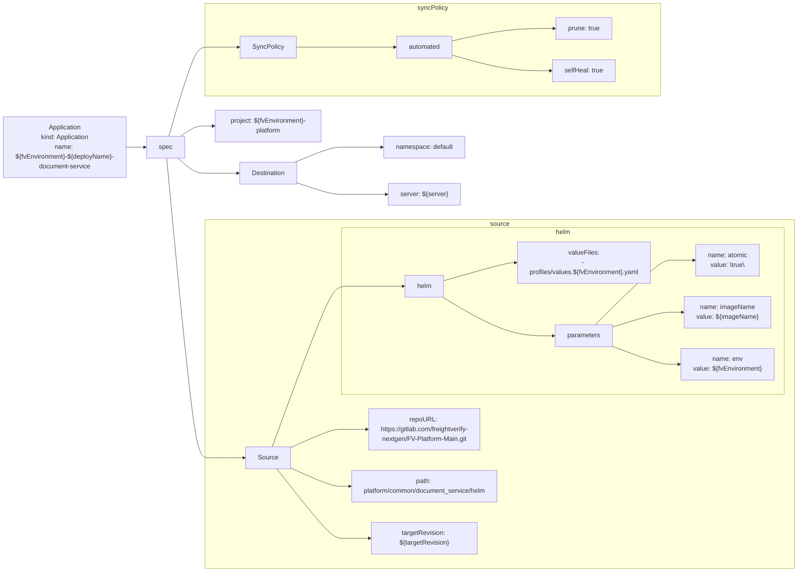

# Diagram: common/document_service/argocd/Application.yaml

> Auto-generated by Obscura crawlers

## Mermaid

### SVG

<svg id="container" width="2023.96875" xmlns="http://www.w3.org/2000/svg" class="flowchart" height="1400" viewBox="0 0 2023.96875 1400" role="graphics-document document" aria-roledescription="flowchart-v2"><g><marker id="container_flowchart-v2-pointEnd" class="marker flowchart-v2" viewBox="0 0 10 10" refX="5" refY="5" markerUnits="userSpaceOnUse" markerWidth="8" markerHeight="8" orient="auto"><path d="M 0 0 L 10 5 L 0 10 z" class="arrowMarkerPath" style="stroke-width: 1; stroke-dasharray: 1, 0;"></path></marker><marker id="container_flowchart-v2-pointStart" class="marker flowchart-v2" viewBox="0 0 10 10" refX="4.5" refY="5" markerUnits="userSpaceOnUse" markerWidth="8" markerHeight="8" orient="auto"><path d="M 0 5 L 10 10 L 10 0 z" class="arrowMarkerPath" style="stroke-width: 1; stroke-dasharray: 1, 0;"></path></marker><marker id="container_flowchart-v2-circleEnd" class="marker flowchart-v2" viewBox="0 0 10 10" refX="11" refY="5" markerUnits="userSpaceOnUse" markerWidth="11" markerHeight="11" orient="auto"><circle cx="5" cy="5" r="5" class="arrowMarkerPath" style="stroke-width: 1; stroke-dasharray: 1, 0;"></circle></marker><marker id="container_flowchart-v2-circleStart" class="marker flowchart-v2" viewBox="0 0 10 10" refX="-1" refY="5" markerUnits="userSpaceOnUse" markerWidth="11" markerHeight="11" orient="auto"><circle cx="5" cy="5" r="5" class="arrowMarkerPath" style="stroke-width: 1; stroke-dasharray: 1, 0;"></circle></marker><marker id="container_flowchart-v2-crossEnd" class="marker cross flowchart-v2" viewBox="0 0 11 11" refX="12" refY="5.2" markerUnits="userSpaceOnUse" markerWidth="11" markerHeight="11" orient="auto"><path d="M 1,1 l 9,9 M 10,1 l -9,9" class="arrowMarkerPath" style="stroke-width: 2; stroke-dasharray: 1, 0;"></path></marker><marker id="container_flowchart-v2-crossStart" class="marker cross flowchart-v2" viewBox="0 0 11 11" refX="-1" refY="5.2" markerUnits="userSpaceOnUse" markerWidth="11" markerHeight="11" orient="auto"><path d="M 1,1 l 9,9 M 10,1 l -9,9" class="arrowMarkerPath" style="stroke-width: 2; stroke-dasharray: 1, 0;"></path></marker><g class="root"><g class="clusters"><g class="cluster" id="SYNC" data-look="classic"><rect style="" x="508.109375" y="8" width="1147.859375" height="228"></rect><g class="cluster-label" transform="translate(1044.546875, 8)"><foreignObject width="74.984375" height="24">

syncPolicy

</foreignObject></g></g><g class="cluster" id="SOURCE" data-look="classic"><rect style="" x="508.109375" y="540" width="1507.859375" height="852"></rect><g class="cluster-label" transform="translate(1238.1015625, 540)"><foreignObject width="47.875" height="24">

source

</foreignObject></g></g><g class="cluster" id="HELM" data-look="classic"><rect style="" x="843.109375" y="560" width="1147.859375" height="404"></rect><g class="cluster-label" transform="translate(1398.7890625, 560)"><foreignObject width="36.5" height="24">

helm

</foreignObject></g></g></g><g class="edgePaths"><path d="M314.75,368L318.917,368C323.083,368,331.417,368,339.083,368C346.75,368,353.75,368,357.25,368L360.75,368" id="L_Application_Spec_0" class="edge-thickness-normal edge-pattern-solid edge-thickness-normal edge-pattern-solid flowchart-link" style=";" data-edge="true" data-et="edge" data-id="L_Application_Spec_0" data-points="W3sieCI6MzE0Ljc1LCJ5IjozNjh9LHsieCI6MzM5Ljc1LCJ5IjozNjh9LHsieCI6MzY0Ljc1LCJ5IjozNjh9XQ==" marker-end="url(#container_flowchart-v2-pointEnd)"></path><path d="M444.798,341L451.183,335.833C457.568,330.667,470.339,320.333,480.891,315.167C491.443,310,499.776,310,507.443,310C515.109,310,522.109,310,525.609,310L529.109,310" id="L_Spec_Project_0" class="edge-thickness-normal edge-pattern-solid edge-thickness-normal edge-pattern-solid flowchart-link" style=";" data-edge="true" data-et="edge" data-id="L_Spec_Project_0" data-points="W3sieCI6NDQ0Ljc5NzgxNzg4NzkzMTA1LCJ5IjozNDF9LHsieCI6NDgzLjEwOTM3NSwieSI6MzEwfSx7IngiOjUwOC4xMDkzNzUsInkiOjMxMH0seyJ4Ijo1MzMuMTA5Mzc1LCJ5IjozMTB9XQ==" marker-end="url(#container_flowchart-v2-pointEnd)"></path><path d="M444.798,395L451.183,400.167C457.568,405.333,470.339,415.667,480.891,420.833C491.443,426,499.776,426,517.12,426C534.464,426,560.818,426,573.995,426L587.172,426" id="L_Spec_Destination_0" class="edge-thickness-normal edge-pattern-solid edge-thickness-normal edge-pattern-solid flowchart-link" style=";" data-edge="true" data-et="edge" data-id="L_Spec_Destination_0" data-points="W3sieCI6NDQ0Ljc5NzgxNzg4NzkzMTA1LCJ5IjozOTV9LHsieCI6NDgzLjEwOTM3NSwieSI6NDI2fSx7IngiOjUwOC4xMDkzNzUsInkiOjQyNn0seyJ4Ijo1OTEuMTcxODc1LCJ5Ijo0MjZ9XQ==" marker-end="url(#container_flowchart-v2-pointEnd)"></path><path d="M728.5,399L743.435,392.833C758.37,386.667,788.24,374.333,807.341,368.167C826.443,362,834.776,362,857.125,362C879.474,362,915.839,362,934.021,362L952.203,362" id="L_Destination_Namespace_0" class="edge-thickness-normal edge-pattern-solid edge-thickness-normal edge-pattern-solid flowchart-link" style=";" data-edge="true" data-et="edge" data-id="L_Destination_Namespace_0" data-points="W3sieCI6NzI4LjUsInkiOjM5OX0seyJ4Ijo4MTguMTA5Mzc1LCJ5IjozNjJ9LHsieCI6ODQzLjEwOTM3NSwieSI6MzYyfSx7IngiOjk1Ni4yMDMxMjUsInkiOjM2Mn1d" marker-end="url(#container_flowchart-v2-pointEnd)"></path><path d="M735.047,450.134L748.891,454.778C762.734,459.423,790.422,468.711,808.432,473.356C826.443,478,834.776,478,859.188,478C883.599,478,924.089,478,944.333,478L964.578,478" id="L_Destination_Server_0" class="edge-thickness-normal edge-pattern-solid edge-thickness-normal edge-pattern-solid flowchart-link" style=";" data-edge="true" data-et="edge" data-id="L_Destination_Server_0" data-points="W3sieCI6NzM1LjA0Njg3NSwieSI6NDUwLjEzMzg3MDk2Nzc0MTl9LHsieCI6ODE4LjEwOTM3NSwieSI6NDc4fSx7IngiOjg0My4xMDkzNzUsInkiOjQ3OH0seyJ4Ijo5NjguNTc4MTI1LCJ5Ijo0Nzh9XQ==" marker-end="url(#container_flowchart-v2-pointEnd)"></path><path d="M414.003,395L425.521,515.833C437.039,636.667,460.074,878.333,475.758,999.167C491.443,1120,499.776,1120,520.016,1120C540.255,1120,572.401,1120,588.474,1120L604.547,1120" id="L_Spec_Source_0" class="edge-thickness-normal edge-pattern-solid edge-thickness-normal edge-pattern-solid flowchart-link" style=";" data-edge="true" data-et="edge" data-id="L_Spec_Source_0" data-points="W3sieCI6NDE0LjAwMzI5MzMwMTE5NjgzLCJ5IjozOTV9LHsieCI6NDgzLjEwOTM3NSwieSI6MTEyMH0seyJ4Ijo1MDguMTA5Mzc1LCJ5IjoxMTIwfSx7IngiOjYwOC41NDY4NzUsInkiOjExMjB9XQ==" marker-end="url(#container_flowchart-v2-pointEnd)"></path><path d="M717.672,1095.359L734.411,1087.799C751.151,1080.239,784.63,1065.12,805.536,1057.56C826.443,1050,834.776,1050,849.503,1050C864.229,1050,885.349,1050,895.909,1050L906.469,1050" id="L_Source_SourceRepo_0" class="edge-thickness-normal edge-pattern-solid edge-thickness-normal edge-pattern-solid flowchart-link" style=";" data-edge="true" data-et="edge" data-id="L_Source_SourceRepo_0" data-points="W3sieCI6NzE3LjY3MTg3NSwieSI6MTA5NS4zNTg4NzA5Njc3NDJ9LHsieCI6ODE4LjEwOTM3NSwieSI6MTA1MH0seyJ4Ijo4NDMuMTA5Mzc1LCJ5IjoxMDUwfSx7IngiOjkxMC40Njg3NSwieSI6MTA1MH1d" marker-end="url(#container_flowchart-v2-pointEnd)"></path><path d="M717.672,1144.641L734.411,1152.201C751.151,1159.761,784.63,1174.88,805.536,1182.44C826.443,1190,834.776,1190,842.443,1190C850.109,1190,857.109,1190,860.609,1190L864.109,1190" id="L_Source_SourcePath_0" class="edge-thickness-normal edge-pattern-solid edge-thickness-normal edge-pattern-solid flowchart-link" style=";" data-edge="true" data-et="edge" data-id="L_Source_SourcePath_0" data-points="W3sieCI6NzE3LjY3MTg3NSwieSI6MTE0NC42NDExMjkwMzIyNTh9LHsieCI6ODE4LjEwOTM3NSwieSI6MTE5MH0seyJ4Ijo4NDMuMTA5Mzc1LCJ5IjoxMTkwfSx7IngiOjg2OC4xMDkzNzUsInkiOjExOTB9XQ==" marker-end="url(#container_flowchart-v2-pointEnd)"></path><path d="M684.246,1147L706.556,1175.5C728.867,1204,773.488,1261,799.965,1289.5C826.443,1318,834.776,1318,852.286,1318C869.797,1318,896.484,1318,909.828,1318L923.172,1318" id="L_Source_TargetRev_0" class="edge-thickness-normal edge-pattern-solid edge-thickness-normal edge-pattern-solid flowchart-link" style=";" data-edge="true" data-et="edge" data-id="L_Source_TargetRev_0" data-points="W3sieCI6Njg0LjI0NTczODYzNjM2MzYsInkiOjExNDd9LHsieCI6ODE4LjEwOTM3NSwieSI6MTMxOH0seyJ4Ijo4NDMuMTA5Mzc1LCJ5IjoxMzE4fSx7IngiOjkyNy4xNzE4NzUsInkiOjEzMTh9XQ==" marker-end="url(#container_flowchart-v2-pointEnd)"></path><path d="M673.169,1093L697.326,1028.167C721.483,963.333,769.796,833.667,798.119,768.833C826.443,704,834.776,704,865.911,704C897.047,704,950.984,704,977.953,704L1004.922,704" id="L_Source_HelmSub_0" class="edge-thickness-normal edge-pattern-solid edge-thickness-normal edge-pattern-solid flowchart-link" style=";" data-edge="true" data-et="edge" data-id="L_Source_HelmSub_0" data-points="W3sieCI6NjczLjE2OTQ3MTE1Mzg0NjIsInkiOjEwOTN9LHsieCI6ODE4LjEwOTM3NSwieSI6NzA0fSx7IngiOjg0My4xMDkzNzUsInkiOjcwNH0seyJ4IjoxMDA4LjkyMTg3NSwieSI6NzA0fV0=" marker-end="url(#container_flowchart-v2-pointEnd)"></path><path d="M1493.452,781L1520.538,756.5C1547.624,732,1601.796,683,1633.049,658.5C1664.302,634,1672.635,634,1680.302,634C1687.969,634,1694.969,634,1698.469,634L1701.969,634" id="L_Params_P1_0" class="edge-thickness-normal edge-pattern-solid edge-thickness-normal edge-pattern-solid flowchart-link" style=";" data-edge="true" data-et="edge" data-id="L_Params_P1_0" data-points="W3sieCI6MTQ5My40NTE2NDMzMTg5NjU2LCJ5Ijo3ODF9LHsieCI6MTY1NS45Njg3NSwieSI6NjM0fSx7IngiOjE2ODAuOTY4NzUsInkiOjYzNH0seyJ4IjoxNzA1Ljk2ODc1LCJ5Ijo2MzR9XQ==" marker-end="url(#container_flowchart-v2-pointEnd)"></path><path d="M1534.836,790.966L1555.025,786.138C1575.214,781.311,1615.591,771.655,1639.947,766.828C1664.302,762,1672.635,762,1680.302,762C1687.969,762,1694.969,762,1698.469,762L1701.969,762" id="L_Params_P2_0" class="edge-thickness-normal edge-pattern-solid edge-thickness-normal edge-pattern-solid flowchart-link" style=";" data-edge="true" data-et="edge" data-id="L_Params_P2_0" data-points="W3sieCI6MTUzNC44MzU5Mzc1LCJ5Ijo3OTAuOTY2MDA3MzkxNDYzMn0seyJ4IjoxNjU1Ljk2ODc1LCJ5Ijo3NjJ9LHsieCI6MTY4MC45Njg3NSwieSI6NzYyfSx7IngiOjE3MDUuOTY4NzUsInkiOjc2Mn1d" marker-end="url(#container_flowchart-v2-pointEnd)"></path><path d="M1526.942,835L1548.446,844.167C1569.951,853.333,1612.96,871.667,1638.631,880.833C1664.302,890,1672.635,890,1680.302,890C1687.969,890,1694.969,890,1698.469,890L1701.969,890" id="L_Params_P3_0" class="edge-thickness-normal edge-pattern-solid edge-thickness-normal edge-pattern-solid flowchart-link" style=";" data-edge="true" data-et="edge" data-id="L_Params_P3_0" data-points="W3sieCI6MTUyNi45NDE5Nzc4OTYzNDE1LCJ5Ijo4MzV9LHsieCI6MTY1NS45Njg3NSwieSI6ODkwfSx7IngiOjE2ODAuOTY4NzUsInkiOjg5MH0seyJ4IjoxNzA1Ljk2ODc1LCJ5Ijo4OTB9XQ==" marker-end="url(#container_flowchart-v2-pointEnd)"></path><path d="M1105.422,688.222L1133.057,679.185C1160.693,670.148,1215.964,652.074,1247.099,643.037C1278.234,634,1285.234,634,1288.734,634L1292.234,634" id="L_HelmSub_Values_0" class="edge-thickness-normal edge-pattern-solid edge-thickness-normal edge-pattern-solid flowchart-link" style=";" data-edge="true" data-et="edge" data-id="L_HelmSub_Values_0" data-points="W3sieCI6MTEwNS40MjE4NzUsInkiOjY4OC4yMjE4OTc4MTAyMTg5fSx7IngiOjEyNzEuMjM0Mzc1LCJ5Ijo2MzR9LHsieCI6MTI5Ni4yMzQzNzUsInkiOjYzNH1d" marker-end="url(#container_flowchart-v2-pointEnd)"></path><path d="M1105.422,727.442L1133.057,740.868C1160.693,754.295,1215.964,781.147,1263.121,794.574C1310.279,808,1349.323,808,1368.845,808L1388.367,808" id="L_HelmSub_Params_0" class="edge-thickness-normal edge-pattern-solid edge-thickness-normal edge-pattern-solid flowchart-link" style=";" data-edge="true" data-et="edge" data-id="L_HelmSub_Params_0" data-points="W3sieCI6MTEwNS40MjE4NzUsInkiOjcyNy40NDE3NTE4MjQ4MTc1fSx7IngiOjEyNzEuMjM0Mzc1LCJ5Ijo4MDh9LHsieCI6MTM5Mi4zNjcxODc1LCJ5Ijo4MDh9XQ==" marker-end="url(#container_flowchart-v2-pointEnd)"></path><path d="M419.297,341L429.932,304.5C440.568,268,461.839,195,476.641,158.5C491.443,122,499.776,122,517.747,122C535.719,122,563.328,122,577.133,122L590.938,122" id="L_Spec_SyncPolicy_0" class="edge-thickness-normal edge-pattern-solid edge-thickness-normal edge-pattern-solid flowchart-link" style=";" data-edge="true" data-et="edge" data-id="L_Spec_SyncPolicy_0" data-points="W3sieCI6NDE5LjI5Njk3MDI3NDM5MDIsInkiOjM0MX0seyJ4Ijo0ODMuMTA5Mzc1LCJ5IjoxMjJ9LHsieCI6NTA4LjEwOTM3NSwieSI6MTIyfSx7IngiOjU5NC45Mzc1LCJ5IjoxMjJ9XQ==" marker-end="url(#container_flowchart-v2-pointEnd)"></path><path d="M1126.742,105.1L1150.824,99.25C1174.906,93.4,1223.07,81.7,1266.784,75.85C1310.497,70,1349.76,70,1369.392,70L1389.023,70" id="L_Automated_Prune_0" class="edge-thickness-normal edge-pattern-solid edge-thickness-normal edge-pattern-solid flowchart-link" style=";" data-edge="true" data-et="edge" data-id="L_Automated_Prune_0" data-points="W3sieCI6MTEyNi43NDIxODc1LCJ5IjoxMDUuMX0seyJ4IjoxMjcxLjIzNDM3NSwieSI6NzB9LHsieCI6MTM5My4wMjM0Mzc1LCJ5Ijo3MH1d" marker-end="url(#container_flowchart-v2-pointEnd)"></path><path d="M1126.742,138.9L1150.824,144.75C1174.906,150.6,1223.07,162.3,1265.452,168.15C1307.833,174,1344.432,174,1362.732,174L1381.031,174" id="L_Automated_SelfHeal_0" class="edge-thickness-normal edge-pattern-solid edge-thickness-normal edge-pattern-solid flowchart-link" style=";" data-edge="true" data-et="edge" data-id="L_Automated_SelfHeal_0" data-points="W3sieCI6MTEyNi43NDIxODc1LCJ5IjoxMzguOX0seyJ4IjoxMjcxLjIzNDM3NSwieSI6MTc0fSx7IngiOjEzODUuMDMxMjUsInkiOjE3NH1d" marker-end="url(#container_flowchart-v2-pointEnd)"></path><path d="M731.281,122L745.753,122C760.224,122,789.167,122,807.805,122C826.443,122,834.776,122,862.358,122C889.94,122,936.771,122,960.186,122L983.602,122" id="L_SyncPolicy_Automated_0" class="edge-thickness-normal edge-pattern-solid edge-thickness-normal edge-pattern-solid flowchart-link" style=";" data-edge="true" data-et="edge" data-id="L_SyncPolicy_Automated_0" data-points="W3sieCI6NzMxLjI4MTI1LCJ5IjoxMjJ9LHsieCI6ODE4LjEwOTM3NSwieSI6MTIyfSx7IngiOjg0My4xMDkzNzUsInkiOjEyMn0seyJ4Ijo5ODcuNjAxNTYyNSwieSI6MTIyfV0=" marker-end="url(#container_flowchart-v2-pointEnd)"></path></g><g class="edgeLabels"><g class="edgeLabel"><g class="label" data-id="L_Application_Spec_0" transform="translate(0, 0)"><foreignObject width="0" height="0">

</foreignObject></g></g><g class="edgeLabel"><g class="label" data-id="L_Spec_Project_0" transform="translate(0, 0)"><foreignObject width="0" height="0">

</foreignObject></g></g><g class="edgeLabel"><g class="label" data-id="L_Spec_Destination_0" transform="translate(0, 0)"><foreignObject width="0" height="0">

</foreignObject></g></g><g class="edgeLabel"><g class="label" data-id="L_Destination_Namespace_0" transform="translate(0, 0)"><foreignObject width="0" height="0">

</foreignObject></g></g><g class="edgeLabel"><g class="label" data-id="L_Destination_Server_0" transform="translate(0, 0)"><foreignObject width="0" height="0">

</foreignObject></g></g><g class="edgeLabel"><g class="label" data-id="L_Spec_Source_0" transform="translate(0, 0)"><foreignObject width="0" height="0">

</foreignObject></g></g><g class="edgeLabel"><g class="label" data-id="L_Source_SourceRepo_0" transform="translate(0, 0)"><foreignObject width="0" height="0">

</foreignObject></g></g><g class="edgeLabel"><g class="label" data-id="L_Source_SourcePath_0" transform="translate(0, 0)"><foreignObject width="0" height="0">

</foreignObject></g></g><g class="edgeLabel"><g class="label" data-id="L_Source_TargetRev_0" transform="translate(0, 0)"><foreignObject width="0" height="0">

</foreignObject></g></g><g class="edgeLabel"><g class="label" data-id="L_Source_HelmSub_0" transform="translate(0, 0)"><foreignObject width="0" height="0">

</foreignObject></g></g><g class="edgeLabel"><g class="label" data-id="L_Params_P1_0" transform="translate(0, 0)"><foreignObject width="0" height="0">

</foreignObject></g></g><g class="edgeLabel"><g class="label" data-id="L_Params_P2_0" transform="translate(0, 0)"><foreignObject width="0" height="0">

</foreignObject></g></g><g class="edgeLabel"><g class="label" data-id="L_Params_P3_0" transform="translate(0, 0)"><foreignObject width="0" height="0">

</foreignObject></g></g><g class="edgeLabel"><g class="label" data-id="L_HelmSub_Values_0" transform="translate(0, 0)"><foreignObject width="0" height="0">

</foreignObject></g></g><g class="edgeLabel"><g class="label" data-id="L_HelmSub_Params_0" transform="translate(0, 0)"><foreignObject width="0" height="0">

</foreignObject></g></g><g class="edgeLabel"><g class="label" data-id="L_Spec_SyncPolicy_0" transform="translate(0, 0)"><foreignObject width="0" height="0">

</foreignObject></g></g><g class="edgeLabel"><g class="label" data-id="L_Automated_Prune_0" transform="translate(0, 0)"><foreignObject width="0" height="0">

</foreignObject></g></g><g class="edgeLabel"><g class="label" data-id="L_Automated_SelfHeal_0" transform="translate(0, 0)"><foreignObject width="0" height="0">

</foreignObject></g></g><g class="edgeLabel"><g class="label" data-id="L_SyncPolicy_Automated_0" transform="translate(0, 0)"><foreignObject width="0" height="0">

</foreignObject></g></g></g><g class="nodes"><g class="node default" id="flowchart-Application-0" transform="translate(161.375, 368)"><rect class="basic label-container" style="" x="-153.375" y="-63" width="306.75" height="126"></rect><g class="label" style="" transform="translate(-123.375, -48)"><rect></rect><foreignObject width="246.75" height="96">

Application\nkind: Application\nname: ${fvEnvironment}-${deployName}-document-service

</foreignObject></g></g><g class="node default" id="flowchart-Spec-1" transform="translate(411.4296875, 368)"><rect class="basic label-container" style="" x="-46.6796875" y="-27" width="93.359375" height="54"></rect><g class="label" style="" transform="translate(-16.6796875, -12)"><rect></rect><foreignObject width="33.359375" height="24">

spec

</foreignObject></g></g><g class="node default" id="flowchart-Project-3" transform="translate(663.109375, 310)"><rect class="basic label-container" style="" x="-130" y="-39" width="260" height="78"></rect><g class="label" style="" transform="translate(-100, -24)"><rect></rect><foreignObject width="200" height="48">

project: ${fvEnvironment}-platform

</foreignObject></g></g><g class="node default" id="flowchart-Destination-5" transform="translate(663.109375, 426)"><rect class="basic label-container" style="" x="-71.9375" y="-27" width="143.875" height="54"></rect><g class="label" style="" transform="translate(-41.9375, -12)"><rect></rect><foreignObject width="83.875" height="24">

Destination

</foreignObject></g></g><g class="node default" id="flowchart-Namespace-7" transform="translate(1057.171875, 362)"><rect class="basic label-container" style="" x="-100.96875" y="-27" width="201.9375" height="54"></rect><g class="label" style="" transform="translate(-70.96875, -12)"><rect></rect><foreignObject width="141.9375" height="24">

namespace: default

</foreignObject></g></g><g class="node default" id="flowchart-Server-9" transform="translate(1057.171875, 478)"><rect class="basic label-container" style="" x="-88.59375" y="-27" width="177.1875" height="54"></rect><g class="label" style="" transform="translate(-58.59375, -12)"><rect></rect><foreignObject width="117.1875" height="24">

server: ${server}

</foreignObject></g></g><g class="node default" id="flowchart-Source-11" transform="translate(663.109375, 1120)"><rect class="basic label-container" style="" x="-54.5625" y="-27" width="109.125" height="54"></rect><g class="label" style="" transform="translate(-24.5625, -12)"><rect></rect><foreignObject width="49.125" height="24">

Source

</foreignObject></g></g><g class="node default" id="flowchart-SourceRepo-12" transform="translate(1057.171875, 1050)"><rect class="basic label-container" style="" x="-146.703125" y="-51" width="293.40625" height="102"></rect><g class="label" style="" transform="translate(-116.703125, -36)"><rect></rect><foreignObject width="233.40625" height="72">

repoURL: https://gitlab.com/freightverify-nextgen/FV-Platform-Main.git

</foreignObject></g></g><g class="node default" id="flowchart-SourcePath-13" transform="translate(1057.171875, 1190)"><rect class="basic label-container" style="" x="-189.0625" y="-39" width="378.125" height="78"></rect><g class="label" style="" transform="translate(-159.0625, -24)"><rect></rect><foreignObject width="318.125" height="48">

path: platform/common/document_service/helm

</foreignObject></g></g><g class="node default" id="flowchart-TargetRev-14" transform="translate(1057.171875, 1318)"><rect class="basic label-container" style="" x="-130" y="-39" width="260" height="78"></rect><g class="label" style="" transform="translate(-100, -24)"><rect></rect><foreignObject width="200" height="48">

targetRevision: ${targetRevision}

</foreignObject></g></g><g class="node default" id="flowchart-HelmSub-15" transform="translate(1057.171875, 704)"><rect class="basic label-container" style="" x="-48.25" y="-27" width="96.5" height="54"></rect><g class="label" style="" transform="translate(-18.25, -12)"><rect></rect><foreignObject width="36.5" height="24">

helm

</foreignObject></g></g><g class="node default" id="flowchart-Values-24" transform="translate(1463.6015625, 634)"><rect class="basic label-container" style="" x="-167.3671875" y="-39" width="334.734375" height="78"></rect><g class="label" style="" transform="translate(-137.3671875, -24)"><rect></rect><foreignObject width="274.734375" height="48">

valueFiles:\n- profiles/values.${fvEnvironment}.yaml

</foreignObject></g></g><g class="node default" id="flowchart-Params-25" transform="translate(1463.6015625, 808)"><rect class="basic label-container" style="" x="-71.234375" y="-27" width="142.46875" height="54"></rect><g class="label" style="" transform="translate(-41.234375, -12)"><rect></rect><foreignObject width="82.46875" height="24">

parameters

</foreignObject></g></g><g class="node default" id="flowchart-P1-27" transform="translate(1835.96875, 634)"><rect class="basic label-container" style="" x="-130" y="-39" width="260" height="78"></rect><g class="label" style="" transform="translate(-100, -24)"><rect></rect><foreignObject width="200" height="48">

name: atomic\nvalue: \true\

</foreignObject></g></g><g class="node default" id="flowchart-P2-29" transform="translate(1835.96875, 762)"><rect class="basic label-container" style="" x="-130" y="-39" width="260" height="78"></rect><g class="label" style="" transform="translate(-100, -24)"><rect></rect><foreignObject width="200" height="48">

name: imageName\nvalue: ${imageName}

</foreignObject></g></g><g class="node default" id="flowchart-P3-31" transform="translate(1835.96875, 890)"><rect class="basic label-container" style="" x="-130" y="-39" width="260" height="78"></rect><g class="label" style="" transform="translate(-100, -24)"><rect></rect><foreignObject width="200" height="48">

name: env\nvalue: ${fvEnvironment}

</foreignObject></g></g><g class="node default" id="flowchart-SyncPolicy-37" transform="translate(663.109375, 122)"><rect class="basic label-container" style="" x="-68.171875" y="-27" width="136.34375" height="54"></rect><g class="label" style="" transform="translate(-38.171875, -12)"><rect></rect><foreignObject width="76.34375" height="24">

SyncPolicy

</foreignObject></g></g><g class="node default" id="flowchart-Automated-38" transform="translate(1057.171875, 122)"><rect class="basic label-container" style="" x="-69.5703125" y="-27" width="139.140625" height="54"></rect><g class="label" style="" transform="translate(-39.5703125, -12)"><rect></rect><foreignObject width="79.140625" height="24">

automated

</foreignObject></g></g><g class="node default" id="flowchart-Prune-40" transform="translate(1463.6015625, 70)"><rect class="basic label-container" style="" x="-70.578125" y="-27" width="141.15625" height="54"></rect><g class="label" style="" transform="translate(-40.578125, -12)"><rect></rect><foreignObject width="81.15625" height="24">

prune: true

</foreignObject></g></g><g class="node default" id="flowchart-SelfHeal-42" transform="translate(1463.6015625, 174)"><rect class="basic label-container" style="" x="-78.5703125" y="-27" width="157.140625" height="54"></rect><g class="label" style="" transform="translate(-48.5703125, -12)"><rect></rect><foreignObject width="97.140625" height="24">

selfHeal: true

</foreignObject></g></g></g></g></g></svg>
