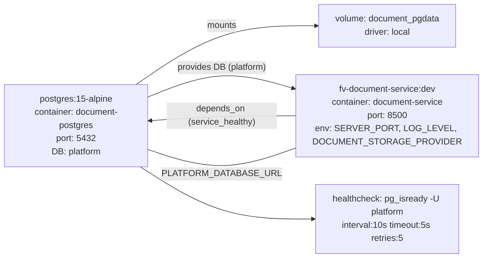

# Diagram: common/document_service/docker-compose.yml

> Auto-generated by Obscura crawlers

## Mermaid

### SVG

<svg id="container" width="818.96875" xmlns="http://www.w3.org/2000/svg" class="flowchart" height="470" viewBox="0 0 818.96875 470" role="graphics-document document" aria-roledescription="flowchart-v2"><g><marker id="container_flowchart-v2-pointEnd" class="marker flowchart-v2" viewBox="0 0 10 10" refX="5" refY="5" markerUnits="userSpaceOnUse" markerWidth="8" markerHeight="8" orient="auto"><path d="M 0 0 L 10 5 L 0 10 z" class="arrowMarkerPath" style="stroke-width: 1; stroke-dasharray: 1, 0;"></path></marker><marker id="container_flowchart-v2-pointStart" class="marker flowchart-v2" viewBox="0 0 10 10" refX="4.5" refY="5" markerUnits="userSpaceOnUse" markerWidth="8" markerHeight="8" orient="auto"><path d="M 0 5 L 10 10 L 10 0 z" class="arrowMarkerPath" style="stroke-width: 1; stroke-dasharray: 1, 0;"></path></marker><marker id="container_flowchart-v2-circleEnd" class="marker flowchart-v2" viewBox="0 0 10 10" refX="11" refY="5" markerUnits="userSpaceOnUse" markerWidth="11" markerHeight="11" orient="auto"><circle cx="5" cy="5" r="5" class="arrowMarkerPath" style="stroke-width: 1; stroke-dasharray: 1, 0;"></circle></marker><marker id="container_flowchart-v2-circleStart" class="marker flowchart-v2" viewBox="0 0 10 10" refX="-1" refY="5" markerUnits="userSpaceOnUse" markerWidth="11" markerHeight="11" orient="auto"><circle cx="5" cy="5" r="5" class="arrowMarkerPath" style="stroke-width: 1; stroke-dasharray: 1, 0;"></circle></marker><marker id="container_flowchart-v2-crossEnd" class="marker cross flowchart-v2" viewBox="0 0 11 11" refX="12" refY="5.2" markerUnits="userSpaceOnUse" markerWidth="11" markerHeight="11" orient="auto"><path d="M 1,1 l 9,9 M 10,1 l -9,9" class="arrowMarkerPath" style="stroke-width: 2; stroke-dasharray: 1, 0;"></path></marker><marker id="container_flowchart-v2-crossStart" class="marker cross flowchart-v2" viewBox="0 0 11 11" refX="-1" refY="5.2" markerUnits="userSpaceOnUse" markerWidth="11" markerHeight="11" orient="auto"><path d="M 1,1 l 9,9 M 10,1 l -9,9" class="arrowMarkerPath" style="stroke-width: 2; stroke-dasharray: 1, 0;"></path></marker><g class="root"><g class="clusters"></g><g class="edgePaths"><path d="M243.082,154L268.069,136.167C293.055,118.333,343.027,82.667,391.469,64.833C439.911,47,486.823,47,510.279,47L533.734,47" id="L_postgres_volume_doc_0" class="edge-thickness-normal edge-pattern-solid edge-thickness-normal edge-pattern-solid flowchart-link" style=";" data-edge="true" data-et="edge" data-id="L_postgres_volume_doc_0" data-points="W3sieCI6MjQzLjA4MjQxNzU4MjQxNzU4LCJ5IjoxNTR9LHsieCI6MzkzLCJ5Ijo0N30seyJ4Ijo1MzcuNzM0Mzc1LCJ5Ijo0N31d" marker-end="url(#container_flowchart-v2-pointEnd)"></path><path d="M268,174.961L288.833,166.301C309.667,157.641,351.333,140.32,392.366,138.208C433.398,136.095,473.797,149.19,493.996,155.737L514.195,162.285" id="L_postgres_document_service_0" class="edge-thickness-normal edge-pattern-solid edge-thickness-normal edge-pattern-solid flowchart-link" style=";" data-edge="true" data-et="edge" data-id="L_postgres_document_service_0" data-points="W3sieCI6MjY4LCJ5IjoxNzQuOTYwNzg0MzEzNzI1NX0seyJ4IjozOTMsInkiOjEyM30seyJ4Ijo1MTgsInkiOjE2My41MTc5ODU2MTE1MTA4fV0=" marker-end="url(#container_flowchart-v2-pointEnd)"></path><path d="M518,211L497.167,211C476.333,211,434.667,211,393.665,212.424C352.663,213.847,312.327,216.695,292.158,218.118L271.99,219.542" id="L_document_service_postgres_0" class="edge-thickness-normal edge-pattern-solid edge-thickness-normal edge-pattern-solid flowchart-link" style=";" data-edge="true" data-et="edge" data-id="L_document_service_postgres_0" data-points="W3sieCI6NTE4LCJ5IjoyMTF9LHsieCI6MzkzLCJ5IjoyMTF9LHsieCI6MjY4LCJ5IjoyMTkuODIzNTI5NDExNzY0N31d" marker-end="url(#container_flowchart-v2-pointEnd)"></path><path d="M250.5,304L274.25,319.833C298,335.667,345.5,367.333,392.164,383.167C438.828,399,484.656,399,507.57,399L530.484,399" id="L_postgres_healthcheck_pg_0" class="edge-thickness-normal edge-pattern-solid edge-thickness-normal edge-pattern-solid flowchart-link" style=";" data-edge="true" data-et="edge" data-id="L_postgres_healthcheck_pg_0" data-points="W3sieCI6MjUwLjUsInkiOjMwNH0seyJ4IjozOTMsInkiOjM5OX0seyJ4Ijo1MzQuNDg0Mzc1LCJ5IjozOTl9XQ==" marker-end="url(#container_flowchart-v2-pointEnd)"></path><path d="M518,268.194L497.167,276.329C476.333,284.463,434.667,300.731,393,301.676C351.333,302.621,309.667,288.242,288.833,281.052L268,273.863" id="L_document_service_postgres_2" class="edge-thickness-normal edge-pattern-solid edge-thickness-normal edge-pattern-solid flowchart-link" style=";" data-edge="true" data-et="edge" data-id="L_document_service_postgres_2" data-points="W3sieCI6NTE4LCJ5IjoyNjguMTk0MjQ0NjA0MzE2NTd9LHsieCI6MzkzLCJ5IjozMTd9LHsieCI6MjY4LCJ5IjoyNzMuODYyNzQ1MDk4MDM5Mn1d"></path></g><g class="edgeLabels"><g class="edgeLabel" transform="translate(393, 47)"><g class="label" data-id="L_postgres_volume_doc_0" transform="translate(-27.5, -12)"><foreignObject width="55" height="24">

mounts

</foreignObject></g></g><g class="edgeLabel" transform="translate(391.16856, 123.7613)"><g class="label" data-id="L_postgres_document_service_0" transform="translate(-82.265625, -12)"><foreignObject width="164.53125" height="24">

provides DB (platform)

</foreignObject></g></g><g class="edgeLabel" transform="translate(393, 211)"><g class="label" data-id="L_document_service_postgres_0" transform="translate(-100, -24)"><foreignObject width="200" height="48">

depends_on (service_healthy)

</foreignObject></g></g><g class="edgeLabel"><g class="label" data-id="L_postgres_healthcheck_pg_0" transform="translate(0, 0)"><foreignObject width="0" height="0">

</foreignObject></g></g><g class="edgeLabel" transform="translate(393, 317)"><g class="label" data-id="L_document_service_postgres_2" transform="translate(-95.171875, -12)"><foreignObject width="190.34375" height="24">

PLATFORM_DATABASE_URL

</foreignObject></g></g></g><g class="nodes"><g class="node default" id="flowchart-postgres-0" transform="translate(138, 229)"><rect class="basic label-container" style="" x="-130" y="-75" width="260" height="150"></rect><g class="label" style="" transform="translate(-100, -60)"><rect></rect><foreignObject width="200" height="120">

postgres:15-alpine container: document-postgres port: 5432 DB: platform

</foreignObject></g></g><g class="node default" id="flowchart-document_service-1" transform="translate(664.484375, 211)"><rect class="basic label-container" style="" x="-146.484375" y="-75" width="292.96875" height="150"></rect><g class="label" style="" transform="translate(-116.484375, -60)"><rect></rect><foreignObject width="232.96875" height="120">

fv-document-service:dev container: document-service port: 8500 env: SERVER_PORT, LOG_LEVEL, DOCUMENT_STORAGE_PROVIDER

</foreignObject></g></g><g class="node default" id="flowchart-volume_doc-2" transform="translate(664.484375, 47)"><rect class="basic label-container" style="" x="-126.75" y="-39" width="253.5" height="78"></rect><g class="label" style="" transform="translate(-96.75, -24)"><rect></rect><foreignObject width="193.5" height="48">

volume: document_pgdata driver: local

</foreignObject></g></g><g class="node default" id="flowchart-healthcheck_pg-3" transform="translate(664.484375, 399)"><rect class="basic label-container" style="" x="-130" y="-63" width="260" height="126"></rect><g class="label" style="" transform="translate(-100, -48)"><rect></rect><foreignObject width="200" height="96">

healthcheck: pg_isready -U platform interval:10s timeout:5s retries:5

</foreignObject></g></g></g></g></g></svg>
