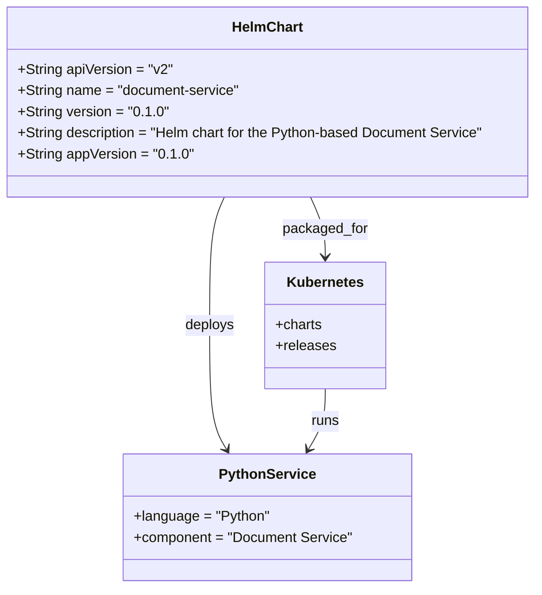

# Diagram: common/document_service/helm/Chart.yaml

> Auto-generated by Obscura crawlers

## Mermaid

### SVG

<svg id="container" width="617.71875" xmlns="http://www.w3.org/2000/svg" class="classDiagram" height="668" viewBox="0 0 617.71875 668" role="graphics-document document" aria-roledescription="class"><g><defs><marker id="container_class-aggregationStart" class="marker aggregation class" refX="18" refY="7" markerWidth="190" markerHeight="240" orient="auto"><path d="M 18,7 L9,13 L1,7 L9,1 Z"></path></marker></defs><defs><marker id="container_class-aggregationEnd" class="marker aggregation class" refX="1" refY="7" markerWidth="20" markerHeight="28" orient="auto"><path d="M 18,7 L9,13 L1,7 L9,1 Z"></path></marker></defs><defs><marker id="container_class-extensionStart" class="marker extension class" refX="18" refY="7" markerWidth="190" markerHeight="240" orient="auto"><path d="M 1,7 L18,13 V 1 Z"></path></marker></defs><defs><marker id="container_class-extensionEnd" class="marker extension class" refX="1" refY="7" markerWidth="20" markerHeight="28" orient="auto"><path d="M 1,1 V 13 L18,7 Z"></path></marker></defs><defs><marker id="container_class-compositionStart" class="marker composition class" refX="18" refY="7" markerWidth="190" markerHeight="240" orient="auto"><path d="M 18,7 L9,13 L1,7 L9,1 Z"></path></marker></defs><defs><marker id="container_class-compositionEnd" class="marker composition class" refX="1" refY="7" markerWidth="20" markerHeight="28" orient="auto"><path d="M 18,7 L9,13 L1,7 L9,1 Z"></path></marker></defs><defs><marker id="container_class-dependencyStart" class="marker dependency class" refX="6" refY="7" markerWidth="190" markerHeight="240" orient="auto"><path d="M 5,7 L9,13 L1,7 L9,1 Z"></path></marker></defs><defs><marker id="container_class-dependencyEnd" class="marker dependency class" refX="13" refY="7" markerWidth="20" markerHeight="28" orient="auto"><path d="M 18,7 L9,13 L14,7 L9,1 Z"></path></marker></defs><defs><marker id="container_class-lollipopStart" class="marker lollipop class" refX="13" refY="7" markerWidth="190" markerHeight="240" orient="auto"><circle stroke="black" fill="transparent" cx="7" cy="7" r="6"></circle></marker></defs><defs><marker id="container_class-lollipopEnd" class="marker lollipop class" refX="1" refY="7" markerWidth="190" markerHeight="240" orient="auto"><circle stroke="black" fill="transparent" cx="7" cy="7" r="6"></circle></marker></defs><g class="root"><g class="clusters"></g><g class="edgePaths"><path d="M357.44,224L360.214,230.167C362.988,236.333,368.536,248.667,371.31,260C374.084,271.333,374.084,281.667,374.084,286.833L374.084,292" id="id_HelmChart_Kubernetes_1" class="edge-thickness-normal edge-pattern-solid relation" style=";;;" data-edge="true" data-et="edge" data-id="id_HelmChart_Kubernetes_1" data-points="W3sieCI6MzU3LjQ0MDQ2MzM2MjA2ODk1LCJ5IjoyMjR9LHsieCI6Mzc0LjA4Mzk4NDM3NSwieSI6MjYxfSx7IngiOjM3NC4wODM5ODQzNzUsInkiOjI5OH1d" marker-end="url(#container_class-dependencyEnd)"></path><path d="M260.278,224L257.504,230.167C254.73,236.333,249.183,248.667,246.409,273C243.635,297.333,243.635,333.667,243.635,370C243.635,406.333,243.635,442.667,246.811,466.142C249.988,489.617,256.341,500.234,259.518,505.543L262.694,510.851" id="id_HelmChart_PythonService_2" class="edge-thickness-normal edge-pattern-solid relation" style=";;;" data-edge="true" data-et="edge" data-id="id_HelmChart_PythonService_2" data-points="W3sieCI6MjYwLjI3ODI4NjYzNzkzMTA1LCJ5IjoyMjR9LHsieCI6MjQzLjYzNDc2NTYyNSwieSI6MjYxfSx7IngiOjI0My42MzQ3NjU2MjUsInkiOjM3MH0seyJ4IjoyNDMuNjM0NzY1NjI1LCJ5Ijo0Nzl9LHsieCI6MjY1Ljc3NTIyOTM1Nzc5ODE0LCJ5Ijo1MTZ9XQ==" marker-end="url(#container_class-dependencyEnd)"></path><path d="M374.084,442L374.084,448.167C374.084,454.333,374.084,466.667,370.907,478.142C367.731,489.617,361.378,500.234,358.201,505.543L355.024,510.851" id="id_Kubernetes_PythonService_3" class="edge-thickness-normal edge-pattern-solid relation" style=";;;" data-edge="true" data-et="edge" data-id="id_Kubernetes_PythonService_3" data-points="W3sieCI6Mzc0LjA4Mzk4NDM3NSwieSI6NDQyfSx7IngiOjM3NC4wODM5ODQzNzUsInkiOjQ3OX0seyJ4IjozNTEuOTQzNTIwNjQyMjAxODYsInkiOjUxNn1d" marker-end="url(#container_class-dependencyEnd)"></path></g><g class="edgeLabels"><g class="edgeLabel" transform="translate(374.083984375, 261)"><g class="label" data-id="id_HelmChart_Kubernetes_1" transform="translate(-48.6328125, -12)"><foreignObject width="97.265625" height="24">

packaged_for

</foreignObject></g></g><g class="edgeLabel" transform="translate(243.634765625, 370)"><g class="label" data-id="id_HelmChart_PythonService_2" transform="translate(-28.4609375, -12)"><foreignObject width="56.921875" height="24">

deploys

</foreignObject></g></g><g class="edgeLabel" transform="translate(374.083984375, 479)"><g class="label" data-id="id_Kubernetes_PythonService_3" transform="translate(-16.171875, -12)"><foreignObject width="32.34375" height="24">

runs

</foreignObject></g></g></g><g class="nodes"><g class="node default" id="classId-HelmChart-0" transform="translate(308.859375, 116)"><g class="basic label-container"><path d="M-300.859375 -108 L300.859375 -108 L300.859375 108 L-300.859375 108" stroke="none" stroke-width="0" fill="#ECECFF" style=""></path><path d="M-300.859375 -108 C-102.82068549832863 -108, 95.21800400334274 -108, 300.859375 -108 M-300.859375 -108 C-97.30454731138687 -108, 106.25028037722626 -108, 300.859375 -108 M300.859375 -108 C300.859375 -43.409497876863654, 300.859375 21.181004246272693, 300.859375 108 M300.859375 -108 C300.859375 -59.831901807855715, 300.859375 -11.66380361571143, 300.859375 108 M300.859375 108 C141.81009411583 108, -17.239186768340005 108, -300.859375 108 M300.859375 108 C81.82774022502335 108, -137.2038945499533 108, -300.859375 108 M-300.859375 108 C-300.859375 62.279872948279106, -300.859375 16.559745896558212, -300.859375 -108 M-300.859375 108 C-300.859375 59.50953642411235, -300.859375 11.019072848224695, -300.859375 -108" stroke="#9370DB" stroke-width="1.3" fill="none" stroke-dasharray="0 0" style=""></path></g><g class="annotation-group text" transform="translate(0, -84)"></g><g class="label-group text" transform="translate(-38.703125, -84)"><g class="label" style="font-weight: bolder" transform="translate(0,-12)"><foreignObject width="77.40625" height="24">

HelmChart

</foreignObject></g></g><g class="members-group text" transform="translate(-288.859375, -36)"><g class="label" style="" transform="translate(0,-12)"><foreignObject width="175.921875" height="24">

+String apiVersion = "v2"

</foreignObject></g><g class="label" style="" transform="translate(0,12)"><foreignObject width="253.8125" height="24">

+String name = "document-service"

</foreignObject></g><g class="label" style="" transform="translate(0,36)"><foreignObject width="167.046875" height="24">

+String version = "0.1.0"

</foreignObject></g><g class="label" style="" transform="translate(0,60)"><foreignObject width="539.015625" height="24">

+String description = "Helm chart for the Python-based Document Service"

</foreignObject></g><g class="label" style="" transform="translate(0,84)"><foreignObject width="195.453125" height="24">

+String appVersion = "0.1.0"

</foreignObject></g></g><g class="methods-group text" transform="translate(-288.859375, 108)"></g><g class="divider" style=""><path d="M-300.859375 -60 C-70.70113696097627 -60, 159.45710107804746 -60, 300.859375 -60 M-300.859375 -60 C-81.0721518419034 -60, 138.7150713161932 -60, 300.859375 -60" stroke="#9370DB" stroke-width="1.3" fill="none" stroke-dasharray="0 0" style=""></path></g><g class="divider" style=""><path d="M-300.859375 84 C-158.51702569291027 84, -16.174676385820533 84, 300.859375 84 M-300.859375 84 C-110.42279878125231 84, 80.01377743749538 84, 300.859375 84" stroke="#9370DB" stroke-width="1.3" fill="none" stroke-dasharray="0 0" style=""></path></g></g><g class="node default" id="classId-Kubernetes-1" transform="translate(374.083984375, 370)"><g class="basic label-container"><path d="M-66.98828125 -72 L66.98828125 -72 L66.98828125 72 L-66.98828125 72" stroke="none" stroke-width="0" fill="#ECECFF" style=""></path><path d="M-66.98828125 -72 C-13.413968378463878 -72, 40.160344493072245 -72, 66.98828125 -72 M-66.98828125 -72 C-33.69312228364304 -72, -0.39796331728608436 -72, 66.98828125 -72 M66.98828125 -72 C66.98828125 -22.29774993109482, 66.98828125 27.40450013781036, 66.98828125 72 M66.98828125 -72 C66.98828125 -27.280708900189772, 66.98828125 17.438582199620456, 66.98828125 72 M66.98828125 72 C32.45289415263875 72, -2.082492944722503 72, -66.98828125 72 M66.98828125 72 C37.20837754378921 72, 7.428473837578416 72, -66.98828125 72 M-66.98828125 72 C-66.98828125 36.44175951179376, -66.98828125 0.8835190235875245, -66.98828125 -72 M-66.98828125 72 C-66.98828125 25.073252330837178, -66.98828125 -21.853495338325644, -66.98828125 -72" stroke="#9370DB" stroke-width="1.3" fill="none" stroke-dasharray="0 0" style=""></path></g><g class="annotation-group text" transform="translate(0, -48)"></g><g class="label-group text" transform="translate(-42.1953125, -48)"><g class="label" style="font-weight: bolder" transform="translate(0,-12)"><foreignObject width="84.390625" height="24">

Kubernetes

</foreignObject></g></g><g class="members-group text" transform="translate(-54.98828125, 0)"><g class="label" style="" transform="translate(0,-12)"><foreignObject width="53.140625" height="24">

+charts

</foreignObject></g><g class="label" style="" transform="translate(0,12)"><foreignObject width="67.78125" height="24">

+releases

</foreignObject></g></g><g class="methods-group text" transform="translate(-54.98828125, 72)"></g><g class="divider" style=""><path d="M-66.98828125 -24 C-17.589575546328888 -24, 31.809130157342224 -24, 66.98828125 -24 M-66.98828125 -24 C-38.89822080349728 -24, -10.808160356994563 -24, 66.98828125 -24" stroke="#9370DB" stroke-width="1.3" fill="none" stroke-dasharray="0 0" style=""></path></g><g class="divider" style=""><path d="M-66.98828125 48 C-28.089972228059544 48, 10.808336793880912 48, 66.98828125 48 M-66.98828125 48 C-33.48205041699151 48, 0.02418041601697496 48, 66.98828125 48" stroke="#9370DB" stroke-width="1.3" fill="none" stroke-dasharray="0 0" style=""></path></g></g><g class="node default" id="classId-PythonService-2" transform="translate(308.859375, 588)"><g class="basic label-container"><path d="M-163.2109375 -72 L163.2109375 -72 L163.2109375 72 L-163.2109375 72" stroke="none" stroke-width="0" fill="#ECECFF" style=""></path><path d="M-163.2109375 -72 C-97.67789040652181 -72, -32.14484331304362 -72, 163.2109375 -72 M-163.2109375 -72 C-37.693565386782964 -72, 87.82380672643407 -72, 163.2109375 -72 M163.2109375 -72 C163.2109375 -15.479545939495061, 163.2109375 41.04090812100988, 163.2109375 72 M163.2109375 -72 C163.2109375 -31.397910453681867, 163.2109375 9.204179092636267, 163.2109375 72 M163.2109375 72 C66.03859140124017 72, -31.133754697519663 72, -163.2109375 72 M163.2109375 72 C53.97986441755876 72, -55.25120866488248 72, -163.2109375 72 M-163.2109375 72 C-163.2109375 25.310320317943926, -163.2109375 -21.379359364112148, -163.2109375 -72 M-163.2109375 72 C-163.2109375 35.87030991075411, -163.2109375 -0.2593801784917815, -163.2109375 -72" stroke="#9370DB" stroke-width="1.3" fill="none" stroke-dasharray="0 0" style=""></path></g><g class="annotation-group text" transform="translate(0, -48)"></g><g class="label-group text" transform="translate(-52.546875, -48)"><g class="label" style="font-weight: bolder" transform="translate(0,-12)"><foreignObject width="105.09375" height="24">

PythonService

</foreignObject></g></g><g class="members-group text" transform="translate(-151.2109375, 0)"><g class="label" style="" transform="translate(0,-12)"><foreignObject width="153.53125" height="24">

+language = "Python"

</foreignObject></g><g class="label" style="" transform="translate(0,12)"><foreignObject width="249.875" height="24">

+component = "Document Service"

</foreignObject></g></g><g class="methods-group text" transform="translate(-151.2109375, 72)"></g><g class="divider" style=""><path d="M-163.2109375 -24 C-46.39924991711102 -24, 70.41243766577796 -24, 163.2109375 -24 M-163.2109375 -24 C-92.36211869033144 -24, -21.513299880662885 -24, 163.2109375 -24" stroke="#9370DB" stroke-width="1.3" fill="none" stroke-dasharray="0 0" style=""></path></g><g class="divider" style=""><path d="M-163.2109375 48 C-47.805588646172495 48, 67.59976020765501 48, 163.2109375 48 M-163.2109375 48 C-39.00390775416999 48, 85.20312199166003 48, 163.2109375 48" stroke="#9370DB" stroke-width="1.3" fill="none" stroke-dasharray="0 0" style=""></path></g></g></g></g></g></svg>
