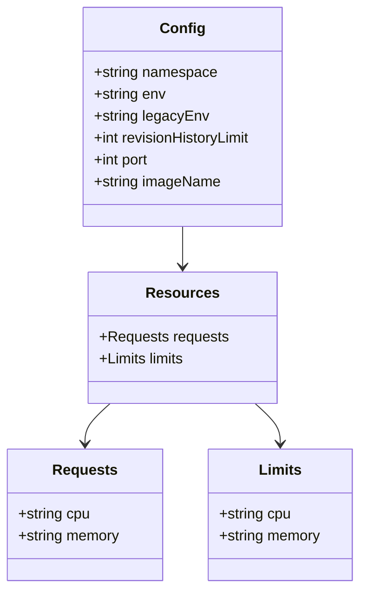

# Diagram: common/document_service/helm/profiles/values.dev1.yaml


> Auto-generated by Obscura crawlers

## Diagram 1



### SVG

<svg id="container" width="396.984375" xmlns="http://www.w3.org/2000/svg" class="classDiagram" height="644" viewBox="0 0 396.984375 644" role="graphics-document document" aria-roledescription="class"><style>#container{font-family:"trebuchet ms",verdana,arial,sans-serif;font-size:16px;fill:#333;}@keyframes edge-animation-frame{from{stroke-dashoffset:0;}}@keyframes dash{to{stroke-dashoffset:0;}}#container .edge-animation-slow{stroke-dasharray:9,5!important;stroke-dashoffset:900;animation:dash 50s linear infinite;stroke-linecap:round;}#container .edge-animation-fast{stroke-dasharray:9,5!important;stroke-dashoffset:900;animation:dash 20s linear infinite;stroke-linecap:round;}#container .error-icon{fill:#552222;}#container .error-text{fill:#552222;stroke:#552222;}#container .edge-thickness-normal{stroke-width:1px;}#container .edge-thickness-thick{stroke-width:3.5px;}#container .edge-pattern-solid{stroke-dasharray:0;}#container .edge-thickness-invisible{stroke-width:0;fill:none;}#container .edge-pattern-dashed{stroke-dasharray:3;}#container .edge-pattern-dotted{stroke-dasharray:2;}#container .marker{fill:#333333;stroke:#333333;}#container .marker.cross{stroke:#333333;}#container svg{font-family:"trebuchet ms",verdana,arial,sans-serif;font-size:16px;}#container p{margin:0;}#container g.classGroup text{fill:#9370DB;stroke:none;font-family:"trebuchet ms",verdana,arial,sans-serif;font-size:10px;}#container g.classGroup text .title{font-weight:bolder;}#container .nodeLabel,#container .edgeLabel{color:#131300;}#container .edgeLabel .label rect{fill:#ECECFF;}#container .label text{fill:#131300;}#container .labelBkg{background:#ECECFF;}#container .edgeLabel .label span{background:#ECECFF;}#container .classTitle{font-weight:bolder;}#container .node rect,#container .node circle,#container .node ellipse,#container .node polygon,#container .node path{fill:#ECECFF;stroke:#9370DB;stroke-width:1px;}#container .divider{stroke:#9370DB;stroke-width:1;}#container g.clickable{cursor:pointer;}#container g.classGroup rect{fill:#ECECFF;stroke:#9370DB;}#container g.classGroup line{stroke:#9370DB;stroke-width:1;}#container .classLabel .box{stroke:none;stroke-width:0;fill:#ECECFF;opacity:0.5;}#container .classLabel .label{fill:#9370DB;font-size:10px;}#container .relation{stroke:#333333;stroke-width:1;fill:none;}#container .dashed-line{stroke-dasharray:3;}#container .dotted-line{stroke-dasharray:1 2;}#container #compositionStart,#container .composition{fill:#333333!important;stroke:#333333!important;stroke-width:1;}#container #compositionEnd,#container .composition{fill:#333333!important;stroke:#333333!important;stroke-width:1;}#container #dependencyStart,#container .dependency{fill:#333333!important;stroke:#333333!important;stroke-width:1;}#container #dependencyStart,#container .dependency{fill:#333333!important;stroke:#333333!important;stroke-width:1;}#container #extensionStart,#container .extension{fill:transparent!important;stroke:#333333!important;stroke-width:1;}#container #extensionEnd,#container .extension{fill:transparent!important;stroke:#333333!important;stroke-width:1;}#container #aggregationStart,#container .aggregation{fill:transparent!important;stroke:#333333!important;stroke-width:1;}#container #aggregationEnd,#container .aggregation{fill:transparent!important;stroke:#333333!important;stroke-width:1;}#container #lollipopStart,#container .lollipop{fill:#ECECFF!important;stroke:#333333!important;stroke-width:1;}#container #lollipopEnd,#container .lollipop{fill:#ECECFF!important;stroke:#333333!important;stroke-width:1;}#container .edgeTerminals{font-size:11px;line-height:initial;}#container .classTitleText{text-anchor:middle;font-size:18px;fill:#333;}#container .label-icon{display:inline-block;height:1em;overflow:visible;vertical-align:-0.125em;}#container .node .label-icon path{fill:currentColor;stroke:revert;stroke-width:revert;}#container :root{--mermaid-font-family:"trebuchet ms",verdana,arial,sans-serif;}</style><g><defs><marker id="container_class-aggregationStart" class="marker aggregation class" refX="18" refY="7" markerWidth="190" markerHeight="240" orient="auto"><path d="M 18,7 L9,13 L1,7 L9,1 Z"></path></marker></defs><defs><marker id="container_class-aggregationEnd" class="marker aggregation class" refX="1" refY="7" markerWidth="20" markerHeight="28" orient="auto"><path d="M 18,7 L9,13 L1,7 L9,1 Z"></path></marker></defs><defs><marker id="container_class-extensionStart" class="marker extension class" refX="18" refY="7" markerWidth="190" markerHeight="240" orient="auto"><path d="M 1,7 L18,13 V 1 Z"></path></marker></defs><defs><marker id="container_class-extensionEnd" class="marker extension class" refX="1" refY="7" markerWidth="20" markerHeight="28" orient="auto"><path d="M 1,1 V 13 L18,7 Z"></path></marker></defs><defs><marker id="container_class-compositionStart" class="marker composition class" refX="18" refY="7" markerWidth="190" markerHeight="240" orient="auto"><path d="M 18,7 L9,13 L1,7 L9,1 Z"></path></marker></defs><defs><marker id="container_class-compositionEnd" class="marker composition class" refX="1" refY="7" markerWidth="20" markerHeight="28" orient="auto"><path d="M 18,7 L9,13 L1,7 L9,1 Z"></path></marker></defs><defs><marker id="container_class-dependencyStart" class="marker dependency class" refX="6" refY="7" markerWidth="190" markerHeight="240" orient="auto"><path d="M 5,7 L9,13 L1,7 L9,1 Z"></path></marker></defs><defs><marker id="container_class-dependencyEnd" class="marker dependency class" refX="13" refY="7" markerWidth="20" markerHeight="28" orient="auto"><path d="M 18,7 L9,13 L14,7 L9,1 Z"></path></marker></defs><defs><marker id="container_class-lollipopStart" class="marker lollipop class" refX="13" refY="7" markerWidth="190" markerHeight="240" orient="auto"><circle stroke="black" fill="transparent" cx="7" cy="7" r="6"></circle></marker></defs><defs><marker id="container_class-lollipopEnd" class="marker lollipop class" refX="1" refY="7" markerWidth="190" markerHeight="240" orient="auto"><circle stroke="black" fill="transparent" cx="7" cy="7" r="6"></circle></marker></defs><g class="root"><g class="clusters"></g><g class="edgePaths"><path d="M201.371,248L201.371,252.167C201.371,256.333,201.371,264.667,201.371,272C201.371,279.333,201.371,285.667,201.371,288.833L201.371,292" id="id_Config_Resources_1" class="edge-thickness-normal edge-pattern-solid relation" style=";;;" data-edge="true" data-et="edge" data-id="id_Config_Resources_1" data-points="W3sieCI6MjAxLjM3MTA5Mzc1LCJ5IjoyNDh9LHsieCI6MjAxLjM3MTA5Mzc1LCJ5IjoyNzN9LHsieCI6MjAxLjM3MTA5Mzc1LCJ5IjoyOTh9XQ==" marker-end="url(#container_class-dependencyEnd)"></path><path d="M121.395,442L116.766,446.167C112.138,450.333,102.882,458.667,98.253,466C93.625,473.333,93.625,479.667,93.625,482.833L93.625,486" id="id_Resources_Requests_2" class="edge-thickness-normal edge-pattern-solid relation" style=";;;" data-edge="true" data-et="edge" data-id="id_Resources_Requests_2" data-points="W3sieCI6MTIxLjM5NDYxMTc5MTIzNzExLCJ5Ijo0NDJ9LHsieCI6OTMuNjI1LCJ5Ijo0Njd9LHsieCI6OTMuNjI1LCJ5Ijo0OTJ9XQ==" marker-end="url(#container_class-dependencyEnd)"></path><path d="M281.348,442L285.976,446.167C290.604,450.333,299.861,458.667,304.489,466C309.117,473.333,309.117,479.667,309.117,482.833L309.117,486" id="id_Resources_Limits_3" class="edge-thickness-normal edge-pattern-solid relation" style=";;;" data-edge="true" data-et="edge" data-id="id_Resources_Limits_3" data-points="W3sieCI6MjgxLjM0NzU3NTcwODc2Mjg2LCJ5Ijo0NDJ9LHsieCI6MzA5LjExNzE4NzUsInkiOjQ2N30seyJ4IjozMDkuMTE3MTg3NSwieSI6NDkyfV0=" marker-end="url(#container_class-dependencyEnd)"></path></g><g class="edgeLabels"><g class="edgeLabel"><g class="label" data-id="id_Config_Resources_1" transform="translate(0, 0)"><foreignObject width="0" height="0"><div xmlns="http://www.w3.org/1999/xhtml" class="labelBkg" style="display: table-cell; white-space: nowrap; line-height: 1.5; max-width: 200px; text-align: center;"><span class="edgeLabel"></span></div></foreignObject></g></g><g class="edgeLabel"><g class="label" data-id="id_Resources_Requests_2" transform="translate(0, 0)"><foreignObject width="0" height="0"><div xmlns="http://www.w3.org/1999/xhtml" class="labelBkg" style="display: table-cell; white-space: nowrap; line-height: 1.5; max-width: 200px; text-align: center;"><span class="edgeLabel"></span></div></foreignObject></g></g><g class="edgeLabel"><g class="label" data-id="id_Resources_Limits_3" transform="translate(0, 0)"><foreignObject width="0" height="0"><div xmlns="http://www.w3.org/1999/xhtml" class="labelBkg" style="display: table-cell; white-space: nowrap; line-height: 1.5; max-width: 200px; text-align: center;"><span class="edgeLabel"></span></div></foreignObject></g></g></g><g class="nodes"><g class="node default" id="classId-Config-0" transform="translate(201.37109375, 128)"><g class="basic label-container"><path d="M-112.26953125 -120 L112.26953125 -120 L112.26953125 120 L-112.26953125 120" stroke="none" stroke-width="0" fill="#ECECFF" style=""></path><path d="M-112.26953125 -120 C-62.03574556493986 -120, -11.801959879879718 -120, 112.26953125 -120 M-112.26953125 -120 C-33.408250173844976 -120, 45.45303090231005 -120, 112.26953125 -120 M112.26953125 -120 C112.26953125 -68.0785033367761, 112.26953125 -16.157006673552203, 112.26953125 120 M112.26953125 -120 C112.26953125 -26.27095838962485, 112.26953125 67.4580832207503, 112.26953125 120 M112.26953125 120 C41.49899598932211 120, -29.271539271355778 120, -112.26953125 120 M112.26953125 120 C50.89018486629376 120, -10.489161517412484 120, -112.26953125 120 M-112.26953125 120 C-112.26953125 69.52420376225564, -112.26953125 19.04840752451129, -112.26953125 -120 M-112.26953125 120 C-112.26953125 63.53288145809483, -112.26953125 7.065762916189655, -112.26953125 -120" stroke="#9370DB" stroke-width="1.3" fill="none" stroke-dasharray="0 0" style=""></path></g><g class="annotation-group text" transform="translate(0, -96)"></g><g class="label-group text" transform="translate(-22.9296875, -96)"><g class="label" style="font-weight: bolder" transform="translate(0,-12)"><foreignObject width="45.859375" height="24"><div xmlns="http://www.w3.org/1999/xhtml" style="display: table-cell; white-space: nowrap; line-height: 1.5; max-width: 96px; text-align: center;"><span class="nodeLabel markdown-node-label" style=""><p>Config</p></span></div></foreignObject></g></g><g class="members-group text" transform="translate(-100.26953125, -48)"><g class="label" style="" transform="translate(0,-12)"><foreignObject width="135.9375" height="24"><div xmlns="http://www.w3.org/1999/xhtml" style="display: table-cell; white-space: nowrap; line-height: 1.5; max-width: 193px; text-align: center;"><span class="nodeLabel markdown-node-label" style=""><p>+string namespace</p></span></div></foreignObject></g><g class="label" style="" transform="translate(0,12)"><foreignObject width="79.71875" height="24"><div xmlns="http://www.w3.org/1999/xhtml" style="display: table-cell; white-space: nowrap; line-height: 1.5; max-width: 137px; text-align: center;"><span class="nodeLabel markdown-node-label" style=""><p>+string env</p></span></div></foreignObject></g><g class="label" style="" transform="translate(0,36)"><foreignObject width="124.96875" height="24"><div xmlns="http://www.w3.org/1999/xhtml" style="display: table-cell; white-space: nowrap; line-height: 1.5; max-width: 182px; text-align: center;"><span class="nodeLabel markdown-node-label" style=""><p>+string legacyEnv</p></span></div></foreignObject></g><g class="label" style="" transform="translate(0,60)"><foreignObject width="177.609375" height="24"><div xmlns="http://www.w3.org/1999/xhtml" style="display: table-cell; white-space: nowrap; line-height: 1.5; max-width: 235px; text-align: center;"><span class="nodeLabel markdown-node-label" style=""><p>+int revisionHistoryLimit</p></span></div></foreignObject></g><g class="label" style="" transform="translate(0,84)"><foreignObject width="62.703125" height="24"><div xmlns="http://www.w3.org/1999/xhtml" style="display: table-cell; white-space: nowrap; line-height: 1.5; max-width: 120px; text-align: center;"><span class="nodeLabel markdown-node-label" style=""><p>+int port</p></span></div></foreignObject></g><g class="label" style="" transform="translate(0,108)"><foreignObject width="139.484375" height="24"><div xmlns="http://www.w3.org/1999/xhtml" style="display: table-cell; white-space: nowrap; line-height: 1.5; max-width: 197px; text-align: center;"><span class="nodeLabel markdown-node-label" style=""><p>+string imageName</p></span></div></foreignObject></g></g><g class="methods-group text" transform="translate(-100.26953125, 120)"></g><g class="divider" style=""><path d="M-112.26953125 -72 C-44.47358561421714 -72, 23.322360021565714 -72, 112.26953125 -72 M-112.26953125 -72 C-50.168048040072044 -72, 11.933435169855912 -72, 112.26953125 -72" stroke="#9370DB" stroke-width="1.3" fill="none" stroke-dasharray="0 0" style=""></path></g><g class="divider" style=""><path d="M-112.26953125 96 C-49.182280216601825 96, 13.90497081679635 96, 112.26953125 96 M-112.26953125 96 C-48.766828118057354 96, 14.735875013885291 96, 112.26953125 96" stroke="#9370DB" stroke-width="1.3" fill="none" stroke-dasharray="0 0" style=""></path></g></g><g class="node default" id="classId-Resources-1" transform="translate(201.37109375, 370)"><g class="basic label-container"><path d="M-101.359375 -72 L101.359375 -72 L101.359375 72 L-101.359375 72" stroke="none" stroke-width="0" fill="#ECECFF" style=""></path><path d="M-101.359375 -72 C-33.49943144079619 -72, 34.36051211840763 -72, 101.359375 -72 M-101.359375 -72 C-54.01838257571414 -72, -6.677390151428284 -72, 101.359375 -72 M101.359375 -72 C101.359375 -28.50204559134457, 101.359375 14.995908817310863, 101.359375 72 M101.359375 -72 C101.359375 -32.077688275696886, 101.359375 7.844623448606228, 101.359375 72 M101.359375 72 C37.063450104822834 72, -27.23247479035433 72, -101.359375 72 M101.359375 72 C27.695836053222678 72, -45.967702893554645 72, -101.359375 72 M-101.359375 72 C-101.359375 19.043168460413753, -101.359375 -33.913663079172494, -101.359375 -72 M-101.359375 72 C-101.359375 24.250524834665363, -101.359375 -23.498950330669274, -101.359375 -72" stroke="#9370DB" stroke-width="1.3" fill="none" stroke-dasharray="0 0" style=""></path></g><g class="annotation-group text" transform="translate(0, -48)"></g><g class="label-group text" transform="translate(-37.265625, -48)"><g class="label" style="font-weight: bolder" transform="translate(0,-12)"><foreignObject width="74.53125" height="24"><div xmlns="http://www.w3.org/1999/xhtml" style="display: table-cell; white-space: nowrap; line-height: 1.5; max-width: 124px; text-align: center;"><span class="nodeLabel markdown-node-label" style=""><p>Resources</p></span></div></foreignObject></g></g><g class="members-group text" transform="translate(-89.359375, 0)"><g class="label" style="" transform="translate(0,-12)"><foreignObject width="141.453125" height="24"><div xmlns="http://www.w3.org/1999/xhtml" style="display: table-cell; white-space: nowrap; line-height: 1.5; max-width: 199px; text-align: center;"><span class="nodeLabel markdown-node-label" style=""><p>+Requests requests</p></span></div></foreignObject></g><g class="label" style="" transform="translate(0,12)"><foreignObject width="96.859375" height="24"><div xmlns="http://www.w3.org/1999/xhtml" style="display: table-cell; white-space: nowrap; line-height: 1.5; max-width: 154px; text-align: center;"><span class="nodeLabel markdown-node-label" style=""><p>+Limits limits</p></span></div></foreignObject></g></g><g class="methods-group text" transform="translate(-89.359375, 72)"></g><g class="divider" style=""><path d="M-101.359375 -24 C-45.553462250323555 -24, 10.25245049935289 -24, 101.359375 -24 M-101.359375 -24 C-52.2977297178423 -24, -3.236084435684603 -24, 101.359375 -24" stroke="#9370DB" stroke-width="1.3" fill="none" stroke-dasharray="0 0" style=""></path></g><g class="divider" style=""><path d="M-101.359375 48 C-56.98503629296803 48, -12.610697585936066 48, 101.359375 48 M-101.359375 48 C-57.85504218162773 48, -14.350709363255461 48, 101.359375 48" stroke="#9370DB" stroke-width="1.3" fill="none" stroke-dasharray="0 0" style=""></path></g></g><g class="node default" id="classId-Requests-2" transform="translate(93.625, 564)"><g class="basic label-container"><path d="M-85.625 -72 L85.625 -72 L85.625 72 L-85.625 72" stroke="none" stroke-width="0" fill="#ECECFF" style=""></path><path d="M-85.625 -72 C-24.054474677838876 -72, 37.51605064432225 -72, 85.625 -72 M-85.625 -72 C-27.301413280269678 -72, 31.022173439460644 -72, 85.625 -72 M85.625 -72 C85.625 -36.09971145767306, 85.625 -0.1994229153461191, 85.625 72 M85.625 -72 C85.625 -15.977955770653004, 85.625 40.04408845869399, 85.625 72 M85.625 72 C40.260749868212216 72, -5.103500263575569 72, -85.625 72 M85.625 72 C49.35365159576483 72, 13.082303191529661 72, -85.625 72 M-85.625 72 C-85.625 38.583153490480846, -85.625 5.166306980961693, -85.625 -72 M-85.625 72 C-85.625 16.368890803172434, -85.625 -39.26221839365513, -85.625 -72" stroke="#9370DB" stroke-width="1.3" fill="none" stroke-dasharray="0 0" style=""></path></g><g class="annotation-group text" transform="translate(0, -48)"></g><g class="label-group text" transform="translate(-33.84375, -48)"><g class="label" style="font-weight: bolder" transform="translate(0,-12)"><foreignObject width="67.6875" height="24"><div xmlns="http://www.w3.org/1999/xhtml" style="display: table-cell; white-space: nowrap; line-height: 1.5; max-width: 116px; text-align: center;"><span class="nodeLabel markdown-node-label" style=""><p>Requests</p></span></div></foreignObject></g></g><g class="members-group text" transform="translate(-73.625, 0)"><g class="label" style="" transform="translate(0,-12)"><foreignObject width="80.328125" height="24"><div xmlns="http://www.w3.org/1999/xhtml" style="display: table-cell; white-space: nowrap; line-height: 1.5; max-width: 138px; text-align: center;"><span class="nodeLabel markdown-node-label" style=""><p>+string cpu</p></span></div></foreignObject></g><g class="label" style="" transform="translate(0,12)"><foreignObject width="113.40625" height="24"><div xmlns="http://www.w3.org/1999/xhtml" style="display: table-cell; white-space: nowrap; line-height: 1.5; max-width: 171px; text-align: center;"><span class="nodeLabel markdown-node-label" style=""><p>+string memory</p></span></div></foreignObject></g></g><g class="methods-group text" transform="translate(-73.625, 72)"></g><g class="divider" style=""><path d="M-85.625 -24 C-23.929493753663266 -24, 37.76601249267347 -24, 85.625 -24 M-85.625 -24 C-19.722910929666824 -24, 46.17917814066635 -24, 85.625 -24" stroke="#9370DB" stroke-width="1.3" fill="none" stroke-dasharray="0 0" style=""></path></g><g class="divider" style=""><path d="M-85.625 48 C-44.1454514301594 48, -2.665902860318795 48, 85.625 48 M-85.625 48 C-41.44595408238892 48, 2.7330918352221545 48, 85.625 48" stroke="#9370DB" stroke-width="1.3" fill="none" stroke-dasharray="0 0" style=""></path></g></g><g class="node default" id="classId-Limits-3" transform="translate(309.1171875, 564)"><g class="basic label-container"><path d="M-79.8671875 -72 L79.8671875 -72 L79.8671875 72 L-79.8671875 72" stroke="none" stroke-width="0" fill="#ECECFF" style=""></path><path d="M-79.8671875 -72 C-20.171016043550452 -72, 39.525155412899096 -72, 79.8671875 -72 M-79.8671875 -72 C-41.184776025984505 -72, -2.502364551969009 -72, 79.8671875 -72 M79.8671875 -72 C79.8671875 -27.379993493456773, 79.8671875 17.240013013086454, 79.8671875 72 M79.8671875 -72 C79.8671875 -19.37307107913314, 79.8671875 33.25385784173372, 79.8671875 72 M79.8671875 72 C42.4348405504733 72, 5.002493600946593 72, -79.8671875 72 M79.8671875 72 C22.374763923310766 72, -35.11765965337847 72, -79.8671875 72 M-79.8671875 72 C-79.8671875 39.24150027303307, -79.8671875 6.483000546066137, -79.8671875 -72 M-79.8671875 72 C-79.8671875 22.199791676050538, -79.8671875 -27.600416647898925, -79.8671875 -72" stroke="#9370DB" stroke-width="1.3" fill="none" stroke-dasharray="0 0" style=""></path></g><g class="annotation-group text" transform="translate(0, -48)"></g><g class="label-group text" transform="translate(-22.328125, -48)"><g class="label" style="font-weight: bolder" transform="translate(0,-12)"><foreignObject width="44.65625" height="24"><div xmlns="http://www.w3.org/1999/xhtml" style="display: table-cell; white-space: nowrap; line-height: 1.5; max-width: 94px; text-align: center;"><span class="nodeLabel markdown-node-label" style=""><p>Limits</p></span></div></foreignObject></g></g><g class="members-group text" transform="translate(-67.8671875, 0)"><g class="label" style="" transform="translate(0,-12)"><foreignObject width="80.328125" height="24"><div xmlns="http://www.w3.org/1999/xhtml" style="display: table-cell; white-space: nowrap; line-height: 1.5; max-width: 138px; text-align: center;"><span class="nodeLabel markdown-node-label" style=""><p>+string cpu</p></span></div></foreignObject></g><g class="label" style="" transform="translate(0,12)"><foreignObject width="113.40625" height="24"><div xmlns="http://www.w3.org/1999/xhtml" style="display: table-cell; white-space: nowrap; line-height: 1.5; max-width: 171px; text-align: center;"><span class="nodeLabel markdown-node-label" style=""><p>+string memory</p></span></div></foreignObject></g></g><g class="methods-group text" transform="translate(-67.8671875, 72)"></g><g class="divider" style=""><path d="M-79.8671875 -24 C-28.79274005654083 -24, 22.28170738691834 -24, 79.8671875 -24 M-79.8671875 -24 C-38.24472770032187 -24, 3.3777320993562654 -24, 79.8671875 -24" stroke="#9370DB" stroke-width="1.3" fill="none" stroke-dasharray="0 0" style=""></path></g><g class="divider" style=""><path d="M-79.8671875 48 C-41.73659512325664 48, -3.6060027465132833 48, 79.8671875 48 M-79.8671875 48 C-30.328274338270973 48, 19.210638823458055 48, 79.8671875 48" stroke="#9370DB" stroke-width="1.3" fill="none" stroke-dasharray="0 0" style=""></path></g></g></g></g></g></svg>

## Diagram 2

```mermaid
flowchart LR
    cfg[Configuration]
    metadata[Metadata]
    runtime[Runtime]
    resources[Resources]
    req[Requests]
    lim[Limits]
    cfg --> metadata
    cfg --> runtime
    cfg --> resources
    metadata --> ns[namespace = "default"]
    metadata --> env[env = "dev1"]
    metadata --> legacy[legacyEnv = "dev"]
    runtime --> rev[revisionHistoryLimit = 2]
    runtime --> port[port = 8500]
    runtime --> image[imageName = "platform/document-service"]
    resources --> req
    resources --> lim
    req --> cpu_req[cpu: 150m]
    req --> mem_req[memory: 384Mi]
    lim --> cpu_lim[cpu: 750m]
    lim --> mem_lim[memory: 768Mi]
```

> SVG rendering failed for this diagram.
