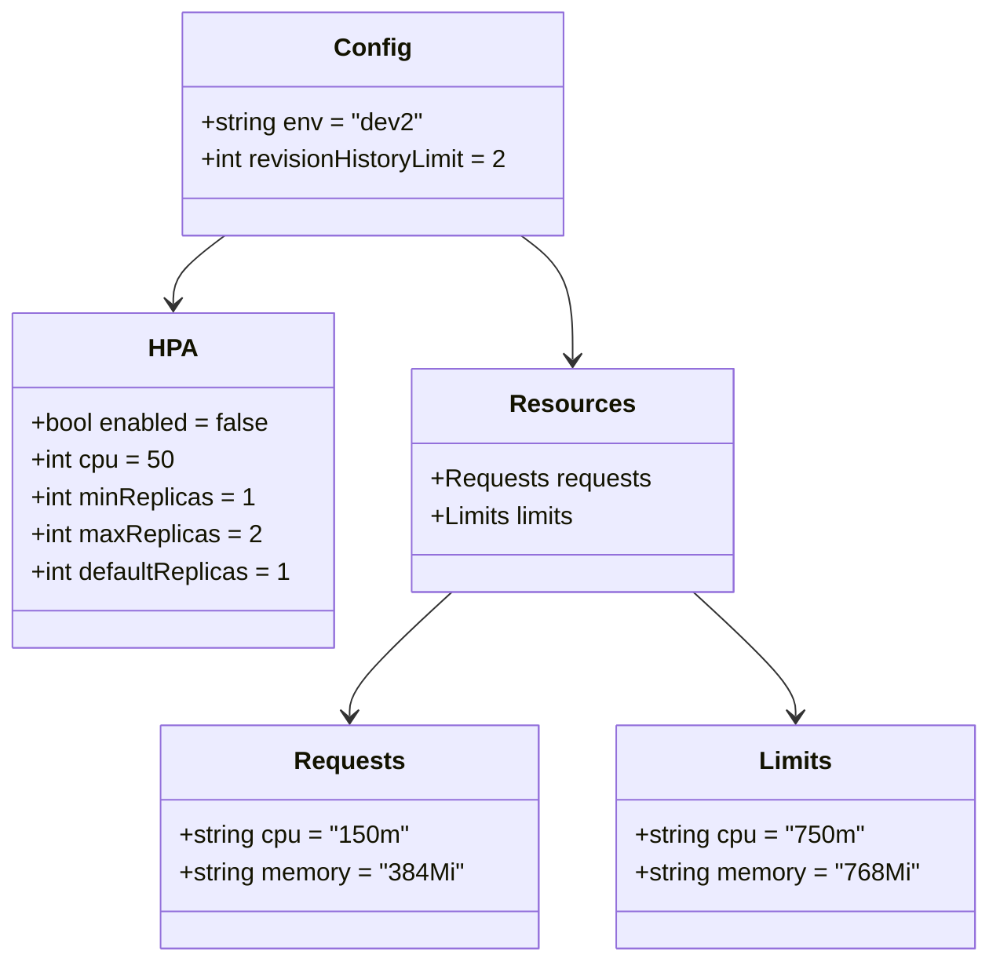

# Diagram: common/document_service/helm/profiles/values.dev2.yaml


> Auto-generated by Obscura crawlers

## Diagram 1



### SVG

<svg id="container" width="631.49609375" xmlns="http://www.w3.org/2000/svg" class="classDiagram" height="620" viewBox="0 0 631.49609375 620" role="graphics-document document" aria-roledescription="class"><style>#container{font-family:"trebuchet ms",verdana,arial,sans-serif;font-size:16px;fill:#333;}@keyframes edge-animation-frame{from{stroke-dashoffset:0;}}@keyframes dash{to{stroke-dashoffset:0;}}#container .edge-animation-slow{stroke-dasharray:9,5!important;stroke-dashoffset:900;animation:dash 50s linear infinite;stroke-linecap:round;}#container .edge-animation-fast{stroke-dasharray:9,5!important;stroke-dashoffset:900;animation:dash 20s linear infinite;stroke-linecap:round;}#container .error-icon{fill:#552222;}#container .error-text{fill:#552222;stroke:#552222;}#container .edge-thickness-normal{stroke-width:1px;}#container .edge-thickness-thick{stroke-width:3.5px;}#container .edge-pattern-solid{stroke-dasharray:0;}#container .edge-thickness-invisible{stroke-width:0;fill:none;}#container .edge-pattern-dashed{stroke-dasharray:3;}#container .edge-pattern-dotted{stroke-dasharray:2;}#container .marker{fill:#333333;stroke:#333333;}#container .marker.cross{stroke:#333333;}#container svg{font-family:"trebuchet ms",verdana,arial,sans-serif;font-size:16px;}#container p{margin:0;}#container g.classGroup text{fill:#9370DB;stroke:none;font-family:"trebuchet ms",verdana,arial,sans-serif;font-size:10px;}#container g.classGroup text .title{font-weight:bolder;}#container .nodeLabel,#container .edgeLabel{color:#131300;}#container .edgeLabel .label rect{fill:#ECECFF;}#container .label text{fill:#131300;}#container .labelBkg{background:#ECECFF;}#container .edgeLabel .label span{background:#ECECFF;}#container .classTitle{font-weight:bolder;}#container .node rect,#container .node circle,#container .node ellipse,#container .node polygon,#container .node path{fill:#ECECFF;stroke:#9370DB;stroke-width:1px;}#container .divider{stroke:#9370DB;stroke-width:1;}#container g.clickable{cursor:pointer;}#container g.classGroup rect{fill:#ECECFF;stroke:#9370DB;}#container g.classGroup line{stroke:#9370DB;stroke-width:1;}#container .classLabel .box{stroke:none;stroke-width:0;fill:#ECECFF;opacity:0.5;}#container .classLabel .label{fill:#9370DB;font-size:10px;}#container .relation{stroke:#333333;stroke-width:1;fill:none;}#container .dashed-line{stroke-dasharray:3;}#container .dotted-line{stroke-dasharray:1 2;}#container #compositionStart,#container .composition{fill:#333333!important;stroke:#333333!important;stroke-width:1;}#container #compositionEnd,#container .composition{fill:#333333!important;stroke:#333333!important;stroke-width:1;}#container #dependencyStart,#container .dependency{fill:#333333!important;stroke:#333333!important;stroke-width:1;}#container #dependencyStart,#container .dependency{fill:#333333!important;stroke:#333333!important;stroke-width:1;}#container #extensionStart,#container .extension{fill:transparent!important;stroke:#333333!important;stroke-width:1;}#container #extensionEnd,#container .extension{fill:transparent!important;stroke:#333333!important;stroke-width:1;}#container #aggregationStart,#container .aggregation{fill:transparent!important;stroke:#333333!important;stroke-width:1;}#container #aggregationEnd,#container .aggregation{fill:transparent!important;stroke:#333333!important;stroke-width:1;}#container #lollipopStart,#container .lollipop{fill:#ECECFF!important;stroke:#333333!important;stroke-width:1;}#container #lollipopEnd,#container .lollipop{fill:#ECECFF!important;stroke:#333333!important;stroke-width:1;}#container .edgeTerminals{font-size:11px;line-height:initial;}#container .classTitleText{text-anchor:middle;font-size:18px;fill:#333;}#container .label-icon{display:inline-block;height:1em;overflow:visible;vertical-align:-0.125em;}#container .node .label-icon path{fill:currentColor;stroke:revert;stroke-width:revert;}#container :root{--mermaid-font-family:"trebuchet ms",verdana,arial,sans-serif;}</style><g><defs><marker id="container_class-aggregationStart" class="marker aggregation class" refX="18" refY="7" markerWidth="190" markerHeight="240" orient="auto"><path d="M 18,7 L9,13 L1,7 L9,1 Z"></path></marker></defs><defs><marker id="container_class-aggregationEnd" class="marker aggregation class" refX="1" refY="7" markerWidth="20" markerHeight="28" orient="auto"><path d="M 18,7 L9,13 L1,7 L9,1 Z"></path></marker></defs><defs><marker id="container_class-extensionStart" class="marker extension class" refX="18" refY="7" markerWidth="190" markerHeight="240" orient="auto"><path d="M 1,7 L18,13 V 1 Z"></path></marker></defs><defs><marker id="container_class-extensionEnd" class="marker extension class" refX="1" refY="7" markerWidth="20" markerHeight="28" orient="auto"><path d="M 1,1 V 13 L18,7 Z"></path></marker></defs><defs><marker id="container_class-compositionStart" class="marker composition class" refX="18" refY="7" markerWidth="190" markerHeight="240" orient="auto"><path d="M 18,7 L9,13 L1,7 L9,1 Z"></path></marker></defs><defs><marker id="container_class-compositionEnd" class="marker composition class" refX="1" refY="7" markerWidth="20" markerHeight="28" orient="auto"><path d="M 18,7 L9,13 L1,7 L9,1 Z"></path></marker></defs><defs><marker id="container_class-dependencyStart" class="marker dependency class" refX="6" refY="7" markerWidth="190" markerHeight="240" orient="auto"><path d="M 5,7 L9,13 L1,7 L9,1 Z"></path></marker></defs><defs><marker id="container_class-dependencyEnd" class="marker dependency class" refX="13" refY="7" markerWidth="20" markerHeight="28" orient="auto"><path d="M 18,7 L9,13 L14,7 L9,1 Z"></path></marker></defs><defs><marker id="container_class-lollipopStart" class="marker lollipop class" refX="13" refY="7" markerWidth="190" markerHeight="240" orient="auto"><circle stroke="black" fill="transparent" cx="7" cy="7" r="6"></circle></marker></defs><defs><marker id="container_class-lollipopEnd" class="marker lollipop class" refX="1" refY="7" markerWidth="190" markerHeight="240" orient="auto"><circle stroke="black" fill="transparent" cx="7" cy="7" r="6"></circle></marker></defs><g class="root"><g class="clusters"></g><g class="edgePaths"><path d="M143.681,152L138.22,156.167C132.759,160.333,121.836,168.667,116.375,176C110.914,183.333,110.914,189.667,110.914,192.833L110.914,196" id="id_Config_HPA_1" class="edge-thickness-normal edge-pattern-solid relation" style=";;;" data-edge="true" data-et="edge" data-id="id_Config_HPA_1" data-points="W3sieCI6MTQzLjY4MTI1ODA1NDEyMzcsInkiOjE1Mn0seyJ4IjoxMTAuOTE0MDYyNSwieSI6MTc3fSx7IngiOjExMC45MTQwNjI1LCJ5IjoyMDJ9XQ==" marker-end="url(#container_class-dependencyEnd)"></path><path d="M332.42,152L337.882,156.167C343.343,160.333,354.265,168.667,359.726,182C365.188,195.333,365.188,213.667,365.188,222.833L365.188,232" id="id_Config_Resources_2" class="edge-thickness-normal edge-pattern-solid relation" style=";;;" data-edge="true" data-et="edge" data-id="id_Config_Resources_2" data-points="W3sieCI6MzMyLjQyMDMwNDQ0NTg3NjMsInkiOjE1Mn0seyJ4IjozNjUuMTg3NSwieSI6MTc3fSx7IngiOjM2NS4xODc1LCJ5IjoyMzh9XQ==" marker-end="url(#container_class-dependencyEnd)"></path><path d="M287.649,382L276.701,392.167C265.752,402.333,243.854,422.667,232.906,436C221.957,449.333,221.957,455.667,221.957,458.833L221.957,462" id="id_Resources_Requests_3" class="edge-thickness-normal edge-pattern-solid relation" style=";;;" data-edge="true" data-et="edge" data-id="id_Resources_Requests_3" data-points="W3sieCI6Mjg3LjY0OTIwMTEyNzgxOTU0LCJ5IjozODJ9LHsieCI6MjIxLjk1NzAzMTI1LCJ5Ijo0NDN9LHsieCI6MjIxLjk1NzAzMTI1LCJ5Ijo0Njh9XQ==" marker-end="url(#container_class-dependencyEnd)"></path><path d="M442.726,382L453.674,392.167C464.623,402.333,486.521,422.667,497.469,436C508.418,449.333,508.418,455.667,508.418,458.833L508.418,462" id="id_Resources_Limits_4" class="edge-thickness-normal edge-pattern-solid relation" style=";;;" data-edge="true" data-et="edge" data-id="id_Resources_Limits_4" data-points="W3sieCI6NDQyLjcyNTc5ODg3MjE4MDQ2LCJ5IjozODJ9LHsieCI6NTA4LjQxNzk2ODc1LCJ5Ijo0NDN9LHsieCI6NTA4LjQxNzk2ODc1LCJ5Ijo0Njh9XQ==" marker-end="url(#container_class-dependencyEnd)"></path></g><g class="edgeLabels"><g class="edgeLabel"><g class="label" data-id="id_Config_HPA_1" transform="translate(0, 0)"><foreignObject width="0" height="0"><div xmlns="http://www.w3.org/1999/xhtml" class="labelBkg" style="display: table-cell; white-space: nowrap; line-height: 1.5; max-width: 200px; text-align: center;"><span class="edgeLabel"></span></div></foreignObject></g></g><g class="edgeLabel"><g class="label" data-id="id_Config_Resources_2" transform="translate(0, 0)"><foreignObject width="0" height="0"><div xmlns="http://www.w3.org/1999/xhtml" class="labelBkg" style="display: table-cell; white-space: nowrap; line-height: 1.5; max-width: 200px; text-align: center;"><span class="edgeLabel"></span></div></foreignObject></g></g><g class="edgeLabel"><g class="label" data-id="id_Resources_Requests_3" transform="translate(0, 0)"><foreignObject width="0" height="0"><div xmlns="http://www.w3.org/1999/xhtml" class="labelBkg" style="display: table-cell; white-space: nowrap; line-height: 1.5; max-width: 200px; text-align: center;"><span class="edgeLabel"></span></div></foreignObject></g></g><g class="edgeLabel"><g class="label" data-id="id_Resources_Limits_4" transform="translate(0, 0)"><foreignObject width="0" height="0"><div xmlns="http://www.w3.org/1999/xhtml" class="labelBkg" style="display: table-cell; white-space: nowrap; line-height: 1.5; max-width: 200px; text-align: center;"><span class="edgeLabel"></span></div></foreignObject></g></g></g><g class="nodes"><g class="node default" id="classId-Config-0" transform="translate(238.05078125, 80)"><g class="basic label-container"><path d="M-124.47265625 -72 L124.47265625 -72 L124.47265625 72 L-124.47265625 72" stroke="none" stroke-width="0" fill="#ECECFF" style=""></path><path d="M-124.47265625 -72 C-66.10880980650606 -72, -7.744963363012118 -72, 124.47265625 -72 M-124.47265625 -72 C-36.09068455500818 -72, 52.29128713998364 -72, 124.47265625 -72 M124.47265625 -72 C124.47265625 -41.3570257126773, 124.47265625 -10.71405142535459, 124.47265625 72 M124.47265625 -72 C124.47265625 -28.94064104485654, 124.47265625 14.118717910286918, 124.47265625 72 M124.47265625 72 C58.19341583323289 72, -8.085824583534219 72, -124.47265625 72 M124.47265625 72 C61.350274493677865 72, -1.772107262644269 72, -124.47265625 72 M-124.47265625 72 C-124.47265625 42.5327766792645, -124.47265625 13.065553358529002, -124.47265625 -72 M-124.47265625 72 C-124.47265625 15.922047293432009, -124.47265625 -40.15590541313598, -124.47265625 -72" stroke="#9370DB" stroke-width="1.3" fill="none" stroke-dasharray="0 0" style=""></path></g><g class="annotation-group text" transform="translate(0, -48)"></g><g class="label-group text" transform="translate(-22.9296875, -48)"><g class="label" style="font-weight: bolder" transform="translate(0,-12)"><foreignObject width="45.859375" height="24"><div xmlns="http://www.w3.org/1999/xhtml" style="display: table-cell; white-space: nowrap; line-height: 1.5; max-width: 96px; text-align: center;"><span class="nodeLabel markdown-node-label" style=""><p>Config</p></span></div></foreignObject></g></g><g class="members-group text" transform="translate(-112.47265625, 0)"><g class="label" style="" transform="translate(0,-12)"><foreignObject width="142.671875" height="24"><div xmlns="http://www.w3.org/1999/xhtml" style="display: table-cell; white-space: nowrap; line-height: 1.5; max-width: 200px; text-align: center;"><span class="nodeLabel markdown-node-label" style=""><p>+string env = "dev2"</p></span></div></foreignObject></g><g class="label" style="" transform="translate(0,12)"><foreignObject width="202.015625" height="24"><div xmlns="http://www.w3.org/1999/xhtml" style="display: table-cell; white-space: nowrap; line-height: 1.5; max-width: 259px; text-align: center;"><span class="nodeLabel markdown-node-label" style=""><p>+int revisionHistoryLimit = 2</p></span></div></foreignObject></g></g><g class="methods-group text" transform="translate(-112.47265625, 72)"></g><g class="divider" style=""><path d="M-124.47265625 -24 C-43.31236652028174 -24, 37.847923209436516 -24, 124.47265625 -24 M-124.47265625 -24 C-57.882796925720385 -24, 8.70706239855923 -24, 124.47265625 -24" stroke="#9370DB" stroke-width="1.3" fill="none" stroke-dasharray="0 0" style=""></path></g><g class="divider" style=""><path d="M-124.47265625 48 C-37.603085163665455 48, 49.26648592266909 48, 124.47265625 48 M-124.47265625 48 C-58.162074094563636 48, 8.148508060872729 48, 124.47265625 48" stroke="#9370DB" stroke-width="1.3" fill="none" stroke-dasharray="0 0" style=""></path></g></g><g class="node default" id="classId-HPA-1" transform="translate(110.9140625, 310)"><g class="basic label-container"><path d="M-102.9140625 -108 L102.9140625 -108 L102.9140625 108 L-102.9140625 108" stroke="none" stroke-width="0" fill="#ECECFF" style=""></path><path d="M-102.9140625 -108 C-32.49276204072679 -108, 37.928538418546424 -108, 102.9140625 -108 M-102.9140625 -108 C-43.71186561832307 -108, 15.490331263353866 -108, 102.9140625 -108 M102.9140625 -108 C102.9140625 -55.67934688828255, 102.9140625 -3.3586937765651044, 102.9140625 108 M102.9140625 -108 C102.9140625 -26.694804123222013, 102.9140625 54.61039175355597, 102.9140625 108 M102.9140625 108 C28.215393735291727 108, -46.483275029416546 108, -102.9140625 108 M102.9140625 108 C49.70943401354259 108, -3.495194472914818 108, -102.9140625 108 M-102.9140625 108 C-102.9140625 54.230435444818085, -102.9140625 0.46087088963616907, -102.9140625 -108 M-102.9140625 108 C-102.9140625 40.44369661169527, -102.9140625 -27.112606776609454, -102.9140625 -108" stroke="#9370DB" stroke-width="1.3" fill="none" stroke-dasharray="0 0" style=""></path></g><g class="annotation-group text" transform="translate(0, -84)"></g><g class="label-group text" transform="translate(-14.375, -84)"><g class="label" style="font-weight: bolder" transform="translate(0,-12)"><foreignObject width="28.75" height="24"><div xmlns="http://www.w3.org/1999/xhtml" style="display: table-cell; white-space: nowrap; line-height: 1.5; max-width: 79px; text-align: center;"><span class="nodeLabel markdown-node-label" style=""><p>HPA</p></span></div></foreignObject></g></g><g class="members-group text" transform="translate(-90.9140625, -36)"><g class="label" style="" transform="translate(0,-12)"><foreignObject width="155.21875" height="24"><div xmlns="http://www.w3.org/1999/xhtml" style="display: table-cell; white-space: nowrap; line-height: 1.5; max-width: 213px; text-align: center;"><span class="nodeLabel markdown-node-label" style=""><p>+bool enabled = false</p></span></div></foreignObject></g><g class="label" style="" transform="translate(0,12)"><foreignObject width="91.78125" height="24"><div xmlns="http://www.w3.org/1999/xhtml" style="display: table-cell; white-space: nowrap; line-height: 1.5; max-width: 149px; text-align: center;"><span class="nodeLabel markdown-node-label" style=""><p>+int cpu = 50</p></span></div></foreignObject></g><g class="label" style="" transform="translate(0,36)"><foreignObject width="143.265625" height="24"><div xmlns="http://www.w3.org/1999/xhtml" style="display: table-cell; white-space: nowrap; line-height: 1.5; max-width: 201px; text-align: center;"><span class="nodeLabel markdown-node-label" style=""><p>+int minReplicas = 1</p></span></div></foreignObject></g><g class="label" style="" transform="translate(0,60)"><foreignObject width="146.84375" height="24"><div xmlns="http://www.w3.org/1999/xhtml" style="display: table-cell; white-space: nowrap; line-height: 1.5; max-width: 204px; text-align: center;"><span class="nodeLabel markdown-node-label" style=""><p>+int maxReplicas = 2</p></span></div></foreignObject></g><g class="label" style="" transform="translate(0,84)"><foreignObject width="167.453125" height="24"><div xmlns="http://www.w3.org/1999/xhtml" style="display: table-cell; white-space: nowrap; line-height: 1.5; max-width: 225px; text-align: center;"><span class="nodeLabel markdown-node-label" style=""><p>+int defaultReplicas = 1</p></span></div></foreignObject></g></g><g class="methods-group text" transform="translate(-90.9140625, 108)"></g><g class="divider" style=""><path d="M-102.9140625 -60 C-28.19583532468404 -60, 46.52239185063192 -60, 102.9140625 -60 M-102.9140625 -60 C-42.017175768700795 -60, 18.87971096259841 -60, 102.9140625 -60" stroke="#9370DB" stroke-width="1.3" fill="none" stroke-dasharray="0 0" style=""></path></g><g class="divider" style=""><path d="M-102.9140625 84 C-40.18071310174957 84, 22.552636296500864 84, 102.9140625 84 M-102.9140625 84 C-34.35303814052229 84, 34.207986218955426 84, 102.9140625 84" stroke="#9370DB" stroke-width="1.3" fill="none" stroke-dasharray="0 0" style=""></path></g></g><g class="node default" id="classId-Resources-2" transform="translate(365.1875, 310)"><g class="basic label-container"><path d="M-101.359375 -72 L101.359375 -72 L101.359375 72 L-101.359375 72" stroke="none" stroke-width="0" fill="#ECECFF" style=""></path><path d="M-101.359375 -72 C-48.84645957406812 -72, 3.666455851863759 -72, 101.359375 -72 M-101.359375 -72 C-39.492359739371615 -72, 22.37465552125677 -72, 101.359375 -72 M101.359375 -72 C101.359375 -17.93301827737192, 101.359375 36.13396344525616, 101.359375 72 M101.359375 -72 C101.359375 -21.89135876109401, 101.359375 28.217282477811978, 101.359375 72 M101.359375 72 C33.32297338062537 72, -34.71342823874926 72, -101.359375 72 M101.359375 72 C46.852602869013126 72, -7.654169261973749 72, -101.359375 72 M-101.359375 72 C-101.359375 41.836031321467274, -101.359375 11.672062642934542, -101.359375 -72 M-101.359375 72 C-101.359375 21.521569452113866, -101.359375 -28.95686109577227, -101.359375 -72" stroke="#9370DB" stroke-width="1.3" fill="none" stroke-dasharray="0 0" style=""></path></g><g class="annotation-group text" transform="translate(0, -48)"></g><g class="label-group text" transform="translate(-37.265625, -48)"><g class="label" style="font-weight: bolder" transform="translate(0,-12)"><foreignObject width="74.53125" height="24"><div xmlns="http://www.w3.org/1999/xhtml" style="display: table-cell; white-space: nowrap; line-height: 1.5; max-width: 124px; text-align: center;"><span class="nodeLabel markdown-node-label" style=""><p>Resources</p></span></div></foreignObject></g></g><g class="members-group text" transform="translate(-89.359375, 0)"><g class="label" style="" transform="translate(0,-12)"><foreignObject width="141.453125" height="24"><div xmlns="http://www.w3.org/1999/xhtml" style="display: table-cell; white-space: nowrap; line-height: 1.5; max-width: 199px; text-align: center;"><span class="nodeLabel markdown-node-label" style=""><p>+Requests requests</p></span></div></foreignObject></g><g class="label" style="" transform="translate(0,12)"><foreignObject width="96.859375" height="24"><div xmlns="http://www.w3.org/1999/xhtml" style="display: table-cell; white-space: nowrap; line-height: 1.5; max-width: 154px; text-align: center;"><span class="nodeLabel markdown-node-label" style=""><p>+Limits limits</p></span></div></foreignObject></g></g><g class="methods-group text" transform="translate(-89.359375, 72)"></g><g class="divider" style=""><path d="M-101.359375 -24 C-48.53863096799379 -24, 4.282113064012421 -24, 101.359375 -24 M-101.359375 -24 C-60.07518829833509 -24, -18.791001596670185 -24, 101.359375 -24" stroke="#9370DB" stroke-width="1.3" fill="none" stroke-dasharray="0 0" style=""></path></g><g class="divider" style=""><path d="M-101.359375 48 C-20.587334576337682 48, 60.184705847324636 48, 101.359375 48 M-101.359375 48 C-49.96612996099154 48, 1.427115078016925 48, 101.359375 48" stroke="#9370DB" stroke-width="1.3" fill="none" stroke-dasharray="0 0" style=""></path></g></g><g class="node default" id="classId-Requests-3" transform="translate(221.95703125, 540)"><g class="basic label-container"><path d="M-121.3828125 -72 L121.3828125 -72 L121.3828125 72 L-121.3828125 72" stroke="none" stroke-width="0" fill="#ECECFF" style=""></path><path d="M-121.3828125 -72 C-62.15003930499759 -72, -2.9172661099951824 -72, 121.3828125 -72 M-121.3828125 -72 C-67.48909275886 -72, -13.595373017719993 -72, 121.3828125 -72 M121.3828125 -72 C121.3828125 -19.87866142320567, 121.3828125 32.24267715358866, 121.3828125 72 M121.3828125 -72 C121.3828125 -20.472041637156217, 121.3828125 31.055916725687567, 121.3828125 72 M121.3828125 72 C64.08961812911281 72, 6.796423758225629 72, -121.3828125 72 M121.3828125 72 C69.05149705087797 72, 16.72018160175594 72, -121.3828125 72 M-121.3828125 72 C-121.3828125 20.759050757013235, -121.3828125 -30.48189848597353, -121.3828125 -72 M-121.3828125 72 C-121.3828125 31.334046415177028, -121.3828125 -9.331907169645945, -121.3828125 -72" stroke="#9370DB" stroke-width="1.3" fill="none" stroke-dasharray="0 0" style=""></path></g><g class="annotation-group text" transform="translate(0, -48)"></g><g class="label-group text" transform="translate(-33.84375, -48)"><g class="label" style="font-weight: bolder" transform="translate(0,-12)"><foreignObject width="67.6875" height="24"><div xmlns="http://www.w3.org/1999/xhtml" style="display: table-cell; white-space: nowrap; line-height: 1.5; max-width: 116px; text-align: center;"><span class="nodeLabel markdown-node-label" style=""><p>Requests</p></span></div></foreignObject></g></g><g class="members-group text" transform="translate(-109.3828125, 0)"><g class="label" style="" transform="translate(0,-12)"><foreignObject width="147" height="24"><div xmlns="http://www.w3.org/1999/xhtml" style="display: table-cell; white-space: nowrap; line-height: 1.5; max-width: 204px; text-align: center;"><span class="nodeLabel markdown-node-label" style=""><p>+string cpu = "150m"</p></span></div></foreignObject></g><g class="label" style="" transform="translate(0,12)"><foreignObject width="184.921875" height="24"><div xmlns="http://www.w3.org/1999/xhtml" style="display: table-cell; white-space: nowrap; line-height: 1.5; max-width: 242px; text-align: center;"><span class="nodeLabel markdown-node-label" style=""><p>+string memory = "384Mi"</p></span></div></foreignObject></g></g><g class="methods-group text" transform="translate(-109.3828125, 72)"></g><g class="divider" style=""><path d="M-121.3828125 -24 C-42.87920079545438 -24, 35.62441090909124 -24, 121.3828125 -24 M-121.3828125 -24 C-32.14033213588529 -24, 57.102148228229424 -24, 121.3828125 -24" stroke="#9370DB" stroke-width="1.3" fill="none" stroke-dasharray="0 0" style=""></path></g><g class="divider" style=""><path d="M-121.3828125 48 C-59.31121053407412 48, 2.760391431851758 48, 121.3828125 48 M-121.3828125 48 C-34.53662503682514 48, 52.309562426349714 48, 121.3828125 48" stroke="#9370DB" stroke-width="1.3" fill="none" stroke-dasharray="0 0" style=""></path></g></g><g class="node default" id="classId-Limits-4" transform="translate(508.41796875, 540)"><g class="basic label-container"><path d="M-115.078125 -72 L115.078125 -72 L115.078125 72 L-115.078125 72" stroke="none" stroke-width="0" fill="#ECECFF" style=""></path><path d="M-115.078125 -72 C-43.99148405741602 -72, 27.095156885167967 -72, 115.078125 -72 M-115.078125 -72 C-63.73954550717564 -72, -12.400966014351283 -72, 115.078125 -72 M115.078125 -72 C115.078125 -37.456587832372996, 115.078125 -2.9131756647459923, 115.078125 72 M115.078125 -72 C115.078125 -31.65443400466745, 115.078125 8.691131990665099, 115.078125 72 M115.078125 72 C32.5099455398055 72, -50.058233920389 72, -115.078125 72 M115.078125 72 C41.834789996372734 72, -31.40854500725453 72, -115.078125 72 M-115.078125 72 C-115.078125 35.88769166373059, -115.078125 -0.224616672538815, -115.078125 -72 M-115.078125 72 C-115.078125 34.674576691923335, -115.078125 -2.6508466161533306, -115.078125 -72" stroke="#9370DB" stroke-width="1.3" fill="none" stroke-dasharray="0 0" style=""></path></g><g class="annotation-group text" transform="translate(0, -48)"></g><g class="label-group text" transform="translate(-22.328125, -48)"><g class="label" style="font-weight: bolder" transform="translate(0,-12)"><foreignObject width="44.65625" height="24"><div xmlns="http://www.w3.org/1999/xhtml" style="display: table-cell; white-space: nowrap; line-height: 1.5; max-width: 94px; text-align: center;"><span class="nodeLabel markdown-node-label" style=""><p>Limits</p></span></div></foreignObject></g></g><g class="members-group text" transform="translate(-103.078125, 0)"><g class="label" style="" transform="translate(0,-12)"><foreignObject width="147.078125" height="24"><div xmlns="http://www.w3.org/1999/xhtml" style="display: table-cell; white-space: nowrap; line-height: 1.5; max-width: 204px; text-align: center;"><span class="nodeLabel markdown-node-label" style=""><p>+string cpu = "750m"</p></span></div></foreignObject></g><g class="label" style="" transform="translate(0,12)"><foreignObject width="183.828125" height="24"><div xmlns="http://www.w3.org/1999/xhtml" style="display: table-cell; white-space: nowrap; line-height: 1.5; max-width: 241px; text-align: center;"><span class="nodeLabel markdown-node-label" style=""><p>+string memory = "768Mi"</p></span></div></foreignObject></g></g><g class="methods-group text" transform="translate(-103.078125, 72)"></g><g class="divider" style=""><path d="M-115.078125 -24 C-57.58704164610721 -24, -0.09595829221441932 -24, 115.078125 -24 M-115.078125 -24 C-53.85818444353963 -24, 7.3617561129207445 -24, 115.078125 -24" stroke="#9370DB" stroke-width="1.3" fill="none" stroke-dasharray="0 0" style=""></path></g><g class="divider" style=""><path d="M-115.078125 48 C-43.279608557009794 48, 28.51890788598041 48, 115.078125 48 M-115.078125 48 C-32.26276759330888 48, 50.55258981338224 48, 115.078125 48" stroke="#9370DB" stroke-width="1.3" fill="none" stroke-dasharray="0 0" style=""></path></g></g></g></g></g></svg>

## Diagram 2

```mermaid
flowchart TD
  A[Config (root)] --> B[env: dev2]
  A --> C[revisionHistoryLimit: 2]
  A --> D[HPA]
  A --> E[resources]
  D --> D1[enabled: false]
  D --> D2[cpu target: 50%]
  D --> D3[minReplicas: 1]
  D --> D4[maxReplicas: 2]
  D --> D5[defaultReplicas: 1]
  E --> RQ[requests]
  E --> RL[limits]
  RQ --> RQ_CPU[cpu: 150m]
  RQ --> RQ_MEM[memory: 384Mi]
  RL --> RL_CPU[cpu: 750m]
  RL --> RL_MEM[memory: 768Mi]
```

> SVG rendering failed for this diagram.
