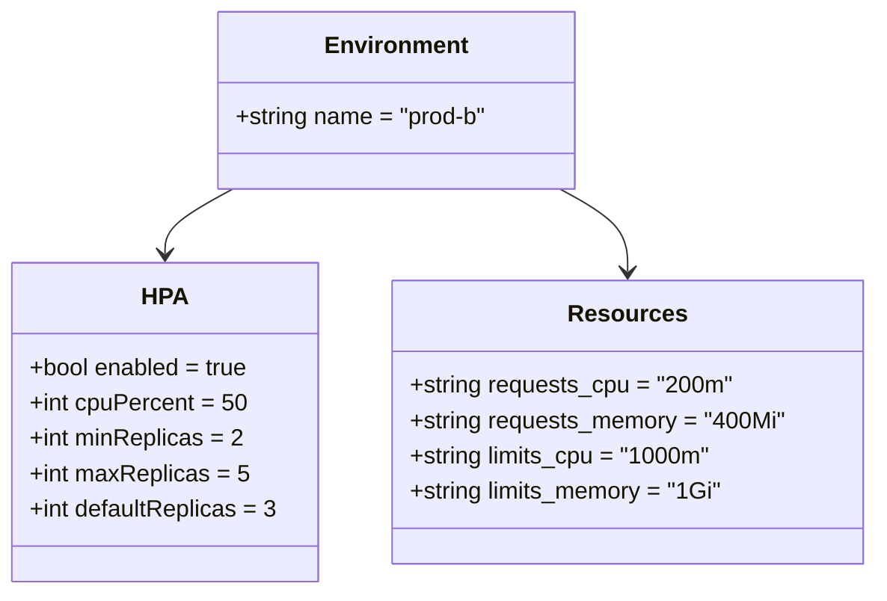
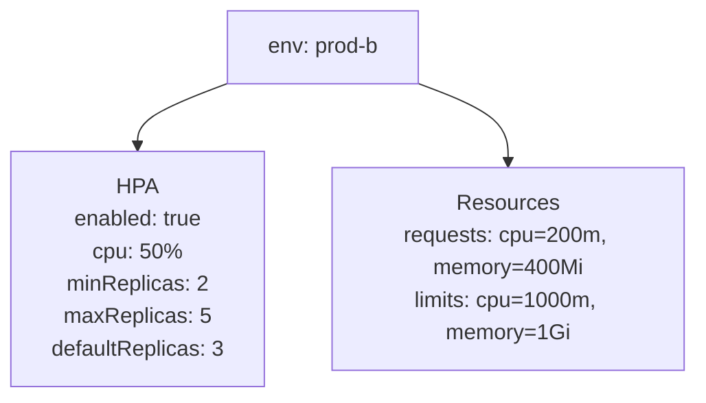

# Diagram: common/document_service/helm/profiles/values.prod-b.yaml

> Auto-generated by Obscura crawlers

## Diagram 1

### SVG

<svg id="container" width="590.21875" xmlns="http://www.w3.org/2000/svg" class="classDiagram" height="402" viewBox="0 0 590.21875 402" role="graphics-document document" aria-roledescription="class"><g><defs><marker id="container_class-aggregationStart" class="marker aggregation class" refX="18" refY="7" markerWidth="190" markerHeight="240" orient="auto"><path d="M 18,7 L9,13 L1,7 L9,1 Z"></path></marker></defs><defs><marker id="container_class-aggregationEnd" class="marker aggregation class" refX="1" refY="7" markerWidth="20" markerHeight="28" orient="auto"><path d="M 18,7 L9,13 L1,7 L9,1 Z"></path></marker></defs><defs><marker id="container_class-extensionStart" class="marker extension class" refX="18" refY="7" markerWidth="190" markerHeight="240" orient="auto"><path d="M 1,7 L18,13 V 1 Z"></path></marker></defs><defs><marker id="container_class-extensionEnd" class="marker extension class" refX="1" refY="7" markerWidth="20" markerHeight="28" orient="auto"><path d="M 1,1 V 13 L18,7 Z"></path></marker></defs><defs><marker id="container_class-compositionStart" class="marker composition class" refX="18" refY="7" markerWidth="190" markerHeight="240" orient="auto"><path d="M 18,7 L9,13 L1,7 L9,1 Z"></path></marker></defs><defs><marker id="container_class-compositionEnd" class="marker composition class" refX="1" refY="7" markerWidth="20" markerHeight="28" orient="auto"><path d="M 18,7 L9,13 L1,7 L9,1 Z"></path></marker></defs><defs><marker id="container_class-dependencyStart" class="marker dependency class" refX="6" refY="7" markerWidth="190" markerHeight="240" orient="auto"><path d="M 5,7 L9,13 L1,7 L9,1 Z"></path></marker></defs><defs><marker id="container_class-dependencyEnd" class="marker dependency class" refX="13" refY="7" markerWidth="20" markerHeight="28" orient="auto"><path d="M 18,7 L9,13 L14,7 L9,1 Z"></path></marker></defs><defs><marker id="container_class-lollipopStart" class="marker lollipop class" refX="13" refY="7" markerWidth="190" markerHeight="240" orient="auto"><circle stroke="black" fill="transparent" cx="7" cy="7" r="6"></circle></marker></defs><defs><marker id="container_class-lollipopEnd" class="marker lollipop class" refX="1" refY="7" markerWidth="190" markerHeight="240" orient="auto"><circle stroke="black" fill="transparent" cx="7" cy="7" r="6"></circle></marker></defs><g class="root"><g class="clusters"></g><g class="edgePaths"><path d="M157.336,128L149.686,132.167C142.036,136.333,126.737,144.667,119.087,152C111.438,159.333,111.438,165.667,111.438,168.833L111.438,172" id="id_Environment_HPA_1" class="edge-thickness-normal edge-pattern-solid relation" style=";;;" data-edge="true" data-et="edge" data-id="id_Environment_HPA_1" data-points="W3sieCI6MTU3LjMzNTkzNzUsInkiOjEyOH0seyJ4IjoxMTEuNDM3NSwieSI6MTUzfSx7IngiOjExMS40Mzc1LCJ5IjoxNzh9XQ==" marker-end="url(#container_class-dependencyEnd)"></path><path d="M377.648,128L385.298,132.167C392.948,136.333,408.247,144.667,415.897,154C423.547,163.333,423.547,173.667,423.547,178.833L423.547,184" id="id_Environment_Resources_2" class="edge-thickness-normal edge-pattern-solid relation" style=";;;" data-edge="true" data-et="edge" data-id="id_Environment_Resources_2" data-points="W3sieCI6Mzc3LjY0ODQzNzUsInkiOjEyOH0seyJ4Ijo0MjMuNTQ2ODc1LCJ5IjoxNTN9LHsieCI6NDIzLjU0Njg3NSwieSI6MTkwfV0=" marker-end="url(#container_class-dependencyEnd)"></path></g><g class="edgeLabels"><g class="edgeLabel"><g class="label" data-id="id_Environment_HPA_1" transform="translate(0, 0)"><foreignObject width="0" height="0">

</foreignObject></g></g><g class="edgeLabel"><g class="label" data-id="id_Environment_Resources_2" transform="translate(0, 0)"><foreignObject width="0" height="0">

</foreignObject></g></g></g><g class="nodes"><g class="node default" id="classId-Environment-0" transform="translate(267.4921875, 68)"><g class="basic label-container"><path d="M-121.86328125 -60 L121.86328125 -60 L121.86328125 60 L-121.86328125 60" stroke="none" stroke-width="0" fill="#ECECFF" style=""></path><path d="M-121.86328125 -60 C-53.915466108109555 -60, 14.03234903378089 -60, 121.86328125 -60 M-121.86328125 -60 C-43.16015907416627 -60, 35.54296310166745 -60, 121.86328125 -60 M121.86328125 -60 C121.86328125 -29.980863409922613, 121.86328125 0.03827318015477488, 121.86328125 60 M121.86328125 -60 C121.86328125 -19.30314207364433, 121.86328125 21.39371585271134, 121.86328125 60 M121.86328125 60 C50.5796701058852 60, -20.7039410382296 60, -121.86328125 60 M121.86328125 60 C49.183603026137476 60, -23.496075197725048 60, -121.86328125 60 M-121.86328125 60 C-121.86328125 35.59446862256162, -121.86328125 11.188937245123242, -121.86328125 -60 M-121.86328125 60 C-121.86328125 25.75784978814049, -121.86328125 -8.48430042371902, -121.86328125 -60" stroke="#9370DB" stroke-width="1.3" fill="none" stroke-dasharray="0 0" style=""></path></g><g class="annotation-group text" transform="translate(0, -36)"></g><g class="label-group text" transform="translate(-46.1953125, -36)"><g class="label" style="font-weight: bolder" transform="translate(0,-12)"><foreignObject width="92.390625" height="24">

Environment

</foreignObject></g></g><g class="members-group text" transform="translate(-109.86328125, 12)"><g class="label" style="" transform="translate(0,-12)"><foreignObject width="173.53125" height="24">

+string name = "prod-b"

</foreignObject></g></g><g class="methods-group text" transform="translate(-109.86328125, 60)"></g><g class="divider" style=""><path d="M-121.86328125 -12 C-40.69468767695642 -12, 40.47390589608716 -12, 121.86328125 -12 M-121.86328125 -12 C-65.46290942021372 -12, -9.06253759042744 -12, 121.86328125 -12" stroke="#9370DB" stroke-width="1.3" fill="none" stroke-dasharray="0 0" style=""></path></g><g class="divider" style=""><path d="M-121.86328125 36 C-69.88736628467016 36, -17.91145131934033 36, 121.86328125 36 M-121.86328125 36 C-51.65180478948676 36, 18.55967167102648 36, 121.86328125 36" stroke="#9370DB" stroke-width="1.3" fill="none" stroke-dasharray="0 0" style=""></path></g></g><g class="node default" id="classId-HPA-1" transform="translate(111.4375, 286)"><g class="basic label-container"><path d="M-103.4375 -108 L103.4375 -108 L103.4375 108 L-103.4375 108" stroke="none" stroke-width="0" fill="#ECECFF" style=""></path><path d="M-103.4375 -108 C-45.97329986631943 -108, 11.490900267361141 -108, 103.4375 -108 M-103.4375 -108 C-21.537206267638695 -108, 60.36308746472261 -108, 103.4375 -108 M103.4375 -108 C103.4375 -57.695119960117374, 103.4375 -7.390239920234748, 103.4375 108 M103.4375 -108 C103.4375 -32.04524867501782, 103.4375 43.90950264996437, 103.4375 108 M103.4375 108 C36.423700257109715 108, -30.59009948578057 108, -103.4375 108 M103.4375 108 C56.03047441623788 108, 8.62344883247576 108, -103.4375 108 M-103.4375 108 C-103.4375 50.56225878070578, -103.4375 -6.875482438588435, -103.4375 -108 M-103.4375 108 C-103.4375 38.704328430224024, -103.4375 -30.591343139551952, -103.4375 -108" stroke="#9370DB" stroke-width="1.3" fill="none" stroke-dasharray="0 0" style=""></path></g><g class="annotation-group text" transform="translate(0, -84)"></g><g class="label-group text" transform="translate(-14.375, -84)"><g class="label" style="font-weight: bolder" transform="translate(0,-12)"><foreignObject width="28.75" height="24">

HPA

</foreignObject></g></g><g class="members-group text" transform="translate(-91.4375, -36)"><g class="label" style="" transform="translate(0,-12)"><foreignObject width="150.78125" height="24">

+bool enabled = true

</foreignObject></g><g class="label" style="" transform="translate(0,12)"><foreignObject width="146.21875" height="24">

+int cpuPercent = 50

</foreignObject></g><g class="label" style="" transform="translate(0,36)"><foreignObject width="144.265625" height="24">

+int minReplicas = 2

</foreignObject></g><g class="label" style="" transform="translate(0,60)"><foreignObject width="146.9375" height="24">

+int maxReplicas = 5

</foreignObject></g><g class="label" style="" transform="translate(0,84)"><foreignObject width="168.5" height="24">

+int defaultReplicas = 3

</foreignObject></g></g><g class="methods-group text" transform="translate(-91.4375, 108)"></g><g class="divider" style=""><path d="M-103.4375 -60 C-39.9576689337026 -60, 23.5221621325948 -60, 103.4375 -60 M-103.4375 -60 C-49.82436119478801 -60, 3.7887776104239776 -60, 103.4375 -60" stroke="#9370DB" stroke-width="1.3" fill="none" stroke-dasharray="0 0" style=""></path></g><g class="divider" style=""><path d="M-103.4375 84 C-27.30995674838705 84, 48.8175865032259 84, 103.4375 84 M-103.4375 84 C-37.25157318588168 84, 28.934353628236636 84, 103.4375 84" stroke="#9370DB" stroke-width="1.3" fill="none" stroke-dasharray="0 0" style=""></path></g></g><g class="node default" id="classId-Resources-2" transform="translate(423.546875, 286)"><g class="basic label-container"><path d="M-158.671875 -96 L158.671875 -96 L158.671875 96 L-158.671875 96" stroke="none" stroke-width="0" fill="#ECECFF" style=""></path><path d="M-158.671875 -96 C-74.87612437959858 -96, 8.919626240802842 -96, 158.671875 -96 M-158.671875 -96 C-90.73340776414307 -96, -22.794940528286133 -96, 158.671875 -96 M158.671875 -96 C158.671875 -20.515173204494417, 158.671875 54.969653591011166, 158.671875 96 M158.671875 -96 C158.671875 -36.607043569463556, 158.671875 22.785912861072887, 158.671875 96 M158.671875 96 C71.29913046695499 96, -16.073614066090016 96, -158.671875 96 M158.671875 96 C53.926919205036 96, -50.818036589928 96, -158.671875 96 M-158.671875 96 C-158.671875 38.847672121447204, -158.671875 -18.304655757105593, -158.671875 -96 M-158.671875 96 C-158.671875 27.373620626136017, -158.671875 -41.25275874772797, -158.671875 -96" stroke="#9370DB" stroke-width="1.3" fill="none" stroke-dasharray="0 0" style=""></path></g><g class="annotation-group text" transform="translate(0, -72)"></g><g class="label-group text" transform="translate(-37.265625, -72)"><g class="label" style="font-weight: bolder" transform="translate(0,-12)"><foreignObject width="74.53125" height="24">

Resources

</foreignObject></g></g><g class="members-group text" transform="translate(-146.671875, -24)"><g class="label" style="" transform="translate(0,-12)"><foreignObject width="219.3125" height="24">

+string requests_cpu = "200m"

</foreignObject></g><g class="label" style="" transform="translate(0,12)"><foreignObject width="256.078125" height="24">

+string requests_memory = "400Mi"

</foreignObject></g><g class="label" style="" transform="translate(0,36)"><foreignObject width="205.1875" height="24">

+string limits_cpu = "1000m"

</foreignObject></g><g class="label" style="" transform="translate(0,60)"><foreignObject width="212.859375" height="24">

+string limits_memory = "1Gi"

</foreignObject></g></g><g class="methods-group text" transform="translate(-146.671875, 96)"></g><g class="divider" style=""><path d="M-158.671875 -48 C-48.121183937339595 -48, 62.42950712532081 -48, 158.671875 -48 M-158.671875 -48 C-91.43361732415397 -48, -24.195359648307942 -48, 158.671875 -48" stroke="#9370DB" stroke-width="1.3" fill="none" stroke-dasharray="0 0" style=""></path></g><g class="divider" style=""><path d="M-158.671875 72 C-42.13961669775382 72, 74.39264160449235 72, 158.671875 72 M-158.671875 72 C-46.22138723005432 72, 66.22910053989136 72, 158.671875 72" stroke="#9370DB" stroke-width="1.3" fill="none" stroke-dasharray="0 0" style=""></path></g></g></g></g></g></svg>

## Diagram 2

### SVG

<svg id="container" width="514.21875" xmlns="http://www.w3.org/2000/svg" class="flowchart" height="294" viewBox="0 0 514.21875 294" role="graphics-document document" aria-roledescription="flowchart-v2"><g><marker id="container_flowchart-v2-pointEnd" class="marker flowchart-v2" viewBox="0 0 10 10" refX="5" refY="5" markerUnits="userSpaceOnUse" markerWidth="8" markerHeight="8" orient="auto"><path d="M 0 0 L 10 5 L 0 10 z" class="arrowMarkerPath" style="stroke-width: 1; stroke-dasharray: 1, 0;"></path></marker><marker id="container_flowchart-v2-pointStart" class="marker flowchart-v2" viewBox="0 0 10 10" refX="4.5" refY="5" markerUnits="userSpaceOnUse" markerWidth="8" markerHeight="8" orient="auto"><path d="M 0 5 L 10 10 L 10 0 z" class="arrowMarkerPath" style="stroke-width: 1; stroke-dasharray: 1, 0;"></path></marker><marker id="container_flowchart-v2-circleEnd" class="marker flowchart-v2" viewBox="0 0 10 10" refX="11" refY="5" markerUnits="userSpaceOnUse" markerWidth="11" markerHeight="11" orient="auto"><circle cx="5" cy="5" r="5" class="arrowMarkerPath" style="stroke-width: 1; stroke-dasharray: 1, 0;"></circle></marker><marker id="container_flowchart-v2-circleStart" class="marker flowchart-v2" viewBox="0 0 10 10" refX="-1" refY="5" markerUnits="userSpaceOnUse" markerWidth="11" markerHeight="11" orient="auto"><circle cx="5" cy="5" r="5" class="arrowMarkerPath" style="stroke-width: 1; stroke-dasharray: 1, 0;"></circle></marker><marker id="container_flowchart-v2-crossEnd" class="marker cross flowchart-v2" viewBox="0 0 11 11" refX="12" refY="5.2" markerUnits="userSpaceOnUse" markerWidth="11" markerHeight="11" orient="auto"><path d="M 1,1 l 9,9 M 10,1 l -9,9" class="arrowMarkerPath" style="stroke-width: 2; stroke-dasharray: 1, 0;"></path></marker><marker id="container_flowchart-v2-crossStart" class="marker cross flowchart-v2" viewBox="0 0 11 11" refX="-1" refY="5.2" markerUnits="userSpaceOnUse" markerWidth="11" markerHeight="11" orient="auto"><path d="M 1,1 l 9,9 M 10,1 l -9,9" class="arrowMarkerPath" style="stroke-width: 2; stroke-dasharray: 1, 0;"></path></marker><g class="root"><g class="clusters"></g><g class="edgePaths"><path d="M168.001,62L157.019,66.167C146.037,70.333,124.073,78.667,113.091,86.333C102.109,94,102.109,101,102.109,104.5L102.109,108" id="L_Env_HPA_0" class="edge-thickness-normal edge-pattern-solid edge-thickness-normal edge-pattern-solid flowchart-link" style=";" data-edge="true" data-et="edge" data-id="L_Env_HPA_0" data-points="W3sieCI6MTY4LjAwMTA1MTY4MjY5MjMyLCJ5Ijo2Mn0seyJ4IjoxMDIuMTA5Mzc1LCJ5Ijo4N30seyJ4IjoxMDIuMTA5Mzc1LCJ5IjoxMTJ9XQ==" marker-end="url(#container_flowchart-v2-pointEnd)"></path><path d="M310.327,62L321.309,66.167C332.291,70.333,354.255,78.667,365.237,88.333C376.219,98,376.219,109,376.219,114.5L376.219,120" id="L_Env_Resources_0" class="edge-thickness-normal edge-pattern-solid edge-thickness-normal edge-pattern-solid flowchart-link" style=";" data-edge="true" data-et="edge" data-id="L_Env_Resources_0" data-points="W3sieCI6MzEwLjMyNzA3MzMxNzMwNzcsInkiOjYyfSx7IngiOjM3Ni4yMTg3NSwieSI6ODd9LHsieCI6Mzc2LjIxODc1LCJ5IjoxMjR9XQ==" marker-end="url(#container_flowchart-v2-pointEnd)"></path></g><g class="edgeLabels"><g class="edgeLabel"><g class="label" data-id="L_Env_HPA_0" transform="translate(0, 0)"><foreignObject width="0" height="0">

</foreignObject></g></g><g class="edgeLabel"><g class="label" data-id="L_Env_Resources_0" transform="translate(0, 0)"><foreignObject width="0" height="0">

</foreignObject></g></g></g><g class="nodes"><g class="node default" id="flowchart-Env-0" transform="translate(239.1640625, 35)"><rect class="basic label-container" style="" x="-72.0390625" y="-27" width="144.078125" height="54"></rect><g class="label" style="" transform="translate(-42.0390625, -12)"><rect></rect><foreignObject width="84.078125" height="24">

env: prod-b

</foreignObject></g></g><g class="node default" id="flowchart-HPA-1" transform="translate(102.109375, 199)"><rect class="basic label-container" style="" x="-94.109375" y="-87" width="188.21875" height="174"></rect><g class="label" style="" transform="translate(-64.109375, -72)"><rect></rect><foreignObject width="128.21875" height="144">

HPA enabled: true cpu: 50% minReplicas: 2 maxReplicas: 5 defaultReplicas: 3

</foreignObject></g></g><g class="node default" id="flowchart-Resources-3" transform="translate(376.21875, 199)"><rect class="basic label-container" style="" x="-130" y="-75" width="260" height="150"></rect><g class="label" style="" transform="translate(-100, -60)"><rect></rect><foreignObject width="200" height="120">

Resources requests: cpu=200m, memory=400Mi limits: cpu=1000m, memory=1Gi

</foreignObject></g></g></g></g></g></svg>
