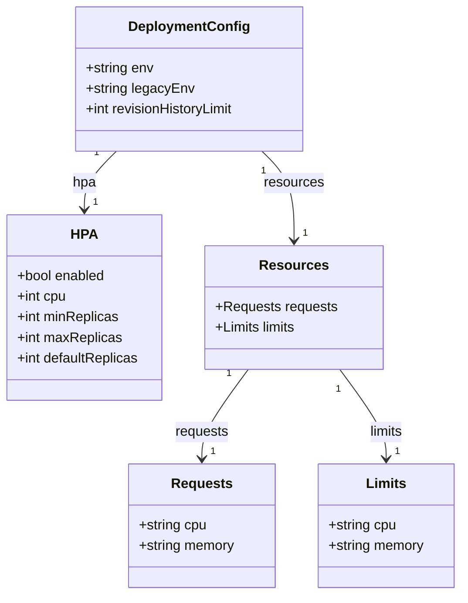
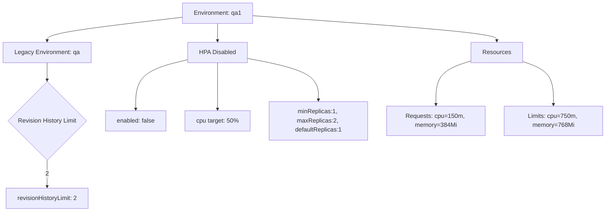

# Diagram: common/document_service/helm/profiles/values.qa1.yaml

> Auto-generated by Obscura crawlers

## Diagram 1

### SVG

<svg id="container" width="537.39453125" xmlns="http://www.w3.org/2000/svg" class="classDiagram" height="692" viewBox="0 0 537.39453125 692" role="graphics-document document" aria-roledescription="class"><g><defs><marker id="container_class-aggregationStart" class="marker aggregation class" refX="18" refY="7" markerWidth="190" markerHeight="240" orient="auto"><path d="M 18,7 L9,13 L1,7 L9,1 Z"></path></marker></defs><defs><marker id="container_class-aggregationEnd" class="marker aggregation class" refX="1" refY="7" markerWidth="20" markerHeight="28" orient="auto"><path d="M 18,7 L9,13 L1,7 L9,1 Z"></path></marker></defs><defs><marker id="container_class-extensionStart" class="marker extension class" refX="18" refY="7" markerWidth="190" markerHeight="240" orient="auto"><path d="M 1,7 L18,13 V 1 Z"></path></marker></defs><defs><marker id="container_class-extensionEnd" class="marker extension class" refX="1" refY="7" markerWidth="20" markerHeight="28" orient="auto"><path d="M 1,1 V 13 L18,7 Z"></path></marker></defs><defs><marker id="container_class-compositionStart" class="marker composition class" refX="18" refY="7" markerWidth="190" markerHeight="240" orient="auto"><path d="M 18,7 L9,13 L1,7 L9,1 Z"></path></marker></defs><defs><marker id="container_class-compositionEnd" class="marker composition class" refX="1" refY="7" markerWidth="20" markerHeight="28" orient="auto"><path d="M 18,7 L9,13 L1,7 L9,1 Z"></path></marker></defs><defs><marker id="container_class-dependencyStart" class="marker dependency class" refX="6" refY="7" markerWidth="190" markerHeight="240" orient="auto"><path d="M 5,7 L9,13 L1,7 L9,1 Z"></path></marker></defs><defs><marker id="container_class-dependencyEnd" class="marker dependency class" refX="13" refY="7" markerWidth="20" markerHeight="28" orient="auto"><path d="M 18,7 L9,13 L14,7 L9,1 Z"></path></marker></defs><defs><marker id="container_class-lollipopStart" class="marker lollipop class" refX="13" refY="7" markerWidth="190" markerHeight="240" orient="auto"><circle stroke="black" fill="transparent" cx="7" cy="7" r="6"></circle></marker></defs><defs><marker id="container_class-lollipopEnd" class="marker lollipop class" refX="1" refY="7" markerWidth="190" markerHeight="240" orient="auto"><circle stroke="black" fill="transparent" cx="7" cy="7" r="6"></circle></marker></defs><g class="root"><g class="clusters"></g><g class="edgePaths"><path d="M136.298,176L130.117,182.167C123.936,188.333,111.573,200.667,105.392,212C99.211,223.333,99.211,233.667,99.211,238.833L99.211,244" id="id_DeploymentConfig_HPA_1" class="edge-thickness-normal edge-pattern-solid relation" style=";;;" data-edge="true" data-et="edge" data-id="id_DeploymentConfig_HPA_1" data-points="W3sieCI6MTM2LjI5ODEzNDAzOTI1NjE4LCJ5IjoxNzZ9LHsieCI6OTkuMjEwOTM3NSwieSI6MjEzfSx7IngiOjk5LjIxMDkzNzUsInkiOjI1MH1d" marker-end="url(#container_class-dependencyEnd)"></path><path d="M304.694,176L310.875,182.167C317.056,188.333,329.419,200.667,335.6,218C341.781,235.333,341.781,257.667,341.781,268.833L341.781,280" id="id_DeploymentConfig_Resources_2" class="edge-thickness-normal edge-pattern-solid relation" style=";;;" data-edge="true" data-et="edge" data-id="id_DeploymentConfig_Resources_2" data-points="W3sieCI6MzA0LjY5NDA1MzQ2MDc0MzgsInkiOjE3Nn0seyJ4IjozNDEuNzgxMjUsInkiOjIxM30seyJ4IjozNDEuNzgxMjUsInkiOjI4Nn1d" marker-end="url(#container_class-dependencyEnd)"></path><path d="M288.28,430L279.239,442.167C270.198,454.333,252.117,478.667,243.076,496C234.035,513.333,234.035,523.667,234.035,528.833L234.035,534" id="id_Resources_Requests_3" class="edge-thickness-normal edge-pattern-solid relation" style=";;;" data-edge="true" data-et="edge" data-id="id_Resources_Requests_3" data-points="W3sieCI6Mjg4LjI3OTc0MTM3OTMxMDM0LCJ5Ijo0MzB9LHsieCI6MjM0LjAzNTE1NjI1LCJ5Ijo1MDN9LHsieCI6MjM0LjAzNTE1NjI1LCJ5Ijo1NDB9XQ==" marker-end="url(#container_class-dependencyEnd)"></path><path d="M395.283,430L404.324,442.167C413.364,454.333,431.446,478.667,440.487,496C449.527,513.333,449.527,523.667,449.527,528.833L449.527,534" id="id_Resources_Limits_4" class="edge-thickness-normal edge-pattern-solid relation" style=";;;" data-edge="true" data-et="edge" data-id="id_Resources_Limits_4" data-points="W3sieCI6Mzk1LjI4Mjc1ODYyMDY4OTY2LCJ5Ijo0MzB9LHsieCI6NDQ5LjUyNzM0Mzc1LCJ5Ijo1MDN9LHsieCI6NDQ5LjUyNzM0Mzc1LCJ5Ijo1NDB9XQ==" marker-end="url(#container_class-dependencyEnd)"></path></g><g class="edgeLabels"><g class="edgeLabel" transform="translate(99.2109375, 213)"><g class="label" data-id="id_DeploymentConfig_HPA_1" transform="translate(-13.71875, -12)"><foreignObject width="27.4375" height="24">

hpa

</foreignObject></g></g><g class="edgeLabel" transform="translate(341.78125, 213)"><g class="label" data-id="id_DeploymentConfig_Resources_2" transform="translate(-34.8828125, -12)"><foreignObject width="69.765625" height="24">

resources

</foreignObject></g></g><g class="edgeLabel" transform="translate(234.03515625, 503)"><g class="label" data-id="id_Resources_Requests_3" transform="translate(-31.375, -12)"><foreignObject width="62.75" height="24">

requests

</foreignObject></g></g><g class="edgeLabel" transform="translate(449.52734375, 503)"><g class="label" data-id="id_Resources_Limits_4" transform="translate(-20.34375, -12)"><foreignObject width="40.6875" height="24">

limits

</foreignObject></g></g><g class="edgeTerminals" transform="translate(113.31510065753577, 177.7407176178737)"><g class="inner" transform="translate(0, 0)"><foreignObject style="width: 9px; height: 12px;">
1
</foreignObject></g></g><g class="edgeTerminals" transform="translate(306.48886590399246, 198.97887291657966)"><g class="inner" transform="translate(0, 0)"><foreignObject style="width: 9px; height: 12px;">
1
</foreignObject></g></g><g class="edgeTerminals" transform="translate(265.8021931262357, 435.0999771370165)"><g class="inner" transform="translate(0, 0)"><foreignObject style="width: 9px; height: 12px;">
1
</foreignObject></g></g><g class="edgeTerminals" transform="translate(393.68052174692536, 452.9931028629835)"><g class="inner" transform="translate(0, 0)"><foreignObject style="width: 9px; height: 12px;">
1
</foreignObject></g></g><g class="edgeTerminals" transform="translate(109.21093874999995, 227.50000107142858)"><g class="inner" transform="translate(0, 0)"></g><foreignObject style="width: 9px; height: 12px;">
1
</foreignObject></g><g class="edgeTerminals" transform="translate(351.78125, 263.5)"><g class="inner" transform="translate(0, 0)"></g><foreignObject style="width: 9px; height: 12px;">
1
</foreignObject></g><g class="edgeTerminals" transform="translate(244.03515812499992, 517.5000016071428)"><g class="inner" transform="translate(0, 0)"></g><foreignObject style="width: 9px; height: 12px;">
1
</foreignObject></g><g class="edgeTerminals" transform="translate(459.5273418749999, 517.4999983928572)"><g class="inner" transform="translate(0, 0)"></g><foreignObject style="width: 9px; height: 12px;">
1
</foreignObject></g></g><g class="nodes"><g class="node default" id="classId-DeploymentConfig-0" transform="translate(220.49609375, 92)"><g class="basic label-container"><path d="M-134.453125 -84 L134.453125 -84 L134.453125 84 L-134.453125 84" stroke="none" stroke-width="0" fill="#ECECFF" style=""></path><path d="M-134.453125 -84 C-53.6885980022205 -84, 27.075928995558996 -84, 134.453125 -84 M-134.453125 -84 C-54.81850391083978 -84, 24.81611717832044 -84, 134.453125 -84 M134.453125 -84 C134.453125 -39.78078033512186, 134.453125 4.438439329756278, 134.453125 84 M134.453125 -84 C134.453125 -20.912339660934123, 134.453125 42.175320678131754, 134.453125 84 M134.453125 84 C53.57914241086003 84, -27.29484017827994 84, -134.453125 84 M134.453125 84 C52.835122391619336 84, -28.782880216761328 84, -134.453125 84 M-134.453125 84 C-134.453125 33.75797315236816, -134.453125 -16.484053695263682, -134.453125 -84 M-134.453125 84 C-134.453125 24.19013739211598, -134.453125 -35.61972521576804, -134.453125 -84" stroke="#9370DB" stroke-width="1.3" fill="none" stroke-dasharray="0 0" style=""></path></g><g class="annotation-group text" transform="translate(0, -60)"></g><g class="label-group text" transform="translate(-67.296875, -60)"><g class="label" style="font-weight: bolder" transform="translate(0,-12)"><foreignObject width="134.59375" height="24">

DeploymentConfig

</foreignObject></g></g><g class="members-group text" transform="translate(-122.453125, -12)"><g class="label" style="" transform="translate(0,-12)"><foreignObject width="79.71875" height="24">

+string env

</foreignObject></g><g class="label" style="" transform="translate(0,12)"><foreignObject width="124.96875" height="24">

+string legacyEnv

</foreignObject></g><g class="label" style="" transform="translate(0,36)"><foreignObject width="177.609375" height="24">

+int revisionHistoryLimit

</foreignObject></g></g><g class="methods-group text" transform="translate(-122.453125, 84)"></g><g class="divider" style=""><path d="M-134.453125 -36 C-37.543269128075124 -36, 59.36658674384975 -36, 134.453125 -36 M-134.453125 -36 C-34.136998662234404 -36, 66.17912767553119 -36, 134.453125 -36" stroke="#9370DB" stroke-width="1.3" fill="none" stroke-dasharray="0 0" style=""></path></g><g class="divider" style=""><path d="M-134.453125 60 C-73.12451143994721 60, -11.795897879894426 60, 134.453125 60 M-134.453125 60 C-58.63977262763993 60, 17.173579744720143 60, 134.453125 60" stroke="#9370DB" stroke-width="1.3" fill="none" stroke-dasharray="0 0" style=""></path></g></g><g class="node default" id="classId-HPA-1" transform="translate(99.2109375, 358)"><g class="basic label-container"><path d="M-91.2109375 -108 L91.2109375 -108 L91.2109375 108 L-91.2109375 108" stroke="none" stroke-width="0" fill="#ECECFF" style=""></path><path d="M-91.2109375 -108 C-27.31055338008605 -108, 36.5898307398279 -108, 91.2109375 -108 M-91.2109375 -108 C-28.591267730586324 -108, 34.02840203882735 -108, 91.2109375 -108 M91.2109375 -108 C91.2109375 -34.79432058486857, 91.2109375 38.411358830262856, 91.2109375 108 M91.2109375 -108 C91.2109375 -27.067258164306224, 91.2109375 53.86548367138755, 91.2109375 108 M91.2109375 108 C47.99269070713441 108, 4.774443914268815 108, -91.2109375 108 M91.2109375 108 C33.83165776730886 108, -23.547621965382277 108, -91.2109375 108 M-91.2109375 108 C-91.2109375 41.1193354263998, -91.2109375 -25.7613291472004, -91.2109375 -108 M-91.2109375 108 C-91.2109375 50.33787784582647, -91.2109375 -7.324244308347062, -91.2109375 -108" stroke="#9370DB" stroke-width="1.3" fill="none" stroke-dasharray="0 0" style=""></path></g><g class="annotation-group text" transform="translate(0, -84)"></g><g class="label-group text" transform="translate(-14.375, -84)"><g class="label" style="font-weight: bolder" transform="translate(0,-12)"><foreignObject width="28.75" height="24">

HPA

</foreignObject></g></g><g class="members-group text" transform="translate(-79.2109375, -36)"><g class="label" style="" transform="translate(0,-12)"><foreignObject width="104.3125" height="24">

+bool enabled

</foreignObject></g><g class="label" style="" transform="translate(0,12)"><foreignObject width="58.359375" height="24">

+int cpu

</foreignObject></g><g class="label" style="" transform="translate(0,36)"><foreignObject width="119.859375" height="24">

+int minReplicas

</foreignObject></g><g class="label" style="" transform="translate(0,60)"><foreignObject width="122.4375" height="24">

+int maxReplicas

</foreignObject></g><g class="label" style="" transform="translate(0,84)"><foreignObject width="144.046875" height="24">

+int defaultReplicas

</foreignObject></g></g><g class="methods-group text" transform="translate(-79.2109375, 108)"></g><g class="divider" style=""><path d="M-91.2109375 -60 C-21.335187229471785 -60, 48.54056304105643 -60, 91.2109375 -60 M-91.2109375 -60 C-40.19386886495933 -60, 10.823199770081345 -60, 91.2109375 -60" stroke="#9370DB" stroke-width="1.3" fill="none" stroke-dasharray="0 0" style=""></path></g><g class="divider" style=""><path d="M-91.2109375 84 C-42.14208778966404 84, 6.926761920671922 84, 91.2109375 84 M-91.2109375 84 C-35.46836570978775 84, 20.274206080424506 84, 91.2109375 84" stroke="#9370DB" stroke-width="1.3" fill="none" stroke-dasharray="0 0" style=""></path></g></g><g class="node default" id="classId-Resources-2" transform="translate(341.78125, 358)"><g class="basic label-container"><path d="M-101.359375 -72 L101.359375 -72 L101.359375 72 L-101.359375 72" stroke="none" stroke-width="0" fill="#ECECFF" style=""></path><path d="M-101.359375 -72 C-48.75909215083392 -72, 3.8411906983321558 -72, 101.359375 -72 M-101.359375 -72 C-38.49154205881255 -72, 24.376290882374903 -72, 101.359375 -72 M101.359375 -72 C101.359375 -41.6376717462544, 101.359375 -11.275343492508796, 101.359375 72 M101.359375 -72 C101.359375 -36.16093399862068, 101.359375 -0.3218679972413554, 101.359375 72 M101.359375 72 C27.000360946982283 72, -47.35865310603543 72, -101.359375 72 M101.359375 72 C26.64458387808091 72, -48.07020724383818 72, -101.359375 72 M-101.359375 72 C-101.359375 40.10979535353931, -101.359375 8.219590707078623, -101.359375 -72 M-101.359375 72 C-101.359375 15.068642450184932, -101.359375 -41.86271509963014, -101.359375 -72" stroke="#9370DB" stroke-width="1.3" fill="none" stroke-dasharray="0 0" style=""></path></g><g class="annotation-group text" transform="translate(0, -48)"></g><g class="label-group text" transform="translate(-37.265625, -48)"><g class="label" style="font-weight: bolder" transform="translate(0,-12)"><foreignObject width="74.53125" height="24">

Resources

</foreignObject></g></g><g class="members-group text" transform="translate(-89.359375, 0)"><g class="label" style="" transform="translate(0,-12)"><foreignObject width="141.453125" height="24">

+Requests requests

</foreignObject></g><g class="label" style="" transform="translate(0,12)"><foreignObject width="96.859375" height="24">

+Limits limits

</foreignObject></g></g><g class="methods-group text" transform="translate(-89.359375, 72)"></g><g class="divider" style=""><path d="M-101.359375 -24 C-39.77092653285715 -24, 21.817521934285693 -24, 101.359375 -24 M-101.359375 -24 C-39.80076298853817 -24, 21.757849022923665 -24, 101.359375 -24" stroke="#9370DB" stroke-width="1.3" fill="none" stroke-dasharray="0 0" style=""></path></g><g class="divider" style=""><path d="M-101.359375 48 C-47.43099491635092 48, 6.497385167298162 48, 101.359375 48 M-101.359375 48 C-25.74632511153476 48, 49.86672477693048 48, 101.359375 48" stroke="#9370DB" stroke-width="1.3" fill="none" stroke-dasharray="0 0" style=""></path></g></g><g class="node default" id="classId-Requests-3" transform="translate(234.03515625, 612)"><g class="basic label-container"><path d="M-85.625 -72 L85.625 -72 L85.625 72 L-85.625 72" stroke="none" stroke-width="0" fill="#ECECFF" style=""></path><path d="M-85.625 -72 C-41.782078114071076 -72, 2.060843771857847 -72, 85.625 -72 M-85.625 -72 C-33.79672621471265 -72, 18.031547570574702 -72, 85.625 -72 M85.625 -72 C85.625 -42.52440759540124, 85.625 -13.048815190802486, 85.625 72 M85.625 -72 C85.625 -39.04994691211027, 85.625 -6.099893824220544, 85.625 72 M85.625 72 C33.6392593496442 72, -18.346481300711602 72, -85.625 72 M85.625 72 C28.088809654928127 72, -29.447380690143746 72, -85.625 72 M-85.625 72 C-85.625 14.49387185903015, -85.625 -43.0122562819397, -85.625 -72 M-85.625 72 C-85.625 37.76365888654012, -85.625 3.5273177730802416, -85.625 -72" stroke="#9370DB" stroke-width="1.3" fill="none" stroke-dasharray="0 0" style=""></path></g><g class="annotation-group text" transform="translate(0, -48)"></g><g class="label-group text" transform="translate(-33.84375, -48)"><g class="label" style="font-weight: bolder" transform="translate(0,-12)"><foreignObject width="67.6875" height="24">

Requests

</foreignObject></g></g><g class="members-group text" transform="translate(-73.625, 0)"><g class="label" style="" transform="translate(0,-12)"><foreignObject width="80.328125" height="24">

+string cpu

</foreignObject></g><g class="label" style="" transform="translate(0,12)"><foreignObject width="113.40625" height="24">

+string memory

</foreignObject></g></g><g class="methods-group text" transform="translate(-73.625, 72)"></g><g class="divider" style=""><path d="M-85.625 -24 C-22.0899825214225 -24, 41.445034957155 -24, 85.625 -24 M-85.625 -24 C-33.308625148151975 -24, 19.00774970369605 -24, 85.625 -24" stroke="#9370DB" stroke-width="1.3" fill="none" stroke-dasharray="0 0" style=""></path></g><g class="divider" style=""><path d="M-85.625 48 C-50.20131384488282 48, -14.777627689765637 48, 85.625 48 M-85.625 48 C-30.84340165446332 48, 23.938196691073358 48, 85.625 48" stroke="#9370DB" stroke-width="1.3" fill="none" stroke-dasharray="0 0" style=""></path></g></g><g class="node default" id="classId-Limits-4" transform="translate(449.52734375, 612)"><g class="basic label-container"><path d="M-79.8671875 -72 L79.8671875 -72 L79.8671875 72 L-79.8671875 72" stroke="none" stroke-width="0" fill="#ECECFF" style=""></path><path d="M-79.8671875 -72 C-16.409427505762856 -72, 47.04833248847429 -72, 79.8671875 -72 M-79.8671875 -72 C-42.327720855391576 -72, -4.788254210783151 -72, 79.8671875 -72 M79.8671875 -72 C79.8671875 -36.41817937634377, 79.8671875 -0.8363587526875449, 79.8671875 72 M79.8671875 -72 C79.8671875 -30.183807331395144, 79.8671875 11.632385337209712, 79.8671875 72 M79.8671875 72 C42.727271218126454 72, 5.587354936252908 72, -79.8671875 72 M79.8671875 72 C34.97239304313935 72, -9.922401413721303 72, -79.8671875 72 M-79.8671875 72 C-79.8671875 39.88653936539905, -79.8671875 7.773078730798105, -79.8671875 -72 M-79.8671875 72 C-79.8671875 28.199603155970628, -79.8671875 -15.600793688058744, -79.8671875 -72" stroke="#9370DB" stroke-width="1.3" fill="none" stroke-dasharray="0 0" style=""></path></g><g class="annotation-group text" transform="translate(0, -48)"></g><g class="label-group text" transform="translate(-22.328125, -48)"><g class="label" style="font-weight: bolder" transform="translate(0,-12)"><foreignObject width="44.65625" height="24">

Limits

</foreignObject></g></g><g class="members-group text" transform="translate(-67.8671875, 0)"><g class="label" style="" transform="translate(0,-12)"><foreignObject width="80.328125" height="24">

+string cpu

</foreignObject></g><g class="label" style="" transform="translate(0,12)"><foreignObject width="113.40625" height="24">

+string memory

</foreignObject></g></g><g class="methods-group text" transform="translate(-67.8671875, 72)"></g><g class="divider" style=""><path d="M-79.8671875 -24 C-39.93993784988311 -24, -0.012688199766216712 -24, 79.8671875 -24 M-79.8671875 -24 C-26.76192737244726 -24, 26.34333275510548 -24, 79.8671875 -24" stroke="#9370DB" stroke-width="1.3" fill="none" stroke-dasharray="0 0" style=""></path></g><g class="divider" style=""><path d="M-79.8671875 48 C-21.235561096421137 48, 37.39606530715773 48, 79.8671875 48 M-79.8671875 48 C-45.41616386386816 48, -10.965140227736313 48, 79.8671875 48" stroke="#9370DB" stroke-width="1.3" fill="none" stroke-dasharray="0 0" style=""></path></g></g></g></g></g></svg>

## Diagram 2

### SVG

<svg id="container" width="1601.1796875" xmlns="http://www.w3.org/2000/svg" class="flowchart" height="563.9375" viewBox="0 0 1601.1796875 563.9375" role="graphics-document document" aria-roledescription="flowchart-v2"><g><marker id="container_flowchart-v2-pointEnd" class="marker flowchart-v2" viewBox="0 0 10 10" refX="5" refY="5" markerUnits="userSpaceOnUse" markerWidth="8" markerHeight="8" orient="auto"><path d="M 0 0 L 10 5 L 0 10 z" class="arrowMarkerPath" style="stroke-width: 1; stroke-dasharray: 1, 0;"></path></marker><marker id="container_flowchart-v2-pointStart" class="marker flowchart-v2" viewBox="0 0 10 10" refX="4.5" refY="5" markerUnits="userSpaceOnUse" markerWidth="8" markerHeight="8" orient="auto"><path d="M 0 5 L 10 10 L 10 0 z" class="arrowMarkerPath" style="stroke-width: 1; stroke-dasharray: 1, 0;"></path></marker><marker id="container_flowchart-v2-circleEnd" class="marker flowchart-v2" viewBox="0 0 10 10" refX="11" refY="5" markerUnits="userSpaceOnUse" markerWidth="11" markerHeight="11" orient="auto"><circle cx="5" cy="5" r="5" class="arrowMarkerPath" style="stroke-width: 1; stroke-dasharray: 1, 0;"></circle></marker><marker id="container_flowchart-v2-circleStart" class="marker flowchart-v2" viewBox="0 0 10 10" refX="-1" refY="5" markerUnits="userSpaceOnUse" markerWidth="11" markerHeight="11" orient="auto"><circle cx="5" cy="5" r="5" class="arrowMarkerPath" style="stroke-width: 1; stroke-dasharray: 1, 0;"></circle></marker><marker id="container_flowchart-v2-crossEnd" class="marker cross flowchart-v2" viewBox="0 0 11 11" refX="12" refY="5.2" markerUnits="userSpaceOnUse" markerWidth="11" markerHeight="11" orient="auto"><path d="M 1,1 l 9,9 M 10,1 l -9,9" class="arrowMarkerPath" style="stroke-width: 2; stroke-dasharray: 1, 0;"></path></marker><marker id="container_flowchart-v2-crossStart" class="marker cross flowchart-v2" viewBox="0 0 11 11" refX="-1" refY="5.2" markerUnits="userSpaceOnUse" markerWidth="11" markerHeight="11" orient="auto"><path d="M 1,1 l 9,9 M 10,1 l -9,9" class="arrowMarkerPath" style="stroke-width: 2; stroke-dasharray: 1, 0;"></path></marker><g class="root"><g class="clusters"></g><g class="edgePaths"><path d="M484.945,45.58L424.724,52.483C364.503,59.387,244.06,73.193,183.839,83.597C123.617,94,123.617,101,123.617,104.5L123.617,108" id="L_A_B_0" class="edge-thickness-normal edge-pattern-solid edge-thickness-normal edge-pattern-solid flowchart-link" style=";" data-edge="true" data-et="edge" data-id="L_A_B_0" data-points="W3sieCI6NDg0Ljk0NTMxMjUsInkiOjQ1LjU4MDE4NzM3OTQ0MzM3fSx7IngiOjEyMy42MTcxODc1LCJ5Ijo4N30seyJ4IjoxMjMuNjE3MTg3NSwieSI6MTEyfV0=" marker-end="url(#container_flowchart-v2-pointEnd)"></path><path d="M123.617,166L123.617,170.167C123.617,174.333,123.617,182.667,123.617,190.333C123.617,198,123.617,205,123.617,208.5L123.617,212" id="L_B_C_0" class="edge-thickness-normal edge-pattern-solid edge-thickness-normal edge-pattern-solid flowchart-link" style=";" data-edge="true" data-et="edge" data-id="L_B_C_0" data-points="W3sieCI6MTIzLjYxNzE4NzUsInkiOjE2Nn0seyJ4IjoxMjMuNjE3MTg3NSwieSI6MTkxfSx7IngiOjEyMy42MTcxODc1LCJ5IjoyMTZ9XQ==" marker-end="url(#container_flowchart-v2-pointEnd)"></path><path d="M123.617,427.938L123.617,434.104C123.617,440.271,123.617,452.604,123.617,464.271C123.617,475.938,123.617,486.938,123.617,492.438L123.617,497.938" id="L_C_D_0" class="edge-thickness-normal edge-pattern-solid edge-thickness-normal edge-pattern-solid flowchart-link" style=";" data-edge="true" data-et="edge" data-id="L_C_D_0" data-points="W3sieCI6MTIzLjYxNzE4NzUsInkiOjQyNy45Mzc1fSx7IngiOjEyMy42MTcxODc1LCJ5Ijo0NjQuOTM3NX0seyJ4IjoxMjMuNjE3MTg3NSwieSI6NTAxLjkzNzV9XQ==" marker-end="url(#container_flowchart-v2-pointEnd)"></path><path d="M577.242,62L577.242,66.167C577.242,70.333,577.242,78.667,577.242,86.333C577.242,94,577.242,101,577.242,104.5L577.242,108" id="L_A_E_0" class="edge-thickness-normal edge-pattern-solid edge-thickness-normal edge-pattern-solid flowchart-link" style=";" data-edge="true" data-et="edge" data-id="L_A_E_0" data-points="W3sieCI6NTc3LjI0MjE4NzUsInkiOjYyfSx7IngiOjU3Ny4yNDIxODc1LCJ5Ijo4N30seyJ4Ijo1NzcuMjQyMTg3NSwieSI6MTEyfV0=" marker-end="url(#container_flowchart-v2-pointEnd)"></path><path d="M499.313,157.692L476.168,163.243C453.023,168.795,406.734,179.897,383.59,202.11C360.445,224.323,360.445,257.646,360.445,274.307L360.445,290.969" id="L_E_F_0" class="edge-thickness-normal edge-pattern-solid edge-thickness-normal edge-pattern-solid flowchart-link" style=";" data-edge="true" data-et="edge" data-id="L_E_F_0" data-points="W3sieCI6NDk5LjMxMjUsInkiOjE1Ny42OTE4OTE4OTE4OTE4OH0seyJ4IjozNjAuNDQ1MzEyNSwieSI6MTkxfSx7IngiOjM2MC40NDUzMTI1LCJ5IjoyOTQuOTY4NzV9XQ==" marker-end="url(#container_flowchart-v2-pointEnd)"></path><path d="M577.242,166L577.242,170.167C577.242,174.333,577.242,182.667,577.242,203.495C577.242,224.323,577.242,257.646,577.242,274.307L577.242,290.969" id="L_E_G_0" class="edge-thickness-normal edge-pattern-solid edge-thickness-normal edge-pattern-solid flowchart-link" style=";" data-edge="true" data-et="edge" data-id="L_E_G_0" data-points="W3sieCI6NTc3LjI0MjE4NzUsInkiOjE2Nn0seyJ4Ijo1NzcuMjQyMTg3NSwieSI6MTkxfSx7IngiOjU3Ny4yNDIxODc1LCJ5IjoyOTQuOTY4NzV9XQ==" marker-end="url(#container_flowchart-v2-pointEnd)"></path><path d="M655.172,154.238L686.507,160.365C717.841,166.492,780.51,178.746,811.845,197.534C843.18,216.323,843.18,241.646,843.18,254.307L843.18,266.969" id="L_E_H_0" class="edge-thickness-normal edge-pattern-solid edge-thickness-normal edge-pattern-solid flowchart-link" style=";" data-edge="true" data-et="edge" data-id="L_E_H_0" data-points="W3sieCI6NjU1LjE3MTg3NSwieSI6MTU0LjIzNzk1NTM0NjY1MX0seyJ4Ijo4NDMuMTc5Njg3NSwieSI6MTkxfSx7IngiOjg0My4xNzk2ODc1LCJ5IjoyNzAuOTY4NzV9XQ==" marker-end="url(#container_flowchart-v2-pointEnd)"></path><path d="M669.539,41.536L776.539,49.113C883.539,56.691,1097.539,71.845,1204.539,82.923C1311.539,94,1311.539,101,1311.539,104.5L1311.539,108" id="L_A_I_0" class="edge-thickness-normal edge-pattern-solid edge-thickness-normal edge-pattern-solid flowchart-link" style=";" data-edge="true" data-et="edge" data-id="L_A_I_0" data-points="W3sieCI6NjY5LjUzOTA2MjUsInkiOjQxLjUzNjA5OTU4NTA2MjI0fSx7IngiOjEzMTEuNTM5MDYyNSwieSI6ODd9LHsieCI6MTMxMS41MzkwNjI1LCJ5IjoxMTJ9XQ==" marker-end="url(#container_flowchart-v2-pointEnd)"></path><path d="M1244.781,160.921L1229.514,165.934C1214.247,170.947,1183.714,180.974,1168.447,200.648C1153.18,220.323,1153.18,249.646,1153.18,264.307L1153.18,278.969" id="L_I_J_0" class="edge-thickness-normal edge-pattern-solid edge-thickness-normal edge-pattern-solid flowchart-link" style=";" data-edge="true" data-et="edge" data-id="L_I_J_0" data-points="W3sieCI6MTI0NC43ODEyNSwieSI6MTYwLjkyMTA2NTYxNDIwODJ9LHsieCI6MTE1My4xNzk2ODc1LCJ5IjoxOTF9LHsieCI6MTE1My4xNzk2ODc1LCJ5IjoyODIuOTY4NzV9XQ==" marker-end="url(#container_flowchart-v2-pointEnd)"></path><path d="M1378.297,161.892L1392.444,166.744C1406.591,171.595,1434.885,181.297,1449.033,200.81C1463.18,220.323,1463.18,249.646,1463.18,264.307L1463.18,278.969" id="L_I_K_0" class="edge-thickness-normal edge-pattern-solid edge-thickness-normal edge-pattern-solid flowchart-link" style=";" data-edge="true" data-et="edge" data-id="L_I_K_0" data-points="W3sieCI6MTM3OC4yOTY4NzUsInkiOjE2MS44OTIzMjM1NDQ1NjQ2NX0seyJ4IjoxNDYzLjE3OTY4NzUsInkiOjE5MX0seyJ4IjoxNDYzLjE3OTY4NzUsInkiOjI4Mi45Njg3NX1d" marker-end="url(#container_flowchart-v2-pointEnd)"></path></g><g class="edgeLabels"><g class="edgeLabel"><g class="label" data-id="L_A_B_0" transform="translate(0, 0)"><foreignObject width="0" height="0">

</foreignObject></g></g><g class="edgeLabel"><g class="label" data-id="L_B_C_0" transform="translate(0, 0)"><foreignObject width="0" height="0">

</foreignObject></g></g><g class="edgeLabel" transform="translate(123.6171875, 464.9375)"><g class="label" data-id="L_C_D_0" transform="translate(-3.9609375, -12)"><foreignObject width="7.921875" height="24">

2

</foreignObject></g></g><g class="edgeLabel"><g class="label" data-id="L_A_E_0" transform="translate(0, 0)"><foreignObject width="0" height="0">

</foreignObject></g></g><g class="edgeLabel"><g class="label" data-id="L_E_F_0" transform="translate(0, 0)"><foreignObject width="0" height="0">

</foreignObject></g></g><g class="edgeLabel"><g class="label" data-id="L_E_G_0" transform="translate(0, 0)"><foreignObject width="0" height="0">

</foreignObject></g></g><g class="edgeLabel"><g class="label" data-id="L_E_H_0" transform="translate(0, 0)"><foreignObject width="0" height="0">

</foreignObject></g></g><g class="edgeLabel"><g class="label" data-id="L_A_I_0" transform="translate(0, 0)"><foreignObject width="0" height="0">

</foreignObject></g></g><g class="edgeLabel"><g class="label" data-id="L_I_J_0" transform="translate(0, 0)"><foreignObject width="0" height="0">

</foreignObject></g></g><g class="edgeLabel"><g class="label" data-id="L_I_K_0" transform="translate(0, 0)"><foreignObject width="0" height="0">

</foreignObject></g></g></g><g class="nodes"><g class="node default" id="flowchart-A-0" transform="translate(577.2421875, 35)"><rect class="basic label-container" style="" x="-92.296875" y="-27" width="184.59375" height="54"></rect><g class="label" style="" transform="translate(-62.296875, -12)"><rect></rect><foreignObject width="124.59375" height="24">

Environment: qa1

</foreignObject></g></g><g class="node default" id="flowchart-B-1" transform="translate(123.6171875, 139)"><rect class="basic label-container" style="" x="-115.6171875" y="-27" width="231.234375" height="54"></rect><g class="label" style="" transform="translate(-85.6171875, -12)"><rect></rect><foreignObject width="171.234375" height="24">

Legacy Environment: qa

</foreignObject></g></g><g class="node default" id="flowchart-C-3" transform="translate(123.6171875, 321.96875)"><polygon points="105.96875,0 211.9375,-105.96875 105.96875,-211.9375 0,-105.96875" class="label-container" transform="translate(-105.46875, 105.96875)"></polygon><g class="label" style="" transform="translate(-78.96875, -12)"><rect></rect><foreignObject width="157.9375" height="24">

Revision History Limit

</foreignObject></g></g><g class="node default" id="flowchart-D-5" transform="translate(123.6171875, 528.9375)"><rect class="basic label-container" style="" x="-110.890625" y="-27" width="221.78125" height="54"></rect><g class="label" style="" transform="translate(-80.890625, -12)"><rect></rect><foreignObject width="161.78125" height="24">

revisionHistoryLimit: 2

</foreignObject></g></g><g class="node default" id="flowchart-E-7" transform="translate(577.2421875, 139)"><rect class="basic label-container" style="" x="-77.9296875" y="-27" width="155.859375" height="54"></rect><g class="label" style="" transform="translate(-47.9296875, -12)"><rect></rect><foreignObject width="95.859375" height="24">

HPA Disabled

</foreignObject></g></g><g class="node default" id="flowchart-F-9" transform="translate(360.4453125, 321.96875)"><rect class="basic label-container" style="" x="-80.859375" y="-27" width="161.71875" height="54"></rect><g class="label" style="" transform="translate(-50.859375, -12)"><rect></rect><foreignObject width="101.71875" height="24">

enabled: false

</foreignObject></g></g><g class="node default" id="flowchart-G-11" transform="translate(577.2421875, 321.96875)"><rect class="basic label-container" style="" x="-85.9375" y="-27" width="171.875" height="54"></rect><g class="label" style="" transform="translate(-55.9375, -12)"><rect></rect><foreignObject width="111.875" height="24">

cpu target: 50%

</foreignObject></g></g><g class="node default" id="flowchart-H-13" transform="translate(843.1796875, 321.96875)"><rect class="basic label-container" style="" x="-130" y="-51" width="260" height="102"></rect><g class="label" style="" transform="translate(-100, -36)"><rect></rect><foreignObject width="200" height="72">

minReplicas:1, maxReplicas:2, defaultReplicas:1

</foreignObject></g></g><g class="node default" id="flowchart-I-15" transform="translate(1311.5390625, 139)"><rect class="basic label-container" style="" x="-66.7578125" y="-27" width="133.515625" height="54"></rect><g class="label" style="" transform="translate(-36.7578125, -12)"><rect></rect><foreignObject width="73.515625" height="24">

Resources

</foreignObject></g></g><g class="node default" id="flowchart-J-17" transform="translate(1153.1796875, 321.96875)"><rect class="basic label-container" style="" x="-130" y="-39" width="260" height="78"></rect><g class="label" style="" transform="translate(-100, -24)"><rect></rect><foreignObject width="200" height="48">

Requests: cpu=150m, memory=384Mi

</foreignObject></g></g><g class="node default" id="flowchart-K-19" transform="translate(1463.1796875, 321.96875)"><rect class="basic label-container" style="" x="-130" y="-39" width="260" height="78"></rect><g class="label" style="" transform="translate(-100, -24)"><rect></rect><foreignObject width="200" height="48">

Limits: cpu=750m, memory=768Mi

</foreignObject></g></g></g></g></g></svg>
