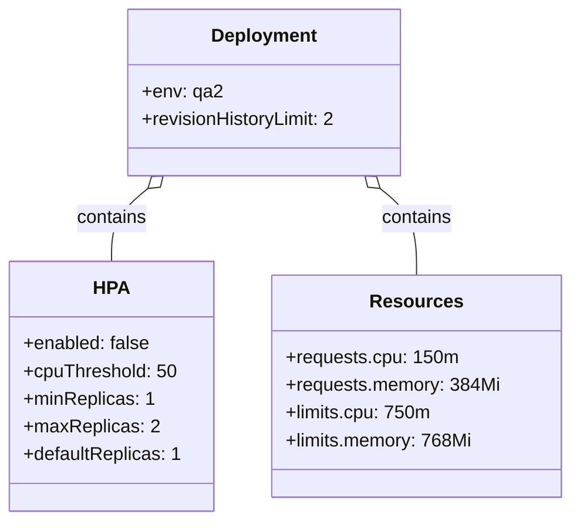
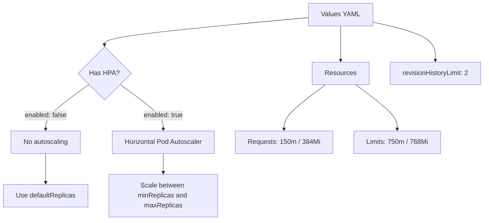

# Diagram: common/document_service/helm/profiles/values.qa2.yaml

> Auto-generated by Obscura crawlers

## Diagram 1

### SVG

<svg id="container" width="485.296875" xmlns="http://www.w3.org/2000/svg" class="classDiagram" height="450" viewBox="0 0 485.296875 450" role="graphics-document document" aria-roledescription="class"><g><defs><marker id="container_class-aggregationStart" class="marker aggregation class" refX="18" refY="7" markerWidth="190" markerHeight="240" orient="auto"><path d="M 18,7 L9,13 L1,7 L9,1 Z"></path></marker></defs><defs><marker id="container_class-aggregationEnd" class="marker aggregation class" refX="1" refY="7" markerWidth="20" markerHeight="28" orient="auto"><path d="M 18,7 L9,13 L1,7 L9,1 Z"></path></marker></defs><defs><marker id="container_class-extensionStart" class="marker extension class" refX="18" refY="7" markerWidth="190" markerHeight="240" orient="auto"><path d="M 1,7 L18,13 V 1 Z"></path></marker></defs><defs><marker id="container_class-extensionEnd" class="marker extension class" refX="1" refY="7" markerWidth="20" markerHeight="28" orient="auto"><path d="M 1,1 V 13 L18,7 Z"></path></marker></defs><defs><marker id="container_class-compositionStart" class="marker composition class" refX="18" refY="7" markerWidth="190" markerHeight="240" orient="auto"><path d="M 18,7 L9,13 L1,7 L9,1 Z"></path></marker></defs><defs><marker id="container_class-compositionEnd" class="marker composition class" refX="1" refY="7" markerWidth="20" markerHeight="28" orient="auto"><path d="M 18,7 L9,13 L1,7 L9,1 Z"></path></marker></defs><defs><marker id="container_class-dependencyStart" class="marker dependency class" refX="6" refY="7" markerWidth="190" markerHeight="240" orient="auto"><path d="M 5,7 L9,13 L1,7 L9,1 Z"></path></marker></defs><defs><marker id="container_class-dependencyEnd" class="marker dependency class" refX="13" refY="7" markerWidth="20" markerHeight="28" orient="auto"><path d="M 18,7 L9,13 L14,7 L9,1 Z"></path></marker></defs><defs><marker id="container_class-lollipopStart" class="marker lollipop class" refX="13" refY="7" markerWidth="190" markerHeight="240" orient="auto"><circle stroke="black" fill="transparent" cx="7" cy="7" r="6"></circle></marker></defs><defs><marker id="container_class-lollipopEnd" class="marker lollipop class" refX="1" refY="7" markerWidth="190" markerHeight="240" orient="auto"><circle stroke="black" fill="transparent" cx="7" cy="7" r="6"></circle></marker></defs><g class="root"><g class="clusters"></g><g class="edgePaths"><path d="M125.616,163.092L120.473,167.41C115.33,171.728,105.044,180.364,99.901,190.849C94.758,201.333,94.758,213.667,94.758,219.833L94.758,226" id="id_Deployment_HPA_1" class="edge-thickness-normal edge-pattern-solid relation" style=";;;" data-edge="true" data-et="edge" data-id="id_Deployment_HPA_1" data-points="W3sieCI6MTM4LjgyNjU4NDAwMjI5MzU3LCJ5IjoxNTJ9LHsieCI6OTQuNzU3ODEyNSwieSI6MTg5fSx7IngiOjk0Ljc1NzgxMjUsInkiOjIyNn1d" marker-start="url(#container_class-aggregationStart)"></path><path d="M323.549,163.092L328.691,167.41C333.834,171.728,344.12,180.364,349.263,192.849C354.406,205.333,354.406,221.667,354.406,229.833L354.406,238" id="id_Deployment_Resources_2" class="edge-thickness-normal edge-pattern-solid relation" style=";;;" data-edge="true" data-et="edge" data-id="id_Deployment_Resources_2" data-points="W3sieCI6MzEwLjMzNzQ3ODQ5NzcwNjQ2LCJ5IjoxNTJ9LHsieCI6MzU0LjQwNjI1LCJ5IjoxODl9LHsieCI6MzU0LjQwNjI1LCJ5IjoyMzh9XQ==" marker-start="url(#container_class-aggregationStart)"></path></g><g class="edgeLabels"><g class="edgeLabel" transform="translate(94.7578125, 189)"><g class="label" data-id="id_Deployment_HPA_1" transform="translate(-30.890625, -12)"><foreignObject width="61.78125" height="24">

contains

</foreignObject></g></g><g class="edgeLabel" transform="translate(354.40625, 189)"><g class="label" data-id="id_Deployment_Resources_2" transform="translate(-30.890625, -12)"><foreignObject width="61.78125" height="24">

contains

</foreignObject></g></g></g><g class="nodes"><g class="node default" id="classId-Deployment-0" transform="translate(224.58203125, 80)"><g class="basic label-container"><path d="M-119.0703125 -72 L119.0703125 -72 L119.0703125 72 L-119.0703125 72" stroke="none" stroke-width="0" fill="#ECECFF" style=""></path><path d="M-119.0703125 -72 C-45.067945966490655 -72, 28.93442056701869 -72, 119.0703125 -72 M-119.0703125 -72 C-40.132942426073114 -72, 38.80442764785377 -72, 119.0703125 -72 M119.0703125 -72 C119.0703125 -15.256220170206838, 119.0703125 41.487559659586324, 119.0703125 72 M119.0703125 -72 C119.0703125 -18.508176302972657, 119.0703125 34.983647394054685, 119.0703125 72 M119.0703125 72 C32.21619532472225 72, -54.6379218505555 72, -119.0703125 72 M119.0703125 72 C61.505094854836074 72, 3.9398772096721473 72, -119.0703125 72 M-119.0703125 72 C-119.0703125 25.193563810816492, -119.0703125 -21.612872378367015, -119.0703125 -72 M-119.0703125 72 C-119.0703125 39.080100700457905, -119.0703125 6.16020140091581, -119.0703125 -72" stroke="#9370DB" stroke-width="1.3" fill="none" stroke-dasharray="0 0" style=""></path></g><g class="annotation-group text" transform="translate(0, -48)"></g><g class="label-group text" transform="translate(-44.375, -48)"><g class="label" style="font-weight: bolder" transform="translate(0,-12)"><foreignObject width="88.75" height="24">

Deployment

</foreignObject></g></g><g class="members-group text" transform="translate(-107.0703125, 0)"><g class="label" style="" transform="translate(0,-12)"><foreignObject width="68.1875" height="24">

+env: qa2

</foreignObject></g><g class="label" style="" transform="translate(0,12)"><foreignObject width="169.765625" height="24">

+revisionHistoryLimit: 2

</foreignObject></g></g><g class="methods-group text" transform="translate(-107.0703125, 72)"></g><g class="divider" style=""><path d="M-119.0703125 -24 C-47.378369095185676 -24, 24.31357430962865 -24, 119.0703125 -24 M-119.0703125 -24 C-38.30018169340782 -24, 42.469949113184356 -24, 119.0703125 -24" stroke="#9370DB" stroke-width="1.3" fill="none" stroke-dasharray="0 0" style=""></path></g><g class="divider" style=""><path d="M-119.0703125 48 C-70.5038614468798 48, -21.937410393759578 48, 119.0703125 48 M-119.0703125 48 C-58.95955694280106 48, 1.1511986143978845 48, 119.0703125 48" stroke="#9370DB" stroke-width="1.3" fill="none" stroke-dasharray="0 0" style=""></path></g></g><g class="node default" id="classId-HPA-1" transform="translate(94.7578125, 334)"><g class="basic label-container"><path d="M-86.7578125 -108 L86.7578125 -108 L86.7578125 108 L-86.7578125 108" stroke="none" stroke-width="0" fill="#ECECFF" style=""></path><path d="M-86.7578125 -108 C-41.01614815479982 -108, 4.725516190400356 -108, 86.7578125 -108 M-86.7578125 -108 C-44.50833508378491 -108, -2.2588576675698135 -108, 86.7578125 -108 M86.7578125 -108 C86.7578125 -61.77593039741138, 86.7578125 -15.551860794822758, 86.7578125 108 M86.7578125 -108 C86.7578125 -60.618457188565486, 86.7578125 -13.236914377130972, 86.7578125 108 M86.7578125 108 C24.166475130478908 108, -38.424862239042184 108, -86.7578125 108 M86.7578125 108 C44.93862849616683 108, 3.119444492333656 108, -86.7578125 108 M-86.7578125 108 C-86.7578125 56.43256642483884, -86.7578125 4.8651328496776785, -86.7578125 -108 M-86.7578125 108 C-86.7578125 57.70433162680729, -86.7578125 7.408663253614577, -86.7578125 -108" stroke="#9370DB" stroke-width="1.3" fill="none" stroke-dasharray="0 0" style=""></path></g><g class="annotation-group text" transform="translate(0, -84)"></g><g class="label-group text" transform="translate(-14.375, -84)"><g class="label" style="font-weight: bolder" transform="translate(0,-12)"><foreignObject width="28.75" height="24">

HPA

</foreignObject></g></g><g class="members-group text" transform="translate(-74.7578125, -36)"><g class="label" style="" transform="translate(0,-12)"><foreignObject width="109.703125" height="24">

+enabled: false

</foreignObject></g><g class="label" style="" transform="translate(0,12)"><foreignObject width="131.90625" height="24">

+cpuThreshold: 50

</foreignObject></g><g class="label" style="" transform="translate(0,36)"><foreignObject width="110.96875" height="24">

+minReplicas: 1

</foreignObject></g><g class="label" style="" transform="translate(0,60)"><foreignObject width="114.53125" height="24">

+maxReplicas: 2

</foreignObject></g><g class="label" style="" transform="translate(0,84)"><foreignObject width="135.140625" height="24">

+defaultReplicas: 1

</foreignObject></g></g><g class="methods-group text" transform="translate(-74.7578125, 108)"></g><g class="divider" style=""><path d="M-86.7578125 -60 C-45.89436609387615 -60, -5.030919687752302 -60, 86.7578125 -60 M-86.7578125 -60 C-40.291007533888695 -60, 6.175797432222609 -60, 86.7578125 -60" stroke="#9370DB" stroke-width="1.3" fill="none" stroke-dasharray="0 0" style=""></path></g><g class="divider" style=""><path d="M-86.7578125 84 C-48.898697075880555 84, -11.039581651761111 84, 86.7578125 84 M-86.7578125 84 C-36.03511340876306 84, 14.68758568247388 84, 86.7578125 84" stroke="#9370DB" stroke-width="1.3" fill="none" stroke-dasharray="0 0" style=""></path></g></g><g class="node default" id="classId-Resources-2" transform="translate(354.40625, 334)"><g class="basic label-container"><path d="M-122.890625 -96 L122.890625 -96 L122.890625 96 L-122.890625 96" stroke="none" stroke-width="0" fill="#ECECFF" style=""></path><path d="M-122.890625 -96 C-57.1409627722023 -96, 8.6086994555954 -96, 122.890625 -96 M-122.890625 -96 C-63.29899909295147 -96, -3.707373185902938 -96, 122.890625 -96 M122.890625 -96 C122.890625 -21.06967569502588, 122.890625 53.86064860994824, 122.890625 96 M122.890625 -96 C122.890625 -29.451166103985315, 122.890625 37.09766779202937, 122.890625 96 M122.890625 96 C45.80990618272007 96, -31.27081263455986 96, -122.890625 96 M122.890625 96 C70.34020532363161 96, 17.789785647263216 96, -122.890625 96 M-122.890625 96 C-122.890625 27.885073525776036, -122.890625 -40.22985294844793, -122.890625 -96 M-122.890625 96 C-122.890625 57.13834710076886, -122.890625 18.276694201537723, -122.890625 -96" stroke="#9370DB" stroke-width="1.3" fill="none" stroke-dasharray="0 0" style=""></path></g><g class="annotation-group text" transform="translate(0, -72)"></g><g class="label-group text" transform="translate(-37.265625, -72)"><g class="label" style="font-weight: bolder" transform="translate(0,-12)"><foreignObject width="74.53125" height="24">

Resources

</foreignObject></g></g><g class="members-group text" transform="translate(-110.890625, -24)"><g class="label" style="" transform="translate(0,-12)"><foreignObject width="146.53125" height="24">

+requests.cpu: 150m

</foreignObject></g><g class="label" style="" transform="translate(0,12)"><foreignObject width="184.515625" height="24">

+requests.memory: 384Mi

</foreignObject></g><g class="label" style="" transform="translate(0,36)"><foreignObject width="124.40625" height="24">

+limits.cpu: 750m

</foreignObject></g><g class="label" style="" transform="translate(0,60)"><foreignObject width="161.21875" height="24">

+limits.memory: 768Mi

</foreignObject></g></g><g class="methods-group text" transform="translate(-110.890625, 96)"></g><g class="divider" style=""><path d="M-122.890625 -48 C-61.438447918066686 -48, 0.013729163866628369 -48, 122.890625 -48 M-122.890625 -48 C-40.07245338016631 -48, 42.74571823966738 -48, 122.890625 -48" stroke="#9370DB" stroke-width="1.3" fill="none" stroke-dasharray="0 0" style=""></path></g><g class="divider" style=""><path d="M-122.890625 72 C-51.515404572598825 72, 19.85981585480235 72, 122.890625 72 M-122.890625 72 C-53.69516927589426 72, 15.500286448211483 72, 122.890625 72" stroke="#9370DB" stroke-width="1.3" fill="none" stroke-dasharray="0 0" style=""></path></g></g></g></g></g></svg>

## Diagram 2

### SVG

<svg id="container" width="1161.8984375" xmlns="http://www.w3.org/2000/svg" class="flowchart" height="520.390625" viewBox="0 0 1161.8984375 520.390625" role="graphics-document document" aria-roledescription="flowchart-v2"><g><marker id="container_flowchart-v2-pointEnd" class="marker flowchart-v2" viewBox="0 0 10 10" refX="5" refY="5" markerUnits="userSpaceOnUse" markerWidth="8" markerHeight="8" orient="auto"><path d="M 0 0 L 10 5 L 0 10 z" class="arrowMarkerPath" style="stroke-width: 1; stroke-dasharray: 1, 0;"></path></marker><marker id="container_flowchart-v2-pointStart" class="marker flowchart-v2" viewBox="0 0 10 10" refX="4.5" refY="5" markerUnits="userSpaceOnUse" markerWidth="8" markerHeight="8" orient="auto"><path d="M 0 5 L 10 10 L 10 0 z" class="arrowMarkerPath" style="stroke-width: 1; stroke-dasharray: 1, 0;"></path></marker><marker id="container_flowchart-v2-circleEnd" class="marker flowchart-v2" viewBox="0 0 10 10" refX="11" refY="5" markerUnits="userSpaceOnUse" markerWidth="11" markerHeight="11" orient="auto"><circle cx="5" cy="5" r="5" class="arrowMarkerPath" style="stroke-width: 1; stroke-dasharray: 1, 0;"></circle></marker><marker id="container_flowchart-v2-circleStart" class="marker flowchart-v2" viewBox="0 0 10 10" refX="-1" refY="5" markerUnits="userSpaceOnUse" markerWidth="11" markerHeight="11" orient="auto"><circle cx="5" cy="5" r="5" class="arrowMarkerPath" style="stroke-width: 1; stroke-dasharray: 1, 0;"></circle></marker><marker id="container_flowchart-v2-crossEnd" class="marker cross flowchart-v2" viewBox="0 0 11 11" refX="12" refY="5.2" markerUnits="userSpaceOnUse" markerWidth="11" markerHeight="11" orient="auto"><path d="M 1,1 l 9,9 M 10,1 l -9,9" class="arrowMarkerPath" style="stroke-width: 2; stroke-dasharray: 1, 0;"></path></marker><marker id="container_flowchart-v2-crossStart" class="marker cross flowchart-v2" viewBox="0 0 11 11" refX="-1" refY="5.2" markerUnits="userSpaceOnUse" markerWidth="11" markerHeight="11" orient="auto"><path d="M 1,1 l 9,9 M 10,1 l -9,9" class="arrowMarkerPath" style="stroke-width: 2; stroke-dasharray: 1, 0;"></path></marker><g class="root"><g class="clusters"></g><g class="edgePaths"><path d="M740.938,41.849L659.168,49.374C577.398,56.899,413.859,71.95,332.09,82.975C250.32,94,250.32,101,250.32,104.5L250.32,108" id="L_A_B_0" class="edge-thickness-normal edge-pattern-solid edge-thickness-normal edge-pattern-solid flowchart-link" style=";" data-edge="true" data-et="edge" data-id="L_A_B_0" data-points="W3sieCI6NzQwLjkzNzUsInkiOjQxLjg0ODk3MzM4NDAzMDQxNX0seyJ4IjoyNTAuMzIwMzEyNSwieSI6ODd9LHsieCI6MjUwLjMyMDMxMjUsInkiOjExMn1d" marker-end="url(#container_flowchart-v2-pointEnd)"></path><path d="M214.711,196.781L197.184,208.883C179.656,220.984,144.602,245.188,127.074,262.789C109.547,280.391,109.547,291.391,109.547,296.891L109.547,302.391" id="L_B_C_0" class="edge-thickness-normal edge-pattern-solid edge-thickness-normal edge-pattern-solid flowchart-link" style=";" data-edge="true" data-et="edge" data-id="L_B_C_0" data-points="W3sieCI6MjE0LjcxMTAxMDU5NzkxNTMsInkiOjE5Ni43ODEzMjMwOTc5MTUzfSx7IngiOjEwOS41NDY4NzUsInkiOjI2OS4zOTA2MjV9LHsieCI6MTA5LjU0Njg3NSwieSI6MzA2LjM5MDYyNX1d" marker-end="url(#container_flowchart-v2-pointEnd)"></path><path d="M285.93,196.781L303.457,208.883C320.984,220.984,356.039,245.188,373.566,262.789C391.094,280.391,391.094,291.391,391.094,296.891L391.094,302.391" id="L_B_D_0" class="edge-thickness-normal edge-pattern-solid edge-thickness-normal edge-pattern-solid flowchart-link" style=";" data-edge="true" data-et="edge" data-id="L_B_D_0" data-points="W3sieCI6Mjg1LjkyOTYxNDQwMjA4NDcsInkiOjE5Ni43ODEzMjMwOTc5MTUzfSx7IngiOjM5MS4wOTM3NSwieSI6MjY5LjM5MDYyNX0seyJ4IjozOTEuMDkzNzUsInkiOjMwNi4zOTA2MjV9XQ==" marker-end="url(#container_flowchart-v2-pointEnd)"></path><path d="M391.094,360.391L391.094,364.557C391.094,368.724,391.094,377.057,391.094,384.724C391.094,392.391,391.094,399.391,391.094,402.891L391.094,406.391" id="L_D_E_0" class="edge-thickness-normal edge-pattern-solid edge-thickness-normal edge-pattern-solid flowchart-link" style=";" data-edge="true" data-et="edge" data-id="L_D_E_0" data-points="W3sieCI6MzkxLjA5Mzc1LCJ5IjozNjAuMzkwNjI1fSx7IngiOjM5MS4wOTM3NSwieSI6Mzg1LjM5MDYyNX0seyJ4IjozOTEuMDkzNzUsInkiOjQxMC4zOTA2MjV9XQ==" marker-end="url(#container_flowchart-v2-pointEnd)"></path><path d="M109.547,360.391L109.547,364.557C109.547,368.724,109.547,377.057,109.547,388.724C109.547,400.391,109.547,415.391,109.547,422.891L109.547,430.391" id="L_C_F_0" class="edge-thickness-normal edge-pattern-solid edge-thickness-normal edge-pattern-solid flowchart-link" style=";" data-edge="true" data-et="edge" data-id="L_C_F_0" data-points="W3sieCI6MTA5LjU0Njg3NSwieSI6MzYwLjM5MDYyNX0seyJ4IjoxMDkuNTQ2ODc1LCJ5IjozODUuMzkwNjI1fSx7IngiOjEwOS41NDY4NzUsInkiOjQzNC4zOTA2MjV9XQ==" marker-end="url(#container_flowchart-v2-pointEnd)"></path><path d="M815.359,62L815.359,66.167C815.359,70.333,815.359,78.667,815.359,91.866C815.359,105.065,815.359,123.13,815.359,132.163L815.359,141.195" id="L_A_G_0" class="edge-thickness-normal edge-pattern-solid edge-thickness-normal edge-pattern-solid flowchart-link" style=";" data-edge="true" data-et="edge" data-id="L_A_G_0" data-points="W3sieCI6ODE1LjM1OTM3NSwieSI6NjJ9LHsieCI6ODE1LjM1OTM3NSwieSI6ODd9LHsieCI6ODE1LjM1OTM3NSwieSI6MTQ1LjE5NTMxMjV9XQ==" marker-end="url(#container_flowchart-v2-pointEnd)"></path><path d="M777.953,199.195L761.745,210.895C745.536,222.594,713.12,245.992,696.911,263.191C680.703,280.391,680.703,291.391,680.703,296.891L680.703,302.391" id="L_G_H_0" class="edge-thickness-normal edge-pattern-solid edge-thickness-normal edge-pattern-solid flowchart-link" style=";" data-edge="true" data-et="edge" data-id="L_G_H_0" data-points="W3sieCI6Nzc3Ljk1MzA1NzE3OTg4OTEsInkiOjE5OS4xOTUzMTI1fSx7IngiOjY4MC43MDMxMjUsInkiOjI2OS4zOTA2MjV9LHsieCI6NjgwLjcwMzEyNSwieSI6MzA2LjM5MDYyNX1d" marker-end="url(#container_flowchart-v2-pointEnd)"></path><path d="M852.766,199.195L868.974,210.895C885.182,222.594,917.599,245.992,933.807,263.191C950.016,280.391,950.016,291.391,950.016,296.891L950.016,302.391" id="L_G_I_0" class="edge-thickness-normal edge-pattern-solid edge-thickness-normal edge-pattern-solid flowchart-link" style=";" data-edge="true" data-et="edge" data-id="L_G_I_0" data-points="W3sieCI6ODUyLjc2NTY5MjgyMDExMDksInkiOjE5OS4xOTUzMTI1fSx7IngiOjk1MC4wMTU2MjUsInkiOjI2OS4zOTA2MjV9LHsieCI6OTUwLjAxNTYyNSwieSI6MzA2LjM5MDYyNX1d" marker-end="url(#container_flowchart-v2-pointEnd)"></path><path d="M889.781,52L915.319,57.833C940.857,63.666,991.932,75.333,1017.47,90.199C1043.008,105.065,1043.008,123.13,1043.008,132.163L1043.008,141.195" id="L_A_J_0" class="edge-thickness-normal edge-pattern-solid edge-thickness-normal edge-pattern-solid flowchart-link" style=";" data-edge="true" data-et="edge" data-id="L_A_J_0" data-points="W3sieCI6ODg5Ljc4MTI1LCJ5Ijo1MS45OTk2MjI0OTkwNTYyNDR9LHsieCI6MTA0My4wMDc4MTI1LCJ5Ijo4N30seyJ4IjoxMDQzLjAwNzgxMjUsInkiOjE0NS4xOTUzMTI1fV0=" marker-end="url(#container_flowchart-v2-pointEnd)"></path></g><g class="edgeLabels"><g class="edgeLabel"><g class="label" data-id="L_A_B_0" transform="translate(0, 0)"><foreignObject width="0" height="0">

</foreignObject></g></g><g class="edgeLabel" transform="translate(109.546875, 269.390625)"><g class="label" data-id="L_B_C_0" transform="translate(-50.859375, -12)"><foreignObject width="101.71875" height="24">

enabled: false

</foreignObject></g></g><g class="edgeLabel" transform="translate(391.09375, 269.390625)"><g class="label" data-id="L_B_D_0" transform="translate(-48.6328125, -12)"><foreignObject width="97.265625" height="24">

enabled: true

</foreignObject></g></g><g class="edgeLabel"><g class="label" data-id="L_D_E_0" transform="translate(0, 0)"><foreignObject width="0" height="0">

</foreignObject></g></g><g class="edgeLabel"><g class="label" data-id="L_C_F_0" transform="translate(0, 0)"><foreignObject width="0" height="0">

</foreignObject></g></g><g class="edgeLabel"><g class="label" data-id="L_A_G_0" transform="translate(0, 0)"><foreignObject width="0" height="0">

</foreignObject></g></g><g class="edgeLabel"><g class="label" data-id="L_G_H_0" transform="translate(0, 0)"><foreignObject width="0" height="0">

</foreignObject></g></g><g class="edgeLabel"><g class="label" data-id="L_G_I_0" transform="translate(0, 0)"><foreignObject width="0" height="0">

</foreignObject></g></g><g class="edgeLabel"><g class="label" data-id="L_A_J_0" transform="translate(0, 0)"><foreignObject width="0" height="0">

</foreignObject></g></g></g><g class="nodes"><g class="node default" id="flowchart-A-0" transform="translate(815.359375, 35)"><rect class="basic label-container" style="" x="-74.421875" y="-27" width="148.84375" height="54"></rect><g class="label" style="" transform="translate(-44.421875, -12)"><rect></rect><foreignObject width="88.84375" height="24">

Values YAML

</foreignObject></g></g><g class="node default" id="flowchart-B-1" transform="translate(250.3203125, 172.1953125)"><polygon points="60.1953125,0 120.390625,-60.1953125 60.1953125,-120.390625 0,-60.1953125" class="label-container" transform="translate(-59.6953125, 60.1953125)"></polygon><g class="label" style="" transform="translate(-33.1953125, -12)"><rect></rect><foreignObject width="66.390625" height="24">

Has HPA?

</foreignObject></g></g><g class="node default" id="flowchart-C-3" transform="translate(109.546875, 333.390625)"><rect class="basic label-container" style="" x="-83.90625" y="-27" width="167.8125" height="54"></rect><g class="label" style="" transform="translate(-53.90625, -12)"><rect></rect><foreignObject width="107.8125" height="24">

No autoscaling

</foreignObject></g></g><g class="node default" id="flowchart-D-5" transform="translate(391.09375, 333.390625)"><rect class="basic label-container" style="" x="-124" y="-27" width="248" height="54"></rect><g class="label" style="" transform="translate(-94, -12)"><rect></rect><foreignObject width="188" height="24">

Horizontal Pod Autoscaler

</foreignObject></g></g><g class="node default" id="flowchart-E-7" transform="translate(391.09375, 461.390625)"><rect class="basic label-container" style="" x="-130" y="-51" width="260" height="102"></rect><g class="label" style="" transform="translate(-100, -36)"><rect></rect><foreignObject width="200" height="72">

Scale between minReplicas and maxReplicas

</foreignObject></g></g><g class="node default" id="flowchart-F-9" transform="translate(109.546875, 461.390625)"><rect class="basic label-container" style="" x="-101.546875" y="-27" width="203.09375" height="54"></rect><g class="label" style="" transform="translate(-71.546875, -12)"><rect></rect><foreignObject width="143.09375" height="24">

Use defaultReplicas

</foreignObject></g></g><g class="node default" id="flowchart-G-11" transform="translate(815.359375, 172.1953125)"><rect class="basic label-container" style="" x="-66.7578125" y="-27" width="133.515625" height="54"></rect><g class="label" style="" transform="translate(-36.7578125, -12)"><rect></rect><foreignObject width="73.515625" height="24">

Resources

</foreignObject></g></g><g class="node default" id="flowchart-H-13" transform="translate(680.703125, 333.390625)"><rect class="basic label-container" style="" x="-115.609375" y="-27" width="231.21875" height="54"></rect><g class="label" style="" transform="translate(-85.609375, -12)"><rect></rect><foreignObject width="171.21875" height="24">

Requests: 150m / 384Mi

</foreignObject></g></g><g class="node default" id="flowchart-I-15" transform="translate(950.015625, 333.390625)"><rect class="basic label-container" style="" x="-103.703125" y="-27" width="207.40625" height="54"></rect><g class="label" style="" transform="translate(-73.703125, -12)"><rect></rect><foreignObject width="147.40625" height="24">

Limits: 750m / 768Mi

</foreignObject></g></g><g class="node default" id="flowchart-J-17" transform="translate(1043.0078125, 172.1953125)"><rect class="basic label-container" style="" x="-110.890625" y="-27" width="221.78125" height="54"></rect><g class="label" style="" transform="translate(-80.890625, -12)"><rect></rect><foreignObject width="161.78125" height="24">

revisionHistoryLimit: 2

</foreignObject></g></g></g></g></g></svg>
