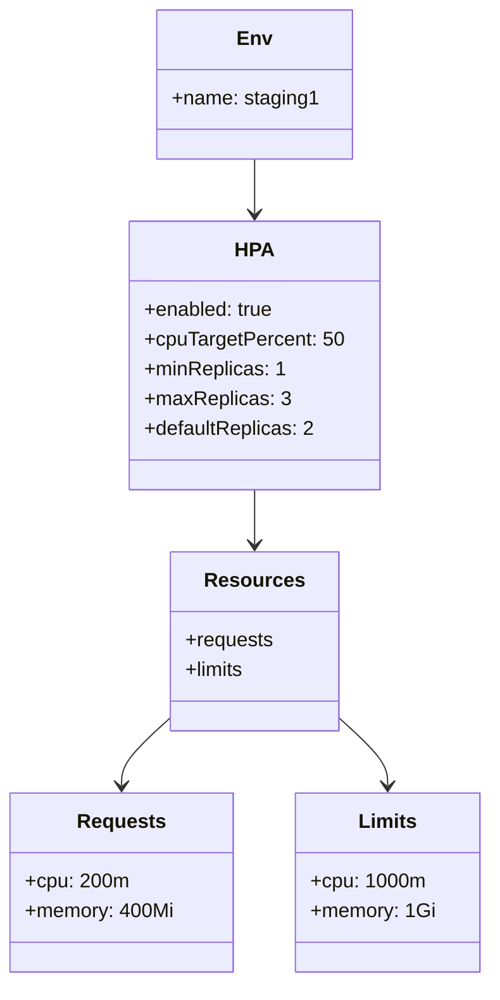

# Diagram: common/document_service/helm/profiles/values.staging1.yaml

> Auto-generated by Obscura crawlers

## Mermaid

### SVG

<svg id="container" width="386.375" xmlns="http://www.w3.org/2000/svg" class="classDiagram" height="790" viewBox="0 0 386.375 790" role="graphics-document document" aria-roledescription="class"><g><defs><marker id="container_class-aggregationStart" class="marker aggregation class" refX="18" refY="7" markerWidth="190" markerHeight="240" orient="auto"><path d="M 18,7 L9,13 L1,7 L9,1 Z"></path></marker></defs><defs><marker id="container_class-aggregationEnd" class="marker aggregation class" refX="1" refY="7" markerWidth="20" markerHeight="28" orient="auto"><path d="M 18,7 L9,13 L1,7 L9,1 Z"></path></marker></defs><defs><marker id="container_class-extensionStart" class="marker extension class" refX="18" refY="7" markerWidth="190" markerHeight="240" orient="auto"><path d="M 1,7 L18,13 V 1 Z"></path></marker></defs><defs><marker id="container_class-extensionEnd" class="marker extension class" refX="1" refY="7" markerWidth="20" markerHeight="28" orient="auto"><path d="M 1,1 V 13 L18,7 Z"></path></marker></defs><defs><marker id="container_class-compositionStart" class="marker composition class" refX="18" refY="7" markerWidth="190" markerHeight="240" orient="auto"><path d="M 18,7 L9,13 L1,7 L9,1 Z"></path></marker></defs><defs><marker id="container_class-compositionEnd" class="marker composition class" refX="1" refY="7" markerWidth="20" markerHeight="28" orient="auto"><path d="M 18,7 L9,13 L1,7 L9,1 Z"></path></marker></defs><defs><marker id="container_class-dependencyStart" class="marker dependency class" refX="6" refY="7" markerWidth="190" markerHeight="240" orient="auto"><path d="M 5,7 L9,13 L1,7 L9,1 Z"></path></marker></defs><defs><marker id="container_class-dependencyEnd" class="marker dependency class" refX="13" refY="7" markerWidth="20" markerHeight="28" orient="auto"><path d="M 18,7 L9,13 L14,7 L9,1 Z"></path></marker></defs><defs><marker id="container_class-lollipopStart" class="marker lollipop class" refX="13" refY="7" markerWidth="190" markerHeight="240" orient="auto"><circle stroke="black" fill="transparent" cx="7" cy="7" r="6"></circle></marker></defs><defs><marker id="container_class-lollipopEnd" class="marker lollipop class" refX="1" refY="7" markerWidth="190" markerHeight="240" orient="auto"><circle stroke="black" fill="transparent" cx="7" cy="7" r="6"></circle></marker></defs><g class="root"><g class="clusters"></g><g class="edgePaths"><path d="M201.516,128L201.516,132.167C201.516,136.333,201.516,144.667,201.516,152C201.516,159.333,201.516,165.667,201.516,168.833L201.516,172" id="id_Env_HPA_1" class="edge-thickness-normal edge-pattern-solid relation" style=";;;" data-edge="true" data-et="edge" data-id="id_Env_HPA_1" data-points="W3sieCI6MjAxLjUxNTYyNSwieSI6MTI4fSx7IngiOjIwMS41MTU2MjUsInkiOjE1M30seyJ4IjoyMDEuNTE1NjI1LCJ5IjoxNzh9XQ==" marker-end="url(#container_class-dependencyEnd)"></path><path d="M201.516,394L201.516,398.167C201.516,402.333,201.516,410.667,201.516,418C201.516,425.333,201.516,431.667,201.516,434.833L201.516,438" id="id_HPA_Resources_2" class="edge-thickness-normal edge-pattern-solid relation" style=";;;" data-edge="true" data-et="edge" data-id="id_HPA_Resources_2" data-points="W3sieCI6MjAxLjUxNTYyNSwieSI6Mzk0fSx7IngiOjIwMS41MTU2MjUsInkiOjQxOX0seyJ4IjoyMDEuNTE1NjI1LCJ5Ijo0NDR9XQ==" marker-end="url(#container_class-dependencyEnd)"></path><path d="M135.516,576.917L129,582.931C122.484,588.945,109.453,600.972,102.938,610.153C96.422,619.333,96.422,625.667,96.422,628.833L96.422,632" id="id_Resources_Requests_3" class="edge-thickness-normal edge-pattern-solid relation" style=";;;" data-edge="true" data-et="edge" data-id="id_Resources_Requests_3" data-points="W3sieCI6MTM1LjUxNTYyNSwieSI6NTc2LjkxNzAzODM1ODYwODR9LHsieCI6OTYuNDIxODc1LCJ5Ijo2MTN9LHsieCI6OTYuNDIxODc1LCJ5Ijo2Mzh9XQ==" marker-end="url(#container_class-dependencyEnd)"></path><path d="M267.516,576.917L274.031,582.931C280.547,588.945,293.578,600.972,300.094,610.153C306.609,619.333,306.609,625.667,306.609,628.833L306.609,632" id="id_Resources_Limits_4" class="edge-thickness-normal edge-pattern-solid relation" style=";;;" data-edge="true" data-et="edge" data-id="id_Resources_Limits_4" data-points="W3sieCI6MjY3LjUxNTYyNSwieSI6NTc2LjkxNzAzODM1ODYwODR9LHsieCI6MzA2LjYwOTM3NSwieSI6NjEzfSx7IngiOjMwNi42MDkzNzUsInkiOjYzOH1d" marker-end="url(#container_class-dependencyEnd)"></path></g><g class="edgeLabels"><g class="edgeLabel"><g class="label" data-id="id_Env_HPA_1" transform="translate(0, 0)"><foreignObject width="0" height="0">

</foreignObject></g></g><g class="edgeLabel"><g class="label" data-id="id_HPA_Resources_2" transform="translate(0, 0)"><foreignObject width="0" height="0">

</foreignObject></g></g><g class="edgeLabel"><g class="label" data-id="id_Resources_Requests_3" transform="translate(0, 0)"><foreignObject width="0" height="0">

</foreignObject></g></g><g class="edgeLabel"><g class="label" data-id="id_Resources_Limits_4" transform="translate(0, 0)"><foreignObject width="0" height="0">

</foreignObject></g></g></g><g class="nodes"><g class="node default" id="classId-Env-0" transform="translate(201.515625, 68)"><g class="basic label-container"><path d="M-76.26171875 -60 L76.26171875 -60 L76.26171875 60 L-76.26171875 60" stroke="none" stroke-width="0" fill="#ECECFF" style=""></path><path d="M-76.26171875 -60 C-32.12597993662222 -60, 12.009758876755555 -60, 76.26171875 -60 M-76.26171875 -60 C-27.16843036352546 -60, 21.92485802294908 -60, 76.26171875 -60 M76.26171875 -60 C76.26171875 -34.496511819923455, 76.26171875 -8.99302363984691, 76.26171875 60 M76.26171875 -60 C76.26171875 -17.70120930617562, 76.26171875 24.59758138764876, 76.26171875 60 M76.26171875 60 C38.371256344497446 60, 0.48079393899489276 60, -76.26171875 60 M76.26171875 60 C26.674194475568015 60, -22.91332979886397 60, -76.26171875 60 M-76.26171875 60 C-76.26171875 26.673116617610802, -76.26171875 -6.653766764778396, -76.26171875 -60 M-76.26171875 60 C-76.26171875 31.374727454193465, -76.26171875 2.74945490838693, -76.26171875 -60" stroke="#9370DB" stroke-width="1.3" fill="none" stroke-dasharray="0 0" style=""></path></g><g class="annotation-group text" transform="translate(0, -36)"></g><g class="label-group text" transform="translate(-12.8046875, -36)"><g class="label" style="font-weight: bolder" transform="translate(0,-12)"><foreignObject width="25.609375" height="24">

Env

</foreignObject></g></g><g class="members-group text" transform="translate(-64.26171875, 12)"><g class="label" style="" transform="translate(0,-12)"><foreignObject width="115.71875" height="24">

+name: staging1

</foreignObject></g></g><g class="methods-group text" transform="translate(-64.26171875, 60)"></g><g class="divider" style=""><path d="M-76.26171875 -12 C-33.862313618818554 -12, 8.537091512362892 -12, 76.26171875 -12 M-76.26171875 -12 C-32.99242693967768 -12, 10.276864870644644 -12, 76.26171875 -12" stroke="#9370DB" stroke-width="1.3" fill="none" stroke-dasharray="0 0" style=""></path></g><g class="divider" style=""><path d="M-76.26171875 36 C-17.238220578303093 36, 41.785277593393815 36, 76.26171875 36 M-76.26171875 36 C-22.80179979034981 36, 30.658119169300377 36, 76.26171875 36" stroke="#9370DB" stroke-width="1.3" fill="none" stroke-dasharray="0 0" style=""></path></g></g><g class="node default" id="classId-HPA-1" transform="translate(201.515625, 286)"><g class="basic label-container"><path d="M-98.5078125 -108 L98.5078125 -108 L98.5078125 108 L-98.5078125 108" stroke="none" stroke-width="0" fill="#ECECFF" style=""></path><path d="M-98.5078125 -108 C-27.167173976022312 -108, 44.173464547955376 -108, 98.5078125 -108 M-98.5078125 -108 C-28.319595146869304 -108, 41.86862220626139 -108, 98.5078125 -108 M98.5078125 -108 C98.5078125 -58.07736723468422, 98.5078125 -8.154734469368435, 98.5078125 108 M98.5078125 -108 C98.5078125 -45.10582231065739, 98.5078125 17.788355378685225, 98.5078125 108 M98.5078125 108 C29.51388328726425 108, -39.4800459254715 108, -98.5078125 108 M98.5078125 108 C47.31816473947826 108, -3.871483021043474 108, -98.5078125 108 M-98.5078125 108 C-98.5078125 53.31646538489761, -98.5078125 -1.3670692302047769, -98.5078125 -108 M-98.5078125 108 C-98.5078125 29.81740897866058, -98.5078125 -48.36518204267884, -98.5078125 -108" stroke="#9370DB" stroke-width="1.3" fill="none" stroke-dasharray="0 0" style=""></path></g><g class="annotation-group text" transform="translate(0, -84)"></g><g class="label-group text" transform="translate(-14.375, -84)"><g class="label" style="font-weight: bolder" transform="translate(0,-12)"><foreignObject width="28.75" height="24">

HPA

</foreignObject></g></g><g class="members-group text" transform="translate(-86.5078125, -36)"><g class="label" style="" transform="translate(0,-12)"><foreignObject width="105.25" height="24">

+enabled: true

</foreignObject></g><g class="label" style="" transform="translate(0,12)"><foreignObject width="158.640625" height="24">

+cpuTargetPercent: 50

</foreignObject></g><g class="label" style="" transform="translate(0,36)"><foreignObject width="110.96875" height="24">

+minReplicas: 1

</foreignObject></g><g class="label" style="" transform="translate(0,60)"><foreignObject width="114.59375" height="24">

+maxReplicas: 3

</foreignObject></g><g class="label" style="" transform="translate(0,84)"><foreignObject width="136.140625" height="24">

+defaultReplicas: 2

</foreignObject></g></g><g class="methods-group text" transform="translate(-86.5078125, 108)"></g><g class="divider" style=""><path d="M-98.5078125 -60 C-51.29112093862965 -60, -4.074429377259307 -60, 98.5078125 -60 M-98.5078125 -60 C-26.555875609625105 -60, 45.39606128074979 -60, 98.5078125 -60" stroke="#9370DB" stroke-width="1.3" fill="none" stroke-dasharray="0 0" style=""></path></g><g class="divider" style=""><path d="M-98.5078125 84 C-27.339624199822907 84, 43.828564100354185 84, 98.5078125 84 M-98.5078125 84 C-42.770385061888064 84, 12.967042376223873 84, 98.5078125 84" stroke="#9370DB" stroke-width="1.3" fill="none" stroke-dasharray="0 0" style=""></path></g></g><g class="node default" id="classId-Resources-2" transform="translate(201.515625, 516)"><g class="basic label-container"><path d="M-66 -72 L66 -72 L66 72 L-66 72" stroke="none" stroke-width="0" fill="#ECECFF" style=""></path><path d="M-66 -72 C-21.478081523222237 -72, 23.043836953555527 -72, 66 -72 M-66 -72 C-24.89999163193665 -72, 16.2000167361267 -72, 66 -72 M66 -72 C66 -22.617789291711887, 66 26.764421416576226, 66 72 M66 -72 C66 -18.167509248240357, 66 35.664981503519286, 66 72 M66 72 C36.487790231725484 72, 6.975580463450967 72, -66 72 M66 72 C37.13579268424739 72, 8.271585368494783 72, -66 72 M-66 72 C-66 24.961213691073155, -66 -22.07757261785369, -66 -72 M-66 72 C-66 20.154824119921223, -66 -31.690351760157554, -66 -72" stroke="#9370DB" stroke-width="1.3" fill="none" stroke-dasharray="0 0" style=""></path></g><g class="annotation-group text" transform="translate(0, -48)"></g><g class="label-group text" transform="translate(-37.265625, -48)"><g class="label" style="font-weight: bolder" transform="translate(0,-12)"><foreignObject width="74.53125" height="24">

Resources

</foreignObject></g></g><g class="members-group text" transform="translate(-54, 0)"><g class="label" style="" transform="translate(0,-12)"><foreignObject width="70.734375" height="24">

+requests

</foreignObject></g><g class="label" style="" transform="translate(0,12)"><foreignObject width="48.65625" height="24">

+limits

</foreignObject></g></g><g class="methods-group text" transform="translate(-54, 72)"></g><g class="divider" style=""><path d="M-66 -24 C-20.715267527808507 -24, 24.569464944382986 -24, 66 -24 M-66 -24 C-17.879218696669597 -24, 30.241562606660807 -24, 66 -24" stroke="#9370DB" stroke-width="1.3" fill="none" stroke-dasharray="0 0" style=""></path></g><g class="divider" style=""><path d="M-66 48 C-15.934908885833032 48, 34.130182228333936 48, 66 48 M-66 48 C-30.248773523340844 48, 5.502452953318311 48, 66 48" stroke="#9370DB" stroke-width="1.3" fill="none" stroke-dasharray="0 0" style=""></path></g></g><g class="node default" id="classId-Requests-3" transform="translate(96.421875, 710)"><g class="basic label-container"><path d="M-88.421875 -72 L88.421875 -72 L88.421875 72 L-88.421875 72" stroke="none" stroke-width="0" fill="#ECECFF" style=""></path><path d="M-88.421875 -72 C-19.457755164092603 -72, 49.506364671814794 -72, 88.421875 -72 M-88.421875 -72 C-33.231616174283744 -72, 21.958642651432513 -72, 88.421875 -72 M88.421875 -72 C88.421875 -33.23986226371833, 88.421875 5.520275472563341, 88.421875 72 M88.421875 -72 C88.421875 -35.665086150810296, 88.421875 0.6698276983794074, 88.421875 72 M88.421875 72 C48.50595457403072 72, 8.590034148061434 72, -88.421875 72 M88.421875 72 C50.35086976974519 72, 12.279864539490376 72, -88.421875 72 M-88.421875 72 C-88.421875 36.586333962852876, -88.421875 1.1726679257057526, -88.421875 -72 M-88.421875 72 C-88.421875 30.45066338620238, -88.421875 -11.098673227595242, -88.421875 -72" stroke="#9370DB" stroke-width="1.3" fill="none" stroke-dasharray="0 0" style=""></path></g><g class="annotation-group text" transform="translate(0, -48)"></g><g class="label-group text" transform="translate(-33.84375, -48)"><g class="label" style="font-weight: bolder" transform="translate(0,-12)"><foreignObject width="67.6875" height="24">

Requests

</foreignObject></g></g><g class="members-group text" transform="translate(-76.421875, 0)"><g class="label" style="" transform="translate(0,-12)"><foreignObject width="82.03125" height="24">

+cpu: 200m

</foreignObject></g><g class="label" style="" transform="translate(0,12)"><foreignObject width="119" height="24">

+memory: 400Mi

</foreignObject></g></g><g class="methods-group text" transform="translate(-76.421875, 72)"></g><g class="divider" style=""><path d="M-88.421875 -24 C-20.157600835873012 -24, 48.106673328253976 -24, 88.421875 -24 M-88.421875 -24 C-33.05530052938018 -24, 22.311273941239634 -24, 88.421875 -24" stroke="#9370DB" stroke-width="1.3" fill="none" stroke-dasharray="0 0" style=""></path></g><g class="divider" style=""><path d="M-88.421875 48 C-44.731565000975905 48, -1.0412550019518108 48, 88.421875 48 M-88.421875 48 C-29.46902326560366 48, 29.48382846879268 48, 88.421875 48" stroke="#9370DB" stroke-width="1.3" fill="none" stroke-dasharray="0 0" style=""></path></g></g><g class="node default" id="classId-Limits-4" transform="translate(306.609375, 710)"><g class="basic label-container"><path d="M-71.765625 -72 L71.765625 -72 L71.765625 72 L-71.765625 72" stroke="none" stroke-width="0" fill="#ECECFF" style=""></path><path d="M-71.765625 -72 C-31.114485126252333 -72, 9.536654747495334 -72, 71.765625 -72 M-71.765625 -72 C-26.529327172509873 -72, 18.706970654980253 -72, 71.765625 -72 M71.765625 -72 C71.765625 -41.068239833052644, 71.765625 -10.13647966610528, 71.765625 72 M71.765625 -72 C71.765625 -38.228784577570046, 71.765625 -4.457569155140092, 71.765625 72 M71.765625 72 C26.74875058383278 72, -18.26812383233444 72, -71.765625 72 M71.765625 72 C20.26922275737963 72, -31.22717948524074 72, -71.765625 72 M-71.765625 72 C-71.765625 34.12316886080553, -71.765625 -3.753662278388944, -71.765625 -72 M-71.765625 72 C-71.765625 19.138634446558086, -71.765625 -33.72273110688383, -71.765625 -72" stroke="#9370DB" stroke-width="1.3" fill="none" stroke-dasharray="0 0" style=""></path></g><g class="annotation-group text" transform="translate(0, -48)"></g><g class="label-group text" transform="translate(-22.328125, -48)"><g class="label" style="font-weight: bolder" transform="translate(0,-12)"><foreignObject width="44.65625" height="24">

Limits

</foreignObject></g></g><g class="members-group text" transform="translate(-59.765625, 0)"><g class="label" style="" transform="translate(0,-12)"><foreignObject width="89.953125" height="24">

+cpu: 1000m

</foreignObject></g><g class="label" style="" transform="translate(0,12)"><foreignObject width="97.203125" height="24">

+memory: 1Gi

</foreignObject></g></g><g class="methods-group text" transform="translate(-59.765625, 72)"></g><g class="divider" style=""><path d="M-71.765625 -24 C-37.62255247799507 -24, -3.4794799559901435 -24, 71.765625 -24 M-71.765625 -24 C-17.484664876350813 -24, 36.796295247298374 -24, 71.765625 -24" stroke="#9370DB" stroke-width="1.3" fill="none" stroke-dasharray="0 0" style=""></path></g><g class="divider" style=""><path d="M-71.765625 48 C-23.136599504473892 48, 25.492425991052215 48, 71.765625 48 M-71.765625 48 C-35.75939915383269 48, 0.24682669233462207 48, 71.765625 48" stroke="#9370DB" stroke-width="1.3" fill="none" stroke-dasharray="0 0" style=""></path></g></g></g></g></g></svg>
