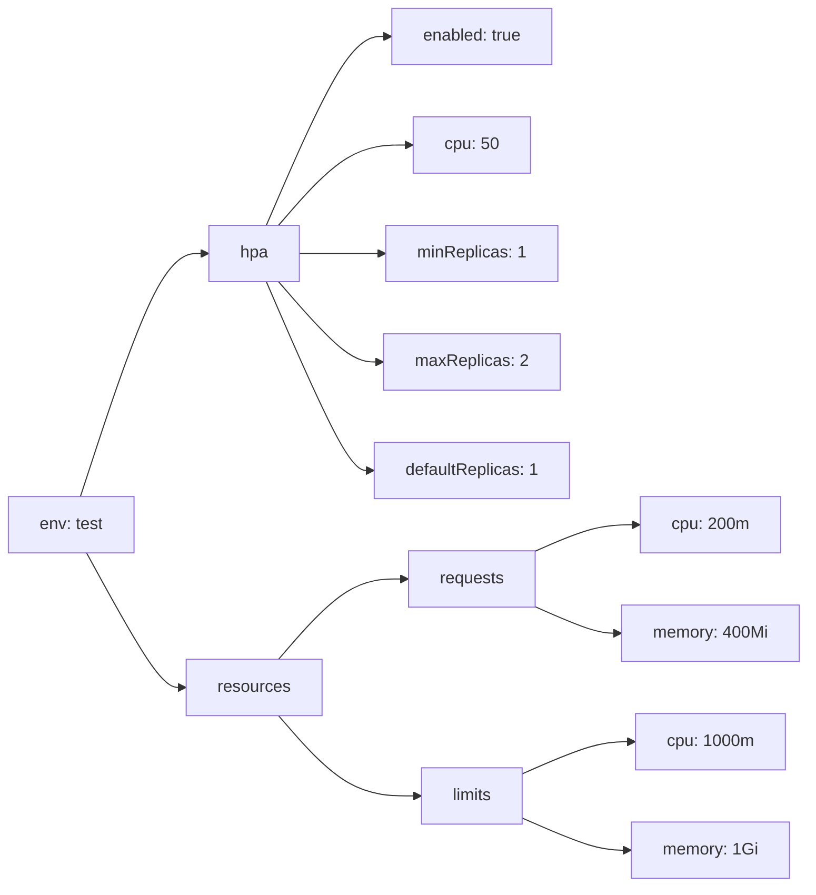
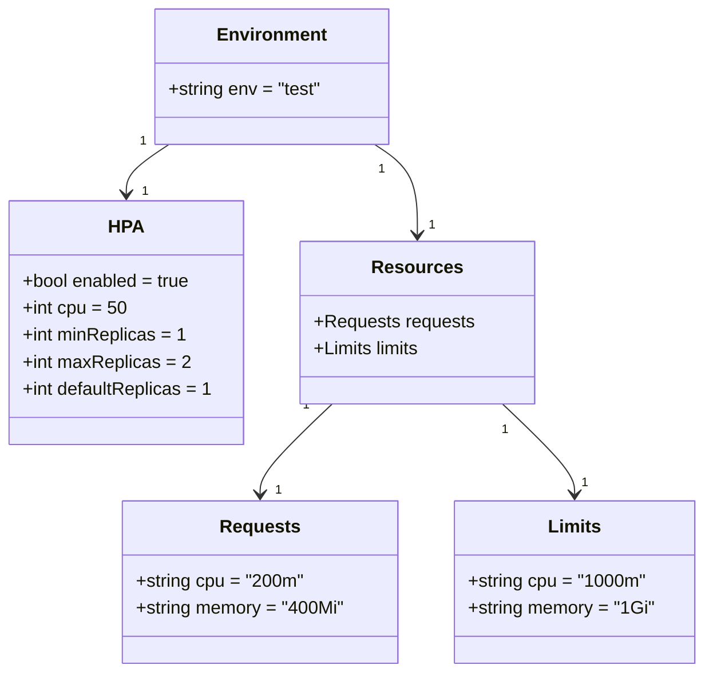

# Diagram: common/document_service/helm/profiles/values.test.yaml

> Auto-generated by Obscura crawlers

## Diagram 1

### SVG

<svg id="container" width="775.453125" xmlns="http://www.w3.org/2000/svg" class="flowchart" height="850" viewBox="0 0 775.453125 850" role="graphics-document document" aria-roledescription="flowchart-v2"><g><marker id="container_flowchart-v2-pointEnd" class="marker flowchart-v2" viewBox="0 0 10 10" refX="5" refY="5" markerUnits="userSpaceOnUse" markerWidth="8" markerHeight="8" orient="auto"><path d="M 0 0 L 10 5 L 0 10 z" class="arrowMarkerPath" style="stroke-width: 1; stroke-dasharray: 1, 0;"></path></marker><marker id="container_flowchart-v2-pointStart" class="marker flowchart-v2" viewBox="0 0 10 10" refX="4.5" refY="5" markerUnits="userSpaceOnUse" markerWidth="8" markerHeight="8" orient="auto"><path d="M 0 5 L 10 10 L 10 0 z" class="arrowMarkerPath" style="stroke-width: 1; stroke-dasharray: 1, 0;"></path></marker><marker id="container_flowchart-v2-circleEnd" class="marker flowchart-v2" viewBox="0 0 10 10" refX="11" refY="5" markerUnits="userSpaceOnUse" markerWidth="11" markerHeight="11" orient="auto"><circle cx="5" cy="5" r="5" class="arrowMarkerPath" style="stroke-width: 1; stroke-dasharray: 1, 0;"></circle></marker><marker id="container_flowchart-v2-circleStart" class="marker flowchart-v2" viewBox="0 0 10 10" refX="-1" refY="5" markerUnits="userSpaceOnUse" markerWidth="11" markerHeight="11" orient="auto"><circle cx="5" cy="5" r="5" class="arrowMarkerPath" style="stroke-width: 1; stroke-dasharray: 1, 0;"></circle></marker><marker id="container_flowchart-v2-crossEnd" class="marker cross flowchart-v2" viewBox="0 0 11 11" refX="12" refY="5.2" markerUnits="userSpaceOnUse" markerWidth="11" markerHeight="11" orient="auto"><path d="M 1,1 l 9,9 M 10,1 l -9,9" class="arrowMarkerPath" style="stroke-width: 2; stroke-dasharray: 1, 0;"></path></marker><marker id="container_flowchart-v2-crossStart" class="marker cross flowchart-v2" viewBox="0 0 11 11" refX="-1" refY="5.2" markerUnits="userSpaceOnUse" markerWidth="11" markerHeight="11" orient="auto"><path d="M 1,1 l 9,9 M 10,1 l -9,9" class="arrowMarkerPath" style="stroke-width: 2; stroke-dasharray: 1, 0;"></path></marker><g class="root"><g class="clusters"></g><g class="edgePaths"><path d="M77.663,476L90.472,437.167C103.281,398.333,128.898,320.667,148.734,281.833C168.57,243,182.625,243,189.652,243L196.68,243" id="L_Env_HPA_0" class="edge-thickness-normal edge-pattern-solid edge-thickness-normal edge-pattern-solid flowchart-link" style=";" data-edge="true" data-et="edge" data-id="L_Env_HPA_0" data-points="W3sieCI6NzcuNjYzNDMxNDkwMzg0NjEsInkiOjQ3Nn0seyJ4IjoxNTQuNTE1NjI1LCJ5IjoyNDN9LHsieCI6MjAwLjY3OTY4NzUsInkiOjI0M31d" marker-end="url(#container_flowchart-v2-pointEnd)"></path><path d="M83.601,530L95.42,551.5C107.239,573,130.877,616,146.196,637.5C161.516,659,168.516,659,172.016,659L175.516,659" id="L_Env_Resources_0" class="edge-thickness-normal edge-pattern-solid edge-thickness-normal edge-pattern-solid flowchart-link" style=";" data-edge="true" data-et="edge" data-id="L_Env_Resources_0" data-points="W3sieCI6ODMuNjAwNTEwODE3MzA3NywieSI6NTMwfSx7IngiOjE1NC41MTU2MjUsInkiOjY1OX0seyJ4IjoxNzkuNTE1NjI1LCJ5Ijo2NTl9XQ==" marker-end="url(#container_flowchart-v2-pointEnd)"></path><path d="M256.066,216L269.102,185.833C282.138,155.667,308.209,95.333,327.236,65.167C346.263,35,358.245,35,364.236,35L370.227,35" id="L_HPA_HPAEnabled_0" class="edge-thickness-normal edge-pattern-solid edge-thickness-normal edge-pattern-solid flowchart-link" style=";" data-edge="true" data-et="edge" data-id="L_HPA_HPAEnabled_0" data-points="W3sieCI6MjU2LjA2NTkxNzk2ODc1LCJ5IjoyMTZ9LHsieCI6MzM0LjI4MTI1LCJ5IjozNX0seyJ4IjozNzQuMjI2NTYyNSwieSI6MzV9XQ==" marker-end="url(#container_flowchart-v2-pointEnd)"></path><path d="M267.733,216L278.825,203.167C289.916,190.333,312.099,164.667,332.995,151.833C353.891,139,373.5,139,383.305,139L393.109,139" id="L_HPA_HPACPU_0" class="edge-thickness-normal edge-pattern-solid edge-thickness-normal edge-pattern-solid flowchart-link" style=";" data-edge="true" data-et="edge" data-id="L_HPA_HPACPU_0" data-points="W3sieCI6MjY3LjczMzM5ODQzNzUsInkiOjIxNn0seyJ4IjozMzQuMjgxMjUsInkiOjEzOX0seyJ4IjozOTcuMTA5Mzc1LCJ5IjoxMzl9XQ==" marker-end="url(#container_flowchart-v2-pointEnd)"></path><path d="M288.117,243L295.811,243C303.505,243,318.893,243,332.102,243C345.31,243,356.339,243,361.853,243L367.367,243" id="L_HPA_HPAMin_0" class="edge-thickness-normal edge-pattern-solid edge-thickness-normal edge-pattern-solid flowchart-link" style=";" data-edge="true" data-et="edge" data-id="L_HPA_HPAMin_0" data-points="W3sieCI6Mjg4LjExNzE4NzUsInkiOjI0M30seyJ4IjozMzQuMjgxMjUsInkiOjI0M30seyJ4IjozNzEuMzY3MTg3NSwieSI6MjQzfV0=" marker-end="url(#container_flowchart-v2-pointEnd)"></path><path d="M267.733,270L278.825,282.833C289.916,295.667,312.099,321.333,328.407,334.167C344.716,347,355.151,347,360.368,347L365.586,347" id="L_HPA_HPAMax_0" class="edge-thickness-normal edge-pattern-solid edge-thickness-normal edge-pattern-solid flowchart-link" style=";" data-edge="true" data-et="edge" data-id="L_HPA_HPAMax_0" data-points="W3sieCI6MjY3LjczMzM5ODQzNzUsInkiOjI3MH0seyJ4IjozMzQuMjgxMjUsInkiOjM0N30seyJ4IjozNjkuNTg1OTM3NSwieSI6MzQ3fV0=" marker-end="url(#container_flowchart-v2-pointEnd)"></path><path d="M256.066,270L269.102,300.167C282.138,330.333,308.209,390.667,324.745,420.833C341.281,451,348.281,451,351.781,451L355.281,451" id="L_HPA_HPADefault_0" class="edge-thickness-normal edge-pattern-solid edge-thickness-normal edge-pattern-solid flowchart-link" style=";" data-edge="true" data-et="edge" data-id="L_HPA_HPADefault_0" data-points="W3sieCI6MjU2LjA2NTkxNzk2ODc1LCJ5IjoyNzB9LHsieCI6MzM0LjI4MTI1LCJ5Ijo0NTF9LHsieCI6MzU5LjI4MTI1LCJ5Ijo0NTF9XQ==" marker-end="url(#container_flowchart-v2-pointEnd)"></path><path d="M267.733,632L278.825,619.167C289.916,606.333,312.099,580.667,332.057,567.833C352.016,555,369.75,555,378.617,555L387.484,555" id="L_Resources_Requests_0" class="edge-thickness-normal edge-pattern-solid edge-thickness-normal edge-pattern-solid flowchart-link" style=";" data-edge="true" data-et="edge" data-id="L_Resources_Requests_0" data-points="W3sieCI6MjY3LjczMzM5ODQzNzUsInkiOjYzMn0seyJ4IjozMzQuMjgxMjUsInkiOjU1NX0seyJ4IjozOTEuNDg0Mzc1LCJ5Ijo1NTV9XQ==" marker-end="url(#container_flowchart-v2-pointEnd)"></path><path d="M267.733,686L278.825,698.833C289.916,711.667,312.099,737.333,333.896,750.167C355.693,763,377.104,763,387.81,763L398.516,763" id="L_Resources_Limits_0" class="edge-thickness-normal edge-pattern-solid edge-thickness-normal edge-pattern-solid flowchart-link" style=";" data-edge="true" data-et="edge" data-id="L_Resources_Limits_0" data-points="W3sieCI6MjY3LjczMzM5ODQzNzUsInkiOjY4Nn0seyJ4IjozMzQuMjgxMjUsInkiOjc2M30seyJ4Ijo0MDIuNTE1NjI1LCJ5Ijo3NjN9XQ==" marker-end="url(#container_flowchart-v2-pointEnd)"></path><path d="M514.234,528.085L523.768,523.904C533.302,519.724,552.37,511.362,568.484,507.181C584.599,503,597.76,503,604.341,503L610.922,503" id="L_Requests_ReqCPU_0" class="edge-thickness-normal edge-pattern-solid edge-thickness-normal edge-pattern-solid flowchart-link" style=";" data-edge="true" data-et="edge" data-id="L_Requests_ReqCPU_0" data-points="W3sieCI6NTE0LjIzNDM3NSwieSI6NTI4LjA4NTI1NDk3NDMwNDl9LHsieCI6NTcxLjQzNzUsInkiOjUwM30seyJ4Ijo2MTQuOTIxODc1LCJ5Ijo1MDN9XQ==" marker-end="url(#container_flowchart-v2-pointEnd)"></path><path d="M514.234,581.915L523.768,586.096C533.302,590.276,552.37,598.638,565.404,602.819C578.438,607,585.438,607,588.938,607L592.438,607" id="L_Requests_ReqMemory_0" class="edge-thickness-normal edge-pattern-solid edge-thickness-normal edge-pattern-solid flowchart-link" style=";" data-edge="true" data-et="edge" data-id="L_Requests_ReqMemory_0" data-points="W3sieCI6NTE0LjIzNDM3NSwieSI6NTgxLjkxNDc0NTAyNTY5NTF9LHsieCI6NTcxLjQzNzUsInkiOjYwN30seyJ4Ijo1OTYuNDM3NSwieSI6NjA3fV0=" marker-end="url(#container_flowchart-v2-pointEnd)"></path><path d="M503.203,740.923L514.576,735.936C525.948,730.949,548.693,720.974,565.986,715.987C583.279,711,595.12,711,601.04,711L606.961,711" id="L_Limits_LimCPU_0" class="edge-thickness-normal edge-pattern-solid edge-thickness-normal edge-pattern-solid flowchart-link" style=";" data-edge="true" data-et="edge" data-id="L_Limits_LimCPU_0" data-points="W3sieCI6NTAzLjIwMzEyNSwieSI6NzQwLjkyMjc4Mjk3NTM1OX0seyJ4Ijo1NzEuNDM3NSwieSI6NzExfSx7IngiOjYxMC45NjA5Mzc1LCJ5Ijo3MTF9XQ==" marker-end="url(#container_flowchart-v2-pointEnd)"></path><path d="M503.203,785.077L514.576,790.064C525.948,795.051,548.693,805.026,565.382,810.013C582.07,815,592.703,815,598.02,815L603.336,815" id="L_Limits_LimMemory_0" class="edge-thickness-normal edge-pattern-solid edge-thickness-normal edge-pattern-solid flowchart-link" style=";" data-edge="true" data-et="edge" data-id="L_Limits_LimMemory_0" data-points="W3sieCI6NTAzLjIwMzEyNSwieSI6Nzg1LjA3NzIxNzAyNDY0MX0seyJ4Ijo1NzEuNDM3NSwieSI6ODE1fSx7IngiOjYwNy4zMzU5Mzc1LCJ5Ijo4MTV9XQ==" marker-end="url(#container_flowchart-v2-pointEnd)"></path></g><g class="edgeLabels"><g class="edgeLabel"><g class="label" data-id="L_Env_HPA_0" transform="translate(0, 0)"><foreignObject width="0" height="0">

</foreignObject></g></g><g class="edgeLabel"><g class="label" data-id="L_Env_Resources_0" transform="translate(0, 0)"><foreignObject width="0" height="0">

</foreignObject></g></g><g class="edgeLabel"><g class="label" data-id="L_HPA_HPAEnabled_0" transform="translate(0, 0)"><foreignObject width="0" height="0">

</foreignObject></g></g><g class="edgeLabel"><g class="label" data-id="L_HPA_HPACPU_0" transform="translate(0, 0)"><foreignObject width="0" height="0">

</foreignObject></g></g><g class="edgeLabel"><g class="label" data-id="L_HPA_HPAMin_0" transform="translate(0, 0)"><foreignObject width="0" height="0">

</foreignObject></g></g><g class="edgeLabel"><g class="label" data-id="L_HPA_HPAMax_0" transform="translate(0, 0)"><foreignObject width="0" height="0">

</foreignObject></g></g><g class="edgeLabel"><g class="label" data-id="L_HPA_HPADefault_0" transform="translate(0, 0)"><foreignObject width="0" height="0">

</foreignObject></g></g><g class="edgeLabel"><g class="label" data-id="L_Resources_Requests_0" transform="translate(0, 0)"><foreignObject width="0" height="0">

</foreignObject></g></g><g class="edgeLabel"><g class="label" data-id="L_Resources_Limits_0" transform="translate(0, 0)"><foreignObject width="0" height="0">

</foreignObject></g></g><g class="edgeLabel"><g class="label" data-id="L_Requests_ReqCPU_0" transform="translate(0, 0)"><foreignObject width="0" height="0">

</foreignObject></g></g><g class="edgeLabel"><g class="label" data-id="L_Requests_ReqMemory_0" transform="translate(0, 0)"><foreignObject width="0" height="0">

</foreignObject></g></g><g class="edgeLabel"><g class="label" data-id="L_Limits_LimCPU_0" transform="translate(0, 0)"><foreignObject width="0" height="0">

</foreignObject></g></g><g class="edgeLabel"><g class="label" data-id="L_Limits_LimMemory_0" transform="translate(0, 0)"><foreignObject width="0" height="0">

</foreignObject></g></g></g><g class="nodes"><g class="node default" id="flowchart-Env-0" transform="translate(68.7578125, 503)"><rect class="basic label-container" style="" x="-60.7578125" y="-27" width="121.515625" height="54"></rect><g class="label" style="" transform="translate(-30.7578125, -12)"><rect></rect><foreignObject width="61.515625" height="24">

env: test

</foreignObject></g></g><g class="node default" id="flowchart-HPA-1" transform="translate(244.3984375, 243)"><rect class="basic label-container" style="" x="-43.71875" y="-27" width="87.4375" height="54"></rect><g class="label" style="" transform="translate(-13.71875, -12)"><rect></rect><foreignObject width="27.4375" height="24">

hpa

</foreignObject></g></g><g class="node default" id="flowchart-Resources-3" transform="translate(244.3984375, 659)"><rect class="basic label-container" style="" x="-64.8828125" y="-27" width="129.765625" height="54"></rect><g class="label" style="" transform="translate(-34.8828125, -12)"><rect></rect><foreignObject width="69.765625" height="24">

resources

</foreignObject></g></g><g class="node default" id="flowchart-HPAEnabled-5" transform="translate(452.859375, 35)"><rect class="basic label-container" style="" x="-78.6328125" y="-27" width="157.265625" height="54"></rect><g class="label" style="" transform="translate(-48.6328125, -12)"><rect></rect><foreignObject width="97.265625" height="24">

enabled: true

</foreignObject></g></g><g class="node default" id="flowchart-HPACPU-7" transform="translate(452.859375, 139)"><rect class="basic label-container" style="" x="-55.75" y="-27" width="111.5" height="54"></rect><g class="label" style="" transform="translate(-25.75, -12)"><rect></rect><foreignObject width="51.5" height="24">

cpu: 50

</foreignObject></g></g><g class="node default" id="flowchart-HPAMin-9" transform="translate(452.859375, 243)"><rect class="basic label-container" style="" x="-81.4921875" y="-27" width="162.984375" height="54"></rect><g class="label" style="" transform="translate(-51.4921875, -12)"><rect></rect><foreignObject width="102.984375" height="24">

minReplicas: 1

</foreignObject></g></g><g class="node default" id="flowchart-HPAMax-11" transform="translate(452.859375, 347)"><rect class="basic label-container" style="" x="-83.2734375" y="-27" width="166.546875" height="54"></rect><g class="label" style="" transform="translate(-53.2734375, -12)"><rect></rect><foreignObject width="106.546875" height="24">

maxReplicas: 2

</foreignObject></g></g><g class="node default" id="flowchart-HPADefault-13" transform="translate(452.859375, 451)"><rect class="basic label-container" style="" x="-93.578125" y="-27" width="187.15625" height="54"></rect><g class="label" style="" transform="translate(-63.578125, -12)"><rect></rect><foreignObject width="127.15625" height="24">

defaultReplicas: 1

</foreignObject></g></g><g class="node default" id="flowchart-Requests-15" transform="translate(452.859375, 555)"><rect class="basic label-container" style="" x="-61.375" y="-27" width="122.75" height="54"></rect><g class="label" style="" transform="translate(-31.375, -12)"><rect></rect><foreignObject width="62.75" height="24">

requests

</foreignObject></g></g><g class="node default" id="flowchart-Limits-17" transform="translate(452.859375, 763)"><rect class="basic label-container" style="" x="-50.34375" y="-27" width="100.6875" height="54"></rect><g class="label" style="" transform="translate(-20.34375, -12)"><rect></rect><foreignObject width="40.6875" height="24">

limits

</foreignObject></g></g><g class="node default" id="flowchart-ReqCPU-19" transform="translate(681.9453125, 503)"><rect class="basic label-container" style="" x="-67.0234375" y="-27" width="134.046875" height="54"></rect><g class="label" style="" transform="translate(-37.0234375, -12)"><rect></rect><foreignObject width="74.046875" height="24">

cpu: 200m

</foreignObject></g></g><g class="node default" id="flowchart-ReqMemory-21" transform="translate(681.9453125, 607)"><rect class="basic label-container" style="" x="-85.5078125" y="-27" width="171.015625" height="54"></rect><g class="label" style="" transform="translate(-55.5078125, -12)"><rect></rect><foreignObject width="111.015625" height="24">

memory: 400Mi

</foreignObject></g></g><g class="node default" id="flowchart-LimCPU-23" transform="translate(681.9453125, 711)"><rect class="basic label-container" style="" x="-70.984375" y="-27" width="141.96875" height="54"></rect><g class="label" style="" transform="translate(-40.984375, -12)"><rect></rect><foreignObject width="81.96875" height="24">

cpu: 1000m

</foreignObject></g></g><g class="node default" id="flowchart-LimMemory-25" transform="translate(681.9453125, 815)"><rect class="basic label-container" style="" x="-74.609375" y="-27" width="149.21875" height="54"></rect><g class="label" style="" transform="translate(-44.609375, -12)"><rect></rect><foreignObject width="89.21875" height="24">

memory: 1Gi

</foreignObject></g></g></g></g></g></svg>

## Diagram 2

### SVG

<svg id="container" width="616.87109375" xmlns="http://www.w3.org/2000/svg" class="classDiagram" height="596" viewBox="0 0 616.87109375 596" role="graphics-document document" aria-roledescription="class"><g><defs><marker id="container_class-aggregationStart" class="marker aggregation class" refX="18" refY="7" markerWidth="190" markerHeight="240" orient="auto"><path d="M 18,7 L9,13 L1,7 L9,1 Z"></path></marker></defs><defs><marker id="container_class-aggregationEnd" class="marker aggregation class" refX="1" refY="7" markerWidth="20" markerHeight="28" orient="auto"><path d="M 18,7 L9,13 L1,7 L9,1 Z"></path></marker></defs><defs><marker id="container_class-extensionStart" class="marker extension class" refX="18" refY="7" markerWidth="190" markerHeight="240" orient="auto"><path d="M 1,7 L18,13 V 1 Z"></path></marker></defs><defs><marker id="container_class-extensionEnd" class="marker extension class" refX="1" refY="7" markerWidth="20" markerHeight="28" orient="auto"><path d="M 1,1 V 13 L18,7 Z"></path></marker></defs><defs><marker id="container_class-compositionStart" class="marker composition class" refX="18" refY="7" markerWidth="190" markerHeight="240" orient="auto"><path d="M 18,7 L9,13 L1,7 L9,1 Z"></path></marker></defs><defs><marker id="container_class-compositionEnd" class="marker composition class" refX="1" refY="7" markerWidth="20" markerHeight="28" orient="auto"><path d="M 18,7 L9,13 L1,7 L9,1 Z"></path></marker></defs><defs><marker id="container_class-dependencyStart" class="marker dependency class" refX="6" refY="7" markerWidth="190" markerHeight="240" orient="auto"><path d="M 5,7 L9,13 L1,7 L9,1 Z"></path></marker></defs><defs><marker id="container_class-dependencyEnd" class="marker dependency class" refX="13" refY="7" markerWidth="20" markerHeight="28" orient="auto"><path d="M 18,7 L9,13 L14,7 L9,1 Z"></path></marker></defs><defs><marker id="container_class-lollipopStart" class="marker lollipop class" refX="13" refY="7" markerWidth="190" markerHeight="240" orient="auto"><circle stroke="black" fill="transparent" cx="7" cy="7" r="6"></circle></marker></defs><defs><marker id="container_class-lollipopEnd" class="marker lollipop class" refX="1" refY="7" markerWidth="190" markerHeight="240" orient="auto"><circle stroke="black" fill="transparent" cx="7" cy="7" r="6"></circle></marker></defs><g class="root"><g class="clusters"></g><g class="edgePaths"><path d="M148.307,128L142.075,132.167C135.843,136.333,123.378,144.667,117.146,152C110.914,159.333,110.914,165.667,110.914,168.833L110.914,172" id="id_Environment_HPA_1" class="edge-thickness-normal edge-pattern-solid relation" style=";;;" data-edge="true" data-et="edge" data-id="id_Environment_HPA_1" data-points="W3sieCI6MTQ4LjMwNzIxNTA3MzUyOTQsInkiOjEyOH0seyJ4IjoxMTAuOTE0MDYyNSwieSI6MTUzfSx7IngiOjExMC45MTQwNjI1LCJ5IjoxNzh9XQ==" marker-end="url(#container_class-dependencyEnd)"></path><path d="M327.794,128L334.027,132.167C340.259,136.333,352.723,144.667,358.955,158C365.188,171.333,365.188,189.667,365.188,198.833L365.188,208" id="id_Environment_Resources_2" class="edge-thickness-normal edge-pattern-solid relation" style=";;;" data-edge="true" data-et="edge" data-id="id_Environment_Resources_2" data-points="W3sieCI6MzI3Ljc5NDM0NzQyNjQ3MDYsInkiOjEyOH0seyJ4IjozNjUuMTg3NSwieSI6MTUzfSx7IngiOjM2NS4xODc1LCJ5IjoyMTR9XQ==" marker-end="url(#container_class-dependencyEnd)"></path><path d="M290.25,358L279.669,368.167C269.087,378.333,247.925,398.667,237.343,412C226.762,425.333,226.762,431.667,226.762,434.833L226.762,438" id="id_Resources_Requests_3" class="edge-thickness-normal edge-pattern-solid relation" style=";;;" data-edge="true" data-et="edge" data-id="id_Resources_Requests_3" data-points="W3sieCI6MjkwLjI1MDIzNDk2MjQwNiwieSI6MzU4fSx7IngiOjIyNi43NjE3MTg3NSwieSI6NDE5fSx7IngiOjIyNi43NjE3MTg3NSwieSI6NDQ0fV0=" marker-end="url(#container_class-dependencyEnd)"></path><path d="M440.125,358L450.706,368.167C461.288,378.333,482.45,398.667,493.032,412C503.613,425.333,503.613,431.667,503.613,434.833L503.613,438" id="id_Resources_Limits_4" class="edge-thickness-normal edge-pattern-solid relation" style=";;;" data-edge="true" data-et="edge" data-id="id_Resources_Limits_4" data-points="W3sieCI6NDQwLjEyNDc2NTAzNzU5NCwieSI6MzU4fSx7IngiOjUwMy42MTMyODEyNSwieSI6NDE5fSx7IngiOjUwMy42MTMyODEyNSwieSI6NDQ0fV0=" marker-end="url(#container_class-dependencyEnd)"></path></g><g class="edgeLabels"><g class="edgeLabel"><g class="label" data-id="id_Environment_HPA_1" transform="translate(0, 0)"><foreignObject width="0" height="0">

</foreignObject></g></g><g class="edgeLabel"><g class="label" data-id="id_Environment_Resources_2" transform="translate(0, 0)"><foreignObject width="0" height="0">

</foreignObject></g></g><g class="edgeLabel"><g class="label" data-id="id_Resources_Requests_3" transform="translate(0, 0)"><foreignObject width="0" height="0">

</foreignObject></g></g><g class="edgeLabel"><g class="label" data-id="id_Resources_Limits_4" transform="translate(0, 0)"><foreignObject width="0" height="0">

</foreignObject></g></g><g class="edgeTerminals" transform="translate(125.42219754439543, 125.2566492656152)"><g class="inner" transform="translate(0, 0)"><foreignObject style="width: 9px; height: 12px;">
1
</foreignObject></g></g><g class="edgeTerminals" transform="translate(334.00548322581926, 150.19621040341062)"><g class="inner" transform="translate(0, 0)"><foreignObject style="width: 9px; height: 12px;">
1
</foreignObject></g></g><g class="edgeTerminals" transform="translate(267.2385224960093, 359.3081186612298)"><g class="inner" transform="translate(0, 0)"><foreignObject style="width: 9px; height: 12px;">
1
</foreignObject></g></g><g class="edgeTerminals" transform="translate(442.3514775336033, 380.94105133877025)"><g class="inner" transform="translate(0, 0)"><foreignObject style="width: 9px; height: 12px;">
1
</foreignObject></g></g><g class="edgeTerminals" transform="translate(124.54461175679711, 161.65860961640968)"><g class="inner" transform="translate(0, 0)"></g><foreignObject style="width: 9px; height: 12px;">
1
</foreignObject></g><g class="edgeTerminals" transform="translate(375.1875, 191.5)"><g class="inner" transform="translate(0, 0)"></g><foreignObject style="width: 9px; height: 12px;">
1
</foreignObject></g><g class="edgeTerminals" transform="translate(239.99869065409302, 426.34034034566844)"><g class="inner" transform="translate(0, 0)"></g><foreignObject style="width: 9px; height: 12px;">
1
</foreignObject></g><g class="edgeTerminals" transform="translate(509.639271904093, 419.7313296543316)"><g class="inner" transform="translate(0, 0)"></g><foreignObject style="width: 9px; height: 12px;">
1
</foreignObject></g></g><g class="nodes"><g class="node default" id="classId-Environment-0" transform="translate(238.05078125, 68)"><g class="basic label-container"><path d="M-103.29296875 -60 L103.29296875 -60 L103.29296875 60 L-103.29296875 60" stroke="none" stroke-width="0" fill="#ECECFF" style=""></path><path d="M-103.29296875 -60 C-35.63110121678015 -60, 32.030766316439696 -60, 103.29296875 -60 M-103.29296875 -60 C-33.98446286407817 -60, 35.324043021843664 -60, 103.29296875 -60 M103.29296875 -60 C103.29296875 -35.3282717396293, 103.29296875 -10.656543479258595, 103.29296875 60 M103.29296875 -60 C103.29296875 -33.30906338176622, 103.29296875 -6.618126763532445, 103.29296875 60 M103.29296875 60 C25.671816326995838 60, -51.949336096008324 60, -103.29296875 60 M103.29296875 60 C58.24121721921754 60, 13.189465688435078 60, -103.29296875 60 M-103.29296875 60 C-103.29296875 35.969512474648646, -103.29296875 11.939024949297291, -103.29296875 -60 M-103.29296875 60 C-103.29296875 33.162907316545585, -103.29296875 6.32581463309117, -103.29296875 -60" stroke="#9370DB" stroke-width="1.3" fill="none" stroke-dasharray="0 0" style=""></path></g><g class="annotation-group text" transform="translate(0, -36)"></g><g class="label-group text" transform="translate(-46.1953125, -36)"><g class="label" style="font-weight: bolder" transform="translate(0,-12)"><foreignObject width="92.390625" height="24">

Environment

</foreignObject></g></g><g class="members-group text" transform="translate(-91.29296875, 12)"><g class="label" style="" transform="translate(0,-12)"><foreignObject width="136.390625" height="24">

+string env = "test"

</foreignObject></g></g><g class="methods-group text" transform="translate(-91.29296875, 60)"></g><g class="divider" style=""><path d="M-103.29296875 -12 C-36.349779821051726 -12, 30.593409107896548 -12, 103.29296875 -12 M-103.29296875 -12 C-21.011035382582264 -12, 61.27089798483547 -12, 103.29296875 -12" stroke="#9370DB" stroke-width="1.3" fill="none" stroke-dasharray="0 0" style=""></path></g><g class="divider" style=""><path d="M-103.29296875 36 C-23.485397773103102 36, 56.322173203793795 36, 103.29296875 36 M-103.29296875 36 C-36.595344239108044 36, 30.10228027178391 36, 103.29296875 36" stroke="#9370DB" stroke-width="1.3" fill="none" stroke-dasharray="0 0" style=""></path></g></g><g class="node default" id="classId-HPA-1" transform="translate(110.9140625, 286)"><g class="basic label-container"><path d="M-102.9140625 -108 L102.9140625 -108 L102.9140625 108 L-102.9140625 108" stroke="none" stroke-width="0" fill="#ECECFF" style=""></path><path d="M-102.9140625 -108 C-41.4776957420739 -108, 19.958671015852204 -108, 102.9140625 -108 M-102.9140625 -108 C-28.631054317761766 -108, 45.65195386447647 -108, 102.9140625 -108 M102.9140625 -108 C102.9140625 -58.53983922974165, 102.9140625 -9.079678459483304, 102.9140625 108 M102.9140625 -108 C102.9140625 -52.527607404325394, 102.9140625 2.9447851913492116, 102.9140625 108 M102.9140625 108 C44.7460460138769 108, -13.421970472246201 108, -102.9140625 108 M102.9140625 108 C54.026999574131565 108, 5.139936648263131 108, -102.9140625 108 M-102.9140625 108 C-102.9140625 29.10627351839075, -102.9140625 -49.7874529632185, -102.9140625 -108 M-102.9140625 108 C-102.9140625 54.731853796799484, -102.9140625 1.4637075935989685, -102.9140625 -108" stroke="#9370DB" stroke-width="1.3" fill="none" stroke-dasharray="0 0" style=""></path></g><g class="annotation-group text" transform="translate(0, -84)"></g><g class="label-group text" transform="translate(-14.375, -84)"><g class="label" style="font-weight: bolder" transform="translate(0,-12)"><foreignObject width="28.75" height="24">

HPA

</foreignObject></g></g><g class="members-group text" transform="translate(-90.9140625, -36)"><g class="label" style="" transform="translate(0,-12)"><foreignObject width="150.78125" height="24">

+bool enabled = true

</foreignObject></g><g class="label" style="" transform="translate(0,12)"><foreignObject width="91.78125" height="24">

+int cpu = 50

</foreignObject></g><g class="label" style="" transform="translate(0,36)"><foreignObject width="143.265625" height="24">

+int minReplicas = 1

</foreignObject></g><g class="label" style="" transform="translate(0,60)"><foreignObject width="146.84375" height="24">

+int maxReplicas = 2

</foreignObject></g><g class="label" style="" transform="translate(0,84)"><foreignObject width="167.453125" height="24">

+int defaultReplicas = 1

</foreignObject></g></g><g class="methods-group text" transform="translate(-90.9140625, 108)"></g><g class="divider" style=""><path d="M-102.9140625 -60 C-46.91242500844506 -60, 9.089212483109876 -60, 102.9140625 -60 M-102.9140625 -60 C-47.01277575712881 -60, 8.888510985742386 -60, 102.9140625 -60" stroke="#9370DB" stroke-width="1.3" fill="none" stroke-dasharray="0 0" style=""></path></g><g class="divider" style=""><path d="M-102.9140625 84 C-51.7415915233124 84, -0.5691205466248022 84, 102.9140625 84 M-102.9140625 84 C-43.414968162859935 84, 16.08412617428013 84, 102.9140625 84" stroke="#9370DB" stroke-width="1.3" fill="none" stroke-dasharray="0 0" style=""></path></g></g><g class="node default" id="classId-Resources-2" transform="translate(365.1875, 286)"><g class="basic label-container"><path d="M-101.359375 -72 L101.359375 -72 L101.359375 72 L-101.359375 72" stroke="none" stroke-width="0" fill="#ECECFF" style=""></path><path d="M-101.359375 -72 C-34.50709360187227 -72, 32.34518779625546 -72, 101.359375 -72 M-101.359375 -72 C-39.35949264796089 -72, 22.640389704078217 -72, 101.359375 -72 M101.359375 -72 C101.359375 -31.73476873167769, 101.359375 8.53046253664462, 101.359375 72 M101.359375 -72 C101.359375 -29.20821517967734, 101.359375 13.583569640645322, 101.359375 72 M101.359375 72 C38.488307450589915 72, -24.38276009882017 72, -101.359375 72 M101.359375 72 C48.22764433527379 72, -4.904086329452426 72, -101.359375 72 M-101.359375 72 C-101.359375 19.22675356066746, -101.359375 -33.54649287866508, -101.359375 -72 M-101.359375 72 C-101.359375 35.89607861767762, -101.359375 -0.20784276464476648, -101.359375 -72" stroke="#9370DB" stroke-width="1.3" fill="none" stroke-dasharray="0 0" style=""></path></g><g class="annotation-group text" transform="translate(0, -48)"></g><g class="label-group text" transform="translate(-37.265625, -48)"><g class="label" style="font-weight: bolder" transform="translate(0,-12)"><foreignObject width="74.53125" height="24">

Resources

</foreignObject></g></g><g class="members-group text" transform="translate(-89.359375, 0)"><g class="label" style="" transform="translate(0,-12)"><foreignObject width="141.453125" height="24">

+Requests requests

</foreignObject></g><g class="label" style="" transform="translate(0,12)"><foreignObject width="96.859375" height="24">

+Limits limits

</foreignObject></g></g><g class="methods-group text" transform="translate(-89.359375, 72)"></g><g class="divider" style=""><path d="M-101.359375 -24 C-42.5255799170935 -24, 16.308215165812996 -24, 101.359375 -24 M-101.359375 -24 C-41.062081174902794 -24, 19.235212650194413 -24, 101.359375 -24" stroke="#9370DB" stroke-width="1.3" fill="none" stroke-dasharray="0 0" style=""></path></g><g class="divider" style=""><path d="M-101.359375 48 C-32.87769220921531 48, 35.60399058156938 48, 101.359375 48 M-101.359375 48 C-42.57366474691604 48, 16.212045506167925 48, 101.359375 48" stroke="#9370DB" stroke-width="1.3" fill="none" stroke-dasharray="0 0" style=""></path></g></g><g class="node default" id="classId-Requests-3" transform="translate(226.76171875, 516)"><g class="basic label-container"><path d="M-121.59375 -72 L121.59375 -72 L121.59375 72 L-121.59375 72" stroke="none" stroke-width="0" fill="#ECECFF" style=""></path><path d="M-121.59375 -72 C-32.536357117472704 -72, 56.52103576505459 -72, 121.59375 -72 M-121.59375 -72 C-50.665987401480336 -72, 20.261775197039327 -72, 121.59375 -72 M121.59375 -72 C121.59375 -35.888897434814005, 121.59375 0.2222051303719894, 121.59375 72 M121.59375 -72 C121.59375 -21.85063774856627, 121.59375 28.298724502867458, 121.59375 72 M121.59375 72 C25.560499948755307 72, -70.47275010248939 72, -121.59375 72 M121.59375 72 C41.7461055495159 72, -38.101538900968194 72, -121.59375 72 M-121.59375 72 C-121.59375 23.13570182275096, -121.59375 -25.72859635449808, -121.59375 -72 M-121.59375 72 C-121.59375 16.34135265083612, -121.59375 -39.31729469832776, -121.59375 -72" stroke="#9370DB" stroke-width="1.3" fill="none" stroke-dasharray="0 0" style=""></path></g><g class="annotation-group text" transform="translate(0, -48)"></g><g class="label-group text" transform="translate(-33.84375, -48)"><g class="label" style="font-weight: bolder" transform="translate(0,-12)"><foreignObject width="67.6875" height="24">

Requests

</foreignObject></g></g><g class="members-group text" transform="translate(-109.59375, 0)"><g class="label" style="" transform="translate(0,-12)"><foreignObject width="148.90625" height="24">

+string cpu = "200m"

</foreignObject></g><g class="label" style="" transform="translate(0,12)"><foreignObject width="185.34375" height="24">

+string memory = "400Mi"

</foreignObject></g></g><g class="methods-group text" transform="translate(-109.59375, 72)"></g><g class="divider" style=""><path d="M-121.59375 -24 C-56.03118747183342 -24, 9.531375056333161 -24, 121.59375 -24 M-121.59375 -24 C-27.368220687871542 -24, 66.85730862425692 -24, 121.59375 -24" stroke="#9370DB" stroke-width="1.3" fill="none" stroke-dasharray="0 0" style=""></path></g><g class="divider" style=""><path d="M-121.59375 48 C-33.27948976493039 48, 55.03477047013922 48, 121.59375 48 M-121.59375 48 C-39.51782903213247 48, 42.558091935735064 48, 121.59375 48" stroke="#9370DB" stroke-width="1.3" fill="none" stroke-dasharray="0 0" style=""></path></g></g><g class="node default" id="classId-Limits-4" transform="translate(503.61328125, 516)"><g class="basic label-container"><path d="M-105.2578125 -72 L105.2578125 -72 L105.2578125 72 L-105.2578125 72" stroke="none" stroke-width="0" fill="#ECECFF" style=""></path><path d="M-105.2578125 -72 C-25.533859424274496 -72, 54.19009365145101 -72, 105.2578125 -72 M-105.2578125 -72 C-54.07424494311156 -72, -2.8906773862231177 -72, 105.2578125 -72 M105.2578125 -72 C105.2578125 -36.246211850546075, 105.2578125 -0.49242370109215017, 105.2578125 72 M105.2578125 -72 C105.2578125 -30.908765262707206, 105.2578125 10.182469474585588, 105.2578125 72 M105.2578125 72 C25.48691389048622 72, -54.28398471902756 72, -105.2578125 72 M105.2578125 72 C46.54710851067247 72, -12.163595478655054 72, -105.2578125 72 M-105.2578125 72 C-105.2578125 35.151564198000976, -105.2578125 -1.6968716039980478, -105.2578125 -72 M-105.2578125 72 C-105.2578125 15.8422709098991, -105.2578125 -40.3154581802018, -105.2578125 -72" stroke="#9370DB" stroke-width="1.3" fill="none" stroke-dasharray="0 0" style=""></path></g><g class="annotation-group text" transform="translate(0, -48)"></g><g class="label-group text" transform="translate(-22.328125, -48)"><g class="label" style="font-weight: bolder" transform="translate(0,-12)"><foreignObject width="44.65625" height="24">

Limits

</foreignObject></g></g><g class="members-group text" transform="translate(-93.2578125, 0)"><g class="label" style="" transform="translate(0,-12)"><foreignObject width="156.84375" height="24">

+string cpu = "1000m"

</foreignObject></g><g class="label" style="" transform="translate(0,12)"><foreignObject width="164.1875" height="24">

+string memory = "1Gi"

</foreignObject></g></g><g class="methods-group text" transform="translate(-93.2578125, 72)"></g><g class="divider" style=""><path d="M-105.2578125 -24 C-37.062988342319855 -24, 31.13183581536029 -24, 105.2578125 -24 M-105.2578125 -24 C-33.642632195189066 -24, 37.97254810962187 -24, 105.2578125 -24" stroke="#9370DB" stroke-width="1.3" fill="none" stroke-dasharray="0 0" style=""></path></g><g class="divider" style=""><path d="M-105.2578125 48 C-56.03037868229239 48, -6.802944864584774 48, 105.2578125 48 M-105.2578125 48 C-47.85106442545849 48, 9.555683649083022 48, 105.2578125 48" stroke="#9370DB" stroke-width="1.3" fill="none" stroke-dasharray="0 0" style=""></path></g></g></g></g></g></svg>
