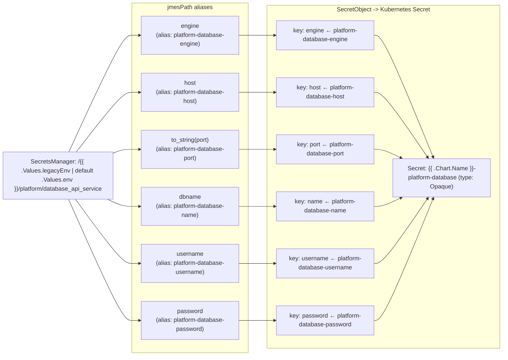

# Diagram: common/document_service/helm/templates/aws-secret-provider.yaml

> Auto-generated by Obscura crawlers

## Mermaid

### SVG

<svg id="container" width="1350.921875" xmlns="http://www.w3.org/2000/svg" class="flowchart" height="852" viewBox="0 0 1350.921875 852" role="graphics-document document" aria-roledescription="flowchart-v2"><g><marker id="container_flowchart-v2-pointEnd" class="marker flowchart-v2" viewBox="0 0 10 10" refX="5" refY="5" markerUnits="userSpaceOnUse" markerWidth="8" markerHeight="8" orient="auto"><path d="M 0 0 L 10 5 L 0 10 z" class="arrowMarkerPath" style="stroke-width: 1; stroke-dasharray: 1, 0;"></path></marker><marker id="container_flowchart-v2-pointStart" class="marker flowchart-v2" viewBox="0 0 10 10" refX="4.5" refY="5" markerUnits="userSpaceOnUse" markerWidth="8" markerHeight="8" orient="auto"><path d="M 0 5 L 10 10 L 10 0 z" class="arrowMarkerPath" style="stroke-width: 1; stroke-dasharray: 1, 0;"></path></marker><marker id="container_flowchart-v2-circleEnd" class="marker flowchart-v2" viewBox="0 0 10 10" refX="11" refY="5" markerUnits="userSpaceOnUse" markerWidth="11" markerHeight="11" orient="auto"><circle cx="5" cy="5" r="5" class="arrowMarkerPath" style="stroke-width: 1; stroke-dasharray: 1, 0;"></circle></marker><marker id="container_flowchart-v2-circleStart" class="marker flowchart-v2" viewBox="0 0 10 10" refX="-1" refY="5" markerUnits="userSpaceOnUse" markerWidth="11" markerHeight="11" orient="auto"><circle cx="5" cy="5" r="5" class="arrowMarkerPath" style="stroke-width: 1; stroke-dasharray: 1, 0;"></circle></marker><marker id="container_flowchart-v2-crossEnd" class="marker cross flowchart-v2" viewBox="0 0 11 11" refX="12" refY="5.2" markerUnits="userSpaceOnUse" markerWidth="11" markerHeight="11" orient="auto"><path d="M 1,1 l 9,9 M 10,1 l -9,9" class="arrowMarkerPath" style="stroke-width: 2; stroke-dasharray: 1, 0;"></path></marker><marker id="container_flowchart-v2-crossStart" class="marker cross flowchart-v2" viewBox="0 0 11 11" refX="-1" refY="5.2" markerUnits="userSpaceOnUse" markerWidth="11" markerHeight="11" orient="auto"><path d="M 1,1 l 9,9 M 10,1 l -9,9" class="arrowMarkerPath" style="stroke-width: 2; stroke-dasharray: 1, 0;"></path></marker><g class="root"><g class="clusters"><g class="cluster" id="SecretObj" data-look="classic"><rect style="" x="722.921875" y="8" width="620" height="824"></rect><g class="cluster-label" transform="translate(932.921875, 8)"><foreignObject width="200" height="48">

SecretObject -&gt; Kubernetes Secret

</foreignObject></g></g><g class="cluster" id="JMESPaths" data-look="classic"><rect style="" x="362.921875" y="8" width="310" height="836"></rect><g class="cluster-label" transform="translate(457.4921875, 8)"><foreignObject width="120.859375" height="24">

jmesPath aliases

</foreignObject></g></g></g><g class="edgePaths"><path d="M195.399,339L219.152,296.167C242.906,253.333,290.414,167.667,318.335,124.833C346.255,82,354.589,82,362.255,82C369.922,82,376.922,82,380.422,82L383.922,82" id="L_SM_E_0" class="edge-thickness-normal edge-pattern-solid edge-thickness-normal edge-pattern-solid flowchart-link" style=";" data-edge="true" data-et="edge" data-id="L_SM_E_0" data-points="W3sieCI6MTk1LjM5ODU1OTU3MDMxMjUsInkiOjMzOX0seyJ4IjozMzcuOTIxODc1LCJ5Ijo4Mn0seyJ4IjozNjIuOTIxODc1LCJ5Ijo4Mn0seyJ4IjozODcuOTIxODc1LCJ5Ijo4Mn1d" marker-end="url(#container_flowchart-v2-pointEnd)"></path><path d="M218.69,339L238.562,317.5C258.434,296,298.178,253,322.217,231.5C346.255,210,354.589,210,362.255,210C369.922,210,376.922,210,380.422,210L383.922,210" id="L_SM_H_0" class="edge-thickness-normal edge-pattern-solid edge-thickness-normal edge-pattern-solid flowchart-link" style=";" data-edge="true" data-et="edge" data-id="L_SM_H_0" data-points="W3sieCI6MjE4LjY5MDMwNzYxNzE4NzUsInkiOjMzOX0seyJ4IjozMzcuOTIxODc1LCJ5IjoyMTB9LHsieCI6MzYyLjkyMTg3NSwieSI6MjEwfSx7IngiOjM4Ny45MjE4NzUsInkiOjIxMH1d" marker-end="url(#container_flowchart-v2-pointEnd)"></path><path d="M312.922,347.016L317.089,345.513C321.255,344.011,329.589,341.005,337.922,339.503C346.255,338,354.589,338,362.255,338C369.922,338,376.922,338,380.422,338L383.922,338" id="L_SM_P_0" class="edge-thickness-normal edge-pattern-solid edge-thickness-normal edge-pattern-solid flowchart-link" style=";" data-edge="true" data-et="edge" data-id="L_SM_P_0" data-points="W3sieCI6MzEyLjkyMTg3NSwieSI6MzQ3LjAxNjA2ODY3NzA4NTZ9LHsieCI6MzM3LjkyMTg3NSwieSI6MzM4fSx7IngiOjM2Mi45MjE4NzUsInkiOjMzOH0seyJ4IjozODcuOTIxODc1LCJ5IjozMzh9XQ==" marker-end="url(#container_flowchart-v2-pointEnd)"></path><path d="M312.922,456.984L317.089,458.487C321.255,459.989,329.589,462.995,337.922,464.497C346.255,466,354.589,466,362.255,466C369.922,466,376.922,466,380.422,466L383.922,466" id="L_SM_DB_0" class="edge-thickness-normal edge-pattern-solid edge-thickness-normal edge-pattern-solid flowchart-link" style=";" data-edge="true" data-et="edge" data-id="L_SM_DB_0" data-points="W3sieCI6MzEyLjkyMTg3NSwieSI6NDU2Ljk4MzkzMTMyMjkxNDR9LHsieCI6MzM3LjkyMTg3NSwieSI6NDY2fSx7IngiOjM2Mi45MjE4NzUsInkiOjQ2Nn0seyJ4IjozODcuOTIxODc1LCJ5Ijo0NjZ9XQ==" marker-end="url(#container_flowchart-v2-pointEnd)"></path><path d="M215.265,465L235.708,488.5C256.151,512,297.036,559,321.646,582.5C346.255,606,354.589,606,362.255,606C369.922,606,376.922,606,380.422,606L383.922,606" id="L_SM_U_0" class="edge-thickness-normal edge-pattern-solid edge-thickness-normal edge-pattern-solid flowchart-link" style=";" data-edge="true" data-et="edge" data-id="L_SM_U_0" data-points="W3sieCI6MjE1LjI2NTA1MDU1MTQ3MDU4LCJ5Ijo0NjV9LHsieCI6MzM3LjkyMTg3NSwieSI6NjA2fSx7IngiOjM2Mi45MjE4NzUsInkiOjYwNn0seyJ4IjozODcuOTIxODc1LCJ5Ijo2MDZ9XQ==" marker-end="url(#container_flowchart-v2-pointEnd)"></path><path d="M191.866,465L216.208,513.833C240.551,562.667,289.236,660.333,317.746,709.167C346.255,758,354.589,758,362.255,758C369.922,758,376.922,758,380.422,758L383.922,758" id="L_SM_PW_0" class="edge-thickness-normal edge-pattern-solid edge-thickness-normal edge-pattern-solid flowchart-link" style=";" data-edge="true" data-et="edge" data-id="L_SM_PW_0" data-points="W3sieCI6MTkxLjg2NTU0MTYwODE0NjA2LCJ5Ijo0NjV9LHsieCI6MzM3LjkyMTg3NSwieSI6NzU4fSx7IngiOjM2Mi45MjE4NzUsInkiOjc1OH0seyJ4IjozODcuOTIxODc1LCJ5Ijo3NTh9XQ==" marker-end="url(#container_flowchart-v2-pointEnd)"></path><path d="M647.922,82L652.089,82C656.255,82,664.589,82,672.922,82C681.255,82,689.589,82,697.922,82C706.255,82,714.589,82,722.255,82C729.922,82,736.922,82,740.422,82L743.922,82" id="L_E_K_engine_0" class="edge-thickness-normal edge-pattern-solid edge-thickness-normal edge-pattern-solid flowchart-link" style=";" data-edge="true" data-et="edge" data-id="L_E_K_engine_0" data-points="W3sieCI6NjQ3LjkyMTg3NSwieSI6ODJ9LHsieCI6NjcyLjkyMTg3NSwieSI6ODJ9LHsieCI6Njk3LjkyMTg3NSwieSI6ODJ9LHsieCI6NzIyLjkyMTg3NSwieSI6ODJ9LHsieCI6NzQ3LjkyMTg3NSwieSI6ODJ9XQ==" marker-end="url(#container_flowchart-v2-pointEnd)"></path><path d="M647.922,210L652.089,210C656.255,210,664.589,210,672.922,210C681.255,210,689.589,210,697.922,210C706.255,210,714.589,210,722.255,210C729.922,210,736.922,210,740.422,210L743.922,210" id="L_H_K_host_0" class="edge-thickness-normal edge-pattern-solid edge-thickness-normal edge-pattern-solid flowchart-link" style=";" data-edge="true" data-et="edge" data-id="L_H_K_host_0" data-points="W3sieCI6NjQ3LjkyMTg3NSwieSI6MjEwfSx7IngiOjY3Mi45MjE4NzUsInkiOjIxMH0seyJ4Ijo2OTcuOTIxODc1LCJ5IjoyMTB9LHsieCI6NzIyLjkyMTg3NSwieSI6MjEwfSx7IngiOjc0Ny45MjE4NzUsInkiOjIxMH1d" marker-end="url(#container_flowchart-v2-pointEnd)"></path><path d="M647.922,338L652.089,338C656.255,338,664.589,338,672.922,338C681.255,338,689.589,338,697.922,338C706.255,338,714.589,338,722.255,338C729.922,338,736.922,338,740.422,338L743.922,338" id="L_P_K_port_0" class="edge-thickness-normal edge-pattern-solid edge-thickness-normal edge-pattern-solid flowchart-link" style=";" data-edge="true" data-et="edge" data-id="L_P_K_port_0" data-points="W3sieCI6NjQ3LjkyMTg3NSwieSI6MzM4fSx7IngiOjY3Mi45MjE4NzUsInkiOjMzOH0seyJ4Ijo2OTcuOTIxODc1LCJ5IjozMzh9LHsieCI6NzIyLjkyMTg3NSwieSI6MzM4fSx7IngiOjc0Ny45MjE4NzUsInkiOjMzOH1d" marker-end="url(#container_flowchart-v2-pointEnd)"></path><path d="M647.922,466L652.089,466C656.255,466,664.589,466,672.922,466C681.255,466,689.589,466,697.922,466C706.255,466,714.589,466,722.255,466C729.922,466,736.922,466,740.422,466L743.922,466" id="L_DB_K_name_0" class="edge-thickness-normal edge-pattern-solid edge-thickness-normal edge-pattern-solid flowchart-link" style=";" data-edge="true" data-et="edge" data-id="L_DB_K_name_0" data-points="W3sieCI6NjQ3LjkyMTg3NSwieSI6NDY2fSx7IngiOjY3Mi45MjE4NzUsInkiOjQ2Nn0seyJ4Ijo2OTcuOTIxODc1LCJ5Ijo0NjZ9LHsieCI6NzIyLjkyMTg3NSwieSI6NDY2fSx7IngiOjc0Ny45MjE4NzUsInkiOjQ2Nn1d" marker-end="url(#container_flowchart-v2-pointEnd)"></path><path d="M647.922,606L652.089,606C656.255,606,664.589,606,672.922,606C681.255,606,689.589,606,697.922,606C706.255,606,714.589,606,722.255,606C729.922,606,736.922,606,740.422,606L743.922,606" id="L_U_K_username_0" class="edge-thickness-normal edge-pattern-solid edge-thickness-normal edge-pattern-solid flowchart-link" style=";" data-edge="true" data-et="edge" data-id="L_U_K_username_0" data-points="W3sieCI6NjQ3LjkyMTg3NSwieSI6NjA2fSx7IngiOjY3Mi45MjE4NzUsInkiOjYwNn0seyJ4Ijo2OTcuOTIxODc1LCJ5Ijo2MDZ9LHsieCI6NzIyLjkyMTg3NSwieSI6NjA2fSx7IngiOjc0Ny45MjE4NzUsInkiOjYwNn1d" marker-end="url(#container_flowchart-v2-pointEnd)"></path><path d="M647.922,758L652.089,758C656.255,758,664.589,758,672.922,758C681.255,758,689.589,758,697.922,758C706.255,758,714.589,758,722.255,758C729.922,758,736.922,758,740.422,758L743.922,758" id="L_PW_K_password_0" class="edge-thickness-normal edge-pattern-solid edge-thickness-normal edge-pattern-solid flowchart-link" style=";" data-edge="true" data-et="edge" data-id="L_PW_K_password_0" data-points="W3sieCI6NjQ3LjkyMTg3NSwieSI6NzU4fSx7IngiOjY3Mi45MjE4NzUsInkiOjc1OH0seyJ4Ijo2OTcuOTIxODc1LCJ5Ijo3NTh9LHsieCI6NzIyLjkyMTg3NSwieSI6NzU4fSx7IngiOjc0Ny45MjE4NzUsInkiOjc1OH1d" marker-end="url(#container_flowchart-v2-pointEnd)"></path><path d="M1007.922,82L1012.089,82C1016.255,82,1024.589,82,1050.181,126.233C1075.773,170.467,1118.624,258.933,1140.05,303.167L1161.475,347.4" id="L_K_engine_Secret_0" class="edge-thickness-normal edge-pattern-solid edge-thickness-normal edge-pattern-solid flowchart-link" style=";" data-edge="true" data-et="edge" data-id="L_K_engine_Secret_0" data-points="W3sieCI6MTAwNy45MjE4NzUsInkiOjgyfSx7IngiOjEwMzIuOTIxODc1LCJ5Ijo4Mn0seyJ4IjoxMTYzLjIxODc1LCJ5IjozNTF9XQ==" marker-end="url(#container_flowchart-v2-pointEnd)"></path><path d="M1007.922,210L1012.089,210C1016.255,210,1024.589,210,1047.308,232.981C1070.027,255.963,1107.132,301.925,1125.685,324.906L1144.237,347.888" id="L_K_host_Secret_0" class="edge-thickness-normal edge-pattern-solid edge-thickness-normal edge-pattern-solid flowchart-link" style=";" data-edge="true" data-et="edge" data-id="L_K_host_Secret_0" data-points="W3sieCI6MTAwNy45MjE4NzUsInkiOjIxMH0seyJ4IjoxMDMyLjkyMTg3NSwieSI6MjEwfSx7IngiOjExNDYuNzUsInkiOjM1MX1d" marker-end="url(#container_flowchart-v2-pointEnd)"></path><path d="M1007.922,338L1012.089,338C1016.255,338,1024.589,338,1033.386,339.912C1042.184,341.824,1051.447,345.649,1056.078,347.561L1060.709,349.473" id="L_K_port_Secret_0" class="edge-thickness-normal edge-pattern-solid edge-thickness-normal edge-pattern-solid flowchart-link" style=";" data-edge="true" data-et="edge" data-id="L_K_port_Secret_0" data-points="W3sieCI6MTAwNy45MjE4NzUsInkiOjMzOH0seyJ4IjoxMDMyLjkyMTg3NSwieSI6MzM4fSx7IngiOjEwNjQuNDA2MjUsInkiOjM1MX1d" marker-end="url(#container_flowchart-v2-pointEnd)"></path><path d="M1007.922,466L1012.089,466C1016.255,466,1024.589,466,1033.386,464.088C1042.184,462.176,1051.447,458.351,1056.078,456.439L1060.709,454.527" id="L_K_name_Secret_0" class="edge-thickness-normal edge-pattern-solid edge-thickness-normal edge-pattern-solid flowchart-link" style=";" data-edge="true" data-et="edge" data-id="L_K_name_Secret_0" data-points="W3sieCI6MTAwNy45MjE4NzUsInkiOjQ2Nn0seyJ4IjoxMDMyLjkyMTg3NSwieSI6NDY2fSx7IngiOjEwNjQuNDA2MjUsInkiOjQ1M31d" marker-end="url(#container_flowchart-v2-pointEnd)"></path><path d="M1007.922,606L1012.089,606C1016.255,606,1024.589,606,1047.727,581.031C1070.865,556.062,1108.809,506.123,1127.78,481.154L1146.752,456.185" id="L_K_username_Secret_0" class="edge-thickness-normal edge-pattern-solid edge-thickness-normal edge-pattern-solid flowchart-link" style=";" data-edge="true" data-et="edge" data-id="L_K_username_Secret_0" data-points="W3sieCI6MTAwNy45MjE4NzUsInkiOjYwNn0seyJ4IjoxMDMyLjkyMTg3NSwieSI6NjA2fSx7IngiOjExNDkuMTcxODc1LCJ5Ijo0NTN9XQ==" marker-end="url(#container_flowchart-v2-pointEnd)"></path><path d="M1007.922,758L1012.089,758C1016.255,758,1024.589,758,1050.622,707.778C1076.655,657.556,1120.387,557.112,1142.254,506.89L1164.12,456.667" id="L_K_password_Secret_0" class="edge-thickness-normal edge-pattern-solid edge-thickness-normal edge-pattern-solid flowchart-link" style=";" data-edge="true" data-et="edge" data-id="L_K_password_Secret_0" data-points="W3sieCI6MTAwNy45MjE4NzUsInkiOjc1OH0seyJ4IjoxMDMyLjkyMTg3NSwieSI6NzU4fSx7IngiOjExNjUuNzE2ODE4ODIwMjI0NywieSI6NDUzfV0=" marker-end="url(#container_flowchart-v2-pointEnd)"></path></g><g class="edgeLabels"><g class="edgeLabel"><g class="label" data-id="L_SM_E_0" transform="translate(0, 0)"><foreignObject width="0" height="0">

</foreignObject></g></g><g class="edgeLabel"><g class="label" data-id="L_SM_H_0" transform="translate(0, 0)"><foreignObject width="0" height="0">

</foreignObject></g></g><g class="edgeLabel"><g class="label" data-id="L_SM_P_0" transform="translate(0, 0)"><foreignObject width="0" height="0">

</foreignObject></g></g><g class="edgeLabel"><g class="label" data-id="L_SM_DB_0" transform="translate(0, 0)"><foreignObject width="0" height="0">

</foreignObject></g></g><g class="edgeLabel"><g class="label" data-id="L_SM_U_0" transform="translate(0, 0)"><foreignObject width="0" height="0">

</foreignObject></g></g><g class="edgeLabel"><g class="label" data-id="L_SM_PW_0" transform="translate(0, 0)"><foreignObject width="0" height="0">

</foreignObject></g></g><g class="edgeLabel"><g class="label" data-id="L_E_K_engine_0" transform="translate(0, 0)"><foreignObject width="0" height="0">

</foreignObject></g></g><g class="edgeLabel"><g class="label" data-id="L_H_K_host_0" transform="translate(0, 0)"><foreignObject width="0" height="0">

</foreignObject></g></g><g class="edgeLabel"><g class="label" data-id="L_P_K_port_0" transform="translate(0, 0)"><foreignObject width="0" height="0">

</foreignObject></g></g><g class="edgeLabel"><g class="label" data-id="L_DB_K_name_0" transform="translate(0, 0)"><foreignObject width="0" height="0">

</foreignObject></g></g><g class="edgeLabel"><g class="label" data-id="L_U_K_username_0" transform="translate(0, 0)"><foreignObject width="0" height="0">

</foreignObject></g></g><g class="edgeLabel"><g class="label" data-id="L_PW_K_password_0" transform="translate(0, 0)"><foreignObject width="0" height="0">

</foreignObject></g></g><g class="edgeLabel"><g class="label" data-id="L_K_engine_Secret_0" transform="translate(0, 0)"><foreignObject width="0" height="0">

</foreignObject></g></g><g class="edgeLabel"><g class="label" data-id="L_K_host_Secret_0" transform="translate(0, 0)"><foreignObject width="0" height="0">

</foreignObject></g></g><g class="edgeLabel"><g class="label" data-id="L_K_port_Secret_0" transform="translate(0, 0)"><foreignObject width="0" height="0">

</foreignObject></g></g><g class="edgeLabel"><g class="label" data-id="L_K_name_Secret_0" transform="translate(0, 0)"><foreignObject width="0" height="0">

</foreignObject></g></g><g class="edgeLabel"><g class="label" data-id="L_K_username_Secret_0" transform="translate(0, 0)"><foreignObject width="0" height="0">

</foreignObject></g></g><g class="edgeLabel"><g class="label" data-id="L_K_password_Secret_0" transform="translate(0, 0)"><foreignObject width="0" height="0">

</foreignObject></g></g></g><g class="nodes"><g class="node default" id="flowchart-SM-0" transform="translate(160.4609375, 402)"><rect class="basic label-container" style="" x="-152.4609375" y="-63" width="304.921875" height="126"></rect><g class="label" style="" transform="translate(-122.4609375, -48)"><rect></rect><foreignObject width="244.921875" height="96">

SecretsManager: /{{ .Values.legacyEnv | default .Values.env }}/platform/database_api_service

</foreignObject></g></g><g class="node default" id="flowchart-E-1" transform="translate(517.921875, 82)"><rect class="basic label-container" style="" x="-130" y="-39" width="260" height="78"></rect><g class="label" style="" transform="translate(-100, -24)"><rect></rect><foreignObject width="200" height="48">

engine\n(alias: platform-database-engine)

</foreignObject></g></g><g class="node default" id="flowchart-H-2" transform="translate(517.921875, 210)"><rect class="basic label-container" style="" x="-130" y="-39" width="260" height="78"></rect><g class="label" style="" transform="translate(-100, -24)"><rect></rect><foreignObject width="200" height="48">

host\n(alias: platform-database-host)

</foreignObject></g></g><g class="node default" id="flowchart-P-3" transform="translate(517.921875, 338)"><rect class="basic label-container" style="" x="-130" y="-39" width="260" height="78"></rect><g class="label" style="" transform="translate(-100, -24)"><rect></rect><foreignObject width="200" height="48">

to_string(port)\n(alias: platform-database-port)

</foreignObject></g></g><g class="node default" id="flowchart-DB-4" transform="translate(517.921875, 466)"><rect class="basic label-container" style="" x="-130" y="-39" width="260" height="78"></rect><g class="label" style="" transform="translate(-100, -24)"><rect></rect><foreignObject width="200" height="48">

dbname\n(alias: platform-database-name)

</foreignObject></g></g><g class="node default" id="flowchart-U-5" transform="translate(517.921875, 606)"><rect class="basic label-container" style="" x="-130" y="-51" width="260" height="102"></rect><g class="label" style="" transform="translate(-100, -36)"><rect></rect><foreignObject width="200" height="72">

username\n(alias: platform-database-username)

</foreignObject></g></g><g class="node default" id="flowchart-PW-6" transform="translate(517.921875, 758)"><rect class="basic label-container" style="" x="-130" y="-51" width="260" height="102"></rect><g class="label" style="" transform="translate(-100, -36)"><rect></rect><foreignObject width="200" height="72">

password\n(alias: platform-database-password)

</foreignObject></g></g><g class="node default" id="flowchart-Secret-7" transform="translate(1187.921875, 402)"><rect class="basic label-container" style="" x="-130" y="-51" width="260" height="102"></rect><g class="label" style="" transform="translate(-100, -36)"><rect></rect><foreignObject width="200" height="72">

Secret: {{ .Chart.Name }}-platform-database (type: Opaque)

</foreignObject></g></g><g class="node default" id="flowchart-K_engine-8" transform="translate(877.921875, 82)"><rect class="basic label-container" style="" x="-130" y="-39" width="260" height="78"></rect><g class="label" style="" transform="translate(-100, -24)"><rect></rect><foreignObject width="200" height="48">

key: engine ← platform-database-engine

</foreignObject></g></g><g class="node default" id="flowchart-K_host-9" transform="translate(877.921875, 210)"><rect class="basic label-container" style="" x="-130" y="-39" width="260" height="78"></rect><g class="label" style="" transform="translate(-100, -24)"><rect></rect><foreignObject width="200" height="48">

key: host ← platform-database-host

</foreignObject></g></g><g class="node default" id="flowchart-K_port-10" transform="translate(877.921875, 338)"><rect class="basic label-container" style="" x="-130" y="-39" width="260" height="78"></rect><g class="label" style="" transform="translate(-100, -24)"><rect></rect><foreignObject width="200" height="48">

key: port ← platform-database-port

</foreignObject></g></g><g class="node default" id="flowchart-K_name-11" transform="translate(877.921875, 466)"><rect class="basic label-container" style="" x="-130" y="-39" width="260" height="78"></rect><g class="label" style="" transform="translate(-100, -24)"><rect></rect><foreignObject width="200" height="48">

key: name ← platform-database-name

</foreignObject></g></g><g class="node default" id="flowchart-K_username-12" transform="translate(877.921875, 606)"><rect class="basic label-container" style="" x="-130" y="-39" width="260" height="78"></rect><g class="label" style="" transform="translate(-100, -24)"><rect></rect><foreignObject width="200" height="48">

key: username ← platform-database-username

</foreignObject></g></g><g class="node default" id="flowchart-K_password-13" transform="translate(877.921875, 758)"><rect class="basic label-container" style="" x="-130" y="-39" width="260" height="78"></rect><g class="label" style="" transform="translate(-100, -24)"><rect></rect><foreignObject width="200" height="48">

key: password ← platform-database-password

</foreignObject></g></g></g></g></g></svg>
