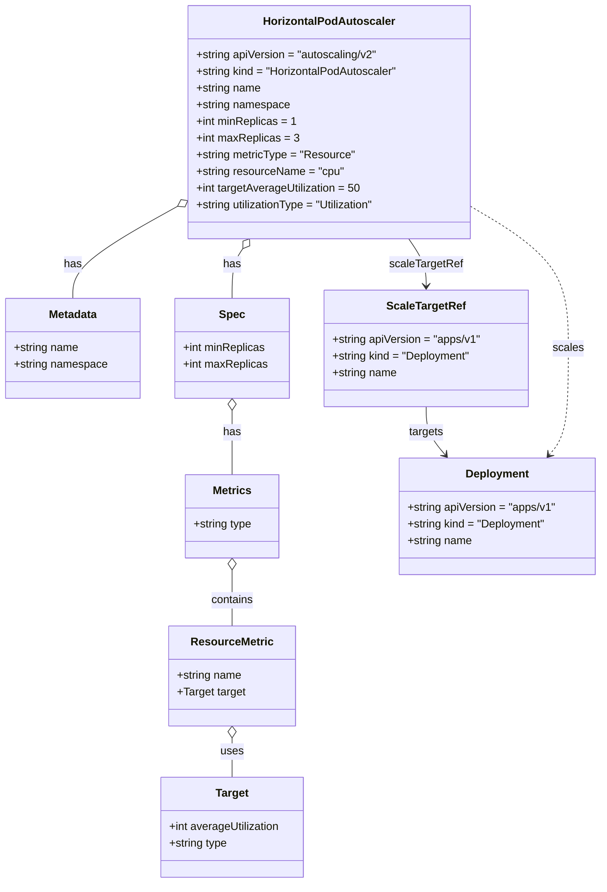

# Diagram: common/document_service/helm/templates/hpa.yaml

> Auto-generated by Obscura crawlers

## Mermaid

### SVG

<svg id="container" width="868.142578125" xmlns="http://www.w3.org/2000/svg" class="classDiagram" height="1272" viewBox="0 0 868.142578125 1272" role="graphics-document document" aria-roledescription="class"><g><defs><marker id="container_class-aggregationStart" class="marker aggregation class" refX="18" refY="7" markerWidth="190" markerHeight="240" orient="auto"><path d="M 18,7 L9,13 L1,7 L9,1 Z"></path></marker></defs><defs><marker id="container_class-aggregationEnd" class="marker aggregation class" refX="1" refY="7" markerWidth="20" markerHeight="28" orient="auto"><path d="M 18,7 L9,13 L1,7 L9,1 Z"></path></marker></defs><defs><marker id="container_class-extensionStart" class="marker extension class" refX="18" refY="7" markerWidth="190" markerHeight="240" orient="auto"><path d="M 1,7 L18,13 V 1 Z"></path></marker></defs><defs><marker id="container_class-extensionEnd" class="marker extension class" refX="1" refY="7" markerWidth="20" markerHeight="28" orient="auto"><path d="M 1,1 V 13 L18,7 Z"></path></marker></defs><defs><marker id="container_class-compositionStart" class="marker composition class" refX="18" refY="7" markerWidth="190" markerHeight="240" orient="auto"><path d="M 18,7 L9,13 L1,7 L9,1 Z"></path></marker></defs><defs><marker id="container_class-compositionEnd" class="marker composition class" refX="1" refY="7" markerWidth="20" markerHeight="28" orient="auto"><path d="M 18,7 L9,13 L1,7 L9,1 Z"></path></marker></defs><defs><marker id="container_class-dependencyStart" class="marker dependency class" refX="6" refY="7" markerWidth="190" markerHeight="240" orient="auto"><path d="M 5,7 L9,13 L1,7 L9,1 Z"></path></marker></defs><defs><marker id="container_class-dependencyEnd" class="marker dependency class" refX="13" refY="7" markerWidth="20" markerHeight="28" orient="auto"><path d="M 18,7 L9,13 L14,7 L9,1 Z"></path></marker></defs><defs><marker id="container_class-lollipopStart" class="marker lollipop class" refX="13" refY="7" markerWidth="190" markerHeight="240" orient="auto"><circle stroke="black" fill="transparent" cx="7" cy="7" r="6"></circle></marker></defs><defs><marker id="container_class-lollipopEnd" class="marker lollipop class" refX="1" refY="7" markerWidth="190" markerHeight="240" orient="auto"><circle stroke="black" fill="transparent" cx="7" cy="7" r="6"></circle></marker></defs><g class="root"><g class="clusters"></g><g class="edgePaths"><path d="M254.949,297.93L230.006,311.775C205.062,325.62,155.176,353.31,130.232,375.322C105.289,397.333,105.289,413.667,105.289,421.833L105.289,430" id="id_HorizontalPodAutoscaler_Metadata_1" class="edge-thickness-normal edge-pattern-solid relation" style=";;;" data-edge="true" data-et="edge" data-id="id_HorizontalPodAutoscaler_Metadata_1" data-points="W3sieCI6MjcwLjAzMTI1LCJ5IjoyODkuNTU4ODQyNTA0OTQ0NTV9LHsieCI6MTA1LjI4OTA2MjUsInkiOjM4MX0seyJ4IjoxMDUuMjg5MDYyNSwieSI6NDMwfV0=" marker-start="url(#container_class-aggregationStart)"></path><path d="M350.141,358.244L347.55,362.037C344.96,365.83,339.779,373.415,337.188,385.374C334.598,397.333,334.598,413.667,334.598,421.833L334.598,430" id="id_HorizontalPodAutoscaler_Spec_2" class="edge-thickness-normal edge-pattern-solid relation" style=";;;" data-edge="true" data-et="edge" data-id="id_HorizontalPodAutoscaler_Spec_2" data-points="W3sieCI6MzU5Ljg3MDE3OTExNTg1MzY2LCJ5IjozNDR9LHsieCI6MzM0LjU5NzY1NjI1LCJ5IjozODF9LHsieCI6MzM0LjU5NzY1NjI1LCJ5Ijo0MzB9XQ==" marker-start="url(#container_class-aggregationStart)"></path><path d="M334.598,591.25L334.598,596.542C334.598,601.833,334.598,612.417,334.598,627.875C334.598,643.333,334.598,663.667,334.598,673.833L334.598,684" id="id_Spec_Metrics_3" class="edge-thickness-normal edge-pattern-solid relation" style=";;;" data-edge="true" data-et="edge" data-id="id_Spec_Metrics_3" data-points="W3sieCI6MzM0LjU5NzY1NjI1LCJ5Ijo1NzR9LHsieCI6MzM0LjU5NzY1NjI1LCJ5Ijo2MjN9LHsieCI6MzM0LjU5NzY1NjI1LCJ5Ijo2ODR9XQ==" marker-start="url(#container_class-aggregationStart)"></path><path d="M334.598,821.25L334.598,828.542C334.598,835.833,334.598,850.417,334.598,863.875C334.598,877.333,334.598,889.667,334.598,895.833L334.598,902" id="id_Metrics_ResourceMetric_4" class="edge-thickness-normal edge-pattern-solid relation" style=";;;" data-edge="true" data-et="edge" data-id="id_Metrics_ResourceMetric_4" data-points="W3sieCI6MzM0LjU5NzY1NjI1LCJ5Ijo4MDR9LHsieCI6MzM0LjU5NzY1NjI1LCJ5Ijo4NjV9LHsieCI6MzM0LjU5NzY1NjI1LCJ5Ijo5MDJ9XQ==" marker-start="url(#container_class-aggregationStart)"></path><path d="M334.598,1063.25L334.598,1066.542C334.598,1069.833,334.598,1076.417,334.598,1085.875C334.598,1095.333,334.598,1107.667,334.598,1113.833L334.598,1120" id="id_ResourceMetric_Target_5" class="edge-thickness-normal edge-pattern-solid relation" style=";;;" data-edge="true" data-et="edge" data-id="id_ResourceMetric_Target_5" data-points="W3sieCI6MzM0LjU5NzY1NjI1LCJ5IjoxMDQ2fSx7IngiOjMzNC41OTc2NTYyNSwieSI6MTA4M30seyJ4IjozMzQuNTk3NjU2MjUsInkiOjExMjB9XQ==" marker-start="url(#container_class-aggregationStart)"></path><path d="M589.372,344L593.584,350.167C597.796,356.333,606.22,368.667,610.432,380C614.645,391.333,614.645,401.667,614.645,406.833L614.645,412" id="id_HorizontalPodAutoscaler_ScaleTargetRef_6" class="edge-thickness-normal edge-pattern-solid relation" style=";;;" data-edge="true" data-et="edge" data-id="id_HorizontalPodAutoscaler_ScaleTargetRef_6" data-points="W3sieCI6NTg5LjM3MjAwODM4NDE0NjMsInkiOjM0NH0seyJ4Ijo2MTQuNjQ0NTMxMjUsInkiOjM4MX0seyJ4Ijo2MTQuNjQ0NTMxMjUsInkiOjQxOH1d" marker-end="url(#container_class-dependencyEnd)"></path><path d="M614.645,586L614.645,592.167C614.645,598.333,614.645,610.667,619.226,622.237C623.808,633.808,632.972,644.616,637.554,650.02L642.135,655.424" id="id_ScaleTargetRef_Deployment_7" class="edge-thickness-normal edge-pattern-solid relation" style=";;;" data-edge="true" data-et="edge" data-id="id_ScaleTargetRef_Deployment_7" data-points="W3sieCI6NjE0LjY0NDUzMTI1LCJ5Ijo1ODZ9LHsieCI6NjE0LjY0NDUzMTI1LCJ5Ijo2MjN9LHsieCI6NjQ2LjAxNTU3NjU3NTQxMzIsInkiOjY2MH1d" marker-end="url(#container_class-dependencyEnd)"></path><path d="M679.211,297.495L702.647,311.412C726.083,325.33,772.956,353.165,796.392,387.249C819.828,421.333,819.828,461.667,819.828,502C819.828,542.333,819.828,582.667,815.246,608.237C810.665,633.808,801.501,644.616,796.919,650.02L792.337,655.424" id="id_HorizontalPodAutoscaler_Deployment_8" class="edge-thickness-normal edge-pattern-dashed relation" style=";;;" data-edge="true" data-et="edge" data-id="id_HorizontalPodAutoscaler_Deployment_8" data-points="W3sieCI6Njc5LjIxMDkzNzUsInkiOjI5Ny40OTQ5NzAxODMyMDA3M30seyJ4Ijo4MTkuODI4MTI1LCJ5IjozODF9LHsieCI6ODE5LjgyODEyNSwieSI6NTAyfSx7IngiOjgxOS44MjgxMjUsInkiOjYyM30seyJ4Ijo3ODguNDU3MDc5Njc0NTg2OCwieSI6NjYwfV0=" marker-end="url(#container_class-dependencyEnd)"></path></g><g class="edgeLabels"><g class="edgeLabel" transform="translate(105.2890625, 381)"><g class="label" data-id="id_HorizontalPodAutoscaler_Metadata_1" transform="translate(-12.703125, -12)"><foreignObject width="25.40625" height="24">

has

</foreignObject></g></g><g class="edgeLabel" transform="translate(334.59765625, 381)"><g class="label" data-id="id_HorizontalPodAutoscaler_Spec_2" transform="translate(-12.703125, -12)"><foreignObject width="25.40625" height="24">

has

</foreignObject></g></g><g class="edgeLabel" transform="translate(334.59765625, 623)"><g class="label" data-id="id_Spec_Metrics_3" transform="translate(-12.703125, -12)"><foreignObject width="25.40625" height="24">

has

</foreignObject></g></g><g class="edgeLabel" transform="translate(334.59765625, 865)"><g class="label" data-id="id_Metrics_ResourceMetric_4" transform="translate(-30.890625, -12)"><foreignObject width="61.78125" height="24">

contains

</foreignObject></g></g><g class="edgeLabel" transform="translate(334.59765625, 1083)"><g class="label" data-id="id_ResourceMetric_Target_5" transform="translate(-16.4921875, -12)"><foreignObject width="32.984375" height="24">

uses

</foreignObject></g></g><g class="edgeLabel" transform="translate(614.64453125, 381)"><g class="label" data-id="id_HorizontalPodAutoscaler_ScaleTargetRef_6" transform="translate(-52.515625, -12)"><foreignObject width="105.03125" height="24">

scaleTargetRef

</foreignObject></g></g><g class="edgeLabel" transform="translate(614.64453125, 623)"><g class="label" data-id="id_ScaleTargetRef_Deployment_7" transform="translate(-25.171875, -12)"><foreignObject width="50.34375" height="24">

targets

</foreignObject></g></g><g class="edgeLabel" transform="translate(819.828125, 502)"><g class="label" data-id="id_HorizontalPodAutoscaler_Deployment_8" transform="translate(-22.15625, -12)"><foreignObject width="44.3125" height="24">

scales

</foreignObject></g></g></g><g class="nodes"><g class="node default" id="classId-HorizontalPodAutoscaler-0" transform="translate(474.62109375, 176)"><g class="basic label-container"><path d="M-204.58984375 -168 L204.58984375 -168 L204.58984375 168 L-204.58984375 168" stroke="none" stroke-width="0" fill="#ECECFF" style=""></path><path d="M-204.58984375 -168 C-83.82953959695514 -168, 36.93076455608971 -168, 204.58984375 -168 M-204.58984375 -168 C-55.69314879779844 -168, 93.20354615440311 -168, 204.58984375 -168 M204.58984375 -168 C204.58984375 -87.13994842782805, 204.58984375 -6.279896855656091, 204.58984375 168 M204.58984375 -168 C204.58984375 -56.417326711199664, 204.58984375 55.16534657760067, 204.58984375 168 M204.58984375 168 C122.20159250053887 168, 39.81334125107773 168, -204.58984375 168 M204.58984375 168 C63.386470938307355 168, -77.81690187338529 168, -204.58984375 168 M-204.58984375 168 C-204.58984375 74.57631324617363, -204.58984375 -18.847373507652748, -204.58984375 -168 M-204.58984375 168 C-204.58984375 56.17330675859358, -204.58984375 -55.653386482812834, -204.58984375 -168" stroke="#9370DB" stroke-width="1.3" fill="none" stroke-dasharray="0 0" style=""></path></g><g class="annotation-group text" transform="translate(0, -144)"></g><g class="label-group text" transform="translate(-90.8515625, -144)"><g class="label" style="font-weight: bolder" transform="translate(0,-12)"><foreignObject width="181.703125" height="24">

HorizontalPodAutoscaler

</foreignObject></g></g><g class="members-group text" transform="translate(-192.58984375, -96)"><g class="label" style="" transform="translate(0,-12)"><foreignObject width="266.375" height="24">

+string apiVersion = "autoscaling/v2"

</foreignObject></g><g class="label" style="" transform="translate(0,12)"><foreignObject width="294.328125" height="24">

+string kind = "HorizontalPodAutoscaler"

</foreignObject></g><g class="label" style="" transform="translate(0,36)"><foreignObject width="94.375" height="24">

+string name

</foreignObject></g><g class="label" style="" transform="translate(0,60)"><foreignObject width="135.9375" height="24">

+string namespace

</foreignObject></g><g class="label" style="" transform="translate(0,84)"><foreignObject width="143.265625" height="24">

+int minReplicas = 1

</foreignObject></g><g class="label" style="" transform="translate(0,108)"><foreignObject width="146.90625" height="24">

+int maxReplicas = 3

</foreignObject></g><g class="label" style="" transform="translate(0,132)"><foreignObject width="229.25" height="24">

+string metricType = "Resource"

</foreignObject></g><g class="label" style="" transform="translate(0,156)"><foreignObject width="213.765625" height="24">

+string resourceName = "cpu"

</foreignObject></g><g class="label" style="" transform="translate(0,180)"><foreignObject width="239.375" height="24">

+int targetAverageUtilization = 50

</foreignObject></g><g class="label" style="" transform="translate(0,204)"><foreignObject width="264.484375" height="24">

+string utilizationType = "Utilization"

</foreignObject></g></g><g class="methods-group text" transform="translate(-192.58984375, 168)"></g><g class="divider" style=""><path d="M-204.58984375 -120 C-113.44290937887399 -120, -22.295975007747984 -120, 204.58984375 -120 M-204.58984375 -120 C-86.62934996659448 -120, 31.33114381681105 -120, 204.58984375 -120" stroke="#9370DB" stroke-width="1.3" fill="none" stroke-dasharray="0 0" style=""></path></g><g class="divider" style=""><path d="M-204.58984375 144 C-86.1744497091757 144, 32.24094433164859 144, 204.58984375 144 M-204.58984375 144 C-53.13282774288186 144, 98.32418826423628 144, 204.58984375 144" stroke="#9370DB" stroke-width="1.3" fill="none" stroke-dasharray="0 0" style=""></path></g></g><g class="node default" id="classId-Metadata-1" transform="translate(105.2890625, 502)"><g class="basic label-container"><path d="M-97.2890625 -72 L97.2890625 -72 L97.2890625 72 L-97.2890625 72" stroke="none" stroke-width="0" fill="#ECECFF" style=""></path><path d="M-97.2890625 -72 C-57.61010421288363 -72, -17.931145925767254 -72, 97.2890625 -72 M-97.2890625 -72 C-41.36319028135413 -72, 14.562681937291742 -72, 97.2890625 -72 M97.2890625 -72 C97.2890625 -19.82885997225835, 97.2890625 32.3422800554833, 97.2890625 72 M97.2890625 -72 C97.2890625 -26.11067461124054, 97.2890625 19.77865077751892, 97.2890625 72 M97.2890625 72 C30.526742375100042 72, -36.235577749799916 72, -97.2890625 72 M97.2890625 72 C52.42348912982722 72, 7.557915759654435 72, -97.2890625 72 M-97.2890625 72 C-97.2890625 20.693334117289666, -97.2890625 -30.613331765420668, -97.2890625 -72 M-97.2890625 72 C-97.2890625 27.31471622172709, -97.2890625 -17.370567556545822, -97.2890625 -72" stroke="#9370DB" stroke-width="1.3" fill="none" stroke-dasharray="0 0" style=""></path></g><g class="annotation-group text" transform="translate(0, -48)"></g><g class="label-group text" transform="translate(-34.640625, -48)"><g class="label" style="font-weight: bolder" transform="translate(0,-12)"><foreignObject width="69.28125" height="24">

Metadata

</foreignObject></g></g><g class="members-group text" transform="translate(-85.2890625, 0)"><g class="label" style="" transform="translate(0,-12)"><foreignObject width="94.375" height="24">

+string name

</foreignObject></g><g class="label" style="" transform="translate(0,12)"><foreignObject width="135.9375" height="24">

+string namespace

</foreignObject></g></g><g class="methods-group text" transform="translate(-85.2890625, 72)"></g><g class="divider" style=""><path d="M-97.2890625 -24 C-43.780120931678 -24, 9.728820636644002 -24, 97.2890625 -24 M-97.2890625 -24 C-49.04764953801076 -24, -0.8062365760215187 -24, 97.2890625 -24" stroke="#9370DB" stroke-width="1.3" fill="none" stroke-dasharray="0 0" style=""></path></g><g class="divider" style=""><path d="M-97.2890625 48 C-23.803002543015026 48, 49.68305741396995 48, 97.2890625 48 M-97.2890625 48 C-27.7176380679292 48, 41.8537863641416 48, 97.2890625 48" stroke="#9370DB" stroke-width="1.3" fill="none" stroke-dasharray="0 0" style=""></path></g></g><g class="node default" id="classId-Spec-2" transform="translate(334.59765625, 502)"><g class="basic label-container"><path d="M-82.01953125 -72 L82.01953125 -72 L82.01953125 72 L-82.01953125 72" stroke="none" stroke-width="0" fill="#ECECFF" style=""></path><path d="M-82.01953125 -72 C-34.94341606360138 -72, 12.132699122797234 -72, 82.01953125 -72 M-82.01953125 -72 C-17.296101487765426 -72, 47.42732827446915 -72, 82.01953125 -72 M82.01953125 -72 C82.01953125 -40.90505328250984, 82.01953125 -9.81010656501968, 82.01953125 72 M82.01953125 -72 C82.01953125 -24.793271114207414, 82.01953125 22.413457771585172, 82.01953125 72 M82.01953125 72 C28.999843703908468 72, -24.019843842183064 72, -82.01953125 72 M82.01953125 72 C26.096417437614065 72, -29.82669637477187 72, -82.01953125 72 M-82.01953125 72 C-82.01953125 39.860322089390074, -82.01953125 7.720644178780148, -82.01953125 -72 M-82.01953125 72 C-82.01953125 36.94876344963602, -82.01953125 1.8975268992720373, -82.01953125 -72" stroke="#9370DB" stroke-width="1.3" fill="none" stroke-dasharray="0 0" style=""></path></g><g class="annotation-group text" transform="translate(0, -48)"></g><g class="label-group text" transform="translate(-17.6015625, -48)"><g class="label" style="font-weight: bolder" transform="translate(0,-12)"><foreignObject width="35.203125" height="24">

Spec

</foreignObject></g></g><g class="members-group text" transform="translate(-70.01953125, 0)"><g class="label" style="" transform="translate(0,-12)"><foreignObject width="119.859375" height="24">

+int minReplicas

</foreignObject></g><g class="label" style="" transform="translate(0,12)"><foreignObject width="122.4375" height="24">

+int maxReplicas

</foreignObject></g></g><g class="methods-group text" transform="translate(-70.01953125, 72)"></g><g class="divider" style=""><path d="M-82.01953125 -24 C-46.50241148357815 -24, -10.9852917171563 -24, 82.01953125 -24 M-82.01953125 -24 C-18.23452086718666 -24, 45.55048951562668 -24, 82.01953125 -24" stroke="#9370DB" stroke-width="1.3" fill="none" stroke-dasharray="0 0" style=""></path></g><g class="divider" style=""><path d="M-82.01953125 48 C-36.983856072371786 48, 8.051819105256428 48, 82.01953125 48 M-82.01953125 48 C-32.02548841680052 48, 17.96855441639896 48, 82.01953125 48" stroke="#9370DB" stroke-width="1.3" fill="none" stroke-dasharray="0 0" style=""></path></g></g><g class="node default" id="classId-Metrics-3" transform="translate(334.59765625, 744)"><g class="basic label-container"><path d="M-68.3046875 -60 L68.3046875 -60 L68.3046875 60 L-68.3046875 60" stroke="none" stroke-width="0" fill="#ECECFF" style=""></path><path d="M-68.3046875 -60 C-36.18121612669863 -60, -4.057744753397259 -60, 68.3046875 -60 M-68.3046875 -60 C-40.39520934239805 -60, -12.485731184796087 -60, 68.3046875 -60 M68.3046875 -60 C68.3046875 -12.474883198312881, 68.3046875 35.05023360337424, 68.3046875 60 M68.3046875 -60 C68.3046875 -17.887204765087965, 68.3046875 24.22559046982407, 68.3046875 60 M68.3046875 60 C36.09972346661195 60, 3.8947594332238964 60, -68.3046875 60 M68.3046875 60 C26.38022190852916 60, -15.544243682941683 60, -68.3046875 60 M-68.3046875 60 C-68.3046875 28.448694544793256, -68.3046875 -3.102610910413489, -68.3046875 -60 M-68.3046875 60 C-68.3046875 23.122216448151264, -68.3046875 -13.755567103697473, -68.3046875 -60" stroke="#9370DB" stroke-width="1.3" fill="none" stroke-dasharray="0 0" style=""></path></g><g class="annotation-group text" transform="translate(0, -36)"></g><g class="label-group text" transform="translate(-26.953125, -36)"><g class="label" style="font-weight: bolder" transform="translate(0,-12)"><foreignObject width="53.90625" height="24">

Metrics

</foreignObject></g></g><g class="members-group text" transform="translate(-56.3046875, 12)"><g class="label" style="" transform="translate(0,-12)"><foreignObject width="85.65625" height="24">

+string type

</foreignObject></g></g><g class="methods-group text" transform="translate(-56.3046875, 60)"></g><g class="divider" style=""><path d="M-68.3046875 -12 C-15.490722533242675 -12, 37.32324243351465 -12, 68.3046875 -12 M-68.3046875 -12 C-25.01917002994942 -12, 18.266347440101157 -12, 68.3046875 -12" stroke="#9370DB" stroke-width="1.3" fill="none" stroke-dasharray="0 0" style=""></path></g><g class="divider" style=""><path d="M-68.3046875 36 C-29.656174157765427 36, 8.992339184469145 36, 68.3046875 36 M-68.3046875 36 C-27.141865045245495 36, 14.020957409509009 36, 68.3046875 36" stroke="#9370DB" stroke-width="1.3" fill="none" stroke-dasharray="0 0" style=""></path></g></g><g class="node default" id="classId-ResourceMetric-4" transform="translate(334.59765625, 974)"><g class="basic label-container"><path d="M-89.73046875 -72 L89.73046875 -72 L89.73046875 72 L-89.73046875 72" stroke="none" stroke-width="0" fill="#ECECFF" style=""></path><path d="M-89.73046875 -72 C-28.042302247858856 -72, 33.64586425428229 -72, 89.73046875 -72 M-89.73046875 -72 C-42.47979924506304 -72, 4.7708702598739166 -72, 89.73046875 -72 M89.73046875 -72 C89.73046875 -32.569392352591166, 89.73046875 6.861215294817669, 89.73046875 72 M89.73046875 -72 C89.73046875 -42.99964789059924, 89.73046875 -13.999295781198484, 89.73046875 72 M89.73046875 72 C34.449520711895914 72, -20.83142732620817 72, -89.73046875 72 M89.73046875 72 C22.381464727673418 72, -44.967539294653164 72, -89.73046875 72 M-89.73046875 72 C-89.73046875 19.28197616897357, -89.73046875 -33.43604766205286, -89.73046875 -72 M-89.73046875 72 C-89.73046875 35.72801111432202, -89.73046875 -0.543977771355955, -89.73046875 -72" stroke="#9370DB" stroke-width="1.3" fill="none" stroke-dasharray="0 0" style=""></path></g><g class="annotation-group text" transform="translate(0, -48)"></g><g class="label-group text" transform="translate(-56.4921875, -48)"><g class="label" style="font-weight: bolder" transform="translate(0,-12)"><foreignObject width="112.984375" height="24">

ResourceMetric

</foreignObject></g></g><g class="members-group text" transform="translate(-77.73046875, 0)"><g class="label" style="" transform="translate(0,-12)"><foreignObject width="94.375" height="24">

+string name

</foreignObject></g><g class="label" style="" transform="translate(0,12)"><foreignObject width="98.96875" height="24">

+Target target

</foreignObject></g></g><g class="methods-group text" transform="translate(-77.73046875, 72)"></g><g class="divider" style=""><path d="M-89.73046875 -24 C-19.634767332089567 -24, 50.46093408582087 -24, 89.73046875 -24 M-89.73046875 -24 C-43.115382113782545 -24, 3.499704522434911 -24, 89.73046875 -24" stroke="#9370DB" stroke-width="1.3" fill="none" stroke-dasharray="0 0" style=""></path></g><g class="divider" style=""><path d="M-89.73046875 48 C-38.65867613550668 48, 12.413116478986638 48, 89.73046875 48 M-89.73046875 48 C-22.840867347312198 48, 44.048734055375604 48, 89.73046875 48" stroke="#9370DB" stroke-width="1.3" fill="none" stroke-dasharray="0 0" style=""></path></g></g><g class="node default" id="classId-Target-5" transform="translate(334.59765625, 1192)"><g class="basic label-container"><path d="M-104.765625 -72 L104.765625 -72 L104.765625 72 L-104.765625 72" stroke="none" stroke-width="0" fill="#ECECFF" style=""></path><path d="M-104.765625 -72 C-24.941452546121567 -72, 54.882719907756865 -72, 104.765625 -72 M-104.765625 -72 C-32.492479617410226 -72, 39.78066576517955 -72, 104.765625 -72 M104.765625 -72 C104.765625 -14.896049788779848, 104.765625 42.207900422440304, 104.765625 72 M104.765625 -72 C104.765625 -35.85531404887644, 104.765625 0.28937190224712594, 104.765625 72 M104.765625 72 C52.99332605327713 72, 1.22102710655426 72, -104.765625 72 M104.765625 72 C55.675503621985854 72, 6.585382243971708 72, -104.765625 72 M-104.765625 72 C-104.765625 32.66867753933738, -104.765625 -6.662644921325239, -104.765625 -72 M-104.765625 72 C-104.765625 41.29265041988166, -104.765625 10.58530083976332, -104.765625 -72" stroke="#9370DB" stroke-width="1.3" fill="none" stroke-dasharray="0 0" style=""></path></g><g class="annotation-group text" transform="translate(0, -48)"></g><g class="label-group text" transform="translate(-23.15625, -48)"><g class="label" style="font-weight: bolder" transform="translate(0,-12)"><foreignObject width="46.3125" height="24">

Target

</foreignObject></g></g><g class="members-group text" transform="translate(-92.765625, 0)"><g class="label" style="" transform="translate(0,-12)"><foreignObject width="162.375" height="24">

+int averageUtilization

</foreignObject></g><g class="label" style="" transform="translate(0,12)"><foreignObject width="85.65625" height="24">

+string type

</foreignObject></g></g><g class="methods-group text" transform="translate(-92.765625, 72)"></g><g class="divider" style=""><path d="M-104.765625 -24 C-43.61797812665062 -24, 17.52966874669876 -24, 104.765625 -24 M-104.765625 -24 C-34.593708106672935 -24, 35.57820878665413 -24, 104.765625 -24" stroke="#9370DB" stroke-width="1.3" fill="none" stroke-dasharray="0 0" style=""></path></g><g class="divider" style=""><path d="M-104.765625 48 C-21.565888238924146 48, 61.63384852215171 48, 104.765625 48 M-104.765625 48 C-44.8896118853547 48, 14.986401229290607 48, 104.765625 48" stroke="#9370DB" stroke-width="1.3" fill="none" stroke-dasharray="0 0" style=""></path></g></g><g class="node default" id="classId-ScaleTargetRef-6" transform="translate(614.64453125, 502)"><g class="basic label-container"><path d="M-148.02734375 -84 L148.02734375 -84 L148.02734375 84 L-148.02734375 84" stroke="none" stroke-width="0" fill="#ECECFF" style=""></path><path d="M-148.02734375 -84 C-55.221375249854376 -84, 37.58459325029125 -84, 148.02734375 -84 M-148.02734375 -84 C-55.69623088343852 -84, 36.634881983122966 -84, 148.02734375 -84 M148.02734375 -84 C148.02734375 -42.42543397011803, 148.02734375 -0.850867940236057, 148.02734375 84 M148.02734375 -84 C148.02734375 -30.245695783164706, 148.02734375 23.508608433670588, 148.02734375 84 M148.02734375 84 C84.59042608842475 84, 21.1535084268495 84, -148.02734375 84 M148.02734375 84 C43.875356792972596 84, -60.27663016405481 84, -148.02734375 84 M-148.02734375 84 C-148.02734375 20.52353949216382, -148.02734375 -42.95292101567236, -148.02734375 -84 M-148.02734375 84 C-148.02734375 40.83166580288712, -148.02734375 -2.336668394225754, -148.02734375 -84" stroke="#9370DB" stroke-width="1.3" fill="none" stroke-dasharray="0 0" style=""></path></g><g class="annotation-group text" transform="translate(0, -60)"></g><g class="label-group text" transform="translate(-54.6171875, -60)"><g class="label" style="font-weight: bolder" transform="translate(0,-12)"><foreignObject width="109.234375" height="24">

ScaleTargetRef

</foreignObject></g></g><g class="members-group text" transform="translate(-136.02734375, -12)"><g class="label" style="" transform="translate(0,-12)"><foreignObject width="217.4375" height="24">

+string apiVersion = "apps/v1"

</foreignObject></g><g class="label" style="" transform="translate(0,12)"><foreignObject width="202.390625" height="24">

+string kind = "Deployment"

</foreignObject></g><g class="label" style="" transform="translate(0,36)"><foreignObject width="94.375" height="24">

+string name

</foreignObject></g></g><g class="methods-group text" transform="translate(-136.02734375, 84)"></g><g class="divider" style=""><path d="M-148.02734375 -36 C-76.20898796799389 -36, -4.3906321859877835 -36, 148.02734375 -36 M-148.02734375 -36 C-68.25694994059796 -36, 11.513443868804075 -36, 148.02734375 -36" stroke="#9370DB" stroke-width="1.3" fill="none" stroke-dasharray="0 0" style=""></path></g><g class="divider" style=""><path d="M-148.02734375 60 C-77.43724290994473 60, -6.847142069889458 60, 148.02734375 60 M-148.02734375 60 C-79.75732152398942 60, -11.487299297978836 60, 148.02734375 60" stroke="#9370DB" stroke-width="1.3" fill="none" stroke-dasharray="0 0" style=""></path></g></g><g class="node default" id="classId-Deployment-7" transform="translate(717.236328125, 744)"><g class="basic label-container"><path d="M-142.90625 -84 L142.90625 -84 L142.90625 84 L-142.90625 84" stroke="none" stroke-width="0" fill="#ECECFF" style=""></path><path d="M-142.90625 -84 C-60.1779649541203 -84, 22.550320091759403 -84, 142.90625 -84 M-142.90625 -84 C-68.23998270234657 -84, 6.426284595306868 -84, 142.90625 -84 M142.90625 -84 C142.90625 -33.38807358391769, 142.90625 17.223852832164624, 142.90625 84 M142.90625 -84 C142.90625 -23.95961605367968, 142.90625 36.08076789264064, 142.90625 84 M142.90625 84 C62.85499985914622 84, -17.196250281707563 84, -142.90625 84 M142.90625 84 C81.2100205512022 84, 19.513791102404397 84, -142.90625 84 M-142.90625 84 C-142.90625 31.292393787032232, -142.90625 -21.415212425935536, -142.90625 -84 M-142.90625 84 C-142.90625 34.68510389817942, -142.90625 -14.62979220364116, -142.90625 -84" stroke="#9370DB" stroke-width="1.3" fill="none" stroke-dasharray="0 0" style=""></path></g><g class="annotation-group text" transform="translate(0, -60)"></g><g class="label-group text" transform="translate(-44.375, -60)"><g class="label" style="font-weight: bolder" transform="translate(0,-12)"><foreignObject width="88.75" height="24">

Deployment

</foreignObject></g></g><g class="members-group text" transform="translate(-130.90625, -12)"><g class="label" style="" transform="translate(0,-12)"><foreignObject width="217.4375" height="24">

+string apiVersion = "apps/v1"

</foreignObject></g><g class="label" style="" transform="translate(0,12)"><foreignObject width="202.390625" height="24">

+string kind = "Deployment"

</foreignObject></g><g class="label" style="" transform="translate(0,36)"><foreignObject width="94.375" height="24">

+string name

</foreignObject></g></g><g class="methods-group text" transform="translate(-130.90625, 84)"></g><g class="divider" style=""><path d="M-142.90625 -36 C-80.25824879226863 -36, -17.610247584537277 -36, 142.90625 -36 M-142.90625 -36 C-53.3451593123542 -36, 36.2159313752916 -36, 142.90625 -36" stroke="#9370DB" stroke-width="1.3" fill="none" stroke-dasharray="0 0" style=""></path></g><g class="divider" style=""><path d="M-142.90625 60 C-64.36474245650703 60, 14.176765086985938 60, 142.90625 60 M-142.90625 60 C-75.2879957371251 60, -7.669741474250202 60, 142.90625 60" stroke="#9370DB" stroke-width="1.3" fill="none" stroke-dasharray="0 0" style=""></path></g></g></g></g></g></svg>
