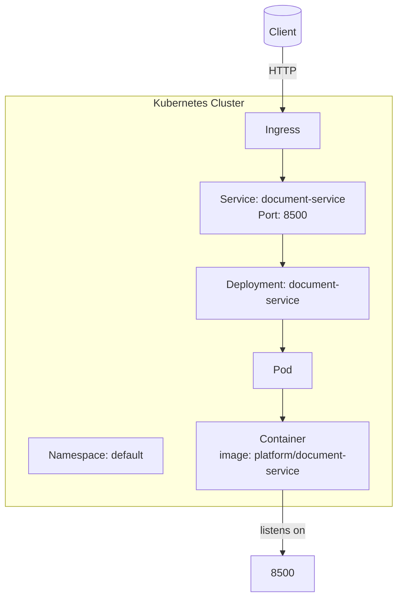

# Diagram: common/document_service/helm/values.yaml

> Auto-generated by Obscura crawlers

## Mermaid

### SVG

<svg id="container" width="599.5" xmlns="http://www.w3.org/2000/svg" class="flowchart" height="896.45361328125" viewBox="0 0.0000019073486328125 599.5 896.45361328125" role="graphics-document document" aria-roledescription="flowchart-v2"><g><marker id="container_flowchart-v2-pointEnd" class="marker flowchart-v2" viewBox="0 0 10 10" refX="5" refY="5" markerUnits="userSpaceOnUse" markerWidth="8" markerHeight="8" orient="auto"><path d="M 0 0 L 10 5 L 0 10 z" class="arrowMarkerPath" style="stroke-width: 1; stroke-dasharray: 1, 0;"></path></marker><marker id="container_flowchart-v2-pointStart" class="marker flowchart-v2" viewBox="0 0 10 10" refX="4.5" refY="5" markerUnits="userSpaceOnUse" markerWidth="8" markerHeight="8" orient="auto"><path d="M 0 5 L 10 10 L 10 0 z" class="arrowMarkerPath" style="stroke-width: 1; stroke-dasharray: 1, 0;"></path></marker><marker id="container_flowchart-v2-circleEnd" class="marker flowchart-v2" viewBox="0 0 10 10" refX="11" refY="5" markerUnits="userSpaceOnUse" markerWidth="11" markerHeight="11" orient="auto"><circle cx="5" cy="5" r="5" class="arrowMarkerPath" style="stroke-width: 1; stroke-dasharray: 1, 0;"></circle></marker><marker id="container_flowchart-v2-circleStart" class="marker flowchart-v2" viewBox="0 0 10 10" refX="-1" refY="5" markerUnits="userSpaceOnUse" markerWidth="11" markerHeight="11" orient="auto"><circle cx="5" cy="5" r="5" class="arrowMarkerPath" style="stroke-width: 1; stroke-dasharray: 1, 0;"></circle></marker><marker id="container_flowchart-v2-crossEnd" class="marker cross flowchart-v2" viewBox="0 0 11 11" refX="12" refY="5.2" markerUnits="userSpaceOnUse" markerWidth="11" markerHeight="11" orient="auto"><path d="M 1,1 l 9,9 M 10,1 l -9,9" class="arrowMarkerPath" style="stroke-width: 2; stroke-dasharray: 1, 0;"></path></marker><marker id="container_flowchart-v2-crossStart" class="marker cross flowchart-v2" viewBox="0 0 11 11" refX="-1" refY="5.2" markerUnits="userSpaceOnUse" markerWidth="11" markerHeight="11" orient="auto"><path d="M 1,1 l 9,9 M 10,1 l -9,9" class="arrowMarkerPath" style="stroke-width: 2; stroke-dasharray: 1, 0;"></path></marker><g class="root"><g class="clusters"><g class="cluster" id="subGraph0" data-look="classic"><rect style="" x="8" y="144.45361709594727" width="583.5" height="616"></rect><g class="cluster-label" transform="translate(230.8671875, 144.45361709594727)"><foreignObject width="137.765625" height="24">

Kubernetes Cluster

</foreignObject></g></g></g><g class="edgePaths"><path d="M426.5,70.454L426.5,76.62C426.5,82.787,426.5,95.12,426.5,107.454C426.5,119.787,426.5,132.12,426.5,141.787C426.5,151.454,426.5,158.454,426.5,161.954L426.5,165.454" id="L_external_ing_0" class="edge-thickness-normal edge-pattern-solid edge-thickness-normal edge-pattern-solid flowchart-link" style=";" data-edge="true" data-et="edge" data-id="L_external_ing_0" data-points="W3sieCI6NDI2LjUsInkiOjcwLjQ1MzYxNzA5NTk0NzI3fSx7IngiOjQyNi41LCJ5IjoxMDcuNDUzNjE3MDk1OTQ3Mjd9LHsieCI6NDI2LjUsInkiOjE0NC40NTM2MTcwOTU5NDcyN30seyJ4Ijo0MjYuNSwieSI6MTY5LjQ1MzYxNzA5NTk0NzI3fV0=" marker-end="url(#container_flowchart-v2-pointEnd)"></path><path d="M426.5,223.454L426.5,227.62C426.5,231.787,426.5,240.12,426.5,247.787C426.5,255.454,426.5,262.454,426.5,265.954L426.5,269.454" id="L_ing_svc_0" class="edge-thickness-normal edge-pattern-solid edge-thickness-normal edge-pattern-solid flowchart-link" style=";" data-edge="true" data-et="edge" data-id="L_ing_svc_0" data-points="W3sieCI6NDI2LjUsInkiOjIyMy40NTM2MTcwOTU5NDcyN30seyJ4Ijo0MjYuNSwieSI6MjQ4LjQ1MzYxNzA5NTk0NzI3fSx7IngiOjQyNi41LCJ5IjoyNzMuNDUzNjE3MDk1OTQ3Mjd9XQ==" marker-end="url(#container_flowchart-v2-pointEnd)"></path><path d="M426.5,351.454L426.5,355.62C426.5,359.787,426.5,368.12,426.5,375.787C426.5,383.454,426.5,390.454,426.5,393.954L426.5,397.454" id="L_svc_deploy_0" class="edge-thickness-normal edge-pattern-solid edge-thickness-normal edge-pattern-solid flowchart-link" style=";" data-edge="true" data-et="edge" data-id="L_svc_deploy_0" data-points="W3sieCI6NDI2LjUsInkiOjM1MS40NTM2MTcwOTU5NDcyN30seyJ4Ijo0MjYuNSwieSI6Mzc2LjQ1MzYxNzA5NTk0NzI3fSx7IngiOjQyNi41LCJ5Ijo0MDEuNDUzNjE3MDk1OTQ3Mjd9XQ==" marker-end="url(#container_flowchart-v2-pointEnd)"></path><path d="M426.5,479.454L426.5,483.62C426.5,487.787,426.5,496.12,426.5,503.787C426.5,511.454,426.5,518.454,426.5,521.954L426.5,525.454" id="L_deploy_pod_0" class="edge-thickness-normal edge-pattern-solid edge-thickness-normal edge-pattern-solid flowchart-link" style=";" data-edge="true" data-et="edge" data-id="L_deploy_pod_0" data-points="W3sieCI6NDI2LjUsInkiOjQ3OS40NTM2MTcwOTU5NDcyN30seyJ4Ijo0MjYuNSwieSI6NTA0LjQ1MzYxNzA5NTk0NzI3fSx7IngiOjQyNi41LCJ5Ijo1MjkuNDUzNjE3MDk1OTQ3M31d" marker-end="url(#container_flowchart-v2-pointEnd)"></path><path d="M426.5,583.454L426.5,587.62C426.5,591.787,426.5,600.12,426.5,607.787C426.5,615.454,426.5,622.454,426.5,625.954L426.5,629.454" id="L_pod_container_0" class="edge-thickness-normal edge-pattern-solid edge-thickness-normal edge-pattern-solid flowchart-link" style=";" data-edge="true" data-et="edge" data-id="L_pod_container_0" data-points="W3sieCI6NDI2LjUsInkiOjU4My40NTM2MTcwOTU5NDczfSx7IngiOjQyNi41LCJ5Ijo2MDguNDUzNjE3MDk1OTQ3M30seyJ4Ijo0MjYuNSwieSI6NjMzLjQ1MzYxNzA5NTk0NzN9XQ==" marker-end="url(#container_flowchart-v2-pointEnd)"></path><path d="M426.5,735.454L426.5,739.62C426.5,743.787,426.5,752.12,426.5,762.454C426.5,772.787,426.5,785.12,426.5,796.787C426.5,808.454,426.5,819.454,426.5,824.954L426.5,830.454" id="L_container_svc_port_0" class="edge-thickness-normal edge-pattern-solid edge-thickness-normal edge-pattern-solid flowchart-link" style=";" data-edge="true" data-et="edge" data-id="L_container_svc_port_0" data-points="W3sieCI6NDI2LjUsInkiOjczNS40NTM2MTcwOTU5NDczfSx7IngiOjQyNi41LCJ5Ijo3NjAuNDUzNjE3MDk1OTQ3M30seyJ4Ijo0MjYuNSwieSI6Nzk3LjQ1MzYxNzA5NTk0NzN9LHsieCI6NDI2LjUsInkiOjgzNC40NTM2MTcwOTU5NDczfV0=" marker-end="url(#container_flowchart-v2-pointEnd)"></path></g><g class="edgeLabels"><g class="edgeLabel" transform="translate(426.5, 107.45361709594727)"><g class="label" data-id="L_external_ing_0" transform="translate(-18.3671875, -12)"><foreignObject width="36.734375" height="24">

HTTP

</foreignObject></g></g><g class="edgeLabel"><g class="label" data-id="L_ing_svc_0" transform="translate(0, 0)"><foreignObject width="0" height="0">

</foreignObject></g></g><g class="edgeLabel"><g class="label" data-id="L_svc_deploy_0" transform="translate(0, 0)"><foreignObject width="0" height="0">

</foreignObject></g></g><g class="edgeLabel"><g class="label" data-id="L_deploy_pod_0" transform="translate(0, 0)"><foreignObject width="0" height="0">

</foreignObject></g></g><g class="edgeLabel"><g class="label" data-id="L_pod_container_0" transform="translate(0, 0)"><foreignObject width="0" height="0">

</foreignObject></g></g><g class="edgeLabel" transform="translate(426.5, 797.4536170959473)"><g class="label" data-id="L_container_svc_port_0" transform="translate(-35.375, -12)"><foreignObject width="70.75" height="24">

listens on

</foreignObject></g></g></g><g class="nodes"><g class="node default" id="flowchart-ns-0" transform="translate(144.75, 684.4536170959473)"><rect class="basic label-container" style="" x="-101.75" y="-27" width="203.5" height="54"></rect><g class="label" style="" transform="translate(-71.75, -12)"><rect></rect><foreignObject width="143.5" height="24">

Namespace: default

</foreignObject></g></g><g class="node default" id="flowchart-ing-1" transform="translate(426.5, 196.45361709594727)"><rect class="basic label-container" style="" x="-55.8125" y="-27" width="111.625" height="54"></rect><g class="label" style="" transform="translate(-25.8125, -12)"><rect></rect><foreignObject width="51.625" height="24">

Ingress

</foreignObject></g></g><g class="node default" id="flowchart-svc-2" transform="translate(426.5, 312.45361709594727)"><rect class="basic label-container" style="" x="-130" y="-39" width="260" height="78"></rect><g class="label" style="" transform="translate(-100, -24)"><rect></rect><foreignObject width="200" height="48">

Service: document-service\nPort: 8500

</foreignObject></g></g><g class="node default" id="flowchart-deploy-3" transform="translate(426.5, 440.45361709594727)"><rect class="basic label-container" style="" x="-130" y="-39" width="260" height="78"></rect><g class="label" style="" transform="translate(-100, -24)"><rect></rect><foreignObject width="200" height="48">

Deployment: document-service

</foreignObject></g></g><g class="node default" id="flowchart-pod-4" transform="translate(426.5, 556.4536170959473)"><rect class="basic label-container" style="" x="-43.8671875" y="-27" width="87.734375" height="54"></rect><g class="label" style="" transform="translate(-13.8671875, -12)"><rect></rect><foreignObject width="27.734375" height="24">

Pod

</foreignObject></g></g><g class="node default" id="flowchart-container-5" transform="translate(426.5, 684.4536170959473)"><rect class="basic label-container" style="" x="-130" y="-51" width="260" height="102"></rect><g class="label" style="" transform="translate(-100, -36)"><rect></rect><foreignObject width="200" height="72">

Container\nimage: platform/document-service

</foreignObject></g></g><g class="node default" id="flowchart-external-6" transform="translate(426.5, 39.22680854797363)"><path d="M0,7.81786941580756 a28.4375,7.81786941580756 0,0,0 56.875,0 a28.4375,7.81786941580756 0,0,0 -56.875,0 l0,46.817869415807564 a28.4375,7.81786941580756 0,0,0 56.875,0 l0,-46.817869415807564" class="basic label-container" style="" transform="translate(-28.4375, -31.226804123711343)"></path><g class="label" style="" transform="translate(-20.9375, -2)"><rect></rect><foreignObject width="41.875" height="24">

Client

</foreignObject></g></g><g class="node default" id="flowchart-svc_port-18" transform="translate(426.5, 861.4536170959473)"><rect class="basic label-container" style="" x="-47.3515625" y="-27" width="94.703125" height="54"></rect><g class="label" style="" transform="translate(-17.3515625, -12)"><rect></rect><foreignObject width="34.703125" height="24">

8500

</foreignObject></g></g></g></g></g></svg>
