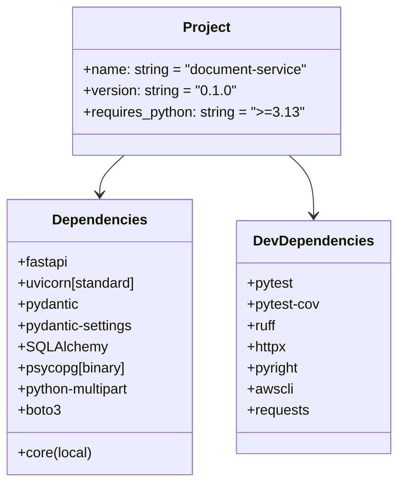
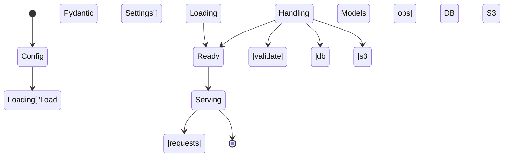

# Diagram: common/document_service/pyproject.toml


> Auto-generated by Obscura crawlers

## Diagram 1

```mermaid
flowchart LR
  App[FastAPI App\n(document-service)] -->|runs with| Uvicorn[Uvicorn (server)]
  App --> Endpoints[HTTP Endpoints\n(file upload, metadata)]
  App --> Settings[Pydantic Settings\n(pydantic-settings)]
  Endpoints -->|validate| Models[Pydantic Models]
  Endpoints -->|store/retrieve| Storage[S3 via boto3]
  Endpoints -->|persist| DB[Postgres via SQLAlchemy\n(psycopg)]
  App --> CoreLib[Core (local file://../../shared/core)]
  CoreLib -->|provides| Auth[Auth/Domain Logic]
  Storage -->|multipart| Multipart[python-multipart]
  DB -->|SQL| Migrations[Migrations / ORM]
  Uvicorn -->|worker| App
```

> SVG rendering failed for this diagram.

## Diagram 2



### SVG

<svg id="container" width="450.9921875" xmlns="http://www.w3.org/2000/svg" class="classDiagram" height="546" viewBox="0 0 450.9921875 546" role="graphics-document document" aria-roledescription="class"><style>#container{font-family:"trebuchet ms",verdana,arial,sans-serif;font-size:16px;fill:#333;}@keyframes edge-animation-frame{from{stroke-dashoffset:0;}}@keyframes dash{to{stroke-dashoffset:0;}}#container .edge-animation-slow{stroke-dasharray:9,5!important;stroke-dashoffset:900;animation:dash 50s linear infinite;stroke-linecap:round;}#container .edge-animation-fast{stroke-dasharray:9,5!important;stroke-dashoffset:900;animation:dash 20s linear infinite;stroke-linecap:round;}#container .error-icon{fill:#552222;}#container .error-text{fill:#552222;stroke:#552222;}#container .edge-thickness-normal{stroke-width:1px;}#container .edge-thickness-thick{stroke-width:3.5px;}#container .edge-pattern-solid{stroke-dasharray:0;}#container .edge-thickness-invisible{stroke-width:0;fill:none;}#container .edge-pattern-dashed{stroke-dasharray:3;}#container .edge-pattern-dotted{stroke-dasharray:2;}#container .marker{fill:#333333;stroke:#333333;}#container .marker.cross{stroke:#333333;}#container svg{font-family:"trebuchet ms",verdana,arial,sans-serif;font-size:16px;}#container p{margin:0;}#container g.classGroup text{fill:#9370DB;stroke:none;font-family:"trebuchet ms",verdana,arial,sans-serif;font-size:10px;}#container g.classGroup text .title{font-weight:bolder;}#container .nodeLabel,#container .edgeLabel{color:#131300;}#container .edgeLabel .label rect{fill:#ECECFF;}#container .label text{fill:#131300;}#container .labelBkg{background:#ECECFF;}#container .edgeLabel .label span{background:#ECECFF;}#container .classTitle{font-weight:bolder;}#container .node rect,#container .node circle,#container .node ellipse,#container .node polygon,#container .node path{fill:#ECECFF;stroke:#9370DB;stroke-width:1px;}#container .divider{stroke:#9370DB;stroke-width:1;}#container g.clickable{cursor:pointer;}#container g.classGroup rect{fill:#ECECFF;stroke:#9370DB;}#container g.classGroup line{stroke:#9370DB;stroke-width:1;}#container .classLabel .box{stroke:none;stroke-width:0;fill:#ECECFF;opacity:0.5;}#container .classLabel .label{fill:#9370DB;font-size:10px;}#container .relation{stroke:#333333;stroke-width:1;fill:none;}#container .dashed-line{stroke-dasharray:3;}#container .dotted-line{stroke-dasharray:1 2;}#container #compositionStart,#container .composition{fill:#333333!important;stroke:#333333!important;stroke-width:1;}#container #compositionEnd,#container .composition{fill:#333333!important;stroke:#333333!important;stroke-width:1;}#container #dependencyStart,#container .dependency{fill:#333333!important;stroke:#333333!important;stroke-width:1;}#container #dependencyStart,#container .dependency{fill:#333333!important;stroke:#333333!important;stroke-width:1;}#container #extensionStart,#container .extension{fill:transparent!important;stroke:#333333!important;stroke-width:1;}#container #extensionEnd,#container .extension{fill:transparent!important;stroke:#333333!important;stroke-width:1;}#container #aggregationStart,#container .aggregation{fill:transparent!important;stroke:#333333!important;stroke-width:1;}#container #aggregationEnd,#container .aggregation{fill:transparent!important;stroke:#333333!important;stroke-width:1;}#container #lollipopStart,#container .lollipop{fill:#ECECFF!important;stroke:#333333!important;stroke-width:1;}#container #lollipopEnd,#container .lollipop{fill:#ECECFF!important;stroke:#333333!important;stroke-width:1;}#container .edgeTerminals{font-size:11px;line-height:initial;}#container .classTitleText{text-anchor:middle;font-size:18px;fill:#333;}#container .label-icon{display:inline-block;height:1em;overflow:visible;vertical-align:-0.125em;}#container .node .label-icon path{fill:currentColor;stroke:revert;stroke-width:revert;}#container :root{--mermaid-font-family:"trebuchet ms",verdana,arial,sans-serif;}</style><g><defs><marker id="container_class-aggregationStart" class="marker aggregation class" refX="18" refY="7" markerWidth="190" markerHeight="240" orient="auto"><path d="M 18,7 L9,13 L1,7 L9,1 Z"></path></marker></defs><defs><marker id="container_class-aggregationEnd" class="marker aggregation class" refX="1" refY="7" markerWidth="20" markerHeight="28" orient="auto"><path d="M 18,7 L9,13 L1,7 L9,1 Z"></path></marker></defs><defs><marker id="container_class-extensionStart" class="marker extension class" refX="18" refY="7" markerWidth="190" markerHeight="240" orient="auto"><path d="M 1,7 L18,13 V 1 Z"></path></marker></defs><defs><marker id="container_class-extensionEnd" class="marker extension class" refX="1" refY="7" markerWidth="20" markerHeight="28" orient="auto"><path d="M 1,1 V 13 L18,7 Z"></path></marker></defs><defs><marker id="container_class-compositionStart" class="marker composition class" refX="18" refY="7" markerWidth="190" markerHeight="240" orient="auto"><path d="M 18,7 L9,13 L1,7 L9,1 Z"></path></marker></defs><defs><marker id="container_class-compositionEnd" class="marker composition class" refX="1" refY="7" markerWidth="20" markerHeight="28" orient="auto"><path d="M 18,7 L9,13 L1,7 L9,1 Z"></path></marker></defs><defs><marker id="container_class-dependencyStart" class="marker dependency class" refX="6" refY="7" markerWidth="190" markerHeight="240" orient="auto"><path d="M 5,7 L9,13 L1,7 L9,1 Z"></path></marker></defs><defs><marker id="container_class-dependencyEnd" class="marker dependency class" refX="13" refY="7" markerWidth="20" markerHeight="28" orient="auto"><path d="M 18,7 L9,13 L14,7 L9,1 Z"></path></marker></defs><defs><marker id="container_class-lollipopStart" class="marker lollipop class" refX="13" refY="7" markerWidth="190" markerHeight="240" orient="auto"><circle stroke="black" fill="transparent" cx="7" cy="7" r="6"></circle></marker></defs><defs><marker id="container_class-lollipopEnd" class="marker lollipop class" refX="1" refY="7" markerWidth="190" markerHeight="240" orient="auto"><circle stroke="black" fill="transparent" cx="7" cy="7" r="6"></circle></marker></defs><g class="root"><g class="clusters"></g><g class="edgePaths"><path d="M142.11,176L137.475,180.167C132.84,184.333,123.571,192.667,118.936,200C114.301,207.333,114.301,213.667,114.301,216.833L114.301,220" id="id_Project_Dependencies_1" class="edge-thickness-normal edge-pattern-solid relation" style=";;;" data-edge="true" data-et="edge" data-id="id_Project_Dependencies_1" data-points="W3sieCI6MTQyLjEwOTk2NjMxMzA3MzQxLCJ5IjoxNzZ9LHsieCI6MTE0LjMwMDc4MTI1LCJ5IjoyMDF9LHsieCI6MTE0LjMwMDc4MTI1LCJ5IjoyMjZ9XQ==" marker-end="url(#container_class-dependencyEnd)"></path><path d="M328.988,176L333.623,180.167C338.257,184.333,347.527,192.667,352.162,204C356.797,215.333,356.797,229.667,356.797,236.833L356.797,244" id="id_Project_DevDependencies_2" class="edge-thickness-normal edge-pattern-solid relation" style=";;;" data-edge="true" data-et="edge" data-id="id_Project_DevDependencies_2" data-points="W3sieCI6MzI4Ljk4NzY4OTkzNjkyNjYsInkiOjE3Nn0seyJ4IjozNTYuNzk2ODc1LCJ5IjoyMDF9LHsieCI6MzU2Ljc5Njg3NSwieSI6MjUwfV0=" marker-end="url(#container_class-dependencyEnd)"></path></g><g class="edgeLabels"><g class="edgeLabel"><g class="label" data-id="id_Project_Dependencies_1" transform="translate(0, 0)"><foreignObject width="0" height="0"><div xmlns="http://www.w3.org/1999/xhtml" class="labelBkg" style="display: table-cell; white-space: nowrap; line-height: 1.5; max-width: 200px; text-align: center;"><span class="edgeLabel"></span></div></foreignObject></g></g><g class="edgeLabel"><g class="label" data-id="id_Project_DevDependencies_2" transform="translate(0, 0)"><foreignObject width="0" height="0"><div xmlns="http://www.w3.org/1999/xhtml" class="labelBkg" style="display: table-cell; white-space: nowrap; line-height: 1.5; max-width: 200px; text-align: center;"><span class="edgeLabel"></span></div></foreignObject></g></g></g><g class="nodes"><g class="node default" id="classId-Project-0" transform="translate(235.548828125, 92)"><g class="basic label-container"><path d="M-153.45703125 -84 L153.45703125 -84 L153.45703125 84 L-153.45703125 84" stroke="none" stroke-width="0" fill="#ECECFF" style=""></path><path d="M-153.45703125 -84 C-69.94008388751739 -84, 13.576863474965222 -84, 153.45703125 -84 M-153.45703125 -84 C-71.69954548833698 -84, 10.05794027332604 -84, 153.45703125 -84 M153.45703125 -84 C153.45703125 -29.174785569491767, 153.45703125 25.650428861016465, 153.45703125 84 M153.45703125 -84 C153.45703125 -20.015827554003636, 153.45703125 43.96834489199273, 153.45703125 84 M153.45703125 84 C49.629006414016374 84, -54.19901842196725 84, -153.45703125 84 M153.45703125 84 C70.0129505355176 84, -13.431130178964793 84, -153.45703125 84 M-153.45703125 84 C-153.45703125 35.173992910243, -153.45703125 -13.652014179513998, -153.45703125 -84 M-153.45703125 84 C-153.45703125 20.21277141123832, -153.45703125 -43.57445717752336, -153.45703125 -84" stroke="#9370DB" stroke-width="1.3" fill="none" stroke-dasharray="0 0" style=""></path></g><g class="annotation-group text" transform="translate(0, -60)"></g><g class="label-group text" transform="translate(-25.8671875, -60)"><g class="label" style="font-weight: bolder" transform="translate(0,-12)"><foreignObject width="51.734375" height="24"><div xmlns="http://www.w3.org/1999/xhtml" style="display: table-cell; white-space: nowrap; line-height: 1.5; max-width: 101px; text-align: center;"><span class="nodeLabel markdown-node-label" style=""><p>Project</p></span></div></foreignObject></g></g><g class="members-group text" transform="translate(-141.45703125, -12)"><g class="label" style="" transform="translate(0,-12)"><foreignObject width="257.046875" height="24"><div xmlns="http://www.w3.org/1999/xhtml" style="display: table-cell; white-space: nowrap; line-height: 1.5; max-width: 314px; text-align: center;"><span class="nodeLabel markdown-node-label" style=""><p>+name: string = "document-service"</p></span></div></foreignObject></g><g class="label" style="" transform="translate(0,12)"><foreignObject width="170.125" height="24"><div xmlns="http://www.w3.org/1999/xhtml" style="display: table-cell; white-space: nowrap; line-height: 1.5; max-width: 227px; text-align: center;"><span class="nodeLabel markdown-node-label" style=""><p>+version: string = "0.1.0"</p></span></div></foreignObject></g><g class="label" style="" transform="translate(0,36)"><foreignObject width="246.40625" height="24"><div xmlns="http://www.w3.org/1999/xhtml" style="display: table-cell; white-space: nowrap; line-height: 1.5; max-width: 325px; text-align: center;"><span class="nodeLabel markdown-node-label" style=""><p>+requires_python: string = "&gt;=3.13"</p></span></div></foreignObject></g></g><g class="methods-group text" transform="translate(-141.45703125, 84)"></g><g class="divider" style=""><path d="M-153.45703125 -36 C-71.1902942080432 -36, 11.076442833913603 -36, 153.45703125 -36 M-153.45703125 -36 C-72.95852916484267 -36, 7.5399729203146535 -36, 153.45703125 -36" stroke="#9370DB" stroke-width="1.3" fill="none" stroke-dasharray="0 0" style=""></path></g><g class="divider" style=""><path d="M-153.45703125 60 C-67.45083209309813 60, 18.555367063803743 60, 153.45703125 60 M-153.45703125 60 C-74.90899880809074 60, 3.6390336338185136 60, 153.45703125 60" stroke="#9370DB" stroke-width="1.3" fill="none" stroke-dasharray="0 0" style=""></path></g></g><g class="node default" id="classId-Dependencies-1" transform="translate(114.30078125, 382)"><g class="basic label-container"><path d="M-106.30078125 -156 L106.30078125 -156 L106.30078125 156 L-106.30078125 156" stroke="none" stroke-width="0" fill="#ECECFF" style=""></path><path d="M-106.30078125 -156 C-60.9883841372623 -156, -15.675987024524602 -156, 106.30078125 -156 M-106.30078125 -156 C-30.373036966492393 -156, 45.554707317015215 -156, 106.30078125 -156 M106.30078125 -156 C106.30078125 -84.84311447353862, 106.30078125 -13.68622894707724, 106.30078125 156 M106.30078125 -156 C106.30078125 -44.21715578184043, 106.30078125 67.56568843631914, 106.30078125 156 M106.30078125 156 C40.0837793204539 156, -26.1332226090922 156, -106.30078125 156 M106.30078125 156 C34.36952441187499 156, -37.56173242625002 156, -106.30078125 156 M-106.30078125 156 C-106.30078125 56.309097945083664, -106.30078125 -43.38180410983267, -106.30078125 -156 M-106.30078125 156 C-106.30078125 62.95872259934836, -106.30078125 -30.082554801303274, -106.30078125 -156" stroke="#9370DB" stroke-width="1.3" fill="none" stroke-dasharray="0 0" style=""></path></g><g class="annotation-group text" transform="translate(0, -132)"></g><g class="label-group text" transform="translate(-51.6328125, -132)"><g class="label" style="font-weight: bolder" transform="translate(0,-12)"><foreignObject width="103.265625" height="24"><div xmlns="http://www.w3.org/1999/xhtml" style="display: table-cell; white-space: nowrap; line-height: 1.5; max-width: 153px; text-align: center;"><span class="nodeLabel markdown-node-label" style=""><p>Dependencies</p></span></div></foreignObject></g></g><g class="members-group text" transform="translate(-94.30078125, -84)"><g class="label" style="" transform="translate(0,-12)"><foreignObject width="57.15625" height="24"><div xmlns="http://www.w3.org/1999/xhtml" style="display: table-cell; white-space: nowrap; line-height: 1.5; max-width: 115px; text-align: center;"><span class="nodeLabel markdown-node-label" style=""><p>+fastapi</p></span></div></foreignObject></g><g class="label" style="" transform="translate(0,12)"><foreignObject width="136.96875" height="24"><div xmlns="http://www.w3.org/1999/xhtml" style="display: table-cell; white-space: nowrap; line-height: 1.5; max-width: 194px; text-align: center;"><span class="nodeLabel markdown-node-label" style=""><p>+uvicorn[standard]</p></span></div></foreignObject></g><g class="label" style="" transform="translate(0,36)"><foreignObject width="70.828125" height="24"><div xmlns="http://www.w3.org/1999/xhtml" style="display: table-cell; white-space: nowrap; line-height: 1.5; max-width: 129px; text-align: center;"><span class="nodeLabel markdown-node-label" style=""><p>+pydantic</p></span></div></foreignObject></g><g class="label" style="" transform="translate(0,60)"><foreignObject width="133.890625" height="24"><div xmlns="http://www.w3.org/1999/xhtml" style="display: table-cell; white-space: nowrap; line-height: 1.5; max-width: 191px; text-align: center;"><span class="nodeLabel markdown-node-label" style=""><p>+pydantic-settings</p></span></div></foreignObject></g><g class="label" style="" transform="translate(0,84)"><foreignObject width="96.09375" height="24"><div xmlns="http://www.w3.org/1999/xhtml" style="display: table-cell; white-space: nowrap; line-height: 1.5; max-width: 154px; text-align: center;"><span class="nodeLabel markdown-node-label" style=""><p>+SQLAlchemy</p></span></div></foreignObject></g><g class="label" style="" transform="translate(0,108)"><foreignObject width="123.453125" height="24"><div xmlns="http://www.w3.org/1999/xhtml" style="display: table-cell; white-space: nowrap; line-height: 1.5; max-width: 181px; text-align: center;"><span class="nodeLabel markdown-node-label" style=""><p>+psycopg[binary]</p></span></div></foreignObject></g><g class="label" style="" transform="translate(0,132)"><foreignObject width="133.625" height="24"><div xmlns="http://www.w3.org/1999/xhtml" style="display: table-cell; white-space: nowrap; line-height: 1.5; max-width: 191px; text-align: center;"><span class="nodeLabel markdown-node-label" style=""><p>+python-multipart</p></span></div></foreignObject></g><g class="label" style="" transform="translate(0,156)"><foreignObject width="49.390625" height="24"><div xmlns="http://www.w3.org/1999/xhtml" style="display: table-cell; white-space: nowrap; line-height: 1.5; max-width: 107px; text-align: center;"><span class="nodeLabel markdown-node-label" style=""><p>+boto3</p></span></div></foreignObject></g></g><g class="methods-group text" transform="translate(-94.30078125, 132)"><g class="label" style="" transform="translate(0,-12)"><foreignObject width="84.125" height="24"><div xmlns="http://www.w3.org/1999/xhtml" style="display: table-cell; white-space: nowrap; line-height: 1.5; max-width: 141px; text-align: center;"><span class="nodeLabel markdown-node-label" style=""><p>+core(local)</p></span></div></foreignObject></g></g><g class="divider" style=""><path d="M-106.30078125 -108 C-46.03376713548227 -108, 14.233246979035457 -108, 106.30078125 -108 M-106.30078125 -108 C-57.34344253061399 -108, -8.386103811227983 -108, 106.30078125 -108" stroke="#9370DB" stroke-width="1.3" fill="none" stroke-dasharray="0 0" style=""></path></g><g class="divider" style=""><path d="M-106.30078125 108 C-29.042337807682372 108, 48.216105634635255 108, 106.30078125 108 M-106.30078125 108 C-34.55524488777564 108, 37.19029147444871 108, 106.30078125 108" stroke="#9370DB" stroke-width="1.3" fill="none" stroke-dasharray="0 0" style=""></path></g></g><g class="node default" id="classId-DevDependencies-2" transform="translate(356.796875, 382)"><g class="basic label-container"><path d="M-86.1953125 -132 L86.1953125 -132 L86.1953125 132 L-86.1953125 132" stroke="none" stroke-width="0" fill="#ECECFF" style=""></path><path d="M-86.1953125 -132 C-27.953181808503672 -132, 30.288948882992656 -132, 86.1953125 -132 M-86.1953125 -132 C-30.33535059975523 -132, 25.52461130048954 -132, 86.1953125 -132 M86.1953125 -132 C86.1953125 -49.75317870115009, 86.1953125 32.49364259769982, 86.1953125 132 M86.1953125 -132 C86.1953125 -50.78449948724962, 86.1953125 30.431001025500763, 86.1953125 132 M86.1953125 132 C36.56299257922223 132, -13.069327341555535 132, -86.1953125 132 M86.1953125 132 C49.923859954333935 132, 13.65240740866787 132, -86.1953125 132 M-86.1953125 132 C-86.1953125 56.6413985986602, -86.1953125 -18.717202802679594, -86.1953125 -132 M-86.1953125 132 C-86.1953125 44.14669252169209, -86.1953125 -43.70661495661582, -86.1953125 -132" stroke="#9370DB" stroke-width="1.3" fill="none" stroke-dasharray="0 0" style=""></path></g><g class="annotation-group text" transform="translate(0, -108)"></g><g class="label-group text" transform="translate(-65.296875, -108)"><g class="label" style="font-weight: bolder" transform="translate(0,-12)"><foreignObject width="130.59375" height="24"><div xmlns="http://www.w3.org/1999/xhtml" style="display: table-cell; white-space: nowrap; line-height: 1.5; max-width: 179px; text-align: center;"><span class="nodeLabel markdown-node-label" style=""><p>DevDependencies</p></span></div></foreignObject></g></g><g class="members-group text" transform="translate(-74.1953125, -60)"><g class="label" style="" transform="translate(0,-12)"><foreignObject width="52.8125" height="24"><div xmlns="http://www.w3.org/1999/xhtml" style="display: table-cell; white-space: nowrap; line-height: 1.5; max-width: 110px; text-align: center;"><span class="nodeLabel markdown-node-label" style=""><p>+pytest</p></span></div></foreignObject></g><g class="label" style="" transform="translate(0,12)"><foreignObject width="83.09375" height="24"><div xmlns="http://www.w3.org/1999/xhtml" style="display: table-cell; white-space: nowrap; line-height: 1.5; max-width: 141px; text-align: center;"><span class="nodeLabel markdown-node-label" style=""><p>+pytest-cov</p></span></div></foreignObject></g><g class="label" style="" transform="translate(0,36)"><foreignObject width="34.203125" height="24"><div xmlns="http://www.w3.org/1999/xhtml" style="display: table-cell; white-space: nowrap; line-height: 1.5; max-width: 93px; text-align: center;"><span class="nodeLabel markdown-node-label" style=""><p>+ruff</p></span></div></foreignObject></g><g class="label" style="" transform="translate(0,60)"><foreignObject width="46.046875" height="24"><div xmlns="http://www.w3.org/1999/xhtml" style="display: table-cell; white-space: nowrap; line-height: 1.5; max-width: 104px; text-align: center;"><span class="nodeLabel markdown-node-label" style=""><p>+httpx</p></span></div></foreignObject></g><g class="label" style="" transform="translate(0,84)"><foreignObject width="59.46875" height="24"><div xmlns="http://www.w3.org/1999/xhtml" style="display: table-cell; white-space: nowrap; line-height: 1.5; max-width: 117px; text-align: center;"><span class="nodeLabel markdown-node-label" style=""><p>+pyright</p></span></div></foreignObject></g><g class="label" style="" transform="translate(0,108)"><foreignObject width="52.171875" height="24"><div xmlns="http://www.w3.org/1999/xhtml" style="display: table-cell; white-space: nowrap; line-height: 1.5; max-width: 110px; text-align: center;"><span class="nodeLabel markdown-node-label" style=""><p>+awscli</p></span></div></foreignObject></g><g class="label" style="" transform="translate(0,132)"><foreignObject width="70.734375" height="24"><div xmlns="http://www.w3.org/1999/xhtml" style="display: table-cell; white-space: nowrap; line-height: 1.5; max-width: 128px; text-align: center;"><span class="nodeLabel markdown-node-label" style=""><p>+requests</p></span></div></foreignObject></g></g><g class="methods-group text" transform="translate(-74.1953125, 132)"></g><g class="divider" style=""><path d="M-86.1953125 -84 C-23.258839755691582 -84, 39.677632988616836 -84, 86.1953125 -84 M-86.1953125 -84 C-34.707738734382666 -84, 16.77983503123467 -84, 86.1953125 -84" stroke="#9370DB" stroke-width="1.3" fill="none" stroke-dasharray="0 0" style=""></path></g><g class="divider" style=""><path d="M-86.1953125 108 C-50.89268123372189 108, -15.590049967443775 108, 86.1953125 108 M-86.1953125 108 C-24.794278220451524 108, 36.60675605909695 108, 86.1953125 108" stroke="#9370DB" stroke-width="1.3" fill="none" stroke-dasharray="0 0" style=""></path></g></g></g></g></g></svg>

## Diagram 3



### SVG

<svg id="container" width="1053.23828125" xmlns="http://www.w3.org/2000/svg" class="statediagram" height="326" viewBox="0 0 1053.23828125 326" role="graphics-document document" aria-roledescription="stateDiagram"><style>#container{font-family:"trebuchet ms",verdana,arial,sans-serif;font-size:16px;fill:#333;}@keyframes edge-animation-frame{from{stroke-dashoffset:0;}}@keyframes dash{to{stroke-dashoffset:0;}}#container .edge-animation-slow{stroke-dasharray:9,5!important;stroke-dashoffset:900;animation:dash 50s linear infinite;stroke-linecap:round;}#container .edge-animation-fast{stroke-dasharray:9,5!important;stroke-dashoffset:900;animation:dash 20s linear infinite;stroke-linecap:round;}#container .error-icon{fill:#552222;}#container .error-text{fill:#552222;stroke:#552222;}#container .edge-thickness-normal{stroke-width:1px;}#container .edge-thickness-thick{stroke-width:3.5px;}#container .edge-pattern-solid{stroke-dasharray:0;}#container .edge-thickness-invisible{stroke-width:0;fill:none;}#container .edge-pattern-dashed{stroke-dasharray:3;}#container .edge-pattern-dotted{stroke-dasharray:2;}#container .marker{fill:#333333;stroke:#333333;}#container .marker.cross{stroke:#333333;}#container svg{font-family:"trebuchet ms",verdana,arial,sans-serif;font-size:16px;}#container p{margin:0;}#container defs #statediagram-barbEnd{fill:#333333;stroke:#333333;}#container g.stateGroup text{fill:#9370DB;stroke:none;font-size:10px;}#container g.stateGroup text{fill:#333;stroke:none;font-size:10px;}#container g.stateGroup .state-title{font-weight:bolder;fill:#131300;}#container g.stateGroup rect{fill:#ECECFF;stroke:#9370DB;}#container g.stateGroup line{stroke:#333333;stroke-width:1;}#container .transition{stroke:#333333;stroke-width:1;fill:none;}#container .stateGroup .composit{fill:white;border-bottom:1px;}#container .stateGroup .alt-composit{fill:#e0e0e0;border-bottom:1px;}#container .state-note{stroke:#aaaa33;fill:#fff5ad;}#container .state-note text{fill:black;stroke:none;font-size:10px;}#container .stateLabel .box{stroke:none;stroke-width:0;fill:#ECECFF;opacity:0.5;}#container .edgeLabel .label rect{fill:#ECECFF;opacity:0.5;}#container .edgeLabel{background-color:rgba(232,232,232, 0.8);text-align:center;}#container .edgeLabel p{background-color:rgba(232,232,232, 0.8);}#container .edgeLabel rect{opacity:0.5;background-color:rgba(232,232,232, 0.8);fill:rgba(232,232,232, 0.8);}#container .edgeLabel .label text{fill:#333;}#container .label div .edgeLabel{color:#333;}#container .stateLabel text{fill:#131300;font-size:10px;font-weight:bold;}#container .node circle.state-start{fill:#333333;stroke:#333333;}#container .node .fork-join{fill:#333333;stroke:#333333;}#container .node circle.state-end{fill:#9370DB;stroke:white;stroke-width:1.5;}#container .end-state-inner{fill:white;stroke-width:1.5;}#container .node rect{fill:#ECECFF;stroke:#9370DB;stroke-width:1px;}#container .node polygon{fill:#ECECFF;stroke:#9370DB;stroke-width:1px;}#container #statediagram-barbEnd{fill:#333333;}#container .statediagram-cluster rect{fill:#ECECFF;stroke:#9370DB;stroke-width:1px;}#container .cluster-label,#container .nodeLabel{color:#131300;}#container .statediagram-cluster rect.outer{rx:5px;ry:5px;}#container .statediagram-state .divider{stroke:#9370DB;}#container .statediagram-state .title-state{rx:5px;ry:5px;}#container .statediagram-cluster.statediagram-cluster .inner{fill:white;}#container .statediagram-cluster.statediagram-cluster-alt .inner{fill:#f0f0f0;}#container .statediagram-cluster .inner{rx:0;ry:0;}#container .statediagram-state rect.basic{rx:5px;ry:5px;}#container .statediagram-state rect.divider{stroke-dasharray:10,10;fill:#f0f0f0;}#container .note-edge{stroke-dasharray:5;}#container .statediagram-note rect{fill:#fff5ad;stroke:#aaaa33;stroke-width:1px;rx:0;ry:0;}#container .statediagram-note rect{fill:#fff5ad;stroke:#aaaa33;stroke-width:1px;rx:0;ry:0;}#container .statediagram-note text{fill:black;}#container .statediagram-note .nodeLabel{color:black;}#container .statediagram .edgeLabel{color:red;}#container #dependencyStart,#container #dependencyEnd{fill:#333333;stroke:#333333;stroke-width:1;}#container .statediagramTitleText{text-anchor:middle;font-size:18px;fill:#333;}#container :root{--mermaid-font-family:"trebuchet ms",verdana,arial,sans-serif;}</style><g><defs><marker id="container_stateDiagram-barbEnd" refX="19" refY="7" markerWidth="20" markerHeight="14" markerUnits="userSpaceOnUse" orient="auto"><path d="M 19,7 L9,13 L14,7 L9,1 Z"></path></marker></defs><g class="root"><g class="clusters"></g><g class="edgePaths"><path d="M67.977,35L67.977,41.333C67.977,47.667,67.977,60.333,68.06,70.917C68.143,81.5,68.31,90,68.393,94.25L68.477,98.5" id="edge0" class="edge-thickness-normal edge-pattern-solid transition" style="fill:none;;;fill:none" data-edge="true" data-et="edge" data-id="edge0" data-points="W3sieCI6NjcuOTc2NTYyNSwieSI6MzV9LHsieCI6NjcuOTc2NTYyNSwieSI6NzN9LHsieCI6NjguNDc2NTYyNSwieSI6OTguNX1d" marker-end="url(#container_stateDiagram-barbEnd)"></path><path d="M68.477,138.5L68.393,142.583C68.31,146.667,68.143,154.833,68.143,163.167C68.143,171.5,68.31,180,68.393,184.25L68.477,188.5" id="edge1" class="edge-thickness-normal edge-pattern-solid transition" style="fill:none;;;fill:none" data-edge="true" data-et="edge" data-id="edge1" data-points="W3sieCI6NjguNDc2NTYyNSwieSI6MTM4LjV9LHsieCI6NjcuOTc2NTYyNSwieSI6MTYzfSx7IngiOjY4LjQ3NjU2MjUsInkiOjE4OC41fV0=" marker-end="url(#container_stateDiagram-barbEnd)"></path><path d="M426.734,48.5L426.651,52.583C426.568,56.667,426.401,64.833,427.327,73.167C428.253,81.5,430.271,90,431.281,94.25L432.29,98.5" id="edge2" class="edge-thickness-normal edge-pattern-solid transition" style="fill:none;;;fill:none" data-edge="true" data-et="edge" data-id="edge2" data-points="W3sieCI6NDI2LjczNDM3NSwieSI6NDguNX0seyJ4Ijo0MjYuMjM0Mzc1LCJ5Ijo3M30seyJ4Ijo0MzIuMjg5OTMwNTU1NTU1NTQsInkiOjk4LjV9XQ==" marker-end="url(#container_stateDiagram-barbEnd)"></path><path d="M436.734,138.5L436.651,142.583C436.568,146.667,436.401,154.833,436.401,163.167C436.401,171.5,436.568,180,436.651,184.25L436.734,188.5" id="edge3" class="edge-thickness-normal edge-pattern-solid transition" style="fill:none;;;fill:none" data-edge="true" data-et="edge" data-id="edge3" data-points="W3sieCI6NDM2LjczNDM3NSwieSI6MTM4LjV9LHsieCI6NDM2LjIzNDM3NSwieSI6MTYzfSx7IngiOjQzNi43MzQzNzUsInkiOjE4OC41fV0=" marker-end="url(#container_stateDiagram-barbEnd)"></path><path d="M413.884,228.5L409.04,232.583C404.196,236.667,394.509,244.833,389.748,253.167C384.988,261.5,385.154,270,385.238,274.25L385.321,278.5" id="edge4" class="edge-thickness-normal edge-pattern-solid transition" style="fill:none;;;fill:none" data-edge="true" data-et="edge" data-id="edge4" data-points="W3sieCI6NDEzLjg4MzkzOTYzNzA3ODIsInkiOjIyOC41fSx7IngiOjM4NC44MjA4OTU0MzM0MjU5LCJ5IjoyNTN9LHsieCI6Mzg1LjMyMDg5NTQzMzQyNTksInkiOjI3OC41fV0=" marker-end="url(#container_stateDiagram-barbEnd)"></path><path d="M593.853,48.5L588.484,52.583C583.115,56.667,572.378,64.833,567.093,73.167C561.807,81.5,561.974,90,562.057,94.25L562.141,98.5" id="edge5" class="edge-thickness-normal edge-pattern-solid transition" style="fill:none;;;fill:none" data-edge="true" data-et="edge" data-id="edge5" data-points="W3sieCI6NTkzLjg1Mjg2NDU4MzMzMzQsInkiOjQ4LjV9LHsieCI6NTYxLjY0MDYyNSwieSI6NzN9LHsieCI6NTYyLjE0MDYyNSwieSI6OTguNX1d" marker-end="url(#container_stateDiagram-barbEnd)"></path><path d="M644.592,48.5L649.794,52.583C654.997,56.667,665.401,64.833,670.686,73.167C675.971,81.5,676.138,90,676.221,94.25L676.305,98.5" id="edge6" class="edge-thickness-normal edge-pattern-solid transition" style="fill:none;;;fill:none" data-edge="true" data-et="edge" data-id="edge6" data-points="W3sieCI6NjQ0LjU5MjQ0NzkxNjY2NjYsInkiOjQ4LjV9LHsieCI6Njc1LjgwNDY4NzUsInkiOjczfSx7IngiOjY3Ni4zMDQ2ODc1LCJ5Ijo5OC41fV0=" marker-end="url(#container_stateDiagram-barbEnd)"></path><path d="M659.941,40.982L677.538,46.318C695.135,51.655,730.329,62.327,748.01,71.914C765.69,81.5,765.857,90,765.94,94.25L766.023,98.5" id="edge7" class="edge-thickness-normal edge-pattern-solid transition" style="fill:none;;;fill:none" data-edge="true" data-et="edge" data-id="edge7" data-points="W3sieCI6NjU5Ljk0MTQwNjI1LCJ5Ijo0MC45ODE4MzkyMjcyNjkxfSx7IngiOjc2NS41MjM0Mzc1LCJ5Ijo3M30seyJ4Ijo3NjYuMDIzNDM3NSwieSI6OTguNX1d" marker-end="url(#container_stateDiagram-barbEnd)"></path><path d="M578.504,42.724L563.737,47.77C548.97,52.816,519.436,62.908,499.783,72.204C480.13,81.5,470.359,90,465.473,94.25L460.587,98.5" id="edge8" class="edge-thickness-normal edge-pattern-solid transition" style="fill:none;;;fill:none" data-edge="true" data-et="edge" data-id="edge8" data-points="W3sieCI6NTc4LjUwMzkwNjI1LCJ5Ijo0Mi43MjQwMjgxMzk5NzIxMDZ9LHsieCI6NDg5LjkwMjM0Mzc1LCJ5Ijo3M30seyJ4Ijo0NjAuNTg2ODA1NTU1NTU1NTQsInkiOjk4LjV9XQ==" marker-end="url(#container_stateDiagram-barbEnd)"></path><path d="M459.585,228.5L464.262,232.583C468.939,236.667,478.294,244.833,482.971,255.25C487.648,265.667,487.648,278.333,487.648,284.667L487.648,291" id="edge9" class="edge-thickness-normal edge-pattern-solid transition" style="fill:none;;;fill:none" data-edge="true" data-et="edge" data-id="edge9" data-points="W3sieCI6NDU5LjU4NDgxMDM2MjkyMTgsInkiOjIyOC41fSx7IngiOjQ4Ny42NDc4NTQ1NjY1NzQxLCJ5IjoyNTN9LHsieCI6NDg3LjY0Nzg1NDU2NjU3NDEsInkiOjI5MX1d" marker-end="url(#container_stateDiagram-barbEnd)"></path></g><g class="edgeLabels"><g class="edgeLabel"><g class="label" data-id="edge0" transform="translate(0, 0)"><foreignObject width="0" height="0"><div xmlns="http://www.w3.org/1999/xhtml" class="labelBkg" style="display: table-cell; white-space: nowrap; line-height: 1.5; max-width: 200px; text-align: center;"><span class="edgeLabel"></span></div></foreignObject></g></g><g class="edgeLabel"><g class="label" data-id="edge1" transform="translate(0, 0)"><foreignObject width="0" height="0"><div xmlns="http://www.w3.org/1999/xhtml" class="labelBkg" style="display: table-cell; white-space: nowrap; line-height: 1.5; max-width: 200px; text-align: center;"><span class="edgeLabel"></span></div></foreignObject></g></g><g class="edgeLabel"><g class="label" data-id="edge2" transform="translate(0, 0)"><foreignObject width="0" height="0"><div xmlns="http://www.w3.org/1999/xhtml" class="labelBkg" style="display: table-cell; white-space: nowrap; line-height: 1.5; max-width: 200px; text-align: center;"><span class="edgeLabel"></span></div></foreignObject></g></g><g class="edgeLabel"><g class="label" data-id="edge3" transform="translate(0, 0)"><foreignObject width="0" height="0"><div xmlns="http://www.w3.org/1999/xhtml" class="labelBkg" style="display: table-cell; white-space: nowrap; line-height: 1.5; max-width: 200px; text-align: center;"><span class="edgeLabel"></span></div></foreignObject></g></g><g class="edgeLabel"><g class="label" data-id="edge4" transform="translate(0, 0)"><foreignObject width="0" height="0"><div xmlns="http://www.w3.org/1999/xhtml" class="labelBkg" style="display: table-cell; white-space: nowrap; line-height: 1.5; max-width: 200px; text-align: center;"><span class="edgeLabel"></span></div></foreignObject></g></g><g class="edgeLabel"><g class="label" data-id="edge5" transform="translate(0, 0)"><foreignObject width="0" height="0"><div xmlns="http://www.w3.org/1999/xhtml" class="labelBkg" style="display: table-cell; white-space: nowrap; line-height: 1.5; max-width: 200px; text-align: center;"><span class="edgeLabel"></span></div></foreignObject></g></g><g class="edgeLabel"><g class="label" data-id="edge6" transform="translate(0, 0)"><foreignObject width="0" height="0"><div xmlns="http://www.w3.org/1999/xhtml" class="labelBkg" style="display: table-cell; white-space: nowrap; line-height: 1.5; max-width: 200px; text-align: center;"><span class="edgeLabel"></span></div></foreignObject></g></g><g class="edgeLabel"><g class="label" data-id="edge7" transform="translate(0, 0)"><foreignObject width="0" height="0"><div xmlns="http://www.w3.org/1999/xhtml" class="labelBkg" style="display: table-cell; white-space: nowrap; line-height: 1.5; max-width: 200px; text-align: center;"><span class="edgeLabel"></span></div></foreignObject></g></g><g class="edgeLabel"><g class="label" data-id="edge8" transform="translate(0, 0)"><foreignObject width="0" height="0"><div xmlns="http://www.w3.org/1999/xhtml" class="labelBkg" style="display: table-cell; white-space: nowrap; line-height: 1.5; max-width: 200px; text-align: center;"><span class="edgeLabel"></span></div></foreignObject></g></g><g class="edgeLabel"><g class="label" data-id="edge9" transform="translate(0, 0)"><foreignObject width="0" height="0"><div xmlns="http://www.w3.org/1999/xhtml" class="labelBkg" style="display: table-cell; white-space: nowrap; line-height: 1.5; max-width: 200px; text-align: center;"><span class="edgeLabel"></span></div></foreignObject></g></g></g><g class="nodes"><g class="node default" id="state-root_start-0" transform="translate(67.9765625, 28)"><circle class="state-start" r="7" width="14" height="14"></circle></g><g class="node  statediagram-state" id="state-Config-1" transform="translate(67.9765625, 118)"><g class="basic label-container outer-path"><path d="M-25.4453125 -20 C-6.013307102732135 -20, 13.41869829453573 -20, 25.4453125 -20 C25.4453125 -20, 25.4453125 -20, 25.4453125 -20 C25.59555839332095 -19.993785783885524, 25.745804286641896 -19.987571567771052, 25.858209227361662 -19.982922465033347 C25.9645781996245 -19.969663586468023, 26.07094717188734 -19.9564047079027, 26.26828545140367 -19.931806517013612 C26.397129790202666 -19.904790700127613, 26.525974129001664 -19.877774883241614, 26.672739935703998 -19.847001329696653 C26.823798366797842 -19.802029286262798, 26.974856797891682 -19.757057242828946, 27.068809846023417 -19.729086208503173 C27.166006437971916 -19.691159980635508, 27.263203029920415 -19.65323375276784, 27.453789623264846 -19.578866633275286 C27.588966393251873 -19.512782737214046, 27.724143163238896 -19.446698841152802, 27.82504946518537 -19.397368756032446 C27.92280976862818 -19.33911625923375, 28.02057007207099 -19.280863762435057, 28.180053290612136 -19.185832391312644 C28.25207825732204 -19.13440755350544, 28.324103224031948 -19.082982715698233, 28.51637606344834 -18.94570254698197 C28.608440713135487 -18.867727766212262, 28.700505362822632 -18.78975298544255, 28.831720358128706 -18.678619553365657 C28.936729178427527 -18.573610733066836, 29.04173799872635 -18.468601912768012, 29.123932053365657 -18.386407858128706 C29.207436351040027 -18.287814520168997, 29.2909406487144 -18.189221182209288, 29.39101504698197 -18.07106356344834 C29.457316416619953 -17.97820271751043, 29.52361778625794 -17.885341871572518, 29.631144891312644 -17.734740790612136 C29.680252142628518 -17.652328189372525, 29.729359393944396 -17.56991558813292, 29.842681256032446 -17.37973696518537 C29.892236517493018 -17.278370057672916, 29.941791778953586 -17.177003150160463, 30.024179133275286 -17.008477123264846 C30.069727973881175 -16.891745449090834, 30.11527681448706 -16.775013774916825, 30.174398708503173 -16.623497346023417 C30.205024508078864 -16.520627098606194, 30.23565030765456 -16.41775685118897, 30.292313829696653 -16.227427435703994 C30.311050027749317 -16.138070409785097, 30.32978622580198 -16.0487133838662, 30.377119017013612 -15.82297295140367 C30.390358370742756 -15.716760616577984, 30.403597724471904 -15.610548281752298, 30.428234965033347 -15.412896727361662 C30.433815055090076 -15.277982588564374, 30.439395145146804 -15.143068449767084, 30.4453125 -15 C30.4453125 -15, 30.4453125 -15, 30.4453125 -15 C30.4453125 -3.184140499367853, 30.4453125 8.631719001264294, 30.4453125 15 C30.4453125 15, 30.4453125 15, 30.4453125 15 C30.439523177278502 15.139972918223549, 30.433733854557005 15.279945836447098, 30.428234965033347 15.412896727361662 C30.41331005433764 15.532631394512833, 30.398385143641935 15.652366061664004, 30.377119017013612 15.822972951403669 C30.35265430661241 15.93965050547701, 30.32818959621121 16.05632805955035, 30.292313829696653 16.227427435703994 C30.26703661466209 16.312332104337944, 30.241759399627526 16.397236772971898, 30.174398708503173 16.623497346023417 C30.13164479909462 16.733066225414372, 30.088890889686066 16.842635104805325, 30.024179133275286 17.008477123264846 C29.968008897760075 17.123375176480717, 29.911838662244865 17.23827322969659, 29.842681256032446 17.379736965185366 C29.78300938576212 17.479879284660292, 29.7233375154918 17.580021604135215, 29.631144891312644 17.734740790612133 C29.546522071094717 17.853262424689905, 29.461899250876794 17.97178405876768, 29.39101504698197 18.07106356344834 C29.314274851633172 18.16167054088347, 29.237534656284375 18.2522775183186, 29.123932053365657 18.386407858128706 C29.013593518175988 18.496746393318375, 28.90325498298632 18.607084928508044, 28.831720358128706 18.678619553365657 C28.733628283241973 18.761699302873538, 28.63553620835524 18.84477905238142, 28.51637606344834 18.94570254698197 C28.39070163951937 19.03543236099343, 28.265027215590404 19.125162175004885, 28.180053290612136 19.185832391312644 C28.06760782981574 19.252835342555546, 27.955162369019337 19.319838293798448, 27.82504946518537 19.397368756032446 C27.74935629609243 19.434372891575585, 27.673663126999493 19.471377027118724, 27.453789623264846 19.578866633275286 C27.333663964554873 19.625739810756674, 27.213538305844903 19.672612988238058, 27.068809846023417 19.729086208503173 C26.93726388243984 19.76824913866861, 26.805717918856264 19.807412068834047, 26.672739935703998 19.847001329696653 C26.53015204293783 19.87689886681034, 26.387564150171663 19.906796403924023, 26.26828545140367 19.931806517013612 C26.147332831266535 19.946883245390694, 26.026380211129403 19.961959973767776, 25.858209227361662 19.982922465033347 C25.763929291093913 19.986821912041695, 25.66964935482616 19.99072135905004, 25.4453125 20 C25.4453125 20, 25.4453125 20, 25.4453125 20 C9.152372441648751 20, -7.140567616702498 20, -25.4453125 20 C-25.4453125 20, -25.4453125 20, -25.4453125 20 C-25.54576317523379 19.995845329340124, -25.646213850467586 19.991690658680245, -25.858209227361662 19.982922465033347 C-25.991030318948205 19.966366333232916, -26.123851410534748 19.949810201432488, -26.26828545140367 19.931806517013612 C-26.41785878674751 19.90044428661728, -26.567432122091343 19.869082056220947, -26.672739935703994 19.847001329696653 C-26.77683862485266 19.816009807171884, -26.88093731400133 19.785018284647116, -27.068809846023417 19.729086208503173 C-27.204449244980925 19.676159550792566, -27.340088643938437 19.62323289308196, -27.453789623264846 19.578866633275286 C-27.592019757518777 19.511290038380725, -27.73024989177271 19.443713443486168, -27.82504946518537 19.397368756032446 C-27.930060999460007 19.334795463512563, -28.03507253373465 19.27222217099268, -28.180053290612133 19.185832391312644 C-28.264049677163186 19.12586012402682, -28.34804606371424 19.06588785674099, -28.51637606344834 18.94570254698197 C-28.623409796534265 18.855049599290325, -28.730443529620185 18.764396651598684, -28.831720358128706 18.67861955336566 C-28.90332921851598 18.60701069297838, -28.97493807890326 18.535401832591106, -29.123932053365657 18.386407858128706 C-29.22731494667548 18.26434390665287, -29.330697839985305 18.142279955177035, -29.391015046981966 18.07106356344834 C-29.485959611207306 17.93808542741116, -29.58090417543265 17.805107291373975, -29.631144891312644 17.734740790612133 C-29.6792405175726 17.6540259152705, -29.727336143832563 17.573311039928864, -29.842681256032446 17.37973696518537 C-29.900698216114087 17.261061376490744, -29.958715176195728 17.142385787796115, -30.024179133275286 17.00847712326485 C-30.08208219788343 16.86008428644167, -30.139985262491575 16.71169144961849, -30.174398708503173 16.623497346023417 C-30.21063452095194 16.501783397535117, -30.246870333400707 16.38006944904682, -30.292313829696653 16.227427435703994 C-30.325723416327705 16.0680898107419, -30.35913300295876 15.908752185779807, -30.377119017013612 15.82297295140367 C-30.390580408953774 15.714979321410945, -30.404041800893932 15.606985691418222, -30.428234965033347 15.412896727361664 C-30.43478409100906 15.254553460155295, -30.44133321698477 15.096210192948924, -30.4453125 15 C-30.4453125 15, -30.4453125 15, -30.4453125 15 C-30.4453125 3.346550438524716, -30.4453125 -8.306899122950568, -30.4453125 -15 C-30.4453125 -15, -30.4453125 -15, -30.4453125 -15 C-30.439465031234267 -15.141378759957776, -30.433617562468534 -15.28275751991555, -30.428234965033347 -15.41289672736166 C-30.40801632844118 -15.575100158388532, -30.38779769184902 -15.737303589415404, -30.377119017013612 -15.822972951403669 C-30.34452935443155 -15.978400179267526, -30.311939691849485 -16.13382740713138, -30.292313829696653 -16.227427435703994 C-30.267403888491106 -16.3110984532926, -30.242493947285563 -16.394769470881208, -30.174398708503173 -16.623497346023417 C-30.138561723626957 -16.715339667063944, -30.102724738750737 -16.807181988104468, -30.02417913327529 -17.008477123264846 C-29.968410005347483 -17.122554697796588, -29.912640877419673 -17.236632272328325, -29.842681256032446 -17.379736965185366 C-29.77112333601231 -17.499826649908748, -29.699565415992172 -17.61991633463213, -29.631144891312644 -17.734740790612133 C-29.558735734519626 -17.83615612471706, -29.486326577726604 -17.937571458821992, -29.39101504698197 -18.07106356344834 C-29.292773955633155 -18.18705660082056, -29.194532864284344 -18.303049638192782, -29.12393205336566 -18.386407858128706 C-29.01622573835894 -18.494114173135426, -28.90851942335222 -18.601820488142142, -28.831720358128706 -18.678619553365657 C-28.74242919729386 -18.7542453089019, -28.653138036459012 -18.829871064438144, -28.51637606344834 -18.945702546981966 C-28.393994090992102 -19.03308159582535, -28.271612118535863 -19.12046064466874, -28.180053290612136 -19.185832391312644 C-28.076791215763386 -19.247363232285043, -27.97352914091464 -19.308894073257445, -27.825049465185366 -19.397368756032446 C-27.73931108170178 -19.43928369765394, -27.653572698218188 -19.481198639275437, -27.45378962326485 -19.578866633275286 C-27.36293382959816 -19.61431867397571, -27.272078035931468 -19.64977071467613, -27.06880984602342 -19.729086208503173 C-26.914732842666258 -19.77495691983627, -26.7606558393091 -19.820827631169365, -26.672739935703994 -19.847001329696653 C-26.56706874411687 -19.869158248569875, -26.461397552529746 -19.891315167443093, -26.268285451403674 -19.931806517013612 C-26.18087985925382 -19.942701612712963, -26.09347426710397 -19.953596708412313, -25.858209227361662 -19.982922465033347 C-25.701186920743975 -19.989416955674972, -25.544164614126284 -19.995911446316597, -25.4453125 -20 C-25.4453125 -20, -25.4453125 -20, -25.4453125 -20" stroke="none" stroke-width="0" fill="#ECECFF" style=""></path><path d="M-25.4453125 -20 C-13.970415168879162 -20, -2.4955178377583245 -20, 25.4453125 -20 M-25.4453125 -20 C-8.270208397861257 -20, 8.904895704277486 -20, 25.4453125 -20 M25.4453125 -20 C25.4453125 -20, 25.4453125 -20, 25.4453125 -20 M25.4453125 -20 C25.4453125 -20, 25.4453125 -20, 25.4453125 -20 M25.4453125 -20 C25.598689393955677 -19.993656284741366, 25.752066287911354 -19.98731256948273, 25.858209227361662 -19.982922465033347 M25.4453125 -20 C25.575659791685258 -19.994608796137022, 25.70600708337052 -19.98921759227404, 25.858209227361662 -19.982922465033347 M25.858209227361662 -19.982922465033347 C25.979594019457576 -19.967791866477782, 26.100978811553492 -19.95266126792222, 26.26828545140367 -19.931806517013612 M25.858209227361662 -19.982922465033347 C25.978230277024608 -19.967961856794776, 26.098251326687556 -19.953001248556205, 26.26828545140367 -19.931806517013612 M26.26828545140367 -19.931806517013612 C26.35917241100353 -19.912749525602408, 26.45005937060339 -19.8936925341912, 26.672739935703998 -19.847001329696653 M26.26828545140367 -19.931806517013612 C26.417205190491966 -19.90058133134056, 26.566124929580266 -19.86935614566751, 26.672739935703998 -19.847001329696653 M26.672739935703998 -19.847001329696653 C26.82875432846081 -19.800553832548964, 26.984768721217623 -19.754106335401275, 27.068809846023417 -19.729086208503173 M26.672739935703998 -19.847001329696653 C26.757017270428427 -19.82191088005891, 26.84129460515286 -19.796820430421167, 27.068809846023417 -19.729086208503173 M27.068809846023417 -19.729086208503173 C27.16058351784458 -19.693276010635472, 27.252357189665737 -19.657465812767775, 27.453789623264846 -19.578866633275286 M27.068809846023417 -19.729086208503173 C27.175549057287068 -19.687436439024165, 27.282288268550722 -19.645786669545156, 27.453789623264846 -19.578866633275286 M27.453789623264846 -19.578866633275286 C27.5676216536052 -19.523217544588125, 27.681453683945556 -19.467568455900963, 27.82504946518537 -19.397368756032446 M27.453789623264846 -19.578866633275286 C27.56682845863103 -19.523605313982486, 27.67986729399721 -19.468343994689683, 27.82504946518537 -19.397368756032446 M27.82504946518537 -19.397368756032446 C27.948262614572265 -19.323949655053326, 28.071475763959157 -19.250530554074206, 28.180053290612136 -19.185832391312644 M27.82504946518537 -19.397368756032446 C27.915214444138865 -19.34364209027066, 28.00537942309236 -19.28991542450887, 28.180053290612136 -19.185832391312644 M28.180053290612136 -19.185832391312644 C28.273948343312455 -19.11879261223908, 28.367843396012777 -19.051752833165512, 28.51637606344834 -18.94570254698197 M28.180053290612136 -19.185832391312644 C28.28204862188497 -19.11300912450124, 28.38404395315781 -19.04018585768984, 28.51637606344834 -18.94570254698197 M28.51637606344834 -18.94570254698197 C28.609249912663994 -18.86704240917187, 28.702123761879648 -18.788382271361765, 28.831720358128706 -18.678619553365657 M28.51637606344834 -18.94570254698197 C28.587438297086575 -18.88551590522776, 28.65850053072481 -18.825329263473545, 28.831720358128706 -18.678619553365657 M28.831720358128706 -18.678619553365657 C28.92917523258553 -18.581164678908834, 29.02663010704235 -18.483709804452012, 29.123932053365657 -18.386407858128706 M28.831720358128706 -18.678619553365657 C28.919373082302503 -18.59096682919186, 29.0070258064763 -18.503314105018063, 29.123932053365657 -18.386407858128706 M29.123932053365657 -18.386407858128706 C29.21865674223119 -18.274566629323136, 29.313381431096722 -18.162725400517566, 29.39101504698197 -18.07106356344834 M29.123932053365657 -18.386407858128706 C29.211963617104306 -18.28246918722758, 29.299995180842952 -18.178530516326454, 29.39101504698197 -18.07106356344834 M29.39101504698197 -18.07106356344834 C29.481855405126506 -17.94383372568385, 29.572695763271046 -17.816603887919353, 29.631144891312644 -17.734740790612136 M29.39101504698197 -18.07106356344834 C29.472749149725725 -17.95658782992725, 29.55448325246948 -17.842112096406158, 29.631144891312644 -17.734740790612136 M29.631144891312644 -17.734740790612136 C29.691309264662483 -17.633771944324696, 29.751473638012325 -17.532803098037256, 29.842681256032446 -17.37973696518537 M29.631144891312644 -17.734740790612136 C29.675407314683916 -17.660458859747557, 29.719669738055188 -17.586176928882978, 29.842681256032446 -17.37973696518537 M29.842681256032446 -17.37973696518537 C29.910772411101675 -17.240454281270758, 29.978863566170904 -17.101171597356146, 30.024179133275286 -17.008477123264846 M29.842681256032446 -17.37973696518537 C29.890004329626503 -17.2829360709346, 29.93732740322056 -17.18613517668383, 30.024179133275286 -17.008477123264846 M30.024179133275286 -17.008477123264846 C30.07067460892795 -16.88931943138387, 30.117170084580607 -16.770161739502893, 30.174398708503173 -16.623497346023417 M30.024179133275286 -17.008477123264846 C30.05505606491496 -16.92934632924877, 30.085932996554636 -16.85021553523269, 30.174398708503173 -16.623497346023417 M30.174398708503173 -16.623497346023417 C30.203018869332517 -16.527363920401044, 30.231639030161865 -16.43123049477867, 30.292313829696653 -16.227427435703994 M30.174398708503173 -16.623497346023417 C30.21621891642238 -16.48302574380268, 30.25803912434159 -16.342554141581942, 30.292313829696653 -16.227427435703994 M30.292313829696653 -16.227427435703994 C30.311198598603955 -16.137361842888463, 30.33008336751126 -16.04729625007293, 30.377119017013612 -15.82297295140367 M30.292313829696653 -16.227427435703994 C30.32020134923012 -16.094425756347185, 30.34808886876359 -15.961424076990378, 30.377119017013612 -15.82297295140367 M30.377119017013612 -15.82297295140367 C30.393031998477777 -15.695311514907266, 30.40894497994194 -15.567650078410862, 30.428234965033347 -15.412896727361662 M30.377119017013612 -15.82297295140367 C30.395853372805018 -15.672677120446306, 30.414587728596427 -15.52238128948894, 30.428234965033347 -15.412896727361662 M30.428234965033347 -15.412896727361662 C30.434626842862688 -15.258355369807227, 30.441018720692025 -15.103814012252789, 30.4453125 -15 M30.428234965033347 -15.412896727361662 C30.432091307191843 -15.319658970276736, 30.43594764935034 -15.22642121319181, 30.4453125 -15 M30.4453125 -15 C30.4453125 -15, 30.4453125 -15, 30.4453125 -15 M30.4453125 -15 C30.4453125 -15, 30.4453125 -15, 30.4453125 -15 M30.4453125 -15 C30.4453125 -3.050920086340154, 30.4453125 8.898159827319692, 30.4453125 15 M30.4453125 -15 C30.4453125 -6.580692229244574, 30.4453125 1.8386155415108512, 30.4453125 15 M30.4453125 15 C30.4453125 15, 30.4453125 15, 30.4453125 15 M30.4453125 15 C30.4453125 15, 30.4453125 15, 30.4453125 15 M30.4453125 15 C30.43877216477908 15.158130726351263, 30.432231829558162 15.316261452702529, 30.428234965033347 15.412896727361662 M30.4453125 15 C30.441793819953592 15.08507383990906, 30.438275139907184 15.170147679818118, 30.428234965033347 15.412896727361662 M30.428234965033347 15.412896727361662 C30.413707000760567 15.52944690324216, 30.399179036487787 15.645997079122658, 30.377119017013612 15.822972951403669 M30.428234965033347 15.412896727361662 C30.41534477650744 15.516307894378514, 30.402454587981534 15.619719061395365, 30.377119017013612 15.822972951403669 M30.377119017013612 15.822972951403669 C30.357164256183818 15.918141569693331, 30.337209495354024 16.013310187982995, 30.292313829696653 16.227427435703994 M30.377119017013612 15.822972951403669 C30.345839429292223 15.972152145757628, 30.314559841570837 16.12133134011159, 30.292313829696653 16.227427435703994 M30.292313829696653 16.227427435703994 C30.26316285052288 16.325343848715487, 30.2340118713491 16.423260261726977, 30.174398708503173 16.623497346023417 M30.292313829696653 16.227427435703994 C30.247455078636797 16.378105324421636, 30.20259632757694 16.528783213139278, 30.174398708503173 16.623497346023417 M30.174398708503173 16.623497346023417 C30.12125422064107 16.759694995815224, 30.068109732778968 16.89589264560703, 30.024179133275286 17.008477123264846 M30.174398708503173 16.623497346023417 C30.13962480654597 16.712615219036906, 30.10485090458877 16.801733092050394, 30.024179133275286 17.008477123264846 M30.024179133275286 17.008477123264846 C29.959693343490464 17.140384914613836, 29.895207553705642 17.272292705962826, 29.842681256032446 17.379736965185366 M30.024179133275286 17.008477123264846 C29.963494481174756 17.132609563203527, 29.902809829074222 17.256742003142207, 29.842681256032446 17.379736965185366 M29.842681256032446 17.379736965185366 C29.79869938987518 17.45354806029386, 29.75471752371791 17.527359155402348, 29.631144891312644 17.734740790612133 M29.842681256032446 17.379736965185366 C29.777070762245764 17.48984558085182, 29.71146026845908 17.599954196518276, 29.631144891312644 17.734740790612133 M29.631144891312644 17.734740790612133 C29.557698558884105 17.837608779578137, 29.484252226455567 17.94047676854414, 29.39101504698197 18.07106356344834 M29.631144891312644 17.734740790612133 C29.544645868588262 17.855890209799803, 29.458146845863876 17.977039628987473, 29.39101504698197 18.07106356344834 M29.39101504698197 18.07106356344834 C29.337018737494382 18.134816885590475, 29.28302242800679 18.198570207732608, 29.123932053365657 18.386407858128706 M29.39101504698197 18.07106356344834 C29.305942361860627 18.1715086929675, 29.22086967673928 18.27195382248666, 29.123932053365657 18.386407858128706 M29.123932053365657 18.386407858128706 C29.04380667377978 18.466533237714582, 28.963681294193904 18.54665861730046, 28.831720358128706 18.678619553365657 M29.123932053365657 18.386407858128706 C29.05291590614506 18.457424005349303, 28.981899758924467 18.528440152569896, 28.831720358128706 18.678619553365657 M28.831720358128706 18.678619553365657 C28.754363835781856 18.74413718572075, 28.677007313435002 18.809654818075842, 28.51637606344834 18.94570254698197 M28.831720358128706 18.678619553365657 C28.76531425190659 18.734862656359425, 28.698908145684477 18.791105759353194, 28.51637606344834 18.94570254698197 M28.51637606344834 18.94570254698197 C28.439939618873375 19.000277119444583, 28.36350317429841 19.0548516919072, 28.180053290612136 19.185832391312644 M28.51637606344834 18.94570254698197 C28.400489511513186 19.028443954712216, 28.28460295957803 19.111185362442463, 28.180053290612136 19.185832391312644 M28.180053290612136 19.185832391312644 C28.100677837745902 19.233129895014546, 28.021302384879665 19.280427398716444, 27.82504946518537 19.397368756032446 M28.180053290612136 19.185832391312644 C28.098908883766484 19.234183962794553, 28.01776447692083 19.282535534276466, 27.82504946518537 19.397368756032446 M27.82504946518537 19.397368756032446 C27.715202843250758 19.451069497271508, 27.605356221316146 19.504770238510567, 27.453789623264846 19.578866633275286 M27.82504946518537 19.397368756032446 C27.6780546090545 19.46923016236004, 27.531059752923632 19.541091568687637, 27.453789623264846 19.578866633275286 M27.453789623264846 19.578866633275286 C27.364830651061773 19.613578531943862, 27.275871678858703 19.648290430612434, 27.068809846023417 19.729086208503173 M27.453789623264846 19.578866633275286 C27.354809605437737 19.617488756080224, 27.25582958761063 19.656110878885166, 27.068809846023417 19.729086208503173 M27.068809846023417 19.729086208503173 C26.98672388651685 19.753524257472087, 26.90463792701028 19.777962306441005, 26.672739935703998 19.847001329696653 M27.068809846023417 19.729086208503173 C26.965112268476744 19.759958314930103, 26.861414690930076 19.790830421357036, 26.672739935703998 19.847001329696653 M26.672739935703998 19.847001329696653 C26.51996662542853 19.87903452427813, 26.367193315153067 19.911067718859606, 26.26828545140367 19.931806517013612 M26.672739935703998 19.847001329696653 C26.515686079286876 19.879932060419904, 26.358632222869755 19.91286279114315, 26.26828545140367 19.931806517013612 M26.26828545140367 19.931806517013612 C26.15881518126148 19.94545197195645, 26.04934491111929 19.959097426899287, 25.858209227361662 19.982922465033347 M26.26828545140367 19.931806517013612 C26.168010567100968 19.944305768306897, 26.06773568279826 19.95680501960018, 25.858209227361662 19.982922465033347 M25.858209227361662 19.982922465033347 C25.71680209930737 19.988771107112232, 25.57539497125308 19.994619749191116, 25.4453125 20 M25.858209227361662 19.982922465033347 C25.71283001017646 19.98893539393392, 25.567450792991263 19.994948322834492, 25.4453125 20 M25.4453125 20 C25.4453125 20, 25.4453125 20, 25.4453125 20 M25.4453125 20 C25.4453125 20, 25.4453125 20, 25.4453125 20 M25.4453125 20 C12.271491233213146 20, -0.9023300335737083 20, -25.4453125 20 M25.4453125 20 C7.684333506233489 20, -10.076645487533021 20, -25.4453125 20 M-25.4453125 20 C-25.4453125 20, -25.4453125 20, -25.4453125 20 M-25.4453125 20 C-25.4453125 20, -25.4453125 20, -25.4453125 20 M-25.4453125 20 C-25.55530995483645 19.995450471614983, -25.6653074096729 19.990900943229967, -25.858209227361662 19.982922465033347 M-25.4453125 20 C-25.56173978789735 19.99518453175242, -25.678167075794697 19.99036906350484, -25.858209227361662 19.982922465033347 M-25.858209227361662 19.982922465033347 C-25.9457301785625 19.972012989843286, -26.033251129763336 19.961103514653228, -26.26828545140367 19.931806517013612 M-25.858209227361662 19.982922465033347 C-25.969616771046564 19.969035529195242, -26.08102431473147 19.955148593357137, -26.26828545140367 19.931806517013612 M-26.26828545140367 19.931806517013612 C-26.36077930819375 19.912412594692984, -26.453273164983827 19.893018672372353, -26.672739935703994 19.847001329696653 M-26.26828545140367 19.931806517013612 C-26.401353772757464 19.903905024122803, -26.534422094111253 19.876003531231994, -26.672739935703994 19.847001329696653 M-26.672739935703994 19.847001329696653 C-26.75524997038548 19.82243702807803, -26.837760005066972 19.797872726459413, -27.068809846023417 19.729086208503173 M-26.672739935703994 19.847001329696653 C-26.79236200011783 19.81138829811999, -26.91198406453167 19.775775266543327, -27.068809846023417 19.729086208503173 M-27.068809846023417 19.729086208503173 C-27.178616952388072 19.686239342641027, -27.288424058752728 19.64339247677888, -27.453789623264846 19.578866633275286 M-27.068809846023417 19.729086208503173 C-27.174307283328638 19.687920980726332, -27.27980472063386 19.646755752949492, -27.453789623264846 19.578866633275286 M-27.453789623264846 19.578866633275286 C-27.578403599740913 19.517946572306137, -27.703017576216983 19.457026511336984, -27.82504946518537 19.397368756032446 M-27.453789623264846 19.578866633275286 C-27.559699675462788 19.52709036371387, -27.66560972766073 19.47531409415246, -27.82504946518537 19.397368756032446 M-27.82504946518537 19.397368756032446 C-27.901181748858363 19.352003761706985, -27.97731403253136 19.306638767381525, -28.180053290612133 19.185832391312644 M-27.82504946518537 19.397368756032446 C-27.909006510743545 19.347341215656954, -27.99296355630172 19.297313675281462, -28.180053290612133 19.185832391312644 M-28.180053290612133 19.185832391312644 C-28.267862952196097 19.123137497984217, -28.35567261378006 19.060442604655794, -28.51637606344834 18.94570254698197 M-28.180053290612133 19.185832391312644 C-28.3050028957593 19.09662008796445, -28.429952500906474 19.00740778461626, -28.51637606344834 18.94570254698197 M-28.51637606344834 18.94570254698197 C-28.62449711545988 18.854128687136313, -28.73261816747142 18.76255482729066, -28.831720358128706 18.67861955336566 M-28.51637606344834 18.94570254698197 C-28.612738155185777 18.86408801846021, -28.709100246923214 18.782473489938454, -28.831720358128706 18.67861955336566 M-28.831720358128706 18.67861955336566 C-28.91454400528198 18.595795906212388, -28.99736765243525 18.51297225905911, -29.123932053365657 18.386407858128706 M-28.831720358128706 18.67861955336566 C-28.913721305742076 18.59661860575229, -28.995722253355446 18.514617658138917, -29.123932053365657 18.386407858128706 M-29.123932053365657 18.386407858128706 C-29.184715509897 18.31464096661465, -29.245498966428343 18.24287407510059, -29.391015046981966 18.07106356344834 M-29.123932053365657 18.386407858128706 C-29.2086104562811 18.28642825673038, -29.29328885919654 18.186448655332057, -29.391015046981966 18.07106356344834 M-29.391015046981966 18.07106356344834 C-29.4493388944337 17.989375932524666, -29.50766274188544 17.90768830160099, -29.631144891312644 17.734740790612133 M-29.391015046981966 18.07106356344834 C-29.457021556402175 17.978615694940697, -29.523028065822384 17.88616782643305, -29.631144891312644 17.734740790612133 M-29.631144891312644 17.734740790612133 C-29.700788754634054 17.617863307493103, -29.770432617955464 17.500985824374073, -29.842681256032446 17.37973696518537 M-29.631144891312644 17.734740790612133 C-29.694708109406243 17.628067946869393, -29.758271327499838 17.52139510312665, -29.842681256032446 17.37973696518537 M-29.842681256032446 17.37973696518537 C-29.90040611443879 17.261658880017738, -29.958130972845137 17.143580794850106, -30.024179133275286 17.00847712326485 M-29.842681256032446 17.37973696518537 C-29.879991677345103 17.30341727853696, -29.91730209865776 17.227097591888548, -30.024179133275286 17.00847712326485 M-30.024179133275286 17.00847712326485 C-30.08192054530712 16.860498566489547, -30.13966195733896 16.71252000971424, -30.174398708503173 16.623497346023417 M-30.024179133275286 17.00847712326485 C-30.054693386855035 16.93027579345814, -30.08520764043478 16.852074463651427, -30.174398708503173 16.623497346023417 M-30.174398708503173 16.623497346023417 C-30.202656223446656 16.52858202645934, -30.230913738390143 16.433666706895266, -30.292313829696653 16.227427435703994 M-30.174398708503173 16.623497346023417 C-30.204755300539002 16.521531350792785, -30.235111892574828 16.419565355562153, -30.292313829696653 16.227427435703994 M-30.292313829696653 16.227427435703994 C-30.313609248513064 16.125864926288628, -30.33490466732947 16.02430241687326, -30.377119017013612 15.82297295140367 M-30.292313829696653 16.227427435703994 C-30.310351149468058 16.14140351314561, -30.32838846923946 16.055379590587226, -30.377119017013612 15.82297295140367 M-30.377119017013612 15.82297295140367 C-30.394033025303244 15.687280805967001, -30.410947033592876 15.551588660530332, -30.428234965033347 15.412896727361664 M-30.377119017013612 15.82297295140367 C-30.388994344797222 15.727703475527303, -30.400869672580832 15.632433999650935, -30.428234965033347 15.412896727361664 M-30.428234965033347 15.412896727361664 C-30.432459715621576 15.310751675678006, -30.4366844662098 15.208606623994346, -30.4453125 15 M-30.428234965033347 15.412896727361664 C-30.431848603823966 15.325526996693457, -30.435462242614584 15.23815726602525, -30.4453125 15 M-30.4453125 15 C-30.4453125 15, -30.4453125 15, -30.4453125 15 M-30.4453125 15 C-30.4453125 15, -30.4453125 15, -30.4453125 15 M-30.4453125 15 C-30.4453125 7.023980391386919, -30.4453125 -0.9520392172261616, -30.4453125 -15 M-30.4453125 15 C-30.4453125 6.534691601998185, -30.4453125 -1.9306167960036298, -30.4453125 -15 M-30.4453125 -15 C-30.4453125 -15, -30.4453125 -15, -30.4453125 -15 M-30.4453125 -15 C-30.4453125 -15, -30.4453125 -15, -30.4453125 -15 M-30.4453125 -15 C-30.440085518359506 -15.126376764419119, -30.43485853671901 -15.252753528838237, -30.428234965033347 -15.41289672736166 M-30.4453125 -15 C-30.440426812815584 -15.11812502526257, -30.43554112563117 -15.236250050525141, -30.428234965033347 -15.41289672736166 M-30.428234965033347 -15.41289672736166 C-30.410801760583556 -15.552754109072803, -30.393368556133762 -15.692611490783946, -30.377119017013612 -15.822972951403669 M-30.428234965033347 -15.41289672736166 C-30.41009562731644 -15.558419042915695, -30.391956289599534 -15.70394135846973, -30.377119017013612 -15.822972951403669 M-30.377119017013612 -15.822972951403669 C-30.352219389258916 -15.9417247214476, -30.327319761504217 -16.06047649149153, -30.292313829696653 -16.227427435703994 M-30.377119017013612 -15.822972951403669 C-30.35526775182602 -15.92718641372085, -30.333416486638427 -16.03139987603803, -30.292313829696653 -16.227427435703994 M-30.292313829696653 -16.227427435703994 C-30.260749038772445 -16.333451699463087, -30.229184247848234 -16.439475963222176, -30.174398708503173 -16.623497346023417 M-30.292313829696653 -16.227427435703994 C-30.251382596061898 -16.364913025939536, -30.21045136242714 -16.502398616175082, -30.174398708503173 -16.623497346023417 M-30.174398708503173 -16.623497346023417 C-30.119260572808823 -16.764804277326594, -30.06412243711447 -16.906111208629767, -30.02417913327529 -17.008477123264846 M-30.174398708503173 -16.623497346023417 C-30.123715535214885 -16.75338718716306, -30.073032361926593 -16.883277028302704, -30.02417913327529 -17.008477123264846 M-30.02417913327529 -17.008477123264846 C-29.95687795278157 -17.146143888357262, -29.88957677228785 -17.283810653449677, -29.842681256032446 -17.379736965185366 M-30.02417913327529 -17.008477123264846 C-29.958561130099206 -17.142700894123042, -29.892943126923125 -17.27692466498124, -29.842681256032446 -17.379736965185366 M-29.842681256032446 -17.379736965185366 C-29.792855176757843 -17.46335591539249, -29.743029097483237 -17.54697486559962, -29.631144891312644 -17.734740790612133 M-29.842681256032446 -17.379736965185366 C-29.781406658192193 -17.482569008572277, -29.720132060351943 -17.585401051959188, -29.631144891312644 -17.734740790612133 M-29.631144891312644 -17.734740790612133 C-29.540423679087898 -17.86180375413312, -29.449702466863148 -17.988866717654112, -29.39101504698197 -18.07106356344834 M-29.631144891312644 -17.734740790612133 C-29.554151136010926 -17.842577254448287, -29.47715738070921 -17.950413718284437, -29.39101504698197 -18.07106356344834 M-29.39101504698197 -18.07106356344834 C-29.28422004385392 -18.19715618537388, -29.17742504072587 -18.323248807299418, -29.12393205336566 -18.386407858128706 M-29.39101504698197 -18.07106356344834 C-29.29226868645282 -18.187653171014485, -29.193522325923677 -18.30424277858063, -29.12393205336566 -18.386407858128706 M-29.12393205336566 -18.386407858128706 C-29.018858670668624 -18.49148124082574, -28.913785287971592 -18.596554623522774, -28.831720358128706 -18.678619553365657 M-29.12393205336566 -18.386407858128706 C-29.048365613077348 -18.46197429841702, -28.97279917278903 -18.53754073870533, -28.831720358128706 -18.678619553365657 M-28.831720358128706 -18.678619553365657 C-28.745922243281132 -18.7512868498625, -28.66012412843356 -18.823954146359345, -28.51637606344834 -18.945702546981966 M-28.831720358128706 -18.678619553365657 C-28.738776160985125 -18.757339272831437, -28.64583196384154 -18.836058992297215, -28.51637606344834 -18.945702546981966 M-28.51637606344834 -18.945702546981966 C-28.412040959190907 -19.020196379594854, -28.307705854933474 -19.09469021220774, -28.180053290612136 -19.185832391312644 M-28.51637606344834 -18.945702546981966 C-28.412983975428034 -19.019523078942886, -28.309591887407727 -19.093343610903805, -28.180053290612136 -19.185832391312644 M-28.180053290612136 -19.185832391312644 C-28.057641916922652 -19.258773737675607, -27.935230543233168 -19.331715084038567, -27.825049465185366 -19.397368756032446 M-28.180053290612136 -19.185832391312644 C-28.086152105692296 -19.2417853525996, -27.992250920772456 -19.29773831388655, -27.825049465185366 -19.397368756032446 M-27.825049465185366 -19.397368756032446 C-27.748172773704496 -19.43495148041506, -27.671296082223623 -19.472534204797668, -27.45378962326485 -19.578866633275286 M-27.825049465185366 -19.397368756032446 C-27.718996759571993 -19.449214764599155, -27.61294405395862 -19.501060773165868, -27.45378962326485 -19.578866633275286 M-27.45378962326485 -19.578866633275286 C-27.36254884331478 -19.61446889608964, -27.271308063364714 -19.65007115890399, -27.06880984602342 -19.729086208503173 M-27.45378962326485 -19.578866633275286 C-27.334896376925457 -19.62525892195742, -27.216003130586063 -19.671651210639556, -27.06880984602342 -19.729086208503173 M-27.06880984602342 -19.729086208503173 C-26.972361511152954 -19.75780012187768, -26.875913176282488 -19.786514035252186, -26.672739935703994 -19.847001329696653 M-27.06880984602342 -19.729086208503173 C-26.98827990898947 -19.753061009510912, -26.90774997195552 -19.77703581051865, -26.672739935703994 -19.847001329696653 M-26.672739935703994 -19.847001329696653 C-26.58755293368547 -19.86486316568457, -26.502365931666944 -19.882725001672494, -26.268285451403674 -19.931806517013612 M-26.672739935703994 -19.847001329696653 C-26.568945869958455 -19.86876465667068, -26.46515180421292 -19.890527983644706, -26.268285451403674 -19.931806517013612 M-26.268285451403674 -19.931806517013612 C-26.121997550134022 -19.95004128489045, -25.97570964886437 -19.968276052767283, -25.858209227361662 -19.982922465033347 M-26.268285451403674 -19.931806517013612 C-26.17599956712952 -19.94330994049185, -26.083713682855365 -19.954813363970093, -25.858209227361662 -19.982922465033347 M-25.858209227361662 -19.982922465033347 C-25.771922156520773 -19.986491324682277, -25.68563508567988 -19.990060184331202, -25.4453125 -20 M-25.858209227361662 -19.982922465033347 C-25.73902561919681 -19.98785193553047, -25.619842011031956 -19.99278140602759, -25.4453125 -20 M-25.4453125 -20 C-25.4453125 -20, -25.4453125 -20, -25.4453125 -20 M-25.4453125 -20 C-25.4453125 -20, -25.4453125 -20, -25.4453125 -20" stroke="#9370DB" stroke-width="1.3" fill="none" stroke-dasharray="0 0" style=""></path></g><g class="label" style="" transform="translate(-22.4453125, -12)"><rect></rect><foreignObject width="44.890625" height="24"><div xmlns="http://www.w3.org/1999/xhtml" style="display: table-cell; white-space: nowrap; line-height: 1.5; max-width: 200px; text-align: center;"><span class="nodeLabel"><p>Config</p></span></div></foreignObject></g></g><g class="node  statediagram-state" id="state-Loading[&quot;Load-1" transform="translate(67.9765625, 208)"><g class="basic label-container outer-path"><path d="M-54.9765625 -20 C-25.9999031530937 -20, 2.976756193812598 -20, 54.9765625 -20 C54.9765625 -20, 54.9765625 -20, 54.9765625 -20 C55.139009018492104 -19.993281162295748, 55.301455536984214 -19.986562324591496, 55.38945922736166 -19.982922465033347 C55.529510006732444 -19.965465153590422, 55.66956078610322 -19.948007842147497, 55.79953545140367 -19.931806517013612 C55.89797924340599 -19.911165024472393, 55.99642303540831 -19.89052353193117, 56.203989935703994 -19.847001329696653 C56.299531177583766 -19.818557469606034, 56.39507241946354 -19.79011360951542, 56.60005984602342 -19.729086208503173 C56.700670130177365 -19.689827953803512, 56.801280414331316 -19.650569699103848, 56.985039623264846 -19.578866633275286 C57.09752963619267 -19.52387361692371, 57.21001964912049 -19.46888060057213, 57.356299465185366 -19.397368756032446 C57.4810469811165 -19.32303537104378, 57.605794497047626 -19.248701986055117, 57.711303290612136 -19.185832391312644 C57.828116839772754 -19.102429120284924, 57.94493038893337 -19.0190258492572, 58.04762606344834 -18.94570254698197 C58.12175269526782 -18.882920492360977, 58.195879327087304 -18.82013843773998, 58.362970358128706 -18.678619553365657 C58.43137721540954 -18.610212696084826, 58.49978407269037 -18.54180583880399, 58.65518205336566 -18.386407858128706 C58.75120666277602 -18.273031816036074, 58.84723127218639 -18.159655773943438, 58.92226504698197 -18.07106356344834 C58.98904538221864 -17.977531884450535, 59.05582571745532 -17.88400020545273, 59.162394891312644 -17.734740790612136 C59.22848664517732 -17.623824516324248, 59.294578399041995 -17.51290824203636, 59.37393125603245 -17.37973696518537 C59.415920964350555 -17.29384564397939, 59.45791067266865 -17.207954322773418, 59.55542913327529 -17.008477123264846 C59.612035383009676 -16.863407738132075, 59.668641632744055 -16.718338352999304, 59.705648708503176 -16.623497346023417 C59.73216503898207 -16.534430561980162, 59.75868136946095 -16.44536377793691, 59.82356382969665 -16.227427435703994 C59.85301453865232 -16.08697056413997, 59.882465247607975 -15.946513692575952, 59.90836901701361 -15.82297295140367 C59.92528394860307 -15.687273398820674, 59.94219888019253 -15.551573846237678, 59.95948496503335 -15.412896727361662 C59.96618154315911 -15.250988395857876, 59.97287812128487 -15.08908006435409, 59.9765625 -15 C59.9765625 -15, 59.9765625 -15, 59.9765625 -15 C59.9765625 -8.794869092040173, 59.9765625 -2.5897381840803444, 59.9765625 15 C59.9765625 15, 59.9765625 15, 59.9765625 15 C59.970763420095935 15.14020882514789, 59.96496434019188 15.280417650295782, 59.95948496503335 15.412896727361662 C59.939416540991296 15.57389508252202, 59.91934811694924 15.734893437682377, 59.90836901701361 15.822972951403669 C59.884706878520035 15.935822864535686, 59.86104474002646 16.048672777667704, 59.82356382969665 16.227427435703994 C59.79901509005781 16.309885198616847, 59.77446635041896 16.392342961529703, 59.705648708503176 16.623497346023417 C59.67254516271245 16.70833446305746, 59.63944161692174 16.79317158009151, 59.55542913327529 17.008477123264846 C59.511496617533695 17.098342520575105, 59.46756410179209 17.18820791788536, 59.37393125603245 17.379736965185366 C59.31122012754582 17.484979818058772, 59.2485089990592 17.590222670932178, 59.162394891312644 17.734740790612133 C59.097936625134224 17.8250202095397, 59.033478358955804 17.91529962846727, 58.92226504698197 18.07106356344834 C58.82274643473258 18.188564966897626, 58.72322782248319 18.30606637034691, 58.65518205336566 18.386407858128706 C58.58148612048248 18.460103791011882, 58.507790187599305 18.533799723895058, 58.362970358128706 18.678619553365657 C58.237216858364015 18.785127334674733, 58.11146335859932 18.891635115983814, 58.04762606344834 18.94570254698197 C57.936418511062335 19.025103213245664, 57.82521095867632 19.104503879509355, 57.711303290612136 19.185832391312644 C57.62728272244341 19.23589778294818, 57.543262154274686 19.285963174583713, 57.356299465185366 19.397368756032446 C57.27134985405357 19.438898090347916, 57.18640024292178 19.480427424663386, 56.985039623264846 19.578866633275286 C56.89411655147294 19.61434492598163, 56.80319347968104 19.649823218687974, 56.60005984602342 19.729086208503173 C56.483558289211615 19.763770224715397, 56.36705673239981 19.79845424092762, 56.203989935703994 19.847001329696653 C56.053888702963576 19.878474248537145, 55.90378747022315 19.90994716737764, 55.79953545140367 19.931806517013612 C55.64440552627501 19.951143442015074, 55.489275601146346 19.97048036701653, 55.38945922736166 19.982922465033347 C55.287925980122225 19.987121911202586, 55.18639273288279 19.99132135737182, 54.9765625 20 C54.9765625 20, 54.9765625 20, 54.9765625 20 C26.145485354097453 20, -2.685591791805095 20, -54.9765625 20 C-54.9765625 20, -54.9765625 20, -54.9765625 20 C-55.06722876815256 19.996250015410475, -55.15789503630512 19.992500030820953, -55.38945922736166 19.982922465033347 C-55.53705140885231 19.964525118796512, -55.68464359034295 19.946127772559677, -55.79953545140367 19.931806517013612 C-55.933492686118456 19.903718638591144, -56.06744992083323 19.87563076016868, -56.203989935703994 19.847001329696653 C-56.345969335354184 19.80473223103367, -56.487948735004366 19.762463132370694, -56.60005984602342 19.729086208503173 C-56.73061459286001 19.67814358820684, -56.861169339696595 19.627200967910508, -56.985039623264846 19.578866633275286 C-57.096249812333745 19.524499284683618, -57.20746000140265 19.47013193609195, -57.356299465185366 19.397368756032446 C-57.49360922125733 19.315549900686005, -57.63091897732929 19.233731045339567, -57.711303290612136 19.185832391312644 C-57.834792607449074 19.097662713777915, -57.958281924286005 19.00949303624318, -58.04762606344834 18.94570254698197 C-58.132802098979745 18.873562124789917, -58.21797813451115 18.801421702597867, -58.362970358128706 18.67861955336566 C-58.444949998679654 18.596639912814716, -58.526929639230595 18.514660272263768, -58.65518205336566 18.386407858128706 C-58.710302160507375 18.32132767060362, -58.76542226764909 18.256247483078536, -58.92226504698197 18.07106356344834 C-58.99494502956099 17.969268914229303, -59.067625012140006 17.86747426501027, -59.162394891312644 17.734740790612133 C-59.21938690761607 17.63909584638091, -59.276378923919495 17.543450902149694, -59.37393125603244 17.37973696518537 C-59.44507336211507 17.234213461222893, -59.5162154681977 17.08868995726042, -59.55542913327528 17.00847712326485 C-59.5988107131778 16.897299662258757, -59.642192293080306 16.786122201252663, -59.705648708503176 16.623497346023417 C-59.739931649990865 16.508342975463645, -59.77421459147855 16.39318860490387, -59.82356382969665 16.227427435703994 C-59.84842774948428 16.108845964763972, -59.87329166927191 15.990264493823952, -59.90836901701361 15.82297295140367 C-59.92144075362208 15.718105320111711, -59.93451249023055 15.61323768881975, -59.95948496503335 15.412896727361664 C-59.963603234177675 15.313326159630018, -59.967721503322 15.213755591898371, -59.9765625 15 C-59.9765625 15, -59.9765625 15, -59.9765625 15 C-59.9765625 8.69808065403192, -59.9765625 2.396161308063837, -59.9765625 -15 C-59.9765625 -15, -59.9765625 -15, -59.9765625 -15 C-59.97260278841983 -15.095736999276681, -59.968643076839655 -15.191473998553361, -59.95948496503335 -15.41289672736166 C-59.94905067823861 -15.496605493316736, -59.93861639144388 -15.580314259271809, -59.90836901701361 -15.822972951403669 C-59.88145050798888 -15.951353207732097, -59.85453199896415 -16.079733464060524, -59.82356382969665 -16.227427435703994 C-59.792891322768526 -16.33045457035249, -59.762218815840406 -16.433481705000986, -59.705648708503176 -16.623497346023417 C-59.67398388419172 -16.70464733590536, -59.642319059880265 -16.785797325787303, -59.55542913327529 -17.008477123264846 C-59.49879775571902 -17.124318457602612, -59.442166378162746 -17.24015979194038, -59.37393125603245 -17.379736965185366 C-59.33128804653083 -17.451301504557126, -59.28864483702921 -17.522866043928886, -59.162394891312644 -17.734740790612133 C-59.09352103717569 -17.831204625267176, -59.024647183038745 -17.92766845992222, -58.92226504698197 -18.07106356344834 C-58.82177281660049 -18.189714515653964, -58.72128058621902 -18.308365467859584, -58.65518205336566 -18.386407858128706 C-58.56237532991523 -18.479214581579136, -58.4695686064648 -18.57202130502957, -58.362970358128706 -18.678619553365657 C-58.24096133459353 -18.781955925082826, -58.118952311058344 -18.885292296799996, -58.04762606344834 -18.945702546981966 C-57.92055179236508 -19.036431832651, -57.79347752128182 -19.127161118320032, -57.711303290612136 -19.185832391312644 C-57.57313368577134 -19.268163605314797, -57.43496408093054 -19.35049481931695, -57.356299465185366 -19.397368756032446 C-57.242979476896906 -19.452767522613673, -57.12965948860845 -19.508166289194904, -56.985039623264846 -19.578866633275286 C-56.874132718663056 -19.622142641741238, -56.76322581406127 -19.66541865020719, -56.60005984602342 -19.729086208503173 C-56.48511817984388 -19.7633058251532, -56.37017651366434 -19.797525441803224, -56.203989935703994 -19.847001329696653 C-56.10143390525887 -19.868505067966307, -55.99887787481376 -19.89000880623596, -55.79953545140367 -19.931806517013612 C-55.703174145061595 -19.94381794132284, -55.60681283871952 -19.95582936563207, -55.38945922736166 -19.982922465033347 C-55.2776239929014 -19.98754800454586, -55.16578875844114 -19.992173544058375, -54.9765625 -20 C-54.9765625 -20, -54.9765625 -20, -54.9765625 -20" stroke="none" stroke-width="0" fill="#ECECFF" style=""></path><path d="M-54.9765625 -20 C-25.23093675873417 -20, 4.514688982531659 -20, 54.9765625 -20 M-54.9765625 -20 C-17.514422020665272 -20, 19.947718458669456 -20, 54.9765625 -20 M54.9765625 -20 C54.9765625 -20, 54.9765625 -20, 54.9765625 -20 M54.9765625 -20 C54.9765625 -20, 54.9765625 -20, 54.9765625 -20 M54.9765625 -20 C55.095586126844516 -19.995077146379234, 55.21460975368903 -19.990154292758465, 55.38945922736166 -19.982922465033347 M54.9765625 -20 C55.13736123132067 -19.99334931527729, 55.29815996264133 -19.986698630554574, 55.38945922736166 -19.982922465033347 M55.38945922736166 -19.982922465033347 C55.540977246058794 -19.964035763699055, 55.69249526475592 -19.945149062364763, 55.79953545140367 -19.931806517013612 M55.38945922736166 -19.982922465033347 C55.49845130804598 -19.969336616344272, 55.607443388730296 -19.955750767655196, 55.79953545140367 -19.931806517013612 M55.79953545140367 -19.931806517013612 C55.92442781263661 -19.905619342683874, 56.049320173869546 -19.879432168354136, 56.203989935703994 -19.847001329696653 M55.79953545140367 -19.931806517013612 C55.939113245764624 -19.902540131164173, 56.07869104012558 -19.873273745314737, 56.203989935703994 -19.847001329696653 M56.203989935703994 -19.847001329696653 C56.283578571581025 -19.823306766185137, 56.363167207458055 -19.79961220267362, 56.60005984602342 -19.729086208503173 M56.203989935703994 -19.847001329696653 C56.283693228861615 -19.823272631233745, 56.36339652201924 -19.79954393277084, 56.60005984602342 -19.729086208503173 M56.60005984602342 -19.729086208503173 C56.7267942583023 -19.679634287377066, 56.853528670581184 -19.63018236625096, 56.985039623264846 -19.578866633275286 M56.60005984602342 -19.729086208503173 C56.69031230834391 -19.693869588424572, 56.7805647706644 -19.658652968345976, 56.985039623264846 -19.578866633275286 M56.985039623264846 -19.578866633275286 C57.06510774250631 -19.539723714930073, 57.14517586174777 -19.50058079658486, 57.356299465185366 -19.397368756032446 M56.985039623264846 -19.578866633275286 C57.05986630830923 -19.54228609597176, 57.134692993353625 -19.505705558668232, 57.356299465185366 -19.397368756032446 M57.356299465185366 -19.397368756032446 C57.46743718548286 -19.331145048987274, 57.57857490578035 -19.264921341942102, 57.711303290612136 -19.185832391312644 M57.356299465185366 -19.397368756032446 C57.49129160292916 -19.31693090145511, 57.62628374067296 -19.23649304687777, 57.711303290612136 -19.185832391312644 M57.711303290612136 -19.185832391312644 C57.79073907370518 -19.129116332309085, 57.87017485679823 -19.07240027330553, 58.04762606344834 -18.94570254698197 M57.711303290612136 -19.185832391312644 C57.83022630003844 -19.10092299460408, 57.949149309464744 -19.016013597895515, 58.04762606344834 -18.94570254698197 M58.04762606344834 -18.94570254698197 C58.16367521795468 -18.84741392684501, 58.279724372461025 -18.74912530670805, 58.362970358128706 -18.678619553365657 M58.04762606344834 -18.94570254698197 C58.16304960689752 -18.847943792381837, 58.278473150346706 -18.7501850377817, 58.362970358128706 -18.678619553365657 M58.362970358128706 -18.678619553365657 C58.4443599168908 -18.597229994603563, 58.525749475652894 -18.51584043584147, 58.65518205336566 -18.386407858128706 M58.362970358128706 -18.678619553365657 C58.4700943668187 -18.571495544675667, 58.577218375508686 -18.464371535985673, 58.65518205336566 -18.386407858128706 M58.65518205336566 -18.386407858128706 C58.742795810086996 -18.28296249104076, 58.83040956680833 -18.179517123952817, 58.92226504698197 -18.07106356344834 M58.65518205336566 -18.386407858128706 C58.72668954766222 -18.301979119151394, 58.79819704195879 -18.217550380174085, 58.92226504698197 -18.07106356344834 M58.92226504698197 -18.07106356344834 C59.0096253155356 -17.948707894424494, 59.096985584089225 -17.826352225400644, 59.162394891312644 -17.734740790612136 M58.92226504698197 -18.07106356344834 C58.9787689854488 -17.99192487365199, 59.035272923915635 -17.912786183855637, 59.162394891312644 -17.734740790612136 M59.162394891312644 -17.734740790612136 C59.211543828647045 -17.65225823120688, 59.260692765981446 -17.569775671801626, 59.37393125603245 -17.37973696518537 M59.162394891312644 -17.734740790612136 C59.233669239504984 -17.615127000819566, 59.30494358769732 -17.495513211026996, 59.37393125603245 -17.37973696518537 M59.37393125603245 -17.37973696518537 C59.4382604981488 -17.248149397210522, 59.50258974026515 -17.116561829235675, 59.55542913327529 -17.008477123264846 M59.37393125603245 -17.37973696518537 C59.43546873210502 -17.253860045929045, 59.497006208177595 -17.12798312667272, 59.55542913327529 -17.008477123264846 M59.55542913327529 -17.008477123264846 C59.593015815625954 -16.912150711899006, 59.63060249797662 -16.815824300533166, 59.705648708503176 -16.623497346023417 M59.55542913327529 -17.008477123264846 C59.58616109555992 -16.929717853864815, 59.616893057844564 -16.850958584464788, 59.705648708503176 -16.623497346023417 M59.705648708503176 -16.623497346023417 C59.748815468503516 -16.47850275509169, 59.79198222850385 -16.333508164159962, 59.82356382969665 -16.227427435703994 M59.705648708503176 -16.623497346023417 C59.7351411543877 -16.524433966548806, 59.76463360027223 -16.425370587074195, 59.82356382969665 -16.227427435703994 M59.82356382969665 -16.227427435703994 C59.84644035337155 -16.11832429144781, 59.86931687704645 -16.009221147191624, 59.90836901701361 -15.82297295140367 M59.82356382969665 -16.227427435703994 C59.845851938625266 -16.121130570052856, 59.86814004755387 -16.014833704401717, 59.90836901701361 -15.82297295140367 M59.90836901701361 -15.82297295140367 C59.92782286762115 -15.666904993960399, 59.947276718228686 -15.510837036517126, 59.95948496503335 -15.412896727361662 M59.90836901701361 -15.82297295140367 C59.922615925005296 -15.7086775414614, 59.93686283299698 -15.594382131519131, 59.95948496503335 -15.412896727361662 M59.95948496503335 -15.412896727361662 C59.96485411181375 -15.28308272676481, 59.97022325859416 -15.153268726167958, 59.9765625 -15 M59.95948496503335 -15.412896727361662 C59.96375253418221 -15.309716418330192, 59.96802010333107 -15.20653610929872, 59.9765625 -15 M59.9765625 -15 C59.9765625 -15, 59.9765625 -15, 59.9765625 -15 M59.9765625 -15 C59.9765625 -15, 59.9765625 -15, 59.9765625 -15 M59.9765625 -15 C59.9765625 -7.621131799548077, 59.9765625 -0.24226359909615347, 59.9765625 15 M59.9765625 -15 C59.9765625 -6.305452814166861, 59.9765625 2.3890943716662782, 59.9765625 15 M59.9765625 15 C59.9765625 15, 59.9765625 15, 59.9765625 15 M59.9765625 15 C59.9765625 15, 59.9765625 15, 59.9765625 15 M59.9765625 15 C59.97147403682613 15.123027696672537, 59.96638557365225 15.246055393345074, 59.95948496503335 15.412896727361662 M59.9765625 15 C59.97130006643328 15.127233912968093, 59.96603763286656 15.254467825936183, 59.95948496503335 15.412896727361662 M59.95948496503335 15.412896727361662 C59.94679143242228 15.514730227953136, 59.934097899811206 15.616563728544609, 59.90836901701361 15.822972951403669 M59.95948496503335 15.412896727361662 C59.94122467417469 15.55938938601952, 59.92296438331603 15.705882044677379, 59.90836901701361 15.822972951403669 M59.90836901701361 15.822972951403669 C59.877758738978535 15.968960061492744, 59.847148460943465 16.11494717158182, 59.82356382969665 16.227427435703994 M59.90836901701361 15.822972951403669 C59.87991859883102 15.958659217518054, 59.851468180648425 16.094345483632438, 59.82356382969665 16.227427435703994 M59.82356382969665 16.227427435703994 C59.77971463510585 16.37471428401807, 59.73586544051504 16.52200113233214, 59.705648708503176 16.623497346023417 M59.82356382969665 16.227427435703994 C59.7880883243725 16.3465875575786, 59.752612819048345 16.46574767945321, 59.705648708503176 16.623497346023417 M59.705648708503176 16.623497346023417 C59.65451327933719 16.75454621964461, 59.60337785017119 16.8855950932658, 59.55542913327529 17.008477123264846 M59.705648708503176 16.623497346023417 C59.654085173913295 16.75564335981741, 59.60252163932342 16.8877893736114, 59.55542913327529 17.008477123264846 M59.55542913327529 17.008477123264846 C59.509077323865824 17.10329126487083, 59.46272551445636 17.198105406476813, 59.37393125603245 17.379736965185366 M59.55542913327529 17.008477123264846 C59.50933504475313 17.10276408836973, 59.463240956230976 17.197051053474617, 59.37393125603245 17.379736965185366 M59.37393125603245 17.379736965185366 C59.31879149070539 17.472273431197575, 59.26365172537833 17.564809897209784, 59.162394891312644 17.734740790612133 M59.37393125603245 17.379736965185366 C59.29328578519996 17.51507752796188, 59.21264031436747 17.650418090738395, 59.162394891312644 17.734740790612133 M59.162394891312644 17.734740790612133 C59.107702556979554 17.81134217094893, 59.05301022264646 17.88794355128573, 58.92226504698197 18.07106356344834 M59.162394891312644 17.734740790612133 C59.095041119567775 17.829075617411156, 59.02768734782291 17.92341044421018, 58.92226504698197 18.07106356344834 M58.92226504698197 18.07106356344834 C58.83841806625228 18.17006150652691, 58.75457108552259 18.26905944960548, 58.65518205336566 18.386407858128706 M58.92226504698197 18.07106356344834 C58.84947736715533 18.15700381462482, 58.77668968732869 18.242944065801296, 58.65518205336566 18.386407858128706 M58.65518205336566 18.386407858128706 C58.56994928771489 18.47164062377947, 58.484716522064126 18.556873389430233, 58.362970358128706 18.678619553365657 M58.65518205336566 18.386407858128706 C58.54150362033992 18.50008629115445, 58.42782518731417 18.61376472418019, 58.362970358128706 18.678619553365657 M58.362970358128706 18.678619553365657 C58.27639025234014 18.75194916240477, 58.18981014655158 18.825278771443887, 58.04762606344834 18.94570254698197 M58.362970358128706 18.678619553365657 C58.270399700579766 18.757022900932995, 58.177829043030826 18.835426248500333, 58.04762606344834 18.94570254698197 M58.04762606344834 18.94570254698197 C57.92537462404093 19.032988397019846, 57.803123184633506 19.120274247057722, 57.711303290612136 19.185832391312644 M58.04762606344834 18.94570254698197 C57.962791005169954 19.00627361437173, 57.87795594689157 19.066844681761488, 57.711303290612136 19.185832391312644 M57.711303290612136 19.185832391312644 C57.5894399077784 19.258447206001236, 57.46757652494466 19.33106202068983, 57.356299465185366 19.397368756032446 M57.711303290612136 19.185832391312644 C57.61208261765043 19.244955079464358, 57.51286194468872 19.304077767616068, 57.356299465185366 19.397368756032446 M57.356299465185366 19.397368756032446 C57.21414593460199 19.466863382518287, 57.07199240401861 19.536358009004125, 56.985039623264846 19.578866633275286 M57.356299465185366 19.397368756032446 C57.22840534904058 19.45989237957344, 57.1005112328958 19.522416003114436, 56.985039623264846 19.578866633275286 M56.985039623264846 19.578866633275286 C56.8435385652219 19.634080517458553, 56.70203750717895 19.68929440164182, 56.60005984602342 19.729086208503173 M56.985039623264846 19.578866633275286 C56.88781726454364 19.61680291536886, 56.790594905822445 19.654739197462433, 56.60005984602342 19.729086208503173 M56.60005984602342 19.729086208503173 C56.48862654786509 19.762261338738973, 56.37719324970675 19.795436468974778, 56.203989935703994 19.847001329696653 M56.60005984602342 19.729086208503173 C56.48853960653351 19.762287222294837, 56.3770193670436 19.795488236086502, 56.203989935703994 19.847001329696653 M56.203989935703994 19.847001329696653 C56.10029481460109 19.868743910160802, 55.9965996934982 19.890486490624955, 55.79953545140367 19.931806517013612 M56.203989935703994 19.847001329696653 C56.0572725205368 19.87776473660371, 55.9105551053696 19.908528143510765, 55.79953545140367 19.931806517013612 M55.79953545140367 19.931806517013612 C55.701942844493544 19.94397142277859, 55.60435023758341 19.956136328543565, 55.38945922736166 19.982922465033347 M55.79953545140367 19.931806517013612 C55.70596701226143 19.943469810789434, 55.6123985731192 19.95513310456526, 55.38945922736166 19.982922465033347 M55.38945922736166 19.982922465033347 C55.271118945187524 19.98781705530948, 55.15277866301338 19.99271164558562, 54.9765625 20 M55.38945922736166 19.982922465033347 C55.30604401216147 19.98637254385435, 55.22262879696129 19.989822622675355, 54.9765625 20 M54.9765625 20 C54.9765625 20, 54.9765625 20, 54.9765625 20 M54.9765625 20 C54.9765625 20, 54.9765625 20, 54.9765625 20 M54.9765625 20 C11.468357641502024 20, -32.03984721699595 20, -54.9765625 20 M54.9765625 20 C21.9592894304105 20, -11.057983639179 20, -54.9765625 20 M-54.9765625 20 C-54.9765625 20, -54.9765625 20, -54.9765625 20 M-54.9765625 20 C-54.9765625 20, -54.9765625 20, -54.9765625 20 M-54.9765625 20 C-55.08277730895358 19.995606923005973, -55.188992117907155 19.99121384601195, -55.38945922736166 19.982922465033347 M-54.9765625 20 C-55.059217683386024 19.996581356327358, -55.14187286677204 19.993162712654716, -55.38945922736166 19.982922465033347 M-55.38945922736166 19.982922465033347 C-55.52516234944769 19.9660070885058, -55.66086547153371 19.949091711978255, -55.79953545140367 19.931806517013612 M-55.38945922736166 19.982922465033347 C-55.54111399642544 19.964018717783627, -55.69276876548922 19.94511497053391, -55.79953545140367 19.931806517013612 M-55.79953545140367 19.931806517013612 C-55.88128882530534 19.91466463713183, -55.963042199207 19.897522757250048, -56.203989935703994 19.847001329696653 M-55.79953545140367 19.931806517013612 C-55.952794992605554 19.89967137052804, -56.10605453380744 19.86753622404247, -56.203989935703994 19.847001329696653 M-56.203989935703994 19.847001329696653 C-56.337713951591866 19.80718996526561, -56.47143796747974 19.767378600834565, -56.60005984602342 19.729086208503173 M-56.203989935703994 19.847001329696653 C-56.33828084103865 19.807021194965014, -56.472571746373305 19.767041060233378, -56.60005984602342 19.729086208503173 M-56.60005984602342 19.729086208503173 C-56.72417494524429 19.680656346503866, -56.848290044465166 19.632226484504557, -56.985039623264846 19.578866633275286 M-56.60005984602342 19.729086208503173 C-56.70524833895082 19.68804153119664, -56.81043683187822 19.646996853890105, -56.985039623264846 19.578866633275286 M-56.985039623264846 19.578866633275286 C-57.11971770380018 19.5130265316315, -57.254395784335514 19.447186429987713, -57.356299465185366 19.397368756032446 M-56.985039623264846 19.578866633275286 C-57.09927280143835 19.523021435362303, -57.21350597961185 19.46717623744932, -57.356299465185366 19.397368756032446 M-57.356299465185366 19.397368756032446 C-57.44493345157784 19.344554363822592, -57.53356743797031 19.291739971612735, -57.711303290612136 19.185832391312644 M-57.356299465185366 19.397368756032446 C-57.4533360789779 19.339547484665257, -57.55037269277043 19.281726213298068, -57.711303290612136 19.185832391312644 M-57.711303290612136 19.185832391312644 C-57.802309933199346 19.12085489742118, -57.893316575786564 19.055877403529717, -58.04762606344834 18.94570254698197 M-57.711303290612136 19.185832391312644 C-57.82235712076936 19.10654148061072, -57.933410950926586 19.027250569908794, -58.04762606344834 18.94570254698197 M-58.04762606344834 18.94570254698197 C-58.1563497323105 18.853618296698997, -58.26507340117266 18.761534046416028, -58.362970358128706 18.67861955336566 M-58.04762606344834 18.94570254698197 C-58.14372359163219 18.864312092360034, -58.23982111981603 18.782921637738095, -58.362970358128706 18.67861955336566 M-58.362970358128706 18.67861955336566 C-58.47739664947435 18.564193262020012, -58.59182294082 18.449766970674364, -58.65518205336566 18.386407858128706 M-58.362970358128706 18.67861955336566 C-58.451536532819716 18.59005337867465, -58.54010270751073 18.50148720398364, -58.65518205336566 18.386407858128706 M-58.65518205336566 18.386407858128706 C-58.71608076258974 18.31450488801747, -58.776979471813824 18.242601917906235, -58.92226504698197 18.07106356344834 M-58.65518205336566 18.386407858128706 C-58.749019733346906 18.275613918733825, -58.84285741332816 18.164819979338944, -58.92226504698197 18.07106356344834 M-58.92226504698197 18.07106356344834 C-59.00530694935388 17.954756142581264, -59.08834885172578 17.838448721714187, -59.162394891312644 17.734740790612133 M-58.92226504698197 18.07106356344834 C-58.97940994476853 17.99102715426902, -59.036554842555084 17.910990745089695, -59.162394891312644 17.734740790612133 M-59.162394891312644 17.734740790612133 C-59.21066123346588 17.653739417035286, -59.25892757561912 17.572738043458443, -59.37393125603244 17.37973696518537 M-59.162394891312644 17.734740790612133 C-59.22817681470574 17.624344478945286, -59.29395873809883 17.513948167278443, -59.37393125603244 17.37973696518537 M-59.37393125603244 17.37973696518537 C-59.43185792822686 17.261246063315987, -59.48978460042129 17.1427551614466, -59.55542913327528 17.00847712326485 M-59.37393125603244 17.37973696518537 C-59.438730397589275 17.24718820254179, -59.50352953914611 17.11463943989821, -59.55542913327528 17.00847712326485 M-59.55542913327528 17.00847712326485 C-59.593584445386384 16.910693438716244, -59.63173975749749 16.812909754167638, -59.705648708503176 16.623497346023417 M-59.55542913327528 17.00847712326485 C-59.61004398463286 16.868511254783225, -59.66465883599043 16.728545386301597, -59.705648708503176 16.623497346023417 M-59.705648708503176 16.623497346023417 C-59.74673505489795 16.485490741211237, -59.78782140129271 16.347484136399054, -59.82356382969665 16.227427435703994 M-59.705648708503176 16.623497346023417 C-59.73286438168252 16.53208151125752, -59.76008005486185 16.440665676491623, -59.82356382969665 16.227427435703994 M-59.82356382969665 16.227427435703994 C-59.84100116705124 16.144264960501136, -59.858438504405825 16.061102485298274, -59.90836901701361 15.82297295140367 M-59.82356382969665 16.227427435703994 C-59.84860525232258 16.107999414910168, -59.873646674948496 15.988571394116342, -59.90836901701361 15.82297295140367 M-59.90836901701361 15.82297295140367 C-59.91986164311767 15.73077368875363, -59.93135426922172 15.63857442610359, -59.95948496503335 15.412896727361664 M-59.90836901701361 15.82297295140367 C-59.92440488925841 15.694325627151189, -59.94044076150321 15.565678302898707, -59.95948496503335 15.412896727361664 M-59.95948496503335 15.412896727361664 C-59.962954787464625 15.32900415567629, -59.966424609895896 15.24511158399092, -59.9765625 15 M-59.95948496503335 15.412896727361664 C-59.96361380456675 15.313070591184978, -59.96774264410015 15.213244455008292, -59.9765625 15 M-59.9765625 15 C-59.9765625 15, -59.9765625 15, -59.9765625 15 M-59.9765625 15 C-59.9765625 15, -59.9765625 15, -59.9765625 15 M-59.9765625 15 C-59.9765625 4.6802484249846135, -59.9765625 -5.639503150030773, -59.9765625 -15 M-59.9765625 15 C-59.9765625 4.757059777941592, -59.9765625 -5.485880444116816, -59.9765625 -15 M-59.9765625 -15 C-59.9765625 -15, -59.9765625 -15, -59.9765625 -15 M-59.9765625 -15 C-59.9765625 -15, -59.9765625 -15, -59.9765625 -15 M-59.9765625 -15 C-59.97117489750486 -15.13026021863893, -59.96578729500971 -15.260520437277862, -59.95948496503335 -15.41289672736166 M-59.9765625 -15 C-59.97089768949218 -15.136962490451255, -59.96523287898437 -15.27392498090251, -59.95948496503335 -15.41289672736166 M-59.95948496503335 -15.41289672736166 C-59.945413092226204 -15.52578792256602, -59.93134121941907 -15.638679117770378, -59.90836901701361 -15.822972951403669 M-59.95948496503335 -15.41289672736166 C-59.94165882609082 -15.55590641474877, -59.9238326871483 -15.69891610213588, -59.90836901701361 -15.822972951403669 M-59.90836901701361 -15.822972951403669 C-59.88626385210652 -15.928397317008304, -59.86415868719942 -16.03382168261294, -59.82356382969665 -16.227427435703994 M-59.90836901701361 -15.822972951403669 C-59.87616452757812 -15.976563204298307, -59.84396003814262 -16.130153457192947, -59.82356382969665 -16.227427435703994 M-59.82356382969665 -16.227427435703994 C-59.77877322412 -16.377876427778457, -59.73398261854335 -16.52832541985292, -59.705648708503176 -16.623497346023417 M-59.82356382969665 -16.227427435703994 C-59.79718139194476 -16.31604448200508, -59.77079895419286 -16.40466152830616, -59.705648708503176 -16.623497346023417 M-59.705648708503176 -16.623497346023417 C-59.670058878515086 -16.7147062633705, -59.634469048527 -16.805915180717584, -59.55542913327529 -17.008477123264846 M-59.705648708503176 -16.623497346023417 C-59.667012945944045 -16.722512319544705, -59.628377183384906 -16.821527293065994, -59.55542913327529 -17.008477123264846 M-59.55542913327529 -17.008477123264846 C-59.50154170655078 -17.118705616463558, -59.44765427982628 -17.22893410966227, -59.37393125603245 -17.379736965185366 M-59.55542913327529 -17.008477123264846 C-59.49268423154535 -17.136823871179743, -59.42993932981541 -17.265170619094643, -59.37393125603245 -17.379736965185366 M-59.37393125603245 -17.379736965185366 C-59.313794940082154 -17.480658725080907, -59.25365862413186 -17.581580484976445, -59.162394891312644 -17.734740790612133 M-59.37393125603245 -17.379736965185366 C-59.30317472115985 -17.498481752101732, -59.23241818628724 -17.6172265390181, -59.162394891312644 -17.734740790612133 M-59.162394891312644 -17.734740790612133 C-59.09355002934892 -17.83116401920208, -59.0247051673852 -17.92758724779203, -58.92226504698197 -18.07106356344834 M-59.162394891312644 -17.734740790612133 C-59.10682255973472 -17.81257468377672, -59.05125022815678 -17.890408576941308, -58.92226504698197 -18.07106356344834 M-58.92226504698197 -18.07106356344834 C-58.85716381350625 -18.147928444567338, -58.792062580030525 -18.22479332568633, -58.65518205336566 -18.386407858128706 M-58.92226504698197 -18.07106356344834 C-58.8163659030918 -18.196098446370446, -58.71046675920162 -18.32113332929255, -58.65518205336566 -18.386407858128706 M-58.65518205336566 -18.386407858128706 C-58.59128884984546 -18.450301061648897, -58.527395646325274 -18.514194265169092, -58.362970358128706 -18.678619553365657 M-58.65518205336566 -18.386407858128706 C-58.57860425485915 -18.462985656635215, -58.50202645635264 -18.53956345514172, -58.362970358128706 -18.678619553365657 M-58.362970358128706 -18.678619553365657 C-58.26867081648925 -18.75848719106381, -58.1743712748498 -18.838354828761965, -58.04762606344834 -18.945702546981966 M-58.362970358128706 -18.678619553365657 C-58.28804721475565 -18.742076218860436, -58.213124071382595 -18.805532884355216, -58.04762606344834 -18.945702546981966 M-58.04762606344834 -18.945702546981966 C-57.91354321516546 -19.041435860590386, -57.779460366882574 -19.13716917419881, -57.711303290612136 -19.185832391312644 M-58.04762606344834 -18.945702546981966 C-57.926825698834506 -19.03195234953083, -57.80602533422068 -19.11820215207969, -57.711303290612136 -19.185832391312644 M-57.711303290612136 -19.185832391312644 C-57.59673693931337 -19.25409911898472, -57.48217058801459 -19.322365846656794, -57.356299465185366 -19.397368756032446 M-57.711303290612136 -19.185832391312644 C-57.62962574655481 -19.234501643618188, -57.54794820249748 -19.28317089592373, -57.356299465185366 -19.397368756032446 M-57.356299465185366 -19.397368756032446 C-57.27684025602091 -19.436213996379852, -57.19738104685646 -19.47505923672726, -56.985039623264846 -19.578866633275286 M-57.356299465185366 -19.397368756032446 C-57.2192223606262 -19.464381669056877, -57.08214525606703 -19.531394582081308, -56.985039623264846 -19.578866633275286 M-56.985039623264846 -19.578866633275286 C-56.868107241410705 -19.624493790260985, -56.751174859556556 -19.670120947246687, -56.60005984602342 -19.729086208503173 M-56.985039623264846 -19.578866633275286 C-56.84073293288654 -19.63517527859298, -56.69642624250824 -19.691483923910667, -56.60005984602342 -19.729086208503173 M-56.60005984602342 -19.729086208503173 C-56.486157837913574 -19.76299630553534, -56.37225582980373 -19.796906402567505, -56.203989935703994 -19.847001329696653 M-56.60005984602342 -19.729086208503173 C-56.51042811467133 -19.75577073108314, -56.42079638331923 -19.782455253663105, -56.203989935703994 -19.847001329696653 M-56.203989935703994 -19.847001329696653 C-56.058142405723984 -19.877582340860535, -55.91229487574398 -19.908163352024417, -55.79953545140367 -19.931806517013612 M-56.203989935703994 -19.847001329696653 C-56.097905763256456 -19.86924484155026, -55.99182159080891 -19.891488353403865, -55.79953545140367 -19.931806517013612 M-55.79953545140367 -19.931806517013612 C-55.680183016600466 -19.946683782496834, -55.560830581797255 -19.96156104798005, -55.38945922736166 -19.982922465033347 M-55.79953545140367 -19.931806517013612 C-55.64510744699053 -19.951055947689127, -55.49067944257739 -19.970305378364642, -55.38945922736166 -19.982922465033347 M-55.38945922736166 -19.982922465033347 C-55.29587022705579 -19.98679333471892, -55.20228122674991 -19.9906642044045, -54.9765625 -20 M-55.38945922736166 -19.982922465033347 C-55.242268303252374 -19.98901032668658, -55.095077379143085 -19.995098188339814, -54.9765625 -20 M-54.9765625 -20 C-54.9765625 -20, -54.9765625 -20, -54.9765625 -20 M-54.9765625 -20 C-54.9765625 -20, -54.9765625 -20, -54.9765625 -20" stroke="#9370DB" stroke-width="1.3" fill="none" stroke-dasharray="0 0" style=""></path></g><g class="label" style="" transform="translate(-51.9765625, -12)"><rect></rect><foreignObject width="103.953125" height="24"><div xmlns="http://www.w3.org/1999/xhtml" style="display: table-cell; white-space: nowrap; line-height: 1.5; max-width: 200px; text-align: center;"><span class="nodeLabel"><p>Loading["Load</p></span></div></foreignObject></g></g><g class="node  statediagram-state" id="state-Pydantic-2" transform="translate(164.28125, 28)"><g class="basic label-container outer-path"><path d="M-34.3046875 -20 C-17.177477679968387 -20, -0.05026785993677407 -20, 34.3046875 -20 C34.3046875 -20, 34.3046875 -20, 34.3046875 -20 C34.41758660655064 -19.995330458412344, 34.53048571310128 -19.990660916824687, 34.71758422736166 -19.982922465033347 C34.84502437381985 -19.967037067343682, 34.97246452027803 -19.951151669654013, 35.12766045140367 -19.931806517013612 C35.26068079119891 -19.90391508479766, 35.393701130994145 -19.876023652581704, 35.532114935703994 -19.847001329696653 C35.66723744970373 -19.806773614338532, 35.80235996370345 -19.766545898980414, 35.92818484602342 -19.729086208503173 C36.06349699192352 -19.676287245331817, 36.198809137823616 -19.623488282160462, 36.313164623264846 -19.578866633275286 C36.43643833737845 -19.518601786650024, 36.559712051492056 -19.458336940024758, 36.684424465185366 -19.397368756032446 C36.79425936164564 -19.33192136349054, 36.90409425810592 -19.26647397094864, 37.039428290612136 -19.185832391312644 C37.14347606501603 -19.111543708272055, 37.24752383941993 -19.03725502523147, 37.37575106344834 -18.94570254698197 C37.43885268615342 -18.892258198761873, 37.501954308858494 -18.838813850541776, 37.691095358128706 -18.678619553365657 C37.74956850040753 -18.620146411086836, 37.80804164268635 -18.561673268808015, 37.98330705336566 -18.386407858128706 C38.04562357960945 -18.31283087462556, 38.10794010585323 -18.23925389112242, 38.25039004698197 -18.07106356344834 C38.34180280624487 -17.94303202803631, 38.43321556550778 -17.81500049262428, 38.490519891312644 -17.734740790612136 C38.5669121681169 -17.60653800838841, 38.64330444492116 -17.478335226164685, 38.70205625603245 -17.37973696518537 C38.76247227696984 -17.256154019073712, 38.82288829790723 -17.132571072962055, 38.88355413327529 -17.008477123264846 C38.93119809597692 -16.88637611132985, 38.97884205867854 -16.76427509939485, 39.033773708503176 -16.623497346023417 C39.072077538721224 -16.494837048295707, 39.110381368939265 -16.366176750568, 39.15168882969665 -16.227427435703994 C39.18110210544036 -16.08714909131404, 39.21051538118406 -15.946870746924082, 39.23649401701361 -15.82297295140367 C39.25672841797802 -15.660643051153517, 39.27696281894242 -15.498313150903362, 39.28760996503335 -15.412896727361662 C39.29246783712891 -15.295444208944025, 39.29732570922447 -15.177991690526387, 39.3046875 -15 C39.3046875 -15, 39.3046875 -15, 39.3046875 -15 C39.3046875 -3.7711212655127824, 39.3046875 7.457757468974435, 39.3046875 15 C39.3046875 15, 39.3046875 15, 39.3046875 15 C39.29823850811489 15.155922248107917, 39.29178951622979 15.311844496215834, 39.28760996503335 15.412896727361662 C39.27335001230374 15.527296788339077, 39.25909005957413 15.641696849316494, 39.23649401701361 15.822972951403669 C39.21490348485413 15.925942920890268, 39.19331295269465 16.02891289037687, 39.15168882969665 16.227427435703994 C39.12075809500964 16.3313219421049, 39.08982736032262 16.435216448505805, 39.033773708503176 16.623497346023417 C38.97646104319036 16.770377119127332, 38.919148377877555 16.91725689223125, 38.88355413327529 17.008477123264846 C38.84342059769413 17.09057158245038, 38.803287062112965 17.172666041635914, 38.70205625603245 17.379736965185366 C38.62691292438118 17.505843746999677, 38.551769592729904 17.63195052881399, 38.490519891312644 17.734740790612133 C38.43928405674679 17.806501041812044, 38.38804822218094 17.878261293011956, 38.25039004698197 18.07106356344834 C38.157081947538984 18.181232228283225, 38.063773848096005 18.29140089311811, 37.98330705336566 18.386407858128706 C37.89214178596275 18.47757312553161, 37.80097651855985 18.568738392934517, 37.691095358128706 18.678619553365657 C37.58482546967019 18.76862555765865, 37.47855558121168 18.85863156195164, 37.37575106344834 18.94570254698197 C37.24610105180813 19.03827087606088, 37.11645104016792 19.130839205139793, 37.039428290612136 19.185832391312644 C36.91047645441654 19.262671007403522, 36.781524618220935 19.3395096234944, 36.684424465185366 19.397368756032446 C36.560902272822126 19.45775507627203, 36.43738008045888 19.518141396511616, 36.313164623264846 19.578866633275286 C36.18168690308998 19.630169398885783, 36.05020918291512 19.681472164496284, 35.92818484602342 19.729086208503173 C35.827532557020135 19.75905169324967, 35.72688026801684 19.78901717799617, 35.532114935703994 19.847001329696653 C35.38544747046169 19.87775426320583, 35.2387800052194 19.90850719671501, 35.12766045140367 19.931806517013612 C35.026984684173215 19.944355738311728, 34.92630891694275 19.956904959609844, 34.71758422736166 19.982922465033347 C34.56442584786208 19.989257142467224, 34.411267468362496 19.995591819901104, 34.3046875 20 C34.3046875 20, 34.3046875 20, 34.3046875 20 C10.734678882743829 20, -12.835329734512342 20, -34.3046875 20 C-34.3046875 20, -34.3046875 20, -34.3046875 20 C-34.42996427710848 19.994818514171207, -34.55524105421697 19.98963702834241, -34.71758422736166 19.982922465033347 C-34.87694416333486 19.963058269729988, -35.03630409930807 19.94319407442663, -35.12766045140367 19.931806517013612 C-35.26126664496719 19.903792244180263, -35.39487283853071 19.875777971346917, -35.532114935703994 19.847001329696653 C-35.68735935090151 19.80078306480028, -35.84260376609902 19.754564799903907, -35.92818484602342 19.729086208503173 C-36.05573196913246 19.679317166627076, -36.1832790922415 19.62954812475098, -36.313164623264846 19.578866633275286 C-36.41387721963985 19.529631245038516, -36.514589816014855 19.48039585680175, -36.684424465185366 19.397368756032446 C-36.78429272848016 19.337860187799798, -36.88416099177495 19.27835161956715, -37.039428290612136 19.185832391312644 C-37.14246098628437 19.112268460556184, -37.2454936819566 19.038704529799723, -37.37575106344834 18.94570254698197 C-37.45167428558806 18.881398857978727, -37.52759750772778 18.817095168975488, -37.691095358128706 18.67861955336566 C-37.761125384076635 18.60858952741773, -37.831155410024564 18.538559501469802, -37.98330705336566 18.386407858128706 C-38.03736442557415 18.32258243936824, -38.09142179778264 18.25875702060777, -38.25039004698197 18.07106356344834 C-38.34475409667193 17.93889848860626, -38.43911814636189 17.806733413764178, -38.490519891312644 17.734740790612133 C-38.559435821828735 17.61908493636474, -38.62835175234482 17.503429082117346, -38.70205625603244 17.37973696518537 C-38.746214078886894 17.289410694809416, -38.790371901741345 17.19908442443346, -38.88355413327528 17.00847712326485 C-38.91735095702654 16.92186328708877, -38.95114778077781 16.835249450912688, -39.033773708503176 16.623497346023417 C-39.07746179214656 16.476751659842332, -39.121149875789946 16.330005973661248, -39.15168882969665 16.227427435703994 C-39.18096352502747 16.08781001160913, -39.21023822035829 15.948192587514264, -39.23649401701361 15.82297295140367 C-39.252662437138234 15.693262265594424, -39.268830857262856 15.563551579785177, -39.28760996503335 15.412896727361664 C-39.292194745852925 15.302046947239926, -39.2967795266725 15.19119716711819, -39.3046875 15 C-39.3046875 15, -39.3046875 15, -39.3046875 15 C-39.3046875 5.785604728581715, -39.3046875 -3.4287905428365697, -39.3046875 -15 C-39.3046875 -15, -39.3046875 -15, -39.3046875 -15 C-39.30107017577836 -15.087458836175136, -39.297452851556706 -15.174917672350272, -39.28760996503335 -15.41289672736166 C-39.27201729608273 -15.537988465923137, -39.25642462713211 -15.663080204484611, -39.23649401701361 -15.822972951403669 C-39.20688292847189 -15.964194708286906, -39.17727183993017 -16.105416465170144, -39.15168882969665 -16.227427435703994 C-39.11318979265675 -16.3567434215881, -39.07469075561685 -16.486059407472204, -39.033773708503176 -16.623497346023417 C-38.985516616726436 -16.74716967311091, -38.9372595249497 -16.870842000198408, -38.88355413327529 -17.008477123264846 C-38.83765980673667 -17.10235546870125, -38.791765480198045 -17.196233814137656, -38.70205625603245 -17.379736965185366 C-38.64940457505904 -17.468097886890096, -38.59675289408563 -17.55645880859483, -38.490519891312644 -17.734740790612133 C-38.42944605081509 -17.8202800264416, -38.368372210317524 -17.905819262271073, -38.25039004698197 -18.07106356344834 C-38.149438723578946 -18.190256565760237, -38.048487400175915 -18.30944956807213, -37.98330705336566 -18.386407858128706 C-37.88890262290666 -18.4808122885877, -37.79449819244767 -18.575216719046693, -37.691095358128706 -18.678619553365657 C-37.614986338859296 -18.743080604510656, -37.53887731958989 -18.807541655655655, -37.37575106344834 -18.945702546981966 C-37.28748783460284 -19.008721281110667, -37.199224605757344 -19.071740015239367, -37.039428290612136 -19.185832391312644 C-36.951870193613864 -19.23800569259618, -36.8643120966156 -19.29017899387971, -36.684424465185366 -19.397368756032446 C-36.60047532441668 -19.43840899019044, -36.51652618364799 -19.47944922434843, -36.313164623264846 -19.578866633275286 C-36.20680694366097 -19.620367528638678, -36.1004492640571 -19.661868424002066, -35.92818484602342 -19.729086208503173 C-35.837099515920045 -19.756203486181313, -35.74601418581667 -19.78332076385945, -35.532114935703994 -19.847001329696653 C-35.38198445967182 -19.878480380210625, -35.231853983639645 -19.909959430724598, -35.12766045140367 -19.931806517013612 C-34.96568403435474 -19.951996856342937, -34.803707617305804 -19.972187195672262, -34.71758422736166 -19.982922465033347 C-34.60071233092267 -19.987756322426232, -34.483840434483675 -19.99259017981912, -34.3046875 -20 C-34.3046875 -20, -34.3046875 -20, -34.3046875 -20" stroke="none" stroke-width="0" fill="#ECECFF" style=""></path><path d="M-34.3046875 -20 C-15.852475045103837 -20, 2.5997374097923256 -20, 34.3046875 -20 M-34.3046875 -20 C-13.108711308190419 -20, 8.087264883619163 -20, 34.3046875 -20 M34.3046875 -20 C34.3046875 -20, 34.3046875 -20, 34.3046875 -20 M34.3046875 -20 C34.3046875 -20, 34.3046875 -20, 34.3046875 -20 M34.3046875 -20 C34.41743717324446 -19.995336639019605, 34.530186846488924 -19.99067327803921, 34.71758422736166 -19.982922465033347 M34.3046875 -20 C34.39826008471452 -19.996129809268304, 34.491832669429044 -19.99225961853661, 34.71758422736166 -19.982922465033347 M34.71758422736166 -19.982922465033347 C34.84357095989355 -19.96721823520066, 34.96955769242543 -19.951514005367972, 35.12766045140367 -19.931806517013612 M34.71758422736166 -19.982922465033347 C34.852015112685564 -19.966165672652817, 34.98644599800947 -19.949408880272287, 35.12766045140367 -19.931806517013612 M35.12766045140367 -19.931806517013612 C35.25685917803218 -19.904716392813857, 35.38605790466069 -19.877626268614105, 35.532114935703994 -19.847001329696653 M35.12766045140367 -19.931806517013612 C35.26589323492653 -19.902822150280034, 35.40412601844939 -19.873837783546456, 35.532114935703994 -19.847001329696653 M35.532114935703994 -19.847001329696653 C35.678548761306374 -19.803406090970228, 35.82498258690876 -19.7598108522438, 35.92818484602342 -19.729086208503173 M35.532114935703994 -19.847001329696653 C35.63157607220895 -19.817390466413542, 35.7310372087139 -19.787779603130428, 35.92818484602342 -19.729086208503173 M35.92818484602342 -19.729086208503173 C36.04191492859477 -19.684708592575085, 36.15564501116613 -19.640330976646993, 36.313164623264846 -19.578866633275286 M35.92818484602342 -19.729086208503173 C36.05302660329359 -19.680372803653167, 36.17786836056375 -19.63165939880316, 36.313164623264846 -19.578866633275286 M36.313164623264846 -19.578866633275286 C36.411473531087125 -19.530806336768386, 36.5097824389094 -19.482746040261485, 36.684424465185366 -19.397368756032446 M36.313164623264846 -19.578866633275286 C36.400028799965455 -19.536401324886285, 36.486892976666056 -19.493936016497283, 36.684424465185366 -19.397368756032446 M36.684424465185366 -19.397368756032446 C36.78491480871063 -19.33748950844061, 36.885405152235904 -19.27761026084877, 37.039428290612136 -19.185832391312644 M36.684424465185366 -19.397368756032446 C36.8212584489489 -19.315833399446724, 36.958092432712434 -19.234298042861006, 37.039428290612136 -19.185832391312644 M37.039428290612136 -19.185832391312644 C37.11272135959647 -19.133502145884105, 37.186014428580805 -19.081171900455566, 37.37575106344834 -18.94570254698197 M37.039428290612136 -19.185832391312644 C37.12514334513717 -19.124633018679276, 37.21085839966219 -19.063433646045908, 37.37575106344834 -18.94570254698197 M37.37575106344834 -18.94570254698197 C37.44506901990722 -18.886993232639785, 37.51438697636611 -18.8282839182976, 37.691095358128706 -18.678619553365657 M37.37575106344834 -18.94570254698197 C37.479420755897905 -18.857898796370982, 37.58309044834747 -18.770095045759998, 37.691095358128706 -18.678619553365657 M37.691095358128706 -18.678619553365657 C37.76286887141278 -18.606846040081585, 37.83464238469685 -18.535072526797514, 37.98330705336566 -18.386407858128706 M37.691095358128706 -18.678619553365657 C37.80307429303984 -18.566640618454517, 37.915053227950985 -18.45466168354338, 37.98330705336566 -18.386407858128706 M37.98330705336566 -18.386407858128706 C38.07731767270436 -18.275409729620325, 38.17132829204306 -18.16441160111194, 38.25039004698197 -18.07106356344834 M37.98330705336566 -18.386407858128706 C38.06629292671064 -18.28842662261806, 38.149278800055626 -18.190445387107417, 38.25039004698197 -18.07106356344834 M38.25039004698197 -18.07106356344834 C38.33139625605998 -17.95760730843762, 38.41240246513799 -17.844151053426902, 38.490519891312644 -17.734740790612136 M38.25039004698197 -18.07106356344834 C38.304082508965514 -17.99586259146986, 38.35777497094906 -17.92066161949138, 38.490519891312644 -17.734740790612136 M38.490519891312644 -17.734740790612136 C38.55438304604509 -17.627564588242066, 38.61824620077753 -17.520388385871996, 38.70205625603245 -17.37973696518537 M38.490519891312644 -17.734740790612136 C38.557264374043264 -17.62272909594732, 38.62400885677388 -17.510717401282506, 38.70205625603245 -17.37973696518537 M38.70205625603245 -17.37973696518537 C38.75180199135338 -17.277980437164064, 38.80154772667431 -17.17622390914276, 38.88355413327529 -17.008477123264846 M38.70205625603245 -17.37973696518537 C38.75583410542784 -17.26973261599597, 38.80961195482322 -17.159728266806567, 38.88355413327529 -17.008477123264846 M38.88355413327529 -17.008477123264846 C38.93862377646958 -16.8673457231957, 38.99369341966388 -16.726214323126555, 39.033773708503176 -16.623497346023417 M38.88355413327529 -17.008477123264846 C38.94088357720078 -16.861554350261866, 38.998213021126276 -16.71463157725889, 39.033773708503176 -16.623497346023417 M39.033773708503176 -16.623497346023417 C39.07411780579334 -16.487983912004935, 39.1144619030835 -16.352470477986454, 39.15168882969665 -16.227427435703994 M39.033773708503176 -16.623497346023417 C39.06936296444734 -16.503955142551366, 39.10495222039152 -16.384412939079315, 39.15168882969665 -16.227427435703994 M39.15168882969665 -16.227427435703994 C39.174396308448856 -16.119130503652457, 39.19710378720106 -16.01083357160092, 39.23649401701361 -15.82297295140367 M39.15168882969665 -16.227427435703994 C39.17104566890743 -16.13511043637446, 39.19040250811821 -16.04279343704493, 39.23649401701361 -15.82297295140367 M39.23649401701361 -15.82297295140367 C39.256281948802915 -15.664224837280383, 39.27606988059221 -15.505476723157095, 39.28760996503335 -15.412896727361662 M39.23649401701361 -15.82297295140367 C39.24744469474677 -15.735121453984918, 39.25839537247992 -15.647269956566166, 39.28760996503335 -15.412896727361662 M39.28760996503335 -15.412896727361662 C39.29146811439495 -15.319615276134, 39.295326263756564 -15.226333824906337, 39.3046875 -15 M39.28760996503335 -15.412896727361662 C39.293174681903466 -15.278354277947711, 39.298739398773584 -15.143811828533762, 39.3046875 -15 M39.3046875 -15 C39.3046875 -15, 39.3046875 -15, 39.3046875 -15 M39.3046875 -15 C39.3046875 -15, 39.3046875 -15, 39.3046875 -15 M39.3046875 -15 C39.3046875 -8.225771314547462, 39.3046875 -1.4515426290949236, 39.3046875 15 M39.3046875 -15 C39.3046875 -8.873749239584058, 39.3046875 -2.747498479168117, 39.3046875 15 M39.3046875 15 C39.3046875 15, 39.3046875 15, 39.3046875 15 M39.3046875 15 C39.3046875 15, 39.3046875 15, 39.3046875 15 M39.3046875 15 C39.30108655173242 15.08706290211012, 39.297485603464835 15.174125804220239, 39.28760996503335 15.412896727361662 M39.3046875 15 C39.299820007551155 15.117685117114954, 39.29495251510231 15.23537023422991, 39.28760996503335 15.412896727361662 M39.28760996503335 15.412896727361662 C39.27040279395564 15.550940762840913, 39.25319562287793 15.688984798320163, 39.23649401701361 15.822972951403669 M39.28760996503335 15.412896727361662 C39.268578062827544 15.565579615877773, 39.24954616062174 15.718262504393886, 39.23649401701361 15.822972951403669 M39.23649401701361 15.822972951403669 C39.21190327697579 15.940251568375398, 39.18731253693797 16.05753018534713, 39.15168882969665 16.227427435703994 M39.23649401701361 15.822972951403669 C39.21047836490957 15.947047285632193, 39.18446271280553 16.071121619860715, 39.15168882969665 16.227427435703994 M39.15168882969665 16.227427435703994 C39.110268046333346 16.36655739449144, 39.06884726297004 16.505687353278887, 39.033773708503176 16.623497346023417 M39.15168882969665 16.227427435703994 C39.11920804328369 16.336528474073592, 39.08672725687073 16.44562951244319, 39.033773708503176 16.623497346023417 M39.033773708503176 16.623497346023417 C38.99692129088655 16.717941998149055, 38.96006887326991 16.812386650274693, 38.88355413327529 17.008477123264846 M39.033773708503176 16.623497346023417 C38.98553921689058 16.747111753854096, 38.93730472527798 16.87072616168477, 38.88355413327529 17.008477123264846 M38.88355413327529 17.008477123264846 C38.83391843512004 17.110008566666124, 38.784282736964784 17.211540010067402, 38.70205625603245 17.379736965185366 M38.88355413327529 17.008477123264846 C38.81165984787509 17.15553923461369, 38.7397655624749 17.302601345962536, 38.70205625603245 17.379736965185366 M38.70205625603245 17.379736965185366 C38.62264969845675 17.51299836324656, 38.54324314088105 17.646259761307753, 38.490519891312644 17.734740790612133 M38.70205625603245 17.379736965185366 C38.63697259162347 17.488961447078044, 38.57188892721448 17.59818592897072, 38.490519891312644 17.734740790612133 M38.490519891312644 17.734740790612133 C38.40163731076891 17.85922859023832, 38.31275473022519 17.983716389864508, 38.25039004698197 18.07106356344834 M38.490519891312644 17.734740790612133 C38.40679654362572 17.852002635026693, 38.3230731959388 17.969264479441257, 38.25039004698197 18.07106356344834 M38.25039004698197 18.07106356344834 C38.165795126114496 18.17094459777888, 38.08120020524702 18.27082563210942, 37.98330705336566 18.386407858128706 M38.25039004698197 18.07106356344834 C38.16061960769636 18.177055320828206, 38.070849168410746 18.283047078208067, 37.98330705336566 18.386407858128706 M37.98330705336566 18.386407858128706 C37.86713270820346 18.502582203290903, 37.75095836304126 18.618756548453103, 37.691095358128706 18.678619553365657 M37.98330705336566 18.386407858128706 C37.901827960175744 18.46788695131862, 37.82034886698583 18.54936604450853, 37.691095358128706 18.678619553365657 M37.691095358128706 18.678619553365657 C37.5762285838721 18.77590674851406, 37.46136180961549 18.87319394366246, 37.37575106344834 18.94570254698197 M37.691095358128706 18.678619553365657 C37.62144149339402 18.737613367505027, 37.55178762865934 18.796607181644397, 37.37575106344834 18.94570254698197 M37.37575106344834 18.94570254698197 C37.27523384981646 19.01747045808245, 37.174716636184584 19.089238369182933, 37.039428290612136 19.185832391312644 M37.37575106344834 18.94570254698197 C37.24924423888461 19.036026683623323, 37.12273741432088 19.12635082026468, 37.039428290612136 19.185832391312644 M37.039428290612136 19.185832391312644 C36.96610094810475 19.229526003486903, 36.89277360559737 19.273219615661162, 36.684424465185366 19.397368756032446 M37.039428290612136 19.185832391312644 C36.90910462630086 19.263488439531926, 36.77878096198959 19.341144487751205, 36.684424465185366 19.397368756032446 M36.684424465185366 19.397368756032446 C36.57292345920256 19.451878276350165, 36.46142245321976 19.506387796667887, 36.313164623264846 19.578866633275286 M36.684424465185366 19.397368756032446 C36.541453967405786 19.467262773443846, 36.3984834696262 19.537156790855246, 36.313164623264846 19.578866633275286 M36.313164623264846 19.578866633275286 C36.21223989069744 19.618247586126625, 36.11131515813003 19.657628538977963, 35.92818484602342 19.729086208503173 M36.313164623264846 19.578866633275286 C36.21726627376774 19.616286285366456, 36.121367924270636 19.653705937457627, 35.92818484602342 19.729086208503173 M35.92818484602342 19.729086208503173 C35.81881316721122 19.761647568066877, 35.70944148839901 19.794208927630585, 35.532114935703994 19.847001329696653 M35.92818484602342 19.729086208503173 C35.818963606352064 19.76160278039414, 35.709742366680715 19.794119352285104, 35.532114935703994 19.847001329696653 M35.532114935703994 19.847001329696653 C35.38229946555982 19.878414330421652, 35.23248399541564 19.90982733114665, 35.12766045140367 19.931806517013612 M35.532114935703994 19.847001329696653 C35.44836283507913 19.86456229850126, 35.36461073445427 19.88212326730586, 35.12766045140367 19.931806517013612 M35.12766045140367 19.931806517013612 C35.004583282264086 19.947148070147673, 34.8815061131245 19.962489623281733, 34.71758422736166 19.982922465033347 M35.12766045140367 19.931806517013612 C34.995878451636976 19.948233126153774, 34.86409645187029 19.96465973529393, 34.71758422736166 19.982922465033347 M34.71758422736166 19.982922465033347 C34.56961540469471 19.989042500808917, 34.42164658202776 19.995162536584488, 34.3046875 20 M34.71758422736166 19.982922465033347 C34.59989673149097 19.987790055868256, 34.482209235620275 19.992657646703165, 34.3046875 20 M34.3046875 20 C34.3046875 20, 34.3046875 20, 34.3046875 20 M34.3046875 20 C34.3046875 20, 34.3046875 20, 34.3046875 20 M34.3046875 20 C12.482312644843905 20, -9.34006221031219 20, -34.3046875 20 M34.3046875 20 C15.577413836561256 20, -3.1498598268774884 20, -34.3046875 20 M-34.3046875 20 C-34.3046875 20, -34.3046875 20, -34.3046875 20 M-34.3046875 20 C-34.3046875 20, -34.3046875 20, -34.3046875 20 M-34.3046875 20 C-34.443538720744705 19.994257071029402, -34.58238994148941 19.988514142058804, -34.71758422736166 19.982922465033347 M-34.3046875 20 C-34.422840604341545 19.995113151456287, -34.54099370868309 19.990226302912575, -34.71758422736166 19.982922465033347 M-34.71758422736166 19.982922465033347 C-34.83005345781921 19.968903190077043, -34.94252268827676 19.95488391512074, -35.12766045140367 19.931806517013612 M-34.71758422736166 19.982922465033347 C-34.81378585884842 19.970930944174075, -34.90998749033517 19.958939423314806, -35.12766045140367 19.931806517013612 M-35.12766045140367 19.931806517013612 C-35.2131218001179 19.913887156572827, -35.29858314883212 19.895967796132037, -35.532114935703994 19.847001329696653 M-35.12766045140367 19.931806517013612 C-35.20872068228922 19.914809973938816, -35.289780913174766 19.89781343086402, -35.532114935703994 19.847001329696653 M-35.532114935703994 19.847001329696653 C-35.63747605805849 19.81563396452243, -35.742837180412984 19.784266599348204, -35.92818484602342 19.729086208503173 M-35.532114935703994 19.847001329696653 C-35.64626685314421 19.813016831433263, -35.76041877058444 19.779032333169873, -35.92818484602342 19.729086208503173 M-35.92818484602342 19.729086208503173 C-36.07746496733034 19.670836924415116, -36.22674508863726 19.612587640327057, -36.313164623264846 19.578866633275286 M-35.92818484602342 19.729086208503173 C-36.00625946171902 19.69862139892301, -36.08433407741462 19.66815658934285, -36.313164623264846 19.578866633275286 M-36.313164623264846 19.578866633275286 C-36.42971966118331 19.52188634729895, -36.54627469910178 19.464906061322612, -36.684424465185366 19.397368756032446 M-36.313164623264846 19.578866633275286 C-36.43912776434639 19.517287005920828, -36.56509090542794 19.45570737856637, -36.684424465185366 19.397368756032446 M-36.684424465185366 19.397368756032446 C-36.80284250630727 19.326806919392926, -36.92126054742918 19.25624508275341, -37.039428290612136 19.185832391312644 M-36.684424465185366 19.397368756032446 C-36.79398298946267 19.332086045566367, -36.903541513739974 19.266803335100285, -37.039428290612136 19.185832391312644 M-37.039428290612136 19.185832391312644 C-37.15336017656268 19.10448658827085, -37.26729206251323 19.023140785229053, -37.37575106344834 18.94570254698197 M-37.039428290612136 19.185832391312644 C-37.14866728554405 19.107837248055976, -37.257906280475964 19.029842104799307, -37.37575106344834 18.94570254698197 M-37.37575106344834 18.94570254698197 C-37.48327040251757 18.854638312002347, -37.590789741586796 18.763574077022724, -37.691095358128706 18.67861955336566 M-37.37575106344834 18.94570254698197 C-37.464582390994785 18.870466250374594, -37.55341371854123 18.79522995376722, -37.691095358128706 18.67861955336566 M-37.691095358128706 18.67861955336566 C-37.75565535473242 18.614059556761944, -37.82021535133614 18.549499560158228, -37.98330705336566 18.386407858128706 M-37.691095358128706 18.67861955336566 C-37.7758968104014 18.593818101092964, -37.8606982626741 18.509016648820268, -37.98330705336566 18.386407858128706 M-37.98330705336566 18.386407858128706 C-38.06241691979327 18.29300301533773, -38.141526786220886 18.19959817254676, -38.25039004698197 18.07106356344834 M-37.98330705336566 18.386407858128706 C-38.050810415051046 18.306706789591882, -38.11831377673644 18.227005721055058, -38.25039004698197 18.07106356344834 M-38.25039004698197 18.07106356344834 C-38.308233262151575 17.99004909991996, -38.36607647732118 17.909034636391585, -38.490519891312644 17.734740790612133 M-38.25039004698197 18.07106356344834 C-38.31498701370506 17.980589882321066, -38.37958398042814 17.890116201193788, -38.490519891312644 17.734740790612133 M-38.490519891312644 17.734740790612133 C-38.54858790295169 17.637290093215054, -38.60665591459074 17.53983939581797, -38.70205625603244 17.37973696518537 M-38.490519891312644 17.734740790612133 C-38.55471354649716 17.62700993691794, -38.61890720168167 17.51927908322375, -38.70205625603244 17.37973696518537 M-38.70205625603244 17.37973696518537 C-38.73843469110078 17.305323686870736, -38.774813126169114 17.230910408556102, -38.88355413327528 17.00847712326485 M-38.70205625603244 17.37973696518537 C-38.74869406861757 17.284337794732785, -38.79533188120269 17.1889386242802, -38.88355413327528 17.00847712326485 M-38.88355413327528 17.00847712326485 C-38.924458307941 16.903648707746008, -38.96536248260672 16.798820292227166, -39.033773708503176 16.623497346023417 M-38.88355413327528 17.00847712326485 C-38.94150258204092 16.859967976814158, -38.99945103080655 16.711458830363465, -39.033773708503176 16.623497346023417 M-39.033773708503176 16.623497346023417 C-39.07973771810663 16.46910695930034, -39.12570172771007 16.314716572577268, -39.15168882969665 16.227427435703994 M-39.033773708503176 16.623497346023417 C-39.061661493131034 16.529823928697756, -39.08954927775889 16.436150511372094, -39.15168882969665 16.227427435703994 M-39.15168882969665 16.227427435703994 C-39.16927729893305 16.143544179505835, -39.18686576816946 16.05966092330768, -39.23649401701361 15.82297295140367 M-39.15168882969665 16.227427435703994 C-39.174786586484146 16.117269182352548, -39.19788434327163 16.007110929001097, -39.23649401701361 15.82297295140367 M-39.23649401701361 15.82297295140367 C-39.25298425995372 15.690680451305576, -39.26947450289383 15.558387951207484, -39.28760996503335 15.412896727361664 M-39.23649401701361 15.82297295140367 C-39.249421268762134 15.719264445748513, -39.26234852051065 15.615555940093353, -39.28760996503335 15.412896727361664 M-39.28760996503335 15.412896727361664 C-39.29367995787672 15.266137831242744, -39.2997499507201 15.119378935123827, -39.3046875 15 M-39.28760996503335 15.412896727361664 C-39.29248934045448 15.294924306465438, -39.29736871587562 15.176951885569213, -39.3046875 15 M-39.3046875 15 C-39.3046875 15, -39.3046875 15, -39.3046875 15 M-39.3046875 15 C-39.3046875 15, -39.3046875 15, -39.3046875 15 M-39.3046875 15 C-39.3046875 5.488793414275333, -39.3046875 -4.022413171449333, -39.3046875 -15 M-39.3046875 15 C-39.3046875 8.439250514759472, -39.3046875 1.8785010295189455, -39.3046875 -15 M-39.3046875 -15 C-39.3046875 -15, -39.3046875 -15, -39.3046875 -15 M-39.3046875 -15 C-39.3046875 -15, -39.3046875 -15, -39.3046875 -15 M-39.3046875 -15 C-39.30047647138617 -15.101813284930959, -39.29626544277233 -15.20362656986192, -39.28760996503335 -15.41289672736166 M-39.3046875 -15 C-39.30080768982616 -15.093805161382578, -39.296927879652316 -15.187610322765156, -39.28760996503335 -15.41289672736166 M-39.28760996503335 -15.41289672736166 C-39.268197785547876 -15.568630379425672, -39.248785606062405 -15.724364031489685, -39.23649401701361 -15.822972951403669 M-39.28760996503335 -15.41289672736166 C-39.27558017835029 -15.509405345320104, -39.26355039166722 -15.60591396327855, -39.23649401701361 -15.822972951403669 M-39.23649401701361 -15.822972951403669 C-39.2123129789739 -15.938297609948968, -39.188131940934184 -16.053622268494266, -39.15168882969665 -16.227427435703994 M-39.23649401701361 -15.822972951403669 C-39.215049620996844 -15.925245965667266, -39.193605224980075 -16.027518979930864, -39.15168882969665 -16.227427435703994 M-39.15168882969665 -16.227427435703994 C-39.1121056099395 -16.360385127140752, -39.07252239018234 -16.49334281857751, -39.033773708503176 -16.623497346023417 M-39.15168882969665 -16.227427435703994 C-39.110687296318396 -16.36514915861551, -39.06968576294014 -16.50287088152702, -39.033773708503176 -16.623497346023417 M-39.033773708503176 -16.623497346023417 C-38.98526267461958 -16.74782047095523, -38.93675164073597 -16.872143595887042, -38.88355413327529 -17.008477123264846 M-39.033773708503176 -16.623497346023417 C-38.99882600097946 -16.713060644529413, -38.96387829345574 -16.802623943035407, -38.88355413327529 -17.008477123264846 M-38.88355413327529 -17.008477123264846 C-38.820531259165385 -17.137392472771186, -38.75750838505548 -17.266307822277525, -38.70205625603245 -17.379736965185366 M-38.88355413327529 -17.008477123264846 C-38.836482454985585 -17.104763780201264, -38.78941077669588 -17.20105043713768, -38.70205625603245 -17.379736965185366 M-38.70205625603245 -17.379736965185366 C-38.625486224274546 -17.50823805871182, -38.548916192516636 -17.636739152238274, -38.490519891312644 -17.734740790612133 M-38.70205625603245 -17.379736965185366 C-38.655410036724774 -17.458019421810995, -38.60876381741709 -17.536301878436625, -38.490519891312644 -17.734740790612133 M-38.490519891312644 -17.734740790612133 C-38.433433879605154 -17.814694724706158, -38.376347867897664 -17.894648658800186, -38.25039004698197 -18.07106356344834 M-38.490519891312644 -17.734740790612133 C-38.39914850555639 -17.862714378822652, -38.307777119800136 -17.99068796703317, -38.25039004698197 -18.07106356344834 M-38.25039004698197 -18.07106356344834 C-38.188514265836226 -18.14412016019756, -38.12663848469048 -18.217176756946778, -37.98330705336566 -18.386407858128706 M-38.25039004698197 -18.07106356344834 C-38.1947642846785 -18.136740776894754, -38.13913852237503 -18.202417990341164, -37.98330705336566 -18.386407858128706 M-37.98330705336566 -18.386407858128706 C-37.89563162891565 -18.474083282578714, -37.80795620446564 -18.56175870702872, -37.691095358128706 -18.678619553365657 M-37.98330705336566 -18.386407858128706 C-37.918902777146926 -18.450812134347434, -37.8544985009282 -18.515216410566165, -37.691095358128706 -18.678619553365657 M-37.691095358128706 -18.678619553365657 C-37.616336259461875 -18.741937280081572, -37.54157716079504 -18.805255006797484, -37.37575106344834 -18.945702546981966 M-37.691095358128706 -18.678619553365657 C-37.59182762156166 -18.762695037524054, -37.49255988499463 -18.846770521682455, -37.37575106344834 -18.945702546981966 M-37.37575106344834 -18.945702546981966 C-37.25852974366861 -19.029396960635758, -37.14130842388887 -19.113091374289553, -37.039428290612136 -19.185832391312644 M-37.37575106344834 -18.945702546981966 C-37.29729464290946 -19.001719354561985, -37.21883822237058 -19.057736162142, -37.039428290612136 -19.185832391312644 M-37.039428290612136 -19.185832391312644 C-36.92615041393202 -19.253331354759823, -36.812872537251906 -19.320830318206998, -36.684424465185366 -19.397368756032446 M-37.039428290612136 -19.185832391312644 C-36.96839787779811 -19.228157330468335, -36.897367464984086 -19.270482269624026, -36.684424465185366 -19.397368756032446 M-36.684424465185366 -19.397368756032446 C-36.54804302332278 -19.464041580287635, -36.4116615814602 -19.530714404542824, -36.313164623264846 -19.578866633275286 M-36.684424465185366 -19.397368756032446 C-36.55292964015886 -19.461652658884073, -36.42143481513236 -19.5259365617357, -36.313164623264846 -19.578866633275286 M-36.313164623264846 -19.578866633275286 C-36.228051494911696 -19.612077879016926, -36.14293836655855 -19.645289124758563, -35.92818484602342 -19.729086208503173 M-36.313164623264846 -19.578866633275286 C-36.18459870239024 -19.629033211273107, -36.05603278151563 -19.679199789270925, -35.92818484602342 -19.729086208503173 M-35.92818484602342 -19.729086208503173 C-35.84363116632473 -19.754258929604315, -35.75907748662604 -19.779431650705458, -35.532114935703994 -19.847001329696653 M-35.92818484602342 -19.729086208503173 C-35.81582787954504 -19.762536326712215, -35.70347091306667 -19.795986444921258, -35.532114935703994 -19.847001329696653 M-35.532114935703994 -19.847001329696653 C-35.44446550586983 -19.865379482502078, -35.356816076035656 -19.883757635307507, -35.12766045140367 -19.931806517013612 M-35.532114935703994 -19.847001329696653 C-35.388792313998835 -19.877052923268398, -35.24546969229368 -19.907104516840146, -35.12766045140367 -19.931806517013612 M-35.12766045140367 -19.931806517013612 C-35.009119872403424 -19.94658258477653, -34.89057929340318 -19.961358652539445, -34.71758422736166 -19.982922465033347 M-35.12766045140367 -19.931806517013612 C-35.00204339943829 -19.94746466621174, -34.876426347472915 -19.963122815409868, -34.71758422736166 -19.982922465033347 M-34.71758422736166 -19.982922465033347 C-34.56525554413226 -19.98922282597565, -34.41292686090287 -19.995523186917953, -34.3046875 -20 M-34.71758422736166 -19.982922465033347 C-34.56776153738605 -19.989119177327982, -34.41793884741044 -19.995315889622617, -34.3046875 -20 M-34.3046875 -20 C-34.3046875 -20, -34.3046875 -20, -34.3046875 -20 M-34.3046875 -20 C-34.3046875 -20, -34.3046875 -20, -34.3046875 -20" stroke="#9370DB" stroke-width="1.3" fill="none" stroke-dasharray="0 0" style=""></path></g><g class="label" style="" transform="translate(-31.3046875, -12)"><rect></rect><foreignObject width="62.609375" height="24"><div xmlns="http://www.w3.org/1999/xhtml" style="display: table-cell; white-space: nowrap; line-height: 1.5; max-width: 200px; text-align: center;"><span class="nodeLabel"><p>Pydantic</p></span></div></foreignObject></g></g><g class="node  statediagram-state" id="state-Settings&quot;]-2" transform="translate(296.6015625, 28)"><g class="basic label-container outer-path"><path d="M-38.015625 -20 C-12.075288216449064 -20, 13.865048567101873 -20, 38.015625 -20 C38.015625 -20, 38.015625 -20, 38.015625 -20 C38.10032469811885 -19.9964967945725, 38.1850243962377 -19.992993589145005, 38.42852172736166 -19.982922465033347 C38.58449678106694 -19.963480194864673, 38.74047183477221 -19.944037924696, 38.83859795140367 -19.931806517013612 C38.98724294607991 -19.90063893918578, 39.135887940756156 -19.86947136135794, 39.243052435703994 -19.847001329696653 C39.38778317669357 -19.803913121227485, 39.53251391768314 -19.76082491275832, 39.63912234602342 -19.729086208503173 C39.73531270742865 -19.691552613011872, 39.831503068833875 -19.654019017520575, 40.024102123264846 -19.578866633275286 C40.13153418142072 -19.526346300340126, 40.23896623957659 -19.473825967404967, 40.395361965185366 -19.397368756032446 C40.52138737146503 -19.322273913674934, 40.6474127777447 -19.247179071317422, 40.750365790612136 -19.185832391312644 C40.87199978432649 -19.098987389026195, 40.99363377804084 -19.012142386739743, 41.08668856344834 -18.94570254698197 C41.154038802943006 -18.888659803896218, 41.221389042437664 -18.831617060810462, 41.402032858128706 -18.678619553365657 C41.48734074009315 -18.593311671401207, 41.572648622057606 -18.508003789436756, 41.69424455336566 -18.386407858128706 C41.79940090619813 -18.2622499869512, 41.904557259030604 -18.1380921157737, 41.96132754698197 -18.07106356344834 C42.03357841913069 -17.969869920781292, 42.10582929127941 -17.868676278114243, 42.201457391312644 -17.734740790612136 C42.246945161335674 -17.65840246273315, 42.292432931358704 -17.582064134854168, 42.41299375603245 -17.37973696518537 C42.456141621925326 -17.29147659479457, 42.4992894878182 -17.203216224403768, 42.59449163327529 -17.008477123264846 C42.63909788042476 -16.894161109089413, 42.683704127574224 -16.779845094913984, 42.744711208503176 -16.623497346023417 C42.77466334449126 -16.522889894709266, 42.80461548047934 -16.42228244339512, 42.86262632969665 -16.227427435703994 C42.88500910132592 -16.120679102931717, 42.90739187295518 -16.013930770159444, 42.94743151701361 -15.82297295140367 C42.95855877478226 -15.733704845724613, 42.96968603255092 -15.644436740045554, 42.99854746503335 -15.412896727361662 C43.00244981217397 -15.318546672360151, 43.0063521593146 -15.22419661735864, 43.015625 -15 C43.015625 -15, 43.015625 -15, 43.015625 -15 C43.015625 -7.687864104601042, 43.015625 -0.3757282092020837, 43.015625 15 C43.015625 15, 43.015625 15, 43.015625 15 C43.010523886683885 15.123333548913147, 43.00542277336777 15.246667097826293, 42.99854746503335 15.412896727361662 C42.978132604479626 15.576674359481142, 42.957717743925905 15.740451991600622, 42.94743151701361 15.822972951403669 C42.92479670418109 15.930923323793003, 42.90216189134856 16.038873696182335, 42.86262632969665 16.227427435703994 C42.81920304687419 16.373283671606476, 42.77577976405174 16.519139907508958, 42.744711208503176 16.623497346023417 C42.69846219940254 16.742023398265204, 42.65221319030191 16.86054945050699, 42.59449163327529 17.008477123264846 C42.55626504364019 17.086670862170678, 42.51803845400508 17.16486460107651, 42.41299375603245 17.379736965185366 C42.366555278974936 17.45767078533136, 42.32011680191742 17.53560460547735, 42.201457391312644 17.734740790612133 C42.112965430593235 17.858681493134224, 42.024473469873826 17.982622195656315, 41.96132754698197 18.07106356344834 C41.876241148716375 18.171524884046324, 41.79115475045078 18.271986204644303, 41.69424455336566 18.386407858128706 C41.60624776014332 18.474404651351044, 41.51825096692098 18.562401444573386, 41.402032858128706 18.678619553365657 C41.337399022677914 18.73336161958442, 41.272765187227115 18.78810368580319, 41.08668856344834 18.94570254698197 C41.01758247180659 18.99504334804725, 40.94847638016484 19.04438414911253, 40.750365790612136 19.185832391312644 C40.657018465863075 19.24145532357259, 40.563671141114014 19.297078255832538, 40.395361965185366 19.397368756032446 C40.25355811322831 19.466692435054465, 40.11175426127125 19.536016114076485, 40.024102123264846 19.578866633275286 C39.92766896764605 19.616494967362705, 39.83123581202725 19.654123301450124, 39.63912234602342 19.729086208503173 C39.508857864840216 19.767867624828224, 39.378593383657005 19.80664904115328, 39.243052435703994 19.847001329696653 C39.11825096179046 19.873169446959537, 38.99344948787693 19.899337564222417, 38.83859795140367 19.931806517013612 C38.72097719710471 19.946467928747087, 38.60335644280575 19.961129340480557, 38.42852172736166 19.982922465033347 C38.27604380324919 19.989228998624235, 38.12356587913671 19.99553553221512, 38.015625 20 C38.015625 20, 38.015625 20, 38.015625 20 C19.830921072587937 20, 1.646217145175875 20, -38.015625 20 C-38.015625 20, -38.015625 20, -38.015625 20 C-38.11791033699017 19.995769447168577, -38.22019567398034 19.991538894337154, -38.42852172736166 19.982922465033347 C-38.58851700315252 19.962979074704307, -38.748512278943366 19.943035684375268, -38.83859795140367 19.931806517013612 C-38.95455031707186 19.90749386263089, -39.07050268274006 19.883181208248168, -39.243052435703994 19.847001329696653 C-39.392010827905615 19.80265449492934, -39.540969220107236 19.75830766016203, -39.63912234602342 19.729086208503173 C-39.75389441772914 19.684302007153175, -39.868666489434865 19.639517805803173, -40.024102123264846 19.578866633275286 C-40.11948835441502 19.53223514632966, -40.21487458556519 19.485603659384036, -40.395361965185366 19.397368756032446 C-40.50634105180789 19.331239574140305, -40.61732013843041 19.265110392248168, -40.750365790612136 19.185832391312644 C-40.85195987534642 19.113295609023325, -40.9535539600807 19.040758826734006, -41.08668856344834 18.94570254698197 C-41.20688029393216 18.84390534396588, -41.327072024415976 18.74210814094979, -41.402032858128706 18.67861955336566 C-41.51624621671124 18.564406194783125, -41.63045957529378 18.45019283620059, -41.69424455336566 18.386407858128706 C-41.74773510331951 18.32325168513966, -41.80122565327337 18.260095512150617, -41.96132754698197 18.07106356344834 C-42.027279912580816 17.97869152808082, -42.093232278179656 17.886319492713298, -42.201457391312644 17.734740790612133 C-42.27755008312027 17.607040776883963, -42.35364277492789 17.47934076315579, -42.41299375603244 17.37973696518537 C-42.45491608691973 17.293983466717002, -42.49683841780703 17.208229968248634, -42.59449163327528 17.00847712326485 C-42.650012799688255 16.866188568358314, -42.70553396610123 16.72390001345178, -42.744711208503176 16.623497346023417 C-42.7724310187927 16.530388144554436, -42.80015082908222 16.437278943085456, -42.86262632969665 16.227427435703994 C-42.88596949681415 16.116098766820148, -42.909312663931644 16.0047700979363, -42.94743151701361 15.82297295140367 C-42.9634356962098 15.694579883722902, -42.97943987540599 15.566186816042134, -42.99854746503335 15.412896727361664 C-43.002023351269216 15.328857546398321, -43.00549923750508 15.244818365434979, -43.015625 15 C-43.015625 15, -43.015625 15, -43.015625 15 C-43.015625 5.06362244560931, -43.015625 -4.87275510878138, -43.015625 -15 C-43.015625 -15, -43.015625 -15, -43.015625 -15 C-43.01075016455742 -15.117862654334951, -43.00587532911484 -15.235725308669902, -42.99854746503335 -15.41289672736166 C-42.98642442469056 -15.510153470125372, -42.974301384347775 -15.607410212889082, -42.94743151701361 -15.822972951403669 C-42.91981847616919 -15.95466558186687, -42.89220543532477 -16.086358212330072, -42.86262632969665 -16.227427435703994 C-42.83549953281128 -16.318544740260833, -42.80837273592591 -16.409662044817672, -42.744711208503176 -16.623497346023417 C-42.6890067558963 -16.76625562318814, -42.63330230328943 -16.90901390035286, -42.59449163327529 -17.008477123264846 C-42.530418461081865 -17.13954089184022, -42.46634528888844 -17.270604660415593, -42.41299375603245 -17.379736965185366 C-42.33367707697721 -17.51284752762722, -42.254360397921964 -17.64595809006907, -42.201457391312644 -17.734740790612133 C-42.120335215792096 -17.8483594667314, -42.03921304027155 -17.96197814285066, -41.96132754698197 -18.07106356344834 C-41.86651462093419 -18.183008973698126, -41.77170169488641 -18.294954383947907, -41.69424455336566 -18.386407858128706 C-41.62586450646083 -18.45478790503353, -41.55748445955601 -18.523167951938355, -41.402032858128706 -18.678619553365657 C-41.32187121579433 -18.746513001159176, -41.24170957345995 -18.814406448952695, -41.08668856344834 -18.945702546981966 C-40.9615812366729 -19.035027461408276, -40.83647390989746 -19.12435237583459, -40.750365790612136 -19.185832391312644 C-40.63546836092166 -19.254296398885394, -40.52057093123117 -19.322760406458144, -40.395361965185366 -19.397368756032446 C-40.26856104620496 -19.459357948045064, -40.14176012722454 -19.521347140057685, -40.024102123264846 -19.578866633275286 C-39.87685582533589 -19.63632231701863, -39.72960952740693 -19.693778000761977, -39.63912234602342 -19.729086208503173 C-39.50610856148211 -19.7686861279011, -39.37309477694079 -19.80828604729902, -39.243052435703994 -19.847001329696653 C-39.144698654801694 -19.867623948894906, -39.04634487389939 -19.888246568093155, -38.83859795140367 -19.931806517013612 C-38.686485088439206 -19.950767365608503, -38.53437222547474 -19.969728214203393, -38.42852172736166 -19.982922465033347 C-38.2991619745898 -19.988272823984737, -38.16980222181794 -19.993623182936126, -38.015625 -20 C-38.015625 -20, -38.015625 -20, -38.015625 -20" stroke="none" stroke-width="0" fill="#ECECFF" style=""></path><path d="M-38.015625 -20 C-9.15468433099408 -20, 19.70625633801184 -20, 38.015625 -20 M-38.015625 -20 C-20.70657038354902 -20, -3.3975157670980423 -20, 38.015625 -20 M38.015625 -20 C38.015625 -20, 38.015625 -20, 38.015625 -20 M38.015625 -20 C38.015625 -20, 38.015625 -20, 38.015625 -20 M38.015625 -20 C38.15514373836018 -19.994229462296605, 38.294662476720355 -19.988458924593207, 38.42852172736166 -19.982922465033347 M38.015625 -20 C38.15916817239805 -19.99406301047355, 38.302711344796094 -19.9881260209471, 38.42852172736166 -19.982922465033347 M38.42852172736166 -19.982922465033347 C38.5433430526774 -19.968610001758726, 38.658164377993145 -19.954297538484106, 38.83859795140367 -19.931806517013612 M38.42852172736166 -19.982922465033347 C38.57117708122915 -19.965140493717985, 38.71383243509664 -19.94735852240262, 38.83859795140367 -19.931806517013612 M38.83859795140367 -19.931806517013612 C38.97377360890736 -19.90346316219799, 39.10894926641104 -19.87511980738237, 39.243052435703994 -19.847001329696653 M38.83859795140367 -19.931806517013612 C38.987835536844145 -19.90051468596888, 39.137073122284626 -19.869222854924146, 39.243052435703994 -19.847001329696653 M39.243052435703994 -19.847001329696653 C39.401138755751774 -19.799936993068727, 39.55922507579955 -19.752872656440804, 39.63912234602342 -19.729086208503173 M39.243052435703994 -19.847001329696653 C39.371872943289425 -19.80864980293742, 39.50069345087486 -19.77029827617819, 39.63912234602342 -19.729086208503173 M39.63912234602342 -19.729086208503173 C39.76022967585777 -19.681829981760405, 39.88133700569213 -19.63457375501764, 40.024102123264846 -19.578866633275286 M39.63912234602342 -19.729086208503173 C39.73997907481383 -19.689731790807958, 39.84083580360424 -19.650377373112743, 40.024102123264846 -19.578866633275286 M40.024102123264846 -19.578866633275286 C40.152840469578884 -19.515930290753346, 40.28157881589293 -19.452993948231402, 40.395361965185366 -19.397368756032446 M40.024102123264846 -19.578866633275286 C40.12132576314095 -19.531336891938185, 40.21854940301705 -19.483807150601084, 40.395361965185366 -19.397368756032446 M40.395361965185366 -19.397368756032446 C40.4761512540933 -19.34922878891142, 40.55694054300123 -19.301088821790398, 40.750365790612136 -19.185832391312644 M40.395361965185366 -19.397368756032446 C40.53673126789796 -19.31313093593897, 40.67810057061057 -19.22889311584549, 40.750365790612136 -19.185832391312644 M40.750365790612136 -19.185832391312644 C40.88331982750708 -19.09090503354414, 41.016273864402024 -18.995977675775638, 41.08668856344834 -18.94570254698197 M40.750365790612136 -19.185832391312644 C40.860433576726805 -19.10724550252528, 40.97050136284147 -19.028658613737917, 41.08668856344834 -18.94570254698197 M41.08668856344834 -18.94570254698197 C41.198930900090595 -18.85063813710803, 41.31117323673284 -18.75557372723409, 41.402032858128706 -18.678619553365657 M41.08668856344834 -18.94570254698197 C41.19482477044509 -18.85411585151859, 41.302960977441835 -18.762529156055212, 41.402032858128706 -18.678619553365657 M41.402032858128706 -18.678619553365657 C41.51451600849882 -18.566136402995536, 41.62699915886895 -18.453653252625415, 41.69424455336566 -18.386407858128706 M41.402032858128706 -18.678619553365657 C41.494996668144665 -18.585655743349694, 41.58796047816063 -18.49269193333373, 41.69424455336566 -18.386407858128706 M41.69424455336566 -18.386407858128706 C41.77597011264538 -18.289914672623055, 41.85769567192511 -18.19342148711741, 41.96132754698197 -18.07106356344834 M41.69424455336566 -18.386407858128706 C41.786721578611576 -18.277220440744102, 41.8791986038575 -18.1680330233595, 41.96132754698197 -18.07106356344834 M41.96132754698197 -18.07106356344834 C42.03454062524668 -17.96852226726546, 42.107753703511385 -17.86598097108258, 42.201457391312644 -17.734740790612136 M41.96132754698197 -18.07106356344834 C42.03261703764336 -17.971216419332833, 42.10390652830475 -17.871369275217326, 42.201457391312644 -17.734740790612136 M42.201457391312644 -17.734740790612136 C42.28255604271049 -17.59863969271664, 42.363654694108334 -17.462538594821147, 42.41299375603245 -17.37973696518537 M42.201457391312644 -17.734740790612136 C42.24993056812632 -17.65339230368775, 42.29840374493999 -17.572043816763358, 42.41299375603245 -17.37973696518537 M42.41299375603245 -17.37973696518537 C42.48010730327149 -17.24245401005001, 42.54722085051053 -17.105171054914653, 42.59449163327529 -17.008477123264846 M42.41299375603245 -17.37973696518537 C42.46119865079675 -17.28113227689998, 42.50940354556105 -17.182527588614597, 42.59449163327529 -17.008477123264846 M42.59449163327529 -17.008477123264846 C42.64402329950821 -16.881538341792336, 42.69355496574113 -16.75459956031982, 42.744711208503176 -16.623497346023417 M42.59449163327529 -17.008477123264846 C42.641629299405764 -16.887673638239267, 42.68876696553624 -16.766870153213688, 42.744711208503176 -16.623497346023417 M42.744711208503176 -16.623497346023417 C42.787218699357126 -16.48071720111898, 42.82972619021108 -16.33793705621455, 42.86262632969665 -16.227427435703994 M42.744711208503176 -16.623497346023417 C42.77602542783339 -16.518314737412187, 42.807339647163595 -16.413132128800953, 42.86262632969665 -16.227427435703994 M42.86262632969665 -16.227427435703994 C42.895982647967074 -16.068343859202972, 42.929338966237495 -15.90926028270195, 42.94743151701361 -15.82297295140367 M42.86262632969665 -16.227427435703994 C42.8895371182538 -16.099083999973868, 42.916447906810944 -15.97074056424374, 42.94743151701361 -15.82297295140367 M42.94743151701361 -15.82297295140367 C42.963747477122936 -15.692078630307108, 42.98006343723225 -15.561184309210548, 42.99854746503335 -15.412896727361662 M42.94743151701361 -15.82297295140367 C42.96682307571703 -15.66740472897108, 42.98621463442045 -15.51183650653849, 42.99854746503335 -15.412896727361662 M42.99854746503335 -15.412896727361662 C43.00434004703012 -15.272845007127383, 43.01013262902689 -15.132793286893104, 43.015625 -15 M42.99854746503335 -15.412896727361662 C43.003871182451334 -15.284181107479867, 43.00919489986932 -15.155465487598072, 43.015625 -15 M43.015625 -15 C43.015625 -15, 43.015625 -15, 43.015625 -15 M43.015625 -15 C43.015625 -15, 43.015625 -15, 43.015625 -15 M43.015625 -15 C43.015625 -6.45775311992862, 43.015625 2.0844937601427596, 43.015625 15 M43.015625 -15 C43.015625 -8.949275477693423, 43.015625 -2.898550955386847, 43.015625 15 M43.015625 15 C43.015625 15, 43.015625 15, 43.015625 15 M43.015625 15 C43.015625 15, 43.015625 15, 43.015625 15 M43.015625 15 C43.01187725596386 15.090612096566176, 43.00812951192773 15.18122419313235, 42.99854746503335 15.412896727361662 M43.015625 15 C43.01095861379031 15.112822816545199, 43.006292227580616 15.225645633090398, 42.99854746503335 15.412896727361662 M42.99854746503335 15.412896727361662 C42.98060617274252 15.55683022917632, 42.96266488045169 15.700763730990978, 42.94743151701361 15.822972951403669 M42.99854746503335 15.412896727361662 C42.9840659155827 15.52907454166549, 42.96958436613205 15.645252355969317, 42.94743151701361 15.822972951403669 M42.94743151701361 15.822972951403669 C42.92312073495268 15.938916387559779, 42.89880995289175 16.05485982371589, 42.86262632969665 16.227427435703994 M42.94743151701361 15.822972951403669 C42.919029122724226 15.958430181069026, 42.890626728434846 16.093887410734386, 42.86262632969665 16.227427435703994 M42.86262632969665 16.227427435703994 C42.837025498259194 16.3134191126739, 42.811424666821736 16.399410789643802, 42.744711208503176 16.623497346023417 M42.86262632969665 16.227427435703994 C42.82055718358768 16.36873520656449, 42.77848803747871 16.510042977424987, 42.744711208503176 16.623497346023417 M42.744711208503176 16.623497346023417 C42.695331885593404 16.75004570501922, 42.64595256268363 16.876594064015027, 42.59449163327529 17.008477123264846 M42.744711208503176 16.623497346023417 C42.6957394083126 16.749001313797795, 42.64676760812202 16.87450528157217, 42.59449163327529 17.008477123264846 M42.59449163327529 17.008477123264846 C42.54290568412166 17.113997868846194, 42.49131973496803 17.219518614427543, 42.41299375603245 17.379736965185366 M42.59449163327529 17.008477123264846 C42.52897028029042 17.142503192996966, 42.463448927305556 17.27652926272908, 42.41299375603245 17.379736965185366 M42.41299375603245 17.379736965185366 C42.32891447543977 17.520840204285978, 42.244835194847084 17.661943443386587, 42.201457391312644 17.734740790612133 M42.41299375603245 17.379736965185366 C42.35555068920169 17.476138869870525, 42.29810762237094 17.572540774555684, 42.201457391312644 17.734740790612133 M42.201457391312644 17.734740790612133 C42.15013271351577 17.806625474499242, 42.09880803571889 17.878510158386348, 41.96132754698197 18.07106356344834 M42.201457391312644 17.734740790612133 C42.13800467387971 17.823611850894203, 42.07455195644678 17.912482911176273, 41.96132754698197 18.07106356344834 M41.96132754698197 18.07106356344834 C41.889475398527416 18.155899234821035, 41.81762325007287 18.24073490619373, 41.69424455336566 18.386407858128706 M41.96132754698197 18.07106356344834 C41.86510072264599 18.184678360252487, 41.76887389831001 18.29829315705663, 41.69424455336566 18.386407858128706 M41.69424455336566 18.386407858128706 C41.61233073478002 18.468321676714336, 41.5304169161944 18.55023549529997, 41.402032858128706 18.678619553365657 M41.69424455336566 18.386407858128706 C41.595885545165864 18.484766866328496, 41.49752653696608 18.583125874528285, 41.402032858128706 18.678619553365657 M41.402032858128706 18.678619553365657 C41.33788233106879 18.732952278257965, 41.27373180400887 18.787285003150274, 41.08668856344834 18.94570254698197 M41.402032858128706 18.678619553365657 C41.28191995535464 18.780349992717223, 41.16180705258057 18.88208043206879, 41.08668856344834 18.94570254698197 M41.08668856344834 18.94570254698197 C40.99259241653527 19.01288590456376, 40.898496269622186 19.080069262145546, 40.750365790612136 19.185832391312644 M41.08668856344834 18.94570254698197 C40.95744198985851 19.037982826829435, 40.82819541626867 19.130263106676896, 40.750365790612136 19.185832391312644 M40.750365790612136 19.185832391312644 C40.657296834684836 19.24128945175829, 40.564227878757535 19.296746512203942, 40.395361965185366 19.397368756032446 M40.750365790612136 19.185832391312644 C40.6658709452121 19.23618039083631, 40.581376099812054 19.286528390359972, 40.395361965185366 19.397368756032446 M40.395361965185366 19.397368756032446 C40.298337402256735 19.44480117458024, 40.201312839328104 19.492233593128027, 40.024102123264846 19.578866633275286 M40.395361965185366 19.397368756032446 C40.31602030037221 19.436156532448038, 40.23667863555905 19.474944308863627, 40.024102123264846 19.578866633275286 M40.024102123264846 19.578866633275286 C39.9465487315958 19.60912806060917, 39.86899533992675 19.639389487943056, 39.63912234602342 19.729086208503173 M40.024102123264846 19.578866633275286 C39.88256952008177 19.634092826410427, 39.7410369168987 19.689319019545568, 39.63912234602342 19.729086208503173 M39.63912234602342 19.729086208503173 C39.536984365392655 19.759494002811053, 39.43484638476189 19.789901797118933, 39.243052435703994 19.847001329696653 M39.63912234602342 19.729086208503173 C39.50360395196093 19.76943178246242, 39.368085557898446 19.809777356421662, 39.243052435703994 19.847001329696653 M39.243052435703994 19.847001329696653 C39.14347255749865 19.867881034464453, 39.04389267929331 19.888760739232257, 38.83859795140367 19.931806517013612 M39.243052435703994 19.847001329696653 C39.15279628501622 19.865926054388048, 39.062540134328444 19.884850779079446, 38.83859795140367 19.931806517013612 M38.83859795140367 19.931806517013612 C38.730270430037116 19.945309528470116, 38.62194290867056 19.958812539926623, 38.42852172736166 19.982922465033347 M38.83859795140367 19.931806517013612 C38.67981421290293 19.951598889376932, 38.52103047440219 19.971391261740248, 38.42852172736166 19.982922465033347 M38.42852172736166 19.982922465033347 C38.32398345687837 19.987246199883316, 38.219445186395085 19.991569934733285, 38.015625 20 M38.42852172736166 19.982922465033347 C38.295322960649024 19.988431606775848, 38.162124193936386 19.993940748518348, 38.015625 20 M38.015625 20 C38.015625 20, 38.015625 20, 38.015625 20 M38.015625 20 C38.015625 20, 38.015625 20, 38.015625 20 M38.015625 20 C15.65561710324921 20, -6.704390793501581 20, -38.015625 20 M38.015625 20 C13.355133211674001 20, -11.305358576651997 20, -38.015625 20 M-38.015625 20 C-38.015625 20, -38.015625 20, -38.015625 20 M-38.015625 20 C-38.015625 20, -38.015625 20, -38.015625 20 M-38.015625 20 C-38.109690731251135 19.996109412576676, -38.20375646250228 19.99221882515335, -38.42852172736166 19.982922465033347 M-38.015625 20 C-38.16574094057673 19.993791158770783, -38.31585688115347 19.98758231754157, -38.42852172736166 19.982922465033347 M-38.42852172736166 19.982922465033347 C-38.54795170636023 19.968035533676257, -38.66738168535879 19.953148602319164, -38.83859795140367 19.931806517013612 M-38.42852172736166 19.982922465033347 C-38.56193062700457 19.966293063035103, -38.69533952664747 19.94966366103686, -38.83859795140367 19.931806517013612 M-38.83859795140367 19.931806517013612 C-38.987943310047264 19.900492088304535, -39.137288668690864 19.86917765959546, -39.243052435703994 19.847001329696653 M-38.83859795140367 19.931806517013612 C-38.92868078340565 19.912918133429027, -39.01876361540763 19.894029749844442, -39.243052435703994 19.847001329696653 M-39.243052435703994 19.847001329696653 C-39.33854918251746 19.818570716361215, -39.43404592933093 19.790140103025777, -39.63912234602342 19.729086208503173 M-39.243052435703994 19.847001329696653 C-39.36817896442738 19.80974954809315, -39.493305493150764 19.77249776648965, -39.63912234602342 19.729086208503173 M-39.63912234602342 19.729086208503173 C-39.7404518833676 19.689547300337782, -39.84178142071178 19.650008392172392, -40.024102123264846 19.578866633275286 M-39.63912234602342 19.729086208503173 C-39.7634421857259 19.680576456520036, -39.88776202542837 19.632066704536896, -40.024102123264846 19.578866633275286 M-40.024102123264846 19.578866633275286 C-40.13708565674842 19.5236323494255, -40.250069190232 19.468398065575716, -40.395361965185366 19.397368756032446 M-40.024102123264846 19.578866633275286 C-40.130306491609694 19.52694648131704, -40.23651085995455 19.475026329358798, -40.395361965185366 19.397368756032446 M-40.395361965185366 19.397368756032446 C-40.52757389682525 19.318587544708702, -40.65978582846513 19.239806333384955, -40.750365790612136 19.185832391312644 M-40.395361965185366 19.397368756032446 C-40.487317114743675 19.342575380126014, -40.579272264301984 19.287782004219583, -40.750365790612136 19.185832391312644 M-40.750365790612136 19.185832391312644 C-40.868861661729916 19.101227965494598, -40.9873575328477 19.016623539676548, -41.08668856344834 18.94570254698197 M-40.750365790612136 19.185832391312644 C-40.822974941283796 19.133990454173706, -40.89558409195545 19.08214851703477, -41.08668856344834 18.94570254698197 M-41.08668856344834 18.94570254698197 C-41.18575547417426 18.861797153634623, -41.284822384900174 18.777891760287275, -41.402032858128706 18.67861955336566 M-41.08668856344834 18.94570254698197 C-41.18018099669892 18.866518495219278, -41.27367342994951 18.78733444345659, -41.402032858128706 18.67861955336566 M-41.402032858128706 18.67861955336566 C-41.49937109154773 18.581281319946637, -41.59670932496675 18.48394308652761, -41.69424455336566 18.386407858128706 M-41.402032858128706 18.67861955336566 C-41.50972792230616 18.570924489188204, -41.61742298648362 18.46322942501075, -41.69424455336566 18.386407858128706 M-41.69424455336566 18.386407858128706 C-41.79843457431376 18.263390932851117, -41.90262459526187 18.14037400757353, -41.96132754698197 18.07106356344834 M-41.69424455336566 18.386407858128706 C-41.75113145986706 18.319241614541504, -41.80801836636846 18.2520753709543, -41.96132754698197 18.07106356344834 M-41.96132754698197 18.07106356344834 C-42.05350254594258 17.941964444915133, -42.14567754490319 17.812865326381928, -42.201457391312644 17.734740790612133 M-41.96132754698197 18.07106356344834 C-42.02695508349659 17.979146479520146, -42.092582620011214 17.887229395591948, -42.201457391312644 17.734740790612133 M-42.201457391312644 17.734740790612133 C-42.26786508761461 17.62329429650128, -42.33427278391657 17.51184780239043, -42.41299375603244 17.37973696518537 M-42.201457391312644 17.734740790612133 C-42.26019261597204 17.636170365290674, -42.31892784063143 17.537599939969216, -42.41299375603244 17.37973696518537 M-42.41299375603244 17.37973696518537 C-42.45978360135898 17.284026806789562, -42.506573446685515 17.18831664839376, -42.59449163327528 17.00847712326485 M-42.41299375603244 17.37973696518537 C-42.46235716160658 17.27876250516128, -42.511720567180724 17.177788045137188, -42.59449163327528 17.00847712326485 M-42.59449163327528 17.00847712326485 C-42.624825068767535 16.9307391905017, -42.65515850425979 16.853001257738555, -42.744711208503176 16.623497346023417 M-42.59449163327528 17.00847712326485 C-42.64606984127418 16.876293504746396, -42.69764804927308 16.74410988622794, -42.744711208503176 16.623497346023417 M-42.744711208503176 16.623497346023417 C-42.784096541490634 16.49120434452918, -42.823481874478084 16.358911343034947, -42.86262632969665 16.227427435703994 M-42.744711208503176 16.623497346023417 C-42.78905610868248 16.474545451988373, -42.833401008861784 16.32559355795333, -42.86262632969665 16.227427435703994 M-42.86262632969665 16.227427435703994 C-42.89025135147186 16.09567766556177, -42.917876373247076 15.963927895419545, -42.94743151701361 15.82297295140367 M-42.86262632969665 16.227427435703994 C-42.891838016299374 16.088110514012783, -42.92104970290209 15.94879359232157, -42.94743151701361 15.82297295140367 M-42.94743151701361 15.82297295140367 C-42.96056384639046 15.717619216368675, -42.97369617576731 15.612265481333681, -42.99854746503335 15.412896727361664 M-42.94743151701361 15.82297295140367 C-42.965760779899604 15.675926966638647, -42.98409004278559 15.528880981873623, -42.99854746503335 15.412896727361664 M-42.99854746503335 15.412896727361664 C-43.00250922920782 15.317110100930488, -43.00647099338228 15.221323474499314, -43.015625 15 M-42.99854746503335 15.412896727361664 C-43.0027102877657 15.312248953187517, -43.00687311049805 15.21160117901337, -43.015625 15 M-43.015625 15 C-43.015625 15, -43.015625 15, -43.015625 15 M-43.015625 15 C-43.015625 15, -43.015625 15, -43.015625 15 M-43.015625 15 C-43.015625 8.911739351126808, -43.015625 2.8234787022536167, -43.015625 -15 M-43.015625 15 C-43.015625 8.794475167843306, -43.015625 2.5889503356866133, -43.015625 -15 M-43.015625 -15 C-43.015625 -15, -43.015625 -15, -43.015625 -15 M-43.015625 -15 C-43.015625 -15, -43.015625 -15, -43.015625 -15 M-43.015625 -15 C-43.01061489390611 -15.12113319714709, -43.00560478781222 -15.24226639429418, -42.99854746503335 -15.41289672736166 M-43.015625 -15 C-43.01028011486505 -15.129227408092236, -43.0049352297301 -15.25845481618447, -42.99854746503335 -15.41289672736166 M-42.99854746503335 -15.41289672736166 C-42.9810424454914 -15.553330243585874, -42.96353742594944 -15.693763759810086, -42.94743151701361 -15.822972951403669 M-42.99854746503335 -15.41289672736166 C-42.98275258138642 -15.539610727513097, -42.9669576977395 -15.66632472766453, -42.94743151701361 -15.822972951403669 M-42.94743151701361 -15.822972951403669 C-42.91982776412014 -15.954621285597607, -42.892224011226666 -16.086269619791548, -42.86262632969665 -16.227427435703994 M-42.94743151701361 -15.822972951403669 C-42.91537519069439 -15.975856581995112, -42.88331886437517 -16.128740212586557, -42.86262632969665 -16.227427435703994 M-42.86262632969665 -16.227427435703994 C-42.83129618935224 -16.332663522059256, -42.79996604900782 -16.437899608414515, -42.744711208503176 -16.623497346023417 M-42.86262632969665 -16.227427435703994 C-42.81746563369493 -16.379119539603174, -42.77230493769321 -16.530811643502357, -42.744711208503176 -16.623497346023417 M-42.744711208503176 -16.623497346023417 C-42.69353237511999 -16.754657455120018, -42.64235354173681 -16.88581756421662, -42.59449163327529 -17.008477123264846 M-42.744711208503176 -16.623497346023417 C-42.687748747479404 -16.769479622453023, -42.63078628645563 -16.915461898882626, -42.59449163327529 -17.008477123264846 M-42.59449163327529 -17.008477123264846 C-42.52927829146818 -17.14187314606252, -42.46406494966108 -17.275269168860188, -42.41299375603245 -17.379736965185366 M-42.59449163327529 -17.008477123264846 C-42.531966336204185 -17.136374662670192, -42.46944103913307 -17.26427220207554, -42.41299375603245 -17.379736965185366 M-42.41299375603245 -17.379736965185366 C-42.35279989418762 -17.480755299552747, -42.29260603234278 -17.58177363392013, -42.201457391312644 -17.734740790612133 M-42.41299375603245 -17.379736965185366 C-42.34154732694526 -17.499639543981356, -42.27010089785807 -17.61954212277735, -42.201457391312644 -17.734740790612133 M-42.201457391312644 -17.734740790612133 C-42.11278487746361 -17.85893437352637, -42.02411236361458 -17.983127956440605, -41.96132754698197 -18.07106356344834 M-42.201457391312644 -17.734740790612133 C-42.132476798763605 -17.83135412171491, -42.063496206214566 -17.92796745281769, -41.96132754698197 -18.07106356344834 M-41.96132754698197 -18.07106356344834 C-41.88042380733723 -18.166586428344505, -41.79952006769249 -18.26210929324067, -41.69424455336566 -18.386407858128706 M-41.96132754698197 -18.07106356344834 C-41.8908715831563 -18.154250762744716, -41.82041561933062 -18.237437962041092, -41.69424455336566 -18.386407858128706 M-41.69424455336566 -18.386407858128706 C-41.580882022189954 -18.499770389304413, -41.467519491014244 -18.613132920480115, -41.402032858128706 -18.678619553365657 M-41.69424455336566 -18.386407858128706 C-41.6352967372067 -18.445355674287658, -41.57634892104775 -18.504303490446613, -41.402032858128706 -18.678619553365657 M-41.402032858128706 -18.678619553365657 C-41.33479260209517 -18.735569145211507, -41.267552346061635 -18.792518737057353, -41.08668856344834 -18.945702546981966 M-41.402032858128706 -18.678619553365657 C-41.31562630547316 -18.75180217039921, -41.22921975281761 -18.82498478743276, -41.08668856344834 -18.945702546981966 M-41.08668856344834 -18.945702546981966 C-41.01367843508572 -18.997830776689497, -40.9406683067231 -19.049959006397028, -40.750365790612136 -19.185832391312644 M-41.08668856344834 -18.945702546981966 C-40.95264580224848 -19.04140723896324, -40.81860304104862 -19.137111930944513, -40.750365790612136 -19.185832391312644 M-40.750365790612136 -19.185832391312644 C-40.619732507475064 -19.263672932306843, -40.489099224337984 -19.34151347330104, -40.395361965185366 -19.397368756032446 M-40.750365790612136 -19.185832391312644 C-40.64122404410933 -19.250866756130037, -40.532082297606514 -19.31590112094743, -40.395361965185366 -19.397368756032446 M-40.395361965185366 -19.397368756032446 C-40.28104260502928 -19.453256085749434, -40.1667232448732 -19.509143415466422, -40.024102123264846 -19.578866633275286 M-40.395361965185366 -19.397368756032446 C-40.31825887229537 -19.4350621613197, -40.241155779405375 -19.472755566606953, -40.024102123264846 -19.578866633275286 M-40.024102123264846 -19.578866633275286 C-39.943492898342036 -19.610320450444906, -39.86288367341923 -19.64177426761453, -39.63912234602342 -19.729086208503173 M-40.024102123264846 -19.578866633275286 C-39.92449229180577 -19.617734510122023, -39.824882460346686 -19.65660238696876, -39.63912234602342 -19.729086208503173 M-39.63912234602342 -19.729086208503173 C-39.55065177687661 -19.755425038116837, -39.462181207729806 -19.781763867730497, -39.243052435703994 -19.847001329696653 M-39.63912234602342 -19.729086208503173 C-39.4971104664464 -19.771364976859328, -39.35509858686938 -19.813643745215483, -39.243052435703994 -19.847001329696653 M-39.243052435703994 -19.847001329696653 C-39.158487833349774 -19.864732662198602, -39.073923230995554 -19.882463994700554, -38.83859795140367 -19.931806517013612 M-39.243052435703994 -19.847001329696653 C-39.12704159422564 -19.8713262451674, -39.01103075274728 -19.89565116063815, -38.83859795140367 -19.931806517013612 M-38.83859795140367 -19.931806517013612 C-38.718862803878345 -19.946731487587893, -38.599127656353026 -19.961656458162178, -38.42852172736166 -19.982922465033347 M-38.83859795140367 -19.931806517013612 C-38.73671593656417 -19.944506096919394, -38.63483392172466 -19.957205676825172, -38.42852172736166 -19.982922465033347 M-38.42852172736166 -19.982922465033347 C-38.3054513258631 -19.98801269449189, -38.18238092436455 -19.99310292395043, -38.015625 -20 M-38.42852172736166 -19.982922465033347 C-38.31530583292591 -19.98760510906485, -38.202089938490154 -19.992287753096356, -38.015625 -20 M-38.015625 -20 C-38.015625 -20, -38.015625 -20, -38.015625 -20 M-38.015625 -20 C-38.015625 -20, -38.015625 -20, -38.015625 -20" stroke="#9370DB" stroke-width="1.3" fill="none" stroke-dasharray="0 0" style=""></path></g><g class="label" style="" transform="translate(-35.015625, -12)"><rect></rect><foreignObject width="70.03125" height="24"><div xmlns="http://www.w3.org/1999/xhtml" style="display: table-cell; white-space: nowrap; line-height: 1.5; max-width: 200px; text-align: center;"><span class="nodeLabel"><p>Settings"]</p></span></div></foreignObject></g></g><g class="node  statediagram-state" id="state-Loading-2" transform="translate(426.234375, 28)"><g class="basic label-container outer-path"><path d="M-31.6171875 -20 C-18.44025706767699 -20, -5.263326635353977 -20, 31.6171875 -20 C31.6171875 -20, 31.6171875 -20, 31.6171875 -20 C31.71435913323949 -19.995980951520206, 31.811530766478977 -19.991961903040416, 32.03008422736166 -19.982922465033347 C32.12051468004054 -19.971650320862263, 32.21094513271942 -19.960378176691183, 32.44016045140367 -19.931806517013612 C32.58533500716656 -19.90136661370428, 32.73050956292945 -19.870926710394944, 32.844614935703994 -19.847001329696653 C32.93173472935182 -19.821064643372644, 33.01885452299964 -19.79512795704863, 33.24068484602342 -19.729086208503173 C33.381412104920216 -19.67417426168368, 33.52213936381701 -19.619262314864187, 33.625664623264846 -19.578866633275286 C33.71274599207476 -19.536295146133988, 33.79982736088467 -19.49372365899269, 33.996924465185366 -19.397368756032446 C34.094283304192764 -19.339355480112932, 34.19164214320016 -19.281342204193418, 34.351928290612136 -19.185832391312644 C34.485357268285476 -19.09056593234614, 34.618786245958816 -18.995299473379642, 34.68825106344834 -18.94570254698197 C34.76659964681812 -18.87934468180097, 34.844948230187896 -18.81298681661997, 35.003595358128706 -18.678619553365657 C35.11882156848465 -18.563393343009714, 35.23404777884059 -18.448167132653772, 35.29580705336566 -18.386407858128706 C35.401148953039495 -18.262030912209575, 35.50649085271333 -18.137653966290443, 35.56289004698197 -18.07106356344834 C35.65408873266819 -17.943331856735657, 35.745287418354415 -17.815600150022977, 35.803019891312644 -17.734740790612136 C35.869995986090196 -17.622340400780015, 35.93697208086775 -17.50994001094789, 36.01455625603245 -17.37973696518537 C36.06885264711725 -17.26867192201671, 36.12314903820204 -17.157606878848053, 36.19605413327529 -17.008477123264846 C36.24898131860672 -16.87283637213107, 36.30190850393814 -16.73719562099729, 36.346273708503176 -16.623497346023417 C36.374195293107825 -16.529710396577016, 36.40211687771247 -16.435923447130616, 36.46418882969665 -16.227427435703994 C36.49266394328151 -16.091623391815606, 36.52113905686636 -15.95581934792722, 36.54899401701361 -15.82297295140367 C36.55969091249474 -15.737157414808749, 36.57038780797586 -15.651341878213826, 36.60010996503335 -15.412896727361662 C36.605206286219314 -15.289679041473162, 36.61030260740529 -15.166461355584662, 36.6171875 -15 C36.6171875 -15, 36.6171875 -15, 36.6171875 -15 C36.6171875 -7.930787491744043, 36.6171875 -0.8615749834880866, 36.6171875 15 C36.6171875 15, 36.6171875 15, 36.6171875 15 C36.61350267794991 15.089090783205208, 36.60981785589981 15.178181566410416, 36.60010996503335 15.412896727361662 C36.58830416555768 15.50760841438562, 36.57649836608201 15.602320101409576, 36.54899401701361 15.822972951403669 C36.52599997575144 15.932636562733409, 36.503005934489266 16.042300174063147, 36.46418882969665 16.227427435703994 C36.42281035987378 16.36641526581452, 36.381431890050905 16.505403095925047, 36.346273708503176 16.623497346023417 C36.29523745883422 16.754292044377383, 36.24420120916527 16.885086742731346, 36.19605413327529 17.008477123264846 C36.15425838224486 17.093971698497512, 36.11246263121443 17.179466273730178, 36.01455625603245 17.379736965185366 C35.96927198228785 17.455733782244685, 35.92398770854326 17.531730599304005, 35.803019891312644 17.734740790612133 C35.73923126150668 17.824082325445346, 35.675442631700726 17.913423860278556, 35.56289004698197 18.07106356344834 C35.500809708269884 18.14436168085976, 35.43872936955779 18.21765979827118, 35.29580705336566 18.386407858128706 C35.21089174398374 18.471323167510626, 35.12597643460182 18.55623847689255, 35.003595358128706 18.678619553365657 C34.93806409582219 18.734121701359232, 34.872532833515685 18.789623849352807, 34.68825106344834 18.94570254698197 C34.61359915449481 18.999002985500685, 34.53894724554128 19.052303424019396, 34.351928290612136 19.185832391312644 C34.24845121885754 19.24749134263381, 34.14497414710294 19.30915029395498, 33.996924465185366 19.397368756032446 C33.889161642371135 19.450050789955917, 33.781398819556905 19.502732823879384, 33.625664623264846 19.578866633275286 C33.54071080187452 19.61201571724714, 33.45575698048418 19.645164801218993, 33.24068484602342 19.729086208503173 C33.08317464189108 19.775979027991774, 32.925664437758726 19.822871847480375, 32.844614935703994 19.847001329696653 C32.720619938290426 19.87300034661994, 32.596624940876865 19.898999363543226, 32.44016045140367 19.931806517013612 C32.3268870771074 19.94592602839488, 32.21361370281114 19.960045539776146, 32.03008422736166 19.982922465033347 C31.93812041544836 19.98672611642979, 31.84615660353506 19.990529767826235, 31.6171875 20 C31.6171875 20, 31.6171875 20, 31.6171875 20 C7.000837907191968 20, -17.615511685616063 20, -31.6171875 20 C-31.6171875 20, -31.6171875 20, -31.6171875 20 C-31.76303352442557 19.99396776380915, -31.908879548851136 19.987935527618298, -32.03008422736166 19.982922465033347 C-32.159183067525426 19.9668303113889, -32.28828190768919 19.950738157744453, -32.44016045140367 19.931806517013612 C-32.54959980502337 19.908859497648454, -32.65903915864307 19.88591247828329, -32.844614935703994 19.847001329696653 C-32.95801978959514 19.81323924188817, -33.07142464348628 19.779477154079682, -33.24068484602342 19.729086208503173 C-33.366752216676744 19.679894567827038, -33.49281958733007 19.6307029271509, -33.625664623264846 19.578866633275286 C-33.71234412025239 19.53649160929657, -33.79902361723994 19.49411658531785, -33.996924465185366 19.397368756032446 C-34.09351518585542 19.339813179295643, -34.190105906525474 19.28225760255884, -34.351928290612136 19.185832391312644 C-34.479543600883666 19.094716811088055, -34.6071589111552 19.003601230863467, -34.68825106344834 18.94570254698197 C-34.7726118811359 18.874252579083386, -34.85697269882347 18.8028026111848, -35.003595358128706 18.67861955336566 C-35.077982385618206 18.60423252587616, -35.15236941310771 18.52984549838666, -35.29580705336566 18.386407858128706 C-35.378863872236266 18.28834285739424, -35.461920691106876 18.190277856659776, -35.56289004698197 18.07106356344834 C-35.634734125882865 17.97043967017442, -35.70657820478376 17.869815776900502, -35.803019891312644 17.734740790612133 C-35.88450872499415 17.5979848823558, -35.96599755867565 17.461228974099463, -36.01455625603244 17.37973696518537 C-36.064564608568325 17.277443245064678, -36.114572961104216 17.17514952494399, -36.19605413327528 17.00847712326485 C-36.23077631367519 16.919491801242632, -36.26549849407511 16.83050647922041, -36.346273708503176 16.623497346023417 C-36.39321303507311 16.465830927358553, -36.44015236164305 16.30816450869369, -36.46418882969665 16.227427435703994 C-36.494916669975765 16.08087964556351, -36.52564451025487 15.934331855423027, -36.54899401701361 15.82297295140367 C-36.566193520324596 15.684990430362596, -36.58339302363559 15.547007909321522, -36.60010996503335 15.412896727361664 C-36.60397958552331 15.319337929821083, -36.60784920601327 15.225779132280504, -36.6171875 15 C-36.6171875 15, -36.6171875 15, -36.6171875 15 C-36.6171875 3.839783408073748, -36.6171875 -7.320433183852504, -36.6171875 -15 C-36.6171875 -15, -36.6171875 -15, -36.6171875 -15 C-36.61276871332131 -15.1068364118184, -36.60834992664262 -15.213672823636797, -36.60010996503335 -15.41289672736166 C-36.58862644994855 -15.505022897121561, -36.577142934863744 -15.59714906688146, -36.54899401701361 -15.822972951403669 C-36.52098504596057 -15.956553859617463, -36.49297607490753 -16.090134767831255, -36.46418882969665 -16.227427435703994 C-36.43780980720486 -16.316033010348626, -36.41143078471306 -16.404638584993258, -36.346273708503176 -16.623497346023417 C-36.29884272468631 -16.745052539855237, -36.25141174086944 -16.866607733687058, -36.19605413327529 -17.008477123264846 C-36.1356502599135 -17.132035221113465, -36.0752463865517 -17.255593318962084, -36.01455625603245 -17.379736965185366 C-35.9649390884949 -17.46300531626061, -35.91532192095735 -17.546273667335857, -35.803019891312644 -17.734740790612133 C-35.73904832797921 -17.824338539792105, -35.67507676464579 -17.91393628897208, -35.56289004698197 -18.07106356344834 C-35.50644644894779 -18.137706393717348, -35.45000285091361 -18.204349223986355, -35.29580705336566 -18.386407858128706 C-35.22448550306857 -18.45772940842579, -35.153163952771486 -18.529050958722877, -35.003595358128706 -18.678619553365657 C-34.87919227278518 -18.783983592002638, -34.75478918744166 -18.88934763063962, -34.68825106344834 -18.945702546981966 C-34.57278966177399 -19.028140403260483, -34.45732826009964 -19.110578259539004, -34.351928290612136 -19.185832391312644 C-34.23687588544753 -19.25438874422386, -34.121823480282934 -19.322945097135076, -33.996924465185366 -19.397368756032446 C-33.894358516531454 -19.447510192988798, -33.791792567877536 -19.497651629945153, -33.625664623264846 -19.578866633275286 C-33.53109409078188 -19.615768169559768, -33.43652355829891 -19.65266970584425, -33.24068484602342 -19.729086208503173 C-33.13951578927663 -19.75920554167268, -33.03834673252983 -19.78932487484219, -32.844614935703994 -19.847001329696653 C-32.73188234383065 -19.870638868509168, -32.6191497519573 -19.894276407321687, -32.44016045140367 -19.931806517013612 C-32.34703610855859 -19.943414454243726, -32.253911765713504 -19.955022391473836, -32.03008422736166 -19.982922465033347 C-31.895958826507545 -19.988469932647437, -31.761833425653425 -19.994017400261527, -31.6171875 -20 C-31.6171875 -20, -31.6171875 -20, -31.6171875 -20" stroke="none" stroke-width="0" fill="#ECECFF" style=""></path><path d="M-31.6171875 -20 C-13.113894206771572 -20, 5.389399086456855 -20, 31.6171875 -20 M-31.6171875 -20 C-10.803965650723761 -20, 10.009256198552478 -20, 31.6171875 -20 M31.6171875 -20 C31.6171875 -20, 31.6171875 -20, 31.6171875 -20 M31.6171875 -20 C31.6171875 -20, 31.6171875 -20, 31.6171875 -20 M31.6171875 -20 C31.73247810594345 -19.995231545265796, 31.8477687118869 -19.990463090531588, 32.03008422736166 -19.982922465033347 M31.6171875 -20 C31.724494715570756 -19.99556174073407, 31.831801931141516 -19.991123481468147, 32.03008422736166 -19.982922465033347 M32.03008422736166 -19.982922465033347 C32.153721089589595 -19.96751114622858, 32.277357951817535 -19.952099827423815, 32.44016045140367 -19.931806517013612 M32.03008422736166 -19.982922465033347 C32.122596027074415 -19.97139088122505, 32.21510782678717 -19.95985929741676, 32.44016045140367 -19.931806517013612 M32.44016045140367 -19.931806517013612 C32.56230109794664 -19.90619631658028, 32.6844417444896 -19.88058611614695, 32.844614935703994 -19.847001329696653 M32.44016045140367 -19.931806517013612 C32.53433125717725 -19.91206097546712, 32.62850206295083 -19.892315433920626, 32.844614935703994 -19.847001329696653 M32.844614935703994 -19.847001329696653 C32.97339104433749 -19.808663021078114, 33.102167152970985 -19.770324712459573, 33.24068484602342 -19.729086208503173 M32.844614935703994 -19.847001329696653 C32.95952339736513 -19.81279159846006, 33.07443185902626 -19.778581867223465, 33.24068484602342 -19.729086208503173 M33.24068484602342 -19.729086208503173 C33.34984988174143 -19.686489879384794, 33.459014917459434 -19.643893550266416, 33.625664623264846 -19.578866633275286 M33.24068484602342 -19.729086208503173 C33.33379437478859 -19.692754757638415, 33.42690390355376 -19.656423306773657, 33.625664623264846 -19.578866633275286 M33.625664623264846 -19.578866633275286 C33.76443072882959 -19.51102801797294, 33.90319683439432 -19.443189402670594, 33.996924465185366 -19.397368756032446 M33.625664623264846 -19.578866633275286 C33.712946836630984 -19.536196959213413, 33.80022904999712 -19.493527285151544, 33.996924465185366 -19.397368756032446 M33.996924465185366 -19.397368756032446 C34.11576173430438 -19.32655711372847, 34.234599003423384 -19.255745471424493, 34.351928290612136 -19.185832391312644 M33.996924465185366 -19.397368756032446 C34.077374730458146 -19.349430803149573, 34.157824995730934 -19.301492850266698, 34.351928290612136 -19.185832391312644 M34.351928290612136 -19.185832391312644 C34.43259092113557 -19.128240380080243, 34.513253551659 -19.070648368847845, 34.68825106344834 -18.94570254698197 M34.351928290612136 -19.185832391312644 C34.451929561897565 -19.11443285596707, 34.55193083318299 -19.043033320621497, 34.68825106344834 -18.94570254698197 M34.68825106344834 -18.94570254698197 C34.78256800729687 -18.865820170364564, 34.8768849511454 -18.785937793747163, 35.003595358128706 -18.678619553365657 M34.68825106344834 -18.94570254698197 C34.754140611168374 -18.889896946722327, 34.82003015888841 -18.83409134646268, 35.003595358128706 -18.678619553365657 M35.003595358128706 -18.678619553365657 C35.09969794417461 -18.582516967319755, 35.19580053022051 -18.486414381273853, 35.29580705336566 -18.386407858128706 M35.003595358128706 -18.678619553365657 C35.08498571500904 -18.597229196485323, 35.166376071889374 -18.51583883960499, 35.29580705336566 -18.386407858128706 M35.29580705336566 -18.386407858128706 C35.386668164354795 -18.27912834710186, 35.47752927534393 -18.171848836075018, 35.56289004698197 -18.07106356344834 M35.29580705336566 -18.386407858128706 C35.38184492402049 -18.28482313620356, 35.46788279467532 -18.183238414278417, 35.56289004698197 -18.07106356344834 M35.56289004698197 -18.07106356344834 C35.65870895147153 -17.9368608376777, 35.754527855961086 -17.80265811190706, 35.803019891312644 -17.734740790612136 M35.56289004698197 -18.07106356344834 C35.65260297662158 -17.94541278755352, 35.74231590626118 -17.819762011658696, 35.803019891312644 -17.734740790612136 M35.803019891312644 -17.734740790612136 C35.85811411654165 -17.642280750745574, 35.913208341770655 -17.549820710879008, 36.01455625603245 -17.37973696518537 M35.803019891312644 -17.734740790612136 C35.85315749267176 -17.65059903889117, 35.90329509403088 -17.566457287170206, 36.01455625603245 -17.37973696518537 M36.01455625603245 -17.37973696518537 C36.05712693031469 -17.29265725910524, 36.099697604596926 -17.205577553025115, 36.19605413327529 -17.008477123264846 M36.01455625603245 -17.37973696518537 C36.07629416932041 -17.25345004505172, 36.13803208260838 -17.127163124918077, 36.19605413327529 -17.008477123264846 M36.19605413327529 -17.008477123264846 C36.244272304584776 -16.884904540786476, 36.292490475894255 -16.7613319583081, 36.346273708503176 -16.623497346023417 M36.19605413327529 -17.008477123264846 C36.24190548630717 -16.89097017618652, 36.28775683933905 -16.773463229108195, 36.346273708503176 -16.623497346023417 M36.346273708503176 -16.623497346023417 C36.377186574538435 -16.51966285936574, 36.4080994405737 -16.415828372708063, 36.46418882969665 -16.227427435703994 M36.346273708503176 -16.623497346023417 C36.39077383783255 -16.474024046464418, 36.435273967161926 -16.324550746905423, 36.46418882969665 -16.227427435703994 M36.46418882969665 -16.227427435703994 C36.4914350922907 -16.097484050927317, 36.51868135488474 -15.967540666150638, 36.54899401701361 -15.82297295140367 M36.46418882969665 -16.227427435703994 C36.49274182478328 -16.09125195790179, 36.521294819869915 -15.955076480099585, 36.54899401701361 -15.82297295140367 M36.54899401701361 -15.82297295140367 C36.56831284942591 -15.667988173551645, 36.587631681838204 -15.513003395699618, 36.60010996503335 -15.412896727361662 M36.54899401701361 -15.82297295140367 C36.56790898939892 -15.671228129012183, 36.58682396178423 -15.519483306620698, 36.60010996503335 -15.412896727361662 M36.60010996503335 -15.412896727361662 C36.60498502145159 -15.295028730327676, 36.60986007786984 -15.17716073329369, 36.6171875 -15 M36.60010996503335 -15.412896727361662 C36.60603737164436 -15.269585248497231, 36.61196477825538 -15.1262737696328, 36.6171875 -15 M36.6171875 -15 C36.6171875 -15, 36.6171875 -15, 36.6171875 -15 M36.6171875 -15 C36.6171875 -15, 36.6171875 -15, 36.6171875 -15 M36.6171875 -15 C36.6171875 -3.3806557833932427, 36.6171875 8.238688433213515, 36.6171875 15 M36.6171875 -15 C36.6171875 -5.183185292041022, 36.6171875 4.633629415917955, 36.6171875 15 M36.6171875 15 C36.6171875 15, 36.6171875 15, 36.6171875 15 M36.6171875 15 C36.6171875 15, 36.6171875 15, 36.6171875 15 M36.6171875 15 C36.610524380731775 15.161099370912913, 36.60386126146355 15.322198741825826, 36.60010996503335 15.412896727361662 M36.6171875 15 C36.61313949828401 15.09787165794999, 36.60909149656803 15.195743315899978, 36.60010996503335 15.412896727361662 M36.60010996503335 15.412896727361662 C36.58680141942726 15.519664152031734, 36.573492873821166 15.626431576701803, 36.54899401701361 15.822972951403669 M36.60010996503335 15.412896727361662 C36.58703559264622 15.51778550411218, 36.573961220259086 15.622674280862697, 36.54899401701361 15.822972951403669 M36.54899401701361 15.822972951403669 C36.53174372078955 15.905243386551163, 36.51449342456549 15.987513821698656, 36.46418882969665 16.227427435703994 M36.54899401701361 15.822972951403669 C36.52125123145695 15.955284362773316, 36.49350844590029 16.087595774142965, 36.46418882969665 16.227427435703994 M36.46418882969665 16.227427435703994 C36.419052260808584 16.379038498056985, 36.37391569192051 16.53064956040998, 36.346273708503176 16.623497346023417 M36.46418882969665 16.227427435703994 C36.42757476491161 16.350411911393472, 36.39096070012657 16.473396387082946, 36.346273708503176 16.623497346023417 M36.346273708503176 16.623497346023417 C36.30872921249833 16.719715643050694, 36.27118471649348 16.815933940077976, 36.19605413327529 17.008477123264846 M36.346273708503176 16.623497346023417 C36.29208563461667 16.762369477583647, 36.23789756073017 16.901241609143877, 36.19605413327529 17.008477123264846 M36.19605413327529 17.008477123264846 C36.139472309126475 17.124217094487527, 36.08289048497766 17.23995706571021, 36.01455625603245 17.379736965185366 M36.19605413327529 17.008477123264846 C36.127228421483956 17.149262366970635, 36.05840270969263 17.290047610676424, 36.01455625603245 17.379736965185366 M36.01455625603245 17.379736965185366 C35.9546701439369 17.480238828834278, 35.894784031841354 17.580740692483186, 35.803019891312644 17.734740790612133 M36.01455625603245 17.379736965185366 C35.94311302773556 17.499634172362143, 35.87166979943868 17.61953137953892, 35.803019891312644 17.734740790612133 M35.803019891312644 17.734740790612133 C35.74425607597274 17.817044634903706, 35.685492260632834 17.899348479195275, 35.56289004698197 18.07106356344834 M35.803019891312644 17.734740790612133 C35.74294186058245 17.81888530808366, 35.68286382985225 17.90302982555519, 35.56289004698197 18.07106356344834 M35.56289004698197 18.07106356344834 C35.49095026720294 18.156002700930333, 35.41901048742392 18.240941838412322, 35.29580705336566 18.386407858128706 M35.56289004698197 18.07106356344834 C35.45680608460536 18.196316661145037, 35.35072212222875 18.321569758841733, 35.29580705336566 18.386407858128706 M35.29580705336566 18.386407858128706 C35.21881520941282 18.463399702081546, 35.14182336545998 18.540391546034385, 35.003595358128706 18.678619553365657 M35.29580705336566 18.386407858128706 C35.19523070021047 18.486984211283893, 35.09465434705528 18.58756056443908, 35.003595358128706 18.678619553365657 M35.003595358128706 18.678619553365657 C34.89903435955508 18.767178201756174, 34.794473360981456 18.855736850146695, 34.68825106344834 18.94570254698197 M35.003595358128706 18.678619553365657 C34.92825860188091 18.742426531095816, 34.85292184563313 18.806233508825972, 34.68825106344834 18.94570254698197 M34.68825106344834 18.94570254698197 C34.57954337823713 19.023318342389402, 34.470835693025926 19.100934137796838, 34.351928290612136 19.185832391312644 M34.68825106344834 18.94570254698197 C34.61106003751868 19.000815880176454, 34.53386901158902 19.055929213370938, 34.351928290612136 19.185832391312644 M34.351928290612136 19.185832391312644 C34.241453514111846 19.251661069598043, 34.13097873761155 19.31748974788344, 33.996924465185366 19.397368756032446 M34.351928290612136 19.185832391312644 C34.23728408696067 19.25414550891771, 34.122639883309205 19.322458626522778, 33.996924465185366 19.397368756032446 M33.996924465185366 19.397368756032446 C33.857763700324114 19.465400308508336, 33.71860293546287 19.533431860984226, 33.625664623264846 19.578866633275286 M33.996924465185366 19.397368756032446 C33.92090556531801 19.434532131647995, 33.844886665450645 19.471695507263544, 33.625664623264846 19.578866633275286 M33.625664623264846 19.578866633275286 C33.5239021156618 19.618574486959943, 33.42213960805874 19.658282340644604, 33.24068484602342 19.729086208503173 M33.625664623264846 19.578866633275286 C33.50376124441326 19.62643347930846, 33.381857865561685 19.674000325341634, 33.24068484602342 19.729086208503173 M33.24068484602342 19.729086208503173 C33.12617942434869 19.763175949537015, 33.01167400267396 19.797265690570857, 32.844614935703994 19.847001329696653 M33.24068484602342 19.729086208503173 C33.09853652476991 19.771405597306376, 32.9563882035164 19.813724986109577, 32.844614935703994 19.847001329696653 M32.844614935703994 19.847001329696653 C32.75385824108787 19.866031007413056, 32.66310154647174 19.885060685129456, 32.44016045140367 19.931806517013612 M32.844614935703994 19.847001329696653 C32.6836768452063 19.880746498660972, 32.522738754708605 19.914491667625292, 32.44016045140367 19.931806517013612 M32.44016045140367 19.931806517013612 C32.31931414766463 19.94686999306549, 32.198467843925584 19.961933469117373, 32.03008422736166 19.982922465033347 M32.44016045140367 19.931806517013612 C32.31891807528662 19.946919363435924, 32.197675699169565 19.962032209858236, 32.03008422736166 19.982922465033347 M32.03008422736166 19.982922465033347 C31.938726273441677 19.98670105795783, 31.847368319521692 19.99047965088231, 31.6171875 20 M32.03008422736166 19.982922465033347 C31.93668007592385 19.986785689313187, 31.843275924486036 19.990648913593027, 31.6171875 20 M31.6171875 20 C31.6171875 20, 31.6171875 20, 31.6171875 20 M31.6171875 20 C31.6171875 20, 31.6171875 20, 31.6171875 20 M31.6171875 20 C18.596416571446294 20, 5.575645642892589 20, -31.6171875 20 M31.6171875 20 C10.580613603485276 20, -10.455960293029449 20, -31.6171875 20 M-31.6171875 20 C-31.6171875 20, -31.6171875 20, -31.6171875 20 M-31.6171875 20 C-31.6171875 20, -31.6171875 20, -31.6171875 20 M-31.6171875 20 C-31.74101853413288 19.994878310542994, -31.86484956826576 19.989756621085984, -32.03008422736166 19.982922465033347 M-31.6171875 20 C-31.77890135152828 19.993311465625528, -31.940615203056556 19.986622931251052, -32.03008422736166 19.982922465033347 M-32.03008422736166 19.982922465033347 C-32.154242941825046 19.96744609741527, -32.27840165628842 19.95196972979719, -32.44016045140367 19.931806517013612 M-32.03008422736166 19.982922465033347 C-32.17175541602922 19.96526316978222, -32.31342660469679 19.947603874531094, -32.44016045140367 19.931806517013612 M-32.44016045140367 19.931806517013612 C-32.56013537235569 19.90665042148342, -32.680110293307706 19.881494325953227, -32.844614935703994 19.847001329696653 M-32.44016045140367 19.931806517013612 C-32.59338216218325 19.899679302733453, -32.74660387296282 19.867552088453298, -32.844614935703994 19.847001329696653 M-32.844614935703994 19.847001329696653 C-32.97889371790837 19.807024804177278, -33.11317250011274 19.7670482786579, -33.24068484602342 19.729086208503173 M-32.844614935703994 19.847001329696653 C-32.95974880766586 19.812724490905975, -33.07488267962772 19.778447652115293, -33.24068484602342 19.729086208503173 M-33.24068484602342 19.729086208503173 C-33.36112558218783 19.682090087417556, -33.48156631835224 19.635093966331937, -33.625664623264846 19.578866633275286 M-33.24068484602342 19.729086208503173 C-33.34978886282854 19.686513689038488, -33.45889287963366 19.6439411695738, -33.625664623264846 19.578866633275286 M-33.625664623264846 19.578866633275286 C-33.73964444226058 19.523145295116993, -33.8536242612563 19.467423956958697, -33.996924465185366 19.397368756032446 M-33.625664623264846 19.578866633275286 C-33.7251696761423 19.530221577082916, -33.824674729019755 19.481576520890545, -33.996924465185366 19.397368756032446 M-33.996924465185366 19.397368756032446 C-34.11285765790087 19.328287567659572, -34.22879085061637 19.259206379286695, -34.351928290612136 19.185832391312644 M-33.996924465185366 19.397368756032446 C-34.12463995030987 19.321266845273637, -34.25235543543437 19.245164934514833, -34.351928290612136 19.185832391312644 M-34.351928290612136 19.185832391312644 C-34.43262085868214 19.128219005082837, -34.51331342675215 19.070605618853026, -34.68825106344834 18.94570254698197 M-34.351928290612136 19.185832391312644 C-34.48249394740287 19.092610304161976, -34.61305960419361 18.999388217011305, -34.68825106344834 18.94570254698197 M-34.68825106344834 18.94570254698197 C-34.75728650902474 18.887232507151793, -34.82632195460113 18.82876246732162, -35.003595358128706 18.67861955336566 M-34.68825106344834 18.94570254698197 C-34.80690034864379 18.845211728486092, -34.92554963383923 18.744720909990214, -35.003595358128706 18.67861955336566 M-35.003595358128706 18.67861955336566 C-35.09239223719742 18.58982267429694, -35.18118911626615 18.50102579522822, -35.29580705336566 18.386407858128706 M-35.003595358128706 18.67861955336566 C-35.10508622882271 18.57712868267166, -35.20657709951671 18.47563781197766, -35.29580705336566 18.386407858128706 M-35.29580705336566 18.386407858128706 C-35.35403111542583 18.317662837956554, -35.41225517748601 18.248917817784402, -35.56289004698197 18.07106356344834 M-35.29580705336566 18.386407858128706 C-35.40160631233432 18.261490909110574, -35.50740557130299 18.136573960092445, -35.56289004698197 18.07106356344834 M-35.56289004698197 18.07106356344834 C-35.61816945377944 17.993639936965398, -35.673448860576904 17.916216310482458, -35.803019891312644 17.734740790612133 M-35.56289004698197 18.07106356344834 C-35.64272083330419 17.95925359043803, -35.7225516196264 17.847443617427718, -35.803019891312644 17.734740790612133 M-35.803019891312644 17.734740790612133 C-35.86899118366592 17.62402667682474, -35.93496247601919 17.51331256303735, -36.01455625603244 17.37973696518537 M-35.803019891312644 17.734740790612133 C-35.86072552550606 17.637898241036904, -35.91843115969948 17.541055691461672, -36.01455625603244 17.37973696518537 M-36.01455625603244 17.37973696518537 C-36.05553582350869 17.29591192009766, -36.09651539098495 17.212086875009952, -36.19605413327528 17.00847712326485 M-36.01455625603244 17.37973696518537 C-36.05916337245668 17.288491650122893, -36.10377048888092 17.19724633506042, -36.19605413327528 17.00847712326485 M-36.19605413327528 17.00847712326485 C-36.22951263575881 16.92273033018945, -36.26297113824234 16.836983537114044, -36.346273708503176 16.623497346023417 M-36.19605413327528 17.00847712326485 C-36.24090707772404 16.89352887809569, -36.28576002217279 16.778580632926527, -36.346273708503176 16.623497346023417 M-36.346273708503176 16.623497346023417 C-36.37207266487962 16.53684017911446, -36.397871621256066 16.4501830122055, -36.46418882969665 16.227427435703994 M-36.346273708503176 16.623497346023417 C-36.384602510301804 16.494753170235104, -36.42293131210043 16.36600899444679, -36.46418882969665 16.227427435703994 M-36.46418882969665 16.227427435703994 C-36.483706883245404 16.13434156994084, -36.503224936794155 16.04125570417769, -36.54899401701361 15.82297295140367 M-36.46418882969665 16.227427435703994 C-36.48301571148 16.1376379192419, -36.50184259326335 16.04784840277981, -36.54899401701361 15.82297295140367 M-36.54899401701361 15.82297295140367 C-36.56499518189921 15.694604065943011, -36.5809963467848 15.566235180482352, -36.60010996503335 15.412896727361664 M-36.54899401701361 15.82297295140367 C-36.56101741335107 15.726515599809234, -36.573040809688514 15.6300582482148, -36.60010996503335 15.412896727361664 M-36.60010996503335 15.412896727361664 C-36.60561114285302 15.279890510550386, -36.61111232067269 15.146884293739108, -36.6171875 15 M-36.60010996503335 15.412896727361664 C-36.606861184411336 15.2496672921817, -36.613612403789325 15.086437857001735, -36.6171875 15 M-36.6171875 15 C-36.6171875 15, -36.6171875 15, -36.6171875 15 M-36.6171875 15 C-36.6171875 15, -36.6171875 15, -36.6171875 15 M-36.6171875 15 C-36.6171875 4.19122991388377, -36.6171875 -6.617540172232459, -36.6171875 -15 M-36.6171875 15 C-36.6171875 6.339740477310233, -36.6171875 -2.320519045379534, -36.6171875 -15 M-36.6171875 -15 C-36.6171875 -15, -36.6171875 -15, -36.6171875 -15 M-36.6171875 -15 C-36.6171875 -15, -36.6171875 -15, -36.6171875 -15 M-36.6171875 -15 C-36.610688196552445 -15.157138669536712, -36.60418889310489 -15.314277339073426, -36.60010996503335 -15.41289672736166 M-36.6171875 -15 C-36.611876134411865 -15.128416980169783, -36.60656476882373 -15.256833960339568, -36.60010996503335 -15.41289672736166 M-36.60010996503335 -15.41289672736166 C-36.58581033712566 -15.527615081315053, -36.57151070921797 -15.642333435268448, -36.54899401701361 -15.822972951403669 M-36.60010996503335 -15.41289672736166 C-36.58491182816601 -15.53482334362292, -36.569713691298666 -15.656749959884177, -36.54899401701361 -15.822972951403669 M-36.54899401701361 -15.822972951403669 C-36.52601623196946 -15.93255903327461, -36.5030384469253 -16.04214511514555, -36.46418882969665 -16.227427435703994 M-36.54899401701361 -15.822972951403669 C-36.518893686732795 -15.966528009132569, -36.488793356451986 -16.11008306686147, -36.46418882969665 -16.227427435703994 M-36.46418882969665 -16.227427435703994 C-36.42878646847495 -16.34634187086934, -36.39338410725325 -16.465256306034686, -36.346273708503176 -16.623497346023417 M-36.46418882969665 -16.227427435703994 C-36.43115010509001 -16.338402555430573, -36.39811138048337 -16.449377675157148, -36.346273708503176 -16.623497346023417 M-36.346273708503176 -16.623497346023417 C-36.296353849253116 -16.75143098093655, -36.24643399000306 -16.87936461584969, -36.19605413327529 -17.008477123264846 M-36.346273708503176 -16.623497346023417 C-36.30842113311909 -16.720505182833453, -36.270568557735004 -16.81751301964349, -36.19605413327529 -17.008477123264846 M-36.19605413327529 -17.008477123264846 C-36.13301709272689 -17.137421450684293, -36.069980052178494 -17.266365778103744, -36.01455625603245 -17.379736965185366 M-36.19605413327529 -17.008477123264846 C-36.15767875748623 -17.086975209113117, -36.11930338169717 -17.165473294961384, -36.01455625603245 -17.379736965185366 M-36.01455625603245 -17.379736965185366 C-35.93702494646398 -17.509851291030053, -35.859493636895515 -17.639965616874736, -35.803019891312644 -17.734740790612133 M-36.01455625603245 -17.379736965185366 C-35.95345343411104 -17.482280731384634, -35.89235061218963 -17.584824497583902, -35.803019891312644 -17.734740790612133 M-35.803019891312644 -17.734740790612133 C-35.71118674985192 -17.863361107925957, -35.619353608391194 -17.99198142523978, -35.56289004698197 -18.07106356344834 M-35.803019891312644 -17.734740790612133 C-35.713864286294715 -17.859610984806856, -35.624708681276786 -17.98448117900158, -35.56289004698197 -18.07106356344834 M-35.56289004698197 -18.07106356344834 C-35.50271650786652 -18.142110326830224, -35.44254296875107 -18.213157090212103, -35.29580705336566 -18.386407858128706 M-35.56289004698197 -18.07106356344834 C-35.4950400560896 -18.151173896316482, -35.42719006519724 -18.231284229184627, -35.29580705336566 -18.386407858128706 M-35.29580705336566 -18.386407858128706 C-35.19152108384512 -18.490693827649245, -35.08723511432458 -18.59497979716979, -35.003595358128706 -18.678619553365657 M-35.29580705336566 -18.386407858128706 C-35.23389054278188 -18.448324368712488, -35.171974032198094 -18.510240879296266, -35.003595358128706 -18.678619553365657 M-35.003595358128706 -18.678619553365657 C-34.88691031191159 -18.777446746308886, -34.770225265694485 -18.87627393925212, -34.68825106344834 -18.945702546981966 M-35.003595358128706 -18.678619553365657 C-34.92522277699433 -18.744997743616484, -34.84685019585996 -18.81137593386731, -34.68825106344834 -18.945702546981966 M-34.68825106344834 -18.945702546981966 C-34.5773066622391 -19.024915326916762, -34.466362261029865 -19.104128106851558, -34.351928290612136 -19.185832391312644 M-34.68825106344834 -18.945702546981966 C-34.60591463793668 -19.00448962486589, -34.52357821242502 -19.063276702749818, -34.351928290612136 -19.185832391312644 M-34.351928290612136 -19.185832391312644 C-34.2536751020564 -19.244378583890214, -34.15542191350067 -19.302924776467783, -33.996924465185366 -19.397368756032446 M-34.351928290612136 -19.185832391312644 C-34.255585186776884 -19.243240420441996, -34.15924208294164 -19.300648449571344, -33.996924465185366 -19.397368756032446 M-33.996924465185366 -19.397368756032446 C-33.85638907743081 -19.466072320692184, -33.71585368967626 -19.534775885351927, -33.625664623264846 -19.578866633275286 M-33.996924465185366 -19.397368756032446 C-33.89672459961125 -19.44635348545442, -33.79652473403712 -19.49533821487639, -33.625664623264846 -19.578866633275286 M-33.625664623264846 -19.578866633275286 C-33.47334179747587 -19.63830318433647, -33.32101897168688 -19.697739735397647, -33.24068484602342 -19.729086208503173 M-33.625664623264846 -19.578866633275286 C-33.51153442569633 -19.62340037455974, -33.397404228127826 -19.667934115844194, -33.24068484602342 -19.729086208503173 M-33.24068484602342 -19.729086208503173 C-33.116089390141546 -19.766179882871466, -32.99149393425968 -19.80327355723976, -32.844614935703994 -19.847001329696653 M-33.24068484602342 -19.729086208503173 C-33.1430684827176 -19.758147859009238, -33.045452119411785 -19.787209509515307, -32.844614935703994 -19.847001329696653 M-32.844614935703994 -19.847001329696653 C-32.68715280315081 -19.88001766692333, -32.52969067059763 -19.913034004150003, -32.44016045140367 -19.931806517013612 M-32.844614935703994 -19.847001329696653 C-32.72546789682946 -19.871983836609626, -32.60632085795491 -19.896966343522603, -32.44016045140367 -19.931806517013612 M-32.44016045140367 -19.931806517013612 C-32.31206671172144 -19.947773385013694, -32.183972972039214 -19.963740253013775, -32.03008422736166 -19.982922465033347 M-32.44016045140367 -19.931806517013612 C-32.317807487623654 -19.947057798043744, -32.195454523843644 -19.962309079073876, -32.03008422736166 -19.982922465033347 M-32.03008422736166 -19.982922465033347 C-31.921165307085744 -19.987427384898968, -31.812246386809825 -19.991932304764592, -31.6171875 -20 M-32.03008422736166 -19.982922465033347 C-31.90040087819291 -19.988286208030715, -31.770717529024164 -19.993649951028083, -31.6171875 -20 M-31.6171875 -20 C-31.6171875 -20, -31.6171875 -20, -31.6171875 -20 M-31.6171875 -20 C-31.6171875 -20, -31.6171875 -20, -31.6171875 -20" stroke="#9370DB" stroke-width="1.3" fill="none" stroke-dasharray="0 0" style=""></path></g><g class="label" style="" transform="translate(-28.6171875, -12)"><rect></rect><foreignObject width="57.234375" height="24"><div xmlns="http://www.w3.org/1999/xhtml" style="display: table-cell; white-space: nowrap; line-height: 1.5; max-width: 200px; text-align: center;"><span class="nodeLabel"><p>Loading</p></span></div></foreignObject></g></g><g class="node  statediagram-state" id="state-Ready-8" transform="translate(436.234375, 118)"><g class="basic label-container outer-path"><path d="M-25.078125 -20 C-12.481159284032234 -20, 0.11580643193553186 -20, 25.078125 -20 C25.078125 -20, 25.078125 -20, 25.078125 -20 C25.22772583880804 -19.99381246353753, 25.377326677616086 -19.98762492707506, 25.491021727361662 -19.982922465033347 C25.613554762431917 -19.967648738140294, 25.736087797502172 -19.952375011247245, 25.90109795140367 -19.931806517013612 C25.99917418810241 -19.911242092715124, 26.097250424801143 -19.890677668416632, 26.305552435703998 -19.847001329696653 C26.39843373354642 -19.819349369256475, 26.491315031388837 -19.7916974088163, 26.701622346023417 -19.729086208503173 C26.810829587606065 -19.686473410605306, 26.920036829188714 -19.64386061270744, 27.086602123264846 -19.578866633275286 C27.206306525484734 -19.520346716908506, 27.326010927704626 -19.461826800541726, 27.45786196518537 -19.397368756032446 C27.56841333111224 -19.33149444035468, 27.678964697039106 -19.265620124676907, 27.812865790612136 -19.185832391312644 C27.88835975547414 -19.131930736431105, 27.96385372033615 -19.07802908154957, 28.14918856344834 -18.94570254698197 C28.240601726661872 -18.868279547108916, 28.332014889875406 -18.790856547235858, 28.464532858128706 -18.678619553365657 C28.54655460197731 -18.596597809517053, 28.62857634582591 -18.514576065668454, 28.756744553365657 -18.386407858128706 C28.85308338457803 -18.272660815055495, 28.949422215790406 -18.15891377198228, 29.02382754698197 -18.07106356344834 C29.107469668045205 -17.953915483998664, 29.19111178910844 -17.836767404548986, 29.263957391312644 -17.734740790612136 C29.321355799348897 -17.63841383305443, 29.378754207385146 -17.54208687549672, 29.475493756032446 -17.37973696518537 C29.54766721884731 -17.2321037873072, 29.619840681662172 -17.08447060942903, 29.656991633275286 -17.008477123264846 C29.70921262327888 -16.874646195648303, 29.761433613282477 -16.74081526803176, 29.807211208503173 -16.623497346023417 C29.842946581554557 -16.50346434383985, 29.878681954605938 -16.383431341656284, 29.925126329696653 -16.227427435703994 C29.94239663199893 -16.14506158719438, 29.959666934301207 -16.062695738684766, 30.009931517013612 -15.82297295140367 C30.02742703159023 -15.682615688490715, 30.044922546166845 -15.54225842557776, 30.061047465033347 -15.412896727361662 C30.065382258704165 -15.30809107924186, 30.069717052374983 -15.203285431122058, 30.078125 -15 C30.078125 -15, 30.078125 -15, 30.078125 -15 C30.078125 -5.095630041712836, 30.078125 4.8087399165743285, 30.078125 15 C30.078125 15, 30.078125 15, 30.078125 15 C30.071724129976637 15.154758768761134, 30.06532325995327 15.30951753752227, 30.061047465033347 15.412896727361662 C30.044397727729784 15.546468766407113, 30.027747990426217 15.680040805452562, 30.009931517013612 15.822972951403669 C29.984088707056344 15.946222963635503, 29.958245897099076 16.069472975867335, 29.925126329696653 16.227427435703994 C29.89729003169692 16.320927912494323, 29.869453733697185 16.414428389284648, 29.807211208503173 16.623497346023417 C29.75612117409343 16.754429882854794, 29.70503113968369 16.885362419686174, 29.656991633275286 17.008477123264846 C29.596826522741118 17.13154682394327, 29.53666141220695 17.254616524621692, 29.475493756032446 17.379736965185366 C29.419760471184766 17.47326948547205, 29.364027186337086 17.56680200575873, 29.263957391312644 17.734740790612133 C29.196872709875464 17.828698732985664, 29.12978802843828 17.922656675359196, 29.02382754698197 18.07106356344834 C28.947726818025373 18.160915524340894, 28.87162608906878 18.25076748523345, 28.756744553365657 18.386407858128706 C28.649752025859456 18.493400385634907, 28.542759498353252 18.60039291314111, 28.464532858128706 18.678619553365657 C28.36316515784647 18.76447361606504, 28.261797457564235 18.850327678764423, 28.14918856344834 18.94570254698197 C28.04754816845033 19.01827239416406, 27.945907773452316 19.090842241346152, 27.812865790612136 19.185832391312644 C27.7332491375234 19.23327361915097, 27.653632484434663 19.280714846989298, 27.45786196518537 19.397368756032446 C27.3580326518504 19.44617233350309, 27.258203338515436 19.494975910973732, 27.086602123264846 19.578866633275286 C26.97211010438562 19.62354155767329, 26.8576180855064 19.668216482071287, 26.701622346023417 19.729086208503173 C26.61546795706087 19.754735481399656, 26.529313568098324 19.78038475429614, 26.305552435703998 19.847001329696653 C26.223828696908786 19.86413699575005, 26.142104958113574 19.88127266180345, 25.90109795140367 19.931806517013612 C25.777473284591238 19.94721631566142, 25.653848617778806 19.96262611430923, 25.491021727361662 19.982922465033347 C25.405255412526454 19.98646978605456, 25.31948909769125 19.99001710707577, 25.078125 20 C25.078125 20, 25.078125 20, 25.078125 20 C10.630479089480245 20, -3.8171668210395104 20, -25.078125 20 C-25.078125 20, -25.078125 20, -25.078125 20 C-25.172780052028916 19.996085038089007, -25.26743510405783 19.992170076178017, -25.491021727361662 19.982922465033347 C-25.610068206550775 19.96808333687765, -25.72911468573989 19.953244208721955, -25.90109795140367 19.931806517013612 C-26.01023863831268 19.908922121472216, -26.119379325221686 19.88603772593082, -26.305552435703994 19.847001329696653 C-26.43005608679108 19.809934986799952, -26.55455973787817 19.772868643903255, -26.701622346023417 19.729086208503173 C-26.803826721586123 19.689205937405628, -26.90603109714883 19.64932566630808, -27.086602123264846 19.578866633275286 C-27.20824356846459 19.519399754298295, -27.32988501366433 19.459932875321304, -27.45786196518537 19.397368756032446 C-27.580568054205447 19.32425179745013, -27.703274143225524 19.25113483886782, -27.812865790612133 19.185832391312644 C-27.887775599103904 19.132347816062875, -27.96268540759567 19.078863240813106, -28.14918856344834 18.94570254698197 C-28.255748207101387 18.855451132557647, -28.362307850754434 18.765199718133328, -28.464532858128706 18.67861955336566 C-28.54591153456336 18.597240876931007, -28.627290210998012 18.515862200496354, -28.756744553365657 18.386407858128706 C-28.818528491730746 18.313459699945696, -28.880312430095838 18.240511541762686, -29.023827546981966 18.07106356344834 C-29.110814963507952 17.949230106180988, -29.197802380033938 17.827396648913638, -29.263957391312644 17.734740790612133 C-29.32843839313299 17.62652770704187, -29.392919394953342 17.518314623471603, -29.475493756032446 17.37973696518537 C-29.547840755995388 17.231748811397058, -29.620187755958327 17.08376065760875, -29.656991633275286 17.00847712326485 C-29.711291190909744 16.86931928334479, -29.7655907485442 16.73016144342473, -29.807211208503173 16.623497346023417 C-29.84808095576365 16.486218284878458, -29.88895070302413 16.348939223733503, -29.925126329696653 16.227427435703994 C-29.951695459085897 16.100713447262784, -29.978264588475145 15.973999458821572, -30.009931517013612 15.82297295140367 C-30.029421585914882 15.666614433739767, -30.048911654816152 15.510255916075863, -30.061047465033347 15.412896727361664 C-30.06741743736578 15.25888499589215, -30.07378740969821 15.104873264422634, -30.078125 15 C-30.078125 15, -30.078125 15, -30.078125 15 C-30.078125 7.86379371971635, -30.078125 0.7275874394326998, -30.078125 -15 C-30.078125 -15, -30.078125 -15, -30.078125 -15 C-30.0742439032871 -15.093836267029122, -30.070362806574202 -15.187672534058246, -30.061047465033347 -15.41289672736166 C-30.047451815954634 -15.52196743139019, -30.033856166875925 -15.631038135418718, -30.009931517013612 -15.822972951403669 C-29.977396180640742 -15.978141085695317, -29.944860844267875 -16.133309219986966, -29.925126329696653 -16.227427435703994 C-29.879778410399723 -16.37974841156625, -29.834430491102793 -16.53206938742851, -29.807211208503173 -16.623497346023417 C-29.76743126623893 -16.725444600822488, -29.727651323974687 -16.82739185562156, -29.65699163327529 -17.008477123264846 C-29.620553879253094 -17.083011740439012, -29.5841161252309 -17.157546357613178, -29.475493756032446 -17.379736965185366 C-29.418443077827007 -17.475480356790634, -29.361392399621568 -17.571223748395898, -29.263957391312644 -17.734740790612133 C-29.16792455958309 -17.869243140124844, -29.07189172785353 -18.00374548963756, -29.02382754698197 -18.07106356344834 C-28.929361242998006 -18.182599717800723, -28.83489493901404 -18.294135872153102, -28.75674455336566 -18.386407858128706 C-28.65625897456106 -18.486893436933304, -28.55577339575646 -18.587379015737906, -28.464532858128706 -18.678619553365657 C-28.37765526676914 -18.752201119830993, -28.290777675409572 -18.825782686296325, -28.14918856344834 -18.945702546981966 C-28.04765703328186 -19.018194666168334, -27.946125503115383 -19.090686785354706, -27.812865790612136 -19.185832391312644 C-27.68284925996504 -19.263305427591913, -27.552832729317945 -19.34077846387118, -27.457861965185366 -19.397368756032446 C-27.33611532780105 -19.456887060334903, -27.214368690416734 -19.516405364637357, -27.08660212326485 -19.578866633275286 C-26.93421675666651 -19.638327587836006, -26.781831390068167 -19.697788542396726, -26.70162234602342 -19.729086208503173 C-26.576309004857592 -19.766393606580476, -26.45099566369176 -19.80370100465778, -26.305552435703994 -19.847001329696653 C-26.170528649778586 -19.87531284039101, -26.03550486385318 -19.903624351085366, -25.901097951403674 -19.931806517013612 C-25.752704610593458 -19.950303727655488, -25.60431126978324 -19.968800938297363, -25.491021727361662 -19.982922465033347 C-25.337253383867104 -19.989282370764673, -25.183485040372542 -19.995642276495996, -25.078125 -20 C-25.078125 -20, -25.078125 -20, -25.078125 -20" stroke="none" stroke-width="0" fill="#ECECFF" style=""></path><path d="M-25.078125 -20 C-6.720361149173495 -20, 11.63740270165301 -20, 25.078125 -20 M-25.078125 -20 C-10.610339021315365 -20, 3.8574469573692696 -20, 25.078125 -20 M25.078125 -20 C25.078125 -20, 25.078125 -20, 25.078125 -20 M25.078125 -20 C25.078125 -20, 25.078125 -20, 25.078125 -20 M25.078125 -20 C25.23281618808866 -19.993601925133927, 25.387507376177318 -19.98720385026785, 25.491021727361662 -19.982922465033347 M25.078125 -20 C25.20404451426202 -19.994791930365896, 25.32996402852404 -19.98958386073179, 25.491021727361662 -19.982922465033347 M25.491021727361662 -19.982922465033347 C25.57308330414349 -19.972693500154936, 25.655144880925317 -19.962464535276524, 25.90109795140367 -19.931806517013612 M25.491021727361662 -19.982922465033347 C25.629062415980943 -19.9657157111413, 25.767103104600224 -19.94850895724925, 25.90109795140367 -19.931806517013612 M25.90109795140367 -19.931806517013612 C26.05393346281922 -19.89976028022457, 26.206768974234766 -19.867714043435527, 26.305552435703998 -19.847001329696653 M25.90109795140367 -19.931806517013612 C26.022622883456094 -19.90632541833272, 26.144147815508514 -19.880844319651825, 26.305552435703998 -19.847001329696653 M26.305552435703998 -19.847001329696653 C26.386428174459077 -19.82292357905605, 26.467303913214156 -19.798845828415445, 26.701622346023417 -19.729086208503173 M26.305552435703998 -19.847001329696653 C26.45419655708077 -19.802748057407666, 26.602840678457547 -19.758494785118675, 26.701622346023417 -19.729086208503173 M26.701622346023417 -19.729086208503173 C26.78231955339248 -19.69759806047649, 26.863016760761543 -19.66610991244981, 27.086602123264846 -19.578866633275286 M26.701622346023417 -19.729086208503173 C26.788946850304814 -19.69501208119671, 26.876271354586212 -19.66093795389025, 27.086602123264846 -19.578866633275286 M27.086602123264846 -19.578866633275286 C27.202125867936857 -19.522390515845913, 27.31764961260887 -19.46591439841654, 27.45786196518537 -19.397368756032446 M27.086602123264846 -19.578866633275286 C27.209027897111824 -19.519016319387056, 27.331453670958798 -19.459166005498826, 27.45786196518537 -19.397368756032446 M27.45786196518537 -19.397368756032446 C27.541954693266682 -19.347260366421978, 27.62604742134799 -19.29715197681151, 27.812865790612136 -19.185832391312644 M27.45786196518537 -19.397368756032446 C27.54733393910609 -19.344055031638796, 27.63680591302681 -19.290741307245145, 27.812865790612136 -19.185832391312644 M27.812865790612136 -19.185832391312644 C27.90770350632158 -19.118119563787054, 28.002541222031027 -19.050406736261465, 28.14918856344834 -18.94570254698197 M27.812865790612136 -19.185832391312644 C27.927716608539413 -19.103830483450285, 28.042567426466693 -19.021828575587925, 28.14918856344834 -18.94570254698197 M28.14918856344834 -18.94570254698197 C28.22865731003611 -18.878395951950306, 28.308126056623877 -18.81108935691864, 28.464532858128706 -18.678619553365657 M28.14918856344834 -18.94570254698197 C28.215365477625905 -18.889653559748034, 28.28154239180347 -18.8336045725141, 28.464532858128706 -18.678619553365657 M28.464532858128706 -18.678619553365657 C28.569631474068192 -18.57352093742617, 28.674730090007674 -18.46842232148669, 28.756744553365657 -18.386407858128706 M28.464532858128706 -18.678619553365657 C28.55972633459595 -18.583426076898412, 28.654919811063195 -18.488232600431168, 28.756744553365657 -18.386407858128706 M28.756744553365657 -18.386407858128706 C28.82926829353693 -18.300779239914448, 28.901792033708208 -18.215150621700186, 29.02382754698197 -18.07106356344834 M28.756744553365657 -18.386407858128706 C28.851281426381327 -18.274788383078036, 28.945818299397 -18.163168908027366, 29.02382754698197 -18.07106356344834 M29.02382754698197 -18.07106356344834 C29.079026070703662 -17.993753220761487, 29.13422459442536 -17.916442878074637, 29.263957391312644 -17.734740790612136 M29.02382754698197 -18.07106356344834 C29.08703475597428 -17.982536359131924, 29.15024196496659 -17.894009154815507, 29.263957391312644 -17.734740790612136 M29.263957391312644 -17.734740790612136 C29.309913392514957 -17.657616669424993, 29.35586939371727 -17.580492548237846, 29.475493756032446 -17.37973696518537 M29.263957391312644 -17.734740790612136 C29.340551156229914 -17.606199867705165, 29.417144921147184 -17.477658944798193, 29.475493756032446 -17.37973696518537 M29.475493756032446 -17.37973696518537 C29.53027465250479 -17.267680850405714, 29.585055548977138 -17.15562473562606, 29.656991633275286 -17.008477123264846 M29.475493756032446 -17.37973696518537 C29.514856493397332 -17.299219198952247, 29.554219230762218 -17.218701432719126, 29.656991633275286 -17.008477123264846 M29.656991633275286 -17.008477123264846 C29.710045385319034 -16.87251200944636, 29.763099137362783 -16.73654689562787, 29.807211208503173 -16.623497346023417 M29.656991633275286 -17.008477123264846 C29.70519794596118 -16.88493493183411, 29.75340425864708 -16.761392740403377, 29.807211208503173 -16.623497346023417 M29.807211208503173 -16.623497346023417 C29.846252598176395 -16.492359629756763, 29.885293987849618 -16.36122191349011, 29.925126329696653 -16.227427435703994 M29.807211208503173 -16.623497346023417 C29.842172969145096 -16.50606286211753, 29.87713472978702 -16.38862837821165, 29.925126329696653 -16.227427435703994 M29.925126329696653 -16.227427435703994 C29.953371338290705 -16.09272081283824, 29.981616346884756 -15.958014189972491, 30.009931517013612 -15.82297295140367 M29.925126329696653 -16.227427435703994 C29.957804982813634 -16.07157579251783, 29.99048363593062 -15.915724149331668, 30.009931517013612 -15.82297295140367 M30.009931517013612 -15.82297295140367 C30.02504263076273 -15.701744475607516, 30.04015374451185 -15.580515999811361, 30.061047465033347 -15.412896727361662 M30.009931517013612 -15.82297295140367 C30.027423741569855 -15.682642082584618, 30.044915966126098 -15.542311213765565, 30.061047465033347 -15.412896727361662 M30.061047465033347 -15.412896727361662 C30.06621176528045 -15.28803545930947, 30.071376065527552 -15.163174191257276, 30.078125 -15 M30.061047465033347 -15.412896727361662 C30.064964057271613 -15.318202257653505, 30.06888064950988 -15.223507787945348, 30.078125 -15 M30.078125 -15 C30.078125 -15, 30.078125 -15, 30.078125 -15 M30.078125 -15 C30.078125 -15, 30.078125 -15, 30.078125 -15 M30.078125 -15 C30.078125 -6.599651983070359, 30.078125 1.800696033859282, 30.078125 15 M30.078125 -15 C30.078125 -3.081435747218075, 30.078125 8.83712850556385, 30.078125 15 M30.078125 15 C30.078125 15, 30.078125 15, 30.078125 15 M30.078125 15 C30.078125 15, 30.078125 15, 30.078125 15 M30.078125 15 C30.073361714818727 15.1151656176772, 30.06859842963745 15.230331235354399, 30.061047465033347 15.412896727361662 M30.078125 15 C30.07219121889106 15.14346560001464, 30.06625743778212 15.286931200029281, 30.061047465033347 15.412896727361662 M30.061047465033347 15.412896727361662 C30.042836452111917 15.558994055184224, 30.024625439190487 15.705091383006783, 30.009931517013612 15.822972951403669 M30.061047465033347 15.412896727361662 C30.045223712108854 15.53984233046276, 30.02939995918436 15.666787933563858, 30.009931517013612 15.822972951403669 M30.009931517013612 15.822972951403669 C29.988602313724822 15.924696586356108, 29.967273110436036 16.02642022130855, 29.925126329696653 16.227427435703994 M30.009931517013612 15.822972951403669 C29.98208910180068 15.955759518392007, 29.954246686587748 16.088546085380347, 29.925126329696653 16.227427435703994 M29.925126329696653 16.227427435703994 C29.893901470179674 16.33230988999358, 29.862676610662696 16.43719234428317, 29.807211208503173 16.623497346023417 M29.925126329696653 16.227427435703994 C29.901453119839406 16.30694434592069, 29.877779909982156 16.386461256137387, 29.807211208503173 16.623497346023417 M29.807211208503173 16.623497346023417 C29.757275074503042 16.75147268954642, 29.70733894050291 16.879448033069423, 29.656991633275286 17.008477123264846 M29.807211208503173 16.623497346023417 C29.74946134546806 16.77149756086395, 29.691711482432947 16.919497775704478, 29.656991633275286 17.008477123264846 M29.656991633275286 17.008477123264846 C29.606626713291583 17.111500213757914, 29.55626179330788 17.214523304250985, 29.475493756032446 17.379736965185366 M29.656991633275286 17.008477123264846 C29.599893512900536 17.12527319529783, 29.542795392525786 17.242069267330812, 29.475493756032446 17.379736965185366 M29.475493756032446 17.379736965185366 C29.42056816536427 17.471913999743254, 29.365642574696093 17.564091034301146, 29.263957391312644 17.734740790612133 M29.475493756032446 17.379736965185366 C29.43269096155912 17.451569322695683, 29.3898881670858 17.523401680206, 29.263957391312644 17.734740790612133 M29.263957391312644 17.734740790612133 C29.209992841898895 17.810322844747375, 29.156028292485146 17.885904898882618, 29.02382754698197 18.07106356344834 M29.263957391312644 17.734740790612133 C29.174427618919378 17.86013503882242, 29.08489784652611 17.985529287032705, 29.02382754698197 18.07106356344834 M29.02382754698197 18.07106356344834 C28.959931544403453 18.146505431135967, 28.896035541824936 18.221947298823594, 28.756744553365657 18.386407858128706 M29.02382754698197 18.07106356344834 C28.925488293126154 18.18717250107357, 28.82714903927034 18.303281438698797, 28.756744553365657 18.386407858128706 M28.756744553365657 18.386407858128706 C28.661478067119965 18.481674344374397, 28.566211580874274 18.57694083062009, 28.464532858128706 18.678619553365657 M28.756744553365657 18.386407858128706 C28.646147343617482 18.49700506787688, 28.535550133869307 18.607602277625055, 28.464532858128706 18.678619553365657 M28.464532858128706 18.678619553365657 C28.35761395152479 18.76917524798795, 28.250695044920874 18.859730942610238, 28.14918856344834 18.94570254698197 M28.464532858128706 18.678619553365657 C28.39601723146079 18.736649329038347, 28.327501604792875 18.79467910471104, 28.14918856344834 18.94570254698197 M28.14918856344834 18.94570254698197 C28.033181702228212 19.02852985389064, 27.917174841008087 19.111357160799308, 27.812865790612136 19.185832391312644 M28.14918856344834 18.94570254698197 C28.016756805730807 19.04025700458522, 27.884325048013274 19.134811462188473, 27.812865790612136 19.185832391312644 M27.812865790612136 19.185832391312644 C27.71029604060704 19.24695069622165, 27.607726290601942 19.308069001130658, 27.45786196518537 19.397368756032446 M27.812865790612136 19.185832391312644 C27.677318366572322 19.266601124703183, 27.54177094253251 19.34736985809372, 27.45786196518537 19.397368756032446 M27.45786196518537 19.397368756032446 C27.336349585442548 19.456772538752283, 27.214837205699723 19.516176321472123, 27.086602123264846 19.578866633275286 M27.45786196518537 19.397368756032446 C27.340538175820992 19.454724861690323, 27.223214386456615 19.5120809673482, 27.086602123264846 19.578866633275286 M27.086602123264846 19.578866633275286 C26.97057201300916 19.624141722790764, 26.854541902753475 19.66941681230624, 26.701622346023417 19.729086208503173 M27.086602123264846 19.578866633275286 C26.940179784243185 19.636000807255325, 26.79375744522152 19.69313498123536, 26.701622346023417 19.729086208503173 M26.701622346023417 19.729086208503173 C26.56171880589925 19.770737297008818, 26.421815265775088 19.812388385514467, 26.305552435703998 19.847001329696653 M26.701622346023417 19.729086208503173 C26.55911155806904 19.77151350831867, 26.416600770114666 19.813940808134163, 26.305552435703998 19.847001329696653 M26.305552435703998 19.847001329696653 C26.216037054501033 19.865770731360723, 26.12652167329807 19.88454013302479, 25.90109795140367 19.931806517013612 M26.305552435703998 19.847001329696653 C26.220335030881948 19.864869540482104, 26.135117626059902 19.882737751267555, 25.90109795140367 19.931806517013612 M25.90109795140367 19.931806517013612 C25.809875230956752 19.94317741725899, 25.718652510509838 19.954548317504372, 25.491021727361662 19.982922465033347 M25.90109795140367 19.931806517013612 C25.75039766831359 19.950591287710786, 25.59969738522351 19.96937605840796, 25.491021727361662 19.982922465033347 M25.491021727361662 19.982922465033347 C25.372432462638297 19.987827353303892, 25.253843197914936 19.992732241574437, 25.078125 20 M25.491021727361662 19.982922465033347 C25.375485428230775 19.987701081712952, 25.259949129099883 19.99247969839256, 25.078125 20 M25.078125 20 C25.078125 20, 25.078125 20, 25.078125 20 M25.078125 20 C25.078125 20, 25.078125 20, 25.078125 20 M25.078125 20 C7.931813261874595 20, -9.21449847625081 20, -25.078125 20 M25.078125 20 C15.04361213871055 20, 5.0090992774211 20, -25.078125 20 M-25.078125 20 C-25.078125 20, -25.078125 20, -25.078125 20 M-25.078125 20 C-25.078125 20, -25.078125 20, -25.078125 20 M-25.078125 20 C-25.162257651912746 19.99652024777707, -25.24639030382549 19.99304049555414, -25.491021727361662 19.982922465033347 M-25.078125 20 C-25.21325234484849 19.994411091675765, -25.34837968969698 19.98882218335153, -25.491021727361662 19.982922465033347 M-25.491021727361662 19.982922465033347 C-25.621078755285986 19.966710873409102, -25.751135783210312 19.95049928178486, -25.90109795140367 19.931806517013612 M-25.491021727361662 19.982922465033347 C-25.651060526152193 19.962973649568056, -25.811099324942724 19.943024834102765, -25.90109795140367 19.931806517013612 M-25.90109795140367 19.931806517013612 C-25.99735978734148 19.911622532547963, -26.093621623279287 19.891438548082313, -26.305552435703994 19.847001329696653 M-25.90109795140367 19.931806517013612 C-26.025929876999072 19.905632014704487, -26.150761802594474 19.879457512395362, -26.305552435703994 19.847001329696653 M-26.305552435703994 19.847001329696653 C-26.408911857399733 19.816229896628403, -26.512271279095472 19.785458463560158, -26.701622346023417 19.729086208503173 M-26.305552435703994 19.847001329696653 C-26.42781514430028 19.8106021442853, -26.550077852896564 19.77420295887395, -26.701622346023417 19.729086208503173 M-26.701622346023417 19.729086208503173 C-26.8258216931922 19.68062347285258, -26.950021040360987 19.632160737201986, -27.086602123264846 19.578866633275286 M-26.701622346023417 19.729086208503173 C-26.814465653318564 19.6850546133616, -26.927308960613715 19.64102301822003, -27.086602123264846 19.578866633275286 M-27.086602123264846 19.578866633275286 C-27.18017905895258 19.533119656984084, -27.273755994640307 19.487372680692886, -27.45786196518537 19.397368756032446 M-27.086602123264846 19.578866633275286 C-27.22085844307606 19.513232717885675, -27.35511476288728 19.447598802496067, -27.45786196518537 19.397368756032446 M-27.45786196518537 19.397368756032446 C-27.563346209142235 19.334513789680948, -27.6688304530991 19.27165882332945, -27.812865790612133 19.185832391312644 M-27.45786196518537 19.397368756032446 C-27.54658877841196 19.344499051035427, -27.63531559163855 19.29162934603841, -27.812865790612133 19.185832391312644 M-27.812865790612133 19.185832391312644 C-27.937947213756104 19.09652597172372, -28.06302863690007 19.007219552134796, -28.14918856344834 18.94570254698197 M-27.812865790612133 19.185832391312644 C-27.891247204979837 19.129869137109512, -27.96962861934754 19.07390588290638, -28.14918856344834 18.94570254698197 M-28.14918856344834 18.94570254698197 C-28.244670364489505 18.864833586648313, -28.340152165530668 18.78396462631466, -28.464532858128706 18.67861955336566 M-28.14918856344834 18.94570254698197 C-28.264425343543632 18.848101972873753, -28.379662123638923 18.750501398765536, -28.464532858128706 18.67861955336566 M-28.464532858128706 18.67861955336566 C-28.57265461408163 18.570497797412735, -28.680776370034557 18.462376041459805, -28.756744553365657 18.386407858128706 M-28.464532858128706 18.67861955336566 C-28.544198844845386 18.59895356664898, -28.623864831562063 18.5192875799323, -28.756744553365657 18.386407858128706 M-28.756744553365657 18.386407858128706 C-28.825584027944522 18.305129244079524, -28.89442350252339 18.223850630030345, -29.023827546981966 18.07106356344834 M-28.756744553365657 18.386407858128706 C-28.81069343067345 18.322710539055432, -28.864642307981242 18.259013219982158, -29.023827546981966 18.07106356344834 M-29.023827546981966 18.07106356344834 C-29.110798214815723 17.949253564183998, -29.197768882649484 17.827443564919655, -29.263957391312644 17.734740790612133 M-29.023827546981966 18.07106356344834 C-29.098676455209965 17.966231144849267, -29.173525363437967 17.861398726250194, -29.263957391312644 17.734740790612133 M-29.263957391312644 17.734740790612133 C-29.348203580478422 17.593357442784, -29.432449769644204 17.451974094955865, -29.475493756032446 17.37973696518537 M-29.263957391312644 17.734740790612133 C-29.32953071626165 17.624694552303726, -29.395104041210654 17.51464831399532, -29.475493756032446 17.37973696518537 M-29.475493756032446 17.37973696518537 C-29.526060860632114 17.276300299449975, -29.576627965231783 17.17286363371458, -29.656991633275286 17.00847712326485 M-29.475493756032446 17.37973696518537 C-29.533201217519196 17.26169446598556, -29.590908679005942 17.143651966785754, -29.656991633275286 17.00847712326485 M-29.656991633275286 17.00847712326485 C-29.6977178758795 16.90410470853883, -29.738444118483716 16.799732293812816, -29.807211208503173 16.623497346023417 M-29.656991633275286 17.00847712326485 C-29.710599933502056 16.871090824253653, -29.764208233728823 16.73370452524246, -29.807211208503173 16.623497346023417 M-29.807211208503173 16.623497346023417 C-29.8539057857764 16.46665302575456, -29.90060036304963 16.309808705485704, -29.925126329696653 16.227427435703994 M-29.807211208503173 16.623497346023417 C-29.833710327187028 16.534488375380576, -29.86020944587088 16.445479404737732, -29.925126329696653 16.227427435703994 M-29.925126329696653 16.227427435703994 C-29.949823797004804 16.109639813039962, -29.974521264312955 15.991852190375932, -30.009931517013612 15.82297295140367 M-29.925126329696653 16.227427435703994 C-29.94229014941589 16.145569425919494, -29.95945396913513 16.06371141613499, -30.009931517013612 15.82297295140367 M-30.009931517013612 15.82297295140367 C-30.023199646055083 15.716529767461783, -30.036467775096554 15.610086583519895, -30.061047465033347 15.412896727361664 M-30.009931517013612 15.82297295140367 C-30.021843679450765 15.727407970577806, -30.033755841887913 15.63184298975194, -30.061047465033347 15.412896727361664 M-30.061047465033347 15.412896727361664 C-30.06473076885947 15.323842651427734, -30.06841407268559 15.234788575493802, -30.078125 15 M-30.061047465033347 15.412896727361664 C-30.067635862644924 15.253603959541874, -30.0742242602565 15.094311191722083, -30.078125 15 M-30.078125 15 C-30.078125 15, -30.078125 15, -30.078125 15 M-30.078125 15 C-30.078125 15, -30.078125 15, -30.078125 15 M-30.078125 15 C-30.078125 5.798076614240909, -30.078125 -3.4038467715181824, -30.078125 -15 M-30.078125 15 C-30.078125 4.763341300603102, -30.078125 -5.473317398793796, -30.078125 -15 M-30.078125 -15 C-30.078125 -15, -30.078125 -15, -30.078125 -15 M-30.078125 -15 C-30.078125 -15, -30.078125 -15, -30.078125 -15 M-30.078125 -15 C-30.07461986817879 -15.08474627402464, -30.07111473635758 -15.169492548049282, -30.061047465033347 -15.41289672736166 M-30.078125 -15 C-30.07282490056447 -15.128144589713584, -30.067524801128943 -15.256289179427167, -30.061047465033347 -15.41289672736166 M-30.061047465033347 -15.41289672736166 C-30.045016276600304 -15.541506475868927, -30.02898508816726 -15.67011622437619, -30.009931517013612 -15.822972951403669 M-30.061047465033347 -15.41289672736166 C-30.047349659973424 -15.522786974813764, -30.033651854913497 -15.632677222265867, -30.009931517013612 -15.822972951403669 M-30.009931517013612 -15.822972951403669 C-29.97868148433656 -15.972011191287834, -29.9474314516595 -16.121049431172, -29.925126329696653 -16.227427435703994 M-30.009931517013612 -15.822972951403669 C-29.977882557535825 -15.975821447917262, -29.945833598058034 -16.128669944430857, -29.925126329696653 -16.227427435703994 M-29.925126329696653 -16.227427435703994 C-29.889077411674577 -16.348513616879075, -29.853028493652502 -16.469599798054155, -29.807211208503173 -16.623497346023417 M-29.925126329696653 -16.227427435703994 C-29.89497390666845 -16.32870763932688, -29.86482148364025 -16.429987842949767, -29.807211208503173 -16.623497346023417 M-29.807211208503173 -16.623497346023417 C-29.758603253488285 -16.748068858527063, -29.709995298473398 -16.872640371030705, -29.65699163327529 -17.008477123264846 M-29.807211208503173 -16.623497346023417 C-29.76873934604584 -16.72209227958263, -29.73026748358851 -16.82068721314184, -29.65699163327529 -17.008477123264846 M-29.65699163327529 -17.008477123264846 C-29.60812469996838 -17.108436033034295, -29.55925776666147 -17.208394942803743, -29.475493756032446 -17.379736965185366 M-29.65699163327529 -17.008477123264846 C-29.597526130044773 -17.130115754330195, -29.538060626814257 -17.25175438539554, -29.475493756032446 -17.379736965185366 M-29.475493756032446 -17.379736965185366 C-29.41497318750429 -17.481303584111412, -29.35445261897614 -17.58287020303746, -29.263957391312644 -17.734740790612133 M-29.475493756032446 -17.379736965185366 C-29.427041877249916 -17.46104970940169, -29.378589998467387 -17.542362453618008, -29.263957391312644 -17.734740790612133 M-29.263957391312644 -17.734740790612133 C-29.213867956040964 -17.80489540969885, -29.16377852076928 -17.87505002878557, -29.02382754698197 -18.07106356344834 M-29.263957391312644 -17.734740790612133 C-29.20917650914305 -17.81146618991036, -29.154395626973454 -17.888191589208585, -29.02382754698197 -18.07106356344834 M-29.02382754698197 -18.07106356344834 C-28.943933756253802 -18.165393983911983, -28.864039965525635 -18.259724404375625, -28.75674455336566 -18.386407858128706 M-29.02382754698197 -18.07106356344834 C-28.922473766209848 -18.19073174627801, -28.82111998543773 -18.310399929107685, -28.75674455336566 -18.386407858128706 M-28.75674455336566 -18.386407858128706 C-28.683500384746505 -18.45965202674786, -28.61025621612735 -18.532896195367012, -28.464532858128706 -18.678619553365657 M-28.75674455336566 -18.386407858128706 C-28.64634221600171 -18.496810195492657, -28.535939878637755 -18.607212532856607, -28.464532858128706 -18.678619553365657 M-28.464532858128706 -18.678619553365657 C-28.378137583767323 -18.751792618171315, -28.29174230940594 -18.824965682976973, -28.14918856344834 -18.945702546981966 M-28.464532858128706 -18.678619553365657 C-28.383944343747512 -18.74687454334046, -28.303355829366318 -18.815129533315265, -28.14918856344834 -18.945702546981966 M-28.14918856344834 -18.945702546981966 C-28.025354286103482 -19.03411852158534, -27.901520008758627 -19.122534496188717, -27.812865790612136 -19.185832391312644 M-28.14918856344834 -18.945702546981966 C-28.042624019418593 -19.02178816899691, -27.93605947538885 -19.09787379101185, -27.812865790612136 -19.185832391312644 M-27.812865790612136 -19.185832391312644 C-27.713434609817828 -19.245080514906075, -27.61400342902352 -19.304328638499502, -27.457861965185366 -19.397368756032446 M-27.812865790612136 -19.185832391312644 C-27.73110379052129 -19.23455196849085, -27.64934179043044 -19.283271545669056, -27.457861965185366 -19.397368756032446 M-27.457861965185366 -19.397368756032446 C-27.37939465612481 -19.435729085966805, -27.30092734706425 -19.474089415901165, -27.08660212326485 -19.578866633275286 M-27.457861965185366 -19.397368756032446 C-27.311255682213623 -19.469040200517764, -27.16464939924188 -19.540711645003082, -27.08660212326485 -19.578866633275286 M-27.08660212326485 -19.578866633275286 C-26.978695213789717 -19.620972040010308, -26.870788304314583 -19.66307744674533, -26.70162234602342 -19.729086208503173 M-27.08660212326485 -19.578866633275286 C-26.953825588873908 -19.630676197765553, -26.821049054482966 -19.68248576225582, -26.70162234602342 -19.729086208503173 M-26.70162234602342 -19.729086208503173 C-26.614749925953987 -19.754949248522035, -26.527877505884558 -19.780812288540893, -26.305552435703994 -19.847001329696653 M-26.70162234602342 -19.729086208503173 C-26.576894564732036 -19.766219277852738, -26.452166783440653 -19.803352347202303, -26.305552435703994 -19.847001329696653 M-26.305552435703994 -19.847001329696653 C-26.211010881362295 -19.86682460904304, -26.116469327020596 -19.886647888389426, -25.901097951403674 -19.931806517013612 M-26.305552435703994 -19.847001329696653 C-26.19256411680189 -19.870692488828436, -26.079575797899786 -19.894383647960215, -25.901097951403674 -19.931806517013612 M-25.901097951403674 -19.931806517013612 C-25.778070346927972 -19.94714189191876, -25.655042742452267 -19.962477266823914, -25.491021727361662 -19.982922465033347 M-25.901097951403674 -19.931806517013612 C-25.763466048894028 -19.948962315770235, -25.62583414638438 -19.966118114526857, -25.491021727361662 -19.982922465033347 M-25.491021727361662 -19.982922465033347 C-25.361554732855893 -19.98827725953566, -25.232087738350124 -19.993632054037974, -25.078125 -20 M-25.491021727361662 -19.982922465033347 C-25.338983156216557 -19.989210826851085, -25.18694458507145 -19.995499188668827, -25.078125 -20 M-25.078125 -20 C-25.078125 -20, -25.078125 -20, -25.078125 -20 M-25.078125 -20 C-25.078125 -20, -25.078125 -20, -25.078125 -20" stroke="#9370DB" stroke-width="1.3" fill="none" stroke-dasharray="0 0" style=""></path></g><g class="label" style="" transform="translate(-22.078125, -12)"><rect></rect><foreignObject width="44.15625" height="24"><div xmlns="http://www.w3.org/1999/xhtml" style="display: table-cell; white-space: nowrap; line-height: 1.5; max-width: 200px; text-align: center;"><span class="nodeLabel"><p>Ready</p></span></div></foreignObject></g></g><g class="node  statediagram-state" id="state-Serving-9" transform="translate(436.234375, 208)"><g class="basic label-container outer-path"><path d="M-29.8515625 -20 C-13.662008837906018 -20, 2.527544824187963 -20, 29.8515625 -20 C29.8515625 -20, 29.8515625 -20, 29.8515625 -20 C29.997981937684038 -19.993944047261348, 30.144401375368076 -19.987888094522695, 30.264459227361662 -19.982922465033347 C30.357861703937715 -19.971279858469824, 30.451264180513768 -19.9596372519063, 30.67453545140367 -19.931806517013612 C30.77136855722214 -19.911502749850232, 30.868201663040608 -19.891198982686856, 31.078989935703998 -19.847001329696653 C31.212255334466544 -19.807326501499503, 31.34552073322909 -19.767651673302353, 31.475059846023417 -19.729086208503173 C31.621317378627253 -19.672016342186925, 31.76757491123109 -19.614946475870678, 31.860039623264846 -19.578866633275286 C32.00110925279077 -19.50990189372807, 32.14217888231669 -19.440937154180858, 32.231299465185366 -19.397368756032446 C32.33221091010563 -19.337238586473305, 32.433122355025894 -19.277108416914164, 32.586303290612136 -19.185832391312644 C32.68460335341898 -19.11564749547451, 32.78290341622582 -19.045462599636373, 32.92262606344834 -18.94570254698197 C33.020048110363035 -18.86319028221885, 33.11747015727774 -18.780678017455728, 33.237970358128706 -18.678619553365657 C33.34366618837569 -18.572923723118674, 33.44936201862267 -18.467227892871687, 33.53018205336566 -18.386407858128706 C33.601042352611444 -18.302743260903902, 33.67190265185724 -18.219078663679102, 33.79726504698197 -18.07106356344834 C33.8892369513083 -17.942248896648906, 33.98120885563463 -17.813434229849467, 34.037394891312644 -17.734740790612136 C34.11479414657417 -17.604848080489127, 34.192193401835695 -17.47495537036612, 34.24893125603245 -17.37973696518537 C34.296377355698326 -17.282684417082393, 34.3438234553642 -17.185631868979417, 34.43042913327529 -17.008477123264846 C34.467514020059646 -16.913436703721608, 34.504598906844 -16.818396284178366, 34.580648708503176 -16.623497346023417 C34.61497002900751 -16.508214062619164, 34.649291349511834 -16.39293077921491, 34.69856382969665 -16.227427435703994 C34.7317707513512 -16.069056364335527, 34.764977673005745 -15.910685292967058, 34.78336901701361 -15.82297295140367 C34.802849736897585 -15.666689435962331, 34.822330456781565 -15.510405920520991, 34.83448496503335 -15.412896727361662 C34.83829591585873 -15.320756431528075, 34.842106866684105 -15.22861613569449, 34.8515625 -15 C34.8515625 -15, 34.8515625 -15, 34.8515625 -15 C34.8515625 -6.843473996877176, 34.8515625 1.3130520062456483, 34.8515625 15 C34.8515625 15, 34.8515625 15, 34.8515625 15 C34.847866688670344 15.089356479488448, 34.84417087734069 15.178712958976895, 34.83448496503335 15.412896727361662 C34.816530214887536 15.556938194431195, 34.798575464741724 15.70097966150073, 34.78336901701361 15.822972951403669 C34.76383153382128 15.9161514813861, 34.74429405062896 16.009330011368533, 34.69856382969665 16.227427435703994 C34.6568001353049 16.367709212332183, 34.615036440913144 16.507990988960373, 34.580648708503176 16.623497346023417 C34.53595097218802 16.738047826835935, 34.491253235872854 16.852598307648453, 34.43042913327529 17.008477123264846 C34.37070294657873 17.130648990882953, 34.31097675988217 17.25282085850106, 34.24893125603245 17.379736965185366 C34.18195139090285 17.49214368248464, 34.11497152577326 17.604550399783918, 34.037394891312644 17.734740790612133 C33.95933601850243 17.844069044337434, 33.88127714569221 17.953397298062733, 33.79726504698197 18.07106356344834 C33.714017430045715 18.16935383903323, 33.63076981310946 18.26764411461812, 33.53018205336566 18.386407858128706 C33.45987144037619 18.456718471118172, 33.389560827386724 18.52702908410764, 33.237970358128706 18.678619553365657 C33.13296895597645 18.767551204560302, 33.02796755382419 18.856482855754944, 32.92262606344834 18.94570254698197 C32.79046554176047 19.04006334578231, 32.65830502007259 19.134424144582653, 32.586303290612136 19.185832391312644 C32.471937178792665 19.253979802153488, 32.35757106697319 19.32212721299433, 32.231299465185366 19.397368756032446 C32.088280887282025 19.46728627838409, 31.94526230937869 19.537203800735732, 31.860039623264846 19.578866633275286 C31.7119857796199 19.636637422334818, 31.563931935974956 19.694408211394347, 31.475059846023417 19.729086208503173 C31.39009200944689 19.754382229449043, 31.30512417287036 19.779678250394912, 31.078989935703998 19.847001329696653 C30.93756002235423 19.87665606405965, 30.796130109004462 19.90631079842264, 30.67453545140367 19.931806517013612 C30.521710258687346 19.950856157419473, 30.36888506597102 19.969905797825334, 30.264459227361662 19.982922465033347 C30.100200066420058 19.989716274183877, 29.935940905478454 19.996510083334407, 29.8515625 20 C29.8515625 20, 29.8515625 20, 29.8515625 20 C13.614435481160289 20, -2.6226915376794224 20, -29.8515625 20 C-29.8515625 20, -29.8515625 20, -29.8515625 20 C-29.937070119209743 19.996463378709006, -30.022577738419482 19.992926757418008, -30.264459227361662 19.982922465033347 C-30.40793037745784 19.965038804824125, -30.551401527554017 19.947155144614904, -30.67453545140367 19.931806517013612 C-30.8278300565119 19.899664018400024, -30.981124661620132 19.867521519786436, -31.078989935703994 19.847001329696653 C-31.225630404291625 19.803344570688036, -31.372270872879252 19.75968781167942, -31.475059846023417 19.729086208503173 C-31.584683559834723 19.686310902637405, -31.694307273646025 19.643535596771635, -31.860039623264846 19.578866633275286 C-31.96845161842386 19.52586723833067, -32.07686361358287 19.47286784338605, -32.231299465185366 19.397368756032446 C-32.36927160620196 19.315155204930083, -32.50724374721856 19.232941653827716, -32.586303290612136 19.185832391312644 C-32.6802960427348 19.118722856192285, -32.774288794857476 19.051613321071926, -32.92262606344834 18.94570254698197 C-32.998075773695554 18.881799902094308, -33.07352548394277 18.81789725720665, -33.237970358128706 18.67861955336566 C-33.304089382515826 18.612500528978543, -33.37020840690294 18.546381504591423, -33.53018205336566 18.386407858128706 C-33.6359173308999 18.261566451847447, -33.74165260843415 18.136725045566187, -33.79726504698197 18.07106356344834 C-33.86474356748499 17.976554015142426, -33.932222087988016 17.88204446683651, -34.037394891312644 17.734740790612133 C-34.08168307592256 17.660415626810845, -34.12597126053248 17.58609046300956, -34.24893125603244 17.37973696518537 C-34.29273467696727 17.29013563552308, -34.3365380979021 17.200534305860785, -34.43042913327528 17.00847712326485 C-34.475682005202664 16.89250395180761, -34.520934877130045 16.776530780350367, -34.580648708503176 16.623497346023417 C-34.62379117362805 16.478584360139855, -34.66693363875293 16.333671374256294, -34.69856382969665 16.227427435703994 C-34.715994307956215 16.14429767302531, -34.733424786215785 16.061167910346626, -34.78336901701361 15.82297295140367 C-34.80316091881014 15.664192988011461, -34.82295282060667 15.50541302461925, -34.83448496503335 15.412896727361664 C-34.83858446065332 15.313780061600069, -34.8426839562733 15.214663395838471, -34.8515625 15 C-34.8515625 15, -34.8515625 15, -34.8515625 15 C-34.8515625 6.996413139376427, -34.8515625 -1.0071737212471454, -34.8515625 -15 C-34.8515625 -15, -34.8515625 -15, -34.8515625 -15 C-34.847566352327945 -15.096617942757456, -34.84357020465588 -15.193235885514913, -34.83448496503335 -15.41289672736166 C-34.81419165934417 -15.57569918907354, -34.79389835365499 -15.738501650785418, -34.78336901701361 -15.822972951403669 C-34.7619469200401 -15.925139616653386, -34.7405248230666 -16.0273062819031, -34.69856382969665 -16.227427435703994 C-34.65339138220676 -16.379159012156105, -34.60821893471688 -16.53089058860822, -34.580648708503176 -16.623497346023417 C-34.549041980957284 -16.70449844665554, -34.51743525341139 -16.78549954728766, -34.43042913327529 -17.008477123264846 C-34.379686823512955 -17.112272176888755, -34.32894451375062 -17.216067230512664, -34.24893125603245 -17.379736965185366 C-34.19825863325226 -17.464776598702763, -34.14758601047207 -17.549816232220163, -34.037394891312644 -17.734740790612133 C-33.95968328224883 -17.84358267119868, -33.88197167318502 -17.95242455178522, -33.79726504698197 -18.07106356344834 C-33.73089057217217 -18.149431757769786, -33.664516097362366 -18.227799952091228, -33.53018205336566 -18.386407858128706 C-33.45940543978333 -18.45718447171103, -33.38862882620101 -18.527961085293356, -33.237970358128706 -18.678619553365657 C-33.15566855329934 -18.748325626329912, -33.07336674846999 -18.818031699294163, -32.92262606344834 -18.945702546981966 C-32.85496578239454 -18.994011059128816, -32.78730550134073 -19.042319571275666, -32.586303290612136 -19.185832391312644 C-32.472813499630924 -19.253457628274855, -32.359323708649704 -19.321082865237063, -32.231299465185366 -19.397368756032446 C-32.1046848594109 -19.459266865068766, -31.978070253636446 -19.52116497410509, -31.86003962326485 -19.578866633275286 C-31.755090861221742 -19.619817767300493, -31.650142099178634 -19.6607689013257, -31.47505984602342 -19.729086208503173 C-31.37527551835133 -19.75879328996557, -31.27549119067924 -19.788500371427972, -31.078989935703994 -19.847001329696653 C-30.99752175864639 -19.8640834100887, -30.916053581588788 -19.881165490480743, -30.674535451403674 -19.931806517013612 C-30.515273989688286 -19.951658437513537, -30.3560125279729 -19.971510358013457, -30.264459227361662 -19.982922465033347 C-30.140536045789656 -19.98804796573663, -30.01661286421765 -19.99317346643991, -29.8515625 -20 C-29.8515625 -20, -29.8515625 -20, -29.8515625 -20" stroke="none" stroke-width="0" fill="#ECECFF" style=""></path><path d="M-29.8515625 -20 C-15.588626614081978 -20, -1.3256907281639556 -20, 29.8515625 -20 M-29.8515625 -20 C-13.466464680232612 -20, 2.9186331395347764 -20, 29.8515625 -20 M29.8515625 -20 C29.8515625 -20, 29.8515625 -20, 29.8515625 -20 M29.8515625 -20 C29.8515625 -20, 29.8515625 -20, 29.8515625 -20 M29.8515625 -20 C30.00869814746008 -19.99350082154646, 30.165833794920164 -19.987001643092913, 30.264459227361662 -19.982922465033347 M29.8515625 -20 C29.97873263828141 -19.994740204173834, 30.105902776562818 -19.989480408347667, 30.264459227361662 -19.982922465033347 M30.264459227361662 -19.982922465033347 C30.420780800499728 -19.96343700126242, 30.577102373637793 -19.943951537491497, 30.67453545140367 -19.931806517013612 M30.264459227361662 -19.982922465033347 C30.41415479844215 -19.964262931557563, 30.56385036952264 -19.94560339808178, 30.67453545140367 -19.931806517013612 M30.67453545140367 -19.931806517013612 C30.806970506532675 -19.904037806086905, 30.93940556166168 -19.876269095160193, 31.078989935703998 -19.847001329696653 M30.67453545140367 -19.931806517013612 C30.763018925767394 -19.913253483460647, 30.851502400131118 -19.89470044990768, 31.078989935703998 -19.847001329696653 M31.078989935703998 -19.847001329696653 C31.18310934103634 -19.81600363969679, 31.287228746368676 -19.78500594969692, 31.475059846023417 -19.729086208503173 M31.078989935703998 -19.847001329696653 C31.20953368048096 -19.80813677299753, 31.34007742525792 -19.769272216298404, 31.475059846023417 -19.729086208503173 M31.475059846023417 -19.729086208503173 C31.586132172589366 -19.685745652186505, 31.697204499155312 -19.64240509586984, 31.860039623264846 -19.578866633275286 M31.475059846023417 -19.729086208503173 C31.586537880643025 -19.68558734441272, 31.698015915262634 -19.64208848032227, 31.860039623264846 -19.578866633275286 M31.860039623264846 -19.578866633275286 C31.944753391292544 -19.537452595627872, 32.02946715932024 -19.49603855798046, 32.231299465185366 -19.397368756032446 M31.860039623264846 -19.578866633275286 C32.00078616034583 -19.510059843999787, 32.14153269742682 -19.441253054724292, 32.231299465185366 -19.397368756032446 M32.231299465185366 -19.397368756032446 C32.32167470155384 -19.343516804045457, 32.41204993792232 -19.28966485205847, 32.586303290612136 -19.185832391312644 M32.231299465185366 -19.397368756032446 C32.359761965835396 -19.32082172063739, 32.48822446648543 -19.24427468524234, 32.586303290612136 -19.185832391312644 M32.586303290612136 -19.185832391312644 C32.68463192820694 -19.115627093468042, 32.782960565801744 -19.04542179562344, 32.92262606344834 -18.94570254698197 M32.586303290612136 -19.185832391312644 C32.71796644083237 -19.091826708914596, 32.849629591052604 -18.997821026516547, 32.92262606344834 -18.94570254698197 M32.92262606344834 -18.94570254698197 C33.02132279339714 -18.862110680759738, 33.12001952334593 -18.778518814537506, 33.237970358128706 -18.678619553365657 M32.92262606344834 -18.94570254698197 C33.00786769437627 -18.87350656832301, 33.0931093253042 -18.80131058966405, 33.237970358128706 -18.678619553365657 M33.237970358128706 -18.678619553365657 C33.299696748532206 -18.616893162962157, 33.361423138935706 -18.555166772558657, 33.53018205336566 -18.386407858128706 M33.237970358128706 -18.678619553365657 C33.317781979333844 -18.59880793216052, 33.39759360053898 -18.51899631095538, 33.53018205336566 -18.386407858128706 M33.53018205336566 -18.386407858128706 C33.59228281131351 -18.31308563177118, 33.654383569261356 -18.239763405413655, 33.79726504698197 -18.07106356344834 M33.53018205336566 -18.386407858128706 C33.63633452073282 -18.2610738767425, 33.742486988099984 -18.1357398953563, 33.79726504698197 -18.07106356344834 M33.79726504698197 -18.07106356344834 C33.86697879980902 -17.973423377485766, 33.93669255263607 -17.87578319152319, 34.037394891312644 -17.734740790612136 M33.79726504698197 -18.07106356344834 C33.88713022400279 -17.945199551828704, 33.9769954010236 -17.819335540209067, 34.037394891312644 -17.734740790612136 M34.037394891312644 -17.734740790612136 C34.10176368556061 -17.62671601564541, 34.166132479808574 -17.518691240678685, 34.24893125603245 -17.37973696518537 M34.037394891312644 -17.734740790612136 C34.12126212130213 -17.593993418340467, 34.20512935129162 -17.4532460460688, 34.24893125603245 -17.37973696518537 M34.24893125603245 -17.37973696518537 C34.31764052458113 -17.239189909939498, 34.38634979312981 -17.09864285469363, 34.43042913327529 -17.008477123264846 M34.24893125603245 -17.37973696518537 C34.28979757195215 -17.296143579859308, 34.33066388787186 -17.212550194533247, 34.43042913327529 -17.008477123264846 M34.43042913327529 -17.008477123264846 C34.49036092818269 -16.85488509627284, 34.55029272309009 -16.701293069280833, 34.580648708503176 -16.623497346023417 M34.43042913327529 -17.008477123264846 C34.46321728891556 -16.924448281914444, 34.496005444555834 -16.840419440564045, 34.580648708503176 -16.623497346023417 M34.580648708503176 -16.623497346023417 C34.624764195965696 -16.475316035720486, 34.668879683428216 -16.327134725417558, 34.69856382969665 -16.227427435703994 M34.580648708503176 -16.623497346023417 C34.614436815050915 -16.510005096727685, 34.648224921598654 -16.396512847431953, 34.69856382969665 -16.227427435703994 M34.69856382969665 -16.227427435703994 C34.72545192165484 -16.09919224501782, 34.75234001361302 -15.970957054331649, 34.78336901701361 -15.82297295140367 M34.69856382969665 -16.227427435703994 C34.72273022218242 -16.112172625008295, 34.74689661466818 -15.996917814312598, 34.78336901701361 -15.82297295140367 M34.78336901701361 -15.82297295140367 C34.798509518303035 -15.701508714909979, 34.81365001959245 -15.580044478416285, 34.83448496503335 -15.412896727361662 M34.78336901701361 -15.82297295140367 C34.79742068268309 -15.710243867380504, 34.81147234835257 -15.597514783357335, 34.83448496503335 -15.412896727361662 M34.83448496503335 -15.412896727361662 C34.84023460353782 -15.273883285044239, 34.8459842420423 -15.134869842726813, 34.8515625 -15 M34.83448496503335 -15.412896727361662 C34.838097281524455 -15.32555896694797, 34.84170959801557 -15.238221206534279, 34.8515625 -15 M34.8515625 -15 C34.8515625 -15, 34.8515625 -15, 34.8515625 -15 M34.8515625 -15 C34.8515625 -15, 34.8515625 -15, 34.8515625 -15 M34.8515625 -15 C34.8515625 -6.354049025704663, 34.8515625 2.2919019485906738, 34.8515625 15 M34.8515625 -15 C34.8515625 -6.06882190986776, 34.8515625 2.862356180264481, 34.8515625 15 M34.8515625 15 C34.8515625 15, 34.8515625 15, 34.8515625 15 M34.8515625 15 C34.8515625 15, 34.8515625 15, 34.8515625 15 M34.8515625 15 C34.84555926651056 15.1451448037564, 34.83955603302112 15.2902896075128, 34.83448496503335 15.412896727361662 M34.8515625 15 C34.845841182900074 15.138328693887692, 34.84011986580015 15.276657387775382, 34.83448496503335 15.412896727361662 M34.83448496503335 15.412896727361662 C34.81748663849312 15.54926531354065, 34.80048831195289 15.685633899719639, 34.78336901701361 15.822972951403669 M34.83448496503335 15.412896727361662 C34.815553942857974 15.564770308732708, 34.796622920682594 15.716643890103752, 34.78336901701361 15.822972951403669 M34.78336901701361 15.822972951403669 C34.76202667645315 15.924759240877728, 34.740684335892674 16.02654553035179, 34.69856382969665 16.227427435703994 M34.78336901701361 15.822972951403669 C34.76623826522967 15.904673252973168, 34.749107513445715 15.986373554542668, 34.69856382969665 16.227427435703994 M34.69856382969665 16.227427435703994 C34.66056336207084 16.355068756446535, 34.622562894445025 16.482710077189076, 34.580648708503176 16.623497346023417 M34.69856382969665 16.227427435703994 C34.66253439435886 16.348448175696156, 34.62650495902106 16.469468915688317, 34.580648708503176 16.623497346023417 M34.580648708503176 16.623497346023417 C34.53344111360581 16.744480043119452, 34.486233518708445 16.86546274021549, 34.43042913327529 17.008477123264846 M34.580648708503176 16.623497346023417 C34.52073068484001 16.777054080341163, 34.46081266117684 16.930610814658912, 34.43042913327529 17.008477123264846 M34.43042913327529 17.008477123264846 C34.37872353645774 17.11424261205459, 34.32701793964019 17.220008100844332, 34.24893125603245 17.379736965185366 M34.43042913327529 17.008477123264846 C34.36892061670935 17.134294804903522, 34.30741210014342 17.260112486542198, 34.24893125603245 17.379736965185366 M34.24893125603245 17.379736965185366 C34.16621884806735 17.518546296038537, 34.083506440102255 17.657355626891707, 34.037394891312644 17.734740790612133 M34.24893125603245 17.379736965185366 C34.19816712264631 17.464930173314972, 34.147402989260165 17.55012338144458, 34.037394891312644 17.734740790612133 M34.037394891312644 17.734740790612133 C33.975153356135664 17.821915484597596, 33.91291182095869 17.90909017858306, 33.79726504698197 18.07106356344834 M34.037394891312644 17.734740790612133 C33.985399422364466 17.80756497596199, 33.93340395341629 17.880389161311854, 33.79726504698197 18.07106356344834 M33.79726504698197 18.07106356344834 C33.7091623526782 18.17508621804901, 33.62105965837443 18.27910887264968, 33.53018205336566 18.386407858128706 M33.79726504698197 18.07106356344834 C33.726726565142634 18.154348191579338, 33.656188083303306 18.237632819710335, 33.53018205336566 18.386407858128706 M33.53018205336566 18.386407858128706 C33.43562571102822 18.480964200466143, 33.34106936869078 18.57552054280358, 33.237970358128706 18.678619553365657 M33.53018205336566 18.386407858128706 C33.45322589306005 18.463364018434312, 33.376269732754444 18.54032017873992, 33.237970358128706 18.678619553365657 M33.237970358128706 18.678619553365657 C33.16897770123351 18.737053353031477, 33.09998504433832 18.795487152697298, 32.92262606344834 18.94570254698197 M33.237970358128706 18.678619553365657 C33.15086985253191 18.75238991855925, 33.06376934693512 18.82616028375284, 32.92262606344834 18.94570254698197 M32.92262606344834 18.94570254698197 C32.80488468562367 19.02976827494291, 32.687143307799 19.11383400290385, 32.586303290612136 19.185832391312644 M32.92262606344834 18.94570254698197 C32.83707656901547 19.006783711981576, 32.751527074582604 19.06786487698118, 32.586303290612136 19.185832391312644 M32.586303290612136 19.185832391312644 C32.50941280518816 19.23164917581792, 32.432522319764196 19.277465960323198, 32.231299465185366 19.397368756032446 M32.586303290612136 19.185832391312644 C32.473305922611374 19.253164207867158, 32.36030855461062 19.320496024421672, 32.231299465185366 19.397368756032446 M32.231299465185366 19.397368756032446 C32.09774395227525 19.462660067804467, 31.964188439365138 19.527951379576493, 31.860039623264846 19.578866633275286 M32.231299465185366 19.397368756032446 C32.132078133082956 19.445875109589664, 32.032856800980554 19.494381463146883, 31.860039623264846 19.578866633275286 M31.860039623264846 19.578866633275286 C31.707188084656913 19.638509488718608, 31.55433654604898 19.69815234416193, 31.475059846023417 19.729086208503173 M31.860039623264846 19.578866633275286 C31.737109991789165 19.62683392432501, 31.614180360313483 19.674801215374732, 31.475059846023417 19.729086208503173 M31.475059846023417 19.729086208503173 C31.31919795214095 19.775488304768892, 31.163336058258484 19.82189040103461, 31.078989935703998 19.847001329696653 M31.475059846023417 19.729086208503173 C31.348038248769807 19.766902176452543, 31.2210166515162 19.80471814440191, 31.078989935703998 19.847001329696653 M31.078989935703998 19.847001329696653 C30.969142410970605 19.870033933544363, 30.859294886237212 19.893066537392073, 30.67453545140367 19.931806517013612 M31.078989935703998 19.847001329696653 C30.921482618853 19.880027141074287, 30.763975302002 19.91305295245192, 30.67453545140367 19.931806517013612 M30.67453545140367 19.931806517013612 C30.55915547651839 19.946188615884456, 30.443775501633112 19.9605707147553, 30.264459227361662 19.982922465033347 M30.67453545140367 19.931806517013612 C30.549174924501045 19.947432690396013, 30.423814397598424 19.963058863778414, 30.264459227361662 19.982922465033347 M30.264459227361662 19.982922465033347 C30.099301714476784 19.989753430295096, 29.934144201591902 19.996584395556845, 29.8515625 20 M30.264459227361662 19.982922465033347 C30.16127273232465 19.98719029003729, 30.058086237287643 19.991458115041237, 29.8515625 20 M29.8515625 20 C29.8515625 20, 29.8515625 20, 29.8515625 20 M29.8515625 20 C29.8515625 20, 29.8515625 20, 29.8515625 20 M29.8515625 20 C9.169120220048661 20, -11.513322059902677 20, -29.8515625 20 M29.8515625 20 C7.611496330642179 20, -14.628569838715642 20, -29.8515625 20 M-29.8515625 20 C-29.8515625 20, -29.8515625 20, -29.8515625 20 M-29.8515625 20 C-29.8515625 20, -29.8515625 20, -29.8515625 20 M-29.8515625 20 C-29.97066582980231 19.995073849840516, -30.08976915960462 19.990147699681028, -30.264459227361662 19.982922465033347 M-29.8515625 20 C-29.96066533257625 19.99548747346537, -30.069768165152503 19.990974946930738, -30.264459227361662 19.982922465033347 M-30.264459227361662 19.982922465033347 C-30.37258548389455 19.969444541212194, -30.480711740427438 19.955966617391045, -30.67453545140367 19.931806517013612 M-30.264459227361662 19.982922465033347 C-30.357525061738787 19.97132182087616, -30.450590896115912 19.959721176718972, -30.67453545140367 19.931806517013612 M-30.67453545140367 19.931806517013612 C-30.819003886152185 19.90151467171134, -30.963472320900696 19.871222826409067, -31.078989935703994 19.847001329696653 M-30.67453545140367 19.931806517013612 C-30.756069600409997 19.91471060375857, -30.837603749416328 19.89761469050353, -31.078989935703994 19.847001329696653 M-31.078989935703994 19.847001329696653 C-31.169954463437385 19.819920016442282, -31.26091899117078 19.79283870318791, -31.475059846023417 19.729086208503173 M-31.078989935703994 19.847001329696653 C-31.169633935825306 19.820015441646873, -31.260277935946615 19.793029553597094, -31.475059846023417 19.729086208503173 M-31.475059846023417 19.729086208503173 C-31.577669040929024 19.689047976407856, -31.68027823583463 19.64900974431254, -31.860039623264846 19.578866633275286 M-31.475059846023417 19.729086208503173 C-31.594212358003812 19.682592754053992, -31.713364869984208 19.63609929960481, -31.860039623264846 19.578866633275286 M-31.860039623264846 19.578866633275286 C-31.936533605110807 19.541471004232633, -32.01302758695677 19.504075375189977, -32.231299465185366 19.397368756032446 M-31.860039623264846 19.578866633275286 C-31.96187637231063 19.529081680285195, -32.063713121356415 19.479296727295104, -32.231299465185366 19.397368756032446 M-32.231299465185366 19.397368756032446 C-32.370504323788026 19.314420664685144, -32.50970918239069 19.231472573337847, -32.586303290612136 19.185832391312644 M-32.231299465185366 19.397368756032446 C-32.351528668507065 19.32572770097267, -32.471757871828764 19.254086645912896, -32.586303290612136 19.185832391312644 M-32.586303290612136 19.185832391312644 C-32.66955557897839 19.126391399919246, -32.752807867344636 19.06695040852585, -32.92262606344834 18.94570254698197 M-32.586303290612136 19.185832391312644 C-32.66973228844624 19.126265231784245, -32.753161286280346 19.066698072255846, -32.92262606344834 18.94570254698197 M-32.92262606344834 18.94570254698197 C-32.99940346477808 18.880675405108317, -33.07618086610782 18.81564826323466, -33.237970358128706 18.67861955336566 M-32.92262606344834 18.94570254698197 C-32.98977358384013 18.888831498218174, -33.056921104231925 18.831960449454378, -33.237970358128706 18.67861955336566 M-33.237970358128706 18.67861955336566 C-33.34671036784906 18.5698795436453, -33.45545037756943 18.46113953392494, -33.53018205336566 18.386407858128706 M-33.237970358128706 18.67861955336566 C-33.35295648600666 18.563633425487705, -33.46794261388462 18.44864729760975, -33.53018205336566 18.386407858128706 M-33.53018205336566 18.386407858128706 C-33.619614072488794 18.280815672679633, -33.70904609161193 18.175223487230564, -33.79726504698197 18.07106356344834 M-33.53018205336566 18.386407858128706 C-33.58803790387259 18.318097584515957, -33.64589375437953 18.24978731090321, -33.79726504698197 18.07106356344834 M-33.79726504698197 18.07106356344834 C-33.86035415755938 17.98270176625355, -33.923443268136786 17.89433996905876, -34.037394891312644 17.734740790612133 M-33.79726504698197 18.07106356344834 C-33.8575237361773 17.986666018053107, -33.91778242537263 17.902268472657877, -34.037394891312644 17.734740790612133 M-34.037394891312644 17.734740790612133 C-34.095460649078255 17.63729387570272, -34.15352640684387 17.53984696079331, -34.24893125603244 17.37973696518537 M-34.037394891312644 17.734740790612133 C-34.07979938880222 17.663576861686533, -34.1222038862918 17.59241293276093, -34.24893125603244 17.37973696518537 M-34.24893125603244 17.37973696518537 C-34.29405571733404 17.28743340426181, -34.339180178635644 17.195129843338258, -34.43042913327528 17.00847712326485 M-34.24893125603244 17.37973696518537 C-34.32030220171949 17.23374536233021, -34.391673147406536 17.087753759475053, -34.43042913327528 17.00847712326485 M-34.43042913327528 17.00847712326485 C-34.47067862079355 16.90532652711014, -34.510928108311816 16.802175930955432, -34.580648708503176 16.623497346023417 M-34.43042913327528 17.00847712326485 C-34.48934703071695 16.857483492786148, -34.54826492815862 16.70648986230745, -34.580648708503176 16.623497346023417 M-34.580648708503176 16.623497346023417 C-34.62171903879713 16.485544538345543, -34.662789369091094 16.34759173066767, -34.69856382969665 16.227427435703994 M-34.580648708503176 16.623497346023417 C-34.621574495578415 16.486030050458794, -34.66250028265365 16.348562754894175, -34.69856382969665 16.227427435703994 M-34.69856382969665 16.227427435703994 C-34.72450493918482 16.103708611512268, -34.75044604867298 15.97998978732054, -34.78336901701361 15.82297295140367 M-34.69856382969665 16.227427435703994 C-34.72823478971454 16.08592013865767, -34.75790574973243 15.944412841611342, -34.78336901701361 15.82297295140367 M-34.78336901701361 15.82297295140367 C-34.80320693060051 15.663823859745483, -34.823044844187415 15.504674768087295, -34.83448496503335 15.412896727361664 M-34.78336901701361 15.82297295140367 C-34.798153151249366 15.704367659356892, -34.81293728548512 15.585762367310114, -34.83448496503335 15.412896727361664 M-34.83448496503335 15.412896727361664 C-34.8391999581173 15.298898704948106, -34.84391495120125 15.184900682534549, -34.8515625 15 M-34.83448496503335 15.412896727361664 C-34.83821283039563 15.322765252816914, -34.84194069575793 15.232633778272165, -34.8515625 15 M-34.8515625 15 C-34.8515625 15, -34.8515625 15, -34.8515625 15 M-34.8515625 15 C-34.8515625 15, -34.8515625 15, -34.8515625 15 M-34.8515625 15 C-34.8515625 7.930857915180179, -34.8515625 0.8617158303603585, -34.8515625 -15 M-34.8515625 15 C-34.8515625 3.5533753050075845, -34.8515625 -7.893249389984831, -34.8515625 -15 M-34.8515625 -15 C-34.8515625 -15, -34.8515625 -15, -34.8515625 -15 M-34.8515625 -15 C-34.8515625 -15, -34.8515625 -15, -34.8515625 -15 M-34.8515625 -15 C-34.84513148746231 -15.155487547565809, -34.83870047492462 -15.310975095131619, -34.83448496503335 -15.41289672736166 M-34.8515625 -15 C-34.84811717745118 -15.08330021914118, -34.84467185490236 -15.166600438282357, -34.83448496503335 -15.41289672736166 M-34.83448496503335 -15.41289672736166 C-34.821052319222495 -15.520659742358124, -34.80761967341164 -15.628422757354587, -34.78336901701361 -15.822972951403669 M-34.83448496503335 -15.41289672736166 C-34.823782145457116 -15.498759789839333, -34.813079325880885 -15.584622852317006, -34.78336901701361 -15.822972951403669 M-34.78336901701361 -15.822972951403669 C-34.76596089197884 -15.905996106664889, -34.74855276694407 -15.989019261926108, -34.69856382969665 -16.227427435703994 M-34.78336901701361 -15.822972951403669 C-34.75554485075575 -15.955672485134425, -34.72772068449789 -16.08837201886518, -34.69856382969665 -16.227427435703994 M-34.69856382969665 -16.227427435703994 C-34.65491135416937 -16.374053516331458, -34.61125887864209 -16.52067959695892, -34.580648708503176 -16.623497346023417 M-34.69856382969665 -16.227427435703994 C-34.65819299270517 -16.36303068679594, -34.61782215571369 -16.49863393788789, -34.580648708503176 -16.623497346023417 M-34.580648708503176 -16.623497346023417 C-34.544992831061265 -16.714875528488065, -34.509336953619346 -16.806253710952713, -34.43042913327529 -17.008477123264846 M-34.580648708503176 -16.623497346023417 C-34.54376936969182 -16.718010991258176, -34.50689003088048 -16.812524636492938, -34.43042913327529 -17.008477123264846 M-34.43042913327529 -17.008477123264846 C-34.378891946296555 -17.113898124223184, -34.32735475931782 -17.21931912518152, -34.24893125603245 -17.379736965185366 M-34.43042913327529 -17.008477123264846 C-34.369521967683085 -17.13306472182576, -34.30861480209088 -17.257652320386676, -34.24893125603245 -17.379736965185366 M-34.24893125603245 -17.379736965185366 C-34.1886998911678 -17.480818237740785, -34.12846852630316 -17.581899510296203, -34.037394891312644 -17.734740790612133 M-34.24893125603245 -17.379736965185366 C-34.1953990601156 -17.469575581629158, -34.14186686419875 -17.55941419807295, -34.037394891312644 -17.734740790612133 M-34.037394891312644 -17.734740790612133 C-33.989238055157884 -17.802188636221377, -33.94108121900313 -17.869636481830618, -33.79726504698197 -18.07106356344834 M-34.037394891312644 -17.734740790612133 C-33.986291596546074 -17.80631540827311, -33.93518830177951 -17.877890025934086, -33.79726504698197 -18.07106356344834 M-33.79726504698197 -18.07106356344834 C-33.702573415854 -18.182865761056927, -33.607881784726025 -18.294667958665514, -33.53018205336566 -18.386407858128706 M-33.79726504698197 -18.07106356344834 C-33.69472720008011 -18.192129770515656, -33.59218935317824 -18.313195977582975, -33.53018205336566 -18.386407858128706 M-33.53018205336566 -18.386407858128706 C-33.41822666125145 -18.49836325024291, -33.30627126913725 -18.610318642357115, -33.237970358128706 -18.678619553365657 M-33.53018205336566 -18.386407858128706 C-33.43045741954981 -18.486132491944556, -33.33073278573396 -18.585857125760402, -33.237970358128706 -18.678619553365657 M-33.237970358128706 -18.678619553365657 C-33.121924308693934 -18.776905543641146, -33.005878259259156 -18.875191533916638, -32.92262606344834 -18.945702546981966 M-33.237970358128706 -18.678619553365657 C-33.11913334935847 -18.779269365619065, -33.000296340588235 -18.879919177872473, -32.92262606344834 -18.945702546981966 M-32.92262606344834 -18.945702546981966 C-32.820346755278585 -19.018728569400658, -32.71806744710882 -19.09175459181935, -32.586303290612136 -19.185832391312644 M-32.92262606344834 -18.945702546981966 C-32.817252176015636 -19.020938056526415, -32.71187828858293 -19.096173566070863, -32.586303290612136 -19.185832391312644 M-32.586303290612136 -19.185832391312644 C-32.47294671358649 -19.253378249986866, -32.35959013656085 -19.320924108661092, -32.231299465185366 -19.397368756032446 M-32.586303290612136 -19.185832391312644 C-32.486795989045305 -19.245125873041243, -32.387288687478474 -19.304419354769838, -32.231299465185366 -19.397368756032446 M-32.231299465185366 -19.397368756032446 C-32.10832462760042 -19.457487490826093, -31.985349790015466 -19.517606225619744, -31.86003962326485 -19.578866633275286 M-32.231299465185366 -19.397368756032446 C-32.13030472259793 -19.44674207714761, -32.02930998001049 -19.496115398262777, -31.86003962326485 -19.578866633275286 M-31.86003962326485 -19.578866633275286 C-31.774342839632457 -19.612305622013597, -31.688646056000064 -19.645744610751912, -31.47505984602342 -19.729086208503173 M-31.86003962326485 -19.578866633275286 C-31.76923625087024 -19.614298219131868, -31.67843287847563 -19.649729804988453, -31.47505984602342 -19.729086208503173 M-31.47505984602342 -19.729086208503173 C-31.387297485494265 -19.755214195276203, -31.299535124965114 -19.781342182049233, -31.078989935703994 -19.847001329696653 M-31.47505984602342 -19.729086208503173 C-31.358282057740855 -19.76385246238734, -31.241504269458286 -19.798618716271513, -31.078989935703994 -19.847001329696653 M-31.078989935703994 -19.847001329696653 C-30.980024005651913 -19.867752303074, -30.88105807559983 -19.888503276451342, -30.674535451403674 -19.931806517013612 M-31.078989935703994 -19.847001329696653 C-30.967268613083963 -19.870426827644785, -30.855547290463928 -19.893852325592917, -30.674535451403674 -19.931806517013612 M-30.674535451403674 -19.931806517013612 C-30.575233292904134 -19.94418451816198, -30.47593113440459 -19.956562519310346, -30.264459227361662 -19.982922465033347 M-30.674535451403674 -19.931806517013612 C-30.54193659985154 -19.948334946622644, -30.4093377482994 -19.964863376231673, -30.264459227361662 -19.982922465033347 M-30.264459227361662 -19.982922465033347 C-30.169075835639603 -19.98686755129688, -30.073692443917547 -19.99081263756041, -29.8515625 -20 M-30.264459227361662 -19.982922465033347 C-30.122515096171693 -19.988793317726216, -29.980570964981723 -19.994664170419085, -29.8515625 -20 M-29.8515625 -20 C-29.8515625 -20, -29.8515625 -20, -29.8515625 -20 M-29.8515625 -20 C-29.8515625 -20, -29.8515625 -20, -29.8515625 -20" stroke="#9370DB" stroke-width="1.3" fill="none" stroke-dasharray="0 0" style=""></path></g><g class="label" style="" transform="translate(-26.8515625, -12)"><rect></rect><foreignObject width="53.703125" height="24"><div xmlns="http://www.w3.org/1999/xhtml" style="display: table-cell; white-space: nowrap; line-height: 1.5; max-width: 200px; text-align: center;"><span class="nodeLabel"><p>Serving</p></span></div></foreignObject></g></g><g class="node  statediagram-state" id="state-|requests|-4" transform="translate(384.8208954334259, 298)"><g class="basic label-container outer-path"><path d="M-40.8203125 -20 C-13.045020921624637 -20, 14.730270656750726 -20, 40.8203125 -20 C40.8203125 -20, 40.8203125 -20, 40.8203125 -20 C40.922141438258656 -19.995788323959744, 41.023970376517305 -19.991576647919487, 41.23320922736166 -19.982922465033347 C41.355354440077186 -19.967697080146397, 41.47749965279271 -19.95247169525945, 41.64328545140367 -19.931806517013612 C41.790833407466096 -19.900868963993883, 41.93838136352852 -19.869931410974154, 42.047739935703994 -19.847001329696653 C42.12875846816988 -19.822881067526453, 42.20977700063577 -19.79876080535625, 42.44380984602342 -19.729086208503173 C42.57741127578521 -19.676954768840385, 42.711012705547 -19.624823329177598, 42.828789623264846 -19.578866633275286 C42.92469823912136 -19.531979768008064, 43.02060685497788 -19.485092902740845, 43.200049465185366 -19.397368756032446 C43.336603666896366 -19.31600011336378, 43.473157868607366 -19.234631470695117, 43.555053290612136 -19.185832391312644 C43.651096678981794 -19.11725873005353, 43.74714006735145 -19.048685068794413, 43.89137606344834 -18.94570254698197 C44.01064349752044 -18.844688183093762, 44.12991093159254 -18.74367381920555, 44.206720358128706 -18.678619553365657 C44.315244747772866 -18.570095163721493, 44.42376913741703 -18.461570774077334, 44.49893205336566 -18.386407858128706 C44.571545041287706 -18.300673865294225, 44.644158029209756 -18.21493987245974, 44.76601504698197 -18.07106356344834 C44.8417544218621 -17.964983968704228, 44.91749379674222 -17.85890437396011, 45.006144891312644 -17.734740790612136 C45.08291296444377 -17.605907340778156, 45.1596810375749 -17.477073890944173, 45.21768125603245 -17.37973696518537 C45.2877721877069 -17.23636367284267, 45.35786311938134 -17.09299038049997, 45.39917913327529 -17.008477123264846 C45.455884016783656 -16.86315496143318, 45.512588900292016 -16.717832799601517, 45.549398708503176 -16.623497346023417 C45.5962487341681 -16.466130883810983, 45.643098759833016 -16.308764421598553, 45.66731382969665 -16.227427435703994 C45.691080172423824 -16.11408054979362, 45.714846515150995 -16.000733663883246, 45.75211901701361 -15.82297295140367 C45.76904692086632 -15.687169329211493, 45.78597482471904 -15.551365707019315, 45.80323496503335 -15.412896727361662 C45.80948194728711 -15.261858621832776, 45.81572892954088 -15.110820516303889, 45.8203125 -15 C45.8203125 -15, 45.8203125 -15, 45.8203125 -15 C45.8203125 -7.7940132660937875, 45.8203125 -0.5880265321875751, 45.8203125 15 C45.8203125 15, 45.8203125 15, 45.8203125 15 C45.816421688669585 15.094071144825458, 45.81253087733917 15.188142289650914, 45.80323496503335 15.412896727361662 C45.78508283343999 15.558521681421853, 45.76693070184663 15.704146635482044, 45.75211901701361 15.822972951403669 C45.72708132732377 15.942383169008966, 45.70204363763393 16.061793386614266, 45.66731382969665 16.227427435703994 C45.64302365355697 16.309016699132727, 45.618733477417294 16.39060596256146, 45.549398708503176 16.623497346023417 C45.50673356173843 16.732838746254036, 45.46406841497368 16.84218014648465, 45.39917913327529 17.008477123264846 C45.35398305179668 17.100927185602078, 45.30878697031807 17.19337724793931, 45.21768125603245 17.379736965185366 C45.142412126350465 17.506054863335134, 45.06714299666848 17.632372761484902, 45.006144891312644 17.734740790612133 C44.91856680008362 17.857401539274793, 44.83098870885459 17.980062287937454, 44.76601504698197 18.07106356344834 C44.67926813572992 18.1734854480247, 44.59252122447787 18.275907332601058, 44.49893205336566 18.386407858128706 C44.4374242247564 18.44791568673796, 44.37591639614715 18.509423515347216, 44.206720358128706 18.678619553365657 C44.09816563116451 18.770560717159935, 43.98961090420032 18.862501880954213, 43.89137606344834 18.94570254698197 C43.79301726324955 19.01592938051188, 43.69465846305077 19.08615621404179, 43.555053290612136 19.185832391312644 C43.445380564577725 19.251183151255415, 43.33570783854332 19.31653391119818, 43.200049465185366 19.397368756032446 C43.065495913872915 19.46314797904877, 42.93094236256047 19.528927202065095, 42.828789623264846 19.578866633275286 C42.681172230930805 19.63646711850483, 42.533554838596764 19.69406760373437, 42.44380984602342 19.729086208503173 C42.33712853845408 19.760846609844876, 42.23044723088474 19.79260701118658, 42.047739935703994 19.847001329696653 C41.892357761144936 19.879581545594107, 41.73697558658588 19.912161761491557, 41.64328545140367 19.931806517013612 C41.48196863654437 19.951914637015744, 41.32065182168507 19.97202275701787, 41.23320922736166 19.982922465033347 C41.101793360019705 19.98835786551241, 40.97037749267774 19.993793265991474, 40.8203125 20 C40.8203125 20, 40.8203125 20, 40.8203125 20 C21.647805161408183 20, 2.4752978228163656 20, -40.8203125 20 C-40.8203125 20, -40.8203125 20, -40.8203125 20 C-40.96587898929166 19.99397932546781, -41.11144547858331 19.987958650935617, -41.23320922736166 19.982922465033347 C-41.34681909394381 19.968761009932386, -41.46042896052595 19.95459955483143, -41.64328545140367 19.931806517013612 C-41.78072451650729 19.90298857553141, -41.91816358161092 19.87417063404921, -42.047739935703994 19.847001329696653 C-42.167857229743056 19.81124086187261, -42.287974523782125 19.775480394048568, -42.44380984602342 19.729086208503173 C-42.58759063171297 19.67298277183182, -42.731371417402514 19.61687933516047, -42.828789623264846 19.578866633275286 C-42.92605126089777 19.53131831596679, -43.0233128985307 19.483769998658296, -43.200049465185366 19.397368756032446 C-43.305298817773554 19.334653754556467, -43.41054817036174 19.271938753080487, -43.555053290612136 19.185832391312644 C-43.64091690833964 19.124526946591494, -43.72678052606714 19.063221501870345, -43.89137606344834 18.94570254698197 C-43.96636413564879 18.88219088957554, -44.041352207849236 18.81867923216911, -44.206720358128706 18.67861955336566 C-44.27494258405533 18.61039732743904, -44.34316480998195 18.542175101512417, -44.49893205336566 18.386407858128706 C-44.59905997075426 18.268187049460956, -44.699187888142866 18.14996624079321, -44.76601504698197 18.07106356344834 C-44.837731269996084 17.97061874348572, -44.9094474930102 17.870173923523097, -45.006144891312644 17.734740790612133 C-45.09005782169806 17.593916723180264, -45.173970752083484 17.453092655748396, -45.21768125603244 17.37973696518537 C-45.28925427403707 17.233332016797902, -45.3608272920417 17.08692706841044, -45.39917913327528 17.00847712326485 C-45.452786312370684 16.871093697467103, -45.50639349146609 16.733710271669356, -45.549398708503176 16.623497346023417 C-45.59078046561513 16.484498474103496, -45.632162222727096 16.345499602183576, -45.66731382969665 16.227427435703994 C-45.69220858746512 16.108698891689418, -45.71710334523358 15.98997034767484, -45.75211901701361 15.82297295140367 C-45.76506075259304 15.7191482496313, -45.77800248817246 15.615323547858926, -45.80323496503335 15.412896727361664 C-45.80670141532548 15.32908568648382, -45.81016786561761 15.245274645605974, -45.8203125 15 C-45.8203125 15, -45.8203125 15, -45.8203125 15 C-45.8203125 7.53387852901354, -45.8203125 0.06775705802708032, -45.8203125 -15 C-45.8203125 -15, -45.8203125 -15, -45.8203125 -15 C-45.81405215485133 -15.151361190539935, -45.807791809702664 -15.302722381079871, -45.80323496503335 -15.41289672736166 C-45.789756816136695 -15.521024789556286, -45.77627866724004 -15.62915285175091, -45.75211901701361 -15.822972951403669 C-45.72407460101355 -15.956722904321248, -45.696030185013484 -16.090472857238826, -45.66731382969665 -16.227427435703994 C-45.63626102418337 -16.331731970782517, -45.605208218670086 -16.43603650586104, -45.549398708503176 -16.623497346023417 C-45.50513993190472 -16.73692286949466, -45.46088115530627 -16.850348392965902, -45.39917913327529 -17.008477123264846 C-45.35654735393681 -17.095681821735322, -45.31391557459834 -17.182886520205795, -45.21768125603245 -17.379736965185366 C-45.16355165984236 -17.47057814864685, -45.10942206365227 -17.56141933210834, -45.006144891312644 -17.734740790612133 C-44.9404119405902 -17.826805516324583, -44.87467898986776 -17.918870242037034, -44.76601504698197 -18.07106356344834 C-44.676491477752265 -18.176763841903977, -44.58696790852257 -18.282464120359613, -44.49893205336566 -18.386407858128706 C-44.38823780205151 -18.49710210944285, -44.27754355073737 -18.607796360756996, -44.206720358128706 -18.678619553365657 C-44.09910322184309 -18.769766618362382, -43.99148608555746 -18.860913683359108, -43.89137606344834 -18.945702546981966 C-43.78988822225181 -19.018163472843348, -43.68840038105529 -19.09062439870473, -43.555053290612136 -19.185832391312644 C-43.47766494975737 -19.231945833263403, -43.4002766089026 -19.27805927521416, -43.200049465185366 -19.397368756032446 C-43.11025007752941 -19.44126900162042, -43.02045068987345 -19.485169247208393, -42.828789623264846 -19.578866633275286 C-42.72618732748451 -19.61890217332357, -42.623585031704174 -19.658937713371852, -42.44380984602342 -19.729086208503173 C-42.359167636743365 -19.754285286002627, -42.27452542746332 -19.779484363502082, -42.047739935703994 -19.847001329696653 C-41.92982192677757 -19.87172613612907, -41.81190391785115 -19.896450942561486, -41.64328545140367 -19.931806517013612 C-41.49411605157642 -19.950400463311077, -41.344946651749176 -19.968994409608545, -41.23320922736166 -19.982922465033347 C-41.13715994390379 -19.986895092782795, -41.04111066044592 -19.990867720532247, -40.8203125 -20 C-40.8203125 -20, -40.8203125 -20, -40.8203125 -20" stroke="none" stroke-width="0" fill="#ECECFF" style=""></path><path d="M-40.8203125 -20 C-11.045156583934602 -20, 18.729999332130795 -20, 40.8203125 -20 M-40.8203125 -20 C-23.523695989555566 -20, -6.227079479111133 -20, 40.8203125 -20 M40.8203125 -20 C40.8203125 -20, 40.8203125 -20, 40.8203125 -20 M40.8203125 -20 C40.8203125 -20, 40.8203125 -20, 40.8203125 -20 M40.8203125 -20 C40.97440488038523 -19.99362669200374, 41.12849726077045 -19.98725338400748, 41.23320922736166 -19.982922465033347 M40.8203125 -20 C40.968696542937934 -19.993862790586988, 41.11708058587586 -19.987725581173976, 41.23320922736166 -19.982922465033347 M41.23320922736166 -19.982922465033347 C41.38003096177068 -19.964621154925084, 41.5268526961797 -19.94631984481682, 41.64328545140367 -19.931806517013612 M41.23320922736166 -19.982922465033347 C41.36256698482373 -19.966798037381324, 41.491924742285796 -19.9506736097293, 41.64328545140367 -19.931806517013612 M41.64328545140367 -19.931806517013612 C41.738550807812835 -19.91183147233319, 41.833816164222 -19.89185642765277, 42.047739935703994 -19.847001329696653 M41.64328545140367 -19.931806517013612 C41.72913403402944 -19.91380596215991, 41.81498261665522 -19.895805407306206, 42.047739935703994 -19.847001329696653 M42.047739935703994 -19.847001329696653 C42.19605147650141 -19.802847070936085, 42.34436301729883 -19.758692812175514, 42.44380984602342 -19.729086208503173 M42.047739935703994 -19.847001329696653 C42.16642266737973 -19.811667949592543, 42.28510539905546 -19.77633456948843, 42.44380984602342 -19.729086208503173 M42.44380984602342 -19.729086208503173 C42.572307366770026 -19.67894632031812, 42.70080488751663 -19.628806432133068, 42.828789623264846 -19.578866633275286 M42.44380984602342 -19.729086208503173 C42.56519132007821 -19.681723010353647, 42.686572794133006 -19.63435981220412, 42.828789623264846 -19.578866633275286 M42.828789623264846 -19.578866633275286 C42.937398273952496 -19.525771099300893, 43.04600692464015 -19.472675565326504, 43.200049465185366 -19.397368756032446 M42.828789623264846 -19.578866633275286 C42.94271037217366 -19.523174172722847, 43.05663112108247 -19.467481712170407, 43.200049465185366 -19.397368756032446 M43.200049465185366 -19.397368756032446 C43.29079599650397 -19.34329556027747, 43.38154252782256 -19.28922236452249, 43.555053290612136 -19.185832391312644 M43.200049465185366 -19.397368756032446 C43.31388540802317 -19.329537257334053, 43.42772135086097 -19.261705758635664, 43.555053290612136 -19.185832391312644 M43.555053290612136 -19.185832391312644 C43.65446297845953 -19.114855238423324, 43.75387266630692 -19.043878085534008, 43.89137606344834 -18.94570254698197 M43.555053290612136 -19.185832391312644 C43.654738637934116 -19.114658421341442, 43.75442398525609 -19.04348445137024, 43.89137606344834 -18.94570254698197 M43.89137606344834 -18.94570254698197 C43.99739967610583 -18.85590512765247, 44.10342328876332 -18.766107708322966, 44.206720358128706 -18.678619553365657 M43.89137606344834 -18.94570254698197 C43.97777171047008 -18.87252916654909, 44.06416735749182 -18.799355786116212, 44.206720358128706 -18.678619553365657 M44.206720358128706 -18.678619553365657 C44.285891566019124 -18.599448345475242, 44.365062773909536 -18.520277137584824, 44.49893205336566 -18.386407858128706 M44.206720358128706 -18.678619553365657 C44.29499592453936 -18.590343986955006, 44.38327149095001 -18.50206842054435, 44.49893205336566 -18.386407858128706 M44.49893205336566 -18.386407858128706 C44.58024052714659 -18.29040712454093, 44.66154900092752 -18.194406390953155, 44.76601504698197 -18.07106356344834 M44.49893205336566 -18.386407858128706 C44.604689001282075 -18.261540865675563, 44.710445949198494 -18.136673873222417, 44.76601504698197 -18.07106356344834 M44.76601504698197 -18.07106356344834 C44.82105613279803 -17.993973726268088, 44.87609721861408 -17.916883889087835, 45.006144891312644 -17.734740790612136 M44.76601504698197 -18.07106356344834 C44.833693057541474 -17.976274611933984, 44.90137106810098 -17.88148566041963, 45.006144891312644 -17.734740790612136 M45.006144891312644 -17.734740790612136 C45.062463629966985 -17.64022575206553, 45.118782368621325 -17.545710713518922, 45.21768125603245 -17.37973696518537 M45.006144891312644 -17.734740790612136 C45.08558126260438 -17.60142935867967, 45.165017633896106 -17.468117926747205, 45.21768125603245 -17.37973696518537 M45.21768125603245 -17.37973696518537 C45.26243558883649 -17.28819051420481, 45.307189921640536 -17.196644063224248, 45.39917913327529 -17.008477123264846 M45.21768125603245 -17.37973696518537 C45.27377192072439 -17.265001676690037, 45.329862585416336 -17.15026638819471, 45.39917913327529 -17.008477123264846 M45.39917913327529 -17.008477123264846 C45.44573048141033 -16.8891762424833, 45.49228182954538 -16.76987536170175, 45.549398708503176 -16.623497346023417 M45.39917913327529 -17.008477123264846 C45.4494336245619 -16.879685899940256, 45.49968811584851 -16.750894676615662, 45.549398708503176 -16.623497346023417 M45.549398708503176 -16.623497346023417 C45.58757688986921 -16.495259095349915, 45.625755071235254 -16.36702084467641, 45.66731382969665 -16.227427435703994 M45.549398708503176 -16.623497346023417 C45.58925290356914 -16.489629464568843, 45.62910709863511 -16.35576158311427, 45.66731382969665 -16.227427435703994 M45.66731382969665 -16.227427435703994 C45.694861052243716 -16.096048707094667, 45.72240827479077 -15.964669978485336, 45.75211901701361 -15.82297295140367 M45.66731382969665 -16.227427435703994 C45.688834608549186 -16.124790134992523, 45.71035538740173 -16.02215283428105, 45.75211901701361 -15.82297295140367 M45.75211901701361 -15.82297295140367 C45.76411939679115 -15.726700249499666, 45.7761197765687 -15.630427547595662, 45.80323496503335 -15.412896727361662 M45.75211901701361 -15.82297295140367 C45.76732585333422 -15.700976544028583, 45.78253268965483 -15.578980136653495, 45.80323496503335 -15.412896727361662 M45.80323496503335 -15.412896727361662 C45.810045670100685 -15.248229060814884, 45.81685637516802 -15.083561394268106, 45.8203125 -15 M45.80323496503335 -15.412896727361662 C45.80849851835573 -15.285635741197822, 45.813762071678106 -15.158374755033984, 45.8203125 -15 M45.8203125 -15 C45.8203125 -15, 45.8203125 -15, 45.8203125 -15 M45.8203125 -15 C45.8203125 -15, 45.8203125 -15, 45.8203125 -15 M45.8203125 -15 C45.8203125 -8.362918142597414, 45.8203125 -1.725836285194827, 45.8203125 15 M45.8203125 -15 C45.8203125 -7.13123881407879, 45.8203125 0.7375223718424202, 45.8203125 15 M45.8203125 15 C45.8203125 15, 45.8203125 15, 45.8203125 15 M45.8203125 15 C45.8203125 15, 45.8203125 15, 45.8203125 15 M45.8203125 15 C45.81639408608141 15.094738513877621, 45.81247567216282 15.189477027755242, 45.80323496503335 15.412896727361662 M45.8203125 15 C45.816581979146285 15.090195678408007, 45.81285145829257 15.180391356816012, 45.80323496503335 15.412896727361662 M45.80323496503335 15.412896727361662 C45.79140256351912 15.507821828475473, 45.7795701620049 15.602746929589285, 45.75211901701361 15.822972951403669 M45.80323496503335 15.412896727361662 C45.783041302720044 15.574899802954082, 45.76284764040674 15.736902878546504, 45.75211901701361 15.822972951403669 M45.75211901701361 15.822972951403669 C45.73289203785864 15.91467061972806, 45.71366505870366 16.00636828805245, 45.66731382969665 16.227427435703994 M45.75211901701361 15.822972951403669 C45.72682961905372 15.943583620794756, 45.70154022109382 16.064194290185842, 45.66731382969665 16.227427435703994 M45.66731382969665 16.227427435703994 C45.62762796097596 16.360729918931437, 45.587942092255254 16.494032402158883, 45.549398708503176 16.623497346023417 M45.66731382969665 16.227427435703994 C45.63575641010723 16.333426939586012, 45.6041989905178 16.439426443468033, 45.549398708503176 16.623497346023417 M45.549398708503176 16.623497346023417 C45.50742310051062 16.73107160983047, 45.46544749251807 16.838645873637518, 45.39917913327529 17.008477123264846 M45.549398708503176 16.623497346023417 C45.51571920716303 16.709810510628373, 45.48203970582289 16.796123675233325, 45.39917913327529 17.008477123264846 M45.39917913327529 17.008477123264846 C45.346733513913684 17.11575635236327, 45.294287894552085 17.223035581461694, 45.21768125603245 17.379736965185366 M45.39917913327529 17.008477123264846 C45.3516830150175 17.10563198603293, 45.3041868967597 17.202786848801015, 45.21768125603245 17.379736965185366 M45.21768125603245 17.379736965185366 C45.14949443325391 17.49416921877042, 45.08130761047538 17.60860147235547, 45.006144891312644 17.734740790612133 M45.21768125603245 17.379736965185366 C45.14196462981826 17.50680585941568, 45.066248003604066 17.633874753645998, 45.006144891312644 17.734740790612133 M45.006144891312644 17.734740790612133 C44.92991455423489 17.841508020698388, 44.85368421715713 17.94827525078464, 44.76601504698197 18.07106356344834 M45.006144891312644 17.734740790612133 C44.949748686710215 17.81372858974304, 44.89335248210779 17.892716388873943, 44.76601504698197 18.07106356344834 M44.76601504698197 18.07106356344834 C44.702943357912275 18.145532166015208, 44.63987166884258 18.220000768582075, 44.49893205336566 18.386407858128706 M44.76601504698197 18.07106356344834 C44.6800775661835 18.172529755294054, 44.594140085385035 18.27399594713977, 44.49893205336566 18.386407858128706 M44.49893205336566 18.386407858128706 C44.42943957919434 18.455900332300025, 44.35994710502302 18.52539280647134, 44.206720358128706 18.678619553365657 M44.49893205336566 18.386407858128706 C44.430361128399674 18.454978783094692, 44.361790203433685 18.523549708060674, 44.206720358128706 18.678619553365657 M44.206720358128706 18.678619553365657 C44.11636249631566 18.755148758545218, 44.02600463450261 18.831677963724776, 43.89137606344834 18.94570254698197 M44.206720358128706 18.678619553365657 C44.10229247190561 18.767065461346196, 43.997864585682514 18.855511369326734, 43.89137606344834 18.94570254698197 M43.89137606344834 18.94570254698197 C43.77934783074614 19.02568916772894, 43.667319598043946 19.105675788475914, 43.555053290612136 19.185832391312644 M43.89137606344834 18.94570254698197 C43.75716150870095 19.04152989719859, 43.62294695395357 19.137357247415213, 43.555053290612136 19.185832391312644 M43.555053290612136 19.185832391312644 C43.463326555589084 19.24048966169858, 43.37159982056603 19.295146932084517, 43.200049465185366 19.397368756032446 M43.555053290612136 19.185832391312644 C43.45527166452819 19.24528933497305, 43.355490038444245 19.304746278633456, 43.200049465185366 19.397368756032446 M43.200049465185366 19.397368756032446 C43.08124465133628 19.45544889044261, 42.96243983748718 19.51352902485278, 42.828789623264846 19.578866633275286 M43.200049465185366 19.397368756032446 C43.096309725119696 19.448084024643894, 42.99256998505403 19.498799293255342, 42.828789623264846 19.578866633275286 M42.828789623264846 19.578866633275286 C42.695398542876006 19.63091599435805, 42.562007462487166 19.68296535544081, 42.44380984602342 19.729086208503173 M42.828789623264846 19.578866633275286 C42.67735107496267 19.637958138190395, 42.525912526660505 19.697049643105508, 42.44380984602342 19.729086208503173 M42.44380984602342 19.729086208503173 C42.34509332401218 19.758475390446748, 42.24637680200095 19.787864572390326, 42.047739935703994 19.847001329696653 M42.44380984602342 19.729086208503173 C42.29410207522817 19.773656142944017, 42.144394304432915 19.81822607738486, 42.047739935703994 19.847001329696653 M42.047739935703994 19.847001329696653 C41.895164149370025 19.87899310786291, 41.74258836303606 19.91098488602917, 41.64328545140367 19.931806517013612 M42.047739935703994 19.847001329696653 C41.91191956015445 19.875479867670744, 41.77609918460492 19.903958405644836, 41.64328545140367 19.931806517013612 M41.64328545140367 19.931806517013612 C41.53002082060388 19.94592493851918, 41.4167561898041 19.960043360024745, 41.23320922736166 19.982922465033347 M41.64328545140367 19.931806517013612 C41.50533477343796 19.949002051089394, 41.367384095472254 19.966197585165176, 41.23320922736166 19.982922465033347 M41.23320922736166 19.982922465033347 C41.09067697946812 19.988817642413007, 40.94814473157457 19.994712819792664, 40.8203125 20 M41.23320922736166 19.982922465033347 C41.14733034165056 19.986474442020427, 41.06145145593945 19.990026419007503, 40.8203125 20 M40.8203125 20 C40.8203125 20, 40.8203125 20, 40.8203125 20 M40.8203125 20 C40.8203125 20, 40.8203125 20, 40.8203125 20 M40.8203125 20 C20.950239849968558 20, 1.0801671999371152 20, -40.8203125 20 M40.8203125 20 C12.036227401248109 20, -16.747857697503783 20, -40.8203125 20 M-40.8203125 20 C-40.8203125 20, -40.8203125 20, -40.8203125 20 M-40.8203125 20 C-40.8203125 20, -40.8203125 20, -40.8203125 20 M-40.8203125 20 C-40.96930231391436 19.99383773571407, -41.11829212782873 19.987675471428144, -41.23320922736166 19.982922465033347 M-40.8203125 20 C-40.977619535959725 19.993493732865677, -41.13492657191945 19.986987465731353, -41.23320922736166 19.982922465033347 M-41.23320922736166 19.982922465033347 C-41.355568619732736 19.967670382680176, -41.47792801210382 19.952418300327004, -41.64328545140367 19.931806517013612 M-41.23320922736166 19.982922465033347 C-41.315861241668784 19.97261990219416, -41.398513255975914 19.96231733935497, -41.64328545140367 19.931806517013612 M-41.64328545140367 19.931806517013612 C-41.745633438126546 19.910346400925242, -41.847981424849415 19.88888628483687, -42.047739935703994 19.847001329696653 M-41.64328545140367 19.931806517013612 C-41.73111915942184 19.913389725136252, -41.81895286744 19.894972933258895, -42.047739935703994 19.847001329696653 M-42.047739935703994 19.847001329696653 C-42.18807893205892 19.805220600254174, -42.32841792841385 19.763439870811695, -42.44380984602342 19.729086208503173 M-42.047739935703994 19.847001329696653 C-42.167802600074324 19.81125712582966, -42.287865264444655 19.775512921962665, -42.44380984602342 19.729086208503173 M-42.44380984602342 19.729086208503173 C-42.55513589059866 19.685646651112066, -42.66646193517391 19.64220709372096, -42.828789623264846 19.578866633275286 M-42.44380984602342 19.729086208503173 C-42.57311697297783 19.67863041099553, -42.70242409993224 19.628174613487893, -42.828789623264846 19.578866633275286 M-42.828789623264846 19.578866633275286 C-42.95859490306839 19.515408698753248, -43.08840018287192 19.451950764231206, -43.200049465185366 19.397368756032446 M-42.828789623264846 19.578866633275286 C-42.94072619200694 19.52414417929954, -43.052662760749044 19.469421725323794, -43.200049465185366 19.397368756032446 M-43.200049465185366 19.397368756032446 C-43.324807747275 19.323028955805775, -43.44956602936464 19.248689155579108, -43.555053290612136 19.185832391312644 M-43.200049465185366 19.397368756032446 C-43.27639112491585 19.351879000656858, -43.35273278464633 19.30638924528127, -43.555053290612136 19.185832391312644 M-43.555053290612136 19.185832391312644 C-43.62422928883752 19.136441677906003, -43.6934052870629 19.08705096449936, -43.89137606344834 18.94570254698197 M-43.555053290612136 19.185832391312644 C-43.65304013888687 19.115871126352076, -43.751026987161616 19.04590986139151, -43.89137606344834 18.94570254698197 M-43.89137606344834 18.94570254698197 C-43.9811796021731 18.86964282950949, -44.07098314089786 18.793583112037012, -44.206720358128706 18.67861955336566 M-43.89137606344834 18.94570254698197 C-43.984218193456535 18.86706927397021, -44.07706032346473 18.78843600095845, -44.206720358128706 18.67861955336566 M-44.206720358128706 18.67861955336566 C-44.28130032976404 18.60403958173032, -44.35588030139939 18.529459610094978, -44.49893205336566 18.386407858128706 M-44.206720358128706 18.67861955336566 C-44.28077680190716 18.604563109587207, -44.35483324568561 18.53050666580875, -44.49893205336566 18.386407858128706 M-44.49893205336566 18.386407858128706 C-44.592913121151085 18.275444621073344, -44.686894188936506 18.164481384017982, -44.76601504698197 18.07106356344834 M-44.49893205336566 18.386407858128706 C-44.584444515759515 18.285443484565068, -44.66995697815337 18.184479111001426, -44.76601504698197 18.07106356344834 M-44.76601504698197 18.07106356344834 C-44.825353630596986 17.987954706099924, -44.884692214212 17.90484584875151, -45.006144891312644 17.734740790612133 M-44.76601504698197 18.07106356344834 C-44.82439932344703 17.989291296425485, -44.88278359991209 17.907519029402632, -45.006144891312644 17.734740790612133 M-45.006144891312644 17.734740790612133 C-45.06807224309975 17.630813284757092, -45.129999594886854 17.526885778902052, -45.21768125603244 17.37973696518537 M-45.006144891312644 17.734740790612133 C-45.051290991176714 17.658975859244077, -45.096437091040784 17.583210927876024, -45.21768125603244 17.37973696518537 M-45.21768125603244 17.37973696518537 C-45.284329454042265 17.24340589711283, -45.350977652052094 17.107074829040293, -45.39917913327528 17.00847712326485 M-45.21768125603244 17.37973696518537 C-45.26322890586812 17.28656775827933, -45.3087765557038 17.19339855137329, -45.39917913327528 17.00847712326485 M-45.39917913327528 17.00847712326485 C-45.44654051060164 16.88710031557991, -45.493901887928004 16.765723507894972, -45.549398708503176 16.623497346023417 M-45.39917913327528 17.00847712326485 C-45.433390625210414 16.92080058361079, -45.467602117145546 16.833124043956733, -45.549398708503176 16.623497346023417 M-45.549398708503176 16.623497346023417 C-45.593170569451516 16.476470256835455, -45.636942430399856 16.329443167647494, -45.66731382969665 16.227427435703994 M-45.549398708503176 16.623497346023417 C-45.5739349100696 16.54108169775344, -45.59847111163602 16.45866604948347, -45.66731382969665 16.227427435703994 M-45.66731382969665 16.227427435703994 C-45.68535360757246 16.141391789908155, -45.703393385448265 16.055356144112313, -45.75211901701361 15.82297295140367 M-45.66731382969665 16.227427435703994 C-45.69174773298594 16.110896807484558, -45.71618163627522 15.994366179265118, -45.75211901701361 15.82297295140367 M-45.75211901701361 15.82297295140367 C-45.76455365071351 15.723216459886961, -45.776988284413406 15.623459968370252, -45.80323496503335 15.412896727361664 M-45.75211901701361 15.82297295140367 C-45.76650297603863 15.707578053484976, -45.78088693506365 15.59218315556628, -45.80323496503335 15.412896727361664 M-45.80323496503335 15.412896727361664 C-45.80732544152687 15.313998123972768, -45.8114159180204 15.21509952058387, -45.8203125 15 M-45.80323496503335 15.412896727361664 C-45.809946132873165 15.25063564909445, -45.81665730071298 15.088374570827236, -45.8203125 15 M-45.8203125 15 C-45.8203125 15, -45.8203125 15, -45.8203125 15 M-45.8203125 15 C-45.8203125 15, -45.8203125 15, -45.8203125 15 M-45.8203125 15 C-45.8203125 6.673431359338556, -45.8203125 -1.6531372813228877, -45.8203125 -15 M-45.8203125 15 C-45.8203125 3.153196590971408, -45.8203125 -8.693606818057184, -45.8203125 -15 M-45.8203125 -15 C-45.8203125 -15, -45.8203125 -15, -45.8203125 -15 M-45.8203125 -15 C-45.8203125 -15, -45.8203125 -15, -45.8203125 -15 M-45.8203125 -15 C-45.81504253039271 -15.127416117630197, -45.809772560785426 -15.254832235260393, -45.80323496503335 -15.41289672736166 M-45.8203125 -15 C-45.81463334569176 -15.137309291571318, -45.80895419138351 -15.274618583142637, -45.80323496503335 -15.41289672736166 M-45.80323496503335 -15.41289672736166 C-45.78781267149671 -15.536621634060673, -45.772390377960065 -15.660346540759685, -45.75211901701361 -15.822972951403669 M-45.80323496503335 -15.41289672736166 C-45.79064812099706 -15.513874321927888, -45.77806127696078 -15.614851916494118, -45.75211901701361 -15.822972951403669 M-45.75211901701361 -15.822972951403669 C-45.73263472623957 -15.915897795110702, -45.71315043546552 -16.008822638817737, -45.66731382969665 -16.227427435703994 M-45.75211901701361 -15.822972951403669 C-45.73312937751582 -15.913538694999314, -45.71413973801803 -16.00410443859496, -45.66731382969665 -16.227427435703994 M-45.66731382969665 -16.227427435703994 C-45.6386288886178 -16.323778454348812, -45.60994394753895 -16.42012947299363, -45.549398708503176 -16.623497346023417 M-45.66731382969665 -16.227427435703994 C-45.632878127181996 -16.343094921508357, -45.59844242466734 -16.458762407312715, -45.549398708503176 -16.623497346023417 M-45.549398708503176 -16.623497346023417 C-45.49439897823774 -16.764449574611497, -45.43939924797231 -16.90540180319958, -45.39917913327529 -17.008477123264846 M-45.549398708503176 -16.623497346023417 C-45.50927775172389 -16.726318546124475, -45.4691567949446 -16.829139746225533, -45.39917913327529 -17.008477123264846 M-45.39917913327529 -17.008477123264846 C-45.35787182094378 -17.09297258116951, -45.31656450861227 -17.17746803907417, -45.21768125603245 -17.379736965185366 M-45.39917913327529 -17.008477123264846 C-45.362005865122846 -17.08451625863985, -45.32483259697041 -17.160555394014857, -45.21768125603245 -17.379736965185366 M-45.21768125603245 -17.379736965185366 C-45.15701986124534 -17.48153992106802, -45.09635846645823 -17.583342876950674, -45.006144891312644 -17.734740790612133 M-45.21768125603245 -17.379736965185366 C-45.160553126836305 -17.475610336324024, -45.10342499764017 -17.571483707462686, -45.006144891312644 -17.734740790612133 M-45.006144891312644 -17.734740790612133 C-44.92771756155454 -17.844585100401726, -44.84929023179644 -17.95442941019132, -44.76601504698197 -18.07106356344834 M-45.006144891312644 -17.734740790612133 C-44.950725240626646 -17.812360840882356, -44.895305589940655 -17.889980891152582, -44.76601504698197 -18.07106356344834 M-44.76601504698197 -18.07106356344834 C-44.670125403189466 -18.18428025193708, -44.57423575939696 -18.29749694042582, -44.49893205336566 -18.386407858128706 M-44.76601504698197 -18.07106356344834 C-44.692772744619724 -18.157540586438312, -44.61953044225748 -18.244017609428283, -44.49893205336566 -18.386407858128706 M-44.49893205336566 -18.386407858128706 C-44.39772072170706 -18.4876191897873, -44.29650939004847 -18.588830521445896, -44.206720358128706 -18.678619553365657 M-44.49893205336566 -18.386407858128706 C-44.42034891924625 -18.46499099224811, -44.341765785126846 -18.543574126367517, -44.206720358128706 -18.678619553365657 M-44.206720358128706 -18.678619553365657 C-44.106874994682755 -18.76318426253499, -44.007029631236804 -18.84774897170432, -43.89137606344834 -18.945702546981966 M-44.206720358128706 -18.678619553365657 C-44.10823176928332 -18.762035133065726, -44.00974318043793 -18.845450712765796, -43.89137606344834 -18.945702546981966 M-43.89137606344834 -18.945702546981966 C-43.79254661814527 -19.01626541465751, -43.693717172842206 -19.08682828233305, -43.555053290612136 -19.185832391312644 M-43.89137606344834 -18.945702546981966 C-43.78119646352328 -19.024369269295494, -43.67101686359822 -19.103035991609023, -43.555053290612136 -19.185832391312644 M-43.555053290612136 -19.185832391312644 C-43.441881971562616 -19.253267860193862, -43.328710652513095 -19.32070332907508, -43.200049465185366 -19.397368756032446 M-43.555053290612136 -19.185832391312644 C-43.41705360627251 -19.268062354673155, -43.279053921932885 -19.350292318033667, -43.200049465185366 -19.397368756032446 M-43.200049465185366 -19.397368756032446 C-43.06096352939259 -19.465363726805847, -42.92187759359982 -19.533358697579246, -42.828789623264846 -19.578866633275286 M-43.200049465185366 -19.397368756032446 C-43.08089772144161 -19.45561849413341, -42.961745977697845 -19.513868232234373, -42.828789623264846 -19.578866633275286 M-42.828789623264846 -19.578866633275286 C-42.705735605483525 -19.626882460012084, -42.582681587702204 -19.674898286748878, -42.44380984602342 -19.729086208503173 M-42.828789623264846 -19.578866633275286 C-42.70929954592549 -19.62549180613627, -42.58980946858613 -19.67211697899726, -42.44380984602342 -19.729086208503173 M-42.44380984602342 -19.729086208503173 C-42.33629947992997 -19.7610934312615, -42.22878911383652 -19.793100654019828, -42.047739935703994 -19.847001329696653 M-42.44380984602342 -19.729086208503173 C-42.3510302903227 -19.756707878995396, -42.25825073462198 -19.78432954948762, -42.047739935703994 -19.847001329696653 M-42.047739935703994 -19.847001329696653 C-41.922677306206275 -19.873224205527176, -41.797614676708555 -19.8994470813577, -41.64328545140367 -19.931806517013612 M-42.047739935703994 -19.847001329696653 C-41.95155868967994 -19.86716841623436, -41.8553774436559 -19.887335502772064, -41.64328545140367 -19.931806517013612 M-41.64328545140367 -19.931806517013612 C-41.53618669623848 -19.945156362922848, -41.42908794107329 -19.958506208832084, -41.23320922736166 -19.982922465033347 M-41.64328545140367 -19.931806517013612 C-41.53166316269349 -19.945720220791202, -41.42004087398332 -19.95963392456879, -41.23320922736166 -19.982922465033347 M-41.23320922736166 -19.982922465033347 C-41.1441503244274 -19.986605968505682, -41.05509142149313 -19.990289471978013, -40.8203125 -20 M-41.23320922736166 -19.982922465033347 C-41.07832118951631 -19.989328681665583, -40.923433151670956 -19.99573489829782, -40.8203125 -20 M-40.8203125 -20 C-40.8203125 -20, -40.8203125 -20, -40.8203125 -20 M-40.8203125 -20 C-40.8203125 -20, -40.8203125 -20, -40.8203125 -20" stroke="#9370DB" stroke-width="1.3" fill="none" stroke-dasharray="0 0" style=""></path></g><g class="label" style="" transform="translate(-37.8203125, -12)"><rect></rect><foreignObject width="75.640625" height="24"><div xmlns="http://www.w3.org/1999/xhtml" style="display: table-cell; white-space: nowrap; line-height: 1.5; max-width: 200px; text-align: center;"><span class="nodeLabel"><p>|requests|</p></span></div></foreignObject></g></g><g class="node  statediagram-state" id="state-Handling-8" transform="translate(618.72265625, 28)"><g class="basic label-container outer-path"><path d="M-35.71875 -20 C-13.437488174813911 -20, 8.843773650372178 -20, 35.71875 -20 C35.71875 -20, 35.71875 -20, 35.71875 -20 C35.8550007245074 -19.99436462834938, 35.991251449014804 -19.988729256698765, 36.13164672736166 -19.982922465033347 C36.24151806606226 -19.96922701694684, 36.351389404762855 -19.95553156886033, 36.54172295140367 -19.931806517013612 C36.70057457924374 -19.898498833263027, 36.85942620708381 -19.865191149512444, 36.946177435703994 -19.847001329696653 C37.04217857650649 -19.81842055176452, 37.13817971730898 -19.789839773832394, 37.34224734602342 -19.729086208503173 C37.46510455862299 -19.681147175386595, 37.58796177122257 -19.633208142270014, 37.727227123264846 -19.578866633275286 C37.84828332612569 -19.51968586184398, 37.96933952898653 -19.460505090412674, 38.098486965185366 -19.397368756032446 C38.18243515747647 -19.347346491059074, 38.266383349767565 -19.297324226085703, 38.453490790612136 -19.185832391312644 C38.58320833955064 -19.09321584152959, 38.71292588848914 -19.00059929174654, 38.78981356344834 -18.94570254698197 C38.884851169553464 -18.865209800568362, 38.979888775658594 -18.78471705415475, 39.105157858128706 -18.678619553365657 C39.19592599817538 -18.58785141331898, 39.28669413822206 -18.497083273272303, 39.39736955336566 -18.386407858128706 C39.48682791559401 -18.28078456943408, 39.57628627782236 -18.175161280739452, 39.66445254698197 -18.07106356344834 C39.75614509938345 -17.942640153363467, 39.847837651784936 -17.81421674327859, 39.904582391312644 -17.734740790612136 C39.97149004300109 -17.622455263103987, 40.038397694689536 -17.510169735595834, 40.11611875603245 -17.37973696518537 C40.18097872754545 -17.247063772877624, 40.24583869905845 -17.114390580569875, 40.29761663327529 -17.008477123264846 C40.3334954964197 -16.91652747742103, 40.36937435956412 -16.82457783157722, 40.447836208503176 -16.623497346023417 C40.477418928849026 -16.524130739978386, 40.50700164919487 -16.424764133933355, 40.56575132969665 -16.227427435703994 C40.58587916734654 -16.13143337620928, 40.60600700499642 -16.035439316714566, 40.65055651701361 -15.82297295140367 C40.66698913480583 -15.691142747398498, 40.68342175259805 -15.559312543393325, 40.70167246503335 -15.412896727361662 C40.70731451912371 -15.276484436357169, 40.712956573214086 -15.140072145352674, 40.71875 -15 C40.71875 -15, 40.71875 -15, 40.71875 -15 C40.71875 -7.731921720440223, 40.71875 -0.4638434408804457, 40.71875 15 C40.71875 15, 40.71875 15, 40.71875 15 C40.714099501071765 15.11243869749453, 40.70944900214353 15.224877394989061, 40.70167246503335 15.412896727361662 C40.68374412145858 15.556726348473834, 40.665815777883815 15.700555969586006, 40.65055651701361 15.822972951403669 C40.623419421896344 15.952395692609842, 40.596282326779075 16.081818433816014, 40.56575132969665 16.227427435703994 C40.52971440119411 16.34847334479286, 40.49367747269157 16.469519253881728, 40.447836208503176 16.623497346023417 C40.39732782205369 16.752939246885195, 40.34681943560421 16.882381147746973, 40.29761663327529 17.008477123264846 C40.259216850576934 17.087025134244055, 40.22081706787858 17.165573145223263, 40.11611875603245 17.379736965185366 C40.06625229593435 17.463423683158258, 40.016385835836246 17.547110401131153, 39.904582391312644 17.734740790612133 C39.851527503437175 17.809048784491566, 39.7984726155617 17.883356778371, 39.66445254698197 18.07106356344834 C39.599359966344714 18.147918228180266, 39.53426738570746 18.224772892912192, 39.39736955336566 18.386407858128706 C39.2820067648236 18.501770646670764, 39.16664397628154 18.61713343521282, 39.105157858128706 18.678619553365657 C38.98023470434641 18.784424067501504, 38.8553115505641 18.890228581637356, 38.78981356344834 18.94570254698197 C38.70108017552436 19.009056968240554, 38.61234678760037 19.072411389499134, 38.453490790612136 19.185832391312644 C38.3338234244314 19.2571386641029, 38.214156058250666 19.328444936893156, 38.098486965185366 19.397368756032446 C37.95315573284606 19.468416866246095, 37.80782450050675 19.539464976459744, 37.727227123264846 19.578866633275286 C37.645886615949514 19.610605797719934, 37.56454610863418 19.642344962164586, 37.34224734602342 19.729086208503173 C37.23202990113385 19.761899363537616, 37.12181245624427 19.794712518572062, 36.946177435703994 19.847001329696653 C36.85254869074864 19.866633213041762, 36.75891994579329 19.88626509638687, 36.54172295140367 19.931806517013612 C36.40297306129282 19.949101672779395, 36.26422317118196 19.96639682854518, 36.13164672736166 19.982922465033347 C35.97299342307339 19.98948441423762, 35.81434011878511 19.996046363441895, 35.71875 20 C35.71875 20, 35.71875 20, 35.71875 20 C16.780089644904827 20, -2.1585707101903466 20, -35.71875 20 C-35.71875 20, -35.71875 20, -35.71875 20 C-35.82579103264929 19.995572750141143, -35.932832065298584 19.991145500282283, -36.13164672736166 19.982922465033347 C-36.272231819878456 19.965398551526228, -36.41281691239526 19.94787463801911, -36.54172295140367 19.931806517013612 C-36.659637235216316 19.90708249165542, -36.77755151902896 19.882358466297223, -36.946177435703994 19.847001329696653 C-37.10020673544756 19.80114482034465, -37.25423603519113 19.75528831099265, -37.34224734602342 19.729086208503173 C-37.43426024149957 19.693182665275636, -37.52627313697572 19.6572791220481, -37.727227123264846 19.578866633275286 C-37.86028665275809 19.513817793020902, -37.993346182251344 19.448768952766518, -38.098486965185366 19.397368756032446 C-38.20637767292699 19.33307984851075, -38.31426838066861 19.268790940989057, -38.453490790612136 19.185832391312644 C-38.550086885417336 19.116864105243533, -38.64668298022254 19.04789581917442, -38.78981356344834 18.94570254698197 C-38.904397730238976 18.848654708147617, -39.01898189702961 18.75160686931326, -39.105157858128706 18.67861955336566 C-39.164936012565825 18.61884139892854, -39.224714167002944 18.559063244491423, -39.39736955336566 18.386407858128706 C-39.45460845031124 18.31882602020937, -39.51184734725683 18.251244182290037, -39.66445254698197 18.07106356344834 C-39.75913319169477 17.93845506968744, -39.85381383640758 17.805846575926537, -39.904582391312644 17.734740790612133 C-39.96923906466656 17.62623289216917, -40.033895738020476 17.51772499372621, -40.11611875603244 17.37973696518537 C-40.16387228740862 17.282055555467576, -40.2116258187848 17.184374145749786, -40.29761663327528 17.00847712326485 C-40.35493897524423 16.861572551016625, -40.41226131721318 16.714667978768404, -40.447836208503176 16.623497346023417 C-40.47336448560556 16.53774937476908, -40.49889276270794 16.452001403514746, -40.56575132969665 16.227427435703994 C-40.59784896415866 16.074346797545978, -40.62994659862066 15.921266159387962, -40.65055651701361 15.82297295140367 C-40.66684000751717 15.692339116786226, -40.683123498020734 15.561705282168782, -40.70167246503335 15.412896727361664 C-40.70685367960139 15.287626508733533, -40.71203489416943 15.162356290105404, -40.71875 15 C-40.71875 15, -40.71875 15, -40.71875 15 C-40.71875 3.1984876391041723, -40.71875 -8.603024721791655, -40.71875 -15 C-40.71875 -15, -40.71875 -15, -40.71875 -15 C-40.7129938065336 -15.139171926684838, -40.7072376130672 -15.278343853369677, -40.70167246503335 -15.41289672736166 C-40.68177191162082 -15.572548345220842, -40.66187135820829 -15.732199963080022, -40.65055651701361 -15.822972951403669 C-40.62025972872318 -15.967464960343717, -40.58996294043274 -16.111956969283764, -40.56575132969665 -16.227427435703994 C-40.51896475630701 -16.384580765480802, -40.47217818291736 -16.541734095257606, -40.447836208503176 -16.623497346023417 C-40.410410868492235 -16.71941027240961, -40.37298552848129 -16.815323198795806, -40.29761663327529 -17.008477123264846 C-40.25173255360978 -17.102334508387294, -40.20584847394426 -17.19619189350974, -40.11611875603245 -17.379736965185366 C-40.040395518388124 -17.50681695482707, -39.96467228074379 -17.633896944468777, -39.904582391312644 -17.734740790612133 C-39.824616858828044 -17.846739487365163, -39.74465132634345 -17.958738184118197, -39.66445254698197 -18.07106356344834 C-39.57658237342208 -18.17481168132548, -39.48871219986219 -18.278559799202622, -39.39736955336566 -18.386407858128706 C-39.32398470520056 -18.459792706293804, -39.25059985703546 -18.533177554458902, -39.105157858128706 -18.678619553365657 C-39.015158715588036 -18.754844938819446, -38.92515957304736 -18.831070324273234, -38.78981356344834 -18.945702546981966 C-38.683500745761684 -19.02160843984247, -38.57718792807503 -19.09751433270297, -38.453490790612136 -19.185832391312644 C-38.34498221373709 -19.250489468924336, -38.236473636862044 -19.315146546536027, -38.098486965185366 -19.397368756032446 C-37.954992447312144 -19.467518951257574, -37.81149792943892 -19.537669146482703, -37.727227123264846 -19.578866633275286 C-37.579236024243485 -19.636612939306723, -37.431244925222124 -19.694359245338156, -37.34224734602342 -19.729086208503173 C-37.24889409130388 -19.756878676593423, -37.155540836584336 -19.78467114468367, -36.946177435703994 -19.847001329696653 C-36.850543279212346 -19.867053703622496, -36.7549091227207 -19.887106077548335, -36.54172295140367 -19.931806517013612 C-36.39078550421723 -19.950620850184567, -36.239848057030784 -19.96943518335552, -36.13164672736166 -19.982922465033347 C-35.96953580108589 -19.98962742254086, -35.807424874810124 -19.996332380048372, -35.71875 -20 C-35.71875 -20, -35.71875 -20, -35.71875 -20" stroke="none" stroke-width="0" fill="#ECECFF" style=""></path><path d="M-35.71875 -20 C-11.398425801630733 -20, 12.921898396738534 -20, 35.71875 -20 M-35.71875 -20 C-16.247183537980867 -20, 3.2243829240382667 -20, 35.71875 -20 M35.71875 -20 C35.71875 -20, 35.71875 -20, 35.71875 -20 M35.71875 -20 C35.71875 -20, 35.71875 -20, 35.71875 -20 M35.71875 -20 C35.81626522052644 -19.995966740644903, 35.91378044105288 -19.991933481289802, 36.13164672736166 -19.982922465033347 M35.71875 -20 C35.82173800124134 -19.995740384760172, 35.924726002482686 -19.991480769520344, 36.13164672736166 -19.982922465033347 M36.13164672736166 -19.982922465033347 C36.238046523537896 -19.969659744271226, 36.34444631971413 -19.9563970235091, 36.54172295140367 -19.931806517013612 M36.13164672736166 -19.982922465033347 C36.2342805279715 -19.970129175129024, 36.33691432858134 -19.957335885224698, 36.54172295140367 -19.931806517013612 M36.54172295140367 -19.931806517013612 C36.68752776573576 -19.90123446237924, 36.83333258006785 -19.870662407744863, 36.946177435703994 -19.847001329696653 M36.54172295140367 -19.931806517013612 C36.67333025626612 -19.904211367066274, 36.80493756112857 -19.87661621711894, 36.946177435703994 -19.847001329696653 M36.946177435703994 -19.847001329696653 C37.07713881854325 -19.808012436759288, 37.2081002013825 -19.76902354382192, 37.34224734602342 -19.729086208503173 M36.946177435703994 -19.847001329696653 C37.10374907580457 -19.80009021992785, 37.26132071590516 -19.753179110159042, 37.34224734602342 -19.729086208503173 M37.34224734602342 -19.729086208503173 C37.47866859267486 -19.675854472875702, 37.615089839326295 -19.622622737248236, 37.727227123264846 -19.578866633275286 M37.34224734602342 -19.729086208503173 C37.42030312313917 -19.698628749759678, 37.49835890025492 -19.668171291016183, 37.727227123264846 -19.578866633275286 M37.727227123264846 -19.578866633275286 C37.86740988377976 -19.510335457568583, 38.007592644294675 -19.441804281861877, 38.098486965185366 -19.397368756032446 M37.727227123264846 -19.578866633275286 C37.806063370685095 -19.540325940367193, 37.88489961810534 -19.5017852474591, 38.098486965185366 -19.397368756032446 M38.098486965185366 -19.397368756032446 C38.218913888121264 -19.32560988565513, 38.33934081105716 -19.25385101527781, 38.453490790612136 -19.185832391312644 M38.098486965185366 -19.397368756032446 C38.23897723372112 -19.313654726616463, 38.37946750225688 -19.22994069720048, 38.453490790612136 -19.185832391312644 M38.453490790612136 -19.185832391312644 C38.52569468721194 -19.134279800019566, 38.59789858381175 -19.08272720872649, 38.78981356344834 -18.94570254698197 M38.453490790612136 -19.185832391312644 C38.56181913352668 -19.108487441099182, 38.67014747644123 -19.03114249088572, 38.78981356344834 -18.94570254698197 M38.78981356344834 -18.94570254698197 C38.89376714344197 -18.857658355886098, 38.9977207234356 -18.769614164790223, 39.105157858128706 -18.678619553365657 M38.78981356344834 -18.94570254698197 C38.856896119462796 -18.88888652023909, 38.923978675477244 -18.83207049349621, 39.105157858128706 -18.678619553365657 M39.105157858128706 -18.678619553365657 C39.22080658439268 -18.562970827101676, 39.33645531065667 -18.4473221008377, 39.39736955336566 -18.386407858128706 M39.105157858128706 -18.678619553365657 C39.206612532888 -18.57716487860636, 39.3080672076473 -18.475710203847065, 39.39736955336566 -18.386407858128706 M39.39736955336566 -18.386407858128706 C39.45663604878392 -18.316432039216405, 39.515902544202184 -18.246456220304108, 39.66445254698197 -18.07106356344834 M39.39736955336566 -18.386407858128706 C39.478176081099505 -18.29099977111884, 39.55898260883336 -18.195591684108976, 39.66445254698197 -18.07106356344834 M39.66445254698197 -18.07106356344834 C39.73465172110393 -17.972743502660737, 39.80485089522589 -17.874423441873137, 39.904582391312644 -17.734740790612136 M39.66445254698197 -18.07106356344834 C39.7376409299687 -17.968556855154308, 39.810829312955434 -17.866050146860278, 39.904582391312644 -17.734740790612136 M39.904582391312644 -17.734740790612136 C39.961857246564435 -17.63862118138049, 40.01913210181623 -17.54250157214884, 40.11611875603245 -17.37973696518537 M39.904582391312644 -17.734740790612136 C39.98121754836056 -17.60613040274702, 40.05785270540848 -17.4775200148819, 40.11611875603245 -17.37973696518537 M40.11611875603245 -17.37973696518537 C40.18679335613866 -17.235169759982625, 40.257467956244874 -17.09060255477988, 40.29761663327529 -17.008477123264846 M40.11611875603245 -17.37973696518537 C40.170796685416285 -17.26789147295174, 40.22547461480012 -17.156045980718112, 40.29761663327529 -17.008477123264846 M40.29761663327529 -17.008477123264846 C40.350714872939406 -16.87239799744657, 40.40381311260352 -16.736318871628292, 40.447836208503176 -16.623497346023417 M40.29761663327529 -17.008477123264846 C40.328692555494165 -16.928836360100362, 40.35976847771303 -16.84919559693588, 40.447836208503176 -16.623497346023417 M40.447836208503176 -16.623497346023417 C40.485024642155615 -16.498583599316802, 40.522213075808054 -16.373669852610192, 40.56575132969665 -16.227427435703994 M40.447836208503176 -16.623497346023417 C40.4800020009981 -16.515454353573684, 40.51216779349301 -16.407411361123952, 40.56575132969665 -16.227427435703994 M40.56575132969665 -16.227427435703994 C40.59524911050287 -16.086746068190575, 40.62474689130908 -15.946064700677152, 40.65055651701361 -15.82297295140367 M40.56575132969665 -16.227427435703994 C40.59756143262501 -16.075718098310038, 40.629371535553354 -15.924008760916081, 40.65055651701361 -15.82297295140367 M40.65055651701361 -15.82297295140367 C40.66144207282115 -15.735643892761706, 40.67232762862869 -15.64831483411974, 40.70167246503335 -15.412896727361662 M40.65055651701361 -15.82297295140367 C40.66270277018454 -15.72552998439327, 40.67484902335547 -15.628087017382871, 40.70167246503335 -15.412896727361662 M40.70167246503335 -15.412896727361662 C40.70829654628818 -15.252741208591546, 40.714920627543016 -15.092585689821432, 40.71875 -15 M40.70167246503335 -15.412896727361662 C40.708333178265576 -15.251855529035822, 40.714993891497805 -15.090814330709984, 40.71875 -15 M40.71875 -15 C40.71875 -15, 40.71875 -15, 40.71875 -15 M40.71875 -15 C40.71875 -15, 40.71875 -15, 40.71875 -15 M40.71875 -15 C40.71875 -8.621764929494748, 40.71875 -2.243529858989497, 40.71875 15 M40.71875 -15 C40.71875 -7.895705828889722, 40.71875 -0.7914116577794434, 40.71875 15 M40.71875 15 C40.71875 15, 40.71875 15, 40.71875 15 M40.71875 15 C40.71875 15, 40.71875 15, 40.71875 15 M40.71875 15 C40.7138406500719 15.118697137657362, 40.7089313001438 15.237394275314724, 40.70167246503335 15.412896727361662 M40.71875 15 C40.71340498710721 15.129230496991939, 40.70805997421443 15.258460993983878, 40.70167246503335 15.412896727361662 M40.70167246503335 15.412896727361662 C40.685923572019384 15.53924176898181, 40.67017467900543 15.665586810601956, 40.65055651701361 15.822972951403669 M40.70167246503335 15.412896727361662 C40.68505158971322 15.546237221974403, 40.6684307143931 15.679577716587143, 40.65055651701361 15.822972951403669 M40.65055651701361 15.822972951403669 C40.617869827958096 15.97886291973809, 40.58518313890257 16.134752888072512, 40.56575132969665 16.227427435703994 M40.65055651701361 15.822972951403669 C40.625250412906894 15.943663296062407, 40.599944308800175 16.064353640721148, 40.56575132969665 16.227427435703994 M40.56575132969665 16.227427435703994 C40.52726339001115 16.356706146231737, 40.488775450325655 16.485984856759476, 40.447836208503176 16.623497346023417 M40.56575132969665 16.227427435703994 C40.540251944064764 16.31307836221961, 40.514752558432875 16.39872928873523, 40.447836208503176 16.623497346023417 M40.447836208503176 16.623497346023417 C40.404918652357985 16.733485616057173, 40.3620010962128 16.843473886090933, 40.29761663327529 17.008477123264846 M40.447836208503176 16.623497346023417 C40.412514656636795 16.714018725468883, 40.37719310477042 16.804540104914352, 40.29761663327529 17.008477123264846 M40.29761663327529 17.008477123264846 C40.246517698728574 17.113001664544942, 40.195418764181866 17.21752620582504, 40.11611875603245 17.379736965185366 M40.29761663327529 17.008477123264846 C40.250147666048086 17.105576447712167, 40.20267869882088 17.202675772159488, 40.11611875603245 17.379736965185366 M40.11611875603245 17.379736965185366 C40.039622931322825 17.508113523216238, 39.9631271066132 17.636490081247107, 39.904582391312644 17.734740790612133 M40.11611875603245 17.379736965185366 C40.036187805616834 17.51387840798233, 39.956256855201225 17.648019850779296, 39.904582391312644 17.734740790612133 M39.904582391312644 17.734740790612133 C39.81290295931774 17.863145824424237, 39.72122352732283 17.991550858236344, 39.66445254698197 18.07106356344834 M39.904582391312644 17.734740790612133 C39.84168291346231 17.82283699064732, 39.77878343561198 17.91093319068251, 39.66445254698197 18.07106356344834 M39.66445254698197 18.07106356344834 C39.598121101794106 18.149380952791162, 39.53178965660625 18.227698342133987, 39.39736955336566 18.386407858128706 M39.66445254698197 18.07106356344834 C39.599852834104794 18.147336300315565, 39.53525312122762 18.223609037182786, 39.39736955336566 18.386407858128706 M39.39736955336566 18.386407858128706 C39.311836544430854 18.47194086706351, 39.22630353549605 18.557473875998312, 39.105157858128706 18.678619553365657 M39.39736955336566 18.386407858128706 C39.33205857979943 18.451718831694937, 39.266747606233196 18.517029805261167, 39.105157858128706 18.678619553365657 M39.105157858128706 18.678619553365657 C39.021756594033974 18.74925682082719, 38.93835532993924 18.819894088288724, 38.78981356344834 18.94570254698197 M39.105157858128706 18.678619553365657 C39.03138747507439 18.741099880673747, 38.95761709202008 18.803580207981838, 38.78981356344834 18.94570254698197 M38.78981356344834 18.94570254698197 C38.66214632704279 19.036855201753646, 38.53447909063725 19.128007856525322, 38.453490790612136 19.185832391312644 M38.78981356344834 18.94570254698197 C38.71068652766616 19.002198164642614, 38.63155949188398 19.058693782303262, 38.453490790612136 19.185832391312644 M38.453490790612136 19.185832391312644 C38.375357903252684 19.23238948668256, 38.29722501589323 19.27894658205248, 38.098486965185366 19.397368756032446 M38.453490790612136 19.185832391312644 C38.31669381806854 19.26734569399821, 38.17989684552495 19.348858996683774, 38.098486965185366 19.397368756032446 M38.098486965185366 19.397368756032446 C37.997548836405535 19.44671440034354, 37.8966107076257 19.49606004465464, 37.727227123264846 19.578866633275286 M38.098486965185366 19.397368756032446 C37.974598373186524 19.457934198139185, 37.85070978118769 19.51849964024592, 37.727227123264846 19.578866633275286 M37.727227123264846 19.578866633275286 C37.58178953281969 19.6356165571684, 37.436351942374536 19.692366481061512, 37.34224734602342 19.729086208503173 M37.727227123264846 19.578866633275286 C37.64644934609849 19.61038621973443, 37.56567156893213 19.641905806193574, 37.34224734602342 19.729086208503173 M37.34224734602342 19.729086208503173 C37.22686427117352 19.76343723820808, 37.111481196323616 19.79778826791299, 36.946177435703994 19.847001329696653 M37.34224734602342 19.729086208503173 C37.253734140286454 19.755437731579693, 37.16522093454948 19.781789254656214, 36.946177435703994 19.847001329696653 M36.946177435703994 19.847001329696653 C36.80878414556593 19.875809673177894, 36.67139085542786 19.904618016659136, 36.54172295140367 19.931806517013612 M36.946177435703994 19.847001329696653 C36.857948463407446 19.86550099977779, 36.76971949111089 19.884000669858924, 36.54172295140367 19.931806517013612 M36.54172295140367 19.931806517013612 C36.40201428106926 19.949221184609627, 36.26230561073485 19.96663585220564, 36.13164672736166 19.982922465033347 M36.54172295140367 19.931806517013612 C36.397871289759685 19.949737607937806, 36.25401962811569 19.967668698861996, 36.13164672736166 19.982922465033347 M36.13164672736166 19.982922465033347 C35.99952771824826 19.9883869476712, 35.86740870913485 19.99385143030905, 35.71875 20 M36.13164672736166 19.982922465033347 C36.018891774295874 19.987586044388767, 35.90613682123008 19.992249623744186, 35.71875 20 M35.71875 20 C35.71875 20, 35.71875 20, 35.71875 20 M35.71875 20 C35.71875 20, 35.71875 20, 35.71875 20 M35.71875 20 C13.570070577048565 20, -8.57860884590287 20, -35.71875 20 M35.71875 20 C8.110638669045304 20, -19.49747266190939 20, -35.71875 20 M-35.71875 20 C-35.71875 20, -35.71875 20, -35.71875 20 M-35.71875 20 C-35.71875 20, -35.71875 20, -35.71875 20 M-35.71875 20 C-35.82266361473518 19.995702101102882, -35.926577229470354 19.991404202205764, -36.13164672736166 19.982922465033347 M-35.71875 20 C-35.803735050145896 19.99648499232536, -35.88872010029179 19.992969984650724, -36.13164672736166 19.982922465033347 M-36.13164672736166 19.982922465033347 C-36.23026417639744 19.97062981283063, -36.32888162543321 19.958337160627913, -36.54172295140367 19.931806517013612 M-36.13164672736166 19.982922465033347 C-36.24653205656624 19.968602023682305, -36.361417385770814 19.95428158233126, -36.54172295140367 19.931806517013612 M-36.54172295140367 19.931806517013612 C-36.66486464039395 19.90598642005162, -36.788006329384224 19.880166323089625, -36.946177435703994 19.847001329696653 M-36.54172295140367 19.931806517013612 C-36.70155408837815 19.89829345179528, -36.861385225352635 19.86478038657695, -36.946177435703994 19.847001329696653 M-36.946177435703994 19.847001329696653 C-37.08329348555049 19.806180113002405, -37.22040953539699 19.765358896308154, -37.34224734602342 19.729086208503173 M-36.946177435703994 19.847001329696653 C-37.073123296503326 19.809207909466643, -37.20006915730266 19.771414489236637, -37.34224734602342 19.729086208503173 M-37.34224734602342 19.729086208503173 C-37.421964134224176 19.697980621223095, -37.501680922424924 19.666875033943015, -37.727227123264846 19.578866633275286 M-37.34224734602342 19.729086208503173 C-37.462074132667816 19.68232965126366, -37.581900919312204 19.63557309402415, -37.727227123264846 19.578866633275286 M-37.727227123264846 19.578866633275286 C-37.87365622595765 19.50728180695031, -38.02008532865046 19.435696980625334, -38.098486965185366 19.397368756032446 M-37.727227123264846 19.578866633275286 C-37.83609393875827 19.525644890217837, -37.94496075425169 19.472423147160384, -38.098486965185366 19.397368756032446 M-38.098486965185366 19.397368756032446 C-38.191299160072674 19.342064691957855, -38.284111354959975 19.286760627883268, -38.453490790612136 19.185832391312644 M-38.098486965185366 19.397368756032446 C-38.17135166990711 19.353950816142106, -38.244216374628856 19.31053287625177, -38.453490790612136 19.185832391312644 M-38.453490790612136 19.185832391312644 C-38.579415941506376 19.095923561688792, -38.70534109240062 19.006014732064944, -38.78981356344834 18.94570254698197 M-38.453490790612136 19.185832391312644 C-38.54362997098054 19.121474253540924, -38.63376915134894 19.0571161157692, -38.78981356344834 18.94570254698197 M-38.78981356344834 18.94570254698197 C-38.90367956982137 18.84926295899428, -39.0175455761944 18.752823371006595, -39.105157858128706 18.67861955336566 M-38.78981356344834 18.94570254698197 C-38.86702325239528 18.880309276172888, -38.944232941342214 18.814916005363806, -39.105157858128706 18.67861955336566 M-39.105157858128706 18.67861955336566 C-39.168922509519966 18.614854901974404, -39.23268716091122 18.551090250583144, -39.39736955336566 18.386407858128706 M-39.105157858128706 18.67861955336566 C-39.195256910189805 18.58852050130456, -39.285355962250904 18.498421449243462, -39.39736955336566 18.386407858128706 M-39.39736955336566 18.386407858128706 C-39.4707817095268 18.299730289137333, -39.544193865687944 18.21305272014596, -39.66445254698197 18.07106356344834 M-39.39736955336566 18.386407858128706 C-39.45820555177192 18.31457893054016, -39.51904155017818 18.242750002951613, -39.66445254698197 18.07106356344834 M-39.66445254698197 18.07106356344834 C-39.74306727340725 17.96095678829589, -39.821681999832535 17.850850013143436, -39.904582391312644 17.734740790612133 M-39.66445254698197 18.07106356344834 C-39.742069785085675 17.96235385761528, -39.81968702318938 17.85364415178222, -39.904582391312644 17.734740790612133 M-39.904582391312644 17.734740790612133 C-39.948579583535604 17.660903975046743, -39.99257677575857 17.587067159481357, -40.11611875603244 17.37973696518537 M-39.904582391312644 17.734740790612133 C-39.9715435103421 17.62236553332811, -40.03850462937156 17.509990276044086, -40.11611875603244 17.37973696518537 M-40.11611875603244 17.37973696518537 C-40.163618974225585 17.28257371586548, -40.21111919241873 17.185410466545598, -40.29761663327528 17.00847712326485 M-40.11611875603244 17.37973696518537 C-40.18523845028641 17.23835037074058, -40.25435814454038 17.096963776295794, -40.29761663327528 17.00847712326485 M-40.29761663327528 17.00847712326485 C-40.35631356699085 16.85804977428392, -40.415010500706416 16.707622425302986, -40.447836208503176 16.623497346023417 M-40.29761663327528 17.00847712326485 C-40.35134028374836 16.87079520690779, -40.40506393422143 16.733113290550726, -40.447836208503176 16.623497346023417 M-40.447836208503176 16.623497346023417 C-40.478580986388344 16.520227457509392, -40.509325764273505 16.416957568995365, -40.56575132969665 16.227427435703994 M-40.447836208503176 16.623497346023417 C-40.49441899481933 16.467028524960213, -40.541001781135485 16.31055970389701, -40.56575132969665 16.227427435703994 M-40.56575132969665 16.227427435703994 C-40.588408532182584 16.119370282161174, -40.61106573466852 16.011313128618358, -40.65055651701361 15.82297295140367 M-40.56575132969665 16.227427435703994 C-40.59220132502965 16.101281623630367, -40.61865132036265 15.97513581155674, -40.65055651701361 15.82297295140367 M-40.65055651701361 15.82297295140367 C-40.66450461831156 15.711074709574891, -40.67845271960952 15.59917646774611, -40.70167246503335 15.412896727361664 M-40.65055651701361 15.82297295140367 C-40.66315758760119 15.721881224738512, -40.67575865818877 15.620789498073353, -40.70167246503335 15.412896727361664 M-40.70167246503335 15.412896727361664 C-40.70532900256341 15.324489800800704, -40.70898554009348 15.236082874239743, -40.71875 15 M-40.70167246503335 15.412896727361664 C-40.70809164173209 15.257695343997966, -40.71451081843083 15.102493960634268, -40.71875 15 M-40.71875 15 C-40.71875 15, -40.71875 15, -40.71875 15 M-40.71875 15 C-40.71875 15, -40.71875 15, -40.71875 15 M-40.71875 15 C-40.71875 5.483202467084634, -40.71875 -4.033595065830731, -40.71875 -15 M-40.71875 15 C-40.71875 3.388486612530805, -40.71875 -8.22302677493839, -40.71875 -15 M-40.71875 -15 C-40.71875 -15, -40.71875 -15, -40.71875 -15 M-40.71875 -15 C-40.71875 -15, -40.71875 -15, -40.71875 -15 M-40.71875 -15 C-40.71264416043466 -15.14762558994888, -40.70653832086932 -15.295251179897763, -40.70167246503335 -15.41289672736166 M-40.71875 -15 C-40.71379794947197 -15.119729542978444, -40.70884589894393 -15.23945908595689, -40.70167246503335 -15.41289672736166 M-40.70167246503335 -15.41289672736166 C-40.682531078497206 -15.566457950771582, -40.66338969196107 -15.720019174181504, -40.65055651701361 -15.822972951403669 M-40.70167246503335 -15.41289672736166 C-40.68765232323511 -15.525372912033658, -40.673632181436886 -15.637849096705656, -40.65055651701361 -15.822972951403669 M-40.65055651701361 -15.822972951403669 C-40.63004686345545 -15.920787974464027, -40.60953720989728 -16.018602997524386, -40.56575132969665 -16.227427435703994 M-40.65055651701361 -15.822972951403669 C-40.619205738775484 -15.972491668900583, -40.58785496053735 -16.122010386397495, -40.56575132969665 -16.227427435703994 M-40.56575132969665 -16.227427435703994 C-40.51908937939925 -16.38416216389292, -40.472427429101835 -16.540896892081847, -40.447836208503176 -16.623497346023417 M-40.56575132969665 -16.227427435703994 C-40.52660053096352 -16.358932650524775, -40.48744973223038 -16.49043786534556, -40.447836208503176 -16.623497346023417 M-40.447836208503176 -16.623497346023417 C-40.417364415801536 -16.7015898579256, -40.3868926230999 -16.779682369827782, -40.29761663327529 -17.008477123264846 M-40.447836208503176 -16.623497346023417 C-40.412418103426525 -16.71426617013996, -40.37699999834987 -16.80503499425651, -40.29761663327529 -17.008477123264846 M-40.29761663327529 -17.008477123264846 C-40.237525201448165 -17.131396111739114, -40.17743376962104 -17.254315100213383, -40.11611875603245 -17.379736965185366 M-40.29761663327529 -17.008477123264846 C-40.24199869654448 -17.12224543125998, -40.186380759813666 -17.236013739255114, -40.11611875603245 -17.379736965185366 M-40.11611875603245 -17.379736965185366 C-40.039351797293236 -17.50856854482841, -39.96258483855402 -17.63740012447145, -39.904582391312644 -17.734740790612133 M-40.11611875603245 -17.379736965185366 C-40.05708887384013 -17.478801889651297, -39.99805899164781 -17.577866814117225, -39.904582391312644 -17.734740790612133 M-39.904582391312644 -17.734740790612133 C-39.811134880794995 -17.865622172472598, -39.71768737027734 -17.996503554333067, -39.66445254698197 -18.07106356344834 M-39.904582391312644 -17.734740790612133 C-39.845476921730906 -17.817523151442472, -39.78637145214917 -17.900305512272816, -39.66445254698197 -18.07106356344834 M-39.66445254698197 -18.07106356344834 C-39.576261989726284 -18.175189957640306, -39.488071432470605 -18.279316351832268, -39.39736955336566 -18.386407858128706 M-39.66445254698197 -18.07106356344834 C-39.56469910836806 -18.188842225862295, -39.46494566975415 -18.306620888276253, -39.39736955336566 -18.386407858128706 M-39.39736955336566 -18.386407858128706 C-39.33860499689538 -18.44517241459899, -39.27984044042509 -18.50393697106927, -39.105157858128706 -18.678619553365657 M-39.39736955336566 -18.386407858128706 C-39.32146722992793 -18.462310181566426, -39.245564906490216 -18.538212505004147, -39.105157858128706 -18.678619553365657 M-39.105157858128706 -18.678619553365657 C-39.01005641364528 -18.759166368127644, -38.91495496916185 -18.839713182889632, -38.78981356344834 -18.945702546981966 M-39.105157858128706 -18.678619553365657 C-39.035568512091814 -18.737558722955434, -38.96597916605492 -18.79649789254521, -38.78981356344834 -18.945702546981966 M-38.78981356344834 -18.945702546981966 C-38.658483785625386 -19.039470206063342, -38.52715400780244 -19.133237865144718, -38.453490790612136 -19.185832391312644 M-38.78981356344834 -18.945702546981966 C-38.687831478434184 -19.018516356146453, -38.585849393420034 -19.091330165310943, -38.453490790612136 -19.185832391312644 M-38.453490790612136 -19.185832391312644 C-38.33374992554149 -19.25718245993514, -38.21400906047084 -19.328532528557634, -38.098486965185366 -19.397368756032446 M-38.453490790612136 -19.185832391312644 C-38.345307794759854 -19.250295464744536, -38.23712479890758 -19.314758538176427, -38.098486965185366 -19.397368756032446 M-38.098486965185366 -19.397368756032446 C-37.98779469057561 -19.45148291167321, -37.87710241596586 -19.50559706731397, -37.727227123264846 -19.578866633275286 M-38.098486965185366 -19.397368756032446 C-37.97368181452709 -19.458382276364386, -37.84887666386881 -19.519395796696326, -37.727227123264846 -19.578866633275286 M-37.727227123264846 -19.578866633275286 C-37.61303784007188 -19.623423429841946, -37.49884855687891 -19.667980226408606, -37.34224734602342 -19.729086208503173 M-37.727227123264846 -19.578866633275286 C-37.648693599553404 -19.609510509318895, -37.57016007584196 -19.6401543853625, -37.34224734602342 -19.729086208503173 M-37.34224734602342 -19.729086208503173 C-37.241662544615245 -19.759031601322086, -37.14107774320707 -19.788976994141, -36.946177435703994 -19.847001329696653 M-37.34224734602342 -19.729086208503173 C-37.21676556618726 -19.766443752945317, -37.09128378635111 -19.80380129738746, -36.946177435703994 -19.847001329696653 M-36.946177435703994 -19.847001329696653 C-36.83833792957282 -19.869612896319392, -36.73049842344165 -19.89222446294213, -36.54172295140367 -19.931806517013612 M-36.946177435703994 -19.847001329696653 C-36.84754203073098 -19.86768299925285, -36.74890662575797 -19.888364668809043, -36.54172295140367 -19.931806517013612 M-36.54172295140367 -19.931806517013612 C-36.41161390799524 -19.94802459236119, -36.28150486458681 -19.964242667708763, -36.13164672736166 -19.982922465033347 M-36.54172295140367 -19.931806517013612 C-36.41774739814412 -19.94726005361144, -36.293771844884574 -19.962713590209272, -36.13164672736166 -19.982922465033347 M-36.13164672736166 -19.982922465033347 C-35.97000616520168 -19.989607968137125, -35.8083656030417 -19.996293471240904, -35.71875 -20 M-36.13164672736166 -19.982922465033347 C-36.02062128077135 -19.98751451147181, -35.90959583418104 -19.992106557910272, -35.71875 -20 M-35.71875 -20 C-35.71875 -20, -35.71875 -20, -35.71875 -20 M-35.71875 -20 C-35.71875 -20, -35.71875 -20, -35.71875 -20" stroke="#9370DB" stroke-width="1.3" fill="none" stroke-dasharray="0 0" style=""></path></g><g class="label" style="" transform="translate(-32.71875, -12)"><rect></rect><foreignObject width="65.4375" height="24"><div xmlns="http://www.w3.org/1999/xhtml" style="display: table-cell; white-space: nowrap; line-height: 1.5; max-width: 200px; text-align: center;"><span class="nodeLabel"><p>Handling</p></span></div></foreignObject></g></g><g class="node  statediagram-state" id="state-|validate|-5" transform="translate(561.640625, 118)"><g class="basic label-container outer-path"><path d="M-38.3984375 -20 C-8.262923443016973 -20, 21.872590613966054 -20, 38.3984375 -20 C38.3984375 -20, 38.3984375 -20, 38.3984375 -20 C38.54424926359539 -19.993969180847568, 38.69006102719078 -19.987938361695136, 38.81133422736166 -19.982922465033347 C38.951983858256824 -19.965390506825756, 39.092633489151986 -19.94785854861816, 39.22141045140367 -19.931806517013612 C39.37399875397691 -19.899812114467956, 39.526587056550156 -19.8678177119223, 39.625864935703994 -19.847001329696653 C39.736075104192984 -19.81419034094052, 39.846285272681975 -19.781379352184388, 40.02193484602342 -19.729086208503173 C40.14559979802354 -19.680831994494458, 40.26926475002366 -19.632577780485747, 40.406914623264846 -19.578866633275286 C40.51625666920263 -19.52541256421024, 40.62559871514043 -19.47195849514519, 40.778174465185366 -19.397368756032446 C40.881530494598614 -19.335781930291432, 40.98488652401186 -19.27419510455042, 41.133178290612136 -19.185832391312644 C41.24968734532159 -19.102646525144372, 41.36619640003104 -19.019460658976097, 41.46950106344834 -18.94570254698197 C41.591694977006455 -18.84220958140327, 41.713888890564576 -18.73871661582457, 41.784845358128706 -18.678619553365657 C41.86216705677998 -18.60129785471438, 41.939488755431256 -18.523976156063107, 42.07705705336566 -18.386407858128706 C42.131386457479145 -18.32226125190493, 42.185715861592634 -18.258114645681157, 42.34414004698197 -18.07106356344834 C42.403731150725335 -17.987601029654584, 42.4633222544687 -17.904138495860828, 42.584269891312644 -17.734740790612136 C42.64823115768829 -17.62739993565998, 42.712192424063936 -17.520059080707824, 42.79580625603245 -17.37973696518537 C42.85370836366804 -17.26129631092421, 42.911610471303625 -17.14285565666305, 42.97730413327529 -17.008477123264846 C43.034670490400806 -16.86145974983778, 43.09203684752632 -16.714442376410712, 43.127523708503176 -16.623497346023417 C43.15593051263807 -16.528080572904823, 43.18433731677297 -16.432663799786226, 43.24543882969665 -16.227427435703994 C43.27205931103681 -16.100468538578763, 43.298679792376966 -15.973509641453532, 43.33024401701361 -15.82297295140367 C43.346886886735135 -15.689456007337817, 43.36352975645665 -15.555939063271964, 43.38135996503335 -15.412896727361662 C43.38733105894031 -15.268528987066087, 43.393302152847276 -15.124161246770512, 43.3984375 -15 C43.3984375 -15, 43.3984375 -15, 43.3984375 -15 C43.3984375 -7.111599113183182, 43.3984375 0.7768017736336361, 43.3984375 15 C43.3984375 15, 43.3984375 15, 43.3984375 15 C43.39208981003977 15.153472993380039, 43.38574212007954 15.306945986760077, 43.38135996503335 15.412896727361662 C43.361552449797024 15.571801949125923, 43.3417449345607 15.730707170890186, 43.33024401701361 15.822972951403669 C43.31086675921916 15.915387331424068, 43.2914895014247 16.00780171144447, 43.24543882969665 16.227427435703994 C43.20787300311939 16.353608822899613, 43.170307176542124 16.479790210095235, 43.127523708503176 16.623497346023417 C43.0773034600631 16.75220081245341, 43.02708321162302 16.880904278883406, 42.97730413327529 17.008477123264846 C42.93599103534228 17.092984415806523, 42.894677937409284 17.1774917083482, 42.79580625603245 17.379736965185366 C42.72901777250797 17.491822502710068, 42.662229288983504 17.60390804023477, 42.584269891312644 17.734740790612133 C42.53580669408868 17.802617721596306, 42.4873434968647 17.87049465258048, 42.34414004698197 18.07106356344834 C42.27146993213727 18.156865005912934, 42.19879981729258 18.24266644837753, 42.07705705336566 18.386407858128706 C41.98448909046243 18.478975821031927, 41.891921127559215 18.571543783935148, 41.784845358128706 18.678619553365657 C41.71832380136884 18.734960437977033, 41.65180224460898 18.791301322588406, 41.46950106344834 18.94570254698197 C41.35788172448317 19.025397223212096, 41.246262385518 19.105091899442222, 41.133178290612136 19.185832391312644 C41.06052477117439 19.229124492087852, 40.98787125173665 19.27241659286306, 40.778174465185366 19.397368756032446 C40.70300050344539 19.43411906656741, 40.62782654170542 19.47086937710237, 40.406914623264846 19.578866633275286 C40.2937587066392 19.623020208956138, 40.18060279001356 19.667173784636987, 40.02193484602342 19.729086208503173 C39.87659819742621 19.772354803482713, 39.73126154882901 19.81562339846225, 39.625864935703994 19.847001329696653 C39.46508424277649 19.88071349586105, 39.30430354984899 19.914425662025444, 39.22141045140367 19.931806517013612 C39.09740028011222 19.94726436874462, 38.97339010882076 19.962722220475627, 38.81133422736166 19.982922465033347 C38.682394891154296 19.988255435427007, 38.55345555494692 19.993588405820663, 38.3984375 20 C38.3984375 20, 38.3984375 20, 38.3984375 20 C10.642620493351103 20, -17.113196513297794 20, -38.3984375 20 C-38.3984375 20, -38.3984375 20, -38.3984375 20 C-38.55281683014853 19.993614823673738, -38.70719616029706 19.98722964734748, -38.81133422736166 19.982922465033347 C-38.90841351243662 19.9708215447684, -39.005492797511565 19.958720624503446, -39.22141045140367 19.931806517013612 C-39.35206689192803 19.90441074235184, -39.482723332452395 19.877014967690066, -39.625864935703994 19.847001329696653 C-39.752236811237466 19.809378792284104, -39.878608686770946 19.77175625487156, -40.02193484602342 19.729086208503173 C-40.114177840272376 19.693092880455875, -40.20642083452133 19.657099552408575, -40.406914623264846 19.578866633275286 C-40.553908324954975 19.50700579131938, -40.700902026645096 19.435144949363472, -40.778174465185366 19.397368756032446 C-40.86346042591032 19.34654935409585, -40.94874638663527 19.295729952159252, -41.133178290612136 19.185832391312644 C-41.2456088187877 19.10555853711853, -41.35803934696327 19.02528468292441, -41.46950106344834 18.94570254698197 C-41.54403893982888 18.882572185984966, -41.618576816209426 18.81944182498796, -41.784845358128706 18.67861955336566 C-41.88833510121953 18.57512981027483, -41.991824844310365 18.471640067184, -42.07705705336566 18.386407858128706 C-42.14852017394042 18.302031511105724, -42.21998329451519 18.217655164082743, -42.34414004698197 18.07106356344834 C-42.397715844938155 17.996025989606732, -42.45129164289434 17.920988415765127, -42.584269891312644 17.734740790612133 C-42.64014453252639 17.640971043734318, -42.69601917374014 17.5472012968565, -42.79580625603244 17.37973696518537 C-42.845556251008844 17.277971723899523, -42.89530624598525 17.176206482613676, -42.97730413327528 17.00847712326485 C-43.02321415117477 16.890819831015943, -43.06912416907426 16.773162538767032, -43.127523708503176 16.623497346023417 C-43.172968223334166 16.47085191148168, -43.218412738165156 16.31820647693994, -43.24543882969665 16.227427435703994 C-43.26628947377641 16.12798615427519, -43.28714011785617 16.02854487284639, -43.33024401701361 15.82297295140367 C-43.34911062137682 15.671616160079527, -43.36797722574003 15.520259368755385, -43.38135996503335 15.412896727361664 C-43.385040239761494 15.323915888264546, -43.38872051448964 15.234935049167426, -43.3984375 15 C-43.3984375 15, -43.3984375 15, -43.3984375 15 C-43.3984375 3.308765253807316, -43.3984375 -8.382469492385368, -43.3984375 -15 C-43.3984375 -15, -43.3984375 -15, -43.3984375 -15 C-43.392320126654944 -15.147904451031946, -43.386202753309895 -15.295808902063893, -43.38135996503335 -15.41289672736166 C-43.36749389030103 -15.52413691342492, -43.3536278155687 -15.635377099488181, -43.33024401701361 -15.822972951403669 C-43.31168834085648 -15.911469028924575, -43.29313266469935 -15.99996510644548, -43.24543882969665 -16.227427435703994 C-43.200601644047794 -16.37803288748298, -43.15576445839894 -16.52863833926197, -43.127523708503176 -16.623497346023417 C-43.09679279556277 -16.70225392618466, -43.066061882622364 -16.7810105063459, -42.97730413327529 -17.008477123264846 C-42.92930697931349 -17.106656870946697, -42.881309825351686 -17.204836618628548, -42.79580625603245 -17.379736965185366 C-42.720475783256596 -17.50615781032968, -42.64514531048075 -17.632578655473996, -42.584269891312644 -17.734740790612133 C-42.51841422702794 -17.826977387362277, -42.45255856274323 -17.919213984112417, -42.34414004698197 -18.07106356344834 C-42.251846086410374 -18.180034836780397, -42.15955212583878 -18.289006110112457, -42.07705705336566 -18.386407858128706 C-41.99747308579292 -18.46599182570144, -41.91788911822019 -18.545575793274175, -41.784845358128706 -18.678619553365657 C-41.691244301977115 -18.75789560403261, -41.59764324582552 -18.837171654699564, -41.46950106344834 -18.945702546981966 C-41.36333901584801 -19.0215007920699, -41.25717696824769 -19.097299037157835, -41.133178290612136 -19.185832391312644 C-41.0595340711804 -19.229714821149813, -40.985889851748674 -19.273597250986978, -40.778174465185366 -19.397368756032446 C-40.63329147695102 -19.468197733055934, -40.48840848871667 -19.539026710079426, -40.406914623264846 -19.578866633275286 C-40.258222251831654 -19.636886576650944, -40.109529880398455 -19.694906520026606, -40.02193484602342 -19.729086208503173 C-39.9251255551257 -19.75790758314295, -39.828316264227986 -19.786728957782728, -39.625864935703994 -19.847001329696653 C-39.48155065039457 -19.877260853260474, -39.33723636508514 -19.907520376824298, -39.22141045140367 -19.931806517013612 C-39.073444840158245 -19.95025041122084, -38.92547922891282 -19.968694305428063, -38.81133422736166 -19.982922465033347 C-38.67629388578489 -19.988507774875647, -38.54125354420811 -19.994093084717946, -38.3984375 -20 C-38.3984375 -20, -38.3984375 -20, -38.3984375 -20" stroke="none" stroke-width="0" fill="#ECECFF" style=""></path><path d="M-38.3984375 -20 C-8.674326472410574 -20, 21.049784555178853 -20, 38.3984375 -20 M-38.3984375 -20 C-14.726674156917632 -20, 8.945089186164736 -20, 38.3984375 -20 M38.3984375 -20 C38.3984375 -20, 38.3984375 -20, 38.3984375 -20 M38.3984375 -20 C38.3984375 -20, 38.3984375 -20, 38.3984375 -20 M38.3984375 -20 C38.4979033843211 -19.995886060593563, 38.5973692686422 -19.99177212118712, 38.81133422736166 -19.982922465033347 M38.3984375 -20 C38.55832169066577 -19.99338714095857, 38.71820588133154 -19.986774281917143, 38.81133422736166 -19.982922465033347 M38.81133422736166 -19.982922465033347 C38.96172280962441 -19.96417654780378, 39.11211139188716 -19.945430630574215, 39.22141045140367 -19.931806517013612 M38.81133422736166 -19.982922465033347 C38.93664046573174 -19.96730305870947, 39.06194670410182 -19.951683652385594, 39.22141045140367 -19.931806517013612 M39.22141045140367 -19.931806517013612 C39.33174084634858 -19.90867266592962, 39.44207124129349 -19.885538814845624, 39.625864935703994 -19.847001329696653 M39.22141045140367 -19.931806517013612 C39.34750350451855 -19.90536758407095, 39.47359655763343 -19.87892865112829, 39.625864935703994 -19.847001329696653 M39.625864935703994 -19.847001329696653 C39.748962214670065 -19.81035368192112, 39.87205949363614 -19.773706034145594, 40.02193484602342 -19.729086208503173 M39.625864935703994 -19.847001329696653 C39.7498867256249 -19.810078443084635, 39.87390851554581 -19.77315555647262, 40.02193484602342 -19.729086208503173 M40.02193484602342 -19.729086208503173 C40.10275895551204 -19.697548543115783, 40.183583065000654 -19.666010877728393, 40.406914623264846 -19.578866633275286 M40.02193484602342 -19.729086208503173 C40.14114696714556 -19.682569494494704, 40.2603590882677 -19.636052780486235, 40.406914623264846 -19.578866633275286 M40.406914623264846 -19.578866633275286 C40.538383215754784 -19.514595554729343, 40.66985180824473 -19.450324476183397, 40.778174465185366 -19.397368756032446 M40.406914623264846 -19.578866633275286 C40.502680750883265 -19.532049426263086, 40.598446878501676 -19.485232219250886, 40.778174465185366 -19.397368756032446 M40.778174465185366 -19.397368756032446 C40.90838242736637 -19.319781651318202, 41.03859038954738 -19.24219454660396, 41.133178290612136 -19.185832391312644 M40.778174465185366 -19.397368756032446 C40.91687323159172 -19.314722230177544, 41.055571997998086 -19.232075704322643, 41.133178290612136 -19.185832391312644 M41.133178290612136 -19.185832391312644 C41.218983968589626 -19.12456831477788, 41.304789646567116 -19.06330423824311, 41.46950106344834 -18.94570254698197 M41.133178290612136 -19.185832391312644 C41.22017324404642 -19.123719188422562, 41.30716819748071 -19.06160598553248, 41.46950106344834 -18.94570254698197 M41.46950106344834 -18.94570254698197 C41.53699426639658 -18.888538720027555, 41.60448746934483 -18.83137489307314, 41.784845358128706 -18.678619553365657 M41.46950106344834 -18.94570254698197 C41.56937188108157 -18.86111627921572, 41.669242698714804 -18.776530011449474, 41.784845358128706 -18.678619553365657 M41.784845358128706 -18.678619553365657 C41.86035522781417 -18.60310968368019, 41.93586509749964 -18.52759981399473, 42.07705705336566 -18.386407858128706 M41.784845358128706 -18.678619553365657 C41.86399982168349 -18.599465089810867, 41.943154285238286 -18.520310626256077, 42.07705705336566 -18.386407858128706 M42.07705705336566 -18.386407858128706 C42.16693027642884 -18.280294744171982, 42.25680349949202 -18.17418163021526, 42.34414004698197 -18.07106356344834 M42.07705705336566 -18.386407858128706 C42.15174115004313 -18.298228511807498, 42.2264252467206 -18.21004916548629, 42.34414004698197 -18.07106356344834 M42.34414004698197 -18.07106356344834 C42.40275428494451 -17.98896921530853, 42.46136852290704 -17.906874867168717, 42.584269891312644 -17.734740790612136 M42.34414004698197 -18.07106356344834 C42.42311781988083 -17.960448310072362, 42.50209559277969 -17.849833056696383, 42.584269891312644 -17.734740790612136 M42.584269891312644 -17.734740790612136 C42.65796070708987 -17.611071644957747, 42.73165152286709 -17.487402499303357, 42.79580625603245 -17.37973696518537 M42.584269891312644 -17.734740790612136 C42.6307345004483 -17.656763115180468, 42.67719910958395 -17.578785439748795, 42.79580625603245 -17.37973696518537 M42.79580625603245 -17.37973696518537 C42.85846793154684 -17.251560459215426, 42.92112960706124 -17.12338395324548, 42.97730413327529 -17.008477123264846 M42.79580625603245 -17.37973696518537 C42.86441055753706 -17.239404623460008, 42.93301485904168 -17.099072281734642, 42.97730413327529 -17.008477123264846 M42.97730413327529 -17.008477123264846 C43.026767479519336 -16.88171343091809, 43.07623082576338 -16.754949738571337, 43.127523708503176 -16.623497346023417 M42.97730413327529 -17.008477123264846 C43.02673511715673 -16.881796368545405, 43.076166101038176 -16.755115613825964, 43.127523708503176 -16.623497346023417 M43.127523708503176 -16.623497346023417 C43.172214682890115 -16.47338300921601, 43.21690565727706 -16.32326867240861, 43.24543882969665 -16.227427435703994 M43.127523708503176 -16.623497346023417 C43.17216199814092 -16.47355997416908, 43.216800287778675 -16.32362260231475, 43.24543882969665 -16.227427435703994 M43.24543882969665 -16.227427435703994 C43.26855639268438 -16.117174722252194, 43.29167395567212 -16.006922008800398, 43.33024401701361 -15.82297295140367 M43.24543882969665 -16.227427435703994 C43.272146543938184 -16.100052505795194, 43.29885425817972 -15.972677575886392, 43.33024401701361 -15.82297295140367 M43.33024401701361 -15.82297295140367 C43.34370113588855 -15.71501360195388, 43.35715825476349 -15.607054252504089, 43.38135996503335 -15.412896727361662 M43.33024401701361 -15.82297295140367 C43.346480040262215 -15.692719921475033, 43.36271606351082 -15.562466891546395, 43.38135996503335 -15.412896727361662 M43.38135996503335 -15.412896727361662 C43.3862103094515 -15.29562621140351, 43.39106065386966 -15.178355695445358, 43.3984375 -15 M43.38135996503335 -15.412896727361662 C43.38516877640152 -15.320808158834115, 43.3889775877697 -15.228719590306568, 43.3984375 -15 M43.3984375 -15 C43.3984375 -15, 43.3984375 -15, 43.3984375 -15 M43.3984375 -15 C43.3984375 -15, 43.3984375 -15, 43.3984375 -15 M43.3984375 -15 C43.3984375 -3.5422270980439823, 43.3984375 7.915545803912035, 43.3984375 15 M43.3984375 -15 C43.3984375 -7.3404814448872795, 43.3984375 0.319037110225441, 43.3984375 15 M43.3984375 15 C43.3984375 15, 43.3984375 15, 43.3984375 15 M43.3984375 15 C43.3984375 15, 43.3984375 15, 43.3984375 15 M43.3984375 15 C43.39466966436806 15.091097866565852, 43.39090182873611 15.182195733131705, 43.38135996503335 15.412896727361662 M43.3984375 15 C43.39184502239499 15.159391412966214, 43.38525254478998 15.318782825932427, 43.38135996503335 15.412896727361662 M43.38135996503335 15.412896727361662 C43.36960760587844 15.507179690948064, 43.35785524672354 15.601462654534465, 43.33024401701361 15.822972951403669 M43.38135996503335 15.412896727361662 C43.36440222867004 15.548939680012806, 43.34744449230672 15.68498263266395, 43.33024401701361 15.822972951403669 M43.33024401701361 15.822972951403669 C43.312903337942174 15.905674442116059, 43.295562658870736 15.98837593282845, 43.24543882969665 16.227427435703994 M43.33024401701361 15.822972951403669 C43.31266931902284 15.906790529519814, 43.29509462103206 15.990608107635959, 43.24543882969665 16.227427435703994 M43.24543882969665 16.227427435703994 C43.204022211672715 16.366543403363124, 43.162605593648784 16.50565937102225, 43.127523708503176 16.623497346023417 M43.24543882969665 16.227427435703994 C43.2097336652046 16.347358969125423, 43.17402850071255 16.46729050254685, 43.127523708503176 16.623497346023417 M43.127523708503176 16.623497346023417 C43.07153109947055 16.76699410481699, 43.01553849043791 16.910490863610562, 42.97730413327529 17.008477123264846 M43.127523708503176 16.623497346023417 C43.09317117613798 16.711535341321767, 43.05881864377278 16.799573336620114, 42.97730413327529 17.008477123264846 M42.97730413327529 17.008477123264846 C42.929445123461385 17.106374292575588, 42.88158611364748 17.20427146188633, 42.79580625603245 17.379736965185366 M42.97730413327529 17.008477123264846 C42.926143652579974 17.11312755920415, 42.87498317188466 17.21777799514345, 42.79580625603245 17.379736965185366 M42.79580625603245 17.379736965185366 C42.75071174330546 17.45541532216688, 42.705617230578476 17.53109367914839, 42.584269891312644 17.734740790612133 M42.79580625603245 17.379736965185366 C42.73334956250156 17.484552821108494, 42.67089286897067 17.589368677031626, 42.584269891312644 17.734740790612133 M42.584269891312644 17.734740790612133 C42.51489209655572 17.831910438020806, 42.44551430179879 17.92908008542948, 42.34414004698197 18.07106356344834 M42.584269891312644 17.734740790612133 C42.5241192963049 17.818986940677895, 42.46396870129717 17.903233090743658, 42.34414004698197 18.07106356344834 M42.34414004698197 18.07106356344834 C42.27453115465294 18.153250627318506, 42.20492226232391 18.23543769118867, 42.07705705336566 18.386407858128706 M42.34414004698197 18.07106356344834 C42.283719932692215 18.142401457588402, 42.22329981840245 18.213739351728464, 42.07705705336566 18.386407858128706 M42.07705705336566 18.386407858128706 C41.97827674105013 18.485188170444236, 41.8794964287346 18.583968482759765, 41.784845358128706 18.678619553365657 M42.07705705336566 18.386407858128706 C41.985250955229034 18.47821395626533, 41.89344485709241 18.570020054401947, 41.784845358128706 18.678619553365657 M41.784845358128706 18.678619553365657 C41.68607184190106 18.76227645424864, 41.58729832567341 18.845933355131624, 41.46950106344834 18.94570254698197 M41.784845358128706 18.678619553365657 C41.70451906806488 18.74665245067266, 41.62419277800105 18.814685347979662, 41.46950106344834 18.94570254698197 M41.46950106344834 18.94570254698197 C41.39930954552881 18.995818327513902, 41.329118027609276 19.045934108045838, 41.133178290612136 19.185832391312644 M41.46950106344834 18.94570254698197 C41.35392621672313 19.028221401469956, 41.238351369997915 19.110740255957943, 41.133178290612136 19.185832391312644 M41.133178290612136 19.185832391312644 C41.049956333063086 19.23542191430899, 40.966734375514044 19.285011437305332, 40.778174465185366 19.397368756032446 M41.133178290612136 19.185832391312644 C41.02057542770414 19.252929133856092, 40.90797256479615 19.32002587639954, 40.778174465185366 19.397368756032446 M40.778174465185366 19.397368756032446 C40.64046520977356 19.464690708777567, 40.50275595436175 19.532012661522693, 40.406914623264846 19.578866633275286 M40.778174465185366 19.397368756032446 C40.69279045504438 19.43911045508318, 40.6074064449034 19.480852154133917, 40.406914623264846 19.578866633275286 M40.406914623264846 19.578866633275286 C40.25873002900484 19.636688441383132, 40.110545434744836 19.69451024949098, 40.02193484602342 19.729086208503173 M40.406914623264846 19.578866633275286 C40.32220521473821 19.61192034705178, 40.23749580621158 19.644974060828275, 40.02193484602342 19.729086208503173 M40.02193484602342 19.729086208503173 C39.920024044099584 19.75942636877963, 39.818113242175755 19.789766529056088, 39.625864935703994 19.847001329696653 M40.02193484602342 19.729086208503173 C39.872373305064656 19.77361260843548, 39.7228117641059 19.818139008367787, 39.625864935703994 19.847001329696653 M39.625864935703994 19.847001329696653 C39.506894053581334 19.871946900422937, 39.38792317145867 19.896892471149222, 39.22141045140367 19.931806517013612 M39.625864935703994 19.847001329696653 C39.53383900690209 19.866297137835765, 39.44181307810019 19.885592945974878, 39.22141045140367 19.931806517013612 M39.22141045140367 19.931806517013612 C39.08107086576253 19.949299828120594, 38.94073128012138 19.96679313922758, 38.81133422736166 19.982922465033347 M39.22141045140367 19.931806517013612 C39.09754457957627 19.947246381835182, 38.973678707748874 19.96268624665675, 38.81133422736166 19.982922465033347 M38.81133422736166 19.982922465033347 C38.677930624593394 19.988440078857778, 38.544527021825125 19.99395769268221, 38.3984375 20 M38.81133422736166 19.982922465033347 C38.72223849548443 19.98660749176203, 38.633142763607204 19.990292518490712, 38.3984375 20 M38.3984375 20 C38.3984375 20, 38.3984375 20, 38.3984375 20 M38.3984375 20 C38.3984375 20, 38.3984375 20, 38.3984375 20 M38.3984375 20 C8.935787407930484 20, -20.526862684139033 20, -38.3984375 20 M38.3984375 20 C11.078466487163261 20, -16.241504525673477 20, -38.3984375 20 M-38.3984375 20 C-38.3984375 20, -38.3984375 20, -38.3984375 20 M-38.3984375 20 C-38.3984375 20, -38.3984375 20, -38.3984375 20 M-38.3984375 20 C-38.540839350852266 19.99411021588186, -38.68324120170453 19.988220431763725, -38.81133422736166 19.982922465033347 M-38.3984375 20 C-38.532579912969354 19.99445182875962, -38.66672232593871 19.988903657519238, -38.81133422736166 19.982922465033347 M-38.81133422736166 19.982922465033347 C-38.9698053102916 19.963169065146285, -39.12827639322153 19.943415665259227, -39.22141045140367 19.931806517013612 M-38.81133422736166 19.982922465033347 C-38.96537779785933 19.963720953995423, -39.119421368357 19.944519442957496, -39.22141045140367 19.931806517013612 M-39.22141045140367 19.931806517013612 C-39.35448625400539 19.903903455470072, -39.4875620566071 19.876000393926528, -39.625864935703994 19.847001329696653 M-39.22141045140367 19.931806517013612 C-39.31622684369661 19.911925610208904, -39.411043235989546 19.892044703404196, -39.625864935703994 19.847001329696653 M-39.625864935703994 19.847001329696653 C-39.777281414636356 19.801922690802826, -39.928697893568724 19.756844051909, -40.02193484602342 19.729086208503173 M-39.625864935703994 19.847001329696653 C-39.76240887344066 19.806350438157153, -39.898952811177324 19.765699546617654, -40.02193484602342 19.729086208503173 M-40.02193484602342 19.729086208503173 C-40.109737420413516 19.69482553766143, -40.19753999480362 19.66056486681969, -40.406914623264846 19.578866633275286 M-40.02193484602342 19.729086208503173 C-40.1254406029123 19.68869813683639, -40.22894635980118 19.64831006516961, -40.406914623264846 19.578866633275286 M-40.406914623264846 19.578866633275286 C-40.50845878625247 19.529224716893175, -40.61000294924009 19.47958280051106, -40.778174465185366 19.397368756032446 M-40.406914623264846 19.578866633275286 C-40.49564159492186 19.53549065992296, -40.58436856657887 19.492114686570634, -40.778174465185366 19.397368756032446 M-40.778174465185366 19.397368756032446 C-40.861135020609545 19.34793499489348, -40.944095576033725 19.29850123375451, -41.133178290612136 19.185832391312644 M-40.778174465185366 19.397368756032446 C-40.85509910593846 19.351531619368572, -40.93202374669155 19.305694482704695, -41.133178290612136 19.185832391312644 M-41.133178290612136 19.185832391312644 C-41.222190454007574 19.122278928193175, -41.31120261740301 19.05872546507371, -41.46950106344834 18.94570254698197 M-41.133178290612136 19.185832391312644 C-41.2112959756507 19.130057436231265, -41.28941366068927 19.07428248114989, -41.46950106344834 18.94570254698197 M-41.46950106344834 18.94570254698197 C-41.56194230313588 18.867408810751936, -41.65438354282342 18.789115074521902, -41.784845358128706 18.67861955336566 M-41.46950106344834 18.94570254698197 C-41.58859746914752 18.844833036736603, -41.707693874846704 18.743963526491232, -41.784845358128706 18.67861955336566 M-41.784845358128706 18.67861955336566 C-41.87601483291712 18.587450078577245, -41.96718430770554 18.496280603788826, -42.07705705336566 18.386407858128706 M-41.784845358128706 18.67861955336566 C-41.86127583572329 18.602189075771076, -41.937706313317875 18.525758598176488, -42.07705705336566 18.386407858128706 M-42.07705705336566 18.386407858128706 C-42.17937430951622 18.2656021020693, -42.281691565666776 18.14479634600989, -42.34414004698197 18.07106356344834 M-42.07705705336566 18.386407858128706 C-42.17339082438391 18.272666789615403, -42.26972459540217 18.158925721102097, -42.34414004698197 18.07106356344834 M-42.34414004698197 18.07106356344834 C-42.422796918959946 17.96089775977661, -42.50145379093793 17.850731956104877, -42.584269891312644 17.734740790612133 M-42.34414004698197 18.07106356344834 C-42.438810605906745 17.938469195712493, -42.533481164831514 17.805874827976645, -42.584269891312644 17.734740790612133 M-42.584269891312644 17.734740790612133 C-42.66136104770428 17.60536513710757, -42.738452204095914 17.475989483603, -42.79580625603244 17.37973696518537 M-42.584269891312644 17.734740790612133 C-42.63656682854207 17.64697520572491, -42.688863765771494 17.559209620837688, -42.79580625603244 17.37973696518537 M-42.79580625603244 17.37973696518537 C-42.83713389618387 17.29519992606045, -42.8784615363353 17.210662886935534, -42.97730413327528 17.00847712326485 M-42.79580625603244 17.37973696518537 C-42.855167692725345 17.25831120562513, -42.91452912941825 17.13688544606489, -42.97730413327528 17.00847712326485 M-42.97730413327528 17.00847712326485 C-43.025701979039304 16.884444074623016, -43.07409982480332 16.76041102598118, -43.127523708503176 16.623497346023417 M-42.97730413327528 17.00847712326485 C-43.01942464960026 16.900531491229316, -43.06154516592524 16.79258585919378, -43.127523708503176 16.623497346023417 M-43.127523708503176 16.623497346023417 C-43.156604800886875 16.525815678601795, -43.185685893270566 16.42813401118017, -43.24543882969665 16.227427435703994 M-43.127523708503176 16.623497346023417 C-43.17207184034718 16.473862808860005, -43.21661997219119 16.324228271696597, -43.24543882969665 16.227427435703994 M-43.24543882969665 16.227427435703994 C-43.27886691304901 16.068001595832968, -43.31229499640137 15.908575755961941, -43.33024401701361 15.82297295140367 M-43.24543882969665 16.227427435703994 C-43.27691266678182 16.07732182365391, -43.30838650386699 15.927216211603827, -43.33024401701361 15.82297295140367 M-43.33024401701361 15.82297295140367 C-43.34556571047429 15.70005510592308, -43.36088740393497 15.577137260442493, -43.38135996503335 15.412896727361664 M-43.33024401701361 15.82297295140367 C-43.34938757203861 15.669394331354207, -43.368531127063605 15.515815711304741, -43.38135996503335 15.412896727361664 M-43.38135996503335 15.412896727361664 C-43.38525979215304 15.318607600848859, -43.38915961927273 15.224318474336053, -43.3984375 15 M-43.38135996503335 15.412896727361664 C-43.38688905726572 15.279215602276286, -43.39241814949809 15.145534477190909, -43.3984375 15 M-43.3984375 15 C-43.3984375 15, -43.3984375 15, -43.3984375 15 M-43.3984375 15 C-43.3984375 15, -43.3984375 15, -43.3984375 15 M-43.3984375 15 C-43.3984375 3.951556355753395, -43.3984375 -7.09688728849321, -43.3984375 -15 M-43.3984375 15 C-43.3984375 5.482847741535622, -43.3984375 -4.034304516928756, -43.3984375 -15 M-43.3984375 -15 C-43.3984375 -15, -43.3984375 -15, -43.3984375 -15 M-43.3984375 -15 C-43.3984375 -15, -43.3984375 -15, -43.3984375 -15 M-43.3984375 -15 C-43.393688873036396 -15.114811214649084, -43.38894024607279 -15.229622429298168, -43.38135996503335 -15.41289672736166 M-43.3984375 -15 C-43.39189297121728 -15.158232117327561, -43.38534844243456 -15.316464234655122, -43.38135996503335 -15.41289672736166 M-43.38135996503335 -15.41289672736166 C-43.36805270713887 -15.519653821402292, -43.3547454492444 -15.626410915442921, -43.33024401701361 -15.822972951403669 M-43.38135996503335 -15.41289672736166 C-43.366195291038665 -15.534554888688653, -43.35103061704398 -15.656213050015644, -43.33024401701361 -15.822972951403669 M-43.33024401701361 -15.822972951403669 C-43.306092901039825 -15.938154905072935, -43.28194178506604 -16.0533368587422, -43.24543882969665 -16.227427435703994 M-43.33024401701361 -15.822972951403669 C-43.306005255769286 -15.938572904535215, -43.28176649452496 -16.05417285766676, -43.24543882969665 -16.227427435703994 M-43.24543882969665 -16.227427435703994 C-43.19929174113971 -16.382432773791717, -43.153144652582775 -16.537438111879442, -43.127523708503176 -16.623497346023417 M-43.24543882969665 -16.227427435703994 C-43.22071066782566 -16.31048786727103, -43.19598250595466 -16.393548298838063, -43.127523708503176 -16.623497346023417 M-43.127523708503176 -16.623497346023417 C-43.07970676493272 -16.746041669931895, -43.03188982136226 -16.868585993840377, -42.97730413327529 -17.008477123264846 M-43.127523708503176 -16.623497346023417 C-43.087884906071174 -16.72508289043226, -43.048246103639165 -16.826668434841103, -42.97730413327529 -17.008477123264846 M-42.97730413327529 -17.008477123264846 C-42.92366993030089 -17.118187639003644, -42.87003572732649 -17.22789815474244, -42.79580625603245 -17.379736965185366 M-42.97730413327529 -17.008477123264846 C-42.91141405005109 -17.143257442757037, -42.845523966826896 -17.27803776224923, -42.79580625603245 -17.379736965185366 M-42.79580625603245 -17.379736965185366 C-42.75142000608496 -17.454226703857852, -42.70703375613748 -17.52871644253034, -42.584269891312644 -17.734740790612133 M-42.79580625603245 -17.379736965185366 C-42.72232397346956 -17.50305614695098, -42.64884169090666 -17.62637532871659, -42.584269891312644 -17.734740790612133 M-42.584269891312644 -17.734740790612133 C-42.52813058728817 -17.813368778096294, -42.4719912832637 -17.89199676558046, -42.34414004698197 -18.07106356344834 M-42.584269891312644 -17.734740790612133 C-42.508335886968354 -17.84109298088158, -42.43240188262406 -17.947445171151028, -42.34414004698197 -18.07106356344834 M-42.34414004698197 -18.07106356344834 C-42.287797209944834 -18.13758742543294, -42.231454372907706 -18.204111287417543, -42.07705705336566 -18.386407858128706 M-42.34414004698197 -18.07106356344834 C-42.24394793001024 -18.189360172420646, -42.14375581303852 -18.30765678139295, -42.07705705336566 -18.386407858128706 M-42.07705705336566 -18.386407858128706 C-41.9765457955454 -18.486919115948965, -41.87603453772514 -18.58743037376922, -41.784845358128706 -18.678619553365657 M-42.07705705336566 -18.386407858128706 C-41.960243829615415 -18.503221081878948, -41.84343060586517 -18.620034305629186, -41.784845358128706 -18.678619553365657 M-41.784845358128706 -18.678619553365657 C-41.6731107657597 -18.773253925776483, -41.561376173390705 -18.867888298187307, -41.46950106344834 -18.945702546981966 M-41.784845358128706 -18.678619553365657 C-41.711514517964204 -18.74072760683587, -41.6381836777997 -18.802835660306076, -41.46950106344834 -18.945702546981966 M-41.46950106344834 -18.945702546981966 C-41.35140405008354 -19.03002219383805, -41.23330703671874 -19.114341840694134, -41.133178290612136 -19.185832391312644 M-41.46950106344834 -18.945702546981966 C-41.39072991991471 -19.00194406246118, -41.31195877638108 -19.058185577940396, -41.133178290612136 -19.185832391312644 M-41.133178290612136 -19.185832391312644 C-41.01260235310772 -19.25768005509966, -40.8920264156033 -19.329527718886677, -40.778174465185366 -19.397368756032446 M-41.133178290612136 -19.185832391312644 C-41.059158137116086 -19.22993882922985, -40.98513798362003 -19.27404526714706, -40.778174465185366 -19.397368756032446 M-40.778174465185366 -19.397368756032446 C-40.67324584034709 -19.44866523499349, -40.56831721550882 -19.499961713954537, -40.406914623264846 -19.578866633275286 M-40.778174465185366 -19.397368756032446 C-40.69926865731413 -19.43594345497289, -40.6203628494429 -19.47451815391333, -40.406914623264846 -19.578866633275286 M-40.406914623264846 -19.578866633275286 C-40.29249396511678 -19.623513712629585, -40.17807330696871 -19.66816079198388, -40.02193484602342 -19.729086208503173 M-40.406914623264846 -19.578866633275286 C-40.30903655298531 -19.617058774812882, -40.21115848270577 -19.655250916350482, -40.02193484602342 -19.729086208503173 M-40.02193484602342 -19.729086208503173 C-39.87300885572387 -19.77342339680629, -39.72408286542431 -19.817760585109408, -39.625864935703994 -19.847001329696653 M-40.02193484602342 -19.729086208503173 C-39.886770189430216 -19.769326470254967, -39.75160553283701 -19.809566732006758, -39.625864935703994 -19.847001329696653 M-39.625864935703994 -19.847001329696653 C-39.512903916108044 -19.87068676476587, -39.3999428965121 -19.894372199835086, -39.22141045140367 -19.931806517013612 M-39.625864935703994 -19.847001329696653 C-39.49317728260649 -19.874823004847684, -39.36048962950898 -19.902644679998716, -39.22141045140367 -19.931806517013612 M-39.22141045140367 -19.931806517013612 C-39.13519553424431 -19.94255319523018, -39.04898061708494 -19.953299873446742, -38.81133422736166 -19.982922465033347 M-39.22141045140367 -19.931806517013612 C-39.1078988659233 -19.94595572138801, -38.99438728044294 -19.96010492576241, -38.81133422736166 -19.982922465033347 M-38.81133422736166 -19.982922465033347 C-38.71158728243505 -19.98704802919242, -38.61184033750843 -19.99117359335149, -38.3984375 -20 M-38.81133422736166 -19.982922465033347 C-38.64766064172173 -19.989692054610245, -38.4839870560818 -19.996461644187146, -38.3984375 -20 M-38.3984375 -20 C-38.3984375 -20, -38.3984375 -20, -38.3984375 -20 M-38.3984375 -20 C-38.3984375 -20, -38.3984375 -20, -38.3984375 -20" stroke="#9370DB" stroke-width="1.3" fill="none" stroke-dasharray="0 0" style=""></path></g><g class="label" style="" transform="translate(-35.3984375, -12)"><rect></rect><foreignObject width="70.796875" height="24"><div xmlns="http://www.w3.org/1999/xhtml" style="display: table-cell; white-space: nowrap; line-height: 1.5; max-width: 200px; text-align: center;"><span class="nodeLabel"><p>|validate|</p></span></div></foreignObject></g></g><g class="node  statediagram-state" id="state-Models-6" transform="translate(743.56640625, 28)"><g class="basic label-container outer-path"><path d="M-29.125 -20 C-7.1320706857517635 -20, 14.860858628496473 -20, 29.125 -20 C29.125 -20, 29.125 -20, 29.125 -20 C29.235124943930305 -19.995445198627056, 29.345249887860607 -19.990890397254116, 29.537896727361662 -19.982922465033347 C29.660862010537983 -19.967594858470065, 29.7838272937143 -19.95226725190678, 29.94797295140367 -19.931806517013612 C30.05941686694445 -19.908439185213297, 30.170860782485228 -19.88507185341298, 30.352427435703998 -19.847001329696653 C30.439744365424932 -19.821005953420826, 30.527061295145867 -19.795010577144996, 30.748497346023417 -19.729086208503173 C30.88435293611892 -19.676075192748748, 31.020208526214425 -19.623064176994323, 31.133477123264846 -19.578866633275286 C31.21632650210731 -19.53836403996218, 31.29917588094977 -19.497861446649075, 31.50473696518537 -19.397368756032446 C31.63624130165364 -19.319009179912538, 31.76774563812191 -19.24064960379263, 31.859740790612136 -19.185832391312644 C31.971374894070266 -19.106127173437166, 32.083008997528395 -19.026421955561688, 32.19606356344834 -18.94570254698197 C32.2967135747258 -18.860456335862956, 32.39736358600326 -18.77521012474394, 32.511407858128706 -18.678619553365657 C32.60557419244158 -18.584453219052783, 32.699740526754454 -18.49028688473991, 32.80361955336566 -18.386407858128706 C32.85811941255947 -18.322059995971895, 32.91261927175328 -18.257712133815083, 33.07070254698197 -18.07106356344834 C33.152203148360876 -17.956914868936938, 33.23370374973979 -17.842766174425538, 33.310832391312644 -17.734740790612136 C33.3843285201712 -17.611398371764164, 33.45782464902977 -17.488055952916195, 33.52236875603245 -17.37973696518537 C33.586791669030596 -17.247957790359266, 33.651214582028736 -17.116178615533162, 33.70386663327529 -17.008477123264846 C33.75334368238165 -16.88167831349166, 33.80282073148801 -16.754879503718467, 33.854086208503176 -16.623497346023417 C33.892496842618215 -16.494478300329593, 33.930907476733246 -16.365459254635766, 33.97200132969665 -16.227427435703994 C34.00360997913045 -16.076678874081267, 34.03521862856425 -15.925930312458538, 34.05680651701361 -15.82297295140367 C34.07392951615041 -15.68560418290149, 34.09105251528721 -15.54823541439931, 34.10792246503335 -15.412896727361662 C34.11219837119237 -15.309514848008904, 34.11647427735139 -15.206132968656146, 34.125 -15 C34.125 -15, 34.125 -15, 34.125 -15 C34.125 -6.456684499548933, 34.125 2.086631000902134, 34.125 15 C34.125 15, 34.125 15, 34.125 15 C34.119259243516225 15.138798694856092, 34.11351848703245 15.277597389712186, 34.10792246503335 15.412896727361662 C34.09554757677812 15.512173912765498, 34.08317268852288 15.611451098169333, 34.05680651701361 15.822972951403669 C34.033656807842114 15.933378977035874, 34.010507098670615 16.04378500266808, 33.97200132969665 16.227427435703994 C33.928692635589215 16.37289877489754, 33.88538394148178 16.518370114091084, 33.854086208503176 16.623497346023417 C33.79543881707751 16.773797728996765, 33.73679142565184 16.92409811197011, 33.70386663327529 17.008477123264846 C33.66556232551216 17.086829837142517, 33.62725801774904 17.165182551020187, 33.52236875603245 17.379736965185366 C33.44832664940919 17.503995652946827, 33.37428454278594 17.62825434070829, 33.310832391312644 17.734740790612133 C33.238109862856774 17.836595029039312, 33.165387334400904 17.938449267466492, 33.07070254698197 18.07106356344834 C33.00031804078164 18.154166392885898, 32.92993353458131 18.237269222323455, 32.80361955336566 18.386407858128706 C32.71031128886316 18.479716122631206, 32.617003024360656 18.573024387133707, 32.511407858128706 18.678619553365657 C32.41846106465094 18.75734147181432, 32.325514271173176 18.836063390262986, 32.19606356344834 18.94570254698197 C32.083759160294086 19.02588634964173, 31.971454757139824 19.106070152301488, 31.859740790612136 19.185832391312644 C31.74395741051146 19.25482431074344, 31.628174030410783 19.323816230174238, 31.50473696518537 19.397368756032446 C31.42510667114004 19.43629763468166, 31.34547637709471 19.475226513330874, 31.133477123264846 19.578866633275286 C31.008084917404716 19.627794823831604, 30.882692711544582 19.676723014387917, 30.748497346023417 19.729086208503173 C30.621875621416223 19.766783129207763, 30.49525389680903 19.80448004991235, 30.352427435703998 19.847001329696653 C30.260505414786092 19.866275350643612, 30.168583393868186 19.885549371590574, 29.94797295140367 19.931806517013612 C29.830684916225717 19.946426455351904, 29.713396881047764 19.961046393690193, 29.537896727361662 19.982922465033347 C29.440468079503432 19.9869521437164, 29.343039431645202 19.99098182239946, 29.125 20 C29.125 20, 29.125 20, 29.125 20 C10.433967379331282 20, -8.257065241337436 20, -29.125 20 C-29.125 20, -29.125 20, -29.125 20 C-29.287328260441484 19.9932860534849, -29.449656520882964 19.986572106969803, -29.537896727361662 19.982922465033347 C-29.696654953988276 19.963133272721823, -29.855413180614892 19.9433440804103, -29.94797295140367 19.931806517013612 C-30.040697483173243 19.912364227236065, -30.133422014942813 19.892921937458514, -30.352427435703994 19.847001329696653 C-30.500979240852047 19.802775541139738, -30.649531046000103 19.758549752582823, -30.748497346023417 19.729086208503173 C-30.895747929447616 19.671628852554395, -31.042998512871815 19.614171496605618, -31.133477123264846 19.578866633275286 C-31.246905267346726 19.52341499254851, -31.360333411428602 19.467963351821737, -31.50473696518537 19.397368756032446 C-31.589463637758435 19.346882617497556, -31.6741903103315 19.296396478962667, -31.859740790612133 19.185832391312644 C-31.956503599566798 19.116745073628692, -32.053266408521466 19.04765775594474, -32.19606356344834 18.94570254698197 C-32.31744171292518 18.84290049833625, -32.43881986240202 18.740098449690525, -32.511407858128706 18.67861955336566 C-32.57423754938491 18.615789862109455, -32.637067240641116 18.552960170853247, -32.80361955336566 18.386407858128706 C-32.89729264226207 18.275808251060475, -32.99096573115848 18.165208643992244, -33.07070254698197 18.07106356344834 C-33.134291449145195 17.982001764583828, -33.19788035130841 17.892939965719314, -33.310832391312644 17.734740790612133 C-33.37462297945255 17.62768637069768, -33.438413567592455 17.52063195078323, -33.52236875603244 17.37973696518537 C-33.58185243323985 17.258061158656094, -33.64133611044726 17.136385352126815, -33.70386663327528 17.00847712326485 C-33.73794930468273 16.92113072232925, -33.772031976090176 16.833784321393647, -33.854086208503176 16.623497346023417 C-33.89157249251002 16.497583137612107, -33.92905877651687 16.3716689292008, -33.97200132969665 16.227427435703994 C-33.99837076773833 16.101665818969682, -34.02474020578001 15.975904202235371, -34.05680651701361 15.82297295140367 C-34.07565642029747 15.671750144008683, -34.09450632358132 15.520527336613696, -34.10792246503335 15.412896727361664 C-34.11295489086729 15.291223888653708, -34.11798731670124 15.16955104994575, -34.125 15 C-34.125 15, -34.125 15, -34.125 15 C-34.125 7.3158923943200875, -34.125 -0.36821521135982493, -34.125 -15 C-34.125 -15, -34.125 -15, -34.125 -15 C-34.120579552264545 -15.106876572468217, -34.116159104529096 -15.213753144936433, -34.10792246503335 -15.41289672736166 C-34.091363566609225 -15.54574001410726, -34.0748046681851 -15.67858330085286, -34.05680651701361 -15.822972951403669 C-34.0393606747199 -15.906175988521138, -34.02191483242619 -15.989379025638609, -33.97200132969665 -16.227427435703994 C-33.94726655599318 -16.310510076024837, -33.9225317822897 -16.39359271634568, -33.854086208503176 -16.623497346023417 C-33.79856106194689 -16.76579610116307, -33.74303591539061 -16.90809485630272, -33.70386663327529 -17.008477123264846 C-33.65629451228403 -17.10578745210913, -33.608722391292766 -17.203097780953417, -33.52236875603245 -17.379736965185366 C-33.449913109227886 -17.50133322984398, -33.37745746242332 -17.622929494502593, -33.310832391312644 -17.734740790612133 C-33.241365802572695 -17.832034801731883, -33.171899213832745 -17.929328812851637, -33.07070254698197 -18.07106356344834 C-32.9710213045764 -18.188756983960186, -32.87134006217083 -18.30645040447203, -32.80361955336566 -18.386407858128706 C-32.72721122078133 -18.46281619071303, -32.650802888197006 -18.539224523297356, -32.511407858128706 -18.678619553365657 C-32.42163856641192 -18.754650265101972, -32.33186927469514 -18.830680976838288, -32.19606356344834 -18.945702546981966 C-32.06617039162338 -19.03844448909582, -31.936277219798416 -19.131186431209674, -31.859740790612136 -19.185832391312644 C-31.76974195156495 -19.23946005917836, -31.67974311251776 -19.29308772704407, -31.504736965185366 -19.397368756032446 C-31.36236349264272 -19.466970905590312, -31.219990020100074 -19.53657305514818, -31.13347712326485 -19.578866633275286 C-31.05251854992166 -19.610456766621546, -30.97155997657847 -19.642046899967802, -30.74849734602342 -19.729086208503173 C-30.66678581957678 -19.75341278392035, -30.585074293130145 -19.777739359337524, -30.352427435703994 -19.847001329696653 C-30.2077260368284 -19.877342022439617, -30.063024637952807 -19.907682715182585, -29.947972951403674 -19.931806517013612 C-29.785771264412308 -19.952024936211977, -29.623569577420945 -19.972243355410342, -29.537896727361662 -19.982922465033347 C-29.40824309988811 -19.98828497873231, -29.27858947241456 -19.99364749243127, -29.125 -20 C-29.125 -20, -29.125 -20, -29.125 -20" stroke="none" stroke-width="0" fill="#ECECFF" style=""></path><path d="M-29.125 -20 C-7.315512288073084 -20, 14.493975423853833 -20, 29.125 -20 M-29.125 -20 C-13.605284392613452 -20, 1.9144312147730957 -20, 29.125 -20 M29.125 -20 C29.125 -20, 29.125 -20, 29.125 -20 M29.125 -20 C29.125 -20, 29.125 -20, 29.125 -20 M29.125 -20 C29.286715212463918 -19.993311409336812, 29.44843042492784 -19.986622818673624, 29.537896727361662 -19.982922465033347 M29.125 -20 C29.28962059565702 -19.993191241799064, 29.454241191314036 -19.986382483598124, 29.537896727361662 -19.982922465033347 M29.537896727361662 -19.982922465033347 C29.642723593269096 -19.96985580982476, 29.747550459176527 -19.956789154616175, 29.94797295140367 -19.931806517013612 M29.537896727361662 -19.982922465033347 C29.655717994343032 -19.96823605942008, 29.7735392613244 -19.953549653806807, 29.94797295140367 -19.931806517013612 M29.94797295140367 -19.931806517013612 C30.042790634089013 -19.91192533964207, 30.13760831677435 -19.89204416227053, 30.352427435703998 -19.847001329696653 M29.94797295140367 -19.931806517013612 C30.07525664928122 -19.905117932117406, 30.202540347158763 -19.8784293472212, 30.352427435703998 -19.847001329696653 M30.352427435703998 -19.847001329696653 C30.485268910198773 -19.807452709222204, 30.61811038469355 -19.767904088747752, 30.748497346023417 -19.729086208503173 M30.352427435703998 -19.847001329696653 C30.481704973328654 -19.80851373919953, 30.610982510953313 -19.770026148702406, 30.748497346023417 -19.729086208503173 M30.748497346023417 -19.729086208503173 C30.82864775795998 -19.69781142071633, 30.90879816989655 -19.66653663292949, 31.133477123264846 -19.578866633275286 M30.748497346023417 -19.729086208503173 C30.886011706787684 -19.675427938425294, 31.02352606755195 -19.621769668347415, 31.133477123264846 -19.578866633275286 M31.133477123264846 -19.578866633275286 C31.224617070521322 -19.534311028032594, 31.315757017777802 -19.4897554227899, 31.50473696518537 -19.397368756032446 M31.133477123264846 -19.578866633275286 C31.25874829990614 -19.517625286722712, 31.38401947654744 -19.45638394017014, 31.50473696518537 -19.397368756032446 M31.50473696518537 -19.397368756032446 C31.605514474938094 -19.337318394510348, 31.706291984690818 -19.277268032988246, 31.859740790612136 -19.185832391312644 M31.50473696518537 -19.397368756032446 C31.623979031659665 -19.326315906860113, 31.74322109813396 -19.255263057687777, 31.859740790612136 -19.185832391312644 M31.859740790612136 -19.185832391312644 C31.97697098005732 -19.102131644839442, 32.094201169502504 -19.01843089836624, 32.19606356344834 -18.94570254698197 M31.859740790612136 -19.185832391312644 C31.978232862989547 -19.10123067774309, 32.09672493536696 -19.016628964173538, 32.19606356344834 -18.94570254698197 M32.19606356344834 -18.94570254698197 C32.31730927130235 -18.843012670668845, 32.43855497915635 -18.740322794355716, 32.511407858128706 -18.678619553365657 M32.19606356344834 -18.94570254698197 C32.310052106479404 -18.84915917573894, 32.42404064951047 -18.75261580449591, 32.511407858128706 -18.678619553365657 M32.511407858128706 -18.678619553365657 C32.575681631847395 -18.614345779646968, 32.639955405566084 -18.550072005928275, 32.80361955336566 -18.386407858128706 M32.511407858128706 -18.678619553365657 C32.62184713212201 -18.56818027937236, 32.7322864061153 -18.457741005379063, 32.80361955336566 -18.386407858128706 M32.80361955336566 -18.386407858128706 C32.86420422836496 -18.314875667526035, 32.92478890336426 -18.243343476923364, 33.07070254698197 -18.07106356344834 M32.80361955336566 -18.386407858128706 C32.86949048375182 -18.30863419758481, 32.93536141413798 -18.23086053704091, 33.07070254698197 -18.07106356344834 M33.07070254698197 -18.07106356344834 C33.148945996500316 -17.961476793958575, 33.227189446018656 -17.85189002446881, 33.310832391312644 -17.734740790612136 M33.07070254698197 -18.07106356344834 C33.162844615212194 -17.94201056727275, 33.25498668344242 -17.81295757109716, 33.310832391312644 -17.734740790612136 M33.310832391312644 -17.734740790612136 C33.35931826174739 -17.65337100104295, 33.407804132182136 -17.572001211473765, 33.52236875603245 -17.37973696518537 M33.310832391312644 -17.734740790612136 C33.38986839132061 -17.602101268388978, 33.46890439132858 -17.46946174616582, 33.52236875603245 -17.37973696518537 M33.52236875603245 -17.37973696518537 C33.58602361214311 -17.249528875834013, 33.64967846825377 -17.11932078648266, 33.70386663327529 -17.008477123264846 M33.52236875603245 -17.37973696518537 C33.55891901704642 -17.30497221128114, 33.59546927806039 -17.230207457376913, 33.70386663327529 -17.008477123264846 M33.70386663327529 -17.008477123264846 C33.747329278874965 -16.897091908682107, 33.79079192447464 -16.785706694099364, 33.854086208503176 -16.623497346023417 M33.70386663327529 -17.008477123264846 C33.74217731224909 -16.91029526757176, 33.780487991222884 -16.812113411878677, 33.854086208503176 -16.623497346023417 M33.854086208503176 -16.623497346023417 C33.89897071339272 -16.472732951716736, 33.943855218282266 -16.32196855741006, 33.97200132969665 -16.227427435703994 M33.854086208503176 -16.623497346023417 C33.88141467243107 -16.531702653811468, 33.90874313635897 -16.43990796159952, 33.97200132969665 -16.227427435703994 M33.97200132969665 -16.227427435703994 C33.996785926942394 -16.109224271313224, 34.02157052418813 -15.991021106922457, 34.05680651701361 -15.82297295140367 M33.97200132969665 -16.227427435703994 C33.99686235516393 -16.108859768410703, 34.021723380631194 -15.990292101117412, 34.05680651701361 -15.82297295140367 M34.05680651701361 -15.82297295140367 C34.074971539946425 -15.677244576943131, 34.093136562879245 -15.531516202482592, 34.10792246503335 -15.412896727361662 M34.05680651701361 -15.82297295140367 C34.07205397535628 -15.700650655023932, 34.08730143369896 -15.578328358644193, 34.10792246503335 -15.412896727361662 M34.10792246503335 -15.412896727361662 C34.11138620118615 -15.32915130832253, 34.11484993733896 -15.245405889283399, 34.125 -15 M34.10792246503335 -15.412896727361662 C34.11251857121695 -15.301773125183518, 34.11711467740056 -15.190649523005373, 34.125 -15 M34.125 -15 C34.125 -15, 34.125 -15, 34.125 -15 M34.125 -15 C34.125 -15, 34.125 -15, 34.125 -15 M34.125 -15 C34.125 -7.88002614958762, 34.125 -0.7600522991752392, 34.125 15 M34.125 -15 C34.125 -7.4300865336237045, 34.125 0.13982693275259095, 34.125 15 M34.125 15 C34.125 15, 34.125 15, 34.125 15 M34.125 15 C34.125 15, 34.125 15, 34.125 15 M34.125 15 C34.118230077893024 15.163681625475993, 34.11146015578604 15.327363250951988, 34.10792246503335 15.412896727361662 M34.125 15 C34.1191507037612 15.141422944182795, 34.11330140752241 15.282845888365587, 34.10792246503335 15.412896727361662 M34.10792246503335 15.412896727361662 C34.09246213843979 15.536926753166815, 34.07700181184623 15.66095677897197, 34.05680651701361 15.822972951403669 M34.10792246503335 15.412896727361662 C34.09065477782267 15.551426251778583, 34.07338709061199 15.689955776195502, 34.05680651701361 15.822972951403669 M34.05680651701361 15.822972951403669 C34.033044478243 15.93629931080397, 34.00928243947239 16.049625670204268, 33.97200132969665 16.227427435703994 M34.05680651701361 15.822972951403669 C34.02305758673356 15.983928980438657, 33.98930865645351 16.144885009473647, 33.97200132969665 16.227427435703994 M33.97200132969665 16.227427435703994 C33.94782059592972 16.30864908868277, 33.92363986216279 16.38987074166155, 33.854086208503176 16.623497346023417 M33.97200132969665 16.227427435703994 C33.941498433850434 16.32988485677107, 33.91099553800421 16.432342277838146, 33.854086208503176 16.623497346023417 M33.854086208503176 16.623497346023417 C33.807342940530354 16.743290075196118, 33.76059967255754 16.86308280436882, 33.70386663327529 17.008477123264846 M33.854086208503176 16.623497346023417 C33.81743542148255 16.71742526321742, 33.780784634461924 16.811353180411423, 33.70386663327529 17.008477123264846 M33.70386663327529 17.008477123264846 C33.64686765874076 17.12507038924011, 33.58986868420623 17.241663655215376, 33.52236875603245 17.379736965185366 M33.70386663327529 17.008477123264846 C33.645947938832045 17.126951706383373, 33.58802924438879 17.245426289501896, 33.52236875603245 17.379736965185366 M33.52236875603245 17.379736965185366 C33.439856271409155 17.51821078138022, 33.357343786785854 17.656684597575072, 33.310832391312644 17.734740790612133 M33.52236875603245 17.379736965185366 C33.45112826798551 17.49929393032199, 33.37988777993857 17.61885089545861, 33.310832391312644 17.734740790612133 M33.310832391312644 17.734740790612133 C33.23178081301097 17.84545941488645, 33.1527292347093 17.95617803916076, 33.07070254698197 18.07106356344834 M33.310832391312644 17.734740790612133 C33.25012875939404 17.819761517065363, 33.189425127475424 17.904782243518596, 33.07070254698197 18.07106356344834 M33.07070254698197 18.07106356344834 C32.9941768656055 18.16141726471493, 32.917651184229044 18.251770965981525, 32.80361955336566 18.386407858128706 M33.07070254698197 18.07106356344834 C32.9811358106556 18.1768148091987, 32.89156907432924 18.282566054949058, 32.80361955336566 18.386407858128706 M32.80361955336566 18.386407858128706 C32.727434745665754 18.462592665828613, 32.651249937965844 18.538777473528516, 32.511407858128706 18.678619553365657 M32.80361955336566 18.386407858128706 C32.69356067566484 18.496466735829525, 32.58350179796402 18.606525613530344, 32.511407858128706 18.678619553365657 M32.511407858128706 18.678619553365657 C32.3935749355591 18.778418947987173, 32.2757420129895 18.87821834260869, 32.19606356344834 18.94570254698197 M32.511407858128706 18.678619553365657 C32.41639102125627 18.759094709136484, 32.32137418438382 18.839569864907315, 32.19606356344834 18.94570254698197 M32.19606356344834 18.94570254698197 C32.11304198703075 19.004978813210162, 32.03002041061316 19.064255079438357, 31.859740790612136 19.185832391312644 M32.19606356344834 18.94570254698197 C32.10022164088401 19.01413236442087, 32.004379718319676 19.08256218185977, 31.859740790612136 19.185832391312644 M31.859740790612136 19.185832391312644 C31.724996323865998 19.266122666008474, 31.59025185711986 19.346412940704308, 31.50473696518537 19.397368756032446 M31.859740790612136 19.185832391312644 C31.72492320047697 19.266166238090754, 31.5901056103418 19.346500084868868, 31.50473696518537 19.397368756032446 M31.50473696518537 19.397368756032446 C31.42851886332266 19.434629515569487, 31.352300761459954 19.471890275106524, 31.133477123264846 19.578866633275286 M31.50473696518537 19.397368756032446 C31.360387085679836 19.467937112079213, 31.216037206174303 19.53850546812598, 31.133477123264846 19.578866633275286 M31.133477123264846 19.578866633275286 C31.044358363907254 19.613640881085033, 30.955239604549657 19.648415128894776, 30.748497346023417 19.729086208503173 M31.133477123264846 19.578866633275286 C30.996878379599455 19.63216762845252, 30.86027963593406 19.685468623629756, 30.748497346023417 19.729086208503173 M30.748497346023417 19.729086208503173 C30.64827109183263 19.758924857190582, 30.54804483764184 19.788763505877995, 30.352427435703998 19.847001329696653 M30.748497346023417 19.729086208503173 C30.64256779374134 19.760622802598995, 30.53663824145926 19.792159396694817, 30.352427435703998 19.847001329696653 M30.352427435703998 19.847001329696653 C30.23733772273384 19.871133104829703, 30.122248009763684 19.895264879962753, 29.94797295140367 19.931806517013612 M30.352427435703998 19.847001329696653 C30.246646635861918 19.869181231004124, 30.140865836019838 19.891361132311594, 29.94797295140367 19.931806517013612 M29.94797295140367 19.931806517013612 C29.86221388238809 19.94249637381831, 29.77645481337251 19.953186230623015, 29.537896727361662 19.982922465033347 M29.94797295140367 19.931806517013612 C29.784137295595986 19.952228610212526, 29.620301639788302 19.972650703411443, 29.537896727361662 19.982922465033347 M29.537896727361662 19.982922465033347 C29.443664865714826 19.986819923660665, 29.34943300406799 19.990717382287983, 29.125 20 M29.537896727361662 19.982922465033347 C29.41480283827295 19.988013665945804, 29.291708949184237 19.99310486685826, 29.125 20 M29.125 20 C29.125 20, 29.125 20, 29.125 20 M29.125 20 C29.125 20, 29.125 20, 29.125 20 M29.125 20 C5.841456119315758 20, -17.442087761368484 20, -29.125 20 M29.125 20 C13.708978670992053 20, -1.7070426580158937 20, -29.125 20 M-29.125 20 C-29.125 20, -29.125 20, -29.125 20 M-29.125 20 C-29.125 20, -29.125 20, -29.125 20 M-29.125 20 C-29.27441993117471 19.993819945932593, -29.423839862349418 19.987639891865182, -29.537896727361662 19.982922465033347 M-29.125 20 C-29.237719606844795 19.995337882575093, -29.35043921368959 19.99067576515019, -29.537896727361662 19.982922465033347 M-29.537896727361662 19.982922465033347 C-29.650272994306718 19.96891477796679, -29.76264926125177 19.954907090900235, -29.94797295140367 19.931806517013612 M-29.537896727361662 19.982922465033347 C-29.62822388337732 19.971663196777907, -29.718551039392977 19.960403928522467, -29.94797295140367 19.931806517013612 M-29.94797295140367 19.931806517013612 C-30.066477357614247 19.90695875600051, -30.18498176382482 19.882110994987404, -30.352427435703994 19.847001329696653 M-29.94797295140367 19.931806517013612 C-30.080342391141333 19.90405156418768, -30.212711830878995 19.87629661136174, -30.352427435703994 19.847001329696653 M-30.352427435703994 19.847001329696653 C-30.439646234395855 19.82103516829397, -30.526865033087713 19.795069006891286, -30.748497346023417 19.729086208503173 M-30.352427435703994 19.847001329696653 C-30.4589932913774 19.81527529987358, -30.565559147050806 19.783549270050504, -30.748497346023417 19.729086208503173 M-30.748497346023417 19.729086208503173 C-30.831467381790237 19.69671120008366, -30.91443741755706 19.66433619166414, -31.133477123264846 19.578866633275286 M-30.748497346023417 19.729086208503173 C-30.85701834792798 19.68674118215862, -30.965539349832543 19.644396155814068, -31.133477123264846 19.578866633275286 M-31.133477123264846 19.578866633275286 C-31.264131724050667 19.51499349102546, -31.394786324836492 19.451120348775635, -31.50473696518537 19.397368756032446 M-31.133477123264846 19.578866633275286 C-31.257114745025525 19.518423883041823, -31.380752366786204 19.457981132808364, -31.50473696518537 19.397368756032446 M-31.50473696518537 19.397368756032446 C-31.63696464792067 19.318578159093036, -31.76919233065597 19.239787562153627, -31.859740790612133 19.185832391312644 M-31.50473696518537 19.397368756032446 C-31.601467031539343 19.33973014729062, -31.698197097893313 19.282091538548794, -31.859740790612133 19.185832391312644 M-31.859740790612133 19.185832391312644 C-31.950257373785973 19.121204793117073, -32.04077395695982 19.0565771949215, -32.19606356344834 18.94570254698197 M-31.859740790612133 19.185832391312644 C-31.95862529161382 19.115230214623836, -32.05750979261551 19.044628037935027, -32.19606356344834 18.94570254698197 M-32.19606356344834 18.94570254698197 C-32.27812171582637 18.876202837117354, -32.3601798682044 18.806703127252735, -32.511407858128706 18.67861955336566 M-32.19606356344834 18.94570254698197 C-32.32114340300655 18.839765326763303, -32.44622324256476 18.73382810654463, -32.511407858128706 18.67861955336566 M-32.511407858128706 18.67861955336566 C-32.58399627184272 18.606031139651645, -32.65658468555673 18.533442725937633, -32.80361955336566 18.386407858128706 M-32.511407858128706 18.67861955336566 C-32.60177607500052 18.588251336493844, -32.69214429187234 18.497883119622024, -32.80361955336566 18.386407858128706 M-32.80361955336566 18.386407858128706 C-32.890885593024564 18.283373039800587, -32.97815163268347 18.180338221472468, -33.07070254698197 18.07106356344834 M-32.80361955336566 18.386407858128706 C-32.85764115217043 18.322624676946198, -32.911662750975196 18.25884149576369, -33.07070254698197 18.07106356344834 M-33.07070254698197 18.07106356344834 C-33.1332938587343 17.983398976888203, -33.195885170486626 17.895734390328066, -33.310832391312644 17.734740790612133 M-33.07070254698197 18.07106356344834 C-33.15463612961891 17.953507266665596, -33.23856971225584 17.83595096988285, -33.310832391312644 17.734740790612133 M-33.310832391312644 17.734740790612133 C-33.393432086633034 17.59612061598322, -33.476031781953424 17.45750044135431, -33.52236875603244 17.37973696518537 M-33.310832391312644 17.734740790612133 C-33.385438436782486 17.609535691352537, -33.46004448225232 17.48433059209294, -33.52236875603244 17.37973696518537 M-33.52236875603244 17.37973696518537 C-33.593420082162524 17.23439915458385, -33.664471408292606 17.089061343982333, -33.70386663327528 17.00847712326485 M-33.52236875603244 17.37973696518537 C-33.56979362681614 17.282727841454957, -33.61721849759984 17.185718717724544, -33.70386663327528 17.00847712326485 M-33.70386663327528 17.00847712326485 C-33.74633344105716 16.899644022284374, -33.78880024883903 16.7908109213039, -33.854086208503176 16.623497346023417 M-33.70386663327528 17.00847712326485 C-33.74664297508914 16.898850754546135, -33.78941931690299 16.789224385827424, -33.854086208503176 16.623497346023417 M-33.854086208503176 16.623497346023417 C-33.88311169998473 16.52600243873994, -33.91213719146629 16.428507531456464, -33.97200132969665 16.227427435703994 M-33.854086208503176 16.623497346023417 C-33.88781875315832 16.51019172583508, -33.921551297813465 16.396886105646747, -33.97200132969665 16.227427435703994 M-33.97200132969665 16.227427435703994 C-34.00480523055786 16.07097845863531, -34.03760913141905 15.914529481566628, -34.05680651701361 15.82297295140367 M-33.97200132969665 16.227427435703994 C-33.998325509490705 16.10188166545013, -34.02464968928475 15.976335895196263, -34.05680651701361 15.82297295140367 M-34.05680651701361 15.82297295140367 C-34.06970187927806 15.719520278218079, -34.0825972415425 15.61606760503249, -34.10792246503335 15.412896727361664 M-34.05680651701361 15.82297295140367 C-34.07024985633144 15.715124148054782, -34.083693195649275 15.607275344705895, -34.10792246503335 15.412896727361664 M-34.10792246503335 15.412896727361664 C-34.113476697489254 15.278607767712229, -34.119030929945154 15.144318808062794, -34.125 15 M-34.10792246503335 15.412896727361664 C-34.11166658360049 15.32237228655418, -34.11541070216763 15.231847845746694, -34.125 15 M-34.125 15 C-34.125 15, -34.125 15, -34.125 15 M-34.125 15 C-34.125 15, -34.125 15, -34.125 15 M-34.125 15 C-34.125 7.019310828106015, -34.125 -0.9613783437879704, -34.125 -15 M-34.125 15 C-34.125 7.405887680076057, -34.125 -0.18822463984788662, -34.125 -15 M-34.125 -15 C-34.125 -15, -34.125 -15, -34.125 -15 M-34.125 -15 C-34.125 -15, -34.125 -15, -34.125 -15 M-34.125 -15 C-34.120686625571665 -15.104287778583016, -34.11637325114332 -15.208575557166032, -34.10792246503335 -15.41289672736166 M-34.125 -15 C-34.12133414413086 -15.088632223227812, -34.11766828826173 -15.177264446455622, -34.10792246503335 -15.41289672736166 M-34.10792246503335 -15.41289672736166 C-34.08884305976149 -15.565960707860109, -34.06976365448962 -15.719024688358555, -34.05680651701361 -15.822972951403669 M-34.10792246503335 -15.41289672736166 C-34.0923801897188 -15.5375841844259, -34.076837914404265 -15.662271641490138, -34.05680651701361 -15.822972951403669 M-34.05680651701361 -15.822972951403669 C-34.02636793802028 -15.96814119121394, -33.995929359026945 -16.113309431024213, -33.97200132969665 -16.227427435703994 M-34.05680651701361 -15.822972951403669 C-34.0274285516115 -15.963082893052594, -33.99805058620938 -16.10319283470152, -33.97200132969665 -16.227427435703994 M-33.97200132969665 -16.227427435703994 C-33.94813982124733 -16.307576829742285, -33.92427831279801 -16.387726223780575, -33.854086208503176 -16.623497346023417 M-33.97200132969665 -16.227427435703994 C-33.926503965072826 -16.38025038957062, -33.881006600449005 -16.53307334343725, -33.854086208503176 -16.623497346023417 M-33.854086208503176 -16.623497346023417 C-33.80286427321303 -16.75476791584069, -33.751642337922895 -16.886038485657963, -33.70386663327529 -17.008477123264846 M-33.854086208503176 -16.623497346023417 C-33.81918101953636 -16.71295167880681, -33.78427583056954 -16.8024060115902, -33.70386663327529 -17.008477123264846 M-33.70386663327529 -17.008477123264846 C-33.6483774883266 -17.121981983458834, -33.592888343377915 -17.235486843652822, -33.52236875603245 -17.379736965185366 M-33.70386663327529 -17.008477123264846 C-33.66239569050242 -17.093307292587152, -33.62092474772956 -17.178137461909458, -33.52236875603245 -17.379736965185366 M-33.52236875603245 -17.379736965185366 C-33.46527850985905 -17.475546760408793, -33.40818826368565 -17.571356555632217, -33.310832391312644 -17.734740790612133 M-33.52236875603245 -17.379736965185366 C-33.456588666047686 -17.490130199996024, -33.39080857606293 -17.600523434806682, -33.310832391312644 -17.734740790612133 M-33.310832391312644 -17.734740790612133 C-33.2572049659026 -17.809850673201883, -33.20357754049256 -17.884960555791633, -33.07070254698197 -18.07106356344834 M-33.310832391312644 -17.734740790612133 C-33.23394279654058 -17.84243136854955, -33.15705320176851 -17.950121946486973, -33.07070254698197 -18.07106356344834 M-33.07070254698197 -18.07106356344834 C-32.98683667702218 -18.170083808998744, -32.902970807062395 -18.26910405454915, -32.80361955336566 -18.386407858128706 M-33.07070254698197 -18.07106356344834 C-32.998067198041504 -18.156823957887376, -32.92543184910104 -18.24258435232641, -32.80361955336566 -18.386407858128706 M-32.80361955336566 -18.386407858128706 C-32.72137431585692 -18.468653095637443, -32.639129078348184 -18.550898333146183, -32.511407858128706 -18.678619553365657 M-32.80361955336566 -18.386407858128706 C-32.700935924132885 -18.489091487361478, -32.598252294900114 -18.59177511659425, -32.511407858128706 -18.678619553365657 M-32.511407858128706 -18.678619553365657 C-32.39012543030027 -18.78134052991069, -32.26884300247184 -18.884061506455726, -32.19606356344834 -18.945702546981966 M-32.511407858128706 -18.678619553365657 C-32.44572844073599 -18.73424718231643, -32.38004902334327 -18.7898748112672, -32.19606356344834 -18.945702546981966 M-32.19606356344834 -18.945702546981966 C-32.087097797153774 -19.023502608741182, -31.978132030859207 -19.1013026705004, -31.859740790612136 -19.185832391312644 M-32.19606356344834 -18.945702546981966 C-32.11814825008072 -19.001333011467505, -32.040232936713096 -19.056963475953047, -31.859740790612136 -19.185832391312644 M-31.859740790612136 -19.185832391312644 C-31.724251386378718 -19.266566552402693, -31.588761982145304 -19.347300713492743, -31.504736965185366 -19.397368756032446 M-31.859740790612136 -19.185832391312644 C-31.78836856890669 -19.228361004358984, -31.716996347201245 -19.270889617405324, -31.504736965185366 -19.397368756032446 M-31.504736965185366 -19.397368756032446 C-31.362016664540533 -19.4671404595178, -31.219296363895698 -19.53691216300315, -31.13347712326485 -19.578866633275286 M-31.504736965185366 -19.397368756032446 C-31.359226258408036 -19.468504605952475, -31.213715551630703 -19.5396404558725, -31.13347712326485 -19.578866633275286 M-31.13347712326485 -19.578866633275286 C-31.03808521557807 -19.61608867115885, -30.942693307891293 -19.653310709042408, -30.74849734602342 -19.729086208503173 M-31.13347712326485 -19.578866633275286 C-31.039172195843033 -19.615664530143302, -30.944867268421216 -19.65246242701132, -30.74849734602342 -19.729086208503173 M-30.74849734602342 -19.729086208503173 C-30.663573192923696 -19.754369224314527, -30.578649039823976 -19.77965224012588, -30.352427435703994 -19.847001329696653 M-30.74849734602342 -19.729086208503173 C-30.605058613748184 -19.77178976931251, -30.461619881472952 -19.81449333012184, -30.352427435703994 -19.847001329696653 M-30.352427435703994 -19.847001329696653 C-30.237671570211322 -19.871063104374862, -30.12291570471865 -19.89512487905307, -29.947972951403674 -19.931806517013612 M-30.352427435703994 -19.847001329696653 C-30.25472955322204 -19.867486421458423, -30.15703167074009 -19.887971513220197, -29.947972951403674 -19.931806517013612 M-29.947972951403674 -19.931806517013612 C-29.82418016414984 -19.947237271852586, -29.700387376896007 -19.962668026691563, -29.537896727361662 -19.982922465033347 M-29.947972951403674 -19.931806517013612 C-29.811917517577406 -19.94876580915378, -29.675862083751134 -19.965725101293952, -29.537896727361662 -19.982922465033347 M-29.537896727361662 -19.982922465033347 C-29.41704119641203 -19.98792108676836, -29.296185665462396 -19.992919708503372, -29.125 -20 M-29.537896727361662 -19.982922465033347 C-29.40072342303464 -19.988595994867563, -29.26355011870762 -19.994269524701778, -29.125 -20 M-29.125 -20 C-29.125 -20, -29.125 -20, -29.125 -20 M-29.125 -20 C-29.125 -20, -29.125 -20, -29.125 -20" stroke="#9370DB" stroke-width="1.3" fill="none" stroke-dasharray="0 0" style=""></path></g><g class="label" style="" transform="translate(-26.125, -12)"><rect></rect><foreignObject width="52.25" height="24"><div xmlns="http://www.w3.org/1999/xhtml" style="display: table-cell; white-space: nowrap; line-height: 1.5; max-width: 200px; text-align: center;"><span class="nodeLabel"><p>Models</p></span></div></foreignObject></g></g><g class="node  statediagram-state" id="state-|db-6" transform="translate(675.8046875, 118)"><g class="basic label-container outer-path"><path d="M-15.765625 -20 C-3.3869281886282465 -20, 8.991768622743507 -20, 15.765625 -20 C15.765625 -20, 15.765625 -20, 15.765625 -20 C15.865894895290566 -19.995852806453883, 15.966164790581132 -19.991705612907765, 16.178521727361662 -19.982922465033347 C16.328318704334997 -19.964250291326202, 16.47811568130833 -19.945578117619057, 16.58859795140367 -19.931806517013612 C16.684332424321155 -19.911733108945207, 16.780066897238637 -19.891659700876797, 16.993052435703998 -19.847001329696653 C17.145415903538503 -19.801640759991482, 17.297779371373007 -19.75628019028631, 17.389122346023417 -19.729086208503173 C17.482389272800212 -19.692693340743695, 17.575656199577004 -19.656300472984217, 17.774102123264846 -19.578866633275286 C17.866689090869954 -19.533603622889487, 17.959276058475062 -19.488340612503688, 18.14536196518537 -19.397368756032446 C18.222390403211044 -19.35146976961897, 18.299418841236715 -19.305570783205493, 18.500365790612136 -19.185832391312644 C18.607693769737704 -19.109201687116173, 18.715021748863272 -19.0325709829197, 18.83668856344834 -18.94570254698197 C18.944431589557 -18.85444885874401, 19.052174615665653 -18.763195170506055, 19.152032858128706 -18.678619553365657 C19.22054269812176 -18.6101097133726, 19.289052538114817 -18.541599873379546, 19.444244553365657 -18.386407858128706 C19.52271977236442 -18.29375234214103, 19.60119499136319 -18.20109682615335, 19.71132754698197 -18.07106356344834 C19.797722448746022 -17.95005997473912, 19.884117350510078 -17.8290563860299, 19.951457391312644 -17.734740790612136 C20.00982874512826 -17.636781019358, 20.06820009894388 -17.53882124810386, 20.162993756032446 -17.37973696518537 C20.19956467817929 -17.30492994825834, 20.236135600326133 -17.230122931331312, 20.344491633275286 -17.008477123264846 C20.375631161076335 -16.92867335296351, 20.40677068887738 -16.848869582662175, 20.494711208503173 -16.623497346023417 C20.527281408858652 -16.514095971515108, 20.55985160921413 -16.4046945970068, 20.612626329696653 -16.227427435703994 C20.636317033514274 -16.114441288294696, 20.66000773733189 -16.001455140885398, 20.697431517013612 -15.82297295140367 C20.708039809228673 -15.73786823196451, 20.718648101443733 -15.652763512525349, 20.748547465033347 -15.412896727361662 C20.75345321872053 -15.29428653879318, 20.75835897240771 -15.1756763502247, 20.765625 -15 C20.765625 -15, 20.765625 -15, 20.765625 -15 C20.765625 -4.383731641309213, 20.765625 6.232536717381574, 20.765625 15 C20.765625 15, 20.765625 15, 20.765625 15 C20.760574838880174 15.122101638386184, 20.755524677760345 15.244203276772366, 20.748547465033347 15.412896727361662 C20.728627672320467 15.572702691955024, 20.708707879607584 15.732508656548385, 20.697431517013612 15.822972951403669 C20.664433584359237 15.980347308526673, 20.63143565170486 16.13772166564968, 20.612626329696653 16.227427435703994 C20.570784218190454 16.367972610776512, 20.52894210668426 16.50851778584903, 20.494711208503173 16.623497346023417 C20.449477138164134 16.7394223331393, 20.404243067825096 16.85534732025518, 20.344491633275286 17.008477123264846 C20.295483410757967 17.1087250447336, 20.246475188240645 17.208972966202357, 20.162993756032446 17.379736965185366 C20.096673700628067 17.491036378892584, 20.030353645223684 17.602335792599803, 19.951457391312644 17.734740790612133 C19.87733615911833 17.838554035513503, 19.803214926924014 17.942367280414878, 19.71132754698197 18.07106356344834 C19.623095950292388 18.175238412808344, 19.534864353602806 18.27941326216835, 19.444244553365657 18.386407858128706 C19.368327589533724 18.46232482196064, 19.292410625701795 18.538241785792568, 19.152032858128706 18.678619553365657 C19.069834042349108 18.74823839905425, 18.98763522656951 18.817857244742846, 18.83668856344834 18.94570254698197 C18.73405807112214 19.01897931006894, 18.63142757879594 19.09225607315591, 18.500365790612136 19.185832391312644 C18.36947621096113 19.26382565188045, 18.23858663131012 19.341818912448254, 18.14536196518537 19.397368756032446 C18.034498104975558 19.451566794761707, 17.923634244765744 19.505764833490968, 17.774102123264846 19.578866633275286 C17.675121242319996 19.617489092869814, 17.576140361375145 19.656111552464342, 17.389122346023417 19.729086208503173 C17.238259943775727 19.773999891620957, 17.087397541528038 19.81891357473874, 16.993052435703998 19.847001329696653 C16.868037423665303 19.873214221195962, 16.743022411626608 19.89942711269527, 16.58859795140367 19.931806517013612 C16.4350027140465 19.950952143383855, 16.28140747668933 19.970097769754098, 16.178521727361662 19.982922465033347 C16.041400236980962 19.98859385182689, 15.904278746600262 19.994265238620432, 15.765625 20 C15.765625 20, 15.765625 20, 15.765625 20 C9.384153941477479 20, 3.002682882954959 20, -15.765625 20 C-15.765625 20, -15.765625 20, -15.765625 20 C-15.897048664375502 19.994564277033245, -16.028472328751004 19.989128554066486, -16.178521727361662 19.982922465033347 C-16.32126671589978 19.965129320767943, -16.4640117044379 19.947336176502535, -16.58859795140367 19.931806517013612 C-16.729893989931504 19.902179853248896, -16.871190028459342 19.87255318948418, -16.993052435703994 19.847001329696653 C-17.141125231438824 19.80291814842078, -17.289198027173654 19.758834967144907, -17.389122346023417 19.729086208503173 C-17.509450700117476 19.682133939037485, -17.62977905421154 19.635181669571796, -17.774102123264846 19.578866633275286 C-17.8531793082961 19.54020815314647, -17.93225649332735 19.501549673017657, -18.14536196518537 19.397368756032446 C-18.238199466732006 19.342049612461988, -18.331036968278642 19.286730468891534, -18.500365790612133 19.185832391312644 C-18.589500106056818 19.12219171330635, -18.6786344215015 19.058551035300056, -18.83668856344834 18.94570254698197 C-18.947022168191605 18.852254750562572, -19.05735577293487 18.758806954143175, -19.152032858128706 18.67861955336566 C-19.2613968177717 18.569255593722662, -19.370760777414695 18.459891634079668, -19.444244553365657 18.386407858128706 C-19.509616483068818 18.309223366577914, -19.57498841277198 18.232038875027122, -19.711327546981966 18.07106356344834 C-19.763879296695183 17.997460258410566, -19.816431046408404 17.923856953372795, -19.951457391312644 17.734740790612133 C-20.0299302054222 17.60304641627703, -20.108403019531757 17.47135204194193, -20.162993756032446 17.37973696518537 C-20.22536648415139 17.252151510559866, -20.28773921227034 17.124566055934363, -20.344491633275286 17.00847712326485 C-20.397977264085693 16.871405199024814, -20.451462894896096 16.734333274784778, -20.494711208503173 16.623497346023417 C-20.52797499482224 16.511766257330727, -20.56123878114131 16.400035168638038, -20.612626329696653 16.227427435703994 C-20.63710425693245 16.11068684765609, -20.661582184168243 15.993946259608187, -20.697431517013612 15.82297295140367 C-20.711727538720165 15.708283528095253, -20.72602356042672 15.593594104786835, -20.748547465033347 15.412896727361664 C-20.752846425025044 15.308957457724901, -20.75714538501674 15.205018188088138, -20.765625 15 C-20.765625 15, -20.765625 15, -20.765625 15 C-20.765625 7.709585355270501, -20.765625 0.4191707105410014, -20.765625 -15 C-20.765625 -15, -20.765625 -15, -20.765625 -15 C-20.76184080529657 -15.091493392447859, -20.758056610593137 -15.182986784895718, -20.748547465033347 -15.41289672736166 C-20.734866501222747 -15.522651866375032, -20.721185537412147 -15.632407005388403, -20.697431517013612 -15.822972951403669 C-20.671501044892057 -15.94664104366776, -20.645570572770502 -16.070309135931854, -20.612626329696653 -16.227427435703994 C-20.58357286646159 -16.32501629845127, -20.554519403226532 -16.422605161198547, -20.494711208503173 -16.623497346023417 C-20.46311477942182 -16.70447205395287, -20.431518350340465 -16.785446761882323, -20.34449163327529 -17.008477123264846 C-20.303034564213085 -17.093278913458395, -20.26157749515088 -17.178080703651943, -20.162993756032446 -17.379736965185366 C-20.111698685418546 -17.46582120095065, -20.060403614804645 -17.551905436715934, -19.951457391312644 -17.734740790612133 C-19.864562942916873 -17.85644403791152, -19.777668494521098 -17.978147285210902, -19.71132754698197 -18.07106356344834 C-19.629973589516286 -18.167117999521224, -19.548619632050602 -18.26317243559411, -19.44424455336566 -18.386407858128706 C-19.370601119725688 -18.46005129176868, -19.29695768608571 -18.53369472540865, -19.152032858128706 -18.678619553365657 C-19.055403955101507 -18.760460059522657, -18.958775052074312 -18.84230056567966, -18.83668856344834 -18.945702546981966 C-18.74178883122722 -19.01345965344582, -18.646889099006096 -19.081216759909672, -18.500365790612136 -19.185832391312644 C-18.4201725359595 -19.23361719910697, -18.339979281306864 -19.281402006901292, -18.145361965185366 -19.397368756032446 C-18.007355253797407 -19.464836126143382, -17.86934854240945 -19.532303496254322, -17.77410212326485 -19.578866633275286 C-17.676692086490785 -19.616876147572334, -17.579282049716724 -19.654885661869383, -17.38912234602342 -19.729086208503173 C-17.269210915763093 -19.764785388024855, -17.149299485502763 -19.80048456754654, -16.993052435703994 -19.847001329696653 C-16.899075218661906 -19.8667062799547, -16.805098001619815 -19.886411230212744, -16.588597951403674 -19.931806517013612 C-16.48259028260971 -19.945020359148508, -16.37658261381575 -19.958234201283403, -16.178521727361662 -19.982922465033347 C-16.038337466458433 -19.988720528952737, -15.898153205555202 -19.994518592872126, -15.765625000000002 -20 C-15.765625000000002 -20, -15.765625 -20, -15.765625 -20" stroke="none" stroke-width="0" fill="#ECECFF" style=""></path><path d="M-15.765625 -20 C-7.5333089777471365 -20, 0.699007044505727 -20, 15.765625 -20 M-15.765625 -20 C-8.564654438601202 -20, -1.3636838772024067 -20, 15.765625 -20 M15.765625 -20 C15.765625 -20, 15.765625 -20, 15.765625 -20 M15.765625 -20 C15.765625 -20, 15.765625 -20, 15.765625 -20 M15.765625 -20 C15.90250482312958 -19.9943386086379, 16.03938464625916 -19.9886772172758, 16.178521727361662 -19.982922465033347 M15.765625 -20 C15.906772726808041 -19.994162086836024, 16.047920453616083 -19.988324173672044, 16.178521727361662 -19.982922465033347 M16.178521727361662 -19.982922465033347 C16.282403047353988 -19.969973672000165, 16.386284367346313 -19.95702487896698, 16.58859795140367 -19.931806517013612 M16.178521727361662 -19.982922465033347 C16.29565376639655 -19.968321971594012, 16.41278580543144 -19.953721478154677, 16.58859795140367 -19.931806517013612 M16.58859795140367 -19.931806517013612 C16.69034472052773 -19.910472462999135, 16.79209148965179 -19.889138408984657, 16.993052435703998 -19.847001329696653 M16.58859795140367 -19.931806517013612 C16.71371616775043 -19.90557198584651, 16.838834384097193 -19.87933745467941, 16.993052435703998 -19.847001329696653 M16.993052435703998 -19.847001329696653 C17.146015487972768 -19.801462255971384, 17.298978540241535 -19.755923182246114, 17.389122346023417 -19.729086208503173 M16.993052435703998 -19.847001329696653 C17.13656434530543 -19.804275983053397, 17.28007625490686 -19.761550636410142, 17.389122346023417 -19.729086208503173 M17.389122346023417 -19.729086208503173 C17.52824977151714 -19.674798518614697, 17.667377197010865 -19.620510828726225, 17.774102123264846 -19.578866633275286 M17.389122346023417 -19.729086208503173 C17.502556658383696 -19.684824002469576, 17.615990970743976 -19.64056179643598, 17.774102123264846 -19.578866633275286 M17.774102123264846 -19.578866633275286 C17.903597631508806 -19.51556013684093, 18.03309313975277 -19.45225364040657, 18.14536196518537 -19.397368756032446 M17.774102123264846 -19.578866633275286 C17.899645455265883 -19.51749223807458, 18.02518878726692 -19.456117842873876, 18.14536196518537 -19.397368756032446 M18.14536196518537 -19.397368756032446 C18.254757575743973 -19.33218312107189, 18.364153186302573 -19.266997486111336, 18.500365790612136 -19.185832391312644 M18.14536196518537 -19.397368756032446 C18.272622153263303 -19.321538143426505, 18.39988234134124 -19.24570753082056, 18.500365790612136 -19.185832391312644 M18.500365790612136 -19.185832391312644 C18.59116258937346 -19.121004723033103, 18.68195938813479 -19.05617705475356, 18.83668856344834 -18.94570254698197 M18.500365790612136 -19.185832391312644 C18.61730716389061 -19.10233785561895, 18.734248537169083 -19.018843319925253, 18.83668856344834 -18.94570254698197 M18.83668856344834 -18.94570254698197 C18.931457528791764 -18.8654373276873, 19.026226494135187 -18.785172108392633, 19.152032858128706 -18.678619553365657 M18.83668856344834 -18.94570254698197 C18.929670591759475 -18.866950786151712, 19.022652620070605 -18.788199025321457, 19.152032858128706 -18.678619553365657 M19.152032858128706 -18.678619553365657 C19.213404446762944 -18.61724796473142, 19.27477603539718 -18.55587637609718, 19.444244553365657 -18.386407858128706 M19.152032858128706 -18.678619553365657 C19.224813837276518 -18.605838574217845, 19.297594816424333 -18.53305759507003, 19.444244553365657 -18.386407858128706 M19.444244553365657 -18.386407858128706 C19.50424694266979 -18.315563170947197, 19.564249331973926 -18.244718483765684, 19.71132754698197 -18.07106356344834 M19.444244553365657 -18.386407858128706 C19.550575697288775 -18.260862913731525, 19.656906841211892 -18.13531796933435, 19.71132754698197 -18.07106356344834 M19.71132754698197 -18.07106356344834 C19.793832990854703 -17.95550749945844, 19.876338434727437 -17.839951435468546, 19.951457391312644 -17.734740790612136 M19.71132754698197 -18.07106356344834 C19.76694075627472 -17.993172417481905, 19.822553965567472 -17.915281271515468, 19.951457391312644 -17.734740790612136 M19.951457391312644 -17.734740790612136 C19.99739106029359 -17.657654147728195, 20.043324729274534 -17.580567504844254, 20.162993756032446 -17.37973696518537 M19.951457391312644 -17.734740790612136 C20.036051696559642 -17.59277322861974, 20.12064600180664 -17.450805666627346, 20.162993756032446 -17.37973696518537 M20.162993756032446 -17.37973696518537 C20.232689797794084 -17.237171433070127, 20.302385839555726 -17.094605900954885, 20.344491633275286 -17.008477123264846 M20.162993756032446 -17.37973696518537 C20.202881993204404 -17.29814427191582, 20.242770230376358 -17.216551578646275, 20.344491633275286 -17.008477123264846 M20.344491633275286 -17.008477123264846 C20.384252315840733 -16.90657922684361, 20.42401299840618 -16.80468133042238, 20.494711208503173 -16.623497346023417 M20.344491633275286 -17.008477123264846 C20.387682250984 -16.897789056418727, 20.430872868692713 -16.787100989572604, 20.494711208503173 -16.623497346023417 M20.494711208503173 -16.623497346023417 C20.541830016885125 -16.465228058579136, 20.588948825267078 -16.306958771134852, 20.612626329696653 -16.227427435703994 M20.494711208503173 -16.623497346023417 C20.526373895155743 -16.51714425630918, 20.558036581808313 -16.410791166594944, 20.612626329696653 -16.227427435703994 M20.612626329696653 -16.227427435703994 C20.631180746680734 -16.138937363454744, 20.64973516366481 -16.05044729120549, 20.697431517013612 -15.82297295140367 M20.612626329696653 -16.227427435703994 C20.636852745076162 -16.11188636270167, 20.66107916045567 -15.996345289699349, 20.697431517013612 -15.82297295140367 M20.697431517013612 -15.82297295140367 C20.709093231048033 -15.729417185691446, 20.72075494508245 -15.635861419979221, 20.748547465033347 -15.412896727361662 M20.697431517013612 -15.82297295140367 C20.717646140869554 -15.660801712437829, 20.737860764725497 -15.498630473471987, 20.748547465033347 -15.412896727361662 M20.748547465033347 -15.412896727361662 C20.75526813829642 -15.250405829149042, 20.761988811559487 -15.087914930936423, 20.765625 -15 M20.748547465033347 -15.412896727361662 C20.75285773644704 -15.308683972755654, 20.757168007860738 -15.204471218149644, 20.765625 -15 M20.765625 -15 C20.765625 -15, 20.765625 -15, 20.765625 -15 M20.765625 -15 C20.765625 -15, 20.765625 -15, 20.765625 -15 M20.765625 -15 C20.765625 -8.537334300093608, 20.765625 -2.0746686001872146, 20.765625 15 M20.765625 -15 C20.765625 -6.869684092073582, 20.765625 1.260631815852836, 20.765625 15 M20.765625 15 C20.765625 15, 20.765625 15, 20.765625 15 M20.765625 15 C20.765625 15, 20.765625 15, 20.765625 15 M20.765625 15 C20.76133907039982 15.103624223816388, 20.75705314079964 15.207248447632775, 20.748547465033347 15.412896727361662 M20.765625 15 C20.759915308109974 15.138047622226399, 20.754205616219952 15.276095244452799, 20.748547465033347 15.412896727361662 M20.748547465033347 15.412896727361662 C20.73405603145853 15.529153836767579, 20.719564597883707 15.645410946173497, 20.697431517013612 15.822972951403669 M20.748547465033347 15.412896727361662 C20.733398861664302 15.534425962556314, 20.718250258295257 15.655955197750966, 20.697431517013612 15.822972951403669 M20.697431517013612 15.822972951403669 C20.672368650616 15.942503242234203, 20.64730578421839 16.06203353306474, 20.612626329696653 16.227427435703994 M20.697431517013612 15.822972951403669 C20.67964382609046 15.907806339393598, 20.6618561351673 15.992639727383528, 20.612626329696653 16.227427435703994 M20.612626329696653 16.227427435703994 C20.5886887346923 16.30783239997554, 20.564751139687946 16.388237364247086, 20.494711208503173 16.623497346023417 M20.612626329696653 16.227427435703994 C20.568580253515314 16.375375597623282, 20.524534177333972 16.52332375954257, 20.494711208503173 16.623497346023417 M20.494711208503173 16.623497346023417 C20.460862933613484 16.710243040166613, 20.427014658723795 16.79698873430981, 20.344491633275286 17.008477123264846 M20.494711208503173 16.623497346023417 C20.435936898620795 16.774122993125072, 20.37716258873842 16.924748640226724, 20.344491633275286 17.008477123264846 M20.344491633275286 17.008477123264846 C20.295756060675167 17.10816733041376, 20.247020488075044 17.20785753756267, 20.162993756032446 17.379736965185366 M20.344491633275286 17.008477123264846 C20.306523627847813 17.08614191971963, 20.268555622420344 17.163806716174413, 20.162993756032446 17.379736965185366 M20.162993756032446 17.379736965185366 C20.110143323348943 17.468431435296715, 20.057292890665437 17.557125905408064, 19.951457391312644 17.734740790612133 M20.162993756032446 17.379736965185366 C20.12058532829035 17.450907489925736, 20.078176900548254 17.522078014666103, 19.951457391312644 17.734740790612133 M19.951457391312644 17.734740790612133 C19.8559831953602 17.868460722037298, 19.760508999407758 18.002180653462464, 19.71132754698197 18.07106356344834 M19.951457391312644 17.734740790612133 C19.900937124092216 17.80549882738745, 19.85041685687179 17.876256864162762, 19.71132754698197 18.07106356344834 M19.71132754698197 18.07106356344834 C19.61647190678979 18.183059406193117, 19.521616266597615 18.295055248937896, 19.444244553365657 18.386407858128706 M19.71132754698197 18.07106356344834 C19.646978522614543 18.14704031295141, 19.582629498247112 18.223017062454478, 19.444244553365657 18.386407858128706 M19.444244553365657 18.386407858128706 C19.355565250284986 18.475087161209377, 19.266885947204315 18.563766464290048, 19.152032858128706 18.678619553365657 M19.444244553365657 18.386407858128706 C19.36935847611216 18.4612939353822, 19.294472398858666 18.536180012635697, 19.152032858128706 18.678619553365657 M19.152032858128706 18.678619553365657 C19.048725561146586 18.76611637067247, 18.945418264164466 18.853613187979285, 18.83668856344834 18.94570254698197 M19.152032858128706 18.678619553365657 C19.034594754644303 18.778084553279573, 18.917156651159903 18.87754955319349, 18.83668856344834 18.94570254698197 M18.83668856344834 18.94570254698197 C18.763270689819283 18.998121901214105, 18.689852816190225 19.05054125544624, 18.500365790612136 19.185832391312644 M18.83668856344834 18.94570254698197 C18.73764521743509 19.01641813682915, 18.638601871421837 19.087133726676328, 18.500365790612136 19.185832391312644 M18.500365790612136 19.185832391312644 C18.38847135590642 19.252507002273724, 18.276576921200707 19.3191816132348, 18.14536196518537 19.397368756032446 M18.500365790612136 19.185832391312644 C18.362681394728483 19.26787448353195, 18.224996998844833 19.34991657575126, 18.14536196518537 19.397368756032446 M18.14536196518537 19.397368756032446 C18.016012482954565 19.460603864698943, 17.886663000723765 19.523838973365443, 17.774102123264846 19.578866633275286 M18.14536196518537 19.397368756032446 C18.03328976385605 19.452157516739717, 17.921217562526735 19.50694627744699, 17.774102123264846 19.578866633275286 M17.774102123264846 19.578866633275286 C17.625965575168237 19.636669693711998, 17.477829027071625 19.69447275414871, 17.389122346023417 19.729086208503173 M17.774102123264846 19.578866633275286 C17.69050469505386 19.611486450986185, 17.606907266842878 19.644106268697083, 17.389122346023417 19.729086208503173 M17.389122346023417 19.729086208503173 C17.248611672171723 19.7709180485509, 17.108100998320026 19.81274988859863, 16.993052435703998 19.847001329696653 M17.389122346023417 19.729086208503173 C17.284320410990492 19.760287096398827, 17.17951847595757 19.791487984294484, 16.993052435703998 19.847001329696653 M16.993052435703998 19.847001329696653 C16.897894368351214 19.866953878227626, 16.802736300998426 19.886906426758603, 16.58859795140367 19.931806517013612 M16.993052435703998 19.847001329696653 C16.896773791058695 19.86718883857764, 16.80049514641339 19.887376347458627, 16.58859795140367 19.931806517013612 M16.58859795140367 19.931806517013612 C16.425055419370334 19.952192072372156, 16.261512887337002 19.972577627730704, 16.178521727361662 19.982922465033347 M16.58859795140367 19.931806517013612 C16.487857067262816 19.944363855126145, 16.387116183121957 19.956921193238678, 16.178521727361662 19.982922465033347 M16.178521727361662 19.982922465033347 C16.040087050132225 19.988648165636715, 15.901652372902792 19.994373866240082, 15.765625 20 M16.178521727361662 19.982922465033347 C16.015750514632355 19.989654732190587, 15.852979301903044 19.99638699934783, 15.765625 20 M15.765625 20 C15.765625 20, 15.765625 20, 15.765625 20 M15.765625 20 C15.765625 20, 15.765625 20, 15.765625 20 M15.765625 20 C7.454159168060228 20, -0.8573066638795446 20, -15.765625 20 M15.765625 20 C4.6530206851412945 20, -6.459583629717411 20, -15.765625 20 M-15.765625 20 C-15.765625 20, -15.765625 20, -15.765625 20 M-15.765625 20 C-15.765625 20, -15.765625 20, -15.765625 20 M-15.765625 20 C-15.860844607362234 19.9960616879077, -15.956064214724465 19.9921233758154, -16.178521727361662 19.982922465033347 M-15.765625 20 C-15.92953813422967 19.99322050262014, -16.09345126845934 19.98644100524028, -16.178521727361662 19.982922465033347 M-16.178521727361662 19.982922465033347 C-16.335635946064606 19.963338198095798, -16.492750164767553 19.94375393115825, -16.58859795140367 19.931806517013612 M-16.178521727361662 19.982922465033347 C-16.26726298498941 19.971860878805803, -16.35600424261716 19.960799292578262, -16.58859795140367 19.931806517013612 M-16.58859795140367 19.931806517013612 C-16.69415854859724 19.909672787346164, -16.799719145790814 19.887539057678715, -16.993052435703994 19.847001329696653 M-16.58859795140367 19.931806517013612 C-16.69861223089682 19.90873894836965, -16.808626510389974 19.885671379725682, -16.993052435703994 19.847001329696653 M-16.993052435703994 19.847001329696653 C-17.080133076690437 19.821076299624963, -17.16721371767688 19.795151269553273, -17.389122346023417 19.729086208503173 M-16.993052435703994 19.847001329696653 C-17.137392135103266 19.80402953935295, -17.28173183450254 19.761057749009247, -17.389122346023417 19.729086208503173 M-17.389122346023417 19.729086208503173 C-17.522923976075866 19.676876650444562, -17.656725606128315 19.62466709238595, -17.774102123264846 19.578866633275286 M-17.389122346023417 19.729086208503173 C-17.481803268415938 19.692922000363996, -17.574484190808455 19.65675779222482, -17.774102123264846 19.578866633275286 M-17.774102123264846 19.578866633275286 C-17.911042048745184 19.511920783016063, -18.047981974225518 19.444974932756843, -18.14536196518537 19.397368756032446 M-17.774102123264846 19.578866633275286 C-17.88694981623587 19.52369875780553, -17.999797509206896 19.468530882335774, -18.14536196518537 19.397368756032446 M-18.14536196518537 19.397368756032446 C-18.26545265377423 19.32581023783832, -18.38554334236309 19.254251719644195, -18.500365790612133 19.185832391312644 M-18.14536196518537 19.397368756032446 C-18.243040452587902 19.339165011011893, -18.340718939990435 19.280961265991337, -18.500365790612133 19.185832391312644 M-18.500365790612133 19.185832391312644 C-18.58328639093558 19.12662822062994, -18.66620699125903 19.06742404994723, -18.83668856344834 18.94570254698197 M-18.500365790612133 19.185832391312644 C-18.59225563191641 19.12022430565764, -18.684145473220685 19.054616220002636, -18.83668856344834 18.94570254698197 M-18.83668856344834 18.94570254698197 C-18.907778173139388 18.88549271889377, -18.97886778283043 18.82528289080557, -19.152032858128706 18.67861955336566 M-18.83668856344834 18.94570254698197 C-18.915466109984006 18.878981368532173, -18.99424365651967 18.81226019008238, -19.152032858128706 18.67861955336566 M-19.152032858128706 18.67861955336566 C-19.258314136457738 18.57233827503663, -19.364595414786766 18.466056996707596, -19.444244553365657 18.386407858128706 M-19.152032858128706 18.67861955336566 C-19.260178547941496 18.57047386355287, -19.368324237754287 18.462328173740076, -19.444244553365657 18.386407858128706 M-19.444244553365657 18.386407858128706 C-19.524154211465934 18.292058703094217, -19.60406386956621 18.197709548059727, -19.711327546981966 18.07106356344834 M-19.444244553365657 18.386407858128706 C-19.548673136342078 18.263109263196533, -19.653101719318503 18.139810668264357, -19.711327546981966 18.07106356344834 M-19.711327546981966 18.07106356344834 C-19.782859013600685 17.970877510917862, -19.854390480219408 17.870691458387384, -19.951457391312644 17.734740790612133 M-19.711327546981966 18.07106356344834 C-19.78751838964389 17.96435164873316, -19.863709232305812 17.85763973401798, -19.951457391312644 17.734740790612133 M-19.951457391312644 17.734740790612133 C-20.023011091184753 17.61465818821096, -20.09456479105686 17.494575585809788, -20.162993756032446 17.37973696518537 M-19.951457391312644 17.734740790612133 C-20.019598166751596 17.620385814433845, -20.08773894219055 17.50603083825556, -20.162993756032446 17.37973696518537 M-20.162993756032446 17.37973696518537 C-20.2025462346713 17.298831076972817, -20.24209871331015 17.217925188760262, -20.344491633275286 17.00847712326485 M-20.162993756032446 17.37973696518537 C-20.202037597416506 17.299871511107238, -20.241081438800567 17.220006057029106, -20.344491633275286 17.00847712326485 M-20.344491633275286 17.00847712326485 C-20.38458630280584 16.905723291608584, -20.424680972336397 16.80296945995232, -20.494711208503173 16.623497346023417 M-20.344491633275286 17.00847712326485 C-20.388389779292375 16.895975816765123, -20.432287925309467 16.783474510265396, -20.494711208503173 16.623497346023417 M-20.494711208503173 16.623497346023417 C-20.518342050661257 16.544122746399605, -20.541972892819345 16.464748146775797, -20.612626329696653 16.227427435703994 M-20.494711208503173 16.623497346023417 C-20.539405785456164 16.473370908409958, -20.58410036240916 16.323244470796496, -20.612626329696653 16.227427435703994 M-20.612626329696653 16.227427435703994 C-20.63442202808216 16.12347898361782, -20.65621772646767 16.019530531531643, -20.697431517013612 15.82297295140367 M-20.612626329696653 16.227427435703994 C-20.63586368554582 16.116603403898583, -20.65910104139499 16.005779372093173, -20.697431517013612 15.82297295140367 M-20.697431517013612 15.82297295140367 C-20.70901438374835 15.73004973588727, -20.720597250483088 15.63712652037087, -20.748547465033347 15.412896727361664 M-20.697431517013612 15.82297295140367 C-20.71602216928605 15.673829977797554, -20.734612821558486 15.52468700419144, -20.748547465033347 15.412896727361664 M-20.748547465033347 15.412896727361664 C-20.75413752669909 15.27774149728652, -20.75972758836483 15.142586267211376, -20.765625 15 M-20.748547465033347 15.412896727361664 C-20.75385935744295 15.28446700982311, -20.759171249852553 15.156037292284559, -20.765625 15 M-20.765625 15 C-20.765625 15, -20.765625 15, -20.765625 15 M-20.765625 15 C-20.765625 15, -20.765625 15, -20.765625 15 M-20.765625 15 C-20.765625 7.662360616917075, -20.765625 0.3247212338341505, -20.765625 -15 M-20.765625 15 C-20.765625 7.6818922957697655, -20.765625 0.363784591539531, -20.765625 -15 M-20.765625 -15 C-20.765625 -15, -20.765625 -15, -20.765625 -15 M-20.765625 -15 C-20.765625 -15, -20.765625 -15, -20.765625 -15 M-20.765625 -15 C-20.761293263142555 -15.104731741186484, -20.75696152628511 -15.209463482372968, -20.748547465033347 -15.41289672736166 M-20.765625 -15 C-20.75979243452626 -15.141018431578756, -20.753959869052526 -15.28203686315751, -20.748547465033347 -15.41289672736166 M-20.748547465033347 -15.41289672736166 C-20.73122360637013 -15.551876885642338, -20.71389974770691 -15.690857043923017, -20.697431517013612 -15.822972951403669 M-20.748547465033347 -15.41289672736166 C-20.733484741758616 -15.533736991967654, -20.71842201848389 -15.654577256573647, -20.697431517013612 -15.822972951403669 M-20.697431517013612 -15.822972951403669 C-20.678253723914843 -15.91443604066956, -20.65907593081607 -16.005899129935454, -20.612626329696653 -16.227427435703994 M-20.697431517013612 -15.822972951403669 C-20.680242093923226 -15.904953069264355, -20.66305267083284 -15.986933187125041, -20.612626329696653 -16.227427435703994 M-20.612626329696653 -16.227427435703994 C-20.573566849842376 -16.358625915817683, -20.534507369988102 -16.489824395931375, -20.494711208503173 -16.623497346023417 M-20.612626329696653 -16.227427435703994 C-20.585179536292873 -16.31961958961912, -20.557732742889097 -16.411811743534244, -20.494711208503173 -16.623497346023417 M-20.494711208503173 -16.623497346023417 C-20.437375368938373 -16.770436509645215, -20.380039529373573 -16.91737567326701, -20.34449163327529 -17.008477123264846 M-20.494711208503173 -16.623497346023417 C-20.45633532028759 -16.72184631868071, -20.417959432072003 -16.820195291338006, -20.34449163327529 -17.008477123264846 M-20.34449163327529 -17.008477123264846 C-20.305574190077515 -17.088084025720374, -20.26665674687974 -17.167690928175904, -20.162993756032446 -17.379736965185366 M-20.34449163327529 -17.008477123264846 C-20.297722735237617 -17.104144433296415, -20.250953837199948 -17.199811743327984, -20.162993756032446 -17.379736965185366 M-20.162993756032446 -17.379736965185366 C-20.097850897566534 -17.489060787523268, -20.03270803910062 -17.59838460986117, -19.951457391312644 -17.734740790612133 M-20.162993756032446 -17.379736965185366 C-20.09233171993321 -17.498323162697556, -20.021669683833974 -17.616909360209746, -19.951457391312644 -17.734740790612133 M-19.951457391312644 -17.734740790612133 C-19.893927091727544 -17.81531698859573, -19.836396792142445 -17.895893186579325, -19.71132754698197 -18.07106356344834 M-19.951457391312644 -17.734740790612133 C-19.881648742411976 -17.83251388679543, -19.811840093511304 -17.93028698297872, -19.71132754698197 -18.07106356344834 M-19.71132754698197 -18.07106356344834 C-19.65482397239308 -18.137777207901685, -19.59832039780419 -18.204490852355026, -19.44424455336566 -18.386407858128706 M-19.71132754698197 -18.07106356344834 C-19.61005806029927 -18.190632220434697, -19.508788573616574 -18.310200877421057, -19.44424455336566 -18.386407858128706 M-19.44424455336566 -18.386407858128706 C-19.333274340437036 -18.497378071057327, -19.222304127508412 -18.60834828398595, -19.152032858128706 -18.678619553365657 M-19.44424455336566 -18.386407858128706 C-19.342952438769174 -18.48769997272519, -19.24166032417269 -18.588992087321675, -19.152032858128706 -18.678619553365657 M-19.152032858128706 -18.678619553365657 C-19.05621648301531 -18.75977188348372, -18.960400107901915 -18.840924213601784, -18.83668856344834 -18.945702546981966 M-19.152032858128706 -18.678619553365657 C-19.03125949733322 -18.78090937212726, -18.910486136537738 -18.883199190888867, -18.83668856344834 -18.945702546981966 M-18.83668856344834 -18.945702546981966 C-18.72703324829687 -19.023994937162094, -18.617377933145395 -19.10228732734222, -18.500365790612136 -19.185832391312644 M-18.83668856344834 -18.945702546981966 C-18.70846683675473 -19.037251100209858, -18.58024511006112 -19.12879965343775, -18.500365790612136 -19.185832391312644 M-18.500365790612136 -19.185832391312644 C-18.38786467651941 -19.25286850472211, -18.27536356242668 -19.319904618131577, -18.145361965185366 -19.397368756032446 M-18.500365790612136 -19.185832391312644 C-18.370313562992376 -19.263326698370673, -18.240261335372615 -19.340821005428698, -18.145361965185366 -19.397368756032446 M-18.145361965185366 -19.397368756032446 C-17.999397786252313 -19.468726294980907, -17.853433607319264 -19.54008383392937, -17.77410212326485 -19.578866633275286 M-18.145361965185366 -19.397368756032446 C-18.03969306285471 -19.449027134607366, -17.934024160524054 -19.500685513182287, -17.77410212326485 -19.578866633275286 M-17.77410212326485 -19.578866633275286 C-17.642797579593502 -19.630101825204424, -17.51149303592215 -19.68133701713356, -17.38912234602342 -19.729086208503173 M-17.77410212326485 -19.578866633275286 C-17.684914403193716 -19.613667789638956, -17.595726683122585 -19.648468946002623, -17.38912234602342 -19.729086208503173 M-17.38912234602342 -19.729086208503173 C-17.261400192077684 -19.767110741216243, -17.133678038131944 -19.805135273929313, -16.993052435703994 -19.847001329696653 M-17.38912234602342 -19.729086208503173 C-17.297249308729015 -19.75643799677269, -17.20537627143461 -19.783789785042202, -16.993052435703994 -19.847001329696653 M-16.993052435703994 -19.847001329696653 C-16.906929149613067 -19.86505948380991, -16.82080586352214 -19.883117637923167, -16.588597951403674 -19.931806517013612 M-16.993052435703994 -19.847001329696653 C-16.887491055421673 -19.869135223560544, -16.781929675139356 -19.89126911742444, -16.588597951403674 -19.931806517013612 M-16.588597951403674 -19.931806517013612 C-16.470276552597017 -19.94655526399389, -16.351955153790357 -19.961304010974168, -16.178521727361662 -19.982922465033347 M-16.588597951403674 -19.931806517013612 C-16.469806326593226 -19.946613877604136, -16.351014701782777 -19.96142123819466, -16.178521727361662 -19.982922465033347 M-16.178521727361662 -19.982922465033347 C-16.084764247285356 -19.986800303093773, -15.991006767209054 -19.9906781411542, -15.765625000000002 -20 M-16.178521727361662 -19.982922465033347 C-16.091813173452856 -19.986508757350915, -16.005104619544046 -19.99009504966848, -15.765625000000002 -20 M-15.765625000000002 -20 C-15.765625000000002 -20, -15.765625 -20, -15.765625 -20 M-15.765625000000002 -20 C-15.765625000000002 -20, -15.765625 -20, -15.765625 -20" stroke="#9370DB" stroke-width="1.3" fill="none" stroke-dasharray="0 0" style=""></path></g><g class="label" style="" transform="translate(-12.765625, -12)"><rect></rect><foreignObject width="25.53125" height="24"><div xmlns="http://www.w3.org/1999/xhtml" style="display: table-cell; white-space: nowrap; line-height: 1.5; max-width: 200px; text-align: center;"><span class="nodeLabel"><p>|db</p></span></div></foreignObject></g></g><g class="node  statediagram-state" id="state-ops|-8" transform="translate(852.08203125, 28)"><g class="basic label-container outer-path"><path d="M-19.390625 -20 C-4.170338976449324 -20, 11.049947047101352 -20, 19.390625 -20 C19.390625 -20, 19.390625 -20, 19.390625 -20 C19.552820973750777 -19.9932915249029, 19.715016947501553 -19.9865830498058, 19.803521727361662 -19.982922465033347 C19.9293023165386 -19.967243930943056, 20.05508290571554 -19.951565396852768, 20.21359795140367 -19.931806517013612 C20.34545715918479 -19.90415854857858, 20.477316366965912 -19.87651058014354, 20.618052435703998 -19.847001329696653 C20.758271309142497 -19.805256362395856, 20.898490182581 -19.76351139509506, 21.014122346023417 -19.729086208503173 C21.150754885245895 -19.67577202625864, 21.287387424468374 -19.62245784401411, 21.399102123264846 -19.578866633275286 C21.501609896249857 -19.528753636670462, 21.604117669234867 -19.478640640065638, 21.77036196518537 -19.397368756032446 C21.864273204897618 -19.341409803389677, 21.958184444609863 -19.285450850746905, 22.125365790612136 -19.185832391312644 C22.250491534272143 -19.096494327483494, 22.37561727793215 -19.007156263654345, 22.46168856344834 -18.94570254698197 C22.579144307515058 -18.846222606256966, 22.69660005158178 -18.746742665531965, 22.777032858128706 -18.678619553365657 C22.86431440606079 -18.591338005433574, 22.951595953992868 -18.504056457501495, 23.069244553365657 -18.386407858128706 C23.140774462488274 -18.301952654016286, 23.212304371610887 -18.217497449903863, 23.33632754698197 -18.07106356344834 C23.393310989383032 -17.99125328660626, 23.450294431784094 -17.911443009764177, 23.576457391312644 -17.734740790612136 C23.641427630976864 -17.62570666000181, 23.706397870641084 -17.51667252939149, 23.787993756032446 -17.37973696518537 C23.830834551159743 -17.29210471808515, 23.87367534628704 -17.20447247098493, 23.969491633275286 -17.008477123264846 C24.024720739350204 -16.866937054856916, 24.079949845425123 -16.725396986448985, 24.119711208503173 -16.623497346023417 C24.156154738644044 -16.50108568610633, 24.192598268784916 -16.378674026189238, 24.237626329696653 -16.227427435703994 C24.2624292306541 -16.109136976909255, 24.28723213161155 -15.99084651811452, 24.322431517013612 -15.82297295140367 C24.333947597033315 -15.73058553038935, 24.34546367705302 -15.638198109375027, 24.373547465033347 -15.412896727361662 C24.37788443522306 -15.308038455866765, 24.38222140541277 -15.203180184371867, 24.390625 -15 C24.390625 -15, 24.390625 -15, 24.390625 -15 C24.390625 -6.647669450686038, 24.390625 1.7046610986279234, 24.390625 15 C24.390625 15, 24.390625 15, 24.390625 15 C24.38573466538227 15.118237389840356, 24.38084433076454 15.236474779680712, 24.373547465033347 15.412896727361662 C24.360309180035795 15.519100488318859, 24.347070895038243 15.625304249276056, 24.322431517013612 15.822972951403669 C24.30135406430765 15.923495932771461, 24.280276611601685 16.02401891413925, 24.237626329696653 16.227427435703994 C24.1969266309082 16.3641353141, 24.156226932119754 16.50084319249601, 24.119711208503173 16.623497346023417 C24.081788988805684 16.720683665912105, 24.04386676910819 16.817869985800794, 23.969491633275286 17.008477123264846 C23.931460601844552 17.08627084146992, 23.89342957041382 17.16406455967499, 23.787993756032446 17.379736965185366 C23.7374587922674 17.464545577067096, 23.68692382850236 17.549354188948826, 23.576457391312644 17.734740790612133 C23.50112494091531 17.84025045215711, 23.425792490517974 17.94576011370209, 23.33632754698197 18.07106356344834 C23.256740161748112 18.165032211628464, 23.17715277651426 18.259000859808584, 23.069244553365657 18.386407858128706 C22.9979521979805 18.457700213513863, 22.926659842595342 18.52899256889902, 22.777032858128706 18.678619553365657 C22.71145441129882 18.734161664611992, 22.64587596446893 18.789703775858328, 22.46168856344834 18.94570254698197 C22.37048904372151 19.010817752504202, 22.279289523994677 19.07593295802643, 22.125365790612136 19.185832391312644 C22.043522094234408 19.234600648911453, 21.96167839785668 19.283368906510265, 21.77036196518537 19.397368756032446 C21.632174354831818 19.464924562258854, 21.493986744478267 19.532480368485263, 21.399102123264846 19.578866633275286 C21.298261784192896 19.61821465568251, 21.197421445120945 19.657562678089736, 21.014122346023417 19.729086208503173 C20.887880799226267 19.766669945369813, 20.76163925242912 19.80425368223645, 20.618052435703998 19.847001329696653 C20.50219324515837 19.871294447310643, 20.386334054612743 19.895587564924632, 20.21359795140367 19.931806517013612 C20.082892757706443 19.94809890241719, 19.952187564009215 19.96439128782077, 19.803521727361662 19.982922465033347 C19.658104042615086 19.988936984964027, 19.51268635786851 19.994951504894708, 19.390625 20 C19.390625 20, 19.390625 20, 19.390625 20 C8.564360014626944 20, -2.2619049707461123 20, -19.390625 20 C-19.390625 20, -19.390625 20, -19.390625 20 C-19.48025019553799 19.996293074492325, -19.569875391075982 19.992586148984646, -19.803521727361662 19.982922465033347 C-19.894507025914603 19.971581159396187, -19.985492324467547 19.96023985375903, -20.21359795140367 19.931806517013612 C-20.346836653712703 19.903869298993314, -20.480075356021736 19.875932080973012, -20.618052435703994 19.847001329696653 C-20.75765733518353 19.805439150363068, -20.897262234663067 19.763876971029482, -21.014122346023417 19.729086208503173 C-21.12851390272926 19.68445048456687, -21.2429054594351 19.639814760630564, -21.399102123264846 19.578866633275286 C-21.526184437487444 19.516739875511252, -21.653266751710042 19.454613117747222, -21.77036196518537 19.397368756032446 C-21.89071759374296 19.325652367883574, -22.01107322230055 19.253935979734706, -22.125365790612133 19.185832391312644 C-22.232677530717346 19.109213281553853, -22.339989270822556 19.03259417179506, -22.46168856344834 18.94570254698197 C-22.570438347112557 18.853596178589907, -22.679188130776772 18.761489810197848, -22.777032858128706 18.67861955336566 C-22.89355830645438 18.562094105039986, -23.010083754780055 18.445568656714308, -23.069244553365657 18.386407858128706 C-23.166939754640826 18.271059351948516, -23.264634955915994 18.155710845768326, -23.336327546981966 18.07106356344834 C-23.4276271064128 17.9431905742658, -23.518926665843633 17.815317585083257, -23.576457391312644 17.734740790612133 C-23.621485726696726 17.659173493541854, -23.666514062080807 17.583606196471575, -23.787993756032446 17.37973696518537 C-23.85433169208671 17.244040548086854, -23.920669628140974 17.108344130988343, -23.969491633275286 17.00847712326485 C-24.001351823217153 16.926826454182063, -24.033212013159016 16.845175785099276, -24.119711208503173 16.623497346023417 C-24.153858244562343 16.508799473751054, -24.188005280621514 16.394101601478692, -24.237626329696653 16.227427435703994 C-24.27114662537591 16.067561815080143, -24.304666921055166 15.907696194456292, -24.322431517013612 15.82297295140367 C-24.33638449554766 15.711035582088495, -24.3503374740817 15.599098212773319, -24.373547465033347 15.412896727361664 C-24.37832293348063 15.297436545470589, -24.383098401927906 15.181976363579516, -24.390625 15 C-24.390625 15, -24.390625 15, -24.390625 15 C-24.390625 5.051527412477036, -24.390625 -4.8969451750459285, -24.390625 -15 C-24.390625 -15, -24.390625 -15, -24.390625 -15 C-24.385138788908186 -15.132644354694571, -24.37965257781637 -15.265288709389143, -24.373547465033347 -15.41289672736166 C-24.361509107619764 -15.509474103759429, -24.34947075020618 -15.606051480157197, -24.322431517013612 -15.822972951403669 C-24.29137553515409 -15.971085720502186, -24.26031955329457 -16.119198489600706, -24.237626329696653 -16.227427435703994 C-24.195295840116223 -16.369613043810926, -24.152965350535794 -16.511798651917857, -24.119711208503173 -16.623497346023417 C-24.06539664289732 -16.762693648077835, -24.011082077291462 -16.901889950132258, -23.96949163327529 -17.008477123264846 C-23.905729997436215 -17.138903634041807, -23.841968361597136 -17.269330144818767, -23.787993756032446 -17.379736965185366 C-23.720793111525005 -17.492514198087548, -23.653592467017564 -17.60529143098973, -23.576457391312644 -17.734740790612133 C-23.489665898991188 -17.856299838957447, -23.402874406669728 -17.977858887302762, -23.33632754698197 -18.07106356344834 C-23.241763495462944 -18.182715128097286, -23.14719944394392 -18.29436669274623, -23.06924455336566 -18.386407858128706 C-22.993780345507226 -18.46187206598714, -22.91831613764879 -18.537336273845572, -22.777032858128706 -18.678619553365657 C-22.668559106206168 -18.770492134798058, -22.56008535428363 -18.862364716230456, -22.46168856344834 -18.945702546981966 C-22.392778266884342 -18.994903553048697, -22.32386797032034 -19.04410455911543, -22.125365790612136 -19.185832391312644 C-22.000395545310194 -19.2602984941991, -21.875425300008256 -19.33476459708555, -21.770361965185366 -19.397368756032446 C-21.68222502235561 -19.440456281867515, -21.594088079525854 -19.483543807702585, -21.39910212326485 -19.578866633275286 C-21.31034628562302 -19.6134992685921, -21.22159044798119 -19.648131903908915, -21.01412234602342 -19.729086208503173 C-20.909284991362277 -19.760297641279024, -20.804447636701134 -19.791509074054876, -20.618052435703994 -19.847001329696653 C-20.473869682504862 -19.87723327387717, -20.32968692930573 -19.907465218057688, -20.213597951403674 -19.931806517013612 C-20.076475102695742 -19.948898862280025, -19.939352253987813 -19.965991207546438, -19.803521727361662 -19.982922465033347 C-19.68979624855597 -19.987626185630294, -19.576070769750277 -19.992329906227244, -19.390625 -20 C-19.390625 -20, -19.390625 -20, -19.390625 -20" stroke="none" stroke-width="0" fill="#ECECFF" style=""></path><path d="M-19.390625 -20 C-11.583351643765713 -20, -3.7760782875314263 -20, 19.390625 -20 M-19.390625 -20 C-5.94860266047386 -20, 7.4934196790522805 -20, 19.390625 -20 M19.390625 -20 C19.390625 -20, 19.390625 -20, 19.390625 -20 M19.390625 -20 C19.390625 -20, 19.390625 -20, 19.390625 -20 M19.390625 -20 C19.522699021787364 -19.994537378051717, 19.654773043574725 -19.989074756103435, 19.803521727361662 -19.982922465033347 M19.390625 -20 C19.527773719831153 -19.994327486988055, 19.664922439662305 -19.98865497397611, 19.803521727361662 -19.982922465033347 M19.803521727361662 -19.982922465033347 C19.93351906462342 -19.96671831384243, 20.06351640188518 -19.95051416265152, 20.21359795140367 -19.931806517013612 M19.803521727361662 -19.982922465033347 C19.955305828374712 -19.964002596572964, 20.10708992938776 -19.94508272811258, 20.21359795140367 -19.931806517013612 M20.21359795140367 -19.931806517013612 C20.366563395484707 -19.89973303620957, 20.519528839565748 -19.867659555405535, 20.618052435703998 -19.847001329696653 M20.21359795140367 -19.931806517013612 C20.37043070505263 -19.89892214666563, 20.52726345870159 -19.866037776317647, 20.618052435703998 -19.847001329696653 M20.618052435703998 -19.847001329696653 C20.749809126576316 -19.807775663299193, 20.881565817448635 -19.768549996901733, 21.014122346023417 -19.729086208503173 M20.618052435703998 -19.847001329696653 C20.697902975569654 -19.823228793989433, 20.777753515435307 -19.799456258282213, 21.014122346023417 -19.729086208503173 M21.014122346023417 -19.729086208503173 C21.121326301762313 -19.687255095167192, 21.228530257501212 -19.645423981831215, 21.399102123264846 -19.578866633275286 M21.014122346023417 -19.729086208503173 C21.124160776261512 -19.686149079785515, 21.23419920649961 -19.643211951067858, 21.399102123264846 -19.578866633275286 M21.399102123264846 -19.578866633275286 C21.49475294456623 -19.532105796086622, 21.590403765867613 -19.485344958897954, 21.77036196518537 -19.397368756032446 M21.399102123264846 -19.578866633275286 C21.486326345601057 -19.53622530930045, 21.573550567937264 -19.493583985325614, 21.77036196518537 -19.397368756032446 M21.77036196518537 -19.397368756032446 C21.898730679166082 -19.320877605362192, 22.02709939314679 -19.244386454691934, 22.125365790612136 -19.185832391312644 M21.77036196518537 -19.397368756032446 C21.900183304592428 -19.320012028486733, 22.030004643999487 -19.242655300941017, 22.125365790612136 -19.185832391312644 M22.125365790612136 -19.185832391312644 C22.239674222954566 -19.10421773931452, 22.353982655296992 -19.022603087316398, 22.46168856344834 -18.94570254698197 M22.125365790612136 -19.185832391312644 C22.256151928252226 -19.09245288386127, 22.38693806589232 -18.999073376409896, 22.46168856344834 -18.94570254698197 M22.46168856344834 -18.94570254698197 C22.563379788675395 -18.85957447263174, 22.665071013902445 -18.773446398281507, 22.777032858128706 -18.678619553365657 M22.46168856344834 -18.94570254698197 C22.58578769096832 -18.840595947489486, 22.709886818488297 -18.735489347997007, 22.777032858128706 -18.678619553365657 M22.777032858128706 -18.678619553365657 C22.85928875107858 -18.596363660415783, 22.941544644028458 -18.514107767465905, 23.069244553365657 -18.386407858128706 M22.777032858128706 -18.678619553365657 C22.862508196434636 -18.593144215059727, 22.94798353474057 -18.507668876753794, 23.069244553365657 -18.386407858128706 M23.069244553365657 -18.386407858128706 C23.137680987781074 -18.3056051127013, 23.206117422196492 -18.22480236727389, 23.33632754698197 -18.07106356344834 M23.069244553365657 -18.386407858128706 C23.133353092253532 -18.310715049294803, 23.197461631141408 -18.235022240460903, 23.33632754698197 -18.07106356344834 M23.33632754698197 -18.07106356344834 C23.399791261299395 -17.982177101071223, 23.463254975616824 -17.893290638694104, 23.576457391312644 -17.734740790612136 M23.33632754698197 -18.07106356344834 C23.42864363049402 -17.941766843706183, 23.520959714006064 -17.81247012396403, 23.576457391312644 -17.734740790612136 M23.576457391312644 -17.734740790612136 C23.654466269249504 -17.603825001634114, 23.732475147186367 -17.472909212656095, 23.787993756032446 -17.37973696518537 M23.576457391312644 -17.734740790612136 C23.6454928307307 -17.618884374549154, 23.714528270148758 -17.50302795848617, 23.787993756032446 -17.37973696518537 M23.787993756032446 -17.37973696518537 C23.85305317797634 -17.246655790500263, 23.91811259992023 -17.11357461581516, 23.969491633275286 -17.008477123264846 M23.787993756032446 -17.37973696518537 C23.835062771524452 -17.2834557550887, 23.882131787016462 -17.18717454499203, 23.969491633275286 -17.008477123264846 M23.969491633275286 -17.008477123264846 C24.010603082898186 -16.9031175075564, 24.051714532521085 -16.797757891847954, 24.119711208503173 -16.623497346023417 M23.969491633275286 -17.008477123264846 C24.024457137945006 -16.867612607361306, 24.079422642614727 -16.726748091457765, 24.119711208503173 -16.623497346023417 M24.119711208503173 -16.623497346023417 C24.159549723983776 -16.48968213136769, 24.19938823946438 -16.35586691671196, 24.237626329696653 -16.227427435703994 M24.119711208503173 -16.623497346023417 C24.151693522068662 -16.516070648433836, 24.18367583563415 -16.408643950844255, 24.237626329696653 -16.227427435703994 M24.237626329696653 -16.227427435703994 C24.26381464738757 -16.10252962153155, 24.29000296507849 -15.977631807359101, 24.322431517013612 -15.82297295140367 M24.237626329696653 -16.227427435703994 C24.26492156277606 -16.097250499973303, 24.29221679585547 -15.967073564242613, 24.322431517013612 -15.82297295140367 M24.322431517013612 -15.82297295140367 C24.341892230044746 -15.666849940364305, 24.361352943075882 -15.510726929324939, 24.373547465033347 -15.412896727361662 M24.322431517013612 -15.82297295140367 C24.336467451555002 -15.710370069903524, 24.350503386096392 -15.597767188403378, 24.373547465033347 -15.412896727361662 M24.373547465033347 -15.412896727361662 C24.37781441182712 -15.309731465488907, 24.382081358620898 -15.206566203616152, 24.390625 -15 M24.373547465033347 -15.412896727361662 C24.37781209672606 -15.30978743947186, 24.382076728418777 -15.206678151582059, 24.390625 -15 M24.390625 -15 C24.390625 -15, 24.390625 -15, 24.390625 -15 M24.390625 -15 C24.390625 -15, 24.390625 -15, 24.390625 -15 M24.390625 -15 C24.390625 -4.158799972489605, 24.390625 6.682400055020789, 24.390625 15 M24.390625 -15 C24.390625 -7.364988507144657, 24.390625 0.2700229857106855, 24.390625 15 M24.390625 15 C24.390625 15, 24.390625 15, 24.390625 15 M24.390625 15 C24.390625 15, 24.390625 15, 24.390625 15 M24.390625 15 C24.386591949313846 15.097510175376497, 24.382558898627693 15.195020350752994, 24.373547465033347 15.412896727361662 M24.390625 15 C24.384182185584475 15.155772890663846, 24.377739371168953 15.311545781327691, 24.373547465033347 15.412896727361662 M24.373547465033347 15.412896727361662 C24.35402745073068 15.569495481147742, 24.33450743642801 15.726094234933822, 24.322431517013612 15.822972951403669 M24.373547465033347 15.412896727361662 C24.357789514330324 15.539314434032011, 24.3420315636273 15.665732140702362, 24.322431517013612 15.822972951403669 M24.322431517013612 15.822972951403669 C24.29972064486272 15.93128606731565, 24.277009772711832 16.03959918322763, 24.237626329696653 16.227427435703994 M24.322431517013612 15.822972951403669 C24.302850924990114 15.916357076829396, 24.283270332966616 16.009741202255125, 24.237626329696653 16.227427435703994 M24.237626329696653 16.227427435703994 C24.193998498045776 16.373970739009774, 24.1503706663949 16.520514042315554, 24.119711208503173 16.623497346023417 M24.237626329696653 16.227427435703994 C24.193336919918153 16.376192940768334, 24.149047510139653 16.524958445832674, 24.119711208503173 16.623497346023417 M24.119711208503173 16.623497346023417 C24.088112242346384 16.704478555919962, 24.056513276189598 16.78545976581651, 23.969491633275286 17.008477123264846 M24.119711208503173 16.623497346023417 C24.081780894982433 16.720704408603375, 24.043850581461694 16.81791147118333, 23.969491633275286 17.008477123264846 M23.969491633275286 17.008477123264846 C23.931837003100192 17.085500900395182, 23.894182372925094 17.162524677525518, 23.787993756032446 17.379736965185366 M23.969491633275286 17.008477123264846 C23.907552075696508 17.135176513388053, 23.84561251811773 17.261875903511257, 23.787993756032446 17.379736965185366 M23.787993756032446 17.379736965185366 C23.70994835314201 17.510714050944483, 23.63190295025158 17.6416911367036, 23.576457391312644 17.734740790612133 M23.787993756032446 17.379736965185366 C23.70672218362788 17.51612826197392, 23.62545061122331 17.65251955876247, 23.576457391312644 17.734740790612133 M23.576457391312644 17.734740790612133 C23.497872312725438 17.84480604138373, 23.41928723413823 17.95487129215533, 23.33632754698197 18.07106356344834 M23.576457391312644 17.734740790612133 C23.527043196350878 17.803949676801743, 23.477629001389108 17.873158562991353, 23.33632754698197 18.07106356344834 M23.33632754698197 18.07106356344834 C23.238328818571134 18.18677044344042, 23.140330090160298 18.3024773234325, 23.069244553365657 18.386407858128706 M23.33632754698197 18.07106356344834 C23.237708960539077 18.187502308435917, 23.139090374096185 18.303941053423497, 23.069244553365657 18.386407858128706 M23.069244553365657 18.386407858128706 C22.970266278202658 18.485386133291705, 22.87128800303966 18.584364408454704, 22.777032858128706 18.678619553365657 M23.069244553365657 18.386407858128706 C22.97112859396293 18.484523817531432, 22.873012634560208 18.582639776934155, 22.777032858128706 18.678619553365657 M22.777032858128706 18.678619553365657 C22.70168864619248 18.74243284574181, 22.62634443425625 18.80624613811796, 22.46168856344834 18.94570254698197 M22.777032858128706 18.678619553365657 C22.708796247031504 18.736413014904404, 22.640559635934302 18.794206476443147, 22.46168856344834 18.94570254698197 M22.46168856344834 18.94570254698197 C22.37862508101364 19.005008733531287, 22.295561598578942 19.06431492008061, 22.125365790612136 19.185832391312644 M22.46168856344834 18.94570254698197 C22.34445781407235 19.029403693238084, 22.227227064696358 19.1131048394942, 22.125365790612136 19.185832391312644 M22.125365790612136 19.185832391312644 C22.015102540706746 19.251535027105756, 21.90483929080136 19.317237662898872, 21.77036196518537 19.397368756032446 M22.125365790612136 19.185832391312644 C22.007163741358486 19.256265524734488, 21.88896169210484 19.326698658156328, 21.77036196518537 19.397368756032446 M21.77036196518537 19.397368756032446 C21.637316921211323 19.462410514748, 21.504271877237276 19.527452273463556, 21.399102123264846 19.578866633275286 M21.77036196518537 19.397368756032446 C21.624903754906963 19.468478941977967, 21.479445544628554 19.53958912792349, 21.399102123264846 19.578866633275286 M21.399102123264846 19.578866633275286 C21.296505571920346 19.61889993183775, 21.193909020575845 19.658933230400212, 21.014122346023417 19.729086208503173 M21.399102123264846 19.578866633275286 C21.304819787405624 19.615655714888224, 21.2105374515464 19.65244479650116, 21.014122346023417 19.729086208503173 M21.014122346023417 19.729086208503173 C20.890076946102653 19.766016124116693, 20.766031546181885 19.802946039730212, 20.618052435703998 19.847001329696653 M21.014122346023417 19.729086208503173 C20.905377033728655 19.76146109067516, 20.79663172143389 19.79383597284714, 20.618052435703998 19.847001329696653 M20.618052435703998 19.847001329696653 C20.534037045130848 19.864617504597987, 20.450021654557702 19.882233679499322, 20.21359795140367 19.931806517013612 M20.618052435703998 19.847001329696653 C20.474236871925594 19.877156282352004, 20.33042130814719 19.90731123500736, 20.21359795140367 19.931806517013612 M20.21359795140367 19.931806517013612 C20.068130257432287 19.94993904615734, 19.922662563460904 19.96807157530107, 19.803521727361662 19.982922465033347 M20.21359795140367 19.931806517013612 C20.075454358490653 19.949026097912498, 19.93731076557764 19.966245678811386, 19.803521727361662 19.982922465033347 M19.803521727361662 19.982922465033347 C19.713779310123243 19.986634238866415, 19.624036892884824 19.990346012699487, 19.390625 20 M19.803521727361662 19.982922465033347 C19.684989867598507 19.987824979017176, 19.56645800783535 19.992727493001006, 19.390625 20 M19.390625 20 C19.390625 20, 19.390625 20, 19.390625 20 M19.390625 20 C19.390625 20, 19.390625 20, 19.390625 20 M19.390625 20 C8.349760578010175 20, -2.6911038439796506 20, -19.390625 20 M19.390625 20 C11.351388230515727 20, 3.312151461031455 20, -19.390625 20 M-19.390625 20 C-19.390625 20, -19.390625 20, -19.390625 20 M-19.390625 20 C-19.390625 20, -19.390625 20, -19.390625 20 M-19.390625 20 C-19.538704725761473 19.99387537723851, -19.68678445152295 19.98775075447702, -19.803521727361662 19.982922465033347 M-19.390625 20 C-19.528891118226827 19.99428127104855, -19.667157236453654 19.9885625420971, -19.803521727361662 19.982922465033347 M-19.803521727361662 19.982922465033347 C-19.889769953705706 19.97217163483124, -19.976018180049746 19.961420804629135, -20.21359795140367 19.931806517013612 M-19.803521727361662 19.982922465033347 C-19.91867842471683 19.96856819767761, -20.033835122071995 19.954213930321867, -20.21359795140367 19.931806517013612 M-20.21359795140367 19.931806517013612 C-20.362022503265234 19.90068516118335, -20.510447055126797 19.86956380535309, -20.618052435703994 19.847001329696653 M-20.21359795140367 19.931806517013612 C-20.31512810302267 19.910517882913624, -20.416658254641668 19.88922924881364, -20.618052435703994 19.847001329696653 M-20.618052435703994 19.847001329696653 C-20.708882631140202 19.8199600088999, -20.79971282657641 19.79291868810315, -21.014122346023417 19.729086208503173 M-20.618052435703994 19.847001329696653 C-20.757154088432134 19.80558897341232, -20.896255741160275 19.764176617127987, -21.014122346023417 19.729086208503173 M-21.014122346023417 19.729086208503173 C-21.158193272740377 19.67286955845161, -21.30226419945734 19.61665290840005, -21.399102123264846 19.578866633275286 M-21.014122346023417 19.729086208503173 C-21.12598838587625 19.685435944300906, -21.237854425729086 19.641785680098636, -21.399102123264846 19.578866633275286 M-21.399102123264846 19.578866633275286 C-21.513433430977997 19.522973462753555, -21.627764738691152 19.46708029223182, -21.77036196518537 19.397368756032446 M-21.399102123264846 19.578866633275286 C-21.489110399300518 19.534864268381053, -21.57911867533619 19.49086190348682, -21.77036196518537 19.397368756032446 M-21.77036196518537 19.397368756032446 C-21.872230340744476 19.336668379579375, -21.974098716303583 19.2759680031263, -22.125365790612133 19.185832391312644 M-21.77036196518537 19.397368756032446 C-21.85578286680918 19.346468946773022, -21.941203768432988 19.295569137513596, -22.125365790612133 19.185832391312644 M-22.125365790612133 19.185832391312644 C-22.25323670450276 19.094534313611756, -22.38110761839339 19.00323623591087, -22.46168856344834 18.94570254698197 M-22.125365790612133 19.185832391312644 C-22.249252060981917 19.09737929440299, -22.373138331351697 19.00892619749334, -22.46168856344834 18.94570254698197 M-22.46168856344834 18.94570254698197 C-22.560446145620574 18.862059141555516, -22.659203727792804 18.778415736129066, -22.777032858128706 18.67861955336566 M-22.46168856344834 18.94570254698197 C-22.54890266695112 18.87183596926984, -22.6361167704539 18.797969391557704, -22.777032858128706 18.67861955336566 M-22.777032858128706 18.67861955336566 C-22.876687732637777 18.57896467885659, -22.976342607146844 18.47930980434752, -23.069244553365657 18.386407858128706 M-22.777032858128706 18.67861955336566 C-22.84548633934759 18.61016607214677, -22.91393982056648 18.541712590927887, -23.069244553365657 18.386407858128706 M-23.069244553365657 18.386407858128706 C-23.162880744382687 18.275851816304343, -23.256516935399716 18.165295774479976, -23.336327546981966 18.07106356344834 M-23.069244553365657 18.386407858128706 C-23.147314518476342 18.29423082450253, -23.22538448358703 18.202053790876356, -23.336327546981966 18.07106356344834 M-23.336327546981966 18.07106356344834 C-23.393564815380856 17.990897781176912, -23.450802083779745 17.910731998905487, -23.576457391312644 17.734740790612133 M-23.336327546981966 18.07106356344834 C-23.39390561581286 17.990420460473217, -23.45148368464375 17.90977735749809, -23.576457391312644 17.734740790612133 M-23.576457391312644 17.734740790612133 C-23.659093506173072 17.596059496108868, -23.741729621033496 17.457378201605604, -23.787993756032446 17.37973696518537 M-23.576457391312644 17.734740790612133 C-23.639964059456602 17.62816284993004, -23.70347072760056 17.521584909247945, -23.787993756032446 17.37973696518537 M-23.787993756032446 17.37973696518537 C-23.82938882496654 17.295061998280946, -23.870783893900633 17.210387031376523, -23.969491633275286 17.00847712326485 M-23.787993756032446 17.37973696518537 C-23.850698270671558 17.2514728303852, -23.913402785310673 17.12320869558503, -23.969491633275286 17.00847712326485 M-23.969491633275286 17.00847712326485 C-24.008666681471713 16.9080800791033, -24.047841729668143 16.807683034941753, -24.119711208503173 16.623497346023417 M-23.969491633275286 17.00847712326485 C-24.015620846295732 16.890258082064705, -24.06175005931618 16.772039040864556, -24.119711208503173 16.623497346023417 M-24.119711208503173 16.623497346023417 C-24.152979915936356 16.511749727599792, -24.18624862336954 16.400002109176167, -24.237626329696653 16.227427435703994 M-24.119711208503173 16.623497346023417 C-24.149866723325225 16.522206757248053, -24.180022238147277 16.42091616847269, -24.237626329696653 16.227427435703994 M-24.237626329696653 16.227427435703994 C-24.261034416613803 16.11578915009832, -24.284442503530954 16.004150864492644, -24.322431517013612 15.82297295140367 M-24.237626329696653 16.227427435703994 C-24.25784015386032 16.131023287720712, -24.27805397802399 16.034619139737426, -24.322431517013612 15.82297295140367 M-24.322431517013612 15.82297295140367 C-24.33706744573498 15.705556633836997, -24.35170337445635 15.588140316270325, -24.373547465033347 15.412896727361664 M-24.322431517013612 15.82297295140367 C-24.33871689792396 15.692323951052106, -24.355002278834306 15.561674950700544, -24.373547465033347 15.412896727361664 M-24.373547465033347 15.412896727361664 C-24.37786942700347 15.30840132116104, -24.382191388973595 15.20390591496042, -24.390625 15 M-24.373547465033347 15.412896727361664 C-24.379956239043693 15.257946857814382, -24.38636501305404 15.102996988267098, -24.390625 15 M-24.390625 15 C-24.390625 15, -24.390625 15, -24.390625 15 M-24.390625 15 C-24.390625 15, -24.390625 15, -24.390625 15 M-24.390625 15 C-24.390625 5.076582261908159, -24.390625 -4.846835476183681, -24.390625 -15 M-24.390625 15 C-24.390625 8.597118935561316, -24.390625 2.1942378711226294, -24.390625 -15 M-24.390625 -15 C-24.390625 -15, -24.390625 -15, -24.390625 -15 M-24.390625 -15 C-24.390625 -15, -24.390625 -15, -24.390625 -15 M-24.390625 -15 C-24.385755126851564 -15.117742677124218, -24.380885253703127 -15.235485354248434, -24.373547465033347 -15.41289672736166 M-24.390625 -15 C-24.38655978883962 -15.098287743953245, -24.38249457767924 -15.19657548790649, -24.373547465033347 -15.41289672736166 M-24.373547465033347 -15.41289672736166 C-24.35412883922739 -15.56868209484653, -24.33471021342143 -15.724467462331399, -24.322431517013612 -15.822972951403669 M-24.373547465033347 -15.41289672736166 C-24.36184286856662 -15.506796516154733, -24.350138272099894 -15.600696304947805, -24.322431517013612 -15.822972951403669 M-24.322431517013612 -15.822972951403669 C-24.292189331136683 -15.96720454949274, -24.261947145259754 -16.11143614758181, -24.237626329696653 -16.227427435703994 M-24.322431517013612 -15.822972951403669 C-24.299127797372496 -15.93411348664593, -24.27582407773138 -16.045254021888194, -24.237626329696653 -16.227427435703994 M-24.237626329696653 -16.227427435703994 C-24.212187818784223 -16.31287388764135, -24.186749307871793 -16.398320339578703, -24.119711208503173 -16.623497346023417 M-24.237626329696653 -16.227427435703994 C-24.203600860781496 -16.341716971137615, -24.169575391866342 -16.456006506571235, -24.119711208503173 -16.623497346023417 M-24.119711208503173 -16.623497346023417 C-24.06314410279007 -16.768466413627202, -24.006576997076966 -16.91343548123099, -23.96949163327529 -17.008477123264846 M-24.119711208503173 -16.623497346023417 C-24.083311950105895 -16.716780650601265, -24.046912691708613 -16.810063955179114, -23.96949163327529 -17.008477123264846 M-23.96949163327529 -17.008477123264846 C-23.89789056068859 -17.15493945821717, -23.826289488101892 -17.301401793169497, -23.787993756032446 -17.379736965185366 M-23.96949163327529 -17.008477123264846 C-23.915178294564377 -17.11957683335682, -23.860864955853465 -17.230676543448798, -23.787993756032446 -17.379736965185366 M-23.787993756032446 -17.379736965185366 C-23.710754420571636 -17.509361295254234, -23.63351508511083 -17.638985625323105, -23.576457391312644 -17.734740790612133 M-23.787993756032446 -17.379736965185366 C-23.716580129433677 -17.49958449430284, -23.64516650283491 -17.619432023420316, -23.576457391312644 -17.734740790612133 M-23.576457391312644 -17.734740790612133 C-23.523828941635536 -17.808451520633266, -23.47120049195843 -17.882162250654403, -23.33632754698197 -18.07106356344834 M-23.576457391312644 -17.734740790612133 C-23.480728501286364 -17.86881744328274, -23.38499961126008 -18.00289409595335, -23.33632754698197 -18.07106356344834 M-23.33632754698197 -18.07106356344834 C-23.237621756553246 -18.187605269987433, -23.13891596612452 -18.30414697652652, -23.06924455336566 -18.386407858128706 M-23.33632754698197 -18.07106356344834 C-23.267764075887786 -18.15201630079894, -23.199200604793603 -18.23296903814954, -23.06924455336566 -18.386407858128706 M-23.06924455336566 -18.386407858128706 C-23.002571058106184 -18.45308135338818, -22.935897562846712 -18.519754848647654, -22.777032858128706 -18.678619553365657 M-23.06924455336566 -18.386407858128706 C-22.9570150238465 -18.498637387647868, -22.844785494327333 -18.61086691716703, -22.777032858128706 -18.678619553365657 M-22.777032858128706 -18.678619553365657 C-22.672132144411282 -18.76746592580609, -22.56723143069386 -18.85631229824652, -22.46168856344834 -18.945702546981966 M-22.777032858128706 -18.678619553365657 C-22.674640885274993 -18.76534113068092, -22.572248912421276 -18.85206270799618, -22.46168856344834 -18.945702546981966 M-22.46168856344834 -18.945702546981966 C-22.351561716072332 -19.024331604699412, -22.241434868696327 -19.102960662416855, -22.125365790612136 -19.185832391312644 M-22.46168856344834 -18.945702546981966 C-22.349750741964755 -19.025624615359593, -22.23781292048117 -19.105546683737224, -22.125365790612136 -19.185832391312644 M-22.125365790612136 -19.185832391312644 C-22.03367569523723 -19.24046782920716, -21.94198559986232 -19.295103267101677, -21.770361965185366 -19.397368756032446 M-22.125365790612136 -19.185832391312644 C-22.04438714804097 -19.234085188726464, -21.9634085054698 -19.282337986140284, -21.770361965185366 -19.397368756032446 M-21.770361965185366 -19.397368756032446 C-21.674058326691576 -19.444448736099687, -21.577754688197786 -19.491528716166926, -21.39910212326485 -19.578866633275286 M-21.770361965185366 -19.397368756032446 C-21.669245399262454 -19.446801632947324, -21.568128833339543 -19.4962345098622, -21.39910212326485 -19.578866633275286 M-21.39910212326485 -19.578866633275286 C-21.29731828065709 -19.618582811904616, -21.19553443804933 -19.658298990533943, -21.01412234602342 -19.729086208503173 M-21.39910212326485 -19.578866633275286 C-21.319303829082166 -19.610004024288205, -21.239505534899486 -19.64114141530112, -21.01412234602342 -19.729086208503173 M-21.01412234602342 -19.729086208503173 C-20.903003378572045 -19.762167758432973, -20.79188441112067 -19.79524930836277, -20.618052435703994 -19.847001329696653 M-21.01412234602342 -19.729086208503173 C-20.905187564026704 -19.76151749824939, -20.79625278202999 -19.79394878799561, -20.618052435703994 -19.847001329696653 M-20.618052435703994 -19.847001329696653 C-20.525503807869995 -19.866406736297517, -20.432955180035997 -19.885812142898377, -20.213597951403674 -19.931806517013612 M-20.618052435703994 -19.847001329696653 C-20.46384361075683 -19.879335520052326, -20.30963478580966 -19.911669710408002, -20.213597951403674 -19.931806517013612 M-20.213597951403674 -19.931806517013612 C-20.08650644838768 -19.94764845634353, -19.959414945371687 -19.96349039567345, -19.803521727361662 -19.982922465033347 M-20.213597951403674 -19.931806517013612 C-20.091809189978644 -19.946987470293536, -19.97002042855361 -19.962168423573463, -19.803521727361662 -19.982922465033347 M-19.803521727361662 -19.982922465033347 C-19.720106125766108 -19.986372559835782, -19.636690524170557 -19.989822654638214, -19.390625 -20 M-19.803521727361662 -19.982922465033347 C-19.63867758454875 -19.989740469213046, -19.473833441735835 -19.996558473392742, -19.390625 -20 M-19.390625 -20 C-19.390625 -20, -19.390625 -20, -19.390625 -20 M-19.390625 -20 C-19.390625 -20, -19.390625 -20, -19.390625 -20" stroke="#9370DB" stroke-width="1.3" fill="none" stroke-dasharray="0 0" style=""></path></g><g class="label" style="" transform="translate(-16.390625, -12)"><rect></rect><foreignObject width="32.78125" height="24"><div xmlns="http://www.w3.org/1999/xhtml" style="display: table-cell; white-space: nowrap; line-height: 1.5; max-width: 200px; text-align: center;"><span class="nodeLabel"><p>ops|</p></span></div></foreignObject></g></g><g class="node  statediagram-state" id="state-DB-7" transform="translate(944.49609375, 28)"><g class="basic label-container outer-path"><path d="M-13.0234375 -20 C-5.636547019710195 -20, 1.7503434605796109 -20, 13.0234375 -20 C13.0234375 -20, 13.0234375 -20, 13.0234375 -20 C13.121897450222486 -19.99592766633564, 13.22035740044497 -19.99185533267128, 13.436334227361662 -19.982922465033347 C13.537616085111614 -19.970297694630762, 13.638897942861567 -19.95767292422818, 13.84641045140367 -19.931806517013612 C14.000247256449956 -19.89955033102828, 14.154084061496242 -19.867294145042948, 14.250864935703996 -19.847001329696653 C14.332292735009712 -19.822759223509117, 14.413720534315429 -19.798517117321577, 14.646934846023418 -19.729086208503173 C14.786304695480457 -19.674703924490675, 14.925674544937495 -19.62032164047818, 15.031914623264848 -19.578866633275286 C15.14302391486078 -19.524548610452513, 15.254133206456713 -19.470230587629743, 15.403174465185367 -19.397368756032446 C15.485988961876547 -19.348022027007506, 15.568803458567725 -19.298675297982566, 15.758178290612134 -19.185832391312644 C15.871824540666768 -19.104690528380647, 15.985470790721404 -19.02354866544865, 16.09450106344834 -18.94570254698197 C16.213522348516555 -18.844896660665555, 16.33254363358477 -18.74409077434914, 16.409845358128706 -18.678619553365657 C16.496183483756276 -18.592281427738087, 16.582521609383846 -18.505943302110516, 16.702057053365657 -18.386407858128706 C16.779750354979637 -18.29467555025273, 16.857443656593617 -18.202943242376755, 16.96914004698197 -18.07106356344834 C17.037882705987165 -17.974783479008178, 17.106625364992357 -17.878503394568014, 17.209269891312644 -17.734740790612136 C17.289773045330268 -17.5996390662678, 17.37027619934789 -17.46453734192347, 17.420806256032446 -17.37973696518537 C17.483873033290667 -17.250731810353745, 17.546939810548885 -17.121726655522124, 17.602304133275286 -17.008477123264846 C17.6545750851789 -16.874518154272135, 17.706846037082514 -16.74055918527942, 17.752523708503173 -16.623497346023417 C17.79499378654409 -16.48084286854275, 17.837463864585008 -16.338188391062086, 17.870438829696653 -16.227427435703994 C17.8874361162258 -16.146363659122056, 17.90443340275495 -16.065299882540117, 17.955244017013612 -15.82297295140367 C17.97143654109456 -15.693068892297491, 17.987629065175508 -15.563164833191312, 18.006359965033347 -15.412896727361662 C18.013083672330282 -15.250332472973467, 18.019807379627217 -15.087768218585273, 18.0234375 -15 C18.0234375 -15, 18.0234375 -15, 18.0234375 -15 C18.0234375 -8.2205705961177, 18.0234375 -1.4411411922353974, 18.0234375 15 C18.0234375 15, 18.0234375 15, 18.0234375 15 C18.018166580534942 15.127439083073721, 18.012895661069884 15.254878166147442, 18.006359965033347 15.412896727361662 C17.991901304228694 15.528890918160723, 17.97744264342404 15.644885108959786, 17.955244017013612 15.822972951403669 C17.929465123969774 15.945918129897418, 17.90368623092593 16.068863308391165, 17.870438829696653 16.227427435703994 C17.83770452436888 16.337380029097552, 17.80497021904111 16.447332622491114, 17.752523708503173 16.623497346023417 C17.70994939293432 16.73260596584902, 17.667375077365467 16.841714585674627, 17.602304133275286 17.008477123264846 C17.55483723808862 17.1055722092855, 17.507370342901954 17.202667295306153, 17.420806256032446 17.379736965185366 C17.35855120714142 17.484214417739295, 17.2962961582504 17.588691870293225, 17.209269891312644 17.734740790612133 C17.1229124722795 17.855691881490326, 17.036555053246353 17.97664297236852, 16.96914004698197 18.07106356344834 C16.90498233549769 18.146814430257113, 16.840824624013408 18.22256529706588, 16.702057053365657 18.386407858128706 C16.59651421925846 18.491950692235903, 16.490971385151262 18.5974935263431, 16.409845358128706 18.678619553365657 C16.342050961568376 18.73603847829689, 16.27425656500804 18.793457403228125, 16.09450106344834 18.94570254698197 C16.01484457562914 19.002576186131193, 15.935188087809939 19.05944982528042, 15.758178290612136 19.185832391312644 C15.648107605709583 19.251420283269905, 15.538036920807032 19.317008175227162, 15.403174465185367 19.397368756032446 C15.280396381522136 19.457391303694877, 15.157618297858903 19.517413851357304, 15.031914623264848 19.578866633275286 C14.881590006119286 19.637523480904296, 14.731265388973723 19.69618032853331, 14.646934846023418 19.729086208503173 C14.497830203783526 19.773476583793354, 14.348725561543635 19.817866959083535, 14.250864935703996 19.847001329696653 C14.129763603183886 19.872393608895802, 14.008662270663775 19.897785888094948, 13.84641045140367 19.931806517013612 C13.706844095270116 19.94920344516299, 13.567277739136559 19.966600373312367, 13.436334227361662 19.982922465033347 C13.334543936888444 19.987132542589375, 13.232753646415228 19.9913426201454, 13.0234375 20 C13.0234375 20, 13.0234375 20, 13.0234375 20 C3.4098885094984723 20, -6.203660481003055 20, -13.0234375 20 C-13.0234375 20, -13.0234375 20, -13.0234375 20 C-13.151077591480377 19.994720766765745, -13.278717682960755 19.98944153353149, -13.43633422736166 19.982922465033347 C-13.56058441904451 19.967434694791756, -13.684834610727357 19.95194692455016, -13.846410451403669 19.931806517013612 C-13.983621412747938 19.903036403860163, -14.12083237409221 19.87426629070671, -14.250864935703996 19.847001329696653 C-14.386327436081514 19.80667239600839, -14.521789936459033 19.766343462320133, -14.646934846023417 19.729086208503173 C-14.774051431565132 19.67948516290716, -14.901168017106848 19.629884117311143, -15.031914623264846 19.578866633275286 C-15.163065073015266 19.51475108523753, -15.294215522765684 19.450635537199773, -15.403174465185367 19.397368756032446 C-15.514350644223423 19.331122132552046, -15.62552682326148 19.264875509071647, -15.758178290612133 19.185832391312644 C-15.858667104126873 19.114084757506056, -15.959155917641613 19.04233712369947, -16.09450106344834 18.94570254698197 C-16.16685479542426 18.88442206193299, -16.23920852740018 18.823141576884012, -16.409845358128706 18.67861955336566 C-16.512518653194515 18.575946258299847, -16.61519194826033 18.473272963234038, -16.702057053365657 18.386407858128706 C-16.79791298656879 18.273230971657625, -16.89376891977192 18.16005408518654, -16.969140046981966 18.07106356344834 C-17.053950531554126 17.95227908908866, -17.13876101612629 17.833494614728977, -17.209269891312644 17.734740790612133 C-17.25416125308264 17.65940336492613, -17.299052614852634 17.58406593924013, -17.420806256032446 17.37973696518537 C-17.48844314745142 17.241383492419367, -17.556080038870398 17.103030019653367, -17.602304133275286 17.00847712326485 C-17.6475793174729 16.892446770359644, -17.69285450167051 16.77641641745444, -17.752523708503173 16.623497346023417 C-17.79947459594775 16.465792095065165, -17.846425483392323 16.308086844106917, -17.870438829696653 16.227427435703994 C-17.893766430583078 16.11617300558029, -17.9170940314695 16.004918575456585, -17.955244017013612 15.82297295140367 C-17.96762740531492 15.723627574624457, -17.980010793616234 15.624282197845242, -18.006359965033347 15.412896727361664 C-18.011951330485655 15.277709974633657, -18.017542695937962 15.14252322190565, -18.0234375 15 C-18.0234375 15, -18.0234375 15, -18.0234375 15 C-18.0234375 6.02595958919674, -18.0234375 -2.9480808216065206, -18.0234375 -15 C-18.0234375 -15, -18.0234375 -15, -18.0234375 -15 C-18.019026591131226 -15.106645943935314, -18.014615682262452 -15.213291887870628, -18.006359965033347 -15.41289672736166 C-17.990750963620297 -15.538119492633642, -17.975141962207246 -15.663342257905624, -17.955244017013612 -15.822972951403669 C-17.938234642033766 -15.904094380450601, -17.92122526705392 -15.985215809497534, -17.870438829696653 -16.227427435703994 C-17.842323298736517 -16.321865839474892, -17.81420776777638 -16.41630424324579, -17.752523708503173 -16.623497346023417 C-17.70086164939698 -16.755895856512904, -17.649199590290788 -16.88829436700239, -17.60230413327529 -17.008477123264846 C-17.532814271502883 -17.150620907471115, -17.463324409730475 -17.292764691677384, -17.420806256032446 -17.379736965185366 C-17.348425666275066 -17.501207267866192, -17.276045076517683 -17.622677570547015, -17.209269891312644 -17.734740790612133 C-17.12227346575838 -17.856586865808673, -17.035277040204114 -17.978432941005213, -16.96914004698197 -18.07106356344834 C-16.874225453437376 -18.183129012284788, -16.779310859892778 -18.295194461121238, -16.70205705336566 -18.386407858128706 C-16.622036565106356 -18.466428346388007, -16.542016076847055 -18.54644883464731, -16.409845358128706 -18.678619553365657 C-16.29525223966315 -18.775674973881927, -16.180659121197593 -18.872730394398197, -16.09450106344834 -18.945702546981966 C-15.971127744307175 -19.033789403753794, -15.84775442516601 -19.121876260525625, -15.758178290612134 -19.185832391312644 C-15.629984049443294 -19.262219578752866, -15.501789808274452 -19.338606766193088, -15.403174465185366 -19.397368756032446 C-15.27155116903751 -19.461715464588274, -15.139927872889654 -19.526062173144098, -15.03191462326485 -19.578866633275286 C-14.909211251215083 -19.626745637623053, -14.786507879165317 -19.674624641970823, -14.646934846023418 -19.729086208503173 C-14.521537729973959 -19.76641854744394, -14.396140613924498 -19.803750886384712, -14.250864935703996 -19.847001329696653 C-14.147097617068912 -19.86875904839138, -14.043330298433828 -19.890516767086105, -13.846410451403672 -19.931806517013612 C-13.715100174735037 -19.94817432593092, -13.583789898066401 -19.96454213484823, -13.436334227361664 -19.982922465033347 C-13.310576632549145 -19.988123837629484, -13.184819037736625 -19.993325210225617, -13.023437500000002 -20 C-13.023437500000002 -20, -13.023437500000002 -20, -13.0234375 -20" stroke="none" stroke-width="0" fill="#ECECFF" style=""></path><path d="M-13.0234375 -20 C-7.523073665137398 -20, -2.0227098302747955 -20, 13.0234375 -20 M-13.0234375 -20 C-7.505805765630219 -20, -1.9881740312604386 -20, 13.0234375 -20 M13.0234375 -20 C13.0234375 -20, 13.0234375 -20, 13.0234375 -20 M13.0234375 -20 C13.0234375 -20, 13.0234375 -20, 13.0234375 -20 M13.0234375 -20 C13.128328317656754 -19.995661683691075, 13.233219135313508 -19.991323367382154, 13.436334227361662 -19.982922465033347 M13.0234375 -20 C13.180786672173568 -19.99349199009898, 13.338135844347136 -19.986983980197962, 13.436334227361662 -19.982922465033347 M13.436334227361662 -19.982922465033347 C13.533913361484684 -19.97075923864953, 13.631492495607706 -19.958596012265716, 13.84641045140367 -19.931806517013612 M13.436334227361662 -19.982922465033347 C13.55417612454546 -19.968233487868027, 13.67201802172926 -19.953544510702706, 13.84641045140367 -19.931806517013612 M13.84641045140367 -19.931806517013612 C13.987911336233443 -19.90213690149615, 14.129412221063216 -19.872467285978686, 14.250864935703996 -19.847001329696653 M13.84641045140367 -19.931806517013612 C13.951459803894254 -19.909779984087663, 14.056509156384838 -19.88775345116171, 14.250864935703996 -19.847001329696653 M14.250864935703996 -19.847001329696653 C14.39326072940509 -19.804608265153664, 14.535656523106187 -19.76221520061068, 14.646934846023418 -19.729086208503173 M14.250864935703996 -19.847001329696653 C14.36657319344664 -19.812553488850053, 14.482281451189287 -19.778105648003454, 14.646934846023418 -19.729086208503173 M14.646934846023418 -19.729086208503173 C14.782776933442573 -19.676080461509407, 14.91861902086173 -19.623074714515646, 15.031914623264848 -19.578866633275286 M14.646934846023418 -19.729086208503173 C14.74159858265674 -19.692148303846366, 14.836262319290062 -19.65521039918956, 15.031914623264848 -19.578866633275286 M15.031914623264848 -19.578866633275286 C15.165973775055736 -19.51332910745737, 15.300032926846626 -19.44779158163945, 15.403174465185367 -19.397368756032446 M15.031914623264848 -19.578866633275286 C15.17706807212942 -19.507905436106437, 15.322221520993992 -19.436944238937592, 15.403174465185367 -19.397368756032446 M15.403174465185367 -19.397368756032446 C15.512882123137762 -19.331997181184555, 15.622589781090158 -19.266625606336667, 15.758178290612134 -19.185832391312644 M15.403174465185367 -19.397368756032446 C15.516853922845058 -19.329630502260837, 15.63053338050475 -19.261892248489232, 15.758178290612134 -19.185832391312644 M15.758178290612134 -19.185832391312644 C15.855745945409092 -19.116170424742474, 15.95331360020605 -19.046508458172305, 16.09450106344834 -18.94570254698197 M15.758178290612134 -19.185832391312644 C15.890095478984993 -19.091645329159878, 16.02201266735785 -18.99745826700711, 16.09450106344834 -18.94570254698197 M16.09450106344834 -18.94570254698197 C16.17809703221703 -18.87490037307352, 16.26169300098572 -18.804098199165065, 16.409845358128706 -18.678619553365657 M16.09450106344834 -18.94570254698197 C16.187926609457076 -18.86657514582336, 16.28135215546581 -18.787447744664757, 16.409845358128706 -18.678619553365657 M16.409845358128706 -18.678619553365657 C16.52193814291756 -18.566526768576804, 16.634030927706416 -18.454433983787947, 16.702057053365657 -18.386407858128706 M16.409845358128706 -18.678619553365657 C16.495982726643984 -18.59248218485038, 16.58212009515926 -18.5063448163351, 16.702057053365657 -18.386407858128706 M16.702057053365657 -18.386407858128706 C16.78432659603736 -18.289272392645813, 16.866596138709067 -18.19213692716292, 16.96914004698197 -18.07106356344834 M16.702057053365657 -18.386407858128706 C16.776743568604843 -18.298225656217078, 16.851430083844033 -18.21004345430545, 16.96914004698197 -18.07106356344834 M16.96914004698197 -18.07106356344834 C17.02672296084013 -17.990413674590314, 17.084305874698288 -17.909763785732288, 17.209269891312644 -17.734740790612136 M16.96914004698197 -18.07106356344834 C17.025410586408643 -17.992251769347032, 17.08168112583532 -17.913439975245726, 17.209269891312644 -17.734740790612136 M17.209269891312644 -17.734740790612136 C17.273533137979985 -17.626893147340642, 17.337796384647326 -17.519045504069144, 17.420806256032446 -17.37973696518537 M17.209269891312644 -17.734740790612136 C17.253352134492154 -17.66076124112499, 17.297434377671664 -17.586781691637846, 17.420806256032446 -17.37973696518537 M17.420806256032446 -17.37973696518537 C17.48452411484603 -17.24940000174532, 17.548241973659618 -17.119063038305274, 17.602304133275286 -17.008477123264846 M17.420806256032446 -17.37973696518537 C17.464307461109126 -17.290753827941778, 17.507808666185802 -17.201770690698186, 17.602304133275286 -17.008477123264846 M17.602304133275286 -17.008477123264846 C17.641643238890286 -16.907659635972895, 17.68098234450529 -16.80684214868094, 17.752523708503173 -16.623497346023417 M17.602304133275286 -17.008477123264846 C17.65758373030927 -16.86680765761861, 17.712863327343253 -16.725138191972377, 17.752523708503173 -16.623497346023417 M17.752523708503173 -16.623497346023417 C17.78855575560562 -16.502467833268433, 17.82458780270807 -16.381438320513446, 17.870438829696653 -16.227427435703994 M17.752523708503173 -16.623497346023417 C17.795456725613562 -16.479287883619083, 17.83838974272395 -16.335078421214746, 17.870438829696653 -16.227427435703994 M17.870438829696653 -16.227427435703994 C17.902087634984674 -16.076487362030825, 17.9337364402727 -15.925547288357656, 17.955244017013612 -15.82297295140367 M17.870438829696653 -16.227427435703994 C17.889843954666944 -16.13488015102778, 17.909249079637235 -16.042332866351565, 17.955244017013612 -15.82297295140367 M17.955244017013612 -15.82297295140367 C17.97098458577078 -15.69669469089444, 17.986725154527946 -15.570416430385206, 18.006359965033347 -15.412896727361662 M17.955244017013612 -15.82297295140367 C17.968926710862938 -15.71320393320433, 17.982609404712267 -15.60343491500499, 18.006359965033347 -15.412896727361662 M18.006359965033347 -15.412896727361662 C18.01024531106992 -15.318957721158398, 18.014130657106495 -15.225018714955132, 18.0234375 -15 M18.006359965033347 -15.412896727361662 C18.012330792217114 -15.26853543583843, 18.01830161940088 -15.124174144315198, 18.0234375 -15 M18.0234375 -15 C18.0234375 -15, 18.0234375 -15, 18.0234375 -15 M18.0234375 -15 C18.0234375 -15, 18.0234375 -15, 18.0234375 -15 M18.0234375 -15 C18.0234375 -8.059417513935104, 18.0234375 -1.1188350278702082, 18.0234375 15 M18.0234375 -15 C18.0234375 -3.0567478584980847, 18.0234375 8.88650428300383, 18.0234375 15 M18.0234375 15 C18.0234375 15, 18.0234375 15, 18.0234375 15 M18.0234375 15 C18.0234375 15, 18.0234375 15, 18.0234375 15 M18.0234375 15 C18.019849721034547 15.086744497740733, 18.016261942069097 15.173488995481467, 18.006359965033347 15.412896727361662 M18.0234375 15 C18.018776207991476 15.11269965011667, 18.01411491598295 15.225399300233342, 18.006359965033347 15.412896727361662 M18.006359965033347 15.412896727361662 C17.994421344592865 15.50867396675891, 17.982482724152383 15.604451206156154, 17.955244017013612 15.822972951403669 M18.006359965033347 15.412896727361662 C17.993912485246707 15.512756276240118, 17.981465005460063 15.612615825118576, 17.955244017013612 15.822972951403669 M17.955244017013612 15.822972951403669 C17.93057347376048 15.940632167361315, 17.905902930507345 16.05829138331896, 17.870438829696653 16.227427435703994 M17.955244017013612 15.822972951403669 C17.9252059551189 15.966231037581819, 17.895167893224187 16.10948912375997, 17.870438829696653 16.227427435703994 M17.870438829696653 16.227427435703994 C17.835940899400324 16.343303940942473, 17.801442969104 16.45918044618095, 17.752523708503173 16.623497346023417 M17.870438829696653 16.227427435703994 C17.826308809189236 16.37565756164423, 17.782178788681815 16.523887687584466, 17.752523708503173 16.623497346023417 M17.752523708503173 16.623497346023417 C17.69647820690874 16.76712965683562, 17.640432705314307 16.910761967647826, 17.602304133275286 17.008477123264846 M17.752523708503173 16.623497346023417 C17.71300802522169 16.72476736309123, 17.673492341940207 16.82603738015905, 17.602304133275286 17.008477123264846 M17.602304133275286 17.008477123264846 C17.532562299531133 17.15113632437747, 17.462820465786983 17.293795525490097, 17.420806256032446 17.379736965185366 M17.602304133275286 17.008477123264846 C17.538631482646995 17.138721611883806, 17.4749588320187 17.268966100502766, 17.420806256032446 17.379736965185366 M17.420806256032446 17.379736965185366 C17.345354162559083 17.506361916195477, 17.26990206908572 17.632986867205588, 17.209269891312644 17.734740790612133 M17.420806256032446 17.379736965185366 C17.349512028799197 17.499384116313134, 17.278217801565944 17.619031267440903, 17.209269891312644 17.734740790612133 M17.209269891312644 17.734740790612133 C17.11447499602436 17.867509302260235, 17.01968010073607 18.00027781390834, 16.96914004698197 18.07106356344834 M17.209269891312644 17.734740790612133 C17.13954290578646 17.832399510122997, 17.06981592026027 17.93005822963386, 16.96914004698197 18.07106356344834 M16.96914004698197 18.07106356344834 C16.91467516885899 18.13537012353287, 16.86021029073601 18.199676683617398, 16.702057053365657 18.386407858128706 M16.96914004698197 18.07106356344834 C16.865720352739437 18.193170965703317, 16.762300658496905 18.315278367958292, 16.702057053365657 18.386407858128706 M16.702057053365657 18.386407858128706 C16.604584427125346 18.483880484369017, 16.507111800885035 18.581353110609328, 16.409845358128706 18.678619553365657 M16.702057053365657 18.386407858128706 C16.64310396602033 18.445360945474032, 16.584150878675 18.504314032819362, 16.409845358128706 18.678619553365657 M16.409845358128706 18.678619553365657 C16.325132074865838 18.750368044378778, 16.24041879160297 18.8221165353919, 16.09450106344834 18.94570254698197 M16.409845358128706 18.678619553365657 C16.307405671760712 18.765381541966125, 16.204965985392718 18.85214353056659, 16.09450106344834 18.94570254698197 M16.09450106344834 18.94570254698197 C16.019181442591087 18.999479722636696, 15.943861821733833 19.053256898291426, 15.758178290612136 19.185832391312644 M16.09450106344834 18.94570254698197 C15.985745018246627 19.023352870758963, 15.876988973044911 19.101003194535956, 15.758178290612136 19.185832391312644 M15.758178290612136 19.185832391312644 C15.627934290486845 19.263440969980632, 15.497690290361552 19.341049548648616, 15.403174465185367 19.397368756032446 M15.758178290612136 19.185832391312644 C15.639230250017741 19.256710039089068, 15.520282209423346 19.327587686865492, 15.403174465185367 19.397368756032446 M15.403174465185367 19.397368756032446 C15.290385900677927 19.452507725357737, 15.17759733617049 19.507646694683025, 15.031914623264848 19.578866633275286 M15.403174465185367 19.397368756032446 C15.311011802744634 19.442424336263024, 15.2188491403039 19.4874799164936, 15.031914623264848 19.578866633275286 M15.031914623264848 19.578866633275286 C14.918350549725945 19.623179472277904, 14.80478647618704 19.66749231128052, 14.646934846023418 19.729086208503173 M15.031914623264848 19.578866633275286 C14.930210183310644 19.618551828893054, 14.82850574335644 19.65823702451082, 14.646934846023418 19.729086208503173 M14.646934846023418 19.729086208503173 C14.551390419229842 19.757531016783712, 14.455845992436267 19.78597582506425, 14.250864935703996 19.847001329696653 M14.646934846023418 19.729086208503173 C14.54995905724209 19.757957151710553, 14.452983268460759 19.78682809491793, 14.250864935703996 19.847001329696653 M14.250864935703996 19.847001329696653 C14.133075129700021 19.871699254803048, 14.015285323696048 19.896397179909446, 13.84641045140367 19.931806517013612 M14.250864935703996 19.847001329696653 C14.167009733759128 19.864583916574723, 14.083154531814262 19.882166503452794, 13.84641045140367 19.931806517013612 M13.84641045140367 19.931806517013612 C13.690027733175537 19.951299602512066, 13.533645014947403 19.97079268801052, 13.436334227361662 19.982922465033347 M13.84641045140367 19.931806517013612 C13.690107833308819 19.951289618040864, 13.533805215213967 19.97077271906812, 13.436334227361662 19.982922465033347 M13.436334227361662 19.982922465033347 C13.313951957187127 19.987984233169797, 13.191569687012592 19.993046001306247, 13.0234375 20 M13.436334227361662 19.982922465033347 C13.313552334506824 19.988000761686116, 13.190770441651987 19.993079058338886, 13.0234375 20 M13.0234375 20 C13.0234375 20, 13.0234375 20, 13.0234375 20 M13.0234375 20 C13.0234375 20, 13.0234375 20, 13.0234375 20 M13.0234375 20 C6.500478955937319 20, -0.022479588125362326 20, -13.0234375 20 M13.0234375 20 C4.262488654625235 20, -4.49846019074953 20, -13.0234375 20 M-13.0234375 20 C-13.0234375 20, -13.0234375 20, -13.0234375 20 M-13.0234375 20 C-13.0234375 20, -13.0234375 20, -13.0234375 20 M-13.0234375 20 C-13.114619918059393 19.996228667292417, -13.205802336118786 19.992457334584834, -13.43633422736166 19.982922465033347 M-13.0234375 20 C-13.137684267745298 19.995274718733025, -13.251931035490594 19.99054943746605, -13.43633422736166 19.982922465033347 M-13.43633422736166 19.982922465033347 C-13.586611768847224 19.964190389022225, -13.736889310332787 19.9454583130111, -13.846410451403669 19.931806517013612 M-13.43633422736166 19.982922465033347 C-13.548026436355975 19.969000045701428, -13.659718645350292 19.95507762636951, -13.846410451403669 19.931806517013612 M-13.846410451403669 19.931806517013612 C-13.981546007953115 19.903471570483887, -14.116681564502562 19.875136623954162, -14.250864935703996 19.847001329696653 M-13.846410451403669 19.931806517013612 C-13.936979506169608 19.91281618323642, -14.02754856093555 19.893825849459226, -14.250864935703996 19.847001329696653 M-14.250864935703996 19.847001329696653 C-14.40468378744492 19.801207473429596, -14.558502639185845 19.755413617162542, -14.646934846023417 19.729086208503173 M-14.250864935703996 19.847001329696653 C-14.36248716217905 19.813769953063982, -14.474109388654107 19.780538576431315, -14.646934846023417 19.729086208503173 M-14.646934846023417 19.729086208503173 C-14.766536046062303 19.68241767543028, -14.886137246101187 19.635749142357387, -15.031914623264846 19.578866633275286 M-14.646934846023417 19.729086208503173 C-14.76172401616039 19.684295335324595, -14.876513186297364 19.639504462146018, -15.031914623264846 19.578866633275286 M-15.031914623264846 19.578866633275286 C-15.164913756723358 19.513847318843144, -15.29791289018187 19.448828004411006, -15.403174465185367 19.397368756032446 M-15.031914623264846 19.578866633275286 C-15.139253138216247 19.52639203082623, -15.246591653167648 19.473917428377177, -15.403174465185367 19.397368756032446 M-15.403174465185367 19.397368756032446 C-15.53888801859105 19.316501031026572, -15.674601571996735 19.2356333060207, -15.758178290612133 19.185832391312644 M-15.403174465185367 19.397368756032446 C-15.528352198508857 19.32277901712109, -15.653529931832345 19.24818927820973, -15.758178290612133 19.185832391312644 M-15.758178290612133 19.185832391312644 C-15.88921716764586 19.092272431402645, -16.020256044679588 18.998712471492645, -16.09450106344834 18.94570254698197 M-15.758178290612133 19.185832391312644 C-15.868733521667872 19.10689747352673, -15.979288752723614 19.027962555740817, -16.09450106344834 18.94570254698197 M-16.09450106344834 18.94570254698197 C-16.210257405333724 18.847661926484435, -16.326013747219104 18.7496213059869, -16.409845358128706 18.67861955336566 M-16.09450106344834 18.94570254698197 C-16.209937725503146 18.847932681489645, -16.32537438755795 18.75016281599732, -16.409845358128706 18.67861955336566 M-16.409845358128706 18.67861955336566 C-16.48702663457339 18.601438276920977, -16.56420791101807 18.524257000476293, -16.702057053365657 18.386407858128706 M-16.409845358128706 18.67861955336566 C-16.496999472911828 18.591465438582535, -16.584153587694953 18.504311323799413, -16.702057053365657 18.386407858128706 M-16.702057053365657 18.386407858128706 C-16.8012860449486 18.269248409154127, -16.900515036531548 18.15208896017955, -16.969140046981966 18.07106356344834 M-16.702057053365657 18.386407858128706 C-16.76805516884883 18.308484030424523, -16.834053284332 18.230560202720344, -16.969140046981966 18.07106356344834 M-16.969140046981966 18.07106356344834 C-17.030638720647897 17.98492931174495, -17.09213739431383 17.898795060041554, -17.209269891312644 17.734740790612133 M-16.969140046981966 18.07106356344834 C-17.05758344300671 17.947190880013245, -17.146026839031453 17.823318196578153, -17.209269891312644 17.734740790612133 M-17.209269891312644 17.734740790612133 C-17.274532327930928 17.625216290241468, -17.33979476454921 17.515691789870807, -17.420806256032446 17.37973696518537 M-17.209269891312644 17.734740790612133 C-17.27985083062111 17.616290691075303, -17.350431769929575 17.497840591538473, -17.420806256032446 17.37973696518537 M-17.420806256032446 17.37973696518537 C-17.45831723027828 17.30300704095513, -17.495828204524113 17.226277116724887, -17.602304133275286 17.00847712326485 M-17.420806256032446 17.37973696518537 C-17.468276439807653 17.282635152249334, -17.515746623582864 17.1855333393133, -17.602304133275286 17.00847712326485 M-17.602304133275286 17.00847712326485 C-17.641243846621737 16.90868319063509, -17.680183559968192 16.808889258005333, -17.752523708503173 16.623497346023417 M-17.602304133275286 17.00847712326485 C-17.63806477602929 16.916830450315864, -17.673825418783288 16.825183777366874, -17.752523708503173 16.623497346023417 M-17.752523708503173 16.623497346023417 C-17.780376772404487 16.529940553562398, -17.8082298363058 16.43638376110138, -17.870438829696653 16.227427435703994 M-17.752523708503173 16.623497346023417 C-17.78175202951108 16.525321146370498, -17.81098035051899 16.42714494671758, -17.870438829696653 16.227427435703994 M-17.870438829696653 16.227427435703994 C-17.89869621086428 16.092661805329115, -17.926953592031904 15.957896174954232, -17.955244017013612 15.82297295140367 M-17.870438829696653 16.227427435703994 C-17.89706293285762 16.10045126532327, -17.92368703601859 15.973475094942541, -17.955244017013612 15.82297295140367 M-17.955244017013612 15.82297295140367 C-17.969111018934118 15.71172532699985, -17.982978020854624 15.60047770259603, -18.006359965033347 15.412896727361664 M-17.955244017013612 15.82297295140367 C-17.972686169722547 15.68304378254071, -17.99012832243148 15.543114613677746, -18.006359965033347 15.412896727361664 M-18.006359965033347 15.412896727361664 C-18.011889541747113 15.27920388859617, -18.01741911846088 15.145511049830674, -18.0234375 15 M-18.006359965033347 15.412896727361664 C-18.012371467581627 15.267551996195417, -18.018382970129903 15.122207265029171, -18.0234375 15 M-18.0234375 15 C-18.0234375 15, -18.0234375 15, -18.0234375 15 M-18.0234375 15 C-18.0234375 15, -18.0234375 15, -18.0234375 15 M-18.0234375 15 C-18.0234375 8.9360464580654, -18.0234375 2.8720929161308, -18.0234375 -15 M-18.0234375 15 C-18.0234375 3.1706094874682194, -18.0234375 -8.658781025063561, -18.0234375 -15 M-18.0234375 -15 C-18.0234375 -15, -18.0234375 -15, -18.0234375 -15 M-18.0234375 -15 C-18.0234375 -15, -18.0234375 -15, -18.0234375 -15 M-18.0234375 -15 C-18.017505147314104 -15.143431063929578, -18.011572794628208 -15.286862127859155, -18.006359965033347 -15.41289672736166 M-18.0234375 -15 C-18.0195325851111 -15.094412137430886, -18.0156276702222 -15.188824274861771, -18.006359965033347 -15.41289672736166 M-18.006359965033347 -15.41289672736166 C-17.995608542964188 -15.499149701942116, -17.984857120895033 -15.585402676522571, -17.955244017013612 -15.822972951403669 M-18.006359965033347 -15.41289672736166 C-17.987140700681387 -15.567082723310982, -17.96792143632943 -15.721268719260303, -17.955244017013612 -15.822972951403669 M-17.955244017013612 -15.822972951403669 C-17.925425099181254 -15.965185891623989, -17.8956061813489 -16.107398831844307, -17.870438829696653 -16.227427435703994 M-17.955244017013612 -15.822972951403669 C-17.935011022730375 -15.919468525879468, -17.91477802844714 -16.015964100355266, -17.870438829696653 -16.227427435703994 M-17.870438829696653 -16.227427435703994 C-17.838762907833956 -16.333824981705387, -17.80708698597126 -16.44022252770678, -17.752523708503173 -16.623497346023417 M-17.870438829696653 -16.227427435703994 C-17.823641103356387 -16.38461822758156, -17.77684337701612 -16.54180901945912, -17.752523708503173 -16.623497346023417 M-17.752523708503173 -16.623497346023417 C-17.71582565928819 -16.717546385840947, -17.679127610073206 -16.811595425658478, -17.60230413327529 -17.008477123264846 M-17.752523708503173 -16.623497346023417 C-17.713027526219797 -16.724717386316264, -17.67353134393642 -16.825937426609112, -17.60230413327529 -17.008477123264846 M-17.60230413327529 -17.008477123264846 C-17.5455186953986 -17.12463359302498, -17.48873325752191 -17.24079006278512, -17.420806256032446 -17.379736965185366 M-17.60230413327529 -17.008477123264846 C-17.55200068031201 -17.11137448095799, -17.501697227348732 -17.214271838651136, -17.420806256032446 -17.379736965185366 M-17.420806256032446 -17.379736965185366 C-17.360807068820943 -17.480428593363786, -17.300807881609437 -17.581120221542204, -17.209269891312644 -17.734740790612133 M-17.420806256032446 -17.379736965185366 C-17.36647520739516 -17.470916229475144, -17.312144158757867 -17.562095493764918, -17.209269891312644 -17.734740790612133 M-17.209269891312644 -17.734740790612133 C-17.158202344541042 -17.80626534009094, -17.107134797769444 -17.877789889569748, -16.96914004698197 -18.07106356344834 M-17.209269891312644 -17.734740790612133 C-17.15835054199205 -17.806057776646302, -17.107431192671456 -17.87737476268047, -16.96914004698197 -18.07106356344834 M-16.96914004698197 -18.07106356344834 C-16.887869394864786 -18.16701964108211, -16.806598742747607 -18.26297571871588, -16.70205705336566 -18.386407858128706 M-16.96914004698197 -18.07106356344834 C-16.871583472889007 -18.186248392823785, -16.77402689879605 -18.30143322219923, -16.70205705336566 -18.386407858128706 M-16.70205705336566 -18.386407858128706 C-16.638586932041466 -18.4498779794529, -16.575116810717272 -18.51334810077709, -16.409845358128706 -18.678619553365657 M-16.70205705336566 -18.386407858128706 C-16.635254018828117 -18.453210892666245, -16.56845098429058 -18.520013927203788, -16.409845358128706 -18.678619553365657 M-16.409845358128706 -18.678619553365657 C-16.299645763540987 -18.771953848973016, -16.189446168953268 -18.86528814458038, -16.09450106344834 -18.945702546981966 M-16.409845358128706 -18.678619553365657 C-16.28894808101956 -18.781014323891316, -16.168050803910408 -18.883409094416976, -16.09450106344834 -18.945702546981966 M-16.09450106344834 -18.945702546981966 C-15.98316989838399 -19.02519147100162, -15.871838733319636 -19.10468039502127, -15.758178290612134 -19.185832391312644 M-16.09450106344834 -18.945702546981966 C-15.99068877576631 -19.01982309573481, -15.886876488084281 -19.093943644487652, -15.758178290612134 -19.185832391312644 M-15.758178290612134 -19.185832391312644 C-15.640581395542867 -19.2559049311096, -15.5229845004736 -19.325977470906555, -15.403174465185366 -19.397368756032446 M-15.758178290612134 -19.185832391312644 C-15.666847040930412 -19.240254003586152, -15.575515791248689 -19.294675615859664, -15.403174465185366 -19.397368756032446 M-15.403174465185366 -19.397368756032446 C-15.289808484938632 -19.45279000671202, -15.176442504691899 -19.508211257391594, -15.03191462326485 -19.578866633275286 M-15.403174465185366 -19.397368756032446 C-15.287408188616673 -19.453963440081317, -15.17164191204798 -19.51055812413019, -15.03191462326485 -19.578866633275286 M-15.03191462326485 -19.578866633275286 C-14.936261512741927 -19.616190592821784, -14.840608402219004 -19.653514552368286, -14.646934846023418 -19.729086208503173 M-15.03191462326485 -19.578866633275286 C-14.942847094453258 -19.61362089086395, -14.853779565641666 -19.64837514845261, -14.646934846023418 -19.729086208503173 M-14.646934846023418 -19.729086208503173 C-14.496891400463713 -19.773756077651253, -14.346847954904009 -19.81842594679933, -14.250864935703996 -19.847001329696653 M-14.646934846023418 -19.729086208503173 C-14.530743053109768 -19.763678004007282, -14.41455126019612 -19.79826979951139, -14.250864935703996 -19.847001329696653 M-14.250864935703996 -19.847001329696653 C-14.151402711265042 -19.867856365063854, -14.05194048682609 -19.888711400431056, -13.846410451403672 -19.931806517013612 M-14.250864935703996 -19.847001329696653 C-14.137044279767133 -19.87086701155196, -14.02322362383027 -19.89473269340727, -13.846410451403672 -19.931806517013612 M-13.846410451403672 -19.931806517013612 C-13.695635532577423 -19.950600591045596, -13.544860613751174 -19.969394665077584, -13.436334227361664 -19.982922465033347 M-13.846410451403672 -19.931806517013612 C-13.731899651740921 -19.946080273305956, -13.61738885207817 -19.960354029598296, -13.436334227361664 -19.982922465033347 M-13.436334227361664 -19.982922465033347 C-13.273799272067475 -19.98964496051079, -13.111264316773287 -19.996367455988235, -13.023437500000002 -20 M-13.436334227361664 -19.982922465033347 C-13.277389468489304 -19.989496468888387, -13.118444709616945 -19.996070472743426, -13.023437500000002 -20 M-13.023437500000002 -20 C-13.023437500000002 -20, -13.023437500000002 -20, -13.0234375 -20 M-13.023437500000002 -20 C-13.023437500000002 -20, -13.0234375 -20, -13.0234375 -20" stroke="#9370DB" stroke-width="1.3" fill="none" stroke-dasharray="0 0" style=""></path></g><g class="label" style="" transform="translate(-10.0234375, -12)"><rect></rect><foreignObject width="20.046875" height="24"><div xmlns="http://www.w3.org/1999/xhtml" style="display: table-cell; white-space: nowrap; line-height: 1.5; max-width: 200px; text-align: center;"><span class="nodeLabel"><p>DB</p></span></div></foreignObject></g></g><g class="node  statediagram-state" id="state-|s3-7" transform="translate(765.5234375, 118)"><g class="basic label-container outer-path"><path d="M-13.953125 -20 C-5.009107504573347 -20, 3.9349099908533063 -20, 13.953125 -20 C13.953125 -20, 13.953125 -20, 13.953125 -20 C14.079730002517689 -19.99476357836192, 14.20633500503538 -19.98952715672384, 14.366021727361662 -19.982922465033347 C14.498019106249675 -19.966469008913712, 14.630016485137688 -19.950015552794078, 14.77609795140367 -19.931806517013612 C14.860959292612222 -19.914012964916868, 14.945820633820775 -19.896219412820123, 15.180552435703996 -19.847001329696653 C15.317986357229735 -19.806085478503277, 15.455420278755474 -19.765169627309902, 15.576622346023418 -19.729086208503173 C15.67903897037148 -19.689123117672583, 15.78145559471954 -19.64916002684199, 15.961602123264848 -19.578866633275286 C16.078364697552065 -19.521784888950577, 16.195127271839283 -19.464703144625865, 16.33286196518537 -19.397368756032446 C16.469099915959728 -19.31618855801898, 16.605337866734086 -19.235008360005512, 16.687865790612136 -19.185832391312644 C16.81654158623702 -19.09395963909917, 16.945217381861905 -19.002086886885696, 17.02418856344834 -18.94570254698197 C17.12365514497976 -18.861458649729542, 17.223121726511177 -18.77721475247711, 17.339532858128706 -18.678619553365657 C17.42889691307929 -18.589255498415074, 17.51826096802987 -18.49989144346449, 17.631744553365657 -18.386407858128706 C17.719755335451424 -18.28249372407877, 17.807766117537195 -18.178579590028832, 17.89882754698197 -18.07106356344834 C17.978335515098426 -17.959705725466836, 18.057843483214885 -17.848347887485332, 18.138957391312644 -17.734740790612136 C18.19360759478742 -17.64302591539626, 18.248257798262195 -17.551311040180387, 18.350493756032446 -17.37973696518537 C18.420685443925503 -17.23615757270331, 18.490877131818557 -17.092578180221246, 18.531991633275286 -17.008477123264846 C18.586123843033192 -16.869748159196277, 18.640256052791102 -16.731019195127704, 18.682211208503173 -16.623497346023417 C18.716819628695127 -16.507249711767653, 18.751428048887078 -16.391002077511885, 18.800126329696653 -16.227427435703994 C18.821919240884753 -16.123492276371778, 18.843712152072857 -16.01955711703956, 18.884931517013612 -15.82297295140367 C18.89749147413347 -15.722211056351812, 18.91005143125333 -15.621449161299953, 18.936047465033347 -15.412896727361662 C18.94274859204769 -15.25087841387206, 18.94944971906203 -15.08886010038246, 18.953125 -15 C18.953125 -15, 18.953125 -15, 18.953125 -15 C18.953125 -5.4768753295422385, 18.953125 4.046249340915523, 18.953125 15 C18.953125 15, 18.953125 15, 18.953125 15 C18.949214709312812 15.094542112250155, 18.94530441862562 15.18908422450031, 18.936047465033347 15.412896727361662 C18.916649896536704 15.568513163187692, 18.89725232804006 15.724129599013722, 18.884931517013612 15.822972951403669 C18.851893507597758 15.980538443366518, 18.818855498181907 16.138103935329365, 18.800126329696653 16.227427435703994 C18.774509686460593 16.31347222356918, 18.748893043224534 16.399517011434366, 18.682211208503173 16.623497346023417 C18.623972065578293 16.772751477756504, 18.565732922653417 16.92200560948959, 18.531991633275286 17.008477123264846 C18.46685621987854 17.14171374095128, 18.401720806481798 17.274950358637707, 18.350493756032446 17.379736965185366 C18.27492806081836 17.506552564515378, 18.199362365604276 17.633368163845386, 18.138957391312644 17.734740790612133 C18.056299437354937 17.850510458266356, 17.973641483397234 17.966280125920584, 17.89882754698197 18.07106356344834 C17.825656375822913 18.15745660198541, 17.752485204663856 18.243849640522473, 17.631744553365657 18.386407858128706 C17.573255559250715 18.444896852243648, 17.514766565135776 18.503385846358587, 17.339532858128706 18.678619553365657 C17.256902989117087 18.748603482518764, 17.174273120105465 18.818587411671874, 17.02418856344834 18.94570254698197 C16.948939714008983 18.99942919281554, 16.873690864569625 19.05315583864911, 16.687865790612136 19.185832391312644 C16.59732640552789 19.239782154703683, 16.50678702044365 19.293731918094718, 16.33286196518537 19.397368756032446 C16.226388764088174 19.449420332315043, 16.11991556299098 19.50147190859764, 15.961602123264848 19.578866633275286 C15.869008662648952 19.614996713723322, 15.776415202033055 19.651126794171358, 15.576622346023418 19.729086208503173 C15.456531607745212 19.764838770334666, 15.336440869467005 19.80059133216616, 15.180552435703996 19.847001329696653 C15.079193509680868 19.868254061564635, 14.97783458365774 19.889506793432613, 14.77609795140367 19.931806517013612 C14.629425469320472 19.950089222838866, 14.482752987237273 19.968371928664116, 14.366021727361662 19.982922465033347 C14.252719056335895 19.98760869817116, 14.139416385310126 19.99229493130898, 13.953125 20 C13.953125 20, 13.953125 20, 13.953125 20 C7.876688323324779 20, 1.8002516466495582 20, -13.953125 20 C-13.953125 20, -13.953125 20, -13.953125 20 C-14.066916003180653 19.995293569294855, -14.180707006361306 19.990587138589714, -14.36602172736166 19.982922465033347 C-14.48345279900225 19.968284697218582, -14.600883870642843 19.953646929403817, -14.776097951403669 19.931806517013612 C-14.915845368624955 19.902504564990473, -15.05559278584624 19.87320261296733, -15.180552435703996 19.847001329696653 C-15.297711307413483 19.812121622360706, -15.41487017912297 19.777241915024764, -15.576622346023417 19.729086208503173 C-15.69931624800785 19.681210899386365, -15.822010149992284 19.633335590269557, -15.961602123264846 19.578866633275286 C-16.097676859182265 19.512343748420214, -16.233751595099683 19.44582086356514, -16.33286196518537 19.397368756032446 C-16.407564146909213 19.352855917503163, -16.482266328633056 19.308343078973877, -16.687865790612133 19.185832391312644 C-16.813966344805927 19.095798326140038, -16.940066898999717 19.005764260967428, -17.02418856344834 18.94570254698197 C-17.142759227943824 18.84527831682227, -17.261329892439306 18.744854086662574, -17.339532858128706 18.67861955336566 C-17.429308763090756 18.58884364840361, -17.519084668052805 18.49906774344156, -17.631744553365657 18.386407858128706 C-17.712308749581787 18.291285891401152, -17.792872945797917 18.1961639246736, -17.898827546981966 18.07106356344834 C-17.954622548898765 17.992917801069805, -18.010417550815568 17.91477203869127, -18.138957391312644 17.734740790612133 C-18.196385431450885 17.638364103970847, -18.253813471589126 17.54198741732956, -18.350493756032446 17.37973696518537 C-18.38943288370715 17.300085706423307, -18.42837201138186 17.220434447661244, -18.531991633275286 17.00847712326485 C-18.57380977780397 16.901306403730594, -18.615627922332653 16.794135684196338, -18.682211208503173 16.623497346023417 C-18.718468634480477 16.501710798972496, -18.754726060457784 16.37992425192158, -18.800126329696653 16.227427435703994 C-18.833274589266875 16.06933613664444, -18.866422848837093 15.911244837584887, -18.884931517013612 15.82297295140367 C-18.904814231627032 15.663464444797713, -18.92469694624045 15.503955938191757, -18.936047465033347 15.412896727361664 C-18.939578793695837 15.327517072111219, -18.943110122358327 15.242137416860773, -18.953125 15 C-18.953125 15, -18.953125 15, -18.953125 15 C-18.953125 4.362518582465912, -18.953125 -6.274962835068177, -18.953125 -15 C-18.953125 -15, -18.953125 -15, -18.953125 -15 C-18.948227507757657 -15.118410445248124, -18.94333001551532 -15.236820890496249, -18.936047465033347 -15.41289672736166 C-18.917526905376253 -15.561477384975488, -18.899006345719155 -15.710058042589317, -18.884931517013612 -15.822972951403669 C-18.852067762807057 -15.979707382165634, -18.8192040086005 -16.1364418129276, -18.800126329696653 -16.227427435703994 C-18.772533168554574 -16.32011123018562, -18.744940007412495 -16.412795024667247, -18.682211208503173 -16.623497346023417 C-18.62642075499286 -16.76647602461451, -18.570630301482552 -16.9094547032056, -18.53199163327529 -17.008477123264846 C-18.46158340443417 -17.15249945733591, -18.39117517559305 -17.296521791406974, -18.350493756032446 -17.379736965185366 C-18.284039822918942 -17.491261054677956, -18.217585889805438 -17.60278514417055, -18.138957391312644 -17.734740790612133 C-18.05544638715966 -17.85170522940297, -17.97193538300667 -17.968669668193808, -17.89882754698197 -18.07106356344834 C-17.832356048118 -18.149546313854074, -17.765884549254032 -18.228029064259808, -17.63174455336566 -18.386407858128706 C-17.520421221572782 -18.49773118992158, -17.409097889779904 -18.60905452171446, -17.339532858128706 -18.678619553365657 C-17.27541929469236 -18.73292097166576, -17.21130573125601 -18.78722238996586, -17.02418856344834 -18.945702546981966 C-16.93546058692278 -19.00905310457634, -16.84673261039722 -19.07240366217071, -16.687865790612136 -19.185832391312644 C-16.55567497381026 -19.264601020923873, -16.42348415700838 -19.343369650535102, -16.332861965185366 -19.397368756032446 C-16.22148428686481 -19.451817985129903, -16.110106608544257 -19.506267214227364, -15.96160212326485 -19.578866633275286 C-15.86947509560428 -19.614814711019378, -15.77734806794371 -19.650762788763473, -15.576622346023418 -19.729086208503173 C-15.420415944098325 -19.775590869256977, -15.264209542173232 -19.822095530010785, -15.180552435703996 -19.847001329696653 C-15.086050037321458 -19.866816398901776, -14.99154763893892 -19.8866314681069, -14.776097951403672 -19.931806517013612 C-14.687083270410607 -19.9429021854281, -14.598068589417544 -19.953997853842584, -14.366021727361664 -19.982922465033347 C-14.251053850354912 -19.987677571599995, -14.136085973348163 -19.99243267816664, -13.953125000000002 -20 C-13.953125000000002 -20, -13.953125000000002 -20, -13.953125 -20" stroke="none" stroke-width="0" fill="#ECECFF" style=""></path><path d="M-13.953125 -20 C-4.6904808797324495 -20, 4.572163240535101 -20, 13.953125 -20 M-13.953125 -20 C-3.5611128856644445 -20, 6.830899228671111 -20, 13.953125 -20 M13.953125 -20 C13.953125 -20, 13.953125 -20, 13.953125 -20 M13.953125 -20 C13.953125 -20, 13.953125 -20, 13.953125 -20 M13.953125 -20 C14.069045857872426 -19.99520547785319, 14.184966715744851 -19.99041095570638, 14.366021727361662 -19.982922465033347 M13.953125 -20 C14.112020111502575 -19.993428049575364, 14.27091522300515 -19.986856099150728, 14.366021727361662 -19.982922465033347 M14.366021727361662 -19.982922465033347 C14.500662081033864 -19.966139562450433, 14.635302434706066 -19.949356659867515, 14.77609795140367 -19.931806517013612 M14.366021727361662 -19.982922465033347 C14.449131344353791 -19.97256286207896, 14.532240961345922 -19.96220325912457, 14.77609795140367 -19.931806517013612 M14.77609795140367 -19.931806517013612 C14.929226670732664 -19.899698800990222, 15.082355390061657 -19.867591084966833, 15.180552435703996 -19.847001329696653 M14.77609795140367 -19.931806517013612 C14.885857623020767 -19.908792334027265, 14.995617294637865 -19.88577815104092, 15.180552435703996 -19.847001329696653 M15.180552435703996 -19.847001329696653 C15.272548308136622 -19.819612971822043, 15.364544180569249 -19.792224613947432, 15.576622346023418 -19.729086208503173 M15.180552435703996 -19.847001329696653 C15.2965749092271 -19.81245994275915, 15.412597382750207 -19.777918555821653, 15.576622346023418 -19.729086208503173 M15.576622346023418 -19.729086208503173 C15.69449532549261 -19.68309202918917, 15.812368304961803 -19.637097849875165, 15.961602123264848 -19.578866633275286 M15.576622346023418 -19.729086208503173 C15.717319628652271 -19.674185958459727, 15.858016911281126 -19.61928570841628, 15.961602123264848 -19.578866633275286 M15.961602123264848 -19.578866633275286 C16.082861854501246 -19.519586362884084, 16.204121585737642 -19.460306092492882, 16.33286196518537 -19.397368756032446 M15.961602123264848 -19.578866633275286 C16.094775215217506 -19.513762275717415, 16.227948307170163 -19.44865791815954, 16.33286196518537 -19.397368756032446 M16.33286196518537 -19.397368756032446 C16.44140968518194 -19.332688354182988, 16.54995740517851 -19.268007952333534, 16.687865790612136 -19.185832391312644 M16.33286196518537 -19.397368756032446 C16.409908045840126 -19.351459256893886, 16.48695412649488 -19.305549757755326, 16.687865790612136 -19.185832391312644 M16.687865790612136 -19.185832391312644 C16.765039659942854 -19.130731307694358, 16.84221352927357 -19.075630224076075, 17.02418856344834 -18.94570254698197 M16.687865790612136 -19.185832391312644 C16.782142765330338 -19.118519925159557, 16.87641974004854 -19.051207459006473, 17.02418856344834 -18.94570254698197 M17.02418856344834 -18.94570254698197 C17.113066163670748 -18.870427059417196, 17.201943763893155 -18.795151571852422, 17.339532858128706 -18.678619553365657 M17.02418856344834 -18.94570254698197 C17.148797174590424 -18.840164436873042, 17.273405785732507 -18.734626326764115, 17.339532858128706 -18.678619553365657 M17.339532858128706 -18.678619553365657 C17.44540239652208 -18.572750014972282, 17.551271934915455 -18.466880476578908, 17.631744553365657 -18.386407858128706 M17.339532858128706 -18.678619553365657 C17.398451500677826 -18.619700910816537, 17.45737014322695 -18.560782268267413, 17.631744553365657 -18.386407858128706 M17.631744553365657 -18.386407858128706 C17.71544841035268 -18.287578900933784, 17.7991522673397 -18.188749943738863, 17.89882754698197 -18.07106356344834 M17.631744553365657 -18.386407858128706 C17.73350711166054 -18.266257032589923, 17.83526966995542 -18.146106207051144, 17.89882754698197 -18.07106356344834 M17.89882754698197 -18.07106356344834 C17.954577261584657 -17.992981229899733, 18.010326976187343 -17.914898896351126, 18.138957391312644 -17.734740790612136 M17.89882754698197 -18.07106356344834 C17.983077044675426 -17.953064800098872, 18.067326542368882 -17.8350660367494, 18.138957391312644 -17.734740790612136 M18.138957391312644 -17.734740790612136 C18.189012710954486 -17.650737125429785, 18.239068030596332 -17.56673346024743, 18.350493756032446 -17.37973696518537 M18.138957391312644 -17.734740790612136 C18.202424997945897 -17.62822840360326, 18.265892604579154 -17.521716016594382, 18.350493756032446 -17.37973696518537 M18.350493756032446 -17.37973696518537 C18.420339207902682 -17.23686580980807, 18.490184659772922 -17.09399465443077, 18.531991633275286 -17.008477123264846 M18.350493756032446 -17.37973696518537 C18.417040548862854 -17.243613324722737, 18.483587341693262 -17.107489684260102, 18.531991633275286 -17.008477123264846 M18.531991633275286 -17.008477123264846 C18.577754917361474 -16.891195877550963, 18.623518201447663 -16.77391463183708, 18.682211208503173 -16.623497346023417 M18.531991633275286 -17.008477123264846 C18.57875601987514 -16.888630271689525, 18.625520406474998 -16.7687834201142, 18.682211208503173 -16.623497346023417 M18.682211208503173 -16.623497346023417 C18.715727084459683 -16.51091950316482, 18.749242960416193 -16.39834166030623, 18.800126329696653 -16.227427435703994 M18.682211208503173 -16.623497346023417 C18.714584574171152 -16.514757127575812, 18.74695793983913 -16.406016909128212, 18.800126329696653 -16.227427435703994 M18.800126329696653 -16.227427435703994 C18.825986098499637 -16.104096543028223, 18.85184586730262 -15.980765650352454, 18.884931517013612 -15.82297295140367 M18.800126329696653 -16.227427435703994 C18.825922990867966 -16.104397517124625, 18.85171965203928 -15.981367598545255, 18.884931517013612 -15.82297295140367 M18.884931517013612 -15.82297295140367 C18.901612055860124 -15.689153807865093, 18.918292594706635 -15.555334664326514, 18.936047465033347 -15.412896727361662 M18.884931517013612 -15.82297295140367 C18.903698333395994 -15.672416706288057, 18.922465149778372 -15.521860461172444, 18.936047465033347 -15.412896727361662 M18.936047465033347 -15.412896727361662 C18.940370445804085 -15.308376688833208, 18.944693426574826 -15.203856650304756, 18.953125 -15 M18.936047465033347 -15.412896727361662 C18.94188363041022 -15.271791258149733, 18.947719795787094 -15.130685788937802, 18.953125 -15 M18.953125 -15 C18.953125 -15, 18.953125 -15, 18.953125 -15 M18.953125 -15 C18.953125 -15, 18.953125 -15, 18.953125 -15 M18.953125 -15 C18.953125 -5.363393195246591, 18.953125 4.2732136095068185, 18.953125 15 M18.953125 -15 C18.953125 -4.166317196560307, 18.953125 6.667365606879386, 18.953125 15 M18.953125 15 C18.953125 15, 18.953125 15, 18.953125 15 M18.953125 15 C18.953125 15, 18.953125 15, 18.953125 15 M18.953125 15 C18.949051826477916 15.098480256110108, 18.94497865295583 15.196960512220214, 18.936047465033347 15.412896727361662 M18.953125 15 C18.94770020389802 15.131159477142695, 18.94227540779604 15.262318954285389, 18.936047465033347 15.412896727361662 M18.936047465033347 15.412896727361662 C18.916483090111186 15.569851362942803, 18.896918715189024 15.726805998523945, 18.884931517013612 15.822972951403669 M18.936047465033347 15.412896727361662 C18.92493122356367 15.50207645509876, 18.913814982093996 15.591256182835858, 18.884931517013612 15.822972951403669 M18.884931517013612 15.822972951403669 C18.85697250202196 15.956315608235847, 18.829013487030306 16.089658265068028, 18.800126329696653 16.227427435703994 M18.884931517013612 15.822972951403669 C18.855793539008403 15.961938340674076, 18.826655561003193 16.100903729944484, 18.800126329696653 16.227427435703994 M18.800126329696653 16.227427435703994 C18.77625170838456 16.30762087507192, 18.752377087072468 16.38781431443984, 18.682211208503173 16.623497346023417 M18.800126329696653 16.227427435703994 C18.77126560442576 16.324368903041666, 18.742404879154872 16.421310370379338, 18.682211208503173 16.623497346023417 M18.682211208503173 16.623497346023417 C18.62948858431239 16.758613851883315, 18.576765960121612 16.893730357743213, 18.531991633275286 17.008477123264846 M18.682211208503173 16.623497346023417 C18.639657531178507 16.732553074562134, 18.59710385385384 16.841608803100847, 18.531991633275286 17.008477123264846 M18.531991633275286 17.008477123264846 C18.485150556772247 17.10429207670718, 18.438309480269208 17.200107030149514, 18.350493756032446 17.379736965185366 M18.531991633275286 17.008477123264846 C18.466253736178086 17.14294614105859, 18.400515839080885 17.277415158852335, 18.350493756032446 17.379736965185366 M18.350493756032446 17.379736965185366 C18.26744980966167 17.519102689273566, 18.184405863290895 17.658468413361767, 18.138957391312644 17.734740790612133 M18.350493756032446 17.379736965185366 C18.306745499995454 17.453156011926826, 18.262997243958463 17.526575058668286, 18.138957391312644 17.734740790612133 M18.138957391312644 17.734740790612133 C18.074454757797298 17.825082349861407, 18.009952124281952 17.915423909110682, 17.89882754698197 18.07106356344834 M18.138957391312644 17.734740790612133 C18.058058680724795 17.848046484619548, 17.977159970136942 17.961352178626967, 17.89882754698197 18.07106356344834 M17.89882754698197 18.07106356344834 C17.800026602786055 18.187717617828056, 17.70122565859014 18.304371672207775, 17.631744553365657 18.386407858128706 M17.89882754698197 18.07106356344834 C17.840926092336353 18.139427681765884, 17.783024637690733 18.207791800083427, 17.631744553365657 18.386407858128706 M17.631744553365657 18.386407858128706 C17.543169301934228 18.474983109560135, 17.4545940505028 18.563558360991564, 17.339532858128706 18.678619553365657 M17.631744553365657 18.386407858128706 C17.516342081522396 18.501810329971967, 17.40093960967913 18.61721280181523, 17.339532858128706 18.678619553365657 M17.339532858128706 18.678619553365657 C17.25990029049434 18.746064897746148, 17.180267722859973 18.813510242126636, 17.02418856344834 18.94570254698197 M17.339532858128706 18.678619553365657 C17.264072554751053 18.74253117017714, 17.188612251373396 18.806442786988626, 17.02418856344834 18.94570254698197 M17.02418856344834 18.94570254698197 C16.905883414311432 19.030170799923017, 16.787578265174524 19.114639052864064, 16.687865790612136 19.185832391312644 M17.02418856344834 18.94570254698197 C16.891864311930092 19.040180246634275, 16.759540060411847 19.13465794628658, 16.687865790612136 19.185832391312644 M16.687865790612136 19.185832391312644 C16.56935843743747 19.25644744638423, 16.450851084262805 19.327062501455814, 16.33286196518537 19.397368756032446 M16.687865790612136 19.185832391312644 C16.582124798595782 19.248840346300497, 16.476383806579427 19.31184830128835, 16.33286196518537 19.397368756032446 M16.33286196518537 19.397368756032446 C16.21851576789482 19.45326920562502, 16.10416957060427 19.509169655217597, 15.961602123264848 19.578866633275286 M16.33286196518537 19.397368756032446 C16.207112114648808 19.45884411199318, 16.081362264112247 19.520319467953914, 15.961602123264848 19.578866633275286 M15.961602123264848 19.578866633275286 C15.876191493362636 19.612193964481595, 15.790780863460425 19.645521295687907, 15.576622346023418 19.729086208503173 M15.961602123264848 19.578866633275286 C15.859498381695374 19.618707636866823, 15.7573946401259 19.658548640458356, 15.576622346023418 19.729086208503173 M15.576622346023418 19.729086208503173 C15.495793051401527 19.753150132126244, 15.414963756779638 19.77721405574932, 15.180552435703996 19.847001329696653 M15.576622346023418 19.729086208503173 C15.419704849791861 19.77580257120439, 15.262787353560304 19.822518933905613, 15.180552435703996 19.847001329696653 M15.180552435703996 19.847001329696653 C15.062138778191333 19.871830062708774, 14.943725120678671 19.896658795720892, 14.77609795140367 19.931806517013612 M15.180552435703996 19.847001329696653 C15.037611641842966 19.87697286238862, 14.894670847981935 19.906944395080586, 14.77609795140367 19.931806517013612 M14.77609795140367 19.931806517013612 C14.629214369511766 19.950115536402578, 14.482330787619862 19.968424555791543, 14.366021727361662 19.982922465033347 M14.77609795140367 19.931806517013612 C14.629600464724003 19.950067409684564, 14.483102978044336 19.968328302355513, 14.366021727361662 19.982922465033347 M14.366021727361662 19.982922465033347 C14.25256339048408 19.987615136558418, 14.139105053606494 19.99230780808349, 13.953125 20 M14.366021727361662 19.982922465033347 C14.24337972715992 19.987994975683186, 14.12073772695818 19.993067486333025, 13.953125 20 M13.953125 20 C13.953125 20, 13.953125 20, 13.953125 20 M13.953125 20 C13.953125 20, 13.953125 20, 13.953125 20 M13.953125 20 C3.274890321783106 20, -7.403344356433788 20, -13.953125 20 M13.953125 20 C3.21249786440824 20, -7.52812927118352 20, -13.953125 20 M-13.953125 20 C-13.953125 20, -13.953125 20, -13.953125 20 M-13.953125 20 C-13.953125 20, -13.953125 20, -13.953125 20 M-13.953125 20 C-14.07661808779437 19.994892288106946, -14.200111175588741 19.989784576213893, -14.36602172736166 19.982922465033347 M-13.953125 20 C-14.049510883387494 19.99601345037448, -14.14589676677499 19.99202690074896, -14.36602172736166 19.982922465033347 M-14.36602172736166 19.982922465033347 C-14.469074143062565 19.970076994812338, -14.57212655876347 19.95723152459133, -14.776097951403669 19.931806517013612 M-14.36602172736166 19.982922465033347 C-14.501110843309277 19.966083624291137, -14.636199959256896 19.949244783548927, -14.776097951403669 19.931806517013612 M-14.776097951403669 19.931806517013612 C-14.917621829971896 19.902132080216198, -15.059145708540125 19.87245764341878, -15.180552435703996 19.847001329696653 M-14.776097951403669 19.931806517013612 C-14.911266394656364 19.903464674867354, -15.046434837909061 19.875122832721093, -15.180552435703996 19.847001329696653 M-15.180552435703996 19.847001329696653 C-15.277565489611423 19.81811929218055, -15.374578543518851 19.789237254664453, -15.576622346023417 19.729086208503173 M-15.180552435703996 19.847001329696653 C-15.283575595195893 19.81633000622392, -15.38659875468779 19.78565868275119, -15.576622346023417 19.729086208503173 M-15.576622346023417 19.729086208503173 C-15.68613169045052 19.6863555297096, -15.795641034877622 19.643624850916034, -15.961602123264846 19.578866633275286 M-15.576622346023417 19.729086208503173 C-15.680942486278832 19.68838036346068, -15.785262626534248 19.647674518418192, -15.961602123264846 19.578866633275286 M-15.961602123264846 19.578866633275286 C-16.096674949894794 19.512833552024947, -16.23174777652474 19.44680047077461, -16.33286196518537 19.397368756032446 M-15.961602123264846 19.578866633275286 C-16.03779603435949 19.54161769988413, -16.11398994545414 19.504368766492977, -16.33286196518537 19.397368756032446 M-16.33286196518537 19.397368756032446 C-16.44839731019313 19.32852463343684, -16.563932655200894 19.25968051084123, -16.687865790612133 19.185832391312644 M-16.33286196518537 19.397368756032446 C-16.430827860459797 19.3389937530928, -16.528793755734224 19.280618750153153, -16.687865790612133 19.185832391312644 M-16.687865790612133 19.185832391312644 C-16.772250489283948 19.125582874501532, -16.856635187955767 19.065333357690424, -17.02418856344834 18.94570254698197 M-16.687865790612133 19.185832391312644 C-16.79160668233581 19.111762818294274, -16.895347574059485 19.037693245275907, -17.02418856344834 18.94570254698197 M-17.02418856344834 18.94570254698197 C-17.118602774696523 18.86573778907935, -17.213016985944705 18.785773031176735, -17.339532858128706 18.67861955336566 M-17.02418856344834 18.94570254698197 C-17.144975243396402 18.843401447473568, -17.26576192334446 18.741100347965165, -17.339532858128706 18.67861955336566 M-17.339532858128706 18.67861955336566 C-17.431969097041822 18.586183314452544, -17.524405335954935 18.493747075539428, -17.631744553365657 18.386407858128706 M-17.339532858128706 18.67861955336566 C-17.4129199073451 18.605232504149267, -17.486306956561492 18.53184545493287, -17.631744553365657 18.386407858128706 M-17.631744553365657 18.386407858128706 C-17.706802789715038 18.29778676593161, -17.78186102606442 18.20916567373451, -17.898827546981966 18.07106356344834 M-17.631744553365657 18.386407858128706 C-17.7330626590182 18.266781796833126, -17.83438076467074 18.14715573553755, -17.898827546981966 18.07106356344834 M-17.898827546981966 18.07106356344834 C-17.95152184286883 17.99726061007235, -18.00421613875569 17.923457656696357, -18.138957391312644 17.734740790612133 M-17.898827546981966 18.07106356344834 C-17.985251746286934 17.950018940979966, -18.071675945591906 17.82897431851159, -18.138957391312644 17.734740790612133 M-18.138957391312644 17.734740790612133 C-18.186889205934513 17.65430082667048, -18.234821020556378 17.573860862728825, -18.350493756032446 17.37973696518537 M-18.138957391312644 17.734740790612133 C-18.221677172779405 17.59591908542653, -18.30439695424617 17.457097380240928, -18.350493756032446 17.37973696518537 M-18.350493756032446 17.37973696518537 C-18.4034551719306 17.271402657407613, -18.456416587828752 17.16306834962986, -18.531991633275286 17.00847712326485 M-18.350493756032446 17.37973696518537 C-18.386845432932873 17.305378421578048, -18.423197109833296 17.231019877970727, -18.531991633275286 17.00847712326485 M-18.531991633275286 17.00847712326485 C-18.572544130824078 16.904549978954705, -18.61309662837287 16.800622834644557, -18.682211208503173 16.623497346023417 M-18.531991633275286 17.00847712326485 C-18.58663748081061 16.868431818387613, -18.64128332834593 16.72838651351038, -18.682211208503173 16.623497346023417 M-18.682211208503173 16.623497346023417 C-18.716594153752588 16.508007068749237, -18.750977099002004 16.392516791475057, -18.800126329696653 16.227427435703994 M-18.682211208503173 16.623497346023417 C-18.727158533112846 16.472521943996394, -18.772105857722515 16.321546541969372, -18.800126329696653 16.227427435703994 M-18.800126329696653 16.227427435703994 C-18.82215073918143 16.12238821036873, -18.84417514866621 16.01734898503347, -18.884931517013612 15.82297295140367 M-18.800126329696653 16.227427435703994 C-18.83230792116043 16.073946388244014, -18.864489512624214 15.920465340784032, -18.884931517013612 15.82297295140367 M-18.884931517013612 15.82297295140367 C-18.898485860540664 15.714233619976323, -18.91204020406771 15.605494288548977, -18.936047465033347 15.412896727361664 M-18.884931517013612 15.82297295140367 C-18.904690075329228 15.664460485128883, -18.924448633644847 15.505948018854095, -18.936047465033347 15.412896727361664 M-18.936047465033347 15.412896727361664 C-18.939608942203538 15.326788148400114, -18.943170419373725 15.240679569438564, -18.953125 15 M-18.936047465033347 15.412896727361664 C-18.93995035777487 15.318533480946755, -18.943853250516387 15.224170234531847, -18.953125 15 M-18.953125 15 C-18.953125 15, -18.953125 15, -18.953125 15 M-18.953125 15 C-18.953125 15, -18.953125 15, -18.953125 15 M-18.953125 15 C-18.953125 3.157742186190884, -18.953125 -8.684515627618232, -18.953125 -15 M-18.953125 15 C-18.953125 3.5968659623187964, -18.953125 -7.806268075362407, -18.953125 -15 M-18.953125 -15 C-18.953125 -15, -18.953125 -15, -18.953125 -15 M-18.953125 -15 C-18.953125 -15, -18.953125 -15, -18.953125 -15 M-18.953125 -15 C-18.949657634979918 -15.083833156960626, -18.946190269959835 -15.167666313921252, -18.936047465033347 -15.41289672736166 M-18.953125 -15 C-18.948925092014516 -15.101544412926811, -18.944725184029036 -15.203088825853623, -18.936047465033347 -15.41289672736166 M-18.936047465033347 -15.41289672736166 C-18.9177666736259 -15.559553851083043, -18.89948588221845 -15.706210974804428, -18.884931517013612 -15.822972951403669 M-18.936047465033347 -15.41289672736166 C-18.92397296044647 -15.509764093418381, -18.911898455859596 -15.6066314594751, -18.884931517013612 -15.822972951403669 M-18.884931517013612 -15.822972951403669 C-18.867740842712198 -15.90495903656338, -18.850550168410784 -15.98694512172309, -18.800126329696653 -16.227427435703994 M-18.884931517013612 -15.822972951403669 C-18.861281494324405 -15.935765081615036, -18.8376314716352 -16.048557211826402, -18.800126329696653 -16.227427435703994 M-18.800126329696653 -16.227427435703994 C-18.774241348744194 -16.31437355407025, -18.748356367791736 -16.401319672436507, -18.682211208503173 -16.623497346023417 M-18.800126329696653 -16.227427435703994 C-18.758655424824646 -16.366725749671456, -18.717184519952642 -16.506024063638918, -18.682211208503173 -16.623497346023417 M-18.682211208503173 -16.623497346023417 C-18.650847202917593 -16.703876403582452, -18.619483197332013 -16.784255461141484, -18.53199163327529 -17.008477123264846 M-18.682211208503173 -16.623497346023417 C-18.633449911979866 -16.74846183913337, -18.584688615456564 -16.873426332243326, -18.53199163327529 -17.008477123264846 M-18.53199163327529 -17.008477123264846 C-18.467799694712745 -17.139783832331283, -18.4036077561502 -17.271090541397715, -18.350493756032446 -17.379736965185366 M-18.53199163327529 -17.008477123264846 C-18.490391646888302 -17.09357125551888, -18.448791660501314 -17.178665387772913, -18.350493756032446 -17.379736965185366 M-18.350493756032446 -17.379736965185366 C-18.2794995441699 -17.498880625556694, -18.208505332307357 -17.618024285928023, -18.138957391312644 -17.734740790612133 M-18.350493756032446 -17.379736965185366 C-18.27760657861257 -17.502057431658777, -18.20471940119269 -17.624377898132188, -18.138957391312644 -17.734740790612133 M-18.138957391312644 -17.734740790612133 C-18.045216091378023 -17.866033650153017, -17.951474791443406 -17.997326509693906, -17.89882754698197 -18.07106356344834 M-18.138957391312644 -17.734740790612133 C-18.06360155970382 -17.840283199581332, -17.988245728094995 -17.945825608550532, -17.89882754698197 -18.07106356344834 M-17.89882754698197 -18.07106356344834 C-17.821838840356858 -18.161963957592967, -17.74485013373175 -18.252864351737593, -17.63174455336566 -18.386407858128706 M-17.89882754698197 -18.07106356344834 C-17.84442367865144 -18.13529808940704, -17.790019810320914 -18.19953261536574, -17.63174455336566 -18.386407858128706 M-17.63174455336566 -18.386407858128706 C-17.545169294884886 -18.472983116609477, -17.45859403640411 -18.55955837509025, -17.339532858128706 -18.678619553365657 M-17.63174455336566 -18.386407858128706 C-17.517843800583005 -18.50030861091136, -17.403943047800347 -18.614209363694016, -17.339532858128706 -18.678619553365657 M-17.339532858128706 -18.678619553365657 C-17.252430171710046 -18.752391765621148, -17.165327485291385 -18.826163977876643, -17.02418856344834 -18.945702546981966 M-17.339532858128706 -18.678619553365657 C-17.218945927958572 -18.780751473442045, -17.09835899778844 -18.882883393518433, -17.02418856344834 -18.945702546981966 M-17.02418856344834 -18.945702546981966 C-16.892688323503464 -19.039591913679086, -16.761188083558586 -19.133481280376206, -16.687865790612136 -19.185832391312644 M-17.02418856344834 -18.945702546981966 C-16.913829302976556 -19.02449754446031, -16.80347004250477 -19.103292541938654, -16.687865790612136 -19.185832391312644 M-16.687865790612136 -19.185832391312644 C-16.613482993109724 -19.230154918154245, -16.539100195607315 -19.274477444995846, -16.332861965185366 -19.397368756032446 M-16.687865790612136 -19.185832391312644 C-16.558677346412214 -19.26281199517186, -16.42948890221229 -19.339791599031074, -16.332861965185366 -19.397368756032446 M-16.332861965185366 -19.397368756032446 C-16.206955298191044 -19.458920774887968, -16.081048631196726 -19.520472793743494, -15.96160212326485 -19.578866633275286 M-16.332861965185366 -19.397368756032446 C-16.19761611871887 -19.46348642152678, -16.062370272252373 -19.529604087021116, -15.96160212326485 -19.578866633275286 M-15.96160212326485 -19.578866633275286 C-15.837083669962427 -19.62745388452561, -15.712565216660003 -19.676041135775936, -15.576622346023418 -19.729086208503173 M-15.96160212326485 -19.578866633275286 C-15.878381109643918 -19.61133957355737, -15.795160096022986 -19.643812513839453, -15.576622346023418 -19.729086208503173 M-15.576622346023418 -19.729086208503173 C-15.429900455804473 -19.772767207781687, -15.28317856558553 -19.816448207060198, -15.180552435703996 -19.847001329696653 M-15.576622346023418 -19.729086208503173 C-15.420376937168143 -19.775602482123244, -15.264131528312866 -19.82211875574331, -15.180552435703996 -19.847001329696653 M-15.180552435703996 -19.847001329696653 C-15.084787576302823 -19.86708110914068, -14.989022716901648 -19.88716088858471, -14.776097951403672 -19.931806517013612 M-15.180552435703996 -19.847001329696653 C-15.024232871836917 -19.87977809546298, -14.86791330796984 -19.91255486122931, -14.776097951403672 -19.931806517013612 M-14.776097951403672 -19.931806517013612 C-14.674824021071288 -19.944430299264628, -14.573550090738905 -19.95705408151564, -14.366021727361664 -19.982922465033347 M-14.776097951403672 -19.931806517013612 C-14.629588898064979 -19.95006885146711, -14.483079844726287 -19.9683311859206, -14.366021727361664 -19.982922465033347 M-14.366021727361664 -19.982922465033347 C-14.201259542919269 -19.989737079389766, -14.036497358476874 -19.996551693746184, -13.953125000000002 -20 M-14.366021727361664 -19.982922465033347 C-14.261163607458418 -19.98725942895318, -14.156305487555171 -19.991596392873017, -13.953125000000002 -20 M-13.953125000000002 -20 C-13.953125000000002 -20, -13.953125 -20, -13.953125 -20 M-13.953125000000002 -20 C-13.953125000000002 -20, -13.953125000000002 -20, -13.953125 -20" stroke="#9370DB" stroke-width="1.3" fill="none" stroke-dasharray="0 0" style=""></path></g><g class="label" style="" transform="translate(-10.953125, -12)"><rect></rect><foreignObject width="21.90625" height="24"><div xmlns="http://www.w3.org/1999/xhtml" style="display: table-cell; white-space: nowrap; line-height: 1.5; max-width: 200px; text-align: center;"><span class="nodeLabel"><p>|s3</p></span></div></foreignObject></g></g><g class="node  statediagram-state" id="state-S3-8" transform="translate(1028.87890625, 28)"><g class="basic label-container outer-path"><path d="M-11.359375 -20 C-4.107724894451652 -20, 3.143925211096697 -20, 11.359375 -20 C11.359375 -20, 11.359375 -20, 11.359375 -20 C11.515258595483726 -19.993552606799255, 11.671142190967451 -19.98710521359851, 11.772271727361662 -19.982922465033347 C11.857305083662553 -19.972323068224195, 11.942338439963445 -19.961723671415044, 12.18234795140367 -19.931806517013612 C12.280440547950345 -19.911238662415737, 12.378533144497018 -19.890670807817862, 12.586802435703996 -19.847001329696653 C12.69086093116173 -19.816021773352134, 12.794919426619462 -19.78504221700761, 12.982872346023418 -19.729086208503173 C13.09998285738933 -19.683389545166296, 13.217093368755242 -19.637692881829416, 13.367852123264848 -19.578866633275286 C13.452933118606355 -19.537273069133498, 13.538014113947861 -19.49567950499171, 13.739111965185367 -19.397368756032446 C13.855459705922847 -19.328040550654993, 13.971807446660325 -19.25871234527754, 14.094115790612134 -19.185832391312644 C14.226962368745081 -19.090981757625514, 14.359808946878028 -18.99613112393838, 14.43043856344834 -18.94570254698197 C14.548887797080711 -18.845381163517086, 14.667337030713085 -18.745059780052202, 14.745782858128706 -18.678619553365657 C14.844146167134529 -18.580256244359834, 14.942509476140351 -18.48189293535401, 15.037994553365658 -18.386407858128706 C15.144130844324774 -18.261092976191392, 15.25026713528389 -18.13577809425408, 15.305077546981968 -18.07106356344834 C15.359161052772107 -17.995314900541644, 15.413244558562244 -17.919566237634942, 15.545207391312642 -17.734740790612136 C15.596899137016726 -17.647990848150734, 15.648590882720809 -17.56124090568933, 15.756743756032446 -17.37973696518537 C15.802837854926498 -17.28544997886443, 15.84893195382055 -17.191162992543497, 15.938241633275286 -17.008477123264846 C15.983536052465146 -16.892397475299266, 16.028830471655006 -16.77631782733368, 16.088461208503173 -16.623497346023417 C16.124894022763417 -16.501121680114867, 16.161326837023662 -16.378746014206317, 16.206376329696653 -16.227427435703994 C16.23947826930521 -16.069557046671292, 16.27258020891377 -15.911686657638588, 16.291181517013612 -15.82297295140367 C16.30212207885624 -15.735202608425954, 16.31306264069887 -15.647432265448238, 16.342297465033347 -15.412896727361662 C16.345948779511104 -15.324616082562637, 16.34960009398886 -15.236335437763609, 16.359375 -15 C16.359375 -15, 16.359375 -15, 16.359375 -15 C16.359375 -5.93045164846631, 16.359375 3.1390967030673806, 16.359375 15 C16.359375 15, 16.359375 15, 16.359375 15 C16.354321011060136 15.122194186541904, 16.349267022120276 15.24438837308381, 16.342297465033347 15.412896727361662 C16.32367525890863 15.562292840840923, 16.30505305278391 15.711688954320186, 16.291181517013612 15.822972951403669 C16.27252722073386 15.911939369856514, 16.253872924454107 16.00090578830936, 16.206376329696653 16.227427435703994 C16.1781043942302 16.322391192950874, 16.14983245876375 16.417354950197755, 16.088461208503173 16.623497346023417 C16.041516082778333 16.743807392278725, 15.99457095705349 16.864117438534038, 15.938241633275286 17.008477123264846 C15.86731005902114 17.153569977488885, 15.796378484766992 17.298662831712928, 15.756743756032446 17.379736965185366 C15.697660273021311 17.47889184343182, 15.638576790010179 17.578046721678277, 15.545207391312644 17.734740790612133 C15.491162957664395 17.810434729579217, 15.437118524016146 17.886128668546302, 15.305077546981968 18.07106356344834 C15.233297771991898 18.155813783632993, 15.161517997001829 18.24056400381765, 15.037994553365658 18.386407858128706 C14.935580013934258 18.488822397560106, 14.833165474502856 18.591236936991507, 14.745782858128706 18.678619553365657 C14.668397839946735 18.744161320461977, 14.591012821764766 18.809703087558294, 14.43043856344834 18.94570254698197 C14.30509924935968 19.035193097166275, 14.17975993527102 19.124683647350583, 14.094115790612136 19.185832391312644 C13.997431430452416 19.24344376507421, 13.900747070292697 19.301055138835775, 13.739111965185367 19.397368756032446 C13.613877155879315 19.458592323678168, 13.488642346573261 19.519815891323887, 13.367852123264848 19.578866633275286 C13.234460247338156 19.63091630477788, 13.101068371411463 19.682965976280478, 12.982872346023418 19.729086208503173 C12.85433110824952 19.76735459303722, 12.725789870475621 19.805622977571268, 12.586802435703996 19.847001329696653 C12.436120834960633 19.878595938910507, 12.285439234217268 19.910190548124366, 12.18234795140367 19.931806517013612 C12.028961486183874 19.95092611996407, 11.87557502096408 19.970045722914527, 11.772271727361662 19.982922465033347 C11.649272741927287 19.988009740701624, 11.526273756492913 19.9930970163699, 11.359375 20 C11.359375 20, 11.359375 20, 11.359375 20 C6.307933535483819 20, 1.2564920709676386 20, -11.359375 20 C-11.359375 20, -11.359375 20, -11.359375 20 C-11.486710628412107 19.9947333594514, -11.614046256824212 19.989466718902793, -11.77227172736166 19.982922465033347 C-11.877914935657758 19.96975405285213, -11.983558143953855 19.95658564067092, -12.182347951403669 19.931806517013612 C-12.292803643669059 19.908646393844265, -12.403259335934449 19.885486270674917, -12.586802435703996 19.847001329696653 C-12.689958500655404 19.816290438554283, -12.79311456560681 19.785579547411913, -12.982872346023417 19.729086208503173 C-13.06532609180351 19.696912657061624, -13.1477798375836 19.66473910562007, -13.367852123264846 19.578866633275286 C-13.451115230502877 19.538161780474155, -13.53437833774091 19.497456927673024, -13.739111965185367 19.397368756032446 C-13.863847399998042 19.32304256982784, -13.988582834810716 19.248716383623236, -14.094115790612133 19.185832391312644 C-14.188919189307622 19.118144065664076, -14.28372258800311 19.050455740015508, -14.43043856344834 18.94570254698197 C-14.530879735147975 18.86063321396277, -14.63132090684761 18.775563880943572, -14.745782858128704 18.67861955336566 C-14.841998710481878 18.582403701012485, -14.938214562835054 18.486187848659313, -15.037994553365658 18.386407858128706 C-15.095983437084692 18.31794051249924, -15.153972320803724 18.249473166869773, -15.305077546981966 18.07106356344834 C-15.379771714139366 17.966447873203382, -15.454465881296768 17.861832182958423, -15.545207391312642 17.734740790612133 C-15.617498523348589 17.613420617358774, -15.689789655384534 17.492100444105418, -15.756743756032446 17.37973696518537 C-15.799528800024783 17.29221875885448, -15.842313844017118 17.20470055252359, -15.938241633275286 17.00847712326485 C-15.987053883958563 16.883382045834406, -16.03586613464184 16.758286968403958, -16.088461208503173 16.623497346023417 C-16.11215063492395 16.543925965330004, -16.13584006134473 16.46435458463659, -16.206376329696653 16.227427435703994 C-16.22944193817449 16.11742250467177, -16.25250754665233 16.007417573639543, -16.291181517013612 15.82297295140367 C-16.307374117886376 15.693068276237343, -16.323566718759142 15.563163601071015, -16.342297465033347 15.412896727361664 C-16.347797395222077 15.279920675485364, -16.35329732541081 15.146944623609066, -16.359375 15 C-16.359375 15, -16.359375 15, -16.359375 15 C-16.359375 5.865890343844104, -16.359375 -3.2682193123117926, -16.359375 -15 C-16.359375 -15, -16.359375 -15, -16.359375 -15 C-16.35396734737585 -15.13074498606386, -16.3485596947517 -15.261489972127718, -16.342297465033347 -15.41289672736166 C-16.330030802694907 -15.511305673458166, -16.317764140356466 -15.609714619554673, -16.291181517013612 -15.822972951403669 C-16.272223249978786 -15.913389072862607, -16.25326498294396 -16.003805194321547, -16.206376329696653 -16.227427435703994 C-16.161811680054278 -16.377117455174098, -16.117247030411903 -16.526807474644205, -16.088461208503173 -16.623497346023417 C-16.053998127529493 -16.711818653124524, -16.019535046555816 -16.800139960225636, -15.938241633275288 -17.008477123264846 C-15.883767254692563 -17.11990624567977, -15.829292876109838 -17.23133536809469, -15.756743756032446 -17.379736965185366 C-15.69174706908874 -17.48881548005748, -15.626750382145033 -17.597893994929592, -15.545207391312644 -17.734740790612133 C-15.45875240860361 -17.855828527920487, -15.372297425894576 -17.97691626522884, -15.305077546981968 -18.07106356344834 C-15.239294466679336 -18.14873349959462, -15.173511386376703 -18.226403435740895, -15.037994553365658 -18.386407858128706 C-14.961737291145315 -18.462665120349047, -14.885480028924974 -18.53892238256939, -14.745782858128706 -18.678619553365657 C-14.646674165216828 -18.762560334419376, -14.54756547230495 -18.846501115473096, -14.430438563448341 -18.945702546981966 C-14.340878665106152 -19.00964708533666, -14.25131876676396 -19.073591623691353, -14.094115790612134 -19.185832391312644 C-13.988545855893621 -19.24873841827507, -13.88297592117511 -19.311644445237498, -13.739111965185366 -19.397368756032446 C-13.631349235680139 -19.450050744339926, -13.523586506174912 -19.502732732647402, -13.36785212326485 -19.578866633275286 C-13.287971836505697 -19.610036017890824, -13.208091549746545 -19.64120540250636, -12.982872346023418 -19.729086208503173 C-12.835998200494585 -19.772812536151374, -12.689124054965749 -19.81653886379958, -12.586802435703996 -19.847001329696653 C-12.484446703356229 -19.868463069871776, -12.382090971008461 -19.8899248100469, -12.182347951403672 -19.931806517013612 C-12.063677106926807 -19.946598822351255, -11.945006262449942 -19.961391127688902, -11.772271727361664 -19.982922465033347 C-11.632618203065253 -19.988698577524303, -11.49296467876884 -19.99447469001526, -11.359375000000002 -20 C-11.359375000000002 -20, -11.359375000000002 -20, -11.359375 -20" stroke="none" stroke-width="0" fill="#ECECFF" style=""></path><path d="M-11.359375 -20 C-2.913131994490154 -20, 5.533111011019692 -20, 11.359375 -20 M-11.359375 -20 C-6.288705796807306 -20, -1.2180365936146114 -20, 11.359375 -20 M11.359375 -20 C11.359375 -20, 11.359375 -20, 11.359375 -20 M11.359375 -20 C11.359375 -20, 11.359375 -20, 11.359375 -20 M11.359375 -20 C11.446561471142118 -19.996393940879447, 11.533747942284238 -19.992787881758897, 11.772271727361662 -19.982922465033347 M11.359375 -20 C11.51105822182416 -19.99372633553889, 11.662741443648317 -19.987452671077783, 11.772271727361662 -19.982922465033347 M11.772271727361662 -19.982922465033347 C11.871073974176456 -19.970606777811497, 11.969876220991251 -19.95829109058965, 12.18234795140367 -19.931806517013612 M11.772271727361662 -19.982922465033347 C11.899010972826115 -19.967124434561438, 12.02575021829057 -19.951326404089528, 12.18234795140367 -19.931806517013612 M12.18234795140367 -19.931806517013612 C12.317704227781801 -19.903425290402584, 12.45306050415993 -19.87504406379156, 12.586802435703996 -19.847001329696653 M12.18234795140367 -19.931806517013612 C12.287910172499174 -19.909672446849733, 12.393472393594678 -19.887538376685857, 12.586802435703996 -19.847001329696653 M12.586802435703996 -19.847001329696653 C12.705824379969263 -19.811566961629147, 12.82484632423453 -19.77613259356164, 12.982872346023418 -19.729086208503173 M12.586802435703996 -19.847001329696653 C12.73869591469983 -19.801780681731124, 12.890589393695665 -19.756560033765595, 12.982872346023418 -19.729086208503173 M12.982872346023418 -19.729086208503173 C13.13115166727188 -19.671227437809733, 13.27943098852034 -19.613368667116294, 13.367852123264848 -19.578866633275286 M12.982872346023418 -19.729086208503173 C13.11976663377321 -19.67566989166635, 13.256660921523002 -19.622253574829525, 13.367852123264848 -19.578866633275286 M13.367852123264848 -19.578866633275286 C13.51051593030369 -19.509122547831012, 13.653179737342533 -19.43937846238674, 13.739111965185367 -19.397368756032446 M13.367852123264848 -19.578866633275286 C13.50871517839021 -19.510002881798854, 13.649578233515573 -19.44113913032242, 13.739111965185367 -19.397368756032446 M13.739111965185367 -19.397368756032446 C13.838968019707876 -19.337867462649026, 13.938824074230384 -19.27836616926561, 14.094115790612134 -19.185832391312644 M13.739111965185367 -19.397368756032446 C13.841143957908004 -19.336570884911712, 13.943175950630643 -19.275773013790978, 14.094115790612134 -19.185832391312644 M14.094115790612134 -19.185832391312644 C14.168155685225475 -19.132968922633943, 14.242195579838818 -19.080105453955237, 14.43043856344834 -18.94570254698197 M14.094115790612134 -19.185832391312644 C14.167837850734271 -19.133195852098908, 14.241559910856408 -19.08055931288517, 14.43043856344834 -18.94570254698197 M14.43043856344834 -18.94570254698197 C14.51626807959067 -18.873008654945114, 14.602097595733001 -18.800314762908254, 14.745782858128706 -18.678619553365657 M14.43043856344834 -18.94570254698197 C14.499871452660082 -18.88689588956361, 14.569304341871824 -18.828089232145253, 14.745782858128706 -18.678619553365657 M14.745782858128706 -18.678619553365657 C14.830348148895947 -18.594054262598416, 14.914913439663186 -18.50948897183118, 15.037994553365658 -18.386407858128706 M14.745782858128706 -18.678619553365657 C14.847078565219222 -18.577323846275142, 14.948374272309739 -18.476028139184624, 15.037994553365658 -18.386407858128706 M15.037994553365658 -18.386407858128706 C15.095327709852613 -18.31871472817918, 15.152660866339566 -18.251021598229652, 15.305077546981968 -18.07106356344834 M15.037994553365658 -18.386407858128706 C15.131372444465734 -18.27615679044, 15.22475033556581 -18.165905722751297, 15.305077546981968 -18.07106356344834 M15.305077546981968 -18.07106356344834 C15.370279884006429 -17.97974200845966, 15.43548222103089 -17.888420453470975, 15.545207391312642 -17.734740790612136 M15.305077546981968 -18.07106356344834 C15.353429315193324 -18.003342698506692, 15.40178108340468 -17.935621833565044, 15.545207391312642 -17.734740790612136 M15.545207391312642 -17.734740790612136 C15.593359261223807 -17.653931526244953, 15.641511131134973 -17.57312226187777, 15.756743756032446 -17.37973696518537 M15.545207391312642 -17.734740790612136 C15.601797610615945 -17.639770148750998, 15.658387829919246 -17.544799506889856, 15.756743756032446 -17.37973696518537 M15.756743756032446 -17.37973696518537 C15.809520623623293 -17.27178015700396, 15.86229749121414 -17.16382334882255, 15.938241633275286 -17.008477123264846 M15.756743756032446 -17.37973696518537 C15.809615776506838 -17.271585518669674, 15.862487796981231 -17.163434072153976, 15.938241633275286 -17.008477123264846 M15.938241633275286 -17.008477123264846 C15.976808705546459 -16.909638187864545, 16.01537577781763 -16.81079925246424, 16.088461208503173 -16.623497346023417 M15.938241633275286 -17.008477123264846 C15.975161013343367 -16.913860861083702, 16.01208039341145 -16.81924459890256, 16.088461208503173 -16.623497346023417 M16.088461208503173 -16.623497346023417 C16.124841133062404 -16.501299333488962, 16.16122105762164 -16.379101320954508, 16.206376329696653 -16.227427435703994 M16.088461208503173 -16.623497346023417 C16.112271916708547 -16.54351858699665, 16.136082624913925 -16.46353982796989, 16.206376329696653 -16.227427435703994 M16.206376329696653 -16.227427435703994 C16.232710389592576 -16.101834545083623, 16.259044449488496 -15.97624165446325, 16.291181517013612 -15.82297295140367 M16.206376329696653 -16.227427435703994 C16.224142563739036 -16.142696380270852, 16.24190879778142 -16.057965324837706, 16.291181517013612 -15.82297295140367 M16.291181517013612 -15.82297295140367 C16.306190420151474 -15.702564457299047, 16.321199323289335 -15.582155963194426, 16.342297465033347 -15.412896727361662 M16.291181517013612 -15.82297295140367 C16.309961369668944 -15.672312123162946, 16.328741222324272 -15.521651294922224, 16.342297465033347 -15.412896727361662 M16.342297465033347 -15.412896727361662 C16.34808884155527 -15.27287415282207, 16.35388021807719 -15.132851578282477, 16.359375 -15 M16.342297465033347 -15.412896727361662 C16.34767213688686 -15.282949142813218, 16.353046808740373 -15.153001558264775, 16.359375 -15 M16.359375 -15 C16.359375 -15, 16.359375 -15, 16.359375 -15 M16.359375 -15 C16.359375 -15, 16.359375 -15, 16.359375 -15 M16.359375 -15 C16.359375 -7.038235633124518, 16.359375 0.9235287337509632, 16.359375 15 M16.359375 -15 C16.359375 -7.845007165107101, 16.359375 -0.6900143302142023, 16.359375 15 M16.359375 15 C16.359375 15, 16.359375 15, 16.359375 15 M16.359375 15 C16.359375 15, 16.359375 15, 16.359375 15 M16.359375 15 C16.35477989384391 15.111099423741946, 16.350184787687823 15.22219884748389, 16.342297465033347 15.412896727361662 M16.359375 15 C16.354475630451965 15.118455834314998, 16.349576260903934 15.236911668629999, 16.342297465033347 15.412896727361662 M16.342297465033347 15.412896727361662 C16.32528711672203 15.549361757853724, 16.308276768410714 15.685826788345786, 16.291181517013612 15.822972951403669 M16.342297465033347 15.412896727361662 C16.328588055549712 15.522880070969496, 16.314878646066077 15.63286341457733, 16.291181517013612 15.822972951403669 M16.291181517013612 15.822972951403669 C16.26521819669511 15.946797703902565, 16.239254876376602 16.070622456401463, 16.206376329696653 16.227427435703994 M16.291181517013612 15.822972951403669 C16.259230822959847 15.975352798620506, 16.22728012890608 16.12773264583734, 16.206376329696653 16.227427435703994 M16.206376329696653 16.227427435703994 C16.17515951597654 16.332282864638312, 16.14394270225642 16.43713829357263, 16.088461208503173 16.623497346023417 M16.206376329696653 16.227427435703994 C16.18116574551525 16.3121082952474, 16.155955161333846 16.396789154790802, 16.088461208503173 16.623497346023417 M16.088461208503173 16.623497346023417 C16.038308351239593 16.752028103669772, 15.988155493976013 16.88055886131613, 15.938241633275286 17.008477123264846 M16.088461208503173 16.623497346023417 C16.04143521866232 16.74401462924716, 15.994409228821464 16.86453191247091, 15.938241633275286 17.008477123264846 M15.938241633275286 17.008477123264846 C15.87608921141402 17.135611934237414, 15.813936789552756 17.26274674520998, 15.756743756032446 17.379736965185366 M15.938241633275286 17.008477123264846 C15.893565831830964 17.099862935781534, 15.848890030386643 17.191248748298225, 15.756743756032446 17.379736965185366 M15.756743756032446 17.379736965185366 C15.68381454486122 17.5021279733954, 15.610885333689993 17.624518981605434, 15.545207391312644 17.734740790612133 M15.756743756032446 17.379736965185366 C15.700748991621731 17.47370830479879, 15.644754227211019 17.567679644412216, 15.545207391312644 17.734740790612133 M15.545207391312644 17.734740790612133 C15.471951547216282 17.837341984069027, 15.398695703119918 17.939943177525922, 15.305077546981968 18.07106356344834 M15.545207391312644 17.734740790612133 C15.487421788769883 17.81567456263603, 15.429636186227121 17.896608334659927, 15.305077546981968 18.07106356344834 M15.305077546981968 18.07106356344834 C15.219544298684594 18.172052478881888, 15.13401105038722 18.27304139431543, 15.037994553365658 18.386407858128706 M15.305077546981968 18.07106356344834 C15.22600510901039 18.164424214544777, 15.146932671038812 18.257784865641216, 15.037994553365658 18.386407858128706 M15.037994553365658 18.386407858128706 C14.936870599202669 18.487531812291696, 14.835746645039679 18.588655766454686, 14.745782858128706 18.678619553365657 M15.037994553365658 18.386407858128706 C14.950737720860534 18.47366469063383, 14.86348088835541 18.560921523138955, 14.745782858128706 18.678619553365657 M14.745782858128706 18.678619553365657 C14.67334863348535 18.73996821222639, 14.600914408841994 18.80131687108712, 14.43043856344834 18.94570254698197 M14.745782858128706 18.678619553365657 C14.659065913086964 18.75206505934028, 14.572348968045223 18.8255105653149, 14.43043856344834 18.94570254698197 M14.43043856344834 18.94570254698197 C14.329624744965413 19.01768222987569, 14.228810926482485 19.089661912769408, 14.094115790612136 19.185832391312644 M14.43043856344834 18.94570254698197 C14.340744558209446 19.009742835820514, 14.251050552970554 19.073783124659055, 14.094115790612136 19.185832391312644 M14.094115790612136 19.185832391312644 C14.002189071468802 19.240608826368863, 13.910262352325468 19.295385261425086, 13.739111965185367 19.397368756032446 M14.094115790612136 19.185832391312644 C14.019973474701432 19.230011622228826, 13.94583115879073 19.274190853145008, 13.739111965185367 19.397368756032446 M13.739111965185367 19.397368756032446 C13.639093024649506 19.446265036592795, 13.539074084113645 19.495161317153144, 13.367852123264848 19.578866633275286 M13.739111965185367 19.397368756032446 C13.604447411727937 19.463202244690805, 13.469782858270507 19.529035733349165, 13.367852123264848 19.578866633275286 M13.367852123264848 19.578866633275286 C13.276436677339824 19.614537050964557, 13.185021231414801 19.650207468653832, 12.982872346023418 19.729086208503173 M13.367852123264848 19.578866633275286 C13.22700880326316 19.633823867278437, 13.086165483261473 19.68878110128159, 12.982872346023418 19.729086208503173 M12.982872346023418 19.729086208503173 C12.857571825738312 19.76638978963891, 12.732271305453205 19.803693370774646, 12.586802435703996 19.847001329696653 M12.982872346023418 19.729086208503173 C12.902321054839613 19.75306736691677, 12.821769763655807 19.77704852533037, 12.586802435703996 19.847001329696653 M12.586802435703996 19.847001329696653 C12.433454611721302 19.879154987134765, 12.280106787738607 19.911308644572873, 12.18234795140367 19.931806517013612 M12.586802435703996 19.847001329696653 C12.437031251503113 19.87840504463583, 12.287260067302231 19.909808759575004, 12.18234795140367 19.931806517013612 M12.18234795140367 19.931806517013612 C12.043956252186018 19.94905702433112, 11.905564552968366 19.966307531648628, 11.772271727361662 19.982922465033347 M12.18234795140367 19.931806517013612 C12.085358283851468 19.943896266466002, 11.988368616299267 19.95598601591839, 11.772271727361662 19.982922465033347 M11.772271727361662 19.982922465033347 C11.660206373702884 19.987557522346314, 11.548141020044108 19.99219257965928, 11.359375 20 M11.772271727361662 19.982922465033347 C11.64317546748928 19.9882619258378, 11.514079207616899 19.993601386642254, 11.359375 20 M11.359375 20 C11.359375 20, 11.359375 20, 11.359375 20 M11.359375 20 C11.359375 20, 11.359375 20, 11.359375 20 M11.359375 20 C6.737855165610219 20, 2.116335331220437 20, -11.359375 20 M11.359375 20 C2.657849699244421 20, -6.043675601511158 20, -11.359375 20 M-11.359375 20 C-11.359375 20, -11.359375 20, -11.359375 20 M-11.359375 20 C-11.359375 20, -11.359375 20, -11.359375 20 M-11.359375 20 C-11.461003379322321 19.99579661913871, -11.562631758644642 19.99159323827742, -11.77227172736166 19.982922465033347 M-11.359375 20 C-11.442314597295695 19.996569592881038, -11.525254194591392 19.993139185762075, -11.77227172736166 19.982922465033347 M-11.77227172736166 19.982922465033347 C-11.896259797778306 19.967467368173512, -12.020247868194952 19.952012271313677, -12.182347951403669 19.931806517013612 M-11.77227172736166 19.982922465033347 C-11.929654201492314 19.963304760091606, -12.087036675622965 19.943687055149862, -12.182347951403669 19.931806517013612 M-12.182347951403669 19.931806517013612 C-12.298718052033465 19.907406272820314, -12.415088152663259 19.883006028627012, -12.586802435703996 19.847001329696653 M-12.182347951403669 19.931806517013612 C-12.300938029640891 19.90694079246555, -12.419528107878113 19.882075067917487, -12.586802435703996 19.847001329696653 M-12.586802435703996 19.847001329696653 C-12.743290971484951 19.800412674054723, -12.899779507265908 19.753824018412793, -12.982872346023417 19.729086208503173 M-12.586802435703996 19.847001329696653 C-12.688607926738705 19.816692521830287, -12.790413417773413 19.786383713963925, -12.982872346023417 19.729086208503173 M-12.982872346023417 19.729086208503173 C-13.124322613921453 19.673892142695948, -13.26577288181949 19.618698076888723, -13.367852123264846 19.578866633275286 M-12.982872346023417 19.729086208503173 C-13.119206977892112 19.675888270068807, -13.255541609760806 19.62269033163444, -13.367852123264846 19.578866633275286 M-13.367852123264846 19.578866633275286 C-13.46666603941351 19.530559453241324, -13.565479955562177 19.48225227320736, -13.739111965185367 19.397368756032446 M-13.367852123264846 19.578866633275286 C-13.480677235963185 19.5237097966282, -13.593502348661524 19.468552959981118, -13.739111965185367 19.397368756032446 M-13.739111965185367 19.397368756032446 C-13.835015572455735 19.340222610012468, -13.9309191797261 19.28307646399249, -14.094115790612133 19.185832391312644 M-13.739111965185367 19.397368756032446 C-13.849756651454541 19.331438833500464, -13.960401337723713 19.26550891096848, -14.094115790612133 19.185832391312644 M-14.094115790612133 19.185832391312644 C-14.217906605688118 19.097447448172797, -14.341697420764104 19.00906250503295, -14.43043856344834 18.94570254698197 M-14.094115790612133 19.185832391312644 C-14.178825381826574 19.125350905684712, -14.263534973041015 19.064869420056784, -14.43043856344834 18.94570254698197 M-14.43043856344834 18.94570254698197 C-14.542087804576829 18.851140463384386, -14.653737045705318 18.7565783797868, -14.745782858128704 18.67861955336566 M-14.43043856344834 18.94570254698197 C-14.553748362980162 18.841264474193725, -14.677058162511985 18.736826401405477, -14.745782858128704 18.67861955336566 M-14.745782858128704 18.67861955336566 C-14.8248046684174 18.599597743076966, -14.903826478706096 18.52057593278827, -15.037994553365658 18.386407858128706 M-14.745782858128704 18.67861955336566 C-14.83613299678637 18.588269414707995, -14.926483135444036 18.49791927605033, -15.037994553365658 18.386407858128706 M-15.037994553365658 18.386407858128706 C-15.111269411531987 18.299892396573487, -15.184544269698316 18.213376935018267, -15.305077546981966 18.07106356344834 M-15.037994553365658 18.386407858128706 C-15.126158626712156 18.28231273342923, -15.214322700058654 18.17821760872975, -15.305077546981966 18.07106356344834 M-15.305077546981966 18.07106356344834 C-15.355661716914055 18.000216025356615, -15.406245886846145 17.929368487264885, -15.545207391312642 17.734740790612133 M-15.305077546981966 18.07106356344834 C-15.378017811008116 17.96890436738066, -15.450958075034265 17.866745171312974, -15.545207391312642 17.734740790612133 M-15.545207391312642 17.734740790612133 C-15.617175723487266 17.613962345424152, -15.689144055661892 17.49318390023617, -15.756743756032446 17.37973696518537 M-15.545207391312642 17.734740790612133 C-15.595004842071154 17.65116988525414, -15.644802292829665 17.56759897989615, -15.756743756032446 17.37973696518537 M-15.756743756032446 17.37973696518537 C-15.822398647382041 17.245437738362202, -15.888053538731636 17.111138511539036, -15.938241633275286 17.00847712326485 M-15.756743756032446 17.37973696518537 C-15.816766035233746 17.256959430668154, -15.876788314435046 17.13418189615094, -15.938241633275286 17.00847712326485 M-15.938241633275286 17.00847712326485 C-15.972409757009645 16.920911726784023, -16.006577880744004 16.833346330303193, -16.088461208503173 16.623497346023417 M-15.938241633275286 17.00847712326485 C-15.979272853947814 16.903323116734807, -16.02030407462034 16.798169110204764, -16.088461208503173 16.623497346023417 M-16.088461208503173 16.623497346023417 C-16.124443065269052 16.502636419637188, -16.16042492203493 16.381775493250963, -16.206376329696653 16.227427435703994 M-16.088461208503173 16.623497346023417 C-16.118057214869296 16.524086113022946, -16.14765322123542 16.424674880022476, -16.206376329696653 16.227427435703994 M-16.206376329696653 16.227427435703994 C-16.232388513385057 16.103369643108156, -16.25840069707346 15.979311850512318, -16.291181517013612 15.82297295140367 M-16.206376329696653 16.227427435703994 C-16.22477884732908 16.139661804681523, -16.24318136496151 16.051896173659053, -16.291181517013612 15.82297295140367 M-16.291181517013612 15.82297295140367 C-16.304442900863897 15.716583880564224, -16.317704284714186 15.61019480972478, -16.342297465033347 15.412896727361664 M-16.291181517013612 15.82297295140367 C-16.30914515606022 15.678860173382956, -16.327108795106827 15.534747395362242, -16.342297465033347 15.412896727361664 M-16.342297465033347 15.412896727361664 C-16.3476017977508 15.284649786327657, -16.352906130468256 15.156402845293648, -16.359375 15 M-16.342297465033347 15.412896727361664 C-16.3484063647916 15.26519714876978, -16.354515264549853 15.117497570177894, -16.359375 15 M-16.359375 15 C-16.359375 15, -16.359375 15, -16.359375 15 M-16.359375 15 C-16.359375 15, -16.359375 15, -16.359375 15 M-16.359375 15 C-16.359375 4.057319614810428, -16.359375 -6.885360770379144, -16.359375 -15 M-16.359375 15 C-16.359375 8.283121621899909, -16.359375 1.5662432437998195, -16.359375 -15 M-16.359375 -15 C-16.359375 -15, -16.359375 -15, -16.359375 -15 M-16.359375 -15 C-16.359375 -15, -16.359375 -15, -16.359375 -15 M-16.359375 -15 C-16.355713779728756 -15.088520144804221, -16.35205255945751 -15.177040289608442, -16.342297465033347 -15.41289672736166 M-16.359375 -15 C-16.35511424255424 -15.103015617234648, -16.35085348510848 -15.206031234469295, -16.342297465033347 -15.41289672736166 M-16.342297465033347 -15.41289672736166 C-16.321917875120512 -15.57639140177822, -16.301538285207677 -15.739886076194779, -16.291181517013612 -15.822972951403669 M-16.342297465033347 -15.41289672736166 C-16.324110545952497 -15.558800763040566, -16.305923626871646 -15.70470479871947, -16.291181517013612 -15.822972951403669 M-16.291181517013612 -15.822972951403669 C-16.26815613921006 -15.932786013552212, -16.245130761406507 -16.042599075700757, -16.206376329696653 -16.227427435703994 M-16.291181517013612 -15.822972951403669 C-16.273332535300753 -15.908098648573331, -16.255483553587897 -15.993224345742995, -16.206376329696653 -16.227427435703994 M-16.206376329696653 -16.227427435703994 C-16.16973173168447 -16.35051447069555, -16.13308713367229 -16.473601505687107, -16.088461208503173 -16.623497346023417 M-16.206376329696653 -16.227427435703994 C-16.17634940108516 -16.32828611101169, -16.146322472473674 -16.42914478631938, -16.088461208503173 -16.623497346023417 M-16.088461208503173 -16.623497346023417 C-16.050873141653888 -16.719827305555135, -16.0132850748046 -16.816157265086854, -15.938241633275288 -17.008477123264846 M-16.088461208503173 -16.623497346023417 C-16.042277672274977 -16.741855605673535, -15.99609413604678 -16.860213865323654, -15.938241633275288 -17.008477123264846 M-15.938241633275288 -17.008477123264846 C-15.877664543857149 -17.132389540219965, -15.817087454439008 -17.25630195717508, -15.756743756032446 -17.379736965185366 M-15.938241633275288 -17.008477123264846 C-15.866606979539277 -17.155008149556014, -15.794972325803268 -17.301539175847182, -15.756743756032446 -17.379736965185366 M-15.756743756032446 -17.379736965185366 C-15.693557655674642 -17.485776923707544, -15.630371555316838 -17.59181688222972, -15.545207391312644 -17.734740790612133 M-15.756743756032446 -17.379736965185366 C-15.6748758402112 -17.517129055357454, -15.593007924389955 -17.654521145529543, -15.545207391312644 -17.734740790612133 M-15.545207391312644 -17.734740790612133 C-15.454759057594906 -17.861421564004356, -15.364310723877166 -17.988102337396583, -15.305077546981968 -18.07106356344834 M-15.545207391312644 -17.734740790612133 C-15.474513115538096 -17.83375428440927, -15.403818839763549 -17.93276777820641, -15.305077546981968 -18.07106356344834 M-15.305077546981968 -18.07106356344834 C-15.21905077926143 -18.172635176163737, -15.13302401154089 -18.274206788879138, -15.037994553365658 -18.386407858128706 M-15.305077546981968 -18.07106356344834 C-15.248048300100056 -18.13839786800524, -15.191019053218143 -18.20573217256214, -15.037994553365658 -18.386407858128706 M-15.037994553365658 -18.386407858128706 C-14.94859837455752 -18.475804036936843, -14.859202195749383 -18.56520021574498, -14.745782858128706 -18.678619553365657 M-15.037994553365658 -18.386407858128706 C-14.944848454171675 -18.47955395732269, -14.851702354977693 -18.57270005651667, -14.745782858128706 -18.678619553365657 M-14.745782858128706 -18.678619553365657 C-14.64098412152057 -18.76737955560029, -14.536185384912432 -18.856139557834926, -14.430438563448341 -18.945702546981966 M-14.745782858128706 -18.678619553365657 C-14.629284271725385 -18.777288822902324, -14.512785685322067 -18.87595809243899, -14.430438563448341 -18.945702546981966 M-14.430438563448341 -18.945702546981966 C-14.321643776878613 -19.02338053156406, -14.212848990308885 -19.101058516146157, -14.094115790612134 -19.185832391312644 M-14.430438563448341 -18.945702546981966 C-14.340562405467347 -19.009872890378624, -14.250686247486355 -19.07404323377528, -14.094115790612134 -19.185832391312644 M-14.094115790612134 -19.185832391312644 C-13.970548669847041 -19.25946241345147, -13.846981549081947 -19.333092435590295, -13.739111965185366 -19.397368756032446 M-14.094115790612134 -19.185832391312644 C-13.972991579805134 -19.25800675507581, -13.851867368998134 -19.33018111883898, -13.739111965185366 -19.397368756032446 M-13.739111965185366 -19.397368756032446 C-13.600973281776971 -19.464900643332857, -13.462834598368579 -19.532432530633265, -13.36785212326485 -19.578866633275286 M-13.739111965185366 -19.397368756032446 C-13.620531206956779 -19.45533935632415, -13.501950448728191 -19.513309956615853, -13.36785212326485 -19.578866633275286 M-13.36785212326485 -19.578866633275286 C-13.273433771382937 -19.61570878850497, -13.179015419501024 -19.652550943734656, -12.982872346023418 -19.729086208503173 M-13.36785212326485 -19.578866633275286 C-13.229925241747122 -19.63268586945066, -13.091998360229395 -19.686505105626036, -12.982872346023418 -19.729086208503173 M-12.982872346023418 -19.729086208503173 C-12.860532662892304 -19.765508310226434, -12.738192979761187 -19.801930411949698, -12.586802435703996 -19.847001329696653 M-12.982872346023418 -19.729086208503173 C-12.852543369154839 -19.767886826025688, -12.722214392286258 -19.806687443548203, -12.586802435703996 -19.847001329696653 M-12.586802435703996 -19.847001329696653 C-12.450833118513506 -19.875511097448754, -12.314863801323014 -19.90402086520086, -12.182347951403672 -19.931806517013612 M-12.586802435703996 -19.847001329696653 C-12.504452577010037 -19.864268279287156, -12.422102718316077 -19.88153522887766, -12.182347951403672 -19.931806517013612 M-12.182347951403672 -19.931806517013612 C-12.066300354633253 -19.94627183486565, -11.950252757862831 -19.96073715271769, -11.772271727361664 -19.982922465033347 M-12.182347951403672 -19.931806517013612 C-12.091086890341613 -19.943182196411684, -11.999825829279553 -19.95455787580976, -11.772271727361664 -19.982922465033347 M-11.772271727361664 -19.982922465033347 C-11.647291900297196 -19.98809166891747, -11.522312073232726 -19.993260872801592, -11.359375000000002 -20 M-11.772271727361664 -19.982922465033347 C-11.660710363794433 -19.987536677161938, -11.549149000227201 -19.992150889290524, -11.359375000000002 -20 M-11.359375000000002 -20 C-11.359375000000002 -20, -11.359375000000002 -20, -11.359375 -20 M-11.359375000000002 -20 C-11.359375000000002 -20, -11.359375 -20, -11.359375 -20" stroke="#9370DB" stroke-width="1.3" fill="none" stroke-dasharray="0 0" style=""></path></g><g class="label" style="" transform="translate(-8.359375, -12)"><rect></rect><foreignObject width="16.71875" height="24"><div xmlns="http://www.w3.org/1999/xhtml" style="display: table-cell; white-space: nowrap; line-height: 1.5; max-width: 200px; text-align: center;"><span class="nodeLabel"><p>S3</p></span></div></foreignObject></g></g><g class="node default" id="state-root_end-9" transform="translate(487.6478545665741, 298)"><g><path d="M7 0 C7 0.40517908122283747, 6.964012880168563 0.816513743121899, 6.893654271085456 1.2155372436685123 C6.823295662002349 1.6145607442151257, 6.716427752933756 2.013397210557766, 6.5778483455013586 2.394141003279681 C6.439268938068961 2.7748847960015954, 6.26476736710249 3.149104622578984, 6.062177826491071 3.4999999999999996 C5.859588285879653 3.8508953774210153, 5.622755194947063 4.189128084166967, 5.362311101832846 4.499513267805774 C5.10186700871863 4.809898451444582, 4.809898451444583 5.10186700871863, 4.499513267805775 5.362311101832846 C4.189128084166968 5.622755194947063, 3.8508953774210166 5.859588285879652, 3.500000000000001 6.06217782649107 C3.149104622578985 6.264767367102489, 2.7748847960015963 6.439268938068961, 2.3941410032796817 6.5778483455013586 C2.013397210557767 6.716427752933756, 1.6145607442151264 6.823295662002349, 1.2155372436685128 6.893654271085456 C0.8165137431218992 6.964012880168563, 0.4051790812228379 7, 4.286263797015736e-16 7 C-0.405179081222837 7, -0.8165137431218985 6.964012880168563, -1.2155372436685121 6.893654271085456 C-1.6145607442151257 6.823295662002349, -2.0133972105577667 6.716427752933756, -2.394141003279681 6.5778483455013586 C-2.774884796001595 6.439268938068961, -3.149104622578983 6.26476736710249, -3.4999999999999982 6.062177826491071 C-3.8508953774210135 5.859588285879653, -4.189128084166966 5.6227551949470636, -4.499513267805773 5.362311101832848 C-4.809898451444581 5.101867008718632, -5.101867008718628 4.809898451444586, -5.3623111018328435 4.499513267805779 C-5.622755194947059 4.189128084166971, -5.859588285879649 3.8508953774210206, -6.062177826491068 3.5000000000000053 C-6.264767367102486 3.14910462257899, -6.439268938068958 2.774884796001602, -6.577848345501356 2.394141003279688 C-6.716427752933754 2.0133972105577738, -6.823295662002347 1.614560744215134, -6.893654271085454 1.215537243668521 C-6.9640128801685615 0.816513743121908, -6.999999999999999 0.4051790812228472, -7 1.0183126166254463e-14 C-7.000000000000001 -0.40517908122282686, -6.964012880168565 -0.8165137431218878, -6.893654271085459 -1.215537243668501 C-6.823295662002352 -1.6145607442151142, -6.716427752933759 -2.0133972105577542, -6.577848345501363 -2.394141003279669 C-6.439268938068967 -2.7748847960015834, -6.264767367102496 -3.149104622578972, -6.062177826491078 -3.4999999999999876 C-5.859588285879661 -3.8508953774210033, -5.6227551949470715 -4.1891280841669545, -5.362311101832856 -4.499513267805763 C-5.10186700871864 -4.809898451444571, -4.809898451444594 -5.10186700871862, -4.499513267805787 -5.362311101832836 C-4.189128084166979 -5.622755194947053, -3.850895377421028 -5.859588285879643, -3.5000000000000133 -6.062177826491062 C-3.1491046225789985 -6.264767367102482, -2.774884796001611 -6.439268938068954, -2.3941410032796973 -6.577848345501353 C-2.0133972105577835 -6.716427752933752, -1.6145607442151435 -6.823295662002345, -1.2155372436685306 -6.893654271085453 C-0.8165137431219176 -6.9640128801685615, -0.40517908122285695 -6.999999999999999, -1.9937625952807352e-14 -7 C0.4051790812228171 -7.000000000000001, 0.8165137431218781 -6.964012880168565, 1.2155372436684913 -6.89365427108546 C1.6145607442151044 -6.823295662002354, 2.013397210557745 -6.716427752933763, 2.3941410032796595 -6.5778483455013665 C2.774884796001574 -6.43926893806897, 3.149104622578963 -6.2647673671025, 3.499999999999979 -6.062177826491083 C3.8508953774209953 -5.859588285879665, 4.189128084166947 -5.622755194947077, 4.499513267805756 -5.362311101832862 C4.809898451444564 -5.1018670087186475, 5.101867008718613 -4.809898451444602, 5.362311101832829 -4.499513267805796 C5.622755194947046 -4.189128084166989, 5.859588285879637 -3.8508953774210393, 6.062177826491056 -3.500000000000025 C6.2647673671024755 -3.1491046225790105, 6.439268938068949 -2.774884796001623, 6.577848345501348 -2.3941410032797092 C6.716427752933747 -2.0133972105577955, 6.823295662002342 -1.6145607442151562, 6.893654271085451 -1.2155372436685434 C6.96401288016856 -0.8165137431219307, 6.982275711847575 -0.2025895406114567, 7 -3.2800750208310675e-14 C7.017724288152425 0.2025895406113911, 7.017724288152424 -0.2025895406114242, 7 0" stroke="none" stroke-width="0" fill="#ECECFF" style=""></path><path d="M7 0 C7 0.40517908122283747, 6.964012880168563 0.816513743121899, 6.893654271085456 1.2155372436685123 C6.823295662002349 1.6145607442151257, 6.716427752933756 2.013397210557766, 6.5778483455013586 2.394141003279681 C6.439268938068961 2.7748847960015954, 6.26476736710249 3.149104622578984, 6.062177826491071 3.4999999999999996 C5.859588285879653 3.8508953774210153, 5.622755194947063 4.189128084166967, 5.362311101832846 4.499513267805774 C5.10186700871863 4.809898451444582, 4.809898451444583 5.10186700871863, 4.499513267805775 5.362311101832846 C4.189128084166968 5.622755194947063, 3.8508953774210166 5.859588285879652, 3.500000000000001 6.06217782649107 C3.149104622578985 6.264767367102489, 2.7748847960015963 6.439268938068961, 2.3941410032796817 6.5778483455013586 C2.013397210557767 6.716427752933756, 1.6145607442151264 6.823295662002349, 1.2155372436685128 6.893654271085456 C0.8165137431218992 6.964012880168563, 0.4051790812228379 7, 4.286263797015736e-16 7 C-0.405179081222837 7, -0.8165137431218985 6.964012880168563, -1.2155372436685121 6.893654271085456 C-1.6145607442151257 6.823295662002349, -2.0133972105577667 6.716427752933756, -2.394141003279681 6.5778483455013586 C-2.774884796001595 6.439268938068961, -3.149104622578983 6.26476736710249, -3.4999999999999982 6.062177826491071 C-3.8508953774210135 5.859588285879653, -4.189128084166966 5.6227551949470636, -4.499513267805773 5.362311101832848 C-4.809898451444581 5.101867008718632, -5.101867008718628 4.809898451444586, -5.3623111018328435 4.499513267805779 C-5.622755194947059 4.189128084166971, -5.859588285879649 3.8508953774210206, -6.062177826491068 3.5000000000000053 C-6.264767367102486 3.14910462257899, -6.439268938068958 2.774884796001602, -6.577848345501356 2.394141003279688 C-6.716427752933754 2.0133972105577738, -6.823295662002347 1.614560744215134, -6.893654271085454 1.215537243668521 C-6.9640128801685615 0.816513743121908, -6.999999999999999 0.4051790812228472, -7 1.0183126166254463e-14 C-7.000000000000001 -0.40517908122282686, -6.964012880168565 -0.8165137431218878, -6.893654271085459 -1.215537243668501 C-6.823295662002352 -1.6145607442151142, -6.716427752933759 -2.0133972105577542, -6.577848345501363 -2.394141003279669 C-6.439268938068967 -2.7748847960015834, -6.264767367102496 -3.149104622578972, -6.062177826491078 -3.4999999999999876 C-5.859588285879661 -3.8508953774210033, -5.6227551949470715 -4.1891280841669545, -5.362311101832856 -4.499513267805763 C-5.10186700871864 -4.809898451444571, -4.809898451444594 -5.10186700871862, -4.499513267805787 -5.362311101832836 C-4.189128084166979 -5.622755194947053, -3.850895377421028 -5.859588285879643, -3.5000000000000133 -6.062177826491062 C-3.1491046225789985 -6.264767367102482, -2.774884796001611 -6.439268938068954, -2.3941410032796973 -6.577848345501353 C-2.0133972105577835 -6.716427752933752, -1.6145607442151435 -6.823295662002345, -1.2155372436685306 -6.893654271085453 C-0.8165137431219176 -6.9640128801685615, -0.40517908122285695 -6.999999999999999, -1.9937625952807352e-14 -7 C0.4051790812228171 -7.000000000000001, 0.8165137431218781 -6.964012880168565, 1.2155372436684913 -6.89365427108546 C1.6145607442151044 -6.823295662002354, 2.013397210557745 -6.716427752933763, 2.3941410032796595 -6.5778483455013665 C2.774884796001574 -6.43926893806897, 3.149104622578963 -6.2647673671025, 3.499999999999979 -6.062177826491083 C3.8508953774209953 -5.859588285879665, 4.189128084166947 -5.622755194947077, 4.499513267805756 -5.362311101832862 C4.809898451444564 -5.1018670087186475, 5.101867008718613 -4.809898451444602, 5.362311101832829 -4.499513267805796 C5.622755194947046 -4.189128084166989, 5.859588285879637 -3.8508953774210393, 6.062177826491056 -3.500000000000025 C6.2647673671024755 -3.1491046225790105, 6.439268938068949 -2.774884796001623, 6.577848345501348 -2.3941410032797092 C6.716427752933747 -2.0133972105577955, 6.823295662002342 -1.6145607442151562, 6.893654271085451 -1.2155372436685434 C6.96401288016856 -0.8165137431219307, 6.982275711847575 -0.2025895406114567, 7 -3.2800750208310675e-14 C7.017724288152425 0.2025895406113911, 7.017724288152424 -0.2025895406114242, 7 0" stroke="#333333" stroke-width="2" fill="none" stroke-dasharray="0 0" style=""></path><g><path d="M2.5 0 C2.5 0.14470681472244193, 2.487147457203058 0.29161205111496386, 2.46201938253052 0.4341204441673258 C2.436891307857982 0.5766288372196877, 2.3987241974763416 0.7190704323420595, 2.3492315519647713 0.8550503583141718 C2.299738906453201 0.991030284286284, 2.2374169168223177 1.124680222349637, 2.165063509461097 1.2499999999999998 C2.092710102099876 1.3753197776503625, 2.0081268553382365 1.496117172916774, 1.915111107797445 1.6069690242163481 C1.8220953602566536 1.7178208755159223, 1.7178208755159226 1.8220953602566536, 1.6069690242163484 1.915111107797445 C1.4961171729167742 2.0081268553382365, 1.375319777650363 2.0927101020998755, 1.2500000000000002 2.1650635094610964 C1.1246802223496375 2.2374169168223172, 0.9910302842862845 2.2997389064532, 0.8550503583141721 2.349231551964771 C0.7190704323420597 2.3987241974763416, 0.576628837219688 2.436891307857982, 0.43412044416732604 2.46201938253052 C0.291612051114964 2.487147457203058, 0.14470681472244212 2.5, 1.5308084989341916e-16 2.5 C-0.1447068147224418 2.5, -0.2916120511149638 2.487147457203058, -0.43412044416732576 2.46201938253052 C-0.5766288372196877 2.436891307857982, -0.7190704323420595 2.3987241974763416, -0.8550503583141718 2.3492315519647713 C-0.991030284286284 2.299738906453201, -1.124680222349637 2.2374169168223177, -1.2499999999999996 2.165063509461097 C-1.375319777650362 2.092710102099876, -1.4961171729167733 2.008126855338237, -1.6069690242163475 1.9151111077974459 C-1.7178208755159217 1.8220953602566548, -1.822095360256653 1.7178208755159234, -1.9151111077974443 1.6069690242163495 C-2.0081268553382357 1.4961171729167755, -2.0927101020998746 1.3753197776503645, -2.1650635094610955 1.250000000000002 C-2.2374169168223164 1.1246802223496395, -2.2997389064531992 0.9910302842862865, -2.34923155196477 0.8550503583141743 C-2.3987241974763407 0.7190704323420621, -2.436891307857981 0.5766288372196907, -2.4620193825305194 0.434120444167329 C-2.487147457203058 0.29161205111496724, -2.5 0.14470681472244545, -2.5 3.636830773662308e-15 C-2.5 -0.14470681472243818, -2.4871474572030587 -0.2916120511149599, -2.4620193825305208 -0.4341204441673218 C-2.436891307857983 -0.5766288372196837, -2.398724197476343 -0.7190704323420553, -2.3492315519647726 -0.8550503583141675 C-2.2997389064532023 -0.9910302842862798, -2.23741691682232 -1.1246802223496328, -2.165063509461099 -1.2499999999999956 C-2.092710102099878 -1.3753197776503583, -2.00812685533824 -1.4961171729167695, -1.9151111077974488 -1.606969024216344 C-1.8220953602566576 -1.7178208755159183, -1.7178208755159263 -1.82209536025665, -1.6069690242163523 -1.9151111077974416 C-1.4961171729167784 -2.0081268553382334, -1.3753197776503672 -2.0927101020998724, -1.2500000000000047 -2.1650635094610937 C-1.1246802223496422 -2.237416916822315, -0.9910302842862897 -2.299738906453198, -0.8550503583141776 -2.3492315519647686 C-0.7190704323420656 -2.3987241974763394, -0.5766288372196942 -2.4368913078579806, -0.43412044416733236 -2.462019382530519 C-0.29161205111497057 -2.4871474572030574, -0.1447068147224489 -2.4999999999999996, -7.120580697431198e-15 -2.5 C0.14470681472243463 -2.5000000000000004, 0.29161205111495647 -2.487147457203059, 0.4341204441673183 -2.4620193825305217 C0.5766288372196802 -2.436891307857984, 0.7190704323420518 -2.3987241974763442, 0.8550503583141642 -2.349231551964774 C0.9910302842862766 -2.2997389064532037, 1.1246802223496295 -2.2374169168223212, 1.2499999999999925 -2.165063509461101 C1.3753197776503554 -2.0927101020998804, 1.4961171729167668 -2.008126855338242, 1.6069690242163412 -1.915111107797451 C1.7178208755159157 -1.82209536025666, 1.8220953602566472 -1.7178208755159294, 1.915111107797439 -1.6069690242163557 C2.0081268553382308 -1.496117172916782, 2.09271010209987 -1.3753197776503712, 2.1650635094610915 -1.2500000000000089 C2.237416916822313 -1.1246802223496466, 2.299738906453196 -0.9910302842862939, 2.3492315519647673 -0.855050358314182 C2.3987241974763385 -0.71907043234207, 2.4368913078579792 -0.5766288372196986, 2.462019382530518 -0.4341204441673369 C2.487147457203057 -0.29161205111497523, 2.4936698970884197 -0.07235340736123454, 2.5 -1.1714553645825241e-14 C2.5063301029115803 0.07235340736121111, 2.50633010291158 -0.07235340736122292, 2.5 0" stroke="none" stroke-width="0" fill="#9370DB" style=""></path><path d="M2.5 0 C2.5 0.14470681472244193, 2.487147457203058 0.29161205111496386, 2.46201938253052 0.4341204441673258 C2.436891307857982 0.5766288372196877, 2.3987241974763416 0.7190704323420595, 2.3492315519647713 0.8550503583141718 C2.299738906453201 0.991030284286284, 2.2374169168223177 1.124680222349637, 2.165063509461097 1.2499999999999998 C2.092710102099876 1.3753197776503625, 2.0081268553382365 1.496117172916774, 1.915111107797445 1.6069690242163481 C1.8220953602566536 1.7178208755159223, 1.7178208755159226 1.8220953602566536, 1.6069690242163484 1.915111107797445 C1.4961171729167742 2.0081268553382365, 1.375319777650363 2.0927101020998755, 1.2500000000000002 2.1650635094610964 C1.1246802223496375 2.2374169168223172, 0.9910302842862845 2.2997389064532, 0.8550503583141721 2.349231551964771 C0.7190704323420597 2.3987241974763416, 0.576628837219688 2.436891307857982, 0.43412044416732604 2.46201938253052 C0.291612051114964 2.487147457203058, 0.14470681472244212 2.5, 1.5308084989341916e-16 2.5 C-0.1447068147224418 2.5, -0.2916120511149638 2.487147457203058, -0.43412044416732576 2.46201938253052 C-0.5766288372196877 2.436891307857982, -0.7190704323420595 2.3987241974763416, -0.8550503583141718 2.3492315519647713 C-0.991030284286284 2.299738906453201, -1.124680222349637 2.2374169168223177, -1.2499999999999996 2.165063509461097 C-1.375319777650362 2.092710102099876, -1.4961171729167733 2.008126855338237, -1.6069690242163475 1.9151111077974459 C-1.7178208755159217 1.8220953602566548, -1.822095360256653 1.7178208755159234, -1.9151111077974443 1.6069690242163495 C-2.0081268553382357 1.4961171729167755, -2.0927101020998746 1.3753197776503645, -2.1650635094610955 1.250000000000002 C-2.2374169168223164 1.1246802223496395, -2.2997389064531992 0.9910302842862865, -2.34923155196477 0.8550503583141743 C-2.3987241974763407 0.7190704323420621, -2.436891307857981 0.5766288372196907, -2.4620193825305194 0.434120444167329 C-2.487147457203058 0.29161205111496724, -2.5 0.14470681472244545, -2.5 3.636830773662308e-15 C-2.5 -0.14470681472243818, -2.4871474572030587 -0.2916120511149599, -2.4620193825305208 -0.4341204441673218 C-2.436891307857983 -0.5766288372196837, -2.398724197476343 -0.7190704323420553, -2.3492315519647726 -0.8550503583141675 C-2.2997389064532023 -0.9910302842862798, -2.23741691682232 -1.1246802223496328, -2.165063509461099 -1.2499999999999956 C-2.092710102099878 -1.3753197776503583, -2.00812685533824 -1.4961171729167695, -1.9151111077974488 -1.606969024216344 C-1.8220953602566576 -1.7178208755159183, -1.7178208755159263 -1.82209536025665, -1.6069690242163523 -1.9151111077974416 C-1.4961171729167784 -2.0081268553382334, -1.3753197776503672 -2.0927101020998724, -1.2500000000000047 -2.1650635094610937 C-1.1246802223496422 -2.237416916822315, -0.9910302842862897 -2.299738906453198, -0.8550503583141776 -2.3492315519647686 C-0.7190704323420656 -2.3987241974763394, -0.5766288372196942 -2.4368913078579806, -0.43412044416733236 -2.462019382530519 C-0.29161205111497057 -2.4871474572030574, -0.1447068147224489 -2.4999999999999996, -7.120580697431198e-15 -2.5 C0.14470681472243463 -2.5000000000000004, 0.29161205111495647 -2.487147457203059, 0.4341204441673183 -2.4620193825305217 C0.5766288372196802 -2.436891307857984, 0.7190704323420518 -2.3987241974763442, 0.8550503583141642 -2.349231551964774 C0.9910302842862766 -2.2997389064532037, 1.1246802223496295 -2.2374169168223212, 1.2499999999999925 -2.165063509461101 C1.3753197776503554 -2.0927101020998804, 1.4961171729167668 -2.008126855338242, 1.6069690242163412 -1.915111107797451 C1.7178208755159157 -1.82209536025666, 1.8220953602566472 -1.7178208755159294, 1.915111107797439 -1.6069690242163557 C2.0081268553382308 -1.496117172916782, 2.09271010209987 -1.3753197776503712, 2.1650635094610915 -1.2500000000000089 C2.237416916822313 -1.1246802223496466, 2.299738906453196 -0.9910302842862939, 2.3492315519647673 -0.855050358314182 C2.3987241974763385 -0.71907043234207, 2.4368913078579792 -0.5766288372196986, 2.462019382530518 -0.4341204441673369 C2.487147457203057 -0.29161205111497523, 2.4936698970884197 -0.07235340736123454, 2.5 -1.1714553645825241e-14 C2.5063301029115803 0.07235340736121111, 2.50633010291158 -0.07235340736122292, 2.5 0" stroke="#9370DB" stroke-width="2" fill="none" stroke-dasharray="0 0" style=""></path></g></g></g></g></g></g></svg>
