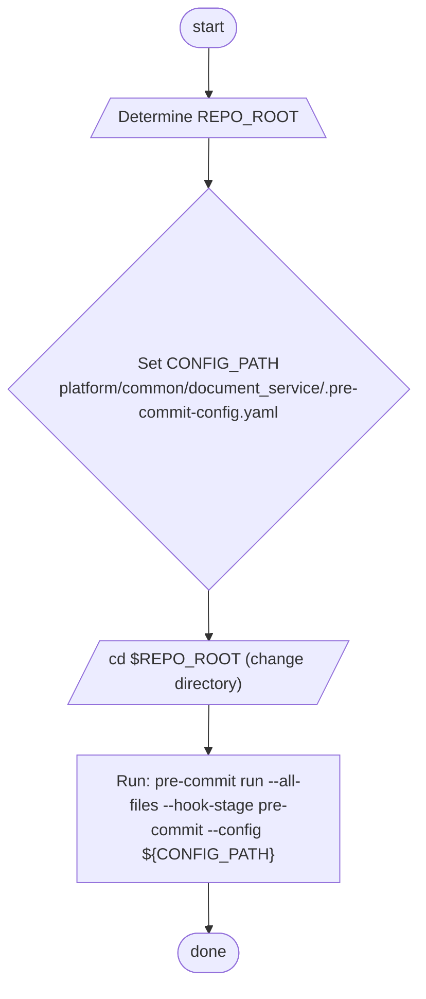

# Diagram: common/document_service/run_precommit_checks.sh

> Auto-generated by Obscura crawlers

## Mermaid

### SVG

<svg id="container" width="546.765625" xmlns="http://www.w3.org/2000/svg" class="flowchart" height="1102.765625" viewBox="0.5 0 546.765625 1102.765625" role="graphics-document document" aria-roledescription="flowchart-v2"><g><marker id="container_flowchart-v2-pointEnd" class="marker flowchart-v2" viewBox="0 0 10 10" refX="5" refY="5" markerUnits="userSpaceOnUse" markerWidth="8" markerHeight="8" orient="auto"><path d="M 0 0 L 10 5 L 0 10 z" class="arrowMarkerPath" style="stroke-width: 1; stroke-dasharray: 1, 0;"></path></marker><marker id="container_flowchart-v2-pointStart" class="marker flowchart-v2" viewBox="0 0 10 10" refX="4.5" refY="5" markerUnits="userSpaceOnUse" markerWidth="8" markerHeight="8" orient="auto"><path d="M 0 5 L 10 10 L 10 0 z" class="arrowMarkerPath" style="stroke-width: 1; stroke-dasharray: 1, 0;"></path></marker><marker id="container_flowchart-v2-circleEnd" class="marker flowchart-v2" viewBox="0 0 10 10" refX="11" refY="5" markerUnits="userSpaceOnUse" markerWidth="11" markerHeight="11" orient="auto"><circle cx="5" cy="5" r="5" class="arrowMarkerPath" style="stroke-width: 1; stroke-dasharray: 1, 0;"></circle></marker><marker id="container_flowchart-v2-circleStart" class="marker flowchart-v2" viewBox="0 0 10 10" refX="-1" refY="5" markerUnits="userSpaceOnUse" markerWidth="11" markerHeight="11" orient="auto"><circle cx="5" cy="5" r="5" class="arrowMarkerPath" style="stroke-width: 1; stroke-dasharray: 1, 0;"></circle></marker><marker id="container_flowchart-v2-crossEnd" class="marker cross flowchart-v2" viewBox="0 0 11 11" refX="12" refY="5.2" markerUnits="userSpaceOnUse" markerWidth="11" markerHeight="11" orient="auto"><path d="M 1,1 l 9,9 M 10,1 l -9,9" class="arrowMarkerPath" style="stroke-width: 2; stroke-dasharray: 1, 0;"></path></marker><marker id="container_flowchart-v2-crossStart" class="marker cross flowchart-v2" viewBox="0 0 11 11" refX="-1" refY="5.2" markerUnits="userSpaceOnUse" markerWidth="11" markerHeight="11" orient="auto"><path d="M 1,1 l 9,9 M 10,1 l -9,9" class="arrowMarkerPath" style="stroke-width: 2; stroke-dasharray: 1, 0;"></path></marker><g class="root"><g class="clusters"></g><g class="edgePaths"><path d="M273.883,47.5L273.799,51.583C273.716,55.667,273.549,63.833,273.536,71.5C273.523,79.167,273.664,86.334,273.734,89.917L273.804,93.501" id="L_Start_DetermineRepoRoot_0" class="edge-thickness-normal edge-pattern-solid edge-thickness-normal edge-pattern-solid flowchart-link" style=";" data-edge="true" data-et="edge" data-id="L_Start_DetermineRepoRoot_0" data-points="W3sieCI6MjczLjg4MjgxMjUsInkiOjQ3LjV9LHsieCI6MjczLjM4MjgxMjUsInkiOjcyfSx7IngiOjI3My44ODI4MTI1LCJ5Ijo5Ny41fV0=" marker-end="url(#container_flowchart-v2-pointEnd)"></path><path d="M273.883,136.5L273.799,140.583C273.716,144.667,273.549,152.833,273.466,160.417C273.383,168,273.383,175,273.383,178.5L273.383,182" id="L_DetermineRepoRoot_SetConfigPath_0" class="edge-thickness-normal edge-pattern-solid edge-thickness-normal edge-pattern-solid flowchart-link" style=";" data-edge="true" data-et="edge" data-id="L_DetermineRepoRoot_SetConfigPath_0" data-points="W3sieCI6MjczLjg4MjgxMjUsInkiOjEzNi41fSx7IngiOjI3My4zODI4MTI1LCJ5IjoxNjF9LHsieCI6MjczLjM4MjgxMjUsInkiOjE4Nn1d" marker-end="url(#container_flowchart-v2-pointEnd)"></path><path d="M273.383,716.766L273.383,720.932C273.383,725.099,273.383,733.432,273.453,741.182C273.523,748.933,273.664,756.099,273.734,759.683L273.804,763.266" id="L_SetConfigPath_CD_0" class="edge-thickness-normal edge-pattern-solid edge-thickness-normal edge-pattern-solid flowchart-link" style=";" data-edge="true" data-et="edge" data-id="L_SetConfigPath_CD_0" data-points="W3sieCI6MjczLjM4MjgxMjUsInkiOjcxNi43NjU2MjV9LHsieCI6MjczLjM4MjgxMjUsInkiOjc0MS43NjU2MjV9LHsieCI6MjczLjg4MjgxMjUsInkiOjc2Ny4yNjU2MjV9XQ==" marker-end="url(#container_flowchart-v2-pointEnd)"></path><path d="M273.883,830.266L273.799,834.349C273.716,838.432,273.549,846.599,273.466,854.182C273.383,861.766,273.383,868.766,273.383,872.266L273.383,875.766" id="L_CD_RunPreCommit_0" class="edge-thickness-normal edge-pattern-solid edge-thickness-normal edge-pattern-solid flowchart-link" style=";" data-edge="true" data-et="edge" data-id="L_CD_RunPreCommit_0" data-points="W3sieCI6MjczLjg4MjgxMjUsInkiOjgzMC4yNjU2MjV9LHsieCI6MjczLjM4MjgxMjUsInkiOjg1NC43NjU2MjV9LHsieCI6MjczLjM4MjgxMjUsInkiOjg3OS43NjU2MjV9XQ==" marker-end="url(#container_flowchart-v2-pointEnd)"></path><path d="M273.383,1005.766L273.383,1009.932C273.383,1014.099,273.383,1022.432,273.453,1030.182C273.523,1037.933,273.664,1045.099,273.734,1048.683L273.804,1052.266" id="L_RunPreCommit_End_0" class="edge-thickness-normal edge-pattern-solid edge-thickness-normal edge-pattern-solid flowchart-link" style=";" data-edge="true" data-et="edge" data-id="L_RunPreCommit_End_0" data-points="W3sieCI6MjczLjM4MjgxMjUsInkiOjEwMDUuNzY1NjI1fSx7IngiOjI3My4zODI4MTI1LCJ5IjoxMDMwLjc2NTYyNX0seyJ4IjoyNzMuODgyODEyNSwieSI6MTA1Ni4yNjU2MjV9XQ==" marker-end="url(#container_flowchart-v2-pointEnd)"></path></g><g class="edgeLabels"><g class="edgeLabel"><g class="label" data-id="L_Start_DetermineRepoRoot_0" transform="translate(0, 0)"><foreignObject width="0" height="0">

</foreignObject></g></g><g class="edgeLabel"><g class="label" data-id="L_DetermineRepoRoot_SetConfigPath_0" transform="translate(0, 0)"><foreignObject width="0" height="0">

</foreignObject></g></g><g class="edgeLabel"><g class="label" data-id="L_SetConfigPath_CD_0" transform="translate(0, 0)"><foreignObject width="0" height="0">

</foreignObject></g></g><g class="edgeLabel"><g class="label" data-id="L_CD_RunPreCommit_0" transform="translate(0, 0)"><foreignObject width="0" height="0">

</foreignObject></g></g><g class="edgeLabel"><g class="label" data-id="L_RunPreCommit_End_0" transform="translate(0, 0)"><foreignObject width="0" height="0">

</foreignObject></g></g></g><g class="nodes"><g class="node default" id="flowchart-Start-0" transform="translate(273.3828125, 27.5)"><g class="basic label-container outer-path"><path d="M-9.7734375 -19.5 C-3.186809313551029 -19.5, 3.399818872897942 -19.5, 9.7734375 -19.5 C9.7734375 -19.5, 9.773437499999998 -19.5, 9.773437499999998 -19.5 C10.214677912276159 -19.485850278800665, 10.65591832455232 -19.47170055760133, 11.0228067896239 -19.45993515863156 C11.28984884377889 -19.434173932832284, 11.55689089793388 -19.408412707033012, 12.267042152847864 -19.3399052695533 C12.70733158243697 -19.268722689072856, 13.147621012026075 -19.197540108592413, 13.501030759676757 -19.140403561325776 C13.80411890410601 -19.071225670194778, 14.107207048535264 -19.002047779063783, 14.71970188623539 -18.862249829261074 C15.048812948595916 -18.76457139349169, 15.377924010956443 -18.666892957722304, 15.918047751460602 -18.50658706670804 C16.308080397279888 -18.363051447624287, 16.698113043099173 -18.219515828540533, 17.091144095147794 -18.074876768247425 C17.452361369313966 -17.91497659610379, 17.813578643480135 -17.755076423960155, 18.23417041279238 -17.568892924097174 C18.58207603341847 -17.387390784660727, 18.929981654044564 -17.205888645224285, 19.342429764076783 -16.990714730406097 C19.70372180440098 -16.77169737237387, 20.06501384472518 -16.55268001434164, 20.411368073605697 -16.342718045390892 C20.725558998157133 -16.123552057529725, 21.03974992270857 -15.904386069668556, 21.436592844578712 -15.627565626425154 C21.821893211657137 -15.320298836953489, 22.20719357873556 -15.013032047481822, 22.41389120850187 -14.848196188198123 C22.67619446136185 -14.609979314114453, 22.938497714221825 -14.371762440030784, 23.339247236767985 -14.007812326905688 C23.663835726538558 -13.672648062006951, 23.988424216309134 -13.337483797108215, 24.208858442968648 -13.10986736009568 C24.52627134123334 -12.737016108488408, 24.843684239498035 -12.364164856881136, 25.019151408126582 -12.158051136245305 C25.295328537696328 -11.787998942875943, 25.571505667266074 -11.417946749506582, 25.766796464640635 -11.156274872382312 C25.96873550196011 -10.846042282835407, 26.17067453927959 -10.535809693288503, 26.448721378604247 -10.108655082055241 C26.687475527774055 -9.684722913725038, 26.926229676943862 -9.260790745394834, 27.0621239742735 -9.019496659696287 C27.246057538291424 -8.637554678465259, 27.429991102309348 -8.255612697234232, 27.60448364880834 -7.893275190886684 C27.724212782884557 -7.597541914913095, 27.843941916960777 -7.301808638939505, 28.073571729970325 -6.734618561215508 C28.158206285248966 -6.479712765401372, 28.242840840527606 -6.224806969587235, 28.46746063421488 -5.548287939305138 C28.53164684440608 -5.3035181013666355, 28.595833054597275 -5.058748263428133, 28.78453178754556 -4.339158212148133 C28.853364821927308 -3.985715128464833, 28.922197856309054 -3.6322720447815326, 29.023482276581777 -3.1121979531509023 C29.079917016154933 -2.674501257321351, 29.136351755728086 -2.2368045614918, 29.183330202509367 -1.872449005199798 C29.211638116279605 -1.4315303984915781, 29.239946030049847 -0.9906117917833583, 29.263418715913414 -0.6250057626472757 C29.263418715913414 -0.1779792444432145, 29.263418715913414 0.2690472737608467, 29.263418715913414 0.625005762647271 C29.242958526153345 0.9436897333282566, 29.22249833639328 1.262373704009242, 29.183330202509367 1.8724490051997846 C29.124245652473956 2.330697107710328, 29.065161102438548 2.7889452102208714, 29.023482276581777 3.1121979531508885 C28.937144271071883 3.555525363900273, 28.85080626556199 3.9988527746496567, 28.78453178754556 4.339158212148129 C28.71838434951486 4.591407061840185, 28.652236911484156 4.843655911532241, 28.467460634214884 5.548287939305125 C28.378621877653423 5.815856119534615, 28.289783121091958 6.083424299764106, 28.07357172997033 6.734618561215495 C27.962777939809364 7.00828136496529, 27.8519841496484 7.281944168715086, 27.604483648808344 7.893275190886679 C27.38814927038245 8.342498156502227, 27.171814891956554 8.791721122117776, 27.062123974273504 9.019496659696284 C26.93605185777966 9.243350468717217, 26.809979741285815 9.46720427773815, 26.44872137860425 10.108655082055236 C26.194762878325843 10.498803535888735, 25.94080437804743 10.888951989722234, 25.76679646464064 11.156274872382301 C25.583516474008274 11.401853362679034, 25.400236483375906 11.647431852975767, 25.019151408126582 12.158051136245302 C24.76990830703901 12.450826265116984, 24.52066520595144 12.743601393988667, 24.20885844296866 13.10986736009567 C23.914076761296197 13.41425364844865, 23.619295079623733 13.71863993680163, 23.33924723676799 14.007812326905684 C23.022046041487823 14.29588605977541, 22.704844846207656 14.583959792645135, 22.413891208501887 14.848196188198111 C22.069560860788666 15.122790477484031, 21.725230513075445 15.397384766769951, 21.436592844578715 15.627565626425152 C21.04794343810005 15.898670628023027, 20.659294031621382 16.1697756296209, 20.411368073605708 16.34271804539089 C20.07670105791941 16.54559515702161, 19.74203404223311 16.74847226865233, 19.342429764076787 16.990714730406093 C18.98665427297116 17.17632257623082, 18.63087878186553 17.36193042205555, 18.234170412792388 17.56889292409717 C17.795958963986823 17.762876133402624, 17.35774751518126 17.956859342708075, 17.091144095147804 18.07487676824742 C16.777348945934364 18.190356283848526, 16.463553796720927 18.305835799449635, 15.918047751460616 18.506587066708033 C15.489390218335208 18.633810372470347, 15.060732685209802 18.761033678232664, 14.719701886235413 18.86224982926107 C14.459629380404143 18.921609681585352, 14.199556874572874 18.980969533909633, 13.501030759676766 19.140403561325773 C13.104423566256301 19.20452393662327, 12.707816372835836 19.268644311920774, 12.267042152847878 19.3399052695533 C11.79093018028615 19.385835218937906, 11.31481820772442 19.431765168322514, 11.0228067896239 19.45993515863156 C10.566030501580938 19.47458308512799, 10.109254213537977 19.489231011624415, 9.773437500000004 19.5 C9.773437500000002 19.5, 9.773437500000002 19.5, 9.7734375 19.5 C4.283219489979483 19.5, -1.2069985200410347 19.5, -9.773437499999996 19.5 C-10.134350723238136 19.488426215405724, -10.495263946476273 19.47685243081145, -11.022806789623893 19.45993515863156 C-11.312428450470478 19.431995705330696, -11.60205011131706 19.404056252029836, -12.267042152847871 19.3399052695533 C-12.659248092750227 19.276496454792376, -13.051454032652583 19.213087640031453, -13.501030759676759 19.140403561325773 C-13.894136987295791 19.0506796301296, -14.287243214914824 18.96095569893343, -14.719701886235388 18.862249829261074 C-14.960596051963606 18.79075370535222, -15.201490217691822 18.719257581443365, -15.918047751460593 18.506587066708043 C-16.3854792453434 18.334567956069808, -16.85291073922621 18.16254884543157, -17.091144095147797 18.074876768247425 C-17.333048259958076 17.967792970318005, -17.57495242476836 17.860709172388585, -18.23417041279238 17.568892924097174 C-18.628919098758892 17.362952787477045, -19.023667784725404 17.157012650856917, -19.34242976407678 16.990714730406097 C-19.603016986423864 16.832745224838796, -19.86360420877095 16.674775719271494, -20.411368073605686 16.3427180453909 C-20.671264415749953 16.161425607842382, -20.931160757894222 15.980133170293863, -21.436592844578712 15.627565626425156 C-21.63866706361829 15.4664168141619, -21.840741282657863 15.305268001898643, -22.41389120850187 14.848196188198125 C-22.767413915675938 14.527136219240901, -23.120936622850003 14.206076250283678, -23.339247236767974 14.007812326905697 C-23.582139884691017 13.757005726067893, -23.82503253261406 13.50619912523009, -24.208858442968655 13.109867360095677 C-24.376546466169042 12.912891466325677, -24.54423448936943 12.715915572555677, -25.01915140812658 12.158051136245307 C-25.181692531930704 11.940260838148783, -25.34423365573483 11.72247054005226, -25.766796464640635 11.156274872382316 C-25.954120919392523 10.86849420622414, -26.14144537414441 10.580713540065963, -26.448721378604244 10.108655082055249 C-26.684943536376217 9.689218720843833, -26.921165694148186 9.26978235963242, -27.0621239742735 9.019496659696289 C-27.215347274358056 8.701325198617287, -27.36857057444261 8.383153737538285, -27.60448364880834 7.893275190886686 C-27.765010048351 7.496771880449517, -27.92553644789366 7.1002685700123465, -28.073571729970325 6.73461856121551 C-28.17436564809483 6.431043339154453, -28.275159566219337 6.127468117093395, -28.46746063421488 5.5482879393051325 C-28.54791399161875 5.241484418818515, -28.628367349022618 4.934680898331898, -28.784531787545557 4.339158212148136 C-28.844572137600657 4.030863704147681, -28.904612487655758 3.7225691961472265, -29.023482276581777 3.112197953150904 C-29.076009401540258 2.70480794462698, -29.12853652649874 2.2974179361030553, -29.183330202509364 1.872449005199809 C-29.20729056151035 1.4992470733057321, -29.231250920511343 1.126045141411655, -29.263418715913414 0.6250057626472781 C-29.263418715913414 0.2982638819195876, -29.263418715913414 -0.028477998808102978, -29.263418715913414 -0.6250057626472687 C-29.24027220933436 -0.98553128613983, -29.21712570275531 -1.3460568096323913, -29.183330202509367 -1.8724490051997822 C-29.121627191038932 -2.3510053775266804, -29.059924179568497 -2.829561749853579, -29.023482276581777 -3.112197953150895 C-28.970972216150436 -3.3818260154606246, -28.918462155719098 -3.6514540777703535, -28.78453178754556 -4.339158212148126 C-28.67888882923973 -4.742020598116004, -28.573245870933906 -5.144882984083882, -28.467460634214884 -5.548287939305123 C-28.33767594911708 -5.939178732438322, -28.207891264019274 -6.3300695255715205, -28.073571729970332 -6.734618561215485 C-27.920123355124293 -7.113639013807704, -27.766674980278257 -7.492659466399923, -27.604483648808344 -7.893275190886676 C-27.421237871589422 -8.273788968113292, -27.237992094370505 -8.654302745339908, -27.062123974273504 -9.019496659696282 C-26.934321840774743 -9.246422289092662, -26.806519707275985 -9.47334791848904, -26.448721378604247 -10.108655082055243 C-26.293739695851556 -10.346748565172323, -26.138758013098865 -10.584842048289403, -25.76679646464064 -11.156274872382308 C-25.540511813876176 -11.459475689450917, -25.31422716311171 -11.762676506519528, -25.019151408126586 -12.158051136245302 C-24.842508658919677 -12.365545760720906, -24.665865909712767 -12.57304038519651, -24.208858442968662 -13.10986736009567 C-23.941641319445228 -13.385790979067465, -23.67442419592179 -13.661714598039262, -23.339247236767996 -14.007812326905677 C-23.008287912815284 -14.308380828215672, -22.67732858886257 -14.608949329525666, -22.413891208501887 -14.848196188198107 C-22.18881710435983 -15.027686796777946, -21.96374300021777 -15.207177405357784, -21.43659284457872 -15.627565626425149 C-21.05666587985421 -15.892586230243737, -20.676738915129707 -16.157606834062324, -20.41136807360571 -16.342718045390885 C-20.071610306244565 -16.548681200603475, -19.731852538883423 -16.754644355816065, -19.34242976407679 -16.99071473040609 C-18.90402428954579 -17.219430585656806, -18.465618815014793 -17.448146440907518, -18.234170412792388 -17.56889292409717 C-17.79864819812245 -17.761685689224077, -17.363125983452512 -17.954478454350983, -17.091144095147804 -18.07487676824742 C-16.65547542397153 -18.235206866517338, -16.219806752795254 -18.395536964787258, -15.918047751460618 -18.506587066708033 C-15.677254194376602 -18.578053330499394, -15.436460637292585 -18.64951959429076, -14.719701886235413 -18.862249829261067 C-14.269269198151582 -18.965058150968215, -13.818836510067749 -19.067866472675366, -13.501030759676768 -19.140403561325773 C-13.23796440750948 -19.18293408903415, -12.974898055342193 -19.225464616742528, -12.26704215284788 -19.3399052695533 C-11.912022355264332 -19.37415360245241, -11.557002557680784 -19.40840193535152, -11.022806789623903 -19.45993515863156 C-10.64825022704345 -19.471946458563394, -10.273693664462996 -19.483957758495226, -9.773437500000005 -19.5 C-9.773437500000004 -19.5, -9.773437500000002 -19.5, -9.7734375 -19.5" stroke="none" stroke-width="0" fill="#ECECFF" style=""></path><path d="M-9.7734375 -19.5 C-2.4762882654716165 -19.5, 4.820860969056767 -19.5, 9.7734375 -19.5 M-9.7734375 -19.5 C-3.0360016522698814 -19.5, 3.701434195460237 -19.5, 9.7734375 -19.5 M9.7734375 -19.5 C9.7734375 -19.5, 9.7734375 -19.5, 9.773437499999998 -19.5 M9.7734375 -19.5 C9.7734375 -19.5, 9.773437499999998 -19.5, 9.773437499999998 -19.5 M9.773437499999998 -19.5 C10.22262273492604 -19.485595503801942, 10.67180796985208 -19.471191007603885, 11.0228067896239 -19.45993515863156 M9.773437499999998 -19.5 C10.258877694309733 -19.484432877820506, 10.744317888619468 -19.46886575564101, 11.0228067896239 -19.45993515863156 M11.0228067896239 -19.45993515863156 C11.321741141578201 -19.431097321219685, 11.6206754935325 -19.40225948380781, 12.267042152847864 -19.3399052695533 M11.0228067896239 -19.45993515863156 C11.465697754041487 -19.417209999948508, 11.908588718459075 -19.37448484126546, 12.267042152847864 -19.3399052695533 M12.267042152847864 -19.3399052695533 C12.62425761276728 -19.282153444240794, 12.981473072686697 -19.22440161892829, 13.501030759676757 -19.140403561325776 M12.267042152847864 -19.3399052695533 C12.55513110106836 -19.29332928256817, 12.843220049288856 -19.24675329558304, 13.501030759676757 -19.140403561325776 M13.501030759676757 -19.140403561325776 C13.98744867190366 -19.029381847033505, 14.473866584130562 -18.91836013274123, 14.71970188623539 -18.862249829261074 M13.501030759676757 -19.140403561325776 C13.891320715828535 -19.051322425714115, 14.28161067198031 -18.962241290102455, 14.71970188623539 -18.862249829261074 M14.71970188623539 -18.862249829261074 C15.071570543539938 -18.75781705876936, 15.423439200844486 -18.65338428827764, 15.918047751460602 -18.50658706670804 M14.71970188623539 -18.862249829261074 C15.118731800109115 -18.743819845374112, 15.517761713982841 -18.62538986148715, 15.918047751460602 -18.50658706670804 M15.918047751460602 -18.50658706670804 C16.349006771246255 -18.34799016368541, 16.77996579103191 -18.189393260662783, 17.091144095147794 -18.074876768247425 M15.918047751460602 -18.50658706670804 C16.249245328301935 -18.38470329687359, 16.58044290514327 -18.262819527039138, 17.091144095147794 -18.074876768247425 M17.091144095147794 -18.074876768247425 C17.452897496991177 -17.91473926828475, 17.81465089883456 -17.754601768322075, 18.23417041279238 -17.568892924097174 M17.091144095147794 -18.074876768247425 C17.398373213074358 -17.93887555136931, 17.705602331000925 -17.802874334491197, 18.23417041279238 -17.568892924097174 M18.23417041279238 -17.568892924097174 C18.575592067642674 -17.39077346545278, 18.91701372249297 -17.212654006808393, 19.342429764076783 -16.990714730406097 M18.23417041279238 -17.568892924097174 C18.492437559513128 -17.434155119080962, 18.750704706233876 -17.29941731406475, 19.342429764076783 -16.990714730406097 M19.342429764076783 -16.990714730406097 C19.647848669943727 -16.805567994828838, 19.95326757581067 -16.620421259251582, 20.411368073605697 -16.342718045390892 M19.342429764076783 -16.990714730406097 C19.761327504219526 -16.736776458615196, 20.180225244362273 -16.482838186824296, 20.411368073605697 -16.342718045390892 M20.411368073605697 -16.342718045390892 C20.72442972730846 -16.12433978798841, 21.037491381011222 -15.905961530585929, 21.436592844578712 -15.627565626425154 M20.411368073605697 -16.342718045390892 C20.73704351703168 -16.11554095431965, 21.062718960457662 -15.888363863248406, 21.436592844578712 -15.627565626425154 M21.436592844578712 -15.627565626425154 C21.750438557053492 -15.377282022511677, 22.064284269528276 -15.1269984185982, 22.41389120850187 -14.848196188198123 M21.436592844578712 -15.627565626425154 C21.807293122690254 -15.331942019379891, 22.177993400801796 -15.03631841233463, 22.41389120850187 -14.848196188198123 M22.41389120850187 -14.848196188198123 C22.75704869351677 -14.536549639757109, 23.100206178531664 -14.224903091316094, 23.339247236767985 -14.007812326905688 M22.41389120850187 -14.848196188198123 C22.648355841651913 -14.6352616119655, 22.882820474801957 -14.422327035732877, 23.339247236767985 -14.007812326905688 M23.339247236767985 -14.007812326905688 C23.614346457512436 -13.723749795420975, 23.889445678256887 -13.439687263936262, 24.208858442968648 -13.10986736009568 M23.339247236767985 -14.007812326905688 C23.529757924476506 -13.811094400628292, 23.720268612185027 -13.614376474350896, 24.208858442968648 -13.10986736009568 M24.208858442968648 -13.10986736009568 C24.479912694279733 -12.791471613081857, 24.750966945590815 -12.473075866068035, 25.019151408126582 -12.158051136245305 M24.208858442968648 -13.10986736009568 C24.532368294315106 -12.72985428047211, 24.85587814566156 -12.349841200848541, 25.019151408126582 -12.158051136245305 M25.019151408126582 -12.158051136245305 C25.194524247548696 -11.923067508214016, 25.36989708697081 -11.688083880182727, 25.766796464640635 -11.156274872382312 M25.019151408126582 -12.158051136245305 C25.310003618005254 -11.768335672189298, 25.60085582788393 -11.378620208133293, 25.766796464640635 -11.156274872382312 M25.766796464640635 -11.156274872382312 C25.91446971123147 -10.929409109799744, 26.062142957822303 -10.702543347217176, 26.448721378604247 -10.108655082055241 M25.766796464640635 -11.156274872382312 C26.0194607990205 -10.76811460490118, 26.272125133400365 -10.379954337420049, 26.448721378604247 -10.108655082055241 M26.448721378604247 -10.108655082055241 C26.576118315229795 -9.882448920737883, 26.703515251855343 -9.656242759420522, 27.0621239742735 -9.019496659696287 M26.448721378604247 -10.108655082055241 C26.63792967822997 -9.772696586651858, 26.827137977855692 -9.436738091248476, 27.0621239742735 -9.019496659696287 M27.0621239742735 -9.019496659696287 C27.265391254931263 -8.59740780218737, 27.468658535589025 -8.175318944678452, 27.60448364880834 -7.893275190886684 M27.0621239742735 -9.019496659696287 C27.222499296455513 -8.686473871703155, 27.382874618637526 -8.353451083710024, 27.60448364880834 -7.893275190886684 M27.60448364880834 -7.893275190886684 C27.755480189458215 -7.520310816161983, 27.90647673010809 -7.147346441437282, 28.073571729970325 -6.734618561215508 M27.60448364880834 -7.893275190886684 C27.70888258915362 -7.635407789817643, 27.8132815294989 -7.377540388748603, 28.073571729970325 -6.734618561215508 M28.073571729970325 -6.734618561215508 C28.16102563815208 -6.471221323660077, 28.248479546333833 -6.2078240861046465, 28.46746063421488 -5.548287939305138 M28.073571729970325 -6.734618561215508 C28.18447725193337 -6.40058879945806, 28.29538277389641 -6.066559037700611, 28.46746063421488 -5.548287939305138 M28.46746063421488 -5.548287939305138 C28.533944400512524 -5.294756524165638, 28.60042816681017 -5.041225109026136, 28.78453178754556 -4.339158212148133 M28.46746063421488 -5.548287939305138 C28.55574551500392 -5.211619425947159, 28.64403039579296 -4.8749509125891795, 28.78453178754556 -4.339158212148133 M28.78453178754556 -4.339158212148133 C28.85972181641212 -3.9530733053365816, 28.934911845278677 -3.56698839852503, 29.023482276581777 -3.1121979531509023 M28.78453178754556 -4.339158212148133 C28.879982733275373 -3.8490377793900783, 28.97543367900518 -3.3589173466320235, 29.023482276581777 -3.1121979531509023 M29.023482276581777 -3.1121979531509023 C29.074584933561766 -2.715855836975138, 29.125687590541755 -2.3195137207993737, 29.183330202509367 -1.872449005199798 M29.023482276581777 -3.1121979531509023 C29.082378654973077 -2.655409272753384, 29.141275033364376 -2.1986205923558653, 29.183330202509367 -1.872449005199798 M29.183330202509367 -1.872449005199798 C29.21455187831587 -1.3861462028303955, 29.245773554122373 -0.899843400460993, 29.263418715913414 -0.6250057626472757 M29.183330202509367 -1.872449005199798 C29.210504971913895 -1.44918003664521, 29.237679741318424 -1.0259110680906218, 29.263418715913414 -0.6250057626472757 M29.263418715913414 -0.6250057626472757 C29.263418715913414 -0.2554431317910069, 29.263418715913414 0.11411949906526186, 29.263418715913414 0.625005762647271 M29.263418715913414 -0.6250057626472757 C29.263418715913414 -0.18780582493769327, 29.263418715913414 0.24939411277188916, 29.263418715913414 0.625005762647271 M29.263418715913414 0.625005762647271 C29.233530148143473 1.0905443312817737, 29.20364158037353 1.5560828999162766, 29.183330202509367 1.8724490051997846 M29.263418715913414 0.625005762647271 C29.24216924383988 0.9559834424577329, 29.220919771766344 1.2869611222681947, 29.183330202509367 1.8724490051997846 M29.183330202509367 1.8724490051997846 C29.146603102758593 2.1572971382806156, 29.10987600300782 2.442145271361447, 29.023482276581777 3.1121979531508885 M29.183330202509367 1.8724490051997846 C29.134949288992985 2.247681816540843, 29.086568375476606 2.622914627881901, 29.023482276581777 3.1121979531508885 M29.023482276581777 3.1121979531508885 C28.971324331836335 3.3800179758332063, 28.919166387090893 3.6478379985155236, 28.78453178754556 4.339158212148129 M29.023482276581777 3.1121979531508885 C28.971874036124802 3.377195360491969, 28.92026579566783 3.64219276783305, 28.78453178754556 4.339158212148129 M28.78453178754556 4.339158212148129 C28.71557978976112 4.602102063685081, 28.646627791976677 4.865045915222033, 28.467460634214884 5.548287939305125 M28.78453178754556 4.339158212148129 C28.689753720302093 4.700588059621651, 28.594975653058626 5.062017907095174, 28.467460634214884 5.548287939305125 M28.467460634214884 5.548287939305125 C28.34833663365305 5.907070449165392, 28.229212633091215 6.2658529590256595, 28.07357172997033 6.734618561215495 M28.467460634214884 5.548287939305125 C28.326021923718862 5.974278800120964, 28.18458321322284 6.400269660936802, 28.07357172997033 6.734618561215495 M28.07357172997033 6.734618561215495 C27.888692002434578 7.191275062635172, 27.703812274898823 7.647931564054849, 27.604483648808344 7.893275190886679 M28.07357172997033 6.734618561215495 C27.945865250964545 7.050056033396588, 27.81815877195876 7.365493505577682, 27.604483648808344 7.893275190886679 M27.604483648808344 7.893275190886679 C27.481600632390034 8.148444403754652, 27.35871761597172 8.403613616622627, 27.062123974273504 9.019496659696284 M27.604483648808344 7.893275190886679 C27.495744878674287 8.119073573707013, 27.387006108540227 8.344871956527346, 27.062123974273504 9.019496659696284 M27.062123974273504 9.019496659696284 C26.8212312976377 9.447226000091755, 26.580338621001893 9.874955340487226, 26.44872137860425 10.108655082055236 M27.062123974273504 9.019496659696284 C26.851421157648687 9.39362084658742, 26.640718341023874 9.767745033478555, 26.44872137860425 10.108655082055236 M26.44872137860425 10.108655082055236 C26.22675633018646 10.449653002386079, 26.004791281768675 10.790650922716923, 25.76679646464064 11.156274872382301 M26.44872137860425 10.108655082055236 C26.23123736611122 10.442768927879028, 26.013753353618185 10.77688277370282, 25.76679646464064 11.156274872382301 M25.76679646464064 11.156274872382301 C25.50677986519683 11.504673427637492, 25.246763265753017 11.853071982892684, 25.019151408126582 12.158051136245302 M25.76679646464064 11.156274872382301 C25.48713668523 11.53099349926254, 25.20747690581935 11.905712126142777, 25.019151408126582 12.158051136245302 M25.019151408126582 12.158051136245302 C24.777288381895822 12.442157209252017, 24.535425355665062 12.726263282258731, 24.20885844296866 13.10986736009567 M25.019151408126582 12.158051136245302 C24.713454041823347 12.517140657377997, 24.40775667552011 12.87623017851069, 24.20885844296866 13.10986736009567 M24.20885844296866 13.10986736009567 C23.90186420375281 13.426864116781815, 23.594869964536965 13.74386087346796, 23.33924723676799 14.007812326905684 M24.20885844296866 13.10986736009567 C24.03030965160289 13.294233646309216, 23.85176086023713 13.478599932522764, 23.33924723676799 14.007812326905684 M23.33924723676799 14.007812326905684 C23.125400265558334 14.202022488077489, 22.91155329434868 14.396232649249292, 22.413891208501887 14.848196188198111 M23.33924723676799 14.007812326905684 C22.969428199849908 14.343672191359165, 22.599609162931824 14.679532055812647, 22.413891208501887 14.848196188198111 M22.413891208501887 14.848196188198111 C22.035303484455223 15.15010982348288, 21.65671576040856 15.45202345876765, 21.436592844578715 15.627565626425152 M22.413891208501887 14.848196188198111 C22.070684289228947 15.121894573198594, 21.727477369956006 15.395592958199076, 21.436592844578715 15.627565626425152 M21.436592844578715 15.627565626425152 C21.09907054610085 15.8630065707385, 20.761548247622983 16.09844751505185, 20.411368073605708 16.34271804539089 M21.436592844578715 15.627565626425152 C21.141486453657837 15.83341906978179, 20.84638006273696 16.039272513138428, 20.411368073605708 16.34271804539089 M20.411368073605708 16.34271804539089 C20.093758675549825 16.535254728972365, 19.77614927749394 16.72779141255384, 19.342429764076787 16.990714730406093 M20.411368073605708 16.34271804539089 C20.143787541697474 16.50492693631141, 19.876207009789237 16.667135827231927, 19.342429764076787 16.990714730406093 M19.342429764076787 16.990714730406093 C19.04004445892193 17.14846895041835, 18.737659153767076 17.306223170430606, 18.234170412792388 17.56889292409717 M19.342429764076787 16.990714730406093 C19.104377065270423 17.114906670893344, 18.866324366464056 17.23909861138059, 18.234170412792388 17.56889292409717 M18.234170412792388 17.56889292409717 C17.871923378402112 17.729248940545265, 17.50967634401184 17.88960495699336, 17.091144095147804 18.07487676824742 M18.234170412792388 17.56889292409717 C18.005124601334156 17.67028471042714, 17.776078789875925 17.771676496757106, 17.091144095147804 18.07487676824742 M17.091144095147804 18.07487676824742 C16.67121050696844 18.229416210520963, 16.251276918789074 18.383955652794505, 15.918047751460616 18.506587066708033 M17.091144095147804 18.07487676824742 C16.735586071215327 18.205725407796916, 16.38002804728285 18.33657404734641, 15.918047751460616 18.506587066708033 M15.918047751460616 18.506587066708033 C15.58117210574538 18.606569990059967, 15.244296460030144 18.7065529134119, 14.719701886235413 18.86224982926107 M15.918047751460616 18.506587066708033 C15.459732603465609 18.64261259688765, 15.001417455470602 18.778638127067264, 14.719701886235413 18.86224982926107 M14.719701886235413 18.86224982926107 C14.372634082047327 18.94146579073792, 14.025566277859241 19.020681752214767, 13.501030759676766 19.140403561325773 M14.719701886235413 18.86224982926107 C14.26772203628233 18.965411280568702, 13.815742186329244 19.06857273187633, 13.501030759676766 19.140403561325773 M13.501030759676766 19.140403561325773 C13.248872331014029 19.181170580554145, 12.996713902351292 19.221937599782517, 12.267042152847878 19.3399052695533 M13.501030759676766 19.140403561325773 C13.058484005567593 19.21195108852881, 12.61593725145842 19.283498615731844, 12.267042152847878 19.3399052695533 M12.267042152847878 19.3399052695533 C11.774237430134438 19.387445548469074, 11.281432707420997 19.434985827384846, 11.0228067896239 19.45993515863156 M12.267042152847878 19.3399052695533 C11.78058829027643 19.3868328886292, 11.29413442770498 19.433760507705106, 11.0228067896239 19.45993515863156 M11.0228067896239 19.45993515863156 C10.639579116307777 19.47222452420739, 10.256351442991653 19.484513889783226, 9.773437500000004 19.5 M11.0228067896239 19.45993515863156 C10.598132648063544 19.473553631773328, 10.173458506503188 19.487172104915096, 9.773437500000004 19.5 M9.773437500000004 19.5 C9.773437500000002 19.5, 9.773437500000002 19.5, 9.7734375 19.5 M9.773437500000004 19.5 C9.773437500000004 19.5, 9.773437500000002 19.5, 9.7734375 19.5 M9.7734375 19.5 C3.9602959417125874 19.5, -1.8528456165748253 19.5, -9.773437499999996 19.5 M9.7734375 19.5 C2.6270138108068277 19.5, -4.519409878386345 19.5, -9.773437499999996 19.5 M-9.773437499999996 19.5 C-10.16541057526427 19.487430186405582, -10.557383650528543 19.474860372811165, -11.022806789623893 19.45993515863156 M-9.773437499999996 19.5 C-10.034919851453564 19.491614769933406, -10.29640220290713 19.483229539866812, -11.022806789623893 19.45993515863156 M-11.022806789623893 19.45993515863156 C-11.45052969076575 19.418673244770453, -11.878252591907609 19.37741133090935, -12.267042152847871 19.3399052695533 M-11.022806789623893 19.45993515863156 C-11.32188176281041 19.431083755658534, -11.620956735996927 19.402232352685512, -12.267042152847871 19.3399052695533 M-12.267042152847871 19.3399052695533 C-12.605988620066086 19.28510703330257, -12.9449350872843 19.230308797051837, -13.501030759676759 19.140403561325773 M-12.267042152847871 19.3399052695533 C-12.608227499957094 19.284745068564565, -12.949412847066318 19.229584867575827, -13.501030759676759 19.140403561325773 M-13.501030759676759 19.140403561325773 C-13.890052730670027 19.051611835052167, -14.279074701663292 18.96282010877856, -14.719701886235388 18.862249829261074 M-13.501030759676759 19.140403561325773 C-13.970104094161425 19.03334063371922, -14.43917742864609 18.926277706112668, -14.719701886235388 18.862249829261074 M-14.719701886235388 18.862249829261074 C-15.083860057965856 18.75416959539672, -15.448018229696322 18.646089361532372, -15.918047751460593 18.506587066708043 M-14.719701886235388 18.862249829261074 C-15.004495850938172 18.777724475451315, -15.289289815640956 18.693199121641555, -15.918047751460593 18.506587066708043 M-15.918047751460593 18.506587066708043 C-16.168639275243684 18.41436706951321, -16.419230799026774 18.322147072318383, -17.091144095147797 18.074876768247425 M-15.918047751460593 18.506587066708043 C-16.32176419162822 18.358015684812493, -16.725480631795847 18.209444302916943, -17.091144095147797 18.074876768247425 M-17.091144095147797 18.074876768247425 C-17.43801438619586 17.921327579942044, -17.784884677243923 17.76777839163666, -18.23417041279238 17.568892924097174 M-17.091144095147797 18.074876768247425 C-17.443098143153193 17.919077151541323, -17.795052191158593 17.763277534835222, -18.23417041279238 17.568892924097174 M-18.23417041279238 17.568892924097174 C-18.647254588549522 17.353387174197714, -19.060338764306668 17.137881424298257, -19.34242976407678 16.990714730406097 M-18.23417041279238 17.568892924097174 C-18.52486026104521 17.41724021645941, -18.81555010929804 17.26558750882164, -19.34242976407678 16.990714730406097 M-19.34242976407678 16.990714730406097 C-19.761117420528024 16.736903812583574, -20.179805076979267 16.48309289476105, -20.411368073605686 16.3427180453909 M-19.34242976407678 16.990714730406097 C-19.62735836358081 16.817989338960444, -19.912286963084842 16.645263947514792, -20.411368073605686 16.3427180453909 M-20.411368073605686 16.3427180453909 C-20.618675940036805 16.19810905198145, -20.825983806467928 16.053500058572, -21.436592844578712 15.627565626425156 M-20.411368073605686 16.3427180453909 C-20.70452119281058 16.138227119827565, -20.997674312015473 15.933736194264227, -21.436592844578712 15.627565626425156 M-21.436592844578712 15.627565626425156 C-21.67018999340266 15.441278116519255, -21.903787142226605 15.254990606613354, -22.41389120850187 14.848196188198125 M-21.436592844578712 15.627565626425156 C-21.712164343725455 15.407804689121198, -21.987735842872198 15.188043751817238, -22.41389120850187 14.848196188198125 M-22.41389120850187 14.848196188198125 C-22.774487219898006 14.520712431495793, -23.135083231294143 14.19322867479346, -23.339247236767974 14.007812326905697 M-22.41389120850187 14.848196188198125 C-22.673631104468093 14.612307287022654, -22.933371000434317 14.376418385847185, -23.339247236767974 14.007812326905697 M-23.339247236767974 14.007812326905697 C-23.539758289848788 13.800768202336146, -23.740269342929597 13.593724077766593, -24.208858442968655 13.109867360095677 M-23.339247236767974 14.007812326905697 C-23.55747539479965 13.782473836873011, -23.775703552831324 13.557135346840324, -24.208858442968655 13.109867360095677 M-24.208858442968655 13.109867360095677 C-24.466516856748516 12.807207126090773, -24.72417527052838 12.504546892085868, -25.01915140812658 12.158051136245307 M-24.208858442968655 13.109867360095677 C-24.482961575848815 12.787890223304538, -24.757064708728976 12.465913086513398, -25.01915140812658 12.158051136245307 M-25.01915140812658 12.158051136245307 C-25.228944632104636 11.876947328670598, -25.438737856082692 11.595843521095889, -25.766796464640635 11.156274872382316 M-25.01915140812658 12.158051136245307 C-25.295507838103493 11.787758696664946, -25.571864268080404 11.417466257084588, -25.766796464640635 11.156274872382316 M-25.766796464640635 11.156274872382316 C-25.99586104449608 10.804370165272102, -26.224925624351528 10.45246545816189, -26.448721378604244 10.108655082055249 M-25.766796464640635 11.156274872382316 C-26.00066897698003 10.796983889866112, -26.234541489319426 10.43769290734991, -26.448721378604244 10.108655082055249 M-26.448721378604244 10.108655082055249 C-26.62349940043157 9.798319006106993, -26.7982774222589 9.48798293015874, -27.0621239742735 9.019496659696289 M-26.448721378604244 10.108655082055249 C-26.6654532205529 9.723825750196616, -26.88218506250156 9.338996418337985, -27.0621239742735 9.019496659696289 M-27.0621239742735 9.019496659696289 C-27.25573283174732 8.617463724585978, -27.449341689221143 8.215430789475667, -27.60448364880834 7.893275190886686 M-27.0621239742735 9.019496659696289 C-27.27560644914335 8.57619573283583, -27.489088924013203 8.132894805975369, -27.60448364880834 7.893275190886686 M-27.60448364880834 7.893275190886686 C-27.704568422918886 7.64606386382617, -27.80465319702943 7.398852536765655, -28.073571729970325 6.73461856121551 M-27.60448364880834 7.893275190886686 C-27.728733215411708 7.586376359174423, -27.852982782015072 7.279477527462159, -28.073571729970325 6.73461856121551 M-28.073571729970325 6.73461856121551 C-28.18173061154665 6.408861242685133, -28.289889493122978 6.083103924154757, -28.46746063421488 5.5482879393051325 M-28.073571729970325 6.73461856121551 C-28.198099420100256 6.359560999337148, -28.322627110230187 5.984503437458786, -28.46746063421488 5.5482879393051325 M-28.46746063421488 5.5482879393051325 C-28.541459747561323 5.266097248696544, -28.61545886090777 4.983906558087955, -28.784531787545557 4.339158212148136 M-28.46746063421488 5.5482879393051325 C-28.536978241880277 5.283187172155229, -28.606495849545674 5.018086405005324, -28.784531787545557 4.339158212148136 M-28.784531787545557 4.339158212148136 C-28.858074514185635 3.961531854112117, -28.931617240825716 3.5839054960760985, -29.023482276581777 3.112197953150904 M-28.784531787545557 4.339158212148136 C-28.865093399865312 3.9254913595890004, -28.945655012185064 3.5118245070298646, -29.023482276581777 3.112197953150904 M-29.023482276581777 3.112197953150904 C-29.05774108631261 2.8464933900457225, -29.091999896043447 2.580788826940541, -29.183330202509364 1.872449005199809 M-29.023482276581777 3.112197953150904 C-29.07295911956325 2.7284653292943313, -29.122435962544724 2.344732705437759, -29.183330202509364 1.872449005199809 M-29.183330202509364 1.872449005199809 C-29.204017045601216 1.5502347259249978, -29.22470388869307 1.2280204466501865, -29.263418715913414 0.6250057626472781 M-29.183330202509364 1.872449005199809 C-29.210018863329854 1.45675157022141, -29.236707524150344 1.041054135243011, -29.263418715913414 0.6250057626472781 M-29.263418715913414 0.6250057626472781 C-29.263418715913414 0.22742949022592224, -29.263418715913414 -0.17014678219543367, -29.263418715913414 -0.6250057626472687 M-29.263418715913414 0.6250057626472781 C-29.263418715913414 0.28051036706617183, -29.263418715913414 -0.06398502851493448, -29.263418715913414 -0.6250057626472687 M-29.263418715913414 -0.6250057626472687 C-29.24608356795737 -0.8950146847422036, -29.22874842000133 -1.1650236068371385, -29.183330202509367 -1.8724490051997822 M-29.263418715913414 -0.6250057626472687 C-29.234553764574034 -1.0746006791274483, -29.20568881323466 -1.5241955956076279, -29.183330202509367 -1.8724490051997822 M-29.183330202509367 -1.8724490051997822 C-29.135176684977473 -2.2459181781895685, -29.087023167445583 -2.6193873511793546, -29.023482276581777 -3.112197953150895 M-29.183330202509367 -1.8724490051997822 C-29.12772718578861 -2.303695022828391, -29.072124169067855 -2.7349410404569996, -29.023482276581777 -3.112197953150895 M-29.023482276581777 -3.112197953150895 C-28.9560871258223 -3.4582578083306474, -28.888691975062827 -3.8043176635103997, -28.78453178754556 -4.339158212148126 M-29.023482276581777 -3.112197953150895 C-28.953901320136897 -3.46948145855501, -28.884320363692012 -3.8267649639591252, -28.78453178754556 -4.339158212148126 M-28.78453178754556 -4.339158212148126 C-28.688600641746085 -4.704985247903118, -28.59266949594661 -5.07081228365811, -28.467460634214884 -5.548287939305123 M-28.78453178754556 -4.339158212148126 C-28.678941444579863 -4.741819953020461, -28.57335110161416 -5.144481693892797, -28.467460634214884 -5.548287939305123 M-28.467460634214884 -5.548287939305123 C-28.321511778606997 -5.987862638603862, -28.175562922999113 -6.427437337902601, -28.073571729970332 -6.734618561215485 M-28.467460634214884 -5.548287939305123 C-28.37184291777423 -5.836273266610157, -28.276225201333578 -6.124258593915191, -28.073571729970332 -6.734618561215485 M-28.073571729970332 -6.734618561215485 C-27.93626281722659 -7.073774230379757, -27.79895390448285 -7.41292989954403, -27.604483648808344 -7.893275190886676 M-28.073571729970332 -6.734618561215485 C-27.887974343475154 -7.193047694139933, -27.70237695697998 -7.65147682706438, -27.604483648808344 -7.893275190886676 M-27.604483648808344 -7.893275190886676 C-27.48533554183094 -8.14068878438635, -27.366187434853533 -8.388102377886026, -27.062123974273504 -9.019496659696282 M-27.604483648808344 -7.893275190886676 C-27.46583347215893 -8.181185249337716, -27.32718329550952 -8.469095307788756, -27.062123974273504 -9.019496659696282 M-27.062123974273504 -9.019496659696282 C-26.91147446550117 -9.286990117438517, -26.76082495672883 -9.554483575180752, -26.448721378604247 -10.108655082055243 M-27.062123974273504 -9.019496659696282 C-26.83571261276395 -9.421512958692931, -26.609301251254394 -9.823529257689579, -26.448721378604247 -10.108655082055243 M-26.448721378604247 -10.108655082055243 C-26.295276362017464 -10.344387833288843, -26.141831345430685 -10.580120584522444, -25.76679646464064 -11.156274872382308 M-26.448721378604247 -10.108655082055243 C-26.297744610409104 -10.340595940941789, -26.14676784221396 -10.572536799828336, -25.76679646464064 -11.156274872382308 M-25.76679646464064 -11.156274872382308 C-25.47541280072196 -11.546702436435465, -25.184029136803275 -11.937130000488622, -25.019151408126586 -12.158051136245302 M-25.76679646464064 -11.156274872382308 C-25.536994446439444 -11.464188641377376, -25.307192428238242 -11.772102410372444, -25.019151408126586 -12.158051136245302 M-25.019151408126586 -12.158051136245302 C-24.803605782278183 -12.411243293260394, -24.588060156429783 -12.664435450275485, -24.208858442968662 -13.10986736009567 M-25.019151408126586 -12.158051136245302 C-24.8256643618653 -12.385332030508634, -24.63217731560401 -12.612612924771964, -24.208858442968662 -13.10986736009567 M-24.208858442968662 -13.10986736009567 C-23.879991033908187 -13.449449960467035, -23.551123624847712 -13.789032560838402, -23.339247236767996 -14.007812326905677 M-24.208858442968662 -13.10986736009567 C-23.898657185019374 -13.430175626925227, -23.588455927070086 -13.750483893754785, -23.339247236767996 -14.007812326905677 M-23.339247236767996 -14.007812326905677 C-22.988856617785352 -14.32602781623796, -22.638465998802708 -14.644243305570244, -22.413891208501887 -14.848196188198107 M-23.339247236767996 -14.007812326905677 C-23.13650806328807 -14.191934680075564, -22.933768889808142 -14.37605703324545, -22.413891208501887 -14.848196188198107 M-22.413891208501887 -14.848196188198107 C-22.074739558424223 -15.118660603930604, -21.735587908346556 -15.3891250196631, -21.43659284457872 -15.627565626425149 M-22.413891208501887 -14.848196188198107 C-22.033090680987538 -15.151874475363183, -21.65229015347319 -15.45555276252826, -21.43659284457872 -15.627565626425149 M-21.43659284457872 -15.627565626425149 C-21.175175418359142 -15.809919106377937, -20.913757992139566 -15.992272586330724, -20.41136807360571 -16.342718045390885 M-21.43659284457872 -15.627565626425149 C-21.186828345254234 -15.801790529022995, -20.93706384592975 -15.97601543162084, -20.41136807360571 -16.342718045390885 M-20.41136807360571 -16.342718045390885 C-20.162915487722348 -16.49333146302284, -19.914462901838988 -16.643944880654793, -19.34242976407679 -16.99071473040609 M-20.41136807360571 -16.342718045390885 C-20.15631004136744 -16.4973357234211, -19.901252009129166 -16.65195340145131, -19.34242976407679 -16.99071473040609 M-19.34242976407679 -16.99071473040609 C-19.05211400976679 -17.142172273473502, -18.761798255456792 -17.293629816540914, -18.234170412792388 -17.56889292409717 M-19.34242976407679 -16.99071473040609 C-18.940761573376825 -17.200264768213508, -18.53909338267686 -17.409814806020925, -18.234170412792388 -17.56889292409717 M-18.234170412792388 -17.56889292409717 C-17.89474659968993 -17.71914577750795, -17.555322786587475 -17.869398630918734, -17.091144095147804 -18.07487676824742 M-18.234170412792388 -17.56889292409717 C-17.88699376647608 -17.722577726792096, -17.539817120159775 -17.876262529487025, -17.091144095147804 -18.07487676824742 M-17.091144095147804 -18.07487676824742 C-16.75992447840539 -18.196768648969204, -16.428704861662975 -18.318660529690984, -15.918047751460618 -18.506587066708033 M-17.091144095147804 -18.07487676824742 C-16.777185788758874 -18.190416327197315, -16.463227482369945 -18.305955886147213, -15.918047751460618 -18.506587066708033 M-15.918047751460618 -18.506587066708033 C-15.642373695401435 -18.58840567950375, -15.366699639342253 -18.670224292299466, -14.719701886235413 -18.862249829261067 M-15.918047751460618 -18.506587066708033 C-15.481743786631064 -18.6360797932632, -15.045439821801509 -18.765572519818363, -14.719701886235413 -18.862249829261067 M-14.719701886235413 -18.862249829261067 C-14.289456936717702 -18.960450431377804, -13.859211987199991 -19.05865103349454, -13.501030759676768 -19.140403561325773 M-14.719701886235413 -18.862249829261067 C-14.271061722139606 -18.964649019065263, -13.8224215580438 -19.067048208869455, -13.501030759676768 -19.140403561325773 M-13.501030759676768 -19.140403561325773 C-13.016671987760231 -19.218710931310863, -12.532313215843695 -19.297018301295953, -12.26704215284788 -19.3399052695533 M-13.501030759676768 -19.140403561325773 C-13.150094258261074 -19.197140253321447, -12.799157756845378 -19.253876945317124, -12.26704215284788 -19.3399052695533 M-12.26704215284788 -19.3399052695533 C-11.957804533611231 -19.369737050768407, -11.648566914374584 -19.39956883198352, -11.022806789623903 -19.45993515863156 M-12.26704215284788 -19.3399052695533 C-11.921474403330189 -19.373241774743246, -11.575906653812497 -19.406578279933193, -11.022806789623903 -19.45993515863156 M-11.022806789623903 -19.45993515863156 C-10.632216794937909 -19.472460619523837, -10.241626800251915 -19.48498608041611, -9.773437500000005 -19.5 M-11.022806789623903 -19.45993515863156 C-10.641042108219674 -19.472177608904317, -10.259277426815444 -19.48442005917708, -9.773437500000005 -19.5 M-9.773437500000005 -19.5 C-9.773437500000004 -19.5, -9.773437500000002 -19.5, -9.7734375 -19.5 M-9.773437500000005 -19.5 C-9.773437500000004 -19.5, -9.773437500000002 -19.5, -9.7734375 -19.5" stroke="#9370DB" stroke-width="1.3" fill="none" stroke-dasharray="0 0" style=""></path></g><g class="label" style="" transform="translate(-16.8984375, -12)"><rect></rect><foreignObject width="33.796875" height="24">

start

</foreignObject></g></g><g class="node default" id="flowchart-DetermineRepoRoot-1" transform="translate(273.3828125, 116.5)"><polygon points="-19.5,0 200.203125,0 180.703125,-39 0,-39" class="label-container" transform="translate(-90.3515625,19.5)"></polygon><g class="label" style="" transform="translate(-82.8515625, -12)"><rect></rect><foreignObject width="165.703125" height="24">

Determine REPO_ROOT

</foreignObject></g></g><g class="node default" id="flowchart-SetConfigPath-3" transform="translate(273.3828125, 451.3828125)"><polygon points="265.3828125,0 530.765625,-265.3828125 265.3828125,-530.765625 0,-265.3828125" class="label-container" transform="translate(-264.8828125, 265.3828125)"></polygon><g class="label" style="" transform="translate(-214.3828125, -36)"><rect></rect><foreignObject width="428.765625" height="72">

Set CONFIG_PATH\nplatform/common/document_service/.pre-commit-config.yaml

</foreignObject></g></g><g class="node default" id="flowchart-CD-5" transform="translate(273.3828125, 798.265625)"><polygon points="-31.5,0 215,0 246.5,-63 0,-63" class="label-container" transform="translate(-107.5,31.5)"></polygon><g class="label" style="" transform="translate(-100, -24)"><rect></rect><foreignObject width="200" height="48">

cd $REPO_ROOT (change directory)

</foreignObject></g></g><g class="node default" id="flowchart-RunPreCommit-7" transform="translate(273.3828125, 942.765625)"><rect class="basic label-container" style="" x="-130" y="-63" width="260" height="126"></rect><g class="label" style="" transform="translate(-100, -48)"><rect></rect><foreignObject width="200" height="96">

Run: pre-commit run --all-files --hook-stage pre-commit --config ${CONFIG_PATH}

</foreignObject></g></g><g class="node default" id="flowchart-End-9" transform="translate(273.3828125, 1075.265625)"><g class="basic label-container outer-path"><path d="M-11.3828125 -19.5 C-6.7337193449572 -19.5, -2.0846261899144007 -19.5, 11.3828125 -19.5 C11.3828125 -19.5, 11.3828125 -19.5, 11.382812499999998 -19.5 C11.816723492118989 -19.486085319039255, 12.250634484237978 -19.47217063807851, 12.6321817896239 -19.45993515863156 C12.975309478268302 -19.426834043179454, 13.318437166912707 -19.39373292772735, 13.876417152847864 -19.3399052695533 C14.3418534598076 -19.26465713695652, 14.807289766767335 -19.18940900435974, 15.110405759676757 -19.140403561325776 C15.56192535448749 -19.037347160250942, 16.013444949298222 -18.934290759176108, 16.32907688623539 -18.862249829261074 C16.5687780006206 -18.79110779672837, 16.808479115005806 -18.719965764195663, 17.527422751460602 -18.50658706670804 C17.800462962000967 -18.406105745273145, 18.073503172541333 -18.305624423838253, 18.700519095147794 -18.074876768247425 C18.986197661617453 -17.948415341224887, 19.27187622808711 -17.82195391420235, 19.84354541279238 -17.568892924097174 C20.076787250899493 -17.44721080655522, 20.31002908900661 -17.325528689013268, 20.951804764076783 -16.990714730406097 C21.25703219242325 -16.805684069627, 21.56225962076972 -16.6206534088479, 22.020743073605697 -16.342718045390892 C22.400853467516143 -16.077569489312715, 22.780963861426585 -15.81242093323454, 23.045967844578712 -15.627565626425154 C23.32866548824742 -15.402121778499598, 23.61136313191613 -15.176677930574044, 24.02326620850187 -14.848196188198123 C24.247215709983525 -14.644811176331592, 24.471165211465184 -14.441426164465058, 24.948622236767985 -14.007812326905688 C25.269245426664867 -13.676742559683712, 25.589868616561752 -13.345672792461738, 25.818233442968648 -13.10986736009568 C26.120919117946176 -12.754315542964255, 26.423604792923708 -12.39876372583283, 26.628526408126582 -12.158051136245305 C26.89989952067741 -11.794435888026342, 27.171272633228234 -11.430820639807378, 27.376171464640635 -11.156274872382312 C27.5481889392598 -10.89200983820769, 27.720206413878962 -10.627744804033066, 28.058096378604247 -10.108655082055241 C28.29404491446753 -9.689704564249922, 28.529993450330817 -9.270754046444605, 28.6714989742735 -9.019496659696287 C28.814774900222503 -8.72198113384947, 28.958050826171505 -8.424465608002654, 29.21385864880834 -7.893275190886684 C29.40063296512865 -7.431939018539772, 29.587407281448957 -6.970602846192861, 29.682946729970325 -6.734618561215508 C29.78745786538212 -6.419847672943286, 29.89196900079391 -6.1050767846710645, 30.07683563421488 -5.548287939305138 C30.1757028139139 -5.171264533806037, 30.274569993612925 -4.794241128306935, 30.39390678754556 -4.339158212148133 C30.476782764916432 -3.9136075841927247, 30.559658742287304 -3.4880569562373163, 30.632857276581777 -3.1121979531509023 C30.67203546752303 -2.8083396408194115, 30.711213658464285 -2.5044813284879206, 30.792705202509367 -1.872449005199798 C30.823671598167977 -1.390122397192255, 30.854637993826586 -0.9077957891847122, 30.872793715913414 -0.6250057626472757 C30.872793715913414 -0.1816133859834716, 30.872793715913414 0.2617789906803325, 30.872793715913414 0.625005762647271 C30.846722322189574 1.0310887643463387, 30.82065092846573 1.437171766045406, 30.792705202509367 1.8724490051997846 C30.75693826722962 2.149850292249254, 30.721171331949872 2.4272515792987237, 30.632857276581777 3.1121979531508885 C30.570308652476207 3.433371918276606, 30.507760028370637 3.754545883402324, 30.39390678754556 4.339158212148129 C30.293124923209227 4.723483139998872, 30.192343058872893 5.107808067849614, 30.076835634214884 5.548287939305125 C29.988875447754104 5.813210006372499, 29.900915261293324 6.078132073439871, 29.68294672997033 6.734618561215495 C29.51576270524332 7.1475663345744405, 29.348578680516308 7.560514107933386, 29.213858648808344 7.893275190886679 C29.044650095111695 8.244640373120832, 28.875441541415043 8.596005555354985, 28.671498974273504 9.019496659696284 C28.446329896103066 9.419307158829497, 28.22116081793263 9.819117657962712, 28.05809637860425 10.108655082055236 C27.795600943529923 10.511918560223235, 27.533105508455595 10.915182038391235, 27.37617146464064 11.156274872382301 C27.162349887120566 11.442776306712759, 26.94852830960049 11.729277741043214, 26.628526408126582 12.158051136245302 C26.45487886663222 12.3620274193096, 26.281231325137863 12.566003702373896, 25.81823344296866 13.10986736009567 C25.612710955794082 13.322086201813427, 25.407188468619506 13.534305043531182, 24.94862223676799 14.007812326905684 C24.582215675735068 14.340573071049427, 24.215809114702147 14.67333381519317, 24.023266208501887 14.848196188198111 C23.660723809275055 15.13731410392309, 23.298181410048223 15.426432019648072, 23.045967844578715 15.627565626425152 C22.773901201428785 15.817347539111383, 22.50183455827886 16.007129451797613, 22.020743073605708 16.34271804539089 C21.65220629611322 16.566127205669336, 21.283669518620734 16.789536365947782, 20.951804764076787 16.990714730406093 C20.723531624590766 17.109804681060027, 20.49525848510475 17.228894631713956, 19.843545412792388 17.56889292409717 C19.50472360019997 17.71887928973987, 19.16590178760755 17.868865655382567, 18.700519095147804 18.07487676824742 C18.24788024289545 18.24145205002397, 17.795241390643103 18.40802733180052, 17.527422751460616 18.506587066708033 C17.2724073603651 18.582274296182078, 17.017391969269585 18.657961525656123, 16.329076886235413 18.86224982926107 C15.96469805484905 18.945416919730917, 15.600319223462689 19.02858401020076, 15.110405759676766 19.140403561325773 C14.718702815612222 19.20373105562043, 14.326999871547676 19.267058549915085, 13.876417152847878 19.3399052695533 C13.500325345037831 19.37618639393616, 13.124233537227783 19.41246751831902, 12.6321817896239 19.45993515863156 C12.189758331354748 19.47412281781323, 11.747334873085595 19.4883104769949, 11.382812500000004 19.5 C11.382812500000002 19.5, 11.382812500000002 19.5, 11.3828125 19.5 C5.381312809008387 19.5, -0.6201868819832264 19.5, -11.382812499999996 19.5 C-11.692862350203903 19.490057304779384, -12.00291220040781 19.48011460955877, -12.632181789623893 19.45993515863156 C-12.990617403054753 19.42535730608578, -13.349053016485612 19.39077945354, -13.876417152847871 19.3399052695533 C-14.366746248307232 19.260632663958354, -14.857075343766594 19.181360058363413, -15.110405759676759 19.140403561325773 C-15.577553965951513 19.033780031670496, -16.044702172226266 18.927156502015222, -16.329076886235388 18.862249829261074 C-16.612034056721996 18.778269626333145, -16.894991227208607 18.694289423405216, -17.52742275146059 18.506587066708043 C-17.79909081420259 18.406610708346946, -18.070758876944588 18.306634349985845, -18.700519095147797 18.074876768247425 C-19.12006736364519 17.889155195240825, -19.539615632142585 17.703433622234225, -19.84354541279238 17.568892924097174 C-20.25341010518058 17.355066776609114, -20.663274797568782 17.141240629121054, -20.95180476407678 16.990714730406097 C-21.234126641840614 16.81956954899815, -21.516448519604452 16.6484243675902, -22.020743073605686 16.3427180453909 C-22.273711482174722 16.166258234399052, -22.526679890743758 15.989798423407205, -23.045967844578712 15.627565626425156 C-23.434422641107787 15.317783263409488, -23.822877437636865 15.00800090039382, -24.02326620850187 14.848196188198125 C-24.301873597494936 14.595172329062187, -24.580480986488002 14.342148469926249, -24.948622236767974 14.007812326905697 C-25.195392785645915 13.753001474950372, -25.44216333452386 13.498190622995047, -25.818233442968655 13.109867360095677 C-25.981021442040095 12.91864731348681, -26.143809441111536 12.727427266877942, -26.62852640812658 12.158051136245307 C-26.831027039025837 11.88671873902729, -27.0335276699251 11.61538634180927, -27.376171464640635 11.156274872382316 C-27.566330115287005 10.864140120242055, -27.756488765933373 10.572005368101795, -28.058096378604244 10.108655082055249 C-28.227016699982833 9.808719946410216, -28.395937021361423 9.508784810765183, -28.6714989742735 9.019496659696289 C-28.82174694245531 8.707503538975244, -28.971994910637118 8.395510418254199, -29.21385864880834 7.893275190886686 C-29.34833596480309 7.561113620437618, -29.482813280797846 7.22895204998855, -29.682946729970325 6.73461856121551 C-29.797932444436853 6.3882999097279605, -29.912918158903377 6.041981258240411, -30.07683563421488 5.5482879393051325 C-30.19177054482698 5.109991312035838, -30.30670545543908 4.671694684766544, -30.393906787545557 4.339158212148136 C-30.45260565189435 4.037751949726468, -30.51130451624314 3.7363456873048015, -30.632857276581777 3.112197953150904 C-30.682805725784785 2.7248076445692884, -30.732754174987797 2.3374173359876727, -30.792705202509364 1.872449005199809 C-30.823361390600162 1.394954130456011, -30.854017578690957 0.9174592557122127, -30.872793715913414 0.6250057626472781 C-30.872793715913414 0.3185028218550605, -30.872793715913414 0.011999881062842888, -30.872793715913414 -0.6250057626472687 C-30.841455145620277 -1.1131292910015336, -30.81011657532714 -1.6012528193557984, -30.792705202509367 -1.8724490051997822 C-30.753810252621804 -2.1741105558511125, -30.714915302734244 -2.4757721065024425, -30.632857276581777 -3.112197953150895 C-30.567429415568014 -3.448156191273249, -30.50200155455425 -3.784114429395603, -30.39390678754556 -4.339158212148126 C-30.31710363937025 -4.632041902835567, -30.24030049119494 -4.924925593523008, -30.076835634214884 -5.548287939305123 C-29.956433692569174 -5.910919404097769, -29.83603175092346 -6.273550868890417, -29.682946729970332 -6.734618561215485 C-29.55848502634657 -7.042041375469519, -29.43402332272281 -7.3494641897235535, -29.213858648808344 -7.893275190886676 C-29.09909984775848 -8.131574296711703, -28.984341046708618 -8.369873402536731, -28.671498974273504 -9.019496659696282 C-28.490352058183248 -9.341141352328847, -28.30920514209299 -9.662786044961413, -28.058096378604247 -10.108655082055243 C-27.83143360312896 -10.45686997266275, -27.604770827653674 -10.805084863270256, -27.37617146464064 -11.156274872382308 C-27.208643413179185 -11.3807471992212, -27.041115361717726 -11.605219526060095, -26.628526408126586 -12.158051136245302 C-26.350419034156694 -12.484731882468212, -26.072311660186802 -12.811412628691121, -25.818233442968662 -13.10986736009567 C-25.609819820330518 -13.325071536546194, -25.401406197692378 -13.540275712996715, -24.948622236767996 -14.007812326905677 C-24.64653379226576 -14.282161059380359, -24.344445347763525 -14.55650979185504, -24.023266208501887 -14.848196188198107 C-23.641447232228977 -15.152686661146078, -23.259628255956066 -15.457177134094048, -23.04596784457872 -15.627565626425149 C-22.8263010467787 -15.780795675348028, -22.606634248978683 -15.934025724270905, -22.02074307360571 -16.342718045390885 C-21.793119267006045 -16.48070493461757, -21.565495460406378 -16.61869182384425, -20.95180476407679 -16.99071473040609 C-20.52851185769406 -17.211546368533913, -20.10521895131133 -17.43237800666174, -19.843545412792388 -17.56889292409717 C-19.427300108086676 -17.75315237301213, -19.011054803380965 -17.937411821927093, -18.700519095147804 -18.07487676824742 C-18.439881801778665 -18.170793701511993, -18.17924450840953 -18.266710634776565, -17.52742275146062 -18.506587066708033 C-17.14864990024101 -18.619004860730744, -16.769877049021407 -18.731422654753455, -16.329076886235413 -18.862249829261067 C-16.05487285310549 -18.924835110474433, -15.780668819975567 -18.9874203916878, -15.110405759676768 -19.140403561325773 C-14.847671396867149 -19.182880415569418, -14.58493703405753 -19.225357269813063, -13.87641715284788 -19.3399052695533 C-13.527819783141709 -19.37353403855918, -13.179222413435538 -19.407162807565058, -12.632181789623903 -19.45993515863156 C-12.138982408908092 -19.47575110281676, -11.645783028192279 -19.491567047001954, -11.382812500000005 -19.5 C-11.382812500000004 -19.5, -11.382812500000002 -19.5, -11.3828125 -19.5" stroke="none" stroke-width="0" fill="#ECECFF" style=""></path><path d="M-11.3828125 -19.5 C-3.0675196789616876 -19.5, 5.247773142076625 -19.5, 11.3828125 -19.5 M-11.3828125 -19.5 C-6.510190946873161 -19.5, -1.6375693937463218 -19.5, 11.3828125 -19.5 M11.3828125 -19.5 C11.3828125 -19.5, 11.382812499999998 -19.5, 11.382812499999998 -19.5 M11.3828125 -19.5 C11.3828125 -19.5, 11.382812499999998 -19.5, 11.382812499999998 -19.5 M11.382812499999998 -19.5 C11.661364980155316 -19.49106736413093, 11.939917460310634 -19.48213472826186, 12.6321817896239 -19.45993515863156 M11.382812499999998 -19.5 C11.797272474138685 -19.48670907532677, 12.211732448277374 -19.473418150653547, 12.6321817896239 -19.45993515863156 M12.6321817896239 -19.45993515863156 C13.080482521959963 -19.41668812614361, 13.528783254296028 -19.373441093655664, 13.876417152847864 -19.3399052695533 M12.6321817896239 -19.45993515863156 C13.020778819071554 -19.422447670557048, 13.409375848519208 -19.384960182482537, 13.876417152847864 -19.3399052695533 M13.876417152847864 -19.3399052695533 C14.28146529526834 -19.274420227082015, 14.686513437688816 -19.20893518461073, 15.110405759676757 -19.140403561325776 M13.876417152847864 -19.3399052695533 C14.234420869986685 -19.282026004926585, 14.592424587125505 -19.224146740299876, 15.110405759676757 -19.140403561325776 M15.110405759676757 -19.140403561325776 C15.570728571024446 -19.035337883522736, 16.031051382372134 -18.9302722057197, 16.32907688623539 -18.862249829261074 M15.110405759676757 -19.140403561325776 C15.433020525202584 -19.0667688463526, 15.755635290728412 -18.993134131379417, 16.32907688623539 -18.862249829261074 M16.32907688623539 -18.862249829261074 C16.7657386924245 -18.73265089726874, 17.20240049861361 -18.603051965276407, 17.527422751460602 -18.50658706670804 M16.32907688623539 -18.862249829261074 C16.632164486945726 -18.772295020309528, 16.93525208765606 -18.68234021135798, 17.527422751460602 -18.50658706670804 M17.527422751460602 -18.50658706670804 C17.959863681736266 -18.347444806926458, 18.39230461201193 -18.188302547144872, 18.700519095147794 -18.074876768247425 M17.527422751460602 -18.50658706670804 C17.94486028084602 -18.352966197143985, 18.362297810231432 -18.19934532757993, 18.700519095147794 -18.074876768247425 M18.700519095147794 -18.074876768247425 C19.145336010282392 -17.877969514942304, 19.59015292541699 -17.681062261637187, 19.84354541279238 -17.568892924097174 M18.700519095147794 -18.074876768247425 C19.12707071677671 -17.88605501855659, 19.55362233840563 -17.697233268865755, 19.84354541279238 -17.568892924097174 M19.84354541279238 -17.568892924097174 C20.101862080884754 -17.434129283813107, 20.360178748977123 -17.29936564352904, 20.951804764076783 -16.990714730406097 M19.84354541279238 -17.568892924097174 C20.16116847981675 -17.403189173477845, 20.478791546841123 -17.237485422858516, 20.951804764076783 -16.990714730406097 M20.951804764076783 -16.990714730406097 C21.263182404977666 -16.80195577463385, 21.574560045878552 -16.613196818861603, 22.020743073605697 -16.342718045390892 M20.951804764076783 -16.990714730406097 C21.249294849223123 -16.810374492544593, 21.546784934369462 -16.63003425468309, 22.020743073605697 -16.342718045390892 M22.020743073605697 -16.342718045390892 C22.37380799020071 -16.096435243508118, 22.72687290679572 -15.850152441625346, 23.045967844578712 -15.627565626425154 M22.020743073605697 -16.342718045390892 C22.230796651703166 -16.19619376238294, 22.44085022980063 -16.049669479374987, 23.045967844578712 -15.627565626425154 M23.045967844578712 -15.627565626425154 C23.420970167417703 -15.32851125319197, 23.7959724902567 -15.029456879958785, 24.02326620850187 -14.848196188198123 M23.045967844578712 -15.627565626425154 C23.2429781471443 -15.470455152793425, 23.43998844970989 -15.313344679161698, 24.02326620850187 -14.848196188198123 M24.02326620850187 -14.848196188198123 C24.351068057643758 -14.550495221969115, 24.678869906785646 -14.252794255740106, 24.948622236767985 -14.007812326905688 M24.02326620850187 -14.848196188198123 C24.241494982390414 -14.650006589769498, 24.459723756278958 -14.451816991340873, 24.948622236767985 -14.007812326905688 M24.948622236767985 -14.007812326905688 C25.255101317961348 -13.691347513173016, 25.561580399154714 -13.374882699440343, 25.818233442968648 -13.10986736009568 M24.948622236767985 -14.007812326905688 C25.192007886953636 -13.756496660755502, 25.435393537139284 -13.505180994605317, 25.818233442968648 -13.10986736009568 M25.818233442968648 -13.10986736009568 C25.998093955615396 -12.898592967587716, 26.177954468262143 -12.68731857507975, 26.628526408126582 -12.158051136245305 M25.818233442968648 -13.10986736009568 C26.14120237494309 -12.73048967514566, 26.46417130691754 -12.351111990195639, 26.628526408126582 -12.158051136245305 M26.628526408126582 -12.158051136245305 C26.811102850825666 -11.913415336084634, 26.993679293524753 -11.668779535923962, 27.376171464640635 -11.156274872382312 M26.628526408126582 -12.158051136245305 C26.822865242719995 -11.89765480252218, 27.01720407731341 -11.637258468799054, 27.376171464640635 -11.156274872382312 M27.376171464640635 -11.156274872382312 C27.588385246085938 -10.830257516703021, 27.800599027531245 -10.50424016102373, 28.058096378604247 -10.108655082055241 M27.376171464640635 -11.156274872382312 C27.577886099826102 -10.846387024773655, 27.779600735011574 -10.536499177164998, 28.058096378604247 -10.108655082055241 M28.058096378604247 -10.108655082055241 C28.243228597087285 -9.77993408146867, 28.42836081557032 -9.451213080882102, 28.6714989742735 -9.019496659696287 M28.058096378604247 -10.108655082055241 C28.283450003854984 -9.708516900893535, 28.508803629105724 -9.308378719731827, 28.6714989742735 -9.019496659696287 M28.6714989742735 -9.019496659696287 C28.836618525675803 -8.676622378216983, 29.001738077078105 -8.333748096737677, 29.21385864880834 -7.893275190886684 M28.6714989742735 -9.019496659696287 C28.816213844061025 -8.718993136180316, 28.96092871384855 -8.418489612664343, 29.21385864880834 -7.893275190886684 M29.21385864880834 -7.893275190886684 C29.38752587866946 -7.464313775502247, 29.56119310853058 -7.035352360117811, 29.682946729970325 -6.734618561215508 M29.21385864880834 -7.893275190886684 C29.353456195808786 -7.548466550860624, 29.493053742809227 -7.203657910834564, 29.682946729970325 -6.734618561215508 M29.682946729970325 -6.734618561215508 C29.78131389570629 -6.438352330698252, 29.879681061442255 -6.142086100180995, 30.07683563421488 -5.548287939305138 M29.682946729970325 -6.734618561215508 C29.77067274925739 -6.470401768365899, 29.858398768544454 -6.206184975516289, 30.07683563421488 -5.548287939305138 M30.07683563421488 -5.548287939305138 C30.20249446231995 -5.0690963668599, 30.328153290425025 -4.589904794414661, 30.39390678754556 -4.339158212148133 M30.07683563421488 -5.548287939305138 C30.156078250962555 -5.246101497678911, 30.23532086771023 -4.943915056052684, 30.39390678754556 -4.339158212148133 M30.39390678754556 -4.339158212148133 C30.46870691704737 -3.9550753561693, 30.543507046549184 -3.570992500190467, 30.632857276581777 -3.1121979531509023 M30.39390678754556 -4.339158212148133 C30.48315364801127 -3.8808944459873524, 30.57240050847698 -3.4226306798265718, 30.632857276581777 -3.1121979531509023 M30.632857276581777 -3.1121979531509023 C30.68741550429829 -2.689055112722286, 30.741973732014802 -2.26591227229367, 30.792705202509367 -1.872449005199798 M30.632857276581777 -3.1121979531509023 C30.67658393502628 -2.773062625060715, 30.72031059347078 -2.433927296970528, 30.792705202509367 -1.872449005199798 M30.792705202509367 -1.872449005199798 C30.82426075291724 -1.380945836415309, 30.855816303325113 -0.8894426676308204, 30.872793715913414 -0.6250057626472757 M30.792705202509367 -1.872449005199798 C30.81137269300456 -1.581687772610048, 30.83004018349975 -1.290926540020298, 30.872793715913414 -0.6250057626472757 M30.872793715913414 -0.6250057626472757 C30.872793715913414 -0.13812148336833963, 30.872793715913414 0.34876279591059645, 30.872793715913414 0.625005762647271 M30.872793715913414 -0.6250057626472757 C30.872793715913414 -0.3644581278787056, 30.872793715913414 -0.10391049311013545, 30.872793715913414 0.625005762647271 M30.872793715913414 0.625005762647271 C30.855164054242607 0.8996019735768805, 30.837534392571797 1.1741981845064902, 30.792705202509367 1.8724490051997846 M30.872793715913414 0.625005762647271 C30.852369331848237 0.9431320307284932, 30.83194494778306 1.2612582988097152, 30.792705202509367 1.8724490051997846 M30.792705202509367 1.8724490051997846 C30.737157687983235 2.3032645587670326, 30.681610173457102 2.734080112334281, 30.632857276581777 3.1121979531508885 M30.792705202509367 1.8724490051997846 C30.758064205860354 2.141117734571009, 30.723423209211344 2.4097864639422326, 30.632857276581777 3.1121979531508885 M30.632857276581777 3.1121979531508885 C30.559013940350827 3.4913678779021784, 30.48517060411988 3.870537802653468, 30.39390678754556 4.339158212148129 M30.632857276581777 3.1121979531508885 C30.57826092057427 3.3925387023055076, 30.523664564566765 3.672879451460126, 30.39390678754556 4.339158212148129 M30.39390678754556 4.339158212148129 C30.321429165231354 4.61554679803241, 30.248951542917148 4.8919353839166915, 30.076835634214884 5.548287939305125 M30.39390678754556 4.339158212148129 C30.276327513315795 4.787538943966031, 30.158748239086027 5.235919675783934, 30.076835634214884 5.548287939305125 M30.076835634214884 5.548287939305125 C29.971590732994706 5.8652688132825, 29.866345831774527 6.182249687259875, 29.68294672997033 6.734618561215495 M30.076835634214884 5.548287939305125 C29.96638987534516 5.88093296787879, 29.85594411647544 6.213577996452455, 29.68294672997033 6.734618561215495 M29.68294672997033 6.734618561215495 C29.561522160216594 7.034539596091575, 29.44009759046286 7.334460630967654, 29.213858648808344 7.893275190886679 M29.68294672997033 6.734618561215495 C29.51772542848594 7.142718370218493, 29.352504127001552 7.550818179221491, 29.213858648808344 7.893275190886679 M29.213858648808344 7.893275190886679 C29.003061497423346 8.330999986074124, 28.792264346038348 8.76872478126157, 28.671498974273504 9.019496659696284 M29.213858648808344 7.893275190886679 C29.101802093622393 8.125963025356498, 28.98974553843644 8.358650859826316, 28.671498974273504 9.019496659696284 M28.671498974273504 9.019496659696284 C28.487187264466844 9.346760764042438, 28.302875554660183 9.67402486838859, 28.05809637860425 10.108655082055236 M28.671498974273504 9.019496659696284 C28.472589474362216 9.37268061855974, 28.27367997445093 9.725864577423195, 28.05809637860425 10.108655082055236 M28.05809637860425 10.108655082055236 C27.894899845318704 10.359368781587019, 27.731703312033158 10.6100824811188, 27.37617146464064 11.156274872382301 M28.05809637860425 10.108655082055236 C27.838743048345002 10.445640701950039, 27.619389718085756 10.782626321844843, 27.37617146464064 11.156274872382301 M27.37617146464064 11.156274872382301 C27.098055718869208 11.528924634850355, 26.819939973097775 11.901574397318408, 26.628526408126582 12.158051136245302 M27.37617146464064 11.156274872382301 C27.141892909418015 11.47018679316517, 26.90761435419539 11.78409871394804, 26.628526408126582 12.158051136245302 M26.628526408126582 12.158051136245302 C26.457948396743646 12.358421774579508, 26.287370385360713 12.558792412913716, 25.81823344296866 13.10986736009567 M26.628526408126582 12.158051136245302 C26.32056111337396 12.519804695183428, 26.01259581862134 12.881558254121554, 25.81823344296866 13.10986736009567 M25.81823344296866 13.10986736009567 C25.559386026221436 13.37714856965532, 25.300538609474216 13.644429779214972, 24.94862223676799 14.007812326905684 M25.81823344296866 13.10986736009567 C25.5170371520326 13.420877259162529, 25.215840861096538 13.731887158229387, 24.94862223676799 14.007812326905684 M24.94862223676799 14.007812326905684 C24.579508862178354 14.34303132750327, 24.21039548758872 14.678250328100857, 24.023266208501887 14.848196188198111 M24.94862223676799 14.007812326905684 C24.745886501603735 14.19193155748825, 24.543150766439485 14.376050788070815, 24.023266208501887 14.848196188198111 M24.023266208501887 14.848196188198111 C23.773110982451588 15.047688324063087, 23.52295575640129 15.247180459928062, 23.045967844578715 15.627565626425152 M24.023266208501887 14.848196188198111 C23.65205885718382 15.144224172631791, 23.280851505865755 15.440252157065471, 23.045967844578715 15.627565626425152 M23.045967844578715 15.627565626425152 C22.704960847332863 15.865437345748871, 22.363953850087007 16.10330906507259, 22.020743073605708 16.34271804539089 M23.045967844578715 15.627565626425152 C22.76525515374725 15.823378647692651, 22.484542462915783 16.01919166896015, 22.020743073605708 16.34271804539089 M22.020743073605708 16.34271804539089 C21.714110641633468 16.528600427624646, 21.40747820966123 16.714482809858403, 20.951804764076787 16.990714730406093 M22.020743073605708 16.34271804539089 C21.68376100584646 16.54699855519299, 21.346778938087212 16.751279064995085, 20.951804764076787 16.990714730406093 M20.951804764076787 16.990714730406093 C20.54968442604284 17.200500653188033, 20.147564088008895 17.410286575969973, 19.843545412792388 17.56889292409717 M20.951804764076787 16.990714730406093 C20.716287435579055 17.11358396982731, 20.480770107081323 17.23645320924853, 19.843545412792388 17.56889292409717 M19.843545412792388 17.56889292409717 C19.527117140228036 17.708966333850206, 19.210688867663688 17.849039743603242, 18.700519095147804 18.07487676824742 M19.843545412792388 17.56889292409717 C19.57124074504863 17.68943412287636, 19.298936077304877 17.809975321655553, 18.700519095147804 18.07487676824742 M18.700519095147804 18.07487676824742 C18.346228553925016 18.20525896244327, 17.991938012702224 18.335641156639117, 17.527422751460616 18.506587066708033 M18.700519095147804 18.07487676824742 C18.27947216226652 18.229825931662916, 17.858425229385233 18.38477509507841, 17.527422751460616 18.506587066708033 M17.527422751460616 18.506587066708033 C17.28429986614298 18.57874466289224, 17.041176980825345 18.65090225907645, 16.329076886235413 18.86224982926107 M17.527422751460616 18.506587066708033 C17.160927363390662 18.615360974113646, 16.79443197532071 18.724134881519262, 16.329076886235413 18.86224982926107 M16.329076886235413 18.86224982926107 C15.903666939613665 18.959346873518147, 15.478256992991918 19.056443917775223, 15.110405759676766 19.140403561325773 M16.329076886235413 18.86224982926107 C15.920996551742505 18.955391502636026, 15.512916217249597 19.04853317601098, 15.110405759676766 19.140403561325773 M15.110405759676766 19.140403561325773 C14.835420946485398 19.18486097338348, 14.560436133294028 19.229318385441182, 13.876417152847878 19.3399052695533 M15.110405759676766 19.140403561325773 C14.688863517608462 19.208555241914464, 14.26732127554016 19.276706922503156, 13.876417152847878 19.3399052695533 M13.876417152847878 19.3399052695533 C13.509282097275156 19.375322346819896, 13.142147041702433 19.41073942408649, 12.6321817896239 19.45993515863156 M13.876417152847878 19.3399052695533 C13.58832875361122 19.36769681095067, 13.30024035437456 19.395488352348035, 12.6321817896239 19.45993515863156 M12.6321817896239 19.45993515863156 C12.356629018047483 19.46877159968508, 12.081076246471067 19.477608040738605, 11.382812500000004 19.5 M12.6321817896239 19.45993515863156 C12.263939789396431 19.471743962839284, 11.895697789168961 19.483552767047005, 11.382812500000004 19.5 M11.382812500000004 19.5 C11.382812500000004 19.5, 11.382812500000002 19.5, 11.3828125 19.5 M11.382812500000004 19.5 C11.382812500000002 19.5, 11.382812500000002 19.5, 11.3828125 19.5 M11.3828125 19.5 C6.745803029936372 19.5, 2.108793559872744 19.5, -11.382812499999996 19.5 M11.3828125 19.5 C6.099044858918782 19.5, 0.8152772178375631 19.5, -11.382812499999996 19.5 M-11.382812499999996 19.5 C-11.847725820763378 19.485091134702, -12.31263914152676 19.470182269404003, -12.632181789623893 19.45993515863156 M-11.382812499999996 19.5 C-11.685659059221077 19.490288300300847, -11.98850561844216 19.480576600601694, -12.632181789623893 19.45993515863156 M-12.632181789623893 19.45993515863156 C-13.001388156460585 19.424318264458446, -13.370594523297276 19.38870137028533, -13.876417152847871 19.3399052695533 M-12.632181789623893 19.45993515863156 C-13.10058626193945 19.414748742526076, -13.568990734255008 19.36956232642059, -13.876417152847871 19.3399052695533 M-13.876417152847871 19.3399052695533 C-14.258229070988522 19.278176879623967, -14.640040989129174 19.21644848969463, -15.110405759676759 19.140403561325773 M-13.876417152847871 19.3399052695533 C-14.192559561701772 19.288793816610795, -14.508701970555673 19.237682363668295, -15.110405759676759 19.140403561325773 M-15.110405759676759 19.140403561325773 C-15.55907186967811 19.03799844953795, -16.00773797967946 18.93559333775013, -16.329076886235388 18.862249829261074 M-15.110405759676759 19.140403561325773 C-15.4362157774934 19.066039550868187, -15.762025795310041 18.9916755404106, -16.329076886235388 18.862249829261074 M-16.329076886235388 18.862249829261074 C-16.612478330407612 18.778137768235297, -16.89587977457984 18.694025707209516, -17.52742275146059 18.506587066708043 M-16.329076886235388 18.862249829261074 C-16.71224383618432 18.748527889800595, -17.095410786133254 18.634805950340116, -17.52742275146059 18.506587066708043 M-17.52742275146059 18.506587066708043 C-17.96257283635501 18.34644781298361, -18.397722921249432 18.18630855925917, -18.700519095147797 18.074876768247425 M-17.52742275146059 18.506587066708043 C-17.889495712875505 18.37334086994159, -18.251568674290418 18.240094673175136, -18.700519095147797 18.074876768247425 M-18.700519095147797 18.074876768247425 C-19.044602017077754 17.92256146556626, -19.38868493900771 17.770246162885098, -19.84354541279238 17.568892924097174 M-18.700519095147797 18.074876768247425 C-19.086707591950354 17.90392257658766, -19.472896088752908 17.7329683849279, -19.84354541279238 17.568892924097174 M-19.84354541279238 17.568892924097174 C-20.094758595984814 17.437835167335404, -20.34597177917725 17.306777410573634, -20.95180476407678 16.990714730406097 M-19.84354541279238 17.568892924097174 C-20.24717865653851 17.358317719374252, -20.650811900284634 17.147742514651327, -20.95180476407678 16.990714730406097 M-20.95180476407678 16.990714730406097 C-21.17581950157263 16.85491568007939, -21.39983423906848 16.719116629752683, -22.020743073605686 16.3427180453909 M-20.95180476407678 16.990714730406097 C-21.193893447711304 16.84395914771583, -21.435982131345828 16.69720356502556, -22.020743073605686 16.3427180453909 M-22.020743073605686 16.3427180453909 C-22.353284363528424 16.110751637021227, -22.68582565345116 15.878785228651552, -23.045967844578712 15.627565626425156 M-22.020743073605686 16.3427180453909 C-22.286168659087828 16.15756864704697, -22.55159424456997 15.972419248703034, -23.045967844578712 15.627565626425156 M-23.045967844578712 15.627565626425156 C-23.413283783687536 15.33464093967352, -23.78059972279636 15.041716252921882, -24.02326620850187 14.848196188198125 M-23.045967844578712 15.627565626425156 C-23.272327706315924 15.447049660378628, -23.498687568053136 15.266533694332102, -24.02326620850187 14.848196188198125 M-24.02326620850187 14.848196188198125 C-24.28704495325568 14.608639311415851, -24.550823698009495 14.369082434633576, -24.948622236767974 14.007812326905697 M-24.02326620850187 14.848196188198125 C-24.295538284216263 14.60092589295867, -24.56781035993066 14.353655597719218, -24.948622236767974 14.007812326905697 M-24.948622236767974 14.007812326905697 C-25.229059858351256 13.718237458264035, -25.509497479934534 13.428662589622373, -25.818233442968655 13.109867360095677 M-24.948622236767974 14.007812326905697 C-25.146020063044833 13.8039828646119, -25.343417889321692 13.600153402318105, -25.818233442968655 13.109867360095677 M-25.818233442968655 13.109867360095677 C-26.11878605492913 12.756821160158802, -26.41933866688961 12.403774960221927, -26.62852640812658 12.158051136245307 M-25.818233442968655 13.109867360095677 C-26.064487617083127 12.820603194921361, -26.310741791197596 12.531339029747047, -26.62852640812658 12.158051136245307 M-26.62852640812658 12.158051136245307 C-26.81700308908093 11.905509554345343, -27.005479770035283 11.65296797244538, -27.376171464640635 11.156274872382316 M-26.62852640812658 12.158051136245307 C-26.878378908083835 11.82327154833359, -27.128231408041092 11.488491960421873, -27.376171464640635 11.156274872382316 M-27.376171464640635 11.156274872382316 C-27.624543521609503 10.774708695642342, -27.872915578578375 10.39314251890237, -28.058096378604244 10.108655082055249 M-27.376171464640635 11.156274872382316 C-27.561623458882483 10.87137080839361, -27.747075453124328 10.586466744404907, -28.058096378604244 10.108655082055249 M-28.058096378604244 10.108655082055249 C-28.28300805916591 9.709301618440744, -28.507919739727573 9.309948154826237, -28.6714989742735 9.019496659696289 M-28.058096378604244 10.108655082055249 C-28.233290426765063 9.797580309224648, -28.408484474925878 9.486505536394047, -28.6714989742735 9.019496659696289 M-28.6714989742735 9.019496659696289 C-28.855550121110806 8.637310515224947, -29.03960126794811 8.255124370753606, -29.21385864880834 7.893275190886686 M-28.6714989742735 9.019496659696289 C-28.851413123655746 8.645901078957943, -29.031327273037995 8.272305498219596, -29.21385864880834 7.893275190886686 M-29.21385864880834 7.893275190886686 C-29.351817908813786 7.552513151412401, -29.489777168819227 7.211751111938116, -29.682946729970325 6.73461856121551 M-29.21385864880834 7.893275190886686 C-29.368625232856353 7.510998736079753, -29.523391816904365 7.128722281272821, -29.682946729970325 6.73461856121551 M-29.682946729970325 6.73461856121551 C-29.832932450705023 6.282885467341924, -29.98291817143972 5.8311523734683375, -30.07683563421488 5.5482879393051325 M-29.682946729970325 6.73461856121551 C-29.781776468113883 6.436959136307486, -29.88060620625744 6.139299711399462, -30.07683563421488 5.5482879393051325 M-30.07683563421488 5.5482879393051325 C-30.16535264787469 5.210734202703878, -30.2538696615345 4.873180466102623, -30.393906787545557 4.339158212148136 M-30.07683563421488 5.5482879393051325 C-30.170193400502164 5.192274314939867, -30.263551166789448 4.836260690574601, -30.393906787545557 4.339158212148136 M-30.393906787545557 4.339158212148136 C-30.48439511623868 3.8745197690240065, -30.5748834449318 3.4098813258998777, -30.632857276581777 3.112197953150904 M-30.393906787545557 4.339158212148136 C-30.483329843672475 3.8799897185060157, -30.572752899799397 3.4208212248638956, -30.632857276581777 3.112197953150904 M-30.632857276581777 3.112197953150904 C-30.67093207221944 2.816897356904012, -30.709006867857102 2.5215967606571206, -30.792705202509364 1.872449005199809 M-30.632857276581777 3.112197953150904 C-30.693194333310746 2.6442356560605385, -30.753531390039715 2.176273358970173, -30.792705202509364 1.872449005199809 M-30.792705202509364 1.872449005199809 C-30.820333304004887 1.4421190234048844, -30.847961405500413 1.0117890416099597, -30.872793715913414 0.6250057626472781 M-30.792705202509364 1.872449005199809 C-30.81475004245397 1.5290828287880354, -30.83679488239858 1.1857166523762617, -30.872793715913414 0.6250057626472781 M-30.872793715913414 0.6250057626472781 C-30.872793715913414 0.3196178280121551, -30.872793715913414 0.014229893377032066, -30.872793715913414 -0.6250057626472687 M-30.872793715913414 0.6250057626472781 C-30.872793715913414 0.33984514813184363, -30.872793715913414 0.054684533616409126, -30.872793715913414 -0.6250057626472687 M-30.872793715913414 -0.6250057626472687 C-30.842599182885344 -1.0953099871478598, -30.81240464985727 -1.5656142116484508, -30.792705202509367 -1.8724490051997822 M-30.872793715913414 -0.6250057626472687 C-30.855408138174425 -0.8958001693178073, -30.838022560435434 -1.1665945759883458, -30.792705202509367 -1.8724490051997822 M-30.792705202509367 -1.8724490051997822 C-30.75589498028087 -2.1579418198034284, -30.71908475805238 -2.4434346344070748, -30.632857276581777 -3.112197953150895 M-30.792705202509367 -1.8724490051997822 C-30.760335609413367 -2.123501177153203, -30.727966016317367 -2.3745533491066237, -30.632857276581777 -3.112197953150895 M-30.632857276581777 -3.112197953150895 C-30.561581237067884 -3.478185351858455, -30.49030519755399 -3.844172750566015, -30.39390678754556 -4.339158212148126 M-30.632857276581777 -3.112197953150895 C-30.56801202268827 -3.445164626844793, -30.503166768794763 -3.778131300538691, -30.39390678754556 -4.339158212148126 M-30.39390678754556 -4.339158212148126 C-30.287568785484577 -4.7446711011882785, -30.181230783423597 -5.150183990228431, -30.076835634214884 -5.548287939305123 M-30.39390678754556 -4.339158212148126 C-30.285422885915196 -4.7528543462850905, -30.17693898428483 -5.166550480422055, -30.076835634214884 -5.548287939305123 M-30.076835634214884 -5.548287939305123 C-29.934289163068044 -5.9776151987035355, -29.791742691921204 -6.406942458101948, -29.682946729970332 -6.734618561215485 M-30.076835634214884 -5.548287939305123 C-29.922779300484905 -6.012281070956394, -29.768722966754925 -6.476274202607666, -29.682946729970332 -6.734618561215485 M-29.682946729970332 -6.734618561215485 C-29.540930660110256 -7.085400999463801, -29.398914590250175 -7.436183437712118, -29.213858648808344 -7.893275190886676 M-29.682946729970332 -6.734618561215485 C-29.495407626373144 -7.197843772922447, -29.307868522775955 -7.661068984629409, -29.213858648808344 -7.893275190886676 M-29.213858648808344 -7.893275190886676 C-29.021179334223184 -8.293377910299652, -28.828500019638025 -8.69348062971263, -28.671498974273504 -9.019496659696282 M-29.213858648808344 -7.893275190886676 C-29.007862109787336 -8.32103141178365, -28.801865570766328 -8.748787632680623, -28.671498974273504 -9.019496659696282 M-28.671498974273504 -9.019496659696282 C-28.500529614870224 -9.323070069841751, -28.329560255466944 -9.626643479987221, -28.058096378604247 -10.108655082055243 M-28.671498974273504 -9.019496659696282 C-28.460750821593802 -9.393701345343645, -28.250002668914096 -9.76790603099101, -28.058096378604247 -10.108655082055243 M-28.058096378604247 -10.108655082055243 C-27.794496237327127 -10.513615685605886, -27.530896096050007 -10.918576289156528, -27.37617146464064 -11.156274872382308 M-28.058096378604247 -10.108655082055243 C-27.917737182439748 -10.324284499085422, -27.77737798627525 -10.5399139161156, -27.37617146464064 -11.156274872382308 M-27.37617146464064 -11.156274872382308 C-27.084788239203096 -11.546701848910686, -26.793405013765554 -11.937128825439066, -26.628526408126586 -12.158051136245302 M-27.37617146464064 -11.156274872382308 C-27.080603042634404 -11.552309631033484, -26.785034620628167 -11.948344389684662, -26.628526408126586 -12.158051136245302 M-26.628526408126586 -12.158051136245302 C-26.432374738003553 -12.388462049318035, -26.236223067880516 -12.618872962390768, -25.818233442968662 -13.10986736009567 M-26.628526408126586 -12.158051136245302 C-26.364593486604615 -12.468081764073691, -26.100660565082645 -12.778112391902079, -25.818233442968662 -13.10986736009567 M-25.818233442968662 -13.10986736009567 C-25.512852760423502 -13.425197987043864, -25.207472077878343 -13.740528613992058, -24.948622236767996 -14.007812326905677 M-25.818233442968662 -13.10986736009567 C-25.641456744230616 -13.292403815179586, -25.464680045492567 -13.474940270263502, -24.948622236767996 -14.007812326905677 M-24.948622236767996 -14.007812326905677 C-24.583005990479666 -14.339855328108962, -24.217389744191337 -14.671898329312247, -24.023266208501887 -14.848196188198107 M-24.948622236767996 -14.007812326905677 C-24.736949753590437 -14.20004767558053, -24.525277270412882 -14.392283024255384, -24.023266208501887 -14.848196188198107 M-24.023266208501887 -14.848196188198107 C-23.71252684961227 -15.096002557790957, -23.401787490722654 -15.343808927383805, -23.04596784457872 -15.627565626425149 M-24.023266208501887 -14.848196188198107 C-23.81822293266135 -15.011712744250211, -23.61317965682081 -15.175229300302316, -23.04596784457872 -15.627565626425149 M-23.04596784457872 -15.627565626425149 C-22.799585831268256 -15.799431053205073, -22.553203817957794 -15.971296479984996, -22.02074307360571 -16.342718045390885 M-23.04596784457872 -15.627565626425149 C-22.811038394452112 -15.791442240901484, -22.576108944325508 -15.955318855377818, -22.02074307360571 -16.342718045390885 M-22.02074307360571 -16.342718045390885 C-21.806808952210698 -16.472406166996986, -21.59287483081569 -16.60209428860309, -20.95180476407679 -16.99071473040609 M-22.02074307360571 -16.342718045390885 C-21.768038621697265 -16.495908969193984, -21.515334169788822 -16.64909989299708, -20.95180476407679 -16.99071473040609 M-20.95180476407679 -16.99071473040609 C-20.674200720569434 -17.13554058209, -20.396596677062075 -17.280366433773914, -19.843545412792388 -17.56889292409717 M-20.95180476407679 -16.99071473040609 C-20.56757460557428 -17.191167357985687, -20.183344447071768 -17.39161998556529, -19.843545412792388 -17.56889292409717 M-19.843545412792388 -17.56889292409717 C-19.478736630274962 -17.730382950449595, -19.113927847757537 -17.891872976802023, -18.700519095147804 -18.07487676824742 M-19.843545412792388 -17.56889292409717 C-19.492778541501657 -17.724167012888035, -19.142011670210923 -17.8794411016789, -18.700519095147804 -18.07487676824742 M-18.700519095147804 -18.07487676824742 C-18.354844610573 -18.202088173950855, -18.009170125998196 -18.32929957965429, -17.52742275146062 -18.506587066708033 M-18.700519095147804 -18.07487676824742 C-18.406231865267358 -18.18317718920476, -18.11194463538691 -18.291477610162094, -17.52742275146062 -18.506587066708033 M-17.52742275146062 -18.506587066708033 C-17.092863053465635 -18.63556210402254, -16.658303355470647 -18.76453714133705, -16.329076886235413 -18.862249829261067 M-17.52742275146062 -18.506587066708033 C-17.149264807328 -18.618822359535038, -16.771106863195378 -18.731057652362047, -16.329076886235413 -18.862249829261067 M-16.329076886235413 -18.862249829261067 C-16.041483196643604 -18.927891212186186, -15.753889507051795 -18.9935325951113, -15.110405759676768 -19.140403561325773 M-16.329076886235413 -18.862249829261067 C-16.07388151568847 -18.920496507282984, -15.818686145141523 -18.9787431853049, -15.110405759676768 -19.140403561325773 M-15.110405759676768 -19.140403561325773 C-14.8425354686154 -19.183710752619444, -14.574665177554035 -19.22701794391311, -13.87641715284788 -19.3399052695533 M-15.110405759676768 -19.140403561325773 C-14.841057136516937 -19.183949757888485, -14.571708513357107 -19.227495954451197, -13.87641715284788 -19.3399052695533 M-13.87641715284788 -19.3399052695533 C-13.506169248484165 -19.375622639599012, -13.135921344120451 -19.41134000964473, -12.632181789623903 -19.45993515863156 M-13.87641715284788 -19.3399052695533 C-13.407115773069515 -19.38517820924303, -12.93781439329115 -19.430451148932764, -12.632181789623903 -19.45993515863156 M-12.632181789623903 -19.45993515863156 C-12.378547616395936 -19.46806871289801, -12.124913443167967 -19.476202267164464, -11.382812500000005 -19.5 M-12.632181789623903 -19.45993515863156 C-12.245934809203874 -19.47232134750949, -11.859687828783843 -19.484707536387422, -11.382812500000005 -19.5 M-11.382812500000005 -19.5 C-11.382812500000004 -19.5, -11.382812500000002 -19.5, -11.3828125 -19.5 M-11.382812500000005 -19.5 C-11.382812500000004 -19.5, -11.382812500000004 -19.5, -11.3828125 -19.5" stroke="#9370DB" stroke-width="1.3" fill="none" stroke-dasharray="0 0" style=""></path></g><g class="label" style="" transform="translate(-18.5078125, -12)"><rect></rect><foreignObject width="37.015625" height="24">

done

</foreignObject></g></g></g></g></g></svg>
