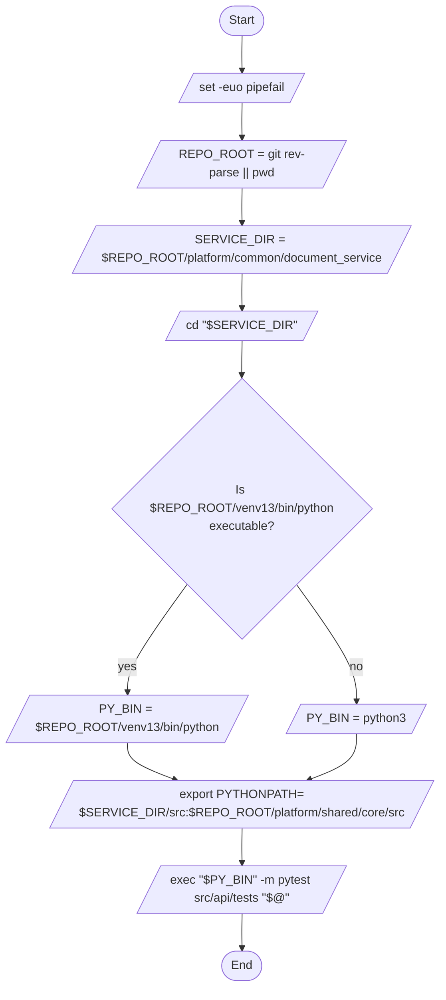

# Diagram: common/document_service/scripts/run_pytest.sh

> Auto-generated by Obscura crawlers

## Mermaid

### SVG

<svg id="container" width="634.953125" xmlns="http://www.w3.org/2000/svg" class="flowchart" height="1382.125" viewBox="0 0 634.953125 1382.125" role="graphics-document document" aria-roledescription="flowchart-v2"><g><marker id="container_flowchart-v2-pointEnd" class="marker flowchart-v2" viewBox="0 0 10 10" refX="5" refY="5" markerUnits="userSpaceOnUse" markerWidth="8" markerHeight="8" orient="auto"><path d="M 0 0 L 10 5 L 0 10 z" class="arrowMarkerPath" style="stroke-width: 1; stroke-dasharray: 1, 0;"></path></marker><marker id="container_flowchart-v2-pointStart" class="marker flowchart-v2" viewBox="0 0 10 10" refX="4.5" refY="5" markerUnits="userSpaceOnUse" markerWidth="8" markerHeight="8" orient="auto"><path d="M 0 5 L 10 10 L 10 0 z" class="arrowMarkerPath" style="stroke-width: 1; stroke-dasharray: 1, 0;"></path></marker><marker id="container_flowchart-v2-circleEnd" class="marker flowchart-v2" viewBox="0 0 10 10" refX="11" refY="5" markerUnits="userSpaceOnUse" markerWidth="11" markerHeight="11" orient="auto"><circle cx="5" cy="5" r="5" class="arrowMarkerPath" style="stroke-width: 1; stroke-dasharray: 1, 0;"></circle></marker><marker id="container_flowchart-v2-circleStart" class="marker flowchart-v2" viewBox="0 0 10 10" refX="-1" refY="5" markerUnits="userSpaceOnUse" markerWidth="11" markerHeight="11" orient="auto"><circle cx="5" cy="5" r="5" class="arrowMarkerPath" style="stroke-width: 1; stroke-dasharray: 1, 0;"></circle></marker><marker id="container_flowchart-v2-crossEnd" class="marker cross flowchart-v2" viewBox="0 0 11 11" refX="12" refY="5.2" markerUnits="userSpaceOnUse" markerWidth="11" markerHeight="11" orient="auto"><path d="M 1,1 l 9,9 M 10,1 l -9,9" class="arrowMarkerPath" style="stroke-width: 2; stroke-dasharray: 1, 0;"></path></marker><marker id="container_flowchart-v2-crossStart" class="marker cross flowchart-v2" viewBox="0 0 11 11" refX="-1" refY="5.2" markerUnits="userSpaceOnUse" markerWidth="11" markerHeight="11" orient="auto"><path d="M 1,1 l 9,9 M 10,1 l -9,9" class="arrowMarkerPath" style="stroke-width: 2; stroke-dasharray: 1, 0;"></path></marker><g class="root"><g class="clusters"></g><g class="edgePaths"><path d="M317.977,47.5L317.893,51.583C317.81,55.667,317.643,63.833,317.63,71.5C317.617,79.167,317.758,86.334,317.828,89.917L317.898,93.501" id="L_Start_SetShell_0" class="edge-thickness-normal edge-pattern-solid edge-thickness-normal edge-pattern-solid flowchart-link" style=";" data-edge="true" data-et="edge" data-id="L_Start_SetShell_0" data-points="W3sieCI6MzE3Ljk3NjU2MjUsInkiOjQ3LjV9LHsieCI6MzE3LjQ3NjU2MjUsInkiOjcyfSx7IngiOjMxNy45NzY1NjI1LCJ5Ijo5Ny41fV0=" marker-end="url(#container_flowchart-v2-pointEnd)"></path><path d="M317.977,136.5L317.893,140.583C317.81,144.667,317.643,152.833,317.63,160.5C317.617,168.167,317.758,175.334,317.828,178.917L317.898,182.501" id="L_SetShell_RepoRoot_0" class="edge-thickness-normal edge-pattern-solid edge-thickness-normal edge-pattern-solid flowchart-link" style=";" data-edge="true" data-et="edge" data-id="L_SetShell_RepoRoot_0" data-points="W3sieCI6MzE3Ljk3NjU2MjUsInkiOjEzNi41fSx7IngiOjMxNy40NzY1NjI1LCJ5IjoxNjF9LHsieCI6MzE3Ljk3NjU2MjUsInkiOjE4Ni41fV0=" marker-end="url(#container_flowchart-v2-pointEnd)"></path><path d="M317.977,249.5L317.893,253.583C317.81,257.667,317.643,265.833,317.63,273.5C317.617,281.167,317.758,288.334,317.828,291.917L317.898,295.501" id="L_RepoRoot_ServiceDir_0" class="edge-thickness-normal edge-pattern-solid edge-thickness-normal edge-pattern-solid flowchart-link" style=";" data-edge="true" data-et="edge" data-id="L_RepoRoot_ServiceDir_0" data-points="W3sieCI6MzE3Ljk3NjU2MjUsInkiOjI0OS41fSx7IngiOjMxNy40NzY1NjI1LCJ5IjoyNzR9LHsieCI6MzE3Ljk3NjU2MjUsInkiOjI5OS41fV0=" marker-end="url(#container_flowchart-v2-pointEnd)"></path><path d="M317.977,362.5L317.893,366.583C317.81,370.667,317.643,378.833,317.63,386.5C317.617,394.167,317.758,401.334,317.828,404.917L317.898,408.501" id="L_ServiceDir_CdServiceDir_0" class="edge-thickness-normal edge-pattern-solid edge-thickness-normal edge-pattern-solid flowchart-link" style=";" data-edge="true" data-et="edge" data-id="L_ServiceDir_CdServiceDir_0" data-points="W3sieCI6MzE3Ljk3NjU2MjUsInkiOjM2Mi41fSx7IngiOjMxNy40NzY1NjI1LCJ5IjozODd9LHsieCI6MzE3Ljk3NjU2MjUsInkiOjQxMi41fV0=" marker-end="url(#container_flowchart-v2-pointEnd)"></path><path d="M317.977,451.5L317.893,455.583C317.81,459.667,317.643,467.833,317.56,475.417C317.477,483,317.477,490,317.477,493.5L317.477,497" id="L_CdServiceDir_CheckVenv_0" class="edge-thickness-normal edge-pattern-solid edge-thickness-normal edge-pattern-solid flowchart-link" style=";" data-edge="true" data-et="edge" data-id="L_CdServiceDir_CheckVenv_0" data-points="W3sieCI6MzE3Ljk3NjU2MjUsInkiOjQ1MS41fSx7IngiOjMxNy40NzY1NjI1LCJ5Ijo0NzZ9LHsieCI6MzE3LjQ3NjU2MjUsInkiOjUwMX1d" marker-end="url(#container_flowchart-v2-pointEnd)"></path><path d="M238.2,842.849L226.498,862.228C214.796,881.608,191.392,920.366,179.765,945.329C168.137,970.292,168.286,981.459,168.361,987.042L168.435,992.625" id="L_CheckVenv_UseVenv_0" class="edge-thickness-normal edge-pattern-solid edge-thickness-normal edge-pattern-solid flowchart-link" style=";" data-edge="true" data-et="edge" data-id="L_CheckVenv_UseVenv_0" data-points="W3sieCI6MjM4LjIwMDQ5MDc1NTIwMTk0LCJ5Ijo4NDIuODQ4OTI4MjU1MjAxOX0seyJ4IjoxNjcuOTg4MjgxMjUsInkiOjk1OS4xMjV9LHsieCI6MTY4LjQ4ODI4MTI1LCJ5Ijo5OTYuNjI1fV0=" marker-end="url(#container_flowchart-v2-pointEnd)"></path><path d="M396.753,842.849L408.455,862.228C420.157,881.608,443.561,920.366,455.339,947.329C467.118,974.292,467.271,989.458,467.348,997.042L467.424,1004.625" id="L_CheckVenv_UsePy3_0" class="edge-thickness-normal edge-pattern-solid edge-thickness-normal edge-pattern-solid flowchart-link" style=";" data-edge="true" data-et="edge" data-id="L_CheckVenv_UsePy3_0" data-points="W3sieCI6Mzk2Ljc1MjYzNDI0NDc5ODA2LCJ5Ijo4NDIuODQ4OTI4MjU1MjAxOX0seyJ4Ijo0NjYuOTY0ODQzNzUsInkiOjk1OS4xMjV9LHsieCI6NDY3LjQ2NDg0Mzc1LCJ5IjoxMDA4LjYyNX1d" marker-end="url(#container_flowchart-v2-pointEnd)"></path><path d="M168.488,1059.625L168.405,1063.708C168.322,1067.792,168.155,1075.958,178.557,1084.053C188.958,1092.149,209.928,1100.172,220.413,1104.184L230.898,1108.196" id="L_UseVenv_ExportPath_0" class="edge-thickness-normal edge-pattern-solid edge-thickness-normal edge-pattern-solid flowchart-link" style=";" data-edge="true" data-et="edge" data-id="L_UseVenv_ExportPath_0" data-points="W3sieCI6MTY4LjQ4ODI4MTI1LCJ5IjoxMDU5LjYyNX0seyJ4IjoxNjcuOTg4MjgxMjUsInkiOjEwODQuMTI1fSx7IngiOjIzNC42MzM1Mzg0NDAyNjU0OCwieSI6MTEwOS42MjV9XQ==" marker-end="url(#container_flowchart-v2-pointEnd)"></path><path d="M467.465,1047.625L467.382,1053.708C467.298,1059.792,467.132,1071.958,456.729,1082.05C446.326,1092.142,425.687,1100.159,415.368,1104.168L405.048,1108.177" id="L_UsePy3_ExportPath_0" class="edge-thickness-normal edge-pattern-solid edge-thickness-normal edge-pattern-solid flowchart-link" style=";" data-edge="true" data-et="edge" data-id="L_UsePy3_ExportPath_0" data-points="W3sieCI6NDY3LjQ2NDg0Mzc1LCJ5IjoxMDQ3LjYyNX0seyJ4Ijo0NjYuOTY0ODQzNzUsInkiOjEwODQuMTI1fSx7IngiOjQwMS4zMTk1ODY1NTk3MzQ1LCJ5IjoxMTA5LjYyNX1d" marker-end="url(#container_flowchart-v2-pointEnd)"></path><path d="M317.977,1172.625L317.893,1176.708C317.81,1180.792,317.643,1188.958,317.63,1196.625C317.617,1204.292,317.758,1211.459,317.828,1215.042L317.898,1218.626" id="L_ExportPath_ExecPytest_0" class="edge-thickness-normal edge-pattern-solid edge-thickness-normal edge-pattern-solid flowchart-link" style=";" data-edge="true" data-et="edge" data-id="L_ExportPath_ExecPytest_0" data-points="W3sieCI6MzE3Ljk3NjU2MjUsInkiOjExNzIuNjI1fSx7IngiOjMxNy40NzY1NjI1LCJ5IjoxMTk3LjEyNX0seyJ4IjozMTcuOTc2NTYyNSwieSI6MTIyMi42MjV9XQ==" marker-end="url(#container_flowchart-v2-pointEnd)"></path><path d="M317.977,1285.625L317.893,1289.708C317.81,1293.792,317.643,1301.958,317.63,1309.625C317.617,1317.292,317.758,1324.459,317.828,1328.042L317.898,1331.626" id="L_ExecPytest_End_0" class="edge-thickness-normal edge-pattern-solid edge-thickness-normal edge-pattern-solid flowchart-link" style=";" data-edge="true" data-et="edge" data-id="L_ExecPytest_End_0" data-points="W3sieCI6MzE3Ljk3NjU2MjUsInkiOjEyODUuNjI1fSx7IngiOjMxNy40NzY1NjI1LCJ5IjoxMzEwLjEyNX0seyJ4IjozMTcuOTc2NTYyNSwieSI6MTMzNS42MjV9XQ==" marker-end="url(#container_flowchart-v2-pointEnd)"></path></g><g class="edgeLabels"><g class="edgeLabel"><g class="label" data-id="L_Start_SetShell_0" transform="translate(0, 0)"><foreignObject width="0" height="0">

</foreignObject></g></g><g class="edgeLabel"><g class="label" data-id="L_SetShell_RepoRoot_0" transform="translate(0, 0)"><foreignObject width="0" height="0">

</foreignObject></g></g><g class="edgeLabel"><g class="label" data-id="L_RepoRoot_ServiceDir_0" transform="translate(0, 0)"><foreignObject width="0" height="0">

</foreignObject></g></g><g class="edgeLabel"><g class="label" data-id="L_ServiceDir_CdServiceDir_0" transform="translate(0, 0)"><foreignObject width="0" height="0">

</foreignObject></g></g><g class="edgeLabel"><g class="label" data-id="L_CdServiceDir_CheckVenv_0" transform="translate(0, 0)"><foreignObject width="0" height="0">

</foreignObject></g></g><g class="edgeLabel" transform="translate(167.98828125, 959.125)"><g class="label" data-id="L_CheckVenv_UseVenv_0" transform="translate(-12.0078125, -12)"><foreignObject width="24.015625" height="24">

yes

</foreignObject></g></g><g class="edgeLabel" transform="translate(466.96484375, 959.125)"><g class="label" data-id="L_CheckVenv_UsePy3_0" transform="translate(-9.3671875, -12)"><foreignObject width="18.734375" height="24">

no

</foreignObject></g></g><g class="edgeLabel"><g class="label" data-id="L_UseVenv_ExportPath_0" transform="translate(0, 0)"><foreignObject width="0" height="0">

</foreignObject></g></g><g class="edgeLabel"><g class="label" data-id="L_UsePy3_ExportPath_0" transform="translate(0, 0)"><foreignObject width="0" height="0">

</foreignObject></g></g><g class="edgeLabel"><g class="label" data-id="L_ExportPath_ExecPytest_0" transform="translate(0, 0)"><foreignObject width="0" height="0">

</foreignObject></g></g><g class="edgeLabel"><g class="label" data-id="L_ExecPytest_End_0" transform="translate(0, 0)"><foreignObject width="0" height="0">

</foreignObject></g></g></g><g class="nodes"><g class="node default" id="flowchart-Start-0" transform="translate(317.4765625, 27.5)"><g class="basic label-container outer-path"><path d="M-10.3984375 -19.5 C-4.366087822657222 -19.5, 1.6662618546855565 -19.5, 10.3984375 -19.5 C10.3984375 -19.5, 10.398437499999998 -19.5, 10.398437499999998 -19.5 C10.766108614609339 -19.48820950298289, 11.133779729218679 -19.476419005965777, 11.6478067896239 -19.45993515863156 C12.106558582265075 -19.415679924925215, 12.565310374906252 -19.371424691218873, 12.892042152847864 -19.3399052695533 C13.332548415159318 -19.268687633239868, 13.77305467747077 -19.19746999692644, 14.126030759676757 -19.140403561325776 C14.531696484953649 -19.047813006747578, 14.937362210230539 -18.95522245216938, 15.34470188623539 -18.862249829261074 C15.66327574489147 -18.76769878024026, 15.98184960354755 -18.67314773121944, 16.543047751460602 -18.50658706670804 C16.85154589388832 -18.39305689856907, 17.160044036316044 -18.279526730430103, 17.716144095147794 -18.074876768247425 C18.074744132087226 -17.916135169386482, 18.433344169026658 -17.757393570525544, 18.85917041279238 -17.568892924097174 C19.278687476545706 -17.350031140650568, 19.698204540299027 -17.131169357203966, 19.967429764076783 -16.990714730406097 C20.199452596998885 -16.8500611255712, 20.43147542992099 -16.70940752073631, 21.036368073605697 -16.342718045390892 C21.26147788376656 -16.185691186669295, 21.486587693927426 -16.028664327947702, 22.061592844578712 -15.627565626425154 C22.286463453742115 -15.448237299675563, 22.51133406290552 -15.268908972925972, 23.03889120850187 -14.848196188198123 C23.250609304359443 -14.655919415294127, 23.462327400217013 -14.46364264239013, 23.964247236767985 -14.007812326905688 C24.30720422065755 -13.653681083747681, 24.650161204547114 -13.299549840589673, 24.833858442968648 -13.10986736009568 C25.051954823909213 -12.853678941007258, 25.27005120484978 -12.597490521918836, 25.644151408126582 -12.158051136245305 C25.927857051416026 -11.77791142035326, 26.211562694705467 -11.397771704461212, 26.391796464640635 -11.156274872382312 C26.636199590194053 -10.780806040103782, 26.880602715747475 -10.405337207825252, 27.073721378604247 -10.108655082055241 C27.257814007056524 -9.78177997883819, 27.4419066355088 -9.454904875621137, 27.6871239742735 -9.019496659696287 C27.837656651348738 -8.706912334866244, 27.988189328423974 -8.3943280100362, 28.22948364880834 -7.893275190886684 C28.32962556624123 -7.645922718715189, 28.42976748367412 -7.398570246543694, 28.698571729970325 -6.734618561215508 C28.85222424650116 -6.271841662628533, 29.005876763031992 -5.809064764041557, 29.09246063421488 -5.548287939305138 C29.167826538472823 -5.260885082580076, 29.243192442730766 -4.973482225855015, 29.40953178754556 -4.339158212148133 C29.457459706273667 -4.093058479048513, 29.505387625001774 -3.8469587459488928, 29.648482276581777 -3.1121979531509023 C29.70181974197412 -2.6985231042417555, 29.755157207366466 -2.284848255332608, 29.808330202509367 -1.872449005199798 C29.834692642442068 -1.461832723869455, 29.86105508237477 -1.0512164425391122, 29.888418715913414 -0.6250057626472757 C29.888418715913414 -0.12733136336937134, 29.888418715913414 0.370343035908533, 29.888418715913414 0.625005762647271 C29.86080527312259 1.0551074232842097, 29.833191830331764 1.4852090839211483, 29.808330202509367 1.8724490051997846 C29.767278988095747 2.190834117712628, 29.726227773682126 2.509219230225471, 29.648482276581777 3.1121979531508885 C29.554985386546836 3.592284722905612, 29.461488496511894 4.072371492660336, 29.40953178754556 4.339158212148129 C29.30318198860888 4.744716087788114, 29.1968321896722 5.1502739634281, 29.092460634214884 5.548287939305125 C28.99104218484604 5.853744149968593, 28.889623735477194 6.1592003606320604, 28.69857172997033 6.734618561215495 C28.544613075461374 7.114899414440702, 28.390654420952423 7.495180267665909, 28.229483648808344 7.893275190886679 C28.061731590581378 8.241615929114024, 27.89397953235441 8.58995666734137, 27.687123974273504 9.019496659696284 C27.52864841039531 9.300886070752979, 27.370172846517118 9.582275481809674, 27.07372137860425 10.108655082055236 C26.91427962475427 10.35360043207454, 26.754837870904282 10.598545782093844, 26.39179646464064 11.156274872382301 C26.09551286291982 11.553267906696812, 25.799229261198995 11.950260941011322, 25.644151408126582 12.158051136245302 C25.37549887936628 12.473625683289093, 25.106846350605977 12.789200230332886, 24.83385844296866 13.10986736009567 C24.51781720572342 13.436205885019513, 24.201775968478184 13.762544409943356, 23.96424723676799 14.007812326905684 C23.714079811781236 14.235007763211303, 23.463912386794483 14.462203199516921, 23.038891208501887 14.848196188198111 C22.76430369747929 15.067172421158087, 22.48971618645669 15.286148654118064, 22.061592844578715 15.627565626425152 C21.732533418609577 15.857103237228259, 21.403473992640436 16.086640848031365, 21.036368073605708 16.34271804539089 C20.774985420037826 16.50116974603871, 20.513602766469944 16.659621446686533, 19.967429764076787 16.990714730406093 C19.615042174125048 17.174555110368892, 19.262654584173312 17.358395490331688, 18.859170412792388 17.56889292409717 C18.61892361144831 17.675243056384044, 18.378676810104228 17.781593188670918, 17.716144095147804 18.07487676824742 C17.36903950832878 18.202614464796447, 17.021934921509757 18.330352161345477, 16.543047751460616 18.506587066708033 C16.084453122575123 18.64269554534892, 15.625858493689627 18.778804023989807, 15.344701886235413 18.86224982926107 C14.858461173351078 18.973231098959733, 14.37222046046674 19.0842123686584, 14.126030759676766 19.140403561325773 C13.844336458126337 19.185945711428513, 13.562642156575908 19.23148786153125, 12.892042152847878 19.3399052695533 C12.496638449262045 19.378049389295697, 12.101234745676212 19.416193509038095, 11.6478067896239 19.45993515863156 C11.384420207389171 19.468381453672944, 11.12103362515444 19.47682774871433, 10.398437500000004 19.5 C10.398437500000004 19.5, 10.398437500000002 19.5, 10.3984375 19.5 C5.464093016038318 19.5, 0.5297485320766366 19.5, -10.398437499999996 19.5 C-10.819270252575299 19.48650471272617, -11.2401030051506 19.473009425452343, -11.647806789623893 19.45993515863156 C-12.0267020930175 19.42338358440145, -12.405597396411109 19.38683201017134, -12.892042152847871 19.3399052695533 C-13.274384919984252 19.27809105607513, -13.656727687120632 19.216276842596965, -14.126030759676759 19.140403561325773 C-14.487498945475403 19.057900806717587, -14.848967131274046 18.9753980521094, -15.344701886235388 18.862249829261074 C-15.59026632694003 18.78936759225399, -15.835830767644671 18.716485355246906, -16.54304775146059 18.506587066708043 C-16.824738859368324 18.40292213507394, -17.106429967276053 18.29925720343984, -17.716144095147797 18.074876768247425 C-18.037344634851497 17.932690817396075, -18.358545174555193 17.790504866544723, -18.85917041279238 17.568892924097174 C-19.08562188109526 17.45075333813265, -19.31207334939814 17.332613752168125, -19.96742976407678 16.990714730406097 C-20.24309683793952 16.82360373023096, -20.518763911802264 16.656492730055824, -21.036368073605686 16.3427180453909 C-21.26134070545361 16.18578687632206, -21.486313337301535 16.028855707253214, -22.061592844578712 15.627565626425156 C-22.312527645712684 15.427451800176312, -22.56346244684666 15.22733797392747, -23.03889120850187 14.848196188198125 C-23.31933880441763 14.593501101824202, -23.59978640033339 14.338806015450281, -23.964247236767974 14.007812326905697 C-24.282398883845886 13.67929463056175, -24.600550530923794 13.350776934217807, -24.833858442968655 13.109867360095677 C-24.99719323592953 12.918005018270827, -25.1605280288904 12.726142676445978, -25.64415140812658 12.158051136245307 C-25.879406257617426 11.842831070085262, -26.114661107108272 11.527611003925216, -26.391796464640635 11.156274872382316 C-26.58051023732961 10.866359840788673, -26.76922401001858 10.57644480919503, -27.073721378604244 10.108655082055249 C-27.207318147149078 9.871440491364142, -27.34091491569391 9.634225900673034, -27.6871239742735 9.019496659696289 C-27.86873689720888 8.642373539326934, -28.050349820144255 8.26525041895758, -28.22948364880834 7.893275190886686 C-28.365747408046264 7.556701071088449, -28.50201116728419 7.2201269512902115, -28.698571729970325 6.73461856121551 C-28.817434704325905 6.376622220699598, -28.936297678681488 6.018625880183687, -29.09246063421488 5.5482879393051325 C-29.213679993874216 5.086025984121279, -29.33489935353355 4.623764028937425, -29.409531787545557 4.339158212148136 C-29.488069513967456 3.9358835859260406, -29.56660724038936 3.5326089597039454, -29.648482276581777 3.112197953150904 C-29.688987220062327 2.798049610121554, -29.729492163542876 2.483901267092204, -29.808330202509364 1.872449005199809 C-29.837086157560947 1.424551793882292, -29.865842112612526 0.9766545825647752, -29.888418715913414 0.6250057626472781 C-29.888418715913414 0.3219564620617658, -29.888418715913414 0.018907161476253487, -29.888418715913414 -0.6250057626472687 C-29.861371302648553 -1.046291056526511, -29.834323889383693 -1.4675763504057535, -29.808330202509367 -1.8724490051997822 C-29.76801516224007 -2.1851244964233003, -29.72770012197077 -2.497799987646818, -29.648482276581777 -3.112197953150895 C-29.58635450863132 -3.431210910868095, -29.52422674068086 -3.750223868585294, -29.40953178754556 -4.339158212148126 C-29.34423541880014 -4.588161565799654, -29.278939050054714 -4.837164919451182, -29.092460634214884 -5.548287939305123 C-28.963285754443604 -5.93734209595411, -28.834110874672326 -6.326396252603097, -28.698571729970332 -6.734618561215485 C-28.580640948265078 -7.025909872064022, -28.46271016655982 -7.31720118291256, -28.229483648808344 -7.893275190886676 C-28.012755931844577 -8.343314932392211, -27.79602821488081 -8.793354673897747, -27.687123974273504 -9.019496659696282 C-27.551475169763094 -9.260354848035446, -27.415826365252684 -9.50121303637461, -27.073721378604247 -10.108655082055243 C-26.927711565544545 -10.332965364039547, -26.781701752484842 -10.557275646023852, -26.39179646464064 -11.156274872382308 C-26.152856278458273 -11.476432953967912, -25.913916092275908 -11.796591035553515, -25.644151408126586 -12.158051136245302 C-25.404637522774117 -12.439397774706475, -25.165123637421647 -12.720744413167646, -24.833858442968662 -13.10986736009567 C-24.5099442771743 -13.444335330125938, -24.18603011137994 -13.778803300156206, -23.964247236767996 -14.007812326905677 C-23.704273845143828 -14.243913282659735, -23.44430045351966 -14.480014238413792, -23.038891208501887 -14.848196188198107 C-22.718047532164615 -15.104060482068283, -22.397203855827343 -15.359924775938458, -22.06159284457872 -15.627565626425149 C-21.847538943050562 -15.77688036188714, -21.633485041522405 -15.92619509734913, -21.03636807360571 -16.342718045390885 C-20.8127893097794 -16.47825280591705, -20.58921054595309 -16.613787566443214, -19.96742976407679 -16.99071473040609 C-19.616657290477363 -17.17371250520242, -19.265884816877932 -17.35671027999875, -18.859170412792388 -17.56889292409717 C-18.47208975914148 -17.740242047128806, -18.08500910549057 -17.911591170160442, -17.716144095147804 -18.07487676824742 C-17.285623524877842 -18.233312317795292, -16.85510295460788 -18.391747867343163, -16.54304775146062 -18.506587066708033 C-16.124835264343226 -18.630710337642334, -15.706622777225833 -18.754833608576636, -15.344701886235413 -18.862249829261067 C-15.011165856844338 -18.938377251443583, -14.677629827453263 -19.014504673626096, -14.126030759676768 -19.140403561325773 C-13.800912097671585 -19.19296622526589, -13.475793435666404 -19.24552888920601, -12.89204215284788 -19.3399052695533 C-12.62417438404324 -19.365746151051756, -12.356306615238598 -19.391587032550216, -11.647806789623903 -19.45993515863156 C-11.30400400754285 -19.47096024468138, -10.960201225461798 -19.4819853307312, -10.398437500000005 -19.5 C-10.398437500000004 -19.5, -10.398437500000002 -19.5, -10.3984375 -19.5" stroke="none" stroke-width="0" fill="#ECECFF" style=""></path><path d="M-10.3984375 -19.5 C-4.337216562857389 -19.5, 1.7240043742852222 -19.5, 10.3984375 -19.5 M-10.3984375 -19.5 C-2.891446065638271 -19.5, 4.615545368723458 -19.5, 10.3984375 -19.5 M10.3984375 -19.5 C10.3984375 -19.5, 10.3984375 -19.5, 10.398437499999998 -19.5 M10.3984375 -19.5 C10.3984375 -19.5, 10.398437499999998 -19.5, 10.398437499999998 -19.5 M10.398437499999998 -19.5 C10.80695528765471 -19.48689962968155, 11.21547307530942 -19.473799259363098, 11.6478067896239 -19.45993515863156 M10.398437499999998 -19.5 C10.717624391896171 -19.489764297636487, 11.036811283792344 -19.47952859527297, 11.6478067896239 -19.45993515863156 M11.6478067896239 -19.45993515863156 C12.06017581030292 -19.42015441515296, 12.47254483098194 -19.380373671674363, 12.892042152847864 -19.3399052695533 M11.6478067896239 -19.45993515863156 C11.94388435219139 -19.431372912256037, 12.239961914758881 -19.40281066588052, 12.892042152847864 -19.3399052695533 M12.892042152847864 -19.3399052695533 C13.359253620751339 -19.264370142701715, 13.826465088654812 -19.188835015850128, 14.126030759676757 -19.140403561325776 M12.892042152847864 -19.3399052695533 C13.358948947208702 -19.26441939995731, 13.82585574156954 -19.188933530361318, 14.126030759676757 -19.140403561325776 M14.126030759676757 -19.140403561325776 C14.59080847627661 -19.034321080469905, 15.055586192876463 -18.928238599614033, 15.34470188623539 -18.862249829261074 M14.126030759676757 -19.140403561325776 C14.41634760393668 -19.074140636117907, 14.706664448196603 -19.007877710910037, 15.34470188623539 -18.862249829261074 M15.34470188623539 -18.862249829261074 C15.642566655327801 -18.773845129318527, 15.940431424420213 -18.685440429375976, 16.543047751460602 -18.50658706670804 M15.34470188623539 -18.862249829261074 C15.807034670929225 -18.725031885598256, 16.26936745562306 -18.587813941935433, 16.543047751460602 -18.50658706670804 M16.543047751460602 -18.50658706670804 C16.873575348732306 -18.384949855548438, 17.204102946004006 -18.263312644388833, 17.716144095147794 -18.074876768247425 M16.543047751460602 -18.50658706670804 C16.809626796633026 -18.408483513854907, 17.07620584180545 -18.310379961001775, 17.716144095147794 -18.074876768247425 M17.716144095147794 -18.074876768247425 C18.04093406088546 -17.931101884967376, 18.365724026623127 -17.78732700168733, 18.85917041279238 -17.568892924097174 M17.716144095147794 -18.074876768247425 C18.076438785038967 -17.91538499679484, 18.436733474930136 -17.75589322534226, 18.85917041279238 -17.568892924097174 M18.85917041279238 -17.568892924097174 C19.283091461817367 -17.34773358435523, 19.707012510842354 -17.126574244613288, 19.967429764076783 -16.990714730406097 M18.85917041279238 -17.568892924097174 C19.171600990354012 -17.405898091904607, 19.484031567915647 -17.24290325971204, 19.967429764076783 -16.990714730406097 M19.967429764076783 -16.990714730406097 C20.22478892465241 -16.834702094854848, 20.48214808522804 -16.678689459303598, 21.036368073605697 -16.342718045390892 M19.967429764076783 -16.990714730406097 C20.18520733628719 -16.85869668632908, 20.402984908497594 -16.72667864225206, 21.036368073605697 -16.342718045390892 M21.036368073605697 -16.342718045390892 C21.370533712575266 -16.109618561443085, 21.704699351544836 -15.876519077495278, 22.061592844578712 -15.627565626425154 M21.036368073605697 -16.342718045390892 C21.421358867347095 -16.074165133659747, 21.806349661088493 -15.805612221928602, 22.061592844578712 -15.627565626425154 M22.061592844578712 -15.627565626425154 C22.347916683474097 -15.399229984303432, 22.634240522369485 -15.170894342181708, 23.03889120850187 -14.848196188198123 M22.061592844578712 -15.627565626425154 C22.448851232672723 -15.318737367298684, 22.836109620766734 -15.009909108172216, 23.03889120850187 -14.848196188198123 M23.03889120850187 -14.848196188198123 C23.305104899838746 -14.606427957354265, 23.571318591175626 -14.364659726510409, 23.964247236767985 -14.007812326905688 M23.03889120850187 -14.848196188198123 C23.34419381452246 -14.570928439274526, 23.64949642054305 -14.29366069035093, 23.964247236767985 -14.007812326905688 M23.964247236767985 -14.007812326905688 C24.200092478705656 -13.764282751350573, 24.435937720643324 -13.520753175795457, 24.833858442968648 -13.10986736009568 M23.964247236767985 -14.007812326905688 C24.18935090720236 -13.775374305827146, 24.414454577636736 -13.542936284748606, 24.833858442968648 -13.10986736009568 M24.833858442968648 -13.10986736009568 C25.03162794268061 -12.877556052330682, 25.229397442392575 -12.645244744565682, 25.644151408126582 -12.158051136245305 M24.833858442968648 -13.10986736009568 C25.10347624778669 -12.793158944868702, 25.373094052604735 -12.476450529641726, 25.644151408126582 -12.158051136245305 M25.644151408126582 -12.158051136245305 C25.881803145767616 -11.839619458325007, 26.119454883408654 -11.521187780404711, 26.391796464640635 -11.156274872382312 M25.644151408126582 -12.158051136245305 C25.79941007623185 -11.950018665339886, 25.95466874433712 -11.741986194434467, 26.391796464640635 -11.156274872382312 M26.391796464640635 -11.156274872382312 C26.58500328303367 -10.85945731603552, 26.778210101426712 -10.56263975968873, 27.073721378604247 -10.108655082055241 M26.391796464640635 -11.156274872382312 C26.56775501684581 -10.885955284708068, 26.743713569050982 -10.615635697033824, 27.073721378604247 -10.108655082055241 M27.073721378604247 -10.108655082055241 C27.307170851472893 -9.694141903654474, 27.54062032434154 -9.279628725253705, 27.6871239742735 -9.019496659696287 M27.073721378604247 -10.108655082055241 C27.27513310817235 -9.75102816105788, 27.476544837740455 -9.39340124006052, 27.6871239742735 -9.019496659696287 M27.6871239742735 -9.019496659696287 C27.867382902658335 -8.645185137981978, 28.04764183104317 -8.270873616267668, 28.22948364880834 -7.893275190886684 M27.6871239742735 -9.019496659696287 C27.899605927007578 -8.578273338458507, 28.11208787974165 -8.137050017220727, 28.22948364880834 -7.893275190886684 M28.22948364880834 -7.893275190886684 C28.349782502532683 -7.5961346963674465, 28.470081356257026 -7.29899420184821, 28.698571729970325 -6.734618561215508 M28.22948364880834 -7.893275190886684 C28.414422488912134 -7.4364726802810885, 28.599361329015924 -6.979670169675494, 28.698571729970325 -6.734618561215508 M28.698571729970325 -6.734618561215508 C28.780082269677386 -6.489121802558684, 28.861592809384444 -6.243625043901861, 29.09246063421488 -5.548287939305138 M28.698571729970325 -6.734618561215508 C28.823853085870947 -6.357291078116162, 28.949134441771566 -5.979963595016814, 29.09246063421488 -5.548287939305138 M29.09246063421488 -5.548287939305138 C29.212507731127992 -5.090496330034526, 29.332554828041104 -4.632704720763913, 29.40953178754556 -4.339158212148133 M29.09246063421488 -5.548287939305138 C29.179558399543485 -5.216146411696891, 29.26665616487209 -4.884004884088643, 29.40953178754556 -4.339158212148133 M29.40953178754556 -4.339158212148133 C29.478146030262657 -3.9868385774211696, 29.546760272979757 -3.634518942694206, 29.648482276581777 -3.1121979531509023 M29.40953178754556 -4.339158212148133 C29.46068928772582 -4.076475260863996, 29.51184678790608 -3.813792309579858, 29.648482276581777 -3.1121979531509023 M29.648482276581777 -3.1121979531509023 C29.687524080305757 -2.8093974331438947, 29.726565884029736 -2.506596913136887, 29.808330202509367 -1.872449005199798 M29.648482276581777 -3.1121979531509023 C29.702735852383157 -2.6914179328157264, 29.75698942818454 -2.2706379124805505, 29.808330202509367 -1.872449005199798 M29.808330202509367 -1.872449005199798 C29.832043649694292 -1.5030929241445394, 29.855757096879216 -1.133736843089281, 29.888418715913414 -0.6250057626472757 M29.808330202509367 -1.872449005199798 C29.827617135271545 -1.5720394592969664, 29.84690406803372 -1.271629913394135, 29.888418715913414 -0.6250057626472757 M29.888418715913414 -0.6250057626472757 C29.888418715913414 -0.24140242089261327, 29.888418715913414 0.14220092086204916, 29.888418715913414 0.625005762647271 M29.888418715913414 -0.6250057626472757 C29.888418715913414 -0.23850139854186542, 29.888418715913414 0.14800296556354486, 29.888418715913414 0.625005762647271 M29.888418715913414 0.625005762647271 C29.86252920918542 1.0282557275694841, 29.836639702457425 1.4315056924916973, 29.808330202509367 1.8724490051997846 M29.888418715913414 0.625005762647271 C29.860750482382297 1.0559608332905377, 29.833082248851184 1.4869159039338045, 29.808330202509367 1.8724490051997846 M29.808330202509367 1.8724490051997846 C29.75587056115618 2.2793156242072015, 29.70341091980299 2.686182243214618, 29.648482276581777 3.1121979531508885 M29.808330202509367 1.8724490051997846 C29.77137546736342 2.1590626334539, 29.73442073221747 2.4456762617080154, 29.648482276581777 3.1121979531508885 M29.648482276581777 3.1121979531508885 C29.600606882986124 3.358027980796545, 29.552731489390474 3.603858008442202, 29.40953178754556 4.339158212148129 M29.648482276581777 3.1121979531508885 C29.572944988338275 3.500065963469759, 29.49740770009477 3.887933973788629, 29.40953178754556 4.339158212148129 M29.40953178754556 4.339158212148129 C29.31380786661351 4.704195009671802, 29.21808394568146 5.069231807195477, 29.092460634214884 5.548287939305125 M29.40953178754556 4.339158212148129 C29.32600142185554 4.657695698813676, 29.242471056165517 4.976233185479222, 29.092460634214884 5.548287939305125 M29.092460634214884 5.548287939305125 C28.97547110837567 5.900641751383214, 28.858481582536463 6.252995563461303, 28.69857172997033 6.734618561215495 M29.092460634214884 5.548287939305125 C28.951351232729237 5.973286973849977, 28.810241831243594 6.3982860083948285, 28.69857172997033 6.734618561215495 M28.69857172997033 6.734618561215495 C28.53252477572672 7.144757748496672, 28.366477821483112 7.55489693577785, 28.229483648808344 7.893275190886679 M28.69857172997033 6.734618561215495 C28.55814710534653 7.081470098961698, 28.417722480722734 7.4283216367079, 28.229483648808344 7.893275190886679 M28.229483648808344 7.893275190886679 C28.037988436808053 8.290919095946435, 27.846493224807766 8.688563001006193, 27.687123974273504 9.019496659696284 M28.229483648808344 7.893275190886679 C28.098985337885477 8.164257725734565, 27.968487026962606 8.435240260582452, 27.687123974273504 9.019496659696284 M27.687123974273504 9.019496659696284 C27.50672224114007 9.33981820453105, 27.32632050800664 9.660139749365817, 27.07372137860425 10.108655082055236 M27.687123974273504 9.019496659696284 C27.555990798970587 9.252336891120502, 27.42485762366767 9.485177122544718, 27.07372137860425 10.108655082055236 M27.07372137860425 10.108655082055236 C26.91801702503767 10.347858781606732, 26.762312671471093 10.587062481158227, 26.39179646464064 11.156274872382301 M27.07372137860425 10.108655082055236 C26.89532430469881 10.382720893895854, 26.71692723079337 10.656786705736472, 26.39179646464064 11.156274872382301 M26.39179646464064 11.156274872382301 C26.239847314154964 11.359872891180723, 26.08789816366929 11.563470909979147, 25.644151408126582 12.158051136245302 M26.39179646464064 11.156274872382301 C26.161045025693173 11.46546077868336, 25.930293586745705 11.774646684984418, 25.644151408126582 12.158051136245302 M25.644151408126582 12.158051136245302 C25.43907063415859 12.398950682774725, 25.233989860190597 12.639850229304148, 24.83385844296866 13.10986736009567 M25.644151408126582 12.158051136245302 C25.402755960295035 12.441607965058337, 25.16136051246349 12.72516479387137, 24.83385844296866 13.10986736009567 M24.83385844296866 13.10986736009567 C24.495657537512855 13.459087561789518, 24.157456632057052 13.808307763483366, 23.96424723676799 14.007812326905684 M24.83385844296866 13.10986736009567 C24.53658046907705 13.416831275114319, 24.239302495185445 13.723795190132968, 23.96424723676799 14.007812326905684 M23.96424723676799 14.007812326905684 C23.7080823198522 14.240454526696315, 23.451917402936406 14.473096726486943, 23.038891208501887 14.848196188198111 M23.96424723676799 14.007812326905684 C23.661811818747715 14.282476171549034, 23.35937640072744 14.557140016192383, 23.038891208501887 14.848196188198111 M23.038891208501887 14.848196188198111 C22.765165070485722 15.066485499107555, 22.491438932469556 15.284774810017, 22.061592844578715 15.627565626425152 M23.038891208501887 14.848196188198111 C22.777349494826012 15.056768744937322, 22.515807781150137 15.265341301676534, 22.061592844578715 15.627565626425152 M22.061592844578715 15.627565626425152 C21.65318730674913 15.912451650024284, 21.24478176891954 16.197337673623416, 21.036368073605708 16.34271804539089 M22.061592844578715 15.627565626425152 C21.6982008402019 15.881052157692089, 21.334808835825083 16.134538688959026, 21.036368073605708 16.34271804539089 M21.036368073605708 16.34271804539089 C20.815168846739848 16.47681031662792, 20.593969619873988 16.610902587864945, 19.967429764076787 16.990714730406093 M21.036368073605708 16.34271804539089 C20.67299601100503 16.56299632515069, 20.309623948404347 16.783274604910485, 19.967429764076787 16.990714730406093 M19.967429764076787 16.990714730406093 C19.651774694884715 17.155391777816874, 19.336119625692646 17.320068825227658, 18.859170412792388 17.56889292409717 M19.967429764076787 16.990714730406093 C19.54530920290824 17.2109347567866, 19.12318864173969 17.43115478316711, 18.859170412792388 17.56889292409717 M18.859170412792388 17.56889292409717 C18.55156076637343 17.70506258965089, 18.243951119954474 17.84123225520461, 17.716144095147804 18.07487676824742 M18.859170412792388 17.56889292409717 C18.539159728210134 17.710552161382054, 18.21914904362788 17.85221139866694, 17.716144095147804 18.07487676824742 M17.716144095147804 18.07487676824742 C17.370614823832756 18.20203473412893, 17.025085552517705 18.329192700010438, 16.543047751460616 18.506587066708033 M17.716144095147804 18.07487676824742 C17.42411862834954 18.182344839483005, 17.13209316155128 18.289812910718588, 16.543047751460616 18.506587066708033 M16.543047751460616 18.506587066708033 C16.197180930954854 18.609238523542157, 15.851314110449092 18.711889980376277, 15.344701886235413 18.86224982926107 M16.543047751460616 18.506587066708033 C16.08597579986341 18.642243622722454, 15.628903848266201 18.77790017873687, 15.344701886235413 18.86224982926107 M15.344701886235413 18.86224982926107 C15.085178889749734 18.921484259663103, 14.825655893264056 18.98071869006514, 14.126030759676766 19.140403561325773 M15.344701886235413 18.86224982926107 C14.92958624680238 18.956997265078954, 14.514470607369349 19.051744700896837, 14.126030759676766 19.140403561325773 M14.126030759676766 19.140403561325773 C13.827458294297166 19.188674442064297, 13.528885828917566 19.23694532280282, 12.892042152847878 19.3399052695533 M14.126030759676766 19.140403561325773 C13.744727748129042 19.20204967518379, 13.363424736581319 19.263695789041808, 12.892042152847878 19.3399052695533 M12.892042152847878 19.3399052695533 C12.582438740048476 19.369772338433478, 12.272835327249071 19.399639407313654, 11.6478067896239 19.45993515863156 M12.892042152847878 19.3399052695533 C12.424068671128042 19.385050108514356, 11.956095189408204 19.430194947475414, 11.6478067896239 19.45993515863156 M11.6478067896239 19.45993515863156 C11.352022803535581 19.46942037535681, 11.05623881744726 19.478905592082057, 10.398437500000004 19.5 M11.6478067896239 19.45993515863156 C11.352316622358382 19.469410953159045, 11.056826455092866 19.47888674768653, 10.398437500000004 19.5 M10.398437500000004 19.5 C10.398437500000002 19.5, 10.398437500000002 19.5, 10.3984375 19.5 M10.398437500000004 19.5 C10.398437500000002 19.5, 10.398437500000002 19.5, 10.3984375 19.5 M10.3984375 19.5 C4.665225886181914 19.5, -1.067985727636172 19.5, -10.398437499999996 19.5 M10.3984375 19.5 C5.469181130289291 19.5, 0.5399247605785824 19.5, -10.398437499999996 19.5 M-10.398437499999996 19.5 C-10.779850761069033 19.487768819093393, -11.16126402213807 19.475537638186783, -11.647806789623893 19.45993515863156 M-10.398437499999996 19.5 C-10.807419116453863 19.486884755594748, -11.21640073290773 19.4737695111895, -11.647806789623893 19.45993515863156 M-11.647806789623893 19.45993515863156 C-12.01538286558165 19.424475536658825, -12.382958941539409 19.389015914686087, -12.892042152847871 19.3399052695533 M-11.647806789623893 19.45993515863156 C-11.94124000224714 19.431628009514863, -12.234673214870387 19.40332086039817, -12.892042152847871 19.3399052695533 M-12.892042152847871 19.3399052695533 C-13.18223942097045 19.292988425756665, -13.472436689093032 19.24607158196003, -14.126030759676759 19.140403561325773 M-12.892042152847871 19.3399052695533 C-13.287508206182098 19.27596938493527, -13.682974259516323 19.212033500317236, -14.126030759676759 19.140403561325773 M-14.126030759676759 19.140403561325773 C-14.502003233805752 19.05459029755551, -14.877975707934745 18.968777033785248, -15.344701886235388 18.862249829261074 M-14.126030759676759 19.140403561325773 C-14.397357971730791 19.078474895749967, -14.668685183784824 19.016546230174164, -15.344701886235388 18.862249829261074 M-15.344701886235388 18.862249829261074 C-15.700317933388522 18.75670485313275, -16.055933980541656 18.65115987700442, -16.54304775146059 18.506587066708043 M-15.344701886235388 18.862249829261074 C-15.658636987241762 18.769075539161356, -15.972572088248135 18.675901249061635, -16.54304775146059 18.506587066708043 M-16.54304775146059 18.506587066708043 C-16.884242979730285 18.38102406873068, -17.225438207999982 18.255461070753316, -17.716144095147797 18.074876768247425 M-16.54304775146059 18.506587066708043 C-16.957085519646277 18.354217340692536, -17.371123287831967 18.201847614677032, -17.716144095147797 18.074876768247425 M-17.716144095147797 18.074876768247425 C-18.063375973918227 17.92116751578347, -18.410607852688653 17.767458263319515, -18.85917041279238 17.568892924097174 M-17.716144095147797 18.074876768247425 C-18.135240975722052 17.88935501128445, -18.554337856296307 17.70383325432148, -18.85917041279238 17.568892924097174 M-18.85917041279238 17.568892924097174 C-19.143481900508487 17.42056780306588, -19.427793388224593 17.272242682034587, -19.96742976407678 16.990714730406097 M-18.85917041279238 17.568892924097174 C-19.301690482021247 17.338030487428107, -19.74421055125011 17.10716805075904, -19.96742976407678 16.990714730406097 M-19.96742976407678 16.990714730406097 C-20.306681604812322 16.7850582708871, -20.64593344554787 16.579401811368104, -21.036368073605686 16.3427180453909 M-19.96742976407678 16.990714730406097 C-20.23416618339323 16.829017545499273, -20.500902602709687 16.667320360592445, -21.036368073605686 16.3427180453909 M-21.036368073605686 16.3427180453909 C-21.388040588864417 16.09740652240423, -21.73971310412315 15.852094999417565, -22.061592844578712 15.627565626425156 M-21.036368073605686 16.3427180453909 C-21.303342364753142 16.15648833701723, -21.570316655900598 15.970258628643563, -22.061592844578712 15.627565626425156 M-22.061592844578712 15.627565626425156 C-22.435315365602857 15.329531861082353, -22.809037886627006 15.03149809573955, -23.03889120850187 14.848196188198125 M-22.061592844578712 15.627565626425156 C-22.397314952703184 15.359836179136387, -22.733037060827655 15.09210673184762, -23.03889120850187 14.848196188198125 M-23.03889120850187 14.848196188198125 C-23.304203827212408 14.607246287672432, -23.56951644592295 14.366296387146736, -23.964247236767974 14.007812326905697 M-23.03889120850187 14.848196188198125 C-23.318107872491012 14.594619001631283, -23.59732453648015 14.341041815064441, -23.964247236767974 14.007812326905697 M-23.964247236767974 14.007812326905697 C-24.22638776107718 13.73713071341914, -24.488528285386387 13.46644909993258, -24.833858442968655 13.109867360095677 M-23.964247236767974 14.007812326905697 C-24.279787623269634 13.681990971495212, -24.59532800977129 13.356169616084728, -24.833858442968655 13.109867360095677 M-24.833858442968655 13.109867360095677 C-25.05438449508052 12.850824910997238, -25.274910547192384 12.591782461898797, -25.64415140812658 12.158051136245307 M-24.833858442968655 13.109867360095677 C-25.122910103492913 12.77033083213846, -25.41196176401717 12.430794304181246, -25.64415140812658 12.158051136245307 M-25.64415140812658 12.158051136245307 C-25.911007832643257 11.80048783851336, -26.177864257159932 11.442924540781416, -26.391796464640635 11.156274872382316 M-25.64415140812658 12.158051136245307 C-25.82485891037545 11.915919546023943, -26.005566412624326 11.673787955802581, -26.391796464640635 11.156274872382316 M-26.391796464640635 11.156274872382316 C-26.64576621650366 10.766109133093376, -26.89973596836668 10.375943393804437, -27.073721378604244 10.108655082055249 M-26.391796464640635 11.156274872382316 C-26.621226452533357 10.803808800401052, -26.85065644042608 10.451342728419789, -27.073721378604244 10.108655082055249 M-27.073721378604244 10.108655082055249 C-27.220946057977518 9.847242755712635, -27.36817073735079 9.585830429370022, -27.6871239742735 9.019496659696289 M-27.073721378604244 10.108655082055249 C-27.27263856111397 9.75545748196032, -27.471555743623693 9.402259881865394, -27.6871239742735 9.019496659696289 M-27.6871239742735 9.019496659696289 C-27.825711925089514 8.73171581451972, -27.964299875905528 8.443934969343154, -28.22948364880834 7.893275190886686 M-27.6871239742735 9.019496659696289 C-27.865986515852082 8.648084765063057, -28.04484905743066 8.276672870429827, -28.22948364880834 7.893275190886686 M-28.22948364880834 7.893275190886686 C-28.332682093692306 7.638373036817093, -28.43588053857627 7.3834708827475, -28.698571729970325 6.73461856121551 M-28.22948364880834 7.893275190886686 C-28.40537521799241 7.458819614369888, -28.581266787176478 7.024364037853092, -28.698571729970325 6.73461856121551 M-28.698571729970325 6.73461856121551 C-28.838391998271206 6.313502190427682, -28.97821226657209 5.892385819639855, -29.09246063421488 5.5482879393051325 M-28.698571729970325 6.73461856121551 C-28.85344862738548 6.268154022483559, -29.008325524800636 5.801689483751607, -29.09246063421488 5.5482879393051325 M-29.09246063421488 5.5482879393051325 C-29.175306276062827 5.232361601410614, -29.25815191791077 4.916435263516094, -29.409531787545557 4.339158212148136 M-29.09246063421488 5.5482879393051325 C-29.19558520387356 5.155029260725372, -29.29870977353224 4.761770582145612, -29.409531787545557 4.339158212148136 M-29.409531787545557 4.339158212148136 C-29.47494913479381 4.003253959989602, -29.54036648204206 3.66734970783107, -29.648482276581777 3.112197953150904 M-29.409531787545557 4.339158212148136 C-29.487146767573435 3.94062169363682, -29.564761747601317 3.542085175125505, -29.648482276581777 3.112197953150904 M-29.648482276581777 3.112197953150904 C-29.692899824516036 2.767704222609716, -29.737317372450295 2.4232104920685282, -29.808330202509364 1.872449005199809 M-29.648482276581777 3.112197953150904 C-29.699308508645636 2.7179997340383815, -29.75013474070949 2.3238015149258593, -29.808330202509364 1.872449005199809 M-29.808330202509364 1.872449005199809 C-29.826148704989436 1.5949114462363685, -29.843967207469507 1.3173738872729281, -29.888418715913414 0.6250057626472781 M-29.808330202509364 1.872449005199809 C-29.832741256768404 1.4922271308669128, -29.857152311027445 1.1120052565340166, -29.888418715913414 0.6250057626472781 M-29.888418715913414 0.6250057626472781 C-29.888418715913414 0.1453082051071088, -29.888418715913414 -0.33438935243306056, -29.888418715913414 -0.6250057626472687 M-29.888418715913414 0.6250057626472781 C-29.888418715913414 0.23880498829385804, -29.888418715913414 -0.14739578605956205, -29.888418715913414 -0.6250057626472687 M-29.888418715913414 -0.6250057626472687 C-29.868580724664266 -0.9339984892910623, -29.84874273341512 -1.242991215934856, -29.808330202509367 -1.8724490051997822 M-29.888418715913414 -0.6250057626472687 C-29.862917583402815 -1.022206485643502, -29.83741645089222 -1.4194072086397356, -29.808330202509367 -1.8724490051997822 M-29.808330202509367 -1.8724490051997822 C-29.757533992523303 -2.2664143790054707, -29.70673778253724 -2.6603797528111595, -29.648482276581777 -3.112197953150895 M-29.808330202509367 -1.8724490051997822 C-29.775335220409815 -2.1283515707677356, -29.742340238310263 -2.3842541363356893, -29.648482276581777 -3.112197953150895 M-29.648482276581777 -3.112197953150895 C-29.565804315895424 -3.5367318072821488, -29.483126355209066 -3.9612656614134023, -29.40953178754556 -4.339158212148126 M-29.648482276581777 -3.112197953150895 C-29.56596026782918 -3.5359310270627557, -29.483438259076582 -3.9596641009746167, -29.40953178754556 -4.339158212148126 M-29.40953178754556 -4.339158212148126 C-29.295656611107187 -4.773413613721312, -29.181781434668814 -5.207669015294496, -29.092460634214884 -5.548287939305123 M-29.40953178754556 -4.339158212148126 C-29.31134087704124 -4.713602710110913, -29.213149966536918 -5.0880472080737, -29.092460634214884 -5.548287939305123 M-29.092460634214884 -5.548287939305123 C-28.998736996235362 -5.830568604065656, -28.905013358255836 -6.1128492688261895, -28.698571729970332 -6.734618561215485 M-29.092460634214884 -5.548287939305123 C-28.94077204378656 -6.005149805380476, -28.78908345335823 -6.46201167145583, -28.698571729970332 -6.734618561215485 M-28.698571729970332 -6.734618561215485 C-28.53995802146745 -7.1263974878050425, -28.38134431296457 -7.5181764143946, -28.229483648808344 -7.893275190886676 M-28.698571729970332 -6.734618561215485 C-28.580820484142652 -7.025466414975318, -28.463069238314976 -7.31631426873515, -28.229483648808344 -7.893275190886676 M-28.229483648808344 -7.893275190886676 C-28.02964658947869 -8.308241120412793, -27.829809530149042 -8.72320704993891, -27.687123974273504 -9.019496659696282 M-28.229483648808344 -7.893275190886676 C-28.079062711340896 -8.205627486030304, -27.928641773873448 -8.517979781173931, -27.687123974273504 -9.019496659696282 M-27.687123974273504 -9.019496659696282 C-27.460157765370855 -9.422498146423761, -27.233191556468203 -9.825499633151239, -27.073721378604247 -10.108655082055243 M-27.687123974273504 -9.019496659696282 C-27.530932023078893 -9.296831285192418, -27.374740071884283 -9.574165910688553, -27.073721378604247 -10.108655082055243 M-27.073721378604247 -10.108655082055243 C-26.83678692029538 -10.47265003582817, -26.59985246198652 -10.836644989601098, -26.39179646464064 -11.156274872382308 M-27.073721378604247 -10.108655082055243 C-26.86136883740266 -10.434885609982398, -26.649016296201072 -10.761116137909552, -26.39179646464064 -11.156274872382308 M-26.39179646464064 -11.156274872382308 C-26.14078844335031 -11.492602753610187, -25.88978042205998 -11.828930634838066, -25.644151408126586 -12.158051136245302 M-26.39179646464064 -11.156274872382308 C-26.23952625999686 -11.360303074503955, -26.08725605535308 -11.564331276625602, -25.644151408126586 -12.158051136245302 M-25.644151408126586 -12.158051136245302 C-25.358256598462727 -12.49387944755199, -25.072361788798865 -12.829707758858678, -24.833858442968662 -13.10986736009567 M-25.644151408126586 -12.158051136245302 C-25.4055971269229 -12.43827056907029, -25.167042845719212 -12.71849000189528, -24.833858442968662 -13.10986736009567 M-24.833858442968662 -13.10986736009567 C-24.59222214539691 -13.359376676047482, -24.350585847825162 -13.608885991999296, -23.964247236767996 -14.007812326905677 M-24.833858442968662 -13.10986736009567 C-24.57407227192252 -13.378117910542114, -24.314286100876384 -13.646368460988558, -23.964247236767996 -14.007812326905677 M-23.964247236767996 -14.007812326905677 C-23.747526494436666 -14.20463237097437, -23.530805752105334 -14.401452415043062, -23.038891208501887 -14.848196188198107 M-23.964247236767996 -14.007812326905677 C-23.617433592425257 -14.322779302511561, -23.270619948082523 -14.637746278117444, -23.038891208501887 -14.848196188198107 M-23.038891208501887 -14.848196188198107 C-22.768139245263303 -15.064113673868547, -22.497387282024718 -15.280031159538986, -22.06159284457872 -15.627565626425149 M-23.038891208501887 -14.848196188198107 C-22.78755721175281 -15.048628362326957, -22.536223215003726 -15.249060536455806, -22.06159284457872 -15.627565626425149 M-22.06159284457872 -15.627565626425149 C-21.765692590984273 -15.833972834017105, -21.46979233738983 -16.040380041609062, -21.03636807360571 -16.342718045390885 M-22.06159284457872 -15.627565626425149 C-21.785627313501326 -15.82006723454944, -21.509661782423933 -16.01256884267373, -21.03636807360571 -16.342718045390885 M-21.03636807360571 -16.342718045390885 C-20.740908213034874 -16.521827549183797, -20.445448352464034 -16.700937052976705, -19.96742976407679 -16.99071473040609 M-21.03636807360571 -16.342718045390885 C-20.666206228849834 -16.567112330994355, -20.296044384093953 -16.79150661659782, -19.96742976407679 -16.99071473040609 M-19.96742976407679 -16.99071473040609 C-19.742527118051036 -17.108046296780707, -19.517624472025286 -17.22537786315532, -18.859170412792388 -17.56889292409717 M-19.96742976407679 -16.99071473040609 C-19.702209230430853 -17.129080112927316, -19.436988696784915 -17.267445495448545, -18.859170412792388 -17.56889292409717 M-18.859170412792388 -17.56889292409717 C-18.5218820725594 -17.71820046701519, -18.184593732326412 -17.86750800993321, -17.716144095147804 -18.07487676824742 M-18.859170412792388 -17.56889292409717 C-18.428605307171825 -17.759491324095336, -17.998040201551262 -17.9500897240935, -17.716144095147804 -18.07487676824742 M-17.716144095147804 -18.07487676824742 C-17.26309950485738 -18.24160136537258, -16.810054914566955 -18.40832596249774, -16.54304775146062 -18.506587066708033 M-17.716144095147804 -18.07487676824742 C-17.298605624678835 -18.228534785063314, -16.881067154209862 -18.382192801879203, -16.54304775146062 -18.506587066708033 M-16.54304775146062 -18.506587066708033 C-16.126991063118894 -18.630070507881733, -15.710934374777167 -18.753553949055437, -15.344701886235413 -18.862249829261067 M-16.54304775146062 -18.506587066708033 C-16.098082173458153 -18.638650514587184, -15.653116595455684 -18.770713962466335, -15.344701886235413 -18.862249829261067 M-15.344701886235413 -18.862249829261067 C-14.919740816560953 -18.959244420284122, -14.494779746886493 -19.056239011307174, -14.126030759676768 -19.140403561325773 M-15.344701886235413 -18.862249829261067 C-15.01625949543161 -18.937214661675135, -14.68781710462781 -19.012179494089203, -14.126030759676768 -19.140403561325773 M-14.126030759676768 -19.140403561325773 C-13.792259035065943 -19.194365185322468, -13.45848731045512 -19.248326809319163, -12.89204215284788 -19.3399052695533 M-14.126030759676768 -19.140403561325773 C-13.84347863741449 -19.186084397228704, -13.560926515152213 -19.231765233131636, -12.89204215284788 -19.3399052695533 M-12.89204215284788 -19.3399052695533 C-12.522435264906703 -19.375560801515665, -12.152828376965527 -19.411216333478034, -11.647806789623903 -19.45993515863156 M-12.89204215284788 -19.3399052695533 C-12.52990423056924 -19.374840279380948, -12.1677663082906 -19.409775289208596, -11.647806789623903 -19.45993515863156 M-11.647806789623903 -19.45993515863156 C-11.15384235590492 -19.475775636577485, -10.659877922185936 -19.49161611452341, -10.398437500000005 -19.5 M-11.647806789623903 -19.45993515863156 C-11.2451861985932 -19.472846417332473, -10.842565607562493 -19.48575767603339, -10.398437500000005 -19.5 M-10.398437500000005 -19.5 C-10.398437500000004 -19.5, -10.398437500000002 -19.5, -10.3984375 -19.5 M-10.398437500000005 -19.5 C-10.398437500000004 -19.5, -10.398437500000004 -19.5, -10.3984375 -19.5" stroke="#9370DB" stroke-width="1.3" fill="none" stroke-dasharray="0 0" style=""></path></g><g class="label" style="" transform="translate(-17.5234375, -12)"><rect></rect><foreignObject width="35.046875" height="24">

Start

</foreignObject></g></g><g class="node default" id="flowchart-SetShell-1" transform="translate(317.4765625, 116.5)"><polygon points="-19.5,0 134.4375,0 153.9375,-39 0,-39" class="label-container" transform="translate(-67.21875,19.5)"></polygon><g class="label" style="" transform="translate(-59.71875, -12)"><rect></rect><foreignObject width="119.4375" height="24">

set -euo pipefail

</foreignObject></g></g><g class="node default" id="flowchart-RepoRoot-3" transform="translate(317.4765625, 217.5)"><polygon points="-31.5,0 215,0 246.5,-63 0,-63" class="label-container" transform="translate(-107.5,31.5)"></polygon><g class="label" style="" transform="translate(-100, -24)"><rect></rect><foreignObject width="200" height="48">

REPO_ROOT = git rev-parse || pwd

</foreignObject></g></g><g class="node default" id="flowchart-ServiceDir-5" transform="translate(317.4765625, 330.5)"><polygon points="-31.5,0 389.515625,0 421.015625,-63 0,-63" class="label-container" transform="translate(-194.7578125,31.5)"></polygon><g class="label" style="" transform="translate(-187.2578125, -24)"><rect></rect><foreignObject width="374.515625" height="48">

SERVICE_DIR = $REPO_ROOT/platform/common/document_service

</foreignObject></g></g><g class="node default" id="flowchart-CdServiceDir-7" transform="translate(317.4765625, 431.5)"><polygon points="-19.5,0 148.21875,0 167.71875,-39 0,-39" class="label-container" transform="translate(-74.109375,19.5)"></polygon><g class="label" style="" transform="translate(-66.609375, -12)"><rect></rect><foreignObject width="133.21875" height="24">

cd "$SERVICE_DIR"

</foreignObject></g></g><g class="node default" id="flowchart-CheckVenv-9" transform="translate(317.4765625, 711.5625)"><polygon points="210.5625,0 421.125,-210.5625 210.5625,-421.125 0,-210.5625" class="label-container" transform="translate(-210.0625, 210.5625)"></polygon><g class="label" style="" transform="translate(-171.5625, -24)"><rect></rect><foreignObject width="343.125" height="48">

Is $REPO_ROOT/venv13/bin/python\nexecutable?

</foreignObject></g></g><g class="node default" id="flowchart-UseVenv-11" transform="translate(167.98828125, 1027.625)"><polygon points="-31.5,0 255.375,0 286.875,-63 0,-63" class="label-container" transform="translate(-127.6875,31.5)"></polygon><g class="label" style="" transform="translate(-120.1875, -24)"><rect></rect><foreignObject width="240.375" height="48">

PY_BIN = $REPO_ROOT/venv13/bin/python

</foreignObject></g></g><g class="node default" id="flowchart-UsePy3-13" transform="translate(466.96484375, 1027.625)"><polygon points="-19.5,0 140.578125,0 160.078125,-39 0,-39" class="label-container" transform="translate(-70.2890625,19.5)"></polygon><g class="label" style="" transform="translate(-62.7890625, -12)"><rect></rect><foreignObject width="125.578125" height="24">

PY_BIN = python3

</foreignObject></g></g><g class="node default" id="flowchart-ExportPath-15" transform="translate(317.4765625, 1140.625)"><polygon points="-31.5,0 555.953125,0 587.453125,-63 0,-63" class="label-container" transform="translate(-277.9765625,31.5)"></polygon><g class="label" style="" transform="translate(-270.4765625, -24)"><rect></rect><foreignObject width="540.953125" height="48">

export PYTHONPATH=\n$SERVICE_DIR/src:$REPO_ROOT/platform/shared/core/src

</foreignObject></g></g><g class="node default" id="flowchart-ExecPytest-19" transform="translate(317.4765625, 1253.625)"><polygon points="-31.5,0 215,0 246.5,-63 0,-63" class="label-container" transform="translate(-107.5,31.5)"></polygon><g class="label" style="" transform="translate(-100, -24)"><rect></rect><foreignObject width="200" height="48">

exec "$PY_BIN" -m pytest src/api/tests "$@"

</foreignObject></g></g><g class="node default" id="flowchart-End-21" transform="translate(317.4765625, 1354.625)"><g class="basic label-container outer-path"><path d="M-6.5546875 -19.5 C-3.9063515101683146 -19.5, -1.2580155203366292 -19.5, 6.5546875 -19.5 C6.5546875 -19.5, 6.5546875 -19.5, 6.554687499999999 -19.5 C6.983002536851175 -19.486264770432825, 7.41131757370235 -19.472529540865654, 7.8040567896239 -19.45993515863156 C8.282950485327486 -19.413736859760967, 8.761844181031073 -19.367538560890377, 9.048292152847864 -19.3399052695533 C9.408727276800096 -19.281632913928835, 9.76916240075233 -19.22336055830437, 10.282280759676757 -19.140403561325776 C10.657597318226022 -19.054740006006337, 11.032913876775288 -18.9690764506869, 11.50095188623539 -18.862249829261074 C11.864522701912545 -18.75434391959025, 12.228093517589702 -18.646438009919425, 12.699297751460602 -18.50658706670804 C13.023297738515115 -18.38735207644893, 13.347297725569629 -18.26811708618982, 13.872394095147794 -18.074876768247425 C14.254615177763277 -17.90567883315912, 14.636836260378763 -17.736480898070816, 15.015420412792382 -17.568892924097174 C15.424391977202223 -17.355532720903348, 15.833363541612064 -17.142172517709525, 16.123679764076783 -16.990714730406097 C16.52940031132466 -16.744764550385845, 16.93512085857254 -16.498814370365594, 17.192618073605697 -16.342718045390892 C17.50839420594056 -16.122446285202543, 17.824170338275422 -15.902174525014194, 18.217842844578712 -15.627565626425154 C18.447632167649434 -15.444314756226952, 18.677421490720157 -15.261063886028747, 19.19514120850187 -14.848196188198123 C19.412463649901998 -14.650829696955235, 19.629786091302126 -14.453463205712348, 20.120497236767985 -14.007812326905688 C20.314800192034298 -13.807178573023913, 20.509103147300614 -13.606544819142139, 20.990108442968648 -13.10986736009568 C21.175727584923454 -12.891828553927182, 21.361346726878256 -12.673789747758684, 21.800401408126582 -12.158051136245305 C22.0326484403241 -11.84686127124053, 22.264895472521612 -11.535671406235755, 22.548046464640635 -11.156274872382312 C22.757621259962697 -10.834311708055317, 22.967196055284763 -10.51234854372832, 23.229971378604247 -10.108655082055241 C23.45419847743855 -9.710517162619084, 23.678425576272854 -9.312379243182928, 23.8433739742735 -9.019496659696287 C23.984213911362357 -8.727039516839374, 24.125053848451216 -8.43458237398246, 24.38573364880834 -7.893275190886684 C24.517582718213514 -7.567605440327566, 24.64943178761869 -7.2419356897684475, 24.854821729970325 -6.734618561215508 C24.946557450850488 -6.458325186026677, 25.038293171730647 -6.182031810837847, 25.24871063421488 -5.548287939305138 C25.32944816785129 -5.240400731681087, 25.4101857014877 -4.932513524057038, 25.56578178754556 -4.339158212148133 C25.659226982075424 -3.859336887886142, 25.752672176605287 -3.379515563624151, 25.804732276581777 -3.1121979531509023 C25.848632229126775 -2.7717185902380788, 25.89253218167177 -2.4312392273252548, 25.964580202509367 -1.872449005199798 C25.99439882610891 -1.4079998734771673, 26.024217449708452 -0.9435507417545367, 26.044668715913414 -0.6250057626472757 C26.044668715913414 -0.19926684639694398, 26.044668715913414 0.22647206985338775, 26.044668715913414 0.625005762647271 C26.014250166900396 1.0987992169358347, 25.983831617887382 1.572592671224398, 25.964580202509367 1.8724490051997846 C25.910370696732013 2.2928872271312226, 25.85616119095466 2.71332544906266, 25.804732276581777 3.1121979531508885 C25.7348265763609 3.4711489492101393, 25.664920876140016 3.8300999452693905, 25.56578178754556 4.339158212148129 C25.439772253143076 4.8196871797024805, 25.31376271874059 5.300216147256832, 25.248710634214884 5.548287939305125 C25.109289047864383 5.968203543579748, 24.96986746151388 6.38811914785437, 24.85482172997033 6.734618561215495 C24.734791372594866 7.031095864561978, 24.614761015219404 7.327573167908461, 24.385733648808344 7.893275190886679 C24.217124913862815 8.243394836650067, 24.048516178917282 8.593514482413454, 23.843373974273504 9.019496659696284 C23.703661162993242 9.267570903580625, 23.563948351712984 9.515645147464967, 23.22997137860425 10.108655082055236 C23.026247309626534 10.42162995957731, 22.82252324064882 10.734604837099383, 22.54804646464064 11.156274872382301 C22.25670698635487 11.54664323171275, 21.965367508069104 11.937011591043198, 21.800401408126582 12.158051136245302 C21.587026432311486 12.408693524217787, 21.373651456496393 12.659335912190272, 20.99010844296866 13.10986736009567 C20.650296597629136 13.460750989480083, 20.31048475228961 13.811634618864495, 20.12049723676799 14.007812326905684 C19.84445557875337 14.25850605705252, 19.56841392073875 14.509199787199357, 19.195141208501887 14.848196188198111 C18.846827045767082 15.125967463949973, 18.49851288303228 15.403738739701835, 18.217842844578715 15.627565626425152 C17.903118317717492 15.847103832158357, 17.58839379085627 16.06664203789156, 17.192618073605708 16.34271804539089 C16.945320900526248 16.492631044991157, 16.698023727446788 16.642544044591425, 16.123679764076787 16.990714730406093 C15.855299262978711 17.130728665923044, 15.586918761880634 17.270742601439995, 15.015420412792386 17.56889292409717 C14.769544559332392 17.67773487077586, 14.523668705872398 17.786576817454552, 13.872394095147804 18.07487676824742 C13.561721076865462 18.189207310805223, 13.251048058583118 18.303537853363025, 12.699297751460616 18.506587066708033 C12.320785843528663 18.61892741413269, 11.94227393559671 18.731267761557344, 11.500951886235413 18.86224982926107 C11.204989675516773 18.929801272523683, 10.909027464798132 18.997352715786295, 10.282280759676766 19.140403561325773 C9.961795113762527 19.192217195153884, 9.641309467848286 19.244030828981995, 9.048292152847878 19.3399052695533 C8.556740410764581 19.38732467493461, 8.065188668681282 19.434744080315927, 7.804056789623901 19.45993515863156 C7.544962553865783 19.468243806475986, 7.285868318107667 19.476552454320412, 6.5546875000000036 19.5 C6.554687500000003 19.5, 6.554687500000002 19.5, 6.5546875 19.5 C1.841244507126496 19.5, -2.872198485747008 19.5, -6.5546874999999964 19.5 C-6.864684355783625 19.490059004207296, -7.174681211567254 19.48011800841459, -7.8040567896238935 19.45993515863156 C-8.2823359281126 19.413796145356375, -8.760615066601307 19.367657132081188, -9.048292152847871 19.3399052695533 C-9.463167920254385 19.272831372888643, -9.878043687660897 19.205757476223983, -10.282280759676759 19.140403561325773 C-10.73668102778085 19.03668966536988, -11.191081295884944 18.932975769413986, -11.500951886235388 18.862249829261074 C-11.868951659742711 18.75302942815433, -12.236951433250034 18.64380902704759, -12.699297751460593 18.506587066708043 C-13.137931920946057 18.34516563764758, -13.576566090431522 18.18374420858711, -13.872394095147797 18.074876768247425 C-14.203180802700501 17.928447305252885, -14.533967510253206 17.782017842258345, -15.01542041279238 17.568892924097174 C-15.403464845230761 17.366450392248392, -15.791509277669144 17.16400786039961, -16.12367976407678 16.990714730406097 C-16.495746763011045 16.76516552914376, -16.86781376194531 16.539616327881426, -17.192618073605686 16.3427180453909 C-17.54109690558863 16.099634297605103, -17.889575737571572 15.856550549819305, -18.217842844578712 15.627565626425156 C-18.50793409189323 15.396225576344124, -18.798025339207747 15.164885526263092, -19.19514120850187 14.848196188198125 C-19.42179921181078 14.642351386635113, -19.64845721511969 14.436506585072099, -20.120497236767974 14.007812326905697 C-20.444399635403027 13.673356507433521, -20.768302034038076 13.338900687961344, -20.990108442968655 13.109867360095677 C-21.257154132843006 12.796180297439046, -21.524199822717357 12.482493234782416, -21.80040140812658 12.158051136245307 C-22.048636576774808 11.825438624945772, -22.29687174542304 11.492826113646235, -22.548046464640635 11.156274872382316 C-22.765334669819744 10.822461839174336, -22.982622874998853 10.488648805966356, -23.229971378604244 10.108655082055249 C-23.418368388010936 9.774137114587798, -23.606765397417625 9.43961914712035, -23.8433739742735 9.019496659696289 C-24.025462439163277 8.641386066283658, -24.207550904053054 8.263275472871028, -24.38573364880834 7.893275190886686 C-24.549273365153137 7.489328929689716, -24.712813081497938 7.085382668492746, -24.854821729970325 6.73461856121551 C-25.005191025395714 6.281730201487891, -25.155560320821102 5.828841841760273, -25.24871063421488 5.5482879393051325 C-25.331074292043237 5.234199615370499, -25.413437949871593 4.920111291435864, -25.565781787545557 4.339158212148136 C-25.619095174127708 4.065405239837033, -25.67240856070986 3.7916522675259303, -25.804732276581777 3.112197953150904 C-25.83709633466792 2.8611887096409157, -25.869460392754064 2.6101794661309277, -25.964580202509364 1.872449005199809 C-25.98636454425793 1.533140298461678, -26.008148886006502 1.193831591723547, -26.044668715913414 0.6250057626472781 C-26.044668715913414 0.32487069877255526, -26.044668715913414 0.02473563489783237, -26.044668715913414 -0.6250057626472687 C-26.013399466236294 -1.112049566452469, -25.982130216559174 -1.5990933702576693, -25.964580202509367 -1.8724490051997822 C-25.918573138762074 -2.2292707065014428, -25.872566075014785 -2.5860924078031036, -25.804732276581777 -3.112197953150895 C-25.74271868353102 -3.430624646888996, -25.680705090480267 -3.749051340627097, -25.56578178754556 -4.339158212148126 C-25.4985861343277 -4.595404360648155, -25.43139048110984 -4.851650509148183, -25.248710634214884 -5.548287939305123 C-25.150490020521932 -5.844112778418722, -25.05226940682898 -6.139937617532322, -24.854821729970332 -6.734618561215485 C-24.68300323711505 -7.159013560452611, -24.511184744259765 -7.583408559689738, -24.385733648808344 -7.893275190886676 C-24.223433135970165 -8.23029567846982, -24.061132623131986 -8.567316166052963, -23.843373974273504 -9.019496659696282 C-23.69036511319448 -9.291179386369366, -23.537356252115455 -9.562862113042451, -23.229971378604247 -10.108655082055243 C-23.04254393046144 -10.39659397371947, -22.855116482318632 -10.684532865383698, -22.54804646464064 -11.156274872382308 C-22.291781482936504 -11.499646601645745, -22.03551650123236 -11.843018330909182, -21.800401408126586 -12.158051136245302 C-21.504044203409485 -12.50616917210867, -21.207686998692385 -12.85428720797204, -20.990108442968662 -13.10986736009567 C-20.79578696141852 -13.310520243886529, -20.601465479868384 -13.51117312767739, -20.120497236767996 -14.007812326905677 C-19.913450605094486 -14.19584659963788, -19.706403973420972 -14.383880872370082, -19.195141208501887 -14.848196188198107 C-18.905424370602393 -15.079237656734112, -18.6157075327029 -15.310279125270116, -18.21784284457872 -15.627565626425149 C-17.906114834901935 -15.845013591487627, -17.59438682522515 -16.062461556550105, -17.19261807360571 -16.342718045390885 C-16.889040834010682 -16.526748352051275, -16.58546359441565 -16.710778658711664, -16.12367976407679 -16.99071473040609 C-15.893527137895726 -17.110785208064957, -15.663374511714663 -17.230855685723828, -15.01542041279239 -17.56889292409717 C-14.681747694823981 -17.716599938292283, -14.348074976855573 -17.8643069524874, -13.872394095147806 -18.07487676824742 C-13.596452389679648 -18.176425866636865, -13.320510684211492 -18.27797496502631, -12.699297751460618 -18.506587066708033 C-12.260271769459845 -18.636887673671456, -11.82124578745907 -18.76718828063488, -11.500951886235413 -18.862249829261067 C-11.03579636640086 -18.968418541239863, -10.570640846566306 -19.07458725321866, -10.282280759676768 -19.140403561325773 C-9.902916635042718 -19.20173621098388, -9.523552510408669 -19.26306886064199, -9.04829215284788 -19.3399052695533 C-8.793739577500585 -19.36446165035279, -8.539187002153291 -19.389018031152283, -7.804056789623903 -19.45993515863156 C-7.435862208644977 -19.471742442196277, -7.067667627666051 -19.483549725760994, -6.554687500000006 -19.5 C-6.5546875000000036 -19.5, -6.554687500000001 -19.5, -6.5546875 -19.5" stroke="none" stroke-width="0" fill="#ECECFF" style=""></path><path d="M-6.5546875 -19.5 C-2.973782664953458 -19.5, 0.607122170093084 -19.5, 6.5546875 -19.5 M-6.5546875 -19.5 C-2.5615690087015928 -19.5, 1.4315494825968145 -19.5, 6.5546875 -19.5 M6.5546875 -19.5 C6.5546875 -19.5, 6.554687499999999 -19.5, 6.554687499999999 -19.5 M6.5546875 -19.5 C6.5546875 -19.5, 6.554687499999999 -19.5, 6.554687499999999 -19.5 M6.554687499999999 -19.5 C6.9130406751593085 -19.488508311164782, 7.271393850318619 -19.477016622329565, 7.8040567896239 -19.45993515863156 M6.554687499999999 -19.5 C6.811879473136804 -19.491752354015308, 7.0690714462736075 -19.48350470803062, 7.8040567896239 -19.45993515863156 M7.8040567896239 -19.45993515863156 C8.25585658583093 -19.416350575660218, 8.70765638203796 -19.37276599268888, 9.048292152847864 -19.3399052695533 M7.8040567896239 -19.45993515863156 C8.190009270425705 -19.422702786984377, 8.57596175122751 -19.385470415337196, 9.048292152847864 -19.3399052695533 M9.048292152847864 -19.3399052695533 C9.437171276603943 -19.277034308627062, 9.826050400360021 -19.214163347700826, 10.282280759676757 -19.140403561325776 M9.048292152847864 -19.3399052695533 C9.4539095464968 -19.274328194958006, 9.859526940145734 -19.208751120362717, 10.282280759676757 -19.140403561325776 M10.282280759676757 -19.140403561325776 C10.638292908213689 -19.059146111618606, 10.99430505675062 -18.977888661911432, 11.50095188623539 -18.862249829261074 M10.282280759676757 -19.140403561325776 C10.685965821283018 -19.04826508030536, 11.089650882889277 -18.956126599284946, 11.50095188623539 -18.862249829261074 M11.50095188623539 -18.862249829261074 C11.86083855211489 -18.7554373559117, 12.22072521799439 -18.64862488256232, 12.699297751460602 -18.50658706670804 M11.50095188623539 -18.862249829261074 C11.84775371260651 -18.75932086759406, 12.19455553897763 -18.656391905927045, 12.699297751460602 -18.50658706670804 M12.699297751460602 -18.50658706670804 C13.015966769833382 -18.390049940690538, 13.33263578820616 -18.27351281467304, 13.872394095147794 -18.074876768247425 M12.699297751460602 -18.50658706670804 C12.99520419657766 -18.39769075957577, 13.291110641694717 -18.288794452443497, 13.872394095147794 -18.074876768247425 M13.872394095147794 -18.074876768247425 C14.310993817252614 -17.88072168187011, 14.749593539357434 -17.686566595492796, 15.015420412792382 -17.568892924097174 M13.872394095147794 -18.074876768247425 C14.156533385537161 -17.94909673308463, 14.440672675926528 -17.823316697921836, 15.015420412792382 -17.568892924097174 M15.015420412792382 -17.568892924097174 C15.290802365760864 -17.425226335624075, 15.566184318729347 -17.28155974715098, 16.123679764076783 -16.990714730406097 M15.015420412792382 -17.568892924097174 C15.237791820431367 -17.4528819031676, 15.460163228070352 -17.336870882238028, 16.123679764076783 -16.990714730406097 M16.123679764076783 -16.990714730406097 C16.494217693893976 -16.766092459828336, 16.86475562371117 -16.541470189250575, 17.192618073605697 -16.342718045390892 M16.123679764076783 -16.990714730406097 C16.37722534668377 -16.83701390823051, 16.630770929290755 -16.683313086054923, 17.192618073605697 -16.342718045390892 M17.192618073605697 -16.342718045390892 C17.505654770787054 -16.124357196577392, 17.81869146796841 -15.905996347763894, 18.217842844578712 -15.627565626425154 M17.192618073605697 -16.342718045390892 C17.54774575669119 -16.094996346900082, 17.90287343977668 -15.847274648409272, 18.217842844578712 -15.627565626425154 M18.217842844578712 -15.627565626425154 C18.422862313596088 -15.464068055680997, 18.627881782613464 -15.30057048493684, 19.19514120850187 -14.848196188198123 M18.217842844578712 -15.627565626425154 C18.5561742162322 -15.357755360907415, 18.89450558788569 -15.087945095389674, 19.19514120850187 -14.848196188198123 M19.19514120850187 -14.848196188198123 C19.520864931130255 -14.552382521484464, 19.846588653758637 -14.256568854770807, 20.120497236767985 -14.007812326905688 M19.19514120850187 -14.848196188198123 C19.56396747883003 -14.513237928094448, 19.932793749158186 -14.178279667990772, 20.120497236767985 -14.007812326905688 M20.120497236767985 -14.007812326905688 C20.34998899678199 -13.770843243067327, 20.579480756795988 -13.533874159228965, 20.990108442968648 -13.10986736009568 M20.120497236767985 -14.007812326905688 C20.406431865207242 -13.71256134737257, 20.6923664936465 -13.417310367839454, 20.990108442968648 -13.10986736009568 M20.990108442968648 -13.10986736009568 C21.227899608382593 -12.83054432649984, 21.465690773796542 -12.551221292904, 21.800401408126582 -12.158051136245305 M20.990108442968648 -13.10986736009568 C21.233683377121526 -12.823750382633326, 21.477258311274408 -12.53763340517097, 21.800401408126582 -12.158051136245305 M21.800401408126582 -12.158051136245305 C22.090139549425896 -11.769828422591905, 22.37987769072521 -11.381605708938505, 22.548046464640635 -11.156274872382312 M21.800401408126582 -12.158051136245305 C22.097002470084092 -11.760632734134859, 22.3936035320416 -11.363214332024413, 22.548046464640635 -11.156274872382312 M22.548046464640635 -11.156274872382312 C22.758114390799214 -10.833554126666257, 22.968182316957794 -10.510833380950203, 23.229971378604247 -10.108655082055241 M22.548046464640635 -11.156274872382312 C22.747956200545485 -10.849159834752003, 22.947865936450338 -10.542044797121694, 23.229971378604247 -10.108655082055241 M23.229971378604247 -10.108655082055241 C23.40741999599847 -9.793577093250839, 23.584868613392693 -9.478499104446435, 23.8433739742735 -9.019496659696287 M23.229971378604247 -10.108655082055241 C23.461271607389815 -9.697958104158538, 23.692571836175386 -9.287261126261836, 23.8433739742735 -9.019496659696287 M23.8433739742735 -9.019496659696287 C24.03245721697048 -8.626861260502725, 24.221540459667466 -8.234225861309161, 24.38573364880834 -7.893275190886684 M23.8433739742735 -9.019496659696287 C23.962567208612562 -8.77198935826457, 24.08176044295162 -8.52448205683285, 24.38573364880834 -7.893275190886684 M24.38573364880834 -7.893275190886684 C24.540838813622926 -7.510162435040302, 24.695943978437512 -7.12704967919392, 24.854821729970325 -6.734618561215508 M24.38573364880834 -7.893275190886684 C24.52069087782849 -7.559928225986402, 24.655648106848634 -7.22658126108612, 24.854821729970325 -6.734618561215508 M24.854821729970325 -6.734618561215508 C24.989000157055585 -6.3304945172638165, 25.12317858414084 -5.926370473312125, 25.24871063421488 -5.548287939305138 M24.854821729970325 -6.734618561215508 C24.975144082423704 -6.372226806389356, 25.095466434877082 -6.009835051563203, 25.24871063421488 -5.548287939305138 M25.24871063421488 -5.548287939305138 C25.369430182858185 -5.087931980144883, 25.490149731501486 -4.627576020984628, 25.56578178754556 -4.339158212148133 M25.24871063421488 -5.548287939305138 C25.319978736466275 -5.276511777629661, 25.391246838717674 -5.004735615954186, 25.56578178754556 -4.339158212148133 M25.56578178754556 -4.339158212148133 C25.621736344177705 -4.051843389841797, 25.677690900809854 -3.76452856753546, 25.804732276581777 -3.1121979531509023 M25.56578178754556 -4.339158212148133 C25.637075772846305 -3.9730786656179404, 25.70836975814705 -3.6069991190877477, 25.804732276581777 -3.1121979531509023 M25.804732276581777 -3.1121979531509023 C25.837745172924517 -2.8561564482503687, 25.870758069267254 -2.600114943349835, 25.964580202509367 -1.872449005199798 M25.804732276581777 -3.1121979531509023 C25.86114171857723 -2.6746974603384364, 25.917551160572682 -2.23719696752597, 25.964580202509367 -1.872449005199798 M25.964580202509367 -1.872449005199798 C25.99655250749391 -1.3744545474854586, 26.02852481247845 -0.8764600897711191, 26.044668715913414 -0.6250057626472757 M25.964580202509367 -1.872449005199798 C25.986809684906806 -1.526206873544462, 26.00903916730424 -1.1799647418891261, 26.044668715913414 -0.6250057626472757 M26.044668715913414 -0.6250057626472757 C26.044668715913414 -0.2862180774491365, 26.044668715913414 0.052569607749002656, 26.044668715913414 0.625005762647271 M26.044668715913414 -0.6250057626472757 C26.044668715913414 -0.23110368743462528, 26.044668715913414 0.16279838777802513, 26.044668715913414 0.625005762647271 M26.044668715913414 0.625005762647271 C26.018045688647867 1.0396809020290179, 25.991422661382316 1.4543560414107646, 25.964580202509367 1.8724490051997846 M26.044668715913414 0.625005762647271 C26.015114439605767 1.0853374719213216, 25.98556016329812 1.545669181195372, 25.964580202509367 1.8724490051997846 M25.964580202509367 1.8724490051997846 C25.921402293388432 2.207328341899192, 25.878224384267497 2.542207678598599, 25.804732276581777 3.1121979531508885 M25.964580202509367 1.8724490051997846 C25.916543252256414 2.245014105392916, 25.868506302003464 2.617579205586048, 25.804732276581777 3.1121979531508885 M25.804732276581777 3.1121979531508885 C25.75555145469139 3.3647310791876466, 25.706370632801 3.617264205224404, 25.56578178754556 4.339158212148129 M25.804732276581777 3.1121979531508885 C25.72600747887274 3.5164331508949065, 25.647282681163706 3.920668348638924, 25.56578178754556 4.339158212148129 M25.56578178754556 4.339158212148129 C25.446329319467896 4.794682243955413, 25.32687685139023 5.2502062757626975, 25.248710634214884 5.548287939305125 M25.56578178754556 4.339158212148129 C25.463435913122748 4.729447388304876, 25.361090038699935 5.119736564461623, 25.248710634214884 5.548287939305125 M25.248710634214884 5.548287939305125 C25.138151117761826 5.881275587594989, 25.027591601308767 6.214263235884854, 24.85482172997033 6.734618561215495 M25.248710634214884 5.548287939305125 C25.12814071747448 5.91142531831979, 25.007570800734076 6.274562697334453, 24.85482172997033 6.734618561215495 M24.85482172997033 6.734618561215495 C24.708741197501674 7.09544030068804, 24.562660665033015 7.456262040160585, 24.385733648808344 7.893275190886679 M24.85482172997033 6.734618561215495 C24.689110384250608 7.143928788954122, 24.523399038530886 7.553239016692749, 24.385733648808344 7.893275190886679 M24.385733648808344 7.893275190886679 C24.191094408961668 8.297447737040878, 23.99645516911499 8.701620283195076, 23.843373974273504 9.019496659696284 M24.385733648808344 7.893275190886679 C24.265929286657727 8.142051512295135, 24.14612492450711 8.390827833703591, 23.843373974273504 9.019496659696284 M23.843373974273504 9.019496659696284 C23.612114437853336 9.43012138417767, 23.380854901433164 9.840746108659056, 23.22997137860425 10.108655082055236 M23.843373974273504 9.019496659696284 C23.627327012098448 9.403109918165288, 23.41128004992339 9.786723176634293, 23.22997137860425 10.108655082055236 M23.22997137860425 10.108655082055236 C23.042026436816826 10.397388982924095, 22.854081495029405 10.686122883792953, 22.54804646464064 11.156274872382301 M23.22997137860425 10.108655082055236 C23.083395587050603 10.333834858992743, 22.93681979549696 10.55901463593025, 22.54804646464064 11.156274872382301 M22.54804646464064 11.156274872382301 C22.371281325187038 11.393124055614642, 22.194516185733434 11.629973238846985, 21.800401408126582 12.158051136245302 M22.54804646464064 11.156274872382301 C22.331888227810676 11.445907217313968, 22.115729990980714 11.735539562245634, 21.800401408126582 12.158051136245302 M21.800401408126582 12.158051136245302 C21.49076723354957 12.521765056387112, 21.181133058972552 12.885478976528923, 20.99010844296866 13.10986736009567 M21.800401408126582 12.158051136245302 C21.6377033545582 12.34916552774823, 21.475005300989825 12.540279919251159, 20.99010844296866 13.10986736009567 M20.99010844296866 13.10986736009567 C20.70133759379173 13.408046970398486, 20.4125667446148 13.706226580701301, 20.12049723676799 14.007812326905684 M20.99010844296866 13.10986736009567 C20.655890562602774 13.454974761371735, 20.32167268223689 13.800082162647799, 20.12049723676799 14.007812326905684 M20.12049723676799 14.007812326905684 C19.900203597942564 14.207877181036652, 19.67990995911714 14.40794203516762, 19.195141208501887 14.848196188198111 M20.12049723676799 14.007812326905684 C19.918301196273557 14.191441421068655, 19.71610515577913 14.375070515231627, 19.195141208501887 14.848196188198111 M19.195141208501887 14.848196188198111 C18.858415079122516 15.116726315719534, 18.52168894974314 15.385256443240959, 18.217842844578715 15.627565626425152 M19.195141208501887 14.848196188198111 C18.86696094523845 15.109911214907124, 18.538780681975012 15.371626241616136, 18.217842844578715 15.627565626425152 M18.217842844578715 15.627565626425152 C17.96230941780753 15.805814683076974, 17.706775991036338 15.984063739728798, 17.192618073605708 16.34271804539089 M18.217842844578715 15.627565626425152 C17.963060370552846 15.805290850950062, 17.708277896526976 15.98301607547497, 17.192618073605708 16.34271804539089 M17.192618073605708 16.34271804539089 C16.88364001975238 16.530022357393367, 16.574661965899054 16.71732666939584, 16.123679764076787 16.990714730406093 M17.192618073605708 16.34271804539089 C16.941596556377135 16.494888764301027, 16.69057503914856 16.647059483211166, 16.123679764076787 16.990714730406093 M16.123679764076787 16.990714730406093 C15.688197015676476 17.21790580130652, 15.252714267276167 17.44509687220695, 15.015420412792386 17.56889292409717 M16.123679764076787 16.990714730406093 C15.793283702344418 17.163082144183093, 15.46288764061205 17.33544955796009, 15.015420412792386 17.56889292409717 M15.015420412792386 17.56889292409717 C14.671709397816505 17.72104359460199, 14.327998382840626 17.873194265106815, 13.872394095147804 18.07487676824742 M15.015420412792386 17.56889292409717 C14.558438816751623 17.77118512078701, 14.10145722071086 17.973477317476853, 13.872394095147804 18.07487676824742 M13.872394095147804 18.07487676824742 C13.507470484657192 18.209172030224842, 13.14254687416658 18.343467292202263, 12.699297751460616 18.506587066708033 M13.872394095147804 18.07487676824742 C13.545067064810665 18.195336141189387, 13.217740034473524 18.315795514131356, 12.699297751460616 18.506587066708033 M12.699297751460616 18.506587066708033 C12.45916982878689 18.577855773700406, 12.219041906113166 18.649124480692784, 11.500951886235413 18.86224982926107 M12.699297751460616 18.506587066708033 C12.229801452060906 18.645931103933503, 11.760305152661196 18.785275141158973, 11.500951886235413 18.86224982926107 M11.500951886235413 18.86224982926107 C11.038206205047933 18.967868511294338, 10.575460523860453 19.073487193327605, 10.282280759676766 19.140403561325773 M11.500951886235413 18.86224982926107 C11.234409466770634 18.92308639715207, 10.967867047305855 18.983922965043067, 10.282280759676766 19.140403561325773 M10.282280759676766 19.140403561325773 C9.997464159571734 19.186450500445034, 9.712647559466705 19.23249743956429, 9.048292152847878 19.3399052695533 M10.282280759676766 19.140403561325773 C9.887665495660782 19.2042018969248, 9.493050231644798 19.268000232523825, 9.048292152847878 19.3399052695533 M9.048292152847878 19.3399052695533 C8.552878231148602 19.387697254757214, 8.057464309449326 19.435489239961132, 7.804056789623901 19.45993515863156 M9.048292152847878 19.3399052695533 C8.671803055988782 19.37622471993291, 8.295313959129686 19.412544170312522, 7.804056789623901 19.45993515863156 M7.804056789623901 19.45993515863156 C7.305628308168787 19.47591878989964, 6.807199826713674 19.49190242116772, 6.5546875000000036 19.5 M7.804056789623901 19.45993515863156 C7.333712021181524 19.475018199884953, 6.863367252739149 19.490101241138344, 6.5546875000000036 19.5 M6.5546875000000036 19.5 C6.554687500000003 19.5, 6.554687500000002 19.5, 6.5546875 19.5 M6.5546875000000036 19.5 C6.554687500000003 19.5, 6.554687500000002 19.5, 6.5546875 19.5 M6.5546875 19.5 C2.5069338058165496 19.5, -1.5408198883669009 19.5, -6.5546874999999964 19.5 M6.5546875 19.5 C3.1070473958660854 19.5, -0.3405927082678293 19.5, -6.5546874999999964 19.5 M-6.5546874999999964 19.5 C-6.809065674343093 19.491842587065896, -7.063443848686189 19.483685174131793, -7.8040567896238935 19.45993515863156 M-6.5546874999999964 19.5 C-6.943642300434625 19.487526976604652, -7.332597100869253 19.475053953209304, -7.8040567896238935 19.45993515863156 M-7.8040567896238935 19.45993515863156 C-8.070707898429827 19.43421164685993, -8.337359007235762 19.408488135088298, -9.048292152847871 19.3399052695533 M-7.8040567896238935 19.45993515863156 C-8.11100052511894 19.4303246656222, -8.417944260613986 19.400714172612847, -9.048292152847871 19.3399052695533 M-9.048292152847871 19.3399052695533 C-9.357906165482031 19.289849277083135, -9.667520178116192 19.239793284612972, -10.282280759676759 19.140403561325773 M-9.048292152847871 19.3399052695533 C-9.4499049518379 19.274975626766363, -9.851517750827925 19.210045983979427, -10.282280759676759 19.140403561325773 M-10.282280759676759 19.140403561325773 C-10.734934173506392 19.037088373458737, -11.187587587336028 18.933773185591697, -11.500951886235388 18.862249829261074 M-10.282280759676759 19.140403561325773 C-10.606125886404962 19.06648802443701, -10.929971013133166 18.992572487548248, -11.500951886235388 18.862249829261074 M-11.500951886235388 18.862249829261074 C-11.793836452831428 18.775323227277834, -12.086721019427468 18.68839662529459, -12.699297751460593 18.506587066708043 M-11.500951886235388 18.862249829261074 C-11.741539513410018 18.79084468438587, -11.982127140584648 18.719439539510667, -12.699297751460593 18.506587066708043 M-12.699297751460593 18.506587066708043 C-13.15733142116864 18.338026442238654, -13.61536509087669 18.16946581776926, -13.872394095147797 18.074876768247425 M-12.699297751460593 18.506587066708043 C-13.09315997435159 18.36164212786168, -13.487022197242586 18.216697189015317, -13.872394095147797 18.074876768247425 M-13.872394095147797 18.074876768247425 C-14.277075287458871 17.895736408852365, -14.681756479769946 17.7165960494573, -15.01542041279238 17.568892924097174 M-13.872394095147797 18.074876768247425 C-14.10967293614176 17.969840463966133, -14.346951777135724 17.86480415968484, -15.01542041279238 17.568892924097174 M-15.01542041279238 17.568892924097174 C-15.297142515244673 17.42191868369943, -15.578864617696965 17.274944443301692, -16.12367976407678 16.990714730406097 M-15.01542041279238 17.568892924097174 C-15.286064488550881 17.42769808312977, -15.556708564309384 17.28650324216236, -16.12367976407678 16.990714730406097 M-16.12367976407678 16.990714730406097 C-16.4955786425146 16.76526744477669, -16.867477520952423 16.539820159147283, -17.192618073605686 16.3427180453909 M-16.12367976407678 16.990714730406097 C-16.359463890307907 16.84778100746346, -16.595248016539035 16.704847284520824, -17.192618073605686 16.3427180453909 M-17.192618073605686 16.3427180453909 C-17.55292732894238 16.091381906404298, -17.913236584279073 15.840045767417699, -18.217842844578712 15.627565626425156 M-17.192618073605686 16.3427180453909 C-17.492026988489954 16.133863347570664, -17.791435903374225 15.925008649750424, -18.217842844578712 15.627565626425156 M-18.217842844578712 15.627565626425156 C-18.506520072281752 15.397353219355633, -18.795197299984796 15.16714081228611, -19.19514120850187 14.848196188198125 M-18.217842844578712 15.627565626425156 C-18.539511330129724 15.37104356915612, -18.861179815680735 15.114521511887084, -19.19514120850187 14.848196188198125 M-19.19514120850187 14.848196188198125 C-19.539829978129497 14.5351589675874, -19.88451874775712 14.222121746976676, -20.120497236767974 14.007812326905697 M-19.19514120850187 14.848196188198125 C-19.471240111527788 14.597450469646649, -19.747339014553706 14.346704751095173, -20.120497236767974 14.007812326905697 M-20.120497236767974 14.007812326905697 C-20.39364204672669 13.725767885017365, -20.66678685668541 13.443723443129034, -20.990108442968655 13.109867360095677 M-20.120497236767974 14.007812326905697 C-20.30784515050352 13.814360224423972, -20.495193064239068 13.620908121942245, -20.990108442968655 13.109867360095677 M-20.990108442968655 13.109867360095677 C-21.230463369875118 12.827532786368563, -21.470818296781584 12.545198212641447, -21.80040140812658 12.158051136245307 M-20.990108442968655 13.109867360095677 C-21.1968306466543 12.867039696819903, -21.403552850339942 12.62421203354413, -21.80040140812658 12.158051136245307 M-21.80040140812658 12.158051136245307 C-22.02519741705201 11.856844963622946, -22.249993425977436 11.555638791000584, -22.548046464640635 11.156274872382316 M-21.80040140812658 12.158051136245307 C-21.966733507283156 11.935181276541456, -22.133065606439736 11.712311416837606, -22.548046464640635 11.156274872382316 M-22.548046464640635 11.156274872382316 C-22.75045254487476 10.84532477949993, -22.952858625108885 10.534374686617543, -23.229971378604244 10.108655082055249 M-22.548046464640635 11.156274872382316 C-22.69687516013281 10.927634030005814, -22.845703855624986 10.698993187629311, -23.229971378604244 10.108655082055249 M-23.229971378604244 10.108655082055249 C-23.431769152178912 9.750342700833036, -23.633566925753584 9.392030319610823, -23.8433739742735 9.019496659696289 M-23.229971378604244 10.108655082055249 C-23.46962807407119 9.683120351381755, -23.709284769538133 9.25758562070826, -23.8433739742735 9.019496659696289 M-23.8433739742735 9.019496659696289 C-24.02587766383595 8.640523843366468, -24.208381353398398 8.261551027036647, -24.38573364880834 7.893275190886686 M-23.8433739742735 9.019496659696289 C-23.954801580711838 8.788114850758243, -24.066229187150174 8.556733041820197, -24.38573364880834 7.893275190886686 M-24.38573364880834 7.893275190886686 C-24.524944604359 7.54942143921583, -24.66415555990966 7.205567687544973, -24.854821729970325 6.73461856121551 M-24.38573364880834 7.893275190886686 C-24.49463406505763 7.624289057304618, -24.603534481306927 7.35530292372255, -24.854821729970325 6.73461856121551 M-24.854821729970325 6.73461856121551 C-24.9984197625308 6.302124166382778, -25.142017795091277 5.869629771550047, -25.24871063421488 5.5482879393051325 M-24.854821729970325 6.73461856121551 C-24.985101683840732 6.3422360974496, -25.115381637711135 5.9498536336836905, -25.24871063421488 5.5482879393051325 M-25.24871063421488 5.5482879393051325 C-25.34221998333047 5.191696263919127, -25.435729332446055 4.83510458853312, -25.565781787545557 4.339158212148136 M-25.24871063421488 5.5482879393051325 C-25.327346934991624 5.248413643255067, -25.405983235768367 4.948539347205003, -25.565781787545557 4.339158212148136 M-25.565781787545557 4.339158212148136 C-25.61658042848183 4.078317927236947, -25.6673790694181 3.817477642325758, -25.804732276581777 3.112197953150904 M-25.565781787545557 4.339158212148136 C-25.638431526991482 3.966117154621177, -25.71108126643741 3.593076097094218, -25.804732276581777 3.112197953150904 M-25.804732276581777 3.112197953150904 C-25.84283861327276 2.816652730722948, -25.880944949963745 2.5211075082949916, -25.964580202509364 1.872449005199809 M-25.804732276581777 3.112197953150904 C-25.846603011041793 2.787456804990741, -25.88847374550181 2.4627156568305777, -25.964580202509364 1.872449005199809 M-25.964580202509364 1.872449005199809 C-25.986950125549583 1.5240193971714862, -26.009320048589807 1.1755897891431633, -26.044668715913414 0.6250057626472781 M-25.964580202509364 1.872449005199809 C-25.988574196266228 1.4987231848334968, -26.012568190023092 1.1249973644671845, -26.044668715913414 0.6250057626472781 M-26.044668715913414 0.6250057626472781 C-26.044668715913414 0.2526530083821906, -26.044668715913414 -0.11969974588289689, -26.044668715913414 -0.6250057626472687 M-26.044668715913414 0.6250057626472781 C-26.044668715913414 0.3057952249831288, -26.044668715913414 -0.013415312681020586, -26.044668715913414 -0.6250057626472687 M-26.044668715913414 -0.6250057626472687 C-26.02016804563606 -1.0066234788021722, -25.995667375358703 -1.3882411949570757, -25.964580202509367 -1.8724490051997822 M-26.044668715913414 -0.6250057626472687 C-26.027667528358272 -0.8898129819302154, -26.010666340803127 -1.1546202012131621, -25.964580202509367 -1.8724490051997822 M-25.964580202509367 -1.8724490051997822 C-25.90406435070749 -2.3417980015685504, -25.843548498905612 -2.8111469979373185, -25.804732276581777 -3.112197953150895 M-25.964580202509367 -1.8724490051997822 C-25.90292786745867 -2.350612341222418, -25.841275532407966 -2.8287756772450536, -25.804732276581777 -3.112197953150895 M-25.804732276581777 -3.112197953150895 C-25.71605050419789 -3.56756011144291, -25.62736873181401 -4.0229222697349245, -25.56578178754556 -4.339158212148126 M-25.804732276581777 -3.112197953150895 C-25.734087664781804 -3.4749431039997773, -25.663443052981826 -3.83768825484866, -25.56578178754556 -4.339158212148126 M-25.56578178754556 -4.339158212148126 C-25.468615303034316 -4.7096961298102835, -25.371448818523067 -5.080234047472441, -25.248710634214884 -5.548287939305123 M-25.56578178754556 -4.339158212148126 C-25.485981084395355 -4.643472879103385, -25.40618038124515 -4.947787546058644, -25.248710634214884 -5.548287939305123 M-25.248710634214884 -5.548287939305123 C-25.137956516328046 -5.881861696108009, -25.027202398441204 -6.215435452910896, -24.854821729970332 -6.734618561215485 M-25.248710634214884 -5.548287939305123 C-25.11145026166971 -5.9616943119407555, -24.974189889124535 -6.375100684576388, -24.854821729970332 -6.734618561215485 M-24.854821729970332 -6.734618561215485 C-24.68751423182808 -7.147871316297278, -24.520206733685825 -7.56112407137907, -24.385733648808344 -7.893275190886676 M-24.854821729970332 -6.734618561215485 C-24.675205788256875 -7.178273409885717, -24.495589846543417 -7.621928258555949, -24.385733648808344 -7.893275190886676 M-24.385733648808344 -7.893275190886676 C-24.242112472671653 -8.1915076361354, -24.098491296534963 -8.489740081384122, -23.843373974273504 -9.019496659696282 M-24.385733648808344 -7.893275190886676 C-24.195997495276394 -8.287266373399104, -24.006261341744445 -8.68125755591153, -23.843373974273504 -9.019496659696282 M-23.843373974273504 -9.019496659696282 C-23.706355297081135 -9.262787195696914, -23.569336619888766 -9.506077731697545, -23.229971378604247 -10.108655082055243 M-23.843373974273504 -9.019496659696282 C-23.65975932843877 -9.3455230563749, -23.476144682604033 -9.671549453053519, -23.229971378604247 -10.108655082055243 M-23.229971378604247 -10.108655082055243 C-23.044997090596564 -10.392825260986191, -22.860022802588876 -10.67699543991714, -22.54804646464064 -11.156274872382308 M-23.229971378604247 -10.108655082055243 C-23.040089185870013 -10.400365120603123, -22.850206993135775 -10.692075159151004, -22.54804646464064 -11.156274872382308 M-22.54804646464064 -11.156274872382308 C-22.252008887763438 -11.55293825581969, -21.955971310886238 -11.949601639257072, -21.800401408126586 -12.158051136245302 M-22.54804646464064 -11.156274872382308 C-22.27040000888293 -11.528295828985172, -21.992753553125223 -11.900316785588034, -21.800401408126586 -12.158051136245302 M-21.800401408126586 -12.158051136245302 C-21.50772306507489 -12.501847771863323, -21.2150447220232 -12.845644407481347, -20.990108442968662 -13.10986736009567 M-21.800401408126586 -12.158051136245302 C-21.556830072039727 -12.444163887214573, -21.31325873595287 -12.730276638183845, -20.990108442968662 -13.10986736009567 M-20.990108442968662 -13.10986736009567 C-20.79478079033194 -13.311559198141607, -20.59945313769522 -13.513251036187546, -20.120497236767996 -14.007812326905677 M-20.990108442968662 -13.10986736009567 C-20.688416824197468 -13.421388725819476, -20.386725205426274 -13.732910091543282, -20.120497236767996 -14.007812326905677 M-20.120497236767996 -14.007812326905677 C-19.774540824546406 -14.322000786980254, -19.428584412324817 -14.636189247054832, -19.195141208501887 -14.848196188198107 M-20.120497236767996 -14.007812326905677 C-19.829360873272936 -14.272214669185825, -19.53822450977788 -14.536617011465973, -19.195141208501887 -14.848196188198107 M-19.195141208501887 -14.848196188198107 C-18.987964634115418 -15.013413993071135, -18.78078805972895 -15.17863179794416, -18.21784284457872 -15.627565626425149 M-19.195141208501887 -14.848196188198107 C-18.88219894272453 -15.097759317412118, -18.569256676947166 -15.347322446626128, -18.21784284457872 -15.627565626425149 M-18.21784284457872 -15.627565626425149 C-17.95229698876814 -15.812798920143782, -17.686751132957564 -15.998032213862416, -17.19261807360571 -16.342718045390885 M-18.21784284457872 -15.627565626425149 C-17.955146305239325 -15.810811360318406, -17.69244976589993 -15.994057094211664, -17.19261807360571 -16.342718045390885 M-17.19261807360571 -16.342718045390885 C-16.795905632130268 -16.58320745875438, -16.399193190654824 -16.823696872117875, -16.12367976407679 -16.99071473040609 M-17.19261807360571 -16.342718045390885 C-16.906886437617402 -16.515930242272475, -16.621154801629093 -16.68914243915406, -16.12367976407679 -16.99071473040609 M-16.12367976407679 -16.99071473040609 C-15.736820399456715 -17.192539013133135, -15.349961034836639 -17.39436329586018, -15.01542041279239 -17.56889292409717 M-16.12367976407679 -16.99071473040609 C-15.888312083344658 -17.113505898683847, -15.652944402612528 -17.23629706696161, -15.01542041279239 -17.56889292409717 M-15.01542041279239 -17.56889292409717 C-14.57608913750562 -17.76337184736738, -14.136757862218852 -17.95785077063759, -13.872394095147806 -18.07487676824742 M-15.01542041279239 -17.56889292409717 C-14.704739501591881 -17.70642214746385, -14.39405859039137 -17.84395137083053, -13.872394095147806 -18.07487676824742 M-13.872394095147806 -18.07487676824742 C-13.594058177395043 -18.177306958889456, -13.31572225964228 -18.279737149531492, -12.699297751460618 -18.506587066708033 M-13.872394095147806 -18.07487676824742 C-13.612643686807273 -18.17046731962319, -13.35289327846674 -18.26605787099896, -12.699297751460618 -18.506587066708033 M-12.699297751460618 -18.506587066708033 C-12.234560885907166 -18.64451852895071, -11.769824020353717 -18.782449991193385, -11.500951886235413 -18.862249829261067 M-12.699297751460618 -18.506587066708033 C-12.446241399218826 -18.581692863733497, -12.193185046977032 -18.656798660758962, -11.500951886235413 -18.862249829261067 M-11.500951886235413 -18.862249829261067 C-11.161164181156387 -18.93980415562336, -10.82137647607736 -19.017358481985653, -10.282280759676768 -19.140403561325773 M-11.500951886235413 -18.862249829261067 C-11.028483001558154 -18.970087769041044, -10.556014116880895 -19.077925708821024, -10.282280759676768 -19.140403561325773 M-10.282280759676768 -19.140403561325773 C-9.968463007851101 -19.191139181747936, -9.654645256025432 -19.241874802170095, -9.04829215284788 -19.3399052695533 M-10.282280759676768 -19.140403561325773 C-9.804673764404706 -19.217619356423793, -9.327066769132642 -19.294835151521816, -9.04829215284788 -19.3399052695533 M-9.04829215284788 -19.3399052695533 C-8.774770546258312 -19.366291569983133, -8.501248939668741 -19.39267787041297, -7.804056789623903 -19.45993515863156 M-9.04829215284788 -19.3399052695533 C-8.715612456486834 -19.371998479755376, -8.382932760125788 -19.404091689957454, -7.804056789623903 -19.45993515863156 M-7.804056789623903 -19.45993515863156 C-7.531026130189537 -19.46869072045768, -7.257995470755171 -19.4774462822838, -6.554687500000006 -19.5 M-7.804056789623903 -19.45993515863156 C-7.379129714404696 -19.473561742863463, -6.954202639185489 -19.487188327095364, -6.554687500000006 -19.5 M-6.554687500000006 -19.5 C-6.5546875000000036 -19.5, -6.554687500000001 -19.5, -6.5546875 -19.5 M-6.554687500000006 -19.5 C-6.5546875000000036 -19.5, -6.554687500000001 -19.5, -6.5546875 -19.5" stroke="#9370DB" stroke-width="1.3" fill="none" stroke-dasharray="0 0" style=""></path></g><g class="label" style="" transform="translate(-13.6796875, -12)"><rect></rect><foreignObject width="27.359375" height="24">

End

</foreignObject></g></g></g></g></g></svg>
