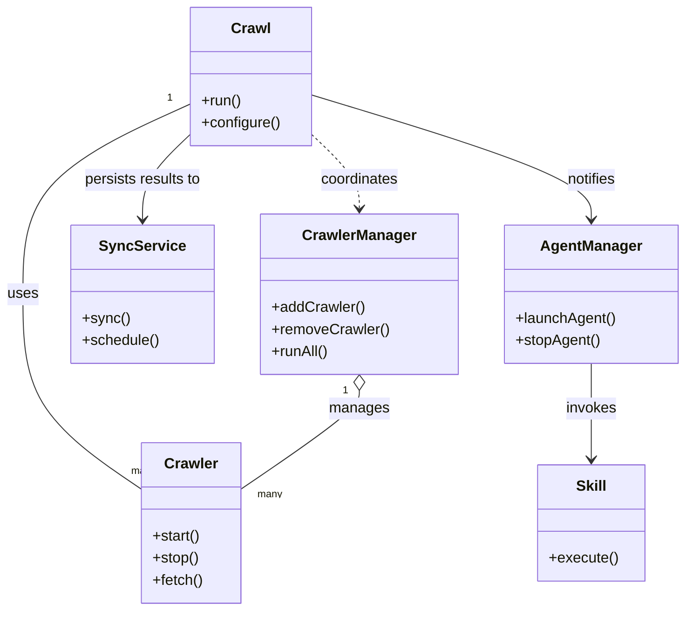
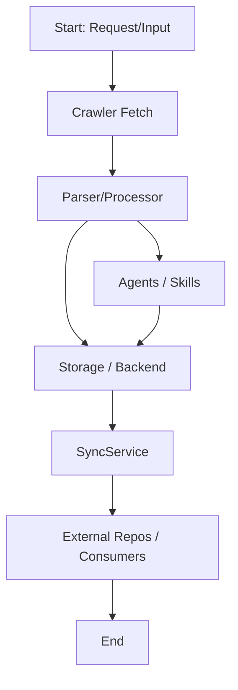

# Diagram: common/document_service/src/__init__.py

> Auto-generated by Obscura crawlers

## Diagram 1

### SVG

<svg id="container" width="729.9296875" xmlns="http://www.w3.org/2000/svg" class="classDiagram" height="662" viewBox="0 0 729.9296875 662" role="graphics-document document" aria-roledescription="class"><g><defs><marker id="container_class-aggregationStart" class="marker aggregation class" refX="18" refY="7" markerWidth="190" markerHeight="240" orient="auto"><path d="M 18,7 L9,13 L1,7 L9,1 Z"></path></marker></defs><defs><marker id="container_class-aggregationEnd" class="marker aggregation class" refX="1" refY="7" markerWidth="20" markerHeight="28" orient="auto"><path d="M 18,7 L9,13 L1,7 L9,1 Z"></path></marker></defs><defs><marker id="container_class-extensionStart" class="marker extension class" refX="18" refY="7" markerWidth="190" markerHeight="240" orient="auto"><path d="M 1,7 L18,13 V 1 Z"></path></marker></defs><defs><marker id="container_class-extensionEnd" class="marker extension class" refX="1" refY="7" markerWidth="20" markerHeight="28" orient="auto"><path d="M 1,1 V 13 L18,7 Z"></path></marker></defs><defs><marker id="container_class-compositionStart" class="marker composition class" refX="18" refY="7" markerWidth="190" markerHeight="240" orient="auto"><path d="M 18,7 L9,13 L1,7 L9,1 Z"></path></marker></defs><defs><marker id="container_class-compositionEnd" class="marker composition class" refX="1" refY="7" markerWidth="20" markerHeight="28" orient="auto"><path d="M 18,7 L9,13 L1,7 L9,1 Z"></path></marker></defs><defs><marker id="container_class-dependencyStart" class="marker dependency class" refX="6" refY="7" markerWidth="190" markerHeight="240" orient="auto"><path d="M 5,7 L9,13 L1,7 L9,1 Z"></path></marker></defs><defs><marker id="container_class-dependencyEnd" class="marker dependency class" refX="13" refY="7" markerWidth="20" markerHeight="28" orient="auto"><path d="M 18,7 L9,13 L14,7 L9,1 Z"></path></marker></defs><defs><marker id="container_class-lollipopStart" class="marker lollipop class" refX="13" refY="7" markerWidth="190" markerHeight="240" orient="auto"><circle stroke="black" fill="transparent" cx="7" cy="7" r="6"></circle></marker></defs><defs><marker id="container_class-lollipopEnd" class="marker lollipop class" refX="1" refY="7" markerWidth="190" markerHeight="240" orient="auto"><circle stroke="black" fill="transparent" cx="7" cy="7" r="6"></circle></marker></defs><g class="root"><g class="clusters"></g><g class="edgePaths"><path d="M202.156,112.941L172.546,126.617C142.935,140.294,83.714,167.647,54.103,201.99C24.492,236.333,24.492,277.667,24.492,319C24.492,360.333,24.492,401.667,45.442,436.857C66.391,472.048,108.29,501.095,129.24,515.619L150.189,530.143" id="id_Crawl_Crawler_1" class="edge-thickness-normal edge-pattern-solid relation" style=";;;" data-edge="true" data-et="edge" data-id="id_Crawl_Crawler_1" data-points="W3sieCI6MjAyLjE1NjI1LCJ5IjoxMTIuOTQwODc5ODc0OTkzOTV9LHsieCI6MjQuNDkyMTg3NSwieSI6MTk1fSx7IngiOjI0LjQ5MjE4NzUsInkiOjMxOX0seyJ4IjoyNC40OTIxODc1LCJ5Ijo0NDN9LHsieCI6MTUwLjE4OTQ1MzEyNSwieSI6NTMwLjE0MjcxMDUwNTkxMzF9XQ=="></path><path d="M382.215,423.25L382.215,426.542C382.215,429.833,382.215,436.417,361.265,454.232C340.316,472.048,298.417,501.095,277.467,515.619L256.518,530.143" id="id_CrawlerManager_Crawler_2" class="edge-thickness-normal edge-pattern-solid relation" style=";;;" data-edge="true" data-et="edge" data-id="id_CrawlerManager_Crawler_2" data-points="W3sieCI6MzgyLjIxNDg0Mzc1LCJ5Ijo0MDZ9LHsieCI6MzgyLjIxNDg0Mzc1LCJ5Ijo0NDN9LHsieCI6MjU2LjUxNzU3ODEyNSwieSI6NTMwLjE0MjcxMDUwNTkxMzF9XQ==" marker-start="url(#container_class-aggregationStart)"></path><path d="M331.805,146.005L340.206,154.171C348.608,162.336,365.411,178.668,373.813,192.001C382.215,205.333,382.215,215.667,382.215,220.833L382.215,226" id="id_Crawl_CrawlerManager_3" class="edge-thickness-normal edge-pattern-dashed relation" style=";;;" data-edge="true" data-et="edge" data-id="id_Crawl_CrawlerManager_3" data-points="W3sieCI6MzMxLjgwNDY4NzUsInkiOjE0Ni4wMDQ3NDU3NjI3MTE4OH0seyJ4IjozODIuMjE0ODQzNzUsInkiOjE5NX0seyJ4IjozODIuMjE0ODQzNzUsInkiOjIzMn1d" marker-end="url(#container_class-dependencyEnd)"></path><path d="M202.156,146.005L193.755,154.171C185.353,162.336,168.549,178.668,160.148,194.001C151.746,209.333,151.746,223.667,151.746,230.833L151.746,238" id="id_Crawl_SyncService_4" class="edge-thickness-normal edge-pattern-solid relation" style=";;;" data-edge="true" data-et="edge" data-id="id_Crawl_SyncService_4" data-points="W3sieCI6MjAyLjE1NjI1LCJ5IjoxNDYuMDA0NzQ1NzYyNzExODh9LHsieCI6MTUxLjc0NjA5Mzc1LCJ5IjoxOTV9LHsieCI6MTUxLjc0NjA5Mzc1LCJ5IjoyNDR9XQ==" marker-end="url(#container_class-dependencyEnd)"></path><path d="M629.426,394L629.426,402.167C629.426,410.333,629.426,426.667,629.426,444C629.426,461.333,629.426,479.667,629.426,488.833L629.426,498" id="id_AgentManager_Skill_5" class="edge-thickness-normal edge-pattern-solid relation" style=";;;" data-edge="true" data-et="edge" data-id="id_AgentManager_Skill_5" data-points="W3sieCI6NjI5LjQyNTc4MTI1LCJ5IjozOTR9LHsieCI6NjI5LjQyNTc4MTI1LCJ5Ijo0NDN9LHsieCI6NjI5LjQyNTc4MTI1LCJ5Ijo1MDR9XQ==" marker-end="url(#container_class-dependencyEnd)"></path><path d="M331.805,103.031L381.408,118.36C431.012,133.688,530.219,164.344,579.822,186.839C629.426,209.333,629.426,223.667,629.426,230.833L629.426,238" id="id_Crawl_AgentManager_6" class="edge-thickness-normal edge-pattern-solid relation" style=";;;" data-edge="true" data-et="edge" data-id="id_Crawl_AgentManager_6" data-points="W3sieCI6MzMxLjgwNDY4NzUsInkiOjEwMy4wMzE0NzAyNjQ5MTA2NX0seyJ4Ijo2MjkuNDI1NzgxMjUsInkiOjE5NX0seyJ4Ijo2MjkuNDI1NzgxMjUsInkiOjI0NH1d" marker-end="url(#container_class-dependencyEnd)"></path></g><g class="edgeLabels"><g class="edgeLabel" transform="translate(24.4921875, 319)"><g class="label" data-id="id_Crawl_Crawler_1" transform="translate(-16.4921875, -12)"><foreignObject width="32.984375" height="24">

uses

</foreignObject></g></g><g class="edgeLabel" transform="translate(382.21484375, 443)"><g class="label" data-id="id_CrawlerManager_Crawler_2" transform="translate(-32.296875, -12)"><foreignObject width="64.59375" height="24">

manages

</foreignObject></g></g><g class="edgeLabel" transform="translate(382.21484375, 195)"><g class="label" data-id="id_Crawl_CrawlerManager_3" transform="translate(-42.8046875, -12)"><foreignObject width="85.609375" height="24">

coordinates

</foreignObject></g></g><g class="edgeLabel" transform="translate(151.74609375, 195)"><g class="label" data-id="id_Crawl_SyncService_4" transform="translate(-64.6875, -12)"><foreignObject width="129.375" height="24">

persists results to

</foreignObject></g></g><g class="edgeLabel" transform="translate(629.42578125, 443)"><g class="label" data-id="id_AgentManager_Skill_5" transform="translate(-27.5859375, -12)"><foreignObject width="55.171875" height="24">

invokes

</foreignObject></g></g><g class="edgeLabel" transform="translate(629.42578125, 195)"><g class="label" data-id="id_Crawl_AgentManager_6" transform="translate(-27.203125, -12)"><foreignObject width="54.40625" height="24">

notifies

</foreignObject></g></g><g class="edgeTerminals" transform="translate(179.97933032393107, 106.6612142083421)"><g class="inner" transform="translate(0, 0)"><foreignObject style="width: 9px; height: 12px;">
1
</foreignObject></g></g><g class="edgeTerminals" transform="translate(367.2148418750001, 423.49999839285715)"><g class="inner" transform="translate(0, 0)"><foreignObject style="width: 9px; height: 12px;">
1
</foreignObject></g></g><g class="edgeTerminals" transform="translate(139.35380567547298, 502.8448374149711)"><g class="inner" transform="translate(0, 0)"></g><foreignObject style="width: 36px; height: 12px;">
many
</foreignObject></g><g class="edgeTerminals" transform="translate(274.4456334263102, 527.4994429170429)"><g class="inner" transform="translate(0, 0)"></g><foreignObject style="width: 36px; height: 12px;">
many
</foreignObject></g></g><g class="nodes"><g class="node default" id="classId-Crawl-0" transform="translate(266.98046875, 83)"><g class="basic label-container"><path d="M-64.82421875 -75 L64.82421875 -75 L64.82421875 75 L-64.82421875 75" stroke="none" stroke-width="0" fill="#ECECFF" style=""></path><path d="M-64.82421875 -75 C-15.735914955483096 -75, 33.35238883903381 -75, 64.82421875 -75 M-64.82421875 -75 C-26.85549416569942 -75, 11.113230418601162 -75, 64.82421875 -75 M64.82421875 -75 C64.82421875 -27.745216976326432, 64.82421875 19.509566047347136, 64.82421875 75 M64.82421875 -75 C64.82421875 -38.07858118741298, 64.82421875 -1.1571623748259583, 64.82421875 75 M64.82421875 75 C17.78354897310222 75, -29.25712080379556 75, -64.82421875 75 M64.82421875 75 C21.895065941168994 75, -21.034086867662012 75, -64.82421875 75 M-64.82421875 75 C-64.82421875 25.86626329949538, -64.82421875 -23.26747340100924, -64.82421875 -75 M-64.82421875 75 C-64.82421875 27.153089814552715, -64.82421875 -20.69382037089457, -64.82421875 -75" stroke="#9370DB" stroke-width="1.3" fill="none" stroke-dasharray="0 0" style=""></path></g><g class="annotation-group text" transform="translate(0, -51)"></g><g class="label-group text" transform="translate(-20.1484375, -51)"><g class="label" style="font-weight: bolder" transform="translate(0,-12)"><foreignObject width="40.296875" height="24">

Crawl

</foreignObject></g></g><g class="members-group text" transform="translate(-52.82421875, -3)"></g><g class="methods-group text" transform="translate(-52.82421875, 27)"><g class="label" style="" transform="translate(0,-12)"><foreignObject width="43.21875" height="24">

+run()

</foreignObject></g><g class="label" style="" transform="translate(0,12)"><foreignObject width="85.5" height="24">

+configure()

</foreignObject></g></g><g class="divider" style=""><path d="M-64.82421875 -27 C-24.320754268813836 -27, 16.182710212372328 -27, 64.82421875 -27 M-64.82421875 -27 C-36.45369411336771 -27, -8.08316947673542 -27, 64.82421875 -27" stroke="#9370DB" stroke-width="1.3" fill="none" stroke-dasharray="0 0" style=""></path></g><g class="divider" style=""><path d="M-64.82421875 -3 C-25.380536040415983 -3, 14.063146669168034 -3, 64.82421875 -3 M-64.82421875 -3 C-15.370022246983247 -3, 34.084174256033506 -3, 64.82421875 -3" stroke="#9370DB" stroke-width="1.3" fill="none" stroke-dasharray="0 0" style=""></path></g></g><g class="node default" id="classId-Crawler-1" transform="translate(203.353515625, 567)"><g class="basic label-container"><path d="M-53.1640625 -87 L53.1640625 -87 L53.1640625 87 L-53.1640625 87" stroke="none" stroke-width="0" fill="#ECECFF" style=""></path><path d="M-53.1640625 -87 C-21.1372294791392 -87, 10.889603541721598 -87, 53.1640625 -87 M-53.1640625 -87 C-13.89545742191261 -87, 25.37314765617478 -87, 53.1640625 -87 M53.1640625 -87 C53.1640625 -33.35944839023019, 53.1640625 20.281103219539617, 53.1640625 87 M53.1640625 -87 C53.1640625 -39.25054590841009, 53.1640625 8.498908183179822, 53.1640625 87 M53.1640625 87 C17.235376597957405 87, -18.69330930408519 87, -53.1640625 87 M53.1640625 87 C27.814881110634847 87, 2.4656997212696936 87, -53.1640625 87 M-53.1640625 87 C-53.1640625 22.29929178811568, -53.1640625 -42.40141642376864, -53.1640625 -87 M-53.1640625 87 C-53.1640625 38.155197700847786, -53.1640625 -10.689604598304427, -53.1640625 -87" stroke="#9370DB" stroke-width="1.3" fill="none" stroke-dasharray="0 0" style=""></path></g><g class="annotation-group text" transform="translate(0, -63)"></g><g class="label-group text" transform="translate(-27.734375, -63)"><g class="label" style="font-weight: bolder" transform="translate(0,-12)"><foreignObject width="55.46875" height="24">

Crawler

</foreignObject></g></g><g class="members-group text" transform="translate(-41.1640625, -15)"></g><g class="methods-group text" transform="translate(-41.1640625, 15)"><g class="label" style="" transform="translate(0,-12)"><foreignObject width="52.15625" height="24">

+start()

</foreignObject></g><g class="label" style="" transform="translate(0,12)"><foreignObject width="50.21875" height="24">

+stop()

</foreignObject></g><g class="label" style="" transform="translate(0,36)"><foreignObject width="54.59375" height="24">

+fetch()

</foreignObject></g></g><g class="divider" style=""><path d="M-53.1640625 -39 C-10.710156935433034 -39, 31.743748629133933 -39, 53.1640625 -39 M-53.1640625 -39 C-27.622999636248768 -39, -2.081936772497535 -39, 53.1640625 -39" stroke="#9370DB" stroke-width="1.3" fill="none" stroke-dasharray="0 0" style=""></path></g><g class="divider" style=""><path d="M-53.1640625 -15 C-23.05500238966611 -15, 7.054057720667778 -15, 53.1640625 -15 M-53.1640625 -15 C-12.108508901351215 -15, 28.94704469729757 -15, 53.1640625 -15" stroke="#9370DB" stroke-width="1.3" fill="none" stroke-dasharray="0 0" style=""></path></g></g><g class="node default" id="classId-CrawlerManager-2" transform="translate(382.21484375, 319)"><g class="basic label-container"><path d="M-104.70703125 -87 L104.70703125 -87 L104.70703125 87 L-104.70703125 87" stroke="none" stroke-width="0" fill="#ECECFF" style=""></path><path d="M-104.70703125 -87 C-50.21773646744473 -87, 4.271558315110539 -87, 104.70703125 -87 M-104.70703125 -87 C-38.598843570009805 -87, 27.50934410998039 -87, 104.70703125 -87 M104.70703125 -87 C104.70703125 -50.32261503956247, 104.70703125 -13.645230079124943, 104.70703125 87 M104.70703125 -87 C104.70703125 -48.41217924109429, 104.70703125 -9.824358482188586, 104.70703125 87 M104.70703125 87 C42.43536970262634 87, -19.836291844747322 87, -104.70703125 87 M104.70703125 87 C31.323526730158363 87, -42.05997778968327 87, -104.70703125 87 M-104.70703125 87 C-104.70703125 46.710766690527514, -104.70703125 6.421533381055028, -104.70703125 -87 M-104.70703125 87 C-104.70703125 50.08921597251627, -104.70703125 13.178431945032543, -104.70703125 -87" stroke="#9370DB" stroke-width="1.3" fill="none" stroke-dasharray="0 0" style=""></path></g><g class="annotation-group text" transform="translate(0, -63)"></g><g class="label-group text" transform="translate(-59.1796875, -63)"><g class="label" style="font-weight: bolder" transform="translate(0,-12)"><foreignObject width="118.359375" height="24">

CrawlerManager

</foreignObject></g></g><g class="members-group text" transform="translate(-92.70703125, -15)"></g><g class="methods-group text" transform="translate(-92.70703125, 15)"><g class="label" style="" transform="translate(0,-12)"><foreignObject width="99.890625" height="24">

+addCrawler()

</foreignObject></g><g class="label" style="" transform="translate(0,12)"><foreignObject width="126.234375" height="24">

+removeCrawler()

</foreignObject></g><g class="label" style="" transform="translate(0,36)"><foreignObject width="61.765625" height="24">

+runAll()

</foreignObject></g></g><g class="divider" style=""><path d="M-104.70703125 -39 C-40.22638040400393 -39, 24.254270441992134 -39, 104.70703125 -39 M-104.70703125 -39 C-34.59212026669971 -39, 35.52279071660058 -39, 104.70703125 -39" stroke="#9370DB" stroke-width="1.3" fill="none" stroke-dasharray="0 0" style=""></path></g><g class="divider" style=""><path d="M-104.70703125 -15 C-56.77198366733846 -15, -8.836936084676921 -15, 104.70703125 -15 M-104.70703125 -15 C-24.059416009364085 -15, 56.58819923127183 -15, 104.70703125 -15" stroke="#9370DB" stroke-width="1.3" fill="none" stroke-dasharray="0 0" style=""></path></g></g><g class="node default" id="classId-SyncService-3" transform="translate(151.74609375, 319)"><g class="basic label-container"><path d="M-75.76171875 -75 L75.76171875 -75 L75.76171875 75 L-75.76171875 75" stroke="none" stroke-width="0" fill="#ECECFF" style=""></path><path d="M-75.76171875 -75 C-30.162962482652745 -75, 15.43579378469451 -75, 75.76171875 -75 M-75.76171875 -75 C-40.9877306262896 -75, -6.213742502579194 -75, 75.76171875 -75 M75.76171875 -75 C75.76171875 -28.26374916494585, 75.76171875 18.4725016701083, 75.76171875 75 M75.76171875 -75 C75.76171875 -37.139148974798, 75.76171875 0.721702050404005, 75.76171875 75 M75.76171875 75 C21.149221260752377 75, -33.463276228495246 75, -75.76171875 75 M75.76171875 75 C35.308652955027696 75, -5.144412839944607 75, -75.76171875 75 M-75.76171875 75 C-75.76171875 25.75464259694847, -75.76171875 -23.490714806103057, -75.76171875 -75 M-75.76171875 75 C-75.76171875 43.43821413014641, -75.76171875 11.876428260292826, -75.76171875 -75" stroke="#9370DB" stroke-width="1.3" fill="none" stroke-dasharray="0 0" style=""></path></g><g class="annotation-group text" transform="translate(0, -51)"></g><g class="label-group text" transform="translate(-43.7421875, -51)"><g class="label" style="font-weight: bolder" transform="translate(0,-12)"><foreignObject width="87.484375" height="24">

SyncService

</foreignObject></g></g><g class="members-group text" transform="translate(-63.76171875, -3)"></g><g class="methods-group text" transform="translate(-63.76171875, 27)"><g class="label" style="" transform="translate(0,-12)"><foreignObject width="50.453125" height="24">

+sync()

</foreignObject></g><g class="label" style="" transform="translate(0,12)"><foreignObject width="83.78125" height="24">

+schedule()

</foreignObject></g></g><g class="divider" style=""><path d="M-75.76171875 -27 C-26.94133352609731 -27, 21.87905169780538 -27, 75.76171875 -27 M-75.76171875 -27 C-26.4728150341816 -27, 22.8160886816368 -27, 75.76171875 -27" stroke="#9370DB" stroke-width="1.3" fill="none" stroke-dasharray="0 0" style=""></path></g><g class="divider" style=""><path d="M-75.76171875 -3 C-33.216868917628595 -3, 9.32798091474281 -3, 75.76171875 -3 M-75.76171875 -3 C-42.16205098826449 -3, -8.56238322652898 -3, 75.76171875 -3" stroke="#9370DB" stroke-width="1.3" fill="none" stroke-dasharray="0 0" style=""></path></g></g><g class="node default" id="classId-AgentManager-4" transform="translate(629.42578125, 319)"><g class="basic label-container"><path d="M-92.50390625 -75 L92.50390625 -75 L92.50390625 75 L-92.50390625 75" stroke="none" stroke-width="0" fill="#ECECFF" style=""></path><path d="M-92.50390625 -75 C-39.410650930017226 -75, 13.682604389965547 -75, 92.50390625 -75 M-92.50390625 -75 C-25.30770989762702 -75, 41.88848645474596 -75, 92.50390625 -75 M92.50390625 -75 C92.50390625 -36.83043848048288, 92.50390625 1.3391230390342344, 92.50390625 75 M92.50390625 -75 C92.50390625 -19.703562773421048, 92.50390625 35.592874453157904, 92.50390625 75 M92.50390625 75 C29.120194226529293 75, -34.263517796941414 75, -92.50390625 75 M92.50390625 75 C53.9950403330487 75, 15.486174416097398 75, -92.50390625 75 M-92.50390625 75 C-92.50390625 27.734593410492316, -92.50390625 -19.530813179015368, -92.50390625 -75 M-92.50390625 75 C-92.50390625 20.911687676871118, -92.50390625 -33.176624646257764, -92.50390625 -75" stroke="#9370DB" stroke-width="1.3" fill="none" stroke-dasharray="0 0" style=""></path></g><g class="annotation-group text" transform="translate(0, -51)"></g><g class="label-group text" transform="translate(-52.5234375, -51)"><g class="label" style="font-weight: bolder" transform="translate(0,-12)"><foreignObject width="105.046875" height="24">

AgentManager

</foreignObject></g></g><g class="members-group text" transform="translate(-80.50390625, -3)"></g><g class="methods-group text" transform="translate(-80.50390625, 27)"><g class="label" style="" transform="translate(0,-12)"><foreignObject width="108.484375" height="24">

+launchAgent()

</foreignObject></g><g class="label" style="" transform="translate(0,12)"><foreignObject width="91.3125" height="24">

+stopAgent()

</foreignObject></g></g><g class="divider" style=""><path d="M-92.50390625 -27 C-42.60819921935272 -27, 7.28750781129456 -27, 92.50390625 -27 M-92.50390625 -27 C-43.501245076361485 -27, 5.50141609727703 -27, 92.50390625 -27" stroke="#9370DB" stroke-width="1.3" fill="none" stroke-dasharray="0 0" style=""></path></g><g class="divider" style=""><path d="M-92.50390625 -3 C-24.50701533412888 -3, 43.48987558174224 -3, 92.50390625 -3 M-92.50390625 -3 C-49.150373410757176 -3, -5.796840571514352 -3, 92.50390625 -3" stroke="#9370DB" stroke-width="1.3" fill="none" stroke-dasharray="0 0" style=""></path></g></g><g class="node default" id="classId-Skill-5" transform="translate(629.42578125, 567)"><g class="basic label-container"><path d="M-57.16796875 -63 L57.16796875 -63 L57.16796875 63 L-57.16796875 63" stroke="none" stroke-width="0" fill="#ECECFF" style=""></path><path d="M-57.16796875 -63 C-32.997071256477454 -63, -8.826173762954902 -63, 57.16796875 -63 M-57.16796875 -63 C-28.00109492495877 -63, 1.1657789000824579 -63, 57.16796875 -63 M57.16796875 -63 C57.16796875 -16.228062807861583, 57.16796875 30.543874384276833, 57.16796875 63 M57.16796875 -63 C57.16796875 -13.857351214326108, 57.16796875 35.28529757134778, 57.16796875 63 M57.16796875 63 C15.302822336803182 63, -26.562324076393637 63, -57.16796875 63 M57.16796875 63 C30.6935607548196 63, 4.219152759639201 63, -57.16796875 63 M-57.16796875 63 C-57.16796875 18.712334137819283, -57.16796875 -25.575331724361433, -57.16796875 -63 M-57.16796875 63 C-57.16796875 13.320282023097818, -57.16796875 -36.359435953804365, -57.16796875 -63" stroke="#9370DB" stroke-width="1.3" fill="none" stroke-dasharray="0 0" style=""></path></g><g class="annotation-group text" transform="translate(0, -39)"></g><g class="label-group text" transform="translate(-16.0078125, -39)"><g class="label" style="font-weight: bolder" transform="translate(0,-12)"><foreignObject width="32.015625" height="24">

Skill

</foreignObject></g></g><g class="members-group text" transform="translate(-45.16796875, 9)"></g><g class="methods-group text" transform="translate(-45.16796875, 39)"><g class="label" style="" transform="translate(0,-12)"><foreignObject width="74.328125" height="24">

+execute()

</foreignObject></g></g><g class="divider" style=""><path d="M-57.16796875 -15 C-29.623091022602317 -15, -2.078213295204634 -15, 57.16796875 -15 M-57.16796875 -15 C-23.916290596274038 -15, 9.335387557451924 -15, 57.16796875 -15" stroke="#9370DB" stroke-width="1.3" fill="none" stroke-dasharray="0 0" style=""></path></g><g class="divider" style=""><path d="M-57.16796875 9 C-23.22900391021082 9, 10.709960929578358 9, 57.16796875 9 M-57.16796875 9 C-15.898422152730035 9, 25.37112444453993 9, 57.16796875 9" stroke="#9370DB" stroke-width="1.3" fill="none" stroke-dasharray="0 0" style=""></path></g></g></g></g></g></svg>

## Diagram 2

### SVG

<svg id="container" width="286.2421875" xmlns="http://www.w3.org/2000/svg" class="flowchart" height="822" viewBox="0 0 286.2421875 822" role="graphics-document document" aria-roledescription="flowchart-v2"><g><marker id="container_flowchart-v2-pointEnd" class="marker flowchart-v2" viewBox="0 0 10 10" refX="5" refY="5" markerUnits="userSpaceOnUse" markerWidth="8" markerHeight="8" orient="auto"><path d="M 0 0 L 10 5 L 0 10 z" class="arrowMarkerPath" style="stroke-width: 1; stroke-dasharray: 1, 0;"></path></marker><marker id="container_flowchart-v2-pointStart" class="marker flowchart-v2" viewBox="0 0 10 10" refX="4.5" refY="5" markerUnits="userSpaceOnUse" markerWidth="8" markerHeight="8" orient="auto"><path d="M 0 5 L 10 10 L 10 0 z" class="arrowMarkerPath" style="stroke-width: 1; stroke-dasharray: 1, 0;"></path></marker><marker id="container_flowchart-v2-circleEnd" class="marker flowchart-v2" viewBox="0 0 10 10" refX="11" refY="5" markerUnits="userSpaceOnUse" markerWidth="11" markerHeight="11" orient="auto"><circle cx="5" cy="5" r="5" class="arrowMarkerPath" style="stroke-width: 1; stroke-dasharray: 1, 0;"></circle></marker><marker id="container_flowchart-v2-circleStart" class="marker flowchart-v2" viewBox="0 0 10 10" refX="-1" refY="5" markerUnits="userSpaceOnUse" markerWidth="11" markerHeight="11" orient="auto"><circle cx="5" cy="5" r="5" class="arrowMarkerPath" style="stroke-width: 1; stroke-dasharray: 1, 0;"></circle></marker><marker id="container_flowchart-v2-crossEnd" class="marker cross flowchart-v2" viewBox="0 0 11 11" refX="12" refY="5.2" markerUnits="userSpaceOnUse" markerWidth="11" markerHeight="11" orient="auto"><path d="M 1,1 l 9,9 M 10,1 l -9,9" class="arrowMarkerPath" style="stroke-width: 2; stroke-dasharray: 1, 0;"></path></marker><marker id="container_flowchart-v2-crossStart" class="marker cross flowchart-v2" viewBox="0 0 11 11" refX="-1" refY="5.2" markerUnits="userSpaceOnUse" markerWidth="11" markerHeight="11" orient="auto"><path d="M 1,1 l 9,9 M 10,1 l -9,9" class="arrowMarkerPath" style="stroke-width: 2; stroke-dasharray: 1, 0;"></path></marker><g class="root"><g class="clusters"></g><g class="edgePaths"><path d="M138,62L138,66.167C138,70.333,138,78.667,138,86.333C138,94,138,101,138,104.5L138,108" id="L_A_B_0" class="edge-thickness-normal edge-pattern-solid edge-thickness-normal edge-pattern-solid flowchart-link" style=";" data-edge="true" data-et="edge" data-id="L_A_B_0" data-points="W3sieCI6MTM4LCJ5Ijo2Mn0seyJ4IjoxMzgsInkiOjg3fSx7IngiOjEzOCwieSI6MTEyfV0=" marker-end="url(#container_flowchart-v2-pointEnd)"></path><path d="M138,166L138,170.167C138,174.333,138,182.667,138,190.333C138,198,138,205,138,208.5L138,212" id="L_B_C_0" class="edge-thickness-normal edge-pattern-solid edge-thickness-normal edge-pattern-solid flowchart-link" style=";" data-edge="true" data-et="edge" data-id="L_B_C_0" data-points="W3sieCI6MTM4LCJ5IjoxNjZ9LHsieCI6MTM4LCJ5IjoxOTF9LHsieCI6MTM4LCJ5IjoyMTZ9XQ==" marker-end="url(#container_flowchart-v2-pointEnd)"></path><path d="M107.67,270L102.989,274.167C98.308,278.333,88.947,286.667,84.267,299.5C79.586,312.333,79.586,329.667,79.586,347C79.586,364.333,79.586,381.667,83.769,394.057C87.951,406.447,96.317,413.894,100.499,417.617L104.682,421.34" id="L_C_D_0" class="edge-thickness-normal edge-pattern-solid edge-thickness-normal edge-pattern-solid flowchart-link" style=";" data-edge="true" data-et="edge" data-id="L_C_D_0" data-points="W3sieCI6MTA3LjY2OTYyMTM5NDIzMDc3LCJ5IjoyNzB9LHsieCI6NzkuNTg1OTM3NSwieSI6Mjk1fSx7IngiOjc5LjU4NTkzNzUsInkiOjM0N30seyJ4Ijo3OS41ODU5Mzc1LCJ5IjozOTl9LHsieCI6MTA3LjY2OTYyMTM5NDIzMDc3LCJ5Ijo0MjR9XQ==" marker-end="url(#container_flowchart-v2-pointEnd)"></path><path d="M138,478L138,482.167C138,486.333,138,494.667,138,502.333C138,510,138,517,138,520.5L138,524" id="L_D_E_0" class="edge-thickness-normal edge-pattern-solid edge-thickness-normal edge-pattern-solid flowchart-link" style=";" data-edge="true" data-et="edge" data-id="L_D_E_0" data-points="W3sieCI6MTM4LCJ5Ijo0Nzh9LHsieCI6MTM4LCJ5Ijo1MDN9LHsieCI6MTM4LCJ5Ijo1Mjh9XQ==" marker-end="url(#container_flowchart-v2-pointEnd)"></path><path d="M138,582L138,586.167C138,590.333,138,598.667,138,606.333C138,614,138,621,138,624.5L138,628" id="L_E_F_0" class="edge-thickness-normal edge-pattern-solid edge-thickness-normal edge-pattern-solid flowchart-link" style=";" data-edge="true" data-et="edge" data-id="L_E_F_0" data-points="W3sieCI6MTM4LCJ5Ijo1ODJ9LHsieCI6MTM4LCJ5Ijo2MDd9LHsieCI6MTM4LCJ5Ijo2MzJ9XQ==" marker-end="url(#container_flowchart-v2-pointEnd)"></path><path d="M168.33,270L173.011,274.167C177.692,278.333,187.053,286.667,191.733,294.333C196.414,302,196.414,309,196.414,312.5L196.414,316" id="L_C_G_0" class="edge-thickness-normal edge-pattern-solid edge-thickness-normal edge-pattern-solid flowchart-link" style=";" data-edge="true" data-et="edge" data-id="L_C_G_0" data-points="W3sieCI6MTY4LjMzMDM3ODYwNTc2OTIzLCJ5IjoyNzB9LHsieCI6MTk2LjQxNDA2MjUsInkiOjI5NX0seyJ4IjoxOTYuNDE0MDYyNSwieSI6MzIwfV0=" marker-end="url(#container_flowchart-v2-pointEnd)"></path><path d="M196.414,374L196.414,378.167C196.414,382.333,196.414,390.667,192.231,398.557C188.049,406.447,179.683,413.894,175.501,417.617L171.318,421.34" id="L_G_D_0" class="edge-thickness-normal edge-pattern-solid edge-thickness-normal edge-pattern-solid flowchart-link" style=";" data-edge="true" data-et="edge" data-id="L_G_D_0" data-points="W3sieCI6MTk2LjQxNDA2MjUsInkiOjM3NH0seyJ4IjoxOTYuNDE0MDYyNSwieSI6Mzk5fSx7IngiOjE2OC4zMzAzNzg2MDU3NjkyMywieSI6NDI0fV0=" marker-end="url(#container_flowchart-v2-pointEnd)"></path><path d="M138,710L138,714.167C138,718.333,138,726.667,138,734.333C138,742,138,749,138,752.5L138,756" id="L_F_H_0" class="edge-thickness-normal edge-pattern-solid edge-thickness-normal edge-pattern-solid flowchart-link" style=";" data-edge="true" data-et="edge" data-id="L_F_H_0" data-points="W3sieCI6MTM4LCJ5Ijo3MTB9LHsieCI6MTM4LCJ5Ijo3MzV9LHsieCI6MTM4LCJ5Ijo3NjB9XQ==" marker-end="url(#container_flowchart-v2-pointEnd)"></path></g><g class="edgeLabels"><g class="edgeLabel"><g class="label" data-id="L_A_B_0" transform="translate(0, 0)"><foreignObject width="0" height="0">

</foreignObject></g></g><g class="edgeLabel"><g class="label" data-id="L_B_C_0" transform="translate(0, 0)"><foreignObject width="0" height="0">

</foreignObject></g></g><g class="edgeLabel"><g class="label" data-id="L_C_D_0" transform="translate(0, 0)"><foreignObject width="0" height="0">

</foreignObject></g></g><g class="edgeLabel"><g class="label" data-id="L_D_E_0" transform="translate(0, 0)"><foreignObject width="0" height="0">

</foreignObject></g></g><g class="edgeLabel"><g class="label" data-id="L_E_F_0" transform="translate(0, 0)"><foreignObject width="0" height="0">

</foreignObject></g></g><g class="edgeLabel"><g class="label" data-id="L_C_G_0" transform="translate(0, 0)"><foreignObject width="0" height="0">

</foreignObject></g></g><g class="edgeLabel"><g class="label" data-id="L_G_D_0" transform="translate(0, 0)"><foreignObject width="0" height="0">

</foreignObject></g></g><g class="edgeLabel"><g class="label" data-id="L_F_H_0" transform="translate(0, 0)"><foreignObject width="0" height="0">

</foreignObject></g></g></g><g class="nodes"><g class="node default" id="flowchart-A-0" transform="translate(138, 35)"><rect class="basic label-container" style="" x="-104.6015625" y="-27" width="209.203125" height="54"></rect><g class="label" style="" transform="translate(-74.6015625, -12)"><rect></rect><foreignObject width="149.203125" height="24">

Start: Request/Input

</foreignObject></g></g><g class="node default" id="flowchart-B-1" transform="translate(138, 139)"><rect class="basic label-container" style="" x="-78.3828125" y="-27" width="156.765625" height="54"></rect><g class="label" style="" transform="translate(-48.3828125, -12)"><rect></rect><foreignObject width="96.765625" height="24">

Crawler Fetch

</foreignObject></g></g><g class="node default" id="flowchart-C-3" transform="translate(138, 243)"><rect class="basic label-container" style="" x="-91.578125" y="-27" width="183.15625" height="54"></rect><g class="label" style="" transform="translate(-61.578125, -12)"><rect></rect><foreignObject width="123.15625" height="24">

Parser/Processor

</foreignObject></g></g><g class="node default" id="flowchart-D-5" transform="translate(138, 451)"><rect class="basic label-container" style="" x="-96.5703125" y="-27" width="193.140625" height="54"></rect><g class="label" style="" transform="translate(-66.5703125, -12)"><rect></rect><foreignObject width="133.140625" height="24">

Storage / Backend

</foreignObject></g></g><g class="node default" id="flowchart-E-7" transform="translate(138, 555)"><rect class="basic label-container" style="" x="-72.7578125" y="-27" width="145.515625" height="54"></rect><g class="label" style="" transform="translate(-42.7578125, -12)"><rect></rect><foreignObject width="85.515625" height="24">

SyncService

</foreignObject></g></g><g class="node default" id="flowchart-F-9" transform="translate(138, 671)"><rect class="basic label-container" style="" x="-130" y="-39" width="260" height="78"></rect><g class="label" style="" transform="translate(-100, -24)"><rect></rect><foreignObject width="200" height="48">

External Repos / Consumers

</foreignObject></g></g><g class="node default" id="flowchart-G-11" transform="translate(196.4140625, 347)"><rect class="basic label-container" style="" x="-81.828125" y="-27" width="163.65625" height="54"></rect><g class="label" style="" transform="translate(-51.828125, -12)"><rect></rect><foreignObject width="103.65625" height="24">

Agents / Skills

</foreignObject></g></g><g class="node default" id="flowchart-H-15" transform="translate(138, 787)"><rect class="basic label-container" style="" x="-43.6796875" y="-27" width="87.359375" height="54"></rect><g class="label" style="" transform="translate(-13.6796875, -12)"><rect></rect><foreignObject width="27.359375" height="24">

End

</foreignObject></g></g></g></g></g></svg>
