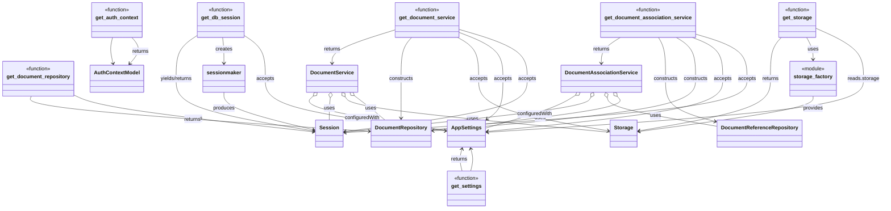

# Diagram: common/document_service/src/api/dependencies/dependencies.py

> Auto-generated by Obscura crawlers

## Mermaid

```mermaid
classDiagram
    class get_db_session <<function>>
    class get_storage <<function>>
    class get_document_repository <<function>>
    class get_document_service <<function>>
    class get_document_association_service <<function>>
    class get_settings <<function>>
    class get_auth_context <<function>>
    class storage_factory <<module>>

    class AppSettings
    class Session
    class sessionmaker
    class Storage
    class DocumentRepository
    class DocumentReferenceRepository
    class DocumentService
    class DocumentAssociationService
    class AuthContextModel

    get_db_session --> AppSettings : accepts
    get_db_session --> sessionmaker : creates
    sessionmaker --> Session : produces
    get_db_session --> Session : yields/returns

    get_storage --> AppSettings : reads.storage
    get_storage --> storage_factory : uses
    storage_factory --> Storage : provides
    get_storage --> Storage : returns

    get_document_repository --> Session : accepts
    get_document_repository --> DocumentRepository : returns

    get_document_service --> Session : accepts
    get_document_service --> AppSettings : accepts
    get_document_service --> Storage : accepts
    get_document_service --> DocumentRepository : constructs
    get_document_service --> DocumentService : returns
    DocumentService o-- DocumentRepository : uses
    DocumentService o-- Storage : uses
    DocumentService o-- Session : uses
    DocumentService o-- AppSettings : configuredWith

    get_document_association_service --> Session : accepts
    get_document_association_service --> AppSettings : accepts
    get_document_association_service --> DocumentRepository : constructs
    get_document_association_service --> DocumentReferenceRepository : constructs
    get_document_association_service --> DocumentAssociationService : returns
    DocumentAssociationService o-- DocumentRepository : uses
    DocumentAssociationService o-- DocumentReferenceRepository : uses
    DocumentAssociationService o-- Session : uses
    DocumentAssociationService o-- AppSettings : configuredWith

    get_settings --> AppSettings : returns
    get_auth_context --> AuthContextModel : returns
    AuthContextModel <-- get_auth_context
    AppSettings <-- get_settings
```

> SVG rendering failed for this diagram.
