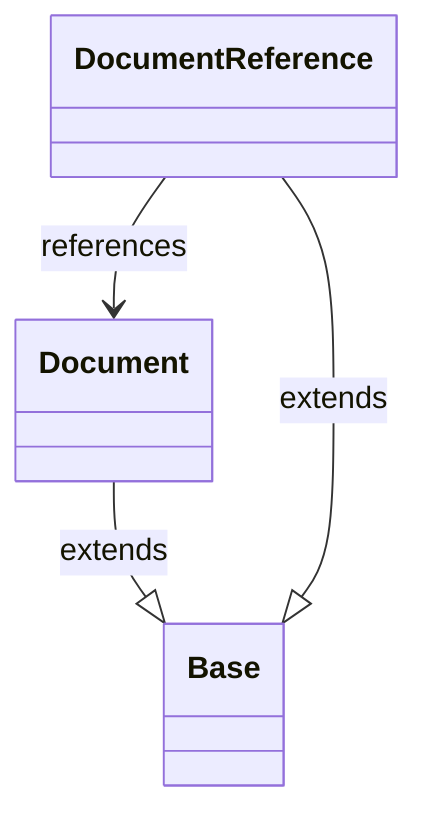

# Diagram: common/document_service/src/api/models/__init__.py

> Auto-generated by Obscura crawlers

## Mermaid

### SVG

<svg id="container" width="206.98828125" xmlns="http://www.w3.org/2000/svg" class="classDiagram" height="416" viewBox="0 0 206.98828125 416" role="graphics-document document" aria-roledescription="class"><g><defs><marker id="container_class-aggregationStart" class="marker aggregation class" refX="18" refY="7" markerWidth="190" markerHeight="240" orient="auto"><path d="M 18,7 L9,13 L1,7 L9,1 Z"></path></marker></defs><defs><marker id="container_class-aggregationEnd" class="marker aggregation class" refX="1" refY="7" markerWidth="20" markerHeight="28" orient="auto"><path d="M 18,7 L9,13 L1,7 L9,1 Z"></path></marker></defs><defs><marker id="container_class-extensionStart" class="marker extension class" refX="18" refY="7" markerWidth="190" markerHeight="240" orient="auto"><path d="M 1,7 L18,13 V 1 Z"></path></marker></defs><defs><marker id="container_class-extensionEnd" class="marker extension class" refX="1" refY="7" markerWidth="20" markerHeight="28" orient="auto"><path d="M 1,1 V 13 L18,7 Z"></path></marker></defs><defs><marker id="container_class-compositionStart" class="marker composition class" refX="18" refY="7" markerWidth="190" markerHeight="240" orient="auto"><path d="M 18,7 L9,13 L1,7 L9,1 Z"></path></marker></defs><defs><marker id="container_class-compositionEnd" class="marker composition class" refX="1" refY="7" markerWidth="20" markerHeight="28" orient="auto"><path d="M 18,7 L9,13 L1,7 L9,1 Z"></path></marker></defs><defs><marker id="container_class-dependencyStart" class="marker dependency class" refX="6" refY="7" markerWidth="190" markerHeight="240" orient="auto"><path d="M 5,7 L9,13 L1,7 L9,1 Z"></path></marker></defs><defs><marker id="container_class-dependencyEnd" class="marker dependency class" refX="13" refY="7" markerWidth="20" markerHeight="28" orient="auto"><path d="M 18,7 L9,13 L14,7 L9,1 Z"></path></marker></defs><defs><marker id="container_class-lollipopStart" class="marker lollipop class" refX="13" refY="7" markerWidth="190" markerHeight="240" orient="auto"><circle stroke="black" fill="transparent" cx="7" cy="7" r="6"></circle></marker></defs><defs><marker id="container_class-lollipopEnd" class="marker lollipop class" refX="1" refY="7" markerWidth="190" markerHeight="240" orient="auto"><circle stroke="black" fill="transparent" cx="7" cy="7" r="6"></circle></marker></defs><g class="root"><g class="clusters"></g><g class="edgePaths"><path d="M57.094,250L57.094,256.167C57.094,262.333,57.094,274.667,59.888,284.754C62.682,294.842,68.271,302.684,71.065,306.605L73.86,310.526" id="id_Document_Base_1" class="edge-thickness-normal edge-pattern-solid relation" style=";;;" data-edge="true" data-et="edge" data-id="id_Document_Base_1" data-points="W3sieCI6NTcuMDkzNzUsInkiOjI1MH0seyJ4Ijo1Ny4wOTM3NSwieSI6Mjg3fSx7IngiOjgzLjg3MTA5Mzc1LCJ5IjozMjQuNTczMzcxMjYyMDU1MX1d" marker-end="url(#container_class-extensionEnd)"></path><path d="M83.462,92L79.068,98.167C74.673,104.333,65.883,116.667,61.489,128C57.094,139.333,57.094,149.667,57.094,154.833L57.094,160" id="id_DocumentReference_Document_2" class="edge-thickness-normal edge-pattern-solid relation" style=";;;" data-edge="true" data-et="edge" data-id="id_DocumentReference_Document_2" data-points="W3sieCI6ODMuNDYyNDcwMzMyMjc4NDksInkiOjkyfSx7IngiOjU3LjA5Mzc1LCJ5IjoxMjl9LHsieCI6NTcuMDkzNzUsInkiOjE2Nn1d" marker-end="url(#container_class-dependencyEnd)"></path><path d="M143.327,92L147.721,98.167C152.116,104.333,160.906,116.667,165.301,136C169.695,155.333,169.695,181.667,169.695,208C169.695,234.333,169.695,260.667,166.901,277.754C164.107,294.842,158.518,302.684,155.724,306.605L152.929,310.526" id="id_DocumentReference_Base_3" class="edge-thickness-normal edge-pattern-solid relation" style=";;;" data-edge="true" data-et="edge" data-id="id_DocumentReference_Base_3" data-points="W3sieCI6MTQzLjMyNjU5MjE2NzcyMTUxLCJ5Ijo5Mn0seyJ4IjoxNjkuNjk1MzEyNSwieSI6MTI5fSx7IngiOjE2OS42OTUzMTI1LCJ5IjoyMDh9LHsieCI6MTY5LjY5NTMxMjUsInkiOjI4N30seyJ4IjoxNDIuOTE3OTY4NzUsInkiOjMyNC41NzMzNzEyNjIwNTUxfV0=" marker-end="url(#container_class-extensionEnd)"></path></g><g class="edgeLabels"><g class="edgeLabel" transform="translate(57.09375, 287)"><g class="label" data-id="id_Document_Base_1" transform="translate(-28.5078125, -12)"><foreignObject width="57.015625" height="24">

extends

</foreignObject></g></g><g class="edgeLabel" transform="translate(57.09375, 129)"><g class="label" data-id="id_DocumentReference_Document_2" transform="translate(-37.828125, -12)"><foreignObject width="75.65625" height="24">

references

</foreignObject></g></g><g class="edgeLabel" transform="translate(169.6953125, 208)"><g class="label" data-id="id_DocumentReference_Base_3" transform="translate(-28.5078125, -12)"><foreignObject width="57.015625" height="24">

extends

</foreignObject></g></g></g><g class="nodes"><g class="node default" id="classId-Base-0" transform="translate(113.39453125, 366)"><g class="basic label-container"><path d="M-29.5234375 -42 L29.5234375 -42 L29.5234375 42 L-29.5234375 42" stroke="none" stroke-width="0" fill="#ECECFF" style=""></path><path d="M-29.5234375 -42 C-6.098062002758322 -42, 17.327313494483356 -42, 29.5234375 -42 M-29.5234375 -42 C-16.55823169331363 -42, -3.5930258866272595 -42, 29.5234375 -42 M29.5234375 -42 C29.5234375 -14.030991720245261, 29.5234375 13.938016559509478, 29.5234375 42 M29.5234375 -42 C29.5234375 -22.204682082528738, 29.5234375 -2.4093641650574753, 29.5234375 42 M29.5234375 42 C16.62626598623054 42, 3.729094472461078 42, -29.5234375 42 M29.5234375 42 C6.431290364828978 42, -16.660856770342043 42, -29.5234375 42 M-29.5234375 42 C-29.5234375 22.022738977668652, -29.5234375 2.0454779553373044, -29.5234375 -42 M-29.5234375 42 C-29.5234375 16.316764221430745, -29.5234375 -9.36647155713851, -29.5234375 -42" stroke="#9370DB" stroke-width="1.3" fill="none" stroke-dasharray="0 0" style=""></path></g><g class="annotation-group text" transform="translate(0, -18)"></g><g class="label-group text" transform="translate(-17.5234375, -18)"><g class="label" style="font-weight: bolder" transform="translate(0,-12)"><foreignObject width="35.046875" height="24">

Base

</foreignObject></g></g><g class="members-group text" transform="translate(-17.5234375, 30)"></g><g class="methods-group text" transform="translate(-17.5234375, 60)"></g><g class="divider" style=""><path d="M-29.5234375 6 C-15.937564964784471 6, -2.351692429568942 6, 29.5234375 6 M-29.5234375 6 C-6.069528399225852 6, 17.384380701548295 6, 29.5234375 6" stroke="#9370DB" stroke-width="1.3" fill="none" stroke-dasharray="0 0" style=""></path></g><g class="divider" style=""><path d="M-29.5234375 24 C-7.117284294450112 24, 15.288868911099776 24, 29.5234375 24 M-29.5234375 24 C-16.631381233949703 24, -3.739324967899403 24, 29.5234375 24" stroke="#9370DB" stroke-width="1.3" fill="none" stroke-dasharray="0 0" style=""></path></g></g><g class="node default" id="classId-Document-1" transform="translate(57.09375, 208)"><g class="basic label-container"><path d="M-49.09375 -42 L49.09375 -42 L49.09375 42 L-49.09375 42" stroke="none" stroke-width="0" fill="#ECECFF" style=""></path><path d="M-49.09375 -42 C-28.192692745428936 -42, -7.291635490857871 -42, 49.09375 -42 M-49.09375 -42 C-19.10575804603508 -42, 10.882233907929837 -42, 49.09375 -42 M49.09375 -42 C49.09375 -22.93994248431939, 49.09375 -3.879884968638777, 49.09375 42 M49.09375 -42 C49.09375 -21.600318562458032, 49.09375 -1.2006371249160637, 49.09375 42 M49.09375 42 C17.76672976091641 42, -13.560290478167182 42, -49.09375 42 M49.09375 42 C17.077947077527604 42, -14.937855844944792 42, -49.09375 42 M-49.09375 42 C-49.09375 11.857307258306687, -49.09375 -18.285385483386627, -49.09375 -42 M-49.09375 42 C-49.09375 12.889106960981564, -49.09375 -16.22178607803687, -49.09375 -42" stroke="#9370DB" stroke-width="1.3" fill="none" stroke-dasharray="0 0" style=""></path></g><g class="annotation-group text" transform="translate(0, -18)"></g><g class="label-group text" transform="translate(-37.09375, -18)"><g class="label" style="font-weight: bolder" transform="translate(0,-12)"><foreignObject width="74.1875" height="24">

Document

</foreignObject></g></g><g class="members-group text" transform="translate(-37.09375, 30)"></g><g class="methods-group text" transform="translate(-37.09375, 60)"></g><g class="divider" style=""><path d="M-49.09375 6 C-27.04491056106338 6, -4.996071122126757 6, 49.09375 6 M-49.09375 6 C-25.75526107800282 6, -2.416772156005642 6, 49.09375 6" stroke="#9370DB" stroke-width="1.3" fill="none" stroke-dasharray="0 0" style=""></path></g><g class="divider" style=""><path d="M-49.09375 24 C-24.2505826803691 24, 0.5925846392618013 24, 49.09375 24 M-49.09375 24 C-18.833892716256113 24, 11.425964567487775 24, 49.09375 24" stroke="#9370DB" stroke-width="1.3" fill="none" stroke-dasharray="0 0" style=""></path></g></g><g class="node default" id="classId-DocumentReference-2" transform="translate(113.39453125, 50)"><g class="basic label-container"><path d="M-85.59375 -42 L85.59375 -42 L85.59375 42 L-85.59375 42" stroke="none" stroke-width="0" fill="#ECECFF" style=""></path><path d="M-85.59375 -42 C-29.858754705252913 -42, 25.876240589494174 -42, 85.59375 -42 M-85.59375 -42 C-41.019459961879186 -42, 3.554830076241629 -42, 85.59375 -42 M85.59375 -42 C85.59375 -19.19431376749848, 85.59375 3.6113724650030434, 85.59375 42 M85.59375 -42 C85.59375 -20.525742101537045, 85.59375 0.9485157969259106, 85.59375 42 M85.59375 42 C19.293244829262505 42, -47.00726034147499 42, -85.59375 42 M85.59375 42 C21.95194979614039 42, -41.68985040771922 42, -85.59375 42 M-85.59375 42 C-85.59375 16.662232901781763, -85.59375 -8.675534196436473, -85.59375 -42 M-85.59375 42 C-85.59375 10.621481083174565, -85.59375 -20.75703783365087, -85.59375 -42" stroke="#9370DB" stroke-width="1.3" fill="none" stroke-dasharray="0 0" style=""></path></g><g class="annotation-group text" transform="translate(0, -18)"></g><g class="label-group text" transform="translate(-73.59375, -18)"><g class="label" style="font-weight: bolder" transform="translate(0,-12)"><foreignObject width="147.1875" height="24">

DocumentReference

</foreignObject></g></g><g class="members-group text" transform="translate(-73.59375, 30)"></g><g class="methods-group text" transform="translate(-73.59375, 60)"></g><g class="divider" style=""><path d="M-85.59375 6 C-22.00680341034964 6, 41.58014317930072 6, 85.59375 6 M-85.59375 6 C-28.928305208176177 6, 27.737139583647647 6, 85.59375 6" stroke="#9370DB" stroke-width="1.3" fill="none" stroke-dasharray="0 0" style=""></path></g><g class="divider" style=""><path d="M-85.59375 24 C-46.924661995089764 24, -8.255573990179528 24, 85.59375 24 M-85.59375 24 C-31.57960458249663 24, 22.434540835006743 24, 85.59375 24" stroke="#9370DB" stroke-width="1.3" fill="none" stroke-dasharray="0 0" style=""></path></g></g></g></g></g></svg>
