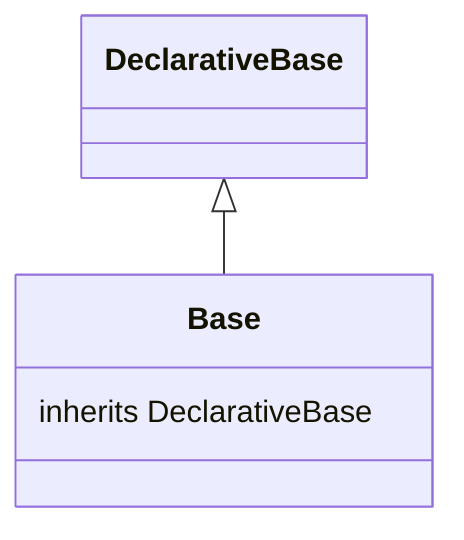

# Diagram: common/document_service/src/api/models/base.py

> Auto-generated by Obscura crawlers

## Mermaid

### SVG

<svg id="container" width="233.2734375" xmlns="http://www.w3.org/2000/svg" class="classDiagram" height="270" viewBox="0 0 233.2734375 270" role="graphics-document document" aria-roledescription="class"><g><defs><marker id="container_class-aggregationStart" class="marker aggregation class" refX="18" refY="7" markerWidth="190" markerHeight="240" orient="auto"><path d="M 18,7 L9,13 L1,7 L9,1 Z"></path></marker></defs><defs><marker id="container_class-aggregationEnd" class="marker aggregation class" refX="1" refY="7" markerWidth="20" markerHeight="28" orient="auto"><path d="M 18,7 L9,13 L1,7 L9,1 Z"></path></marker></defs><defs><marker id="container_class-extensionStart" class="marker extension class" refX="18" refY="7" markerWidth="190" markerHeight="240" orient="auto"><path d="M 1,7 L18,13 V 1 Z"></path></marker></defs><defs><marker id="container_class-extensionEnd" class="marker extension class" refX="1" refY="7" markerWidth="20" markerHeight="28" orient="auto"><path d="M 1,1 V 13 L18,7 Z"></path></marker></defs><defs><marker id="container_class-compositionStart" class="marker composition class" refX="18" refY="7" markerWidth="190" markerHeight="240" orient="auto"><path d="M 18,7 L9,13 L1,7 L9,1 Z"></path></marker></defs><defs><marker id="container_class-compositionEnd" class="marker composition class" refX="1" refY="7" markerWidth="20" markerHeight="28" orient="auto"><path d="M 18,7 L9,13 L1,7 L9,1 Z"></path></marker></defs><defs><marker id="container_class-dependencyStart" class="marker dependency class" refX="6" refY="7" markerWidth="190" markerHeight="240" orient="auto"><path d="M 5,7 L9,13 L1,7 L9,1 Z"></path></marker></defs><defs><marker id="container_class-dependencyEnd" class="marker dependency class" refX="13" refY="7" markerWidth="20" markerHeight="28" orient="auto"><path d="M 18,7 L9,13 L14,7 L9,1 Z"></path></marker></defs><defs><marker id="container_class-lollipopStart" class="marker lollipop class" refX="13" refY="7" markerWidth="190" markerHeight="240" orient="auto"><circle stroke="black" fill="transparent" cx="7" cy="7" r="6"></circle></marker></defs><defs><marker id="container_class-lollipopEnd" class="marker lollipop class" refX="1" refY="7" markerWidth="190" markerHeight="240" orient="auto"><circle stroke="black" fill="transparent" cx="7" cy="7" r="6"></circle></marker></defs><g class="root"><g class="clusters"></g><g class="edgePaths"><path d="M116.637,109.25L116.637,110.542C116.637,111.833,116.637,114.417,116.637,119.875C116.637,125.333,116.637,133.667,116.637,137.833L116.637,142" id="id_DeclarativeBase_Base_1" class="edge-thickness-normal edge-pattern-solid relation" style=";;;" data-edge="true" data-et="edge" data-id="id_DeclarativeBase_Base_1" data-points="W3sieCI6MTE2LjYzNjcxODc1LCJ5Ijo5Mn0seyJ4IjoxMTYuNjM2NzE4NzUsInkiOjExN30seyJ4IjoxMTYuNjM2NzE4NzUsInkiOjE0Mn1d" marker-start="url(#container_class-extensionStart)"></path></g><g class="edgeLabels"><g class="edgeLabel"><g class="label" data-id="id_DeclarativeBase_Base_1" transform="translate(0, 0)"><foreignObject width="0" height="0">

</foreignObject></g></g></g><g class="nodes"><g class="node default" id="classId-DeclarativeBase-0" transform="translate(116.63671875, 50)"><g class="basic label-container"><path d="M-70.8125 -42 L70.8125 -42 L70.8125 42 L-70.8125 42" stroke="none" stroke-width="0" fill="#ECECFF" style=""></path><path d="M-70.8125 -42 C-18.65449830608992 -42, 33.50350338782016 -42, 70.8125 -42 M-70.8125 -42 C-34.08353315153379 -42, 2.6454336969324146 -42, 70.8125 -42 M70.8125 -42 C70.8125 -8.685010957858047, 70.8125 24.629978084283906, 70.8125 42 M70.8125 -42 C70.8125 -15.125344357788904, 70.8125 11.749311284422191, 70.8125 42 M70.8125 42 C40.44964855559103 42, 10.086797111182065 42, -70.8125 42 M70.8125 42 C29.897077403214574 42, -11.018345193570852 42, -70.8125 42 M-70.8125 42 C-70.8125 9.955265520442289, -70.8125 -22.089468959115422, -70.8125 -42 M-70.8125 42 C-70.8125 17.73051535343366, -70.8125 -6.538969293132681, -70.8125 -42" stroke="#9370DB" stroke-width="1.3" fill="none" stroke-dasharray="0 0" style=""></path></g><g class="annotation-group text" transform="translate(0, -18)"></g><g class="label-group text" transform="translate(-58.8125, -18)"><g class="label" style="font-weight: bolder" transform="translate(0,-12)"><foreignObject width="117.625" height="24">

DeclarativeBase

</foreignObject></g></g><g class="members-group text" transform="translate(-58.8125, 30)"></g><g class="methods-group text" transform="translate(-58.8125, 60)"></g><g class="divider" style=""><path d="M-70.8125 6 C-21.013290266548893 6, 28.785919466902214 6, 70.8125 6 M-70.8125 6 C-32.3613385847963 6, 6.0898228304074 6, 70.8125 6" stroke="#9370DB" stroke-width="1.3" fill="none" stroke-dasharray="0 0" style=""></path></g><g class="divider" style=""><path d="M-70.8125 24 C-14.218686437439892 24, 42.375127125120216 24, 70.8125 24 M-70.8125 24 C-35.01408533612312 24, 0.7843293277537668 24, 70.8125 24" stroke="#9370DB" stroke-width="1.3" fill="none" stroke-dasharray="0 0" style=""></path></g></g><g class="node default" id="classId-Base-1" transform="translate(116.63671875, 202)"><g class="basic label-container"><path d="M-108.63671875 -60 L108.63671875 -60 L108.63671875 60 L-108.63671875 60" stroke="none" stroke-width="0" fill="#ECECFF" style=""></path><path d="M-108.63671875 -60 C-33.07239235811815 -60, 42.4919340337637 -60, 108.63671875 -60 M-108.63671875 -60 C-50.97403364194155 -60, 6.6886514661168945 -60, 108.63671875 -60 M108.63671875 -60 C108.63671875 -34.03196315241151, 108.63671875 -8.063926304823013, 108.63671875 60 M108.63671875 -60 C108.63671875 -22.168684258635523, 108.63671875 15.662631482728955, 108.63671875 60 M108.63671875 60 C47.237430106923206 60, -14.161858536153588 60, -108.63671875 60 M108.63671875 60 C26.71027730899216 60, -55.21616413201568 60, -108.63671875 60 M-108.63671875 60 C-108.63671875 32.895537005016095, -108.63671875 5.791074010032183, -108.63671875 -60 M-108.63671875 60 C-108.63671875 20.938070659355404, -108.63671875 -18.123858681289192, -108.63671875 -60" stroke="#9370DB" stroke-width="1.3" fill="none" stroke-dasharray="0 0" style=""></path></g><g class="annotation-group text" transform="translate(0, -36)"></g><g class="label-group text" transform="translate(-17.5234375, -36)"><g class="label" style="font-weight: bolder" transform="translate(0,-12)"><foreignObject width="35.046875" height="24">

Base

</foreignObject></g></g><g class="members-group text" transform="translate(-96.63671875, 12)"><g class="label" style="" transform="translate(0,-12)"><foreignObject width="175.75" height="24">

inherits DeclarativeBase

</foreignObject></g></g><g class="methods-group text" transform="translate(-96.63671875, 60)"></g><g class="divider" style=""><path d="M-108.63671875 -12 C-62.96068113164613 -12, -17.284643513292266 -12, 108.63671875 -12 M-108.63671875 -12 C-45.0159579008468 -12, 18.6048029483064 -12, 108.63671875 -12" stroke="#9370DB" stroke-width="1.3" fill="none" stroke-dasharray="0 0" style=""></path></g><g class="divider" style=""><path d="M-108.63671875 36 C-34.08033381300483 36, 40.476051123990345 36, 108.63671875 36 M-108.63671875 36 C-28.89508909479254 36, 50.84654056041492 36, 108.63671875 36" stroke="#9370DB" stroke-width="1.3" fill="none" stroke-dasharray="0 0" style=""></path></g></g></g></g></g></svg>
