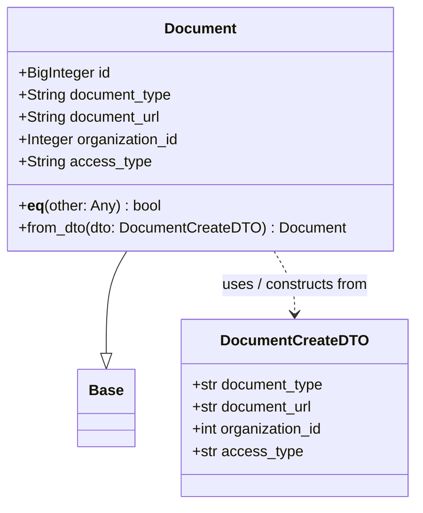

# Diagram: common/document_service/src/api/models/document.py

> Auto-generated by Obscura crawlers

## Mermaid

### SVG

<svg id="container" width="445.2578125" xmlns="http://www.w3.org/2000/svg" class="classDiagram" height="546" viewBox="0 0 445.2578125 546" role="graphics-document document" aria-roledescription="class"><g><defs><marker id="container_class-aggregationStart" class="marker aggregation class" refX="18" refY="7" markerWidth="190" markerHeight="240" orient="auto"><path d="M 18,7 L9,13 L1,7 L9,1 Z"></path></marker></defs><defs><marker id="container_class-aggregationEnd" class="marker aggregation class" refX="1" refY="7" markerWidth="20" markerHeight="28" orient="auto"><path d="M 18,7 L9,13 L1,7 L9,1 Z"></path></marker></defs><defs><marker id="container_class-extensionStart" class="marker extension class" refX="18" refY="7" markerWidth="190" markerHeight="240" orient="auto"><path d="M 1,7 L18,13 V 1 Z"></path></marker></defs><defs><marker id="container_class-extensionEnd" class="marker extension class" refX="1" refY="7" markerWidth="20" markerHeight="28" orient="auto"><path d="M 1,1 V 13 L18,7 Z"></path></marker></defs><defs><marker id="container_class-compositionStart" class="marker composition class" refX="18" refY="7" markerWidth="190" markerHeight="240" orient="auto"><path d="M 18,7 L9,13 L1,7 L9,1 Z"></path></marker></defs><defs><marker id="container_class-compositionEnd" class="marker composition class" refX="1" refY="7" markerWidth="20" markerHeight="28" orient="auto"><path d="M 18,7 L9,13 L1,7 L9,1 Z"></path></marker></defs><defs><marker id="container_class-dependencyStart" class="marker dependency class" refX="6" refY="7" markerWidth="190" markerHeight="240" orient="auto"><path d="M 5,7 L9,13 L1,7 L9,1 Z"></path></marker></defs><defs><marker id="container_class-dependencyEnd" class="marker dependency class" refX="13" refY="7" markerWidth="20" markerHeight="28" orient="auto"><path d="M 18,7 L9,13 L14,7 L9,1 Z"></path></marker></defs><defs><marker id="container_class-lollipopStart" class="marker lollipop class" refX="13" refY="7" markerWidth="190" markerHeight="240" orient="auto"><circle stroke="black" fill="transparent" cx="7" cy="7" r="6"></circle></marker></defs><defs><marker id="container_class-lollipopEnd" class="marker lollipop class" refX="1" refY="7" markerWidth="190" markerHeight="240" orient="auto"><circle stroke="black" fill="transparent" cx="7" cy="7" r="6"></circle></marker></defs><g class="root"><g class="clusters"></g><g class="edgePaths"><path d="M135.898,272L132.222,278.167C128.547,284.333,121.195,296.667,117.519,315.125C113.844,333.583,113.844,358.167,113.844,370.458L113.844,382.75" id="id_Document_Base_1" class="edge-thickness-normal edge-pattern-solid relation" style=";;;" data-edge="true" data-et="edge" data-id="id_Document_Base_1" data-points="W3sieCI6MTM1Ljg5ODAyMTQ0OTcwNDE1LCJ5IjoyNzJ9LHsieCI6MTEzLjg0Mzc1LCJ5IjozMDl9LHsieCI6MTEzLjg0Mzc1LCJ5Ijo0MDB9XQ==" marker-end="url(#container_class-extensionEnd)"></path><path d="M293.258,272L296.934,278.167C300.61,284.333,307.961,296.667,311.637,308C315.313,319.333,315.313,329.667,315.313,334.833L315.313,340" id="id_Document_DocumentCreateDTO_2" class="edge-thickness-normal edge-pattern-dashed relation" style=";;;" data-edge="true" data-et="edge" data-id="id_Document_DocumentCreateDTO_2" data-points="W3sieCI6MjkzLjI1ODIyODU1MDI5NTgsInkiOjI3Mn0seyJ4IjozMTUuMzEyNSwieSI6MzA5fSx7IngiOjMxNS4zMTI1LCJ5IjozNDZ9XQ==" marker-end="url(#container_class-dependencyEnd)"></path></g><g class="edgeLabels"><g class="edgeLabel"><g class="label" data-id="id_Document_Base_1" transform="translate(0, 0)"><foreignObject width="0" height="0">

</foreignObject></g></g><g class="edgeLabel" transform="translate(315.3125, 309)"><g class="label" data-id="id_Document_DocumentCreateDTO_2" transform="translate(-81.90625, -12)"><foreignObject width="163.8125" height="24">

uses / constructs from

</foreignObject></g></g></g><g class="nodes"><g class="node default" id="classId-Base-0" transform="translate(113.84375, 442)"><g class="basic label-container"><path d="M-29.5234375 -42 L29.5234375 -42 L29.5234375 42 L-29.5234375 42" stroke="none" stroke-width="0" fill="#ECECFF" style=""></path><path d="M-29.5234375 -42 C-8.838354051018719 -42, 11.846729397962562 -42, 29.5234375 -42 M-29.5234375 -42 C-17.278899008666613 -42, -5.034360517333226 -42, 29.5234375 -42 M29.5234375 -42 C29.5234375 -18.373644237326175, 29.5234375 5.2527115253476495, 29.5234375 42 M29.5234375 -42 C29.5234375 -12.463560353481938, 29.5234375 17.072879293036124, 29.5234375 42 M29.5234375 42 C9.38590712707109 42, -10.751623245857822 42, -29.5234375 42 M29.5234375 42 C14.079288916986256 42, -1.3648596660274883 42, -29.5234375 42 M-29.5234375 42 C-29.5234375 10.68991021724272, -29.5234375 -20.62017956551456, -29.5234375 -42 M-29.5234375 42 C-29.5234375 9.591089096780046, -29.5234375 -22.81782180643991, -29.5234375 -42" stroke="#9370DB" stroke-width="1.3" fill="none" stroke-dasharray="0 0" style=""></path></g><g class="annotation-group text" transform="translate(0, -18)"></g><g class="label-group text" transform="translate(-17.5234375, -18)"><g class="label" style="font-weight: bolder" transform="translate(0,-12)"><foreignObject width="35.046875" height="24">

Base

</foreignObject></g></g><g class="members-group text" transform="translate(-17.5234375, 30)"></g><g class="methods-group text" transform="translate(-17.5234375, 60)"></g><g class="divider" style=""><path d="M-29.5234375 6 C-17.585725972451172 6, -5.648014444902344 6, 29.5234375 6 M-29.5234375 6 C-12.289354433290715 6, 4.9447286334185705 6, 29.5234375 6" stroke="#9370DB" stroke-width="1.3" fill="none" stroke-dasharray="0 0" style=""></path></g><g class="divider" style=""><path d="M-29.5234375 24 C-15.87139535393712 24, -2.2193532078742386 24, 29.5234375 24 M-29.5234375 24 C-7.32745959273004 24, 14.86851831453992 24, 29.5234375 24" stroke="#9370DB" stroke-width="1.3" fill="none" stroke-dasharray="0 0" style=""></path></g></g><g class="node default" id="classId-DocumentCreateDTO-1" transform="translate(315.3125, 442)"><g class="basic label-container"><path d="M-121.9453125 -96 L121.9453125 -96 L121.9453125 96 L-121.9453125 96" stroke="none" stroke-width="0" fill="#ECECFF" style=""></path><path d="M-121.9453125 -96 C-58.713672772287 -96, 4.5179669554260045 -96, 121.9453125 -96 M-121.9453125 -96 C-52.06822432034242 -96, 17.808863859315153 -96, 121.9453125 -96 M121.9453125 -96 C121.9453125 -36.17097904307449, 121.9453125 23.658041913851022, 121.9453125 96 M121.9453125 -96 C121.9453125 -32.72549790385335, 121.9453125 30.549004192293296, 121.9453125 96 M121.9453125 96 C62.86970866916017 96, 3.7941048383203366 96, -121.9453125 96 M121.9453125 96 C47.30679401943186 96, -27.331724461136275 96, -121.9453125 96 M-121.9453125 96 C-121.9453125 38.11796835155654, -121.9453125 -19.764063296886917, -121.9453125 -96 M-121.9453125 96 C-121.9453125 53.79132098787193, -121.9453125 11.582641975743854, -121.9453125 -96" stroke="#9370DB" stroke-width="1.3" fill="none" stroke-dasharray="0 0" style=""></path></g><g class="annotation-group text" transform="translate(0, -72)"></g><g class="label-group text" transform="translate(-75.140625, -72)"><g class="label" style="font-weight: bolder" transform="translate(0,-12)"><foreignObject width="150.28125" height="24">

DocumentCreateDTO

</foreignObject></g></g><g class="members-group text" transform="translate(-109.9453125, -24)"><g class="label" style="" transform="translate(0,-12)"><foreignObject width="144.75" height="24">

+str document_type

</foreignObject></g><g class="label" style="" transform="translate(0,12)"><foreignObject width="133.125" height="24">

+str document_url

</foreignObject></g><g class="label" style="" transform="translate(0,36)"><foreignObject width="144.640625" height="24">

+int organization_id

</foreignObject></g><g class="label" style="" transform="translate(0,60)"><foreignObject width="117.984375" height="24">

+str access_type

</foreignObject></g></g><g class="methods-group text" transform="translate(-109.9453125, 96)"></g><g class="divider" style=""><path d="M-121.9453125 -48 C-62.01572215649228 -48, -2.0861318129845614 -48, 121.9453125 -48 M-121.9453125 -48 C-48.50857247030959 -48, 24.928167559380825 -48, 121.9453125 -48" stroke="#9370DB" stroke-width="1.3" fill="none" stroke-dasharray="0 0" style=""></path></g><g class="divider" style=""><path d="M-121.9453125 72 C-34.914925581122034 72, 52.11546133775593 72, 121.9453125 72 M-121.9453125 72 C-53.28856371856574 72, 15.36818506286852 72, 121.9453125 72" stroke="#9370DB" stroke-width="1.3" fill="none" stroke-dasharray="0 0" style=""></path></g></g><g class="node default" id="classId-Document-2" transform="translate(214.578125, 140)"><g class="basic label-container"><path d="M-206.578125 -132 L206.578125 -132 L206.578125 132 L-206.578125 132" stroke="none" stroke-width="0" fill="#ECECFF" style=""></path><path d="M-206.578125 -132 C-42.72701938481205 -132, 121.1240862303759 -132, 206.578125 -132 M-206.578125 -132 C-91.86280997840679 -132, 22.852505043186426 -132, 206.578125 -132 M206.578125 -132 C206.578125 -42.04980090354438, 206.578125 47.90039819291124, 206.578125 132 M206.578125 -132 C206.578125 -58.16759536084395, 206.578125 15.664809278312106, 206.578125 132 M206.578125 132 C107.76677150807818 132, 8.955418016156358 132, -206.578125 132 M206.578125 132 C116.97835005041955 132, 27.3785751008391 132, -206.578125 132 M-206.578125 132 C-206.578125 61.20856554910968, -206.578125 -9.582868901780643, -206.578125 -132 M-206.578125 132 C-206.578125 75.88294694336841, -206.578125 19.765893886736805, -206.578125 -132" stroke="#9370DB" stroke-width="1.3" fill="none" stroke-dasharray="0 0" style=""></path></g><g class="annotation-group text" transform="translate(0, -108)"></g><g class="label-group text" transform="translate(-37.09375, -108)"><g class="label" style="font-weight: bolder" transform="translate(0,-12)"><foreignObject width="74.1875" height="24">

Document

</foreignObject></g></g><g class="members-group text" transform="translate(-194.578125, -60)"><g class="label" style="" transform="translate(0,-12)"><foreignObject width="100.1875" height="24">

+BigInteger id

</foreignObject></g><g class="label" style="" transform="translate(0,12)"><foreignObject width="167.5625" height="24">

+String document_type

</foreignObject></g><g class="label" style="" transform="translate(0,36)"><foreignObject width="155.9375" height="24">

+String document_url

</foreignObject></g><g class="label" style="" transform="translate(0,60)"><foreignObject width="176.296875" height="24">

+Integer organization_id

</foreignObject></g><g class="label" style="" transform="translate(0,84)"><foreignObject width="140.8125" height="24">

+String access_type

</foreignObject></g></g><g class="methods-group text" transform="translate(-194.578125, 84)"><g class="label" style="" transform="translate(0,-12)"><foreignObject width="155.9375" height="24">

+<strong>eq</strong>(other: Any) : bool

</foreignObject></g><g class="label" style="" transform="translate(0,12)"><foreignObject width="352.0625" height="24">

+from_dto(dto: DocumentCreateDTO) : Document

</foreignObject></g></g><g class="divider" style=""><path d="M-206.578125 -84 C-68.30885839268021 -84, 69.96040821463959 -84, 206.578125 -84 M-206.578125 -84 C-84.22628618420036 -84, 38.12555263159928 -84, 206.578125 -84" stroke="#9370DB" stroke-width="1.3" fill="none" stroke-dasharray="0 0" style=""></path></g><g class="divider" style=""><path d="M-206.578125 60 C-80.94898053115497 60, 44.680163937690054 60, 206.578125 60 M-206.578125 60 C-86.49247225899997 60, 33.593180482000065 60, 206.578125 60" stroke="#9370DB" stroke-width="1.3" fill="none" stroke-dasharray="0 0" style=""></path></g></g></g></g></g></svg>
