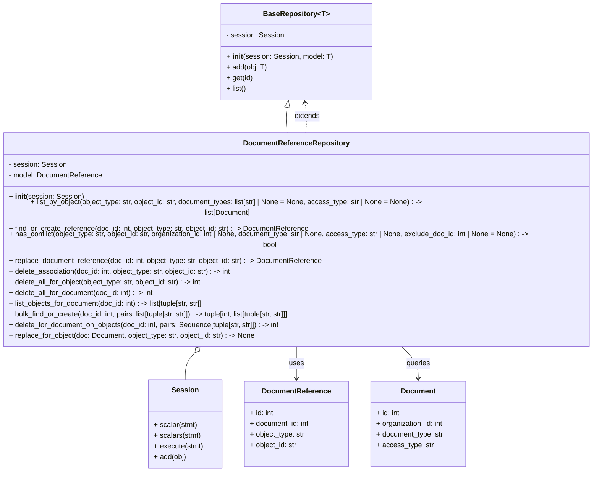

# Diagram: common/document_service/src/api/repository/document_reference_repository.py


> Auto-generated by Obscura crawlers

## Diagram 1



### SVG

<svg id="container" width="1375.3671875" xmlns="http://www.w3.org/2000/svg" class="classDiagram" height="1010" viewBox="0 0 1375.3671875 1010" role="graphics-document document" aria-roledescription="class"><style>#container{font-family:"trebuchet ms",verdana,arial,sans-serif;font-size:16px;fill:#333;}@keyframes edge-animation-frame{from{stroke-dashoffset:0;}}@keyframes dash{to{stroke-dashoffset:0;}}#container .edge-animation-slow{stroke-dasharray:9,5!important;stroke-dashoffset:900;animation:dash 50s linear infinite;stroke-linecap:round;}#container .edge-animation-fast{stroke-dasharray:9,5!important;stroke-dashoffset:900;animation:dash 20s linear infinite;stroke-linecap:round;}#container .error-icon{fill:#552222;}#container .error-text{fill:#552222;stroke:#552222;}#container .edge-thickness-normal{stroke-width:1px;}#container .edge-thickness-thick{stroke-width:3.5px;}#container .edge-pattern-solid{stroke-dasharray:0;}#container .edge-thickness-invisible{stroke-width:0;fill:none;}#container .edge-pattern-dashed{stroke-dasharray:3;}#container .edge-pattern-dotted{stroke-dasharray:2;}#container .marker{fill:#333333;stroke:#333333;}#container .marker.cross{stroke:#333333;}#container svg{font-family:"trebuchet ms",verdana,arial,sans-serif;font-size:16px;}#container p{margin:0;}#container g.classGroup text{fill:#9370DB;stroke:none;font-family:"trebuchet ms",verdana,arial,sans-serif;font-size:10px;}#container g.classGroup text .title{font-weight:bolder;}#container .nodeLabel,#container .edgeLabel{color:#131300;}#container .edgeLabel .label rect{fill:#ECECFF;}#container .label text{fill:#131300;}#container .labelBkg{background:#ECECFF;}#container .edgeLabel .label span{background:#ECECFF;}#container .classTitle{font-weight:bolder;}#container .node rect,#container .node circle,#container .node ellipse,#container .node polygon,#container .node path{fill:#ECECFF;stroke:#9370DB;stroke-width:1px;}#container .divider{stroke:#9370DB;stroke-width:1;}#container g.clickable{cursor:pointer;}#container g.classGroup rect{fill:#ECECFF;stroke:#9370DB;}#container g.classGroup line{stroke:#9370DB;stroke-width:1;}#container .classLabel .box{stroke:none;stroke-width:0;fill:#ECECFF;opacity:0.5;}#container .classLabel .label{fill:#9370DB;font-size:10px;}#container .relation{stroke:#333333;stroke-width:1;fill:none;}#container .dashed-line{stroke-dasharray:3;}#container .dotted-line{stroke-dasharray:1 2;}#container #compositionStart,#container .composition{fill:#333333!important;stroke:#333333!important;stroke-width:1;}#container #compositionEnd,#container .composition{fill:#333333!important;stroke:#333333!important;stroke-width:1;}#container #dependencyStart,#container .dependency{fill:#333333!important;stroke:#333333!important;stroke-width:1;}#container #dependencyStart,#container .dependency{fill:#333333!important;stroke:#333333!important;stroke-width:1;}#container #extensionStart,#container .extension{fill:transparent!important;stroke:#333333!important;stroke-width:1;}#container #extensionEnd,#container .extension{fill:transparent!important;stroke:#333333!important;stroke-width:1;}#container #aggregationStart,#container .aggregation{fill:transparent!important;stroke:#333333!important;stroke-width:1;}#container #aggregationEnd,#container .aggregation{fill:transparent!important;stroke:#333333!important;stroke-width:1;}#container #lollipopStart,#container .lollipop{fill:#ECECFF!important;stroke:#333333!important;stroke-width:1;}#container #lollipopEnd,#container .lollipop{fill:#ECECFF!important;stroke:#333333!important;stroke-width:1;}#container .edgeTerminals{font-size:11px;line-height:initial;}#container .classTitleText{text-anchor:middle;font-size:18px;fill:#333;}#container .label-icon{display:inline-block;height:1em;overflow:visible;vertical-align:-0.125em;}#container .node .label-icon path{fill:currentColor;stroke:revert;stroke-width:revert;}#container :root{--mermaid-font-family:"trebuchet ms",verdana,arial,sans-serif;}</style><g><defs><marker id="container_class-aggregationStart" class="marker aggregation class" refX="18" refY="7" markerWidth="190" markerHeight="240" orient="auto"><path d="M 18,7 L9,13 L1,7 L9,1 Z"></path></marker></defs><defs><marker id="container_class-aggregationEnd" class="marker aggregation class" refX="1" refY="7" markerWidth="20" markerHeight="28" orient="auto"><path d="M 18,7 L9,13 L1,7 L9,1 Z"></path></marker></defs><defs><marker id="container_class-extensionStart" class="marker extension class" refX="18" refY="7" markerWidth="190" markerHeight="240" orient="auto"><path d="M 1,7 L18,13 V 1 Z"></path></marker></defs><defs><marker id="container_class-extensionEnd" class="marker extension class" refX="1" refY="7" markerWidth="20" markerHeight="28" orient="auto"><path d="M 1,1 V 13 L18,7 Z"></path></marker></defs><defs><marker id="container_class-compositionStart" class="marker composition class" refX="18" refY="7" markerWidth="190" markerHeight="240" orient="auto"><path d="M 18,7 L9,13 L1,7 L9,1 Z"></path></marker></defs><defs><marker id="container_class-compositionEnd" class="marker composition class" refX="1" refY="7" markerWidth="20" markerHeight="28" orient="auto"><path d="M 18,7 L9,13 L1,7 L9,1 Z"></path></marker></defs><defs><marker id="container_class-dependencyStart" class="marker dependency class" refX="6" refY="7" markerWidth="190" markerHeight="240" orient="auto"><path d="M 5,7 L9,13 L1,7 L9,1 Z"></path></marker></defs><defs><marker id="container_class-dependencyEnd" class="marker dependency class" refX="13" refY="7" markerWidth="20" markerHeight="28" orient="auto"><path d="M 18,7 L9,13 L14,7 L9,1 Z"></path></marker></defs><defs><marker id="container_class-lollipopStart" class="marker lollipop class" refX="13" refY="7" markerWidth="190" markerHeight="240" orient="auto"><circle stroke="black" fill="transparent" cx="7" cy="7" r="6"></circle></marker></defs><defs><marker id="container_class-lollipopEnd" class="marker lollipop class" refX="1" refY="7" markerWidth="190" markerHeight="240" orient="auto"><circle stroke="black" fill="transparent" cx="7" cy="7" r="6"></circle></marker></defs><g class="root"><g class="clusters"></g><g class="edgePaths"><path d="M666.773,241.014L666.216,244.345C665.658,247.676,664.544,254.338,664.578,263.836C664.612,273.333,665.794,285.667,666.386,291.833L666.977,298" id="id_BaseRepository_DocumentReferenceRepository_1" class="edge-thickness-normal edge-pattern-solid relation" style=";;;" data-edge="true" data-et="edge" data-id="id_BaseRepository_DocumentReferenceRepository_1" data-points="W3sieCI6NjY5LjYxODYxNTMwMTcyNDIsInkiOjIyNH0seyJ4Ijo2NjMuNDI5Njg3NSwieSI6MjYxfSx7IngiOjY2Ni45NzY3MDE0NTc1MDk5LCJ5IjoyOTh9XQ==" marker-start="url(#container_class-extensionStart)"></path><path d="M463.537,742.309L459.497,746.424C455.457,750.54,447.377,758.77,443.337,769.052C439.297,779.333,439.297,791.667,439.297,797.833L439.297,804" id="id_DocumentReferenceRepository_Session_2" class="edge-thickness-normal edge-pattern-solid relation" style=";;;" data-edge="true" data-et="edge" data-id="id_DocumentReferenceRepository_Session_2" data-points="W3sieCI6NDc1LjYyMjIwNTQxMDA3OTA2LCJ5Ijo3MzB9LHsieCI6NDM5LjI5Njg3NSwieSI6NzY3fSx7IngiOjQzOS4yOTY4NzUsInkiOjgwNH1d" marker-start="url(#container_class-aggregationStart)"></path><path d="M687.684,730L687.684,736.167C687.684,742.333,687.684,754.667,687.684,766.5C687.684,778.333,687.684,789.667,687.684,795.333L687.684,801" id="id_DocumentReferenceRepository_DocumentReference_3" class="edge-thickness-normal edge-pattern-solid relation" style=";;;" data-edge="true" data-et="edge" data-id="id_DocumentReferenceRepository_DocumentReference_3" data-points="W3sieCI6Njg3LjY4MzU5Mzc1LCJ5Ijo3MzB9LHsieCI6Njg3LjY4MzU5Mzc1LCJ5Ijo3Njd9LHsieCI6Njg3LjY4MzU5Mzc1LCJ5Ijo4MDd9XQ==" marker-end="url(#container_class-dependencyEnd)"></path><path d="M921.266,730L927.934,736.167C934.603,742.333,947.94,754.667,954.609,766.5C961.277,778.333,961.277,789.667,961.277,795.333L961.277,801" id="id_DocumentReferenceRepository_Document_4" class="edge-thickness-normal edge-pattern-solid relation" style=";;;" data-edge="true" data-et="edge" data-id="id_DocumentReferenceRepository_Document_4" data-points="W3sieCI6OTIxLjI2NTYwOTU2MDI3NjcsInkiOjczMH0seyJ4Ijo5NjEuMjc3MzQzNzUsInkiOjc2N30seyJ4Ijo5NjEuMjc3MzQzNzUsInkiOjgwN31d" marker-end="url(#container_class-dependencyEnd)"></path><path d="M708.39,298L708.982,291.833C709.573,285.667,710.755,273.333,710.48,261.986C710.204,250.639,708.471,240.279,707.605,235.098L706.738,229.918" id="id_DocumentReferenceRepository_BaseRepository_5" class="edge-thickness-normal edge-pattern-dashed relation" style=";;;" data-edge="true" data-et="edge" data-id="id_DocumentReferenceRepository_BaseRepository_5" data-points="W3sieCI6NzA4LjM5MDQ4NjA0MjQ5MDEsInkiOjI5OH0seyJ4Ijo3MTEuOTM3NSwieSI6MjYxfSx7IngiOjcwNS43NDg1NzIxOTgyNzU4LCJ5IjoyMjR9XQ==" marker-end="url(#container_class-dependencyEnd)"></path></g><g class="edgeLabels"><g class="edgeLabel"><g class="label" data-id="id_BaseRepository_DocumentReferenceRepository_1" transform="translate(0, 0)"><foreignObject width="0" height="0"><div xmlns="http://www.w3.org/1999/xhtml" class="labelBkg" style="display: table-cell; white-space: nowrap; line-height: 1.5; max-width: 200px; text-align: center;"><span class="edgeLabel"></span></div></foreignObject></g></g><g class="edgeLabel"><g class="label" data-id="id_DocumentReferenceRepository_Session_2" transform="translate(0, 0)"><foreignObject width="0" height="0"><div xmlns="http://www.w3.org/1999/xhtml" class="labelBkg" style="display: table-cell; white-space: nowrap; line-height: 1.5; max-width: 200px; text-align: center;"><span class="edgeLabel"></span></div></foreignObject></g></g><g class="edgeLabel" transform="translate(687.68359375, 767)"><g class="label" data-id="id_DocumentReferenceRepository_DocumentReference_3" transform="translate(-16.4921875, -12)"><foreignObject width="32.984375" height="24"><div xmlns="http://www.w3.org/1999/xhtml" class="labelBkg" style="display: table-cell; white-space: nowrap; line-height: 1.5; max-width: 200px; text-align: center;"><span class="edgeLabel"><p>uses</p></span></div></foreignObject></g></g><g class="edgeLabel" transform="translate(961.27734375, 767)"><g class="label" data-id="id_DocumentReferenceRepository_Document_4" transform="translate(-27.2421875, -12)"><foreignObject width="54.484375" height="24"><div xmlns="http://www.w3.org/1999/xhtml" class="labelBkg" style="display: table-cell; white-space: nowrap; line-height: 1.5; max-width: 200px; text-align: center;"><span class="edgeLabel"><p>queries</p></span></div></foreignObject></g></g><g class="edgeLabel" transform="translate(711.90909, 260.83016)"><g class="label" data-id="id_DocumentReferenceRepository_BaseRepository_5" transform="translate(-28.5078125, -12)"><foreignObject width="57.015625" height="24"><div xmlns="http://www.w3.org/1999/xhtml" class="labelBkg" style="display: table-cell; white-space: nowrap; line-height: 1.5; max-width: 200px; text-align: center;"><span class="edgeLabel"><p>extends</p></span></div></foreignObject></g></g></g><g class="nodes"><g class="node default" id="classId-BaseRepository-0" transform="translate(687.68359375, 116)"><g class="basic label-container"><path d="M-164.66796875 -108 L164.66796875 -108 L164.66796875 108 L-164.66796875 108" stroke="none" stroke-width="0" fill="#ECECFF" style=""></path><path d="M-164.66796875 -108 C-34.449598491611596 -108, 95.76877176677681 -108, 164.66796875 -108 M-164.66796875 -108 C-86.87189540172086 -108, -9.075822053441726 -108, 164.66796875 -108 M164.66796875 -108 C164.66796875 -57.082359761603186, 164.66796875 -6.164719523206372, 164.66796875 108 M164.66796875 -108 C164.66796875 -60.309631351785704, 164.66796875 -12.619262703571408, 164.66796875 108 M164.66796875 108 C88.03833184742264 108, 11.40869494484528 108, -164.66796875 108 M164.66796875 108 C37.054013123224095 108, -90.55994250355181 108, -164.66796875 108 M-164.66796875 108 C-164.66796875 37.472581119689465, -164.66796875 -33.05483776062107, -164.66796875 -108 M-164.66796875 108 C-164.66796875 36.03816878119241, -164.66796875 -35.92366243761518, -164.66796875 -108" stroke="#9370DB" stroke-width="1.3" fill="none" stroke-dasharray="0 0" style=""></path></g><g class="annotation-group text" transform="translate(0, -84)"></g><g class="label-group text" transform="translate(-69.9140625, -84)"><g class="label" style="font-weight: bolder" transform="translate(0,-12)"><foreignObject width="139.828125" height="24"><div xmlns="http://www.w3.org/1999/xhtml" style="display: table-cell; white-space: nowrap; line-height: 1.5; max-width: 225px; text-align: center;"><span class="nodeLabel markdown-node-label" style=""><p>BaseRepository&lt;T&gt;</p></span></div></foreignObject></g></g><g class="members-group text" transform="translate(-152.66796875, -36)"><g class="label" style="" transform="translate(0,-12)"><foreignObject width="128.4375" height="24"><div xmlns="http://www.w3.org/1999/xhtml" style="display: table-cell; white-space: nowrap; line-height: 1.5; max-width: 186px; text-align: center;"><span class="nodeLabel markdown-node-label" style=""><p>- session: Session</p></span></div></foreignObject></g></g><g class="methods-group text" transform="translate(-152.66796875, 12)"><g class="label" style="" transform="translate(0,-12)"><foreignObject width="235.421875" height="24"><div xmlns="http://www.w3.org/1999/xhtml" style="display: table-cell; white-space: nowrap; line-height: 1.5; max-width: 325px; text-align: center;"><span class="nodeLabel markdown-node-label" style=""><p>+ <strong>init</strong>(session: Session, model: T)</p></span></div></foreignObject></g><g class="label" style="" transform="translate(0,12)"><foreignObject width="90.125" height="24"><div xmlns="http://www.w3.org/1999/xhtml" style="display: table-cell; white-space: nowrap; line-height: 1.5; max-width: 147px; text-align: center;"><span class="nodeLabel markdown-node-label" style=""><p>+ add(obj: T)</p></span></div></foreignObject></g><g class="label" style="" transform="translate(0,36)"><foreignObject width="59.234375" height="24"><div xmlns="http://www.w3.org/1999/xhtml" style="display: table-cell; white-space: nowrap; line-height: 1.5; max-width: 117px; text-align: center;"><span class="nodeLabel markdown-node-label" style=""><p>+ get(id)</p></span></div></foreignObject></g><g class="label" style="" transform="translate(0,60)"><foreignObject width="45.046875" height="24"><div xmlns="http://www.w3.org/1999/xhtml" style="display: table-cell; white-space: nowrap; line-height: 1.5; max-width: 102px; text-align: center;"><span class="nodeLabel markdown-node-label" style=""><p>+ list()</p></span></div></foreignObject></g></g><g class="divider" style=""><path d="M-164.66796875 -60 C-53.32959231076936 -60, 58.008784128461286 -60, 164.66796875 -60 M-164.66796875 -60 C-44.71461073639688 -60, 75.23874727720624 -60, 164.66796875 -60" stroke="#9370DB" stroke-width="1.3" fill="none" stroke-dasharray="0 0" style=""></path></g><g class="divider" style=""><path d="M-164.66796875 -12 C-34.57136887003816 -12, 95.52523100992369 -12, 164.66796875 -12 M-164.66796875 -12 C-45.53513511368331 -12, 73.59769852263338 -12, 164.66796875 -12" stroke="#9370DB" stroke-width="1.3" fill="none" stroke-dasharray="0 0" style=""></path></g></g><g class="node default" id="classId-DocumentReferenceRepository-1" transform="translate(687.68359375, 514)"><g class="basic label-container"><path d="M-679.68359375 -216 L679.68359375 -216 L679.68359375 216 L-679.68359375 216" stroke="none" stroke-width="0" fill="#ECECFF" style=""></path><path d="M-679.68359375 -216 C-277.9461366291639 -216, 123.7913204916722 -216, 679.68359375 -216 M-679.68359375 -216 C-155.36891961023582 -216, 368.94575452952836 -216, 679.68359375 -216 M679.68359375 -216 C679.68359375 -60.60945507066245, 679.68359375 94.7810898586751, 679.68359375 216 M679.68359375 -216 C679.68359375 -107.61968539438567, 679.68359375 0.760629211228661, 679.68359375 216 M679.68359375 216 C306.250858745993 216, -67.18187625801397 216, -679.68359375 216 M679.68359375 216 C155.37658849342176 216, -368.9304167631565 216, -679.68359375 216 M-679.68359375 216 C-679.68359375 78.45282497562482, -679.68359375 -59.09435004875036, -679.68359375 -216 M-679.68359375 216 C-679.68359375 123.29142340134936, -679.68359375 30.582846802698725, -679.68359375 -216" stroke="#9370DB" stroke-width="1.3" fill="none" stroke-dasharray="0 0" style=""></path></g><g class="annotation-group text" transform="translate(0, -192)"></g><g class="label-group text" transform="translate(-113.3671875, -192)"><g class="label" style="font-weight: bolder" transform="translate(0,-12)"><foreignObject width="226.734375" height="24"><div xmlns="http://www.w3.org/1999/xhtml" style="display: table-cell; white-space: nowrap; line-height: 1.5; max-width: 274px; text-align: center;"><span class="nodeLabel markdown-node-label" style=""><p>DocumentReferenceRepository</p></span></div></foreignObject></g></g><g class="members-group text" transform="translate(-667.68359375, -144)"><g class="label" style="" transform="translate(0,-12)"><foreignObject width="128.4375" height="24"><div xmlns="http://www.w3.org/1999/xhtml" style="display: table-cell; white-space: nowrap; line-height: 1.5; max-width: 186px; text-align: center;"><span class="nodeLabel markdown-node-label" style=""><p>- session: Session</p></span></div></foreignObject></g><g class="label" style="" transform="translate(0,12)"><foreignObject width="210.921875" height="24"><div xmlns="http://www.w3.org/1999/xhtml" style="display: table-cell; white-space: nowrap; line-height: 1.5; max-width: 268px; text-align: center;"><span class="nodeLabel markdown-node-label" style=""><p>- model: DocumentReference</p></span></div></foreignObject></g></g><g class="methods-group text" transform="translate(-667.68359375, -72)"><g class="label" style="" transform="translate(0,-12)"><foreignObject width="164.796875" height="24"><div xmlns="http://www.w3.org/1999/xhtml" style="display: table-cell; white-space: nowrap; line-height: 1.5; max-width: 255px; text-align: center;"><span class="nodeLabel markdown-node-label" style=""><p>+ <strong>init</strong>(session: Session)</p></span></div></foreignObject></g><g class="label" style="" transform="translate(0,12)"><foreignObject width="1002.234375" height="24"><div xmlns="http://www.w3.org/1999/xhtml" style="display: table-cell; white-space: nowrap; line-height: 1.5; max-width: 1081px; text-align: center;"><span class="nodeLabel markdown-node-label" style=""><p>+ list_by_object(object_type: str, object_id: str, document_types: list[str] | None = None, access_type: str | None = None) : -&gt; list[Document]</p></span></div></foreignObject></g><g class="label" style="" transform="translate(0,36)"><foreignObject width="678.78125" height="24"><div xmlns="http://www.w3.org/1999/xhtml" style="display: table-cell; white-space: nowrap; line-height: 1.5; max-width: 757px; text-align: center;"><span class="nodeLabel markdown-node-label" style=""><p>+ find_or_create_reference(doc_id: int, object_type: str, object_id: str) : -&gt; DocumentReference</p></span></div></foreignObject></g><g class="label" style="" transform="translate(0,60)"><foreignObject width="1222" height="24"><div xmlns="http://www.w3.org/1999/xhtml" style="display: table-cell; white-space: nowrap; line-height: 1.5; max-width: 1301px; text-align: center;"><span class="nodeLabel markdown-node-label" style=""><p>+ has_conflict(object_type: str, object_id: str, organization_id: int | None, document_type: str | None, access_type: str | None, exclude_doc_id: int | None = None) : -&gt; bool</p></span></div></foreignObject></g><g class="label" style="" transform="translate(0,84)"><foreignObject width="710.109375" height="24"><div xmlns="http://www.w3.org/1999/xhtml" style="display: table-cell; white-space: nowrap; line-height: 1.5; max-width: 789px; text-align: center;"><span class="nodeLabel markdown-node-label" style=""><p>+ replace_document_reference(doc_id: int, object_type: str, object_id: str) : -&gt; DocumentReference</p></span></div></foreignObject></g><g class="label" style="" transform="translate(0,108)"><foreignObject width="509.15625" height="24"><div xmlns="http://www.w3.org/1999/xhtml" style="display: table-cell; white-space: nowrap; line-height: 1.5; max-width: 588px; text-align: center;"><span class="nodeLabel markdown-node-label" style=""><p>+ delete_association(doc_id: int, object_type: str, object_id: str) : -&gt; int</p></span></div></foreignObject></g><g class="label" style="" transform="translate(0,132)"><foreignObject width="440.59375" height="24"><div xmlns="http://www.w3.org/1999/xhtml" style="display: table-cell; white-space: nowrap; line-height: 1.5; max-width: 519px; text-align: center;"><span class="nodeLabel markdown-node-label" style=""><p>+ delete_all_for_object(object_type: str, object_id: str) : -&gt; int</p></span></div></foreignObject></g><g class="label" style="" transform="translate(0,156)"><foreignObject width="330.1875" height="24"><div xmlns="http://www.w3.org/1999/xhtml" style="display: table-cell; white-space: nowrap; line-height: 1.5; max-width: 409px; text-align: center;"><span class="nodeLabel markdown-node-label" style=""><p>+ delete_all_for_document(doc_id: int) : -&gt; int</p></span></div></foreignObject></g><g class="label" style="" transform="translate(0,180)"><foreignObject width="448.75" height="24"><div xmlns="http://www.w3.org/1999/xhtml" style="display: table-cell; white-space: nowrap; line-height: 1.5; max-width: 527px; text-align: center;"><span class="nodeLabel markdown-node-label" style=""><p>+ list_objects_for_document(doc_id: int) : -&gt; list[tuple[str, str]]</p></span></div></foreignObject></g><g class="label" style="" transform="translate(0,204)"><foreignObject width="654.734375" height="24"><div xmlns="http://www.w3.org/1999/xhtml" style="display: table-cell; white-space: nowrap; line-height: 1.5; max-width: 733px; text-align: center;"><span class="nodeLabel markdown-node-label" style=""><p>+ bulk_find_or_create(doc_id: int, pairs: list[tuple[str, str]]) : -&gt; tuple[int, list[tuple[str, str]]]</p></span></div></foreignObject></g><g class="label" style="" transform="translate(0,228)"><foreignObject width="618.765625" height="24"><div xmlns="http://www.w3.org/1999/xhtml" style="display: table-cell; white-space: nowrap; line-height: 1.5; max-width: 698px; text-align: center;"><span class="nodeLabel markdown-node-label" style=""><p>+ delete_for_document_on_objects(doc_id: int, pairs: Sequence[tuple[str, str]]) : -&gt; int</p></span></div></foreignObject></g><g class="label" style="" transform="translate(0,252)"><foreignObject width="557.671875" height="24"><div xmlns="http://www.w3.org/1999/xhtml" style="display: table-cell; white-space: nowrap; line-height: 1.5; max-width: 636px; text-align: center;"><span class="nodeLabel markdown-node-label" style=""><p>+ replace_for_object(doc: Document, object_type: str, object_id: str) : -&gt; None</p></span></div></foreignObject></g></g><g class="divider" style=""><path d="M-679.68359375 -168 C-163.07346004256397 -168, 353.53667366487207 -168, 679.68359375 -168 M-679.68359375 -168 C-226.11144469098542 -168, 227.46070436802916 -168, 679.68359375 -168" stroke="#9370DB" stroke-width="1.3" fill="none" stroke-dasharray="0 0" style=""></path></g><g class="divider" style=""><path d="M-679.68359375 -96 C-212.5698137059727 -96, 254.5439663380546 -96, 679.68359375 -96 M-679.68359375 -96 C-141.3093517251226 -96, 397.0648902997548 -96, 679.68359375 -96" stroke="#9370DB" stroke-width="1.3" fill="none" stroke-dasharray="0 0" style=""></path></g></g><g class="node default" id="classId-Document-2" transform="translate(961.27734375, 903)"><g class="basic label-container"><path d="M-106.9609375 -96 L106.9609375 -96 L106.9609375 96 L-106.9609375 96" stroke="none" stroke-width="0" fill="#ECECFF" style=""></path><path d="M-106.9609375 -96 C-41.39369383408592 -96, 24.173549831828154 -96, 106.9609375 -96 M-106.9609375 -96 C-39.894252072171426 -96, 27.172433355657148 -96, 106.9609375 -96 M106.9609375 -96 C106.9609375 -44.87534774102407, 106.9609375 6.249304517951856, 106.9609375 96 M106.9609375 -96 C106.9609375 -34.67140474278375, 106.9609375 26.6571905144325, 106.9609375 96 M106.9609375 96 C37.29695207853355 96, -32.3670333429329 96, -106.9609375 96 M106.9609375 96 C25.744002385073784 96, -55.47293272985243 96, -106.9609375 96 M-106.9609375 96 C-106.9609375 27.5153473191869, -106.9609375 -40.9693053616262, -106.9609375 -96 M-106.9609375 96 C-106.9609375 46.455622238458886, -106.9609375 -3.0887555230822272, -106.9609375 -96" stroke="#9370DB" stroke-width="1.3" fill="none" stroke-dasharray="0 0" style=""></path></g><g class="annotation-group text" transform="translate(0, -72)"></g><g class="label-group text" transform="translate(-37.09375, -72)"><g class="label" style="font-weight: bolder" transform="translate(0,-12)"><foreignObject width="74.1875" height="24"><div xmlns="http://www.w3.org/1999/xhtml" style="display: table-cell; white-space: nowrap; line-height: 1.5; max-width: 124px; text-align: center;"><span class="nodeLabel markdown-node-label" style=""><p>Document</p></span></div></foreignObject></g></g><g class="members-group text" transform="translate(-94.9609375, -24)"><g class="label" style="" transform="translate(0,-12)"><foreignObject width="54.0625" height="24"><div xmlns="http://www.w3.org/1999/xhtml" style="display: table-cell; white-space: nowrap; line-height: 1.5; max-width: 112px; text-align: center;"><span class="nodeLabel markdown-node-label" style=""><p>+ id: int</p></span></div></foreignObject></g><g class="label" style="" transform="translate(0,12)"><foreignObject width="152.734375" height="24"><div xmlns="http://www.w3.org/1999/xhtml" style="display: table-cell; white-space: nowrap; line-height: 1.5; max-width: 210px; text-align: center;"><span class="nodeLabel markdown-node-label" style=""><p>+ organization_id: int</p></span></div></foreignObject></g><g class="label" style="" transform="translate(0,36)"><foreignObject width="152.828125" height="24"><div xmlns="http://www.w3.org/1999/xhtml" style="display: table-cell; white-space: nowrap; line-height: 1.5; max-width: 211px; text-align: center;"><span class="nodeLabel markdown-node-label" style=""><p>+ document_type: str</p></span></div></foreignObject></g><g class="label" style="" transform="translate(0,60)"><foreignObject width="126.078125" height="24"><div xmlns="http://www.w3.org/1999/xhtml" style="display: table-cell; white-space: nowrap; line-height: 1.5; max-width: 184px; text-align: center;"><span class="nodeLabel markdown-node-label" style=""><p>+ access_type: str</p></span></div></foreignObject></g></g><g class="methods-group text" transform="translate(-94.9609375, 96)"></g><g class="divider" style=""><path d="M-106.9609375 -48 C-46.0580075138315 -48, 14.844922472337004 -48, 106.9609375 -48 M-106.9609375 -48 C-36.814310885392345 -48, 33.33231572921531 -48, 106.9609375 -48" stroke="#9370DB" stroke-width="1.3" fill="none" stroke-dasharray="0 0" style=""></path></g><g class="divider" style=""><path d="M-106.9609375 72 C-47.54286229533039 72, 11.875212909339226 72, 106.9609375 72 M-106.9609375 72 C-58.05620983025423 72, -9.151482160508465 72, 106.9609375 72" stroke="#9370DB" stroke-width="1.3" fill="none" stroke-dasharray="0 0" style=""></path></g></g><g class="node default" id="classId-DocumentReference-3" transform="translate(687.68359375, 903)"><g class="basic label-container"><path d="M-116.6328125 -96 L116.6328125 -96 L116.6328125 96 L-116.6328125 96" stroke="none" stroke-width="0" fill="#ECECFF" style=""></path><path d="M-116.6328125 -96 C-28.81910388536842 -96, 58.99460472926316 -96, 116.6328125 -96 M-116.6328125 -96 C-54.38466472385422 -96, 7.863483052291556 -96, 116.6328125 -96 M116.6328125 -96 C116.6328125 -53.232517207257736, 116.6328125 -10.465034414515472, 116.6328125 96 M116.6328125 -96 C116.6328125 -51.40017587668192, 116.6328125 -6.800351753363842, 116.6328125 96 M116.6328125 96 C60.72791172286067 96, 4.823010945721336 96, -116.6328125 96 M116.6328125 96 C53.09076006882106 96, -10.451292362357876 96, -116.6328125 96 M-116.6328125 96 C-116.6328125 51.74697922079627, -116.6328125 7.4939584415925395, -116.6328125 -96 M-116.6328125 96 C-116.6328125 28.973770688114172, -116.6328125 -38.052458623771656, -116.6328125 -96" stroke="#9370DB" stroke-width="1.3" fill="none" stroke-dasharray="0 0" style=""></path></g><g class="annotation-group text" transform="translate(0, -72)"></g><g class="label-group text" transform="translate(-73.59375, -72)"><g class="label" style="font-weight: bolder" transform="translate(0,-12)"><foreignObject width="147.1875" height="24"><div xmlns="http://www.w3.org/1999/xhtml" style="display: table-cell; white-space: nowrap; line-height: 1.5; max-width: 196px; text-align: center;"><span class="nodeLabel markdown-node-label" style=""><p>DocumentReference</p></span></div></foreignObject></g></g><g class="members-group text" transform="translate(-104.6328125, -24)"><g class="label" style="" transform="translate(0,-12)"><foreignObject width="54.0625" height="24"><div xmlns="http://www.w3.org/1999/xhtml" style="display: table-cell; white-space: nowrap; line-height: 1.5; max-width: 112px; text-align: center;"><span class="nodeLabel markdown-node-label" style=""><p>+ id: int</p></span></div></foreignObject></g><g class="label" style="" transform="translate(0,12)"><foreignObject width="135.671875" height="24"><div xmlns="http://www.w3.org/1999/xhtml" style="display: table-cell; white-space: nowrap; line-height: 1.5; max-width: 193px; text-align: center;"><span class="nodeLabel markdown-node-label" style=""><p>+ document_id: int</p></span></div></foreignObject></g><g class="label" style="" transform="translate(0,36)"><foreignObject width="125" height="24"><div xmlns="http://www.w3.org/1999/xhtml" style="display: table-cell; white-space: nowrap; line-height: 1.5; max-width: 183px; text-align: center;"><span class="nodeLabel markdown-node-label" style=""><p>+ object_type: str</p></span></div></foreignObject></g><g class="label" style="" transform="translate(0,60)"><foreignObject width="107.609375" height="24"><div xmlns="http://www.w3.org/1999/xhtml" style="display: table-cell; white-space: nowrap; line-height: 1.5; max-width: 166px; text-align: center;"><span class="nodeLabel markdown-node-label" style=""><p>+ object_id: str</p></span></div></foreignObject></g></g><g class="methods-group text" transform="translate(-104.6328125, 96)"></g><g class="divider" style=""><path d="M-116.6328125 -48 C-32.39662791660281 -48, 51.83955666679438 -48, 116.6328125 -48 M-116.6328125 -48 C-43.08935709759821 -48, 30.45409830480358 -48, 116.6328125 -48" stroke="#9370DB" stroke-width="1.3" fill="none" stroke-dasharray="0 0" style=""></path></g><g class="divider" style=""><path d="M-116.6328125 72 C-37.103828387549044 72, 42.42515572490191 72, 116.6328125 72 M-116.6328125 72 C-31.56773088959315 72, 53.4973507208137 72, 116.6328125 72" stroke="#9370DB" stroke-width="1.3" fill="none" stroke-dasharray="0 0" style=""></path></g></g><g class="node default" id="classId-Session-4" transform="translate(439.296875, 903)"><g class="basic label-container"><path d="M-81.75390625 -99 L81.75390625 -99 L81.75390625 99 L-81.75390625 99" stroke="none" stroke-width="0" fill="#ECECFF" style=""></path><path d="M-81.75390625 -99 C-24.34899369027488 -99, 33.05591886945024 -99, 81.75390625 -99 M-81.75390625 -99 C-45.44189675172112 -99, -9.129887253442234 -99, 81.75390625 -99 M81.75390625 -99 C81.75390625 -57.33579566229555, 81.75390625 -15.671591324591105, 81.75390625 99 M81.75390625 -99 C81.75390625 -54.90900377620701, 81.75390625 -10.818007552414016, 81.75390625 99 M81.75390625 99 C39.33314972696719 99, -3.0876067960656144 99, -81.75390625 99 M81.75390625 99 C19.363729068714854 99, -43.02644811257029 99, -81.75390625 99 M-81.75390625 99 C-81.75390625 46.28094967278039, -81.75390625 -6.438100654439225, -81.75390625 -99 M-81.75390625 99 C-81.75390625 38.64909071972554, -81.75390625 -21.701818560548915, -81.75390625 -99" stroke="#9370DB" stroke-width="1.3" fill="none" stroke-dasharray="0 0" style=""></path></g><g class="annotation-group text" transform="translate(0, -75)"></g><g class="label-group text" transform="translate(-28.2109375, -75)"><g class="label" style="font-weight: bolder" transform="translate(0,-12)"><foreignObject width="56.421875" height="24"><div xmlns="http://www.w3.org/1999/xhtml" style="display: table-cell; white-space: nowrap; line-height: 1.5; max-width: 105px; text-align: center;"><span class="nodeLabel markdown-node-label" style=""><p>Session</p></span></div></foreignObject></g></g><g class="members-group text" transform="translate(-69.75390625, -27)"></g><g class="methods-group text" transform="translate(-69.75390625, 3)"><g class="label" style="" transform="translate(0,-12)"><foreignObject width="98.328125" height="24"><div xmlns="http://www.w3.org/1999/xhtml" style="display: table-cell; white-space: nowrap; line-height: 1.5; max-width: 156px; text-align: center;"><span class="nodeLabel markdown-node-label" style=""><p>+ scalar(stmt)</p></span></div></foreignObject></g><g class="label" style="" transform="translate(0,12)"><foreignObject width="105.5625" height="24"><div xmlns="http://www.w3.org/1999/xhtml" style="display: table-cell; white-space: nowrap; line-height: 1.5; max-width: 163px; text-align: center;"><span class="nodeLabel markdown-node-label" style=""><p>+ scalars(stmt)</p></span></div></foreignObject></g><g class="label" style="" transform="translate(0,36)"><foreignObject width="111.296875" height="24"><div xmlns="http://www.w3.org/1999/xhtml" style="display: table-cell; white-space: nowrap; line-height: 1.5; max-width: 169px; text-align: center;"><span class="nodeLabel markdown-node-label" style=""><p>+ execute(stmt)</p></span></div></foreignObject></g><g class="label" style="" transform="translate(0,60)"><foreignObject width="73.765625" height="24"><div xmlns="http://www.w3.org/1999/xhtml" style="display: table-cell; white-space: nowrap; line-height: 1.5; max-width: 131px; text-align: center;"><span class="nodeLabel markdown-node-label" style=""><p>+ add(obj)</p></span></div></foreignObject></g></g><g class="divider" style=""><path d="M-81.75390625 -51 C-38.334250755765936 -51, 5.085404738468128 -51, 81.75390625 -51 M-81.75390625 -51 C-39.398787031146675 -51, 2.95633218770665 -51, 81.75390625 -51" stroke="#9370DB" stroke-width="1.3" fill="none" stroke-dasharray="0 0" style=""></path></g><g class="divider" style=""><path d="M-81.75390625 -27 C-34.64837570956334 -27, 12.457154830873321 -27, 81.75390625 -27 M-81.75390625 -27 C-23.41031732072942 -27, 34.93327160854116 -27, 81.75390625 -27" stroke="#9370DB" stroke-width="1.3" fill="none" stroke-dasharray="0 0" style=""></path></g></g></g></g></g></svg>

## Diagram 2

```mermaid
sequenceDiagram
participant Caller
participant Repo as DocumentReferenceRepository
participant DB as Database/Session
Caller->>Repo: replace_for_object(doc, object_type, object_id)
Repo->>DB: SELECT Document.id JOIN DocumentReference WHERE object_type, object_id, organization_id, document_type, access_type
DB-->>Repo: conflicting_doc_ids (list)
alt conflicting_doc_ids not empty
  Repo->>DB: DELETE FROM DocumentReference WHERE document_id IN (conflicting_doc_ids) AND object_type == X AND object_id == Y
  DB-->>Repo: delete_result
end
Repo->>Repo: replace_document_reference(doc.id, object_type, object_id)
Repo->>DB: SELECT DocumentReference WHERE document_id==doc.id AND object_type==X AND object_id==Y
DB-->>Repo: existing_ref or none
alt existing_ref found
  Repo->>DB: UPDATE existing_ref set object_type, object_id; ADD existing_ref
  DB-->>Repo: update_result
else
  Repo->>DB: INSERT DocumentReference(document_id, object_type, object_id)
  DB-->>Repo: insert_result
end
Repo-->>Caller: return (None / updated reference)
```

> SVG rendering failed for this diagram.
