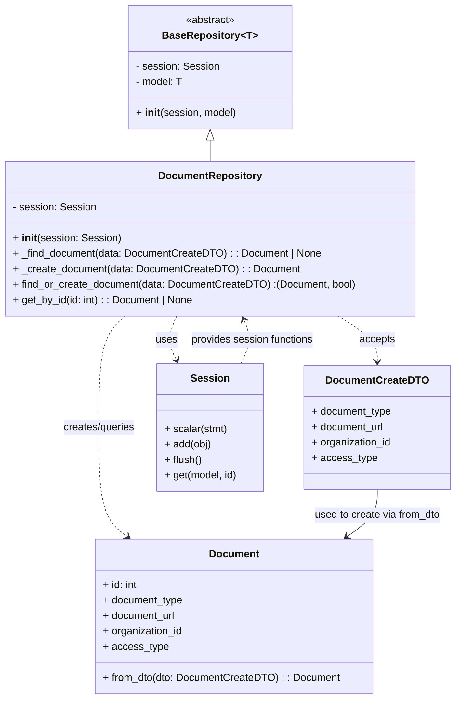

# Diagram: common/document_service/src/api/repository/document_repository.py

> Auto-generated by Obscura crawlers

## Mermaid

### SVG

<svg id="container" width="704.658203125" xmlns="http://www.w3.org/2000/svg" class="classDiagram" height="1084" viewBox="0 0 704.658203125 1084" role="graphics-document document" aria-roledescription="class"><g><defs><marker id="container_class-aggregationStart" class="marker aggregation class" refX="18" refY="7" markerWidth="190" markerHeight="240" orient="auto"><path d="M 18,7 L9,13 L1,7 L9,1 Z"></path></marker></defs><defs><marker id="container_class-aggregationEnd" class="marker aggregation class" refX="1" refY="7" markerWidth="20" markerHeight="28" orient="auto"><path d="M 18,7 L9,13 L1,7 L9,1 Z"></path></marker></defs><defs><marker id="container_class-extensionStart" class="marker extension class" refX="18" refY="7" markerWidth="190" markerHeight="240" orient="auto"><path d="M 1,7 L18,13 V 1 Z"></path></marker></defs><defs><marker id="container_class-extensionEnd" class="marker extension class" refX="1" refY="7" markerWidth="20" markerHeight="28" orient="auto"><path d="M 1,1 V 13 L18,7 Z"></path></marker></defs><defs><marker id="container_class-compositionStart" class="marker composition class" refX="18" refY="7" markerWidth="190" markerHeight="240" orient="auto"><path d="M 18,7 L9,13 L1,7 L9,1 Z"></path></marker></defs><defs><marker id="container_class-compositionEnd" class="marker composition class" refX="1" refY="7" markerWidth="20" markerHeight="28" orient="auto"><path d="M 18,7 L9,13 L1,7 L9,1 Z"></path></marker></defs><defs><marker id="container_class-dependencyStart" class="marker dependency class" refX="6" refY="7" markerWidth="190" markerHeight="240" orient="auto"><path d="M 5,7 L9,13 L1,7 L9,1 Z"></path></marker></defs><defs><marker id="container_class-dependencyEnd" class="marker dependency class" refX="13" refY="7" markerWidth="20" markerHeight="28" orient="auto"><path d="M 18,7 L9,13 L14,7 L9,1 Z"></path></marker></defs><defs><marker id="container_class-lollipopStart" class="marker lollipop class" refX="13" refY="7" markerWidth="190" markerHeight="240" orient="auto"><circle stroke="black" fill="transparent" cx="7" cy="7" r="6"></circle></marker></defs><defs><marker id="container_class-lollipopEnd" class="marker lollipop class" refX="1" refY="7" markerWidth="190" markerHeight="240" orient="auto"><circle stroke="black" fill="transparent" cx="7" cy="7" r="6"></circle></marker></defs><g class="root"><g class="clusters"></g><g class="edgePaths"><path d="M323.203,217.25L323.203,218.542C323.203,219.833,323.203,222.417,323.203,227.875C323.203,233.333,323.203,241.667,323.203,245.833L323.203,250" id="id_BaseRepository_DocumentRepository_1" class="edge-thickness-normal edge-pattern-solid relation" style=";;;" data-edge="true" data-et="edge" data-id="id_BaseRepository_DocumentRepository_1" data-points="W3sieCI6MzIzLjIwMzEyNSwieSI6MjAwfSx7IngiOjMyMy4yMDMxMjUsInkiOjIyNX0seyJ4IjozMjMuMjAzMTI1LCJ5IjoyNTB9XQ==" marker-start="url(#container_class-extensionStart)"></path><path d="M270.275,490L267.555,496.167C264.835,502.333,259.395,514.667,259.361,526.109C259.327,537.551,264.7,548.102,267.386,553.378L270.072,558.653" id="id_DocumentRepository_Session_2" class="edge-thickness-normal edge-pattern-dashed relation" style=";;;" data-edge="true" data-et="edge" data-id="id_DocumentRepository_Session_2" data-points="W3sieCI6MjcwLjI3NDY4MTUyODY2MjQsInkiOjQ5MH0seyJ4IjoyNTMuOTU1MDc4MTI1LCJ5Ijo1Mjd9LHsieCI6MjcyLjc5NDYyMDI4OTUyMjEsInkiOjU2NH1d" marker-end="url(#container_class-dependencyEnd)"></path><path d="M189.454,490L182.581,496.167C175.708,502.333,161.961,514.667,155.088,543.5C148.215,572.333,148.215,617.667,148.215,663C148.215,708.333,148.215,753.667,155.663,781.901C163.111,810.136,178.007,821.272,185.455,826.84L192.903,832.407" id="id_DocumentRepository_Document_3" class="edge-thickness-normal edge-pattern-dashed relation" style=";;;" data-edge="true" data-et="edge" data-id="id_DocumentRepository_Document_3" data-points="W3sieCI6MTg5LjQ1NDEyMDIyMjkyOTkzLCJ5Ijo0OTB9LHsieCI6MTQ4LjIxNDg0Mzc1LCJ5Ijo1Mjd9LHsieCI6MTQ4LjIxNDg0Mzc1LCJ5Ijo2NjN9LHsieCI6MTQ4LjIxNDg0Mzc1LCJ5Ijo3OTl9LHsieCI6MTk3LjcwODk3MTkzNDcxMzQsInkiOjgzNn1d" marker-end="url(#container_class-dependencyEnd)"></path><path d="M522.868,490L533.129,496.167C543.389,502.333,563.911,514.667,574.171,526.5C584.432,538.333,584.432,549.667,584.432,555.333L584.432,561" id="id_DocumentRepository_DocumentCreateDTO_4" class="edge-thickness-normal edge-pattern-dashed relation" style=";;;" data-edge="true" data-et="edge" data-id="id_DocumentRepository_DocumentCreateDTO_4" data-points="W3sieCI6NTIyLjg2ODIzMjQ4NDA3NjQsInkiOjQ5MH0seyJ4Ijo1ODQuNDMxNjQwNjI1LCJ5Ijo1Mjd9LHsieCI6NTg0LjQzMTY0MDYyNSwieSI6NTY3fV0=" marker-end="url(#container_class-dependencyEnd)"></path><path d="M584.432,759L584.432,765.667C584.432,772.333,584.432,785.667,576.368,797.93C568.305,810.193,552.179,821.386,544.115,826.982L536.052,832.579" id="id_DocumentCreateDTO_Document_5" class="edge-thickness-normal edge-pattern-solid relation" style=";;;" data-edge="true" data-et="edge" data-id="id_DocumentCreateDTO_Document_5" data-points="W3sieCI6NTg0LjQzMTY0MDYyNSwieSI6NzU5fSx7IngiOjU4NC40MzE2NDA2MjUsInkiOjc5OX0seyJ4Ijo1MzEuMTIzMDg0MTk1ODU5OSwieSI6ODM2fV0=" marker-end="url(#container_class-dependencyEnd)"></path><path d="M371.699,564L374.72,557.833C377.741,551.667,383.783,539.333,384.577,527.921C385.372,516.508,380.92,506.016,378.694,500.769L376.467,495.523" id="id_Session_DocumentRepository_6" class="edge-thickness-normal edge-pattern-dashed relation" style=";;;" data-edge="true" data-et="edge" data-id="id_Session_DocumentRepository_6" data-points="W3sieCI6MzcxLjY5OTM2MjM2MjEzMjQsInkiOjU2NH0seyJ4IjozODkuODI0MjE4NzUsInkiOjUyN30seyJ4IjozNzQuMTIzNzA2MjEwMTkxMSwieSI6NDkwfV0=" marker-end="url(#container_class-dependencyEnd)"></path></g><g class="edgeLabels"><g class="edgeLabel"><g class="label" data-id="id_BaseRepository_DocumentRepository_1" transform="translate(0, 0)"><foreignObject width="0" height="0">

</foreignObject></g></g><g class="edgeLabel" transform="translate(254.20033, 527.48166)"><g class="label" data-id="id_DocumentRepository_Session_2" transform="translate(-16.4921875, -12)"><foreignObject width="32.984375" height="24">

uses

</foreignObject></g></g><g class="edgeLabel" transform="translate(148.21484375, 663)"><g class="label" data-id="id_DocumentRepository_Document_3" transform="translate(-57.171875, -12)"><foreignObject width="114.34375" height="24">

creates/queries

</foreignObject></g></g><g class="edgeLabel" transform="translate(584.431640625, 527)"><g class="label" data-id="id_DocumentRepository_DocumentCreateDTO_4" transform="translate(-27.421875, -12)"><foreignObject width="54.84375" height="24">

accepts

</foreignObject></g></g><g class="edgeLabel" transform="translate(584.431640625, 799)"><g class="label" data-id="id_DocumentCreateDTO_Document_5" transform="translate(-99.71875, -12)"><foreignObject width="199.4375" height="24">

used to create via from_dto

</foreignObject></g></g><g class="edgeLabel" transform="translate(389.60261, 527.45239)"><g class="label" data-id="id_Session_DocumentRepository_6" transform="translate(-96.75, -12)"><foreignObject width="193.5" height="24">

provides session functions

</foreignObject></g></g></g><g class="nodes"><g class="node default" id="classId-BaseRepository-0" transform="translate(323.203125, 104)"><g class="basic label-container"><path d="M-124.64453125 -96 L124.64453125 -96 L124.64453125 96 L-124.64453125 96" stroke="none" stroke-width="0" fill="#ECECFF" style=""></path><path d="M-124.64453125 -96 C-73.36625959509425 -96, -22.087987940188512 -96, 124.64453125 -96 M-124.64453125 -96 C-51.50733923159102 -96, 21.629852786817963 -96, 124.64453125 -96 M124.64453125 -96 C124.64453125 -25.22392342890504, 124.64453125 45.55215314218992, 124.64453125 96 M124.64453125 -96 C124.64453125 -25.095339821701444, 124.64453125 45.80932035659711, 124.64453125 96 M124.64453125 96 C63.19323569519251 96, 1.7419401403850259 96, -124.64453125 96 M124.64453125 96 C36.39295767638758 96, -51.85861589722484 96, -124.64453125 96 M-124.64453125 96 C-124.64453125 49.42583990859678, -124.64453125 2.8516798171935562, -124.64453125 -96 M-124.64453125 96 C-124.64453125 40.89102812922199, -124.64453125 -14.217943741556013, -124.64453125 -96" stroke="#9370DB" stroke-width="1.3" fill="none" stroke-dasharray="0 0" style=""></path></g><g class="annotation-group text" transform="translate(-38.609375, -72)"><g class="label" style="" transform="translate(0,-12)"><foreignObject width="77.21875" height="24">

«abstract»

</foreignObject></g></g><g class="label-group text" transform="translate(-69.9140625, -48)"><g class="label" style="font-weight: bolder" transform="translate(0,-12)"><foreignObject width="139.828125" height="24">

BaseRepository&lt;T&gt;

</foreignObject></g></g><g class="members-group text" transform="translate(-112.64453125, 0)"><g class="label" style="" transform="translate(0,-12)"><foreignObject width="128.4375" height="24">

- session: Session

</foreignObject></g><g class="label" style="" transform="translate(0,12)"><foreignObject width="73.234375" height="24">

- model: T

</foreignObject></g></g><g class="methods-group text" transform="translate(-112.64453125, 72)"><g class="label" style="" transform="translate(0,-12)"><foreignObject width="155.375" height="24">

+ <strong>init</strong>(session, model)

</foreignObject></g></g><g class="divider" style=""><path d="M-124.64453125 -24 C-70.5977630395621 -24, -16.55099482912418 -24, 124.64453125 -24 M-124.64453125 -24 C-57.93801264133751 -24, 8.768505967324984 -24, 124.64453125 -24" stroke="#9370DB" stroke-width="1.3" fill="none" stroke-dasharray="0 0" style=""></path></g><g class="divider" style=""><path d="M-124.64453125 48 C-32.04112373706897 48, 60.562283775862056 48, 124.64453125 48 M-124.64453125 48 C-66.45921711946161 48, -8.273902988923226 48, 124.64453125 48" stroke="#9370DB" stroke-width="1.3" fill="none" stroke-dasharray="0 0" style=""></path></g></g><g class="node default" id="classId-DocumentRepository-1" transform="translate(323.203125, 370)"><g class="basic label-container"><path d="M-315.203125 -120 L315.203125 -120 L315.203125 120 L-315.203125 120" stroke="none" stroke-width="0" fill="#ECECFF" style=""></path><path d="M-315.203125 -120 C-132.71977035831748 -120, 49.76358428336505 -120, 315.203125 -120 M-315.203125 -120 C-157.45602600120074 -120, 0.2910729975985191 -120, 315.203125 -120 M315.203125 -120 C315.203125 -35.04690354459591, 315.203125 49.90619291080819, 315.203125 120 M315.203125 -120 C315.203125 -59.5056449172207, 315.203125 0.9887101655586008, 315.203125 120 M315.203125 120 C63.98672761148438 120, -187.22966977703123 120, -315.203125 120 M315.203125 120 C117.95493298074831 120, -79.29325903850338 120, -315.203125 120 M-315.203125 120 C-315.203125 26.040320169289075, -315.203125 -67.91935966142185, -315.203125 -120 M-315.203125 120 C-315.203125 66.12203330102558, -315.203125 12.244066602051163, -315.203125 -120" stroke="#9370DB" stroke-width="1.3" fill="none" stroke-dasharray="0 0" style=""></path></g><g class="annotation-group text" transform="translate(0, -96)"></g><g class="label-group text" transform="translate(-76.859375, -96)"><g class="label" style="font-weight: bolder" transform="translate(0,-12)"><foreignObject width="153.71875" height="24">

DocumentRepository

</foreignObject></g></g><g class="members-group text" transform="translate(-303.203125, -48)"><g class="label" style="" transform="translate(0,-12)"><foreignObject width="128.4375" height="24">

- session: Session

</foreignObject></g></g><g class="methods-group text" transform="translate(-303.203125, 0)"><g class="label" style="" transform="translate(0,-12)"><foreignObject width="164.796875" height="24">

+ <strong>init</strong>(session: Session)

</foreignObject></g><g class="label" style="" transform="translate(0,12)"><foreignObject width="476.984375" height="24">

+ _find_document(data: DocumentCreateDTO) : : Document | None

</foreignObject></g><g class="label" style="" transform="translate(0,36)"><foreignObject width="440.09375" height="24">

+ _create_document(data: DocumentCreateDTO) : : Document

</foreignObject></g><g class="label" style="" transform="translate(0,60)"><foreignObject width="529.546875" height="24">

+ find_or_create_document(data: DocumentCreateDTO) :(Document, bool)

</foreignObject></g><g class="label" style="" transform="translate(0,84)"><foreignObject width="282.265625" height="24">

+ get_by_id(id: int) : : Document | None

</foreignObject></g></g><g class="divider" style=""><path d="M-315.203125 -72 C-71.74775247371775 -72, 171.7076200525645 -72, 315.203125 -72 M-315.203125 -72 C-65.36573919526441 -72, 184.47164660947118 -72, 315.203125 -72" stroke="#9370DB" stroke-width="1.3" fill="none" stroke-dasharray="0 0" style=""></path></g><g class="divider" style=""><path d="M-315.203125 -24 C-175.85594202868242 -24, -36.50875905736484 -24, 315.203125 -24 M-315.203125 -24 C-126.02634367142676 -24, 63.15043765714648 -24, 315.203125 -24" stroke="#9370DB" stroke-width="1.3" fill="none" stroke-dasharray="0 0" style=""></path></g></g><g class="node default" id="classId-Document-2" transform="translate(358.23046875, 956)"><g class="basic label-container"><path d="M-212.8515625 -120 L212.8515625 -120 L212.8515625 120 L-212.8515625 120" stroke="none" stroke-width="0" fill="#ECECFF" style=""></path><path d="M-212.8515625 -120 C-88.3717825658847 -120, 36.1079973682306 -120, 212.8515625 -120 M-212.8515625 -120 C-120.87320138446164 -120, -28.894840268923275 -120, 212.8515625 -120 M212.8515625 -120 C212.8515625 -50.619962818682694, 212.8515625 18.76007436263461, 212.8515625 120 M212.8515625 -120 C212.8515625 -67.06313819763851, 212.8515625 -14.126276395277017, 212.8515625 120 M212.8515625 120 C95.47920710602547 120, -21.89314828794906 120, -212.8515625 120 M212.8515625 120 C106.60274624289083 120, 0.35392998578166157 120, -212.8515625 120 M-212.8515625 120 C-212.8515625 33.73704321169734, -212.8515625 -52.52591357660532, -212.8515625 -120 M-212.8515625 120 C-212.8515625 45.897616531765905, -212.8515625 -28.20476693646819, -212.8515625 -120" stroke="#9370DB" stroke-width="1.3" fill="none" stroke-dasharray="0 0" style=""></path></g><g class="annotation-group text" transform="translate(0, -96)"></g><g class="label-group text" transform="translate(-37.09375, -96)"><g class="label" style="font-weight: bolder" transform="translate(0,-12)"><foreignObject width="74.1875" height="24">

Document

</foreignObject></g></g><g class="members-group text" transform="translate(-200.8515625, -48)"><g class="label" style="" transform="translate(0,-12)"><foreignObject width="54.0625" height="24">

+ id: int

</foreignObject></g><g class="label" style="" transform="translate(0,12)"><foreignObject width="125.3125" height="24">

+ document_type

</foreignObject></g><g class="label" style="" transform="translate(0,36)"><foreignObject width="113.703125" height="24">

+ document_url

</foreignObject></g><g class="label" style="" transform="translate(0,60)"><foreignObject width="124.984375" height="24">

+ organization_id

</foreignObject></g><g class="label" style="" transform="translate(0,84)"><foreignObject width="98.5625" height="24">

+ access_type

</foreignObject></g></g><g class="methods-group text" transform="translate(-200.8515625, 96)"><g class="label" style="" transform="translate(0,-12)"><foreignObject width="364.609375" height="24">

+ from_dto(dto: DocumentCreateDTO) : : Document

</foreignObject></g></g><g class="divider" style=""><path d="M-212.8515625 -72 C-83.48412741770858 -72, 45.883307664582844 -72, 212.8515625 -72 M-212.8515625 -72 C-70.75964432727793 -72, 71.33227384544415 -72, 212.8515625 -72" stroke="#9370DB" stroke-width="1.3" fill="none" stroke-dasharray="0 0" style=""></path></g><g class="divider" style=""><path d="M-212.8515625 72 C-127.58963240499625 72, -42.3277023099925 72, 212.8515625 72 M-212.8515625 72 C-94.81947143876086 72, 23.212619622478286 72, 212.8515625 72" stroke="#9370DB" stroke-width="1.3" fill="none" stroke-dasharray="0 0" style=""></path></g></g><g class="node default" id="classId-DocumentCreateDTO-3" transform="translate(584.431640625, 663)"><g class="basic label-container"><path d="M-112.2265625 -96 L112.2265625 -96 L112.2265625 96 L-112.2265625 96" stroke="none" stroke-width="0" fill="#ECECFF" style=""></path><path d="M-112.2265625 -96 C-49.82321338540057 -96, 12.580135729198858 -96, 112.2265625 -96 M-112.2265625 -96 C-57.643119698651546 -96, -3.059676897303092 -96, 112.2265625 -96 M112.2265625 -96 C112.2265625 -37.27103485602706, 112.2265625 21.457930287945885, 112.2265625 96 M112.2265625 -96 C112.2265625 -35.759227872960814, 112.2265625 24.481544254078372, 112.2265625 96 M112.2265625 96 C30.51872350484055 96, -51.1891154903189 96, -112.2265625 96 M112.2265625 96 C54.274716868560965 96, -3.67712876287807 96, -112.2265625 96 M-112.2265625 96 C-112.2265625 26.315970691533607, -112.2265625 -43.368058616932785, -112.2265625 -96 M-112.2265625 96 C-112.2265625 55.514283244684364, -112.2265625 15.028566489368728, -112.2265625 -96" stroke="#9370DB" stroke-width="1.3" fill="none" stroke-dasharray="0 0" style=""></path></g><g class="annotation-group text" transform="translate(0, -72)"></g><g class="label-group text" transform="translate(-75.140625, -72)"><g class="label" style="font-weight: bolder" transform="translate(0,-12)"><foreignObject width="150.28125" height="24">

DocumentCreateDTO

</foreignObject></g></g><g class="members-group text" transform="translate(-100.2265625, -24)"><g class="label" style="" transform="translate(0,-12)"><foreignObject width="125.3125" height="24">

+ document_type

</foreignObject></g><g class="label" style="" transform="translate(0,12)"><foreignObject width="113.703125" height="24">

+ document_url

</foreignObject></g><g class="label" style="" transform="translate(0,36)"><foreignObject width="124.984375" height="24">

+ organization_id

</foreignObject></g><g class="label" style="" transform="translate(0,60)"><foreignObject width="98.5625" height="24">

+ access_type

</foreignObject></g></g><g class="methods-group text" transform="translate(-100.2265625, 96)"></g><g class="divider" style=""><path d="M-112.2265625 -48 C-41.29441691038565 -48, 29.6377286792287 -48, 112.2265625 -48 M-112.2265625 -48 C-64.98028526655446 -48, -17.734008033108907 -48, 112.2265625 -48" stroke="#9370DB" stroke-width="1.3" fill="none" stroke-dasharray="0 0" style=""></path></g><g class="divider" style=""><path d="M-112.2265625 72 C-45.261355921396955 72, 21.70385065720609 72, 112.2265625 72 M-112.2265625 72 C-49.614737227050256 72, 12.997088045899488 72, 112.2265625 72" stroke="#9370DB" stroke-width="1.3" fill="none" stroke-dasharray="0 0" style=""></path></g></g><g class="node default" id="classId-Session-4" transform="translate(323.203125, 663)"><g class="basic label-container"><path d="M-82.81640625 -99 L82.81640625 -99 L82.81640625 99 L-82.81640625 99" stroke="none" stroke-width="0" fill="#ECECFF" style=""></path><path d="M-82.81640625 -99 C-29.987945575305936 -99, 22.840515099388128 -99, 82.81640625 -99 M-82.81640625 -99 C-28.677050983129533 -99, 25.462304283740934 -99, 82.81640625 -99 M82.81640625 -99 C82.81640625 -22.858559695268426, 82.81640625 53.28288060946315, 82.81640625 99 M82.81640625 -99 C82.81640625 -23.851734741356438, 82.81640625 51.296530517287124, 82.81640625 99 M82.81640625 99 C41.39404683770414 99, -0.028312574591723205 99, -82.81640625 99 M82.81640625 99 C44.227026833753044 99, 5.637647417506088 99, -82.81640625 99 M-82.81640625 99 C-82.81640625 25.28041053882447, -82.81640625 -48.43917892235106, -82.81640625 -99 M-82.81640625 99 C-82.81640625 42.76870457570647, -82.81640625 -13.462590848587055, -82.81640625 -99" stroke="#9370DB" stroke-width="1.3" fill="none" stroke-dasharray="0 0" style=""></path></g><g class="annotation-group text" transform="translate(0, -75)"></g><g class="label-group text" transform="translate(-28.2109375, -75)"><g class="label" style="font-weight: bolder" transform="translate(0,-12)"><foreignObject width="56.421875" height="24">

Session

</foreignObject></g></g><g class="members-group text" transform="translate(-70.81640625, -27)"></g><g class="methods-group text" transform="translate(-70.81640625, 3)"><g class="label" style="" transform="translate(0,-12)"><foreignObject width="98.328125" height="24">

+ scalar(stmt)

</foreignObject></g><g class="label" style="" transform="translate(0,12)"><foreignObject width="73.765625" height="24">

+ add(obj)

</foreignObject></g><g class="label" style="" transform="translate(0,36)"><foreignObject width="58.234375" height="24">

+ flush()

</foreignObject></g><g class="label" style="" transform="translate(0,60)"><foreignObject width="113.421875" height="24">

+ get(model, id)

</foreignObject></g></g><g class="divider" style=""><path d="M-82.81640625 -51 C-17.768424598250732 -51, 47.279557053498536 -51, 82.81640625 -51 M-82.81640625 -51 C-38.43224578131038 -51, 5.951914687379244 -51, 82.81640625 -51" stroke="#9370DB" stroke-width="1.3" fill="none" stroke-dasharray="0 0" style=""></path></g><g class="divider" style=""><path d="M-82.81640625 -27 C-46.4557149918402 -27, -10.095023733680407 -27, 82.81640625 -27 M-82.81640625 -27 C-18.217830492386 -27, 46.380745265228 -27, 82.81640625 -27" stroke="#9370DB" stroke-width="1.3" fill="none" stroke-dasharray="0 0" style=""></path></g></g></g></g></g></svg>
