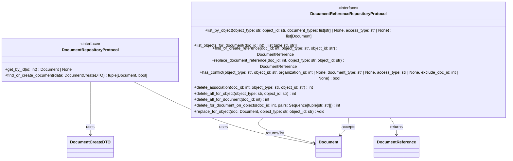

# Diagram: common/document_service/src/api/repository/protocols.py

> Auto-generated by Obscura crawlers

## Mermaid

```mermaid
classDiagram
class Document {
}
class DocumentCreateDTO {
}
class DocumentReference {
}
class DocumentRepositoryProtocol <<interface>> {
  +get_by_id(id: int) Document | None
  +find_or_create_document(data: DocumentCreateDTO) tuple[Document, bool]
}
class DocumentReferenceRepositoryProtocol <<interface>> {
  +list_by_object(object_type: str, object_id: str, document_types: list[str] | None, access_type: str | None) list[Document]
  +list_objects_for_document(doc_id: int) list[tuple[str, str]]
  +find_or_create_reference(doc_id: int, object_type: str, object_id: str) DocumentReference
  +replace_document_reference(doc_id: int, object_type: str, object_id: str) DocumentReference
  +has_conflict(object_type: str, object_id: str, organization_id: int | None, document_type: str | None, access_type: str | None, exclude_doc_id: int | None) bool
  +delete_association(doc_id: int, object_type: str, object_id: str) int
  +delete_all_for_object(object_type: str, object_id: str) int
  +delete_all_for_document(doc_id: int) int
  +delete_for_document_on_objects(doc_id: int, pairs: Sequence[tuple[str, str]]) int
  +replace_for_object(doc: Document, object_type: str, object_id: str) void
}
DocumentRepositoryProtocol --> Document : uses
DocumentRepositoryProtocol --> DocumentCreateDTO : uses
DocumentReferenceRepositoryProtocol --> Document : returns/list
DocumentReferenceRepositoryProtocol --> DocumentReference : returns
DocumentReferenceRepositoryProtocol --> Document : accepts
```

> SVG rendering failed for this diagram.
