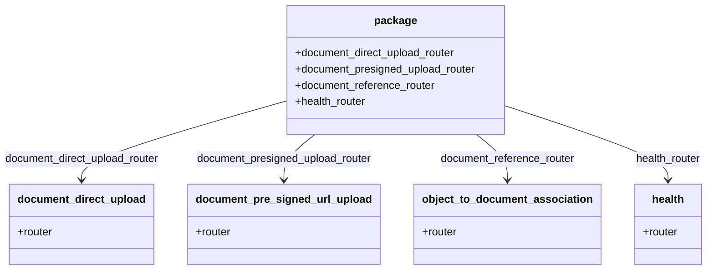

# Diagram: common/document_service/src/api/routers/__init__.py

> Auto-generated by Obscura crawlers

## Mermaid

### SVG

<svg id="container" width="1027.046875" xmlns="http://www.w3.org/2000/svg" class="classDiagram" height="402" viewBox="0 0 1027.046875 402" role="graphics-document document" aria-roledescription="class"><g><defs><marker id="container_class-aggregationStart" class="marker aggregation class" refX="18" refY="7" markerWidth="190" markerHeight="240" orient="auto"><path d="M 18,7 L9,13 L1,7 L9,1 Z"></path></marker></defs><defs><marker id="container_class-aggregationEnd" class="marker aggregation class" refX="1" refY="7" markerWidth="20" markerHeight="28" orient="auto"><path d="M 18,7 L9,13 L1,7 L9,1 Z"></path></marker></defs><defs><marker id="container_class-extensionStart" class="marker extension class" refX="18" refY="7" markerWidth="190" markerHeight="240" orient="auto"><path d="M 1,7 L18,13 V 1 Z"></path></marker></defs><defs><marker id="container_class-extensionEnd" class="marker extension class" refX="1" refY="7" markerWidth="20" markerHeight="28" orient="auto"><path d="M 1,1 V 13 L18,7 Z"></path></marker></defs><defs><marker id="container_class-compositionStart" class="marker composition class" refX="18" refY="7" markerWidth="190" markerHeight="240" orient="auto"><path d="M 18,7 L9,13 L1,7 L9,1 Z"></path></marker></defs><defs><marker id="container_class-compositionEnd" class="marker composition class" refX="1" refY="7" markerWidth="20" markerHeight="28" orient="auto"><path d="M 18,7 L9,13 L1,7 L9,1 Z"></path></marker></defs><defs><marker id="container_class-dependencyStart" class="marker dependency class" refX="6" refY="7" markerWidth="190" markerHeight="240" orient="auto"><path d="M 5,7 L9,13 L1,7 L9,1 Z"></path></marker></defs><defs><marker id="container_class-dependencyEnd" class="marker dependency class" refX="13" refY="7" markerWidth="20" markerHeight="28" orient="auto"><path d="M 18,7 L9,13 L14,7 L9,1 Z"></path></marker></defs><defs><marker id="container_class-lollipopStart" class="marker lollipop class" refX="13" refY="7" markerWidth="190" markerHeight="240" orient="auto"><circle stroke="black" fill="transparent" cx="7" cy="7" r="6"></circle></marker></defs><defs><marker id="container_class-lollipopEnd" class="marker lollipop class" refX="1" refY="7" markerWidth="190" markerHeight="240" orient="auto"><circle stroke="black" fill="transparent" cx="7" cy="7" r="6"></circle></marker></defs><g class="root"><g class="clusters"></g><g class="edgePaths"><path d="M412.223,152.371L364.452,166.476C316.682,180.581,221.142,208.79,173.372,228.062C125.602,247.333,125.602,257.667,125.602,262.833L125.602,268" id="id_package_document_direct_upload_1" class="edge-thickness-normal edge-pattern-solid relation" style=";;;" data-edge="true" data-et="edge" data-id="id_package_document_direct_upload_1" data-points="W3sieCI6NDEyLjIyMjY1NjI1LCJ5IjoxNTIuMzcxMjkwNTYzMTU3OTd9LHsieCI6MTI1LjYwMTU2MjUsInkiOjIzN30seyJ4IjoxMjUuNjAxNTYyNSwieSI6Mjc0fV0=" marker-end="url(#container_class-dependencyEnd)"></path><path d="M460.592,200L453.176,206.167C445.759,212.333,430.926,224.667,423.51,236C416.094,247.333,416.094,257.667,416.094,262.833L416.094,268" id="id_package_document_pre_signed_url_upload_2" class="edge-thickness-normal edge-pattern-solid relation" style=";;;" data-edge="true" data-et="edge" data-id="id_package_document_pre_signed_url_upload_2" data-points="W3sieCI6NDYwLjU5MTk4Nzc4MTk1NDksInkiOjIwMH0seyJ4Ijo0MTYuMDkzNzUsInkiOjIzN30seyJ4Ijo0MTYuMDkzNzUsInkiOjI3NH1d" marker-end="url(#container_class-dependencyEnd)"></path><path d="M691.502,200L698.918,206.167C706.335,212.333,721.167,224.667,728.584,236C736,247.333,736,257.667,736,262.833L736,268" id="id_package_object_to_document_association_3" class="edge-thickness-normal edge-pattern-solid relation" style=";;;" data-edge="true" data-et="edge" data-id="id_package_object_to_document_association_3" data-points="W3sieCI6NjkxLjUwMTc2MjIxODA0NTEsInkiOjIwMH0seyJ4Ijo3MzYsInkiOjIzN30seyJ4Ijo3MzYsInkiOjI3NH1d" marker-end="url(#container_class-dependencyEnd)"></path><path d="M739.871,159.451L778.057,172.376C816.242,185.3,892.613,211.15,930.799,229.242C968.984,247.333,968.984,257.667,968.984,262.833L968.984,268" id="id_package_health_4" class="edge-thickness-normal edge-pattern-solid relation" style=";;;" data-edge="true" data-et="edge" data-id="id_package_health_4" data-points="W3sieCI6NzM5Ljg3MTA5Mzc1LCJ5IjoxNTkuNDUwNjAyNDMzNTkzMTN9LHsieCI6OTY4Ljk4NDM3NSwieSI6MjM3fSx7IngiOjk2OC45ODQzNzUsInkiOjI3NH1d" marker-end="url(#container_class-dependencyEnd)"></path></g><g class="edgeLabels"><g class="edgeLabel" transform="translate(125.6015625, 237)"><g class="label" data-id="id_package_document_direct_upload_1" transform="translate(-117.6015625, -12)"><foreignObject width="235.203125" height="24">

document_direct_upload_router

</foreignObject></g></g><g class="edgeLabel" transform="translate(416.09375, 237)"><g class="label" data-id="id_package_document_pre_signed_url_upload_2" transform="translate(-132.75, -12)"><foreignObject width="265.5" height="24">

document_presigned_upload_router

</foreignObject></g></g><g class="edgeLabel" transform="translate(736, 237)"><g class="label" data-id="id_package_object_to_document_association_3" transform="translate(-101.2890625, -12)"><foreignObject width="202.578125" height="24">

document_reference_router

</foreignObject></g></g><g class="edgeLabel" transform="translate(968.984375, 237)"><g class="label" data-id="id_package_health_4" transform="translate(-49.71875, -12)"><foreignObject width="99.4375" height="24">

health_router

</foreignObject></g></g></g><g class="nodes"><g class="node default" id="classId-package-0" transform="translate(576.046875, 104)"><g class="basic label-container"><path d="M-163.82421875 -96 L163.82421875 -96 L163.82421875 96 L-163.82421875 96" stroke="none" stroke-width="0" fill="#ECECFF" style=""></path><path d="M-163.82421875 -96 C-65.3238286384727 -96, 33.17656147305459 -96, 163.82421875 -96 M-163.82421875 -96 C-79.64815828884528 -96, 4.527902172309439 -96, 163.82421875 -96 M163.82421875 -96 C163.82421875 -32.16951287453405, 163.82421875 31.6609742509319, 163.82421875 96 M163.82421875 -96 C163.82421875 -23.810286385019594, 163.82421875 48.37942722996081, 163.82421875 96 M163.82421875 96 C75.26827169302041 96, -13.287675363959181 96, -163.82421875 96 M163.82421875 96 C56.811682854766886 96, -50.20085304046623 96, -163.82421875 96 M-163.82421875 96 C-163.82421875 28.926628745816146, -163.82421875 -38.14674250836771, -163.82421875 -96 M-163.82421875 96 C-163.82421875 51.33393883632717, -163.82421875 6.667877672654342, -163.82421875 -96" stroke="#9370DB" stroke-width="1.3" fill="none" stroke-dasharray="0 0" style=""></path></g><g class="annotation-group text" transform="translate(0, -72)"></g><g class="label-group text" transform="translate(-30.1640625, -72)"><g class="label" style="font-weight: bolder" transform="translate(0,-12)"><foreignObject width="60.328125" height="24">

package

</foreignObject></g></g><g class="members-group text" transform="translate(-151.82421875, -24)"><g class="label" style="" transform="translate(0,-12)"><foreignObject width="243.1875" height="24">

+document_direct_upload_router

</foreignObject></g><g class="label" style="" transform="translate(0,12)"><foreignObject width="273.484375" height="24">

+document_presigned_upload_router

</foreignObject></g><g class="label" style="" transform="translate(0,36)"><foreignObject width="210.5625" height="24">

+document_reference_router

</foreignObject></g><g class="label" style="" transform="translate(0,60)"><foreignObject width="107.421875" height="24">

+health_router

</foreignObject></g></g><g class="methods-group text" transform="translate(-151.82421875, 96)"></g><g class="divider" style=""><path d="M-163.82421875 -48 C-36.753536662890156 -48, 90.31714542421969 -48, 163.82421875 -48 M-163.82421875 -48 C-68.53279107728079 -48, 26.758636595438418 -48, 163.82421875 -48" stroke="#9370DB" stroke-width="1.3" fill="none" stroke-dasharray="0 0" style=""></path></g><g class="divider" style=""><path d="M-163.82421875 72 C-77.53466425481876 72, 8.75489024036247 72, 163.82421875 72 M-163.82421875 72 C-65.33146045987455 72, 33.1612978302509 72, 163.82421875 72" stroke="#9370DB" stroke-width="1.3" fill="none" stroke-dasharray="0 0" style=""></path></g></g><g class="node default" id="classId-document_direct_upload-1" transform="translate(125.6015625, 334)"><g class="basic label-container"><path d="M-103.5078125 -60 L103.5078125 -60 L103.5078125 60 L-103.5078125 60" stroke="none" stroke-width="0" fill="#ECECFF" style=""></path><path d="M-103.5078125 -60 C-51.78007070743585 -60, -0.05232891487169411 -60, 103.5078125 -60 M-103.5078125 -60 C-30.573092827849067 -60, 42.36162684430187 -60, 103.5078125 -60 M103.5078125 -60 C103.5078125 -30.091158942338183, 103.5078125 -0.18231788467636534, 103.5078125 60 M103.5078125 -60 C103.5078125 -30.372431655001527, 103.5078125 -0.7448633100030548, 103.5078125 60 M103.5078125 60 C56.14911100327588 60, 8.790409506551754 60, -103.5078125 60 M103.5078125 60 C35.01141100635171 60, -33.484990487296585 60, -103.5078125 60 M-103.5078125 60 C-103.5078125 19.65925915859045, -103.5078125 -20.681481682819097, -103.5078125 -60 M-103.5078125 60 C-103.5078125 22.6066837322984, -103.5078125 -14.7866325354032, -103.5078125 -60" stroke="#9370DB" stroke-width="1.3" fill="none" stroke-dasharray="0 0" style=""></path></g><g class="annotation-group text" transform="translate(0, -36)"></g><g class="label-group text" transform="translate(-91.5078125, -36)"><g class="label" style="font-weight: bolder" transform="translate(0,-12)"><foreignObject width="183.015625" height="24">

document_direct_upload

</foreignObject></g></g><g class="members-group text" transform="translate(-91.5078125, 12)"><g class="label" style="" transform="translate(0,-12)"><foreignObject width="52.78125" height="24">

+router

</foreignObject></g></g><g class="methods-group text" transform="translate(-91.5078125, 60)"></g><g class="divider" style=""><path d="M-103.5078125 -12 C-59.88516857968486 -12, -16.262524659369717 -12, 103.5078125 -12 M-103.5078125 -12 C-54.98167014835754 -12, -6.455527796715074 -12, 103.5078125 -12" stroke="#9370DB" stroke-width="1.3" fill="none" stroke-dasharray="0 0" style=""></path></g><g class="divider" style=""><path d="M-103.5078125 36 C-31.637896557674253 36, 40.232019384651494 36, 103.5078125 36 M-103.5078125 36 C-51.7191520430352 36, 0.06950841392959717 36, 103.5078125 36" stroke="#9370DB" stroke-width="1.3" fill="none" stroke-dasharray="0 0" style=""></path></g></g><g class="node default" id="classId-document_pre_signed_url_upload-2" transform="translate(416.09375, 334)"><g class="basic label-container"><path d="M-136.984375 -60 L136.984375 -60 L136.984375 60 L-136.984375 60" stroke="none" stroke-width="0" fill="#ECECFF" style=""></path><path d="M-136.984375 -60 C-53.297080003862405 -60, 30.39021499227519 -60, 136.984375 -60 M-136.984375 -60 C-47.653133548285865 -60, 41.67810790342827 -60, 136.984375 -60 M136.984375 -60 C136.984375 -16.1311105296854, 136.984375 27.737778940629198, 136.984375 60 M136.984375 -60 C136.984375 -30.554089344858983, 136.984375 -1.1081786897179668, 136.984375 60 M136.984375 60 C60.31033765488516 60, -16.36369969022968 60, -136.984375 60 M136.984375 60 C58.839177097868685 60, -19.30602080426263 60, -136.984375 60 M-136.984375 60 C-136.984375 18.32710784929143, -136.984375 -23.34578430141714, -136.984375 -60 M-136.984375 60 C-136.984375 18.205443452113606, -136.984375 -23.589113095772788, -136.984375 -60" stroke="#9370DB" stroke-width="1.3" fill="none" stroke-dasharray="0 0" style=""></path></g><g class="annotation-group text" transform="translate(0, -36)"></g><g class="label-group text" transform="translate(-124.984375, -36)"><g class="label" style="font-weight: bolder" transform="translate(0,-12)"><foreignObject width="249.96875" height="24">

document_pre_signed_url_upload

</foreignObject></g></g><g class="members-group text" transform="translate(-124.984375, 12)"><g class="label" style="" transform="translate(0,-12)"><foreignObject width="52.78125" height="24">

+router

</foreignObject></g></g><g class="methods-group text" transform="translate(-124.984375, 60)"></g><g class="divider" style=""><path d="M-136.984375 -12 C-39.58156368549612 -12, 57.82124762900776 -12, 136.984375 -12 M-136.984375 -12 C-45.41028654248949 -12, 46.163801915021025 -12, 136.984375 -12" stroke="#9370DB" stroke-width="1.3" fill="none" stroke-dasharray="0 0" style=""></path></g><g class="divider" style=""><path d="M-136.984375 36 C-42.5775915023671 36, 51.8291919952658 36, 136.984375 36 M-136.984375 36 C-44.77421815918859 36, 47.435938681622815 36, 136.984375 36" stroke="#9370DB" stroke-width="1.3" fill="none" stroke-dasharray="0 0" style=""></path></g></g><g class="node default" id="classId-object_to_document_association-3" transform="translate(736, 334)"><g class="basic label-container"><path d="M-132.921875 -60 L132.921875 -60 L132.921875 60 L-132.921875 60" stroke="none" stroke-width="0" fill="#ECECFF" style=""></path><path d="M-132.921875 -60 C-30.870513106609394 -60, 71.18084878678121 -60, 132.921875 -60 M-132.921875 -60 C-70.95178646494148 -60, -8.98169792988297 -60, 132.921875 -60 M132.921875 -60 C132.921875 -23.577446121500856, 132.921875 12.845107756998289, 132.921875 60 M132.921875 -60 C132.921875 -27.992968420422983, 132.921875 4.014063159154034, 132.921875 60 M132.921875 60 C47.22429725315098 60, -38.47328049369804 60, -132.921875 60 M132.921875 60 C56.15141596308591 60, -20.61904307382818 60, -132.921875 60 M-132.921875 60 C-132.921875 31.2548203151915, -132.921875 2.5096406303829966, -132.921875 -60 M-132.921875 60 C-132.921875 31.19214358796719, -132.921875 2.384287175934382, -132.921875 -60" stroke="#9370DB" stroke-width="1.3" fill="none" stroke-dasharray="0 0" style=""></path></g><g class="annotation-group text" transform="translate(0, -36)"></g><g class="label-group text" transform="translate(-120.921875, -36)"><g class="label" style="font-weight: bolder" transform="translate(0,-12)"><foreignObject width="241.84375" height="24">

object_to_document_association

</foreignObject></g></g><g class="members-group text" transform="translate(-120.921875, 12)"><g class="label" style="" transform="translate(0,-12)"><foreignObject width="52.78125" height="24">

+router

</foreignObject></g></g><g class="methods-group text" transform="translate(-120.921875, 60)"></g><g class="divider" style=""><path d="M-132.921875 -12 C-40.295720418360986 -12, 52.33043416327803 -12, 132.921875 -12 M-132.921875 -12 C-33.92274170505358 -12, 65.07639158989284 -12, 132.921875 -12" stroke="#9370DB" stroke-width="1.3" fill="none" stroke-dasharray="0 0" style=""></path></g><g class="divider" style=""><path d="M-132.921875 36 C-28.687968770556978 36, 75.54593745888604 36, 132.921875 36 M-132.921875 36 C-68.61720099364233 36, -4.312526987284656 36, 132.921875 36" stroke="#9370DB" stroke-width="1.3" fill="none" stroke-dasharray="0 0" style=""></path></g></g><g class="node default" id="classId-health-4" transform="translate(968.984375, 334)"><g class="basic label-container"><path d="M-50.0625 -60 L50.0625 -60 L50.0625 60 L-50.0625 60" stroke="none" stroke-width="0" fill="#ECECFF" style=""></path><path d="M-50.0625 -60 C-10.458361580489303 -60, 29.145776839021394 -60, 50.0625 -60 M-50.0625 -60 C-20.2110455407286 -60, 9.640408918542803 -60, 50.0625 -60 M50.0625 -60 C50.0625 -13.43056263946707, 50.0625 33.13887472106586, 50.0625 60 M50.0625 -60 C50.0625 -26.804523106687967, 50.0625 6.390953786624067, 50.0625 60 M50.0625 60 C23.902318338794142 60, -2.2578633224117155 60, -50.0625 60 M50.0625 60 C14.958733190574591 60, -20.145033618850817 60, -50.0625 60 M-50.0625 60 C-50.0625 30.399934708826912, -50.0625 0.7998694176538237, -50.0625 -60 M-50.0625 60 C-50.0625 35.3805533450376, -50.0625 10.761106690075195, -50.0625 -60" stroke="#9370DB" stroke-width="1.3" fill="none" stroke-dasharray="0 0" style=""></path></g><g class="annotation-group text" transform="translate(0, -36)"></g><g class="label-group text" transform="translate(-23.34375, -36)"><g class="label" style="font-weight: bolder" transform="translate(0,-12)"><foreignObject width="46.6875" height="24">

health

</foreignObject></g></g><g class="members-group text" transform="translate(-38.0625, 12)"><g class="label" style="" transform="translate(0,-12)"><foreignObject width="52.78125" height="24">

+router

</foreignObject></g></g><g class="methods-group text" transform="translate(-38.0625, 60)"></g><g class="divider" style=""><path d="M-50.0625 -12 C-22.35410107494988 -12, 5.354297850100238 -12, 50.0625 -12 M-50.0625 -12 C-16.955119040370747 -12, 16.152261919258507 -12, 50.0625 -12" stroke="#9370DB" stroke-width="1.3" fill="none" stroke-dasharray="0 0" style=""></path></g><g class="divider" style=""><path d="M-50.0625 36 C-10.419309044460114 36, 29.223881911079772 36, 50.0625 36 M-50.0625 36 C-14.7252271031928 36, 20.6120457936144 36, 50.0625 36" stroke="#9370DB" stroke-width="1.3" fill="none" stroke-dasharray="0 0" style=""></path></g></g></g></g></g></svg>
