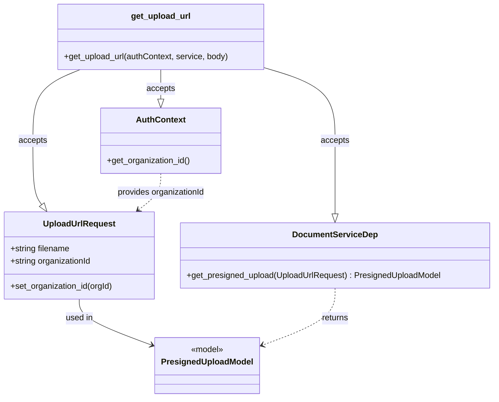

# Diagram: common/document_service/src/api/routers/document_pre_signed_url_upload.py


> Auto-generated by Obscura crawlers

## Diagram 1

```mermaid
flowchart TD
    Client[Client POST /document/upload-url] -->|body: UploadUrlRequest| Endpoint[get_upload_url()]
    Endpoint --> CheckFilename{body.filename present?}
    CheckFilename -- No --> HTTP400Filename[HTTPException 400\n"Missing filename"]
    CheckFilename -- Yes --> CheckOrg{body.organizationId present?}
    CheckOrg -- Yes --> CallService[service.get_presigned_upload(body)]
    CheckOrg -- No --> AuthID[authContext.get_organization_id()]
    AuthID -- None --> HTTP400Org[HTTPException 400\n"Missing organizationId"]
    AuthID -- Found --> SetOrg[body.set_organization_id(organization_id)]
    SetOrg --> CallService
    CallService --> Return[return PresignedUploadModel]
    HTTP400Filename --> End1((end))
    HTTP400Org --> End2((end))
    Return --> End3((end))
```

> SVG rendering failed for this diagram.

## Diagram 2



### SVG

<svg id="container" width="951.2109375" xmlns="http://www.w3.org/2000/svg" class="classDiagram" height="766" viewBox="0 0 951.2109375 766" role="graphics-document document" aria-roledescription="class"><style>#container{font-family:"trebuchet ms",verdana,arial,sans-serif;font-size:16px;fill:#333;}@keyframes edge-animation-frame{from{stroke-dashoffset:0;}}@keyframes dash{to{stroke-dashoffset:0;}}#container .edge-animation-slow{stroke-dasharray:9,5!important;stroke-dashoffset:900;animation:dash 50s linear infinite;stroke-linecap:round;}#container .edge-animation-fast{stroke-dasharray:9,5!important;stroke-dashoffset:900;animation:dash 20s linear infinite;stroke-linecap:round;}#container .error-icon{fill:#552222;}#container .error-text{fill:#552222;stroke:#552222;}#container .edge-thickness-normal{stroke-width:1px;}#container .edge-thickness-thick{stroke-width:3.5px;}#container .edge-pattern-solid{stroke-dasharray:0;}#container .edge-thickness-invisible{stroke-width:0;fill:none;}#container .edge-pattern-dashed{stroke-dasharray:3;}#container .edge-pattern-dotted{stroke-dasharray:2;}#container .marker{fill:#333333;stroke:#333333;}#container .marker.cross{stroke:#333333;}#container svg{font-family:"trebuchet ms",verdana,arial,sans-serif;font-size:16px;}#container p{margin:0;}#container g.classGroup text{fill:#9370DB;stroke:none;font-family:"trebuchet ms",verdana,arial,sans-serif;font-size:10px;}#container g.classGroup text .title{font-weight:bolder;}#container .nodeLabel,#container .edgeLabel{color:#131300;}#container .edgeLabel .label rect{fill:#ECECFF;}#container .label text{fill:#131300;}#container .labelBkg{background:#ECECFF;}#container .edgeLabel .label span{background:#ECECFF;}#container .classTitle{font-weight:bolder;}#container .node rect,#container .node circle,#container .node ellipse,#container .node polygon,#container .node path{fill:#ECECFF;stroke:#9370DB;stroke-width:1px;}#container .divider{stroke:#9370DB;stroke-width:1;}#container g.clickable{cursor:pointer;}#container g.classGroup rect{fill:#ECECFF;stroke:#9370DB;}#container g.classGroup line{stroke:#9370DB;stroke-width:1;}#container .classLabel .box{stroke:none;stroke-width:0;fill:#ECECFF;opacity:0.5;}#container .classLabel .label{fill:#9370DB;font-size:10px;}#container .relation{stroke:#333333;stroke-width:1;fill:none;}#container .dashed-line{stroke-dasharray:3;}#container .dotted-line{stroke-dasharray:1 2;}#container #compositionStart,#container .composition{fill:#333333!important;stroke:#333333!important;stroke-width:1;}#container #compositionEnd,#container .composition{fill:#333333!important;stroke:#333333!important;stroke-width:1;}#container #dependencyStart,#container .dependency{fill:#333333!important;stroke:#333333!important;stroke-width:1;}#container #dependencyStart,#container .dependency{fill:#333333!important;stroke:#333333!important;stroke-width:1;}#container #extensionStart,#container .extension{fill:transparent!important;stroke:#333333!important;stroke-width:1;}#container #extensionEnd,#container .extension{fill:transparent!important;stroke:#333333!important;stroke-width:1;}#container #aggregationStart,#container .aggregation{fill:transparent!important;stroke:#333333!important;stroke-width:1;}#container #aggregationEnd,#container .aggregation{fill:transparent!important;stroke:#333333!important;stroke-width:1;}#container #lollipopStart,#container .lollipop{fill:#ECECFF!important;stroke:#333333!important;stroke-width:1;}#container #lollipopEnd,#container .lollipop{fill:#ECECFF!important;stroke:#333333!important;stroke-width:1;}#container .edgeTerminals{font-size:11px;line-height:initial;}#container .classTitleText{text-anchor:middle;font-size:18px;fill:#333;}#container .label-icon{display:inline-block;height:1em;overflow:visible;vertical-align:-0.125em;}#container .node .label-icon path{fill:currentColor;stroke:revert;stroke-width:revert;}#container :root{--mermaid-font-family:"trebuchet ms",verdana,arial,sans-serif;}</style><g><defs><marker id="container_class-aggregationStart" class="marker aggregation class" refX="18" refY="7" markerWidth="190" markerHeight="240" orient="auto"><path d="M 18,7 L9,13 L1,7 L9,1 Z"></path></marker></defs><defs><marker id="container_class-aggregationEnd" class="marker aggregation class" refX="1" refY="7" markerWidth="20" markerHeight="28" orient="auto"><path d="M 18,7 L9,13 L1,7 L9,1 Z"></path></marker></defs><defs><marker id="container_class-extensionStart" class="marker extension class" refX="18" refY="7" markerWidth="190" markerHeight="240" orient="auto"><path d="M 1,7 L18,13 V 1 Z"></path></marker></defs><defs><marker id="container_class-extensionEnd" class="marker extension class" refX="1" refY="7" markerWidth="20" markerHeight="28" orient="auto"><path d="M 1,1 V 13 L18,7 Z"></path></marker></defs><defs><marker id="container_class-compositionStart" class="marker composition class" refX="18" refY="7" markerWidth="190" markerHeight="240" orient="auto"><path d="M 18,7 L9,13 L1,7 L9,1 Z"></path></marker></defs><defs><marker id="container_class-compositionEnd" class="marker composition class" refX="1" refY="7" markerWidth="20" markerHeight="28" orient="auto"><path d="M 18,7 L9,13 L1,7 L9,1 Z"></path></marker></defs><defs><marker id="container_class-dependencyStart" class="marker dependency class" refX="6" refY="7" markerWidth="190" markerHeight="240" orient="auto"><path d="M 5,7 L9,13 L1,7 L9,1 Z"></path></marker></defs><defs><marker id="container_class-dependencyEnd" class="marker dependency class" refX="13" refY="7" markerWidth="20" markerHeight="28" orient="auto"><path d="M 18,7 L9,13 L14,7 L9,1 Z"></path></marker></defs><defs><marker id="container_class-lollipopStart" class="marker lollipop class" refX="13" refY="7" markerWidth="190" markerHeight="240" orient="auto"><circle stroke="black" fill="transparent" cx="7" cy="7" r="6"></circle></marker></defs><defs><marker id="container_class-lollipopEnd" class="marker lollipop class" refX="1" refY="7" markerWidth="190" markerHeight="240" orient="auto"><circle stroke="black" fill="transparent" cx="7" cy="7" r="6"></circle></marker></defs><g class="root"><g class="clusters"></g><g class="edgePaths"><path d="M152.918,576L152.918,582.167C152.918,588.333,152.918,600.667,176.857,615.678C200.796,630.689,248.675,648.379,272.614,657.223L296.553,666.068" id="id_UploadUrlRequest_PresignedUploadModel_1" class="edge-thickness-normal edge-pattern-solid relation" style=";;;" data-edge="true" data-et="edge" data-id="id_UploadUrlRequest_PresignedUploadModel_1" data-points="W3sieCI6MTUyLjkxNzk2ODc1LCJ5Ijo1NzZ9LHsieCI6MTUyLjkxNzk2ODc1LCJ5Ijo2MTN9LHsieCI6MzAyLjE4MTY0MDYyNSwieSI6NjY4LjE0NzU1NzIzMzE0MzN9XQ==" marker-end="url(#container_class-dependencyEnd)"></path><path d="M155.128,134L139.939,140.167C124.751,146.333,94.373,158.667,79.185,181.5C63.996,204.333,63.996,237.667,63.996,271C63.996,304.333,63.996,337.667,66.825,358.183C69.655,378.7,75.313,386.4,78.143,390.25L80.972,394.1" id="id_get_upload_url_UploadUrlRequest_2" class="edge-thickness-normal edge-pattern-solid relation" style=";;;" data-edge="true" data-et="edge" data-id="id_get_upload_url_UploadUrlRequest_2" data-points="W3sieCI6MTU1LjEyODEwNTQ2ODc1LCJ5IjoxMzR9LHsieCI6NjMuOTk2MDkzNzUsInkiOjE3MX0seyJ4Ijo2My45OTYwOTM3NSwieSI6MjcxfSx7IngiOjYzLjk5NjA5Mzc1LCJ5IjozNzF9LHsieCI6OTEuMTg3MDgwMzIwMjQ3OTMsInkiOjQwOH1d" marker-end="url(#container_class-extensionEnd)"></path><path d="M310.299,134L310.299,140.167C310.299,146.333,310.299,158.667,310.299,168.125C310.299,177.583,310.299,184.167,310.299,187.458L310.299,190.75" id="id_get_upload_url_AuthContext_3" class="edge-thickness-normal edge-pattern-solid relation" style=";;;" data-edge="true" data-et="edge" data-id="id_get_upload_url_AuthContext_3" data-points="W3sieCI6MzEwLjI5ODgyODEyNSwieSI6MTM0fSx7IngiOjMxMC4yOTg4MjgxMjUsInkiOjE3MX0seyJ4IjozMTAuMjk4ODI4MTI1LCJ5IjoyMDh9XQ==" marker-end="url(#container_class-extensionEnd)"></path><path d="M509.631,130.462L532.28,137.219C554.928,143.975,600.226,157.487,622.875,180.91C645.523,204.333,645.523,237.667,645.523,271C645.523,304.333,645.523,337.667,645.523,361.125C645.523,384.583,645.523,398.167,645.523,404.958L645.523,411.75" id="id_get_upload_url_DocumentServiceDep_4" class="edge-thickness-normal edge-pattern-solid relation" style=";;;" data-edge="true" data-et="edge" data-id="id_get_upload_url_DocumentServiceDep_4" data-points="W3sieCI6NTA5LjYzMDg1OTM3NSwieSI6MTMwLjQ2MjIzMDg5Njk2MTZ9LHsieCI6NjQ1LjUyMzQzNzUsInkiOjE3MX0seyJ4Ijo2NDUuNTIzNDM3NSwieSI6MjcxfSx7IngiOjY0NS41MjM0Mzc1LCJ5IjozNzF9LHsieCI6NjQ1LjUyMzQzNzUsInkiOjQyOX1d" marker-end="url(#container_class-extensionEnd)"></path><path d="M645.523,555L645.523,564.667C645.523,574.333,645.523,593.667,621.584,612.178C597.645,630.689,549.766,648.379,525.827,657.223L501.888,666.068" id="id_DocumentServiceDep_PresignedUploadModel_5" class="edge-thickness-normal edge-pattern-dashed relation" style=";;;" data-edge="true" data-et="edge" data-id="id_DocumentServiceDep_PresignedUploadModel_5" data-points="W3sieCI6NjQ1LjUyMzQzNzUsInkiOjU1NX0seyJ4Ijo2NDUuNTIzNDM3NSwieSI6NjEzfSx7IngiOjQ5Ni4yNTk3NjU2MjUsInkiOjY2OC4xNDc1NTcyMzMxNDMzfV0=" marker-end="url(#container_class-dependencyEnd)"></path><path d="M310.299,334L310.299,340.167C310.299,346.333,310.299,358.667,303.071,370.39C295.843,382.114,281.387,393.229,274.159,398.786L266.931,404.343" id="id_AuthContext_UploadUrlRequest_6" class="edge-thickness-normal edge-pattern-dashed relation" style=";;;" data-edge="true" data-et="edge" data-id="id_AuthContext_UploadUrlRequest_6" data-points="W3sieCI6MzEwLjI5ODgyODEyNSwieSI6MzM0fSx7IngiOjMxMC4yOTg4MjgxMjUsInkiOjM3MX0seyJ4IjoyNjIuMTc0MTAyNTMwOTkxNywieSI6NDA4fV0=" marker-end="url(#container_class-dependencyEnd)"></path></g><g class="edgeLabels"><g class="edgeLabel" transform="translate(152.91796875, 613)"><g class="label" data-id="id_UploadUrlRequest_PresignedUploadModel_1" transform="translate(-26.6015625, -12)"><foreignObject width="53.203125" height="24"><div xmlns="http://www.w3.org/1999/xhtml" class="labelBkg" style="display: table-cell; white-space: nowrap; line-height: 1.5; max-width: 200px; text-align: center;"><span class="edgeLabel"><p>used in</p></span></div></foreignObject></g></g><g class="edgeLabel" transform="translate(63.99609375, 271)"><g class="label" data-id="id_get_upload_url_UploadUrlRequest_2" transform="translate(-27.421875, -12)"><foreignObject width="54.84375" height="24"><div xmlns="http://www.w3.org/1999/xhtml" class="labelBkg" style="display: table-cell; white-space: nowrap; line-height: 1.5; max-width: 200px; text-align: center;"><span class="edgeLabel"><p>accepts</p></span></div></foreignObject></g></g><g class="edgeLabel" transform="translate(310.298828125, 171)"><g class="label" data-id="id_get_upload_url_AuthContext_3" transform="translate(-27.421875, -12)"><foreignObject width="54.84375" height="24"><div xmlns="http://www.w3.org/1999/xhtml" class="labelBkg" style="display: table-cell; white-space: nowrap; line-height: 1.5; max-width: 200px; text-align: center;"><span class="edgeLabel"><p>accepts</p></span></div></foreignObject></g></g><g class="edgeLabel" transform="translate(645.5234375, 271)"><g class="label" data-id="id_get_upload_url_DocumentServiceDep_4" transform="translate(-27.421875, -12)"><foreignObject width="54.84375" height="24"><div xmlns="http://www.w3.org/1999/xhtml" class="labelBkg" style="display: table-cell; white-space: nowrap; line-height: 1.5; max-width: 200px; text-align: center;"><span class="edgeLabel"><p>accepts</p></span></div></foreignObject></g></g><g class="edgeLabel" transform="translate(645.5234375, 613)"><g class="label" data-id="id_DocumentServiceDep_PresignedUploadModel_5" transform="translate(-26.265625, -12)"><foreignObject width="52.53125" height="24"><div xmlns="http://www.w3.org/1999/xhtml" class="labelBkg" style="display: table-cell; white-space: nowrap; line-height: 1.5; max-width: 200px; text-align: center;"><span class="edgeLabel"><p>returns</p></span></div></foreignObject></g></g><g class="edgeLabel" transform="translate(310.298828125, 371)"><g class="label" data-id="id_AuthContext_UploadUrlRequest_6" transform="translate(-85.7578125, -12)"><foreignObject width="171.515625" height="24"><div xmlns="http://www.w3.org/1999/xhtml" class="labelBkg" style="display: table-cell; white-space: nowrap; line-height: 1.5; max-width: 200px; text-align: center;"><span class="edgeLabel"><p>provides organizationId</p></span></div></foreignObject></g></g></g><g class="nodes"><g class="node default" id="classId-UploadUrlRequest-0" transform="translate(152.91796875, 492)"><g class="basic label-container"><path d="M-144.91796875 -84 L144.91796875 -84 L144.91796875 84 L-144.91796875 84" stroke="none" stroke-width="0" fill="#ECECFF" style=""></path><path d="M-144.91796875 -84 C-48.4947141656303 -84, 47.9285404187394 -84, 144.91796875 -84 M-144.91796875 -84 C-42.11170743304341 -84, 60.69455388391319 -84, 144.91796875 -84 M144.91796875 -84 C144.91796875 -29.3655290996237, 144.91796875 25.2689418007526, 144.91796875 84 M144.91796875 -84 C144.91796875 -43.25927910605827, 144.91796875 -2.5185582121165453, 144.91796875 84 M144.91796875 84 C84.13259399909664 84, 23.347219248193284 84, -144.91796875 84 M144.91796875 84 C69.94490967358128 84, -5.0281494028374425 84, -144.91796875 84 M-144.91796875 84 C-144.91796875 41.346255465440045, -144.91796875 -1.3074890691199101, -144.91796875 -84 M-144.91796875 84 C-144.91796875 48.58358039932907, -144.91796875 13.167160798658145, -144.91796875 -84" stroke="#9370DB" stroke-width="1.3" fill="none" stroke-dasharray="0 0" style=""></path></g><g class="annotation-group text" transform="translate(0, -60)"></g><g class="label-group text" transform="translate(-66.8671875, -60)"><g class="label" style="font-weight: bolder" transform="translate(0,-12)"><foreignObject width="133.734375" height="24"><div xmlns="http://www.w3.org/1999/xhtml" style="display: table-cell; white-space: nowrap; line-height: 1.5; max-width: 183px; text-align: center;"><span class="nodeLabel markdown-node-label" style=""><p>UploadUrlRequest</p></span></div></foreignObject></g></g><g class="members-group text" transform="translate(-132.91796875, -12)"><g class="label" style="" transform="translate(0,-12)"><foreignObject width="116.90625" height="24"><div xmlns="http://www.w3.org/1999/xhtml" style="display: table-cell; white-space: nowrap; line-height: 1.5; max-width: 174px; text-align: center;"><span class="nodeLabel markdown-node-label" style=""><p>+string filename</p></span></div></foreignObject></g><g class="label" style="" transform="translate(0,12)"><foreignObject width="158.5" height="24"><div xmlns="http://www.w3.org/1999/xhtml" style="display: table-cell; white-space: nowrap; line-height: 1.5; max-width: 216px; text-align: center;"><span class="nodeLabel markdown-node-label" style=""><p>+string organizationId</p></span></div></foreignObject></g></g><g class="methods-group text" transform="translate(-132.91796875, 60)"><g class="label" style="" transform="translate(0,-12)"><foreignObject width="198.96875" height="24"><div xmlns="http://www.w3.org/1999/xhtml" style="display: table-cell; white-space: nowrap; line-height: 1.5; max-width: 256px; text-align: center;"><span class="nodeLabel markdown-node-label" style=""><p>+set_organization_id(orgId)</p></span></div></foreignObject></g></g><g class="divider" style=""><path d="M-144.91796875 -36 C-72.06141773778776 -36, 0.7951332744244723 -36, 144.91796875 -36 M-144.91796875 -36 C-72.08980104603971 -36, 0.7383666579205794 -36, 144.91796875 -36" stroke="#9370DB" stroke-width="1.3" fill="none" stroke-dasharray="0 0" style=""></path></g><g class="divider" style=""><path d="M-144.91796875 36 C-33.09359949621661 36, 78.73076975756678 36, 144.91796875 36 M-144.91796875 36 C-76.39408317275262 36, -7.870197595505232 36, 144.91796875 36" stroke="#9370DB" stroke-width="1.3" fill="none" stroke-dasharray="0 0" style=""></path></g></g><g class="node default" id="classId-AuthContext-1" transform="translate(310.298828125, 271)"><g class="basic label-container"><path d="M-115.421875 -63 L115.421875 -63 L115.421875 63 L-115.421875 63" stroke="none" stroke-width="0" fill="#ECECFF" style=""></path><path d="M-115.421875 -63 C-51.93738458435024 -63, 11.547105831299518 -63, 115.421875 -63 M-115.421875 -63 C-40.12709058732388 -63, 35.167693825352245 -63, 115.421875 -63 M115.421875 -63 C115.421875 -20.889544709741287, 115.421875 21.220910580517426, 115.421875 63 M115.421875 -63 C115.421875 -37.72342485818757, 115.421875 -12.446849716375134, 115.421875 63 M115.421875 63 C53.427201569085355 63, -8.56747186182929 63, -115.421875 63 M115.421875 63 C34.60935168454827 63, -46.203171630903455 63, -115.421875 63 M-115.421875 63 C-115.421875 26.795174248992268, -115.421875 -9.409651502015464, -115.421875 -63 M-115.421875 63 C-115.421875 18.64408108641951, -115.421875 -25.711837827160977, -115.421875 -63" stroke="#9370DB" stroke-width="1.3" fill="none" stroke-dasharray="0 0" style=""></path></g><g class="annotation-group text" transform="translate(0, -39)"></g><g class="label-group text" transform="translate(-45.171875, -39)"><g class="label" style="font-weight: bolder" transform="translate(0,-12)"><foreignObject width="90.34375" height="24"><div xmlns="http://www.w3.org/1999/xhtml" style="display: table-cell; white-space: nowrap; line-height: 1.5; max-width: 139px; text-align: center;"><span class="nodeLabel markdown-node-label" style=""><p>AuthContext</p></span></div></foreignObject></g></g><g class="members-group text" transform="translate(-103.421875, 9)"></g><g class="methods-group text" transform="translate(-103.421875, 39)"><g class="label" style="" transform="translate(0,-12)"><foreignObject width="161.671875" height="24"><div xmlns="http://www.w3.org/1999/xhtml" style="display: table-cell; white-space: nowrap; line-height: 1.5; max-width: 219px; text-align: center;"><span class="nodeLabel markdown-node-label" style=""><p>+get_organization_id()</p></span></div></foreignObject></g></g><g class="divider" style=""><path d="M-115.421875 -15 C-23.73237817751324 -15, 67.95711864497352 -15, 115.421875 -15 M-115.421875 -15 C-43.775395389230994 -15, 27.871084221538013 -15, 115.421875 -15" stroke="#9370DB" stroke-width="1.3" fill="none" stroke-dasharray="0 0" style=""></path></g><g class="divider" style=""><path d="M-115.421875 9 C-28.124207329885323 9, 59.173460340229354 9, 115.421875 9 M-115.421875 9 C-40.45371452957063 9, 34.514445940858735 9, 115.421875 9" stroke="#9370DB" stroke-width="1.3" fill="none" stroke-dasharray="0 0" style=""></path></g></g><g class="node default" id="classId-DocumentServiceDep-2" transform="translate(645.5234375, 492)"><g class="basic label-container"><path d="M-297.6875 -63 L297.6875 -63 L297.6875 63 L-297.6875 63" stroke="none" stroke-width="0" fill="#ECECFF" style=""></path><path d="M-297.6875 -63 C-100.16366376306397 -63, 97.36017247387207 -63, 297.6875 -63 M-297.6875 -63 C-137.8393897672832 -63, 22.008720465433612 -63, 297.6875 -63 M297.6875 -63 C297.6875 -33.07318637789207, 297.6875 -3.1463727557841423, 297.6875 63 M297.6875 -63 C297.6875 -15.938400840371663, 297.6875 31.123198319256673, 297.6875 63 M297.6875 63 C85.58509223977356 63, -126.51731552045288 63, -297.6875 63 M297.6875 63 C178.10483020914927 63, 58.52216041829854 63, -297.6875 63 M-297.6875 63 C-297.6875 32.61183598008792, -297.6875 2.2236719601758423, -297.6875 -63 M-297.6875 63 C-297.6875 16.157650677419895, -297.6875 -30.68469864516021, -297.6875 -63" stroke="#9370DB" stroke-width="1.3" fill="none" stroke-dasharray="0 0" style=""></path></g><g class="annotation-group text" transform="translate(0, -39)"></g><g class="label-group text" transform="translate(-78.140625, -39)"><g class="label" style="font-weight: bolder" transform="translate(0,-12)"><foreignObject width="156.28125" height="24"><div xmlns="http://www.w3.org/1999/xhtml" style="display: table-cell; white-space: nowrap; line-height: 1.5; max-width: 205px; text-align: center;"><span class="nodeLabel markdown-node-label" style=""><p>DocumentServiceDep</p></span></div></foreignObject></g></g><g class="members-group text" transform="translate(-285.6875, 9)"></g><g class="methods-group text" transform="translate(-285.6875, 39)"><g class="label" style="" transform="translate(0,-12)"><foreignObject width="493.234375" height="24"><div xmlns="http://www.w3.org/1999/xhtml" style="display: table-cell; white-space: nowrap; line-height: 1.5; max-width: 551px; text-align: center;"><span class="nodeLabel markdown-node-label" style=""><p>+get_presigned_upload(UploadUrlRequest) : PresignedUploadModel</p></span></div></foreignObject></g></g><g class="divider" style=""><path d="M-297.6875 -15 C-93.4886449754309 -15, 110.7102100491382 -15, 297.6875 -15 M-297.6875 -15 C-115.62235331997704 -15, 66.44279336004593 -15, 297.6875 -15" stroke="#9370DB" stroke-width="1.3" fill="none" stroke-dasharray="0 0" style=""></path></g><g class="divider" style=""><path d="M-297.6875 9 C-86.12657687500717 9, 125.43434624998565 9, 297.6875 9 M-297.6875 9 C-131.2695271381129 9, 35.148445723774216 9, 297.6875 9" stroke="#9370DB" stroke-width="1.3" fill="none" stroke-dasharray="0 0" style=""></path></g></g><g class="node default" id="classId-PresignedUploadModel-3" transform="translate(399.220703125, 704)"><g class="basic label-container"><path d="M-97.0390625 -54 L97.0390625 -54 L97.0390625 54 L-97.0390625 54" stroke="none" stroke-width="0" fill="#ECECFF" style=""></path><path d="M-97.0390625 -54 C-38.07758460076091 -54, 20.883893298478185 -54, 97.0390625 -54 M-97.0390625 -54 C-29.83607579436287 -54, 37.36691091127426 -54, 97.0390625 -54 M97.0390625 -54 C97.0390625 -14.732267136029769, 97.0390625 24.535465727940462, 97.0390625 54 M97.0390625 -54 C97.0390625 -13.005600537191611, 97.0390625 27.988798925616777, 97.0390625 54 M97.0390625 54 C27.96287439718705 54, -41.1133137056259 54, -97.0390625 54 M97.0390625 54 C34.478567616771016 54, -28.081927266457967 54, -97.0390625 54 M-97.0390625 54 C-97.0390625 14.84367794720827, -97.0390625 -24.31264410558346, -97.0390625 -54 M-97.0390625 54 C-97.0390625 24.62742538399768, -97.0390625 -4.745149232004643, -97.0390625 -54" stroke="#9370DB" stroke-width="1.3" fill="none" stroke-dasharray="0 0" style=""></path></g><g class="annotation-group text" transform="translate(-32.1484375, -30)"><g class="label" style="" transform="translate(0,-12)"><foreignObject width="64.296875" height="24"><div xmlns="http://www.w3.org/1999/xhtml" style="display: table-cell; white-space: nowrap; line-height: 1.5; max-width: 114px; text-align: center;"><span class="nodeLabel markdown-node-label" style=""><p>«model»</p></span></div></foreignObject></g></g><g class="label-group text" transform="translate(-85.0390625, -6)"><g class="label" style="font-weight: bolder" transform="translate(0,-12)"><foreignObject width="170.078125" height="24"><div xmlns="http://www.w3.org/1999/xhtml" style="display: table-cell; white-space: nowrap; line-height: 1.5; max-width: 219px; text-align: center;"><span class="nodeLabel markdown-node-label" style=""><p>PresignedUploadModel</p></span></div></foreignObject></g></g><g class="members-group text" transform="translate(-85.0390625, 42)"></g><g class="methods-group text" transform="translate(-85.0390625, 72)"></g><g class="divider" style=""><path d="M-97.0390625 18 C-34.509836762198844 18, 28.01938897560231 18, 97.0390625 18 M-97.0390625 18 C-47.682938269487614 18, 1.673185961024771 18, 97.0390625 18" stroke="#9370DB" stroke-width="1.3" fill="none" stroke-dasharray="0 0" style=""></path></g><g class="divider" style=""><path d="M-97.0390625 36 C-48.10715310646305 36, 0.824756287073896 36, 97.0390625 36 M-97.0390625 36 C-23.167555893836877 36, 50.70395071232625 36, 97.0390625 36" stroke="#9370DB" stroke-width="1.3" fill="none" stroke-dasharray="0 0" style=""></path></g></g><g class="node default" id="classId-get_upload_url-4" transform="translate(310.298828125, 71)"><g class="basic label-container"><path d="M-199.33203125 -63 L199.33203125 -63 L199.33203125 63 L-199.33203125 63" stroke="none" stroke-width="0" fill="#ECECFF" style=""></path><path d="M-199.33203125 -63 C-102.8822875618138 -63, -6.432543873627594 -63, 199.33203125 -63 M-199.33203125 -63 C-73.40227867857544 -63, 52.527473892849116 -63, 199.33203125 -63 M199.33203125 -63 C199.33203125 -18.006242674796837, 199.33203125 26.987514650406325, 199.33203125 63 M199.33203125 -63 C199.33203125 -21.10263252046356, 199.33203125 20.794734959072883, 199.33203125 63 M199.33203125 63 C81.35097776659651 63, -36.63007571680697 63, -199.33203125 63 M199.33203125 63 C109.2923363535203 63, 19.252641457040596 63, -199.33203125 63 M-199.33203125 63 C-199.33203125 16.817544191494612, -199.33203125 -29.364911617010776, -199.33203125 -63 M-199.33203125 63 C-199.33203125 19.97029332793454, -199.33203125 -23.059413344130917, -199.33203125 -63" stroke="#9370DB" stroke-width="1.3" fill="none" stroke-dasharray="0 0" style=""></path></g><g class="annotation-group text" transform="translate(0, -39)"></g><g class="label-group text" transform="translate(-55.3671875, -39)"><g class="label" style="font-weight: bolder" transform="translate(0,-12)"><foreignObject width="110.734375" height="24"><div xmlns="http://www.w3.org/1999/xhtml" style="display: table-cell; white-space: nowrap; line-height: 1.5; max-width: 160px; text-align: center;"><span class="nodeLabel markdown-node-label" style=""><p>get_upload_url</p></span></div></foreignObject></g></g><g class="members-group text" transform="translate(-187.33203125, 9)"></g><g class="methods-group text" transform="translate(-187.33203125, 39)"><g class="label" style="" transform="translate(0,-12)"><foreignObject width="319.296875" height="24"><div xmlns="http://www.w3.org/1999/xhtml" style="display: table-cell; white-space: nowrap; line-height: 1.5; max-width: 377px; text-align: center;"><span class="nodeLabel markdown-node-label" style=""><p>+get_upload_url(authContext, service, body)</p></span></div></foreignObject></g></g><g class="divider" style=""><path d="M-199.33203125 -15 C-57.756041376047875 -15, 83.81994849790425 -15, 199.33203125 -15 M-199.33203125 -15 C-90.92462081650682 -15, 17.482789616986366 -15, 199.33203125 -15" stroke="#9370DB" stroke-width="1.3" fill="none" stroke-dasharray="0 0" style=""></path></g><g class="divider" style=""><path d="M-199.33203125 9 C-86.6708782388607 9, 25.99027477227861 9, 199.33203125 9 M-199.33203125 9 C-43.56527247781705 9, 112.2014862943659 9, 199.33203125 9" stroke="#9370DB" stroke-width="1.3" fill="none" stroke-dasharray="0 0" style=""></path></g></g></g></g></g></svg>
