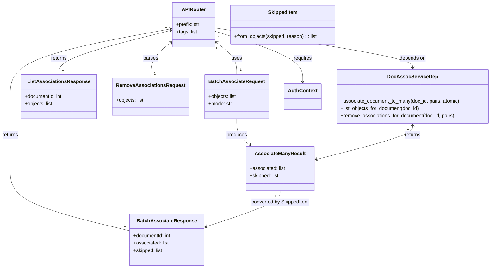

# Diagram: common/document_service/src/api/routers/document_to_objects_association.py


> Auto-generated by Obscura crawlers

## Diagram 1

```mermaid
flowchart TD
    Client -->|POST /document/:documentId/associations| RouterPost
    RouterPost --> ParseIdPost[Parse documentId -> int]
    ParseIdPost -->|invalid| BadRequestPost[BadRequestError]
    ParseIdPost -->|valid| ValidateBodyPost[BatchAssociateRequest]
    ValidateBodyPost --> DetermineMode[mode == "atomic"?]
    DetermineMode --> AssocCallPost[DocAssocServiceDep.associate_document_to_many(doc_id, pairs, atomic)]
    AssocCallPost --> PrepareResponsePost[Build BatchAssociateResponse(documentId, associated, skipped)]
    PrepareResponsePost --> Response201[200 OK with BatchAssociateResponse]

    Client -->|GET /document/:documentId/associations| RouterGet
    RouterGet --> ParseIdGet[Parse documentId -> int]
    ParseIdGet -->|invalid| BadRequestGet[BadRequestError]
    ParseIdGet -->|valid| AssocCallGet[DocAssocServiceDep.list_objects_for_document(doc_id)]
    AssocCallGet --> PrepareResponseGet[Build ListAssociationsResponse(documentId, objects)]
    PrepareResponseGet --> Response200[200 OK with ListAssociationsResponse]

    Client -->|DELETE /document/:documentId/associations| RouterDelete
    RouterDelete --> ParseIdDel[Parse documentId -> int]
    ParseIdDel -->|invalid| BadRequestDel[BadRequestError]
    ParseIdDel -->|valid| TryParseBodyDel[Try parse JSON -> RemoveAssociationsRequest]
    TryParseBodyDel -->|parsed with objects| PairsPresent[use body.objects]
    TryParseBodyDel -->|error or no objects| PairsNull[use pairs = None]
    PairsPresent --> AssocCallDel[DocAssocServiceDep.remove_associations_for_document(doc_id, pairs)]
    PairsNull --> AssocCallDel
    AssocCallDel --> Response204[204 No Content]
```

> SVG rendering failed for this diagram.

## Diagram 2



### SVG

<svg id="container" width="1556.421875" xmlns="http://www.w3.org/2000/svg" class="classDiagram" height="868" viewBox="0 0 1556.421875 868" role="graphics-document document" aria-roledescription="class"><style>#container{font-family:"trebuchet ms",verdana,arial,sans-serif;font-size:16px;fill:#333;}@keyframes edge-animation-frame{from{stroke-dashoffset:0;}}@keyframes dash{to{stroke-dashoffset:0;}}#container .edge-animation-slow{stroke-dasharray:9,5!important;stroke-dashoffset:900;animation:dash 50s linear infinite;stroke-linecap:round;}#container .edge-animation-fast{stroke-dasharray:9,5!important;stroke-dashoffset:900;animation:dash 20s linear infinite;stroke-linecap:round;}#container .error-icon{fill:#552222;}#container .error-text{fill:#552222;stroke:#552222;}#container .edge-thickness-normal{stroke-width:1px;}#container .edge-thickness-thick{stroke-width:3.5px;}#container .edge-pattern-solid{stroke-dasharray:0;}#container .edge-thickness-invisible{stroke-width:0;fill:none;}#container .edge-pattern-dashed{stroke-dasharray:3;}#container .edge-pattern-dotted{stroke-dasharray:2;}#container .marker{fill:#333333;stroke:#333333;}#container .marker.cross{stroke:#333333;}#container svg{font-family:"trebuchet ms",verdana,arial,sans-serif;font-size:16px;}#container p{margin:0;}#container g.classGroup text{fill:#9370DB;stroke:none;font-family:"trebuchet ms",verdana,arial,sans-serif;font-size:10px;}#container g.classGroup text .title{font-weight:bolder;}#container .nodeLabel,#container .edgeLabel{color:#131300;}#container .edgeLabel .label rect{fill:#ECECFF;}#container .label text{fill:#131300;}#container .labelBkg{background:#ECECFF;}#container .edgeLabel .label span{background:#ECECFF;}#container .classTitle{font-weight:bolder;}#container .node rect,#container .node circle,#container .node ellipse,#container .node polygon,#container .node path{fill:#ECECFF;stroke:#9370DB;stroke-width:1px;}#container .divider{stroke:#9370DB;stroke-width:1;}#container g.clickable{cursor:pointer;}#container g.classGroup rect{fill:#ECECFF;stroke:#9370DB;}#container g.classGroup line{stroke:#9370DB;stroke-width:1;}#container .classLabel .box{stroke:none;stroke-width:0;fill:#ECECFF;opacity:0.5;}#container .classLabel .label{fill:#9370DB;font-size:10px;}#container .relation{stroke:#333333;stroke-width:1;fill:none;}#container .dashed-line{stroke-dasharray:3;}#container .dotted-line{stroke-dasharray:1 2;}#container #compositionStart,#container .composition{fill:#333333!important;stroke:#333333!important;stroke-width:1;}#container #compositionEnd,#container .composition{fill:#333333!important;stroke:#333333!important;stroke-width:1;}#container #dependencyStart,#container .dependency{fill:#333333!important;stroke:#333333!important;stroke-width:1;}#container #dependencyStart,#container .dependency{fill:#333333!important;stroke:#333333!important;stroke-width:1;}#container #extensionStart,#container .extension{fill:transparent!important;stroke:#333333!important;stroke-width:1;}#container #extensionEnd,#container .extension{fill:transparent!important;stroke:#333333!important;stroke-width:1;}#container #aggregationStart,#container .aggregation{fill:transparent!important;stroke:#333333!important;stroke-width:1;}#container #aggregationEnd,#container .aggregation{fill:transparent!important;stroke:#333333!important;stroke-width:1;}#container #lollipopStart,#container .lollipop{fill:#ECECFF!important;stroke:#333333!important;stroke-width:1;}#container #lollipopEnd,#container .lollipop{fill:#ECECFF!important;stroke:#333333!important;stroke-width:1;}#container .edgeTerminals{font-size:11px;line-height:initial;}#container .classTitleText{text-anchor:middle;font-size:18px;fill:#333;}#container .label-icon{display:inline-block;height:1em;overflow:visible;vertical-align:-0.125em;}#container .node .label-icon path{fill:currentColor;stroke:revert;stroke-width:revert;}#container :root{--mermaid-font-family:"trebuchet ms",verdana,arial,sans-serif;}</style><g><defs><marker id="container_class-aggregationStart" class="marker aggregation class" refX="18" refY="7" markerWidth="190" markerHeight="240" orient="auto"><path d="M 18,7 L9,13 L1,7 L9,1 Z"></path></marker></defs><defs><marker id="container_class-aggregationEnd" class="marker aggregation class" refX="1" refY="7" markerWidth="20" markerHeight="28" orient="auto"><path d="M 18,7 L9,13 L1,7 L9,1 Z"></path></marker></defs><defs><marker id="container_class-extensionStart" class="marker extension class" refX="18" refY="7" markerWidth="190" markerHeight="240" orient="auto"><path d="M 1,7 L18,13 V 1 Z"></path></marker></defs><defs><marker id="container_class-extensionEnd" class="marker extension class" refX="1" refY="7" markerWidth="20" markerHeight="28" orient="auto"><path d="M 1,1 V 13 L18,7 Z"></path></marker></defs><defs><marker id="container_class-compositionStart" class="marker composition class" refX="18" refY="7" markerWidth="190" markerHeight="240" orient="auto"><path d="M 18,7 L9,13 L1,7 L9,1 Z"></path></marker></defs><defs><marker id="container_class-compositionEnd" class="marker composition class" refX="1" refY="7" markerWidth="20" markerHeight="28" orient="auto"><path d="M 18,7 L9,13 L1,7 L9,1 Z"></path></marker></defs><defs><marker id="container_class-dependencyStart" class="marker dependency class" refX="6" refY="7" markerWidth="190" markerHeight="240" orient="auto"><path d="M 5,7 L9,13 L1,7 L9,1 Z"></path></marker></defs><defs><marker id="container_class-dependencyEnd" class="marker dependency class" refX="13" refY="7" markerWidth="20" markerHeight="28" orient="auto"><path d="M 18,7 L9,13 L14,7 L9,1 Z"></path></marker></defs><defs><marker id="container_class-lollipopStart" class="marker lollipop class" refX="13" refY="7" markerWidth="190" markerHeight="240" orient="auto"><circle stroke="black" fill="transparent" cx="7" cy="7" r="6"></circle></marker></defs><defs><marker id="container_class-lollipopEnd" class="marker lollipop class" refX="1" refY="7" markerWidth="190" markerHeight="240" orient="auto"><circle stroke="black" fill="transparent" cx="7" cy="7" r="6"></circle></marker></defs><g class="root"><g class="clusters"></g><g class="edgePaths"><path d="M685.357,139.568L695.47,147.807C705.583,156.045,725.809,172.523,735.922,189.428C746.035,206.333,746.035,223.667,746.035,232.333L746.035,241" id="id_APIRouter_BatchAssociateRequest_1" class="edge-thickness-normal edge-pattern-solid relation" style=";;;" data-edge="true" data-et="edge" data-id="id_APIRouter_BatchAssociateRequest_1" data-points="W3sieCI6NjgwLjcwNTA3ODEyNSwieSI6MTM1Ljc3ODQ2ODcyNDkxMDZ9LHsieCI6NzQ2LjAzNTE1NjI1LCJ5IjoxODl9LHsieCI6NzQ2LjAzNTE1NjI1LCJ5IjoyNDF9XQ==" marker-start="url(#container_class-dependencyStart)"></path><path d="M537.872,94.025L453.937,109.854C370.003,125.683,202.134,157.342,118.2,193.837C34.266,230.333,34.266,271.667,34.266,313C34.266,354.333,34.266,395.667,34.266,434.5C34.266,473.333,34.266,509.667,34.266,546C34.266,582.333,34.266,618.667,96.186,652.102C158.105,685.537,281.945,716.074,343.865,731.343L405.785,746.611" id="id_APIRouter_BatchAssociateResponse_2" class="edge-thickness-normal edge-pattern-solid relation" style=";;;" data-edge="true" data-et="edge" data-id="id_APIRouter_BatchAssociateResponse_2" data-points="W3sieCI6NTQzLjc2NzU3ODEyNSwieSI6OTIuOTEyNTgxMzk4NDEzNzZ9LHsieCI6MzQuMjY1NjI1LCJ5IjoxODl9LHsieCI6MzQuMjY1NjI1LCJ5IjozMTN9LHsieCI6MzQuMjY1NjI1LCJ5Ijo0Mzd9LHsieCI6MzQuMjY1NjI1LCJ5Ijo1NDZ9LHsieCI6MzQuMjY1NjI1LCJ5Ijo2NTV9LHsieCI6NDA1Ljc4NTE1NjI1LCJ5Ijo3NDYuNjExMTIwODQwNjMwNX1d" marker-start="url(#container_class-dependencyStart)"></path><path d="M537.958,99.189L480.018,114.158C422.078,129.126,306.197,159.063,248.257,182.698C190.316,206.333,190.316,223.667,190.316,232.333L190.316,241" id="id_APIRouter_ListAssociationsResponse_3" class="edge-thickness-normal edge-pattern-solid relation" style=";;;" data-edge="true" data-et="edge" data-id="id_APIRouter_ListAssociationsResponse_3" data-points="W3sieCI6NTQzLjc2NzU3ODEyNSwieSI6OTcuNjg4NDEyODA3ODk1NDZ9LHsieCI6MTkwLjMxNjQwNjI1LCJ5IjoxODl9LHsieCI6MTkwLjMxNjQwNjI1LCJ5IjoyNDF9XQ==" marker-start="url(#container_class-dependencyStart)"></path><path d="M539.116,139.568L529.003,147.807C518.89,156.045,498.664,172.523,488.551,191.428C478.438,210.333,478.438,231.667,478.438,242.333L478.438,253" id="id_APIRouter_RemoveAssociationsRequest_4" class="edge-thickness-normal edge-pattern-solid relation" style=";;;" data-edge="true" data-et="edge" data-id="id_APIRouter_RemoveAssociationsRequest_4" data-points="W3sieCI6NTQzLjc2NzU3ODEyNSwieSI6MTM1Ljc3ODQ2ODcyNDkxMDZ9LHsieCI6NDc4LjQzNzUsInkiOjE4OX0seyJ4Ijo0NzguNDM3NSwieSI6MjUzfV0=" marker-start="url(#container_class-dependencyStart)"></path><path d="M746.035,385L746.035,393.667C746.035,402.333,746.035,419.667,752.885,433.871C759.735,448.076,773.434,459.152,780.284,464.69L787.133,470.228" id="id_BatchAssociateRequest_AssociateManyResult_5" class="edge-thickness-normal edge-pattern-solid relation" style=";;;" data-edge="true" data-et="edge" data-id="id_BatchAssociateRequest_AssociateManyResult_5" data-points="W3sieCI6NzQ2LjAzNTE1NjI1LCJ5IjozODV9LHsieCI6NzQ2LjAzNTE1NjI1LCJ5Ijo0Mzd9LHsieCI6NzkxLjc5OTE4NjQ5NjU1OTYsInkiOjQ3NH1d" marker-end="url(#container_class-dependencyEnd)"></path><path d="M880.854,618L880.854,624.167C880.854,630.333,880.854,642.667,842.35,661.924C803.847,681.182,726.84,707.364,688.336,720.455L649.833,733.546" id="id_AssociateManyResult_BatchAssociateResponse_6" class="edge-thickness-normal edge-pattern-solid relation" style=";;;" data-edge="true" data-et="edge" data-id="id_AssociateManyResult_BatchAssociateResponse_6" data-points="W3sieCI6ODgwLjg1MzUxNTYyNSwieSI6NjE4fSx7IngiOjg4MC44NTM1MTU2MjUsInkiOjY1NX0seyJ4Ijo2NDQuMTUyMzQzNzUsInkiOjczNS40Nzc4NTI4NDI1NTI0fV0=" marker-end="url(#container_class-dependencyEnd)"></path><path d="M1304.664,406L1304.664,411.167C1304.664,416.333,1304.664,426.667,1253.086,445.099C1201.508,463.531,1098.352,490.062,1046.774,503.327L995.196,516.592" id="id_DocAssocServiceDep_AssociateManyResult_7" class="edge-thickness-normal edge-pattern-solid relation" style=";;;" data-edge="true" data-et="edge" data-id="id_DocAssocServiceDep_AssociateManyResult_7" data-points="W3sieCI6MTMwNC42NjQwNjI1LCJ5Ijo0MDB9LHsieCI6MTMwNC42NjQwNjI1LCJ5Ijo0Mzd9LHsieCI6OTg5LjM4NDc2NTYyNSwieSI6NTE4LjA4NjgwNTQ0MzU0Mzh9XQ==" marker-start="url(#container_class-dependencyStart)" marker-end="url(#container_class-dependencyEnd)"></path><path d="M680.705,90.778L784.698,107.148C888.691,123.519,1096.678,156.259,1200.671,177.796C1304.664,199.333,1304.664,209.667,1304.664,214.833L1304.664,220" id="id_APIRouter_DocAssocServiceDep_8" class="edge-thickness-normal edge-pattern-solid relation" style=";;;" data-edge="true" data-et="edge" data-id="id_APIRouter_DocAssocServiceDep_8" data-points="W3sieCI6NjgwLjcwNTA3ODEyNSwieSI6OTAuNzc4MTU1NDM3MDIzODN9LHsieCI6MTMwNC42NjQwNjI1LCJ5IjoxODl9LHsieCI6MTMwNC42NjQwNjI1LCJ5IjoyMjZ9XQ==" marker-end="url(#container_class-dependencyEnd)"></path><path d="M680.705,101.854L726.21,116.378C771.715,130.903,862.725,159.951,908.229,187.142C953.734,214.333,953.734,239.667,953.734,252.333L953.734,265" id="id_APIRouter_AuthContext_9" class="edge-thickness-normal edge-pattern-solid relation" style=";;;" data-edge="true" data-et="edge" data-id="id_APIRouter_AuthContext_9" data-points="W3sieCI6NjgwLjcwNTA3ODEyNSwieSI6MTAxLjg1Mzk4NjYyODMwOTMxfSx7IngiOjk1My43MzQzNzUsInkiOjE4OX0seyJ4Ijo5NTMuNzM0Mzc1LCJ5IjoyNzF9XQ==" marker-end="url(#container_class-dependencyEnd)"></path></g><g class="edgeLabels"><g class="edgeLabel" transform="translate(746.03515625, 189)"><g class="label" data-id="id_APIRouter_BatchAssociateRequest_1" transform="translate(-16.4921875, -12)"><foreignObject width="32.984375" height="24"><div xmlns="http://www.w3.org/1999/xhtml" class="labelBkg" style="display: table-cell; white-space: nowrap; line-height: 1.5; max-width: 200px; text-align: center;"><span class="edgeLabel"><p>uses</p></span></div></foreignObject></g></g><g class="edgeLabel" transform="translate(34.265625, 437)"><g class="label" data-id="id_APIRouter_BatchAssociateResponse_2" transform="translate(-26.265625, -12)"><foreignObject width="52.53125" height="24"><div xmlns="http://www.w3.org/1999/xhtml" class="labelBkg" style="display: table-cell; white-space: nowrap; line-height: 1.5; max-width: 200px; text-align: center;"><span class="edgeLabel"><p>returns</p></span></div></foreignObject></g></g><g class="edgeLabel" transform="translate(190.31640625, 189)"><g class="label" data-id="id_APIRouter_ListAssociationsResponse_3" transform="translate(-26.265625, -12)"><foreignObject width="52.53125" height="24"><div xmlns="http://www.w3.org/1999/xhtml" class="labelBkg" style="display: table-cell; white-space: nowrap; line-height: 1.5; max-width: 200px; text-align: center;"><span class="edgeLabel"><p>returns</p></span></div></foreignObject></g></g><g class="edgeLabel" transform="translate(478.4375, 189)"><g class="label" data-id="id_APIRouter_RemoveAssociationsRequest_4" transform="translate(-23.828125, -12)"><foreignObject width="47.65625" height="24"><div xmlns="http://www.w3.org/1999/xhtml" class="labelBkg" style="display: table-cell; white-space: nowrap; line-height: 1.5; max-width: 200px; text-align: center;"><span class="edgeLabel"><p>parses</p></span></div></foreignObject></g></g><g class="edgeLabel" transform="translate(746.03515625, 437)"><g class="label" data-id="id_BatchAssociateRequest_AssociateManyResult_5" transform="translate(-33.4765625, -12)"><foreignObject width="66.953125" height="24"><div xmlns="http://www.w3.org/1999/xhtml" class="labelBkg" style="display: table-cell; white-space: nowrap; line-height: 1.5; max-width: 200px; text-align: center;"><span class="edgeLabel"><p>produces</p></span></div></foreignObject></g></g><g class="edgeLabel" transform="translate(880.853515625, 655)"><g class="label" data-id="id_AssociateManyResult_BatchAssociateResponse_6" transform="translate(-94.8359375, -12)"><foreignObject width="189.671875" height="24"><div xmlns="http://www.w3.org/1999/xhtml" class="labelBkg" style="display: table-cell; white-space: nowrap; line-height: 1.5; max-width: 200px; text-align: center;"><span class="edgeLabel"><p>converted by SkippedItem</p></span></div></foreignObject></g></g><g class="edgeLabel" transform="translate(1304.6640625, 437)"><g class="label" data-id="id_DocAssocServiceDep_AssociateManyResult_7" transform="translate(-26.265625, -12)"><foreignObject width="52.53125" height="24"><div xmlns="http://www.w3.org/1999/xhtml" class="labelBkg" style="display: table-cell; white-space: nowrap; line-height: 1.5; max-width: 200px; text-align: center;"><span class="edgeLabel"><p>returns</p></span></div></foreignObject></g></g><g class="edgeLabel" transform="translate(1304.6640625, 189)"><g class="label" data-id="id_APIRouter_DocAssocServiceDep_8" transform="translate(-42.9453125, -12)"><foreignObject width="85.890625" height="24"><div xmlns="http://www.w3.org/1999/xhtml" class="labelBkg" style="display: table-cell; white-space: nowrap; line-height: 1.5; max-width: 200px; text-align: center;"><span class="edgeLabel"><p>depends on</p></span></div></foreignObject></g></g><g class="edgeLabel" transform="translate(953.734375, 189)"><g class="label" data-id="id_APIRouter_AuthContext_9" transform="translate(-29.8515625, -12)"><foreignObject width="59.703125" height="24"><div xmlns="http://www.w3.org/1999/xhtml" class="labelBkg" style="display: table-cell; white-space: nowrap; line-height: 1.5; max-width: 200px; text-align: center;"><span class="edgeLabel"><p>requires</p></span></div></foreignObject></g></g><g class="edgeTerminals" transform="translate(684.7987597302933, 158.46087844874768)"><g class="inner" transform="translate(0, 0)"><foreignObject style="width: 9px; height: 12px;"><div xmlns="http://www.w3.org/1999/xhtml" style="display: inline-block; padding-right: 1px; white-space: nowrap;"><span class="edgeLabel">1</span></div></foreignObject></g></g><g class="edgeTerminals" transform="translate(523.7908643748049, 81.41558855231285)"><g class="inner" transform="translate(0, 0)"><foreignObject style="width: 9px; height: 12px;"><div xmlns="http://www.w3.org/1999/xhtml" style="display: inline-block; padding-right: 1px; white-space: nowrap;"><span class="edgeLabel">1</span></div></foreignObject></g></g><g class="edgeTerminals" transform="translate(523.0719069937143, 87.54252060102465)"><g class="inner" transform="translate(0, 0)"><foreignObject style="width: 9px; height: 12px;"><div xmlns="http://www.w3.org/1999/xhtml" style="display: inline-block; padding-right: 1px; white-space: nowrap;"><span class="edgeLabel">1</span></div></foreignObject></g></g><g class="edgeTerminals" transform="translate(520.7259260419246, 135.20201920763475)"><g class="inner" transform="translate(0, 0)"><foreignObject style="width: 9px; height: 12px;"><div xmlns="http://www.w3.org/1999/xhtml" style="display: inline-block; padding-right: 1px; white-space: nowrap;"><span class="edgeLabel">1</span></div></foreignObject></g></g><g class="edgeTerminals" transform="translate(731.0351581250001, 402.50000160714285)"><g class="inner" transform="translate(0, 0)"><foreignObject style="width: 9px; height: 12px;"><div xmlns="http://www.w3.org/1999/xhtml" style="display: inline-block; padding-right: 1px; white-space: nowrap;"><span class="edgeLabel">1</span></div></foreignObject></g></g><g class="edgeTerminals" transform="translate(865.8535178125002, 635.500001875)"><g class="inner" transform="translate(0, 0)"><foreignObject style="width: 9px; height: 12px;"><div xmlns="http://www.w3.org/1999/xhtml" style="display: inline-block; padding-right: 1px; white-space: nowrap;"><span class="edgeLabel">1</span></div></foreignObject></g></g><g class="edgeTerminals" transform="translate(1289.66406125, 417.4999989285715)"><g class="inner" transform="translate(0, 0)"><foreignObject style="width: 9px; height: 12px;"><div xmlns="http://www.w3.org/1999/xhtml" style="display: inline-block; padding-right: 1px; white-space: nowrap;"><span class="edgeLabel">1</span></div></foreignObject></g></g><g class="edgeTerminals" transform="translate(695.6596669347166, 108.31697604470551)"><g class="inner" transform="translate(0, 0)"><foreignObject style="width: 9px; height: 12px;"><div xmlns="http://www.w3.org/1999/xhtml" style="display: inline-block; padding-right: 1px; white-space: nowrap;"><span class="edgeLabel">1</span></div></foreignObject></g></g><g class="edgeTerminals" transform="translate(692.8154237707678, 121.46493998022294)"><g class="inner" transform="translate(0, 0)"><foreignObject style="width: 9px; height: 12px;"><div xmlns="http://www.w3.org/1999/xhtml" style="display: inline-block; padding-right: 1px; white-space: nowrap;"><span class="edgeLabel">1</span></div></foreignObject></g></g><g class="edgeTerminals" transform="translate(756.0351581249998, 218.50000160714288)"><g class="inner" transform="translate(0, 0)"></g><foreignObject style="width: 9px; height: 12px;"><div xmlns="http://www.w3.org/1999/xhtml" style="display: inline-block; padding-right: 1px; white-space: nowrap;"><span class="edgeLabel">1</span></div></foreignObject></g><g class="edgeTerminals" transform="translate(387.3853043109757, 722.8576158613213)"><g class="inner" transform="translate(0, 0)"></g><foreignObject style="width: 9px; height: 12px;"><div xmlns="http://www.w3.org/1999/xhtml" style="display: inline-block; padding-right: 1px; white-space: nowrap;"><span class="edgeLabel">1</span></div></foreignObject></g><g class="edgeTerminals" transform="translate(200.31640812499992, 218.50000160714285)"><g class="inner" transform="translate(0, 0)"></g><foreignObject style="width: 9px; height: 12px;"><div xmlns="http://www.w3.org/1999/xhtml" style="display: inline-block; padding-right: 1px; white-space: nowrap;"><span class="edgeLabel">1</span></div></foreignObject></g><g class="edgeTerminals" transform="translate(488.4375, 230.5)"><g class="inner" transform="translate(0, 0)"></g><foreignObject style="width: 9px; height: 12px;"><div xmlns="http://www.w3.org/1999/xhtml" style="display: inline-block; padding-right: 1px; white-space: nowrap;"><span class="edgeLabel">1</span></div></foreignObject></g></g><g class="nodes"><g class="node default" id="classId-APIRouter-0" transform="translate(612.236328125, 80)"><g class="basic label-container"><path d="M-68.46875 -72 L68.46875 -72 L68.46875 72 L-68.46875 72" stroke="none" stroke-width="0" fill="#ECECFF" style=""></path><path d="M-68.46875 -72 C-40.881818321168694 -72, -13.294886642337396 -72, 68.46875 -72 M-68.46875 -72 C-23.839773796771915 -72, 20.78920240645617 -72, 68.46875 -72 M68.46875 -72 C68.46875 -33.847082704415044, 68.46875 4.305834591169912, 68.46875 72 M68.46875 -72 C68.46875 -32.885570582261785, 68.46875 6.22885883547643, 68.46875 72 M68.46875 72 C37.21238242204184 72, 5.9560148440836755 72, -68.46875 72 M68.46875 72 C15.2743132592488 72, -37.9201234815024 72, -68.46875 72 M-68.46875 72 C-68.46875 27.592347675179134, -68.46875 -16.81530464964173, -68.46875 -72 M-68.46875 72 C-68.46875 39.697743108988966, -68.46875 7.395486217977933, -68.46875 -72" stroke="#9370DB" stroke-width="1.3" fill="none" stroke-dasharray="0 0" style=""></path></g><g class="annotation-group text" transform="translate(0, -48)"></g><g class="label-group text" transform="translate(-36.5, -48)"><g class="label" style="font-weight: bolder" transform="translate(0,-12)"><foreignObject width="73" height="24"><div xmlns="http://www.w3.org/1999/xhtml" style="display: table-cell; white-space: nowrap; line-height: 1.5; max-width: 123px; text-align: center;"><span class="nodeLabel markdown-node-label" style=""><p>APIRouter</p></span></div></foreignObject></g></g><g class="members-group text" transform="translate(-56.46875, 0)"><g class="label" style="" transform="translate(0,-12)"><foreignObject width="76.4375" height="24"><div xmlns="http://www.w3.org/1999/xhtml" style="display: table-cell; white-space: nowrap; line-height: 1.5; max-width: 135px; text-align: center;"><span class="nodeLabel markdown-node-label" style=""><p>+prefix: str</p></span></div></foreignObject></g><g class="label" style="" transform="translate(0,12)"><foreignObject width="68.328125" height="24"><div xmlns="http://www.w3.org/1999/xhtml" style="display: table-cell; white-space: nowrap; line-height: 1.5; max-width: 126px; text-align: center;"><span class="nodeLabel markdown-node-label" style=""><p>+tags: list</p></span></div></foreignObject></g></g><g class="methods-group text" transform="translate(-56.46875, 72)"></g><g class="divider" style=""><path d="M-68.46875 -24 C-18.884139018106502 -24, 30.700471963786995 -24, 68.46875 -24 M-68.46875 -24 C-22.67329224626743 -24, 23.12216550746514 -24, 68.46875 -24" stroke="#9370DB" stroke-width="1.3" fill="none" stroke-dasharray="0 0" style=""></path></g><g class="divider" style=""><path d="M-68.46875 48 C-15.611115742346186 48, 37.24651851530763 48, 68.46875 48 M-68.46875 48 C-23.88703666812338 48, 20.694676663753242 48, 68.46875 48" stroke="#9370DB" stroke-width="1.3" fill="none" stroke-dasharray="0 0" style=""></path></g></g><g class="node default" id="classId-BatchAssociateRequest-1" transform="translate(746.03515625, 313)"><g class="basic label-container"><path d="M-100.52734375 -72 L100.52734375 -72 L100.52734375 72 L-100.52734375 72" stroke="none" stroke-width="0" fill="#ECECFF" style=""></path><path d="M-100.52734375 -72 C-33.244114236042336 -72, 34.03911527791533 -72, 100.52734375 -72 M-100.52734375 -72 C-41.7214873492634 -72, 17.084369051473203 -72, 100.52734375 -72 M100.52734375 -72 C100.52734375 -17.124697175277014, 100.52734375 37.75060564944597, 100.52734375 72 M100.52734375 -72 C100.52734375 -39.005440795380665, 100.52734375 -6.010881590761329, 100.52734375 72 M100.52734375 72 C45.60877072377929 72, -9.309802302441426 72, -100.52734375 72 M100.52734375 72 C21.731123744245764 72, -57.06509626150847 72, -100.52734375 72 M-100.52734375 72 C-100.52734375 25.949746225374454, -100.52734375 -20.10050754925109, -100.52734375 -72 M-100.52734375 72 C-100.52734375 24.61875420398522, -100.52734375 -22.762491592029562, -100.52734375 -72" stroke="#9370DB" stroke-width="1.3" fill="none" stroke-dasharray="0 0" style=""></path></g><g class="annotation-group text" transform="translate(0, -48)"></g><g class="label-group text" transform="translate(-85.5859375, -48)"><g class="label" style="font-weight: bolder" transform="translate(0,-12)"><foreignObject width="171.171875" height="24"><div xmlns="http://www.w3.org/1999/xhtml" style="display: table-cell; white-space: nowrap; line-height: 1.5; max-width: 219px; text-align: center;"><span class="nodeLabel markdown-node-label" style=""><p>BatchAssociateRequest</p></span></div></foreignObject></g></g><g class="members-group text" transform="translate(-88.52734375, 0)"><g class="label" style="" transform="translate(0,-12)"><foreignObject width="91.46875" height="24"><div xmlns="http://www.w3.org/1999/xhtml" style="display: table-cell; white-space: nowrap; line-height: 1.5; max-width: 149px; text-align: center;"><span class="nodeLabel markdown-node-label" style=""><p>+objects: list</p></span></div></foreignObject></g><g class="label" style="" transform="translate(0,12)"><foreignObject width="76.84375" height="24"><div xmlns="http://www.w3.org/1999/xhtml" style="display: table-cell; white-space: nowrap; line-height: 1.5; max-width: 135px; text-align: center;"><span class="nodeLabel markdown-node-label" style=""><p>+mode: str</p></span></div></foreignObject></g></g><g class="methods-group text" transform="translate(-88.52734375, 72)"></g><g class="divider" style=""><path d="M-100.52734375 -24 C-42.497494963257566 -24, 15.532353823484868 -24, 100.52734375 -24 M-100.52734375 -24 C-38.20789838247177 -24, 24.111546985056464 -24, 100.52734375 -24" stroke="#9370DB" stroke-width="1.3" fill="none" stroke-dasharray="0 0" style=""></path></g><g class="divider" style=""><path d="M-100.52734375 48 C-43.099086641889805 48, 14.32917046622039 48, 100.52734375 48 M-100.52734375 48 C-36.19298214760764 48, 28.141379454784726 48, 100.52734375 48" stroke="#9370DB" stroke-width="1.3" fill="none" stroke-dasharray="0 0" style=""></path></g></g><g class="node default" id="classId-BatchAssociateResponse-2" transform="translate(524.96875, 776)"><g class="basic label-container"><path d="M-119.18359375 -84 L119.18359375 -84 L119.18359375 84 L-119.18359375 84" stroke="none" stroke-width="0" fill="#ECECFF" style=""></path><path d="M-119.18359375 -84 C-70.02382454902391 -84, -20.864055348047813 -84, 119.18359375 -84 M-119.18359375 -84 C-50.74660959745 -84, 17.690374555099993 -84, 119.18359375 -84 M119.18359375 -84 C119.18359375 -33.55895023765582, 119.18359375 16.882099524688357, 119.18359375 84 M119.18359375 -84 C119.18359375 -33.31976233903141, 119.18359375 17.360475321937173, 119.18359375 84 M119.18359375 84 C70.04117182588769 84, 20.898749901775375 84, -119.18359375 84 M119.18359375 84 C23.924867379530355 84, -71.33385899093929 84, -119.18359375 84 M-119.18359375 84 C-119.18359375 46.03310915146161, -119.18359375 8.066218302923218, -119.18359375 -84 M-119.18359375 84 C-119.18359375 22.86379451186675, -119.18359375 -38.2724109762665, -119.18359375 -84" stroke="#9370DB" stroke-width="1.3" fill="none" stroke-dasharray="0 0" style=""></path></g><g class="annotation-group text" transform="translate(0, -60)"></g><g class="label-group text" transform="translate(-91.0546875, -60)"><g class="label" style="font-weight: bolder" transform="translate(0,-12)"><foreignObject width="182.109375" height="24"><div xmlns="http://www.w3.org/1999/xhtml" style="display: table-cell; white-space: nowrap; line-height: 1.5; max-width: 229px; text-align: center;"><span class="nodeLabel markdown-node-label" style=""><p>BatchAssociateResponse</p></span></div></foreignObject></g></g><g class="members-group text" transform="translate(-107.18359375, -12)"><g class="label" style="" transform="translate(0,-12)"><foreignObject width="123.3125" height="24"><div xmlns="http://www.w3.org/1999/xhtml" style="display: table-cell; white-space: nowrap; line-height: 1.5; max-width: 181px; text-align: center;"><span class="nodeLabel markdown-node-label" style=""><p>+documentId: int</p></span></div></foreignObject></g><g class="label" style="" transform="translate(0,12)"><foreignObject width="115.640625" height="24"><div xmlns="http://www.w3.org/1999/xhtml" style="display: table-cell; white-space: nowrap; line-height: 1.5; max-width: 173px; text-align: center;"><span class="nodeLabel markdown-node-label" style=""><p>+associated: list</p></span></div></foreignObject></g><g class="label" style="" transform="translate(0,36)"><foreignObject width="95.984375" height="24"><div xmlns="http://www.w3.org/1999/xhtml" style="display: table-cell; white-space: nowrap; line-height: 1.5; max-width: 154px; text-align: center;"><span class="nodeLabel markdown-node-label" style=""><p>+skipped: list</p></span></div></foreignObject></g></g><g class="methods-group text" transform="translate(-107.18359375, 84)"></g><g class="divider" style=""><path d="M-119.18359375 -36 C-47.2311434348089 -36, 24.7213068803822 -36, 119.18359375 -36 M-119.18359375 -36 C-37.69053555700411 -36, 43.80252263599178 -36, 119.18359375 -36" stroke="#9370DB" stroke-width="1.3" fill="none" stroke-dasharray="0 0" style=""></path></g><g class="divider" style=""><path d="M-119.18359375 60 C-27.52947066781715 60, 64.1246524143657 60, 119.18359375 60 M-119.18359375 60 C-37.57816900735149 60, 44.02725573529702 60, 119.18359375 60" stroke="#9370DB" stroke-width="1.3" fill="none" stroke-dasharray="0 0" style=""></path></g></g><g class="node default" id="classId-ListAssociationsResponse-3" transform="translate(190.31640625, 313)"><g class="basic label-container"><path d="M-121.05078125 -72 L121.05078125 -72 L121.05078125 72 L-121.05078125 72" stroke="none" stroke-width="0" fill="#ECECFF" style=""></path><path d="M-121.05078125 -72 C-42.33517155090021 -72, 36.38043814819957 -72, 121.05078125 -72 M-121.05078125 -72 C-59.34097303643427 -72, 2.3688351771314586 -72, 121.05078125 -72 M121.05078125 -72 C121.05078125 -14.468759271490669, 121.05078125 43.06248145701866, 121.05078125 72 M121.05078125 -72 C121.05078125 -23.87823698775287, 121.05078125 24.24352602449426, 121.05078125 72 M121.05078125 72 C38.369844961646464 72, -44.31109132670707 72, -121.05078125 72 M121.05078125 72 C38.83784855522045 72, -43.37508413955911 72, -121.05078125 72 M-121.05078125 72 C-121.05078125 40.11911707289789, -121.05078125 8.238234145795786, -121.05078125 -72 M-121.05078125 72 C-121.05078125 16.7367322879794, -121.05078125 -38.5265354240412, -121.05078125 -72" stroke="#9370DB" stroke-width="1.3" fill="none" stroke-dasharray="0 0" style=""></path></g><g class="annotation-group text" transform="translate(0, -48)"></g><g class="label-group text" transform="translate(-94.7890625, -48)"><g class="label" style="font-weight: bolder" transform="translate(0,-12)"><foreignObject width="189.578125" height="24"><div xmlns="http://www.w3.org/1999/xhtml" style="display: table-cell; white-space: nowrap; line-height: 1.5; max-width: 236px; text-align: center;"><span class="nodeLabel markdown-node-label" style=""><p>ListAssociationsResponse</p></span></div></foreignObject></g></g><g class="members-group text" transform="translate(-109.05078125, 0)"><g class="label" style="" transform="translate(0,-12)"><foreignObject width="123.3125" height="24"><div xmlns="http://www.w3.org/1999/xhtml" style="display: table-cell; white-space: nowrap; line-height: 1.5; max-width: 181px; text-align: center;"><span class="nodeLabel markdown-node-label" style=""><p>+documentId: int</p></span></div></foreignObject></g><g class="label" style="" transform="translate(0,12)"><foreignObject width="91.46875" height="24"><div xmlns="http://www.w3.org/1999/xhtml" style="display: table-cell; white-space: nowrap; line-height: 1.5; max-width: 149px; text-align: center;"><span class="nodeLabel markdown-node-label" style=""><p>+objects: list</p></span></div></foreignObject></g></g><g class="methods-group text" transform="translate(-109.05078125, 72)"></g><g class="divider" style=""><path d="M-121.05078125 -24 C-56.5601410597922 -24, 7.930499130415598 -24, 121.05078125 -24 M-121.05078125 -24 C-47.29438043654257 -24, 26.462020376914865 -24, 121.05078125 -24" stroke="#9370DB" stroke-width="1.3" fill="none" stroke-dasharray="0 0" style=""></path></g><g class="divider" style=""><path d="M-121.05078125 48 C-32.02323208609589 48, 57.004317077808224 48, 121.05078125 48 M-121.05078125 48 C-48.15437135507857 48, 24.742038539842866 48, 121.05078125 48" stroke="#9370DB" stroke-width="1.3" fill="none" stroke-dasharray="0 0" style=""></path></g></g><g class="node default" id="classId-RemoveAssociationsRequest-4" transform="translate(478.4375, 313)"><g class="basic label-container"><path d="M-117.0703125 -60 L117.0703125 -60 L117.0703125 60 L-117.0703125 60" stroke="none" stroke-width="0" fill="#ECECFF" style=""></path><path d="M-117.0703125 -60 C-56.187472414127 -60, 4.6953676717459985 -60, 117.0703125 -60 M-117.0703125 -60 C-47.82993891211963 -60, 21.41043467576074 -60, 117.0703125 -60 M117.0703125 -60 C117.0703125 -16.451641872017177, 117.0703125 27.096716255965646, 117.0703125 60 M117.0703125 -60 C117.0703125 -13.992922247365016, 117.0703125 32.01415550526997, 117.0703125 60 M117.0703125 60 C26.723109556492076 60, -63.62409338701585 60, -117.0703125 60 M117.0703125 60 C45.532974837738166 60, -26.004362824523668 60, -117.0703125 60 M-117.0703125 60 C-117.0703125 17.334573213599306, -117.0703125 -25.330853572801388, -117.0703125 -60 M-117.0703125 60 C-117.0703125 21.118011529039798, -117.0703125 -17.763976941920404, -117.0703125 -60" stroke="#9370DB" stroke-width="1.3" fill="none" stroke-dasharray="0 0" style=""></path></g><g class="annotation-group text" transform="translate(0, -36)"></g><g class="label-group text" transform="translate(-105.0703125, -36)"><g class="label" style="font-weight: bolder" transform="translate(0,-12)"><foreignObject width="210.140625" height="24"><div xmlns="http://www.w3.org/1999/xhtml" style="display: table-cell; white-space: nowrap; line-height: 1.5; max-width: 258px; text-align: center;"><span class="nodeLabel markdown-node-label" style=""><p>RemoveAssociationsRequest</p></span></div></foreignObject></g></g><g class="members-group text" transform="translate(-105.0703125, 12)"><g class="label" style="" transform="translate(0,-12)"><foreignObject width="91.46875" height="24"><div xmlns="http://www.w3.org/1999/xhtml" style="display: table-cell; white-space: nowrap; line-height: 1.5; max-width: 149px; text-align: center;"><span class="nodeLabel markdown-node-label" style=""><p>+objects: list</p></span></div></foreignObject></g></g><g class="methods-group text" transform="translate(-105.0703125, 60)"></g><g class="divider" style=""><path d="M-117.0703125 -12 C-38.355114058620984 -12, 40.36008438275803 -12, 117.0703125 -12 M-117.0703125 -12 C-60.81296689137045 -12, -4.555621282740901 -12, 117.0703125 -12" stroke="#9370DB" stroke-width="1.3" fill="none" stroke-dasharray="0 0" style=""></path></g><g class="divider" style=""><path d="M-117.0703125 36 C-66.07591866528404 36, -15.081524830568071 36, 117.0703125 36 M-117.0703125 36 C-57.79558921973156 36, 1.4791340605368788 36, 117.0703125 36" stroke="#9370DB" stroke-width="1.3" fill="none" stroke-dasharray="0 0" style=""></path></g></g><g class="node default" id="classId-SkippedItem-5" transform="translate(901.228515625, 80)"><g class="basic label-container"><path d="M-170.5234375 -63 L170.5234375 -63 L170.5234375 63 L-170.5234375 63" stroke="none" stroke-width="0" fill="#ECECFF" style=""></path><path d="M-170.5234375 -63 C-89.57657893914565 -63, -8.629720378291296 -63, 170.5234375 -63 M-170.5234375 -63 C-75.3107378789505 -63, 19.90196174209899 -63, 170.5234375 -63 M170.5234375 -63 C170.5234375 -36.135365509223476, 170.5234375 -9.27073101844696, 170.5234375 63 M170.5234375 -63 C170.5234375 -19.025027130921835, 170.5234375 24.94994573815633, 170.5234375 63 M170.5234375 63 C41.926006388591304 63, -86.67142472281739 63, -170.5234375 63 M170.5234375 63 C74.64510360952191 63, -21.233230280956178 63, -170.5234375 63 M-170.5234375 63 C-170.5234375 36.70769769934397, -170.5234375 10.415395398687942, -170.5234375 -63 M-170.5234375 63 C-170.5234375 32.28773089215531, -170.5234375 1.5754617843106118, -170.5234375 -63" stroke="#9370DB" stroke-width="1.3" fill="none" stroke-dasharray="0 0" style=""></path></g><g class="annotation-group text" transform="translate(0, -39)"></g><g class="label-group text" transform="translate(-46.484375, -39)"><g class="label" style="font-weight: bolder" transform="translate(0,-12)"><foreignObject width="92.96875" height="24"><div xmlns="http://www.w3.org/1999/xhtml" style="display: table-cell; white-space: nowrap; line-height: 1.5; max-width: 141px; text-align: center;"><span class="nodeLabel markdown-node-label" style=""><p>SkippedItem</p></span></div></foreignObject></g></g><g class="members-group text" transform="translate(-158.5234375, 9)"></g><g class="methods-group text" transform="translate(-158.5234375, 39)"><g class="label" style="" transform="translate(0,-12)"><foreignObject width="270.5625" height="24"><div xmlns="http://www.w3.org/1999/xhtml" style="display: table-cell; white-space: nowrap; line-height: 1.5; max-width: 328px; text-align: center;"><span class="nodeLabel markdown-node-label" style=""><p>+from_objects(skipped, reason) : : list</p></span></div></foreignObject></g></g><g class="divider" style=""><path d="M-170.5234375 -15 C-63.4911517961318 -15, 43.541133907736395 -15, 170.5234375 -15 M-170.5234375 -15 C-89.1834587239005 -15, -7.843479947801001 -15, 170.5234375 -15" stroke="#9370DB" stroke-width="1.3" fill="none" stroke-dasharray="0 0" style=""></path></g><g class="divider" style=""><path d="M-170.5234375 9 C-90.3451996658243 9, -10.166961831648592 9, 170.5234375 9 M-170.5234375 9 C-81.6910261019555 9, 7.141385296088998 9, 170.5234375 9" stroke="#9370DB" stroke-width="1.3" fill="none" stroke-dasharray="0 0" style=""></path></g></g><g class="node default" id="classId-AssociateManyResult-6" transform="translate(880.853515625, 546)"><g class="basic label-container"><path d="M-108.53125 -72 L108.53125 -72 L108.53125 72 L-108.53125 72" stroke="none" stroke-width="0" fill="#ECECFF" style=""></path><path d="M-108.53125 -72 C-55.90657066755573 -72, -3.281891335111453 -72, 108.53125 -72 M-108.53125 -72 C-56.74227023644891 -72, -4.9532904728978195 -72, 108.53125 -72 M108.53125 -72 C108.53125 -21.85548309627771, 108.53125 28.289033807444582, 108.53125 72 M108.53125 -72 C108.53125 -22.70876588842699, 108.53125 26.582468223146023, 108.53125 72 M108.53125 72 C41.643427656263 72, -25.244394687474 72, -108.53125 72 M108.53125 72 C29.34107760856412 72, -49.84909478287176 72, -108.53125 72 M-108.53125 72 C-108.53125 29.683394405486645, -108.53125 -12.63321118902671, -108.53125 -72 M-108.53125 72 C-108.53125 16.74619983059094, -108.53125 -38.50760033881812, -108.53125 -72" stroke="#9370DB" stroke-width="1.3" fill="none" stroke-dasharray="0 0" style=""></path></g><g class="annotation-group text" transform="translate(0, -48)"></g><g class="label-group text" transform="translate(-77.421875, -48)"><g class="label" style="font-weight: bolder" transform="translate(0,-12)"><foreignObject width="154.84375" height="24"><div xmlns="http://www.w3.org/1999/xhtml" style="display: table-cell; white-space: nowrap; line-height: 1.5; max-width: 202px; text-align: center;"><span class="nodeLabel markdown-node-label" style=""><p>AssociateManyResult</p></span></div></foreignObject></g></g><g class="members-group text" transform="translate(-96.53125, 0)"><g class="label" style="" transform="translate(0,-12)"><foreignObject width="115.640625" height="24"><div xmlns="http://www.w3.org/1999/xhtml" style="display: table-cell; white-space: nowrap; line-height: 1.5; max-width: 173px; text-align: center;"><span class="nodeLabel markdown-node-label" style=""><p>+associated: list</p></span></div></foreignObject></g><g class="label" style="" transform="translate(0,12)"><foreignObject width="95.984375" height="24"><div xmlns="http://www.w3.org/1999/xhtml" style="display: table-cell; white-space: nowrap; line-height: 1.5; max-width: 154px; text-align: center;"><span class="nodeLabel markdown-node-label" style=""><p>+skipped: list</p></span></div></foreignObject></g></g><g class="methods-group text" transform="translate(-96.53125, 72)"></g><g class="divider" style=""><path d="M-108.53125 -24 C-65.0588102647956 -24, -21.58637052959118 -24, 108.53125 -24 M-108.53125 -24 C-62.47936924485259 -24, -16.427488489705183 -24, 108.53125 -24" stroke="#9370DB" stroke-width="1.3" fill="none" stroke-dasharray="0 0" style=""></path></g><g class="divider" style=""><path d="M-108.53125 48 C-51.30198572946198 48, 5.927278541076035 48, 108.53125 48 M-108.53125 48 C-56.13259396885235 48, -3.7339379377046953 48, 108.53125 48" stroke="#9370DB" stroke-width="1.3" fill="none" stroke-dasharray="0 0" style=""></path></g></g><g class="node default" id="classId-DocAssocServiceDep-7" transform="translate(1304.6640625, 313)"><g class="basic label-container"><path d="M-243.7578125 -87 L243.7578125 -87 L243.7578125 87 L-243.7578125 87" stroke="none" stroke-width="0" fill="#ECECFF" style=""></path><path d="M-243.7578125 -87 C-137.04179595159053 -87, -30.32577940318103 -87, 243.7578125 -87 M-243.7578125 -87 C-97.72825524398655 -87, 48.301302012026895 -87, 243.7578125 -87 M243.7578125 -87 C243.7578125 -20.39558592682195, 243.7578125 46.2088281463561, 243.7578125 87 M243.7578125 -87 C243.7578125 -27.884023118742988, 243.7578125 31.231953762514024, 243.7578125 87 M243.7578125 87 C49.22445233769827 87, -145.30890782460347 87, -243.7578125 87 M243.7578125 87 C84.29632945266431 87, -75.16515359467138 87, -243.7578125 87 M-243.7578125 87 C-243.7578125 34.2126700797253, -243.7578125 -18.5746598405494, -243.7578125 -87 M-243.7578125 87 C-243.7578125 38.87148234938772, -243.7578125 -9.257035301224562, -243.7578125 -87" stroke="#9370DB" stroke-width="1.3" fill="none" stroke-dasharray="0 0" style=""></path></g><g class="annotation-group text" transform="translate(0, -63)"></g><g class="label-group text" transform="translate(-75.65625, -63)"><g class="label" style="font-weight: bolder" transform="translate(0,-12)"><foreignObject width="151.3125" height="24"><div xmlns="http://www.w3.org/1999/xhtml" style="display: table-cell; white-space: nowrap; line-height: 1.5; max-width: 199px; text-align: center;"><span class="nodeLabel markdown-node-label" style=""><p>DocAssocServiceDep</p></span></div></foreignObject></g></g><g class="members-group text" transform="translate(-231.7578125, -15)"></g><g class="methods-group text" transform="translate(-231.7578125, 15)"><g class="label" style="" transform="translate(0,-12)"><foreignObject width="387.859375" height="24"><div xmlns="http://www.w3.org/1999/xhtml" style="display: table-cell; white-space: nowrap; line-height: 1.5; max-width: 445px; text-align: center;"><span class="nodeLabel markdown-node-label" style=""><p>+associate_document_to_many(doc_id, pairs, atomic)</p></span></div></foreignObject></g><g class="label" style="" transform="translate(0,12)"><foreignObject width="259.125" height="24"><div xmlns="http://www.w3.org/1999/xhtml" style="display: table-cell; white-space: nowrap; line-height: 1.5; max-width: 316px; text-align: center;"><span class="nodeLabel markdown-node-label" style=""><p>+list_objects_for_document(doc_id)</p></span></div></foreignObject></g><g class="label" style="" transform="translate(0,36)"><foreignObject width="371.421875" height="24"><div xmlns="http://www.w3.org/1999/xhtml" style="display: table-cell; white-space: nowrap; line-height: 1.5; max-width: 429px; text-align: center;"><span class="nodeLabel markdown-node-label" style=""><p>+remove_associations_for_document(doc_id, pairs)</p></span></div></foreignObject></g></g><g class="divider" style=""><path d="M-243.7578125 -39 C-94.54822092238621 -39, 54.661370655227586 -39, 243.7578125 -39 M-243.7578125 -39 C-140.84461991384546 -39, -37.931427327690926 -39, 243.7578125 -39" stroke="#9370DB" stroke-width="1.3" fill="none" stroke-dasharray="0 0" style=""></path></g><g class="divider" style=""><path d="M-243.7578125 -15 C-54.60897646071089 -15, 134.53985957857822 -15, 243.7578125 -15 M-243.7578125 -15 C-101.63631686450486 -15, 40.485178770990274 -15, 243.7578125 -15" stroke="#9370DB" stroke-width="1.3" fill="none" stroke-dasharray="0 0" style=""></path></g></g><g class="node default" id="classId-AuthContext-8" transform="translate(953.734375, 313)"><g class="basic label-container"><path d="M-57.171875 -42 L57.171875 -42 L57.171875 42 L-57.171875 42" stroke="none" stroke-width="0" fill="#ECECFF" style=""></path><path d="M-57.171875 -42 C-27.506567040275698 -42, 2.1587409194486042 -42, 57.171875 -42 M-57.171875 -42 C-12.58789418335138 -42, 31.99608663329724 -42, 57.171875 -42 M57.171875 -42 C57.171875 -23.428960799001285, 57.171875 -4.857921598002569, 57.171875 42 M57.171875 -42 C57.171875 -22.575382573413954, 57.171875 -3.150765146827908, 57.171875 42 M57.171875 42 C31.451897952499717 42, 5.731920904999434 42, -57.171875 42 M57.171875 42 C12.573455068951482 42, -32.024964862097036 42, -57.171875 42 M-57.171875 42 C-57.171875 21.314945687577914, -57.171875 0.6298913751558288, -57.171875 -42 M-57.171875 42 C-57.171875 13.033093273053112, -57.171875 -15.933813453893777, -57.171875 -42" stroke="#9370DB" stroke-width="1.3" fill="none" stroke-dasharray="0 0" style=""></path></g><g class="annotation-group text" transform="translate(0, -18)"></g><g class="label-group text" transform="translate(-45.171875, -18)"><g class="label" style="font-weight: bolder" transform="translate(0,-12)"><foreignObject width="90.34375" height="24"><div xmlns="http://www.w3.org/1999/xhtml" style="display: table-cell; white-space: nowrap; line-height: 1.5; max-width: 139px; text-align: center;"><span class="nodeLabel markdown-node-label" style=""><p>AuthContext</p></span></div></foreignObject></g></g><g class="members-group text" transform="translate(-45.171875, 30)"></g><g class="methods-group text" transform="translate(-45.171875, 60)"></g><g class="divider" style=""><path d="M-57.171875 6 C-21.922046841860315 6, 13.32778131627937 6, 57.171875 6 M-57.171875 6 C-27.505114705194316 6, 2.1616455896113678 6, 57.171875 6" stroke="#9370DB" stroke-width="1.3" fill="none" stroke-dasharray="0 0" style=""></path></g><g class="divider" style=""><path d="M-57.171875 24 C-31.6558305801337 24, -6.139786160267398 24, 57.171875 24 M-57.171875 24 C-31.135816898691015 24, -5.09975879738203 24, 57.171875 24" stroke="#9370DB" stroke-width="1.3" fill="none" stroke-dasharray="0 0" style=""></path></g></g></g></g></g></svg>
