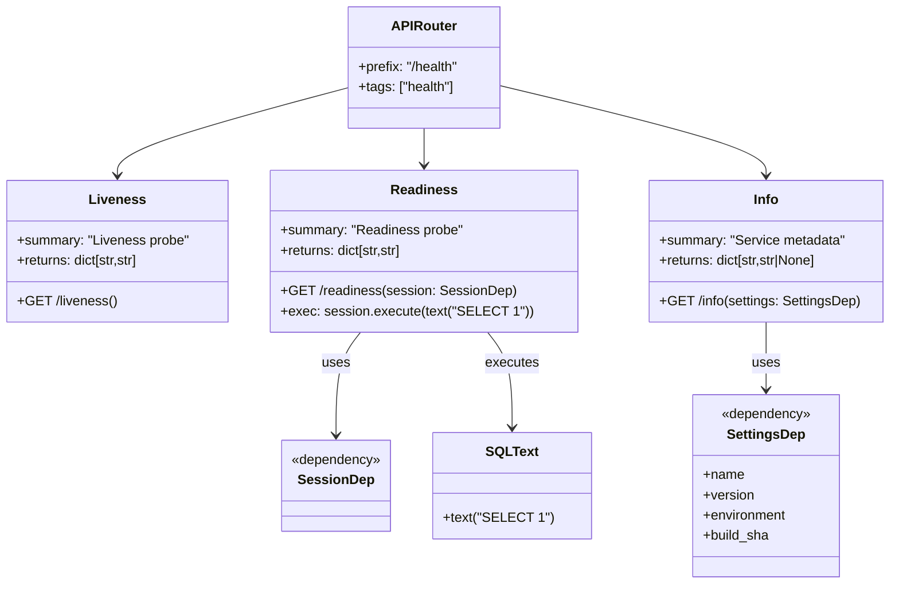

# Diagram: common/document_service/src/api/routers/health.py

> Auto-generated by Obscura crawlers

## Mermaid

### SVG

<svg id="container" width="1033.048828125" xmlns="http://www.w3.org/2000/svg" class="classDiagram" height="692" viewBox="0 0 1033.048828125 692" role="graphics-document document" aria-roledescription="class"><g><defs><marker id="container_class-aggregationStart" class="marker aggregation class" refX="18" refY="7" markerWidth="190" markerHeight="240" orient="auto"><path d="M 18,7 L9,13 L1,7 L9,1 Z"></path></marker></defs><defs><marker id="container_class-aggregationEnd" class="marker aggregation class" refX="1" refY="7" markerWidth="20" markerHeight="28" orient="auto"><path d="M 18,7 L9,13 L1,7 L9,1 Z"></path></marker></defs><defs><marker id="container_class-extensionStart" class="marker extension class" refX="18" refY="7" markerWidth="190" markerHeight="240" orient="auto"><path d="M 1,7 L18,13 V 1 Z"></path></marker></defs><defs><marker id="container_class-extensionEnd" class="marker extension class" refX="1" refY="7" markerWidth="20" markerHeight="28" orient="auto"><path d="M 1,1 V 13 L18,7 Z"></path></marker></defs><defs><marker id="container_class-compositionStart" class="marker composition class" refX="18" refY="7" markerWidth="190" markerHeight="240" orient="auto"><path d="M 18,7 L9,13 L1,7 L9,1 Z"></path></marker></defs><defs><marker id="container_class-compositionEnd" class="marker composition class" refX="1" refY="7" markerWidth="20" markerHeight="28" orient="auto"><path d="M 18,7 L9,13 L1,7 L9,1 Z"></path></marker></defs><defs><marker id="container_class-dependencyStart" class="marker dependency class" refX="6" refY="7" markerWidth="190" markerHeight="240" orient="auto"><path d="M 5,7 L9,13 L1,7 L9,1 Z"></path></marker></defs><defs><marker id="container_class-dependencyEnd" class="marker dependency class" refX="13" refY="7" markerWidth="20" markerHeight="28" orient="auto"><path d="M 18,7 L9,13 L14,7 L9,1 Z"></path></marker></defs><defs><marker id="container_class-lollipopStart" class="marker lollipop class" refX="13" refY="7" markerWidth="190" markerHeight="240" orient="auto"><circle stroke="black" fill="transparent" cx="7" cy="7" r="6"></circle></marker></defs><defs><marker id="container_class-lollipopEnd" class="marker lollipop class" refX="1" refY="7" markerWidth="190" markerHeight="240" orient="auto"><circle stroke="black" fill="transparent" cx="7" cy="7" r="6"></circle></marker></defs><g class="root"><g class="clusters"></g><g class="edgePaths"><path d="M399.969,105.13L356.317,117.108C312.665,129.087,225.362,153.043,181.71,170.188C138.059,187.333,138.059,197.667,138.059,202.833L138.059,208" id="id_APIRouter_Liveness_1" class="edge-thickness-normal edge-pattern-solid relation" style=";;;" data-edge="true" data-et="edge" data-id="id_APIRouter_Liveness_1" data-points="W3sieCI6Mzk5Ljk2ODc1LCJ5IjoxMDUuMTI5NzY2OTQzMjk5NDl9LHsieCI6MTM4LjA1ODU5Mzc1LCJ5IjoxNzd9LHsieCI6MTM4LjA1ODU5Mzc1LCJ5IjoyMTR9XQ==" marker-end="url(#container_class-dependencyEnd)"></path><path d="M491.547,152L491.547,156.167C491.547,160.333,491.547,168.667,491.547,176C491.547,183.333,491.547,189.667,491.547,192.833L491.547,196" id="id_APIRouter_Readiness_2" class="edge-thickness-normal edge-pattern-solid relation" style=";;;" data-edge="true" data-et="edge" data-id="id_APIRouter_Readiness_2" data-points="W3sieCI6NDkxLjU0Njg3NSwieSI6MTUyfSx7IngiOjQ5MS41NDY4NzUsInkiOjE3N30seyJ4Ijo0OTEuNTQ2ODc1LCJ5IjoyMDJ9XQ==" marker-end="url(#container_class-dependencyEnd)"></path><path d="M583.125,102.494L633.681,114.911C684.238,127.329,785.35,152.165,835.907,169.749C886.463,187.333,886.463,197.667,886.463,202.833L886.463,208" id="id_APIRouter_Info_3" class="edge-thickness-normal edge-pattern-solid relation" style=";;;" data-edge="true" data-et="edge" data-id="id_APIRouter_Info_3" data-points="W3sieCI6NTgzLjEyNSwieSI6MTAyLjQ5MzU4NzkzNjUxNzM2fSx7IngiOjg4Ni40NjI4OTA2MjUsInkiOjE3N30seyJ4Ijo4ODYuNDYyODkwNjI1LCJ5IjoyMTR9XQ==" marker-end="url(#container_class-dependencyEnd)"></path><path d="M418.574,394L413.887,400.167C409.199,406.333,399.824,418.667,395.137,439C390.449,459.333,390.449,487.667,390.449,501.833L390.449,516" id="id_Readiness_SessionDep_4" class="edge-thickness-normal edge-pattern-solid relation" style=";;;" data-edge="true" data-et="edge" data-id="id_Readiness_SessionDep_4" data-points="W3sieCI6NDE4LjU3NDEzMDYzOTA5Nzc1LCJ5IjozOTR9LHsieCI6MzkwLjQ0OTIxODc1LCJ5Ijo0MzF9LHsieCI6MzkwLjQ0OTIxODc1LCJ5Ijo1MjJ9XQ==" marker-end="url(#container_class-dependencyEnd)"></path><path d="M564.52,394L569.207,400.167C573.895,406.333,583.27,418.667,587.957,437.5C592.645,456.333,592.645,481.667,592.645,494.333L592.645,507" id="id_Readiness_SQLText_5" class="edge-thickness-normal edge-pattern-solid relation" style=";;;" data-edge="true" data-et="edge" data-id="id_Readiness_SQLText_5" data-points="W3sieCI6NTY0LjUxOTYxOTM2MDkwMjIsInkiOjM5NH0seyJ4Ijo1OTIuNjQ0NTMxMjUsInkiOjQzMX0seyJ4Ijo1OTIuNjQ0NTMxMjUsInkiOjUxM31d" marker-end="url(#container_class-dependencyEnd)"></path><path d="M886.463,382L886.463,390.167C886.463,398.333,886.463,414.667,886.463,428C886.463,441.333,886.463,451.667,886.463,456.833L886.463,462" id="id_Info_SettingsDep_6" class="edge-thickness-normal edge-pattern-solid relation" style=";;;" data-edge="true" data-et="edge" data-id="id_Info_SettingsDep_6" data-points="W3sieCI6ODg2LjQ2Mjg5MDYyNSwieSI6MzgyfSx7IngiOjg4Ni40NjI4OTA2MjUsInkiOjQzMX0seyJ4Ijo4ODYuNDYyODkwNjI1LCJ5Ijo0Njh9XQ==" marker-end="url(#container_class-dependencyEnd)"></path></g><g class="edgeLabels"><g class="edgeLabel"><g class="label" data-id="id_APIRouter_Liveness_1" transform="translate(0, 0)"><foreignObject width="0" height="0">

</foreignObject></g></g><g class="edgeLabel"><g class="label" data-id="id_APIRouter_Readiness_2" transform="translate(0, 0)"><foreignObject width="0" height="0">

</foreignObject></g></g><g class="edgeLabel"><g class="label" data-id="id_APIRouter_Info_3" transform="translate(0, 0)"><foreignObject width="0" height="0">

</foreignObject></g></g><g class="edgeLabel" transform="translate(390.44921875, 431)"><g class="label" data-id="id_Readiness_SessionDep_4" transform="translate(-16.4921875, -12)"><foreignObject width="32.984375" height="24">

uses

</foreignObject></g></g><g class="edgeLabel" transform="translate(592.64453125, 431)"><g class="label" data-id="id_Readiness_SQLText_5" transform="translate(-31.7265625, -12)"><foreignObject width="63.453125" height="24">

executes

</foreignObject></g></g><g class="edgeLabel" transform="translate(886.462890625, 431)"><g class="label" data-id="id_Info_SettingsDep_6" transform="translate(-16.4921875, -12)"><foreignObject width="32.984375" height="24">

uses

</foreignObject></g></g></g><g class="nodes"><g class="node default" id="classId-APIRouter-0" transform="translate(491.546875, 80)"><g class="basic label-container"><path d="M-91.578125 -72 L91.578125 -72 L91.578125 72 L-91.578125 72" stroke="none" stroke-width="0" fill="#ECECFF" style=""></path><path d="M-91.578125 -72 C-35.610924618305475 -72, 20.35627576338905 -72, 91.578125 -72 M-91.578125 -72 C-46.73255722121511 -72, -1.8869894424302203 -72, 91.578125 -72 M91.578125 -72 C91.578125 -42.41438402773278, 91.578125 -12.828768055465567, 91.578125 72 M91.578125 -72 C91.578125 -38.21235351124184, 91.578125 -4.424707022483673, 91.578125 72 M91.578125 72 C54.417099960662604 72, 17.256074921325208 72, -91.578125 72 M91.578125 72 C29.724922678125907 72, -32.128279643748186 72, -91.578125 72 M-91.578125 72 C-91.578125 38.86619422873888, -91.578125 5.732388457477754, -91.578125 -72 M-91.578125 72 C-91.578125 34.9051168142126, -91.578125 -2.1897663715748052, -91.578125 -72" stroke="#9370DB" stroke-width="1.3" fill="none" stroke-dasharray="0 0" style=""></path></g><g class="annotation-group text" transform="translate(0, -48)"></g><g class="label-group text" transform="translate(-36.5, -48)"><g class="label" style="font-weight: bolder" transform="translate(0,-12)"><foreignObject width="73" height="24">

APIRouter

</foreignObject></g></g><g class="members-group text" transform="translate(-79.578125, 0)"><g class="label" style="" transform="translate(0,-12)"><foreignObject width="122.65625" height="24">

+prefix: "/health"

</foreignObject></g><g class="label" style="" transform="translate(0,12)"><foreignObject width="115.4375" height="24">

+tags: ["health"]

</foreignObject></g></g><g class="methods-group text" transform="translate(-79.578125, 72)"></g><g class="divider" style=""><path d="M-91.578125 -24 C-20.321631714013066 -24, 50.93486157197387 -24, 91.578125 -24 M-91.578125 -24 C-42.78308344540728 -24, 6.011958109185443 -24, 91.578125 -24" stroke="#9370DB" stroke-width="1.3" fill="none" stroke-dasharray="0 0" style=""></path></g><g class="divider" style=""><path d="M-91.578125 48 C-53.637589415727575 48, -15.69705383145515 48, 91.578125 48 M-91.578125 48 C-54.83985757671219 48, -18.101590153424382 48, 91.578125 48" stroke="#9370DB" stroke-width="1.3" fill="none" stroke-dasharray="0 0" style=""></path></g></g><g class="node default" id="classId-Liveness-1" transform="translate(138.05859375, 298)"><g class="basic label-container"><path d="M-130.05859375 -84 L130.05859375 -84 L130.05859375 84 L-130.05859375 84" stroke="none" stroke-width="0" fill="#ECECFF" style=""></path><path d="M-130.05859375 -84 C-69.20523631063786 -84, -8.351878871275716 -84, 130.05859375 -84 M-130.05859375 -84 C-59.62770521643206 -84, 10.803183317135876 -84, 130.05859375 -84 M130.05859375 -84 C130.05859375 -40.62539704791402, 130.05859375 2.7492059041719585, 130.05859375 84 M130.05859375 -84 C130.05859375 -22.818164867114845, 130.05859375 38.36367026577031, 130.05859375 84 M130.05859375 84 C77.8072461209602 84, 25.555898491920388 84, -130.05859375 84 M130.05859375 84 C57.090359667612105 84, -15.877874414775789 84, -130.05859375 84 M-130.05859375 84 C-130.05859375 21.033043759122293, -130.05859375 -41.933912481755414, -130.05859375 -84 M-130.05859375 84 C-130.05859375 16.958369917378235, -130.05859375 -50.08326016524353, -130.05859375 -84" stroke="#9370DB" stroke-width="1.3" fill="none" stroke-dasharray="0 0" style=""></path></g><g class="annotation-group text" transform="translate(0, -60)"></g><g class="label-group text" transform="translate(-31.5234375, -60)"><g class="label" style="font-weight: bolder" transform="translate(0,-12)"><foreignObject width="63.046875" height="24">

Liveness

</foreignObject></g></g><g class="members-group text" transform="translate(-118.05859375, -12)"><g class="label" style="" transform="translate(0,-12)"><foreignObject width="204.59375" height="24">

+summary: "Liveness probe"

</foreignObject></g><g class="label" style="" transform="translate(0,12)"><foreignObject width="147.875" height="24">

+returns: dict[str,str]

</foreignObject></g></g><g class="methods-group text" transform="translate(-118.05859375, 60)"><g class="label" style="" transform="translate(0,-12)"><foreignObject width="116.453125" height="24">

+GET /liveness()

</foreignObject></g></g><g class="divider" style=""><path d="M-130.05859375 -36 C-29.072078693769726 -36, 71.91443636246055 -36, 130.05859375 -36 M-130.05859375 -36 C-52.95753515139573 -36, 24.143523447208537 -36, 130.05859375 -36" stroke="#9370DB" stroke-width="1.3" fill="none" stroke-dasharray="0 0" style=""></path></g><g class="divider" style=""><path d="M-130.05859375 36 C-74.67996517952164 36, -19.301336609043275 36, 130.05859375 36 M-130.05859375 36 C-61.679248877173706 36, 6.700095995652589 36, 130.05859375 36" stroke="#9370DB" stroke-width="1.3" fill="none" stroke-dasharray="0 0" style=""></path></g></g><g class="node default" id="classId-Readiness-2" transform="translate(491.546875, 298)"><g class="basic label-container"><path d="M-173.4296875 -96 L173.4296875 -96 L173.4296875 96 L-173.4296875 96" stroke="none" stroke-width="0" fill="#ECECFF" style=""></path><path d="M-173.4296875 -96 C-65.30562859045831 -96, 42.818430319083376 -96, 173.4296875 -96 M-173.4296875 -96 C-55.61495351343511 -96, 62.19978047312978 -96, 173.4296875 -96 M173.4296875 -96 C173.4296875 -34.073032456467935, 173.4296875 27.85393508706413, 173.4296875 96 M173.4296875 -96 C173.4296875 -37.287666890174705, 173.4296875 21.42466621965059, 173.4296875 96 M173.4296875 96 C61.25325675741969 96, -50.923173985160616 96, -173.4296875 96 M173.4296875 96 C73.45145950566877 96, -26.52676848866247 96, -173.4296875 96 M-173.4296875 96 C-173.4296875 39.46369935494863, -173.4296875 -17.07260129010274, -173.4296875 -96 M-173.4296875 96 C-173.4296875 37.527596417062526, -173.4296875 -20.94480716587495, -173.4296875 -96" stroke="#9370DB" stroke-width="1.3" fill="none" stroke-dasharray="0 0" style=""></path></g><g class="annotation-group text" transform="translate(0, -72)"></g><g class="label-group text" transform="translate(-37.296875, -72)"><g class="label" style="font-weight: bolder" transform="translate(0,-12)"><foreignObject width="74.59375" height="24">

Readiness

</foreignObject></g></g><g class="members-group text" transform="translate(-161.4296875, -24)"><g class="label" style="" transform="translate(0,-12)"><foreignObject width="216.375" height="24">

+summary: "Readiness probe"

</foreignObject></g><g class="label" style="" transform="translate(0,12)"><foreignObject width="147.875" height="24">

+returns: dict[str,str]

</foreignObject></g></g><g class="methods-group text" transform="translate(-161.4296875, 48)"><g class="label" style="" transform="translate(0,-12)"><foreignObject width="273.5625" height="24">

+GET /readiness(session: SessionDep)

</foreignObject></g><g class="label" style="" transform="translate(0,12)"><foreignObject width="285.5625" height="24">

+exec: session.execute(text("SELECT 1"))

</foreignObject></g></g><g class="divider" style=""><path d="M-173.4296875 -48 C-76.21439888516868 -48, 21.000889729662646 -48, 173.4296875 -48 M-173.4296875 -48 C-38.8784400603698 -48, 95.6728073792604 -48, 173.4296875 -48" stroke="#9370DB" stroke-width="1.3" fill="none" stroke-dasharray="0 0" style=""></path></g><g class="divider" style=""><path d="M-173.4296875 24 C-64.48617110607563 24, 44.45734528784874 24, 173.4296875 24 M-173.4296875 24 C-99.7111022520355 24, -25.992517004071004 24, 173.4296875 24" stroke="#9370DB" stroke-width="1.3" fill="none" stroke-dasharray="0 0" style=""></path></g></g><g class="node default" id="classId-Info-3" transform="translate(886.462890625, 298)"><g class="basic label-container"><path d="M-138.5859375 -84 L138.5859375 -84 L138.5859375 84 L-138.5859375 84" stroke="none" stroke-width="0" fill="#ECECFF" style=""></path><path d="M-138.5859375 -84 C-41.38951363704069 -84, 55.806910225918614 -84, 138.5859375 -84 M-138.5859375 -84 C-48.79434391710106 -84, 40.99724966579788 -84, 138.5859375 -84 M138.5859375 -84 C138.5859375 -40.595166516969805, 138.5859375 2.809666966060391, 138.5859375 84 M138.5859375 -84 C138.5859375 -19.310588859887545, 138.5859375 45.37882228022491, 138.5859375 84 M138.5859375 84 C57.42689302324811 84, -23.732151453503775 84, -138.5859375 84 M138.5859375 84 C29.09540084967297 84, -80.39513580065406 84, -138.5859375 84 M-138.5859375 84 C-138.5859375 35.91951713438848, -138.5859375 -12.160965731223044, -138.5859375 -84 M-138.5859375 84 C-138.5859375 41.88588064536037, -138.5859375 -0.22823870927925327, -138.5859375 -84" stroke="#9370DB" stroke-width="1.3" fill="none" stroke-dasharray="0 0" style=""></path></g><g class="annotation-group text" transform="translate(0, -60)"></g><g class="label-group text" transform="translate(-14.40625, -60)"><g class="label" style="font-weight: bolder" transform="translate(0,-12)"><foreignObject width="28.8125" height="24">

Info

</foreignObject></g></g><g class="members-group text" transform="translate(-126.5859375, -12)"><g class="label" style="" transform="translate(0,-12)"><foreignObject width="221.4375" height="24">

+summary: "Service metadata"

</foreignObject></g><g class="label" style="" transform="translate(0,12)"><foreignObject width="192.703125" height="24">

+returns: dict[str,str|None]

</foreignObject></g></g><g class="methods-group text" transform="translate(-126.5859375, 60)"><g class="label" style="" transform="translate(0,-12)"><foreignObject width="238.765625" height="24">

+GET /info(settings: SettingsDep)

</foreignObject></g></g><g class="divider" style=""><path d="M-138.5859375 -36 C-67.74743835815711 -36, 3.0910607836857764 -36, 138.5859375 -36 M-138.5859375 -36 C-70.80909163498147 -36, -3.032245769962941 -36, 138.5859375 -36" stroke="#9370DB" stroke-width="1.3" fill="none" stroke-dasharray="0 0" style=""></path></g><g class="divider" style=""><path d="M-138.5859375 36 C-72.08168567431176 36, -5.577433848623514 36, 138.5859375 36 M-138.5859375 36 C-80.31352471713053 36, -22.041111934261068 36, 138.5859375 36" stroke="#9370DB" stroke-width="1.3" fill="none" stroke-dasharray="0 0" style=""></path></g></g><g class="node default" id="classId-SessionDep-4" transform="translate(390.44921875, 576)"><g class="basic label-container"><path d="M-65.5078125 -54 L65.5078125 -54 L65.5078125 54 L-65.5078125 54" stroke="none" stroke-width="0" fill="#ECECFF" style=""></path><path d="M-65.5078125 -54 C-23.738042325724656 -54, 18.031727848550688 -54, 65.5078125 -54 M-65.5078125 -54 C-20.301533695220343 -54, 24.904745109559315 -54, 65.5078125 -54 M65.5078125 -54 C65.5078125 -17.35535155615792, 65.5078125 19.28929688768416, 65.5078125 54 M65.5078125 -54 C65.5078125 -31.428702646778014, 65.5078125 -8.857405293556027, 65.5078125 54 M65.5078125 54 C19.562232242851763 54, -26.383348014296473 54, -65.5078125 54 M65.5078125 54 C15.25434507143433 54, -34.99912235713134 54, -65.5078125 54 M-65.5078125 54 C-65.5078125 29.723015757050124, -65.5078125 5.446031514100248, -65.5078125 -54 M-65.5078125 54 C-65.5078125 22.545835515702745, -65.5078125 -8.90832896859451, -65.5078125 -54" stroke="#9370DB" stroke-width="1.3" fill="none" stroke-dasharray="0 0" style=""></path></g><g class="annotation-group text" transform="translate(-53.5078125, -30)"><g class="label" style="" transform="translate(0,-12)"><foreignObject width="107.015625" height="24">

«dependency»

</foreignObject></g></g><g class="label-group text" transform="translate(-42.609375, -6)"><g class="label" style="font-weight: bolder" transform="translate(0,-12)"><foreignObject width="85.21875" height="24">

SessionDep

</foreignObject></g></g><g class="members-group text" transform="translate(-53.5078125, 42)"></g><g class="methods-group text" transform="translate(-53.5078125, 72)"></g><g class="divider" style=""><path d="M-65.5078125 18 C-25.498330225538446 18, 14.511152048923108 18, 65.5078125 18 M-65.5078125 18 C-28.039858386757118 18, 9.428095726485765 18, 65.5078125 18" stroke="#9370DB" stroke-width="1.3" fill="none" stroke-dasharray="0 0" style=""></path></g><g class="divider" style=""><path d="M-65.5078125 36 C-34.07689687627607 36, -2.64598125255214 36, 65.5078125 36 M-65.5078125 36 C-39.037612043362856 36, -12.567411586725704 36, 65.5078125 36" stroke="#9370DB" stroke-width="1.3" fill="none" stroke-dasharray="0 0" style=""></path></g></g><g class="node default" id="classId-SettingsDep-5" transform="translate(886.462890625, 576)"><g class="basic label-container"><path d="M-88.93359375 -108 L88.93359375 -108 L88.93359375 108 L-88.93359375 108" stroke="none" stroke-width="0" fill="#ECECFF" style=""></path><path d="M-88.93359375 -108 C-26.151050503910966 -108, 36.63149274217807 -108, 88.93359375 -108 M-88.93359375 -108 C-25.43914714584883 -108, 38.05529945830234 -108, 88.93359375 -108 M88.93359375 -108 C88.93359375 -23.755209012766827, 88.93359375 60.48958197446635, 88.93359375 108 M88.93359375 -108 C88.93359375 -53.44702284161501, 88.93359375 1.1059543167699815, 88.93359375 108 M88.93359375 108 C26.193994867460873 108, -36.545604015078254 108, -88.93359375 108 M88.93359375 108 C27.33389467941091 108, -34.26580439117818 108, -88.93359375 108 M-88.93359375 108 C-88.93359375 53.31521832178444, -88.93359375 -1.3695633564311152, -88.93359375 -108 M-88.93359375 108 C-88.93359375 45.853989990007776, -88.93359375 -16.29202001998445, -88.93359375 -108" stroke="#9370DB" stroke-width="1.3" fill="none" stroke-dasharray="0 0" style=""></path></g><g class="annotation-group text" transform="translate(-53.5078125, -84)"><g class="label" style="" transform="translate(0,-12)"><foreignObject width="107.015625" height="24">

«dependency»

</foreignObject></g></g><g class="label-group text" transform="translate(-44.640625, -60)"><g class="label" style="font-weight: bolder" transform="translate(0,-12)"><foreignObject width="89.28125" height="24">

SettingsDep

</foreignObject></g></g><g class="members-group text" transform="translate(-76.93359375, -12)"><g class="label" style="" transform="translate(0,-12)"><foreignObject width="48.5" height="24">

+name

</foreignObject></g><g class="label" style="" transform="translate(0,12)"><foreignObject width="61" height="24">

+version

</foreignObject></g><g class="label" style="" transform="translate(0,36)"><foreignObject width="100.359375" height="24">

+environment

</foreignObject></g><g class="label" style="" transform="translate(0,60)"><foreignObject width="79.375" height="24">

+build_sha

</foreignObject></g></g><g class="methods-group text" transform="translate(-76.93359375, 108)"></g><g class="divider" style=""><path d="M-88.93359375 -36 C-34.839423547450366 -36, 19.254746655099268 -36, 88.93359375 -36 M-88.93359375 -36 C-49.95375593216079 -36, -10.973918114321577 -36, 88.93359375 -36" stroke="#9370DB" stroke-width="1.3" fill="none" stroke-dasharray="0 0" style=""></path></g><g class="divider" style=""><path d="M-88.93359375 84 C-49.798104117695566 84, -10.662614485391131 84, 88.93359375 84 M-88.93359375 84 C-35.233682363397 84, 18.466229023205997 84, 88.93359375 84" stroke="#9370DB" stroke-width="1.3" fill="none" stroke-dasharray="0 0" style=""></path></g></g><g class="node default" id="classId-SQLText-6" transform="translate(592.64453125, 576)"><g class="basic label-container"><path d="M-86.6875 -63 L86.6875 -63 L86.6875 63 L-86.6875 63" stroke="none" stroke-width="0" fill="#ECECFF" style=""></path><path d="M-86.6875 -63 C-29.072808344910435 -63, 28.54188331017913 -63, 86.6875 -63 M-86.6875 -63 C-30.332460688743886 -63, 26.022578622512228 -63, 86.6875 -63 M86.6875 -63 C86.6875 -34.48704684258885, 86.6875 -5.9740936851777064, 86.6875 63 M86.6875 -63 C86.6875 -22.894934347647727, 86.6875 17.210131304704547, 86.6875 63 M86.6875 63 C27.251229718631905 63, -32.18504056273619 63, -86.6875 63 M86.6875 63 C34.910160923539074 63, -16.867178152921852 63, -86.6875 63 M-86.6875 63 C-86.6875 19.029932669401163, -86.6875 -24.940134661197675, -86.6875 -63 M-86.6875 63 C-86.6875 32.725574388315735, -86.6875 2.451148776631463, -86.6875 -63" stroke="#9370DB" stroke-width="1.3" fill="none" stroke-dasharray="0 0" style=""></path></g><g class="annotation-group text" transform="translate(0, -39)"></g><g class="label-group text" transform="translate(-28.828125, -39)"><g class="label" style="font-weight: bolder" transform="translate(0,-12)"><foreignObject width="57.65625" height="24">

SQLText

</foreignObject></g></g><g class="members-group text" transform="translate(-74.6875, 9)"></g><g class="methods-group text" transform="translate(-74.6875, 39)"><g class="label" style="" transform="translate(0,-12)"><foreignObject width="120.546875" height="24">

+text("SELECT 1")

</foreignObject></g></g><g class="divider" style=""><path d="M-86.6875 -15 C-51.59493886784123 -15, -16.502377735682458 -15, 86.6875 -15 M-86.6875 -15 C-22.88313431112782 -15, 40.92123137774436 -15, 86.6875 -15" stroke="#9370DB" stroke-width="1.3" fill="none" stroke-dasharray="0 0" style=""></path></g><g class="divider" style=""><path d="M-86.6875 9 C-25.32635883984876 9, 36.03478232030248 9, 86.6875 9 M-86.6875 9 C-21.94864982099513 9, 42.79020035800974 9, 86.6875 9" stroke="#9370DB" stroke-width="1.3" fill="none" stroke-dasharray="0 0" style=""></path></g></g></g></g></g></svg>
