# Diagram: common/document_service/src/api/routers/object_to_document_association.py

> Auto-generated by Obscura crawlers

## Mermaid

```mermaid
classDiagram
    class APIRouter {
        +prefix: "/document"
        +tags: ["object_to_document_association"]
    }
    class list_documents {
        +params: GetDocumentRequest
        +accessPeriod: Optional[int|str]
        +returns: list[DocumentModel]
    }
    class associate_document_to_object {
        +objectType: str
        +objectId: str
        +payload: AssociateDocumentsForObjectRequest
        +returns: list[DocumentModel]
    }
    class replace_associations_for_object {
        +payload: ReplaceDocumentsForObjectRequest
        +returns: list[DocumentModel]
    }
    class replace_document_reference {
        +payload: AssociateDocumentsForObjectRequest
        +returns: list[DocumentModel]
    }
    class delete_document_association {
        +documentId: int|None
        +returns: None
    }
    class DocAssocServiceDep
    class DocumentServiceDep
    class AuthContext
    class GetDocumentRequest
    class DocumentModel
    class AssociateDocumentsForObjectRequest
    class ReplaceDocumentsForObjectRequest
    class to_seconds
    class BadRequestError
    class log_duration
    class logger

    APIRouter --> list_documents
    APIRouter --> associate_document_to_object
    APIRouter --> replace_associations_for_object
    APIRouter --> replace_document_reference
    APIRouter --> delete_document_association

    list_documents ..> GetDocumentRequest : depends
    list_documents --> DocAssocServiceDep : uses
    list_documents --> DocumentServiceDep : uses
    list_documents --> to_seconds : calls
    list_documents --> BadRequestError : raises
    list_documents --> DocumentModel : returns

    associate_document_to_object --> DocAssocServiceDep : uses
    associate_document_to_object --> DocumentServiceDep : uses
    associate_document_to_object --> AssociateDocumentsForObjectRequest : payload
    associate_document_to_object --> DocumentModel : returns

    replace_associations_for_object --> DocAssocServiceDep : uses
    replace_associations_for_object --> DocumentServiceDep : uses
    replace_associations_for_object --> ReplaceDocumentsForObjectRequest : payload
    replace_associations_for_object --> DocumentModel : returns

    replace_document_reference --> DocAssocServiceDep : uses
    replace_document_reference --> DocumentServiceDep : uses
    replace_document_reference --> AssociateDocumentsForObjectRequest : payload
    replace_document_reference --> DocumentModel : returns

    delete_document_association --> DocAssocServiceDep : uses
    delete_document_association --> AuthContext : requires
    associate_document_to_object --> AuthContext : requires
    list_documents --> AuthContext : requires
    replace_associations_for_object --> AuthContext : requires
    replace_document_reference --> AuthContext : requires

    log_duration <|-- list_documents
    log_duration <|-- associate_document_to_object
    log_duration <|-- replace_associations_for_object
    log_duration <|-- replace_document_reference

    logger ..> list_documents
    logger ..> associate_document_to_object
    logger ..> replace_associations_for_object
    logger ..> replace_document_reference
    logger ..> delete_document_association
```

### SVG

<svg id="container" width="3098.51953125" xmlns="http://www.w3.org/2000/svg" class="classDiagram" height="560" viewBox="0 0 3098.51953125 560" role="graphics-document document" aria-roledescription="class"><g><defs><marker id="container_class-aggregationStart" class="marker aggregation class" refX="18" refY="7" markerWidth="190" markerHeight="240" orient="auto"><path d="M 18,7 L9,13 L1,7 L9,1 Z"></path></marker></defs><defs><marker id="container_class-aggregationEnd" class="marker aggregation class" refX="1" refY="7" markerWidth="20" markerHeight="28" orient="auto"><path d="M 18,7 L9,13 L1,7 L9,1 Z"></path></marker></defs><defs><marker id="container_class-extensionStart" class="marker extension class" refX="18" refY="7" markerWidth="190" markerHeight="240" orient="auto"><path d="M 1,7 L18,13 V 1 Z"></path></marker></defs><defs><marker id="container_class-extensionEnd" class="marker extension class" refX="1" refY="7" markerWidth="20" markerHeight="28" orient="auto"><path d="M 1,1 V 13 L18,7 Z"></path></marker></defs><defs><marker id="container_class-compositionStart" class="marker composition class" refX="18" refY="7" markerWidth="190" markerHeight="240" orient="auto"><path d="M 18,7 L9,13 L1,7 L9,1 Z"></path></marker></defs><defs><marker id="container_class-compositionEnd" class="marker composition class" refX="1" refY="7" markerWidth="20" markerHeight="28" orient="auto"><path d="M 18,7 L9,13 L1,7 L9,1 Z"></path></marker></defs><defs><marker id="container_class-dependencyStart" class="marker dependency class" refX="6" refY="7" markerWidth="190" markerHeight="240" orient="auto"><path d="M 5,7 L9,13 L1,7 L9,1 Z"></path></marker></defs><defs><marker id="container_class-dependencyEnd" class="marker dependency class" refX="13" refY="7" markerWidth="20" markerHeight="28" orient="auto"><path d="M 18,7 L9,13 L14,7 L9,1 Z"></path></marker></defs><defs><marker id="container_class-lollipopStart" class="marker lollipop class" refX="13" refY="7" markerWidth="190" markerHeight="240" orient="auto"><circle stroke="black" fill="transparent" cx="7" cy="7" r="6"></circle></marker></defs><defs><marker id="container_class-lollipopEnd" class="marker lollipop class" refX="1" refY="7" markerWidth="190" markerHeight="240" orient="auto"><circle stroke="black" fill="transparent" cx="7" cy="7" r="6"></circle></marker></defs><g class="root"><g class="clusters"></g><g class="edgePaths"><path d="M318.391,152L316.673,156.167C314.955,160.333,311.518,168.667,318.975,178.476C326.431,188.286,344.781,199.571,353.955,205.214L363.13,210.857" id="id_APIRouter_list_documents_1" class="edge-thickness-normal edge-pattern-solid relation" style=";;;" data-edge="true" data-et="edge" data-id="id_APIRouter_list_documents_1" data-points="W3sieCI6MzE4LjM5MTMwOTYwMDUxNTQ2LCJ5IjoxNTJ9LHsieCI6MzA4LjA4MjAzMTI1LCJ5IjoxNzd9LHsieCI6MzY4LjI0MDQ3NjQ5NzkzMzg2LCJ5IjoyMTR9XQ==" marker-end="url(#container_class-dependencyEnd)"></path><path d="M405.04,152L408.336,156.167C411.632,160.333,418.224,168.667,523.473,187.131C628.721,205.596,832.626,234.193,934.578,248.491L1036.531,262.789" id="id_APIRouter_associate_document_to_object_2" class="edge-thickness-normal edge-pattern-solid relation" style=";;;" data-edge="true" data-et="edge" data-id="id_APIRouter_associate_document_to_object_2" data-points="W3sieCI6NDA1LjAzOTUwNTQ3NjgwNDE1LCJ5IjoxNTJ9LHsieCI6NDI0LjgxNjQwNjI1LCJ5IjoxNzd9LHsieCI6MTA0Mi40NzI2NTYyNSwieSI6MjYzLjYyMjI2NzA5NDY2NTN9XQ==" marker-end="url(#container_class-dependencyEnd)"></path><path d="M419.885,152L424.04,156.167C428.195,160.333,436.506,168.667,629.317,189.384C822.129,210.101,1199.441,243.202,1388.097,259.753L1576.753,276.303" id="id_APIRouter_replace_associations_for_object_3" class="edge-thickness-normal edge-pattern-solid relation" style=";;;" data-edge="true" data-et="edge" data-id="id_APIRouter_replace_associations_for_object_3" data-points="W3sieCI6NDE5Ljg4NDg2NjMwMTU0NjM3LCJ5IjoxNTJ9LHsieCI6NDQ0LjgxNjQwNjI1LCJ5IjoxNzd9LHsieCI6MTU4Mi43MzA0Njg3NSwieSI6Mjc2LjgyNzU5NTg3NTI2MDl9XQ==" marker-end="url(#container_class-dependencyEnd)"></path><path d="M434.73,152L439.745,156.167C444.759,160.333,454.788,168.667,733.903,190.362C1013.018,212.057,1561.22,247.114,1835.321,264.643L2109.422,282.171" id="id_APIRouter_replace_document_reference_4" class="edge-thickness-normal edge-pattern-solid relation" style=";;;" data-edge="true" data-et="edge" data-id="id_APIRouter_replace_document_reference_4" data-points="W3sieCI6NDM0LjczMDIyNzEyNjI4ODY0LCJ5IjoxNTJ9LHsieCI6NDY0LjgxNjQwNjI1LCJ5IjoxNzd9LHsieCI6MjExNS40MTAxNTYyNSwieSI6MjgyLjU1NDAzNjU2MTgyNTh9XQ==" marker-end="url(#container_class-dependencyEnd)"></path><path d="M449.576,152L455.449,156.167C461.323,160.333,473.069,168.667,861.938,191.711C1250.806,214.756,2016.795,252.512,2399.79,271.39L2782.785,290.268" id="id_APIRouter_delete_document_association_5" class="edge-thickness-normal edge-pattern-solid relation" style=";;;" data-edge="true" data-et="edge" data-id="id_APIRouter_delete_document_association_5" data-points="W3sieCI6NDQ5LjU3NTU4Nzk1MTAzMDksInkiOjE1Mn0seyJ4Ijo0ODQuODE2NDA2MjUsInkiOjE3N30seyJ4IjoyNzg4Ljc3NzM0Mzc1LCJ5IjoyOTAuNTYzNDgyMDk5MjM5OX1d" marker-end="url(#container_class-dependencyEnd)"></path><path d="M350.508,348.664L308.712,362.387C266.917,376.109,183.326,403.555,141.53,422.444C99.734,441.333,99.734,451.667,99.734,456.833L99.734,462" id="id_list_documents_GetDocumentRequest_6" class="edge-thickness-normal edge-pattern-dashed relation" style=";;;" data-edge="true" data-et="edge" data-id="id_list_documents_GetDocumentRequest_6" data-points="W3sieCI6MzUwLjUwNzgxMjUsInkiOjM0OC42NjM5MTgzODA3MjkyfSx7IngiOjk5LjczNDM3NSwieSI6NDMxfSx7IngiOjk5LjczNDM3NSwieSI6NDY4fV0=" marker-end="url(#container_class-dependencyEnd)"></path><path d="M391.322,382L380.288,390.167C369.254,398.333,347.186,414.667,497.18,434.837C647.174,455.007,969.23,479.013,1130.258,491.017L1291.286,503.02" id="id_list_documents_DocAssocServiceDep_7" class="edge-thickness-normal edge-pattern-solid relation" style=";;;" data-edge="true" data-et="edge" data-id="id_list_documents_DocAssocServiceDep_7" data-points="W3sieCI6MzkxLjMyMjE2MjgyODk0NzQsInkiOjM4Mn0seyJ4IjozMjUuMTE3MTg3NSwieSI6NDMxfSx7IngiOjEyOTcuMjY5NTMxMjUsInkiOjUwMy40NjU5NDg2NzE0NTA4Nn1d" marker-end="url(#container_class-dependencyEnd)"></path><path d="M424.786,382L417.005,390.167C409.225,398.333,393.663,414.667,492.618,434.282C591.573,453.897,805.044,476.794,911.779,488.243L1018.515,499.692" id="id_list_documents_DocumentServiceDep_8" class="edge-thickness-normal edge-pattern-solid relation" style=";;;" data-edge="true" data-et="edge" data-id="id_list_documents_DocumentServiceDep_8" data-points="W3sieCI6NDI0Ljc4NTk3ODYxODQyMTA0LCJ5IjozODJ9LHsieCI6Mzc4LjEwMTU2MjUsInkiOjQzMX0seyJ4IjoxMDI0LjQ4MDQ2ODc1LCJ5Ijo1MDAuMzMxNDA0NTY4NTczN31d" marker-end="url(#container_class-dependencyEnd)"></path><path d="M464.97,382L461.096,390.167C457.222,398.333,449.474,414.667,430.946,430.723C412.417,446.78,383.108,462.56,368.453,470.449L353.799,478.339" id="id_list_documents_to_seconds_9" class="edge-thickness-normal edge-pattern-solid relation" style=";;;" data-edge="true" data-et="edge" data-id="id_list_documents_to_seconds_9" data-points="W3sieCI6NDY0Ljk3MDE4OTE0NDczNjgsInkiOjM4Mn0seyJ4Ijo0NDEuNzI2NTYyNSwieSI6NDMxfSx7IngiOjM0OC41MTU2MjUsInkiOjQ4MS4xODM2MzMyNjU4OTI4N31d" marker-end="url(#container_class-dependencyEnd)"></path><path d="M577.268,382L584.312,390.167C591.356,398.333,605.443,414.667,601.292,428.861C597.141,443.055,574.751,455.109,563.556,461.136L552.361,467.164" id="id_list_documents_BadRequestError_10" class="edge-thickness-normal edge-pattern-solid relation" style=";;;" data-edge="true" data-et="edge" data-id="id_list_documents_BadRequestError_10" data-points="W3sieCI6NTc3LjI2Nzg4NjUxMzE1NzksInkiOjM4Mn0seyJ4Ijo2MTkuNTMxMjUsInkiOjQzMX0seyJ4Ijo1NDcuMDc4MTI1LCJ5Ijo0NzAuMDA3ODc5ODg0OTk2Mjd9XQ==" marker-end="url(#container_class-dependencyEnd)"></path><path d="M619.909,382L631.099,390.167C642.289,398.333,664.668,414.667,829.859,434.98C995.05,455.293,1303.054,479.585,1457.056,491.732L1611.058,503.878" id="id_list_documents_DocumentModel_11" class="edge-thickness-normal edge-pattern-solid relation" style=";;;" data-edge="true" data-et="edge" data-id="id_list_documents_DocumentModel_11" data-points="W3sieCI6NjE5LjkwOTMzMzg4MTU3OSwieSI6MzgyfSx7IngiOjY4Ny4wNDY4NzUsInkiOjQzMX0seyJ4IjoxNjE3LjAzOTA2MjUsInkiOjUwNC4zNDk2MTY2NDE1Nzc0fV0=" marker-end="url(#container_class-dependencyEnd)"></path><path d="M1042.473,369.169L1006.979,379.474C971.484,389.779,900.496,410.39,941.972,431.643C983.448,452.896,1137.389,474.792,1214.359,485.739L1291.329,496.687" id="id_associate_document_to_object_DocAssocServiceDep_12" class="edge-thickness-normal edge-pattern-solid relation" style=";;;" data-edge="true" data-et="edge" data-id="id_associate_document_to_object_DocAssocServiceDep_12" data-points="W3sieCI6MTA0Mi40NzI2NTYyNSwieSI6MzY5LjE2OTE1Mzc2MjE5Mzl9LHsieCI6ODI5LjUwNzgxMjUsInkiOjQzMX0seyJ4IjoxMjk3LjI2OTUzMTI1LCJ5Ijo0OTcuNTMyMTkzNTE5ODAxNH1d" marker-end="url(#container_class-dependencyEnd)"></path><path d="M1067.558,394L1053.424,400.167C1039.289,406.333,1011.019,418.667,1006.321,430.486C1001.622,442.306,1020.494,453.611,1029.929,459.264L1039.365,464.917" id="id_associate_document_to_object_DocumentServiceDep_13" class="edge-thickness-normal edge-pattern-solid relation" style=";;;" data-edge="true" data-et="edge" data-id="id_associate_document_to_object_DocumentServiceDep_13" data-points="W3sieCI6MTA2Ny41NTgzMjk0MTcyOTMyLCJ5IjozOTR9LHsieCI6OTgyLjc1LCJ5Ijo0MzF9LHsieCI6MTA0NC41MTI0MTA5OTY4MzUzLCJ5Ijo0Njh9XQ==" marker-end="url(#container_class-dependencyEnd)"></path><path d="M1348.092,394L1351.978,400.167C1355.864,406.333,1363.635,418.667,1439.682,434.461C1515.729,450.255,1660.051,469.51,1732.212,479.138L1804.373,488.765" id="id_associate_document_to_object_AssociateDocumentsForObjectRequest_14" class="edge-thickness-normal edge-pattern-solid relation" style=";;;" data-edge="true" data-et="edge" data-id="id_associate_document_to_object_AssociateDocumentsForObjectRequest_14" data-points="W3sieCI6MTM0OC4wOTIxNjQwMDM3NTkzLCJ5IjozOTR9LHsieCI6MTM3MS40MDYyNSwieSI6NDMxfSx7IngiOjE4MTAuMzIwMzEyNSwieSI6NDg5LjU1ODkzNzYxODc0NjAzfV0=" marker-end="url(#container_class-dependencyEnd)"></path><path d="M1402.329,394L1409.699,400.167C1417.068,406.333,1431.808,418.667,1466.642,433.794C1501.476,448.922,1556.406,466.843,1583.87,475.804L1611.335,484.765" id="id_associate_document_to_object_DocumentModel_15" class="edge-thickness-normal edge-pattern-solid relation" style=";;;" data-edge="true" data-et="edge" data-id="id_associate_document_to_object_DocumentModel_15" data-points="W3sieCI6MTQwMi4zMjkwMDYxMDkwMjI3LCJ5IjozOTR9LHsieCI6MTQ0Ni41NDY4NzUsInkiOjQzMX0seyJ4IjoxNjE3LjAzOTA2MjUsInkiOjQ4Ni42MjYwMTIzMjUzNjM4fV0=" marker-end="url(#container_class-dependencyEnd)"></path><path d="M1696.818,370L1678.85,380.167C1660.882,390.333,1624.945,410.667,1588.505,427.984C1552.064,445.301,1515.121,459.602,1496.649,466.752L1478.177,473.902" id="id_replace_associations_for_object_DocAssocServiceDep_16" class="edge-thickness-normal edge-pattern-solid relation" style=";;;" data-edge="true" data-et="edge" data-id="id_replace_associations_for_object_DocAssocServiceDep_16" data-points="W3sieCI6MTY5Ni44MTg0MzI4MDA3NTIsInkiOjM3MH0seyJ4IjoxNTg5LjAwNzgxMjUsInkiOjQzMX0seyJ4IjoxNDcyLjU4MjAzMTI1LCJ5Ijo0NzYuMDY4MzMxODk3Nzg5M31d" marker-end="url(#container_class-dependencyEnd)"></path><path d="M1775.004,370L1768.075,380.167C1761.147,390.333,1747.29,410.667,1653.242,431.955C1559.194,453.244,1384.953,475.488,1297.833,486.61L1210.713,497.732" id="id_replace_associations_for_object_DocumentServiceDep_17" class="edge-thickness-normal edge-pattern-solid relation" style=";;;" data-edge="true" data-et="edge" data-id="id_replace_associations_for_object_DocumentServiceDep_17" data-points="W3sieCI6MTc3NS4wMDM4MTgxMzkwOTc4LCJ5IjozNzB9LHsieCI6MTczMy40MzM1OTM3NSwieSI6NDMxfSx7IngiOjEyMDQuNzYxNzE4NzUsInkiOjQ5OC40OTIyOTg3NTc3MDEyM31d" marker-end="url(#container_class-dependencyEnd)"></path><path d="M1814.286,370L1812.904,380.167C1811.523,390.333,1808.759,410.667,1866.514,430.032C1924.269,449.397,2042.541,467.794,2101.677,476.993L2160.813,486.191" id="id_replace_associations_for_object_ReplaceDocumentsForObjectRequest_18" class="edge-thickness-normal edge-pattern-solid relation" style=";;;" data-edge="true" data-et="edge" data-id="id_replace_associations_for_object_ReplaceDocumentsForObjectRequest_18" data-points="W3sieCI6MTgxNC4yODU3NzMwMjYzMTU4LCJ5IjozNzB9LHsieCI6MTgwNS45OTYwOTM3NSwieSI6NDMxfSx7IngiOjIxNjYuNzQyMTg3NSwieSI6NDg3LjExMzY1NDM2ODI3NDl9XQ==" marker-end="url(#container_class-dependencyEnd)"></path><path d="M1854.963,370L1859.326,380.167C1863.688,390.333,1872.412,410.667,1857.564,428.719C1842.715,446.771,1804.293,462.543,1785.082,470.429L1765.871,478.314" id="id_replace_associations_for_object_DocumentModel_19" class="edge-thickness-normal edge-pattern-solid relation" style=";;;" data-edge="true" data-et="edge" data-id="id_replace_associations_for_object_DocumentModel_19" data-points="W3sieCI6MTg1NC45NjM0MDQ2MDUyNjMxLCJ5IjozNzB9LHsieCI6MTg4MS4xMzY3MTg3NSwieSI6NDMxfSx7IngiOjE3NjAuMzIwMzEyNSwieSI6NDgwLjU5Mjg2NzcyNjE1NjR9XQ==" marker-end="url(#container_class-dependencyEnd)"></path><path d="M2230.666,370L2212.835,380.167C2195.004,390.333,2159.342,410.667,2033.989,432.331C1908.636,453.996,1693.592,476.992,1586.07,488.49L1478.548,499.988" id="id_replace_document_reference_DocAssocServiceDep_20" class="edge-thickness-normal edge-pattern-solid relation" style=";;;" data-edge="true" data-et="edge" data-id="id_replace_document_reference_DocAssocServiceDep_20" data-points="W3sieCI6MjIzMC42NjYxNzcxNjE2NTQsInkiOjM3MH0seyJ4IjoyMTIzLjY3OTY4NzUsInkiOjQzMX0seyJ4IjoxNDcyLjU4MjAzMTI1LCJ5Ijo1MDAuNjI2MzE4NjAwMjYxMn1d" marker-end="url(#container_class-dependencyEnd)"></path><path d="M2259.349,370L2245.569,380.167C2231.788,390.333,2204.226,410.667,2029.458,432.808C1854.691,454.95,1532.718,478.9,1371.732,490.875L1210.745,502.85" id="id_replace_document_reference_DocumentServiceDep_21" class="edge-thickness-normal edge-pattern-solid relation" style=";;;" data-edge="true" data-et="edge" data-id="id_replace_document_reference_DocumentServiceDep_21" data-points="W3sieCI6MjI1OS4zNDk0NDc4MzgzNDYsInkiOjM3MH0seyJ4IjoyMTc2LjY2NDA2MjUsInkiOjQzMX0seyJ4IjoxMjA0Ljc2MTcxODc1LCJ5Ijo1MDMuMjk0ODk1MjMwNjY5MDZ9XQ==" marker-end="url(#container_class-dependencyEnd)"></path><path d="M2294.736,370L2285.952,380.167C2277.168,390.333,2259.6,410.667,2230.038,426.727C2200.476,442.788,2158.922,454.575,2138.144,460.469L2117.367,466.363" id="id_replace_document_reference_AssociateDocumentsForObjectRequest_22" class="edge-thickness-normal edge-pattern-solid relation" style=";;;" data-edge="true" data-et="edge" data-id="id_replace_document_reference_AssociateDocumentsForObjectRequest_22" data-points="W3sieCI6MjI5NC43MzYxOTU5NTg2NDY1LCJ5IjozNzB9LHsieCI6MjI0Mi4wMzEyNSwieSI6NDMxfSx7IngiOjIxMTEuNTk0NTQxMTM5MjQwNCwieSI6NDY4fV0=" marker-end="url(#container_class-dependencyEnd)"></path><path d="M2364.228,370L2365.257,380.167C2366.285,390.333,2368.342,410.667,2268.684,432.501C2169.026,454.336,1967.653,477.672,1866.967,489.339L1766.28,501.007" id="id_replace_document_reference_DocumentModel_23" class="edge-thickness-normal edge-pattern-solid relation" style=";;;" data-edge="true" data-et="edge" data-id="id_replace_document_reference_DocumentModel_23" data-points="W3sieCI6MjM2NC4yMjgyMDcyMzY4NDIsInkiOjM3MH0seyJ4IjoyMzcwLjM5ODQzNzUsInkiOjQzMX0seyJ4IjoxNzYwLjMyMDMxMjUsInkiOjUwMS42OTgwMjg4NzkyMTE1Nn1d" marker-end="url(#container_class-dependencyEnd)"></path><path d="M2788.777,359.115L2759.201,371.096C2729.625,383.077,2670.473,407.038,2452.105,431.181C2233.737,455.323,1856.153,479.645,1667.361,491.806L1478.57,503.968" id="id_delete_document_association_DocAssocServiceDep_24" class="edge-thickness-normal edge-pattern-solid relation" style=";;;" data-edge="true" data-et="edge" data-id="id_delete_document_association_DocAssocServiceDep_24" data-points="W3sieCI6Mjc4OC43NzczNDM3NSwieSI6MzU5LjExNTI1MDA4MzI4MTh9LHsieCI6MjYxMS4zMjAzMTI1LCJ5Ijo0MzF9LHsieCI6MTQ3Mi41ODIwMzEyNSwieSI6NTA0LjM1MzQ5NDI2ODMyMzM1fV0=" marker-end="url(#container_class-dependencyEnd)"></path><path d="M2939.648,370L2939.648,380.167C2939.648,390.333,2939.648,410.667,2888.244,431.766C2836.839,452.864,2734.03,474.729,2682.625,485.661L2631.22,496.593" id="id_delete_document_association_AuthContext_25" class="edge-thickness-normal edge-pattern-solid relation" style=";;;" data-edge="true" data-et="edge" data-id="id_delete_document_association_AuthContext_25" data-points="W3sieCI6MjkzOS42NDg0Mzc1LCJ5IjozNzB9LHsieCI6MjkzOS42NDg0Mzc1LCJ5Ijo0MzF9LHsieCI6MjYyNS4zNTE1NjI1LCJ5Ijo0OTcuODQxMjk3MjE1NDQ1NH1d" marker-end="url(#container_class-dependencyEnd)"></path><path d="M1457.271,394L1468.17,400.167C1479.069,406.333,1500.866,418.667,1675.492,437.205C1850.118,455.743,2177.571,480.485,2341.298,492.857L2505.025,505.228" id="id_associate_document_to_object_AuthContext_26" class="edge-thickness-normal edge-pattern-solid relation" style=";;;" data-edge="true" data-et="edge" data-id="id_associate_document_to_object_AuthContext_26" data-points="W3sieCI6MTQ1Ny4yNzA3MzU0MzIzMzA5LCJ5IjozOTR9LHsieCI6MTUyMi42NjQwNjI1LCJ5Ijo0MzF9LHsieCI6MjUxMS4wMDc4MTI1LCJ5Ijo1MDUuNjgwMDQ3MjI1NTAxNzd9XQ==" marker-end="url(#container_class-dependencyEnd)"></path><path d="M659.125,377.44L676.465,386.366C693.805,395.293,728.484,413.147,1036.132,434.779C1343.781,456.412,1924.397,481.824,2214.705,494.53L2505.014,507.235" id="id_list_documents_AuthContext_27" class="edge-thickness-normal edge-pattern-solid relation" style=";;;" data-edge="true" data-et="edge" data-id="id_list_documents_AuthContext_27" data-points="W3sieCI6NjU5LjEyNSwieSI6Mzc3LjQzOTYzMjg4MzI1NzQ1fSx7IngiOjc2My4xNjQwNjI1LCJ5Ijo0MzF9LHsieCI6MjUxMS4wMDc4MTI1LCJ5Ijo1MDcuNDk3NzYyMzExNjE0MzR9XQ==" marker-end="url(#container_class-dependencyEnd)"></path><path d="M1950.349,370L1968.181,380.167C1986.012,390.333,2021.674,410.667,2114.129,432.374C2206.583,454.081,2355.831,477.161,2430.455,488.701L2505.078,500.242" id="id_replace_associations_for_object_AuthContext_28" class="edge-thickness-normal edge-pattern-solid relation" style=";;;" data-edge="true" data-et="edge" data-id="id_replace_associations_for_object_AuthContext_28" data-points="W3sieCI6MTk1MC4zNDk0NDc4MzgzNDYsInkiOjM3MH0seyJ4IjoyMDU3LjMzNTkzNzUsInkiOjQzMX0seyJ4IjoyNTExLjAwNzgxMjUsInkiOjUwMS4xNTg1OTE3OTA1NDI2M31d" marker-end="url(#container_class-dependencyEnd)"></path><path d="M2458.737,370L2473.11,380.167C2487.483,390.333,2516.23,410.667,2532.133,426.041C2548.035,441.414,2551.094,451.829,2552.624,457.036L2554.153,462.243" id="id_replace_document_reference_AuthContext_29" class="edge-thickness-normal edge-pattern-solid relation" style=";;;" data-edge="true" data-et="edge" data-id="id_replace_document_reference_AuthContext_29" data-points="W3sieCI6MjQ1OC43MzY2NjU4ODM0NTg1LCJ5IjozNzB9LHsieCI6MjU0NC45NzY1NjI1LCJ5Ijo0MzF9LHsieCI6MjU1NS44NDM4NDg4OTI0MDUzLCJ5Ijo0Njh9XQ==" marker-end="url(#container_class-dependencyEnd)"></path><path d="M1454.776,87.184L1296.449,102.153C1138.123,117.122,821.47,147.061,663.143,168.197C504.816,189.333,504.816,201.667,504.816,207.833L504.816,214" id="id_log_duration_list_documents_30" class="edge-thickness-normal edge-pattern-solid relation" style=";;;" data-edge="true" data-et="edge" data-id="id_log_duration_list_documents_30" data-points="W3sieCI6MTQ3MS45NDkyMTg3NSwieSI6ODUuNTU5ODQ2MTc3Mjc2ODh9LHsieCI6NTA0LjgxNjQwNjI1LCJ5IjoxNzd9LHsieCI6NTA0LjgxNjQwNjI1LCJ5IjoyMTR9XQ==" marker-start="url(#container_class-extensionStart)"></path><path d="M1455.927,109.85L1427.873,121.042C1399.819,132.234,1343.71,154.617,1315.656,169.975C1287.602,185.333,1287.602,193.667,1287.602,197.833L1287.602,202" id="id_log_duration_associate_document_to_object_31" class="edge-thickness-normal edge-pattern-solid relation" style=";;;" data-edge="true" data-et="edge" data-id="id_log_duration_associate_document_to_object_31" data-points="W3sieCI6MTQ3MS45NDkyMTg3NSwieSI6MTAzLjQ1ODc2OTA5NzMwNTg5fSx7IngiOjEyODcuNjAxNTYyNSwieSI6MTc3fSx7IngiOjEyODcuNjAxNTYyNSwieSI6MjAyfV0=" marker-start="url(#container_class-extensionStart)"></path><path d="M1605.936,104.863L1642.292,116.886C1678.648,128.909,1751.359,152.954,1787.715,173.144C1824.07,193.333,1824.07,209.667,1824.07,217.833L1824.07,226" id="id_log_duration_replace_associations_for_object_32" class="edge-thickness-normal edge-pattern-solid relation" style=";;;" data-edge="true" data-et="edge" data-id="id_log_duration_replace_associations_for_object_32" data-points="W3sieCI6MTU4OS41NTg1OTM3NSwieSI6OTkuNDQ2NzYzMTc0MzY2NDJ9LHsieCI6MTgyNC4wNzAzMTI1LCJ5IjoxNzd9LHsieCI6MTgyNC4wNzAzMTI1LCJ5IjoyMjZ9XQ==" marker-start="url(#container_class-extensionStart)"></path><path d="M1606.691,88.915L1731.733,103.596C1856.776,118.277,2106.861,147.638,2231.903,170.486C2356.945,193.333,2356.945,209.667,2356.945,217.833L2356.945,226" id="id_log_duration_replace_document_reference_33" class="edge-thickness-normal edge-pattern-solid relation" style=";;;" data-edge="true" data-et="edge" data-id="id_log_duration_replace_document_reference_33" data-points="W3sieCI6MTU4OS41NTg1OTM3NSwieSI6ODYuOTA0MDM1MzY1NTk0Mn0seyJ4IjoyMzU2Ljk0NTMxMjUsInkiOjE3N30seyJ4IjoyMzU2Ljk0NTMxMjUsInkiOjIyNn1d" marker-start="url(#container_class-extensionStart)"></path><path d="M2724.078,96.2L2694.757,109.667C2665.435,123.133,2606.792,150.067,2263.631,182.118C1920.47,214.169,1292.792,251.338,978.953,269.923L665.115,288.508" id="id_logger_list_documents_34" class="edge-thickness-normal edge-pattern-dashed relation" style=";;;" data-edge="true" data-et="edge" data-id="id_logger_list_documents_34" data-points="W3sieCI6MjcyNC4wNzgxMjUsInkiOjk2LjIwMDE1NTM1OTkxNzE1fSx7IngiOjI1NDguMTQ4NDM3NSwieSI6MTc3fSx7IngiOjY1OS4xMjUsInkiOjI4OC44NjIzMDc0NjczMTQ2fV0=" marker-end="url(#container_class-dependencyEnd)"></path><path d="M2724.078,97.895L2698.09,111.079C2672.102,124.263,2620.125,150.632,2422.563,180.028C2225,209.424,1881.852,241.849,1710.278,258.061L1538.704,274.273" id="id_logger_associate_document_to_object_35" class="edge-thickness-normal edge-pattern-dashed relation" style=";;;" data-edge="true" data-et="edge" data-id="id_logger_associate_document_to_object_35" data-points="W3sieCI6MjcyNC4wNzgxMjUsInkiOjk3Ljg5NDcwNDU4NDQ1Njk3fSx7IngiOjI1NjguMTQ4NDM3NSwieSI6MTc3fSx7IngiOjE1MzIuNzMwNDY4NzUsInkiOjI3NC44Mzc1NTQxNDU1Njc3fV0=" marker-end="url(#container_class-dependencyEnd)"></path><path d="M2724.078,99.985L2701.423,112.821C2678.768,125.657,2633.458,151.328,2524.668,177.805C2415.878,204.281,2243.607,231.562,2157.472,245.202L2071.336,258.843" id="id_logger_replace_associations_for_object_36" class="edge-thickness-normal edge-pattern-dashed relation" style=";;;" data-edge="true" data-et="edge" data-id="id_logger_replace_associations_for_object_36" data-points="W3sieCI6MjcyNC4wNzgxMjUsInkiOjk5Ljk4NTE2OTI5ODE2NTU2fSx7IngiOjI1ODguMTQ4NDM3NSwieSI6MTc3fSx7IngiOjIwNjUuNDEwMTU2MjUsInkiOjI1OS43ODEyMzY1ODAwMjkwM31d" marker-end="url(#container_class-dependencyEnd)"></path><path d="M2724.078,102.629L2704.757,115.024C2685.435,127.419,2646.792,152.21,2611.417,172.337C2576.041,192.465,2543.934,207.931,2527.881,215.664L2511.827,223.396" id="id_logger_replace_document_reference_37" class="edge-thickness-normal edge-pattern-dashed relation" style=";;;" data-edge="true" data-et="edge" data-id="id_logger_replace_document_reference_37" data-points="W3sieCI6MjcyNC4wNzgxMjUsInkiOjEwMi42Mjg2NTU1NzUwNzQ5Mn0seyJ4IjoyNjA4LjE0ODQzNzUsInkiOjE3N30seyJ4IjoyNTA2LjQyMTU1MjE2OTQyMTQsInkiOjIyNn1d" marker-end="url(#container_class-dependencyEnd)"></path><path d="M2794.625,98.977L2818.796,111.981C2842.966,124.985,2891.307,150.992,2915.478,171.163C2939.648,191.333,2939.648,205.667,2939.648,212.833L2939.648,220" id="id_logger_delete_document_association_38" class="edge-thickness-normal edge-pattern-dashed relation" style=";;;" data-edge="true" data-et="edge" data-id="id_logger_delete_document_association_38" data-points="W3sieCI6Mjc5NC42MjUsInkiOjk4Ljk3NzE2NDM5ODk5NDcyfSx7IngiOjI5MzkuNjQ4NDM3NSwieSI6MTc3fSx7IngiOjI5MzkuNjQ4NDM3NSwieSI6MjI2fV0=" marker-end="url(#container_class-dependencyEnd)"></path></g><g class="edgeLabels"><g class="edgeLabel"><g class="label" data-id="id_APIRouter_list_documents_1" transform="translate(0, 0)"><foreignObject width="0" height="0">

</foreignObject></g></g><g class="edgeLabel"><g class="label" data-id="id_APIRouter_associate_document_to_object_2" transform="translate(0, 0)"><foreignObject width="0" height="0">

</foreignObject></g></g><g class="edgeLabel"><g class="label" data-id="id_APIRouter_replace_associations_for_object_3" transform="translate(0, 0)"><foreignObject width="0" height="0">

</foreignObject></g></g><g class="edgeLabel"><g class="label" data-id="id_APIRouter_replace_document_reference_4" transform="translate(0, 0)"><foreignObject width="0" height="0">

</foreignObject></g></g><g class="edgeLabel"><g class="label" data-id="id_APIRouter_delete_document_association_5" transform="translate(0, 0)"><foreignObject width="0" height="0">

</foreignObject></g></g><g class="edgeLabel" transform="translate(99.734375, 431)"><g class="label" data-id="id_list_documents_GetDocumentRequest_6" transform="translate(-31.46875, -12)"><foreignObject width="62.9375" height="24">

depends

</foreignObject></g></g><g class="edgeLabel" transform="translate(770.12448, 464.17163)"><g class="label" data-id="id_list_documents_DocAssocServiceDep_7" transform="translate(-16.4921875, -12)"><foreignObject width="32.984375" height="24">

uses

</foreignObject></g></g><g class="edgeLabel" transform="translate(667.64456, 462.05674)"><g class="label" data-id="id_list_documents_DocumentServiceDep_8" transform="translate(-16.4921875, -12)"><foreignObject width="32.984375" height="24">

uses

</foreignObject></g></g><g class="edgeLabel" transform="translate(441.7265625, 431)"><g class="label" data-id="id_list_documents_to_seconds_9" transform="translate(-16.4453125, -12)"><foreignObject width="32.890625" height="24">

calls

</foreignObject></g></g><g class="edgeLabel" transform="translate(611.79255, 435.16642)"><g class="label" data-id="id_list_documents_BadRequestError_10" transform="translate(-21.25, -12)"><foreignObject width="42.5" height="24">

raises

</foreignObject></g></g><g class="edgeLabel" transform="translate(1110.61309, 464.40718)"><g class="label" data-id="id_list_documents_DocumentModel_11" transform="translate(-26.265625, -12)"><foreignObject width="52.53125" height="24">

returns

</foreignObject></g></g><g class="edgeLabel" transform="translate(953.614, 448.65227)"><g class="label" data-id="id_associate_document_to_object_DocAssocServiceDep_12" transform="translate(-16.4921875, -12)"><foreignObject width="32.984375" height="24">

uses

</foreignObject></g></g><g class="edgeLabel" transform="translate(992.159, 426.89506)"><g class="label" data-id="id_associate_document_to_object_DocumentServiceDep_13" transform="translate(-16.4921875, -12)"><foreignObject width="32.984375" height="24">

uses

</foreignObject></g></g><g class="edgeLabel" transform="translate(1569.189, 457.38773)"><g class="label" data-id="id_associate_document_to_object_AssociateDocumentsForObjectRequest_14" transform="translate(-28.875, -12)"><foreignObject width="57.75" height="24">

payload

</foreignObject></g></g><g class="edgeLabel" transform="translate(1504.38676, 449.87126)"><g class="label" data-id="id_associate_document_to_object_DocumentModel_15" transform="translate(-26.265625, -12)"><foreignObject width="52.53125" height="24">

returns

</foreignObject></g></g><g class="edgeLabel" transform="translate(1589.0078125, 431)"><g class="label" data-id="id_replace_associations_for_object_DocAssocServiceDep_16" transform="translate(-16.4921875, -12)"><foreignObject width="32.984375" height="24">

uses

</foreignObject></g></g><g class="edgeLabel" transform="translate(1505.70947, 460.07214)"><g class="label" data-id="id_replace_associations_for_object_DocumentServiceDep_17" transform="translate(-16.4921875, -12)"><foreignObject width="32.984375" height="24">

uses

</foreignObject></g></g><g class="edgeLabel" transform="translate(1955.95454, 454.32587)"><g class="label" data-id="id_replace_associations_for_object_ReplaceDocumentsForObjectRequest_18" transform="translate(-28.875, -12)"><foreignObject width="57.75" height="24">

payload

</foreignObject></g></g><g class="edgeLabel" transform="translate(1851.43152, 443.19342)"><g class="label" data-id="id_replace_associations_for_object_DocumentModel_19" transform="translate(-26.265625, -12)"><foreignObject width="52.53125" height="24">

returns

</foreignObject></g></g><g class="edgeLabel" transform="translate(1859.35918, 459.2656)"><g class="label" data-id="id_replace_document_reference_DocAssocServiceDep_20" transform="translate(-16.4921875, -12)"><foreignObject width="32.984375" height="24">

uses

</foreignObject></g></g><g class="edgeLabel" transform="translate(1741.9471, 463.33639)"><g class="label" data-id="id_replace_document_reference_DocumentServiceDep_21" transform="translate(-16.4921875, -12)"><foreignObject width="32.984375" height="24">

uses

</foreignObject></g></g><g class="edgeLabel" transform="translate(2215.59057, 438.50023)"><g class="label" data-id="id_replace_document_reference_AssociateDocumentsForObjectRequest_22" transform="translate(-28.875, -12)"><foreignObject width="57.75" height="24">

payload

</foreignObject></g></g><g class="edgeLabel" transform="translate(2095.81122, 462.82015)"><g class="label" data-id="id_replace_document_reference_DocumentModel_23" transform="translate(-26.265625, -12)"><foreignObject width="52.53125" height="24">

returns

</foreignObject></g></g><g class="edgeLabel" transform="translate(2611.3203125, 431)"><g class="label" data-id="id_delete_document_association_DocAssocServiceDep_24" transform="translate(-16.4921875, -12)"><foreignObject width="32.984375" height="24">

uses

</foreignObject></g></g><g class="edgeLabel" transform="translate(2939.6484375, 431)"><g class="label" data-id="id_delete_document_association_AuthContext_25" transform="translate(-29.8515625, -12)"><foreignObject width="59.703125" height="24">

requires

</foreignObject></g></g><g class="edgeLabel" transform="translate(1979.37516, 465.50946)"><g class="label" data-id="id_associate_document_to_object_AuthContext_26" transform="translate(-29.8515625, -12)"><foreignObject width="59.703125" height="24">

requires

</foreignObject></g></g><g class="edgeLabel" transform="translate(1578.63369, 466.69061)"><g class="label" data-id="id_list_documents_AuthContext_27" transform="translate(-29.8515625, -12)"><foreignObject width="59.703125" height="24">

requires

</foreignObject></g></g><g class="edgeLabel" transform="translate(2223.31784, 456.66846)"><g class="label" data-id="id_replace_associations_for_object_AuthContext_28" transform="translate(-29.8515625, -12)"><foreignObject width="59.703125" height="24">

requires

</foreignObject></g></g><g class="edgeLabel" transform="translate(2517.5982, 411.63449)"><g class="label" data-id="id_replace_document_reference_AuthContext_29" transform="translate(-29.8515625, -12)"><foreignObject width="59.703125" height="24">

requires

</foreignObject></g></g><g class="edgeLabel"><g class="label" data-id="id_log_duration_list_documents_30" transform="translate(0, 0)"><foreignObject width="0" height="0">

</foreignObject></g></g><g class="edgeLabel"><g class="label" data-id="id_log_duration_associate_document_to_object_31" transform="translate(0, 0)"><foreignObject width="0" height="0">

</foreignObject></g></g><g class="edgeLabel"><g class="label" data-id="id_log_duration_replace_associations_for_object_32" transform="translate(0, 0)"><foreignObject width="0" height="0">

</foreignObject></g></g><g class="edgeLabel"><g class="label" data-id="id_log_duration_replace_document_reference_33" transform="translate(0, 0)"><foreignObject width="0" height="0">

</foreignObject></g></g><g class="edgeLabel"><g class="label" data-id="id_logger_list_documents_34" transform="translate(0, 0)"><foreignObject width="0" height="0">

</foreignObject></g></g><g class="edgeLabel"><g class="label" data-id="id_logger_associate_document_to_object_35" transform="translate(0, 0)"><foreignObject width="0" height="0">

</foreignObject></g></g><g class="edgeLabel"><g class="label" data-id="id_logger_replace_associations_for_object_36" transform="translate(0, 0)"><foreignObject width="0" height="0">

</foreignObject></g></g><g class="edgeLabel"><g class="label" data-id="id_logger_replace_document_reference_37" transform="translate(0, 0)"><foreignObject width="0" height="0">

</foreignObject></g></g><g class="edgeLabel"><g class="label" data-id="id_logger_delete_document_association_38" transform="translate(0, 0)"><foreignObject width="0" height="0">

</foreignObject></g></g></g><g class="nodes"><g class="node default" id="classId-APIRouter-0" transform="translate(348.08203125, 80)"><g class="basic label-container"><path d="M-184.6640625 -72 L184.6640625 -72 L184.6640625 72 L-184.6640625 72" stroke="none" stroke-width="0" fill="#ECECFF" style=""></path><path d="M-184.6640625 -72 C-79.9892905431688 -72, 24.685481413662387 -72, 184.6640625 -72 M-184.6640625 -72 C-85.94420829923034 -72, 12.77564590153932 -72, 184.6640625 -72 M184.6640625 -72 C184.6640625 -28.701356358587063, 184.6640625 14.597287282825874, 184.6640625 72 M184.6640625 -72 C184.6640625 -31.20213008847884, 184.6640625 9.595739823042322, 184.6640625 72 M184.6640625 72 C88.39855997512035 72, -7.866942549759301 72, -184.6640625 72 M184.6640625 72 C42.91094916826668 72, -98.84216416346663 72, -184.6640625 72 M-184.6640625 72 C-184.6640625 28.53749412865467, -184.6640625 -14.925011742690657, -184.6640625 -72 M-184.6640625 72 C-184.6640625 26.532631090793032, -184.6640625 -18.934737818413936, -184.6640625 -72" stroke="#9370DB" stroke-width="1.3" fill="none" stroke-dasharray="0 0" style=""></path></g><g class="annotation-group text" transform="translate(0, -48)"></g><g class="label-group text" transform="translate(-36.5, -48)"><g class="label" style="font-weight: bolder" transform="translate(0,-12)"><foreignObject width="73" height="24">

APIRouter

</foreignObject></g></g><g class="members-group text" transform="translate(-172.6640625, 0)"><g class="label" style="" transform="translate(0,-12)"><foreignObject width="148.765625" height="24">

+prefix: "/document"

</foreignObject></g><g class="label" style="" transform="translate(0,12)"><foreignObject width="308.828125" height="24">

+tags: ["object_to_document_association"]

</foreignObject></g></g><g class="methods-group text" transform="translate(-172.6640625, 72)"></g><g class="divider" style=""><path d="M-184.6640625 -24 C-73.43418621141427 -24, 37.79569007717146 -24, 184.6640625 -24 M-184.6640625 -24 C-63.044219105573475 -24, 58.57562428885305 -24, 184.6640625 -24" stroke="#9370DB" stroke-width="1.3" fill="none" stroke-dasharray="0 0" style=""></path></g><g class="divider" style=""><path d="M-184.6640625 48 C-74.87728906455247 48, 34.90948437089506 48, 184.6640625 48 M-184.6640625 48 C-64.97019946076958 48, 54.723663578460844 48, 184.6640625 48" stroke="#9370DB" stroke-width="1.3" fill="none" stroke-dasharray="0 0" style=""></path></g></g><g class="node default" id="classId-list_documents-1" transform="translate(504.81640625, 298)"><g class="basic label-container"><path d="M-154.30859375 -84 L154.30859375 -84 L154.30859375 84 L-154.30859375 84" stroke="none" stroke-width="0" fill="#ECECFF" style=""></path><path d="M-154.30859375 -84 C-84.70422683656241 -84, -15.099859923124825 -84, 154.30859375 -84 M-154.30859375 -84 C-85.77700142524414 -84, -17.245409100488274 -84, 154.30859375 -84 M154.30859375 -84 C154.30859375 -38.69121843487825, 154.30859375 6.6175631302434965, 154.30859375 84 M154.30859375 -84 C154.30859375 -34.296957964268316, 154.30859375 15.406084071463368, 154.30859375 84 M154.30859375 84 C59.22915109725599 84, -35.85029155548801 84, -154.30859375 84 M154.30859375 84 C56.84870275754852 84, -40.611188234902954 84, -154.30859375 84 M-154.30859375 84 C-154.30859375 48.37957620787581, -154.30859375 12.759152415751615, -154.30859375 -84 M-154.30859375 84 C-154.30859375 22.52174143203549, -154.30859375 -38.95651713592902, -154.30859375 -84" stroke="#9370DB" stroke-width="1.3" fill="none" stroke-dasharray="0 0" style=""></path></g><g class="annotation-group text" transform="translate(0, -60)"></g><g class="label-group text" transform="translate(-56.1328125, -60)"><g class="label" style="font-weight: bolder" transform="translate(0,-12)"><foreignObject width="112.265625" height="24">

list_documents

</foreignObject></g></g><g class="members-group text" transform="translate(-142.30859375, -12)"><g class="label" style="" transform="translate(0,-12)"><foreignObject width="227.25" height="24">

+params: GetDocumentRequest

</foreignObject></g><g class="label" style="" transform="translate(0,12)"><foreignObject width="228.484375" height="24">

+accessPeriod: Optional[int|str]

</foreignObject></g><g class="label" style="" transform="translate(0,36)"><foreignObject width="220.21875" height="24">

+returns: list[DocumentModel]

</foreignObject></g></g><g class="methods-group text" transform="translate(-142.30859375, 84)"></g><g class="divider" style=""><path d="M-154.30859375 -36 C-54.615732313964585 -36, 45.07712912207083 -36, 154.30859375 -36 M-154.30859375 -36 C-35.244446760593945 -36, 83.81970022881211 -36, 154.30859375 -36" stroke="#9370DB" stroke-width="1.3" fill="none" stroke-dasharray="0 0" style=""></path></g><g class="divider" style=""><path d="M-154.30859375 60 C-79.13697828004581 60, -3.9653628100916194 60, 154.30859375 60 M-154.30859375 60 C-35.61456790023682 60, 83.07945794952636 60, 154.30859375 60" stroke="#9370DB" stroke-width="1.3" fill="none" stroke-dasharray="0 0" style=""></path></g></g><g class="node default" id="classId-associate_document_to_object-2" transform="translate(1287.6015625, 298)"><g class="basic label-container"><path d="M-245.12890625 -96 L245.12890625 -96 L245.12890625 96 L-245.12890625 96" stroke="none" stroke-width="0" fill="#ECECFF" style=""></path><path d="M-245.12890625 -96 C-99.08083490919864 -96, 46.967236431602714 -96, 245.12890625 -96 M-245.12890625 -96 C-144.31750329162853 -96, -43.50610033325705 -96, 245.12890625 -96 M245.12890625 -96 C245.12890625 -40.07929803343562, 245.12890625 15.84140393312876, 245.12890625 96 M245.12890625 -96 C245.12890625 -22.171313785308087, 245.12890625 51.65737242938383, 245.12890625 96 M245.12890625 96 C139.5025868089415 96, 33.876267367882974 96, -245.12890625 96 M245.12890625 96 C95.30886454141748 96, -54.511177167165044 96, -245.12890625 96 M-245.12890625 96 C-245.12890625 23.699754064780336, -245.12890625 -48.60049187043933, -245.12890625 -96 M-245.12890625 96 C-245.12890625 31.783343112151286, -245.12890625 -32.43331377569743, -245.12890625 -96" stroke="#9370DB" stroke-width="1.3" fill="none" stroke-dasharray="0 0" style=""></path></g><g class="annotation-group text" transform="translate(0, -72)"></g><g class="label-group text" transform="translate(-113.4921875, -72)"><g class="label" style="font-weight: bolder" transform="translate(0,-12)"><foreignObject width="226.984375" height="24">

associate_document_to_object

</foreignObject></g></g><g class="members-group text" transform="translate(-233.12890625, -24)"><g class="label" style="" transform="translate(0,-12)"><foreignObject width="114.703125" height="24">

+objectType: str

</foreignObject></g><g class="label" style="" transform="translate(0,12)"><foreignObject width="95.25" height="24">

+objectId: str

</foreignObject></g><g class="label" style="" transform="translate(0,36)"><foreignObject width="352.765625" height="24">

+payload: AssociateDocumentsForObjectRequest

</foreignObject></g><g class="label" style="" transform="translate(0,60)"><foreignObject width="220.21875" height="24">

+returns: list[DocumentModel]

</foreignObject></g></g><g class="methods-group text" transform="translate(-233.12890625, 96)"></g><g class="divider" style=""><path d="M-245.12890625 -48 C-58.16356036874288 -48, 128.80178551251424 -48, 245.12890625 -48 M-245.12890625 -48 C-76.88278229060643 -48, 91.36334166878714 -48, 245.12890625 -48" stroke="#9370DB" stroke-width="1.3" fill="none" stroke-dasharray="0 0" style=""></path></g><g class="divider" style=""><path d="M-245.12890625 72 C-78.85645613231836 72, 87.41599398536329 72, 245.12890625 72 M-245.12890625 72 C-133.38039624287853 72, -21.631886235757037 72, 245.12890625 72" stroke="#9370DB" stroke-width="1.3" fill="none" stroke-dasharray="0 0" style=""></path></g></g><g class="node default" id="classId-replace_associations_for_object-3" transform="translate(1824.0703125, 298)"><g class="basic label-container"><path d="M-241.33984375 -72 L241.33984375 -72 L241.33984375 72 L-241.33984375 72" stroke="none" stroke-width="0" fill="#ECECFF" style=""></path><path d="M-241.33984375 -72 C-130.22434056433798 -72, -19.108837378675986 -72, 241.33984375 -72 M-241.33984375 -72 C-89.0969786261268 -72, 63.1458864977464 -72, 241.33984375 -72 M241.33984375 -72 C241.33984375 -24.821266938289455, 241.33984375 22.35746612342109, 241.33984375 72 M241.33984375 -72 C241.33984375 -34.03619994412821, 241.33984375 3.927600111743587, 241.33984375 72 M241.33984375 72 C121.58051317075649 72, 1.8211825915129793 72, -241.33984375 72 M241.33984375 72 C85.49940343671346 72, -70.34103687657307 72, -241.33984375 72 M-241.33984375 72 C-241.33984375 15.51436287045287, -241.33984375 -40.97127425909426, -241.33984375 -72 M-241.33984375 72 C-241.33984375 33.723806162457755, -241.33984375 -4.552387675084489, -241.33984375 -72" stroke="#9370DB" stroke-width="1.3" fill="none" stroke-dasharray="0 0" style=""></path></g><g class="annotation-group text" transform="translate(0, -48)"></g><g class="label-group text" transform="translate(-117.3046875, -48)"><g class="label" style="font-weight: bolder" transform="translate(0,-12)"><foreignObject width="234.609375" height="24">

replace_associations_for_object

</foreignObject></g></g><g class="members-group text" transform="translate(-229.33984375, 0)"><g class="label" style="" transform="translate(0,-12)"><foreignObject width="341.375" height="24">

+payload: ReplaceDocumentsForObjectRequest

</foreignObject></g><g class="label" style="" transform="translate(0,12)"><foreignObject width="220.21875" height="24">

+returns: list[DocumentModel]

</foreignObject></g></g><g class="methods-group text" transform="translate(-229.33984375, 72)"></g><g class="divider" style=""><path d="M-241.33984375 -24 C-121.89128432183365 -24, -2.442724893667304 -24, 241.33984375 -24 M-241.33984375 -24 C-48.68439164644178 -24, 143.97106045711644 -24, 241.33984375 -24" stroke="#9370DB" stroke-width="1.3" fill="none" stroke-dasharray="0 0" style=""></path></g><g class="divider" style=""><path d="M-241.33984375 48 C-143.3346615262546 48, -45.32947930250921 48, 241.33984375 48 M-241.33984375 48 C-74.93421358409555 48, 91.47141658180891 48, 241.33984375 48" stroke="#9370DB" stroke-width="1.3" fill="none" stroke-dasharray="0 0" style=""></path></g></g><g class="node default" id="classId-replace_document_reference-4" transform="translate(2356.9453125, 298)"><g class="basic label-container"><path d="M-241.53515625 -72 L241.53515625 -72 L241.53515625 72 L-241.53515625 72" stroke="none" stroke-width="0" fill="#ECECFF" style=""></path><path d="M-241.53515625 -72 C-102.6168529240027 -72, 36.3014504019946 -72, 241.53515625 -72 M-241.53515625 -72 C-119.37928747072766 -72, 2.776581308544678 -72, 241.53515625 -72 M241.53515625 -72 C241.53515625 -17.71527558201658, 241.53515625 36.56944883596684, 241.53515625 72 M241.53515625 -72 C241.53515625 -30.682287900511092, 241.53515625 10.635424198977816, 241.53515625 72 M241.53515625 72 C119.67927598645568 72, -2.176604277088643 72, -241.53515625 72 M241.53515625 72 C129.14374973075695 72, 16.752343211513903 72, -241.53515625 72 M-241.53515625 72 C-241.53515625 29.724425108670324, -241.53515625 -12.551149782659351, -241.53515625 -72 M-241.53515625 72 C-241.53515625 24.02150262389688, -241.53515625 -23.956994752206242, -241.53515625 -72" stroke="#9370DB" stroke-width="1.3" fill="none" stroke-dasharray="0 0" style=""></path></g><g class="annotation-group text" transform="translate(0, -48)"></g><g class="label-group text" transform="translate(-106.3046875, -48)"><g class="label" style="font-weight: bolder" transform="translate(0,-12)"><foreignObject width="212.609375" height="24">

replace_document_reference

</foreignObject></g></g><g class="members-group text" transform="translate(-229.53515625, 0)"><g class="label" style="" transform="translate(0,-12)"><foreignObject width="352.765625" height="24">

+payload: AssociateDocumentsForObjectRequest

</foreignObject></g><g class="label" style="" transform="translate(0,12)"><foreignObject width="220.21875" height="24">

+returns: list[DocumentModel]

</foreignObject></g></g><g class="methods-group text" transform="translate(-229.53515625, 72)"></g><g class="divider" style=""><path d="M-241.53515625 -24 C-83.00617951933839 -24, 75.52279721132322 -24, 241.53515625 -24 M-241.53515625 -24 C-53.42553110349323 -24, 134.68409404301354 -24, 241.53515625 -24" stroke="#9370DB" stroke-width="1.3" fill="none" stroke-dasharray="0 0" style=""></path></g><g class="divider" style=""><path d="M-241.53515625 48 C-114.47978006506692 48, 12.575596119866162 48, 241.53515625 48 M-241.53515625 48 C-112.4571311276651 48, 16.620893994669814 48, 241.53515625 48" stroke="#9370DB" stroke-width="1.3" fill="none" stroke-dasharray="0 0" style=""></path></g></g><g class="node default" id="classId-delete_document_association-5" transform="translate(2939.6484375, 298)"><g class="basic label-container"><path d="M-150.87109375 -72 L150.87109375 -72 L150.87109375 72 L-150.87109375 72" stroke="none" stroke-width="0" fill="#ECECFF" style=""></path><path d="M-150.87109375 -72 C-55.689341812464434 -72, 39.49241012507113 -72, 150.87109375 -72 M-150.87109375 -72 C-68.41637526100911 -72, 14.038343227981784 -72, 150.87109375 -72 M150.87109375 -72 C150.87109375 -19.86663270670455, 150.87109375 32.2667345865909, 150.87109375 72 M150.87109375 -72 C150.87109375 -21.074299867948483, 150.87109375 29.851400264103034, 150.87109375 72 M150.87109375 72 C69.51394288953011 72, -11.843207970939773 72, -150.87109375 72 M150.87109375 72 C56.42973462267342 72, -38.011624504653156 72, -150.87109375 72 M-150.87109375 72 C-150.87109375 29.840025232427294, -150.87109375 -12.319949535145412, -150.87109375 -72 M-150.87109375 72 C-150.87109375 24.831614055169467, -150.87109375 -22.336771889661065, -150.87109375 -72" stroke="#9370DB" stroke-width="1.3" fill="none" stroke-dasharray="0 0" style=""></path></g><g class="annotation-group text" transform="translate(0, -48)"></g><g class="label-group text" transform="translate(-109.6015625, -48)"><g class="label" style="font-weight: bolder" transform="translate(0,-12)"><foreignObject width="219.203125" height="24">

delete_document_association

</foreignObject></g></g><g class="members-group text" transform="translate(-138.87109375, 0)"><g class="label" style="" transform="translate(0,-12)"><foreignObject width="168.140625" height="24">

+documentId: int|None

</foreignObject></g><g class="label" style="" transform="translate(0,12)"><foreignObject width="106.96875" height="24">

+returns: None

</foreignObject></g></g><g class="methods-group text" transform="translate(-138.87109375, 72)"></g><g class="divider" style=""><path d="M-150.87109375 -24 C-43.62371669115207 -24, 63.62366036769586 -24, 150.87109375 -24 M-150.87109375 -24 C-49.221783894547954 -24, 52.42752596090409 -24, 150.87109375 -24" stroke="#9370DB" stroke-width="1.3" fill="none" stroke-dasharray="0 0" style=""></path></g><g class="divider" style=""><path d="M-150.87109375 48 C-75.51858464283916 48, -0.166075535678317 48, 150.87109375 48 M-150.87109375 48 C-74.36804934628982 48, 2.1349950574203547 48, 150.87109375 48" stroke="#9370DB" stroke-width="1.3" fill="none" stroke-dasharray="0 0" style=""></path></g></g><g class="node default" id="classId-DocAssocServiceDep-6" transform="translate(1384.92578125, 510)"><g class="basic label-container"><path d="M-87.65625 -42 L87.65625 -42 L87.65625 42 L-87.65625 42" stroke="none" stroke-width="0" fill="#ECECFF" style=""></path><path d="M-87.65625 -42 C-45.8202372108181 -42, -3.984224421636199 -42, 87.65625 -42 M-87.65625 -42 C-44.30018308442967 -42, -0.9441161688593382 -42, 87.65625 -42 M87.65625 -42 C87.65625 -15.324180008493101, 87.65625 11.351639983013797, 87.65625 42 M87.65625 -42 C87.65625 -8.412579905439664, 87.65625 25.174840189120673, 87.65625 42 M87.65625 42 C37.55111717188448 42, -12.554015656231044 42, -87.65625 42 M87.65625 42 C24.277424291855397 42, -39.10140141628921 42, -87.65625 42 M-87.65625 42 C-87.65625 21.947338668530822, -87.65625 1.894677337061644, -87.65625 -42 M-87.65625 42 C-87.65625 17.514141860016117, -87.65625 -6.971716279967765, -87.65625 -42" stroke="#9370DB" stroke-width="1.3" fill="none" stroke-dasharray="0 0" style=""></path></g><g class="annotation-group text" transform="translate(0, -18)"></g><g class="label-group text" transform="translate(-75.65625, -18)"><g class="label" style="font-weight: bolder" transform="translate(0,-12)"><foreignObject width="151.3125" height="24">

DocAssocServiceDep

</foreignObject></g></g><g class="members-group text" transform="translate(-75.65625, 30)"></g><g class="methods-group text" transform="translate(-75.65625, 60)"></g><g class="divider" style=""><path d="M-87.65625 6 C-48.502591386306975 6, -9.34893277261395 6, 87.65625 6 M-87.65625 6 C-18.652554897357476 6, 50.35114020528505 6, 87.65625 6" stroke="#9370DB" stroke-width="1.3" fill="none" stroke-dasharray="0 0" style=""></path></g><g class="divider" style=""><path d="M-87.65625 24 C-36.523338395011315 24, 14.60957320997737 24, 87.65625 24 M-87.65625 24 C-42.875868934389906 24, 1.9045121312201871 24, 87.65625 24" stroke="#9370DB" stroke-width="1.3" fill="none" stroke-dasharray="0 0" style=""></path></g></g><g class="node default" id="classId-DocumentServiceDep-7" transform="translate(1114.62109375, 510)"><g class="basic label-container"><path d="M-90.140625 -42 L90.140625 -42 L90.140625 42 L-90.140625 42" stroke="none" stroke-width="0" fill="#ECECFF" style=""></path><path d="M-90.140625 -42 C-22.2976696648781 -42, 45.5452856702438 -42, 90.140625 -42 M-90.140625 -42 C-25.80796548204097 -42, 38.52469403591806 -42, 90.140625 -42 M90.140625 -42 C90.140625 -18.015628920052254, 90.140625 5.968742159895491, 90.140625 42 M90.140625 -42 C90.140625 -9.259694643353441, 90.140625 23.480610713293117, 90.140625 42 M90.140625 42 C23.80380174193634 42, -42.53302151612732 42, -90.140625 42 M90.140625 42 C36.15691161548531 42, -17.826801769029373 42, -90.140625 42 M-90.140625 42 C-90.140625 24.97470091565686, -90.140625 7.949401831313722, -90.140625 -42 M-90.140625 42 C-90.140625 17.532909604353662, -90.140625 -6.934180791292675, -90.140625 -42" stroke="#9370DB" stroke-width="1.3" fill="none" stroke-dasharray="0 0" style=""></path></g><g class="annotation-group text" transform="translate(0, -18)"></g><g class="label-group text" transform="translate(-78.140625, -18)"><g class="label" style="font-weight: bolder" transform="translate(0,-12)"><foreignObject width="156.28125" height="24">

DocumentServiceDep

</foreignObject></g></g><g class="members-group text" transform="translate(-78.140625, 30)"></g><g class="methods-group text" transform="translate(-78.140625, 60)"></g><g class="divider" style=""><path d="M-90.140625 6 C-36.20932598396378 6, 17.72197303207244 6, 90.140625 6 M-90.140625 6 C-27.340924043370705 6, 35.45877691325859 6, 90.140625 6" stroke="#9370DB" stroke-width="1.3" fill="none" stroke-dasharray="0 0" style=""></path></g><g class="divider" style=""><path d="M-90.140625 24 C-32.910294884773506 24, 24.320035230452987 24, 90.140625 24 M-90.140625 24 C-21.961790842427405 24, 46.21704331514519 24, 90.140625 24" stroke="#9370DB" stroke-width="1.3" fill="none" stroke-dasharray="0 0" style=""></path></g></g><g class="node default" id="classId-AuthContext-8" transform="translate(2568.1796875, 510)"><g class="basic label-container"><path d="M-57.171875 -42 L57.171875 -42 L57.171875 42 L-57.171875 42" stroke="none" stroke-width="0" fill="#ECECFF" style=""></path><path d="M-57.171875 -42 C-27.479667651558387 -42, 2.2125396968832263 -42, 57.171875 -42 M-57.171875 -42 C-14.354628972915947 -42, 28.462617054168106 -42, 57.171875 -42 M57.171875 -42 C57.171875 -19.015522875773495, 57.171875 3.9689542484530094, 57.171875 42 M57.171875 -42 C57.171875 -8.600885364890047, 57.171875 24.798229270219906, 57.171875 42 M57.171875 42 C16.25091566382202 42, -24.67004367235596 42, -57.171875 42 M57.171875 42 C22.232817583928842 42, -12.706239832142316 42, -57.171875 42 M-57.171875 42 C-57.171875 8.551443855355984, -57.171875 -24.89711228928803, -57.171875 -42 M-57.171875 42 C-57.171875 18.423527597396458, -57.171875 -5.152944805207085, -57.171875 -42" stroke="#9370DB" stroke-width="1.3" fill="none" stroke-dasharray="0 0" style=""></path></g><g class="annotation-group text" transform="translate(0, -18)"></g><g class="label-group text" transform="translate(-45.171875, -18)"><g class="label" style="font-weight: bolder" transform="translate(0,-12)"><foreignObject width="90.34375" height="24">

AuthContext

</foreignObject></g></g><g class="members-group text" transform="translate(-45.171875, 30)"></g><g class="methods-group text" transform="translate(-45.171875, 60)"></g><g class="divider" style=""><path d="M-57.171875 6 C-27.450915792989676 6, 2.2700434140206482 6, 57.171875 6 M-57.171875 6 C-22.644576874128134 6, 11.882721251743732 6, 57.171875 6" stroke="#9370DB" stroke-width="1.3" fill="none" stroke-dasharray="0 0" style=""></path></g><g class="divider" style=""><path d="M-57.171875 24 C-31.247115706660967 24, -5.322356413321934 24, 57.171875 24 M-57.171875 24 C-22.601814929108585 24, 11.96824514178283 24, 57.171875 24" stroke="#9370DB" stroke-width="1.3" fill="none" stroke-dasharray="0 0" style=""></path></g></g><g class="node default" id="classId-GetDocumentRequest-9" transform="translate(99.734375, 510)"><g class="basic label-container"><path d="M-91.734375 -42 L91.734375 -42 L91.734375 42 L-91.734375 42" stroke="none" stroke-width="0" fill="#ECECFF" style=""></path><path d="M-91.734375 -42 C-19.81125028426065 -42, 52.1118744314787 -42, 91.734375 -42 M-91.734375 -42 C-21.739541886946014 -42, 48.25529122610797 -42, 91.734375 -42 M91.734375 -42 C91.734375 -18.86262864085553, 91.734375 4.274742718288941, 91.734375 42 M91.734375 -42 C91.734375 -19.009086130357414, 91.734375 3.9818277392851726, 91.734375 42 M91.734375 42 C20.893607662351528 42, -49.947159675296945 42, -91.734375 42 M91.734375 42 C23.592588165258405 42, -44.54919866948319 42, -91.734375 42 M-91.734375 42 C-91.734375 21.67273429287309, -91.734375 1.3454685857461826, -91.734375 -42 M-91.734375 42 C-91.734375 22.14858743741747, -91.734375 2.297174874834937, -91.734375 -42" stroke="#9370DB" stroke-width="1.3" fill="none" stroke-dasharray="0 0" style=""></path></g><g class="annotation-group text" transform="translate(0, -18)"></g><g class="label-group text" transform="translate(-79.734375, -18)"><g class="label" style="font-weight: bolder" transform="translate(0,-12)"><foreignObject width="159.46875" height="24">

GetDocumentRequest

</foreignObject></g></g><g class="members-group text" transform="translate(-79.734375, 30)"></g><g class="methods-group text" transform="translate(-79.734375, 60)"></g><g class="divider" style=""><path d="M-91.734375 6 C-33.65462761995342 6, 24.425119760093153 6, 91.734375 6 M-91.734375 6 C-32.84052975087681 6, 26.053315498246377 6, 91.734375 6" stroke="#9370DB" stroke-width="1.3" fill="none" stroke-dasharray="0 0" style=""></path></g><g class="divider" style=""><path d="M-91.734375 24 C-40.20423874723495 24, 11.325897505530094 24, 91.734375 24 M-91.734375 24 C-25.22364190974595 24, 41.2870911805081 24, 91.734375 24" stroke="#9370DB" stroke-width="1.3" fill="none" stroke-dasharray="0 0" style=""></path></g></g><g class="node default" id="classId-DocumentModel-10" transform="translate(1688.6796875, 510)"><g class="basic label-container"><path d="M-71.640625 -42 L71.640625 -42 L71.640625 42 L-71.640625 42" stroke="none" stroke-width="0" fill="#ECECFF" style=""></path><path d="M-71.640625 -42 C-32.51260599161789 -42, 6.615413016764222 -42, 71.640625 -42 M-71.640625 -42 C-41.24796029181921 -42, -10.855295583638416 -42, 71.640625 -42 M71.640625 -42 C71.640625 -20.12443464248857, 71.640625 1.7511307150228603, 71.640625 42 M71.640625 -42 C71.640625 -14.589988087242787, 71.640625 12.820023825514426, 71.640625 42 M71.640625 42 C28.027340573952706 42, -15.585943852094587 42, -71.640625 42 M71.640625 42 C37.170477239215586 42, 2.700329478431172 42, -71.640625 42 M-71.640625 42 C-71.640625 22.23947295167948, -71.640625 2.4789459033589623, -71.640625 -42 M-71.640625 42 C-71.640625 16.683324623225793, -71.640625 -8.633350753548413, -71.640625 -42" stroke="#9370DB" stroke-width="1.3" fill="none" stroke-dasharray="0 0" style=""></path></g><g class="annotation-group text" transform="translate(0, -18)"></g><g class="label-group text" transform="translate(-59.640625, -18)"><g class="label" style="font-weight: bolder" transform="translate(0,-12)"><foreignObject width="119.28125" height="24">

DocumentModel

</foreignObject></g></g><g class="members-group text" transform="translate(-59.640625, 30)"></g><g class="methods-group text" transform="translate(-59.640625, 60)"></g><g class="divider" style=""><path d="M-71.640625 6 C-24.90600488009501 6, 21.828615239809977 6, 71.640625 6 M-71.640625 6 C-31.580826778703468 6, 8.478971442593064 6, 71.640625 6" stroke="#9370DB" stroke-width="1.3" fill="none" stroke-dasharray="0 0" style=""></path></g><g class="divider" style=""><path d="M-71.640625 24 C-19.087491920433514 24, 33.46564115913297 24, 71.640625 24 M-71.640625 24 C-38.5122966278162 24, -5.3839682556323964 24, 71.640625 24" stroke="#9370DB" stroke-width="1.3" fill="none" stroke-dasharray="0 0" style=""></path></g></g><g class="node default" id="classId-AssociateDocumentsForObjectRequest-11" transform="translate(1963.53125, 510)"><g class="basic label-container"><path d="M-153.2109375 -42 L153.2109375 -42 L153.2109375 42 L-153.2109375 42" stroke="none" stroke-width="0" fill="#ECECFF" style=""></path><path d="M-153.2109375 -42 C-49.75171303545369 -42, 53.70751142909262 -42, 153.2109375 -42 M-153.2109375 -42 C-68.18258179847417 -42, 16.84577390305165 -42, 153.2109375 -42 M153.2109375 -42 C153.2109375 -15.276208922023002, 153.2109375 11.447582155953995, 153.2109375 42 M153.2109375 -42 C153.2109375 -20.775225519215535, 153.2109375 0.44954896156892943, 153.2109375 42 M153.2109375 42 C88.28548694824273 42, 23.36003639648547 42, -153.2109375 42 M153.2109375 42 C54.55953208562198 42, -44.09187332875604 42, -153.2109375 42 M-153.2109375 42 C-153.2109375 16.503169452520776, -153.2109375 -8.993661094958448, -153.2109375 -42 M-153.2109375 42 C-153.2109375 24.081559791106457, -153.2109375 6.163119582212914, -153.2109375 -42" stroke="#9370DB" stroke-width="1.3" fill="none" stroke-dasharray="0 0" style=""></path></g><g class="annotation-group text" transform="translate(0, -18)"></g><g class="label-group text" transform="translate(-141.2109375, -18)"><g class="label" style="font-weight: bolder" transform="translate(0,-12)"><foreignObject width="282.421875" height="24">

AssociateDocumentsForObjectRequest

</foreignObject></g></g><g class="members-group text" transform="translate(-141.2109375, 30)"></g><g class="methods-group text" transform="translate(-141.2109375, 60)"></g><g class="divider" style=""><path d="M-153.2109375 6 C-74.64159808711906 6, 3.927741325761872 6, 153.2109375 6 M-153.2109375 6 C-75.74765346908869 6, 1.7156305618226213 6, 153.2109375 6" stroke="#9370DB" stroke-width="1.3" fill="none" stroke-dasharray="0 0" style=""></path></g><g class="divider" style=""><path d="M-153.2109375 24 C-66.16616341004227 24, 20.878610679915454 24, 153.2109375 24 M-153.2109375 24 C-62.33447102292854 24, 28.54199545414292 24, 153.2109375 24" stroke="#9370DB" stroke-width="1.3" fill="none" stroke-dasharray="0 0" style=""></path></g></g><g class="node default" id="classId-ReplaceDocumentsForObjectRequest-12" transform="translate(2313.875, 510)"><g class="basic label-container"><path d="M-147.1328125 -42 L147.1328125 -42 L147.1328125 42 L-147.1328125 42" stroke="none" stroke-width="0" fill="#ECECFF" style=""></path><path d="M-147.1328125 -42 C-73.27638176454275 -42, 0.580048970914504 -42, 147.1328125 -42 M-147.1328125 -42 C-66.64512441092253 -42, 13.842563678154931 -42, 147.1328125 -42 M147.1328125 -42 C147.1328125 -8.883909447329025, 147.1328125 24.23218110534195, 147.1328125 42 M147.1328125 -42 C147.1328125 -8.45976370045721, 147.1328125 25.08047259908558, 147.1328125 42 M147.1328125 42 C68.76616260046744 42, -9.600487299065122 42, -147.1328125 42 M147.1328125 42 C55.37250552967538 42, -36.38780144064924 42, -147.1328125 42 M-147.1328125 42 C-147.1328125 20.424442105230202, -147.1328125 -1.1511157895395954, -147.1328125 -42 M-147.1328125 42 C-147.1328125 16.803314388953233, -147.1328125 -8.393371222093535, -147.1328125 -42" stroke="#9370DB" stroke-width="1.3" fill="none" stroke-dasharray="0 0" style=""></path></g><g class="annotation-group text" transform="translate(0, -18)"></g><g class="label-group text" transform="translate(-135.1328125, -18)"><g class="label" style="font-weight: bolder" transform="translate(0,-12)"><foreignObject width="270.265625" height="24">

ReplaceDocumentsForObjectRequest

</foreignObject></g></g><g class="members-group text" transform="translate(-135.1328125, 30)"></g><g class="methods-group text" transform="translate(-135.1328125, 60)"></g><g class="divider" style=""><path d="M-147.1328125 6 C-78.60827199032025 6, -10.083731480640495 6, 147.1328125 6 M-147.1328125 6 C-63.88647047173542 6, 19.359871556529157 6, 147.1328125 6" stroke="#9370DB" stroke-width="1.3" fill="none" stroke-dasharray="0 0" style=""></path></g><g class="divider" style=""><path d="M-147.1328125 24 C-63.46498820112426 24, 20.202836097751486 24, 147.1328125 24 M-147.1328125 24 C-77.94905606069621 24, -8.765299621392415 24, 147.1328125 24" stroke="#9370DB" stroke-width="1.3" fill="none" stroke-dasharray="0 0" style=""></path></g></g><g class="node default" id="classId-to_seconds-13" transform="translate(294.9921875, 510)"><g class="basic label-container"><path d="M-53.5234375 -42 L53.5234375 -42 L53.5234375 42 L-53.5234375 42" stroke="none" stroke-width="0" fill="#ECECFF" style=""></path><path d="M-53.5234375 -42 C-31.178000858950455 -42, -8.83256421790091 -42, 53.5234375 -42 M-53.5234375 -42 C-14.036624228752764 -42, 25.450189042494472 -42, 53.5234375 -42 M53.5234375 -42 C53.5234375 -22.234125576134424, 53.5234375 -2.4682511522688486, 53.5234375 42 M53.5234375 -42 C53.5234375 -14.657380987886672, 53.5234375 12.685238024226656, 53.5234375 42 M53.5234375 42 C17.231351496222814 42, -19.060734507554372 42, -53.5234375 42 M53.5234375 42 C28.00807741049293 42, 2.492717320985861 42, -53.5234375 42 M-53.5234375 42 C-53.5234375 20.585335029704364, -53.5234375 -0.829329940591272, -53.5234375 -42 M-53.5234375 42 C-53.5234375 18.618001833211764, -53.5234375 -4.763996333576472, -53.5234375 -42" stroke="#9370DB" stroke-width="1.3" fill="none" stroke-dasharray="0 0" style=""></path></g><g class="annotation-group text" transform="translate(0, -18)"></g><g class="label-group text" transform="translate(-41.5234375, -18)"><g class="label" style="font-weight: bolder" transform="translate(0,-12)"><foreignObject width="83.046875" height="24">

to_seconds

</foreignObject></g></g><g class="members-group text" transform="translate(-41.5234375, 30)"></g><g class="methods-group text" transform="translate(-41.5234375, 60)"></g><g class="divider" style=""><path d="M-53.5234375 6 C-27.779084858813892 6, -2.0347322176277842 6, 53.5234375 6 M-53.5234375 6 C-20.529786985791233 6, 12.463863528417534 6, 53.5234375 6" stroke="#9370DB" stroke-width="1.3" fill="none" stroke-dasharray="0 0" style=""></path></g><g class="divider" style=""><path d="M-53.5234375 24 C-13.704572247323192 24, 26.114293005353616 24, 53.5234375 24 M-53.5234375 24 C-14.830228912949536 24, 23.862979674100927 24, 53.5234375 24" stroke="#9370DB" stroke-width="1.3" fill="none" stroke-dasharray="0 0" style=""></path></g></g><g class="node default" id="classId-BadRequestError-14" transform="translate(472.796875, 510)"><g class="basic label-container"><path d="M-74.28125 -42 L74.28125 -42 L74.28125 42 L-74.28125 42" stroke="none" stroke-width="0" fill="#ECECFF" style=""></path><path d="M-74.28125 -42 C-43.723173919398064 -42, -13.165097838796122 -42, 74.28125 -42 M-74.28125 -42 C-28.21854749232741 -42, 17.84415501534518 -42, 74.28125 -42 M74.28125 -42 C74.28125 -24.53034115696679, 74.28125 -7.060682313933583, 74.28125 42 M74.28125 -42 C74.28125 -17.72691034138128, 74.28125 6.5461793172374385, 74.28125 42 M74.28125 42 C28.359712246814176 42, -17.561825506371648 42, -74.28125 42 M74.28125 42 C20.174023741826105 42, -33.93320251634779 42, -74.28125 42 M-74.28125 42 C-74.28125 14.014037392057059, -74.28125 -13.971925215885882, -74.28125 -42 M-74.28125 42 C-74.28125 12.260021954572547, -74.28125 -17.479956090854905, -74.28125 -42" stroke="#9370DB" stroke-width="1.3" fill="none" stroke-dasharray="0 0" style=""></path></g><g class="annotation-group text" transform="translate(0, -18)"></g><g class="label-group text" transform="translate(-62.28125, -18)"><g class="label" style="font-weight: bolder" transform="translate(0,-12)"><foreignObject width="124.5625" height="24">

BadRequestError

</foreignObject></g></g><g class="members-group text" transform="translate(-62.28125, 30)"></g><g class="methods-group text" transform="translate(-62.28125, 60)"></g><g class="divider" style=""><path d="M-74.28125 6 C-43.35473840052371 6, -12.428226801047416 6, 74.28125 6 M-74.28125 6 C-21.226712842554512 6, 31.827824314890975 6, 74.28125 6" stroke="#9370DB" stroke-width="1.3" fill="none" stroke-dasharray="0 0" style=""></path></g><g class="divider" style=""><path d="M-74.28125 24 C-22.27657564683446 24, 29.72809870633108 24, 74.28125 24 M-74.28125 24 C-18.92852457663048 24, 36.42420084673904 24, 74.28125 24" stroke="#9370DB" stroke-width="1.3" fill="none" stroke-dasharray="0 0" style=""></path></g></g><g class="node default" id="classId-log_duration-15" transform="translate(1530.75390625, 80)"><g class="basic label-container"><path d="M-58.8046875 -42 L58.8046875 -42 L58.8046875 42 L-58.8046875 42" stroke="none" stroke-width="0" fill="#ECECFF" style=""></path><path d="M-58.8046875 -42 C-16.43018634048414 -42, 25.944314819031717 -42, 58.8046875 -42 M-58.8046875 -42 C-20.669859454830366 -42, 17.464968590339268 -42, 58.8046875 -42 M58.8046875 -42 C58.8046875 -8.569908747835669, 58.8046875 24.860182504328662, 58.8046875 42 M58.8046875 -42 C58.8046875 -15.380903169575145, 58.8046875 11.23819366084971, 58.8046875 42 M58.8046875 42 C20.593076233454497 42, -17.618535033091007 42, -58.8046875 42 M58.8046875 42 C29.2460853382613 42, -0.3125168234774023 42, -58.8046875 42 M-58.8046875 42 C-58.8046875 12.039298106896204, -58.8046875 -17.92140378620759, -58.8046875 -42 M-58.8046875 42 C-58.8046875 21.54369861598639, -58.8046875 1.0873972319727798, -58.8046875 -42" stroke="#9370DB" stroke-width="1.3" fill="none" stroke-dasharray="0 0" style=""></path></g><g class="annotation-group text" transform="translate(0, -18)"></g><g class="label-group text" transform="translate(-46.8046875, -18)"><g class="label" style="font-weight: bolder" transform="translate(0,-12)"><foreignObject width="93.609375" height="24">

log_duration

</foreignObject></g></g><g class="members-group text" transform="translate(-46.8046875, 30)"></g><g class="methods-group text" transform="translate(-46.8046875, 60)"></g><g class="divider" style=""><path d="M-58.8046875 6 C-27.016237914510224 6, 4.7722116709795515 6, 58.8046875 6 M-58.8046875 6 C-12.666295675423221 6, 33.47209614915356 6, 58.8046875 6" stroke="#9370DB" stroke-width="1.3" fill="none" stroke-dasharray="0 0" style=""></path></g><g class="divider" style=""><path d="M-58.8046875 24 C-34.60207725399859 24, -10.399467007997181 24, 58.8046875 24 M-58.8046875 24 C-11.780851616122398 24, 35.242984267755205 24, 58.8046875 24" stroke="#9370DB" stroke-width="1.3" fill="none" stroke-dasharray="0 0" style=""></path></g></g><g class="node default" id="classId-logger-16" transform="translate(2759.3515625, 80)"><g class="basic label-container"><path d="M-35.2734375 -42 L35.2734375 -42 L35.2734375 42 L-35.2734375 42" stroke="none" stroke-width="0" fill="#ECECFF" style=""></path><path d="M-35.2734375 -42 C-7.850578219165769 -42, 19.572281061668463 -42, 35.2734375 -42 M-35.2734375 -42 C-14.09717338251588 -42, 7.07909073496824 -42, 35.2734375 -42 M35.2734375 -42 C35.2734375 -20.9169340664416, 35.2734375 0.16613186711680328, 35.2734375 42 M35.2734375 -42 C35.2734375 -16.94640914855586, 35.2734375 8.107181702888283, 35.2734375 42 M35.2734375 42 C12.938323153178622 42, -9.396791193642756 42, -35.2734375 42 M35.2734375 42 C14.622406507163994 42, -6.028624485672012 42, -35.2734375 42 M-35.2734375 42 C-35.2734375 20.021792353431767, -35.2734375 -1.956415293136466, -35.2734375 -42 M-35.2734375 42 C-35.2734375 18.154834961695787, -35.2734375 -5.690330076608426, -35.2734375 -42" stroke="#9370DB" stroke-width="1.3" fill="none" stroke-dasharray="0 0" style=""></path></g><g class="annotation-group text" transform="translate(0, -18)"></g><g class="label-group text" transform="translate(-23.2734375, -18)"><g class="label" style="font-weight: bolder" transform="translate(0,-12)"><foreignObject width="46.546875" height="24">

logger

</foreignObject></g></g><g class="members-group text" transform="translate(-23.2734375, 30)"></g><g class="methods-group text" transform="translate(-23.2734375, 60)"></g><g class="divider" style=""><path d="M-35.2734375 6 C-19.94886615712162 6, -4.6242948142432425 6, 35.2734375 6 M-35.2734375 6 C-7.849737179223549 6, 19.573963141552902 6, 35.2734375 6" stroke="#9370DB" stroke-width="1.3" fill="none" stroke-dasharray="0 0" style=""></path></g><g class="divider" style=""><path d="M-35.2734375 24 C-14.886694552824508 24, 5.5000483943509835 24, 35.2734375 24 M-35.2734375 24 C-11.561632592881985 24, 12.15017231423603 24, 35.2734375 24" stroke="#9370DB" stroke-width="1.3" fill="none" stroke-dasharray="0 0" style=""></path></g></g></g></g></g></svg>
