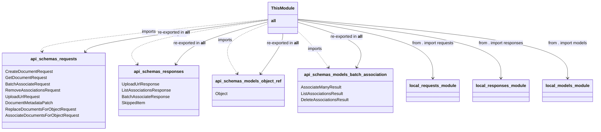

# Diagram: common/document_service/src/api/schemas/__init__.py

> Auto-generated by Obscura crawlers

## Mermaid

### SVG

<svg id="container" width="2202.7578125" xmlns="http://www.w3.org/2000/svg" class="classDiagram" height="498" viewBox="0 0 2202.7578125 498" role="graphics-document document" aria-roledescription="class"><g><defs><marker id="container_class-aggregationStart" class="marker aggregation class" refX="18" refY="7" markerWidth="190" markerHeight="240" orient="auto"><path d="M 18,7 L9,13 L1,7 L9,1 Z"></path></marker></defs><defs><marker id="container_class-aggregationEnd" class="marker aggregation class" refX="1" refY="7" markerWidth="20" markerHeight="28" orient="auto"><path d="M 18,7 L9,13 L1,7 L9,1 Z"></path></marker></defs><defs><marker id="container_class-extensionStart" class="marker extension class" refX="18" refY="7" markerWidth="190" markerHeight="240" orient="auto"><path d="M 1,7 L18,13 V 1 Z"></path></marker></defs><defs><marker id="container_class-extensionEnd" class="marker extension class" refX="1" refY="7" markerWidth="20" markerHeight="28" orient="auto"><path d="M 1,1 V 13 L18,7 Z"></path></marker></defs><defs><marker id="container_class-compositionStart" class="marker composition class" refX="18" refY="7" markerWidth="190" markerHeight="240" orient="auto"><path d="M 18,7 L9,13 L1,7 L9,1 Z"></path></marker></defs><defs><marker id="container_class-compositionEnd" class="marker composition class" refX="1" refY="7" markerWidth="20" markerHeight="28" orient="auto"><path d="M 18,7 L9,13 L1,7 L9,1 Z"></path></marker></defs><defs><marker id="container_class-dependencyStart" class="marker dependency class" refX="6" refY="7" markerWidth="190" markerHeight="240" orient="auto"><path d="M 5,7 L9,13 L1,7 L9,1 Z"></path></marker></defs><defs><marker id="container_class-dependencyEnd" class="marker dependency class" refX="13" refY="7" markerWidth="20" markerHeight="28" orient="auto"><path d="M 18,7 L9,13 L14,7 L9,1 Z"></path></marker></defs><defs><marker id="container_class-lollipopStart" class="marker lollipop class" refX="13" refY="7" markerWidth="190" markerHeight="240" orient="auto"><circle stroke="black" fill="transparent" cx="7" cy="7" r="6"></circle></marker></defs><defs><marker id="container_class-lollipopEnd" class="marker lollipop class" refX="1" refY="7" markerWidth="190" markerHeight="240" orient="auto"><circle stroke="black" fill="transparent" cx="7" cy="7" r="6"></circle></marker></defs><g class="root"><g class="clusters"></g><g class="edgePaths"><path d="M994.229,73.816L852.745,89.014C711.262,104.211,428.295,134.605,288.417,155.014C148.539,175.422,151.75,185.844,153.355,191.055L154.96,196.266" id="id_ThisModule_api_schemas_requests_1" class="edge-thickness-normal edge-pattern-dashed relation" style=";;;" data-edge="true" data-et="edge" data-id="id_ThisModule_api_schemas_requests_1" data-points="W3sieCI6OTk0LjIyODUxNTYyNSwieSI6NzMuODE2Mjk1MDU5NDg4MTZ9LHsieCI6MTQ1LjMyODEyNSwieSI6MTY1fSx7IngiOjE1Ni43MjY5MjkzODUzNTkxLCJ5IjoyMDJ9XQ==" marker-end="url(#container_class-dependencyEnd)"></path><path d="M994.229,76.825L904.053,91.52C813.878,106.216,633.527,135.608,553.74,163.681C473.952,191.754,494.729,218.507,505.117,231.884L515.506,245.261" id="id_ThisModule_api_schemas_responses_2" class="edge-thickness-normal edge-pattern-dashed relation" style=";;;" data-edge="true" data-et="edge" data-id="id_ThisModule_api_schemas_responses_2" data-points="W3sieCI6OTk0LjIyODUxNTYyNSwieSI6NzYuODI0NTc2Nzc0NTI4MDR9LHsieCI6NDUzLjE3NTc4MTI1LCJ5IjoxNjV9LHsieCI6NTE5LjE4NTc5NTA2MjE1NDcsInkiOjI1MH1d" marker-end="url(#container_class-dependencyEnd)"></path><path d="M994.229,90.504L964.353,102.92C934.477,115.336,874.726,140.168,856.556,171.895C838.386,203.623,861.797,242.246,873.503,261.558L885.208,280.869" id="id_ThisModule_api_schemas_models_object_ref_3" class="edge-thickness-normal edge-pattern-dashed relation" style=";;;" data-edge="true" data-et="edge" data-id="id_ThisModule_api_schemas_models_object_ref_3" data-points="W3sieCI6OTk0LjIyODUxNTYyNSwieSI6OTAuNTAzNjIzMzcwMzIwMTZ9LHsieCI6ODE0Ljk3NDYwOTM3NSwieSI6MTY1fSx7IngiOjg4OC4zMTg1ODU5ODA2NjMsInkiOjI4Nn1d" marker-end="url(#container_class-dependencyEnd)"></path><path d="M1102.525,115.097L1112.088,123.414C1121.65,131.731,1140.775,148.366,1160.821,172.024C1180.868,195.682,1201.835,226.364,1212.318,241.705L1222.802,257.046" id="id_ThisModule_api_schemas_models_batch_association_4" class="edge-thickness-normal edge-pattern-dashed relation" style=";;;" data-edge="true" data-et="edge" data-id="id_ThisModule_api_schemas_models_batch_association_4" data-points="W3sieCI6MTEwMi41MjUzOTA2MjUsInkiOjExNS4wOTY4MTI2MDk0NTcwOX0seyJ4IjoxMTU5LjkwMDM5MDYyNSwieSI6MTY1fSx7IngiOjEyMjYuMTg3MDAzNjI1NjkwNSwieSI6MjYyfV0=" marker-end="url(#container_class-dependencyEnd)"></path><path d="M1102.525,77.381L1186.814,91.984C1271.103,106.588,1439.68,135.794,1523.969,172.564C1608.258,209.333,1608.258,253.667,1608.258,275.833L1608.258,298" id="id_ThisModule_local_requests_module_5" class="edge-thickness-normal edge-pattern-solid relation" style=";;;" data-edge="true" data-et="edge" data-id="id_ThisModule_local_requests_module_5" data-points="W3sieCI6MTEwMi41MjUzOTA2MjUsInkiOjc3LjM4MTI3ODgwMTY0MjM3fSx7IngiOjE2MDguMjU3ODEyNSwieSI6MTY1fSx7IngiOjE2MDguMjU3ODEyNSwieSI6MzA0fV0=" marker-end="url(#container_class-dependencyEnd)"></path><path d="M1102.525,74.487L1228.443,89.573C1354.361,104.658,1606.196,134.829,1732.114,172.081C1858.031,209.333,1858.031,253.667,1858.031,275.833L1858.031,298" id="id_ThisModule_local_responses_module_6" class="edge-thickness-normal edge-pattern-solid relation" style=";;;" data-edge="true" data-et="edge" data-id="id_ThisModule_local_responses_module_6" data-points="W3sieCI6MTEwMi41MjUzOTA2MjUsInkiOjc0LjQ4NzIxMTIxODEzNjZ9LHsieCI6MTg1OC4wMzEyNSwieSI6MTY1fSx7IngiOjE4NTguMDMxMjUsInkiOjMwNH1d" marker-end="url(#container_class-dependencyEnd)"></path><path d="M1102.525,72.982L1269.222,88.318C1435.918,103.655,1769.311,134.327,1936.007,171.83C2102.703,209.333,2102.703,253.667,2102.703,275.833L2102.703,298" id="id_ThisModule_local_models_module_7" class="edge-thickness-normal edge-pattern-solid relation" style=";;;" data-edge="true" data-et="edge" data-id="id_ThisModule_local_models_module_7" data-points="W3sieCI6MTEwMi41MjUzOTA2MjUsInkiOjcyLjk4MTc1ODU2NTQzNDQ2fSx7IngiOjIxMDIuNzAzMTI1LCJ5IjoxNjV9LHsieCI6MjEwMi43MDMxMjUsInkiOjMwNH1d" marker-end="url(#container_class-dependencyEnd)"></path><path d="M316.599,197.261L320.774,191.884C324.95,186.507,333.301,175.754,446.239,155.449C559.178,135.144,776.703,105.288,885.466,90.36L994.229,75.432" id="id_api_schemas_requests_ThisModule_8" class="edge-thickness-normal edge-pattern-solid relation" style=";;;" data-edge="true" data-et="edge" data-id="id_api_schemas_requests_ThisModule_8" data-points="W3sieCI6MzEyLjkxODU3MzAzMTc2Nzk1LCJ5IjoyMDJ9LHsieCI6MzQxLjY1MjM0Mzc1LCJ5IjoxNjV9LHsieCI6OTk0LjIyODUxNTYyNSwieSI6NzUuNDMyMDI5OTEzNTI2MDR9XQ==" marker-start="url(#container_class-dependencyStart)"></path><path d="M655.039,244.869L663.107,231.558C671.176,218.246,687.314,191.623,743.845,164.683C800.377,137.743,897.303,110.485,945.766,96.856L994.229,83.228" id="id_api_schemas_responses_ThisModule_9" class="edge-thickness-normal edge-pattern-solid relation" style=";;;" data-edge="true" data-et="edge" data-id="id_api_schemas_responses_ThisModule_9" data-points="W3sieCI6NjUxLjkyODU0MzY4MDkzOTIsInkiOjI1MH0seyJ4Ijo3MDMuNDUxMTcxODc1LCJ5IjoxNjV9LHsieCI6OTk0LjIyODUxNTYyNSwieSI6ODMuMjI3NjE5MTY2MjYwODd9XQ==" marker-start="url(#container_class-dependencyStart)"></path><path d="M969.075,281.046L982.292,261.705C995.509,242.364,1021.943,203.682,1035.16,178.174C1048.377,152.667,1048.377,140.333,1048.377,134.167L1048.377,128" id="id_api_schemas_models_object_ref_ThisModule_10" class="edge-thickness-normal edge-pattern-solid relation" style=";;;" data-edge="true" data-et="edge" data-id="id_api_schemas_models_object_ref_ThisModule_10" data-points="W3sieCI6OTY1LjY4OTUyODY2MDIyMSwieSI6Mjg2fSx7IngiOjEwNDguMzc2OTUzMTI1LCJ5IjoxNjV9LHsieCI6MTA0OC4zNzY5NTMxMjUsInkiOjEyOH1d" marker-start="url(#container_class-dependencyStart)"></path><path d="M1323.186,256.513L1329.934,241.261C1336.683,226.009,1350.18,195.504,1313.404,166.862C1276.627,138.219,1189.576,111.439,1146.051,98.049L1102.525,84.658" id="id_api_schemas_models_batch_association_ThisModule_11" class="edge-thickness-normal edge-pattern-solid relation" style=";;;" data-edge="true" data-et="edge" data-id="id_api_schemas_models_batch_association_ThisModule_11" data-points="W3sieCI6MTMyMC43NTc3MDQ1OTI1NDE0LCJ5IjoyNjJ9LHsieCI6MTM2My42Nzc3MzQzNzUsInkiOjE2NX0seyJ4IjoxMTAyLjUyNTM5MDYyNSwieSI6ODQuNjU4Mzc0MzIwMTU1Nn1d" marker-start="url(#container_class-dependencyStart)"></path></g><g class="edgeLabels"><g class="edgeLabel" transform="translate(550.53101, 121.47558)"><g class="label" data-id="id_ThisModule_api_schemas_requests_1" transform="translate(-28.25, -12)"><foreignObject width="56.5" height="24">

imports

</foreignObject></g></g><g class="edgeLabel" transform="translate(670.59221, 129.56762)"><g class="label" data-id="id_ThisModule_api_schemas_responses_2" transform="translate(-28.25, -12)"><foreignObject width="56.5" height="24">

imports

</foreignObject></g></g><g class="edgeLabel" transform="translate(839.27207, 154.90218)"><g class="label" data-id="id_ThisModule_api_schemas_models_object_ref_3" transform="translate(-28.25, -12)"><foreignObject width="56.5" height="24">

imports

</foreignObject></g></g><g class="edgeLabel" transform="translate(1171.5922, 182.10911)"><g class="label" data-id="id_ThisModule_api_schemas_models_batch_association_4" transform="translate(-28.25, -12)"><foreignObject width="56.5" height="24">

imports

</foreignObject></g></g><g class="edgeLabel" transform="translate(1608.2578125, 165)"><g class="label" data-id="id_ThisModule_local_requests_module_5" transform="translate(-81.21875, -12)"><foreignObject width="162.4375" height="24">

from . import requests

</foreignObject></g></g><g class="edgeLabel" transform="translate(1858.03125, 165)"><g class="label" data-id="id_ThisModule_local_responses_module_6" transform="translate(-86.7421875, -12)"><foreignObject width="173.484375" height="24">

from . import responses

</foreignObject></g></g><g class="edgeLabel" transform="translate(2102.703125, 165)"><g class="label" data-id="id_ThisModule_local_models_module_7" transform="translate(-76.6015625, -12)"><foreignObject width="153.203125" height="24">

from . import models

</foreignObject></g></g><g class="edgeLabel" transform="translate(644.73455, 123.40109)"><g class="label" data-id="id_api_schemas_requests_ThisModule_8" transform="translate(-63.2734375, -12)"><foreignObject width="126.546875" height="24">

re-exported in <strong>all</strong>

</foreignObject></g></g><g class="edgeLabel" transform="translate(703.451171875, 165)"><g class="label" data-id="id_api_schemas_responses_ThisModule_9" transform="translate(-63.2734375, -12)"><foreignObject width="126.546875" height="24">

re-exported in <strong>all</strong>

</foreignObject></g></g><g class="edgeLabel" transform="translate(1048.376953125, 165)"><g class="label" data-id="id_api_schemas_models_object_ref_ThisModule_10" transform="translate(-63.2734375, -12)"><foreignObject width="126.546875" height="24">

re-exported in <strong>all</strong>

</foreignObject></g></g><g class="edgeLabel" transform="translate(1283.79265, 140.42393)"><g class="label" data-id="id_api_schemas_models_batch_association_ThisModule_11" transform="translate(-63.2734375, -12)"><foreignObject width="126.546875" height="24">

re-exported in <strong>all</strong>

</foreignObject></g></g></g><g class="nodes"><g class="node default" id="classId-ThisModule-0" transform="translate(1048.376953125, 68)"><g class="basic label-container"><path d="M-54.1484375 -60 L54.1484375 -60 L54.1484375 60 L-54.1484375 60" stroke="none" stroke-width="0" fill="#ECECFF" style=""></path><path d="M-54.1484375 -60 C-12.378974769370458 -60, 29.390487961259083 -60, 54.1484375 -60 M-54.1484375 -60 C-15.541755047911948 -60, 23.064927404176103 -60, 54.1484375 -60 M54.1484375 -60 C54.1484375 -19.37847899896321, 54.1484375 21.24304200207358, 54.1484375 60 M54.1484375 -60 C54.1484375 -13.474059128916181, 54.1484375 33.05188174216764, 54.1484375 60 M54.1484375 60 C25.545779180271218 60, -3.056879139457564 60, -54.1484375 60 M54.1484375 60 C29.958450821860186 60, 5.768464143720372 60, -54.1484375 60 M-54.1484375 60 C-54.1484375 28.016122748080992, -54.1484375 -3.967754503838016, -54.1484375 -60 M-54.1484375 60 C-54.1484375 12.882640346798453, -54.1484375 -34.23471930640309, -54.1484375 -60" stroke="#9370DB" stroke-width="1.3" fill="none" stroke-dasharray="0 0" style=""></path></g><g class="annotation-group text" transform="translate(0, -36)"></g><g class="label-group text" transform="translate(-42.1484375, -36)"><g class="label" style="font-weight: bolder" transform="translate(0,-12)"><foreignObject width="84.296875" height="24">

ThisModule

</foreignObject></g></g><g class="members-group text" transform="translate(-42.1484375, 12)"><g class="label" style="" transform="translate(0,-12)"><foreignObject width="18.125" height="24">

<strong>all</strong>

</foreignObject></g></g><g class="methods-group text" transform="translate(-42.1484375, 60)"></g><g class="divider" style=""><path d="M-54.1484375 -12 C-11.574911399016841 -12, 30.998614701966318 -12, 54.1484375 -12 M-54.1484375 -12 C-21.897511266773463 -12, 10.353414966453073 -12, 54.1484375 -12" stroke="#9370DB" stroke-width="1.3" fill="none" stroke-dasharray="0 0" style=""></path></g><g class="divider" style=""><path d="M-54.1484375 36 C-12.210111974556106 36, 29.728213550887787 36, 54.1484375 36 M-54.1484375 36 C-12.17075809780016 36, 29.80692130439968 36, 54.1484375 36" stroke="#9370DB" stroke-width="1.3" fill="none" stroke-dasharray="0 0" style=""></path></g></g><g class="node default" id="classId-api_schemas_requests-1" transform="translate(201.08984375, 346)"><g class="basic label-container"><path d="M-193.08984375 -144 L193.08984375 -144 L193.08984375 144 L-193.08984375 144" stroke="none" stroke-width="0" fill="#ECECFF" style=""></path><path d="M-193.08984375 -144 C-103.96296686903293 -144, -14.83608998806585 -144, 193.08984375 -144 M-193.08984375 -144 C-85.02251384878241 -144, 23.04481605243518 -144, 193.08984375 -144 M193.08984375 -144 C193.08984375 -68.8829978473231, 193.08984375 6.234004305353807, 193.08984375 144 M193.08984375 -144 C193.08984375 -78.97791784276238, 193.08984375 -13.955835685524761, 193.08984375 144 M193.08984375 144 C66.11053224023159 144, -60.868779269536816 144, -193.08984375 144 M193.08984375 144 C48.22142750757712 144, -96.64698873484576 144, -193.08984375 144 M-193.08984375 144 C-193.08984375 61.53831034937045, -193.08984375 -20.923379301259104, -193.08984375 -144 M-193.08984375 144 C-193.08984375 29.119235102246265, -193.08984375 -85.76152979550747, -193.08984375 -144" stroke="#9370DB" stroke-width="1.3" fill="none" stroke-dasharray="0 0" style=""></path></g><g class="annotation-group text" transform="translate(0, -120)"></g><g class="label-group text" transform="translate(-83.2265625, -120)"><g class="label" style="font-weight: bolder" transform="translate(0,-12)"><foreignObject width="166.453125" height="24">

api_schemas_requests

</foreignObject></g></g><g class="members-group text" transform="translate(-181.08984375, -72)"><g class="label" style="" transform="translate(0,-12)"><foreignObject width="178.984375" height="24">

CreateDocumentRequest

</foreignObject></g><g class="label" style="" transform="translate(0,12)"><foreignObject width="157.640625" height="24">

GetDocumentRequest

</foreignObject></g><g class="label" style="" transform="translate(0,36)"><foreignObject width="168.421875" height="24">

BatchAssociateRequest

</foreignObject></g><g class="label" style="" transform="translate(0,60)"><foreignObject width="207.34375" height="24">

RemoveAssociationsRequest

</foreignObject></g><g class="label" style="" transform="translate(0,84)"><foreignObject width="132.625" height="24">

UploadUrlRequest

</foreignObject></g><g class="label" style="" transform="translate(0,108)"><foreignObject width="181.890625" height="24">

DocumentMetadataPatch

</foreignObject></g><g class="label" style="" transform="translate(0,132)"><foreignObject width="267.5625" height="24">

ReplaceDocumentsForObjectRequest

</foreignObject></g><g class="label" style="" transform="translate(0,156)"><foreignObject width="278.953125" height="24">

AssociateDocumentsForObjectRequest

</foreignObject></g></g><g class="methods-group text" transform="translate(-181.08984375, 144)"></g><g class="divider" style=""><path d="M-193.08984375 -96 C-64.06927467846157 -96, 64.95129439307686 -96, 193.08984375 -96 M-193.08984375 -96 C-68.35622575518524 -96, 56.37739223962953 -96, 193.08984375 -96" stroke="#9370DB" stroke-width="1.3" fill="none" stroke-dasharray="0 0" style=""></path></g><g class="divider" style=""><path d="M-193.08984375 120 C-48.259244338849385 120, 96.57135507230123 120, 193.08984375 120 M-193.08984375 120 C-74.51452390523747 120, 44.060795939525065 120, 193.08984375 120" stroke="#9370DB" stroke-width="1.3" fill="none" stroke-dasharray="0 0" style=""></path></g></g><g class="node default" id="classId-api_schemas_responses-2" transform="translate(593.73828125, 346)"><g class="basic label-container"><path d="M-149.55859375 -96 L149.55859375 -96 L149.55859375 96 L-149.55859375 96" stroke="none" stroke-width="0" fill="#ECECFF" style=""></path><path d="M-149.55859375 -96 C-55.950090988013926 -96, 37.65841177397215 -96, 149.55859375 -96 M-149.55859375 -96 C-48.123008767634715 -96, 53.31257621473057 -96, 149.55859375 -96 M149.55859375 -96 C149.55859375 -24.687170556516477, 149.55859375 46.625658886967045, 149.55859375 96 M149.55859375 -96 C149.55859375 -56.25505449566585, 149.55859375 -16.510108991331705, 149.55859375 96 M149.55859375 96 C32.63708657328938 96, -84.28442060342124 96, -149.55859375 96 M149.55859375 96 C44.3841654115121 96, -60.7902629269758 96, -149.55859375 96 M-149.55859375 96 C-149.55859375 20.805543722368327, -149.55859375 -54.388912555263346, -149.55859375 -96 M-149.55859375 96 C-149.55859375 46.228414366681164, -149.55859375 -3.543171266637671, -149.55859375 -96" stroke="#9370DB" stroke-width="1.3" fill="none" stroke-dasharray="0 0" style=""></path></g><g class="annotation-group text" transform="translate(0, -72)"></g><g class="label-group text" transform="translate(-88.6953125, -72)"><g class="label" style="font-weight: bolder" transform="translate(0,-12)"><foreignObject width="177.390625" height="24">

api_schemas_responses

</foreignObject></g></g><g class="members-group text" transform="translate(-137.55859375, -24)"><g class="label" style="" transform="translate(0,-12)"><foreignObject width="143.671875" height="24">

UploadUrlResponse

</foreignObject></g><g class="label" style="" transform="translate(0,12)"><foreignObject width="186.421875" height="24">

ListAssociationsResponse

</foreignObject></g><g class="label" style="" transform="translate(0,36)"><foreignObject width="179.46875" height="24">

BatchAssociateResponse

</foreignObject></g><g class="label" style="" transform="translate(0,60)"><foreignObject width="91.421875" height="24">

SkippedItem

</foreignObject></g></g><g class="methods-group text" transform="translate(-137.55859375, 96)"></g><g class="divider" style=""><path d="M-149.55859375 -48 C-32.33836792727483 -48, 84.88185789545034 -48, 149.55859375 -48 M-149.55859375 -48 C-66.85218296034186 -48, 15.854227829316272 -48, 149.55859375 -48" stroke="#9370DB" stroke-width="1.3" fill="none" stroke-dasharray="0 0" style=""></path></g><g class="divider" style=""><path d="M-149.55859375 72 C-30.444113550243543 72, 88.67036664951291 72, 149.55859375 72 M-149.55859375 72 C-79.3381652275124 72, -9.11773670502481 72, 149.55859375 72" stroke="#9370DB" stroke-width="1.3" fill="none" stroke-dasharray="0 0" style=""></path></g></g><g class="node default" id="classId-api_schemas_models_object_ref-3" transform="translate(924.6875, 346)"><g class="basic label-container"><path d="M-131.390625 -60 L131.390625 -60 L131.390625 60 L-131.390625 60" stroke="none" stroke-width="0" fill="#ECECFF" style=""></path><path d="M-131.390625 -60 C-34.669765309733464 -60, 62.05109438053307 -60, 131.390625 -60 M-131.390625 -60 C-31.024980913207003 -60, 69.340663173586 -60, 131.390625 -60 M131.390625 -60 C131.390625 -26.112575144487757, 131.390625 7.774849711024487, 131.390625 60 M131.390625 -60 C131.390625 -13.816769984153865, 131.390625 32.36646003169227, 131.390625 60 M131.390625 60 C45.16770636276476 60, -41.05521227447048 60, -131.390625 60 M131.390625 60 C44.04367331789098 60, -43.303278364218045 60, -131.390625 60 M-131.390625 60 C-131.390625 13.301337929732327, -131.390625 -33.397324140535346, -131.390625 -60 M-131.390625 60 C-131.390625 32.71728061258926, -131.390625 5.43456122517852, -131.390625 -60" stroke="#9370DB" stroke-width="1.3" fill="none" stroke-dasharray="0 0" style=""></path></g><g class="annotation-group text" transform="translate(0, -36)"></g><g class="label-group text" transform="translate(-119.390625, -36)"><g class="label" style="font-weight: bolder" transform="translate(0,-12)"><foreignObject width="238.78125" height="24">

api_schemas_models_object_ref

</foreignObject></g></g><g class="members-group text" transform="translate(-119.390625, 12)"><g class="label" style="" transform="translate(0,-12)"><foreignObject width="47.203125" height="24">

Object

</foreignObject></g></g><g class="methods-group text" transform="translate(-119.390625, 60)"></g><g class="divider" style=""><path d="M-131.390625 -12 C-64.75974198706093 -12, 1.8711410258781314 -12, 131.390625 -12 M-131.390625 -12 C-69.1356846812224 -12, -6.880744362444801 -12, 131.390625 -12" stroke="#9370DB" stroke-width="1.3" fill="none" stroke-dasharray="0 0" style=""></path></g><g class="divider" style=""><path d="M-131.390625 36 C-51.719528416764234 36, 27.95156816647153 36, 131.390625 36 M-131.390625 36 C-57.96340194370147 36, 15.46382111259706 36, 131.390625 36" stroke="#9370DB" stroke-width="1.3" fill="none" stroke-dasharray="0 0" style=""></path></g></g><g class="node default" id="classId-api_schemas_models_batch_association-4" transform="translate(1283.58984375, 346)"><g class="basic label-container"><path d="M-177.51171875 -84 L177.51171875 -84 L177.51171875 84 L-177.51171875 84" stroke="none" stroke-width="0" fill="#ECECFF" style=""></path><path d="M-177.51171875 -84 C-68.39934533733113 -84, 40.713028075337746 -84, 177.51171875 -84 M-177.51171875 -84 C-96.12125195489763 -84, -14.73078515979526 -84, 177.51171875 -84 M177.51171875 -84 C177.51171875 -19.809415108948315, 177.51171875 44.38116978210337, 177.51171875 84 M177.51171875 -84 C177.51171875 -42.01742094492978, 177.51171875 -0.034841889859563935, 177.51171875 84 M177.51171875 84 C81.9675360762711 84, -13.576646597457795 84, -177.51171875 84 M177.51171875 84 C80.57920745751544 84, -16.353303834969125 84, -177.51171875 84 M-177.51171875 84 C-177.51171875 30.894174862868596, -177.51171875 -22.21165027426281, -177.51171875 -84 M-177.51171875 84 C-177.51171875 21.725491360734637, -177.51171875 -40.54901727853073, -177.51171875 -84" stroke="#9370DB" stroke-width="1.3" fill="none" stroke-dasharray="0 0" style=""></path></g><g class="annotation-group text" transform="translate(0, -60)"></g><g class="label-group text" transform="translate(-148.3515625, -60)"><g class="label" style="font-weight: bolder" transform="translate(0,-12)"><foreignObject width="296.703125" height="24">

api_schemas_models_batch_association

</foreignObject></g></g><g class="members-group text" transform="translate(-165.51171875, -12)"><g class="label" style="" transform="translate(0,-12)"><foreignObject width="152.125" height="24">

AssociateManyResult

</foreignObject></g><g class="label" style="" transform="translate(0,12)"><foreignObject width="161.78125" height="24">

ListAssociationsResult

</foreignObject></g><g class="label" style="" transform="translate(0,36)"><foreignObject width="182.671875" height="24">

DeleteAssociationsResult

</foreignObject></g></g><g class="methods-group text" transform="translate(-165.51171875, 84)"></g><g class="divider" style=""><path d="M-177.51171875 -36 C-65.40563451032152 -36, 46.70044972935696 -36, 177.51171875 -36 M-177.51171875 -36 C-57.28997561870658 -36, 62.931767512586845 -36, 177.51171875 -36" stroke="#9370DB" stroke-width="1.3" fill="none" stroke-dasharray="0 0" style=""></path></g><g class="divider" style=""><path d="M-177.51171875 60 C-62.3247669678352 60, 52.862184814329595 60, 177.51171875 60 M-177.51171875 60 C-79.16557923336056 60, 19.18056028327888 60, 177.51171875 60" stroke="#9370DB" stroke-width="1.3" fill="none" stroke-dasharray="0 0" style=""></path></g></g><g class="node default" id="classId-local_requests_module-5" transform="translate(1608.2578125, 346)"><g class="basic label-container"><path d="M-97.15625 -42 L97.15625 -42 L97.15625 42 L-97.15625 42" stroke="none" stroke-width="0" fill="#ECECFF" style=""></path><path d="M-97.15625 -42 C-32.66641152572784 -42, 31.823426948544324 -42, 97.15625 -42 M-97.15625 -42 C-21.69149654654757 -42, 53.77325690690486 -42, 97.15625 -42 M97.15625 -42 C97.15625 -20.537754529326786, 97.15625 0.9244909413464271, 97.15625 42 M97.15625 -42 C97.15625 -10.232831142161093, 97.15625 21.534337715677815, 97.15625 42 M97.15625 42 C51.04036994423747 42, 4.9244898884749375 42, -97.15625 42 M97.15625 42 C20.295694392282115 42, -56.56486121543577 42, -97.15625 42 M-97.15625 42 C-97.15625 10.098893456787348, -97.15625 -21.802213086425304, -97.15625 -42 M-97.15625 42 C-97.15625 9.042308747540709, -97.15625 -23.915382504918583, -97.15625 -42" stroke="#9370DB" stroke-width="1.3" fill="none" stroke-dasharray="0 0" style=""></path></g><g class="annotation-group text" transform="translate(0, -18)"></g><g class="label-group text" transform="translate(-85.15625, -18)"><g class="label" style="font-weight: bolder" transform="translate(0,-12)"><foreignObject width="170.3125" height="24">

local_requests_module

</foreignObject></g></g><g class="members-group text" transform="translate(-85.15625, 30)"></g><g class="methods-group text" transform="translate(-85.15625, 60)"></g><g class="divider" style=""><path d="M-97.15625 6 C-34.03597092725231 6, 29.084308145495385 6, 97.15625 6 M-97.15625 6 C-54.83885050236245 6, -12.521451004724895 6, 97.15625 6" stroke="#9370DB" stroke-width="1.3" fill="none" stroke-dasharray="0 0" style=""></path></g><g class="divider" style=""><path d="M-97.15625 24 C-40.04716523198761 24, 17.061919536024774 24, 97.15625 24 M-97.15625 24 C-23.404702599114728 24, 50.346844801770544 24, 97.15625 24" stroke="#9370DB" stroke-width="1.3" fill="none" stroke-dasharray="0 0" style=""></path></g></g><g class="node default" id="classId-local_responses_module-6" transform="translate(1858.03125, 346)"><g class="basic label-container"><path d="M-102.6171875 -42 L102.6171875 -42 L102.6171875 42 L-102.6171875 42" stroke="none" stroke-width="0" fill="#ECECFF" style=""></path><path d="M-102.6171875 -42 C-26.569484720717654 -42, 49.47821805856469 -42, 102.6171875 -42 M-102.6171875 -42 C-23.35276387662563 -42, 55.91165974674874 -42, 102.6171875 -42 M102.6171875 -42 C102.6171875 -18.388034211577857, 102.6171875 5.223931576844286, 102.6171875 42 M102.6171875 -42 C102.6171875 -9.614747336644719, 102.6171875 22.770505326710563, 102.6171875 42 M102.6171875 42 C54.442111999061 42, 6.267036498121996 42, -102.6171875 42 M102.6171875 42 C41.04664045993013 42, -20.523906580139737 42, -102.6171875 42 M-102.6171875 42 C-102.6171875 11.040033486587166, -102.6171875 -19.919933026825667, -102.6171875 -42 M-102.6171875 42 C-102.6171875 22.800205247768, -102.6171875 3.6004104955360035, -102.6171875 -42" stroke="#9370DB" stroke-width="1.3" fill="none" stroke-dasharray="0 0" style=""></path></g><g class="annotation-group text" transform="translate(0, -18)"></g><g class="label-group text" transform="translate(-90.6171875, -18)"><g class="label" style="font-weight: bolder" transform="translate(0,-12)"><foreignObject width="181.234375" height="24">

local_responses_module

</foreignObject></g></g><g class="members-group text" transform="translate(-90.6171875, 30)"></g><g class="methods-group text" transform="translate(-90.6171875, 60)"></g><g class="divider" style=""><path d="M-102.6171875 6 C-31.27880004232364 6, 40.05958741535272 6, 102.6171875 6 M-102.6171875 6 C-40.45827779137913 6, 21.700631917241736 6, 102.6171875 6" stroke="#9370DB" stroke-width="1.3" fill="none" stroke-dasharray="0 0" style=""></path></g><g class="divider" style=""><path d="M-102.6171875 24 C-28.268984016299925 24, 46.07921946740015 24, 102.6171875 24 M-102.6171875 24 C-53.37708176316258 24, -4.136976026325158 24, 102.6171875 24" stroke="#9370DB" stroke-width="1.3" fill="none" stroke-dasharray="0 0" style=""></path></g></g><g class="node default" id="classId-local_models_module-7" transform="translate(2102.703125, 346)"><g class="basic label-container"><path d="M-92.0546875 -42 L92.0546875 -42 L92.0546875 42 L-92.0546875 42" stroke="none" stroke-width="0" fill="#ECECFF" style=""></path><path d="M-92.0546875 -42 C-23.399052659935236 -42, 45.25658218012953 -42, 92.0546875 -42 M-92.0546875 -42 C-49.938389190741006 -42, -7.822090881482012 -42, 92.0546875 -42 M92.0546875 -42 C92.0546875 -23.902595870946787, 92.0546875 -5.805191741893573, 92.0546875 42 M92.0546875 -42 C92.0546875 -14.785050908136292, 92.0546875 12.429898183727417, 92.0546875 42 M92.0546875 42 C29.365330481450712 42, -33.324026537098575 42, -92.0546875 42 M92.0546875 42 C42.34290210549137 42, -7.368883289017262 42, -92.0546875 42 M-92.0546875 42 C-92.0546875 22.314064062802743, -92.0546875 2.6281281256054854, -92.0546875 -42 M-92.0546875 42 C-92.0546875 21.622034619407533, -92.0546875 1.2440692388150651, -92.0546875 -42" stroke="#9370DB" stroke-width="1.3" fill="none" stroke-dasharray="0 0" style=""></path></g><g class="annotation-group text" transform="translate(0, -18)"></g><g class="label-group text" transform="translate(-80.0546875, -18)"><g class="label" style="font-weight: bolder" transform="translate(0,-12)"><foreignObject width="160.109375" height="24">

local_models_module

</foreignObject></g></g><g class="members-group text" transform="translate(-80.0546875, 30)"></g><g class="methods-group text" transform="translate(-80.0546875, 60)"></g><g class="divider" style=""><path d="M-92.0546875 6 C-33.2000130082155 6, 25.654661483569 6, 92.0546875 6 M-92.0546875 6 C-45.552706903371764 6, 0.9492736932564725 6, 92.0546875 6" stroke="#9370DB" stroke-width="1.3" fill="none" stroke-dasharray="0 0" style=""></path></g><g class="divider" style=""><path d="M-92.0546875 24 C-24.19897875419015 24, 43.6567299916197 24, 92.0546875 24 M-92.0546875 24 C-34.22846763689465 24, 23.5977522262107 24, 92.0546875 24" stroke="#9370DB" stroke-width="1.3" fill="none" stroke-dasharray="0 0" style=""></path></g></g></g></g></g></svg>
