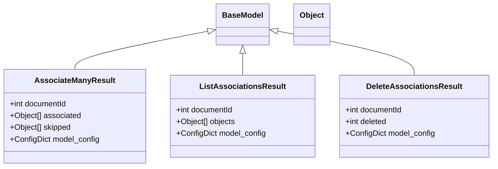

# Diagram: common/document_service/src/api/schemas/models/batch_association.py

> Auto-generated by Obscura crawlers

## Mermaid

### SVG

<svg id="container" width="989.671875" xmlns="http://www.w3.org/2000/svg" class="classDiagram" height="342" viewBox="0 0 989.671875 342" role="graphics-document document" aria-roledescription="class"><g><defs><marker id="container_class-aggregationStart" class="marker aggregation class" refX="18" refY="7" markerWidth="190" markerHeight="240" orient="auto"><path d="M 18,7 L9,13 L1,7 L9,1 Z"></path></marker></defs><defs><marker id="container_class-aggregationEnd" class="marker aggregation class" refX="1" refY="7" markerWidth="20" markerHeight="28" orient="auto"><path d="M 18,7 L9,13 L1,7 L9,1 Z"></path></marker></defs><defs><marker id="container_class-extensionStart" class="marker extension class" refX="18" refY="7" markerWidth="190" markerHeight="240" orient="auto"><path d="M 1,7 L18,13 V 1 Z"></path></marker></defs><defs><marker id="container_class-extensionEnd" class="marker extension class" refX="1" refY="7" markerWidth="20" markerHeight="28" orient="auto"><path d="M 1,1 V 13 L18,7 Z"></path></marker></defs><defs><marker id="container_class-compositionStart" class="marker composition class" refX="18" refY="7" markerWidth="190" markerHeight="240" orient="auto"><path d="M 18,7 L9,13 L1,7 L9,1 Z"></path></marker></defs><defs><marker id="container_class-compositionEnd" class="marker composition class" refX="1" refY="7" markerWidth="20" markerHeight="28" orient="auto"><path d="M 18,7 L9,13 L1,7 L9,1 Z"></path></marker></defs><defs><marker id="container_class-dependencyStart" class="marker dependency class" refX="6" refY="7" markerWidth="190" markerHeight="240" orient="auto"><path d="M 5,7 L9,13 L1,7 L9,1 Z"></path></marker></defs><defs><marker id="container_class-dependencyEnd" class="marker dependency class" refX="13" refY="7" markerWidth="20" markerHeight="28" orient="auto"><path d="M 18,7 L9,13 L14,7 L9,1 Z"></path></marker></defs><defs><marker id="container_class-lollipopStart" class="marker lollipop class" refX="13" refY="7" markerWidth="190" markerHeight="240" orient="auto"><circle stroke="black" fill="transparent" cx="7" cy="7" r="6"></circle></marker></defs><defs><marker id="container_class-lollipopEnd" class="marker lollipop class" refX="1" refY="7" markerWidth="190" markerHeight="240" orient="auto"><circle stroke="black" fill="transparent" cx="7" cy="7" r="6"></circle></marker></defs><g class="root"><g class="clusters"></g><g class="edgePaths"><path d="M418.097,63.721L373.445,72.601C328.794,81.481,239.491,99.24,194.839,112.287C150.188,125.333,150.188,133.667,150.188,137.833L150.188,142" id="id_BaseModel_AssociateManyResult_1" class="edge-thickness-normal edge-pattern-solid relation" style=";;;" data-edge="true" data-et="edge" data-id="id_BaseModel_AssociateManyResult_1" data-points="W3sieCI6NDM1LjAxNTYyNSwieSI6NjAuMzU2NjkyMzI5MDk3NDg0fSx7IngiOjE1MC4xODc1LCJ5IjoxMTd9LHsieCI6MTUwLjE4NzUsInkiOjE0Mn1d" marker-start="url(#container_class-extensionStart)"></path><path d="M487.094,109.25L487.094,110.542C487.094,111.833,487.094,114.417,487.094,121.875C487.094,129.333,487.094,141.667,487.094,147.833L487.094,154" id="id_BaseModel_ListAssociationsResult_2" class="edge-thickness-normal edge-pattern-solid relation" style=";;;" data-edge="true" data-et="edge" data-id="id_BaseModel_ListAssociationsResult_2" data-points="W3sieCI6NDg3LjA5Mzc1LCJ5Ijo5Mn0seyJ4Ijo0ODcuMDkzNzUsInkiOjExN30seyJ4Ijo0ODcuMDkzNzUsInkiOjE1NH1d" marker-start="url(#container_class-extensionStart)"></path><path d="M556.105,63.416L602.044,72.347C647.984,81.277,739.863,99.139,785.803,114.236C831.742,129.333,831.742,141.667,831.742,147.833L831.742,154" id="id_BaseModel_DeleteAssociationsResult_3" class="edge-thickness-normal edge-pattern-solid relation" style=";;;" data-edge="true" data-et="edge" data-id="id_BaseModel_DeleteAssociationsResult_3" data-points="W3sieCI6NTM5LjE3MTg3NSwieSI6NjAuMTI0MDM5NDQyMzY2NTR9LHsieCI6ODMxLjc0MjE4NzUsInkiOjExN30seyJ4Ijo4MzEuNzQyMTg3NSwieSI6MTU0fV0=" marker-start="url(#container_class-extensionStart)"></path></g><g class="edgeLabels"><g class="edgeLabel"><g class="label" data-id="id_BaseModel_AssociateManyResult_1" transform="translate(0, 0)"><foreignObject width="0" height="0">

</foreignObject></g></g><g class="edgeLabel"><g class="label" data-id="id_BaseModel_ListAssociationsResult_2" transform="translate(0, 0)"><foreignObject width="0" height="0">

</foreignObject></g></g><g class="edgeLabel"><g class="label" data-id="id_BaseModel_DeleteAssociationsResult_3" transform="translate(0, 0)"><foreignObject width="0" height="0">

</foreignObject></g></g></g><g class="nodes"><g class="node default" id="classId-BaseModel-0" transform="translate(487.09375, 50)"><g class="basic label-container"><path d="M-52.078125 -42 L52.078125 -42 L52.078125 42 L-52.078125 42" stroke="none" stroke-width="0" fill="#ECECFF" style=""></path><path d="M-52.078125 -42 C-29.09673784647896 -42, -6.115350692957918 -42, 52.078125 -42 M-52.078125 -42 C-10.955599734309295 -42, 30.16692553138141 -42, 52.078125 -42 M52.078125 -42 C52.078125 -19.05192142411962, 52.078125 3.896157151760761, 52.078125 42 M52.078125 -42 C52.078125 -14.231947987728944, 52.078125 13.536104024542112, 52.078125 42 M52.078125 42 C13.653448477054702 42, -24.771228045890595 42, -52.078125 42 M52.078125 42 C30.804342490644938 42, 9.530559981289876 42, -52.078125 42 M-52.078125 42 C-52.078125 16.61984056043868, -52.078125 -8.760318879122643, -52.078125 -42 M-52.078125 42 C-52.078125 12.341856456058352, -52.078125 -17.316287087883296, -52.078125 -42" stroke="#9370DB" stroke-width="1.3" fill="none" stroke-dasharray="0 0" style=""></path></g><g class="annotation-group text" transform="translate(0, -18)"></g><g class="label-group text" transform="translate(-40.078125, -18)"><g class="label" style="font-weight: bolder" transform="translate(0,-12)"><foreignObject width="80.15625" height="24">

BaseModel

</foreignObject></g></g><g class="members-group text" transform="translate(-40.078125, 30)"></g><g class="methods-group text" transform="translate(-40.078125, 60)"></g><g class="divider" style=""><path d="M-52.078125 6 C-12.513266805885422 6, 27.051591388229156 6, 52.078125 6 M-52.078125 6 C-13.59505546946329 6, 24.88801406107342 6, 52.078125 6" stroke="#9370DB" stroke-width="1.3" fill="none" stroke-dasharray="0 0" style=""></path></g><g class="divider" style=""><path d="M-52.078125 24 C-22.060409300963972 24, 7.957306398072056 24, 52.078125 24 M-52.078125 24 C-20.33766532569264 24, 11.40279434861472 24, 52.078125 24" stroke="#9370DB" stroke-width="1.3" fill="none" stroke-dasharray="0 0" style=""></path></g></g><g class="node default" id="classId-Object-1" transform="translate(625.0625, 50)"><g class="basic label-container"><path d="M-35.890625 -42 L35.890625 -42 L35.890625 42 L-35.890625 42" stroke="none" stroke-width="0" fill="#ECECFF" style=""></path><path d="M-35.890625 -42 C-15.56148124837901 -42, 4.767662503241979 -42, 35.890625 -42 M-35.890625 -42 C-16.422259445316683 -42, 3.046106109366633 -42, 35.890625 -42 M35.890625 -42 C35.890625 -22.722937776986004, 35.890625 -3.4458755539720087, 35.890625 42 M35.890625 -42 C35.890625 -17.089583103199043, 35.890625 7.820833793601913, 35.890625 42 M35.890625 42 C19.406874405601275 42, 2.923123811202551 42, -35.890625 42 M35.890625 42 C13.410417263223671 42, -9.069790473552658 42, -35.890625 42 M-35.890625 42 C-35.890625 21.727896021209975, -35.890625 1.4557920424199509, -35.890625 -42 M-35.890625 42 C-35.890625 17.2366825521137, -35.890625 -7.526634895772602, -35.890625 -42" stroke="#9370DB" stroke-width="1.3" fill="none" stroke-dasharray="0 0" style=""></path></g><g class="annotation-group text" transform="translate(0, -18)"></g><g class="label-group text" transform="translate(-23.890625, -18)"><g class="label" style="font-weight: bolder" transform="translate(0,-12)"><foreignObject width="47.78125" height="24">

Object

</foreignObject></g></g><g class="members-group text" transform="translate(-23.890625, 30)"></g><g class="methods-group text" transform="translate(-23.890625, 60)"></g><g class="divider" style=""><path d="M-35.890625 6 C-21.31184714305445 6, -6.7330692861089005 6, 35.890625 6 M-35.890625 6 C-19.3098362663388 6, -2.7290475326775976 6, 35.890625 6" stroke="#9370DB" stroke-width="1.3" fill="none" stroke-dasharray="0 0" style=""></path></g><g class="divider" style=""><path d="M-35.890625 24 C-18.56265412965834 24, -1.2346832593166823 24, 35.890625 24 M-35.890625 24 C-19.73001990873876 24, -3.569414817477522 24, 35.890625 24" stroke="#9370DB" stroke-width="1.3" fill="none" stroke-dasharray="0 0" style=""></path></g></g><g class="node default" id="classId-AssociateManyResult-2" transform="translate(150.1875, 238)"><g class="basic label-container"><path d="M-142.1875 -96 L142.1875 -96 L142.1875 96 L-142.1875 96" stroke="none" stroke-width="0" fill="#ECECFF" style=""></path><path d="M-142.1875 -96 C-48.6178063060495 -96, 44.951887387900996 -96, 142.1875 -96 M-142.1875 -96 C-59.70450698741905 -96, 22.778486025161897 -96, 142.1875 -96 M142.1875 -96 C142.1875 -52.48210775669491, 142.1875 -8.964215513389817, 142.1875 96 M142.1875 -96 C142.1875 -57.06917783044627, 142.1875 -18.138355660892543, 142.1875 96 M142.1875 96 C56.843689775525746 96, -28.500120448948508 96, -142.1875 96 M142.1875 96 C71.65082781913057 96, 1.1141556382611384 96, -142.1875 96 M-142.1875 96 C-142.1875 21.328887357873413, -142.1875 -53.342225284253175, -142.1875 -96 M-142.1875 96 C-142.1875 36.114884475725574, -142.1875 -23.77023104854885, -142.1875 -96" stroke="#9370DB" stroke-width="1.3" fill="none" stroke-dasharray="0 0" style=""></path></g><g class="annotation-group text" transform="translate(0, -72)"></g><g class="label-group text" transform="translate(-77.421875, -72)"><g class="label" style="font-weight: bolder" transform="translate(0,-12)"><foreignObject width="154.84375" height="24">

AssociateManyResult

</foreignObject></g></g><g class="members-group text" transform="translate(-130.1875, -24)"><g class="label" style="" transform="translate(0,-12)"><foreignObject width="119.484375" height="24">

+int documentId

</foreignObject></g><g class="label" style="" transform="translate(0,12)"><foreignObject width="147.09375" height="24">

+Object[] associated

</foreignObject></g><g class="label" style="" transform="translate(0,36)"><foreignObject width="127.203125" height="24">

+Object[] skipped

</foreignObject></g><g class="label" style="" transform="translate(0,60)"><foreignObject width="182.953125" height="24">

+ConfigDict model_config

</foreignObject></g></g><g class="methods-group text" transform="translate(-130.1875, 96)"></g><g class="divider" style=""><path d="M-142.1875 -48 C-35.514143998302714 -48, 71.15921200339457 -48, 142.1875 -48 M-142.1875 -48 C-52.4270858807548 -48, 37.333328238490395 -48, 142.1875 -48" stroke="#9370DB" stroke-width="1.3" fill="none" stroke-dasharray="0 0" style=""></path></g><g class="divider" style=""><path d="M-142.1875 72 C-34.56354082199144 72, 73.06041835601712 72, 142.1875 72 M-142.1875 72 C-65.06154081847983 72, 12.064418363040346 72, 142.1875 72" stroke="#9370DB" stroke-width="1.3" fill="none" stroke-dasharray="0 0" style=""></path></g></g><g class="node default" id="classId-ListAssociationsResult-3" transform="translate(487.09375, 238)"><g class="basic label-container"><path d="M-144.71875 -84 L144.71875 -84 L144.71875 84 L-144.71875 84" stroke="none" stroke-width="0" fill="#ECECFF" style=""></path><path d="M-144.71875 -84 C-31.12763232938643 -84, 82.46348534122714 -84, 144.71875 -84 M-144.71875 -84 C-75.0569769877315 -84, -5.395203975463005 -84, 144.71875 -84 M144.71875 -84 C144.71875 -44.06859705701801, 144.71875 -4.137194114036021, 144.71875 84 M144.71875 -84 C144.71875 -25.007508656765353, 144.71875 33.984982686469294, 144.71875 84 M144.71875 84 C57.112661298691975 84, -30.49342740261605 84, -144.71875 84 M144.71875 84 C67.41235097526334 84, -9.894048049473327 84, -144.71875 84 M-144.71875 84 C-144.71875 31.443035152933327, -144.71875 -21.113929694133347, -144.71875 -84 M-144.71875 84 C-144.71875 44.727483571735135, -144.71875 5.45496714347027, -144.71875 -84" stroke="#9370DB" stroke-width="1.3" fill="none" stroke-dasharray="0 0" style=""></path></g><g class="annotation-group text" transform="translate(0, -60)"></g><g class="label-group text" transform="translate(-82.484375, -60)"><g class="label" style="font-weight: bolder" transform="translate(0,-12)"><foreignObject width="164.96875" height="24">

ListAssociationsResult

</foreignObject></g></g><g class="members-group text" transform="translate(-132.71875, -12)"><g class="label" style="" transform="translate(0,-12)"><foreignObject width="119.484375" height="24">

+int documentId

</foreignObject></g><g class="label" style="" transform="translate(0,12)"><foreignObject width="122.6875" height="24">

+Object[] objects

</foreignObject></g><g class="label" style="" transform="translate(0,36)"><foreignObject width="182.953125" height="24">

+ConfigDict model_config

</foreignObject></g></g><g class="methods-group text" transform="translate(-132.71875, 84)"></g><g class="divider" style=""><path d="M-144.71875 -36 C-40.87334163679594 -36, 62.972066726408116 -36, 144.71875 -36 M-144.71875 -36 C-79.87101953382826 -36, -15.02328906765652 -36, 144.71875 -36" stroke="#9370DB" stroke-width="1.3" fill="none" stroke-dasharray="0 0" style=""></path></g><g class="divider" style=""><path d="M-144.71875 60 C-29.77679312243896 60, 85.16516375512208 60, 144.71875 60 M-144.71875 60 C-64.38357615670058 60, 15.95159768659883 60, 144.71875 60" stroke="#9370DB" stroke-width="1.3" fill="none" stroke-dasharray="0 0" style=""></path></g></g><g class="node default" id="classId-DeleteAssociationsResult-4" transform="translate(831.7421875, 238)"><g class="basic label-container"><path d="M-149.9296875 -84 L149.9296875 -84 L149.9296875 84 L-149.9296875 84" stroke="none" stroke-width="0" fill="#ECECFF" style=""></path><path d="M-149.9296875 -84 C-88.37065683224877 -84, -26.81162616449754 -84, 149.9296875 -84 M-149.9296875 -84 C-60.58860803829164 -84, 28.752471423416722 -84, 149.9296875 -84 M149.9296875 -84 C149.9296875 -40.579604481114906, 149.9296875 2.840791037770188, 149.9296875 84 M149.9296875 -84 C149.9296875 -44.186822459326685, 149.9296875 -4.373644918653369, 149.9296875 84 M149.9296875 84 C73.24735599569111 84, -3.4349755086177822 84, -149.9296875 84 M149.9296875 84 C33.57091182790812 84, -82.78786384418376 84, -149.9296875 84 M-149.9296875 84 C-149.9296875 20.128927147690263, -149.9296875 -43.742145704619475, -149.9296875 -84 M-149.9296875 84 C-149.9296875 38.21571803540948, -149.9296875 -7.568563929181039, -149.9296875 -84" stroke="#9370DB" stroke-width="1.3" fill="none" stroke-dasharray="0 0" style=""></path></g><g class="annotation-group text" transform="translate(0, -60)"></g><g class="label-group text" transform="translate(-92.90625, -60)"><g class="label" style="font-weight: bolder" transform="translate(0,-12)"><foreignObject width="185.8125" height="24">

DeleteAssociationsResult

</foreignObject></g></g><g class="members-group text" transform="translate(-137.9296875, -12)"><g class="label" style="" transform="translate(0,-12)"><foreignObject width="119.484375" height="24">

+int documentId

</foreignObject></g><g class="label" style="" transform="translate(0,12)"><foreignObject width="87.34375" height="24">

+int deleted

</foreignObject></g><g class="label" style="" transform="translate(0,36)"><foreignObject width="182.953125" height="24">

+ConfigDict model_config

</foreignObject></g></g><g class="methods-group text" transform="translate(-137.9296875, 84)"></g><g class="divider" style=""><path d="M-149.9296875 -36 C-59.53922877131693 -36, 30.851229957366144 -36, 149.9296875 -36 M-149.9296875 -36 C-79.28934923651856 -36, -8.649010973037122 -36, 149.9296875 -36" stroke="#9370DB" stroke-width="1.3" fill="none" stroke-dasharray="0 0" style=""></path></g><g class="divider" style=""><path d="M-149.9296875 60 C-82.97224829531707 60, -16.014809090634145 60, 149.9296875 60 M-149.9296875 60 C-66.17752966233712 60, 17.574628175325756 60, 149.9296875 60" stroke="#9370DB" stroke-width="1.3" fill="none" stroke-dasharray="0 0" style=""></path></g></g></g></g></g></svg>
