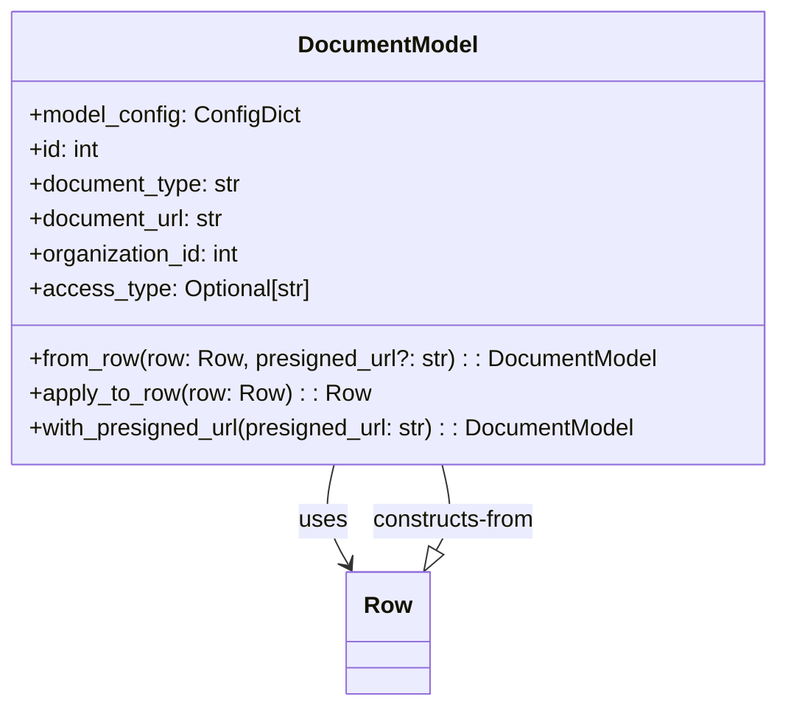

# Diagram: common/document_service/src/api/schemas/models/document.py


> Auto-generated by Obscura crawlers

## Diagram 1



### SVG

<svg id="container" width="533.25" xmlns="http://www.w3.org/2000/svg" class="classDiagram" height="486" viewBox="0 0 533.25 486" role="graphics-document document" aria-roledescription="class"><style>#container{font-family:"trebuchet ms",verdana,arial,sans-serif;font-size:16px;fill:#333;}@keyframes edge-animation-frame{from{stroke-dashoffset:0;}}@keyframes dash{to{stroke-dashoffset:0;}}#container .edge-animation-slow{stroke-dasharray:9,5!important;stroke-dashoffset:900;animation:dash 50s linear infinite;stroke-linecap:round;}#container .edge-animation-fast{stroke-dasharray:9,5!important;stroke-dashoffset:900;animation:dash 20s linear infinite;stroke-linecap:round;}#container .error-icon{fill:#552222;}#container .error-text{fill:#552222;stroke:#552222;}#container .edge-thickness-normal{stroke-width:1px;}#container .edge-thickness-thick{stroke-width:3.5px;}#container .edge-pattern-solid{stroke-dasharray:0;}#container .edge-thickness-invisible{stroke-width:0;fill:none;}#container .edge-pattern-dashed{stroke-dasharray:3;}#container .edge-pattern-dotted{stroke-dasharray:2;}#container .marker{fill:#333333;stroke:#333333;}#container .marker.cross{stroke:#333333;}#container svg{font-family:"trebuchet ms",verdana,arial,sans-serif;font-size:16px;}#container p{margin:0;}#container g.classGroup text{fill:#9370DB;stroke:none;font-family:"trebuchet ms",verdana,arial,sans-serif;font-size:10px;}#container g.classGroup text .title{font-weight:bolder;}#container .nodeLabel,#container .edgeLabel{color:#131300;}#container .edgeLabel .label rect{fill:#ECECFF;}#container .label text{fill:#131300;}#container .labelBkg{background:#ECECFF;}#container .edgeLabel .label span{background:#ECECFF;}#container .classTitle{font-weight:bolder;}#container .node rect,#container .node circle,#container .node ellipse,#container .node polygon,#container .node path{fill:#ECECFF;stroke:#9370DB;stroke-width:1px;}#container .divider{stroke:#9370DB;stroke-width:1;}#container g.clickable{cursor:pointer;}#container g.classGroup rect{fill:#ECECFF;stroke:#9370DB;}#container g.classGroup line{stroke:#9370DB;stroke-width:1;}#container .classLabel .box{stroke:none;stroke-width:0;fill:#ECECFF;opacity:0.5;}#container .classLabel .label{fill:#9370DB;font-size:10px;}#container .relation{stroke:#333333;stroke-width:1;fill:none;}#container .dashed-line{stroke-dasharray:3;}#container .dotted-line{stroke-dasharray:1 2;}#container #compositionStart,#container .composition{fill:#333333!important;stroke:#333333!important;stroke-width:1;}#container #compositionEnd,#container .composition{fill:#333333!important;stroke:#333333!important;stroke-width:1;}#container #dependencyStart,#container .dependency{fill:#333333!important;stroke:#333333!important;stroke-width:1;}#container #dependencyStart,#container .dependency{fill:#333333!important;stroke:#333333!important;stroke-width:1;}#container #extensionStart,#container .extension{fill:transparent!important;stroke:#333333!important;stroke-width:1;}#container #extensionEnd,#container .extension{fill:transparent!important;stroke:#333333!important;stroke-width:1;}#container #aggregationStart,#container .aggregation{fill:transparent!important;stroke:#333333!important;stroke-width:1;}#container #aggregationEnd,#container .aggregation{fill:transparent!important;stroke:#333333!important;stroke-width:1;}#container #lollipopStart,#container .lollipop{fill:#ECECFF!important;stroke:#333333!important;stroke-width:1;}#container #lollipopEnd,#container .lollipop{fill:#ECECFF!important;stroke:#333333!important;stroke-width:1;}#container .edgeTerminals{font-size:11px;line-height:initial;}#container .classTitleText{text-anchor:middle;font-size:18px;fill:#333;}#container .label-icon{display:inline-block;height:1em;overflow:visible;vertical-align:-0.125em;}#container .node .label-icon path{fill:currentColor;stroke:revert;stroke-width:revert;}#container :root{--mermaid-font-family:"trebuchet ms",verdana,arial,sans-serif;}</style><g><defs><marker id="container_class-aggregationStart" class="marker aggregation class" refX="18" refY="7" markerWidth="190" markerHeight="240" orient="auto"><path d="M 18,7 L9,13 L1,7 L9,1 Z"></path></marker></defs><defs><marker id="container_class-aggregationEnd" class="marker aggregation class" refX="1" refY="7" markerWidth="20" markerHeight="28" orient="auto"><path d="M 18,7 L9,13 L1,7 L9,1 Z"></path></marker></defs><defs><marker id="container_class-extensionStart" class="marker extension class" refX="18" refY="7" markerWidth="190" markerHeight="240" orient="auto"><path d="M 1,7 L18,13 V 1 Z"></path></marker></defs><defs><marker id="container_class-extensionEnd" class="marker extension class" refX="1" refY="7" markerWidth="20" markerHeight="28" orient="auto"><path d="M 1,1 V 13 L18,7 Z"></path></marker></defs><defs><marker id="container_class-compositionStart" class="marker composition class" refX="18" refY="7" markerWidth="190" markerHeight="240" orient="auto"><path d="M 18,7 L9,13 L1,7 L9,1 Z"></path></marker></defs><defs><marker id="container_class-compositionEnd" class="marker composition class" refX="1" refY="7" markerWidth="20" markerHeight="28" orient="auto"><path d="M 18,7 L9,13 L1,7 L9,1 Z"></path></marker></defs><defs><marker id="container_class-dependencyStart" class="marker dependency class" refX="6" refY="7" markerWidth="190" markerHeight="240" orient="auto"><path d="M 5,7 L9,13 L1,7 L9,1 Z"></path></marker></defs><defs><marker id="container_class-dependencyEnd" class="marker dependency class" refX="13" refY="7" markerWidth="20" markerHeight="28" orient="auto"><path d="M 18,7 L9,13 L14,7 L9,1 Z"></path></marker></defs><defs><marker id="container_class-lollipopStart" class="marker lollipop class" refX="13" refY="7" markerWidth="190" markerHeight="240" orient="auto"><circle stroke="black" fill="transparent" cx="7" cy="7" r="6"></circle></marker></defs><defs><marker id="container_class-lollipopEnd" class="marker lollipop class" refX="1" refY="7" markerWidth="190" markerHeight="240" orient="auto"><circle stroke="black" fill="transparent" cx="7" cy="7" r="6"></circle></marker></defs><g class="root"><g class="clusters"></g><g class="edgePaths"><path d="M228.468,320L226.96,326.167C225.451,332.333,222.435,344.667,224.098,356.142C225.762,367.617,232.106,378.233,235.278,383.541L238.45,388.85" id="id_DocumentModel_Row_1" class="edge-thickness-normal edge-pattern-solid relation" style=";;;" data-edge="true" data-et="edge" data-id="id_DocumentModel_Row_1" data-points="W3sieCI6MjI4LjQ2ODAyMTM3MzA1Njk4LCJ5IjozMjB9LHsieCI6MjE5LjQxNzk2ODc1LCJ5IjozNTd9LHsieCI6MjQxLjUyNzU5MDk4MTAxMjY1LCJ5IjozOTR9XQ==" marker-end="url(#container_class-dependencyEnd)"></path><path d="M300.571,379.192L302.781,375.494C304.991,371.795,309.412,364.397,310.113,354.532C310.815,344.667,307.799,332.333,306.29,326.167L304.782,320" id="id_Row_DocumentModel_2" class="edge-thickness-normal edge-pattern-solid relation" style=";;;" data-edge="true" data-et="edge" data-id="id_Row_DocumentModel_2" data-points="W3sieCI6MjkxLjcyMjQwOTAxODk4NzMsInkiOjM5NH0seyJ4IjozMTMuODMyMDMxMjUsInkiOjM1N30seyJ4IjozMDQuNzgxOTc4NjI2OTQzLCJ5IjozMjB9XQ==" marker-start="url(#container_class-extensionStart)"></path></g><g class="edgeLabels"><g class="edgeLabel" transform="translate(220.7034, 359.15114)"><g class="label" data-id="id_DocumentModel_Row_1" transform="translate(-16.4921875, -12)"><foreignObject width="32.984375" height="24"><div xmlns="http://www.w3.org/1999/xhtml" class="labelBkg" style="display: table-cell; white-space: nowrap; line-height: 1.5; max-width: 200px; text-align: center;"><span class="edgeLabel"><p>uses</p></span></div></foreignObject></g></g><g class="edgeLabel" transform="translate(312.5466, 359.15114)"><g class="label" data-id="id_Row_DocumentModel_2" transform="translate(-57.921875, -12)"><foreignObject width="115.84375" height="24"><div xmlns="http://www.w3.org/1999/xhtml" class="labelBkg" style="display: table-cell; white-space: nowrap; line-height: 1.5; max-width: 200px; text-align: center;"><span class="edgeLabel"><p>constructs-from</p></span></div></foreignObject></g></g></g><g class="nodes"><g class="node default" id="classId-DocumentModel-0" transform="translate(266.625, 164)"><g class="basic label-container"><path d="M-258.625 -156 L258.625 -156 L258.625 156 L-258.625 156" stroke="none" stroke-width="0" fill="#ECECFF" style=""></path><path d="M-258.625 -156 C-118.29796005527697 -156, 22.029079889446052 -156, 258.625 -156 M-258.625 -156 C-73.64306373368697 -156, 111.33887253262606 -156, 258.625 -156 M258.625 -156 C258.625 -87.5793563488428, 258.625 -19.158712697685587, 258.625 156 M258.625 -156 C258.625 -64.13514598089382, 258.625 27.72970803821235, 258.625 156 M258.625 156 C116.89561453915877 156, -24.833770921682458 156, -258.625 156 M258.625 156 C144.3940972222882 156, 30.16319444457639 156, -258.625 156 M-258.625 156 C-258.625 88.74573309081909, -258.625 21.491466181638174, -258.625 -156 M-258.625 156 C-258.625 68.74068894133552, -258.625 -18.51862211732896, -258.625 -156" stroke="#9370DB" stroke-width="1.3" fill="none" stroke-dasharray="0 0" style=""></path></g><g class="annotation-group text" transform="translate(0, -132)"></g><g class="label-group text" transform="translate(-59.640625, -132)"><g class="label" style="font-weight: bolder" transform="translate(0,-12)"><foreignObject width="119.28125" height="24"><div xmlns="http://www.w3.org/1999/xhtml" style="display: table-cell; white-space: nowrap; line-height: 1.5; max-width: 169px; text-align: center;"><span class="nodeLabel markdown-node-label" style=""><p>DocumentModel</p></span></div></foreignObject></g></g><g class="members-group text" transform="translate(-246.625, -84)"><g class="label" style="" transform="translate(0,-12)"><foreignObject width="186.796875" height="24"><div xmlns="http://www.w3.org/1999/xhtml" style="display: table-cell; white-space: nowrap; line-height: 1.5; max-width: 244px; text-align: center;"><span class="nodeLabel markdown-node-label" style=""><p>+model_config: ConfigDict</p></span></div></foreignObject></g><g class="label" style="" transform="translate(0,12)"><foreignObject width="49.8125" height="24"><div xmlns="http://www.w3.org/1999/xhtml" style="display: table-cell; white-space: nowrap; line-height: 1.5; max-width: 107px; text-align: center;"><span class="nodeLabel markdown-node-label" style=""><p>+id: int</p></span></div></foreignObject></g><g class="label" style="" transform="translate(0,36)"><foreignObject width="148.578125" height="24"><div xmlns="http://www.w3.org/1999/xhtml" style="display: table-cell; white-space: nowrap; line-height: 1.5; max-width: 207px; text-align: center;"><span class="nodeLabel markdown-node-label" style=""><p>+document_type: str</p></span></div></foreignObject></g><g class="label" style="" transform="translate(0,60)"><foreignObject width="137.125" height="24"><div xmlns="http://www.w3.org/1999/xhtml" style="display: table-cell; white-space: nowrap; line-height: 1.5; max-width: 195px; text-align: center;"><span class="nodeLabel markdown-node-label" style=""><p>+document_url: str</p></span></div></foreignObject></g><g class="label" style="" transform="translate(0,84)"><foreignObject width="148.484375" height="24"><div xmlns="http://www.w3.org/1999/xhtml" style="display: table-cell; white-space: nowrap; line-height: 1.5; max-width: 206px; text-align: center;"><span class="nodeLabel markdown-node-label" style=""><p>+organization_id: int</p></span></div></foreignObject></g><g class="label" style="" transform="translate(0,108)"><foreignObject width="194.71875" height="24"><div xmlns="http://www.w3.org/1999/xhtml" style="display: table-cell; white-space: nowrap; line-height: 1.5; max-width: 252px; text-align: center;"><span class="nodeLabel markdown-node-label" style=""><p>+access_type: Optional[str]</p></span></div></foreignObject></g></g><g class="methods-group text" transform="translate(-246.625, 84)"><g class="label" style="" transform="translate(0,-12)"><foreignObject width="433.609375" height="24"><div xmlns="http://www.w3.org/1999/xhtml" style="display: table-cell; white-space: nowrap; line-height: 1.5; max-width: 491px; text-align: center;"><span class="nodeLabel markdown-node-label" style=""><p>+from_row(row: Row, presigned_url?: str) : : DocumentModel</p></span></div></foreignObject></g><g class="label" style="" transform="translate(0,12)"><foreignObject width="230.71875" height="24"><div xmlns="http://www.w3.org/1999/xhtml" style="display: table-cell; white-space: nowrap; line-height: 1.5; max-width: 289px; text-align: center;"><span class="nodeLabel markdown-node-label" style=""><p>+apply_to_row(row: Row) : : Row</p></span></div></foreignObject></g><g class="label" style="" transform="translate(0,36)"><foreignObject width="424.8125" height="24"><div xmlns="http://www.w3.org/1999/xhtml" style="display: table-cell; white-space: nowrap; line-height: 1.5; max-width: 482px; text-align: center;"><span class="nodeLabel markdown-node-label" style=""><p>+with_presigned_url(presigned_url: str) : : DocumentModel</p></span></div></foreignObject></g></g><g class="divider" style=""><path d="M-258.625 -108 C-145.47936666184825 -108, -32.33373332369652 -108, 258.625 -108 M-258.625 -108 C-149.85102965772438 -108, -41.07705931544879 -108, 258.625 -108" stroke="#9370DB" stroke-width="1.3" fill="none" stroke-dasharray="0 0" style=""></path></g><g class="divider" style=""><path d="M-258.625 60 C-120.11181643018824 60, 18.401367139623517 60, 258.625 60 M-258.625 60 C-83.16211682504868 60, 92.30076634990263 60, 258.625 60" stroke="#9370DB" stroke-width="1.3" fill="none" stroke-dasharray="0 0" style=""></path></g></g><g class="node default" id="classId-Row-1" transform="translate(266.625, 436)"><g class="basic label-container"><path d="M-27.484375 -42 L27.484375 -42 L27.484375 42 L-27.484375 42" stroke="none" stroke-width="0" fill="#ECECFF" style=""></path><path d="M-27.484375 -42 C-7.556601114128153 -42, 12.371172771743694 -42, 27.484375 -42 M-27.484375 -42 C-6.890119313909683 -42, 13.704136372180635 -42, 27.484375 -42 M27.484375 -42 C27.484375 -12.087129303870647, 27.484375 17.825741392258706, 27.484375 42 M27.484375 -42 C27.484375 -24.755339854327513, 27.484375 -7.510679708655026, 27.484375 42 M27.484375 42 C10.738947290237416 42, -6.006480419525168 42, -27.484375 42 M27.484375 42 C9.741023252085498 42, -8.002328495829005 42, -27.484375 42 M-27.484375 42 C-27.484375 18.635619130920542, -27.484375 -4.728761738158916, -27.484375 -42 M-27.484375 42 C-27.484375 12.729840778938996, -27.484375 -16.540318442122008, -27.484375 -42" stroke="#9370DB" stroke-width="1.3" fill="none" stroke-dasharray="0 0" style=""></path></g><g class="annotation-group text" transform="translate(0, -18)"></g><g class="label-group text" transform="translate(-15.484375, -18)"><g class="label" style="font-weight: bolder" transform="translate(0,-12)"><foreignObject width="30.96875" height="24"><div xmlns="http://www.w3.org/1999/xhtml" style="display: table-cell; white-space: nowrap; line-height: 1.5; max-width: 81px; text-align: center;"><span class="nodeLabel markdown-node-label" style=""><p>Row</p></span></div></foreignObject></g></g><g class="members-group text" transform="translate(-15.484375, 30)"></g><g class="methods-group text" transform="translate(-15.484375, 60)"></g><g class="divider" style=""><path d="M-27.484375 6 C-9.521385416485003 6, 8.441604167029993 6, 27.484375 6 M-27.484375 6 C-7.7398594987422875 6, 12.004656002515425 6, 27.484375 6" stroke="#9370DB" stroke-width="1.3" fill="none" stroke-dasharray="0 0" style=""></path></g><g class="divider" style=""><path d="M-27.484375 24 C-16.209374415091993 24, -4.934373830183986 24, 27.484375 24 M-27.484375 24 C-14.47768102428679 24, -1.4709870485735799 24, 27.484375 24" stroke="#9370DB" stroke-width="1.3" fill="none" stroke-dasharray="0 0" style=""></path></g></g></g></g></g></svg>

## Diagram 2

```mermaid
flowchart LR
    Start([from_row(row, presigned_url?)]) --> CheckFields{row.document_type or row.document_url or row.organization_id is None?}
    CheckFields -- Yes --> Error([Raise ValueError: "Document row has incomplete metadata"])
    CheckFields -- No --> ChooseURL{presigned_url provided?}
    ChooseURL -- Yes --> URL[presigned_url]
    ChooseURL -- No --> URL[row.document_url]
    URL --> BuildModel[Create DocumentModel with:\n id=int(row.id)\n document_type=row.document_type\n document_url=URL\n organization_id=int(row.organization_id)\n access_type=row.access_type]
    BuildModel --> ReturnModel([return DocumentModel])
```

> SVG rendering failed for this diagram.
