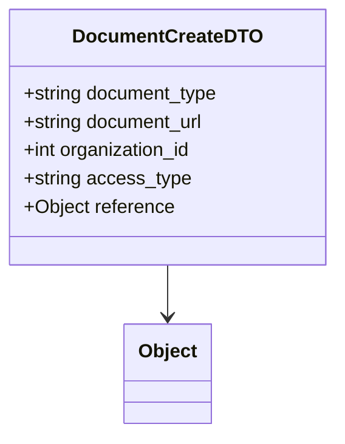

# Diagram: common/document_service/src/api/schemas/models/document_create_dto.py

> Auto-generated by Obscura crawlers

## Mermaid

### SVG

<svg id="container" width="282.09375" xmlns="http://www.w3.org/2000/svg" class="classDiagram" height="366" viewBox="0 0 282.09375 366" role="graphics-document document" aria-roledescription="class"><g><defs><marker id="container_class-aggregationStart" class="marker aggregation class" refX="18" refY="7" markerWidth="190" markerHeight="240" orient="auto"><path d="M 18,7 L9,13 L1,7 L9,1 Z"></path></marker></defs><defs><marker id="container_class-aggregationEnd" class="marker aggregation class" refX="1" refY="7" markerWidth="20" markerHeight="28" orient="auto"><path d="M 18,7 L9,13 L1,7 L9,1 Z"></path></marker></defs><defs><marker id="container_class-extensionStart" class="marker extension class" refX="18" refY="7" markerWidth="190" markerHeight="240" orient="auto"><path d="M 1,7 L18,13 V 1 Z"></path></marker></defs><defs><marker id="container_class-extensionEnd" class="marker extension class" refX="1" refY="7" markerWidth="20" markerHeight="28" orient="auto"><path d="M 1,1 V 13 L18,7 Z"></path></marker></defs><defs><marker id="container_class-compositionStart" class="marker composition class" refX="18" refY="7" markerWidth="190" markerHeight="240" orient="auto"><path d="M 18,7 L9,13 L1,7 L9,1 Z"></path></marker></defs><defs><marker id="container_class-compositionEnd" class="marker composition class" refX="1" refY="7" markerWidth="20" markerHeight="28" orient="auto"><path d="M 18,7 L9,13 L1,7 L9,1 Z"></path></marker></defs><defs><marker id="container_class-dependencyStart" class="marker dependency class" refX="6" refY="7" markerWidth="190" markerHeight="240" orient="auto"><path d="M 5,7 L9,13 L1,7 L9,1 Z"></path></marker></defs><defs><marker id="container_class-dependencyEnd" class="marker dependency class" refX="13" refY="7" markerWidth="20" markerHeight="28" orient="auto"><path d="M 18,7 L9,13 L14,7 L9,1 Z"></path></marker></defs><defs><marker id="container_class-lollipopStart" class="marker lollipop class" refX="13" refY="7" markerWidth="190" markerHeight="240" orient="auto"><circle stroke="black" fill="transparent" cx="7" cy="7" r="6"></circle></marker></defs><defs><marker id="container_class-lollipopEnd" class="marker lollipop class" refX="1" refY="7" markerWidth="190" markerHeight="240" orient="auto"><circle stroke="black" fill="transparent" cx="7" cy="7" r="6"></circle></marker></defs><g class="root"><g class="clusters"></g><g class="edgePaths"><path d="M141.047,224L141.047,228.167C141.047,232.333,141.047,240.667,141.047,248C141.047,255.333,141.047,261.667,141.047,264.833L141.047,268" id="id_DocumentCreateDTO_Object_1" class="edge-thickness-normal edge-pattern-solid relation" style=";;;" data-edge="true" data-et="edge" data-id="id_DocumentCreateDTO_Object_1" data-points="W3sieCI6MTQxLjA0Njg3NSwieSI6MjI0fSx7IngiOjE0MS4wNDY4NzUsInkiOjI0OX0seyJ4IjoxNDEuMDQ2ODc1LCJ5IjoyNzR9XQ==" marker-end="url(#container_class-dependencyEnd)"></path></g><g class="edgeLabels"><g class="edgeLabel"><g class="label" data-id="id_DocumentCreateDTO_Object_1" transform="translate(0, 0)"><foreignObject width="0" height="0">

</foreignObject></g></g></g><g class="nodes"><g class="node default" id="classId-Object-0" transform="translate(141.046875, 316)"><g class="basic label-container"><path d="M-35.890625 -42 L35.890625 -42 L35.890625 42 L-35.890625 42" stroke="none" stroke-width="0" fill="#ECECFF" style=""></path><path d="M-35.890625 -42 C-19.649351227225484 -42, -3.408077454450968 -42, 35.890625 -42 M-35.890625 -42 C-12.161847778672794 -42, 11.566929442654413 -42, 35.890625 -42 M35.890625 -42 C35.890625 -14.855929728087027, 35.890625 12.288140543825946, 35.890625 42 M35.890625 -42 C35.890625 -22.69110798296349, 35.890625 -3.3822159659269815, 35.890625 42 M35.890625 42 C11.265202957398817 42, -13.360219085202367 42, -35.890625 42 M35.890625 42 C17.751717678076407 42, -0.38718964384718646 42, -35.890625 42 M-35.890625 42 C-35.890625 24.213880017281333, -35.890625 6.427760034562667, -35.890625 -42 M-35.890625 42 C-35.890625 21.504263459784973, -35.890625 1.0085269195699453, -35.890625 -42" stroke="#9370DB" stroke-width="1.3" fill="none" stroke-dasharray="0 0" style=""></path></g><g class="annotation-group text" transform="translate(0, -18)"></g><g class="label-group text" transform="translate(-23.890625, -18)"><g class="label" style="font-weight: bolder" transform="translate(0,-12)"><foreignObject width="47.78125" height="24">

Object

</foreignObject></g></g><g class="members-group text" transform="translate(-23.890625, 30)"></g><g class="methods-group text" transform="translate(-23.890625, 60)"></g><g class="divider" style=""><path d="M-35.890625 6 C-11.042323922741911 6, 13.805977154516178 6, 35.890625 6 M-35.890625 6 C-16.278243480589087 6, 3.334138038821827 6, 35.890625 6" stroke="#9370DB" stroke-width="1.3" fill="none" stroke-dasharray="0 0" style=""></path></g><g class="divider" style=""><path d="M-35.890625 24 C-14.375973741941799 24, 7.138677516116402 24, 35.890625 24 M-35.890625 24 C-13.253603452285038 24, 9.383418095429924 24, 35.890625 24" stroke="#9370DB" stroke-width="1.3" fill="none" stroke-dasharray="0 0" style=""></path></g></g><g class="node default" id="classId-DocumentCreateDTO-1" transform="translate(141.046875, 116)"><g class="basic label-container"><path d="M-133.046875 -108 L133.046875 -108 L133.046875 108 L-133.046875 108" stroke="none" stroke-width="0" fill="#ECECFF" style=""></path><path d="M-133.046875 -108 C-72.809626788814 -108, -12.572378577628015 -108, 133.046875 -108 M-133.046875 -108 C-27.920525526257393 -108, 77.20582394748521 -108, 133.046875 -108 M133.046875 -108 C133.046875 -42.88371897404036, 133.046875 22.232562051919274, 133.046875 108 M133.046875 -108 C133.046875 -25.17585771582509, 133.046875 57.64828456834982, 133.046875 108 M133.046875 108 C37.747694100271815 108, -57.55148679945637 108, -133.046875 108 M133.046875 108 C68.07005126103175 108, 3.0932275220635006 108, -133.046875 108 M-133.046875 108 C-133.046875 63.6682446198899, -133.046875 19.336489239779795, -133.046875 -108 M-133.046875 108 C-133.046875 46.14143814792058, -133.046875 -15.717123704158837, -133.046875 -108" stroke="#9370DB" stroke-width="1.3" fill="none" stroke-dasharray="0 0" style=""></path></g><g class="annotation-group text" transform="translate(0, -84)"></g><g class="label-group text" transform="translate(-75.140625, -84)"><g class="label" style="font-weight: bolder" transform="translate(0,-12)"><foreignObject width="150.28125" height="24">

DocumentCreateDTO

</foreignObject></g></g><g class="members-group text" transform="translate(-121.046875, -36)"><g class="label" style="" transform="translate(0,-12)"><foreignObject width="166.953125" height="24">

+string document_type

</foreignObject></g><g class="label" style="" transform="translate(0,12)"><foreignObject width="155.34375" height="24">

+string document_url

</foreignObject></g><g class="label" style="" transform="translate(0,36)"><foreignObject width="144.640625" height="24">

+int organization_id

</foreignObject></g><g class="label" style="" transform="translate(0,60)"><foreignObject width="140.203125" height="24">

+string access_type

</foreignObject></g><g class="label" style="" transform="translate(0,84)"><foreignObject width="127.609375" height="24">

+Object reference

</foreignObject></g></g><g class="methods-group text" transform="translate(-121.046875, 108)"></g><g class="divider" style=""><path d="M-133.046875 -60 C-53.00464907074446 -60, 27.037576858511073 -60, 133.046875 -60 M-133.046875 -60 C-36.305462542560804 -60, 60.43594991487839 -60, 133.046875 -60" stroke="#9370DB" stroke-width="1.3" fill="none" stroke-dasharray="0 0" style=""></path></g><g class="divider" style=""><path d="M-133.046875 84 C-51.66595761380795 84, 29.714959772384105 84, 133.046875 84 M-133.046875 84 C-61.40462263353737 84, 10.237629732925257 84, 133.046875 84" stroke="#9370DB" stroke-width="1.3" fill="none" stroke-dasharray="0 0" style=""></path></g></g></g></g></g></svg>
