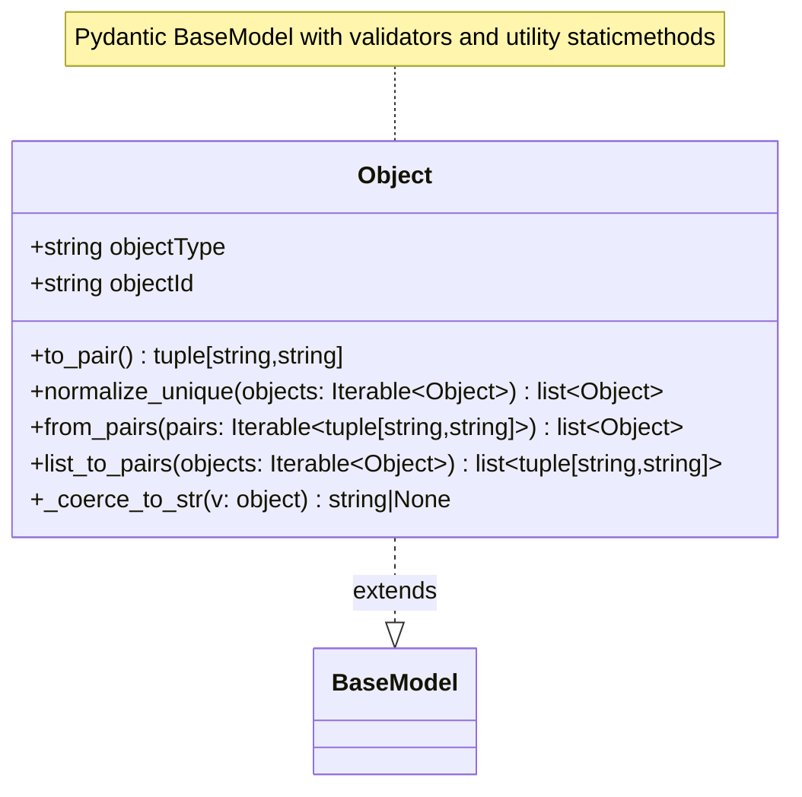

# Diagram: common/document_service/src/api/schemas/models/object_ref.py

> Auto-generated by Obscura crawlers

## Mermaid

### SVG

<svg id="container" width="538.0625" xmlns="http://www.w3.org/2000/svg" class="classDiagram" height="524" viewBox="0 0 538.0625 524" role="graphics-document document" aria-roledescription="class"><g><defs><marker id="container_class-aggregationStart" class="marker aggregation class" refX="18" refY="7" markerWidth="190" markerHeight="240" orient="auto"><path d="M 18,7 L9,13 L1,7 L9,1 Z"></path></marker></defs><defs><marker id="container_class-aggregationEnd" class="marker aggregation class" refX="1" refY="7" markerWidth="20" markerHeight="28" orient="auto"><path d="M 18,7 L9,13 L1,7 L9,1 Z"></path></marker></defs><defs><marker id="container_class-extensionStart" class="marker extension class" refX="18" refY="7" markerWidth="190" markerHeight="240" orient="auto"><path d="M 1,7 L18,13 V 1 Z"></path></marker></defs><defs><marker id="container_class-extensionEnd" class="marker extension class" refX="1" refY="7" markerWidth="20" markerHeight="28" orient="auto"><path d="M 1,1 V 13 L18,7 Z"></path></marker></defs><defs><marker id="container_class-compositionStart" class="marker composition class" refX="18" refY="7" markerWidth="190" markerHeight="240" orient="auto"><path d="M 18,7 L9,13 L1,7 L9,1 Z"></path></marker></defs><defs><marker id="container_class-compositionEnd" class="marker composition class" refX="1" refY="7" markerWidth="20" markerHeight="28" orient="auto"><path d="M 18,7 L9,13 L1,7 L9,1 Z"></path></marker></defs><defs><marker id="container_class-dependencyStart" class="marker dependency class" refX="6" refY="7" markerWidth="190" markerHeight="240" orient="auto"><path d="M 5,7 L9,13 L1,7 L9,1 Z"></path></marker></defs><defs><marker id="container_class-dependencyEnd" class="marker dependency class" refX="13" refY="7" markerWidth="20" markerHeight="28" orient="auto"><path d="M 18,7 L9,13 L14,7 L9,1 Z"></path></marker></defs><defs><marker id="container_class-lollipopStart" class="marker lollipop class" refX="13" refY="7" markerWidth="190" markerHeight="240" orient="auto"><circle stroke="black" fill="transparent" cx="7" cy="7" r="6"></circle></marker></defs><defs><marker id="container_class-lollipopEnd" class="marker lollipop class" refX="1" refY="7" markerWidth="190" markerHeight="240" orient="auto"><circle stroke="black" fill="transparent" cx="7" cy="7" r="6"></circle></marker></defs><g class="root"><g class="clusters"></g><g class="edgePaths"><path d="M269.031,44L269.031,48.167C269.031,52.333,269.031,60.667,269.031,69C269.031,77.333,269.031,85.667,269.031,89.833L269.031,94" id="edgeNote1" class="edge-thickness-normal edge-pattern-dotted relation" style="fill: none;;;fill: none" data-edge="true" data-et="edge" data-id="edgeNote1" data-points="W3sieCI6MjY5LjAzMTI1LCJ5Ijo0NH0seyJ4IjoyNjkuMDMxMjUsInkiOjY5fSx7IngiOjI2OS4wMzEyNSwieSI6OTR9XQ=="></path><path d="M269.031,358L269.031,364.167C269.031,370.333,269.031,382.667,269.031,392.125C269.031,401.583,269.031,408.167,269.031,411.458L269.031,414.75" id="id_Object_BaseModel_1" class="edge-thickness-normal edge-pattern-dashed relation" style=";;;" data-edge="true" data-et="edge" data-id="id_Object_BaseModel_1" data-points="W3sieCI6MjY5LjAzMTI1LCJ5IjozNTh9LHsieCI6MjY5LjAzMTI1LCJ5IjozOTV9LHsieCI6MjY5LjAzMTI1LCJ5Ijo0MzJ9XQ==" marker-end="url(#container_class-extensionEnd)"></path></g><g class="edgeLabels"><g class="edgeLabel"><g class="label" data-id="edgeNote1" transform="translate(0, 0)"><foreignObject width="0" height="0">

</foreignObject></g></g><g class="edgeLabel" transform="translate(269.03125, 395)"><g class="label" data-id="id_Object_BaseModel_1" transform="translate(-28.5078125, -12)"><foreignObject width="57.015625" height="24">

extends

</foreignObject></g></g></g><g class="nodes"><g class="node default" id="classId-Object-0" transform="translate(269.03125, 226)"><g class="basic label-container"><path d="M-261.03125 -132 L261.03125 -132 L261.03125 132 L-261.03125 132" stroke="none" stroke-width="0" fill="#ECECFF" style=""></path><path d="M-261.03125 -132 C-57.196887882315565 -132, 146.63747423536887 -132, 261.03125 -132 M-261.03125 -132 C-99.33500342476322 -132, 62.36124315047357 -132, 261.03125 -132 M261.03125 -132 C261.03125 -55.71874115548428, 261.03125 20.562517689031438, 261.03125 132 M261.03125 -132 C261.03125 -27.87704170109987, 261.03125 76.24591659780026, 261.03125 132 M261.03125 132 C82.49266335536305 132, -96.0459232892739 132, -261.03125 132 M261.03125 132 C115.6890615256055 132, -29.65312694878901 132, -261.03125 132 M-261.03125 132 C-261.03125 65.95284546192532, -261.03125 -0.0943090761493579, -261.03125 -132 M-261.03125 132 C-261.03125 77.92106899765093, -261.03125 23.84213799530187, -261.03125 -132" stroke="#9370DB" stroke-width="1.3" fill="none" stroke-dasharray="0 0" style=""></path></g><g class="annotation-group text" transform="translate(0, -108)"></g><g class="label-group text" transform="translate(-23.890625, -108)"><g class="label" style="font-weight: bolder" transform="translate(0,-12)"><foreignObject width="47.78125" height="24">

Object

</foreignObject></g></g><g class="members-group text" transform="translate(-249.03125, -60)"><g class="label" style="" transform="translate(0,-12)"><foreignObject width="133.0625" height="24">

+string objectType

</foreignObject></g><g class="label" style="" transform="translate(0,12)"><foreignObject width="113.625" height="24">

+string objectId

</foreignObject></g></g><g class="methods-group text" transform="translate(-249.03125, 12)"><g class="label" style="" transform="translate(0,-12)"><foreignObject width="217.609375" height="24">

+to_pair() : tuple[string,string]

</foreignObject></g><g class="label" style="" transform="translate(0,12)"><foreignObject width="427.109375" height="24">

+normalize_unique(objects: Iterable&lt;Object&gt;) : list&lt;Object&gt;

</foreignObject></g><g class="label" style="" transform="translate(0,36)"><foreignObject width="446.0625" height="24">

+from_pairs(pairs: Iterable&lt;tuple[string,string]&gt;) : list&lt;Object&gt;

</foreignObject></g><g class="label" style="" transform="translate(0,60)"><foreignObject width="474.171875" height="24">

+list_to_pairs(objects: Iterable&lt;Object&gt;) : list&lt;tuple[string,string]&gt;

</foreignObject></g><g class="label" style="" transform="translate(0,84)"><foreignObject width="282.453125" height="24">

+_coerce_to_str(v: object) : string|None

</foreignObject></g></g><g class="divider" style=""><path d="M-261.03125 -84 C-59.39952142520136 -84, 142.2322071495973 -84, 261.03125 -84 M-261.03125 -84 C-135.6198306156597 -84, -10.208411231319417 -84, 261.03125 -84" stroke="#9370DB" stroke-width="1.3" fill="none" stroke-dasharray="0 0" style=""></path></g><g class="divider" style=""><path d="M-261.03125 -12 C-111.66494488587841 -12, 37.701360228243175 -12, 261.03125 -12 M-261.03125 -12 C-156.4773705347172 -12, -51.92349106943442 -12, 261.03125 -12" stroke="#9370DB" stroke-width="1.3" fill="none" stroke-dasharray="0 0" style=""></path></g></g><g class="node default" id="classId-BaseModel-1" transform="translate(269.03125, 474)"><g class="basic label-container"><path d="M-52.078125 -42 L52.078125 -42 L52.078125 42 L-52.078125 42" stroke="none" stroke-width="0" fill="#ECECFF" style=""></path><path d="M-52.078125 -42 C-14.979428058240387 -42, 22.119268883519226 -42, 52.078125 -42 M-52.078125 -42 C-13.777429699885431 -42, 24.523265600229138 -42, 52.078125 -42 M52.078125 -42 C52.078125 -20.097373391323977, 52.078125 1.8052532173520461, 52.078125 42 M52.078125 -42 C52.078125 -17.524339364618417, 52.078125 6.951321270763167, 52.078125 42 M52.078125 42 C30.999751760895258 42, 9.921378521790515 42, -52.078125 42 M52.078125 42 C21.370312200162523 42, -9.337500599674954 42, -52.078125 42 M-52.078125 42 C-52.078125 9.577787751357967, -52.078125 -22.844424497284066, -52.078125 -42 M-52.078125 42 C-52.078125 18.963498423367707, -52.078125 -4.073003153264587, -52.078125 -42" stroke="#9370DB" stroke-width="1.3" fill="none" stroke-dasharray="0 0" style=""></path></g><g class="annotation-group text" transform="translate(0, -18)"></g><g class="label-group text" transform="translate(-40.078125, -18)"><g class="label" style="font-weight: bolder" transform="translate(0,-12)"><foreignObject width="80.15625" height="24">

BaseModel

</foreignObject></g></g><g class="members-group text" transform="translate(-40.078125, 30)"></g><g class="methods-group text" transform="translate(-40.078125, 60)"></g><g class="divider" style=""><path d="M-52.078125 6 C-24.177581708010617 6, 3.7229615839787655 6, 52.078125 6 M-52.078125 6 C-27.371171214401276 6, -2.6642174288025515 6, 52.078125 6" stroke="#9370DB" stroke-width="1.3" fill="none" stroke-dasharray="0 0" style=""></path></g><g class="divider" style=""><path d="M-52.078125 24 C-12.727094917883974 24, 26.62393516423205 24, 52.078125 24 M-52.078125 24 C-24.260547129652572 24, 3.557030740694856 24, 52.078125 24" stroke="#9370DB" stroke-width="1.3" fill="none" stroke-dasharray="0 0" style=""></path></g></g><g class="node undefined" id="note0" transform="translate(269.03125, 26)"><g class="basic label-container"><path d="M-228.0546875 -18 L228.0546875 -18 L228.0546875 18 L-228.0546875 18" stroke="none" stroke-width="0" fill="#fff5ad" style="fill:#fff5ad !important;stroke:#aaaa33 !important"></path><path d="M-228.0546875 -18 C-91.25001293831977 -18, 45.55466162336046 -18, 228.0546875 -18 M-228.0546875 -18 C-113.98455507147392 -18, 0.08557735705215919 -18, 228.0546875 -18 M228.0546875 -18 C228.0546875 -6.243996126861276, 228.0546875 5.5120077462774475, 228.0546875 18 M228.0546875 -18 C228.0546875 -8.02657379584481, 228.0546875 1.9468524083103809, 228.0546875 18 M228.0546875 18 C134.23204544503795 18, 40.40940339007591 18, -228.0546875 18 M228.0546875 18 C67.04681383393199 18, -93.96105983213602 18, -228.0546875 18 M-228.0546875 18 C-228.0546875 7.125631503209352, -228.0546875 -3.7487369935812964, -228.0546875 -18 M-228.0546875 18 C-228.0546875 7.927646304650356, -228.0546875 -2.1447073906992884, -228.0546875 -18" stroke="#aaaa33" stroke-width="1.3" fill="none" stroke-dasharray="0 0" style="fill:#fff5ad !important;stroke:#aaaa33 !important"></path></g><g class="label" style="text-align:left !important;white-space:nowrap !important" transform="translate(-222.0546875, -12)"><rect></rect><foreignObject width="444.109375" height="24">

Pydantic BaseModel with validators and utility staticmethods

</foreignObject></g></g></g></g></g></svg>
