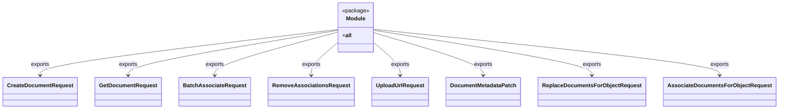

# Diagram: common/document_service/src/api/schemas/requests/__init__.py

> Auto-generated by Obscura crawlers

## Mermaid

### SVG

<svg id="container" width="2150.21875" xmlns="http://www.w3.org/2000/svg" class="classDiagram" height="318" viewBox="0 0 2150.21875 318" role="graphics-document document" aria-roledescription="class"><g><defs><marker id="container_class-aggregationStart" class="marker aggregation class" refX="18" refY="7" markerWidth="190" markerHeight="240" orient="auto"><path d="M 18,7 L9,13 L1,7 L9,1 Z"></path></marker></defs><defs><marker id="container_class-aggregationEnd" class="marker aggregation class" refX="1" refY="7" markerWidth="20" markerHeight="28" orient="auto"><path d="M 18,7 L9,13 L1,7 L9,1 Z"></path></marker></defs><defs><marker id="container_class-extensionStart" class="marker extension class" refX="18" refY="7" markerWidth="190" markerHeight="240" orient="auto"><path d="M 1,7 L18,13 V 1 Z"></path></marker></defs><defs><marker id="container_class-extensionEnd" class="marker extension class" refX="1" refY="7" markerWidth="20" markerHeight="28" orient="auto"><path d="M 1,1 V 13 L18,7 Z"></path></marker></defs><defs><marker id="container_class-compositionStart" class="marker composition class" refX="18" refY="7" markerWidth="190" markerHeight="240" orient="auto"><path d="M 18,7 L9,13 L1,7 L9,1 Z"></path></marker></defs><defs><marker id="container_class-compositionEnd" class="marker composition class" refX="1" refY="7" markerWidth="20" markerHeight="28" orient="auto"><path d="M 18,7 L9,13 L1,7 L9,1 Z"></path></marker></defs><defs><marker id="container_class-dependencyStart" class="marker dependency class" refX="6" refY="7" markerWidth="190" markerHeight="240" orient="auto"><path d="M 5,7 L9,13 L1,7 L9,1 Z"></path></marker></defs><defs><marker id="container_class-dependencyEnd" class="marker dependency class" refX="13" refY="7" markerWidth="20" markerHeight="28" orient="auto"><path d="M 18,7 L9,13 L14,7 L9,1 Z"></path></marker></defs><defs><marker id="container_class-lollipopStart" class="marker lollipop class" refX="13" refY="7" markerWidth="190" markerHeight="240" orient="auto"><circle stroke="black" fill="transparent" cx="7" cy="7" r="6"></circle></marker></defs><defs><marker id="container_class-lollipopEnd" class="marker lollipop class" refX="1" refY="7" markerWidth="190" markerHeight="240" orient="auto"><circle stroke="black" fill="transparent" cx="7" cy="7" r="6"></circle></marker></defs><g class="root"><g class="clusters"></g><g class="edgePaths"><path d="M931.453,86.313L794.647,103.427C657.841,120.542,384.229,154.771,247.423,177.052C110.617,199.333,110.617,209.667,110.617,214.833L110.617,220" id="id_Module_CreateDocumentRequest_1" class="edge-thickness-normal edge-pattern-solid relation" style=";;;" data-edge="true" data-et="edge" data-id="id_Module_CreateDocumentRequest_1" data-points="W3sieCI6OTMxLjQ1MzEyNSwieSI6ODYuMzEyNzA3MzUwNzUyMjl9LHsieCI6MTEwLjYxNzE4NzUsInkiOjE4OX0seyJ4IjoxMTAuNjE3MTg3NSwieSI6MjI2fV0=" marker-end="url(#container_class-dependencyEnd)"></path><path d="M931.453,88.773L835.372,105.478C739.292,122.182,547.13,155.591,451.049,177.462C354.969,199.333,354.969,209.667,354.969,214.833L354.969,220" id="id_Module_GetDocumentRequest_2" class="edge-thickness-normal edge-pattern-solid relation" style=";;;" data-edge="true" data-et="edge" data-id="id_Module_GetDocumentRequest_2" data-points="W3sieCI6OTMxLjQ1MzEyNSwieSI6ODguNzczMDgxMjg0NTAxOTh9LHsieCI6MzU0Ljk2ODc1LCJ5IjoxODl9LHsieCI6MzU0Ljk2ODc1LCJ5IjoyMjZ9XQ==" marker-end="url(#container_class-dependencyEnd)"></path><path d="M931.453,94.19L875.259,109.991C819.065,125.793,706.677,157.397,650.483,178.365C594.289,199.333,594.289,209.667,594.289,214.833L594.289,220" id="id_Module_BatchAssociateRequest_3" class="edge-thickness-normal edge-pattern-solid relation" style=";;;" data-edge="true" data-et="edge" data-id="id_Module_BatchAssociateRequest_3" data-points="W3sieCI6OTMxLjQ1MzEyNSwieSI6OTQuMTg5NTk2MDk4MDMyOX0seyJ4Ijo1OTQuMjg5MDYyNSwieSI6MTg5fSx7IngiOjU5NC4yODkwNjI1LCJ5IjoyMjZ9XQ==" marker-end="url(#container_class-dependencyEnd)"></path><path d="M931.453,124.729L919.368,135.441C907.284,146.153,883.115,167.576,871.03,183.455C858.945,199.333,858.945,209.667,858.945,214.833L858.945,220" id="id_Module_RemoveAssociationsRequest_4" class="edge-thickness-normal edge-pattern-solid relation" style=";;;" data-edge="true" data-et="edge" data-id="id_Module_RemoveAssociationsRequest_4" data-points="W3sieCI6OTMxLjQ1MzEyNSwieSI6MTI0LjcyODc4MDE3Nzg5MDczfSx7IngiOjg1OC45NDUzMTI1LCJ5IjoxODl9LHsieCI6ODU4Ljk0NTMxMjUsInkiOjIyNn1d" marker-end="url(#container_class-dependencyEnd)"></path><path d="M1032.375,124.729L1044.46,135.441C1056.544,146.153,1080.714,167.576,1092.798,183.455C1104.883,199.333,1104.883,209.667,1104.883,214.833L1104.883,220" id="id_Module_UploadUrlRequest_5" class="edge-thickness-normal edge-pattern-solid relation" style=";;;" data-edge="true" data-et="edge" data-id="id_Module_UploadUrlRequest_5" data-points="W3sieCI6MTAzMi4zNzUsInkiOjEyNC43Mjg3ODAxNzc4OTA3M30seyJ4IjoxMTA0Ljg4MjgxMjUsInkiOjE4OX0seyJ4IjoxMTA0Ljg4MjgxMjUsInkiOjIyNn1d" marker-end="url(#container_class-dependencyEnd)"></path><path d="M1032.375,95.462L1083.253,111.052C1134.13,126.641,1235.885,157.821,1286.763,178.577C1337.641,199.333,1337.641,209.667,1337.641,214.833L1337.641,220" id="id_Module_DocumentMetadataPatch_6" class="edge-thickness-normal edge-pattern-solid relation" style=";;;" data-edge="true" data-et="edge" data-id="id_Module_DocumentMetadataPatch_6" data-points="W3sieCI6MTAzMi4zNzUsInkiOjk1LjQ2MTk5NDU5NzMyNTAyfSx7IngiOjEzMzcuNjQwNjI1LCJ5IjoxODl9LHsieCI6MTMzNy42NDA2MjUsInkiOjIyNn1d" marker-end="url(#container_class-dependencyEnd)"></path><path d="M1032.375,88.375L1133.423,105.146C1234.471,121.917,1436.568,155.458,1537.616,177.396C1638.664,199.333,1638.664,209.667,1638.664,214.833L1638.664,220" id="id_Module_ReplaceDocumentsForObjectRequest_7" class="edge-thickness-normal edge-pattern-solid relation" style=";;;" data-edge="true" data-et="edge" data-id="id_Module_ReplaceDocumentsForObjectRequest_7" data-points="W3sieCI6MTAzMi4zNzUsInkiOjg4LjM3NDk0MDUyMTUwNzQzfSx7IngiOjE2MzguNjY0MDYyNSwieSI6MTg5fSx7IngiOjE2MzguNjY0MDYyNSwieSI6MjI2fV0=" marker-end="url(#container_class-dependencyEnd)"></path><path d="M1032.375,85.461L1191.814,102.718C1351.253,119.974,1670.13,154.487,1829.569,176.91C1989.008,199.333,1989.008,209.667,1989.008,214.833L1989.008,220" id="id_Module_AssociateDocumentsForObjectRequest_8" class="edge-thickness-normal edge-pattern-solid relation" style=";;;" data-edge="true" data-et="edge" data-id="id_Module_AssociateDocumentsForObjectRequest_8" data-points="W3sieCI6MTAzMi4zNzUsInkiOjg1LjQ2MTQ5OTY3NDE4NjI0fSx7IngiOjE5ODkuMDA3ODEyNSwieSI6MTg5fSx7IngiOjE5ODkuMDA3ODEyNSwieSI6MjI2fV0=" marker-end="url(#container_class-dependencyEnd)"></path></g><g class="edgeLabels"><g class="edgeLabel" transform="translate(110.6171875, 189)"><g class="label" data-id="id_Module_CreateDocumentRequest_1" transform="translate(-27.3046875, -12)"><foreignObject width="54.609375" height="24">

exports

</foreignObject></g></g><g class="edgeLabel" transform="translate(354.96875, 189)"><g class="label" data-id="id_Module_GetDocumentRequest_2" transform="translate(-27.3046875, -12)"><foreignObject width="54.609375" height="24">

exports

</foreignObject></g></g><g class="edgeLabel" transform="translate(594.2890625, 189)"><g class="label" data-id="id_Module_BatchAssociateRequest_3" transform="translate(-27.3046875, -12)"><foreignObject width="54.609375" height="24">

exports

</foreignObject></g></g><g class="edgeLabel" transform="translate(858.9453125, 189)"><g class="label" data-id="id_Module_RemoveAssociationsRequest_4" transform="translate(-27.3046875, -12)"><foreignObject width="54.609375" height="24">

exports

</foreignObject></g></g><g class="edgeLabel" transform="translate(1104.8828125, 189)"><g class="label" data-id="id_Module_UploadUrlRequest_5" transform="translate(-27.3046875, -12)"><foreignObject width="54.609375" height="24">

exports

</foreignObject></g></g><g class="edgeLabel" transform="translate(1337.640625, 189)"><g class="label" data-id="id_Module_DocumentMetadataPatch_6" transform="translate(-27.3046875, -12)"><foreignObject width="54.609375" height="24">

exports

</foreignObject></g></g><g class="edgeLabel" transform="translate(1638.6640625, 189)"><g class="label" data-id="id_Module_ReplaceDocumentsForObjectRequest_7" transform="translate(-27.3046875, -12)"><foreignObject width="54.609375" height="24">

exports

</foreignObject></g></g><g class="edgeLabel" transform="translate(1989.0078125, 189)"><g class="label" data-id="id_Module_AssociateDocumentsForObjectRequest_8" transform="translate(-27.3046875, -12)"><foreignObject width="54.609375" height="24">

exports

</foreignObject></g></g></g><g class="nodes"><g class="node default" id="classId-Module-0" transform="translate(981.9140625, 80)"><g class="basic label-container"><path d="M-50.4609375 -72 L50.4609375 -72 L50.4609375 72 L-50.4609375 72" stroke="none" stroke-width="0" fill="#ECECFF" style=""></path><path d="M-50.4609375 -72 C-16.377809918547285 -72, 17.70531766290543 -72, 50.4609375 -72 M-50.4609375 -72 C-28.116910193382886 -72, -5.772882886765771 -72, 50.4609375 -72 M50.4609375 -72 C50.4609375 -15.415866283070073, 50.4609375 41.16826743385985, 50.4609375 72 M50.4609375 -72 C50.4609375 -21.361098226023245, 50.4609375 29.27780354795351, 50.4609375 72 M50.4609375 72 C17.860401371248678 72, -14.740134757502645 72, -50.4609375 72 M50.4609375 72 C24.62541154864354 72, -1.210114402712918 72, -50.4609375 72 M-50.4609375 72 C-50.4609375 36.751320934076034, -50.4609375 1.5026418681520681, -50.4609375 -72 M-50.4609375 72 C-50.4609375 21.97107654151609, -50.4609375 -28.05784691696782, -50.4609375 -72" stroke="#9370DB" stroke-width="1.3" fill="none" stroke-dasharray="0 0" style=""></path></g><g class="annotation-group text" transform="translate(-38.4609375, -48)"><g class="label" style="" transform="translate(0,-12)"><foreignObject width="76.921875" height="24">

«package»

</foreignObject></g></g><g class="label-group text" transform="translate(-27.09375, -24)"><g class="label" style="font-weight: bolder" transform="translate(0,-12)"><foreignObject width="54.1875" height="24">

Module

</foreignObject></g></g><g class="members-group text" transform="translate(-38.4609375, 24)"><g class="label" style="" transform="translate(0,-12)"><foreignObject width="26.109375" height="24">

+<strong>all</strong>

</foreignObject></g></g><g class="methods-group text" transform="translate(-38.4609375, 72)"></g><g class="divider" style=""><path d="M-50.4609375 0 C-16.602888030547568 0, 17.255161438904864 0, 50.4609375 0 M-50.4609375 0 C-19.885380285412033 0, 10.690176929175934 0, 50.4609375 0" stroke="#9370DB" stroke-width="1.3" fill="none" stroke-dasharray="0 0" style=""></path></g><g class="divider" style=""><path d="M-50.4609375 48 C-13.030492475270123 48, 24.399952549459755 48, 50.4609375 48 M-50.4609375 48 C-27.083499012113425 48, -3.7060605242268494 48, 50.4609375 48" stroke="#9370DB" stroke-width="1.3" fill="none" stroke-dasharray="0 0" style=""></path></g></g><g class="node default" id="classId-CreateDocumentRequest-1" transform="translate(110.6171875, 268)"><g class="basic label-container"><path d="M-102.6171875 -42 L102.6171875 -42 L102.6171875 42 L-102.6171875 42" stroke="none" stroke-width="0" fill="#ECECFF" style=""></path><path d="M-102.6171875 -42 C-28.181638945575344 -42, 46.25390960884931 -42, 102.6171875 -42 M-102.6171875 -42 C-58.65825024106834 -42, -14.699312982136675 -42, 102.6171875 -42 M102.6171875 -42 C102.6171875 -24.328931667405442, 102.6171875 -6.657863334810884, 102.6171875 42 M102.6171875 -42 C102.6171875 -11.707801672957643, 102.6171875 18.584396654084713, 102.6171875 42 M102.6171875 42 C36.969470403774125 42, -28.67824669245175 42, -102.6171875 42 M102.6171875 42 C48.16969154903585 42, -6.277804401928293 42, -102.6171875 42 M-102.6171875 42 C-102.6171875 8.455316282857247, -102.6171875 -25.089367434285506, -102.6171875 -42 M-102.6171875 42 C-102.6171875 11.544512870733783, -102.6171875 -18.910974258532434, -102.6171875 -42" stroke="#9370DB" stroke-width="1.3" fill="none" stroke-dasharray="0 0" style=""></path></g><g class="annotation-group text" transform="translate(0, -18)"></g><g class="label-group text" transform="translate(-90.6171875, -18)"><g class="label" style="font-weight: bolder" transform="translate(0,-12)"><foreignObject width="181.234375" height="24">

CreateDocumentRequest

</foreignObject></g></g><g class="members-group text" transform="translate(-90.6171875, 30)"></g><g class="methods-group text" transform="translate(-90.6171875, 60)"></g><g class="divider" style=""><path d="M-102.6171875 6 C-45.961603072012245 6, 10.69398135597551 6, 102.6171875 6 M-102.6171875 6 C-49.643905939530754 6, 3.3293756209384924 6, 102.6171875 6" stroke="#9370DB" stroke-width="1.3" fill="none" stroke-dasharray="0 0" style=""></path></g><g class="divider" style=""><path d="M-102.6171875 24 C-52.62985628800334 24, -2.6425250760066774 24, 102.6171875 24 M-102.6171875 24 C-40.086763682251075 24, 22.44366013549785 24, 102.6171875 24" stroke="#9370DB" stroke-width="1.3" fill="none" stroke-dasharray="0 0" style=""></path></g></g><g class="node default" id="classId-GetDocumentRequest-2" transform="translate(354.96875, 268)"><g class="basic label-container"><path d="M-91.734375 -42 L91.734375 -42 L91.734375 42 L-91.734375 42" stroke="none" stroke-width="0" fill="#ECECFF" style=""></path><path d="M-91.734375 -42 C-32.89317420506435 -42, 25.948026589871304 -42, 91.734375 -42 M-91.734375 -42 C-25.78636398918043 -42, 40.16164702163914 -42, 91.734375 -42 M91.734375 -42 C91.734375 -16.384840389910803, 91.734375 9.230319220178394, 91.734375 42 M91.734375 -42 C91.734375 -23.90087833032376, 91.734375 -5.80175666064752, 91.734375 42 M91.734375 42 C20.006508395291476 42, -51.72135820941705 42, -91.734375 42 M91.734375 42 C48.25987950831124 42, 4.785384016622487 42, -91.734375 42 M-91.734375 42 C-91.734375 8.502105835861457, -91.734375 -24.995788328277087, -91.734375 -42 M-91.734375 42 C-91.734375 10.360077964173549, -91.734375 -21.279844071652903, -91.734375 -42" stroke="#9370DB" stroke-width="1.3" fill="none" stroke-dasharray="0 0" style=""></path></g><g class="annotation-group text" transform="translate(0, -18)"></g><g class="label-group text" transform="translate(-79.734375, -18)"><g class="label" style="font-weight: bolder" transform="translate(0,-12)"><foreignObject width="159.46875" height="24">

GetDocumentRequest

</foreignObject></g></g><g class="members-group text" transform="translate(-79.734375, 30)"></g><g class="methods-group text" transform="translate(-79.734375, 60)"></g><g class="divider" style=""><path d="M-91.734375 6 C-31.840412314796104 6, 28.05355037040779 6, 91.734375 6 M-91.734375 6 C-34.27870067871049 6, 23.176973642579014 6, 91.734375 6" stroke="#9370DB" stroke-width="1.3" fill="none" stroke-dasharray="0 0" style=""></path></g><g class="divider" style=""><path d="M-91.734375 24 C-53.54605329075294 24, -15.357731581505874 24, 91.734375 24 M-91.734375 24 C-42.00661995996944 24, 7.721135080061117 24, 91.734375 24" stroke="#9370DB" stroke-width="1.3" fill="none" stroke-dasharray="0 0" style=""></path></g></g><g class="node default" id="classId-BatchAssociateRequest-3" transform="translate(594.2890625, 268)"><g class="basic label-container"><path d="M-97.5859375 -42 L97.5859375 -42 L97.5859375 42 L-97.5859375 42" stroke="none" stroke-width="0" fill="#ECECFF" style=""></path><path d="M-97.5859375 -42 C-22.18388465231007 -42, 53.21816819537986 -42, 97.5859375 -42 M-97.5859375 -42 C-30.050726916664928 -42, 37.484483666670144 -42, 97.5859375 -42 M97.5859375 -42 C97.5859375 -21.967141006005704, 97.5859375 -1.9342820120114084, 97.5859375 42 M97.5859375 -42 C97.5859375 -24.666888394191478, 97.5859375 -7.333776788382956, 97.5859375 42 M97.5859375 42 C39.28070980854228 42, -19.024517882915447 42, -97.5859375 42 M97.5859375 42 C29.647588259924376 42, -38.29076098015125 42, -97.5859375 42 M-97.5859375 42 C-97.5859375 11.136295233554094, -97.5859375 -19.727409532891812, -97.5859375 -42 M-97.5859375 42 C-97.5859375 23.116301322148555, -97.5859375 4.23260264429711, -97.5859375 -42" stroke="#9370DB" stroke-width="1.3" fill="none" stroke-dasharray="0 0" style=""></path></g><g class="annotation-group text" transform="translate(0, -18)"></g><g class="label-group text" transform="translate(-85.5859375, -18)"><g class="label" style="font-weight: bolder" transform="translate(0,-12)"><foreignObject width="171.171875" height="24">

BatchAssociateRequest

</foreignObject></g></g><g class="members-group text" transform="translate(-85.5859375, 30)"></g><g class="methods-group text" transform="translate(-85.5859375, 60)"></g><g class="divider" style=""><path d="M-97.5859375 6 C-46.68456484480004 6, 4.216807810399914 6, 97.5859375 6 M-97.5859375 6 C-53.94530875612564 6, -10.304680012251282 6, 97.5859375 6" stroke="#9370DB" stroke-width="1.3" fill="none" stroke-dasharray="0 0" style=""></path></g><g class="divider" style=""><path d="M-97.5859375 24 C-31.06714466691524 24, 35.45164816616952 24, 97.5859375 24 M-97.5859375 24 C-54.57090095597162 24, -11.555864411943233 24, 97.5859375 24" stroke="#9370DB" stroke-width="1.3" fill="none" stroke-dasharray="0 0" style=""></path></g></g><g class="node default" id="classId-RemoveAssociationsRequest-4" transform="translate(858.9453125, 268)"><g class="basic label-container"><path d="M-117.0703125 -42 L117.0703125 -42 L117.0703125 42 L-117.0703125 42" stroke="none" stroke-width="0" fill="#ECECFF" style=""></path><path d="M-117.0703125 -42 C-38.45455435030726 -42, 40.161203799385476 -42, 117.0703125 -42 M-117.0703125 -42 C-24.397437512071562 -42, 68.27543747585688 -42, 117.0703125 -42 M117.0703125 -42 C117.0703125 -16.76940766165996, 117.0703125 8.461184676680077, 117.0703125 42 M117.0703125 -42 C117.0703125 -12.547993425684435, 117.0703125 16.90401314863113, 117.0703125 42 M117.0703125 42 C59.46489376472003 42, 1.8594750294400626 42, -117.0703125 42 M117.0703125 42 C54.160070242422876 42, -8.750172015154249 42, -117.0703125 42 M-117.0703125 42 C-117.0703125 16.6934343552545, -117.0703125 -8.613131289491001, -117.0703125 -42 M-117.0703125 42 C-117.0703125 13.993272231806795, -117.0703125 -14.01345553638641, -117.0703125 -42" stroke="#9370DB" stroke-width="1.3" fill="none" stroke-dasharray="0 0" style=""></path></g><g class="annotation-group text" transform="translate(0, -18)"></g><g class="label-group text" transform="translate(-105.0703125, -18)"><g class="label" style="font-weight: bolder" transform="translate(0,-12)"><foreignObject width="210.140625" height="24">

RemoveAssociationsRequest

</foreignObject></g></g><g class="members-group text" transform="translate(-105.0703125, 30)"></g><g class="methods-group text" transform="translate(-105.0703125, 60)"></g><g class="divider" style=""><path d="M-117.0703125 6 C-32.124247132494716 6, 52.82181823501057 6, 117.0703125 6 M-117.0703125 6 C-34.3986687680203 6, 48.2729749639594 6, 117.0703125 6" stroke="#9370DB" stroke-width="1.3" fill="none" stroke-dasharray="0 0" style=""></path></g><g class="divider" style=""><path d="M-117.0703125 24 C-32.3027714220279 24, 52.464769655944195 24, 117.0703125 24 M-117.0703125 24 C-55.66877053695056 24, 5.7327714260988785 24, 117.0703125 24" stroke="#9370DB" stroke-width="1.3" fill="none" stroke-dasharray="0 0" style=""></path></g></g><g class="node default" id="classId-UploadUrlRequest-5" transform="translate(1104.8828125, 268)"><g class="basic label-container"><path d="M-78.8671875 -42 L78.8671875 -42 L78.8671875 42 L-78.8671875 42" stroke="none" stroke-width="0" fill="#ECECFF" style=""></path><path d="M-78.8671875 -42 C-22.348077151838382 -42, 34.171033196323236 -42, 78.8671875 -42 M-78.8671875 -42 C-35.19031991741807 -42, 8.486547665163855 -42, 78.8671875 -42 M78.8671875 -42 C78.8671875 -11.387809121979558, 78.8671875 19.224381756040884, 78.8671875 42 M78.8671875 -42 C78.8671875 -24.096852914983756, 78.8671875 -6.193705829967513, 78.8671875 42 M78.8671875 42 C38.87899453589831 42, -1.1091984282033849 42, -78.8671875 42 M78.8671875 42 C22.46934364431609 42, -33.92850021136782 42, -78.8671875 42 M-78.8671875 42 C-78.8671875 19.634072187158495, -78.8671875 -2.7318556256830107, -78.8671875 -42 M-78.8671875 42 C-78.8671875 19.361688441927065, -78.8671875 -3.2766231161458705, -78.8671875 -42" stroke="#9370DB" stroke-width="1.3" fill="none" stroke-dasharray="0 0" style=""></path></g><g class="annotation-group text" transform="translate(0, -18)"></g><g class="label-group text" transform="translate(-66.8671875, -18)"><g class="label" style="font-weight: bolder" transform="translate(0,-12)"><foreignObject width="133.734375" height="24">

UploadUrlRequest

</foreignObject></g></g><g class="members-group text" transform="translate(-66.8671875, 30)"></g><g class="methods-group text" transform="translate(-66.8671875, 60)"></g><g class="divider" style=""><path d="M-78.8671875 6 C-24.168119625784954 6, 30.530948248430093 6, 78.8671875 6 M-78.8671875 6 C-28.93926344834975 6, 20.988660603300502 6, 78.8671875 6" stroke="#9370DB" stroke-width="1.3" fill="none" stroke-dasharray="0 0" style=""></path></g><g class="divider" style=""><path d="M-78.8671875 24 C-21.556444109508632 24, 35.754299280982735 24, 78.8671875 24 M-78.8671875 24 C-36.17873529773451 24, 6.5097169045309755 24, 78.8671875 24" stroke="#9370DB" stroke-width="1.3" fill="none" stroke-dasharray="0 0" style=""></path></g></g><g class="node default" id="classId-DocumentMetadataPatch-6" transform="translate(1337.640625, 268)"><g class="basic label-container"><path d="M-103.890625 -42 L103.890625 -42 L103.890625 42 L-103.890625 42" stroke="none" stroke-width="0" fill="#ECECFF" style=""></path><path d="M-103.890625 -42 C-40.91306857276052 -42, 22.064487854478955 -42, 103.890625 -42 M-103.890625 -42 C-29.144446671811508 -42, 45.601731656376984 -42, 103.890625 -42 M103.890625 -42 C103.890625 -12.031275629308592, 103.890625 17.937448741382816, 103.890625 42 M103.890625 -42 C103.890625 -10.08074801892176, 103.890625 21.83850396215648, 103.890625 42 M103.890625 42 C58.357565026772356 42, 12.824505053544712 42, -103.890625 42 M103.890625 42 C56.69546195759211 42, 9.500298915184217 42, -103.890625 42 M-103.890625 42 C-103.890625 15.656539310099848, -103.890625 -10.686921379800303, -103.890625 -42 M-103.890625 42 C-103.890625 8.450357643592106, -103.890625 -25.099284712815788, -103.890625 -42" stroke="#9370DB" stroke-width="1.3" fill="none" stroke-dasharray="0 0" style=""></path></g><g class="annotation-group text" transform="translate(0, -18)"></g><g class="label-group text" transform="translate(-91.890625, -18)"><g class="label" style="font-weight: bolder" transform="translate(0,-12)"><foreignObject width="183.78125" height="24">

DocumentMetadataPatch

</foreignObject></g></g><g class="members-group text" transform="translate(-91.890625, 30)"></g><g class="methods-group text" transform="translate(-91.890625, 60)"></g><g class="divider" style=""><path d="M-103.890625 6 C-40.430470979917345 6, 23.02968304016531 6, 103.890625 6 M-103.890625 6 C-36.07246232091154 6, 31.74570035817692 6, 103.890625 6" stroke="#9370DB" stroke-width="1.3" fill="none" stroke-dasharray="0 0" style=""></path></g><g class="divider" style=""><path d="M-103.890625 24 C-22.188385581163956 24, 59.51385383767209 24, 103.890625 24 M-103.890625 24 C-44.770229717641904 24, 14.350165564716193 24, 103.890625 24" stroke="#9370DB" stroke-width="1.3" fill="none" stroke-dasharray="0 0" style=""></path></g></g><g class="node default" id="classId-ReplaceDocumentsForObjectRequest-7" transform="translate(1638.6640625, 268)"><g class="basic label-container"><path d="M-147.1328125 -42 L147.1328125 -42 L147.1328125 42 L-147.1328125 42" stroke="none" stroke-width="0" fill="#ECECFF" style=""></path><path d="M-147.1328125 -42 C-60.10082984666441 -42, 26.93115280667118 -42, 147.1328125 -42 M-147.1328125 -42 C-87.92190008318582 -42, -28.710987666371636 -42, 147.1328125 -42 M147.1328125 -42 C147.1328125 -12.223465026840348, 147.1328125 17.553069946319305, 147.1328125 42 M147.1328125 -42 C147.1328125 -9.544830496112894, 147.1328125 22.910339007774212, 147.1328125 42 M147.1328125 42 C35.18278539727949 42, -76.76724170544102 42, -147.1328125 42 M147.1328125 42 C69.25658571602023 42, -8.619641067959549 42, -147.1328125 42 M-147.1328125 42 C-147.1328125 8.844910592016255, -147.1328125 -24.31017881596749, -147.1328125 -42 M-147.1328125 42 C-147.1328125 11.203202043437859, -147.1328125 -19.593595913124283, -147.1328125 -42" stroke="#9370DB" stroke-width="1.3" fill="none" stroke-dasharray="0 0" style=""></path></g><g class="annotation-group text" transform="translate(0, -18)"></g><g class="label-group text" transform="translate(-135.1328125, -18)"><g class="label" style="font-weight: bolder" transform="translate(0,-12)"><foreignObject width="270.265625" height="24">

ReplaceDocumentsForObjectRequest

</foreignObject></g></g><g class="members-group text" transform="translate(-135.1328125, 30)"></g><g class="methods-group text" transform="translate(-135.1328125, 60)"></g><g class="divider" style=""><path d="M-147.1328125 6 C-77.95428290678952 6, -8.775753313579031 6, 147.1328125 6 M-147.1328125 6 C-50.199474578132396 6, 46.73386334373521 6, 147.1328125 6" stroke="#9370DB" stroke-width="1.3" fill="none" stroke-dasharray="0 0" style=""></path></g><g class="divider" style=""><path d="M-147.1328125 24 C-64.8990510474268 24, 17.33471040514641 24, 147.1328125 24 M-147.1328125 24 C-49.40249218512909 24, 48.32782812974182 24, 147.1328125 24" stroke="#9370DB" stroke-width="1.3" fill="none" stroke-dasharray="0 0" style=""></path></g></g><g class="node default" id="classId-AssociateDocumentsForObjectRequest-8" transform="translate(1989.0078125, 268)"><g class="basic label-container"><path d="M-153.2109375 -42 L153.2109375 -42 L153.2109375 42 L-153.2109375 42" stroke="none" stroke-width="0" fill="#ECECFF" style=""></path><path d="M-153.2109375 -42 C-48.7441257793587 -42, 55.722685941282606 -42, 153.2109375 -42 M-153.2109375 -42 C-52.783224962871884 -42, 47.64448757425623 -42, 153.2109375 -42 M153.2109375 -42 C153.2109375 -11.407667565147165, 153.2109375 19.18466486970567, 153.2109375 42 M153.2109375 -42 C153.2109375 -13.793890144443143, 153.2109375 14.412219711113714, 153.2109375 42 M153.2109375 42 C83.52576844479526 42, 13.840599389590523 42, -153.2109375 42 M153.2109375 42 C47.84045842290709 42, -57.53002065418582 42, -153.2109375 42 M-153.2109375 42 C-153.2109375 14.838231366118933, -153.2109375 -12.323537267762134, -153.2109375 -42 M-153.2109375 42 C-153.2109375 17.52236390185089, -153.2109375 -6.955272196298218, -153.2109375 -42" stroke="#9370DB" stroke-width="1.3" fill="none" stroke-dasharray="0 0" style=""></path></g><g class="annotation-group text" transform="translate(0, -18)"></g><g class="label-group text" transform="translate(-141.2109375, -18)"><g class="label" style="font-weight: bolder" transform="translate(0,-12)"><foreignObject width="282.421875" height="24">

AssociateDocumentsForObjectRequest

</foreignObject></g></g><g class="members-group text" transform="translate(-141.2109375, 30)"></g><g class="methods-group text" transform="translate(-141.2109375, 60)"></g><g class="divider" style=""><path d="M-153.2109375 6 C-30.926389746616096 6, 91.35815800676781 6, 153.2109375 6 M-153.2109375 6 C-71.20358685757171 6, 10.803763784856585 6, 153.2109375 6" stroke="#9370DB" stroke-width="1.3" fill="none" stroke-dasharray="0 0" style=""></path></g><g class="divider" style=""><path d="M-153.2109375 24 C-62.20246333262786 24, 28.806010834744285 24, 153.2109375 24 M-153.2109375 24 C-41.62594960031612 24, 69.95903829936776 24, 153.2109375 24" stroke="#9370DB" stroke-width="1.3" fill="none" stroke-dasharray="0 0" style=""></path></g></g></g></g></g></svg>
