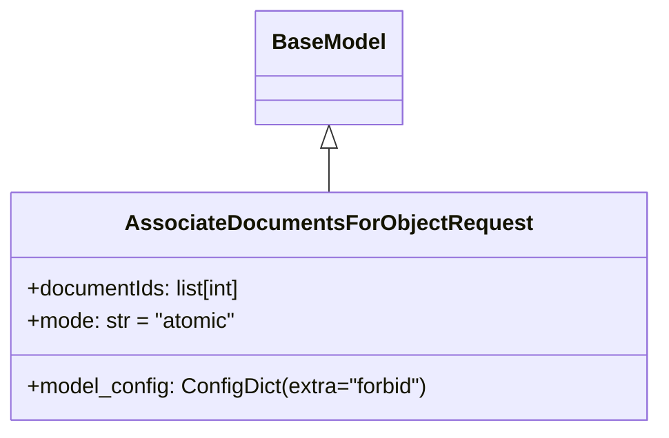

# Diagram: common/document_service/src/api/schemas/requests/associate_documents_for_object_request.py

> Auto-generated by Obscura crawlers

## Mermaid

### SVG

<svg id="container" width="479.8828125" xmlns="http://www.w3.org/2000/svg" class="classDiagram" height="318" viewBox="0 0 479.8828125 318" role="graphics-document document" aria-roledescription="class"><g><defs><marker id="container_class-aggregationStart" class="marker aggregation class" refX="18" refY="7" markerWidth="190" markerHeight="240" orient="auto"><path d="M 18,7 L9,13 L1,7 L9,1 Z"></path></marker></defs><defs><marker id="container_class-aggregationEnd" class="marker aggregation class" refX="1" refY="7" markerWidth="20" markerHeight="28" orient="auto"><path d="M 18,7 L9,13 L1,7 L9,1 Z"></path></marker></defs><defs><marker id="container_class-extensionStart" class="marker extension class" refX="18" refY="7" markerWidth="190" markerHeight="240" orient="auto"><path d="M 1,7 L18,13 V 1 Z"></path></marker></defs><defs><marker id="container_class-extensionEnd" class="marker extension class" refX="1" refY="7" markerWidth="20" markerHeight="28" orient="auto"><path d="M 1,1 V 13 L18,7 Z"></path></marker></defs><defs><marker id="container_class-compositionStart" class="marker composition class" refX="18" refY="7" markerWidth="190" markerHeight="240" orient="auto"><path d="M 18,7 L9,13 L1,7 L9,1 Z"></path></marker></defs><defs><marker id="container_class-compositionEnd" class="marker composition class" refX="1" refY="7" markerWidth="20" markerHeight="28" orient="auto"><path d="M 18,7 L9,13 L1,7 L9,1 Z"></path></marker></defs><defs><marker id="container_class-dependencyStart" class="marker dependency class" refX="6" refY="7" markerWidth="190" markerHeight="240" orient="auto"><path d="M 5,7 L9,13 L1,7 L9,1 Z"></path></marker></defs><defs><marker id="container_class-dependencyEnd" class="marker dependency class" refX="13" refY="7" markerWidth="20" markerHeight="28" orient="auto"><path d="M 18,7 L9,13 L14,7 L9,1 Z"></path></marker></defs><defs><marker id="container_class-lollipopStart" class="marker lollipop class" refX="13" refY="7" markerWidth="190" markerHeight="240" orient="auto"><circle stroke="black" fill="transparent" cx="7" cy="7" r="6"></circle></marker></defs><defs><marker id="container_class-lollipopEnd" class="marker lollipop class" refX="1" refY="7" markerWidth="190" markerHeight="240" orient="auto"><circle stroke="black" fill="transparent" cx="7" cy="7" r="6"></circle></marker></defs><g class="root"><g class="clusters"></g><g class="edgePaths"><path d="M239.941,109.25L239.941,110.542C239.941,111.833,239.941,114.417,239.941,119.875C239.941,125.333,239.941,133.667,239.941,137.833L239.941,142" id="id_BaseModel_AssociateDocumentsForObjectRequest_1" class="edge-thickness-normal edge-pattern-solid relation" style=";;;" data-edge="true" data-et="edge" data-id="id_BaseModel_AssociateDocumentsForObjectRequest_1" data-points="W3sieCI6MjM5Ljk0MTQwNjI1LCJ5Ijo5Mn0seyJ4IjoyMzkuOTQxNDA2MjUsInkiOjExN30seyJ4IjoyMzkuOTQxNDA2MjUsInkiOjE0Mn1d" marker-start="url(#container_class-extensionStart)"></path></g><g class="edgeLabels"><g class="edgeLabel"><g class="label" data-id="id_BaseModel_AssociateDocumentsForObjectRequest_1" transform="translate(0, 0)"><foreignObject width="0" height="0">

</foreignObject></g></g></g><g class="nodes"><g class="node default" id="classId-BaseModel-0" transform="translate(239.94140625, 50)"><g class="basic label-container"><path d="M-52.078125 -42 L52.078125 -42 L52.078125 42 L-52.078125 42" stroke="none" stroke-width="0" fill="#ECECFF" style=""></path><path d="M-52.078125 -42 C-28.173334699915248 -42, -4.268544399830496 -42, 52.078125 -42 M-52.078125 -42 C-28.529932888495498 -42, -4.981740776990996 -42, 52.078125 -42 M52.078125 -42 C52.078125 -19.620730461373068, 52.078125 2.7585390772538645, 52.078125 42 M52.078125 -42 C52.078125 -9.471872867328187, 52.078125 23.056254265343625, 52.078125 42 M52.078125 42 C19.70810913113558 42, -12.661906737728842 42, -52.078125 42 M52.078125 42 C29.643108801262635 42, 7.208092602525269 42, -52.078125 42 M-52.078125 42 C-52.078125 21.514071257730084, -52.078125 1.0281425154601678, -52.078125 -42 M-52.078125 42 C-52.078125 19.371358584863597, -52.078125 -3.257282830272807, -52.078125 -42" stroke="#9370DB" stroke-width="1.3" fill="none" stroke-dasharray="0 0" style=""></path></g><g class="annotation-group text" transform="translate(0, -18)"></g><g class="label-group text" transform="translate(-40.078125, -18)"><g class="label" style="font-weight: bolder" transform="translate(0,-12)"><foreignObject width="80.15625" height="24">

BaseModel

</foreignObject></g></g><g class="members-group text" transform="translate(-40.078125, 30)"></g><g class="methods-group text" transform="translate(-40.078125, 60)"></g><g class="divider" style=""><path d="M-52.078125 6 C-23.86805308706702 6, 4.3420188258659635 6, 52.078125 6 M-52.078125 6 C-17.935814635704908 6, 16.206495728590184 6, 52.078125 6" stroke="#9370DB" stroke-width="1.3" fill="none" stroke-dasharray="0 0" style=""></path></g><g class="divider" style=""><path d="M-52.078125 24 C-10.728836223525612 24, 30.620452552948777 24, 52.078125 24 M-52.078125 24 C-18.022947259353202 24, 16.032230481293595 24, 52.078125 24" stroke="#9370DB" stroke-width="1.3" fill="none" stroke-dasharray="0 0" style=""></path></g></g><g class="node default" id="classId-AssociateDocumentsForObjectRequest-1" transform="translate(239.94140625, 226)"><g class="basic label-container"><path d="M-231.94140625 -84 L231.94140625 -84 L231.94140625 84 L-231.94140625 84" stroke="none" stroke-width="0" fill="#ECECFF" style=""></path><path d="M-231.94140625 -84 C-98.78557188903167 -84, 34.370262471936655 -84, 231.94140625 -84 M-231.94140625 -84 C-110.56801726087794 -84, 10.805371728244126 -84, 231.94140625 -84 M231.94140625 -84 C231.94140625 -36.23688796119326, 231.94140625 11.526224077613477, 231.94140625 84 M231.94140625 -84 C231.94140625 -42.83540423548091, 231.94140625 -1.6708084709618163, 231.94140625 84 M231.94140625 84 C103.82678992545371 84, -24.28782639909258 84, -231.94140625 84 M231.94140625 84 C61.48549133772323 84, -108.97042357455354 84, -231.94140625 84 M-231.94140625 84 C-231.94140625 24.59784107803609, -231.94140625 -34.80431784392782, -231.94140625 -84 M-231.94140625 84 C-231.94140625 27.940034194958137, -231.94140625 -28.119931610083725, -231.94140625 -84" stroke="#9370DB" stroke-width="1.3" fill="none" stroke-dasharray="0 0" style=""></path></g><g class="annotation-group text" transform="translate(0, -60)"></g><g class="label-group text" transform="translate(-141.2109375, -60)"><g class="label" style="font-weight: bolder" transform="translate(0,-12)"><foreignObject width="282.421875" height="24">

AssociateDocumentsForObjectRequest

</foreignObject></g></g><g class="members-group text" transform="translate(-219.94140625, -12)"><g class="label" style="" transform="translate(0,-12)"><foreignObject width="163.703125" height="24">

+documentIds: list[int]

</foreignObject></g><g class="label" style="" transform="translate(0,12)"><foreignObject width="155.296875" height="24">

+mode: str = "atomic"

</foreignObject></g></g><g class="methods-group text" transform="translate(-219.94140625, 60)"><g class="label" style="" transform="translate(0,-12)"><foreignObject width="298.671875" height="24">

+model_config: ConfigDict(extra="forbid")

</foreignObject></g></g><g class="divider" style=""><path d="M-231.94140625 -36 C-107.25131072394744 -36, 17.43878480210512 -36, 231.94140625 -36 M-231.94140625 -36 C-66.51387176625178 -36, 98.91366271749644 -36, 231.94140625 -36" stroke="#9370DB" stroke-width="1.3" fill="none" stroke-dasharray="0 0" style=""></path></g><g class="divider" style=""><path d="M-231.94140625 36 C-128.18334932394856 36, -24.425292397897152 36, 231.94140625 36 M-231.94140625 36 C-53.80108706733213 36, 124.33923211533573 36, 231.94140625 36" stroke="#9370DB" stroke-width="1.3" fill="none" stroke-dasharray="0 0" style=""></path></g></g></g></g></g></svg>
