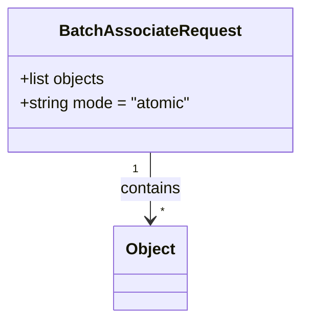

# Diagram: common/document_service/src/api/schemas/requests/batch_associate_request.py

> Auto-generated by Obscura crawlers

## Mermaid

### SVG

<svg id="container" width="299.2578125" xmlns="http://www.w3.org/2000/svg" class="classDiagram" height="318" viewBox="0 0 299.2578125 318" role="graphics-document document" aria-roledescription="class"><g><defs><marker id="container_class-aggregationStart" class="marker aggregation class" refX="18" refY="7" markerWidth="190" markerHeight="240" orient="auto"><path d="M 18,7 L9,13 L1,7 L9,1 Z"></path></marker></defs><defs><marker id="container_class-aggregationEnd" class="marker aggregation class" refX="1" refY="7" markerWidth="20" markerHeight="28" orient="auto"><path d="M 18,7 L9,13 L1,7 L9,1 Z"></path></marker></defs><defs><marker id="container_class-extensionStart" class="marker extension class" refX="18" refY="7" markerWidth="190" markerHeight="240" orient="auto"><path d="M 1,7 L18,13 V 1 Z"></path></marker></defs><defs><marker id="container_class-extensionEnd" class="marker extension class" refX="1" refY="7" markerWidth="20" markerHeight="28" orient="auto"><path d="M 1,1 V 13 L18,7 Z"></path></marker></defs><defs><marker id="container_class-compositionStart" class="marker composition class" refX="18" refY="7" markerWidth="190" markerHeight="240" orient="auto"><path d="M 18,7 L9,13 L1,7 L9,1 Z"></path></marker></defs><defs><marker id="container_class-compositionEnd" class="marker composition class" refX="1" refY="7" markerWidth="20" markerHeight="28" orient="auto"><path d="M 18,7 L9,13 L1,7 L9,1 Z"></path></marker></defs><defs><marker id="container_class-dependencyStart" class="marker dependency class" refX="6" refY="7" markerWidth="190" markerHeight="240" orient="auto"><path d="M 5,7 L9,13 L1,7 L9,1 Z"></path></marker></defs><defs><marker id="container_class-dependencyEnd" class="marker dependency class" refX="13" refY="7" markerWidth="20" markerHeight="28" orient="auto"><path d="M 18,7 L9,13 L14,7 L9,1 Z"></path></marker></defs><defs><marker id="container_class-lollipopStart" class="marker lollipop class" refX="13" refY="7" markerWidth="190" markerHeight="240" orient="auto"><circle stroke="black" fill="transparent" cx="7" cy="7" r="6"></circle></marker></defs><defs><marker id="container_class-lollipopEnd" class="marker lollipop class" refX="1" refY="7" markerWidth="190" markerHeight="240" orient="auto"><circle stroke="black" fill="transparent" cx="7" cy="7" r="6"></circle></marker></defs><g class="root"><g class="clusters"></g><g class="edgePaths"><path d="M149.629,152L149.629,158.167C149.629,164.333,149.629,176.667,149.629,188C149.629,199.333,149.629,209.667,149.629,214.833L149.629,220" id="id_BatchAssociateRequest_Object_1" class="edge-thickness-normal edge-pattern-solid relation" style=";;;" data-edge="true" data-et="edge" data-id="id_BatchAssociateRequest_Object_1" data-points="W3sieCI6MTQ5LjYyODkwNjI1LCJ5IjoxNTJ9LHsieCI6MTQ5LjYyODkwNjI1LCJ5IjoxODl9LHsieCI6MTQ5LjYyODkwNjI1LCJ5IjoyMjZ9XQ==" marker-end="url(#container_class-dependencyEnd)"></path></g><g class="edgeLabels"><g class="edgeLabel" transform="translate(149.62890625, 189)"><g class="label" data-id="id_BatchAssociateRequest_Object_1" transform="translate(-30.890625, -12)"><foreignObject width="61.78125" height="24">

contains

</foreignObject></g></g><g class="edgeTerminals" transform="translate(134.6289081250001, 169.50000160714285)"><g class="inner" transform="translate(0, 0)"><foreignObject style="width: 9px; height: 12px;">
1
</foreignObject></g></g><g class="edgeTerminals" transform="translate(159.62890812499992, 203.50000160714285)"><g class="inner" transform="translate(0, 0)"></g><foreignObject style="width: 9px; height: 12px;">
*
</foreignObject></g></g><g class="nodes"><g class="node default" id="classId-Object-0" transform="translate(149.62890625, 268)"><g class="basic label-container"><path d="M-35.890625 -42 L35.890625 -42 L35.890625 42 L-35.890625 42" stroke="none" stroke-width="0" fill="#ECECFF" style=""></path><path d="M-35.890625 -42 C-10.986025442993093 -42, 13.918574114013815 -42, 35.890625 -42 M-35.890625 -42 C-18.765720617225526 -42, -1.6408162344510515 -42, 35.890625 -42 M35.890625 -42 C35.890625 -23.86304991421215, 35.890625 -5.726099828424303, 35.890625 42 M35.890625 -42 C35.890625 -10.17767423990404, 35.890625 21.64465152019192, 35.890625 42 M35.890625 42 C7.963899265264889 42, -19.962826469470222 42, -35.890625 42 M35.890625 42 C13.08025063444762 42, -9.730123731104761 42, -35.890625 42 M-35.890625 42 C-35.890625 8.893682508026536, -35.890625 -24.212634983946927, -35.890625 -42 M-35.890625 42 C-35.890625 22.678482059656535, -35.890625 3.3569641193130693, -35.890625 -42" stroke="#9370DB" stroke-width="1.3" fill="none" stroke-dasharray="0 0" style=""></path></g><g class="annotation-group text" transform="translate(0, -18)"></g><g class="label-group text" transform="translate(-23.890625, -18)"><g class="label" style="font-weight: bolder" transform="translate(0,-12)"><foreignObject width="47.78125" height="24">

Object

</foreignObject></g></g><g class="members-group text" transform="translate(-23.890625, 30)"></g><g class="methods-group text" transform="translate(-23.890625, 60)"></g><g class="divider" style=""><path d="M-35.890625 6 C-11.553052301235823 6, 12.784520397528354 6, 35.890625 6 M-35.890625 6 C-12.462936385525168 6, 10.964752228949664 6, 35.890625 6" stroke="#9370DB" stroke-width="1.3" fill="none" stroke-dasharray="0 0" style=""></path></g><g class="divider" style=""><path d="M-35.890625 24 C-19.124953928751847 24, -2.3592828575036933 24, 35.890625 24 M-35.890625 24 C-9.20586423321637 24, 17.47889653356726 24, 35.890625 24" stroke="#9370DB" stroke-width="1.3" fill="none" stroke-dasharray="0 0" style=""></path></g></g><g class="node default" id="classId-BatchAssociateRequest-1" transform="translate(149.62890625, 80)"><g class="basic label-container"><path d="M-141.62890625 -72 L141.62890625 -72 L141.62890625 72 L-141.62890625 72" stroke="none" stroke-width="0" fill="#ECECFF" style=""></path><path d="M-141.62890625 -72 C-36.46904041148896 -72, 68.69082542702208 -72, 141.62890625 -72 M-141.62890625 -72 C-46.230386707563056 -72, 49.16813283487389 -72, 141.62890625 -72 M141.62890625 -72 C141.62890625 -29.349785843173606, 141.62890625 13.300428313652787, 141.62890625 72 M141.62890625 -72 C141.62890625 -38.398443400219215, 141.62890625 -4.796886800438429, 141.62890625 72 M141.62890625 72 C41.55242744215255 72, -58.5240513656949 72, -141.62890625 72 M141.62890625 72 C43.006408841517555 72, -55.61608856696489 72, -141.62890625 72 M-141.62890625 72 C-141.62890625 42.85057721288583, -141.62890625 13.701154425771662, -141.62890625 -72 M-141.62890625 72 C-141.62890625 35.538020535831485, -141.62890625 -0.9239589283370293, -141.62890625 -72" stroke="#9370DB" stroke-width="1.3" fill="none" stroke-dasharray="0 0" style=""></path></g><g class="annotation-group text" transform="translate(0, -48)"></g><g class="label-group text" transform="translate(-85.5859375, -48)"><g class="label" style="font-weight: bolder" transform="translate(0,-12)"><foreignObject width="171.171875" height="24">

BatchAssociateRequest

</foreignObject></g></g><g class="members-group text" transform="translate(-129.62890625, 0)"><g class="label" style="" transform="translate(0,-12)"><foreignObject width="87.625" height="24">

+list objects

</foreignObject></g><g class="label" style="" transform="translate(0,12)"><foreignObject width="173.671875" height="24">

+string mode = "atomic"

</foreignObject></g></g><g class="methods-group text" transform="translate(-129.62890625, 72)"></g><g class="divider" style=""><path d="M-141.62890625 -24 C-43.26843671057959 -24, 55.092032828840814 -24, 141.62890625 -24 M-141.62890625 -24 C-35.74316030317961 -24, 70.14258564364079 -24, 141.62890625 -24" stroke="#9370DB" stroke-width="1.3" fill="none" stroke-dasharray="0 0" style=""></path></g><g class="divider" style=""><path d="M-141.62890625 48 C-44.986599757044175 48, 51.65570673591165 48, 141.62890625 48 M-141.62890625 48 C-75.84770873392512 48, -10.066511217850234 48, 141.62890625 48" stroke="#9370DB" stroke-width="1.3" fill="none" stroke-dasharray="0 0" style=""></path></g></g></g></g></g></svg>
