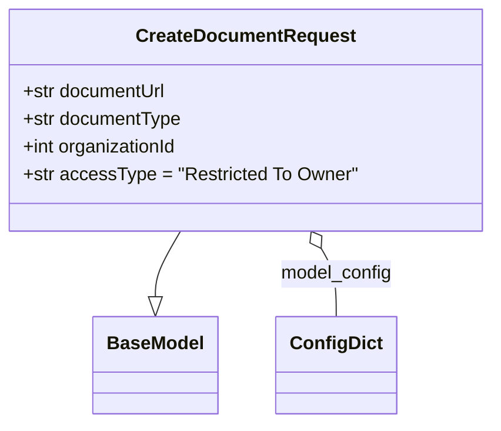

# Diagram: common/document_service/src/api/schemas/requests/create_document_request.py

> Auto-generated by Obscura crawlers

## Mermaid

### SVG

<svg id="container" width="417.7734375" xmlns="http://www.w3.org/2000/svg" class="classDiagram" height="366" viewBox="0 0 417.7734375 366" role="graphics-document document" aria-roledescription="class"><g><defs><marker id="container_class-aggregationStart" class="marker aggregation class" refX="18" refY="7" markerWidth="190" markerHeight="240" orient="auto"><path d="M 18,7 L9,13 L1,7 L9,1 Z"></path></marker></defs><defs><marker id="container_class-aggregationEnd" class="marker aggregation class" refX="1" refY="7" markerWidth="20" markerHeight="28" orient="auto"><path d="M 18,7 L9,13 L1,7 L9,1 Z"></path></marker></defs><defs><marker id="container_class-extensionStart" class="marker extension class" refX="18" refY="7" markerWidth="190" markerHeight="240" orient="auto"><path d="M 1,7 L18,13 V 1 Z"></path></marker></defs><defs><marker id="container_class-extensionEnd" class="marker extension class" refX="1" refY="7" markerWidth="20" markerHeight="28" orient="auto"><path d="M 1,1 V 13 L18,7 Z"></path></marker></defs><defs><marker id="container_class-compositionStart" class="marker composition class" refX="18" refY="7" markerWidth="190" markerHeight="240" orient="auto"><path d="M 18,7 L9,13 L1,7 L9,1 Z"></path></marker></defs><defs><marker id="container_class-compositionEnd" class="marker composition class" refX="1" refY="7" markerWidth="20" markerHeight="28" orient="auto"><path d="M 18,7 L9,13 L1,7 L9,1 Z"></path></marker></defs><defs><marker id="container_class-dependencyStart" class="marker dependency class" refX="6" refY="7" markerWidth="190" markerHeight="240" orient="auto"><path d="M 5,7 L9,13 L1,7 L9,1 Z"></path></marker></defs><defs><marker id="container_class-dependencyEnd" class="marker dependency class" refX="13" refY="7" markerWidth="20" markerHeight="28" orient="auto"><path d="M 18,7 L9,13 L14,7 L9,1 Z"></path></marker></defs><defs><marker id="container_class-lollipopStart" class="marker lollipop class" refX="13" refY="7" markerWidth="190" markerHeight="240" orient="auto"><circle stroke="black" fill="transparent" cx="7" cy="7" r="6"></circle></marker></defs><defs><marker id="container_class-lollipopEnd" class="marker lollipop class" refX="1" refY="7" markerWidth="190" markerHeight="240" orient="auto"><circle stroke="black" fill="transparent" cx="7" cy="7" r="6"></circle></marker></defs><g class="root"><g class="clusters"></g><g class="edgePaths"><path d="M154.25,200L150.74,206.167C147.23,212.333,140.211,224.667,136.701,234.125C133.191,243.583,133.191,250.167,133.191,253.458L133.191,256.75" id="id_CreateDocumentRequest_BaseModel_1" class="edge-thickness-normal edge-pattern-solid relation" style=";;;" data-edge="true" data-et="edge" data-id="id_CreateDocumentRequest_BaseModel_1" data-points="W3sieCI6MTU0LjI0OTUwMDcwNDg4NzIzLCJ5IjoyMDB9LHsieCI6MTMzLjE5MTQwNjI1LCJ5IjoyMzd9LHsieCI6MTMzLjE5MTQwNjI1LCJ5IjoyNzR9XQ==" marker-end="url(#container_class-extensionEnd)"></path><path d="M272.056,214.992L274.144,218.66C276.232,222.328,280.407,229.664,282.494,239.499C284.582,249.333,284.582,261.667,284.582,267.833L284.582,274" id="id_CreateDocumentRequest_ConfigDict_2" class="edge-thickness-normal edge-pattern-solid relation" style=";;;" data-edge="true" data-et="edge" data-id="id_CreateDocumentRequest_ConfigDict_2" data-points="W3sieCI6MjYzLjUyMzkzNjc5NTExMjgsInkiOjIwMH0seyJ4IjoyODQuNTgyMDMxMjUsInkiOjIzN30seyJ4IjoyODQuNTgyMDMxMjUsInkiOjI3NH1d" marker-start="url(#container_class-aggregationStart)"></path></g><g class="edgeLabels"><g class="edgeLabel"><g class="label" data-id="id_CreateDocumentRequest_BaseModel_1" transform="translate(0, 0)"><foreignObject width="0" height="0">

</foreignObject></g></g><g class="edgeLabel" transform="translate(284.58203125, 237)"><g class="label" data-id="id_CreateDocumentRequest_ConfigDict_2" transform="translate(-48.8046875, -12)"><foreignObject width="97.609375" height="24">

model_config

</foreignObject></g></g></g><g class="nodes"><g class="node default" id="classId-BaseModel-0" transform="translate(133.19140625, 316)"><g class="basic label-container"><path d="M-52.078125 -42 L52.078125 -42 L52.078125 42 L-52.078125 42" stroke="none" stroke-width="0" fill="#ECECFF" style=""></path><path d="M-52.078125 -42 C-17.191500458832365 -42, 17.69512408233527 -42, 52.078125 -42 M-52.078125 -42 C-21.765989168130233 -42, 8.546146663739535 -42, 52.078125 -42 M52.078125 -42 C52.078125 -11.031439688180619, 52.078125 19.937120623638762, 52.078125 42 M52.078125 -42 C52.078125 -24.230213018987307, 52.078125 -6.460426037974614, 52.078125 42 M52.078125 42 C27.596208298819334 42, 3.114291597638669 42, -52.078125 42 M52.078125 42 C16.04808694346385 42, -19.9819511130723 42, -52.078125 42 M-52.078125 42 C-52.078125 9.125244804315507, -52.078125 -23.749510391368986, -52.078125 -42 M-52.078125 42 C-52.078125 24.279035707901958, -52.078125 6.558071415803916, -52.078125 -42" stroke="#9370DB" stroke-width="1.3" fill="none" stroke-dasharray="0 0" style=""></path></g><g class="annotation-group text" transform="translate(0, -18)"></g><g class="label-group text" transform="translate(-40.078125, -18)"><g class="label" style="font-weight: bolder" transform="translate(0,-12)"><foreignObject width="80.15625" height="24">

BaseModel

</foreignObject></g></g><g class="members-group text" transform="translate(-40.078125, 30)"></g><g class="methods-group text" transform="translate(-40.078125, 60)"></g><g class="divider" style=""><path d="M-52.078125 6 C-15.525873955164862 6, 21.026377089670277 6, 52.078125 6 M-52.078125 6 C-28.0246782661863 6, -3.971231532372599 6, 52.078125 6" stroke="#9370DB" stroke-width="1.3" fill="none" stroke-dasharray="0 0" style=""></path></g><g class="divider" style=""><path d="M-52.078125 24 C-10.529614826910823 24, 31.018895346178354 24, 52.078125 24 M-52.078125 24 C-23.845317451119325 24, 4.387490097761351 24, 52.078125 24" stroke="#9370DB" stroke-width="1.3" fill="none" stroke-dasharray="0 0" style=""></path></g></g><g class="node default" id="classId-ConfigDict-1" transform="translate(284.58203125, 316)"><g class="basic label-container"><path d="M-49.3125 -42 L49.3125 -42 L49.3125 42 L-49.3125 42" stroke="none" stroke-width="0" fill="#ECECFF" style=""></path><path d="M-49.3125 -42 C-11.176473379898155 -42, 26.95955324020369 -42, 49.3125 -42 M-49.3125 -42 C-20.300216308944183 -42, 8.712067382111634 -42, 49.3125 -42 M49.3125 -42 C49.3125 -22.613003929512438, 49.3125 -3.2260078590248753, 49.3125 42 M49.3125 -42 C49.3125 -15.371089022027547, 49.3125 11.257821955944905, 49.3125 42 M49.3125 42 C14.85354464500341 42, -19.60541070999318 42, -49.3125 42 M49.3125 42 C20.195551696518464 42, -8.921396606963071 42, -49.3125 42 M-49.3125 42 C-49.3125 13.665333175906333, -49.3125 -14.669333648187333, -49.3125 -42 M-49.3125 42 C-49.3125 9.043890532742758, -49.3125 -23.912218934514485, -49.3125 -42" stroke="#9370DB" stroke-width="1.3" fill="none" stroke-dasharray="0 0" style=""></path></g><g class="annotation-group text" transform="translate(0, -18)"></g><g class="label-group text" transform="translate(-37.3125, -18)"><g class="label" style="font-weight: bolder" transform="translate(0,-12)"><foreignObject width="74.625" height="24">

ConfigDict

</foreignObject></g></g><g class="members-group text" transform="translate(-37.3125, 30)"></g><g class="methods-group text" transform="translate(-37.3125, 60)"></g><g class="divider" style=""><path d="M-49.3125 6 C-22.545617032521545 6, 4.221265934956911 6, 49.3125 6 M-49.3125 6 C-12.563768071366347 6, 24.184963857267306 6, 49.3125 6" stroke="#9370DB" stroke-width="1.3" fill="none" stroke-dasharray="0 0" style=""></path></g><g class="divider" style=""><path d="M-49.3125 24 C-16.928017053582906 24, 15.456465892834188 24, 49.3125 24 M-49.3125 24 C-27.454261388880305 24, -5.596022777760609 24, 49.3125 24" stroke="#9370DB" stroke-width="1.3" fill="none" stroke-dasharray="0 0" style=""></path></g></g><g class="node default" id="classId-CreateDocumentRequest-2" transform="translate(208.88671875, 104)"><g class="basic label-container"><path d="M-200.88671875 -96 L200.88671875 -96 L200.88671875 96 L-200.88671875 96" stroke="none" stroke-width="0" fill="#ECECFF" style=""></path><path d="M-200.88671875 -96 C-88.64724499731754 -96, 23.592228755364914 -96, 200.88671875 -96 M-200.88671875 -96 C-79.22341208708585 -96, 42.439894575828305 -96, 200.88671875 -96 M200.88671875 -96 C200.88671875 -22.97943461588278, 200.88671875 50.04113076823444, 200.88671875 96 M200.88671875 -96 C200.88671875 -57.54127476785236, 200.88671875 -19.082549535704715, 200.88671875 96 M200.88671875 96 C117.91561312235059 96, 34.944507494701185 96, -200.88671875 96 M200.88671875 96 C93.30436882074964 96, -14.277981108500711 96, -200.88671875 96 M-200.88671875 96 C-200.88671875 54.65264565088931, -200.88671875 13.305291301778624, -200.88671875 -96 M-200.88671875 96 C-200.88671875 44.244458902853246, -200.88671875 -7.5110821942935075, -200.88671875 -96" stroke="#9370DB" stroke-width="1.3" fill="none" stroke-dasharray="0 0" style=""></path></g><g class="annotation-group text" transform="translate(0, -72)"></g><g class="label-group text" transform="translate(-90.6171875, -72)"><g class="label" style="font-weight: bolder" transform="translate(0,-12)"><foreignObject width="181.234375" height="24">

CreateDocumentRequest

</foreignObject></g></g><g class="members-group text" transform="translate(-188.88671875, -24)"><g class="label" style="" transform="translate(0,-12)"><foreignObject width="126.40625" height="24">

+str documentUrl

</foreignObject></g><g class="label" style="" transform="translate(0,12)"><foreignObject width="138.6875" height="24">

+str documentType

</foreignObject></g><g class="label" style="" transform="translate(0,36)"><foreignObject width="136.53125" height="24">

+int organizationId

</foreignObject></g><g class="label" style="" transform="translate(0,60)"><foreignObject width="287.15625" height="24">

+str accessType = "Restricted To Owner"

</foreignObject></g></g><g class="methods-group text" transform="translate(-188.88671875, 96)"></g><g class="divider" style=""><path d="M-200.88671875 -48 C-100.8272518549072 -48, -0.7677849598144064 -48, 200.88671875 -48 M-200.88671875 -48 C-71.05843753085335 -48, 58.76984368829329 -48, 200.88671875 -48" stroke="#9370DB" stroke-width="1.3" fill="none" stroke-dasharray="0 0" style=""></path></g><g class="divider" style=""><path d="M-200.88671875 72 C-99.18219178703374 72, 2.522335175932511 72, 200.88671875 72 M-200.88671875 72 C-46.521204800117175 72, 107.84430914976565 72, 200.88671875 72" stroke="#9370DB" stroke-width="1.3" fill="none" stroke-dasharray="0 0" style=""></path></g></g></g></g></g></svg>
