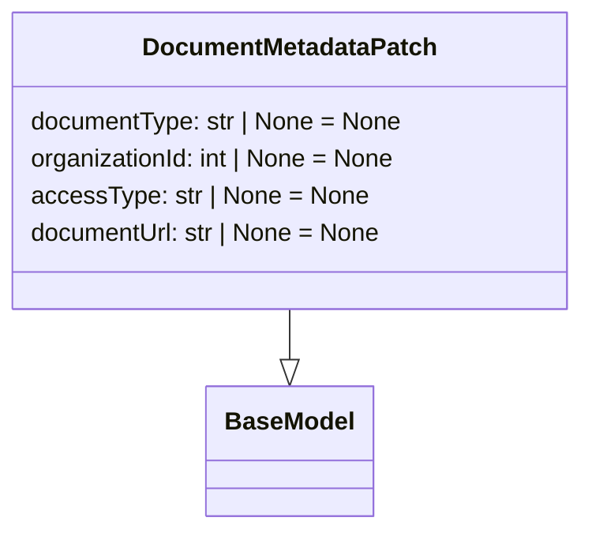

# Diagram: common/document_service/src/api/schemas/requests/document_metadata_patch.py

> Auto-generated by Obscura crawlers

## Mermaid

### SVG

<svg id="container" width="374.578125" xmlns="http://www.w3.org/2000/svg" class="classDiagram" height="342" viewBox="0 0 374.578125 342" role="graphics-document document" aria-roledescription="class"><g><defs><marker id="container_class-aggregationStart" class="marker aggregation class" refX="18" refY="7" markerWidth="190" markerHeight="240" orient="auto"><path d="M 18,7 L9,13 L1,7 L9,1 Z"></path></marker></defs><defs><marker id="container_class-aggregationEnd" class="marker aggregation class" refX="1" refY="7" markerWidth="20" markerHeight="28" orient="auto"><path d="M 18,7 L9,13 L1,7 L9,1 Z"></path></marker></defs><defs><marker id="container_class-extensionStart" class="marker extension class" refX="18" refY="7" markerWidth="190" markerHeight="240" orient="auto"><path d="M 1,7 L18,13 V 1 Z"></path></marker></defs><defs><marker id="container_class-extensionEnd" class="marker extension class" refX="1" refY="7" markerWidth="20" markerHeight="28" orient="auto"><path d="M 1,1 V 13 L18,7 Z"></path></marker></defs><defs><marker id="container_class-compositionStart" class="marker composition class" refX="18" refY="7" markerWidth="190" markerHeight="240" orient="auto"><path d="M 18,7 L9,13 L1,7 L9,1 Z"></path></marker></defs><defs><marker id="container_class-compositionEnd" class="marker composition class" refX="1" refY="7" markerWidth="20" markerHeight="28" orient="auto"><path d="M 18,7 L9,13 L1,7 L9,1 Z"></path></marker></defs><defs><marker id="container_class-dependencyStart" class="marker dependency class" refX="6" refY="7" markerWidth="190" markerHeight="240" orient="auto"><path d="M 5,7 L9,13 L1,7 L9,1 Z"></path></marker></defs><defs><marker id="container_class-dependencyEnd" class="marker dependency class" refX="13" refY="7" markerWidth="20" markerHeight="28" orient="auto"><path d="M 18,7 L9,13 L14,7 L9,1 Z"></path></marker></defs><defs><marker id="container_class-lollipopStart" class="marker lollipop class" refX="13" refY="7" markerWidth="190" markerHeight="240" orient="auto"><circle stroke="black" fill="transparent" cx="7" cy="7" r="6"></circle></marker></defs><defs><marker id="container_class-lollipopEnd" class="marker lollipop class" refX="1" refY="7" markerWidth="190" markerHeight="240" orient="auto"><circle stroke="black" fill="transparent" cx="7" cy="7" r="6"></circle></marker></defs><g class="root"><g class="clusters"></g><g class="edgePaths"><path d="M187.289,200L187.289,204.167C187.289,208.333,187.289,216.667,187.289,222.125C187.289,227.583,187.289,230.167,187.289,231.458L187.289,232.75" id="id_DocumentMetadataPatch_BaseModel_1" class="edge-thickness-normal edge-pattern-solid relation" style=";;;" data-edge="true" data-et="edge" data-id="id_DocumentMetadataPatch_BaseModel_1" data-points="W3sieCI6MTg3LjI4OTA2MjUsInkiOjIwMH0seyJ4IjoxODcuMjg5MDYyNSwieSI6MjI1fSx7IngiOjE4Ny4yODkwNjI1LCJ5IjoyNTB9XQ==" marker-end="url(#container_class-extensionEnd)"></path></g><g class="edgeLabels"><g class="edgeLabel"><g class="label" data-id="id_DocumentMetadataPatch_BaseModel_1" transform="translate(0, 0)"><foreignObject width="0" height="0">

</foreignObject></g></g></g><g class="nodes"><g class="node default" id="classId-BaseModel-0" transform="translate(187.2890625, 292)"><g class="basic label-container"><path d="M-52.078125 -42 L52.078125 -42 L52.078125 42 L-52.078125 42" stroke="none" stroke-width="0" fill="#ECECFF" style=""></path><path d="M-52.078125 -42 C-29.632215094689396 -42, -7.186305189378793 -42, 52.078125 -42 M-52.078125 -42 C-19.10330509773273 -42, 13.871514804534542 -42, 52.078125 -42 M52.078125 -42 C52.078125 -13.117413442019497, 52.078125 15.765173115961005, 52.078125 42 M52.078125 -42 C52.078125 -15.697765824185097, 52.078125 10.604468351629805, 52.078125 42 M52.078125 42 C27.89780596940726 42, 3.717486938814517 42, -52.078125 42 M52.078125 42 C27.961603378685194 42, 3.8450817573703873 42, -52.078125 42 M-52.078125 42 C-52.078125 10.003541100109612, -52.078125 -21.992917799780777, -52.078125 -42 M-52.078125 42 C-52.078125 23.031262257337787, -52.078125 4.062524514675573, -52.078125 -42" stroke="#9370DB" stroke-width="1.3" fill="none" stroke-dasharray="0 0" style=""></path></g><g class="annotation-group text" transform="translate(0, -18)"></g><g class="label-group text" transform="translate(-40.078125, -18)"><g class="label" style="font-weight: bolder" transform="translate(0,-12)"><foreignObject width="80.15625" height="24">

BaseModel

</foreignObject></g></g><g class="members-group text" transform="translate(-40.078125, 30)"></g><g class="methods-group text" transform="translate(-40.078125, 60)"></g><g class="divider" style=""><path d="M-52.078125 6 C-10.858367484713199 6, 30.361390030573602 6, 52.078125 6 M-52.078125 6 C-22.476718873718465 6, 7.124687252563071 6, 52.078125 6" stroke="#9370DB" stroke-width="1.3" fill="none" stroke-dasharray="0 0" style=""></path></g><g class="divider" style=""><path d="M-52.078125 24 C-12.609084848340657 24, 26.859955303318685 24, 52.078125 24 M-52.078125 24 C-16.181783549129705 24, 19.71455790174059 24, 52.078125 24" stroke="#9370DB" stroke-width="1.3" fill="none" stroke-dasharray="0 0" style=""></path></g></g><g class="node default" id="classId-DocumentMetadataPatch-1" transform="translate(187.2890625, 104)"><g class="basic label-container"><path d="M-179.2890625 -96 L179.2890625 -96 L179.2890625 96 L-179.2890625 96" stroke="none" stroke-width="0" fill="#ECECFF" style=""></path><path d="M-179.2890625 -96 C-67.53974590920467 -96, 44.20957068159066 -96, 179.2890625 -96 M-179.2890625 -96 C-36.70672331211145 -96, 105.8756158757771 -96, 179.2890625 -96 M179.2890625 -96 C179.2890625 -48.525276825486124, 179.2890625 -1.0505536509722475, 179.2890625 96 M179.2890625 -96 C179.2890625 -47.86968652220517, 179.2890625 0.2606269555896574, 179.2890625 96 M179.2890625 96 C58.709420608549266 96, -61.87022128290147 96, -179.2890625 96 M179.2890625 96 C104.79456740072754 96, 30.30007230145509 96, -179.2890625 96 M-179.2890625 96 C-179.2890625 26.66782959871172, -179.2890625 -42.66434080257656, -179.2890625 -96 M-179.2890625 96 C-179.2890625 56.07020566896044, -179.2890625 16.14041133792088, -179.2890625 -96" stroke="#9370DB" stroke-width="1.3" fill="none" stroke-dasharray="0 0" style=""></path></g><g class="annotation-group text" transform="translate(0, -72)"></g><g class="label-group text" transform="translate(-91.890625, -72)"><g class="label" style="font-weight: bolder" transform="translate(0,-12)"><foreignObject width="183.78125" height="24">

DocumentMetadataPatch

</foreignObject></g></g><g class="members-group text" transform="translate(-167.2890625, -24)"><g class="label" style="" transform="translate(0,-12)"><foreignObject width="242.6875" height="24">

documentType: str | None = None

</foreignObject></g><g class="label" style="" transform="translate(0,12)"><foreignObject width="240.53125" height="24">

organizationId: int | None = None

</foreignObject></g><g class="label" style="" transform="translate(0,36)"><foreignObject width="216.25" height="24">

accessType: str | None = None

</foreignObject></g><g class="label" style="" transform="translate(0,60)"><foreignObject width="230.5625" height="24">

documentUrl: str | None = None

</foreignObject></g></g><g class="methods-group text" transform="translate(-167.2890625, 96)"></g><g class="divider" style=""><path d="M-179.2890625 -48 C-92.62329514725081 -48, -5.95752779450163 -48, 179.2890625 -48 M-179.2890625 -48 C-41.885544422776746 -48, 95.51797365444651 -48, 179.2890625 -48" stroke="#9370DB" stroke-width="1.3" fill="none" stroke-dasharray="0 0" style=""></path></g><g class="divider" style=""><path d="M-179.2890625 72 C-52.25676595078532 72, 74.77553059842936 72, 179.2890625 72 M-179.2890625 72 C-36.69811296635555 72, 105.8928365672889 72, 179.2890625 72" stroke="#9370DB" stroke-width="1.3" fill="none" stroke-dasharray="0 0" style=""></path></g></g></g></g></g></svg>
