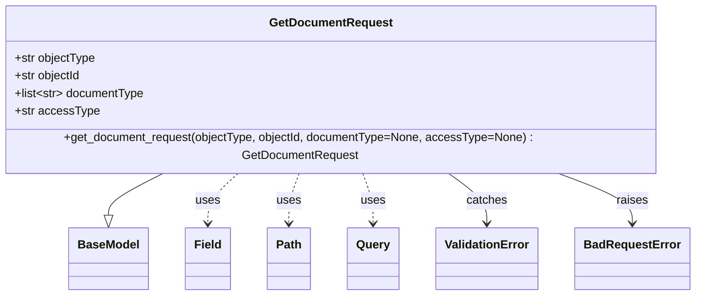

# Diagram: common/document_service/src/api/schemas/requests/get_document_request.py


> Auto-generated by Obscura crawlers

## Diagram 1



### SVG

<svg id="container" width="940.3203125" xmlns="http://www.w3.org/2000/svg" class="classDiagram" height="390" viewBox="0 0 940.3203125 390" role="graphics-document document" aria-roledescription="class"><style>#container{font-family:"trebuchet ms",verdana,arial,sans-serif;font-size:16px;fill:#333;}@keyframes edge-animation-frame{from{stroke-dashoffset:0;}}@keyframes dash{to{stroke-dashoffset:0;}}#container .edge-animation-slow{stroke-dasharray:9,5!important;stroke-dashoffset:900;animation:dash 50s linear infinite;stroke-linecap:round;}#container .edge-animation-fast{stroke-dasharray:9,5!important;stroke-dashoffset:900;animation:dash 20s linear infinite;stroke-linecap:round;}#container .error-icon{fill:#552222;}#container .error-text{fill:#552222;stroke:#552222;}#container .edge-thickness-normal{stroke-width:1px;}#container .edge-thickness-thick{stroke-width:3.5px;}#container .edge-pattern-solid{stroke-dasharray:0;}#container .edge-thickness-invisible{stroke-width:0;fill:none;}#container .edge-pattern-dashed{stroke-dasharray:3;}#container .edge-pattern-dotted{stroke-dasharray:2;}#container .marker{fill:#333333;stroke:#333333;}#container .marker.cross{stroke:#333333;}#container svg{font-family:"trebuchet ms",verdana,arial,sans-serif;font-size:16px;}#container p{margin:0;}#container g.classGroup text{fill:#9370DB;stroke:none;font-family:"trebuchet ms",verdana,arial,sans-serif;font-size:10px;}#container g.classGroup text .title{font-weight:bolder;}#container .nodeLabel,#container .edgeLabel{color:#131300;}#container .edgeLabel .label rect{fill:#ECECFF;}#container .label text{fill:#131300;}#container .labelBkg{background:#ECECFF;}#container .edgeLabel .label span{background:#ECECFF;}#container .classTitle{font-weight:bolder;}#container .node rect,#container .node circle,#container .node ellipse,#container .node polygon,#container .node path{fill:#ECECFF;stroke:#9370DB;stroke-width:1px;}#container .divider{stroke:#9370DB;stroke-width:1;}#container g.clickable{cursor:pointer;}#container g.classGroup rect{fill:#ECECFF;stroke:#9370DB;}#container g.classGroup line{stroke:#9370DB;stroke-width:1;}#container .classLabel .box{stroke:none;stroke-width:0;fill:#ECECFF;opacity:0.5;}#container .classLabel .label{fill:#9370DB;font-size:10px;}#container .relation{stroke:#333333;stroke-width:1;fill:none;}#container .dashed-line{stroke-dasharray:3;}#container .dotted-line{stroke-dasharray:1 2;}#container #compositionStart,#container .composition{fill:#333333!important;stroke:#333333!important;stroke-width:1;}#container #compositionEnd,#container .composition{fill:#333333!important;stroke:#333333!important;stroke-width:1;}#container #dependencyStart,#container .dependency{fill:#333333!important;stroke:#333333!important;stroke-width:1;}#container #dependencyStart,#container .dependency{fill:#333333!important;stroke:#333333!important;stroke-width:1;}#container #extensionStart,#container .extension{fill:transparent!important;stroke:#333333!important;stroke-width:1;}#container #extensionEnd,#container .extension{fill:transparent!important;stroke:#333333!important;stroke-width:1;}#container #aggregationStart,#container .aggregation{fill:transparent!important;stroke:#333333!important;stroke-width:1;}#container #aggregationEnd,#container .aggregation{fill:transparent!important;stroke:#333333!important;stroke-width:1;}#container #lollipopStart,#container .lollipop{fill:#ECECFF!important;stroke:#333333!important;stroke-width:1;}#container #lollipopEnd,#container .lollipop{fill:#ECECFF!important;stroke:#333333!important;stroke-width:1;}#container .edgeTerminals{font-size:11px;line-height:initial;}#container .classTitleText{text-anchor:middle;font-size:18px;fill:#333;}#container .label-icon{display:inline-block;height:1em;overflow:visible;vertical-align:-0.125em;}#container .node .label-icon path{fill:currentColor;stroke:revert;stroke-width:revert;}#container :root{--mermaid-font-family:"trebuchet ms",verdana,arial,sans-serif;}</style><g><defs><marker id="container_class-aggregationStart" class="marker aggregation class" refX="18" refY="7" markerWidth="190" markerHeight="240" orient="auto"><path d="M 18,7 L9,13 L1,7 L9,1 Z"></path></marker></defs><defs><marker id="container_class-aggregationEnd" class="marker aggregation class" refX="1" refY="7" markerWidth="20" markerHeight="28" orient="auto"><path d="M 18,7 L9,13 L1,7 L9,1 Z"></path></marker></defs><defs><marker id="container_class-extensionStart" class="marker extension class" refX="18" refY="7" markerWidth="190" markerHeight="240" orient="auto"><path d="M 1,7 L18,13 V 1 Z"></path></marker></defs><defs><marker id="container_class-extensionEnd" class="marker extension class" refX="1" refY="7" markerWidth="20" markerHeight="28" orient="auto"><path d="M 1,1 V 13 L18,7 Z"></path></marker></defs><defs><marker id="container_class-compositionStart" class="marker composition class" refX="18" refY="7" markerWidth="190" markerHeight="240" orient="auto"><path d="M 18,7 L9,13 L1,7 L9,1 Z"></path></marker></defs><defs><marker id="container_class-compositionEnd" class="marker composition class" refX="1" refY="7" markerWidth="20" markerHeight="28" orient="auto"><path d="M 18,7 L9,13 L1,7 L9,1 Z"></path></marker></defs><defs><marker id="container_class-dependencyStart" class="marker dependency class" refX="6" refY="7" markerWidth="190" markerHeight="240" orient="auto"><path d="M 5,7 L9,13 L1,7 L9,1 Z"></path></marker></defs><defs><marker id="container_class-dependencyEnd" class="marker dependency class" refX="13" refY="7" markerWidth="20" markerHeight="28" orient="auto"><path d="M 18,7 L9,13 L14,7 L9,1 Z"></path></marker></defs><defs><marker id="container_class-lollipopStart" class="marker lollipop class" refX="13" refY="7" markerWidth="190" markerHeight="240" orient="auto"><circle stroke="black" fill="transparent" cx="7" cy="7" r="6"></circle></marker></defs><defs><marker id="container_class-lollipopEnd" class="marker lollipop class" refX="1" refY="7" markerWidth="190" markerHeight="240" orient="auto"><circle stroke="black" fill="transparent" cx="7" cy="7" r="6"></circle></marker></defs><g class="root"><g class="clusters"></g><g class="edgePaths"><path d="M239.129,224L226.554,230.167C213.979,236.333,188.829,248.667,176.255,258.125C163.68,267.583,163.68,274.167,163.68,277.458L163.68,280.75" id="id_GetDocumentRequest_BaseModel_1" class="edge-thickness-normal edge-pattern-solid relation" style=";;;" data-edge="true" data-et="edge" data-id="id_GetDocumentRequest_BaseModel_1" data-points="W3sieCI6MjM5LjEyODk4NzA2ODk2NTUzLCJ5IjoyMjR9LHsieCI6MTYzLjY3OTY4NzUsInkiOjI2MX0seyJ4IjoxNjMuNjc5Njg3NSwieSI6Mjk4fV0=" marker-end="url(#container_class-extensionEnd)"></path><path d="M337.115,224L330.135,230.167C323.154,236.333,309.194,248.667,302.214,260C295.234,271.333,295.234,281.667,295.234,286.833L295.234,292" id="id_GetDocumentRequest_Field_2" class="edge-thickness-normal edge-pattern-dashed relation" style=";;;" data-edge="true" data-et="edge" data-id="id_GetDocumentRequest_Field_2" data-points="W3sieCI6MzM3LjExNDU0NzQxMzc5MzEsInkiOjIyNH0seyJ4IjoyOTUuMjM0Mzc1LCJ5IjoyNjF9LHsieCI6Mjk1LjIzNDM3NSwieSI6Mjk4fV0=" marker-end="url(#container_class-dependencyEnd)"></path><path d="M417.521,224L415.132,230.167C412.743,236.333,407.965,248.667,405.576,260C403.188,271.333,403.188,281.667,403.188,286.833L403.188,292" id="id_GetDocumentRequest_Path_3" class="edge-thickness-normal edge-pattern-dashed relation" style=";;;" data-edge="true" data-et="edge" data-id="id_GetDocumentRequest_Path_3" data-points="W3sieCI6NDE3LjUyMTAxMjkzMTAzNDUsInkiOjIyNH0seyJ4Ijo0MDMuMTg3NSwieSI6MjYxfSx7IngiOjQwMy4xODc1LCJ5IjoyOTh9XQ==" marker-end="url(#container_class-dependencyEnd)"></path><path d="M501.198,224L503.587,230.167C505.976,236.333,510.753,248.667,513.142,260C515.531,271.333,515.531,281.667,515.531,286.833L515.531,292" id="id_GetDocumentRequest_Query_4" class="edge-thickness-normal edge-pattern-dashed relation" style=";;;" data-edge="true" data-et="edge" data-id="id_GetDocumentRequest_Query_4" data-points="W3sieCI6NTAxLjE5NzczNzA2ODk2NTUsInkiOjIyNH0seyJ4Ijo1MTUuNTMxMjUsInkiOjI2MX0seyJ4Ijo1MTUuNTMxMjUsInkiOjI5OH1d" marker-end="url(#container_class-dependencyEnd)"></path><path d="M613.702,224L622.514,230.167C631.327,236.333,648.953,248.667,657.765,260C666.578,271.333,666.578,281.667,666.578,286.833L666.578,292" id="id_GetDocumentRequest_ValidationError_5" class="edge-thickness-normal edge-pattern-solid relation" style=";;;" data-edge="true" data-et="edge" data-id="id_GetDocumentRequest_ValidationError_5" data-points="W3sieCI6NjEzLjcwMTYxNjM3OTMxMDMsInkiOjIyNH0seyJ4Ijo2NjYuNTc4MTI1LCJ5IjoyNjF9LHsieCI6NjY2LjU3ODEyNSwieSI6Mjk4fV0=" marker-end="url(#container_class-dependencyEnd)"></path><path d="M756.307,224L773.262,230.167C790.218,236.333,824.128,248.667,841.084,260C858.039,271.333,858.039,281.667,858.039,286.833L858.039,292" id="id_GetDocumentRequest_BadRequestError_6" class="edge-thickness-normal edge-pattern-solid relation" style=";;;" data-edge="true" data-et="edge" data-id="id_GetDocumentRequest_BadRequestError_6" data-points="W3sieCI6NzU2LjMwNzAwNDMxMDM0NDgsInkiOjIyNH0seyJ4Ijo4NTguMDM5MDYyNSwieSI6MjYxfSx7IngiOjg1OC4wMzkwNjI1LCJ5IjoyOTh9XQ==" marker-end="url(#container_class-dependencyEnd)"></path></g><g class="edgeLabels"><g class="edgeLabel"><g class="label" data-id="id_GetDocumentRequest_BaseModel_1" transform="translate(0, 0)"><foreignObject width="0" height="0"><div xmlns="http://www.w3.org/1999/xhtml" class="labelBkg" style="display: table-cell; white-space: nowrap; line-height: 1.5; max-width: 200px; text-align: center;"><span class="edgeLabel"></span></div></foreignObject></g></g><g class="edgeLabel" transform="translate(295.234375, 261)"><g class="label" data-id="id_GetDocumentRequest_Field_2" transform="translate(-16.4921875, -12)"><foreignObject width="32.984375" height="24"><div xmlns="http://www.w3.org/1999/xhtml" class="labelBkg" style="display: table-cell; white-space: nowrap; line-height: 1.5; max-width: 200px; text-align: center;"><span class="edgeLabel"><p>uses</p></span></div></foreignObject></g></g><g class="edgeLabel" transform="translate(403.1875, 261)"><g class="label" data-id="id_GetDocumentRequest_Path_3" transform="translate(-16.4921875, -12)"><foreignObject width="32.984375" height="24"><div xmlns="http://www.w3.org/1999/xhtml" class="labelBkg" style="display: table-cell; white-space: nowrap; line-height: 1.5; max-width: 200px; text-align: center;"><span class="edgeLabel"><p>uses</p></span></div></foreignObject></g></g><g class="edgeLabel" transform="translate(515.53125, 261)"><g class="label" data-id="id_GetDocumentRequest_Query_4" transform="translate(-16.4921875, -12)"><foreignObject width="32.984375" height="24"><div xmlns="http://www.w3.org/1999/xhtml" class="labelBkg" style="display: table-cell; white-space: nowrap; line-height: 1.5; max-width: 200px; text-align: center;"><span class="edgeLabel"><p>uses</p></span></div></foreignObject></g></g><g class="edgeLabel" transform="translate(666.578125, 261)"><g class="label" data-id="id_GetDocumentRequest_ValidationError_5" transform="translate(-27.4765625, -12)"><foreignObject width="54.953125" height="24"><div xmlns="http://www.w3.org/1999/xhtml" class="labelBkg" style="display: table-cell; white-space: nowrap; line-height: 1.5; max-width: 200px; text-align: center;"><span class="edgeLabel"><p>catches</p></span></div></foreignObject></g></g><g class="edgeLabel" transform="translate(858.0390625, 261)"><g class="label" data-id="id_GetDocumentRequest_BadRequestError_6" transform="translate(-21.25, -12)"><foreignObject width="42.5" height="24"><div xmlns="http://www.w3.org/1999/xhtml" class="labelBkg" style="display: table-cell; white-space: nowrap; line-height: 1.5; max-width: 200px; text-align: center;"><span class="edgeLabel"><p>raises</p></span></div></foreignObject></g></g></g><g class="nodes"><g class="node default" id="classId-GetDocumentRequest-0" transform="translate(459.359375, 116)"><g class="basic label-container"><path d="M-451.359375 -108 L451.359375 -108 L451.359375 108 L-451.359375 108" stroke="none" stroke-width="0" fill="#ECECFF" style=""></path><path d="M-451.359375 -108 C-176.9180835086122 -108, 97.5232079827756 -108, 451.359375 -108 M-451.359375 -108 C-199.74964236117745 -108, 51.8600902776451 -108, 451.359375 -108 M451.359375 -108 C451.359375 -49.99167874322396, 451.359375 8.016642513552085, 451.359375 108 M451.359375 -108 C451.359375 -26.21476021856094, 451.359375 55.57047956287812, 451.359375 108 M451.359375 108 C224.6947719352962 108, -1.9698311294076234 108, -451.359375 108 M451.359375 108 C120.37115322667546 108, -210.61706854664908 108, -451.359375 108 M-451.359375 108 C-451.359375 22.281865607099874, -451.359375 -63.43626878580025, -451.359375 -108 M-451.359375 108 C-451.359375 50.49653530167003, -451.359375 -7.006929396659942, -451.359375 -108" stroke="#9370DB" stroke-width="1.3" fill="none" stroke-dasharray="0 0" style=""></path></g><g class="annotation-group text" transform="translate(0, -84)"></g><g class="label-group text" transform="translate(-79.734375, -84)"><g class="label" style="font-weight: bolder" transform="translate(0,-12)"><foreignObject width="159.46875" height="24"><div xmlns="http://www.w3.org/1999/xhtml" style="display: table-cell; white-space: nowrap; line-height: 1.5; max-width: 208px; text-align: center;"><span class="nodeLabel markdown-node-label" style=""><p>GetDocumentRequest</p></span></div></foreignObject></g></g><g class="members-group text" transform="translate(-439.359375, -36)"><g class="label" style="" transform="translate(0,-12)"><foreignObject width="110.859375" height="24"><div xmlns="http://www.w3.org/1999/xhtml" style="display: table-cell; white-space: nowrap; line-height: 1.5; max-width: 168px; text-align: center;"><span class="nodeLabel markdown-node-label" style=""><p>+str objectType</p></span></div></foreignObject></g><g class="label" style="" transform="translate(0,12)"><foreignObject width="91.421875" height="24"><div xmlns="http://www.w3.org/1999/xhtml" style="display: table-cell; white-space: nowrap; line-height: 1.5; max-width: 149px; text-align: center;"><span class="nodeLabel markdown-node-label" style=""><p>+str objectId</p></span></div></foreignObject></g><g class="label" style="" transform="translate(0,36)"><foreignObject width="177.125" height="24"><div xmlns="http://www.w3.org/1999/xhtml" style="display: table-cell; white-space: nowrap; line-height: 1.5; max-width: 274px; text-align: center;"><span class="nodeLabel markdown-node-label" style=""><p>+list&lt;str&gt; documentType</p></span></div></foreignObject></g><g class="label" style="" transform="translate(0,60)"><foreignObject width="112.25" height="24"><div xmlns="http://www.w3.org/1999/xhtml" style="display: table-cell; white-space: nowrap; line-height: 1.5; max-width: 170px; text-align: center;"><span class="nodeLabel markdown-node-label" style=""><p>+str accessType</p></span></div></foreignObject></g></g><g class="methods-group text" transform="translate(-439.359375, 84)"><g class="label" style="" transform="translate(0,-12)"><foreignObject width="798.984375" height="24"><div xmlns="http://www.w3.org/1999/xhtml" style="display: table-cell; white-space: nowrap; line-height: 1.5; max-width: 857px; text-align: center;"><span class="nodeLabel markdown-node-label" style=""><p>+get_document_request(objectType, objectId, documentType=None, accessType=None) : GetDocumentRequest</p></span></div></foreignObject></g></g><g class="divider" style=""><path d="M-451.359375 -60 C-138.37074148987864 -60, 174.61789202024272 -60, 451.359375 -60 M-451.359375 -60 C-176.02231004741424 -60, 99.31475490517153 -60, 451.359375 -60" stroke="#9370DB" stroke-width="1.3" fill="none" stroke-dasharray="0 0" style=""></path></g><g class="divider" style=""><path d="M-451.359375 60 C-196.43708797185258 60, 58.485199056294846 60, 451.359375 60 M-451.359375 60 C-251.24846628055803 60, -51.13755756111607 60, 451.359375 60" stroke="#9370DB" stroke-width="1.3" fill="none" stroke-dasharray="0 0" style=""></path></g></g><g class="node default" id="classId-BaseModel-1" transform="translate(163.6796875, 340)"><g class="basic label-container"><path d="M-52.078125 -42 L52.078125 -42 L52.078125 42 L-52.078125 42" stroke="none" stroke-width="0" fill="#ECECFF" style=""></path><path d="M-52.078125 -42 C-19.26072298160753 -42, 13.556679036784942 -42, 52.078125 -42 M-52.078125 -42 C-28.60766320431419 -42, -5.137201408628378 -42, 52.078125 -42 M52.078125 -42 C52.078125 -23.264781857582918, 52.078125 -4.5295637151658354, 52.078125 42 M52.078125 -42 C52.078125 -12.894454508693713, 52.078125 16.211090982612575, 52.078125 42 M52.078125 42 C22.34145217625642 42, -7.395220647487157 42, -52.078125 42 M52.078125 42 C12.146842516028237 42, -27.784439967943527 42, -52.078125 42 M-52.078125 42 C-52.078125 8.90771585180758, -52.078125 -24.18456829638484, -52.078125 -42 M-52.078125 42 C-52.078125 21.501295120116243, -52.078125 1.002590240232486, -52.078125 -42" stroke="#9370DB" stroke-width="1.3" fill="none" stroke-dasharray="0 0" style=""></path></g><g class="annotation-group text" transform="translate(0, -18)"></g><g class="label-group text" transform="translate(-40.078125, -18)"><g class="label" style="font-weight: bolder" transform="translate(0,-12)"><foreignObject width="80.15625" height="24"><div xmlns="http://www.w3.org/1999/xhtml" style="display: table-cell; white-space: nowrap; line-height: 1.5; max-width: 130px; text-align: center;"><span class="nodeLabel markdown-node-label" style=""><p>BaseModel</p></span></div></foreignObject></g></g><g class="members-group text" transform="translate(-40.078125, 30)"></g><g class="methods-group text" transform="translate(-40.078125, 60)"></g><g class="divider" style=""><path d="M-52.078125 6 C-17.367042716798963 6, 17.344039566402074 6, 52.078125 6 M-52.078125 6 C-17.36502628419742 6, 17.34807243160516 6, 52.078125 6" stroke="#9370DB" stroke-width="1.3" fill="none" stroke-dasharray="0 0" style=""></path></g><g class="divider" style=""><path d="M-52.078125 24 C-24.634620639697292 24, 2.808883720605415 24, 52.078125 24 M-52.078125 24 C-10.800344710261285 24, 30.47743557947743 24, 52.078125 24" stroke="#9370DB" stroke-width="1.3" fill="none" stroke-dasharray="0 0" style=""></path></g></g><g class="node default" id="classId-Field-2" transform="translate(295.234375, 340)"><g class="basic label-container"><path d="M-29.4765625 -42 L29.4765625 -42 L29.4765625 42 L-29.4765625 42" stroke="none" stroke-width="0" fill="#ECECFF" style=""></path><path d="M-29.4765625 -42 C-15.68976170457183 -42, -1.9029609091436583 -42, 29.4765625 -42 M-29.4765625 -42 C-13.614803932931988 -42, 2.2469546341360243 -42, 29.4765625 -42 M29.4765625 -42 C29.4765625 -14.974423270754247, 29.4765625 12.051153458491505, 29.4765625 42 M29.4765625 -42 C29.4765625 -13.283477462518324, 29.4765625 15.433045074963353, 29.4765625 42 M29.4765625 42 C16.43329408664821 42, 3.3900256732964245 42, -29.4765625 42 M29.4765625 42 C8.762131781112306 42, -11.952298937775389 42, -29.4765625 42 M-29.4765625 42 C-29.4765625 10.02594074341468, -29.4765625 -21.94811851317064, -29.4765625 -42 M-29.4765625 42 C-29.4765625 23.60827540408228, -29.4765625 5.216550808164563, -29.4765625 -42" stroke="#9370DB" stroke-width="1.3" fill="none" stroke-dasharray="0 0" style=""></path></g><g class="annotation-group text" transform="translate(0, -18)"></g><g class="label-group text" transform="translate(-17.4765625, -18)"><g class="label" style="font-weight: bolder" transform="translate(0,-12)"><foreignObject width="34.953125" height="24"><div xmlns="http://www.w3.org/1999/xhtml" style="display: table-cell; white-space: nowrap; line-height: 1.5; max-width: 85px; text-align: center;"><span class="nodeLabel markdown-node-label" style=""><p>Field</p></span></div></foreignObject></g></g><g class="members-group text" transform="translate(-17.4765625, 30)"></g><g class="methods-group text" transform="translate(-17.4765625, 60)"></g><g class="divider" style=""><path d="M-29.4765625 6 C-7.77348579344488 6, 13.92959091311024 6, 29.4765625 6 M-29.4765625 6 C-16.23640006351099 6, -2.99623762702198 6, 29.4765625 6" stroke="#9370DB" stroke-width="1.3" fill="none" stroke-dasharray="0 0" style=""></path></g><g class="divider" style=""><path d="M-29.4765625 24 C-9.736691562831634 24, 10.003179374336732 24, 29.4765625 24 M-29.4765625 24 C-11.824423363919298 24, 5.827715772161405 24, 29.4765625 24" stroke="#9370DB" stroke-width="1.3" fill="none" stroke-dasharray="0 0" style=""></path></g></g><g class="node default" id="classId-Path-3" transform="translate(403.1875, 340)"><g class="basic label-container"><path d="M-28.4765625 -42 L28.4765625 -42 L28.4765625 42 L-28.4765625 42" stroke="none" stroke-width="0" fill="#ECECFF" style=""></path><path d="M-28.4765625 -42 C-14.377759608766974 -42, -0.2789567175339478 -42, 28.4765625 -42 M-28.4765625 -42 C-12.791650029326787 -42, 2.893262441346426 -42, 28.4765625 -42 M28.4765625 -42 C28.4765625 -8.519817638891027, 28.4765625 24.960364722217946, 28.4765625 42 M28.4765625 -42 C28.4765625 -13.896143856579634, 28.4765625 14.207712286840732, 28.4765625 42 M28.4765625 42 C7.196688933031989 42, -14.083184633936021 42, -28.4765625 42 M28.4765625 42 C11.736053099035274 42, -5.0044563019294515 42, -28.4765625 42 M-28.4765625 42 C-28.4765625 23.50362855835694, -28.4765625 5.00725711671388, -28.4765625 -42 M-28.4765625 42 C-28.4765625 17.768418739178152, -28.4765625 -6.463162521643696, -28.4765625 -42" stroke="#9370DB" stroke-width="1.3" fill="none" stroke-dasharray="0 0" style=""></path></g><g class="annotation-group text" transform="translate(0, -18)"></g><g class="label-group text" transform="translate(-16.4765625, -18)"><g class="label" style="font-weight: bolder" transform="translate(0,-12)"><foreignObject width="32.953125" height="24"><div xmlns="http://www.w3.org/1999/xhtml" style="display: table-cell; white-space: nowrap; line-height: 1.5; max-width: 82px; text-align: center;"><span class="nodeLabel markdown-node-label" style=""><p>Path</p></span></div></foreignObject></g></g><g class="members-group text" transform="translate(-16.4765625, 30)"></g><g class="methods-group text" transform="translate(-16.4765625, 60)"></g><g class="divider" style=""><path d="M-28.4765625 6 C-13.658711664856138 6, 1.1591391702877232 6, 28.4765625 6 M-28.4765625 6 C-6.7547357317209915 6, 14.967091036558017 6, 28.4765625 6" stroke="#9370DB" stroke-width="1.3" fill="none" stroke-dasharray="0 0" style=""></path></g><g class="divider" style=""><path d="M-28.4765625 24 C-6.115972329820888 24, 16.244617840358224 24, 28.4765625 24 M-28.4765625 24 C-13.670475649338588 24, 1.1356112013228241 24, 28.4765625 24" stroke="#9370DB" stroke-width="1.3" fill="none" stroke-dasharray="0 0" style=""></path></g></g><g class="node default" id="classId-Query-4" transform="translate(515.53125, 340)"><g class="basic label-container"><path d="M-33.8671875 -42 L33.8671875 -42 L33.8671875 42 L-33.8671875 42" stroke="none" stroke-width="0" fill="#ECECFF" style=""></path><path d="M-33.8671875 -42 C-11.266639885732701 -42, 11.333907728534598 -42, 33.8671875 -42 M-33.8671875 -42 C-17.469558114584828 -42, -1.071928729169656 -42, 33.8671875 -42 M33.8671875 -42 C33.8671875 -21.909600761909427, 33.8671875 -1.8192015238188546, 33.8671875 42 M33.8671875 -42 C33.8671875 -14.240514716664254, 33.8671875 13.518970566671491, 33.8671875 42 M33.8671875 42 C9.093118872826295 42, -15.68094975434741 42, -33.8671875 42 M33.8671875 42 C19.728862017932332 42, 5.590536535864665 42, -33.8671875 42 M-33.8671875 42 C-33.8671875 25.11344479071466, -33.8671875 8.226889581429319, -33.8671875 -42 M-33.8671875 42 C-33.8671875 11.67416710006605, -33.8671875 -18.6516657998679, -33.8671875 -42" stroke="#9370DB" stroke-width="1.3" fill="none" stroke-dasharray="0 0" style=""></path></g><g class="annotation-group text" transform="translate(0, -18)"></g><g class="label-group text" transform="translate(-21.8671875, -18)"><g class="label" style="font-weight: bolder" transform="translate(0,-12)"><foreignObject width="43.734375" height="24"><div xmlns="http://www.w3.org/1999/xhtml" style="display: table-cell; white-space: nowrap; line-height: 1.5; max-width: 93px; text-align: center;"><span class="nodeLabel markdown-node-label" style=""><p>Query</p></span></div></foreignObject></g></g><g class="members-group text" transform="translate(-21.8671875, 30)"></g><g class="methods-group text" transform="translate(-21.8671875, 60)"></g><g class="divider" style=""><path d="M-33.8671875 6 C-12.950555237127148 6, 7.9660770257457045 6, 33.8671875 6 M-33.8671875 6 C-18.23375535929998 6, -2.6003232185999607 6, 33.8671875 6" stroke="#9370DB" stroke-width="1.3" fill="none" stroke-dasharray="0 0" style=""></path></g><g class="divider" style=""><path d="M-33.8671875 24 C-20.118883032108528 24, -6.370578564217052 24, 33.8671875 24 M-33.8671875 24 C-11.50204517886559 24, 10.86309714226882 24, 33.8671875 24" stroke="#9370DB" stroke-width="1.3" fill="none" stroke-dasharray="0 0" style=""></path></g></g><g class="node default" id="classId-ValidationError-5" transform="translate(666.578125, 340)"><g class="basic label-container"><path d="M-67.1796875 -42 L67.1796875 -42 L67.1796875 42 L-67.1796875 42" stroke="none" stroke-width="0" fill="#ECECFF" style=""></path><path d="M-67.1796875 -42 C-28.423902730827862 -42, 10.331882038344276 -42, 67.1796875 -42 M-67.1796875 -42 C-21.80841034934653 -42, 23.56286680130694 -42, 67.1796875 -42 M67.1796875 -42 C67.1796875 -25.088823551649668, 67.1796875 -8.177647103299336, 67.1796875 42 M67.1796875 -42 C67.1796875 -12.415465945694521, 67.1796875 17.169068108610958, 67.1796875 42 M67.1796875 42 C35.078101981579984 42, 2.9765164631599674 42, -67.1796875 42 M67.1796875 42 C33.17427605823175 42, -0.8311353835365054 42, -67.1796875 42 M-67.1796875 42 C-67.1796875 13.138160163028449, -67.1796875 -15.723679673943103, -67.1796875 -42 M-67.1796875 42 C-67.1796875 14.07093568304255, -67.1796875 -13.858128633914902, -67.1796875 -42" stroke="#9370DB" stroke-width="1.3" fill="none" stroke-dasharray="0 0" style=""></path></g><g class="annotation-group text" transform="translate(0, -18)"></g><g class="label-group text" transform="translate(-55.1796875, -18)"><g class="label" style="font-weight: bolder" transform="translate(0,-12)"><foreignObject width="110.359375" height="24"><div xmlns="http://www.w3.org/1999/xhtml" style="display: table-cell; white-space: nowrap; line-height: 1.5; max-width: 160px; text-align: center;"><span class="nodeLabel markdown-node-label" style=""><p>ValidationError</p></span></div></foreignObject></g></g><g class="members-group text" transform="translate(-55.1796875, 30)"></g><g class="methods-group text" transform="translate(-55.1796875, 60)"></g><g class="divider" style=""><path d="M-67.1796875 6 C-38.932772788713265 6, -10.68585807742653 6, 67.1796875 6 M-67.1796875 6 C-35.972251582521224 6, -4.764815665042455 6, 67.1796875 6" stroke="#9370DB" stroke-width="1.3" fill="none" stroke-dasharray="0 0" style=""></path></g><g class="divider" style=""><path d="M-67.1796875 24 C-19.803032917845783 24, 27.573621664308433 24, 67.1796875 24 M-67.1796875 24 C-28.385217975838252 24, 10.409251548323496 24, 67.1796875 24" stroke="#9370DB" stroke-width="1.3" fill="none" stroke-dasharray="0 0" style=""></path></g></g><g class="node default" id="classId-BadRequestError-6" transform="translate(858.0390625, 340)"><g class="basic label-container"><path d="M-74.28125 -42 L74.28125 -42 L74.28125 42 L-74.28125 42" stroke="none" stroke-width="0" fill="#ECECFF" style=""></path><path d="M-74.28125 -42 C-38.339243280849615 -42, -2.3972365616992306 -42, 74.28125 -42 M-74.28125 -42 C-25.515150985132067 -42, 23.250948029735866 -42, 74.28125 -42 M74.28125 -42 C74.28125 -22.318463879467913, 74.28125 -2.636927758935826, 74.28125 42 M74.28125 -42 C74.28125 -21.12703072460303, 74.28125 -0.25406144920606266, 74.28125 42 M74.28125 42 C40.77601432859856 42, 7.270778657197127 42, -74.28125 42 M74.28125 42 C19.486652654085567 42, -35.307944691828865 42, -74.28125 42 M-74.28125 42 C-74.28125 15.557099592321059, -74.28125 -10.885800815357882, -74.28125 -42 M-74.28125 42 C-74.28125 8.613956182017176, -74.28125 -24.772087635965647, -74.28125 -42" stroke="#9370DB" stroke-width="1.3" fill="none" stroke-dasharray="0 0" style=""></path></g><g class="annotation-group text" transform="translate(0, -18)"></g><g class="label-group text" transform="translate(-62.28125, -18)"><g class="label" style="font-weight: bolder" transform="translate(0,-12)"><foreignObject width="124.5625" height="24"><div xmlns="http://www.w3.org/1999/xhtml" style="display: table-cell; white-space: nowrap; line-height: 1.5; max-width: 174px; text-align: center;"><span class="nodeLabel markdown-node-label" style=""><p>BadRequestError</p></span></div></foreignObject></g></g><g class="members-group text" transform="translate(-62.28125, 30)"></g><g class="methods-group text" transform="translate(-62.28125, 60)"></g><g class="divider" style=""><path d="M-74.28125 6 C-41.21550689820505 6, -8.149763796410099 6, 74.28125 6 M-74.28125 6 C-42.76276482814271 6, -11.244279656285414 6, 74.28125 6" stroke="#9370DB" stroke-width="1.3" fill="none" stroke-dasharray="0 0" style=""></path></g><g class="divider" style=""><path d="M-74.28125 24 C-36.820056526668424 24, 0.6411369466631527 24, 74.28125 24 M-74.28125 24 C-36.50091831642778 24, 1.2794133671444428 24, 74.28125 24" stroke="#9370DB" stroke-width="1.3" fill="none" stroke-dasharray="0 0" style=""></path></g></g></g></g></g></svg>

## Diagram 2

```mermaid
sequenceDiagram
participant Client
participant GetDocumentRequest
participant Pydantic as PydanticModel
participant BadRequestError
Client->>GetDocumentRequest: call get_document_request(objectType, objectId, documentType?, accessType?)
GetDocumentRequest->>PydanticModel: instantiate cls(...)
alt validation succeeds
    PydanticModel-->>GetDocumentRequest: instance
    GetDocumentRequest-->>Client: return GetDocumentRequest instance
else validation fails
    PydanticModel-->>GetDocumentRequest: raise ValidationError
    GetDocumentRequest-->>BadRequestError: raise BadRequestError(str(ve))
    BadRequestError-->>Client: error raised
```

> SVG rendering failed for this diagram.
