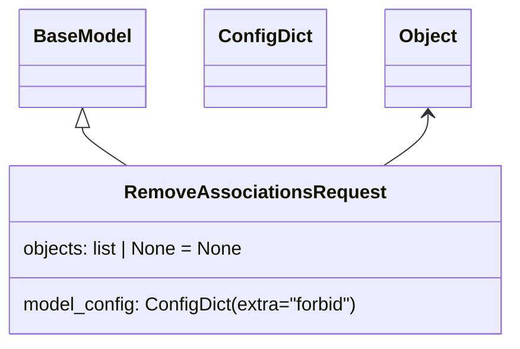

# Diagram: common/document_service/src/api/schemas/requests/remove_associations_request.py

> Auto-generated by Obscura crawlers

## Mermaid

### SVG

<svg id="container" width="435.7578125" xmlns="http://www.w3.org/2000/svg" class="classDiagram" height="294" viewBox="0 0 435.7578125 294" role="graphics-document document" aria-roledescription="class"><g><defs><marker id="container_class-aggregationStart" class="marker aggregation class" refX="18" refY="7" markerWidth="190" markerHeight="240" orient="auto"><path d="M 18,7 L9,13 L1,7 L9,1 Z"></path></marker></defs><defs><marker id="container_class-aggregationEnd" class="marker aggregation class" refX="1" refY="7" markerWidth="20" markerHeight="28" orient="auto"><path d="M 18,7 L9,13 L1,7 L9,1 Z"></path></marker></defs><defs><marker id="container_class-extensionStart" class="marker extension class" refX="18" refY="7" markerWidth="190" markerHeight="240" orient="auto"><path d="M 1,7 L18,13 V 1 Z"></path></marker></defs><defs><marker id="container_class-extensionEnd" class="marker extension class" refX="1" refY="7" markerWidth="20" markerHeight="28" orient="auto"><path d="M 1,1 V 13 L18,7 Z"></path></marker></defs><defs><marker id="container_class-compositionStart" class="marker composition class" refX="18" refY="7" markerWidth="190" markerHeight="240" orient="auto"><path d="M 18,7 L9,13 L1,7 L9,1 Z"></path></marker></defs><defs><marker id="container_class-compositionEnd" class="marker composition class" refX="1" refY="7" markerWidth="20" markerHeight="28" orient="auto"><path d="M 18,7 L9,13 L1,7 L9,1 Z"></path></marker></defs><defs><marker id="container_class-dependencyStart" class="marker dependency class" refX="6" refY="7" markerWidth="190" markerHeight="240" orient="auto"><path d="M 5,7 L9,13 L1,7 L9,1 Z"></path></marker></defs><defs><marker id="container_class-dependencyEnd" class="marker dependency class" refX="13" refY="7" markerWidth="20" markerHeight="28" orient="auto"><path d="M 18,7 L9,13 L14,7 L9,1 Z"></path></marker></defs><defs><marker id="container_class-lollipopStart" class="marker lollipop class" refX="13" refY="7" markerWidth="190" markerHeight="240" orient="auto"><circle stroke="black" fill="transparent" cx="7" cy="7" r="6"></circle></marker></defs><defs><marker id="container_class-lollipopEnd" class="marker lollipop class" refX="1" refY="7" markerWidth="190" markerHeight="240" orient="auto"><circle stroke="black" fill="transparent" cx="7" cy="7" r="6"></circle></marker></defs><g class="root"><g class="clusters"></g><g class="edgePaths"><path d="M74.582,109.25L74.582,110.542C74.582,111.833,74.582,114.417,80.737,119.875C86.893,125.333,99.203,133.667,105.359,137.833L111.514,142" id="id_BaseModel_RemoveAssociationsRequest_1" class="edge-thickness-normal edge-pattern-solid relation" style=";;;" data-edge="true" data-et="edge" data-id="id_BaseModel_RemoveAssociationsRequest_1" data-points="W3sieCI6NzQuNTgyMDMxMjUsInkiOjkyfSx7IngiOjc0LjU4MjAzMTI1LCJ5IjoxMTd9LHsieCI6MTExLjUxNDIxNTUyODM1MDUyLCJ5IjoxNDJ9XQ==" marker-start="url(#container_class-extensionStart)"></path><path d="M361.176,98L361.176,101.167C361.176,104.333,361.176,110.667,355.02,118C348.865,125.333,336.554,133.667,330.399,137.833L324.244,142" id="id_Object_RemoveAssociationsRequest_2" class="edge-thickness-normal edge-pattern-solid relation" style=";;;" data-edge="true" data-et="edge" data-id="id_Object_RemoveAssociationsRequest_2" data-points="W3sieCI6MzYxLjE3NTc4MTI1LCJ5Ijo5Mn0seyJ4IjozNjEuMTc1NzgxMjUsInkiOjExN30seyJ4IjozMjQuMjQzNTk2OTcxNjQ5NSwieSI6MTQyfV0=" marker-start="url(#container_class-dependencyStart)"></path></g><g class="edgeLabels"><g class="edgeLabel"><g class="label" data-id="id_BaseModel_RemoveAssociationsRequest_1" transform="translate(0, 0)"><foreignObject width="0" height="0">

</foreignObject></g></g><g class="edgeLabel"><g class="label" data-id="id_Object_RemoveAssociationsRequest_2" transform="translate(0, 0)"><foreignObject width="0" height="0">

</foreignObject></g></g></g><g class="nodes"><g class="node default" id="classId-BaseModel-0" transform="translate(74.58203125, 50)"><g class="basic label-container"><path d="M-52.078125 -42 L52.078125 -42 L52.078125 42 L-52.078125 42" stroke="none" stroke-width="0" fill="#ECECFF" style=""></path><path d="M-52.078125 -42 C-13.818507138854706 -42, 24.44111072229059 -42, 52.078125 -42 M-52.078125 -42 C-14.766743831987206 -42, 22.544637336025588 -42, 52.078125 -42 M52.078125 -42 C52.078125 -20.965121801726546, 52.078125 0.06975639654690724, 52.078125 42 M52.078125 -42 C52.078125 -17.267490320182382, 52.078125 7.465019359635235, 52.078125 42 M52.078125 42 C24.777515404222484 42, -2.523094191555032 42, -52.078125 42 M52.078125 42 C16.91907167893043 42, -18.239981642139142 42, -52.078125 42 M-52.078125 42 C-52.078125 14.80222010519784, -52.078125 -12.39555978960432, -52.078125 -42 M-52.078125 42 C-52.078125 13.478258275015385, -52.078125 -15.04348344996923, -52.078125 -42" stroke="#9370DB" stroke-width="1.3" fill="none" stroke-dasharray="0 0" style=""></path></g><g class="annotation-group text" transform="translate(0, -18)"></g><g class="label-group text" transform="translate(-40.078125, -18)"><g class="label" style="font-weight: bolder" transform="translate(0,-12)"><foreignObject width="80.15625" height="24">

BaseModel

</foreignObject></g></g><g class="members-group text" transform="translate(-40.078125, 30)"></g><g class="methods-group text" transform="translate(-40.078125, 60)"></g><g class="divider" style=""><path d="M-52.078125 6 C-15.795585778905476 6, 20.486953442189048 6, 52.078125 6 M-52.078125 6 C-23.218662044182388 6, 5.640800911635225 6, 52.078125 6" stroke="#9370DB" stroke-width="1.3" fill="none" stroke-dasharray="0 0" style=""></path></g><g class="divider" style=""><path d="M-52.078125 24 C-27.10599478984696 24, -2.1338645796939204 24, 52.078125 24 M-52.078125 24 C-17.818434299063156 24, 16.441256401873687 24, 52.078125 24" stroke="#9370DB" stroke-width="1.3" fill="none" stroke-dasharray="0 0" style=""></path></g></g><g class="node default" id="classId-ConfigDict-1" transform="translate(225.97265625, 50)"><g class="basic label-container"><path d="M-49.3125 -42 L49.3125 -42 L49.3125 42 L-49.3125 42" stroke="none" stroke-width="0" fill="#ECECFF" style=""></path><path d="M-49.3125 -42 C-19.309175442737292 -42, 10.694149114525416 -42, 49.3125 -42 M-49.3125 -42 C-20.32639219988507 -42, 8.659715600229859 -42, 49.3125 -42 M49.3125 -42 C49.3125 -11.450109025947153, 49.3125 19.099781948105694, 49.3125 42 M49.3125 -42 C49.3125 -15.714722434129992, 49.3125 10.570555131740015, 49.3125 42 M49.3125 42 C28.393661455106226 42, 7.474822910212453 42, -49.3125 42 M49.3125 42 C22.348433560736726 42, -4.615632878526547 42, -49.3125 42 M-49.3125 42 C-49.3125 16.957460229351586, -49.3125 -8.085079541296828, -49.3125 -42 M-49.3125 42 C-49.3125 9.730191544872689, -49.3125 -22.539616910254622, -49.3125 -42" stroke="#9370DB" stroke-width="1.3" fill="none" stroke-dasharray="0 0" style=""></path></g><g class="annotation-group text" transform="translate(0, -18)"></g><g class="label-group text" transform="translate(-37.3125, -18)"><g class="label" style="font-weight: bolder" transform="translate(0,-12)"><foreignObject width="74.625" height="24">

ConfigDict

</foreignObject></g></g><g class="members-group text" transform="translate(-37.3125, 30)"></g><g class="methods-group text" transform="translate(-37.3125, 60)"></g><g class="divider" style=""><path d="M-49.3125 6 C-13.225353094135322 6, 22.861793811729356 6, 49.3125 6 M-49.3125 6 C-24.09809692367504 6, 1.1163061526499192 6, 49.3125 6" stroke="#9370DB" stroke-width="1.3" fill="none" stroke-dasharray="0 0" style=""></path></g><g class="divider" style=""><path d="M-49.3125 24 C-19.71575977229842 24, 9.880980455403161 24, 49.3125 24 M-49.3125 24 C-26.534936794925674 24, -3.7573735898513476 24, 49.3125 24" stroke="#9370DB" stroke-width="1.3" fill="none" stroke-dasharray="0 0" style=""></path></g></g><g class="node default" id="classId-Object-2" transform="translate(361.17578125, 50)"><g class="basic label-container"><path d="M-35.890625 -42 L35.890625 -42 L35.890625 42 L-35.890625 42" stroke="none" stroke-width="0" fill="#ECECFF" style=""></path><path d="M-35.890625 -42 C-9.582398905105617 -42, 16.725827189788767 -42, 35.890625 -42 M-35.890625 -42 C-12.48053712413856 -42, 10.929550751722878 -42, 35.890625 -42 M35.890625 -42 C35.890625 -18.98820596921614, 35.890625 4.023588061567722, 35.890625 42 M35.890625 -42 C35.890625 -14.00219555803459, 35.890625 13.99560888393082, 35.890625 42 M35.890625 42 C20.448098854656124 42, 5.005572709312251 42, -35.890625 42 M35.890625 42 C20.635869535105122 42, 5.381114070210241 42, -35.890625 42 M-35.890625 42 C-35.890625 17.391610745167984, -35.890625 -7.216778509664032, -35.890625 -42 M-35.890625 42 C-35.890625 9.886445021237286, -35.890625 -22.22710995752543, -35.890625 -42" stroke="#9370DB" stroke-width="1.3" fill="none" stroke-dasharray="0 0" style=""></path></g><g class="annotation-group text" transform="translate(0, -18)"></g><g class="label-group text" transform="translate(-23.890625, -18)"><g class="label" style="font-weight: bolder" transform="translate(0,-12)"><foreignObject width="47.78125" height="24">

Object

</foreignObject></g></g><g class="members-group text" transform="translate(-23.890625, 30)"></g><g class="methods-group text" transform="translate(-23.890625, 60)"></g><g class="divider" style=""><path d="M-35.890625 6 C-16.486915520344052 6, 2.916793959311896 6, 35.890625 6 M-35.890625 6 C-16.451260192596557 6, 2.988104614806886 6, 35.890625 6" stroke="#9370DB" stroke-width="1.3" fill="none" stroke-dasharray="0 0" style=""></path></g><g class="divider" style=""><path d="M-35.890625 24 C-19.40793902475547 24, -2.9252530495109426 24, 35.890625 24 M-35.890625 24 C-12.099533224245732 24, 11.691558551508535 24, 35.890625 24" stroke="#9370DB" stroke-width="1.3" fill="none" stroke-dasharray="0 0" style=""></path></g></g><g class="node default" id="classId-RemoveAssociationsRequest-3" transform="translate(217.87890625, 214)"><g class="basic label-container"><path d="M-209.87890625 -72 L209.87890625 -72 L209.87890625 72 L-209.87890625 72" stroke="none" stroke-width="0" fill="#ECECFF" style=""></path><path d="M-209.87890625 -72 C-66.46309455230897 -72, 76.95271714538205 -72, 209.87890625 -72 M-209.87890625 -72 C-62.327017124633414 -72, 85.22487200073317 -72, 209.87890625 -72 M209.87890625 -72 C209.87890625 -29.902104431978827, 209.87890625 12.195791136042345, 209.87890625 72 M209.87890625 -72 C209.87890625 -26.25785637127027, 209.87890625 19.484287257459457, 209.87890625 72 M209.87890625 72 C83.90035809315152 72, -42.07819006369695 72, -209.87890625 72 M209.87890625 72 C116.45675620543906 72, 23.034606160878127 72, -209.87890625 72 M-209.87890625 72 C-209.87890625 26.038941132430928, -209.87890625 -19.922117735138144, -209.87890625 -72 M-209.87890625 72 C-209.87890625 29.386628639905283, -209.87890625 -13.226742720189435, -209.87890625 -72" stroke="#9370DB" stroke-width="1.3" fill="none" stroke-dasharray="0 0" style=""></path></g><g class="annotation-group text" transform="translate(0, -48)"></g><g class="label-group text" transform="translate(-105.0703125, -48)"><g class="label" style="font-weight: bolder" transform="translate(0,-12)"><foreignObject width="210.140625" height="24">

RemoveAssociationsRequest

</foreignObject></g></g><g class="members-group text" transform="translate(-197.87890625, 0)"><g class="label" style="" transform="translate(0,-12)"><foreignObject width="191.625" height="24">

objects: list | None = None

</foreignObject></g></g><g class="methods-group text" transform="translate(-197.87890625, 48)"><g class="label" style="" transform="translate(0,-12)"><foreignObject width="290.6875" height="24">

model_config: ConfigDict(extra="forbid")

</foreignObject></g></g><g class="divider" style=""><path d="M-209.87890625 -24 C-117.53533781015207 -24, -25.191769370304144 -24, 209.87890625 -24 M-209.87890625 -24 C-85.63497564250345 -24, 38.6089549649931 -24, 209.87890625 -24" stroke="#9370DB" stroke-width="1.3" fill="none" stroke-dasharray="0 0" style=""></path></g><g class="divider" style=""><path d="M-209.87890625 24 C-90.24499132197653 24, 29.388923606046944 24, 209.87890625 24 M-209.87890625 24 C-46.0477455873546 24, 117.7834150752908 24, 209.87890625 24" stroke="#9370DB" stroke-width="1.3" fill="none" stroke-dasharray="0 0" style=""></path></g></g></g></g></g></svg>
